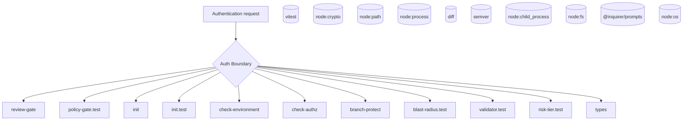
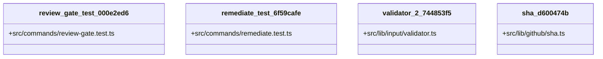
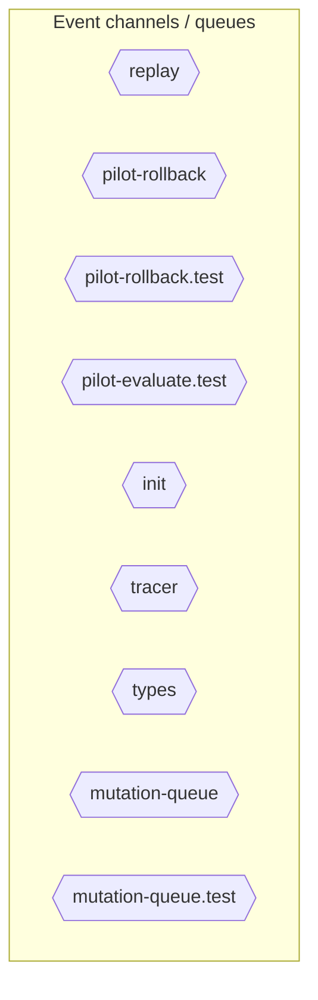
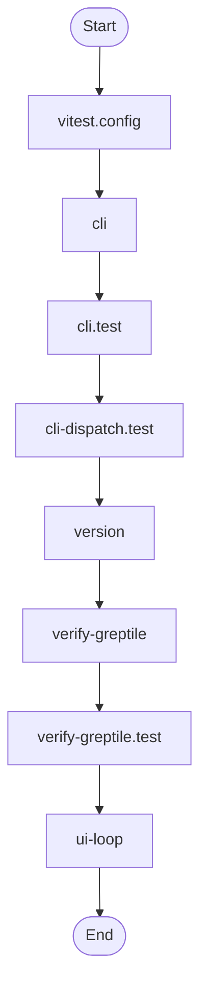
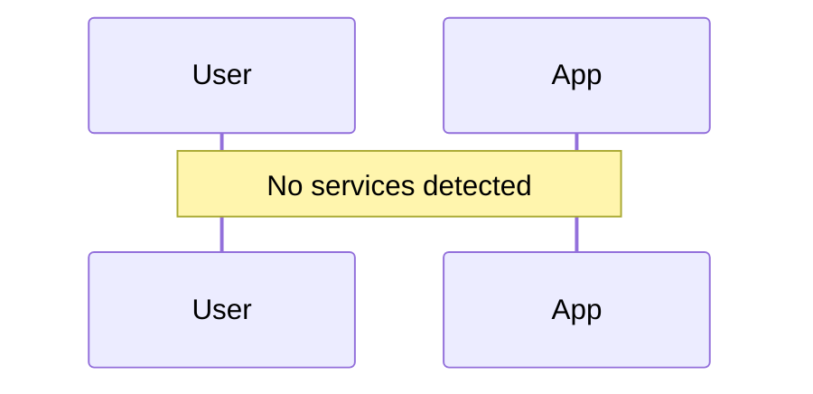
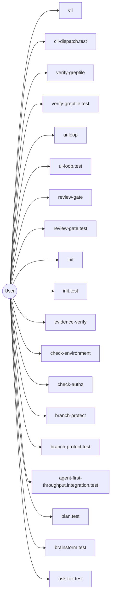

# Diagram Context Pack

Generated: 2026-03-03T13:38:48Z

## architecture

```mermaid
graph TD
  subgraph __cdb4ee2a["."]
    vitest_config_a9f1245e["vitest.config"]
  end
  subgraph src_25a66342["src"]
    cli_99bb8840["cli"]
    cli_test_4851f28b["cli.test"]
    cli_dispatch_test_54c9f17b["cli-dispatch.test"]
  end
  subgraph src_lib_91be6cfb["src/lib"]
    version_5ca4f385["version"]
  end
  subgraph src_commands_f0f9cc2d["src/commands"]
    verify_greptile_227190f7["verify-greptile"]
    verify_greptile_test_17404b05["verify-greptile.test"]
    ui_loop_11660889["ui-loop"]
    ui_loop_test_f0eabc42["ui-loop.test"]
    simulate_b9efe395["simulate"]
    silent_error_64e8c933["silent-error"]
    search_24193290["search"]
    search_test_0c66bc11["search.test"]
    risk_tier_807f33f9["risk-tier"]
    review_gate_09b579c4["review-gate"]
    review_gate_test_000e2ed6["review-gate.test"]
    replay_ac203c98["replay"]
    replay_test_935f7436["replay.test"]
    remediate_06b9c7fc["remediate"]
    remediate_test_6f59cafe["remediate.test"]
    prompt_gate_c5e9d207["prompt-gate"]
    prompt_gate_test_1a442b27["prompt-gate.test"]
    preflight_gate_c543e5ba["preflight-gate"]
    policy_gate_213f7313["policy-gate"]
    policy_gate_test_203a5261["policy-gate.test"]
    plan_gate_c2cf5008["plan-gate"]
    plan_gate_test_0c0192e6["plan-gate.test"]
    pilot_rollback_00c1f82c["pilot-rollback"]
    pilot_rollback_test_e61d5a2b["pilot-rollback.test"]
    pilot_evaluate_2045b1a1["pilot-evaluate"]
    pilot_evaluate_test_a2ac06fc["pilot-evaluate.test"]
    observability_gate_455f1f2f["observability-gate"]
    observability_gate_test_ca2979e0["observability-gate.test"]
    memory_gate_a577a506["memory-gate"]
    init_bb54068a["init"]
    init_test_cbba76a6["init.test"]
    index_context_de3ed39d["index-context"]
    index_context_test_1949ea6f["index-context.test"]
    gardener_9416a9df["gardener"]
    gardener_test_98f0b9a5["gardener.test"]
    gap_case_82e69111["gap-case"]
    gap_case_test_e32159fb["gap-case.test"]
    evidence_verify_3b73c290["evidence-verify"]
    evidence_verify_test_7373101d["evidence-verify.test"]
    diff_budget_9da0268d["diff-budget"]
    diff_budget_test_c0b72453["diff-budget.test"]
    context_ea7792a2["context"]
    context_test_57aad306["context.test"]
    check_environment_fe68d4be["check-environment"]
    check_environment_test_5fa29c35["check-environment.test"]
    check_authz_fee242b1["check-authz"]
    branch_protect_b9d345eb["branch-protect"]
    branch_protect_test_c8d80aab["branch-protect.test"]
    brainstorm_gate_1789ba44["brainstorm-gate"]
    blast_radius_f776a633["blast-radius"]
    blast_radius_test_045450fc["blast-radius.test"]
    automation_run_22331800["automation-run"]
    automation_run_test_7b21d905["automation-run.test"]
    agent_first_throughput_integration_test_dc677cc4["agent-first-throughput.integration.test"]
  end
  subgraph src_lib_workflow_7d547930["src/lib/workflow"]
    plan_64879f7d["plan"]
    plan_test_e7c3b920["plan.test"]
    brainstorm_e2e2381d["brainstorm"]
    brainstorm_test_78cf7a1e["brainstorm.test"]
  end
  subgraph src_lib_simulate_87a8be80["src/lib/simulate"]
    types_8d846022["types"]
  end
  subgraph src_lib_silent_error_26e972c0["src/lib/silent-error"]
    types_1_4ecdf56e["types"]
    detector_f2b3cbe4["detector"]
    detector_test_d10b3555["detector.test"]
  end
  subgraph src_lib_remediation_66ee2139["src/lib/remediation"]
    types_2_d9bc6e7a["types"]
    orchestrator_11376b7e["orchestrator"]
    orchestrator_test_18d2fe26["orchestrator.test"]
    finding_normalizer_13f1559c["finding-normalizer"]
    finding_normalizer_test_d4639bd8["finding-normalizer.test"]
  end
  subgraph src_lib_preflight_d75938f9["src/lib/preflight"]
    validator_f82af321["validator"]
    validator_test_b4b482f8["validator.test"]
    types_3_9675d69b["types"]
  end
  subgraph src_lib_replay_9cdd6ac4["src/lib/replay"]
    tracer_1e6243a2["tracer"]
    tracer_test_cb965d81["tracer.test"]
  end
  subgraph src_lib_policy_f3a0824d["src/lib/policy"]
    risk_tier_1_96b6ff91["risk-tier"]
    risk_tier_test_ae056367["risk-tier.test"]
    diff_budget_1_9f85eb1c["diff-budget"]
  end
  subgraph src_lib_plan_gate_b742698a["src/lib/plan-gate"]
    types_4_822d0f88["types"]
    detector_1_b37d288b["detector"]
  end
  subgraph src_lib_pilot_evaluation_f6cc358e["src/lib/pilot-evaluation"]
    types_5_f869ec4b["types"]
    metrics_capture_1d1a2c08["metrics-capture"]
  end
  subgraph src_lib_observability_ecdc7d70["src/lib/observability"]
    cardinality_ebef8aff["cardinality"]
    cardinality_test_c00e7edb["cardinality.test"]
  end
  subgraph src_lib_memory_273eb2dc["src/lib/memory"]
    validator_1_0c0621d8["validator"]
    validator_test_1_c5015ca0["validator.test"]
    types_6_1818fb91["types"]
    metrics_tracker_98cec29c["metrics-tracker"]
    metrics_tracker_test_3de156fa["metrics-tracker.test"]
    branch_enforcer_acb749cd["branch-enforcer"]
  end
  subgraph src_lib_input_456cc971["src/lib/input"]
    validator_2_744853f5["validator"]
    validator_test_2_8dbecf99["validator.test"]
    sanitize_af6a3bb0["sanitize"]
    sanitize_test_f3d34916["sanitize.test"]
  end
  subgraph src_lib_github_bad33b49["src/lib/github"]
    sha_d600474b["sha"]
    sha_test_5a5924fc["sha.test"]
    mutation_queue_ce5a530e["mutation-queue"]
    mutation_queue_test_10b599e8["mutation-queue.test"]
  end
```

## auth

```mermaid
flowchart TD
  Request["Authentication request"]
  Boundary{"Auth Boundary"}
  Request --> Boundary
  review_gate_09b579c4["review-gate"]
  Boundary --> review_gate_09b579c4
  policy_gate_test_203a5261["policy-gate.test"]
  Boundary --> policy_gate_test_203a5261
  init_bb54068a["init"]
  Boundary --> init_bb54068a
  init_test_cbba76a6["init.test"]
  Boundary --> init_test_cbba76a6
  check_environment_fe68d4be["check-environment"]
  Boundary --> check_environment_fe68d4be
  check_authz_fee242b1["check-authz"]
  Boundary --> check_authz_fee242b1
  branch_protect_b9d345eb["branch-protect"]
  Boundary --> branch_protect_b9d345eb
  blast_radius_test_045450fc["blast-radius.test"]
  Boundary --> blast_radius_test_045450fc
  validator_test_b4b482f8["validator.test"]
  Boundary --> validator_test_b4b482f8
  risk_tier_test_ae056367["risk-tier.test"]
  Boundary --> risk_tier_test_ae056367
  types_6_1818fb91["types"]
  Boundary --> types_6_1818fb91
  vitest_a9127f3d[("vitest")]
  node_crypto_879f6cbe[("node:crypto")]
  node_path_0e7d56ab[("node:path")]
  node_process_09240432[("node:process")]
  diff_df087996[("diff")]
  semver_50449d83[("semver")]
  node_child_process_cb73900b[("node:child_process")]
  node_fs_df6b52af[("node:fs")]
  _inquirer_prompts_21758d24[("@inquirer/prompts")]
  node_os_e9717731[("node:os")]
  classDef authNode fill:#7c3aed,color:#fff
```

## class

```mermaid
classDiagram
  class review_gate_test_000e2ed6 {
    +src/commands/review-gate.test.ts
  }
  class remediate_test_6f59cafe {
    +src/commands/remediate.test.ts
  }
  class validator_2_744853f5 {
    +src/lib/input/validator.ts
  }
  class sha_d600474b {
    +src/lib/github/sha.ts
  }
```

## database

```mermaid
flowchart TD
  UserRequest["User request"]
  Decision{Record exists?}
  cli_99bb8840["cli"]
  UserRequest --> cli_99bb8840
  cli_99bb8840 --> cli_99bb8840_result["result"]
  simulate_b9efe395["simulate"]
  UserRequest --> simulate_b9efe395
  simulate_b9efe395 --> simulate_b9efe395_result["result"]
  search_24193290["search"]
  UserRequest --> search_24193290
  search_24193290 --> search_24193290_result["result"]
  pilot_evaluate_2045b1a1["pilot-evaluate"]
  UserRequest --> pilot_evaluate_2045b1a1
  pilot_evaluate_2045b1a1 --> pilot_evaluate_2045b1a1_result["result"]
  pilot_evaluate_test_a2ac06fc["pilot-evaluate.test"]
  UserRequest --> pilot_evaluate_test_a2ac06fc
  pilot_evaluate_test_a2ac06fc --> pilot_evaluate_test_a2ac06fc_result["result"]
  init_bb54068a["init"]
  UserRequest --> init_bb54068a
  init_bb54068a --> init_bb54068a_result["result"]
  index_context_de3ed39d["index-context"]
  UserRequest --> index_context_de3ed39d
  index_context_de3ed39d --> index_context_de3ed39d_result["result"]
  context_ea7792a2["context"]
  UserRequest --> context_ea7792a2
  context_ea7792a2 --> context_ea7792a2_result["result"]
  context_test_57aad306["context.test"]
  UserRequest --> context_test_57aad306
  context_test_57aad306 --> context_test_57aad306_result["result"]
  types_8d846022["types"]
  UserRequest --> types_8d846022
  types_8d846022 --> types_8d846022_result["result"]
  validator_1_0c0621d8["validator"]
  UserRequest --> validator_1_0c0621d8
  validator_1_0c0621d8 --> validator_1_0c0621d8_result["result"]
  types_6_1818fb91["types"]
  UserRequest --> types_6_1818fb91
  types_6_1818fb91 --> types_6_1818fb91_result["result"]
  sanitize_af6a3bb0["sanitize"]
  UserRequest --> sanitize_af6a3bb0
  sanitize_af6a3bb0 --> sanitize_af6a3bb0_result["result"]
  classDef dbNode fill:#0ea5e9,color:#fff
  classDef decisionNode fill:#0284c7,color:#fff
```

## dependency

```mermaid
graph LR
  vitest_a9127f3d["vitest"] --> vitest_config_a9f1245e
  node_fs_df6b52af["node:fs"] --> cli_99bb8840
  node_path_0e7d56ab["node:path"] --> cli_99bb8840
  node_url_b54ed078["node:url"] --> cli_99bb8840
  node_crypto_879f6cbe["node:crypto"] --> cli_test_4851f28b
  node_fs_df6b52af["node:fs"] --> cli_test_4851f28b
  node_path_0e7d56ab["node:path"] --> cli_test_4851f28b
  node_url_b54ed078["node:url"] --> cli_test_4851f28b
  vitest_a9127f3d["vitest"] --> cli_test_4851f28b
  vitest_a9127f3d["vitest"] --> cli_dispatch_test_54c9f17b
  node_fs_df6b52af["node:fs"] --> version_5ca4f385
  node_path_0e7d56ab["node:path"] --> version_5ca4f385
  node_url_b54ed078["node:url"] --> version_5ca4f385
  node_crypto_879f6cbe["node:crypto"] --> verify_greptile_227190f7
  node_fs_df6b52af["node:fs"] --> verify_greptile_227190f7
  node_path_0e7d56ab["node:path"] --> verify_greptile_227190f7
  node_crypto_879f6cbe["node:crypto"] --> verify_greptile_test_17404b05
  node_fs_df6b52af["node:fs"] --> verify_greptile_test_17404b05
  node_os_e9717731["node:os"] --> verify_greptile_test_17404b05
  node_path_0e7d56ab["node:path"] --> verify_greptile_test_17404b05
  vitest_a9127f3d["vitest"] --> verify_greptile_test_17404b05
  node_child_process_cb73900b["node:child_process"] --> ui_loop_11660889
  node_crypto_879f6cbe["node:crypto"] --> ui_loop_11660889
  node_fs_df6b52af["node:fs"] --> ui_loop_11660889
  node_path_0e7d56ab["node:path"] --> ui_loop_11660889
  node_url_b54ed078["node:url"] --> ui_loop_11660889
  node_child_process_cb73900b["node:child_process"] --> ui_loop_test_f0eabc42
  node_fs_df6b52af["node:fs"] --> ui_loop_test_f0eabc42
  vitest_a9127f3d["vitest"] --> ui_loop_test_f0eabc42
  node_crypto_879f6cbe["node:crypto"] --> simulate_b9efe395
  node_fs_df6b52af["node:fs"] --> simulate_b9efe395
  node_path_0e7d56ab["node:path"] --> simulate_b9efe395
  node_child_process_cb73900b["node:child_process"] --> search_24193290
  node_path_0e7d56ab["node:path"] --> search_24193290
  vitest_a9127f3d["vitest"] --> search_test_0c66bc11
  node_child_process_cb73900b["node:child_process"] --> search_test_0c66bc11
  vitest_a9127f3d["vitest"] --> review_gate_test_000e2ed6
  vitest_a9127f3d["vitest"] --> replay_test_935f7436
  node_child_process_cb73900b["node:child_process"] --> remediate_06b9c7fc
  node_crypto_879f6cbe["node:crypto"] --> remediate_06b9c7fc
  node_path_0e7d56ab["node:path"] --> remediate_06b9c7fc
  vitest_a9127f3d["vitest"] --> remediate_test_6f59cafe
  node_fs_df6b52af["node:fs"] --> remediate_test_6f59cafe
  node_child_process_cb73900b["node:child_process"] --> remediate_test_6f59cafe
  node_fs_df6b52af["node:fs"] --> prompt_gate_c5e9d207
  node_path_0e7d56ab["node:path"] --> prompt_gate_c5e9d207
  vitest_a9127f3d["vitest"] --> prompt_gate_test_1a442b27
  vitest_a9127f3d["vitest"] --> policy_gate_test_203a5261
  node_fs_df6b52af["node:fs"] --> plan_gate_test_0c0192e6
  node_path_0e7d56ab["node:path"] --> plan_gate_test_0c0192e6
  vitest_a9127f3d["vitest"] --> plan_gate_test_0c0192e6
  node_crypto_879f6cbe["node:crypto"] --> pilot_rollback_00c1f82c
  node_path_0e7d56ab["node:path"] --> pilot_rollback_00c1f82c
  node_fs_df6b52af["node:fs"] --> pilot_rollback_test_e61d5a2b
  node_path_0e7d56ab["node:path"] --> pilot_rollback_test_e61d5a2b
  vitest_a9127f3d["vitest"] --> pilot_rollback_test_e61d5a2b
  node_fs_df6b52af["node:fs"] --> pilot_rollback_test_e61d5a2b
  node_fs_df6b52af["node:fs"] --> pilot_rollback_test_e61d5a2b
  node_fs_df6b52af["node:fs"] --> pilot_rollback_test_e61d5a2b
  node_fs_df6b52af["node:fs"] --> pilot_evaluate_2045b1a1
  node_path_0e7d56ab["node:path"] --> pilot_evaluate_2045b1a1
  node_fs_df6b52af["node:fs"] --> pilot_evaluate_test_a2ac06fc
  node_path_0e7d56ab["node:path"] --> pilot_evaluate_test_a2ac06fc
  vitest_a9127f3d["vitest"] --> pilot_evaluate_test_a2ac06fc
  node_fs_df6b52af["node:fs"] --> pilot_evaluate_test_a2ac06fc
  vitest_a9127f3d["vitest"] --> observability_gate_test_ca2979e0
  node_crypto_879f6cbe["node:crypto"] --> init_bb54068a
  node_path_0e7d56ab["node:path"] --> init_bb54068a
  node_process_09240432["node:process"] --> init_bb54068a
  diff_df087996["diff"] --> init_bb54068a
  semver_50449d83["semver"] --> init_bb54068a
  node_child_process_cb73900b["node:child_process"] --> init_bb54068a
  node_fs_df6b52af["node:fs"] --> init_bb54068a
  node_fs_df6b52af["node:fs"] --> init_bb54068a
  node_path_0e7d56ab["node:path"] --> init_bb54068a
  node_child_process_cb73900b["node:child_process"] --> init_bb54068a
  _inquirer_prompts_21758d24["@inquirer/prompts"] --> init_bb54068a
  node_fs_df6b52af["node:fs"] --> init_test_cbba76a6
  node_os_e9717731["node:os"] --> init_test_cbba76a6
  node_path_0e7d56ab["node:path"] --> init_test_cbba76a6
  vitest_a9127f3d["vitest"] --> init_test_cbba76a6
  node_fs_df6b52af["node:fs"] --> init_test_cbba76a6
  node_fs_df6b52af["node:fs"] --> init_test_cbba76a6
  node_fs_df6b52af["node:fs"] --> init_test_cbba76a6
  node_fs_df6b52af["node:fs"] --> init_test_cbba76a6
  node_fs_df6b52af["node:fs"] --> init_test_cbba76a6
  node_fs_df6b52af["node:fs"] --> init_test_cbba76a6
  node_fs_df6b52af["node:fs"] --> init_test_cbba76a6
  node_fs_df6b52af["node:fs"] --> init_test_cbba76a6
  node_fs_df6b52af["node:fs"] --> init_test_cbba76a6
  node_fs_df6b52af["node:fs"] --> init_test_cbba76a6
  node_fs_df6b52af["node:fs"] --> init_test_cbba76a6
  node_fs_df6b52af["node:fs"] --> init_test_cbba76a6
  node_fs_df6b52af["node:fs"] --> init_test_cbba76a6
  node_fs_df6b52af["node:fs"] --> init_test_cbba76a6
  node_fs_df6b52af["node:fs"] --> init_test_cbba76a6
  node_fs_df6b52af["node:fs"] --> init_test_cbba76a6
  node_fs_df6b52af["node:fs"] --> init_test_cbba76a6
  node_fs_df6b52af["node:fs"] --> init_test_cbba76a6
  node_fs_df6b52af["node:fs"] --> init_test_cbba76a6
  node_fs_df6b52af["node:fs"] --> init_test_cbba76a6
  node_fs_df6b52af["node:fs"] --> init_test_cbba76a6
  node_fs_df6b52af["node:fs"] --> init_test_cbba76a6
  node_fs_df6b52af["node:fs"] --> init_test_cbba76a6
  node_fs_df6b52af["node:fs"] --> index_context_de3ed39d
  node_path_0e7d56ab["node:path"] --> index_context_de3ed39d
  node_os_e9717731["node:os"] --> index_context_test_1949ea6f
  node_path_0e7d56ab["node:path"] --> index_context_test_1949ea6f
  vitest_a9127f3d["vitest"] --> index_context_test_1949ea6f
  node_fs_df6b52af["node:fs"] --> gardener_9416a9df
  node_path_0e7d56ab["node:path"] --> gardener_9416a9df
  node_path_0e7d56ab["node:path"] --> gardener_test_98f0b9a5
  vitest_a9127f3d["vitest"] --> gardener_test_98f0b9a5
  node_fs_df6b52af["node:fs"] --> gap_case_82e69111
  node_path_0e7d56ab["node:path"] --> gap_case_82e69111
  node_fs_df6b52af["node:fs"] --> gap_case_test_e32159fb
  node_path_0e7d56ab["node:path"] --> gap_case_test_e32159fb
  vitest_a9127f3d["vitest"] --> gap_case_test_e32159fb
  node_fs_df6b52af["node:fs"] --> evidence_verify_3b73c290
  node_path_0e7d56ab["node:path"] --> evidence_verify_3b73c290
  node_fs_df6b52af["node:fs"] --> evidence_verify_test_7373101d
  node_os_e9717731["node:os"] --> evidence_verify_test_7373101d
  node_path_0e7d56ab["node:path"] --> evidence_verify_test_7373101d
  vitest_a9127f3d["vitest"] --> evidence_verify_test_7373101d
  node_child_process_cb73900b["node:child_process"] --> diff_budget_9da0268d
  node_fs_df6b52af["node:fs"] --> diff_budget_9da0268d
  vitest_a9127f3d["vitest"] --> diff_budget_test_c0b72453
  node_child_process_cb73900b["node:child_process"] --> diff_budget_test_c0b72453
  node_fs_df6b52af["node:fs"] --> diff_budget_test_c0b72453
  node_path_0e7d56ab["node:path"] --> context_ea7792a2
  node_path_0e7d56ab["node:path"] --> context_test_57aad306
  vitest_a9127f3d["vitest"] --> context_test_57aad306
  node_child_process_cb73900b["node:child_process"] --> check_environment_fe68d4be
  node_crypto_879f6cbe["node:crypto"] --> check_environment_fe68d4be
  node_fs_df6b52af["node:fs"] --> check_environment_fe68d4be
  node_path_0e7d56ab["node:path"] --> check_environment_fe68d4be
  semver_50449d83["semver"] --> check_environment_fe68d4be
  node_fs_df6b52af["node:fs"] --> check_environment_test_5fa29c35
  node_os_e9717731["node:os"] --> check_environment_test_5fa29c35
  node_path_0e7d56ab["node:path"] --> check_environment_test_5fa29c35
  vitest_a9127f3d["vitest"] --> check_environment_test_5fa29c35
  node_child_process_cb73900b["node:child_process"] --> check_environment_test_5fa29c35
  node_child_process_cb73900b["node:child_process"] --> check_environment_test_5fa29c35
  node_child_process_cb73900b["node:child_process"] --> check_environment_test_5fa29c35
  node_fs_df6b52af["node:fs"] --> check_authz_fee242b1
  node_path_0e7d56ab["node:path"] --> check_authz_fee242b1
  vitest_a9127f3d["vitest"] --> branch_protect_test_c8d80aab
  node_fs_df6b52af["node:fs"] --> blast_radius_test_045450fc
  node_os_e9717731["node:os"] --> blast_radius_test_045450fc
  node_path_0e7d56ab["node:path"] --> blast_radius_test_045450fc
  vitest_a9127f3d["vitest"] --> blast_radius_test_045450fc
  node_path_0e7d56ab["node:path"] --> automation_run_22331800
  node_os_e9717731["node:os"] --> automation_run_test_7b21d905
  node_path_0e7d56ab["node:path"] --> automation_run_test_7b21d905
  vitest_a9127f3d["vitest"] --> automation_run_test_7b21d905
  node_child_process_cb73900b["node:child_process"] --> agent_first_throughput_integration_test_dc677cc4
  node_fs_df6b52af["node:fs"] --> agent_first_throughput_integration_test_dc677cc4
  node_path_0e7d56ab["node:path"] --> agent_first_throughput_integration_test_dc677cc4
  vitest_a9127f3d["vitest"] --> agent_first_throughput_integration_test_dc677cc4
  node_path_0e7d56ab["node:path"] --> plan_64879f7d
  node_path_0e7d56ab["node:path"] --> plan_test_e7c3b920
  vitest_a9127f3d["vitest"] --> plan_test_e7c3b920
  node_path_0e7d56ab["node:path"] --> brainstorm_e2e2381d
  node_fs_df6b52af["node:fs"] --> brainstorm_test_78cf7a1e
  node_path_0e7d56ab["node:path"] --> brainstorm_test_78cf7a1e
  vitest_a9127f3d["vitest"] --> brainstorm_test_78cf7a1e
  node_fs_df6b52af["node:fs"] --> detector_f2b3cbe4
  node_path_0e7d56ab["node:path"] --> detector_f2b3cbe4
  node_fs_df6b52af["node:fs"] --> detector_test_d10b3555
  node_os_e9717731["node:os"] --> detector_test_d10b3555
  node_path_0e7d56ab["node:path"] --> detector_test_d10b3555
  vitest_a9127f3d["vitest"] --> detector_test_d10b3555
  vitest_a9127f3d["vitest"] --> orchestrator_test_18d2fe26
  vitest_a9127f3d["vitest"] --> finding_normalizer_test_d4639bd8
  node_fs_df6b52af["node:fs"] --> validator_f82af321
  node_path_0e7d56ab["node:path"] --> validator_f82af321
  node_fs_df6b52af["node:fs"] --> validator_test_b4b482f8
  node_os_e9717731["node:os"] --> validator_test_b4b482f8
  node_path_0e7d56ab["node:path"] --> validator_test_b4b482f8
  vitest_a9127f3d["vitest"] --> validator_test_b4b482f8
  node_crypto_879f6cbe["node:crypto"] --> tracer_1e6243a2
  node_fs_df6b52af["node:fs"] --> tracer_1e6243a2
  node_path_0e7d56ab["node:path"] --> tracer_1e6243a2
  node_fs_df6b52af["node:fs"] --> tracer_1e6243a2
  vitest_a9127f3d["vitest"] --> tracer_test_cb965d81
  picomatch_0bf97c7b["picomatch"] --> risk_tier_1_96b6ff91
  vitest_a9127f3d["vitest"] --> risk_tier_test_ae056367
  node_fs_df6b52af["node:fs"] --> detector_1_b37d288b
  node_path_0e7d56ab["node:path"] --> detector_1_b37d288b
  node_fs_df6b52af["node:fs"] --> metrics_capture_1d1a2c08
  node_path_0e7d56ab["node:path"] --> metrics_capture_1d1a2c08
  vitest_a9127f3d["vitest"] --> cardinality_test_c00e7edb
  node_fs_df6b52af["node:fs"] --> validator_1_0c0621d8
  node_path_0e7d56ab["node:path"] --> validator_1_0c0621d8
  node_fs_df6b52af["node:fs"] --> validator_test_1_c5015ca0
  node_os_e9717731["node:os"] --> validator_test_1_c5015ca0
  node_path_0e7d56ab["node:path"] --> validator_test_1_c5015ca0
  vitest_a9127f3d["vitest"] --> validator_test_1_c5015ca0
  node_fs_df6b52af["node:fs"] --> metrics_tracker_98cec29c
  node_path_0e7d56ab["node:path"] --> metrics_tracker_98cec29c
  node_fs_df6b52af["node:fs"] --> metrics_tracker_test_3de156fa
  node_os_e9717731["node:os"] --> metrics_tracker_test_3de156fa
  node_path_0e7d56ab["node:path"] --> metrics_tracker_test_3de156fa
  vitest_a9127f3d["vitest"] --> metrics_tracker_test_3de156fa
  node_child_process_cb73900b["node:child_process"] --> branch_enforcer_acb749cd
  node_fs_df6b52af["node:fs"] --> branch_enforcer_acb749cd
  node_path_0e7d56ab["node:path"] --> branch_enforcer_acb749cd
  node_fs_df6b52af["node:fs"] --> validator_2_744853f5
  node_path_0e7d56ab["node:path"] --> validator_2_744853f5
  node_os_e9717731["node:os"] --> validator_test_2_8dbecf99
  node_path_0e7d56ab["node:path"] --> validator_test_2_8dbecf99
  vitest_a9127f3d["vitest"] --> validator_test_2_8dbecf99
  vitest_a9127f3d["vitest"] --> sanitize_test_f3d34916
  vitest_a9127f3d["vitest"] --> sha_test_5a5924fc
  vitest_a9127f3d["vitest"] --> mutation_queue_test_10b599e8
  style vitest_a9127f3d fill:#f59e0b,color:#fff
  style node_fs_df6b52af fill:#f59e0b,color:#fff
  style node_path_0e7d56ab fill:#f59e0b,color:#fff
  style node_url_b54ed078 fill:#f59e0b,color:#fff
  style node_crypto_879f6cbe fill:#f59e0b,color:#fff
  style node_os_e9717731 fill:#f59e0b,color:#fff
  style node_child_process_cb73900b fill:#f59e0b,color:#fff
  style node_process_09240432 fill:#f59e0b,color:#fff
  style diff_df087996 fill:#f59e0b,color:#fff
  style semver_50449d83 fill:#f59e0b,color:#fff
  style _inquirer_prompts_21758d24 fill:#f59e0b,color:#fff
  style picomatch_0bf97c7b fill:#f59e0b,color:#fff
```

## events

```mermaid
flowchart TD
  subgraph Channels["Event channels / queues"]
    replay_ac203c98{{"replay"}}
    pilot_rollback_00c1f82c{{"pilot-rollback"}}
    pilot_rollback_test_e61d5a2b{{"pilot-rollback.test"}}
    pilot_evaluate_test_a2ac06fc{{"pilot-evaluate.test"}}
    init_bb54068a{{"init"}}
    tracer_1e6243a2{{"tracer"}}
    types_5_f869ec4b{{"types"}}
    mutation_queue_ce5a530e{{"mutation-queue"}}
    mutation_queue_test_10b599e8{{"mutation-queue.test"}}
  end
  classDef eventNode fill:#db2777,color:#fff
```

## flow

```mermaid
flowchart TD
  Start(["Start"])
  vitest_config_a9f1245e["vitest.config"]
  Start --> vitest_config_a9f1245e
  cli_99bb8840["cli"]
  vitest_config_a9f1245e --> cli_99bb8840
  cli_test_4851f28b["cli.test"]
  cli_99bb8840 --> cli_test_4851f28b
  cli_dispatch_test_54c9f17b["cli-dispatch.test"]
  cli_test_4851f28b --> cli_dispatch_test_54c9f17b
  version_5ca4f385["version"]
  cli_dispatch_test_54c9f17b --> version_5ca4f385
  verify_greptile_227190f7["verify-greptile"]
  version_5ca4f385 --> verify_greptile_227190f7
  verify_greptile_test_17404b05["verify-greptile.test"]
  verify_greptile_227190f7 --> verify_greptile_test_17404b05
  ui_loop_11660889["ui-loop"]
  verify_greptile_test_17404b05 --> ui_loop_11660889
  End(["End"])
  ui_loop_11660889 --> End
```

## security

```mermaid
flowchart TD
  Untrusted["Untrusted input"]
  cli_99bb8840["cli"]
  Untrusted --> cli_99bb8840
  cli_dispatch_test_54c9f17b["cli-dispatch.test"]
  Untrusted --> cli_dispatch_test_54c9f17b
  verify_greptile_227190f7["verify-greptile"]
  Untrusted --> verify_greptile_227190f7
  verify_greptile_test_17404b05["verify-greptile.test"]
  Untrusted --> verify_greptile_test_17404b05
  search_test_0c66bc11["search.test"]
  Untrusted --> search_test_0c66bc11
  risk_tier_807f33f9["risk-tier"]
  Untrusted --> risk_tier_807f33f9
  review_gate_09b579c4["review-gate"]
  Untrusted --> review_gate_09b579c4
  review_gate_test_000e2ed6["review-gate.test"]
  Untrusted --> review_gate_test_000e2ed6
  preflight_gate_c543e5ba["preflight-gate"]
  Untrusted --> preflight_gate_c543e5ba
  policy_gate_213f7313["policy-gate"]
  Untrusted --> policy_gate_213f7313
  policy_gate_test_203a5261["policy-gate.test"]
  Untrusted --> policy_gate_test_203a5261
  init_bb54068a["init"]
  Untrusted --> init_bb54068a
  init_test_cbba76a6["init.test"]
  Untrusted --> init_test_cbba76a6
  evidence_verify_3b73c290["evidence-verify"]
  Untrusted --> evidence_verify_3b73c290
  evidence_verify_test_7373101d["evidence-verify.test"]
  Untrusted --> evidence_verify_test_7373101d
  diff_budget_9da0268d["diff-budget"]
  Untrusted --> diff_budget_9da0268d
  check_environment_fe68d4be["check-environment"]
  Untrusted --> check_environment_fe68d4be
  check_environment_test_5fa29c35["check-environment.test"]
  Untrusted --> check_environment_test_5fa29c35
  check_authz_fee242b1["check-authz"]
  Untrusted --> check_authz_fee242b1
  agent_first_throughput_integration_test_dc677cc4["agent-first-throughput.integration.test"]
  Untrusted --> agent_first_throughput_integration_test_dc677cc4
  types_8d846022["types"]
  Untrusted --> types_8d846022
  orchestrator_11376b7e["orchestrator"]
  Untrusted --> orchestrator_11376b7e
  validator_f82af321["validator"]
  Untrusted --> validator_f82af321
  tracer_test_cb965d81["tracer.test"]
  Untrusted --> tracer_test_cb965d81
  risk_tier_1_96b6ff91["risk-tier"]
  Untrusted --> risk_tier_1_96b6ff91
  risk_tier_test_ae056367["risk-tier.test"]
  Untrusted --> risk_tier_test_ae056367
  diff_budget_1_9f85eb1c["diff-budget"]
  Untrusted --> diff_budget_1_9f85eb1c
  sanitize_test_f3d34916["sanitize.test"]
  Untrusted --> sanitize_test_f3d34916
  branch_protect_b9d345eb["branch-protect"]
  Untrusted --> branch_protect_b9d345eb
  blast_radius_test_045450fc["blast-radius.test"]
  Untrusted --> blast_radius_test_045450fc
  validator_test_b4b482f8["validator.test"]
  Untrusted --> validator_test_b4b482f8
  types_6_1818fb91["types"]
  Untrusted --> types_6_1818fb91
  ui_loop_11660889["ui-loop"]
  Untrusted --> ui_loop_11660889
  branch_protect_test_c8d80aab["branch-protect.test"]
  Untrusted --> branch_protect_test_c8d80aab
  finding_normalizer_13f1559c["finding-normalizer"]
  Untrusted --> finding_normalizer_13f1559c
  sanitize_af6a3bb0["sanitize"]
  Untrusted --> sanitize_af6a3bb0
  sha_d600474b["sha"]
  Untrusted --> sha_d600474b
  sha_test_5a5924fc["sha.test"]
  Untrusted --> sha_test_5a5924fc
  mutation_queue_ce5a530e["mutation-queue"]
  Untrusted --> mutation_queue_ce5a530e
  mutation_queue_test_10b599e8["mutation-queue.test"]
  Untrusted --> mutation_queue_test_10b599e8
  classDef securityNode fill:#dc2626,color:#fff
```

## sequence

```mermaid
sequenceDiagram
  Note over User,App: No services detected
```

## user

```mermaid
flowchart LR
  User(("User"))
  cli_99bb8840["cli"]
  User --> cli_99bb8840
  cli_dispatch_test_54c9f17b["cli-dispatch.test"]
  User --> cli_dispatch_test_54c9f17b
  verify_greptile_227190f7["verify-greptile"]
  User --> verify_greptile_227190f7
  verify_greptile_test_17404b05["verify-greptile.test"]
  User --> verify_greptile_test_17404b05
  ui_loop_11660889["ui-loop"]
  User --> ui_loop_11660889
  ui_loop_test_f0eabc42["ui-loop.test"]
  User --> ui_loop_test_f0eabc42
  review_gate_09b579c4["review-gate"]
  User --> review_gate_09b579c4
  review_gate_test_000e2ed6["review-gate.test"]
  User --> review_gate_test_000e2ed6
  init_bb54068a["init"]
  User --> init_bb54068a
  init_test_cbba76a6["init.test"]
  User --> init_test_cbba76a6
  evidence_verify_3b73c290["evidence-verify"]
  User --> evidence_verify_3b73c290
  check_environment_fe68d4be["check-environment"]
  User --> check_environment_fe68d4be
  check_authz_fee242b1["check-authz"]
  User --> check_authz_fee242b1
  branch_protect_b9d345eb["branch-protect"]
  User --> branch_protect_b9d345eb
  branch_protect_test_c8d80aab["branch-protect.test"]
  User --> branch_protect_test_c8d80aab
  agent_first_throughput_integration_test_dc677cc4["agent-first-throughput.integration.test"]
  User --> agent_first_throughput_integration_test_dc677cc4
  plan_test_e7c3b920["plan.test"]
  User --> plan_test_e7c3b920
  brainstorm_test_78cf7a1e["brainstorm.test"]
  User --> brainstorm_test_78cf7a1e
  risk_tier_test_ae056367["risk-tier.test"]
  User --> risk_tier_test_ae056367
  classDef userNode fill:#16a34a,color:#fff
```

