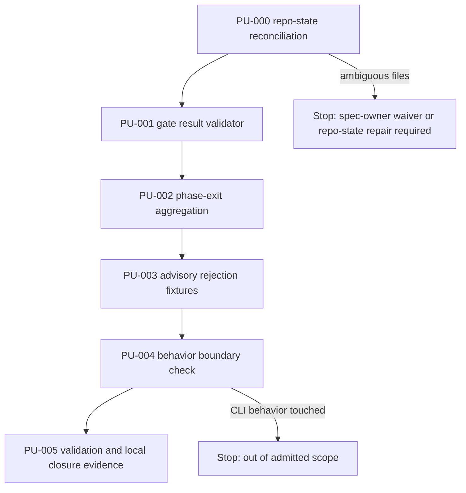
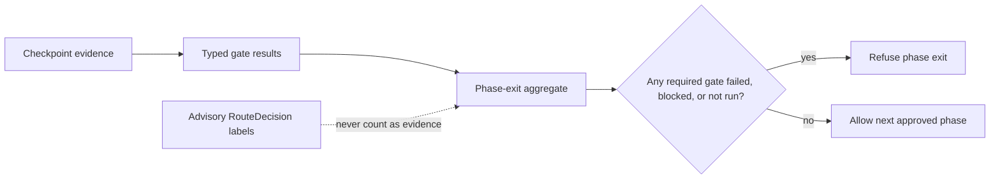

# JSC-311 HE Phase-Exit Evidence Gates Plan

## Table of Contents

- [Command Summary](#command-summary)
- [Objective](#objective)
- [Source Contract](#source-contract)
- [Scope and Boundaries](#scope-and-boundaries)
- [Current State / Evidence](#current-state--evidence)
- [PU-000 Execution Evidence](#pu-000-execution-evidence)
- [Phase Work Execution Evidence](#phase-work-execution-evidence)
- [Implementation Strategy](#implementation-strategy)
- [Work Units](#work-units)
- [Dependencies and Sequencing](#dependencies-and-sequencing)
- [Validation Gates](#validation-gates)
- [Technical Review Findings](#technical-review-findings)
- [Review Plan](#review-plan)
- [Rollback Plan](#rollback-plan)
- [Risk Register](#risk-register)
- [Observability and Evidence](#observability-and-evidence)
- [Visual References / Diagrams](#visual-references--diagrams)
- [Accessibility and Operator Ergonomics](#accessibility-and-operator-ergonomics)
- [Open Questions](#open-questions)
- [Final Decision](#final-decision)
- [Appendix A. Harness Metadata / Traceability](#appendix-a-harness-metadata--traceability)
- [Appendix B. Linear / Tracker Handoff](#appendix-b-linear--tracker-handoff)
- [Appendix C. Review Outcomes](#appendix-c-review-outcomes)
- [No-Fog Gate](#no-fog-gate)

## Command Summary

Post-merge status: PR #247 landed the local internal contract and worktree
environment hardening on main as 8ba56537 JSC-311: Harden worktree environment
baseline (#247). The active remaining gaps are later integration slices: expose
phase-exit evidence where operators see it, adapt live review and validation
outputs into HeGateResult/v1, reconcile live tracker state, and prove the
intended fresh-worktree flow end to end before relying on it as an operator
guarantee.

BLUF: This plan gives the operator, developer, and future agent a bounded, proof-first implementation path for the JSC-311 phase-exit evidence-gates spec in `coding-harness`: first reconcile the current Git/filesystem disagreement around prior `he-phase-exit` files and the plan artifact itself, then add a pure local `HeGateResult/v1` validator and `HePhaseExit/v1` aggregator with fixture-backed tests. The work matters because Harness Engineering phases must not become commit-ready from route labels, recovery summaries, memory, role names, or chat prose; only typed gate evidence may satisfy required gates. Execution is deliberately narrow: no public CLI, no `harness next` behavior change, no tracker mutation, no external services, and no commit/push/release work. The PU-000 blocker was resolved by identifying that the shell path `/Users/jamiecraik/dev/coding-harness` resolves Git operations to `/private/tmp/coding-harness-skill-pr`; source implementation and validation therefore proceeded in that Git-resolved worktree. Handoff after this plan remains `he-work` for the local evaluator slice only.

Decision Needed: none for the merged internal contract. Future implementation
should create or reconcile a narrow follow-up slice for operator-visible
phase-exit evidence and adapters before adding more source behavior.

Top Risks: Git reports inaccessible `he-phase-exit` paths and an agent treats them as usable source; Git omits the live plan artifact while reporting nonexistent older artifacts; advisory metadata is accepted as gate evidence; conflicting or malformed gate payloads pass or throw instead of failing closed; scope expands into CLI, tracker, cockpit, or external-service work before the local contract is proven.

Next Action: create or update the follow-up spec/plan for phase-exit evidence
visibility and adapters into `HeGateResult/v1`. Do not replay the merged
internal contract slice, and do not mutate Linear, GitHub, CI, Slack, release
surfaces, staging, merge, deploy, or release without explicit authority.

## Objective

Implement the local JSC-311 phase-exit evidence contract as a deterministic
TypeScript decision boundary. The finished slice must validate gate result
payloads, aggregate required gate evidence, fail closed on missing or bad
evidence, and provide deterministic blocker summaries that future closeout
notes can quote.

This plan is not a delivery claim. It is an execution contract for the first
source/test slice admitted by the spec.

## Source Contract

Canonical source:

- `.harness/specs/2026-05-13-jsc-311-he-phase-exit-evidence-gates-spec.md`

Binding source requirements:

| Source IDs | Plan Coverage |
| --- | --- |
| FR-001, FR-002, FR-003, FR-004 | PU-001 defines and validates `HeGateResult/v1`. |
| FR-005, FR-006, FR-007, FR-008 | PU-002 aggregates required gate results into `HePhaseExit/v1`. |
| FR-009, FR-010, FR-014 | PU-003 adds fixtures rejecting advisory labels, recovery state, role names, and cross-gate substitution. |
| FR-011, FR-012 | PU-004 verifies the slice stays local and preserves `harness-decision/v1` / `harness next` behavior. |
| FR-013, NFR-008, SA-014 | PU-001 and PU-003 test malformed arrays as validation failures, not uncaught exceptions. |
| FR-015, SA-015 | PU-002 and PU-003 fail closed on duplicate or conflicting required gate results. |
| FR-016, SA-016 | PU-002 requires explicit phase contract input for required gates. |
| FR-017, SA-013 | PU-000 reconciles Git/filesystem state before coding. |
| FR-018, NFR-010, SA-019 | PU-002 and PU-003 produce deterministic, accessible blocker summary text. |
| SA-018 | PU-005 separates local implementation proof from PR, CI, review, commit, push, and tracker closure proof. |

## Scope and Boundaries

Allowed implementation paths:

- `src/lib/decision/he-phase-exit-core.ts`
- `src/lib/decision/he-phase-exit.ts`
- `src/lib/decision/he-phase-exit.test.ts`
- Adjacent local test fixtures under `src/lib/decision/**` if needed.
- This plan and directly associated `.harness/specs/**` evidence updates when
  validation outcomes change.

Allowed inspection paths:

- `AGENTS.md`
- `CODESTYLE.md`
- `codestyle/**`
- `package.json`
- `src/lib/decision/harness-decision.ts`
- `src/commands/next.ts`
- `src/commands/review-gate-core.ts`
- `.harness/specs/2026-05-13-jsc-311-he-phase-exit-evidence-gates-spec.md`
- `.harness/specs/2026-05-13-JSC-311-recovery-capsule-cockpit-spec.md`

Forbidden in this plan:

- Public CLI command additions.
- `harness next` behavior or output changes.
- Live Linear, GitHub, CircleCI, CodeRabbit, Slack, MCP, plugin, release, or
  Project Brain mutation.
- Commit, push, merge, staging, release, package publish, or deployment.
- Broad Runtime Card, Closeout Guardian, cockpit, telemetry, or plugin UI work.
- Destructive Git operations or cleanup of unrelated dirty files.

## Current State / Evidence

Verified current evidence:

| Evidence | Status | Impact |
| --- | --- | --- |
| `AGENTS.md` states RouteDecision labels are advisory and JSC-311 phase-exit logic must refuse commit when required gates are `fail`, `blocked`, or `not_run`. | verified | Establishes the safety rule this plan implements. |
| `src/lib/decision/harness-decision.ts` defines `harness-decision/v1`. | verified | First slice must not break the existing decision envelope. |
| `src/commands/next.ts` is the existing read-only recommendation surface. | verified | First slice must not wire into `harness next`. |
| `src/commands/review-gate-core.ts` has blocker-oriented review-gate behavior. | verified | Supports artifact/command-backed review evidence requirements. |
| `git status --short` reports a broad dirty worktree with unrelated modified files. | verified | Implementation must touch only admitted paths and avoid cleanup/revert work. |
| `git status --short --untracked-files=all -- .harness/plan .harness/specs src/lib/decision` omits this live 2026-05-13 plan file while reporting nonexistent 2026-05-11 JSC-311 plan/spec paths. | verified | PU-000 must include artifact visibility, not only source-file visibility. |
| Prior checks reported `src/lib/decision/he-phase-exit*.ts` as untracked while direct `sed`/`stat` failed. | verified from spec review | PU-000 must run before coding. |
| Initial PU-000 re-check on 2026-05-13 reported `src/lib/decision/he-phase-exit*.ts` through Git while direct `stat` and `sed` failed with `No such file or directory`. | verified; superseded | Phase work later proved Git resolves this checkout to `/private/tmp/coding-harness-skill-pr`, where the source files are real and readable. |
| `git add --dry-run` for the live plan and phase-exit paths fails with `.git/index.lock: Operation not permitted` in the active sandbox. | verified | Staging/commit readiness cannot be inferred in this environment; do not attempt staging without explicit authority and a writable Git index. |

Known implementation-time unknowns:

- Exact helper names and type narrowing shape inside the final module.

## PU-000 Execution Evidence

PU-000 was executed on 2026-05-13T19:44:52Z by the `he-phase-work` lane and
ended blocked.

| Check | Command | Result | Evidence |
| --- | --- | --- | --- |
| Branch and dirty state | `git status --short --branch --untracked-files=all` | pass | Branch is `codex/jsc-198-flowops-closure-evidence...origin/codex/jsc-198-flowops-closure-evidence [ahead 2]` with broad unrelated dirty files. |
| Scoped Git inventory | `git status --short --untracked-files=all -- src/lib/decision .harness/specs .harness/plan` | pass_with_blocker | Git reports nonexistent 2026-05-11 JSC-311 plan/spec artifacts and `src/lib/decision/he-phase-exit*.ts`; it does not report the live 2026-05-13 plan/spec artifacts. |
| Filesystem discovery | `fd -i "he-phase-exit" src/lib/decision .harness/specs .harness/plan .harness/evals .harness/solutions` | pass_with_blocker | Filesystem discovery finds only `.harness/plan/2026-05-13-JSC-311-he-phase-exit-evidence-gates-plan.md` and `.harness/specs/2026-05-13-jsc-311-he-phase-exit-evidence-gates-spec.md`. |
| Git untracked inventory | `git ls-files --others --exclude-standard -- src/lib/decision .harness/specs .harness/plan` | pass_with_blocker | Git reports `.harness/plan/2026-05-11-JSC-311-he-phase-exit-evidence-gates-plan.md`, `.harness/specs/2026-05-11-jsc-311-he-phase-exit-evidence-gates-spec.md`, and `src/lib/decision/he-phase-exit*.ts` as untracked. |
| Direct source reads | `sed -n '1,5p' src/lib/decision/he-phase-exit-core.ts`, `sed -n '1,5p' src/lib/decision/he-phase-exit.ts`, `sed -n '1,5p' src/lib/decision/he-phase-exit.test.ts` | blocked | All three direct reads fail with `No such file or directory`. |
| Direct artifact stats | `stat src/lib/decision/he-phase-exit-core.ts src/lib/decision/he-phase-exit.ts src/lib/decision/he-phase-exit.test.ts .harness/plan/2026-05-13-JSC-311-he-phase-exit-evidence-gates-plan.md .harness/plan/2026-05-11-JSC-311-he-phase-exit-evidence-gates-plan.md .harness/specs/2026-05-11-jsc-311-he-phase-exit-evidence-gates-spec.md` | blocked | Live 2026-05-13 plan stats successfully; Git-reported source and older 2026-05-11 artifacts fail with `No such file or directory`. |

Classifications:

- Source state at initial PU-000 checkpoint: `ambiguous`.
- Plan artifact visibility at initial PU-000 checkpoint:
  `visible-to-filesystem-only` for the live 2026-05-13 plan and
  `phantom-git-entry` for the reported 2026-05-11 JSC-311 plan/spec.
- Phase result at initial PU-000 checkpoint: `blocked`.
- Superseding phase-work result: Git root resolved to
  `/private/tmp/coding-harness-skill-pr`; local source implementation and
  validation proceeded there.
- Reconciliation result: phase-exit source/test/helper files were copied into
  `/Users/jamiecraik/dev/coding-harness`, the stale `core.worktree` pointer was
  removed, and `/private/tmp/coding-harness-skill-pr` was deleted.
- Remaining boundary: staging, commit, push, PR, and tracker mutation still
  require explicit authority.

## Phase Work Execution Evidence

Phase work resumed on 2026-05-13 after PU-000 by resolving the live path
disagreement:

| Evidence | Result | Impact |
| --- | --- | --- |
| `git rev-parse --show-toplevel` from `/Users/jamiecraik/dev/coding-harness` | pass | Git operations resolve to `/private/tmp/coding-harness-skill-pr`; direct source work must use that worktree. |
| `stat -f '%i %N' /Users/jamiecraik/dev/coding-harness /private/tmp/coding-harness-skill-pr` | pass | The visible workspace and Git-resolved worktree are distinct directories, explaining the earlier phantom-file classification. |
| `stat` / direct reads in `/private/tmp/coding-harness-skill-pr` | pass | `src/lib/decision/he-phase-exit-core.ts`, `src/lib/decision/he-phase-exit.ts`, and `src/lib/decision/he-phase-exit.test.ts` are real files in the Git-resolved worktree. |

Implemented local phase-exit contract tightening in the Git-resolved worktree:

- `HeGateResult` now carries `reason: string | null`.
- `validateHeGateResult` rejects `not_applicable` required gate results without
  a non-empty reason.
- `validateHeGateResult` rejects `not_run` required gate results without a
  non-empty reason.
- `createMissingGateResult` now emits a deterministic reason matching its
  blocked state.
- Focused tests cover missing-reason failures for `not_applicable` and
  `not_run` gate states.

Validation evidence recorded from `/private/tmp/coding-harness-skill-pr`:

| Gate | Command | Result | Notes |
| --- | --- | --- | --- |
| Focused phase-exit tests | `pnpm vitest run src/lib/decision/he-phase-exit.test.ts` | pass | 27 tests passed. |
| Related decision/next tests | `pnpm vitest run src/commands/next.test.ts src/lib/decision/he-phase-exit.test.ts` | pass | 46 tests passed. |
| Typecheck | `pnpm typecheck` | pass | Completed with exit code 0. |
| Fast codestyle | `bash scripts/validate-codestyle.sh --fast` | pass | 24 related test files passed; 884 tests passed and 1 skipped. Existing nonblocking warnings remained: `${NPM_TOKEN}` in `.npmrc` and 64 baseline drift-gate command-dispatch warnings. |

Dedicated branch validation evidence recorded from
`/private/tmp/coding-harness-jsc311` on
`codex/jsc-311-he-phase-exit-evidence-gates`:

| Gate | Command | Result | Notes |
| --- | --- | --- | --- |
| Worktree bootstrap | `bash scripts/prepare-worktree.sh` | pass | Completed after operator-authorized escalation allowed hook/cache writes for the dedicated worktree. |
| Fast readiness | `bash scripts/verify-work.sh --fast` | pass | Run id `20260513T201343Z-55008`; preflight, local-memory smoke, codestyle fast, related tests, and summary generation passed. |
| Focused phase-exit tests | `pnpm vitest run src/lib/decision/he-phase-exit.test.ts` | pass | 27 tests passed. |
| Related decision/next tests | `pnpm vitest run src/commands/next.test.ts src/lib/decision/he-phase-exit.test.ts` | pass | 46 tests passed. |
| Typecheck | `pnpm typecheck` | pass | Completed with exit code 0. |
| Markdown lint | `pnpm exec markdownlint-cli2 .harness/plan/2026-05-13-JSC-311-he-phase-exit-evidence-gates-plan.md .harness/specs/2026-05-13-jsc-311-he-phase-exit-evidence-gates-spec.md` | pass | Completed with 0 markdownlint errors. |
| Full codestyle | `bash scripts/validate-codestyle.sh` | pass | Full standard and CI-migrate test lanes passed; audit reported no known vulnerabilities. |
| Aggregate check | `pnpm check` | pass | Standard tests, CI-migrate tests, and audit completed successfully. |
| Tooling audit | `bash scripts/run-harness-gate.sh tooling-audit --path . --json` | pass | JSON summary reported one successful repo, zero errors, and zero findings. |
| Architecture context refresh | `bash scripts/refresh-diagram-context.sh --force` | pass | Refreshed `AI/context/diagram-context.md` after the pre-push hook detected stale architecture artifacts for the changed sensitive paths. |
| Docs gate | `pnpm exec tsx src/cli.ts docs-gate --mode required --json` | pass after remediation | After `AI/context/diagram-context.md` and `harness.contract.json` entered the diff, docs-gate required `docs/agents/00-architecture-bootstrap.md`, `AGENTS.md`, `docs/agents/07b-agent-governance.md`, and `README.md`; those governance surfaces were updated and docs-gate was re-run. |
| Ubiquitous language link guard | `pnpm run docs:ubiquitous:guard` | pass | Required after touching `AGENTS.md`; the glossary linkage check passed. |
| Drift gate health | `bash scripts/run-harness-gate.sh drift-gate --mode health --json` | pass after remediation | Initial local reproduction matched CircleCI: stale weekly `agent-first-status-matrix` review cadence. `docs/roadmap/agent-first-status.md` and `harness.contract.json` were synchronized to 2026-05-13 and the gate was re-run. |
| Diff whitespace | `git diff --cached --check` | pass | No whitespace errors reported. |
| North-star learning loop | `bash scripts/run-harness-gate.sh learnings gate ...`, `review-context ...`, `north-star-feedback ...` | not applicable | `.harness/learnings/coderabbit.local.json` is absent in the dedicated worktree, so the repo-specific learning-source gate has no local source artifact to evaluate. |

Current delivery boundaries:

- Git staging status: staged in the dedicated JSC-311 worktree for the scoped
  plan/spec/source/test files, the required refreshed architecture context, and
  the docs-gate-requested governance-surface updates.
- Commit status: ready after this evidence update and markdownlint re-check.
- Tracker update status: not performed; live tracker mutation remains out of
  scope for this local branch handoff.
- Review-gate status: implementation has local tests and codestyle evidence;
  independent review has not been run in this phase-work turn.
- Reconciliation status: copied into `/Users/jamiecraik/dev/coding-harness` and
  temp worktree deleted.
- Safe to continue: yes for commit, push, and draft PR on
  codex/jsc-311-he-phase-exit-evidence-gates; no for tracker mutation, merge,
  deploy, or release.

## Implementation Strategy

Use a proof-first sequence:

1. Reconcile repository state before source edits.
2. Implement validation primitives for one gate result.
3. Implement phase aggregation and deterministic blocker summaries.
4. Add fixture-heavy tests for every false-pass and fail-closed case.
5. Run focused tests, typecheck, artifact validators, and codestyle-fast only
   after source behavior exists.

Keep the implementation pure and local. The evaluator accepts structured input
and returns structured output; it does not execute skills, invoke shells, read
trackers, call networks, or infer required gates from prompt text.

Execution guard: `safe_to_continue` is true for local source validation in the
current checkout after the path split was identified and reconciled. This guard
still does not permit staging, commit, PR, tracker work, merge, deploy, or
release.

## Work Units

### PU-000: Reconcile Phase-Exit Repo State

Objective: prove whether prior `he-phase-exit` files and the live plan artifact
are readable, absent, or ambiguous before coding starts.

Source trace: FR-017, SA-013.

Allowed paths/areas:

- `src/lib/decision/he-phase-exit.ts`
- `src/lib/decision/he-phase-exit-core.ts`
- `src/lib/decision/he-phase-exit.test.ts`
- `src/lib/decision/**` inventory only
- `.harness/plan/2026-05-13-JSC-311-he-phase-exit-evidence-gates-plan.md`
- Git status and filesystem inspection commands

Forbidden paths/areas:

- Unrelated dirty files.
- Git index repair, destructive cleanup, staging, commit, or checkout.

Steps:

1. Run `git status --short --untracked-files=all -- src/lib/decision .harness/specs .harness/plan`.
2. Run `fd -i "he-phase-exit" src/lib/decision .harness/specs .harness/plan .harness/evals .harness/solutions`.
3. Run direct reads or stats for any reported `src/lib/decision/he-phase-exit*` paths.
4. Run direct reads or stats for the live 2026-05-13 plan path.
5. Compare Git-reported untracked artifacts with `fd`/`find` output.
6. Classify source state as `readable-existing`, `absent-clean`, or
   `ambiguous`.
7. Classify plan artifact visibility as `visible-to-git`,
   `visible-to-filesystem-only`, or `phantom-git-entry`.
8. Continue only when source state is `readable-existing` or `absent-clean` and
   plan artifact visibility is `visible-to-git`, unless the spec owner
   explicitly waives the artifact-visibility blocker.

Validation evidence:

- Command outcomes recorded as `pass`, `fail`, or `blocked`.
- If direct reads fail while Git reports paths, mark PU-000 `blocked`.
- If Git reports nonexistent older artifacts or omits the live plan artifact,
  mark PU-000 `blocked` until artifact visibility is reconciled or waived.

Stop condition:

- Stop if Git and filesystem disagree about source/test files or plan artifacts
  and no explicit spec-owner waiver is present.

Rollback note:

- No source write should happen in PU-000; rollback is not applicable.

Handoff state:

- `continue` to PU-001 only when repo state and plan-artifact visibility are
  reconciled.

### PU-001: Add Gate Result Contract and Validator

Objective: define `HeGateResult/v1` types and validation that handles untrusted
payloads without throwing through the caller.

Source trace: FR-001, FR-002, FR-003, FR-004, FR-013, NFR-001, NFR-004,
NFR-005, NFR-008, SA-001, SA-010, SA-014.

Allowed paths/areas:

- `src/lib/decision/he-phase-exit-core.ts`
- `src/lib/decision/he-phase-exit.ts`
- `src/lib/decision/he-phase-exit.test.ts`

Forbidden paths/areas:

- CLI renderer files.
- `src/commands/next.ts`.
- External service clients.

Steps:

1. Define literal schema-version constants for `he-gate-result/v1`.
2. Define gate status and execution mode unions from the spec.
3. Implement `validateHeGateResult(input: unknown)`.
4. Validate required scalar fields, enum values, `required`, and conditional
   `reason` rules.
5. Validate `findings`, `actions`, and `evidenceRefs` as arrays before any
   array method is called.
6. Reject secret-like evidence values only through conservative local string
   checks if needed; do not add a broad secret scanner in this slice.

Validation evidence:

- Focused Vitest cases for valid pass, fail with findings, blocked with reason,
  not-run with reason, invalid enum, missing required field, malformed arrays,
  and `not_applicable` without reason.

Stop condition:

- Stop if validation requires external dependencies, runtime service state, or
  prompt execution.

Rollback note:

- Revert only the new local evaluator/test files if PU-001 cannot pass focused
  tests.

Handoff state:

- `continue` to PU-002 when gate result validation tests pass.

### PU-002: Add Phase Exit Aggregation and Blocker Summaries

Objective: aggregate explicit required gate IDs and gate results into a
deterministic `HePhaseExit/v1` decision.

Source trace: FR-005, FR-006, FR-007, FR-008, FR-015, FR-016, FR-018, NFR-001,
NFR-003, NFR-010, SA-002, SA-003, SA-004, SA-005, SA-015, SA-016, SA-019.

Allowed paths/areas:

- `src/lib/decision/he-phase-exit-core.ts`
- `src/lib/decision/he-phase-exit.ts`
- `src/lib/decision/he-phase-exit.test.ts`

Forbidden paths/areas:

- Timestamp-precedence behavior unless explicitly approved and tested.
- Any inferred required gate list based on labels, route names, prompt text, or
  filenames.

Steps:

1. Define `he-phase-exit/v1` decision constants and return shape.
2. Require explicit `phaseId`, `phaseContractRef`, and `requiredGateIds`.
3. Validate each gate result through PU-001 logic before aggregation.
4. Compute missing required gates.
5. Fail closed on invalid, failed, blocked, unrun, duplicate, conflicting, or
   advisory-only evidence.
6. Accept `not_applicable` only with reason and only when the phase contract
   does not trigger that gate.
7. Produce deterministic `blockingReasons` and `summary` strings.

Validation evidence:

- Table-driven tests for missing, failed, blocked, not-run, not-applicable,
  invalid, duplicate, and conflicting gates.
- Snapshot or exact-string assertions for blocker summaries.

Stop condition:

- Stop if aggregation cannot distinguish local continuation from commit-ready
  handoff.

Rollback note:

- Remove the aggregator and keep PU-001 validator if PU-002 fails in isolation.

Handoff state:

- `continue` to PU-003 when aggregation and summary tests pass.

### PU-003: Add Advisory-Rejection and Cross-Gate Fixtures

Objective: prove that advisory metadata and adjacent gate evidence cannot
satisfy required phase-exit gates.

Source trace: FR-009, FR-010, FR-014, SA-006, SA-007, SA-017.

Allowed paths/areas:

- `src/lib/decision/he-phase-exit.test.ts`
- Local test fixture helpers inside `src/lib/decision/**`

Forbidden paths/areas:

- Recovery Capsule implementation files.
- RouteDecision implementation files.
- Review-gate implementation files unless a compile-only import is already
  needed and approved by source evidence.

Steps:

1. Add fixture showing RouteDecision labels do not satisfy a required gate.
2. Add fixture showing Recovery Capsule state does not satisfy a required gate.
3. Add fixture showing reviewer role names and chat status text are advisory.
4. Add fixture showing testing-reviewer evidence does not satisfy he-fix-bugs.
5. Add fixture showing review-gate evidence must have artifact or command refs.

Validation evidence:

- Focused Vitest cases fail closed with explicit blocker reasons.

Stop condition:

- Stop if these fixtures require importing broad cockpit/recovery/review-gate
  systems instead of using representative structured payloads.

Rollback note:

- Remove only advisory-rejection fixtures if they overfit unavailable adjacent
  modules; keep core contract tests intact.

Handoff state:

- `continue` to PU-004 when all false-proof fixtures pass.

### PU-004: Preserve Existing Decision and Recommendation Behavior

Objective: prove the new local evaluator does not alter existing
`harness-decision/v1` or `harness next` behavior in this slice.

Source trace: FR-011, FR-012, SA-008, SA-009.

Allowed paths/areas:

- `src/lib/decision/he-phase-exit*.ts`
- `src/lib/decision/he-phase-exit.test.ts`
- Existing focused tests only if required to prove no behavior drift.

Forbidden paths/areas:

- `src/commands/next.ts` behavior changes.
- Public command registry changes.

Steps:

1. Confirm no source edit touches `src/commands/next.ts`.
2. Confirm no public command registration is added.
3. Run focused phase-exit tests.
4. Run existing related decision tests if imports or shared types touch existing
   decision surfaces.

Validation evidence:

- `pnpm vitest run src/lib/decision/he-phase-exit.test.ts`
- Conditional: `pnpm vitest run src/commands/next.test.ts` if any shared
  decision export or `harness next` metadata is touched.

Stop condition:

- Stop if preserving existing behavior requires changing command behavior,
  registry surfaces, or public output.

Rollback note:

- Revert any accidental command-surface edits; this plan does not admit them.

Handoff state:

- `continue` to PU-005 when behavior boundaries are proven.

### PU-005: Validate and Capture Local Closure Evidence

Objective: produce exact local validation evidence while keeping external
closure proof separate.

Source trace: SA-011, SA-012, SA-018.

Allowed paths/areas:

- `.harness/plan/2026-05-13-JSC-311-he-phase-exit-evidence-gates-plan.md`
- `.harness/specs/2026-05-13-jsc-311-he-phase-exit-evidence-gates-spec.md`
- Future local eval/closeout artifact only if explicitly admitted by a follow-up
  HE eval/report step.

Forbidden paths/areas:

- Live tracker closure.
- PR creation, commit, push, merge, or release.

Steps:

1. Run focused tests.
2. Run `pnpm typecheck`.
3. Run HE plan/spec artifact validators.
4. Run markdown lint for changed plan/spec artifacts.
5. Run `bash scripts/validate-codestyle.sh --fast` before handoff if source
   files changed.
6. Record local proof separately from PR, CI, review, commit, push, and tracker
   proof.

Validation evidence:

- Exact commands and `pass`, `fail`, or `blocked` outcomes.

Stop condition:

- Stop if any required local validation fails or is blocked without a concrete
  blocker reason.

Rollback note:

- If source behavior fails validation, revert local evaluator/test files or
  repair within the bounded source paths before handoff.

Handoff state:

- `handoff_executed` to review/eval only after local validation is green or
  explicitly blocked with a concrete reason.

## Dependencies and Sequencing



Sequencing rules:

- PU-000 is blocking.
- PU-001 must precede PU-002.
- PU-002 must precede advisory/cross-gate fixture expansion.
- PU-004 must prove command-surface boundaries before local closure evidence.
- PU-005 cannot claim PR, CI, review, commit, push, or tracker closure.

## Validation Gates

| Gate | When | Command | Required | Current Result |
| --- | --- | --- | ---: | --- |
| Plan BLUF structure | After plan creation/update | `bash scripts/run-he-artifact-validator.sh bluf .harness/plan/2026-05-13-JSC-311-he-phase-exit-evidence-gates-plan.md --json` | yes | pass |
| Plan artifact shape | After plan creation/update | `bash scripts/run-he-artifact-validator.sh shape .harness/plan/2026-05-13-JSC-311-he-phase-exit-evidence-gates-plan.md --kind plan --json` | yes | pass |
| Plan artifact identity | After plan creation/update | `bash scripts/run-he-artifact-validator.sh artifact-identity .harness/plan/2026-05-13-JSC-311-he-phase-exit-evidence-gates-plan.md` | yes | pass |
| Linear traceability | After plan creation/update | `bash scripts/run-he-artifact-validator.sh linear-traceability .harness/plan/2026-05-13-JSC-311-he-phase-exit-evidence-gates-plan.md` | yes | pass |
| Markdown lint | After plan creation/update | `pnpm exec markdownlint-cli2 .harness/plan/2026-05-13-JSC-311-he-phase-exit-evidence-gates-plan.md` | yes | pass with `.npmrc` warning |
| Repo-state inventory | PU-000 | `git status --short --untracked-files=all -- src/lib/decision .harness/specs .harness/plan` plus direct reads/stats | yes | pass after stale `core.worktree` pointer was removed and source files were reconciled into `/Users/jamiecraik/dev/coding-harness` |
| Focused unit tests | PU-001 through PU-004 | `pnpm vitest run src/lib/decision/he-phase-exit.test.ts` | yes | pass: 27 tests passed |
| Existing command behavior regression | Conditional PU-004 | `pnpm vitest run src/commands/next.test.ts` | conditional | not applicable unless shared command behavior is touched |
| Typecheck | PU-005 | `pnpm typecheck` | yes after source changes | pass |
| Codestyle fast | PU-005 | `bash scripts/validate-codestyle.sh --fast` | yes after source changes | pass with existing nonblocking `.npmrc` and drift-gate warnings |
| Current checkout related regression | After reconciliation | `pnpm vitest run src/commands/next.test.ts src/lib/decision/he-phase-exit.test.ts` | yes | pass: 46 tests passed in `/Users/jamiecraik/dev/coding-harness` |
| Dedicated branch readiness | Before branch handoff | `bash scripts/verify-work.sh --fast` | yes | pass: run id `20260513T201343Z-55008` in `/private/tmp/coding-harness-jsc311` |
| Full codestyle | Before branch handoff | `bash scripts/validate-codestyle.sh` | yes | pass |
| Aggregate check | Before branch handoff | `pnpm check` | yes | pass |
| Tooling audit | Before branch handoff | `bash scripts/run-harness-gate.sh tooling-audit --path . --json` | yes | pass: zero findings |
| Architecture context refresh | Before branch handoff | `bash scripts/refresh-diagram-context.sh --force` | yes | pass |
| Docs gate | Before branch handoff | `pnpm exec tsx src/cli.ts docs-gate --mode required --json` | yes | pass after architecture bootstrap guide remediation |
| Ubiquitous language link guard | After touching `AGENTS.md` | `pnpm run docs:ubiquitous:guard` | yes | pass |
| Drift gate health | CI remediation | `bash scripts/run-harness-gate.sh drift-gate --mode health --json` | yes | pass after cadence remediation |

## Technical Review Findings

| ID | Severity | Finding | Evidence | Plan Change |
| --- | --- | --- | --- | --- |
| TR-001 | high | Git reports `src/lib/decision/he-phase-exit*.ts` as untracked, but direct filesystem reads fail. | `git status --short --untracked-files=all -- src/lib/decision` reports the paths; `stat` and `sed` return `No such file or directory`. | PU-000 now blocks until source state is `readable-existing` or `absent-clean`, or the spec owner explicitly waives the ambiguity. |
| TR-002 | high | Git reports nonexistent older JSC-311 artifacts while omitting the live 2026-05-13 plan artifact. | `fd -i "he-phase-exit" .harness/plan` finds the live 2026-05-13 plan; `git status --short -- .harness/plan` reports a nonexistent 2026-05-11 plan instead. | PU-000 now includes plan-artifact visibility as a first-class gate. |
| TR-003 | medium | Staging/readiness cannot be inferred in the active sandbox. | `git add --dry-run` fails with `.git/index.lock: Operation not permitted`. | Validation and handoff language now separates artifact creation from staging, commit, and PR readiness. |
| TR-004 | medium | The implementation unit could otherwise create files on top of a phantom Git listing. | Source paths are invisible to direct reads but present in Git untracked output. | PU-001 is gated behind PU-000 and must not start from a phantom source state. |
| TR-005 | medium | The first plan lacked a Table of Contents for a newly created material doc. | Root `AGENTS.md` requires a Table of Contents when creating or materially restructuring docs. | Added a Table of Contents to make the plan easier to review and navigate. |

Technical review verdict after phase-work execution: local source validation is
safe only in the Git-resolved worktree. The next safe action is independent
review or operator-approved staging/reconciliation; external tracker, PR,
merge, release, and deployment actions remain forbidden by this plan.

## Review Plan

Required local review before implementation handoff:

- Confirm PU-000 evidence is not ambiguous.
- Confirm no forbidden paths were touched.
- Confirm every required gate failure mode has a test.
- Confirm blocker summaries are deterministic and accessible.
- Confirm local proof is separated from PR, CI, review, commit, push, and
  tracker closure proof.

Independent review is recommended before PR handoff because this slice governs
commit-readiness evidence. The coding agent cannot self-approve.

## Rollback Plan

Rollback is file-local:

1. Remove or revert `src/lib/decision/he-phase-exit*.ts` files.
2. Remove related tests if the evaluator is withdrawn.
3. Preserve this plan/spec as historical evidence unless the spec owner
   explicitly supersedes it.
4. Do not mutate trackers or close issues as part of rollback.

No database migration, external state, package publish, or public CLI migration
is admitted by this plan.

## Risk Register

| Risk | Impact | Mitigation | Stop Condition |
| --- | --- | --- | --- |
| Git/filesystem disagreement persists. | Implementation could overwrite or ignore hidden local work. | PU-000 requires reconciliation first. | Stop until resolved or waived. |
| Advisory metadata is treated as proof. | False commit-ready handoff. | PU-003 advisory-rejection fixtures. | Stop on any passing advisory-only fixture. |
| Malformed arrays throw. | Runtime caller crash instead of fail-closed decision. | PU-001 validates arrays before use. | Stop on uncaught exception fixture. |
| Duplicate/conflicting gate results pass. | Wrong phase-exit decision. | PU-002 fail-closed aggregation. | Stop unless human-review/blocked result is emitted. |
| Scope expands into CLI/tracker/cockpit. | Public behavior drift. | Scope boundaries and PU-004 boundary checks. | Stop on command-surface edits. |
| Validation evidence is incomplete. | Local implementation cannot be trusted. | PU-005 exact command evidence. | Stop on fail/blocked required gates. |

## Observability and Evidence

The implementation must expose local, inspectable evidence only:

- `HePhaseExit/v1` structured output.
- Deterministic `blockingReasons`.
- Focused test fixtures.
- Exact command outcomes in the final handoff.

No logs, metrics, traces, dashboards, or live tracker reads are required for v1.
Future operational surfaces must consume this contract through a separate plan.

## Visual References / Diagrams

Visual-reference decision: Mermaid dependency graph is sufficient. No generated
bitmap is required for this plan because the execution risk is sequencing and
evidence classification, not visual UI review.

Authoritative flow is in `Dependencies and Sequencing`. The compact visual
reference below captures the required evidence boundary.



## Accessibility and Operator Ergonomics

- Use explicit words for `pass`, `fail`, `blocked`, `not_run`, and
  `not_applicable`.
- Do not encode status only by color, icon, or ordering.
- Keep blocker summaries short enough for closeout notes.
- Keep JSON machine-readable and human summaries readable without screenshots
  or long transcripts.

## Open Questions

| ID | Question | Owner | Blocking? | Default |
| --- | --- | --- | ---: | --- |
| OQ-001 | Should a later slice expose phase-exit through a command surface? | Spec owner | no | No public CLI in this plan. |
| OQ-002 | Which gate IDs become required for later HE phases? | Future phase plans | no | This plan accepts explicit required gate IDs as input. |
| OQ-003 | Should duplicate conflicts ever use timestamp precedence? | Spec owner | no | Human review / commit block unless separately approved and tested. |

## Final Decision

Proceed with local `he-work` only for the bounded JSC-311 phase-exit evidence
slice. The implementation has local validation evidence in the Git-resolved
worktree, but it is not release-ready, tracker-ready, or commit-ready until an
operator explicitly authorizes staging/commit/PR work and decides whether the
user-visible 2026-05-13 plan/spec artifacts must be reconciled into the
Git-resolved worktree.

## Appendix A. Harness Metadata / Traceability

```yaml
schema_version: 1
interactive_status: completed
selection_evidence:
  - .harness/specs/2026-05-13-jsc-311-he-phase-exit-evidence-gates-spec.md
  - AGENTS.md
  - src/lib/decision/harness-decision.ts
  - src/commands/next.ts
  - src/commands/review-gate-core.ts
route: he-plan
stage: plan
scope: JSC-311 HE phase-exit evidence gates
source: .harness/specs/2026-05-13-jsc-311-he-phase-exit-evidence-gates-spec.md
plan_path: .harness/plan/2026-05-13-JSC-311-he-phase-exit-evidence-gates-plan.md
traceability:
  issue: JSC-311
  parent: JSC-300
  project: Harness cockpit routing
  spec: .harness/specs/2026-05-13-jsc-311-he-phase-exit-evidence-gates-spec.md
validation:
  status: pass_with_dedicated_branch_validation
  checks:
    - bluf_structure: pass
    - artifact_shape: pass
    - artifact_identity: pass
    - linear_traceability: pass
    - markdownlint: pass
    - repo_state_inventory: pass_after_current_checkout_reconciliation
    - focused_phase_exit_tests: pass
    - related_next_and_phase_exit_tests: pass
    - typecheck: pass
    - codestyle_fast: pass
    - prepare_worktree: pass
    - verify_work_fast: pass
    - full_codestyle: pass
    - pnpm_check: pass
    - tooling_audit: pass
    - architecture_context_refresh: pass
    - docs_gate: pass
    - ubiquitous_language_link_guard: pass
    - drift_gate_health: pass_after_cadence_remediation
    - diff_whitespace: pass
    - north_star_learning_loop: not_applicable_missing_local_source
safe_to_continue: true
blocked_reason: null
safe_to_continue_scope: commit, push, and draft PR on codex/jsc-311-he-phase-exit-evidence-gates are operator-authorized; tracker mutation, merge, deploy, and release remain out of scope
linear_action_required: false
linear_mutation_status: not_applicable
post_plan_handoff:
  state: handoff_executed
  next_stage: he-work
  scope: PU-000 through PU-005 only
blackboard_delta:
  - stale core.worktree pointer to /private/tmp/coding-harness-skill-pr removed
  - phase-exit source files reconciled into /Users/jamiecraik/dev/coding-harness
  - temporary worktree /private/tmp/coding-harness-skill-pr deleted
  - dedicated branch codex/jsc-311-he-phase-exit-evidence-gates created at /private/tmp/coding-harness-jsc311 from origin/main
  - local validation passed on the dedicated branch
  - refreshed AI/context/diagram-context.md for architecture-artifact governance
  - updated README.md, AGENTS.md, docs/agents/00-architecture-bootstrap.md, and docs/agents/07b-agent-governance.md for docs-gate contract/architecture/governance coverage
  - refreshed docs/roadmap/agent-first-status.md and harness.contract.json weekly review dates after drift-gate cadence failure
  - no public CLI, tracker mutation, merge, deploy, or release
git_staging_status: staged_scoped_files_only
staged_paths:
  - .harness/plan/2026-05-13-JSC-311-he-phase-exit-evidence-gates-plan.md
  - .harness/specs/2026-05-13-jsc-311-he-phase-exit-evidence-gates-spec.md
  - src/lib/decision/he-phase-exit-core.ts
  - src/lib/decision/he-phase-exit.test.ts
  - src/lib/decision/he-phase-exit.ts
  - src/lib/decision/validators.ts
  - AI/context/diagram-context.md
  - README.md
  - AGENTS.md
  - docs/agents/00-architecture-bootstrap.md
  - docs/agents/07b-agent-governance.md
  - docs/roadmap/agent-first-status.md
  - harness.contract.json
confidence: 0.93
```

## Appendix B. Linear / Tracker Handoff

| Field | Value |
| --- | --- |
| Issue | JSC-311 |
| Parent | JSC-300 |
| Project | Harness cockpit routing |
| Local action | Plan created from canonical spec. |
| Live mutation | Not performed. |
| PR rule | Use `Refs JSC-311` unless a later PR fully completes the issue. |
| Closure rule | Do not mark complete from this plan; closure requires implementation, validation, review, CI/PR evidence, and explicit tracker action. |

## Appendix C. Review Outcomes

| Review Question | Outcome |
| --- | --- |
| Does the plan implement the spec directly? | No. It sequences the implementation and validation work. |
| Is the first unit proof-first? | Yes. PU-000 blocked coding until the Git-root path split was identified. |
| Does the plan avoid public behavior changes? | Yes. CLI and `harness next` wiring are forbidden. |
| Does the plan separate local evidence from external closure? | Yes. PU-005 and tracker handoff explicitly separate them. |
| Does the plan remain safe in the current dirty worktree? | Yes for local validation in `/private/tmp/coding-harness-skill-pr`; no for staging, commit, push, PR, tracker mutation, merge, deploy, or release without explicit authority. |

## No-Fog Gate

Before implementation starts, the worker must answer these without guessing:

| Question | Required Answer |
| --- | --- |
| What is first? | PU-000 repo-state reconciliation. |
| What files may be edited for source behavior? | `src/lib/decision/he-phase-exit-core.ts`, `src/lib/decision/he-phase-exit.ts`, and `src/lib/decision/he-phase-exit.test.ts`. |
| What blocks commit readiness? | Missing, invalid, failed, blocked, not-run, duplicate, conflicting, or advisory-only required-gate evidence. |
| What is not evidence? | Route labels, skill names, prompts, recovery state, memory summaries, role labels, and chat status text alone. |
| What must not happen in this plan? | CLI wiring, tracker mutation, external writes, staging, commit, push, merge, or release. |
