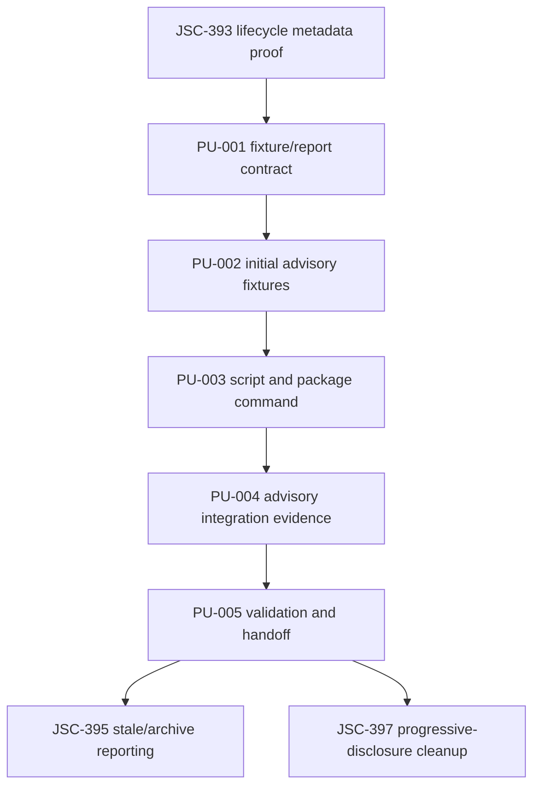
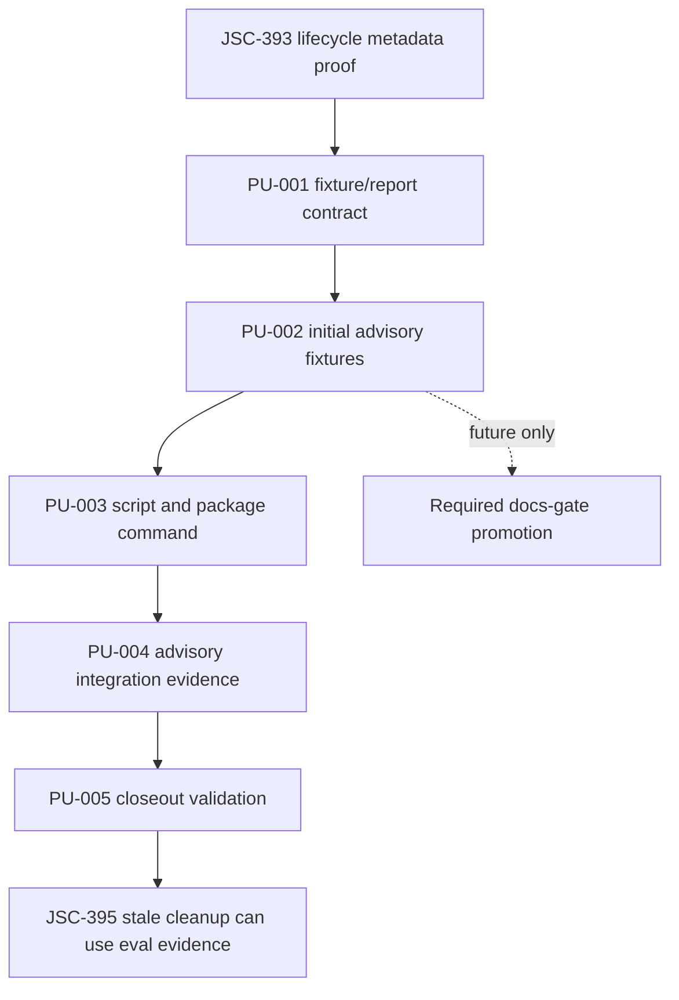

# Reader-Task Documentation Eval Plan

## Command Summary

BLUF: This plan turns the JSC-394 spec into a small deterministic documentation eval lane that proves whether Coding Harness docs route a reader or Codex agent to the right canonical source, validation command, stop condition, and forbidden claim for common issue-to-main tasks. It matters because lifecycle metadata can prove documents exist and carry authority labels, but it cannot prove the reader will avoid unsafe shortcuts like treating local tests as merge readiness or raw research as canon. Execution is bounded to a local fixture runner, package script, focused tests, and advisory reporting inside the docs-surface module family; the main risk is accidentally turning this into subjective prose grading or required docs-gate enforcement before fixture stability. PU-001 through PU-005 have local implementation coverage in this worktree, with docs-gate remaining required for existing metadata only and reader-task eval enforcement staying advisory.

Decision Needed: review and close out the local JSC-394 implementation without promoting reader-task evals to required docs-gate enforcement.

Top Risks:

- Fixtures become subjective quality checks instead of deterministic route-truth checks.
- Required docs-gate enforcement is added too early and blocks unrelated work.
- Fixture routes drift because they are not tied to existing source paths and commands.
- The runner reads private evidence or external state instead of local repo files.

Next Action: finish review fixes, run the validation gates in this plan, and refresh live tracker or PR state separately before making external closeout claims.

## Objective

Create the first deterministic reader-task documentation eval lane for Coding Harness. The lane should answer whether current docs route a reader to the correct canonical source and prevent false claims for high-risk documentation tasks.

The first implementation is advisory. It should produce machine-readable evidence that can later be promoted into docs-gate or progressive-disclosure cleanup, but this plan does not authorize required docs-gate enforcement.

## Source Contract

| Source | Role | Freshness |
| --- | --- | --- |
| `.harness/specs/2026-06-04-reader-task-documentation-eval-spec.md` | Canonical JSC-394 behavior contract | Current local file read on 2026-06-04 |
| `.harness/plan/2026-06-04-documentation-architecture-comparison-plan.md` | Parent architecture plan and issue sequence | Current local file |
| `.harness/linear/2026-06-04-JSC-392-coding-harness-documentation-lifecycle-linear-plan.md` | Local Linear issue mapping JSC-392 through JSC-397 | Current local file; live Linear not refreshed |
| `.harness/specs/2026-06-04-documentation-research-lifecycle-metadata-spec.md` | Dependency that establishes lifecycle metadata authority | Current local file |
| `package.json` | Current script contract; no `docs:task-eval` script yet | Current local file |

Source IDs preserved from the spec: FR-001 through FR-012, NFR-001 through NFR-005, SA-001 through SA-008, VAC-003, VAC-005, PU-003, and PU-004.

## Scope and Boundaries

Allowed paths and modules:

- `src/lib/docs-surface/**`
- `scripts/check-docs-task-eval.ts`
- `package.json`
- focused tests under `src/lib/docs-surface/**.test.ts`
- documentation updates required to expose the command or advisory contract
- `.harness/active-artifacts.md` only if route indexing must point at this plan

Forbidden paths and actions:

- Do not mutate Linear, GitHub, CI, branch protection, release settings, or review threads.
- Do not add network-bound or LLM-judged evals.
- Do not make docs-gate fail on reader-task eval findings in this slice.
- Do not compress `README.md`, `AGENTS.md`, or progressive-disclosure docs in JSC-394.
- Do not copy source-only docs into downstream templates.
- Do not use private env files, local transcripts, screenshots, or external evidence in fixtures.

## Authority and Scope Boundary

requested_depth: approved_slice

approved_execution_boundary: User said to proceed after JSC-393 and the source spec says the next action is he-plan for PU-004 implementation units.

downscope_authority: source_artifact. This plan keeps JSC-394 to deterministic advisory reader-task eval design and implementation.

external_mutation_boundary: none. No tracker, PR, CI, release, or downstream mutation is authorized.

freshness_required: validation_time for repo files; tracker_state and pr_state must be refreshed separately before closeout claims.

human_acceptance_boundary: required before promoting reader-task evals from advisory to required docs-gate enforcement.

## Current State / Evidence

- `pnpm docs:lifecycle --json` currently passes and checks governed docs plus opted-in `.harness` artifacts.
- JSC-393 proof coverage was committed as `dd770e76`, locking lifecycle states for `.harness` artifacts.
- The JSC-394 spec originally said `docs:task-eval` did not exist yet and should be advisory first.
- `package.json` now includes the advisory `docs:task-eval` script for this local implementation.
- `src/lib/docs-surface` now contains the reader-task eval contract, fixtures, runner, validation helpers, and focused tests.
- `src/lib/docs-surface` already owns docs lifecycle validation and is the smallest matching module family.
- Live Linear status for JSC-394 was not refreshed in this turn and is not claimed by this plan.

## Implementation Strategy

Build a small report-oriented module first, then wrap it with a script and package command. Fixtures should be typed constants or compact JSON owned by the docs-surface module. The runner should validate fixture shape, validate expected source paths, validate required route-safety fields, and return a stable report object.

Do not parse human prose to decide pass/fail. The first version should prove fixture contract integrity and source availability. Route-answer scoring can come later only if it remains deterministic.

## Runtime Persistence and State

runtime_state: JSC-394 has a local advisory reader-task eval implementation pending validation, review closeout, and separate live tracker or PR refresh.

resumption_key: .harness/plan/2026-06-04-reader-task-documentation-eval-plan.md#work-units

runtime_invocation_receipt: Harness Engineering router selected he-plan on 2026-06-04; local plan generated in Codex Desktop.

artifact_chain_key: reader-task-documentation-eval

persistent_artifacts:

- `.harness/specs/2026-06-04-reader-task-documentation-eval-spec.md`
- `.harness/plan/2026-06-04-reader-task-documentation-eval-plan.md`
- `.harness/plan/2026-06-04-documentation-architecture-comparison-plan.md`
- `.harness/linear/2026-06-04-JSC-392-coding-harness-documentation-lifecycle-linear-plan.md`

live_state_refresh: required before Linear, PR, CI, review-thread, or merge-readiness claims.

session_evidence_status: historical after handoff.

proof_boundary: Local implementation completion requires runner, fixtures, script, package command, focused tests, `pnpm docs:task-eval -- --json`, docs lifecycle validation, and related tests where applicable. External closeout still requires fresh tracker, PR, CI, and review-thread evidence when those lanes are claimed.

## Enforcement Contract

essential_decisions:

- The first eval lane is deterministic and local.
- Fixtures assert route truth and forbidden claims, not prose quality.
- Advisory mode is the initial enforcement posture.
- Required docs-gate integration needs later approval.
- JSON report output is the automation contract.

fillable_gaps:

- Fixture storage may be TypeScript constants or JSON as long as validation is deterministic.
- Exact internal type names may differ from the spec.
- Text output can be compact, provided JSON stays stable.
- Additional fixtures may be added if they follow the same schema.

guardrails:

- Fixture schema validation tests.
- Missing source path tests.
- Missing validation, stop condition, and forbidden claim tests.
- Advisory-only report status tests.
- `pnpm docs:task-eval -- --json` as the production command after PU-003.
- `bash scripts/run-harness-gate.sh docs-gate --mode required --json` must continue to pass without reader-task eval becoming required.

refusal_triggers:

- A fixture needs subjective model judgment.
- A fixture cannot name deterministic expected sources.
- A fixture cannot name a stop condition.
- A fixture tries to prove live PR, CI, Linear, or review-thread truth.
- Implementation promotes required docs-gate enforcement without a later approved plan.

durable_memory:

- Durable route mistakes should become reader-task fixtures.
- The fixture semantics live in source tests and this plan, not scattered prose.
- Promotion to required enforcement requires a future plan and acceptance.

professional_output:

- Handoff must report changed files, validation commands, advisory warnings, blocked steps, rollback, and next action.
- Closeout must state that docs-task eval is advisory unless a later change promotes it.

## Coding and Testing Lenses

coding_lens:

- Ownership: `src/lib/docs-surface` owns the runner and report contract.
- Public contract: `docs-task-eval-report/v1` JSON output, package script `docs:task-eval`, and script `scripts/check-docs-task-eval.ts`.
- Compatibility: do not break existing `docs:lifecycle` or docs-gate behavior.
- Failure posture: fail fixture configuration errors deterministically; keep advisory fixture warnings separate from required failures.
- Generated-artifact boundary: do not edit generated architecture context as source truth.
- Complexity posture: reuse docs-surface patterns; no new framework, no network dependency, no LLM judge.

testing_lens:

- Observable behavior: fixture validation, source existence, missing safety fields, advisory report status, JSON shape, and script output.
- Prior-art tests: inspect `src/lib/docs-surface/doc-lifecycle.test.ts` and `src/commands/docs-gate.test.ts`.
- Positive scenarios: all initial fixtures valid, expected sources exist, JSON report passes.
- Negative scenarios: unknown field, missing source, missing validation, missing stop condition, missing forbidden claim.
- Exact commands: `pnpm test -- src/lib/docs-surface/docs-task-eval.test.ts`, `pnpm docs:task-eval -- --json`, `pnpm docs:lifecycle --json`, `pnpm docs:lint`, `pnpm run test:related`.

## Work Units

### PU-001: Define Fixture and Report Contract

Objective: Add the typed fixture and report contract for deterministic reader-task evals.

Source trace: FR-001, FR-006, FR-010, FR-012, NFR-001, SA-002, SA-007.

Allowed paths:

- `src/lib/docs-surface/docs-task-eval.ts`
- `src/lib/docs-surface/docs-task-eval.test.ts`

Forbidden paths:

- `docs-gate` required enforcement wiring
- external services or private evidence

Steps:

1. Define `DocsTaskEvalFixture`, `DocsTaskEvalReport`, fixture result, finding, and summary types.
2. Validate required fields and enum fields.
3. Fail closed on unknown fixture fields.
4. Preserve `acceptance_ids` in fixture results.

Validation:

- `pnpm test -- src/lib/docs-surface/docs-task-eval.test.ts`

Stop condition: stop if the fixture schema cannot distinguish configuration errors from repository evidence failures.

Rollback: remove the new module and tests.

Handoff state: ready for PU-002.

### PU-002: Add Initial Advisory Fixtures

Objective: Add at least one fixture for each required category.

Source trace: FR-009, SA-003, VAC-003, VAC-005.

Allowed paths:

- `src/lib/docs-surface/docs-task-eval.ts`
- fixture file if implementation chooses a separate fixture module

Forbidden paths:

- README or AGENTS compression
- downstream template rewrites

Fixture categories:

- review-state-truth
- research-vs-canon
- generated-context-boundary
- downstream-distribution
- pr-closeout-lifecycle-impact
- progressive-disclosure-safety

Validation:

- `pnpm test -- src/lib/docs-surface/docs-task-eval.test.ts`

Stop condition: stop if any fixture cannot name repo-relative expected sources, validation, stop condition, and forbidden claim.

Rollback: remove or mark the fixture invalid before command exposure.

Handoff state: ready for PU-003.

### PU-003: Add Runner Script and Package Command

Objective: Expose the eval as the planned local command.

Source trace: FR-006, FR-007, FR-011, SA-004.

Allowed paths:

- `scripts/check-docs-task-eval.ts`
- `package.json`
- `src/lib/docs-surface/docs-task-eval.ts`

Forbidden paths:

- global harness command registry unless separately approved
- network or credential access

Steps:

1. Add `scripts/check-docs-task-eval.ts`.
2. Add `docs:task-eval` to `package.json`.
3. Support text output and `--json`.
4. Exit non-zero only for required fixture failures or configuration errors; advisory warnings should not fail the first implementation.

Validation:

- `pnpm docs:task-eval`
- `pnpm docs:task-eval -- --json`

Stop condition: stop if JSON cannot remain stable without parsing terminal prose.

Rollback: remove the script and package command.

Handoff state: ready for PU-004.

### PU-004: Add Advisory Integration Evidence

Objective: Make the eval visible to maintainers without making docs-gate required.

Source trace: FR-008, SA-005, SA-006, NFR-005.

Allowed paths:

- docs or README surfaces that describe validation commands, if needed
- `src/lib/docs-surface/docs-task-eval.test.ts`

Forbidden paths:

- required docs-gate finding generation
- branch protection or CI-required check changes

Steps:

1. Document the advisory command only if needed for discoverability.
2. Add a test proving advisory fixture warnings do not fail top-level status.
3. Keep required fixture failures distinct for future promotion.

Validation:

- `pnpm docs:task-eval -- --json`
- `bash scripts/run-harness-gate.sh docs-gate --mode required --json`

Stop condition: stop if docs-gate starts failing because of advisory reader-task findings.

Rollback: remove advisory projection or docs mention.

Handoff state: ready for PU-005.

### PU-005: Closeout Validation and Handoff

Objective: Prove the slice and prepare the next issue without overclaiming.

Source trace: SA-008, professional_output, proof_boundary.

Allowed paths:

- PR closeout evidence
- implementation notes if decisions were not in this plan

Forbidden paths:

- Linear status mutation without explicit approval
- merge-readiness claims from local validation

Validation:

- `pnpm test -- src/lib/docs-surface/docs-task-eval.test.ts`
- `pnpm docs:task-eval -- --json`
- `pnpm docs:lint`
- `pnpm docs:lifecycle --json`
- `bash scripts/run-harness-gate.sh docs-gate --mode required --json`
- `pnpm run quality:docstrings`
- `pnpm run quality:size`
- `pnpm run test:related`
- `pnpm typecheck`

Stop condition: stop if required test coverage cannot prove the script, report contract, and fixture failures.

Rollback: revert JSC-394 files and keep the spec/plan as historical evidence.

Handoff state: ready for review and PR closeout.

## Dependencies and Sequencing

JSC-394 depends on JSC-393 metadata authority. JSC-397 should wait until JSC-394 proves route behavior. JSC-395 can follow JSC-393 but should not use JSC-394 output as archive authority.

## Validation Gates

| Gate | When | Status | Observable Behavior / Source Proof |
| --- | --- | --- | --- |
| `python3 /Users/jamiecraik/dev/agent-skills/Infrastructure/scripts/validation-and-linting/he_artifact_identity_lint.py .harness/plan/2026-06-04-reader-task-documentation-eval-plan.md` | Plan creation | required | Proves the plan carries valid Harness Engineering artifact identity metadata before it can drive work. |
| `python3 /Users/jamiecraik/dev/agent-skills/Infrastructure/scripts/validation-and-linting/he_linear_traceability_lint.py .harness/plan/2026-06-04-reader-task-documentation-eval-plan.md` | Plan creation | required | Proves JSC-394 traceability is present and tied back to parent JSC-392. |
| `python3 /Users/jamiecraik/dev/agent-skills/Plugins/harness-engineering/scripts/check_bluf_structure.py .harness/plan/2026-06-04-reader-task-documentation-eval-plan.md --json` | Plan creation | required | Proves the handoff has a decision, risks, and next action visible before implementation. |
| `python3 /Users/jamiecraik/dev/agent-skills/Plugins/harness-engineering/scripts/check_generated_artifact_shape.py .harness/plan/2026-06-04-reader-task-documentation-eval-plan.md --kind plan --json` | Plan creation | required | Proves the plan names source evidence, validation behavior, visual sequence, rollback, and implementation units. |
| `pnpm docs:lint` | Plan and implementation | required | Proves markdown and documentation style remain valid after command or docs updates. |
| `pnpm docs:lifecycle --json` | Plan and implementation | required | Proves lifecycle metadata still passes after adding or touching documentation surfaces. |
| `pnpm test -- src/lib/docs-surface/docs-task-eval.test.ts` | After PU-001 | required | Proves fixture validation, report status, missing-source failures, and advisory warning behavior in the source module. |
| `pnpm docs:task-eval -- --json` | After PU-003 | required | Proves the operator-facing command emits stable `docs-task-eval-report/v1` JSON without relying on prose parsing. |
| `bash scripts/run-harness-gate.sh docs-gate --mode required --json` | After PU-004 | required | Proves existing required docs-gate behavior remains green and reader-task eval stays advisory in this slice. |
| `pnpm run test:related` | After implementation | required | Proves related-test selection sees the changed production/test paths. |

## Review Plan

- Use implementation self-check for fixture determinism and JSON report stability.
- Use independent docs or architecture review if the implementation changes README, AGENTS, docs-gate, or downstream template behavior.
- CodeRabbit remains independent during PR review; the implementing agent cannot self-approve.
- Reviewer focus: route truth, advisory-vs-required boundary, fixture drift, and false delivery claims.

## Rollback Plan

Rollback is straightforward because the first slice is additive and advisory:

1. Remove `docs:task-eval` from `package.json`.
2. Remove `scripts/check-docs-task-eval.ts`.
3. Remove `src/lib/docs-surface/docs-task-eval.ts` and its tests.
4. Keep this plan/spec as historical evidence unless a separate archive decision supersedes them.
5. Rerun `pnpm docs:lifecycle --json`, `pnpm docs:lint`, and docs-gate.

## Risk Register

| Risk | Severity | Mitigation |
| --- | --- | --- |
| Subjective fixture behavior | High | Require deterministic expected sources, commands, stop conditions, and forbidden claims. |
| Premature required enforcement | High | Keep docs-gate required integration out of scope. |
| Fixture drift | Medium | Validate source paths exist and acceptance IDs are emitted. |
| Context load grows | Medium | Keep fixtures compact and source-path based. |
| False delivery claims | High | Fixture forbidden claims must name unsafe shortcuts. |
| Private evidence leakage | High | Runner reads repo-relative public files only. |

## Observability and Evidence

The implementation should emit `docs-task-eval-report/v1` with:

- `status`
- `advisory_status`
- `fixtures`
- `findings`
- `summary`
- `evidence_ref`

The report must distinguish configuration failures, missing repo evidence, advisory warnings, and required failures.

## Visual References / Diagrams

This implementation uses the same dependency graph as the sequencing section so the visual contract stays source-bound to the work units instead of becoming a decorative diagram.

## Accessibility and Operator Ergonomics

Text output should be compact and non-color-only. JSON output is canonical for automation. Fixture IDs should be stable kebab-case so humans can cite them in PRs and agents can route them in follow-up work.

## Open Questions

| Question | Current Decision |
| --- | --- |
| Should docs-gate fail on reader-task eval warnings? | No. Advisory first. |
| Should fixtures be JSON or TypeScript constants? | Implementation may choose; deterministic validation is binding. |
| Should an LLM judge be added? | No for this slice. |
| Should JSC-397 wait for this? | Yes, progressive-disclosure cleanup should wait for eval proof. |

## Final Decision

Proceed to `he-work` for JSC-394 using this plan. The slice is implementation-ready only for the advisory deterministic runner, fixture set, command, focused tests, and local validation. Required docs-gate enforcement and documentation compression remain out of scope.

## Appendix A. Harness Metadata / Traceability

schema_version: 1

interactive_status: handoff_executed

selection_evidence:

- Harness Engineering route selected `he-plan` with confidence 1.0.
- Source spec path: `.harness/specs/2026-06-04-reader-task-documentation-eval-spec.md`.
- JSC-393 dependency proof committed as `dd770e76`.

route: harness-engineering/he-plan

stage: he-plan

scope: JSC-394 reader-task documentation eval implementation plan

source: .harness/specs/2026-06-04-reader-task-documentation-eval-spec.md

plan_path: .harness/plan/2026-06-04-reader-task-documentation-eval-plan.md

traceability:

| Item | Value |
| --- | --- |
| Parent issue | JSC-392 |
| Implementation issue | JSC-394 |
| Source plan | .harness/plan/2026-06-04-documentation-architecture-comparison-plan.md |
| Source spec | .harness/specs/2026-06-04-reader-task-documentation-eval-spec.md |
| Acceptance | SA-001 through SA-008, VAC-003, VAC-005 |

validation: see Validation Gates.

safe_to_continue: true

blocked_reason: null

linear_action_required: false

linear_mutation_status: already_linked

post_plan_handoff:

- state: handoff_executed
- next_skill: he-work
- next_artifact: .harness/plan/2026-06-04-reader-task-documentation-eval-plan.md

authority_scope_boundary: approved_slice, source_artifact downscope, no external mutation.

runtime_persistence: see Runtime Persistence and State.

blackboard_delta:

- JSC-394 now has a dedicated implementation plan.
- JSC-394 remains advisory-first and must not promote docs-gate enforcement in this slice.

git_staging_status: not_staged_at_creation

staged_paths: []

confidence:

- verified: source spec exists; package script exists in the local package.json; docs-surface is current docs validation module family; reader-task eval implementation files exist locally.
- assumption: current live Linear fields still match local he-linear-plan artifact.
- blocked: live Linear refresh was not performed.
- confidence_level: high for local plan readiness; medium for tracker freshness.

stage_arc_boundary:

- left_arc: JSC-393 metadata proof is committed locally as dd770e76; docs lifecycle checks passed before this plan.
- active_arc: JSC-394 local implementation and review fixes are in progress.
- right_arc: validation and live-state refresh must complete before JSC-397 progressive-disclosure cleanup or external closeout claims.
- coding_lens: docs-surface ownership, advisory-first, no external state.
- testing_lens: fixture schema, source path, stop condition, forbidden claim, JSON report, script path.

## Appendix B. Linear / Tracker Handoff

Linear issue JSC-394 already exists according to the local he-linear-plan artifact. This plan does not mutate Linear. Before PR closeout or tracker status claims, refresh live Linear state and update the issue with implementation evidence only after code and validation complete.

## Linear Work Item Contract

| Field | Value |
| --- | --- |
| Parent issue | JSC-392 |
| Work item | JSC-394 |
| Local status | Todo |
| Mutation status | Already created by he-linear-plan; this plan does not mutate Linear. |
| Live refresh required | Required before PR closeout, merge-readiness claims, or issue status changes. |
| Closure rule | Use `Refs JSC-394` while in review; use `Closes JSC-394` only if the merge fully completes the issue. |

## Linear / Spec / Plan / PR Traceability

| Linear issue | Source acceptance IDs | Plan units | Acceptance IDs | PR evidence |
| --- | --- | --- | --- | --- |
| JSC-394 | FR-001 through FR-012, NFR-001 through NFR-005, SA-001 through SA-008 | PU-001 through PU-005 | Fixture contract, advisory report, package command, docs-gate boundary, closeout evidence | PR evidence pending implementation; local plan cites `.harness/specs/2026-06-04-reader-task-documentation-eval-spec.md`. |
| JSC-392 | Parent issue map | JSC-394 sequence item | Reader-task eval supports documentation lifecycle adoption after metadata authority | `.harness/linear/2026-06-04-JSC-392-coding-harness-documentation-lifecycle-linear-plan.md` records the parent issue sequence. |

## Appendix C. Review Outcomes

No independent review was run for this plan in this pass. Review is recommended after implementation if the slice changes docs-gate behavior, README, AGENTS, or downstream template surfaces.
