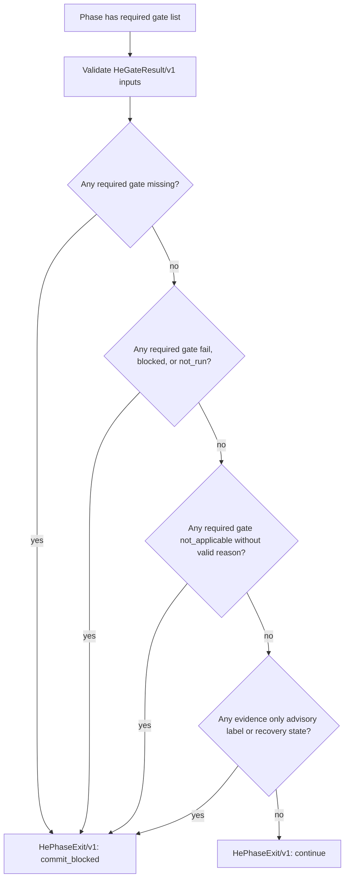

# JSC-311 HE Phase-Exit Evidence Gates Spec

## Table of Contents

- [Command Summary](#command-summary)
- [Purpose](#purpose)
- [Problem Statement](#problem-statement)
- [User / Operator Scenarios](#user--operator-scenarios)
- [Goals](#goals)
- [Non-Goals](#non-goals)
- [Current State / Evidence](#current-state--evidence)
- [Proposed Behavior](#proposed-behavior)
- [Ownership, Authority, and Escalation](#ownership-authority-and-escalation)
- [Execution Boundaries and Stop Conditions](#execution-boundaries-and-stop-conditions)
- [Requirements](#requirements)
- [Non-Functional Requirements](#non-functional-requirements)
- [Interfaces](#interfaces)
- [Data / Domain Contract](#data--domain-contract)
- [Security, Privacy, and Safety](#security-privacy-and-safety)
- [Accessibility and Operator Ergonomics](#accessibility-and-operator-ergonomics)
- [Observability and Evidence Surfaces](#observability-and-evidence-surfaces)
- [Failure and Recovery](#failure-and-recovery)
- [Risks and Mitigations](#risks-and-mitigations)
- [Validation Plan](#validation-plan)
- [Acceptance Criteria](#acceptance-criteria)
- [Visual References / Diagrams](#visual-references--diagrams)
- [Implementation Notes](#implementation-notes)
- [Open Questions](#open-questions)
- [Decision](#decision)
- [Evidence and References](#evidence-and-references)
- [Technical Review Findings](#technical-review-findings)
- [No-Fog Gate](#no-fog-gate)
- [Linear Work Item Contract](#linear-work-item-contract)
- [Linear Acceptance Traceability](#linear-acceptance-traceability)
- [Appendix A. Harness Metadata / Traceability](#appendix-a-harness-metadata--traceability)
- [Appendix B. Review Outcomes](#appendix-b-review-outcomes)
- [Appendix C. he-plan Handoff](#appendix-c-he-plan-handoff)

## Command Summary

BLUF: This spec restores the missing JSC-311 phase-exit evidence contract for
the reader, user, operator, developer, and future agent who need to know whether
a Harness Engineering phase is truly ready to continue or commit. It matters
because without this contract a phase can appear complete from labels, memory,
prompt text, or advisory recovery state even when the required gate evidence is
missing or failed. The contract defines a typed `HeGateResult/v1` input and
`HePhaseExit/v1` aggregate decision that must block commit readiness when
required gates are `fail`, `blocked`, or `not_run`. The next step is a focused
plan that adds pure local classification, fixtures, and tests before any CLI
wiring or tracker mutation.

Decision Needed: no new Linear object is required for the spec itself. The
implementation plan should use existing live JSC-311 and should not mutate
Linear until a separate tracker update is explicitly requested.

Top Risks: treating route labels, reviewer names, Recovery Capsule metadata, or
prompt-completion prose as evidence would recreate the exact false-closeout
failure this slice exists to prevent.

Next Action: run `he-plan` against this spec and keep the first implementation
slice limited to pure local gate result normalization, aggregation, fixtures,
and focused tests.

## Purpose

This specification defines the evidence contract for exiting a Harness
Engineering phase. It exists to make commit readiness deterministic:

- required gate outcomes must be machine-readable
- missing required gates must be visible
- advisory routing labels must not count as gate evidence
- failed, blocked, or unrun required gates must prevent commit-ready handoff

The spec is a behavior contract, not an implementation plan. It names the
domain model, required decisions, acceptance evidence, validation boundaries,
and out-of-scope work for the JSC-311 phase-exit evidence-gate slice.

## Problem Statement

Harness Engineering work can accumulate strong-looking local artifacts while
still lacking enforceable evidence that required review, fix, simplify, and
validation gates actually ran. The risk is not lack of prose. The risk is
false confidence: an agent can report that a phase is complete because a label,
skill name, prompt, or recovery summary appears in context, even when the
required gate result is absent, failed, blocked, or only advisory.

JSC-311 must close that gap by defining a small typed boundary between
skill-backed gate evidence and phase-exit decisions.

## User / Operator Scenarios

| Scenario | Operator Need | Required Behavior |
| --- | --- | --- |
| Phase work completed with all required gates passing | Know whether handoff may proceed | Emit a `continue` or equivalent safe decision with the exact passing gate refs. |
| A required gate was not run | Prevent accidental closeout | Emit `commit_blocked` and list the missing required gate. |
| A required gate failed or was blocked | Force repair or human review | Emit `commit_blocked` or `stop`, preserve failure evidence, and block commit readiness. |
| A gate is legitimately not applicable | Avoid ceremonial work | Allow `not_applicable` only when a reason is present and the gate is not triggered by the phase scope. |
| A RouteDecision label says a gate is relevant | Avoid label-as-proof drift | Treat the label as routing metadata only; require a separate gate result. |
| Recovery Capsule metadata points to prior work | Preserve restart help without false proof | Allow recovery metadata as orientation only; it must not satisfy phase-exit evidence. |

## Goals

- Define `HeGateResult/v1` as the typed evidence unit for required HE gates.
- Define `HePhaseExit/v1` as the typed aggregate decision for phase exit.
- Make required gate status handling deterministic.
- Separate routing metadata from gate-run evidence.
- Preserve compatibility with existing `harness-decision/v1` and `harness next`
  behavior.
- Keep v1 local, pure, fixture-backed, and network-free.
- Provide enough acceptance IDs for `he-plan` to create bounded work units.

## Non-Goals

- Do not add a public `harness route` command.
- Do not change `harness next` recommendation behavior in this slice.
- Do not execute skills from TypeScript or shell out to agent prompts.
- Do not mutate Linear, GitHub, CircleCI, CodeRabbit, Slack, MCP, plugin state,
  or Project Brain.
- Do not build broad Runtime Card, Closeout Guardian, MCP, plugin, or telemetry
  systems.
- Do not treat Recovery Capsule state as validation, review, phase-exit, or
  commit-readiness evidence.
- Do not replace existing validation scripts or branch-protection checks.
- Do not require multi-agent orchestration for a local phase-exit decision.

## Current State / Evidence

Verified facts from the current repository:

- `AGENTS.md` states that RouteDecision lifecycle metadata is advisory and that
  RouteDecision labels must not be treated as gate-run evidence for JSC-311.
- `AGENTS.md` states that phase-exit logic must refuse commit when required
  gates are `fail`, `blocked`, or `not_run`.
- `src/lib/decision/harness-decision.ts` defines the existing
  `harness-decision/v1` envelope and allows producer-specific metadata under
  `meta`.
- `src/commands/next.ts` produces the read-only `harness next` decision surface
  and uses `HarnessDecision` validation.
- `.harness/specs/2026-05-13-JSC-311-recovery-capsule-cockpit-spec.md`
  repeatedly marks Recovery Capsule state as advisory orientation, not
  validation, review, phase-exit, or commit-readiness proof.
- `.harness/specs/2026-05-13-JSC-311-recovery-capsule-cockpit-spec.md`
  references an earlier phase-exit evidence-gates spec path, but that earlier
  spec file is not present in the current `.harness/specs` directory.
- `.harness/linear/coding-harness-linear-plan.md` currently still contains an
  older JSC-198 next-slice queue in its body; this is local plan drift relative
  to the active JSC-311 instruction and Recovery Capsule evidence boundary.
- Current file discovery finds `src/lib/decision/harness-decision.ts`,
  `src/commands/next.ts`, `src/commands/review-gate-core.ts`, and
  `src/lib/review-gate/**`, but does not find `src/lib/decision/he-phase-exit.ts`
  or `src/lib/decision/he-phase-exit-core.ts` in the working tree.
- `git status --porcelain` currently reports phantom untracked 2026-05-11
  JSC-311 phase-exit files, but direct `ls`, `find`, and `stat` cannot access
  those paths from the current filesystem view. `git update-index --refresh`
  is also blocked by `.git/index.lock` permission. Treat this as repo-state
  ambiguity to resolve before implementation, not as source evidence that the
  files exist.
- Re-check on 2026-05-13 still shows the same ambiguity: `git status --short`
  reports untracked `src/lib/decision/he-phase-exit.ts`,
  `src/lib/decision/he-phase-exit-core.ts`, and
  `src/lib/decision/he-phase-exit.test.ts`, while direct `sed` and `stat` on
  those paths fail with `No such file or directory`. Implementers must not read
  Git's untracked listing as proof that usable source files exist.
- Plan review on 2026-05-13 also shows control-plane artifact visibility drift:
  direct `stat` can read
  `.harness/plan/2026-05-13-JSC-311-he-phase-exit-evidence-gates-plan.md`, but
  `git status --short --untracked-files=all -- .harness/plan` omits that live
  plan while reporting older nonexistent 2026-05-11 JSC-311 artifacts. Treat
  this as the same repo-state ambiguity class; source implementation remains
  blocked until artifact visibility is reconciled or explicitly waived.
- Local memory indicates an earlier JSC-311 phase-exit implementation lane once
  created `he-phase-exit.ts`, `he-phase-exit-core.ts`, and tests, then a later
  reconcile pass reported those expected files missing from the working tree.
  Current repository evidence is authoritative for this spec: the implementation
  must be treated as absent until files and tests are present locally again.
- `src/commands/review-gate-core.ts` already treats review readiness as a
  blocker-producing gate with policy, plan traceability, and check-run states.
  JSC-311 should reuse that posture: a named review path is not enough unless
  the underlying evidence exists and is current.

Interpretations:

- The phase-exit evidence contract is required before the repo can safely use
  Recovery Capsule or RouteDecision metadata in agent handoffs without creating
  false closeout confidence.
- A pure local classifier is sufficient for the first slice because the risk is
  evidence interpretation, not external synchronization.

Blocked or unresolved evidence:

- Live Linear mutation is not performed by this spec.
- The missing earlier phase-exit spec cannot be loaded from the current working
  tree, so this artifact is the canonical replacement for the visible repo
  state unless a later source-of-truth decision supersedes it.

## Proposed Behavior

JSC-311 introduces a local phase-exit evaluator with two versioned contracts:

1. `HeGateResult/v1` records the outcome of one required or optional HE gate.
2. `HePhaseExit/v1` aggregates gate results into a phase-exit decision.

The evaluator must be conservative:

- Required gates with `pass` may satisfy phase exit.
- Required gates with `not_applicable` may satisfy phase exit only with a
  concrete reason and only when the phase scope does not trigger the gate.
- Required gates with `fail`, `blocked`, or `not_run` must block commit
  readiness.
- Missing required gate results must block commit readiness.
- Advisory evidence, labels, route recommendations, recovery state, and prompt
  text must not satisfy a required gate.

The v1 implementation should expose pure functions that accept structured
inputs and return structured outputs. Any later CLI, cockpit, or closeout wiring
must depend on this contract rather than recreating the rules in prose.

## Ownership, Authority, and Escalation

| Concern | Owner / Authority | Required Action |
| --- | --- | --- |
| Spec contract | JSC-311 spec owner and repo maintainers | Approve material changes to gate semantics, required-gate status handling, and public compatibility. |
| Implementation slice | Assigned implementer | Keep v1 local, pure, fixture-backed, and inside the admitted source/test paths. |
| Required gate selection | Plan work unit or explicit phase contract | Declare required gates before evaluation; do not infer them from route labels, prompts, or file names alone. |
| Review evidence | Independent review/check producer | Provide artifact-backed or command-backed results; role names and chat text are advisory only. |
| Tracker state | Human-approved Linear/GitHub workflow | Mutate live trackers only after an explicit tracker mutation request. |
| Repo-state ambiguity | Implementer with human escalation when unresolved | Stop before coding if Git status and filesystem inventory disagree on prior `he-phase-exit` files or canonical plan/spec artifacts. |

Escalate to the spec owner before changing any of these decisions:

- treating advisory metadata as gate evidence
- allowing timestamp precedence for conflicting required gate results
- wiring phase-exit output into `harness next`, commit hooks, PR gates, or
  tracker automation
- adding external writes, network reads, or live service dependencies
- changing the public `harness-decision/v1` contract

## Execution Boundaries and Stop Conditions

The first implementation slice is allowed to write only the local source,
fixture, and test files needed for `HeGateResult/v1` validation and
`HePhaseExit/v1` aggregation. Plan/spec evidence updates are allowed when they
record actual validation outcomes.

Stop instead of continuing when any of the following is true:

- Git status and filesystem reads disagree about prior `he-phase-exit` files
  after a fresh inventory check.
- Git status and filesystem reads disagree about the canonical plan/spec
  artifacts needed to drive the work.
- The implementation would require CLI wiring before focused evaluator tests
  pass.
- The implementation would mutate Linear, GitHub, CircleCI, CodeRabbit, Slack,
  MCP, plugin state, release state, branch state, commits, pushes, or merges.
- Required gate lists are not available from an explicit phase contract or plan
  work-unit declaration.
- A validator, test, or file inventory is blocked and no narrower local check
  can prove the changed behavior.

## Requirements

| ID | Requirement |
| --- | --- |
| FR-001 | The system MUST define a versioned `HeGateResult/v1` contract for one gate outcome. |
| FR-002 | The system MUST support gate statuses `pass`, `fail`, `blocked`, `not_applicable`, and `not_run`. |
| FR-003 | The system MUST support execution modes `direct_skill`, `subagent_proxy`, `manual_review`, `validation_only`, `not_applicable`, and `not_run`. |
| FR-004 | The system MUST model whether a gate is required for the current phase. |
| FR-005 | The system MUST define a versioned `HePhaseExit/v1` aggregate decision contract. |
| FR-006 | Required gates with `fail`, `blocked`, or `not_run` MUST produce `commit_allowed: false`. |
| FR-007 | Missing required gate results MUST produce `commit_allowed: false`. |
| FR-008 | `not_applicable` MUST require a non-empty reason and MUST NOT be accepted when phase scope triggers that gate. |
| FR-009 | RouteDecision labels, skill names, user prompts, and recovery state MUST NOT count as gate-run evidence. |
| FR-010 | Testing-reviewer evidence MUST NOT satisfy he-fix-bugs evidence unless a separate he-fix-bugs result exists. |
| FR-011 | The v1 contract MUST remain local and read-only. |
| FR-012 | The v1 contract MUST preserve existing `harness-decision/v1` and `harness next` behavior unless a later plan explicitly wires metadata. |
| FR-013 | Malformed `findings`, `actions`, or `evidenceRefs` payloads MUST fail validation without throwing through the phase-exit caller. |
| FR-014 | Review-gate evidence MUST be artifact-backed or command-backed; mailbox text, role labels, or chat status text alone MUST NOT satisfy a required review gate. |
| FR-015 | Duplicate or conflicting required gate results MUST fail closed to `human_review` or `commit_blocked` unless the plan defines a deterministic precedence rule and tests it. |
| FR-016 | Required gate selection MUST come from an explicit phase contract or plan work-unit declaration, not from inferred keywords alone. |
| FR-017 | The first implementation MUST reconcile `git status`, filesystem inventory, and direct file reads for any prior `he-phase-exit` paths and canonical plan/spec artifacts before deciding to restore, replace, or supersede them. If the sources disagree, coding is blocked until the ambiguity is resolved or explicitly waived by the spec owner. |
| FR-018 | The evaluator MUST surface a compact list of missing, invalid, failed, blocked, not-run, advisory-only, duplicate, and conflicting evidence reasons so closeout notes can explain why commit readiness is blocked. |

## Non-Functional Requirements

| ID | Requirement |
| --- | --- |
| NFR-001 | Classification MUST be deterministic for the same input. |
| NFR-002 | The evaluator MUST be testable without network, credentials, live tracker state, or external services. |
| NFR-003 | Output MUST be compact enough for future agents to inspect without loading long review transcripts. |
| NFR-004 | Unknown fields in versioned objects SHOULD be ignored for forward compatibility, but missing required fields or invalid enum values MUST fail validation. |
| NFR-005 | Failure behavior MUST be conservative: invalid evidence blocks commit readiness instead of passing silently. |
| NFR-006 | The implementation SHOULD avoid broad dependencies and should fit in the existing decision or workflow-contract boundary. |
| NFR-007 | Validation evidence MUST use exact commands and `pass`, `fail`, `blocked`, or `not applicable` outcomes. |
| NFR-008 | Runtime errors from untrusted gate payload shape MUST be impossible in normal caller paths; invalid payloads are validation failures, not uncaught exceptions. |
| NFR-009 | The output MUST distinguish implementation absence from implementation failure. A missing phase-exit module is not the same as a failed gate run. |
| NFR-010 | Error summaries MUST be deterministic, concise, and screen-reader friendly; do not encode blocker meaning only through ordering, color, or icons. |

## Interfaces

### Public Interface

No new public CLI command is admitted by this spec.

### Internal Interface

The implementation plan may choose exact file placement, but the first slice
should provide internal TypeScript functions equivalent to:

```ts
type HeGateStatus =
  | "pass"
  | "fail"
  | "blocked"
  | "not_applicable"
  | "not_run";

type HeGateExecutionMode =
  | "direct_skill"
  | "subagent_proxy"
  | "manual_review"
  | "validation_only"
  | "not_applicable"
  | "not_run";

function validateHeGateResult(input: unknown): HeGateValidationResult;

function evaluateHePhaseExit(input: HePhaseExitInput): HePhaseExitDecision;
```

The interface must not require shelling out to skills, agents, Linear, GitHub,
CircleCI, CodeRabbit, or MCP.

## Data / Domain Contract

### HeGateResult/v1

Minimum required fields:

| Field | Type | Required | Rule |
| --- | --- | ---: | --- |
| `schemaVersion` | string | yes | Must equal `he-gate-result/v1`. |
| `gateId` | string | yes | Stable gate identifier such as `simplify`, `testing_reviewer`, `he_fix_bugs`, `he_code_review`, `autofix`, or a future documented gate. |
| `required` | boolean | yes | Whether this gate is required for the phase. |
| `status` | enum | yes | `pass`, `fail`, `blocked`, `not_applicable`, or `not_run`. |
| `executionMode` | enum | yes | `direct_skill`, `subagent_proxy`, `manual_review`, `validation_only`, `not_applicable`, or `not_run`. |
| `evidenceRefs` | array | yes | Evidence references; may be empty only for `not_run` with reason. |
| `findings` | array | yes | Findings surfaced by the gate; empty when none. |
| `actions` | array | yes | Fixes or follow-up actions produced by the gate; empty when none. |
| `reason` | string | conditional | Required for `not_applicable`, `blocked`, and `not_run`. |
| `producedBy` | string | no | Skill, reviewer, command, or tool that produced the result; informational only. |
| `capturedAt` | string | no | ISO timestamp when available; used for display only unless a later plan admits timestamp precedence. |

Conformance rules:

- `pass` requires at least one evidence reference.
- `fail` requires either findings or an explicit reason.
- `blocked` requires a blocker reason.
- `not_run` requires a reason and blocks commit readiness when required.
- `not_applicable` requires a reason and must be rejected if the phase scope
  declares that gate triggered.
- `validation_only` may support a validation gate but must not be accepted as
  proof that a named skill-backed review ran.
- Evidence references must not contain secrets or credential values.
- `findings`, `actions`, and `evidenceRefs` must be arrays. Any other shape is
  invalid evidence and must not throw through the caller.
- `producedBy` must not satisfy evidence by itself.
- `capturedAt` must not resolve conflicting required gate results in v1 unless
  the implementation plan explicitly adds and tests a timestamp precedence rule.

Example:

```json
{
  "schemaVersion": "he-gate-result/v1",
  "gateId": "he_code_review",
  "required": true,
  "status": "pass",
  "executionMode": "manual_review",
  "evidenceRefs": [
    {
      "type": "artifact",
      "path": "artifacts/reviews/he_code_review.md"
    }
  ],
  "findings": [],
  "actions": [],
  "reason": null
}
```

### HePhaseExit/v1

Minimum required fields:

| Field | Type | Required | Rule |
| --- | --- | ---: | --- |
| `schemaVersion` | string | yes | Must equal `he-phase-exit/v1`. |
| `phaseId` | string | yes | Stable phase or plan work-unit identifier. |
| `phaseContractRef` | string | yes | Path, issue, or work-unit reference that declares required gates. |
| `decision` | enum | yes | `continue`, `stop`, `human_review_required`, or `commit_blocked`. |
| `requiredGateIds` | array | yes | Gate IDs required for the phase. |
| `gateResults` | array | yes | Validated `HeGateResult/v1` objects. |
| `missingRequiredGateIds` | array | yes | Required gates with no result. |
| `blockingReasons` | array | yes | Human-readable reasons for non-continuation. |
| `safeToContinue` | boolean | yes | Whether local work can continue. |
| `commitAllowed` | boolean | yes | Whether commit-ready handoff is allowed. |
| `summary` | string | yes | Compact explanation. |

Decision rules:

- `commitAllowed` is `true` only when every required gate is `pass` or accepted
  `not_applicable`.
- `decision` is `commit_blocked` when local work may continue but commit-ready
  handoff is blocked by missing, failed, blocked, invalid, or unrun required
  gates.
- `decision` is `stop` when the failure means the agent must not continue
  without repair or human guidance.
- `decision` is `human_review_required` when evidence is present but requires human
  judgment before handoff.
- `decision` is `continue` only when no blocking required-gate condition exists.
- Duplicate required gate results for the same `gateId` must produce
  `human_review_required` or `commit_blocked` unless the first implementation explicitly
  defines and tests a stricter deterministic rule.

## Security, Privacy, and Safety

- The evaluator must not execute arbitrary skill prompts or untrusted commands.
- Evidence references must be paths, command strings, or tool identifiers; they
  must not include secret values.
- External writes are forbidden in v1.
- Live tracker status is evidence only when explicitly fetched by a separate
  approved workflow; this spec does not authorize tracker mutation.
- Invalid or malformed gate evidence must fail closed.
- The system must not infer correctness from label text, issue names, agent
  role names, or memory summaries.

## Accessibility and Operator Ergonomics

This is not a visual UI spec, but the future human-facing output must preserve
operator accessibility:

- Status text must not rely on color alone.
- Output should distinguish `fail`, `blocked`, `not_run`, and `not_applicable`
  using explicit words.
- Human summaries should list the next safe action and the first blocker before
  secondary detail.
- JSON output must remain machine-readable without requiring a screenshot or
  long transcript.
- The phase-exit summary should be compact enough to fit in closeout notes
  without hiding the actual gate refs.

## Observability and Evidence Surfaces

V1 has no runtime telemetry requirement, but it must produce inspectable local
evidence:

| Surface | Required Content | Purpose |
| --- | --- | --- |
| `HePhaseExit/v1` decision | `decision`, `commitAllowed`, `safeToContinue`, missing gate IDs, blocking reasons, and evidence refs | Lets agents and reviewers see why a phase may or may not exit. |
| Unit-test fixtures | Valid, invalid, missing, failed, blocked, not-run, not-applicable, advisory-only, duplicate, and conflicting gate examples | Proves the decision table is executable, not prose-only. |
| Validation report / closeout artifact | Exact commands and `pass`, `fail`, `blocked`, or `not applicable` outcomes | Separates local implementation evidence from PR, CI, review, and tracker closure evidence. |
| Repo-state inventory | `git status`, direct file reads, and filesystem inventory for prior `he-phase-exit` paths and canonical plan/spec artifacts | Prevents phantom untracked files or invisible control-plane artifacts from being treated as implementation or planning proof. |

The evaluator must not require logs, dashboards, traces, or external telemetry
to prove v1 behavior. Later operational surfaces may consume the structured
decision only after a separate plan admits that integration.

## Failure and Recovery

| Failure Mode | Required Response |
| --- | --- |
| Missing required gate result | `commitAllowed: false`, decision `commit_blocked`, missing gate listed. |
| Invalid gate schema | `commitAllowed: false`, decision `commit_blocked` or `stop`, validation error listed. |
| Required gate failed | `commitAllowed: false`, failure evidence preserved. |
| Required gate blocked | `commitAllowed: false`, blocker reason preserved. |
| Required gate not run | `commitAllowed: false`, not-run reason preserved. |
| Advisory metadata presented as evidence | Reject as evidence and add blocking reason when required gate remains unsatisfied. |
| Conflicting gate results | Prefer conservative result and require human review unless a deterministic precedence rule exists. |
| Malformed `findings`, `actions`, or `evidenceRefs` | Return validation error and block commit readiness without throwing through the caller. |
| Prior implementation expected but absent | Treat as restoration work; do not claim implementation exists until local files and tests are present. |

Rollback is simple for v1: remove or disable the phase-exit evaluator and return
to existing manual closeout checks. No migration, data persistence, external
state, or public command compatibility is introduced by this spec.

## Risks and Mitigations

| Risk | Likelihood | Impact | Mitigation |
| --- | --- | --- | --- |
| Advisory metadata is accepted as proof. | medium | high | FR-009, SA-006, and advisory-only fixtures reject route labels, recovery state, prompts, and role names. |
| Git reports phantom untracked files or omits live plan/spec artifacts, and implementation starts from false control-plane evidence. | high | high | FR-017 and SA-013 require status/filesystem reconciliation and block coding when they disagree. |
| Conflicting gate results pass by timestamp or latest-wins behavior. | medium | high | FR-015 and SA-015 fail closed unless a deterministic precedence rule is explicitly tested. |
| Review evidence is reduced to reviewer identity or chat text. | medium | high | FR-014 and SA-017 require artifact-backed or command-backed review evidence. |
| Malformed payloads cause runtime throws. | medium | medium | FR-013, NFR-008, and SA-014 require validation failures without uncaught caller-path exceptions. |
| Scope expands into CLI, tracker, or cockpit automation before the local contract is proven. | medium | high | Non-goals, execution stop conditions, and SA-012 keep v1 pure/local until focused tests pass. |

## Validation Plan

Spec validation:

- `python3 /Users/jamiecraik/dev/agent-skills/Plugins/harness-engineering/scripts/check_bluf_structure.py .harness/specs/2026-05-13-jsc-311-he-phase-exit-evidence-gates-spec.md --json`
- `python3 /Users/jamiecraik/dev/agent-skills/Plugins/harness-engineering/scripts/check_generated_artifact_shape.py .harness/specs/2026-05-13-jsc-311-he-phase-exit-evidence-gates-spec.md --kind spec --json`
- `python3 /Users/jamiecraik/dev/agent-skills/Infrastructure/scripts/validation-and-linting/he_artifact_identity_lint.py .harness/specs/2026-05-13-jsc-311-he-phase-exit-evidence-gates-spec.md`
- `python3 /Users/jamiecraik/dev/agent-skills/Infrastructure/scripts/validation-and-linting/he_linear_traceability_lint.py .harness/specs/2026-05-13-jsc-311-he-phase-exit-evidence-gates-spec.md`
- `pnpm exec markdownlint-cli2 .harness/specs/2026-05-13-jsc-311-he-phase-exit-evidence-gates-spec.md`

Current spec validation evidence:

| Check | Command | Result |
| --- | --- | --- |
| HE BLUF structure | `python3 /Users/jamiecraik/dev/agent-skills/Plugins/harness-engineering/scripts/check_bluf_structure.py .harness/specs/2026-05-13-jsc-311-he-phase-exit-evidence-gates-spec.md --json` | pass |
| HE artifact shape | `python3 /Users/jamiecraik/dev/agent-skills/Plugins/harness-engineering/scripts/check_generated_artifact_shape.py .harness/specs/2026-05-13-jsc-311-he-phase-exit-evidence-gates-spec.md --kind spec --json` | pass |
| HE artifact identity | `python3 /Users/jamiecraik/dev/agent-skills/Infrastructure/scripts/validation-and-linting/he_artifact_identity_lint.py .harness/specs/2026-05-13-jsc-311-he-phase-exit-evidence-gates-spec.md` | pass |
| Linear traceability | `python3 /Users/jamiecraik/dev/agent-skills/Infrastructure/scripts/validation-and-linting/he_linear_traceability_lint.py .harness/specs/2026-05-13-jsc-311-he-phase-exit-evidence-gates-spec.md` | pass |
| Markdown lint | `pnpm exec markdownlint-cli2 .harness/specs/2026-05-13-jsc-311-he-phase-exit-evidence-gates-spec.md` | pass; 0 markdown errors, non-blocking `.npmrc` `${NPM_TOKEN}` substitution warning emitted |

Future implementation validation:

- Focused unit tests for valid, invalid, missing, failed, blocked, not-run, and
  not-applicable gate results.
- Focused unit tests for required gate aggregation and commit blocking.
- Fixture proving RouteDecision labels are not accepted as gate evidence.
- Fixture proving Recovery Capsule status is not accepted as gate evidence.
- Fixture proving testing-reviewer evidence does not satisfy he-fix-bugs.
- Fixture proving malformed `findings`, `actions`, and `evidenceRefs` fail
  closed without runtime throws.
- Fixture proving duplicate/conflicting required gate results force human review
  or commit blocking.
- Fixture proving blocker summaries include enough deterministic detail for
  closeout notes without relying on color, icons, or transcript context.
- File-discovery evidence showing whether prior `he-phase-exit` implementation
  files exist before implementation starts.
- Typecheck after implementation.
- `bash scripts/validate-codestyle.sh --fast` before PR handoff when source
  files change.
- Docs-gate required surface refresh when AGENTS, architecture context, or
  docs-gate-governed files change.

## Acceptance Criteria

| ID | Requirement | Validation Method |
| --- | --- | --- |
| SA-001 | `HeGateResult/v1` contract exists with required fields and enum validation. | Focused unit tests and typecheck. |
| SA-002 | `HePhaseExit/v1` contract exists with deterministic aggregate decisions. | Focused aggregation tests. |
| SA-003 | Required gates with `fail`, `blocked`, or `not_run` block commit readiness. | Table-driven tests. |
| SA-004 | Missing required gate results block commit readiness. | Table-driven tests. |
| SA-005 | `not_applicable` requires a reason and is rejected when scope triggers the gate. | Negative tests. |
| SA-006 | RouteDecision labels and recovery state are rejected as gate-run evidence. | Fixture tests. |
| SA-007 | Testing-reviewer evidence does not satisfy he-fix-bugs evidence. | Fixture tests. |
| SA-008 | The evaluator is pure local logic with no network or external writes. | Code review and tests without live services. |
| SA-009 | Existing `harness-decision/v1` and `harness next` behavior remains unchanged in the first implementation slice. | Focused regression tests if metadata wiring is attempted; otherwise changed-file review. |
| SA-010 | Invalid schemas or invalid enum values fail closed. | Negative schema tests. |
| SA-011 | Spec artifact validation passes or records exact blockers. | HE spec validators and markdownlint. |
| SA-012 | Plan handoff is bounded to pure reader/normalizer, fixtures, and tests before CLI wiring. | `he-plan` review against this spec. |
| SA-013 | First implementation resolves the repo-state ambiguity around prior `he-phase-exit` files and canonical plan/spec artifacts before coding starts. | `fd`/`find`/`stat` file inventory plus `git status` reconciliation; if Git still reports inaccessible phantom files or omits live control-plane artifacts, stop and report the blocker. |
| SA-014 | Malformed `findings`, `actions`, and `evidenceRefs` payloads become validation failures without uncaught runtime exceptions. | Negative unit tests. |
| SA-015 | Duplicate or conflicting required gate results force `human_review` or `commit_blocked` unless a deterministic precedence rule is explicitly tested. | Conflict fixture tests. |
| SA-016 | Required gates are derived from an explicit phase contract or work-unit declaration. | Unit test or plan fixture showing required gate list input. |
| SA-017 | Review gate evidence requires non-empty artifact or command evidence; role labels or chat status are insufficient. | Fixture tests with advisory-only evidence rejected. |
| SA-018 | The final handoff distinguishes local implementation proof from PR, CI, review, commit, push, and Linear closure proof. | Eval or closeout artifact with separate local and external closure classifications. |
| SA-019 | Phase-exit output lists missing, invalid, failed, blocked, not-run, advisory-only, duplicate, and conflicting evidence reasons in deterministic text. | Snapshot or table-driven tests against closeout-summary fields. |

## Visual References / Diagrams

Visual-reference decision: a lightweight Mermaid state diagram is sufficient for
the canonical spec. Review-only generated media required by external review
workflows belongs under `.harness/media/` and does not become a reusable spec
asset unless a later spec-owner decision promotes it.



## Implementation Notes

- Prefer a small TypeScript module near the existing decision/workflow-contract
  boundary; avoid placing v1 logic in a CLI renderer first.
- Keep fixtures close to the evaluator tests.
- Model gate evidence as data, not agent transcript text.
- Add helpers only when they reduce duplicated validation rules.
- If later slices add `harness next` metadata, place it under `meta` and keep
  `validateHarnessDecision` passing.
- If later slices add docs-gate-governed surfaces, update the required docs and
  `AI/context/diagram-context.md` in the same PR.

## Open Questions

| ID | Question | Owner | Blocking? | Resolution Path |
| --- | --- | --- | ---: | --- |
| OQ-001 | Should the first implementation expose the evaluator only to tests or also to an internal command surface? | Spec owner / implementer | no | Default to tests-only unless `he-plan` admits a narrow internal caller. |
| OQ-002 | Which gates are required for each HE phase beyond the initial fixture set? | Spec owner / future plan | no | Start with explicit fixture gates and require later plans to declare phase-specific required gates. |
| OQ-003 | Should conflicting duplicate gate results prefer latest timestamp, worst status, or human review? | Spec owner | no | Default to conservative human review unless the plan selects a deterministic rule. |

## Decision

Admit the JSC-311 HE phase-exit evidence-gates slice as a bounded local contract.
The slice is allowed to define typed evidence and aggregation behavior; it is
not allowed to mutate trackers, add public commands, execute skills, or broaden
into Runtime Card, Closeout Guardian, MCP, plugin, or telemetry work.

## Evidence and References

| Evidence | Classification | Impact |
| --- | --- | --- |
| `AGENTS.md` JSC-311 RouteDecision rule | verified | Establishes that labels are advisory and required gates must block commit on `fail`, `blocked`, or `not_run`. |
| `src/lib/decision/harness-decision.ts` | verified | Existing decision envelope that future metadata must preserve. |
| `src/commands/next.ts` | verified | Existing read-only recommendation surface; first slice must not change behavior. |
| `.harness/specs/2026-05-13-JSC-311-recovery-capsule-cockpit-spec.md` | verified | Establishes Recovery Capsule as orientation only and references the phase-exit boundary. |
| `.harness/linear/coding-harness-linear-plan.md` | verified with drift | Supplied source plan exists but its body still names older JSC-198 next-slice text. |
| Live Linear JSC-311 status | externally verified in prior delta gate | Existing live JSC-311 is the selected parent, but this spec performs no mutation. |
| `/Users/jamiecraik/.codex/memories/MEMORY.md` lines 277-333 | memory-derived, rechecked against current files | Prior implementation lane existed; current `git status` reports untracked `he-phase-exit` paths but direct file reads fail, so implementation must not be assumed usable. |

## Technical Review Findings

| Severity | Finding | Evidence | Required Spec Change |
| --- | --- | --- | --- |
| P1 | The spec could allow a caller to throw on malformed gate payload collections if it only validates top-level enums. | Prior memory records a malformed-findings runtime-throw bug in the earlier JSC-311 lane; current spec previously required arrays but did not state caller-safe failure. | Added FR-013, NFR-008, SA-014, and validation fixtures for malformed arrays. |
| P1 | Repo state around earlier `he-phase-exit` implementation files is ambiguous and must be reconciled before coding. | Current direct `sed`/`stat` cannot access `src/lib/decision/he-phase-exit.ts`, `src/lib/decision/he-phase-exit-core.ts`, or `src/lib/decision/he-phase-exit.test.ts`, while `git status` reports those paths as untracked and earlier `git update-index --refresh` was blocked by index-lock permissions. | Added current-state evidence, FR-017, stop conditions, and SA-013 repo-state reconciliation requirement. |
| P1 | Ownership and escalation were implicit, so an implementer could silently change gate semantics or wire runtime surfaces. | The original spec defined behavior but not authority for changing phase-exit semantics, tracker mutation, or integration boundaries. | Added ownership, authority, escalation, and execution stop-condition sections. |
| P2 | Observability was implied through validation but not stated as a local evidence surface. | Future consumers need compact decision fields and fixture evidence without external telemetry. | Added Observability and Evidence Surfaces section plus FR-018 and SA-019. |
| P2 | Risk handling was scattered through findings and non-goals rather than consolidated for reviewers. | Reviewers need a quick failure-mode map before plan/implementation. | Added Risks and Mitigations section. |
| P2 | Duplicate or conflicting gate results were under-specified and could lead to timestamp or latest-wins drift. | The original open question allowed later choice without setting a safe default. | Added FR-015 and SA-015: fail closed to `human_review` or `commit_blocked` unless explicitly tested. |
| P2 | Review-gate evidence could be confused with reviewer-role labels or chat status text. | `src/commands/review-gate-core.ts` already produces blocker fields from concrete policy, traceability, and check-run evidence. | Added FR-014 and SA-017 to require artifact-backed or command-backed evidence. |
| P2 | Required gate selection could be inferred from keywords instead of a phase contract. | The original contract listed required gate IDs but did not say where they came from. | Added FR-016, `phaseContractRef`, and SA-016. |
| P3 | The spec risked conflating local implementation proof with external closure proof. | JSC-311 Recovery eval solution records this exact eval-report closure-proof risk. | Added SA-018 and strengthened validation/closeout expectations. |

## No-Fog Gate

Before `he-plan` or implementation proceeds, the next agent must be able to
answer all of these without guessing:

| Question | Required Answer |
| --- | --- |
| What is the first implementation slice? | Pure local `HeGateResult/v1` validation, `HePhaseExit/v1` aggregation, fixtures, and tests. |
| What is not allowed yet? | CLI wiring, tracker mutation, external writes, Runtime Card, Closeout Guardian, MCP, plugin, Slack, telemetry, commit, push, merge, or release work. |
| What proves a required gate passed? | A valid `HeGateResult/v1` with concrete evidence refs and a passing status. |
| What never proves a required gate passed? | Route labels, skill names, prompt text, recovery state, memory summaries, role labels, or chat status text alone. |
| What happens when evidence is malformed, missing, failed, blocked, not run, duplicated, or contradictory? | Commit readiness is blocked and the decision is `commit_blocked`, `stop`, or `human_review`. |
| What must be checked before coding? | Whether prior `he-phase-exit` files exist locally, whether Git status and filesystem inventory agree for source and plan/spec artifacts, and whether the current branch/worktree contains unrelated dirty changes. |

## Linear Work Item Contract

| Field | Value |
| --- | --- |
| Work item | `JSC-311` |
| Title | `[coding-harness] Add HE phase-exit evidence gates for skill-backed commit readiness` |
| Parent | `JSC-300` |
| Project | `Harness cockpit routing` |
| Local source plan | `.harness/linear/coding-harness-linear-plan.md` |
| Status at selection | `Todo` from the live delta gate; no live mutation performed by this spec |
| Labels at selection | `Drift-Risk`, `Routing`, `Eval`, `Agent-Native`, `Reliability` |
| PR link rule | Use `Refs JSC-311` unless a later PR fully completes and closes the accepted issue scope |
| Tracker mutation rule | Local spec and plan artifacts may reference JSC-311; live Linear edits require an explicit mutation step |

## Linear Acceptance Traceability

| Linear issue | Acceptance IDs | Evidence Required |
| --- | --- | --- |
| JSC-311 | SA-001, SA-002 | Typed `HeGateResult/v1` and `HePhaseExit/v1` contracts with focused tests. |
| JSC-311 | SA-003, SA-004, SA-005 | Table-driven phase-exit tests for failed, blocked, not-run, missing, and not-applicable gates. |
| JSC-311 | SA-006, SA-007 | Fixtures proving advisory RouteDecision/Recovery Capsule metadata and testing-reviewer evidence cannot satisfy required gate evidence. |
| JSC-311 | SA-008, SA-009 | Changed-file review and regression tests preserving local-only behavior and existing `harness-decision/v1` compatibility. |
| JSC-311 | SA-010, SA-011, SA-012 | Negative schema tests, spec validators, markdownlint, and bounded `he-plan` handoff. |
| JSC-311 | SA-013, SA-014, SA-015 | Repo-state reconciliation, malformed payload tests, and duplicate/conflict fixture tests. |
| JSC-311 | SA-016, SA-017, SA-018, SA-019 | Explicit phase-contract input, artifact-backed review evidence, separated local/external closure proof, and deterministic blocker summaries. |

## Appendix A. Harness Metadata / Traceability

```yaml
schema_version: 1
interactive_status: completed
selection_evidence:
  - AGENTS.md JSC-311 phase-exit rule
  - .harness/specs/2026-05-13-JSC-311-recovery-capsule-cockpit-spec.md
  - .harness/linear/coding-harness-linear-plan.md
route: he-spec
stage: spec
scope: JSC-311 HE phase-exit evidence gates
traceability:
  issue: JSC-311
  parent: JSC-300
  project: Harness cockpit routing
  source_linear_plan: .harness/linear/coding-harness-linear-plan.md
  adjacent_spec: .harness/specs/2026-05-13-JSC-311-recovery-capsule-cockpit-spec.md
validation:
  status: pass
  checks:
    - bluf_structure: pass
    - artifact_shape: pass
    - artifact_identity: pass
    - linear_traceability: pass
    - markdownlint: pass
safe_to_continue: true
blocked_reason: null
safe_to_continue_scope: Plan and implementation may proceed only through repo-state reconciliation until artifact visibility is stable or explicitly waived
linear_mutation_status: not_needed
linear_action_required: Use existing live JSC-311; no Linear mutation was performed.
spec_path: .harness/specs/2026-05-13-jsc-311-he-phase-exit-evidence-gates-spec.md
acceptance_ids:
  - SA-001
  - SA-002
  - SA-003
  - SA-004
  - SA-005
  - SA-006
  - SA-007
  - SA-008
  - SA-009
  - SA-010
  - SA-011
  - SA-012
  - SA-013
  - SA-014
  - SA-015
  - SA-016
  - SA-017
  - SA-018
  - SA-019
git_staging_status: not_staged
staged_paths: []
handoff: he-plan
confidence: 0.89
```

## Appendix B. Review Outcomes

| Review Question | Outcome |
| --- | --- |
| Does the spec repeat the Recovery Capsule behavior contract? | No. It defines the adjacent phase-exit gate boundary that Recovery Capsule explicitly does not satisfy. |
| Does the spec authorize live tracker mutation? | No. Linear mutation is out of scope. |
| Does the spec authorize public CLI changes? | No. V1 is internal pure logic and tests. |
| Does the spec preserve existing `harness next` behavior? | Yes. Any metadata wiring is deferred to a later admitted plan. |
| Does the spec distinguish fact, interpretation, and blocked evidence? | Yes. Current-state evidence separates verified repository facts, interpretations, unresolved evidence, and current Git/filesystem disagreement. |

## Appendix C. he-plan Handoff

Recommended first plan slice:

1. Add `HeGateResult/v1` validation.
2. Add `HePhaseExit/v1` aggregation.
3. Reconcile `git status`, direct file reads, `fd`/`find`, and `stat` results
   for any prior `he-phase-exit` files before coding; if they disagree, stop
   until the repo-state ambiguity is resolved or explicitly waived.
4. Add fixtures for `simplify`, `testing-reviewer`, `he-fix-bugs`,
   `he-code-review`, and `autofix`.
5. Add tests for missing, failed, blocked, not-run, not-applicable, advisory
   metadata, malformed array, duplicate, and conflicting-result cases.
6. Add tests for deterministic blocker-summary text.
7. Run focused tests, typecheck if source changes, and markdown/spec validators.

Blocked until a later explicit plan:

- CLI wiring.
- `harness next` metadata wiring.
- Live Linear/GitHub/CircleCI/CodeRabbit mutation.
- Runtime Card, Closeout Guardian, MCP, plugin, Slack, or telemetry work.
- Commit, push, merge, release, or tracker closure.
