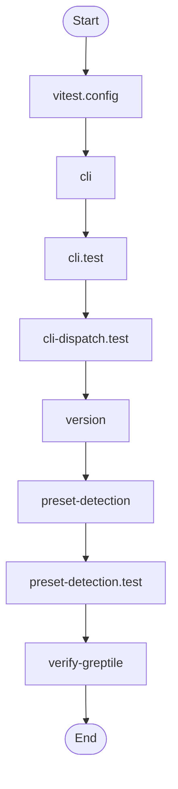
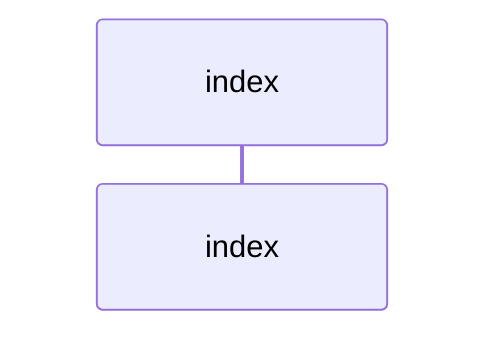

# Diagram Context Pack

Generated: 2026-03-12T10:58:25Z

## architecture


## class


## dependency

```mermaid
graph LR
  ext_inquirer_prompts_4d547149["@inquirer/prompts"] --> node_src_commands_init_a32504f5
  ext_octokit_plugin_retry_c9aecc53["@octokit/plugin-retry"] --> node_src_lib_github_client_51b3b29d
  ext_octokit_plugin_throttling_7909ece3["@octokit/plugin-throttling"] --> node_src_lib_github_client_51b3b29d
  ext_octokit_plugin_throttling_7909ece3["@octokit/plugin-throttling"] --> node_src_lib_gardener_pr_creator_f89e512d
  ext_octokit_request_error_98ae13cc["@octokit/request-error"] --> node_src_lib_github_errors_36723665
  ext_octokit_rest_c6e4d192["@octokit/rest"] --> node_src_lib_github_client_51b3b29d
  ext_octokit_rest_c6e4d192["@octokit/rest"] --> node_src_lib_gardener_pr_creator_f89e512d
  ext_better_sqlite3_d7ed8f1a["better-sqlite3"] --> node_src_lib_context_compound_store_d1f2d9b9
  ext_diff_75a0ee1b["diff"] --> node_src_commands_init_a32504f5
  ext_lodash_901466a5["lodash"] --> node_src_lib_contract_merger_15f87e65
  ext_node_child_process_f62b7d19["node:child_process"] --> node_src_commands_agent_first_throughput_integration__4f0ddd7b
  ext_node_child_process_f62b7d19["node:child_process"] --> node_src_lib_memory_branch_enforcer_f38c3b70
  ext_node_child_process_f62b7d19["node:child_process"] --> node_src_commands_check_diagram_freshness_test_5e858bc8
  ext_node_child_process_f62b7d19["node:child_process"] --> node_src_commands_check_environment_61a1e6d1
  ext_node_child_process_f62b7d19["node:child_process"] --> node_src_commands_check_environment_test_177a8ad6
  ext_node_child_process_f62b7d19["node:child_process"] --> node_src_commands_check_environment_test_177a8ad6
  ext_node_child_process_f62b7d19["node:child_process"] --> node_src_commands_check_environment_test_177a8ad6
  ext_node_child_process_f62b7d19["node:child_process"] --> node_src_commands_check_environment_test_177a8ad6
  ext_node_child_process_f62b7d19["node:child_process"] --> node_src_commands_check_environment_test_177a8ad6
  ext_node_child_process_f62b7d19["node:child_process"] --> node_src_commands_check_environment_test_177a8ad6
  ext_node_child_process_f62b7d19["node:child_process"] --> node_src_lib_pilot_evaluation_control_plane_9fcff894
  ext_node_child_process_f62b7d19["node:child_process"] --> node_src_commands_diff_budget_b8b3e926
  ext_node_child_process_f62b7d19["node:child_process"] --> node_src_commands_diff_budget_test_abd7c3ee
  ext_node_child_process_f62b7d19["node:child_process"] --> node_src_commands_init_a32504f5
  ext_node_child_process_f62b7d19["node:child_process"] --> node_src_commands_init_a32504f5
  ext_node_child_process_f62b7d19["node:child_process"] --> node_src_commands_linear_gate_3a2dbdda
  ext_node_child_process_f62b7d19["node:child_process"] --> node_src_lib_gardener_link_checker_95a109ed
  ext_node_child_process_f62b7d19["node:child_process"] --> node_src_commands_remediate_ae676761
  ext_node_child_process_f62b7d19["node:child_process"] --> node_src_commands_remediate_test_b0fcf4ec
  ext_node_child_process_f62b7d19["node:child_process"] --> node_src_commands_search_8c19fcb1
  ext_node_child_process_f62b7d19["node:child_process"] --> node_src_commands_search_test_ac250e89
  ext_node_child_process_f62b7d19["node:child_process"] --> node_scripts_setup_git_hooks_2ed98c53
  ext_node_child_process_f62b7d19["node:child_process"] --> node_src_commands_ui_loop_14f94e39
  ext_node_child_process_f62b7d19["node:child_process"] --> node_src_commands_ui_loop_test_1c615cb8
  ext_node_child_process_f62b7d19["node:child_process"] --> node_scripts_validate_commit_msg_c49346f6
  ext_node_crypto_c7dfc512["node:crypto"] --> node_src_commands_check_environment_61a1e6d1
  ext_node_crypto_c7dfc512["node:crypto"] --> node_src_cli_test_c0ddbe99
  ext_node_crypto_c7dfc512["node:crypto"] --> node_src_lib_pilot_evaluation_control_plane_9fcff894
  ext_node_crypto_c7dfc512["node:crypto"] --> node_src_commands_docs_gate_a9482c33
  ext_node_crypto_c7dfc512["node:crypto"] --> node_src_lib_automation_idempotency_38074b26
  ext_node_crypto_c7dfc512["node:crypto"] --> node_src_lib_context_compound_indexer_e7ad2047
  ext_node_crypto_c7dfc512["node:crypto"] --> node_src_lib_context_compound_indexer_test_473c7216
  ext_node_crypto_c7dfc512["node:crypto"] --> node_src_commands_init_a32504f5
  ext_node_crypto_c7dfc512["node:crypto"] --> node_src_commands_init_a32504f5
  ext_node_crypto_c7dfc512["node:crypto"] --> node_src_commands_init_test_208f2f42
  ext_node_crypto_c7dfc512["node:crypto"] --> node_src_lib_context_compound_lexical_fallback_eeb9773b
  ext_node_crypto_c7dfc512["node:crypto"] --> node_src_lib_gardener_link_checker_95a109ed
  ext_node_crypto_c7dfc512["node:crypto"] --> node_src_commands_pilot_rollback_9ad729c0
  ext_node_crypto_c7dfc512["node:crypto"] --> node_src_commands_plan_gate_test_d9d60c82
  ext_node_crypto_c7dfc512["node:crypto"] --> node_src_lib_contract_preset_resolver_ed8af332
  ext_node_crypto_c7dfc512["node:crypto"] --> node_src_lib_contract_preset_resolver_test_d386cdbf
  ext_node_crypto_c7dfc512["node:crypto"] --> node_src_commands_remediate_ae676761
  ext_node_crypto_c7dfc512["node:crypto"] --> node_src_lib_contract_run_record_emitter_ae66a1ec
  ext_node_crypto_c7dfc512["node:crypto"] --> node_src_lib_contract_run_records_836e164b
  ext_node_crypto_c7dfc512["node:crypto"] --> node_src_lib_governance_scan_cache_e0415545
  ext_node_crypto_c7dfc512["node:crypto"] --> node_src_commands_simulate_f06a3ac7
  ext_node_crypto_c7dfc512["node:crypto"] --> node_src_lib_context_integrity_sources_be47229b
  ext_node_crypto_c7dfc512["node:crypto"] --> node_src_lib_replay_tracer_c6b49784
  ext_node_crypto_c7dfc512["node:crypto"] --> node_src_commands_ui_loop_14f94e39
  ext_node_crypto_c7dfc512["node:crypto"] --> node_src_commands_verify_greptile_ef23a832
  ext_node_crypto_c7dfc512["node:crypto"] --> node_src_commands_verify_greptile_test_6acf41e8
  ext_node_dns_828a0bbf["node:dns"] --> node_src_lib_governance_url_validator_c0cec5fa
  ext_node_fs_a15b7d96["node:fs"] --> node_src_commands_agent_first_throughput_integration__4f0ddd7b
  ext_node_fs_a15b7d96["node:fs"] --> node_src_commands_blast_radius_test_fb4e7d14
  ext_node_fs_a15b7d96["node:fs"] --> node_src_lib_workflow_brainstorm_test_6ac1356e
  ext_node_fs_a15b7d96["node:fs"] --> node_src_lib_memory_branch_enforcer_f38c3b70
  ext_node_fs_a15b7d96["node:fs"] --> node_src_commands_check_authz_c5a905d9
  ext_node_fs_a15b7d96["node:fs"] --> node_src_commands_check_authz_test_f6b000b3
  ext_node_fs_a15b7d96["node:fs"] --> node_src_commands_check_environment_61a1e6d1
  ext_node_fs_a15b7d96["node:fs"] --> node_src_commands_check_environment_61a1e6d1
  ext_node_fs_a15b7d96["node:fs"] --> node_src_cli_50037f41
  ext_node_fs_a15b7d96["node:fs"] --> node_src_cli_test_c0ddbe99
  ext_node_fs_a15b7d96["node:fs"] --> node_src_lib_policy_command_policy_test_f85a3204
  ext_node_fs_a15b7d96["node:fs"] --> node_src_lib_cli_command_registry_test_30bb0a99
  ext_node_fs_a15b7d96["node:fs"] --> node_src_commands_context_health_c8159838
  ext_node_fs_a15b7d96["node:fs"] --> node_src_commands_context_integrity_acceptance_test_ec3eafae
  ext_node_fs_a15b7d96["node:fs"] --> node_src_commands_context_test_04afd925
  ext_node_fs_a15b7d96["node:fs"] --> node_src_lib_silent_error_detector_06385e9f
  ext_node_fs_a15b7d96["node:fs"] --> node_src_lib_plan_gate_detector_a9899778
  ext_node_fs_a15b7d96["node:fs"] --> node_src_lib_brainstorm_detector_20d990d6
  ext_node_fs_a15b7d96["node:fs"] --> node_src_lib_brainstorm_detector_test_22068a91
  ext_node_fs_a15b7d96["node:fs"] --> node_src_commands_diff_budget_b8b3e926
  ext_node_fs_a15b7d96["node:fs"] --> node_src_commands_diff_budget_test_abd7c3ee
  ext_node_fs_a15b7d96["node:fs"] --> node_src_commands_docs_gate_a9482c33
  ext_node_fs_a15b7d96["node:fs"] --> node_src_commands_docs_gate_test_bebd4eac
  ext_node_fs_a15b7d96["node:fs"] --> node_src_commands_evidence_verify_8b283e40
  ext_node_fs_a15b7d96["node:fs"] --> node_src_commands_evidence_verify_test_d25d21f3
  ext_node_fs_a15b7d96["node:fs"] --> node_src_commands_gap_case_test_1e9bd913
  ext_node_fs_a15b7d96["node:fs"] --> node_src_commands_gardener_16ee9f29
  ext_node_fs_a15b7d96["node:fs"] --> node_src_commands_index_context_76d00fdb
  ext_node_fs_a15b7d96["node:fs"] --> node_src_lib_context_compound_indexer_e7ad2047
  ext_node_fs_a15b7d96["node:fs"] --> node_src_commands_init_a32504f5
  ext_node_fs_a15b7d96["node:fs"] --> node_src_commands_init_a32504f5
  ext_node_fs_a15b7d96["node:fs"] --> node_src_commands_init_a32504f5
  ext_node_fs_a15b7d96["node:fs"] --> node_src_commands_init_test_208f2f42
  ext_node_fs_a15b7d96["node:fs"] --> node_src_commands_init_test_208f2f42
  ext_node_fs_a15b7d96["node:fs"] --> node_src_commands_init_test_208f2f42
  ext_node_fs_a15b7d96["node:fs"] --> node_src_commands_init_test_208f2f42
  ext_node_fs_a15b7d96["node:fs"] --> node_src_commands_init_test_208f2f42
  ext_node_fs_a15b7d96["node:fs"] --> node_src_commands_init_test_208f2f42
  ext_node_fs_a15b7d96["node:fs"] --> node_src_commands_init_test_208f2f42
  ext_node_fs_a15b7d96["node:fs"] --> node_src_commands_init_test_208f2f42
  ext_node_fs_a15b7d96["node:fs"] --> node_src_commands_init_test_208f2f42
  ext_node_fs_a15b7d96["node:fs"] --> node_src_commands_init_test_208f2f42
  ext_node_fs_a15b7d96["node:fs"] --> node_src_commands_init_test_208f2f42
  ext_node_fs_a15b7d96["node:fs"] --> node_src_commands_init_test_208f2f42
  ext_node_fs_a15b7d96["node:fs"] --> node_src_commands_init_test_208f2f42
  ext_node_fs_a15b7d96["node:fs"] --> node_src_commands_init_test_208f2f42
  ext_node_fs_a15b7d96["node:fs"] --> node_src_commands_init_test_208f2f42
  ext_node_fs_a15b7d96["node:fs"] --> node_src_commands_init_test_208f2f42
  ext_node_fs_a15b7d96["node:fs"] --> node_src_commands_init_test_208f2f42
  ext_node_fs_a15b7d96["node:fs"] --> node_src_commands_init_test_208f2f42
  ext_node_fs_a15b7d96["node:fs"] --> node_src_commands_init_test_208f2f42
  ext_node_fs_a15b7d96["node:fs"] --> node_src_commands_init_test_208f2f42
  ext_node_fs_a15b7d96["node:fs"] --> node_src_commands_init_test_208f2f42
  ext_node_fs_a15b7d96["node:fs"] --> node_src_commands_init_test_208f2f42
  ext_node_fs_a15b7d96["node:fs"] --> node_src_commands_init_test_208f2f42
  ext_node_fs_a15b7d96["node:fs"] --> node_src_commands_init_test_208f2f42
  ext_node_fs_a15b7d96["node:fs"] --> node_src_commands_init_test_208f2f42
  ext_node_fs_a15b7d96["node:fs"] --> node_src_commands_init_test_208f2f42
  ext_node_fs_a15b7d96["node:fs"] --> node_src_commands_init_test_208f2f42
  ext_node_fs_a15b7d96["node:fs"] --> node_src_commands_init_test_208f2f42
  ext_node_fs_a15b7d96["node:fs"] --> node_src_commands_init_test_208f2f42
  ext_node_fs_a15b7d96["node:fs"] --> node_src_commands_init_test_208f2f42
  ext_node_fs_a15b7d96["node:fs"] --> node_src_commands_init_test_208f2f42
  ext_node_fs_a15b7d96["node:fs"] --> node_src_commands_init_test_208f2f42
  ext_node_fs_a15b7d96["node:fs"] --> node_src_commands_init_test_208f2f42
  ext_node_fs_a15b7d96["node:fs"] --> node_src_commands_init_test_208f2f42
  ext_node_fs_a15b7d96["node:fs"] --> node_src_commands_init_test_208f2f42
  ext_node_fs_a15b7d96["node:fs"] --> node_src_commands_init_test_208f2f42
  ext_node_fs_a15b7d96["node:fs"] --> node_src_commands_init_test_208f2f42
  ext_node_fs_a15b7d96["node:fs"] --> node_src_commands_init_test_208f2f42
  ext_node_fs_a15b7d96["node:fs"] --> node_src_commands_init_test_208f2f42
  ext_node_fs_a15b7d96["node:fs"] --> node_src_commands_init_test_208f2f42
  ext_node_fs_a15b7d96["node:fs"] --> node_src_commands_init_test_208f2f42
  ext_node_fs_a15b7d96["node:fs"] --> node_src_commands_init_test_208f2f42
  ext_node_fs_a15b7d96["node:fs"] --> node_src_commands_init_test_208f2f42
  ext_node_fs_a15b7d96["node:fs"] --> node_src_commands_init_test_208f2f42
  ext_node_fs_a15b7d96["node:fs"] --> node_src_commands_init_test_208f2f42
  ext_node_fs_a15b7d96["node:fs"] --> node_src_commands_init_test_208f2f42
  ext_node_fs_a15b7d96["node:fs"] --> node_src_lib_cli_legacy_dispatch_guard_test_c6d6c5c7
  ext_node_fs_a15b7d96["node:fs"] --> node_src_commands_linear_gate_3a2dbdda
  ext_node_fs_a15b7d96["node:fs"] --> node_src_commands_linear_gate_test_d7fab54c
  ext_node_fs_a15b7d96["node:fs"] --> node_src_lib_gardener_link_checker_95a109ed
  ext_node_fs_a15b7d96["node:fs"] --> node_src_lib_evidence_loader_05d04a48
  ext_node_fs_a15b7d96["node:fs"] --> node_src_lib_evidence_loader_05d04a48
  ext_node_fs_a15b7d96["node:fs"] --> node_src_lib_contract_loader_c7304ec8
  ext_node_fs_a15b7d96["node:fs"] --> node_src_lib_contract_loader_test_5aaec341
  ext_node_fs_a15b7d96["node:fs"] --> node_src_lib_pilot_evaluation_metrics_capture_6a557a25
  ext_node_fs_a15b7d96["node:fs"] --> node_src_lib_memory_metrics_tracker_test_2fadfb06
  ext_node_fs_a15b7d96["node:fs"] --> node_src_commands_org_audit_bd496958
  ext_node_fs_a15b7d96["node:fs"] --> node_src_commands_org_audit_test_8f29d4e0
  ext_node_fs_a15b7d96["node:fs"] --> node_src_commands_pilot_evaluate_83c96a06
  ext_node_fs_a15b7d96["node:fs"] --> node_src_commands_pilot_evaluate_test_983799d7
  ext_node_fs_a15b7d96["node:fs"] --> node_src_commands_pilot_rollback_test_635b55ad
  ext_node_fs_a15b7d96["node:fs"] --> node_src_commands_pilot_rollback_test_635b55ad
  ext_node_fs_a15b7d96["node:fs"] --> node_src_commands_pilot_rollback_test_635b55ad
  ext_node_fs_a15b7d96["node:fs"] --> node_src_commands_pilot_rollback_test_635b55ad
  ext_node_fs_a15b7d96["node:fs"] --> node_src_commands_pilot_rollback_test_635b55ad
  ext_node_fs_a15b7d96["node:fs"] --> node_src_commands_pilot_rollback_test_635b55ad
  ext_node_fs_a15b7d96["node:fs"] --> node_src_commands_pilot_rollback_test_635b55ad
  ext_node_fs_a15b7d96["node:fs"] --> node_src_commands_plan_gate_test_d9d60c82
  ext_node_fs_a15b7d96["node:fs"] --> node_src_lib_preset_detection_df7bb651
  ext_node_fs_a15b7d96["node:fs"] --> node_src_lib_contract_preset_resolver_ed8af332
  ext_node_fs_a15b7d96["node:fs"] --> node_src_commands_prompt_gate_bda26456
  ext_node_fs_a15b7d96["node:fs"] --> node_src_lib_gardener_quality_scorer_8fe3e3db
  ext_node_fs_a15b7d96["node:fs"] --> node_src_lib_pilot_evaluation_registries_0709e622
  ext_node_fs_a15b7d96["node:fs"] --> node_src_commands_remediate_test_b0fcf4ec
  ext_node_fs_a15b7d96["node:fs"] --> node_src_commands_replay_test_1134c260
  ext_node_fs_a15b7d96["node:fs"] --> node_src_lib_governance_repo_scanner_6df641c5
  ext_node_fs_a15b7d96["node:fs"] --> node_src_lib_contract_run_record_emitter_ae66a1ec
  ext_node_fs_a15b7d96["node:fs"] --> node_src_lib_contract_run_records_test_29458901
  ext_node_fs_a15b7d96["node:fs"] --> node_src_lib_governance_scan_cache_test_6c8cf65d
  ext_node_fs_a15b7d96["node:fs"] --> node_src_lib_governance_scan_cache_test_6c8cf65d
  ext_node_fs_a15b7d96["node:fs"] --> node_scripts_setup_git_hooks_2ed98c53
  ext_node_fs_a15b7d96["node:fs"] --> node_src_commands_simulate_f06a3ac7
  ext_node_fs_a15b7d96["node:fs"] --> node_src_commands_simulate_test_17cdb2fd
  ext_node_fs_a15b7d96["node:fs"] --> node_src_lib_gardener_stale_detector_3ad97daa
  ext_node_fs_a15b7d96["node:fs"] --> node_src_lib_gardener_stale_detector_test_ae0df545
  ext_node_fs_a15b7d96["node:fs"] --> node_src_lib_context_compound_store_d1f2d9b9
  ext_node_fs_a15b7d96["node:fs"] --> node_src_lib_context_compound_store_d1f2d9b9
  ext_node_fs_a15b7d96["node:fs"] --> node_src_commands_tooling_audit_6606d949
  ext_node_fs_a15b7d96["node:fs"] --> node_src_commands_tooling_audit_test_874a714a
  ext_node_fs_a15b7d96["node:fs"] --> node_src_lib_replay_tracer_c6b49784
  ext_node_fs_a15b7d96["node:fs"] --> node_src_lib_replay_tracer_c6b49784
  ext_node_fs_a15b7d96["node:fs"] --> node_src_lib_replay_tracer_test_eec65c7d
  ext_node_fs_a15b7d96["node:fs"] --> node_src_lib_replay_tracer_test_eec65c7d
  ext_node_fs_a15b7d96["node:fs"] --> node_src_commands_ui_loop_14f94e39
  ext_node_fs_a15b7d96["node:fs"] --> node_src_commands_ui_loop_test_1c615cb8
  ext_node_fs_a15b7d96["node:fs"] --> node_scripts_validate_commit_msg_c49346f6
  ext_node_fs_a15b7d96["node:fs"] --> node_src_lib_preflight_validator_4657555d
  ext_node_fs_a15b7d96["node:fs"] --> node_src_lib_memory_validator_dbba8eeb
  ext_node_fs_a15b7d96["node:fs"] --> node_src_lib_input_validator_b95e8971
  ext_node_fs_a15b7d96["node:fs"] --> node_src_lib_evidence_validator_4a254158
  ext_node_fs_a15b7d96["node:fs"] --> node_src_lib_evidence_validator_4a254158
  ext_node_fs_a15b7d96["node:fs"] --> node_src_lib_preflight_validator_test_580e17d6
  ext_node_fs_a15b7d96["node:fs"] --> node_src_lib_memory_validator_test_66feb032
  ext_node_fs_a15b7d96["node:fs"] --> node_src_lib_evidence_validator_test_9ebe4bd6
  ext_node_fs_a15b7d96["node:fs"] --> node_src_commands_verify_greptile_ef23a832
  ext_node_fs_a15b7d96["node:fs"] --> node_src_commands_verify_greptile_test_6acf41e8
  ext_node_fs_a15b7d96["node:fs"] --> node_src_lib_version_337bb7ee
  ext_node_os_d93fe73a["node:os"] --> node_src_commands_automation_run_test_e2f83281
  ext_node_os_d93fe73a["node:os"] --> node_src_commands_blast_radius_test_fb4e7d14
  ext_node_os_d93fe73a["node:os"] --> node_src_commands_check_diagram_freshness_test_5e858bc8
  ext_node_os_d93fe73a["node:os"] --> node_src_commands_check_environment_test_177a8ad6
  ext_node_os_d93fe73a["node:os"] --> node_src_commands_context_test_04afd925
  ext_node_os_d93fe73a["node:os"] --> node_src_lib_silent_error_detector_test_f1fe45a6
  ext_node_os_d93fe73a["node:os"] --> node_src_commands_evidence_verify_test_d25d21f3
  ext_node_os_d93fe73a["node:os"] --> node_src_commands_index_context_test_552c8613
  ext_node_os_d93fe73a["node:os"] --> node_src_lib_context_compound_indexer_test_473c7216
  ext_node_os_d93fe73a["node:os"] --> node_src_commands_init_test_208f2f42
  ext_node_os_d93fe73a["node:os"] --> node_src_commands_linear_gate_test_d7fab54c
  ext_node_os_d93fe73a["node:os"] --> node_src_lib_gardener_link_checker_95a109ed
  ext_node_os_d93fe73a["node:os"] --> node_src_commands_org_audit_test_8f29d4e0
  ext_node_os_d93fe73a["node:os"] --> node_src_commands_pilot_rollback_test_635b55ad
  ext_node_os_d93fe73a["node:os"] --> node_src_commands_replay_test_1134c260
  ext_node_os_d93fe73a["node:os"] --> node_src_lib_governance_scan_cache_test_6c8cf65d
  ext_node_os_d93fe73a["node:os"] --> node_src_lib_governance_scan_cache_test_6c8cf65d
  ext_node_os_d93fe73a["node:os"] --> node_src_commands_simulate_test_17cdb2fd
  ext_node_os_d93fe73a["node:os"] --> node_src_commands_tooling_audit_test_874a714a
  ext_node_os_d93fe73a["node:os"] --> node_src_lib_preflight_validator_test_580e17d6
  ext_node_os_d93fe73a["node:os"] --> node_src_lib_memory_validator_test_66feb032
  ext_node_os_d93fe73a["node:os"] --> node_src_lib_input_validator_test_4844e0b1
  ext_node_os_d93fe73a["node:os"] --> node_src_lib_evidence_validator_test_9ebe4bd6
  ext_node_os_d93fe73a["node:os"] --> node_src_commands_verify_greptile_test_6acf41e8
  ext_node_path_78811c13["node:path"] --> node_src_commands_agent_first_throughput_integration__4f0ddd7b
  ext_node_path_78811c13["node:path"] --> node_src_commands_automation_run_2d0faa41
  ext_node_path_78811c13["node:path"] --> node_src_commands_automation_run_test_e2f83281
  ext_node_path_78811c13["node:path"] --> node_src_commands_blast_radius_test_fb4e7d14
  ext_node_path_78811c13["node:path"] --> node_src_lib_workflow_brainstorm_6ca71c32
  ext_node_path_78811c13["node:path"] --> node_src_lib_workflow_brainstorm_test_6ac1356e
  ext_node_path_78811c13["node:path"] --> node_src_lib_memory_branch_enforcer_f38c3b70
  ext_node_path_78811c13["node:path"] --> node_src_commands_check_authz_c5a905d9
  ext_node_path_78811c13["node:path"] --> node_src_commands_check_authz_test_f6b000b3
  ext_node_path_78811c13["node:path"] --> node_src_commands_check_diagram_freshness_test_5e858bc8
  ext_node_path_78811c13["node:path"] --> node_src_commands_check_environment_61a1e6d1
  ext_node_path_78811c13["node:path"] --> node_src_commands_check_environment_test_177a8ad6
  ext_node_path_78811c13["node:path"] --> node_src_cli_50037f41
  ext_node_path_78811c13["node:path"] --> node_src_cli_test_c0ddbe99
  ext_node_path_78811c13["node:path"] --> node_src_lib_policy_command_policy_test_f85a3204
  ext_node_path_78811c13["node:path"] --> node_src_lib_cli_command_registry_test_30bb0a99
  ext_node_path_78811c13["node:path"] --> node_src_commands_context_a173b3b5
  ext_node_path_78811c13["node:path"] --> node_src_commands_context_health_c8159838
  ext_node_path_78811c13["node:path"] --> node_src_commands_context_integrity_acceptance_test_ec3eafae
  ext_node_path_78811c13["node:path"] --> node_src_commands_context_test_04afd925
  ext_node_path_78811c13["node:path"] --> node_src_lib_pilot_evaluation_control_plane_9fcff894
  ext_node_path_78811c13["node:path"] --> node_src_lib_pilot_evaluation_control_plane_test_6b85b9d4
  ext_node_path_78811c13["node:path"] --> node_src_lib_silent_error_detector_06385e9f
  ext_node_path_78811c13["node:path"] --> node_src_lib_plan_gate_detector_a9899778
  ext_node_path_78811c13["node:path"] --> node_src_lib_brainstorm_detector_20d990d6
  ext_node_path_78811c13["node:path"] --> node_src_lib_silent_error_detector_test_f1fe45a6
  ext_node_path_78811c13["node:path"] --> node_src_lib_brainstorm_detector_test_22068a91
  ext_node_path_78811c13["node:path"] --> node_src_commands_docs_gate_a9482c33
  ext_node_path_78811c13["node:path"] --> node_src_commands_docs_gate_test_bebd4eac
  ext_node_path_78811c13["node:path"] --> node_src_commands_drift_gate_5163a260
  ext_node_path_78811c13["node:path"] --> node_src_commands_drift_gate_test_46e320e7
  ext_node_path_78811c13["node:path"] --> node_src_commands_evidence_verify_8b283e40
  ext_node_path_78811c13["node:path"] --> node_src_commands_evidence_verify_test_d25d21f3
  ext_node_path_78811c13["node:path"] --> node_src_commands_gap_case_f7fe09bc
  ext_node_path_78811c13["node:path"] --> node_src_commands_gap_case_test_1e9bd913
  ext_node_path_78811c13["node:path"] --> node_src_commands_gardener_16ee9f29
  ext_node_path_78811c13["node:path"] --> node_src_commands_gardener_test_01d5ad19
  ext_node_path_78811c13["node:path"] --> node_src_lib_automation_idempotency_38074b26
  ext_node_path_78811c13["node:path"] --> node_src_commands_index_context_76d00fdb
  ext_node_path_78811c13["node:path"] --> node_src_commands_index_context_test_552c8613
  ext_node_path_78811c13["node:path"] --> node_src_lib_context_compound_indexer_e7ad2047
  ext_node_path_78811c13["node:path"] --> node_src_lib_context_compound_indexer_test_473c7216
  ext_node_path_78811c13["node:path"] --> node_src_commands_init_a32504f5
  ext_node_path_78811c13["node:path"] --> node_src_commands_init_a32504f5
  ext_node_path_78811c13["node:path"] --> node_src_commands_init_a32504f5
  ext_node_path_78811c13["node:path"] --> node_src_commands_init_test_208f2f42
  ext_node_path_78811c13["node:path"] --> node_src_lib_cli_legacy_dispatch_guard_test_c6d6c5c7
  ext_node_path_78811c13["node:path"] --> node_src_lib_context_compound_lexical_fallback_eeb9773b
  ext_node_path_78811c13["node:path"] --> node_src_commands_linear_gate_3a2dbdda
  ext_node_path_78811c13["node:path"] --> node_src_commands_linear_gate_test_d7fab54c
  ext_node_path_78811c13["node:path"] --> node_src_lib_gardener_link_checker_95a109ed
  ext_node_path_78811c13["node:path"] --> node_src_lib_evidence_loader_05d04a48
  ext_node_path_78811c13["node:path"] --> node_src_lib_contract_loader_test_5aaec341
  ext_node_path_78811c13["node:path"] --> node_src_lib_pilot_evaluation_metrics_capture_6a557a25
  ext_node_path_78811c13["node:path"] --> node_src_lib_memory_metrics_tracker_8f20bcc7
  ext_node_path_78811c13["node:path"] --> node_src_lib_memory_metrics_tracker_test_2fadfb06
  ext_node_path_78811c13["node:path"] --> node_src_commands_org_audit_bd496958
  ext_node_path_78811c13["node:path"] --> node_src_commands_org_audit_test_8f29d4e0
  ext_node_path_78811c13["node:path"] --> node_src_commands_pilot_evaluate_83c96a06
  ext_node_path_78811c13["node:path"] --> node_src_commands_pilot_evaluate_test_983799d7
  ext_node_path_78811c13["node:path"] --> node_src_commands_pilot_rollback_9ad729c0
  ext_node_path_78811c13["node:path"] --> node_src_commands_pilot_rollback_test_635b55ad
  ext_node_path_78811c13["node:path"] --> node_src_lib_workflow_plan_1246fd80
  ext_node_path_78811c13["node:path"] --> node_src_commands_plan_gate_test_d9d60c82
  ext_node_path_78811c13["node:path"] --> node_src_lib_workflow_plan_test_09539389
  ext_node_path_78811c13["node:path"] --> node_src_lib_preset_detection_df7bb651
  ext_node_path_78811c13["node:path"] --> node_src_lib_contract_preset_resolver_ed8af332
  ext_node_path_78811c13["node:path"] --> node_src_commands_prompt_gate_bda26456
  ext_node_path_78811c13["node:path"] --> node_src_lib_gardener_quality_scorer_8fe3e3db
  ext_node_path_78811c13["node:path"] --> node_src_lib_pilot_evaluation_registries_0709e622
  ext_node_path_78811c13["node:path"] --> node_src_commands_remediate_ae676761
  ext_node_path_78811c13["node:path"] --> node_src_commands_replay_fcae3a4a
  ext_node_path_78811c13["node:path"] --> node_src_commands_replay_test_1134c260
  ext_node_path_78811c13["node:path"] --> node_src_lib_governance_repo_scanner_6df641c5
  ext_node_path_78811c13["node:path"] --> node_src_lib_governance_repo_scanner_test_8643e7e8
  ext_node_path_78811c13["node:path"] --> node_src_lib_contract_run_record_emitter_ae66a1ec
  ext_node_path_78811c13["node:path"] --> node_src_lib_contract_run_records_836e164b
  ext_node_path_78811c13["node:path"] --> node_src_lib_contract_run_records_test_29458901
  ext_node_path_78811c13["node:path"] --> node_src_lib_governance_scan_cache_e0415545
  ext_node_path_78811c13["node:path"] --> node_src_lib_governance_scan_cache_test_6c8cf65d
  ext_node_path_78811c13["node:path"] --> node_src_lib_governance_scan_cache_test_6c8cf65d
  ext_node_path_78811c13["node:path"] --> node_src_commands_search_8c19fcb1
  ext_node_path_78811c13["node:path"] --> node_scripts_setup_git_hooks_2ed98c53
  ext_node_path_78811c13["node:path"] --> node_src_commands_simulate_f06a3ac7
  ext_node_path_78811c13["node:path"] --> node_src_commands_simulate_test_17cdb2fd
  ext_node_path_78811c13["node:path"] --> node_src_lib_context_integrity_sources_be47229b
  ext_node_path_78811c13["node:path"] --> node_src_lib_gardener_stale_detector_3ad97daa
  ext_node_path_78811c13["node:path"] --> node_src_lib_gardener_stale_detector_test_ae0df545
  ext_node_path_78811c13["node:path"] --> node_src_lib_context_compound_store_d1f2d9b9
  ext_node_path_78811c13["node:path"] --> node_src_commands_tooling_audit_6606d949
  ext_node_path_78811c13["node:path"] --> node_src_commands_tooling_audit_test_874a714a
  ext_node_path_78811c13["node:path"] --> node_src_lib_replay_tracer_c6b49784
  ext_node_path_78811c13["node:path"] --> node_src_commands_ui_loop_14f94e39
  ext_node_path_78811c13["node:path"] --> node_src_lib_preflight_validator_4657555d
  ext_node_path_78811c13["node:path"] --> node_src_lib_memory_validator_dbba8eeb
  ext_node_path_78811c13["node:path"] --> node_src_lib_input_validator_b95e8971
  ext_node_path_78811c13["node:path"] --> node_src_lib_evidence_validator_4a254158
  ext_node_path_78811c13["node:path"] --> node_src_lib_preflight_validator_test_580e17d6
  ext_node_path_78811c13["node:path"] --> node_src_lib_memory_validator_test_66feb032
  ext_node_path_78811c13["node:path"] --> node_src_lib_input_validator_test_4844e0b1
  ext_node_path_78811c13["node:path"] --> node_src_lib_evidence_validator_test_9ebe4bd6
  ext_node_path_78811c13["node:path"] --> node_src_commands_verify_greptile_ef23a832
  ext_node_path_78811c13["node:path"] --> node_src_commands_verify_greptile_test_6acf41e8
  ext_node_path_78811c13["node:path"] --> node_src_lib_version_337bb7ee
  ext_node_process_00cdf119["node:process"] --> node_src_commands_init_a32504f5
  ext_node_url_d0cb3ad7["node:url"] --> node_src_cli_50037f41
  ext_node_url_d0cb3ad7["node:url"] --> node_src_cli_test_c0ddbe99
  ext_node_url_d0cb3ad7["node:url"] --> node_src_lib_pilot_evaluation_control_plane_9fcff894
  ext_node_url_d0cb3ad7["node:url"] --> node_src_lib_contract_preset_resolver_ed8af332
  ext_node_url_d0cb3ad7["node:url"] --> node_src_commands_ui_loop_14f94e39
  ext_node_url_d0cb3ad7["node:url"] --> node_src_lib_version_337bb7ee
  ext_picomatch_2ebdbf14["picomatch"] --> node_src_lib_evidence_policy_c212a2b9
  ext_picomatch_2ebdbf14["picomatch"] --> node_src_lib_blast_radius_resolver_5f0dc5b6
  ext_picomatch_2ebdbf14["picomatch"] --> node_src_lib_policy_risk_tier_6393c9ab
  ext_semver_b4039641["semver"] --> node_src_commands_check_environment_61a1e6d1
  ext_semver_b4039641["semver"] --> node_src_commands_init_a32504f5
  ext_sqlite_vec_bae73cf2["sqlite-vec"] --> node_src_lib_context_compound_store_d1f2d9b9
  ext_vitest_4c9cfa13["vitest"] --> node_src_commands_agent_first_throughput_integration__4f0ddd7b
  ext_vitest_4c9cfa13["vitest"] --> node_src_commands_automation_run_test_e2f83281
  ext_vitest_4c9cfa13["vitest"] --> node_src_lib_linear_automation_test_aac87654
  ext_vitest_4c9cfa13["vitest"] --> node_src_commands_blast_radius_test_fb4e7d14
  ext_vitest_4c9cfa13["vitest"] --> node_src_lib_workflow_brainstorm_test_6ac1356e
  ext_vitest_4c9cfa13["vitest"] --> node_src_commands_branch_protect_test_d26f0ed4
  ext_vitest_4c9cfa13["vitest"] --> node_src_lib_observability_cardinality_test_d82dcea7
  ext_vitest_4c9cfa13["vitest"] --> node_src_commands_check_authz_test_f6b000b3
  ext_vitest_4c9cfa13["vitest"] --> node_src_commands_check_diagram_freshness_test_5e858bc8
  ext_vitest_4c9cfa13["vitest"] --> node_src_commands_check_environment_test_177a8ad6
  ext_vitest_4c9cfa13["vitest"] --> node_src_cli_dispatch_test_83d1aecc
  ext_vitest_4c9cfa13["vitest"] --> node_src_cli_test_c0ddbe99
  ext_vitest_4c9cfa13["vitest"] --> node_src_lib_policy_command_policy_test_f85a3204
  ext_vitest_4c9cfa13["vitest"] --> node_src_lib_cli_command_registry_test_30bb0a99
  ext_vitest_4c9cfa13["vitest"] --> node_src_lib_github_comments_test_e411297a
  ext_vitest_4c9cfa13["vitest"] --> node_src_lib_context_compound_constants_test_c131a9ba
  ext_vitest_4c9cfa13["vitest"] --> node_src_commands_context_integrity_acceptance_test_ec3eafae
  ext_vitest_4c9cfa13["vitest"] --> node_src_commands_context_test_04afd925
  ext_vitest_4c9cfa13["vitest"] --> node_src_lib_pilot_evaluation_control_plane_test_6b85b9d4
  ext_vitest_4c9cfa13["vitest"] --> node_src_lib_silent_error_detector_test_f1fe45a6
  ext_vitest_4c9cfa13["vitest"] --> node_src_lib_brainstorm_detector_test_22068a91
  ext_vitest_4c9cfa13["vitest"] --> node_src_commands_diff_budget_test_abd7c3ee
  ext_vitest_4c9cfa13["vitest"] --> node_src_lib_cli_doc_parity_test_deda4d95
  ext_vitest_4c9cfa13["vitest"] --> node_src_commands_docs_gate_test_bebd4eac
  ext_vitest_4c9cfa13["vitest"] --> node_src_commands_drift_gate_test_46e320e7
  ext_vitest_4c9cfa13["vitest"] --> node_src_commands_evidence_verify_test_d25d21f3
  ext_vitest_4c9cfa13["vitest"] --> node_src_lib_remediation_finding_normalizer_test_8082eaaf
  ext_vitest_4c9cfa13["vitest"] --> node_src_commands_gap_case_test_1e9bd913
  ext_vitest_4c9cfa13["vitest"] --> node_src_commands_gardener_test_01d5ad19
  ext_vitest_4c9cfa13["vitest"] --> node_src_lib_cli_help_renderer_test_063a8bbc
  ext_vitest_4c9cfa13["vitest"] --> node_src_commands_index_context_test_552c8613
  ext_vitest_4c9cfa13["vitest"] --> node_src_lib_context_compound_indexer_test_473c7216
  ext_vitest_4c9cfa13["vitest"] --> node_src_commands_init_test_208f2f42
  ext_vitest_4c9cfa13["vitest"] --> node_src_lib_cli_legacy_dispatch_guard_test_c6d6c5c7
  ext_vitest_4c9cfa13["vitest"] --> node_src_commands_linear_gate_test_d7fab54c
  ext_vitest_4c9cfa13["vitest"] --> node_src_commands_linear_prepare_test_e563937e
  ext_vitest_4c9cfa13["vitest"] --> node_src_commands_linear_workflow_test_b60c6e12
  ext_vitest_4c9cfa13["vitest"] --> node_src_lib_contract_loader_test_5aaec341
  ext_vitest_4c9cfa13["vitest"] --> node_src_lib_contract_merger_test_9319ae2c
  ext_vitest_4c9cfa13["vitest"] --> node_src_lib_memory_metrics_tracker_test_2fadfb06
  ext_vitest_4c9cfa13["vitest"] --> node_src_lib_github_mutation_queue_test_4604276b
  ext_vitest_4c9cfa13["vitest"] --> node_src_commands_observability_gate_test_72a003c4
  ext_vitest_4c9cfa13["vitest"] --> node_src_lib_context_compound_ollama_test_972f3fc8
  ext_vitest_4c9cfa13["vitest"] --> node_src_lib_remediation_orchestrator_test_e409976c
  ext_vitest_4c9cfa13["vitest"] --> node_src_commands_org_audit_test_8f29d4e0
  ext_vitest_4c9cfa13["vitest"] --> node_src_commands_pilot_evaluate_test_983799d7
  ext_vitest_4c9cfa13["vitest"] --> node_src_commands_pilot_rollback_test_635b55ad
  ext_vitest_4c9cfa13["vitest"] --> node_src_commands_plan_gate_test_d9d60c82
  ext_vitest_4c9cfa13["vitest"] --> node_src_lib_workflow_plan_test_09539389
  ext_vitest_4c9cfa13["vitest"] --> node_src_commands_policy_gate_test_558cba5e
  ext_vitest_4c9cfa13["vitest"] --> node_src_lib_evidence_policy_test_0fda159e
  ext_vitest_4c9cfa13["vitest"] --> node_src_lib_preset_detection_test_26643c48
  ext_vitest_4c9cfa13["vitest"] --> node_src_lib_contract_preset_resolver_test_d386cdbf
  ext_vitest_4c9cfa13["vitest"] --> node_src_commands_preset_test_ad6ae07f
  ext_vitest_4c9cfa13["vitest"] --> node_src_commands_prompt_gate_test_8ce58238
  ext_vitest_4c9cfa13["vitest"] --> node_src_lib_deps_ralph_runtime_test_76613c79
  ext_vitest_4c9cfa13["vitest"] --> node_src_commands_remediate_test_b0fcf4ec
  ext_vitest_4c9cfa13["vitest"] --> node_src_commands_replay_test_1134c260
  ext_vitest_4c9cfa13["vitest"] --> node_src_lib_governance_repo_scanner_test_8643e7e8
  ext_vitest_4c9cfa13["vitest"] --> node_src_commands_request_greptile_review_test_babe6fa5
  ext_vitest_4c9cfa13["vitest"] --> node_src_lib_blast_radius_resolver_test_2434a14b
  ext_vitest_4c9cfa13["vitest"] --> node_src_commands_review_gate_test_dea5880b
  ext_vitest_4c9cfa13["vitest"] --> node_src_lib_policy_risk_tier_test_60010fdc
  ext_vitest_4c9cfa13["vitest"] --> node_src_lib_contract_run_record_emitter_test_6d46c5c8
  ext_vitest_4c9cfa13["vitest"] --> node_src_lib_contract_run_records_test_29458901
  ext_vitest_4c9cfa13["vitest"] --> node_src_lib_input_sanitize_test_1e7f2d95
  ext_vitest_4c9cfa13["vitest"] --> node_src_lib_governance_scan_cache_test_6c8cf65d
  ext_vitest_4c9cfa13["vitest"] --> node_src_commands_search_test_ac250e89
  ext_vitest_4c9cfa13["vitest"] --> node_src_lib_github_sha_test_f22f6abd
  ext_vitest_4c9cfa13["vitest"] --> node_src_commands_simulate_test_17cdb2fd
  ext_vitest_4c9cfa13["vitest"] --> node_src_lib_gardener_stale_detector_test_ae0df545
  ext_vitest_4c9cfa13["vitest"] --> node_src_commands_tooling_audit_test_874a714a
  ext_vitest_4c9cfa13["vitest"] --> node_src_lib_replay_tracer_test_eec65c7d
  ext_vitest_4c9cfa13["vitest"] --> node_src_commands_ui_loop_test_1c615cb8
  ext_vitest_4c9cfa13["vitest"] --> node_src_lib_governance_url_validator_secure_fetch_te_f62ff797
  ext_vitest_4c9cfa13["vitest"] --> node_src_lib_governance_url_validator_test_88688db7
  ext_vitest_4c9cfa13["vitest"] --> node_src_lib_linear_utils_test_73543a4a
  ext_vitest_4c9cfa13["vitest"] --> node_src_lib_input_validation_test_edefff50
  ext_vitest_4c9cfa13["vitest"] --> node_src_lib_preflight_validator_test_580e17d6
  ext_vitest_4c9cfa13["vitest"] --> node_src_lib_memory_validator_test_66feb032
  ext_vitest_4c9cfa13["vitest"] --> node_src_lib_input_validator_test_4844e0b1
  ext_vitest_4c9cfa13["vitest"] --> node_src_lib_evidence_validator_test_9ebe4bd6
  ext_vitest_4c9cfa13["vitest"] --> node_src_lib_contract_validator_test_be05f8e6
  ext_vitest_4c9cfa13["vitest"] --> node_src_commands_verify_greptile_test_6acf41e8
  ext_vitest_4c9cfa13["vitest"] --> node_vitest_config_79ed63ec
  style ext_better_sqlite3_d7ed8f1a fill:#f59e0b,color:#fff
  style ext_diff_75a0ee1b fill:#f59e0b,color:#fff
  style ext_inquirer_prompts_4d547149 fill:#f59e0b,color:#fff
  style ext_lodash_901466a5 fill:#f59e0b,color:#fff
  style ext_node_child_process_f62b7d19 fill:#f59e0b,color:#fff
  style ext_node_crypto_c7dfc512 fill:#f59e0b,color:#fff
  style ext_node_dns_828a0bbf fill:#f59e0b,color:#fff
  style ext_node_fs_a15b7d96 fill:#f59e0b,color:#fff
  style ext_node_os_d93fe73a fill:#f59e0b,color:#fff
  style ext_node_path_78811c13 fill:#f59e0b,color:#fff
  style ext_node_process_00cdf119 fill:#f59e0b,color:#fff
  style ext_node_url_d0cb3ad7 fill:#f59e0b,color:#fff
  style ext_octokit_plugin_retry_c9aecc53 fill:#f59e0b,color:#fff
  style ext_octokit_plugin_throttling_7909ece3 fill:#f59e0b,color:#fff
  style ext_octokit_request_error_98ae13cc fill:#f59e0b,color:#fff
  style ext_octokit_rest_c6e4d192 fill:#f59e0b,color:#fff
  style ext_picomatch_2ebdbf14 fill:#f59e0b,color:#fff
  style ext_semver_b4039641 fill:#f59e0b,color:#fff
  style ext_sqlite_vec_bae73cf2 fill:#f59e0b,color:#fff
  style ext_vitest_4c9cfa13 fill:#f59e0b,color:#fff

```

## flow



## sequence



