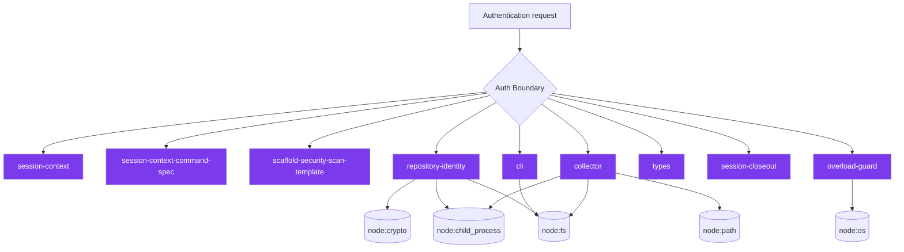
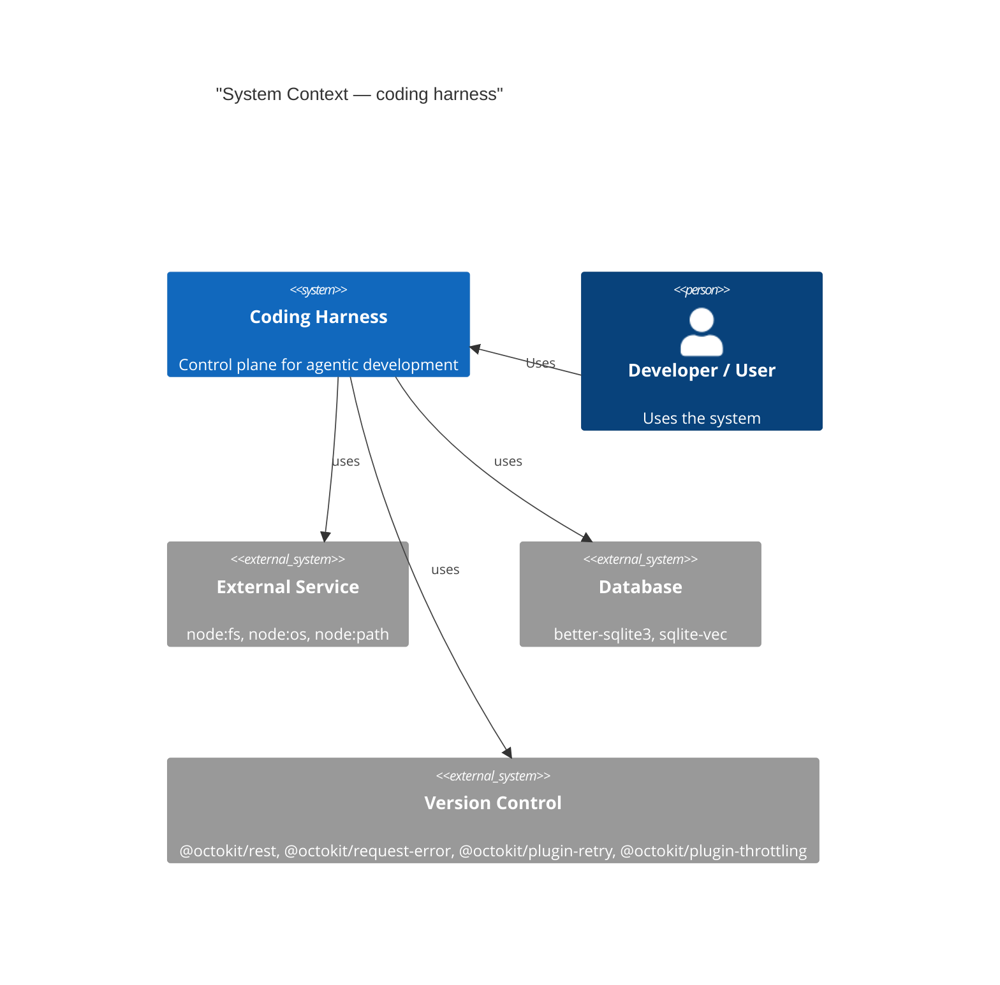
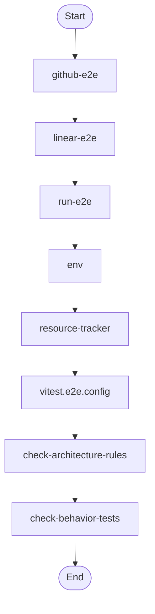

# Diagram Context Pack

Generated: 2026-06-19T01:30:59Z

## Table of Contents

- [How to use this pack](#how-to-use-this-pack)
- [agent](#agent)
- [architecture](#architecture)
- [auth](#auth)
- [c4context](#c4context)
- [class](#class)
- [database](#database)
- [dependency](#dependency)
- [erd](#erd)
- [events](#events)
- [flow](#flow)
- [rag](#rag)
- [security](#security)
- [sequence](#sequence)
- [user](#user)

## How to use this pack

- Start here for compact architecture, dependency, database, and ERD context before opening raw source files.
- Use .diagram/manifest.json to choose a focused Mermaid file when this combined pack is too large.
- For TypeScript implementation detail in this checkout, run `bash scripts/harness-cli.sh source-outline <path> --json` first, then unwrap one symbol with `--symbol <name>`. Downstream repositories can use `harness source-outline <path>`.

## Changed source focus

- These architecture-sensitive paths changed on the current branch and may be compacted out of Mermaid diagrams.
- `src/commands/automation-run-records.ts`
- `src/commands/automation-run.ts`
- `src/commands/brainstorm-gate.ts`
- `src/commands/check-authz.ts`
- `src/commands/check.ts`
- `src/commands/docs-gate-classification.ts`
- `src/commands/docs-gate-contradiction-history.ts`
- `src/commands/docs-gate-contradictions.ts`
- `src/commands/docs-gate-core.ts`
- `src/commands/docs-gate-files.ts`
- `src/commands/docs-gate-report.ts`
- `src/commands/docs-gate-surfaces.ts`
- `src/commands/docs-gate-types.ts`
- `src/commands/doctor-renderer.ts`
- `src/commands/evidence-verify.ts`
- `src/commands/fleet-plan-cli.ts`
- `src/commands/fleet-plan-repo.ts`
- `src/commands/fleet-plan.ts`
- `src/commands/gardener.ts`
- `src/commands/linear-prepare.ts`
- `src/commands/next-runner-state.ts`
- `src/commands/next-runtime-card.ts`
- `src/commands/next-usage-errors.ts`
- `src/commands/next.ts`
- `src/commands/north-star-feedback.ts`
- `src/commands/pattern-scope-siblings.ts`
- `src/commands/pattern-scope.ts`
- `src/commands/policy-gate.ts`
- `src/commands/pr-closeout-env.ts`
- `src/commands/pr-closeout-github-proof.ts`
- `src/commands/pr-closeout-github.ts`
- `src/commands/pr-closeout-input.ts`
- `src/commands/pr-closeout.ts`
- `src/commands/pr-closeout/args.ts`
- `src/commands/pr-closeout/git-branch.ts`
- `src/commands/preset.ts`
- `src/commands/remediate-cli-output.ts`
- `src/commands/review-context.ts`
- `src/commands/runtime-card.ts`
- `src/commands/silent-error.ts`
- `src/commands/ui-loop-command-spec.ts`
- `src/commands/ui-loop-exit-codes.ts`
- `src/commands/ui-loop-internal.ts`
- `src/commands/ui-loop-resolution.ts`
- `src/commands/ui-loop-tooling.ts`
- `src/commands/ui-loop.ts`
- `src/dev/script-test-utils.ts`
- `src/lib/cli/registry/fleet-plan-command-spec.ts`
- `src/lib/contract/preset-resolver.ts`
- `src/lib/contract/preset-source-loaders.ts`
- `src/lib/init/README.md`
- `src/lib/runtime/codex-runtime-evidence-validation-sections.ts`
- `src/lib/runtime/codex-runtime-evidence-validation.ts`
- `src/lib/runtime/runtime-evidence-contract-validation-sections.ts`
- `src/lib/runtime/runtime-evidence-contract.ts`
- `src/templates/codestyle/08-typescript.md`
- `src/templates/codestyle/CHECKSUMS.sha256`

## agent

```mermaid
flowchart TD
  subgraph Orchestration["🎯 Orchestration Layer"]
    node_agent_mmd_orchestration_layer_orchestration_chec_7a9f0b64["🤖 check-codex-agent-roles"]
    node_agent_mmd_orchestration_layer_orchestration_chec_7fd47f5c["🤖 check-steering-feedback-contract"]
    node_agent_mmd_orchestration_layer_orchestration_run__18817957["🤖 run-harness-evals"]
    node_agent_mmd_orchestration_layer_orchestration_vali_c01b04be["🤖 validate-packaged-skill"]
    cli_99bb8840["🤖 cli"]
    agent_readiness_c82c68e6["🤖 agent-readiness"]
    brain_core_aa07c380["🤖 brain-core"]
    brain_bbbf7a64["🤖 brain"]
    doctor_north_star_contract_checks_0048124c["🤖 doctor-north-star-contract-checks"]
    doctor_roadmap_file_checks_14447b8e["🤖 doctor-roadmap-file-checks"]
    doctor_72f4be89["🤖 doctor"]
    drift_gate_rules_9685e72d["🤖 drift-gate-rules"]
    next_decision_meta_c58bc91b["🤖 next-decision-meta"]
    next_recommendation_decisions_03315dd4["🤖 next-recommendation-decisions"]
    next_runner_inputs_754dba64["🤖 next-runner-inputs"]
    node_agent_mmd_orchestration_layer_orchestration_next_5393fba1["🤖 next-runner-state"]
    next_runner_41643472["🤖 next-runner"]
    next_usage_errors_837a345a["🤖 next-usage-errors"]
    next_c6c1c9a9["🤖 next"]
    remediate_findings_8b09c8c6["🤖 remediate-findings"]
    remediate_git_58c6f6f4["🤖 remediate-git"]
    remediate_run_record_9dfe5dc1["🤖 remediate-run-record"]
    node_agent_mmd_orchestration_layer_orchestration_reme_359fe98f["🤖 remediate-runner-helpers"]
    remediate_06b9c7fc["🤖 remediate"]
    runtime_card_args_2b3d4b28["🤖 runtime-card-args"]
    runtime_card_options_c9156ad5["🤖 runtime-card-options"]
    runtime_card_e06b53e1["🤖 runtime-card"]
    node_agent_mmd_orchestration_layer_orchestration_tool_acfe0c01["🤖 tooling-audit-core"]
    upgrade_7fef9479["🤖 upgrade"]
    active_route_refs_d7a46846["🤖 active-route-refs"]
    node_agent_mmd_orchestration_layer_orchestration_chec_0550c395["🤖 checker"]
    cli_1_084e05fe["🤖 cli"]
    node_agent_mmd_orchestration_layer_orchestration_cont_61b3b9c9["🤖 context-health"]
    package_scripts_3ee6150f["🤖 package-scripts"]
    repo_evidence_38bb1de5["🤖 repo-evidence"]
    node_agent_mmd_orchestration_layer_orchestration_shar_724ef5f0["🤖 shared-state-policy"]
    status_073c1634["🤖 status"]
    node_agent_mmd_orchestration_layer_orchestration_type_4f906dcc["🤖 types"]
    agent_readiness_command_spec_a30c2c1e["🤖 agent-readiness-command-spec"]
    brain_command_spec_15b122d5["🤖 brain-command-spec"]
    command_agent_catalog_rules_8e06b2af["🤖 command-agent-catalog-rules"]
    node_agent_mmd_orchestration_layer_orchestration_comm_6e41a7f7["🤖 command-capabilities"]
    node_agent_mmd_orchestration_layer_orchestration_comm_1f8cc24c["🤖 command-specs-core"]
    command_specs_69167c63["🤖 command-specs"]
    node_agent_mmd_orchestration_layer_orchestration_line_b67affd5["🤖 linear-command-runner"]
    linear_command_spec_1e12dd44["🤖 linear-command-spec"]
    upgrade_command_spec_03f6c7bd["🤖 upgrade-command-spec"]
    north_star_alignment_00440188["🤖 north-star-alignment"]
    node_agent_mmd_orchestration_layer_orchestration_poli_3270b55d["🤖 policy-validators-core"]
    run_records_core_89286dfa["🤖 run-records-core"]
    node_agent_mmd_orchestration_layer_orchestration_type_7cf81261["🤖 types-core"]
    node_agent_mmd_orchestration_layer_orchestration_vali_d9fe99e6["🤖 validator-core"]
    node_agent_mmd_orchestration_layer_orchestration_he_p_fc778c24["🤖 he-phase-exit-core"]
    node_agent_mmd_orchestration_layer_orchestration_init_2a9c3ecb["🤖 init-modes"]
    node_agent_mmd_orchestration_layer_orchestration_proj_6ab6f60f["🤖 project-brain-templates"]
    node_agent_mmd_orchestration_layer_orchestration_scaf_12cc07db["🤖 scaffold-doc-templates"]
    node_agent_mmd_orchestration_layer_orchestration_scaf_c9a90c2f["🤖 scaffold-environment-templates"]
    node_agent_mmd_orchestration_layer_orchestration_scaf_ff8f92f6["🤖 scaffold-template-registry"]
    types_16_0fae1112["🤖 types"]
    node_agent_mmd_orchestration_layer_orchestration_clas_899b821a["🤖 classifier"]
    control_plane_core_db3b4cb2["🤖 control-plane-core"]
    metrics_capture_core_db4bf7cf["🤖 metrics-capture-core"]
    registries_06402afa["🤖 registries"]
    lifecycle_intent_test_fixtures_a53c7ada["🤖 lifecycle-intent-test-fixtures"]
    node_agent_mmd_orchestration_layer_orchestration_tool_cc43149f["🤖 tooling-baseline"]
    add_cli_7614de25["🤖 add-cli"]
    brain_validator_be251832["🤖 brain-validator"]
    cli_args_8_d546936e["🤖 cli-args"]
    cli_types_1686e858["🤖 cli-types"]
    cli_value_flags_732a8e43["🤖 cli-value-flags"]
    cli_10_35dc8cbd["🤖 cli"]
    domain_mapper_cd9333d2["🤖 domain-mapper"]
    help_106a5842["🤖 help"]
    lint_attachments_873c0632["🤖 lint-attachments"]
    lint_checks_83522b19["🤖 lint-checks"]
    lint_cli_9ec62ec0["🤖 lint-cli"]
    lint_pages_e33301d0["🤖 lint-pages"]
    lint_types_2862c255["🤖 lint-types"]
    metadata_scanner_6a101b66["🤖 metadata-scanner"]
    preflight_cli_5d148379["🤖 preflight-cli"]
    query_cli_b95be64d["🤖 query-cli"]
    query_presenter_02e6077c["🤖 query-presenter"]
    rules_6c621d1a["🤖 rules"]
    stale_cli_64548720["🤖 stale-cli"]
    stale_presenter_1de4e3a2["🤖 stale-presenter"]
    status_cli_4c24a0d6["🤖 status-cli"]
    status_presenter_8de686c1["🤖 status-presenter"]
    node_agent_mmd_orchestration_layer_orchestration_sugg_85c5ebe3["🤖 suggestion-generator"]
    node_agent_mmd_orchestration_layer_orchestration_prom_d17b4de2["🤖 prompt-context-drift-report"]
    node_agent_mmd_orchestration_layer_orchestration_prom_77088997["🤖 prompt-context-drift-types"]
    orchestrator_11376b7e["🤖 orchestrator"]
    eval_runner_0966a6b3["🤖 eval-runner"]
    runtime_card_trace_64a5ca95["🤖 runtime-card-trace"]
    codex_runtime_evidence_types_f55808dd["🤖 codex-runtime-evidence-types"]
    codex_runtime_evidence_validation_sections_6d236b4a["🤖 codex-runtime-evidence-validation-sections"]
    runtime_evidence_contract_validation_sections_1779ca7c["🤖 runtime-evidence-contract-validation-sections"]
    runtime_evidence_contract_0f7b15b2["🤖 runtime-evidence-contract"]
    analysis_f44e85c4["🤖 analysis"]
    runner_527aa9f4["🤖 runner"]
    verify_work_1_cd8e7ec3["🤖 verify-work"]
    cli_args_14_3481043e["🤖 cli-args"]
    runner_1_6f281bf8["🤖 runner"]
    orchestrator_core_d0678b53["🤖 orchestrator-core"]
    orchestrator_1_6b7137c5["🤖 orchestrator"]
  end
  subgraph LLMLayer["🧠 LLM / Model Layer"]
    node_agent_mmd_llm_model_layer_llmlayer_check_codex_a_29e7b7fa["💡 check-codex-agent-roles"]
    node_agent_mmd_llm_model_layer_llmlayer_check_steerin_0e1bf90d["💡 check-steering-feedback-contract"]
    node_agent_mmd_llm_model_layer_llmlayer_run_harness_e_603fcfdc["💡 run-harness-evals"]
    validate_decision_request_2e5c325e["💡 validate-decision-request"]
    validate_goal_completion_audit_receipt_100d252c["💡 validate-goal-completion-audit-receipt"]
    node_agent_mmd_llm_model_layer_llmlayer_validate_pack_2a12e1f4["💡 validate-packaged-skill"]
    node_agent_mmd_llm_model_layer_llmlayer_validate_prom_9880f764["💡 validate-prompt-context-drift"]
    validate_reviewer_coverage_251efee3["💡 validate-reviewer-coverage"]
    node_agent_mmd_llm_model_layer_llmlayer_validate_syst_5636156e["💡 validate-system-prompt-gap-adoption"]
    check_environment_core_2c16213f["💡 check-environment-core"]
    node_agent_mmd_llm_model_layer_llmlayer_context_conte_ad2dfbd9["💡 context"]
    node_agent_mmd_llm_model_layer_llmlayer_index_context_1041bd11["💡 index-context"]
    prompt_gate_c5e9d207["💡 prompt-gate"]
    node_agent_mmd_llm_model_layer_llmlayer_remediate_run_9e3d4585["💡 remediate-runner-helpers"]
    node_agent_mmd_llm_model_layer_llmlayer_search_search_66b9a911["💡 search"]
    node_agent_mmd_llm_model_layer_llmlayer_context_healt_cfc0bfa8["💡 context-health"]
    node_agent_mmd_llm_model_layer_llmlayer_command_specs_782af9fa["💡 command-specs-core"]
    prompt_gate_command_spec_9a941482["💡 prompt-gate-command-spec"]
    node_agent_mmd_llm_model_layer_llmlayer_constants_con_c9bd3f6c["💡 constants"]
    node_agent_mmd_llm_model_layer_llmlayer_index_index_1_02e160ff["💡 index"]
    node_agent_mmd_llm_model_layer_llmlayer_indexer_index_4f4deef5["💡 indexer"]
    node_agent_mmd_llm_model_layer_llmlayer_ollama_ollama_968b23fa["💡 ollama"]
    node_agent_mmd_llm_model_layer_llmlayer_sync_contract_9f3cc8c1["💡 sync-contract"]
    north_star_validators_cfc926ce["💡 north-star-validators"]
    hilt_boundary_9b36fb15["💡 hilt-boundary"]
    types_10_75e5a4a0["💡 types"]
    goal_completion_audit_receipt_validation_9d0f4891["💡 goal-completion-audit-receipt-validation"]
    goal_completion_audit_receipt_5e4939c3["💡 goal-completion-audit-receipt"]
    index_5_522f772a["💡 index"]
    node_agent_mmd_llm_model_layer_llmlayer_constants_con_c9bd3f6c["💡 constants"]
    types_17_ed30531c["💡 types"]
    sensitive_text_7c11f760["💡 sensitive-text"]
    pr_template_linked_issue_relationship_a7b61f2c["💡 pr-template-linked-issue-relationship"]
    pr_template_validator_rules_20a32d6b["💡 pr-template-validator-rules"]
    node_agent_mmd_llm_model_layer_llmlayer_index_index_1_02e160ff["💡 index"]
    node_agent_mmd_llm_model_layer_llmlayer_prompt_contex_81f9066a["💡 prompt-context-drift-report"]
    node_agent_mmd_llm_model_layer_llmlayer_prompt_contex_e5066b88["💡 prompt-context-drift-types"]
    node_agent_mmd_llm_model_layer_llmlayer_index_index_1_02e160ff["💡 index"]
    node_agent_mmd_llm_model_layer_llmlayer_prompt_contex_6426acc2["💡 prompt-context-receipt"]
    cli_args_9_9c136878["💡 cli-args"]
    cli_11_338a8415["💡 cli"]
    sections_4697ef32["💡 sections"]
    types_27_4d134744["💡 types"]
    validator_7_f836eb0e["💡 validator"]
    cli_args_10_861cdd3f["💡 cli-args"]
  end
  subgraph ToolLayer["🔧 Tool Layer"]
    node_agent_mmd_tool_layer_toollayer_check_codex_agent_4b361d5a["🔧 check-codex-agent-roles"]
    node_agent_mmd_tool_layer_toollayer_check_steering_fe_eafecf3a["🔧 check-steering-feedback-contract"]
    check_tooling_baseline_parity_3124b30a["🔧 check-tooling-baseline-parity"]
    node_agent_mmd_tool_layer_toollayer_run_harness_evals_e2ee24f1["🔧 run-harness-evals"]
    validate_action_review_receipt_fa2f06c3["🔧 validate-action-review-receipt"]
    node_agent_mmd_tool_layer_toollayer_validate_packaged_2855c827["🔧 validate-packaged-skill"]
    validate_replay_packet_f309747e["🔧 validate-replay-packet"]
    node_agent_mmd_tool_layer_toollayer_ci_migrate_core_c_049f8460["🔧 ci-migrate-core"]
    doctor_checks_5a2eb2b9["🔧 doctor-checks"]
    doctor_github_tool_check_e0a938df["🔧 doctor-github-tool-check"]
    doctor_github_tool_checks_a53b0382["🔧 doctor-github-tool-checks"]
    doctor_tool_checks_4acac51a["🔧 doctor-tool-checks"]
    fleet_plan_repo_ecdc6499["🔧 fleet-plan-repo"]
    next_blocked_decisions_4140ad2b["🔧 next-blocked-decisions"]
    policy_gate_213f7313["🔧 policy-gate"]
    remediate_cli_output_cc165396["🔧 remediate-cli-output"]
    node_agent_mmd_tool_layer_toollayer_remediate_runner__c003b871["🔧 remediate-runner-helpers"]
    node_agent_mmd_tool_layer_toollayer_review_gate_core__7704598b["🔧 review-gate-core"]
    index_1bc04b52["🔧 index"]
    types_1_4ecdf56e["🔧 types"]
    validation_constants_e002a0f6["🔧 validation-constants"]
    validation_98c41dcd["🔧 validation"]
    node_agent_mmd_tool_layer_toollayer_checker_checker_2_453d593b["🔧 checker"]
    node_agent_mmd_tool_layer_toollayer_shared_state_poli_53734acd["🔧 shared-state-policy"]
    cli_args_1_6144b055["🔧 cli-args"]
    node_agent_mmd_tool_layer_toollayer_command_capabilit_7fe13db1["🔧 command-capabilities"]
    node_agent_mmd_tool_layer_toollayer_command_capabilit_e97a4615["🔧 command-capability-rules"]
    linear_command_actions_e430f4f4["🔧 linear-command-actions"]
    node_agent_mmd_tool_layer_toollayer_linear_command_ru_d6763748["🔧 linear-command-runner"]
    node_agent_mmd_tool_layer_toollayer_policy_validators_af136abf["🔧 policy-validators-core"]
    shared_state_action_validator_e7b128cd["🔧 shared-state-action-validator"]
    node_agent_mmd_tool_layer_toollayer_types_core_types__6c8319b6["🔧 types-core"]
    node_agent_mmd_tool_layer_toollayer_validator_core_va_6ef6131f["🔧 validator-core"]
    validator_helpers_7b927667["🔧 validator-helpers"]
    node_agent_mmd_tool_layer_toollayer_he_phase_exit_cor_af016160["🔧 he-phase-exit-core"]
    environment_runtime_3206f0a8["🔧 environment-runtime"]
    observed_skill_usage_ed7d5930["🔧 observed-skill-usage"]
    closure_evidence_aaa31467["🔧 closure-evidence"]
    pr_creator_dc6b1ea4["🔧 pr-creator"]
    client_948fe603["🔧 client"]
    init_output_360dce91["🔧 init-output"]
    scaffold_ci_templates_2afd6392["🔧 scaffold-ci-templates"]
    scaffold_codex_environment_templates_334fbbed["🔧 scaffold-codex-environment-templates"]
    scaffold_config_templates_4b80ce53["🔧 scaffold-config-templates"]
    node_agent_mmd_tool_layer_toollayer_scaffold_environm_c1afc013["🔧 scaffold-environment-templates"]
    scaffold_github_actions_pr_pipeline_renderer_1ee18de5["🔧 scaffold-github-actions-pr-pipeline-renderer"]
    scaffold_github_actions_pr_pipeline_template_e2b85f62["🔧 scaffold-github-actions-pr-pipeline-template"]
    scaffold_package_command_template_80e32e83["🔧 scaffold-package-command-template"]
    scaffold_release_private_npm_template_075499f8["🔧 scaffold-release-private-npm-template"]
    node_agent_mmd_tool_layer_toollayer_constants_constan_9d71b829["🔧 constants"]
    index_9_32dd4d91["🔧 index"]
    validation_common_6161e48b["🔧 validation-common"]
    node_agent_mmd_tool_layer_toollayer_cli_cli_2_1_32d9eeaf["🔧 cli"]
    node_agent_mmd_tool_layer_toollayer_metrics_tracker_m_4c9237d8["🔧 metrics-tracker"]
    normalise_renderer_85f2e563["🔧 normalise-renderer"]
    evaluation_engine_core_e054fe49["🔧 evaluation-engine-core"]
    node_agent_mmd_tool_layer_toollayer_tooling_baseline__61e66e9f["🔧 tooling-baseline"]
    node_agent_mmd_tool_layer_toollayer_prompt_context_dr_a2772f2b["🔧 prompt-context-drift-report"]
    node_agent_mmd_tool_layer_toollayer_prompt_context_dr_bd82da46["🔧 prompt-context-drift-types"]
    replay_packet_a1293f88["🔧 replay-packet"]
    index_14_d982116c["🔧 index"]
    review_lifecycle_contract_e5447221["🔧 review-lifecycle-contract"]
    review_lifecycle_89afa64c["🔧 review-lifecycle"]
    node_agent_mmd_tool_layer_toollayer_runtime_card_code_3636ceac["🔧 runtime-card-codex-runtime-validation"]
    runtime_card_codex_runtime_0655e230["🔧 runtime-card-codex-runtime"]
    runtime_evidence_bundle_d471a232["🔧 runtime-evidence-bundle"]
    types_36_674380ec["🔧 types"]
    index_17_642943a2["🔧 index"]
    projection_1b250ea1["🔧 projection"]
    types_38_e8efcd57["🔧 types"]
    validation_7_c4e6d8b6["🔧 validation"]
  end
  subgraph MemoryLayer["📚 Memory / Vector Layer"]
    node_agent_mmd_memory_vector_layer_memorylayer_check__64c86928[("📚 check-steering-feedback-contract")]
    normalize_workflow_contracts_8701f1c8[("📚 normalize-workflow-contracts")]
    sync_codex_preflight_7e7a8dc2[("📚 sync-codex-preflight")]
    test_harness_upgrade_matrix_84113c4e[("📚 test-harness-upgrade-matrix")]
    node_agent_mmd_memory_vector_layer_memorylayer_valida_c52c4db8[("📚 validate-prompt-context-drift")]
    validate_runtime_packet_schemas_bc3ba8ec[("📚 validate-runtime-packet-schemas")]
    node_agent_mmd_memory_vector_layer_memorylayer_valida_db599a97[("📚 validate-system-prompt-gap-adoption")]
    validate_workflow_contracts_33dc063c[("📚 validate-workflow-contracts")]
    branch_protect_core_a8feb0fd[("📚 branch-protect-core")]
    node_agent_mmd_memory_vector_layer_memorylayer_ci_mig_0cd5b1a4[("📚 ci-migrate-core")]
    context_health_80bb7da9[("📚 context-health")]
    node_agent_mmd_memory_vector_layer_memorylayer_contex_78ceaaa9[("📚 context")]
    docs_gate_classification_2f51c90b[("📚 docs-gate-classification")]
    docs_gate_types_d285abb6[("📚 docs-gate-types")]
    node_agent_mmd_memory_vector_layer_memorylayer_index__6f3402d0[("📚 index-context")]
    local_memory_preflight_dcc36c42[("📚 local-memory-preflight")]
    memory_gate_a577a506[("📚 memory-gate")]
    node_agent_mmd_memory_vector_layer_memorylayer_next_r_7feb80cc[("📚 next-runner-state")]
    pattern_scope_siblings_43abe000[("📚 pattern-scope-siblings")]
    review_context_ca6cf81d[("📚 review-context")]
    node_agent_mmd_memory_vector_layer_memorylayer_review_5bee9816[("📚 review-gate-core")]
    node_agent_mmd_memory_vector_layer_memorylayer_search_ac35cb7e[("📚 search")]
    session_context_e5ec72c0[("📚 session-context")]
    node_agent_mmd_memory_vector_layer_memorylayer_toolin_a1185b8f[("📚 tooling-audit-core")]
    run_local_memory_preflight_36e92808[("📚 run-local-memory-preflight")]
    node_agent_mmd_memory_vector_layer_memorylayer_checke_a583eb4f[("📚 checker")]
    node_agent_mmd_memory_vector_layer_memorylayer_contex_3204aa0e[("📚 context-health")]
    node_agent_mmd_memory_vector_layer_memorylayer_types__9ad640a0[("📚 types")]
    branch_protect_sync_570adb18[("📚 branch-protect-sync")]
    node_agent_mmd_memory_vector_layer_memorylayer_comman_c72a5d05[("📚 command-capability-rules")]
    node_agent_mmd_memory_vector_layer_memorylayer_comman_111eb454[("📚 command-specs-core")]
    local_memory_preflight_command_spec_9e23f3ce[("📚 local-memory-preflight-command-spec")]
    memory_gate_command_spec_dc9001a9[("📚 memory-gate-command-spec")]
    review_gate_command_spec_3187376a[("📚 review-gate-command-spec")]
    session_context_command_spec_973afbb1[("📚 session-context-command-spec")]
    node_agent_mmd_memory_vector_layer_memorylayer_consta_702d3f46[("📚 constants")]
    context_compact_policy_3dcaf95d[("📚 context-compact-policy")]
    node_agent_mmd_memory_vector_layer_memorylayer_index__752bc61e[("📚 index")]
    node_agent_mmd_memory_vector_layer_memorylayer_indexe_93e6d86f[("📚 indexer")]
    init_error_5c7dd49f[("📚 init-error")]
    lexical_fallback_723e2b3e[("📚 lexical-fallback")]
    node_agent_mmd_memory_vector_layer_memorylayer_ollama_6d51be16[("📚 ollama")]
    rollout_a4fa034c[("📚 rollout")]
    sources_878a52fc[("📚 sources")]
    store_824d80d7[("📚 store")]
    node_agent_mmd_memory_vector_layer_memorylayer_sync_c_e43418bc[("📚 sync-contract")]
    types_8_f6283648[("📚 types")]
    harness_run_context_ac7c77a9[("📚 harness-run-context")]
    index_4_013aa0e3[("📚 index")]
    json_schema_core_96d7e328[("📚 json-schema-core")]
    node_agent_mmd_memory_vector_layer_memorylayer_policy_1944de42[("📚 policy-validators-core")]
    node_agent_mmd_memory_vector_layer_memorylayer_types__83f369fa[("📚 types-core")]
    node_agent_mmd_memory_vector_layer_memorylayer_valida_41034356[("📚 validator-core")]
    archive_candidates_scanner_d0931789[("📚 archive-candidates-scanner")]
    archive_candidates_dc0e40e1[("📚 archive-candidates")]
    docs_task_eval_contract_79347457[("📚 docs-task-eval-contract")]
    docs_task_eval_fixtures_44902755[("📚 docs-task-eval-fixtures")]
    node_agent_mmd_memory_vector_layer_memorylayer_init_m_333d02c5[("📚 init-modes")]
    node_agent_mmd_memory_vector_layer_memorylayer_projec_3ae304d9[("📚 project-brain-templates")]
    scaffold_diagram_templates_dd88e83c[("📚 scaffold-diagram-templates")]
    node_agent_mmd_memory_vector_layer_memorylayer_scaffo_5fd73b94[("📚 scaffold-doc-templates")]
    node_agent_mmd_memory_vector_layer_memorylayer_scaffo_12b42341[("📚 scaffold-environment-templates")]
    scaffold_hook_templates_8c74ab50[("📚 scaffold-hook-templates")]
    scaffold_root_command_templates_404fed7f[("📚 scaffold-root-command-templates")]
    scaffold_script_template_registry_69312d4e[("📚 scaffold-script-template-registry")]
    scaffold_shell_templates_0ad0f915[("📚 scaffold-shell-templates")]
    scaffold_surfaces_12d6494e[("📚 scaffold-surfaces")]
    node_agent_mmd_memory_vector_layer_memorylayer_scaffo_a86eece1[("📚 scaffold-template-registry")]
    scaffold_workflow_template_92310587[("📚 scaffold-workflow-template")]
    eval_seed_5699fd3e[("📚 eval-seed")]
    index_10_f6785a46[("📚 index")]
    review_context_1_e3afed15[("📚 review-context")]
    memory_gate_1_265164ac[("📚 memory-gate")]
    branch_enforcer_acb749cd[("📚 branch-enforcer")]
    cli_args_5_09ea29f0[("📚 cli-args")]
    node_agent_mmd_memory_vector_layer_memorylayer_cli_cl_1f1f89ab[("📚 cli")]
    node_agent_mmd_memory_vector_layer_memorylayer_metric_12562178[("📚 metrics-tracker")]
    types_19_eb4ad5f0[("📚 types")]
    validator_5_b19ac2be[("📚 validator")]
    node_agent_mmd_memory_vector_layer_memorylayer_classi_1ebbf5ff[("📚 classifier")]
    node_agent_mmd_memory_vector_layer_memorylayer_toolin_14f86b00[("📚 tooling-baseline")]
    claim_helpers_20dc8387[("📚 claim-helpers")]
    types_24_c63dc1a7[("📚 types")]
    local_memory_smoke_1175abfc[("📚 local-memory-smoke")]
    local_memory_0db17ecc[("📚 local-memory")]
    performance_overload_c685bfcf[("📚 performance-overload")]
    node_agent_mmd_memory_vector_layer_memorylayer_sugges_267f408d[("📚 suggestion-generator")]
    node_agent_mmd_memory_vector_layer_memorylayer_index__752bc61e[("📚 index")]
    node_agent_mmd_memory_vector_layer_memorylayer_prompt_ae34fc43[("📚 prompt-context-drift-report")]
    node_agent_mmd_memory_vector_layer_memorylayer_prompt_efd77624[("📚 prompt-context-drift-types")]
    node_agent_mmd_memory_vector_layer_memorylayer_index__752bc61e[("📚 index")]
    node_agent_mmd_memory_vector_layer_memorylayer_prompt_55c0d605[("📚 prompt-context-receipt")]
    types_31_eb363e20[("📚 types")]
    policy_1_fc4198db[("📚 policy")]
    node_agent_mmd_memory_vector_layer_memorylayer_runtim_a5d23e7f[("📚 runtime-card-codex-runtime-validation")]
    cli_12_01c06c37[("📚 cli")]
    collector_0736fd5b[("📚 collector")]
    types_34_85e6a0bb[("📚 types")]
    overload_guard_2748c559[("📚 overload-guard")]
  end
  classDef agentNode fill:#555,color:#fff
  class node_agent_mmd_orchestration_layer_orchestration_chec_7a9f0b64,node_agent_mmd_llm_model_layer_llmlayer_check_codex_a_29e7b7fa,node_agent_mmd_tool_layer_toollayer_check_codex_agent_4b361d5a,node_agent_mmd_orchestration_layer_orchestration_chec_7fd47f5c,node_agent_mmd_llm_model_layer_llmlayer_check_steerin_0e1bf90d,node_agent_mmd_tool_layer_toollayer_check_steering_fe_eafecf3a,node_agent_mmd_memory_vector_layer_memorylayer_check__64c86928,node_agent_mmd_orchestration_layer_orchestration_run__18817957,node_agent_mmd_llm_model_layer_llmlayer_run_harness_e_603fcfdc,node_agent_mmd_tool_layer_toollayer_run_harness_evals_e2ee24f1,node_agent_mmd_orchestration_layer_orchestration_vali_c01b04be,node_agent_mmd_llm_model_layer_llmlayer_validate_pack_2a12e1f4,node_agent_mmd_tool_layer_toollayer_validate_packaged_2855c827,cli_99bb8840,agent_readiness_c82c68e6,brain_core_aa07c380,brain_bbbf7a64,doctor_north_star_contract_checks_0048124c,doctor_roadmap_file_checks_14447b8e,doctor_72f4be89,drift_gate_rules_9685e72d,next_decision_meta_c58bc91b,next_recommendation_decisions_03315dd4,next_runner_inputs_754dba64,node_agent_mmd_orchestration_layer_orchestration_next_5393fba1,node_agent_mmd_memory_vector_layer_memorylayer_next_r_7feb80cc,next_runner_41643472,next_usage_errors_837a345a,next_c6c1c9a9,remediate_findings_8b09c8c6,remediate_git_58c6f6f4,remediate_run_record_9dfe5dc1,node_agent_mmd_orchestration_layer_orchestration_reme_359fe98f,node_agent_mmd_llm_model_layer_llmlayer_remediate_run_9e3d4585,node_agent_mmd_tool_layer_toollayer_remediate_runner__c003b871,remediate_06b9c7fc,runtime_card_args_2b3d4b28,runtime_card_options_c9156ad5,runtime_card_e06b53e1,node_agent_mmd_orchestration_layer_orchestration_tool_acfe0c01,node_agent_mmd_memory_vector_layer_memorylayer_toolin_a1185b8f,upgrade_7fef9479,active_route_refs_d7a46846,node_agent_mmd_orchestration_layer_orchestration_chec_0550c395,node_agent_mmd_tool_layer_toollayer_checker_checker_2_453d593b,node_agent_mmd_memory_vector_layer_memorylayer_checke_a583eb4f,cli_1_084e05fe,node_agent_mmd_orchestration_layer_orchestration_cont_61b3b9c9,node_agent_mmd_llm_model_layer_llmlayer_context_healt_cfc0bfa8,node_agent_mmd_memory_vector_layer_memorylayer_contex_3204aa0e,package_scripts_3ee6150f,repo_evidence_38bb1de5,node_agent_mmd_orchestration_layer_orchestration_shar_724ef5f0,node_agent_mmd_tool_layer_toollayer_shared_state_poli_53734acd,status_073c1634,node_agent_mmd_orchestration_layer_orchestration_type_4f906dcc,node_agent_mmd_memory_vector_layer_memorylayer_types__9ad640a0,agent_readiness_command_spec_a30c2c1e,brain_command_spec_15b122d5,command_agent_catalog_rules_8e06b2af,node_agent_mmd_orchestration_layer_orchestration_comm_6e41a7f7,node_agent_mmd_tool_layer_toollayer_command_capabilit_7fe13db1,node_agent_mmd_orchestration_layer_orchestration_comm_1f8cc24c,node_agent_mmd_llm_model_layer_llmlayer_command_specs_782af9fa,node_agent_mmd_memory_vector_layer_memorylayer_comman_111eb454,command_specs_69167c63,node_agent_mmd_orchestration_layer_orchestration_line_b67affd5,node_agent_mmd_tool_layer_toollayer_linear_command_ru_d6763748,linear_command_spec_1e12dd44,upgrade_command_spec_03f6c7bd,north_star_alignment_00440188,node_agent_mmd_orchestration_layer_orchestration_poli_3270b55d,node_agent_mmd_tool_layer_toollayer_policy_validators_af136abf,node_agent_mmd_memory_vector_layer_memorylayer_policy_1944de42,run_records_core_89286dfa,node_agent_mmd_orchestration_layer_orchestration_type_7cf81261,node_agent_mmd_tool_layer_toollayer_types_core_types__6c8319b6,node_agent_mmd_memory_vector_layer_memorylayer_types__83f369fa,node_agent_mmd_orchestration_layer_orchestration_vali_d9fe99e6,node_agent_mmd_tool_layer_toollayer_validator_core_va_6ef6131f,node_agent_mmd_memory_vector_layer_memorylayer_valida_41034356,node_agent_mmd_orchestration_layer_orchestration_he_p_fc778c24,node_agent_mmd_tool_layer_toollayer_he_phase_exit_cor_af016160,node_agent_mmd_orchestration_layer_orchestration_init_2a9c3ecb,node_agent_mmd_memory_vector_layer_memorylayer_init_m_333d02c5,node_agent_mmd_orchestration_layer_orchestration_proj_6ab6f60f,node_agent_mmd_memory_vector_layer_memorylayer_projec_3ae304d9,node_agent_mmd_orchestration_layer_orchestration_scaf_12cc07db,node_agent_mmd_memory_vector_layer_memorylayer_scaffo_5fd73b94,node_agent_mmd_orchestration_layer_orchestration_scaf_c9a90c2f,node_agent_mmd_tool_layer_toollayer_scaffold_environm_c1afc013,node_agent_mmd_memory_vector_layer_memorylayer_scaffo_12b42341,node_agent_mmd_orchestration_layer_orchestration_scaf_ff8f92f6,node_agent_mmd_memory_vector_layer_memorylayer_scaffo_a86eece1,types_16_0fae1112,node_agent_mmd_orchestration_layer_orchestration_clas_899b821a,node_agent_mmd_memory_vector_layer_memorylayer_classi_1ebbf5ff,control_plane_core_db3b4cb2,metrics_capture_core_db4bf7cf,registries_06402afa,lifecycle_intent_test_fixtures_a53c7ada,node_agent_mmd_orchestration_layer_orchestration_tool_cc43149f,node_agent_mmd_tool_layer_toollayer_tooling_baseline__61e66e9f,node_agent_mmd_memory_vector_layer_memorylayer_toolin_14f86b00,add_cli_7614de25,brain_validator_be251832,cli_args_8_d546936e,cli_types_1686e858,cli_value_flags_732a8e43,cli_10_35dc8cbd,domain_mapper_cd9333d2,help_106a5842,lint_attachments_873c0632,lint_checks_83522b19,lint_cli_9ec62ec0,lint_pages_e33301d0,lint_types_2862c255,metadata_scanner_6a101b66,preflight_cli_5d148379,query_cli_b95be64d,query_presenter_02e6077c,rules_6c621d1a,stale_cli_64548720,stale_presenter_1de4e3a2,status_cli_4c24a0d6,status_presenter_8de686c1,node_agent_mmd_orchestration_layer_orchestration_sugg_85c5ebe3,node_agent_mmd_memory_vector_layer_memorylayer_sugges_267f408d,node_agent_mmd_orchestration_layer_orchestration_prom_d17b4de2,node_agent_mmd_llm_model_layer_llmlayer_prompt_contex_81f9066a,node_agent_mmd_tool_layer_toollayer_prompt_context_dr_a2772f2b,node_agent_mmd_memory_vector_layer_memorylayer_prompt_ae34fc43,node_agent_mmd_orchestration_layer_orchestration_prom_77088997,node_agent_mmd_llm_model_layer_llmlayer_prompt_contex_e5066b88,node_agent_mmd_tool_layer_toollayer_prompt_context_dr_bd82da46,node_agent_mmd_memory_vector_layer_memorylayer_prompt_efd77624,orchestrator_11376b7e,eval_runner_0966a6b3,runtime_card_trace_64a5ca95,codex_runtime_evidence_types_f55808dd,codex_runtime_evidence_validation_sections_6d236b4a,runtime_evidence_contract_validation_sections_1779ca7c,runtime_evidence_contract_0f7b15b2,analysis_f44e85c4,runner_527aa9f4,verify_work_1_cd8e7ec3,cli_args_14_3481043e,runner_1_6f281bf8,orchestrator_core_d0678b53,orchestrator_1_6b7137c5 agentNode
  classDef llmNode fill:#555,color:#fff
  class node_agent_mmd_orchestration_layer_orchestration_chec_7a9f0b64,node_agent_mmd_llm_model_layer_llmlayer_check_codex_a_29e7b7fa,node_agent_mmd_tool_layer_toollayer_check_codex_agent_4b361d5a,node_agent_mmd_orchestration_layer_orchestration_chec_7fd47f5c,node_agent_mmd_llm_model_layer_llmlayer_check_steerin_0e1bf90d,node_agent_mmd_tool_layer_toollayer_check_steering_fe_eafecf3a,node_agent_mmd_memory_vector_layer_memorylayer_check__64c86928,node_agent_mmd_orchestration_layer_orchestration_run__18817957,node_agent_mmd_llm_model_layer_llmlayer_run_harness_e_603fcfdc,node_agent_mmd_tool_layer_toollayer_run_harness_evals_e2ee24f1,validate_decision_request_2e5c325e,validate_goal_completion_audit_receipt_100d252c,node_agent_mmd_orchestration_layer_orchestration_vali_c01b04be,node_agent_mmd_llm_model_layer_llmlayer_validate_pack_2a12e1f4,node_agent_mmd_tool_layer_toollayer_validate_packaged_2855c827,node_agent_mmd_llm_model_layer_llmlayer_validate_prom_9880f764,node_agent_mmd_memory_vector_layer_memorylayer_valida_c52c4db8,validate_reviewer_coverage_251efee3,node_agent_mmd_llm_model_layer_llmlayer_validate_syst_5636156e,node_agent_mmd_memory_vector_layer_memorylayer_valida_db599a97,check_environment_core_2c16213f,node_agent_mmd_llm_model_layer_llmlayer_context_conte_ad2dfbd9,node_agent_mmd_memory_vector_layer_memorylayer_contex_78ceaaa9,node_agent_mmd_llm_model_layer_llmlayer_index_context_1041bd11,node_agent_mmd_memory_vector_layer_memorylayer_index__6f3402d0,prompt_gate_c5e9d207,node_agent_mmd_orchestration_layer_orchestration_reme_359fe98f,node_agent_mmd_llm_model_layer_llmlayer_remediate_run_9e3d4585,node_agent_mmd_tool_layer_toollayer_remediate_runner__c003b871,node_agent_mmd_llm_model_layer_llmlayer_search_search_66b9a911,node_agent_mmd_memory_vector_layer_memorylayer_search_ac35cb7e,node_agent_mmd_orchestration_layer_orchestration_cont_61b3b9c9,node_agent_mmd_llm_model_layer_llmlayer_context_healt_cfc0bfa8,node_agent_mmd_memory_vector_layer_memorylayer_contex_3204aa0e,node_agent_mmd_orchestration_layer_orchestration_comm_1f8cc24c,node_agent_mmd_llm_model_layer_llmlayer_command_specs_782af9fa,node_agent_mmd_memory_vector_layer_memorylayer_comman_111eb454,prompt_gate_command_spec_9a941482,node_agent_mmd_llm_model_layer_llmlayer_constants_con_c9bd3f6c,node_agent_mmd_memory_vector_layer_memorylayer_consta_702d3f46,node_agent_mmd_llm_model_layer_llmlayer_index_index_1_02e160ff,node_agent_mmd_memory_vector_layer_memorylayer_index__752bc61e,node_agent_mmd_llm_model_layer_llmlayer_indexer_index_4f4deef5,node_agent_mmd_memory_vector_layer_memorylayer_indexe_93e6d86f,node_agent_mmd_llm_model_layer_llmlayer_ollama_ollama_968b23fa,node_agent_mmd_memory_vector_layer_memorylayer_ollama_6d51be16,node_agent_mmd_llm_model_layer_llmlayer_sync_contract_9f3cc8c1,node_agent_mmd_memory_vector_layer_memorylayer_sync_c_e43418bc,north_star_validators_cfc926ce,hilt_boundary_9b36fb15,types_10_75e5a4a0,goal_completion_audit_receipt_validation_9d0f4891,goal_completion_audit_receipt_5e4939c3,index_5_522f772a,node_agent_mmd_tool_layer_toollayer_constants_constan_9d71b829,types_17_ed30531c,sensitive_text_7c11f760,pr_template_linked_issue_relationship_a7b61f2c,pr_template_validator_rules_20a32d6b,node_agent_mmd_orchestration_layer_orchestration_prom_d17b4de2,node_agent_mmd_llm_model_layer_llmlayer_prompt_contex_81f9066a,node_agent_mmd_tool_layer_toollayer_prompt_context_dr_a2772f2b,node_agent_mmd_memory_vector_layer_memorylayer_prompt_ae34fc43,node_agent_mmd_orchestration_layer_orchestration_prom_77088997,node_agent_mmd_llm_model_layer_llmlayer_prompt_contex_e5066b88,node_agent_mmd_tool_layer_toollayer_prompt_context_dr_bd82da46,node_agent_mmd_memory_vector_layer_memorylayer_prompt_efd77624,node_agent_mmd_llm_model_layer_llmlayer_prompt_contex_6426acc2,node_agent_mmd_memory_vector_layer_memorylayer_prompt_55c0d605,cli_args_9_9c136878,cli_11_338a8415,sections_4697ef32,types_27_4d134744,validator_7_f836eb0e,cli_args_10_861cdd3f llmNode
  classDef toolNode fill:#555,color:#fff
  class node_agent_mmd_orchestration_layer_orchestration_chec_7a9f0b64,node_agent_mmd_llm_model_layer_llmlayer_check_codex_a_29e7b7fa,node_agent_mmd_tool_layer_toollayer_check_codex_agent_4b361d5a,node_agent_mmd_orchestration_layer_orchestration_chec_7fd47f5c,node_agent_mmd_llm_model_layer_llmlayer_check_steerin_0e1bf90d,node_agent_mmd_tool_layer_toollayer_check_steering_fe_eafecf3a,node_agent_mmd_memory_vector_layer_memorylayer_check__64c86928,check_tooling_baseline_parity_3124b30a,node_agent_mmd_orchestration_layer_orchestration_run__18817957,node_agent_mmd_llm_model_layer_llmlayer_run_harness_e_603fcfdc,node_agent_mmd_tool_layer_toollayer_run_harness_evals_e2ee24f1,validate_action_review_receipt_fa2f06c3,node_agent_mmd_orchestration_layer_orchestration_vali_c01b04be,node_agent_mmd_llm_model_layer_llmlayer_validate_pack_2a12e1f4,node_agent_mmd_tool_layer_toollayer_validate_packaged_2855c827,validate_replay_packet_f309747e,node_agent_mmd_tool_layer_toollayer_ci_migrate_core_c_049f8460,node_agent_mmd_memory_vector_layer_memorylayer_ci_mig_0cd5b1a4,doctor_checks_5a2eb2b9,doctor_github_tool_check_e0a938df,doctor_github_tool_checks_a53b0382,doctor_tool_checks_4acac51a,fleet_plan_repo_ecdc6499,next_blocked_decisions_4140ad2b,policy_gate_213f7313,remediate_cli_output_cc165396,node_agent_mmd_orchestration_layer_orchestration_reme_359fe98f,node_agent_mmd_llm_model_layer_llmlayer_remediate_run_9e3d4585,node_agent_mmd_tool_layer_toollayer_remediate_runner__c003b871,node_agent_mmd_tool_layer_toollayer_review_gate_core__7704598b,node_agent_mmd_memory_vector_layer_memorylayer_review_5bee9816,index_1bc04b52,types_1_4ecdf56e,validation_constants_e002a0f6,validation_98c41dcd,node_agent_mmd_orchestration_layer_orchestration_chec_0550c395,node_agent_mmd_tool_layer_toollayer_checker_checker_2_453d593b,node_agent_mmd_memory_vector_layer_memorylayer_checke_a583eb4f,node_agent_mmd_orchestration_layer_orchestration_shar_724ef5f0,node_agent_mmd_tool_layer_toollayer_shared_state_poli_53734acd,cli_args_1_6144b055,node_agent_mmd_orchestration_layer_orchestration_comm_6e41a7f7,node_agent_mmd_tool_layer_toollayer_command_capabilit_7fe13db1,node_agent_mmd_tool_layer_toollayer_command_capabilit_e97a4615,node_agent_mmd_memory_vector_layer_memorylayer_comman_c72a5d05,linear_command_actions_e430f4f4,node_agent_mmd_orchestration_layer_orchestration_line_b67affd5,node_agent_mmd_tool_layer_toollayer_linear_command_ru_d6763748,node_agent_mmd_orchestration_layer_orchestration_poli_3270b55d,node_agent_mmd_tool_layer_toollayer_policy_validators_af136abf,node_agent_mmd_memory_vector_layer_memorylayer_policy_1944de42,shared_state_action_validator_e7b128cd,node_agent_mmd_orchestration_layer_orchestration_type_7cf81261,node_agent_mmd_tool_layer_toollayer_types_core_types__6c8319b6,node_agent_mmd_memory_vector_layer_memorylayer_types__83f369fa,node_agent_mmd_orchestration_layer_orchestration_vali_d9fe99e6,node_agent_mmd_tool_layer_toollayer_validator_core_va_6ef6131f,node_agent_mmd_memory_vector_layer_memorylayer_valida_41034356,validator_helpers_7b927667,node_agent_mmd_orchestration_layer_orchestration_he_p_fc778c24,node_agent_mmd_tool_layer_toollayer_he_phase_exit_cor_af016160,environment_runtime_3206f0a8,observed_skill_usage_ed7d5930,closure_evidence_aaa31467,pr_creator_dc6b1ea4,client_948fe603,init_output_360dce91,scaffold_ci_templates_2afd6392,scaffold_codex_environment_templates_334fbbed,scaffold_config_templates_4b80ce53,node_agent_mmd_orchestration_layer_orchestration_scaf_c9a90c2f,node_agent_mmd_tool_layer_toollayer_scaffold_environm_c1afc013,node_agent_mmd_memory_vector_layer_memorylayer_scaffo_12b42341,scaffold_github_actions_pr_pipeline_renderer_1ee18de5,scaffold_github_actions_pr_pipeline_template_e2b85f62,scaffold_package_command_template_80e32e83,scaffold_release_private_npm_template_075499f8,node_agent_mmd_llm_model_layer_llmlayer_constants_con_c9bd3f6c,node_agent_mmd_tool_layer_toollayer_constants_constan_9d71b829,index_9_32dd4d91,validation_common_6161e48b,node_agent_mmd_tool_layer_toollayer_cli_cli_2_1_32d9eeaf,node_agent_mmd_memory_vector_layer_memorylayer_cli_cl_1f1f89ab,node_agent_mmd_tool_layer_toollayer_metrics_tracker_m_4c9237d8,node_agent_mmd_memory_vector_layer_memorylayer_metric_12562178,normalise_renderer_85f2e563,evaluation_engine_core_e054fe49,node_agent_mmd_orchestration_layer_orchestration_tool_cc43149f,node_agent_mmd_tool_layer_toollayer_tooling_baseline__61e66e9f,node_agent_mmd_memory_vector_layer_memorylayer_toolin_14f86b00,node_agent_mmd_orchestration_layer_orchestration_prom_d17b4de2,node_agent_mmd_llm_model_layer_llmlayer_prompt_contex_81f9066a,node_agent_mmd_tool_layer_toollayer_prompt_context_dr_a2772f2b,node_agent_mmd_memory_vector_layer_memorylayer_prompt_ae34fc43,node_agent_mmd_orchestration_layer_orchestration_prom_77088997,node_agent_mmd_llm_model_layer_llmlayer_prompt_contex_e5066b88,node_agent_mmd_tool_layer_toollayer_prompt_context_dr_bd82da46,node_agent_mmd_memory_vector_layer_memorylayer_prompt_efd77624,replay_packet_a1293f88,index_14_d982116c,review_lifecycle_contract_e5447221,review_lifecycle_89afa64c,node_agent_mmd_tool_layer_toollayer_runtime_card_code_3636ceac,node_agent_mmd_memory_vector_layer_memorylayer_runtim_a5d23e7f,runtime_card_codex_runtime_0655e230,runtime_evidence_bundle_d471a232,types_36_674380ec,index_17_642943a2,projection_1b250ea1,types_38_e8efcd57,validation_7_c4e6d8b6 toolNode
  classDef memNode fill:#555,color:#fff
  class node_agent_mmd_orchestration_layer_orchestration_chec_7fd47f5c,node_agent_mmd_llm_model_layer_llmlayer_check_steerin_0e1bf90d,node_agent_mmd_tool_layer_toollayer_check_steering_fe_eafecf3a,node_agent_mmd_memory_vector_layer_memorylayer_check__64c86928,normalize_workflow_contracts_8701f1c8,sync_codex_preflight_7e7a8dc2,test_harness_upgrade_matrix_84113c4e,node_agent_mmd_llm_model_layer_llmlayer_validate_prom_9880f764,node_agent_mmd_memory_vector_layer_memorylayer_valida_c52c4db8,validate_runtime_packet_schemas_bc3ba8ec,node_agent_mmd_llm_model_layer_llmlayer_validate_syst_5636156e,node_agent_mmd_memory_vector_layer_memorylayer_valida_db599a97,validate_workflow_contracts_33dc063c,branch_protect_core_a8feb0fd,node_agent_mmd_tool_layer_toollayer_ci_migrate_core_c_049f8460,node_agent_mmd_memory_vector_layer_memorylayer_ci_mig_0cd5b1a4,context_health_80bb7da9,node_agent_mmd_llm_model_layer_llmlayer_context_conte_ad2dfbd9,node_agent_mmd_memory_vector_layer_memorylayer_contex_78ceaaa9,docs_gate_classification_2f51c90b,docs_gate_types_d285abb6,node_agent_mmd_llm_model_layer_llmlayer_index_context_1041bd11,node_agent_mmd_memory_vector_layer_memorylayer_index__6f3402d0,local_memory_preflight_dcc36c42,memory_gate_a577a506,node_agent_mmd_orchestration_layer_orchestration_next_5393fba1,node_agent_mmd_memory_vector_layer_memorylayer_next_r_7feb80cc,pattern_scope_siblings_43abe000,review_context_ca6cf81d,node_agent_mmd_tool_layer_toollayer_review_gate_core__7704598b,node_agent_mmd_memory_vector_layer_memorylayer_review_5bee9816,node_agent_mmd_llm_model_layer_llmlayer_search_search_66b9a911,node_agent_mmd_memory_vector_layer_memorylayer_search_ac35cb7e,session_context_e5ec72c0,node_agent_mmd_orchestration_layer_orchestration_tool_acfe0c01,node_agent_mmd_memory_vector_layer_memorylayer_toolin_a1185b8f,run_local_memory_preflight_36e92808,node_agent_mmd_orchestration_layer_orchestration_chec_0550c395,node_agent_mmd_tool_layer_toollayer_checker_checker_2_453d593b,node_agent_mmd_memory_vector_layer_memorylayer_checke_a583eb4f,node_agent_mmd_orchestration_layer_orchestration_cont_61b3b9c9,node_agent_mmd_llm_model_layer_llmlayer_context_healt_cfc0bfa8,node_agent_mmd_memory_vector_layer_memorylayer_contex_3204aa0e,node_agent_mmd_orchestration_layer_orchestration_type_4f906dcc,node_agent_mmd_memory_vector_layer_memorylayer_types__9ad640a0,branch_protect_sync_570adb18,node_agent_mmd_tool_layer_toollayer_command_capabilit_e97a4615,node_agent_mmd_memory_vector_layer_memorylayer_comman_c72a5d05,node_agent_mmd_orchestration_layer_orchestration_comm_1f8cc24c,node_agent_mmd_llm_model_layer_llmlayer_command_specs_782af9fa,node_agent_mmd_memory_vector_layer_memorylayer_comman_111eb454,local_memory_preflight_command_spec_9e23f3ce,memory_gate_command_spec_dc9001a9,review_gate_command_spec_3187376a,session_context_command_spec_973afbb1,node_agent_mmd_llm_model_layer_llmlayer_constants_con_c9bd3f6c,node_agent_mmd_memory_vector_layer_memorylayer_consta_702d3f46,context_compact_policy_3dcaf95d,node_agent_mmd_llm_model_layer_llmlayer_index_index_1_02e160ff,node_agent_mmd_memory_vector_layer_memorylayer_index__752bc61e,node_agent_mmd_llm_model_layer_llmlayer_indexer_index_4f4deef5,node_agent_mmd_memory_vector_layer_memorylayer_indexe_93e6d86f,init_error_5c7dd49f,lexical_fallback_723e2b3e,node_agent_mmd_llm_model_layer_llmlayer_ollama_ollama_968b23fa,node_agent_mmd_memory_vector_layer_memorylayer_ollama_6d51be16,rollout_a4fa034c,sources_878a52fc,store_824d80d7,node_agent_mmd_llm_model_layer_llmlayer_sync_contract_9f3cc8c1,node_agent_mmd_memory_vector_layer_memorylayer_sync_c_e43418bc,types_8_f6283648,harness_run_context_ac7c77a9,index_4_013aa0e3,json_schema_core_96d7e328,node_agent_mmd_orchestration_layer_orchestration_poli_3270b55d,node_agent_mmd_tool_layer_toollayer_policy_validators_af136abf,node_agent_mmd_memory_vector_layer_memorylayer_policy_1944de42,node_agent_mmd_orchestration_layer_orchestration_type_7cf81261,node_agent_mmd_tool_layer_toollayer_types_core_types__6c8319b6,node_agent_mmd_memory_vector_layer_memorylayer_types__83f369fa,node_agent_mmd_orchestration_layer_orchestration_vali_d9fe99e6,node_agent_mmd_tool_layer_toollayer_validator_core_va_6ef6131f,node_agent_mmd_memory_vector_layer_memorylayer_valida_41034356,archive_candidates_scanner_d0931789,archive_candidates_dc0e40e1,docs_task_eval_contract_79347457,docs_task_eval_fixtures_44902755,node_agent_mmd_orchestration_layer_orchestration_init_2a9c3ecb,node_agent_mmd_memory_vector_layer_memorylayer_init_m_333d02c5,node_agent_mmd_orchestration_layer_orchestration_proj_6ab6f60f,node_agent_mmd_memory_vector_layer_memorylayer_projec_3ae304d9,scaffold_diagram_templates_dd88e83c,node_agent_mmd_orchestration_layer_orchestration_scaf_12cc07db,node_agent_mmd_memory_vector_layer_memorylayer_scaffo_5fd73b94,node_agent_mmd_orchestration_layer_orchestration_scaf_c9a90c2f,node_agent_mmd_tool_layer_toollayer_scaffold_environm_c1afc013,node_agent_mmd_memory_vector_layer_memorylayer_scaffo_12b42341,scaffold_hook_templates_8c74ab50,scaffold_root_command_templates_404fed7f,scaffold_script_template_registry_69312d4e,scaffold_shell_templates_0ad0f915,scaffold_surfaces_12d6494e,node_agent_mmd_orchestration_layer_orchestration_scaf_ff8f92f6,node_agent_mmd_memory_vector_layer_memorylayer_scaffo_a86eece1,scaffold_workflow_template_92310587,eval_seed_5699fd3e,index_10_f6785a46,review_context_1_e3afed15,memory_gate_1_265164ac,branch_enforcer_acb749cd,cli_args_5_09ea29f0,node_agent_mmd_tool_layer_toollayer_cli_cli_2_1_32d9eeaf,node_agent_mmd_memory_vector_layer_memorylayer_cli_cl_1f1f89ab,node_agent_mmd_tool_layer_toollayer_metrics_tracker_m_4c9237d8,node_agent_mmd_memory_vector_layer_memorylayer_metric_12562178,types_19_eb4ad5f0,validator_5_b19ac2be,node_agent_mmd_orchestration_layer_orchestration_clas_899b821a,node_agent_mmd_memory_vector_layer_memorylayer_classi_1ebbf5ff,node_agent_mmd_orchestration_layer_orchestration_tool_cc43149f,node_agent_mmd_tool_layer_toollayer_tooling_baseline__61e66e9f,node_agent_mmd_memory_vector_layer_memorylayer_toolin_14f86b00,claim_helpers_20dc8387,types_24_c63dc1a7,local_memory_smoke_1175abfc,local_memory_0db17ecc,performance_overload_c685bfcf,node_agent_mmd_orchestration_layer_orchestration_sugg_85c5ebe3,node_agent_mmd_memory_vector_layer_memorylayer_sugges_267f408d,node_agent_mmd_orchestration_layer_orchestration_prom_d17b4de2,node_agent_mmd_llm_model_layer_llmlayer_prompt_contex_81f9066a,node_agent_mmd_tool_layer_toollayer_prompt_context_dr_a2772f2b,node_agent_mmd_memory_vector_layer_memorylayer_prompt_ae34fc43,node_agent_mmd_orchestration_layer_orchestration_prom_77088997,node_agent_mmd_llm_model_layer_llmlayer_prompt_contex_e5066b88,node_agent_mmd_tool_layer_toollayer_prompt_context_dr_bd82da46,node_agent_mmd_memory_vector_layer_memorylayer_prompt_efd77624,node_agent_mmd_llm_model_layer_llmlayer_prompt_contex_6426acc2,node_agent_mmd_memory_vector_layer_memorylayer_prompt_55c0d605,types_31_eb363e20,policy_1_fc4198db,node_agent_mmd_tool_layer_toollayer_runtime_card_code_3636ceac,node_agent_mmd_memory_vector_layer_memorylayer_runtim_a5d23e7f,cli_12_01c06c37,collector_0736fd5b,types_34_85e6a0bb,overload_guard_2748c559 memNode

```

## architecture

```mermaid
graph TD

```

## auth



## c4context



## class

```mermaid
classDiagram
  class types_1_4ecdf56e {
    +src/lib/action-review/types.ts
  }
  class errors_be4bd567 {
    +src/lib/contract/errors.ts
  }
  class loader_d47712cc {
    +src/lib/contract/loader.ts
  }
  class preset_resolver_dc3dd716 {
    +src/lib/contract/preset-resolver.ts
  }
  class run_records_core_89286dfa {
    +src/lib/contract/run-records-core.ts
  }
  class harness_decision_881bdc15 {
    +src/lib/decision/harness-decision.ts
  }
  class he_phase_exit_core_1148895b {
    +src/lib/decision/he-phase-exit-core.ts
  }
  class archive_candidates_dc0e40e1 {
    +src/lib/docs-surface/archive-candidates.ts
  }
  class validator_2_744853f5 {
    +src/lib/evidence/validator.ts
  }
  class errors_1_84b56c88 {
    +src/lib/github/errors.ts
  }
  class sha_d600474b {
    +src/lib/github/sha.ts
  }
  class eject_1_d0ecd4d1 {
    +src/lib/init/eject.ts
  }
  class validation_3_e8272057 {
    +src/lib/input/validation.ts
  }
  class validator_3_28b6e9f3 {
    +src/lib/input/validator.ts
  }
  class eval_seed_5699fd3e {
    +src/lib/learnings/eval-seed.ts
  }
  class client_1_914e1681 {
    +src/lib/linear/client.ts
  }
  class required_checks_46396214 {
    +src/lib/policy/required-checks.ts
  }
  class required_check_manifest_744e3936 {
    +src/lib/review-gate/required-check-manifest.ts
  }
  class codex_runtime_evidence_producer_a9193270 {
    +src/lib/runtime/codex-runtime-evidence-producer.ts
  }
  class session_closeout_f3efb270 {
    +src/lib/session/session-closeout.ts
  }
  class contract_validator_src_lib_contract_validator_ts_3254c053 {
    +src/lib/contract/validator.ts
  }
  loader_d47712cc --> contract_validator_src_lib_contract_validator_ts_3254c053 : validateContract

```



## database

```mermaid
flowchart TD
  UserRequest["User request"]
  Decision{Record exists?}
  fleet_plan_repo_ecdc6499["fleet-plan-repo"]
  UserRequest --> fleet_plan_repo_ecdc6499
  fleet_plan_repo_ecdc6499 --> fleet_plan_repo_ecdc6499_result["result"]
  repo_evidence_38bb1de5["repo-evidence"]
  UserRequest --> repo_evidence_38bb1de5
  repo_evidence_38bb1de5 --> repo_evidence_38bb1de5_result["result"]
  repo_bound_paths_e218b5b3["repo-bound-paths"]
  UserRequest --> repo_bound_paths_e218b5b3
  repo_bound_paths_e218b5b3 --> repo_bound_paths_e218b5b3_result["result"]
  json_schema_core_96d7e328["json-schema-core"]
  UserRequest --> json_schema_core_96d7e328
  json_schema_core_96d7e328 --> json_schema_core_96d7e328_result["result"]
  json_schema_74a768d7["json-schema"]
  UserRequest --> json_schema_74a768d7
  json_schema_74a768d7 --> json_schema_74a768d7_result["result"]
  repo_scanner_core_8e9f7646["repo-scanner-core"]
  UserRequest --> repo_scanner_core_8e9f7646
  repo_scanner_core_8e9f7646 --> repo_scanner_core_8e9f7646_result["result"]
  repo_scanner_a8b2579e["repo-scanner"]
  UserRequest --> repo_scanner_a8b2579e
  repo_scanner_a8b2579e --> repo_scanner_a8b2579e_result["result"]
  migration_8a6cead4["migration"]
  UserRequest --> migration_8a6cead4
  migration_8a6cead4 --> migration_8a6cead4_result["result"]
  schema_migrate_c0646635["schema-migrate"]
  UserRequest --> schema_migrate_c0646635
  schema_migrate_c0646635 --> schema_migrate_c0646635_result["result"]
  query_cli_b95be64d["query-cli"]
  UserRequest --> query_cli_b95be64d
  query_cli_b95be64d --> query_cli_b95be64d_lookup["lookup query"]
  query_cli_b95be64d_lookup --> Decision
  Decision -->|found| query_cli_b95be64d_update["update or modify"]
  Decision -->|not found| query_cli_b95be64d_create["insert/create"]
  query_cli_b95be64d_update --> query_cli_b95be64d_result["result"]
  query_cli_b95be64d_create --> query_cli_b95be64d_result["result"]
  query_presenter_02e6077c["query-presenter"]
  UserRequest --> query_presenter_02e6077c
  query_presenter_02e6077c --> query_presenter_02e6077c_lookup["lookup query"]
  query_presenter_02e6077c_lookup --> Decision
  Decision -->|found| query_presenter_02e6077c_update["update or modify"]
  Decision -->|not found| query_presenter_02e6077c_create["insert/create"]
  query_presenter_02e6077c_update --> query_presenter_02e6077c_result["result"]
  query_presenter_02e6077c_create --> query_presenter_02e6077c_result["result"]
  repository_identity_9dc13d37["repository-identity"]
  UserRequest --> repository_identity_9dc13d37
  repository_identity_9dc13d37 --> repository_identity_9dc13d37_result["result"]
  repo_runtime_artifact_139c0fbd["repo-runtime-artifact"]
  UserRequest --> repo_runtime_artifact_139c0fbd
  repo_runtime_artifact_139c0fbd --> repo_runtime_artifact_139c0fbd_result["result"]
  classDef dbNode fill:#0ea5e9,color:#fff
  class fleet_plan_repo_ecdc6499,repo_evidence_38bb1de5,repo_bound_paths_e218b5b3,json_schema_core_96d7e328,json_schema_74a768d7,repo_scanner_core_8e9f7646,repo_scanner_a8b2579e,migration_8a6cead4,schema_migrate_c0646635,query_cli_b95be64d,query_presenter_02e6077c,repository_identity_9dc13d37,repo_runtime_artifact_139c0fbd dbNode
  classDef decisionNode fill:#0284c7,color:#fff
  class Decision decisionNode

```



## dependency

```mermaid
graph LR
  node_active_route_refs_d7a46846_2bb0bc43["active_route_refs_d7a46846"]
  node_add_cli_7614de25_8e3f2fd7["add_cli_7614de25"]
  node_analysis_f44e85c4_c68a7cb6["analysis_f44e85c4"]
  node_archive_candidates_dc0e40e1_5141a881["archive_candidates_dc0e40e1"]
  node_archive_candidates_scanner_d0931789_277aa1ff["archive_candidates_scanner_d0931789"]
  node_args_090772cf_1bac9202["args_090772cf"]
  node_args_1_15220d9b_f1d9281c["args_1_15220d9b"]
  node_artifact_io_ba511748_6d1faad8["artifact_io_ba511748"]
  node_artifact_provenance_03b81cbf_d3038614["artifact_provenance_03b81cbf"]
  node_audit_b81f37a0_398f4d93["audit_b81f37a0"]
  node_authz_core_f714650a_ee0f2e9d["authz_core_f714650a"]
  node_automation_run_22331800_346133c3["automation_run_22331800"]
  node_automation_run_records_e3246015_a281ec3e["automation_run_records_e3246015"]
  node_brain_validator_be251832_2e2228e2["brain_validator_be251832"]
  node_brainstorm_e2e2381d_fea1b255["brainstorm_e2e2381d"]
  node_branch_enforcer_acb749cd_10e89517["branch_enforcer_acb749cd"]
  node_branch_protect_core_a8feb0fd_38c1f12a["branch_protect_core_a8feb0fd"]
  node_branch_protect_sync_570adb18_cc4751e4["branch_protect_sync_570adb18"]
  node_changed_files_4c0102f6_bfd165bc["changed_files_4c0102f6"]
  node_check_20f65c28_48d25399["check_20f65c28"]
  node_check_architecture_rules_6b7347fd_dc8f2cf3["check_architecture_rules_6b7347fd"]
  node_check_behavior_tests_2577f6be_58dc87b2["check_behavior_tests_2577f6be"]
  node_check_code_size_9c5efc3a_154124ae["check_code_size_9c5efc3a"]
  node_check_codex_agent_roles_5bb2e89b_c1a9a472["check_codex_agent_roles_5bb2e89b"]
  node_check_environment_core_2c16213f_a8a456d9["check_environment_core_2c16213f"]
  node_check_git_env_sanitizer_ae3df05c_3f70823d["check_git_env_sanitizer_ae3df05c"]
  node_check_harness_audit_tracking_33e6a72e_eeff5b52["check_harness_audit_tracking_33e6a72e"]
  node_check_node_engine_217689bf_3e5964b2["check_node_engine_217689bf"]
  node_check_pr_closeout_truth_contract_f135348c_b39f6edc["check_pr_closeout_truth_contract_f135348c"]
  node_check_public_api_docs_a9604f1b_f824853c["check_public_api_docs_a9604f1b"]
  node_check_root_archive_links_bba945ff_9be55643["check_root_archive_links_bba945ff"]
  node_check_scorecard_regressions_5c7c6445_4b474868["check_scorecard_regressions_5c7c6445"]
  node_check_self_affirming_tests_7638e575_c6155698["check_self_affirming_tests_7638e575"]
  node_check_steering_feedback_contract_80134459_abb076fc["check_steering_feedback_contract_80134459"]
  node_check_tooling_baseline_parity_3124b30a_cdd138bd["check_tooling_baseline_parity_3124b30a"]
  node_check_types_policy_cfbecf01_fb84cd04["check_types_policy_cfbecf01"]
  node_checker_d2d2328e_303f205e["checker_d2d2328e"]
  node_ci_migrate_core_7005b5af_7e295ae3["ci_migrate_core_7005b5af"]
  node_ci_migrate_merge_queue_window_0070bd6d_03bcdaa9["ci_migrate_merge_queue_window_0070bd6d"]
  node_ci_migrate_promotion_evidence_1a2dc527_7ed1a850["ci_migrate_promotion_evidence_1a2dc527"]
  node_ci_migrate_signing_2d82ac3f_9e5e8974["ci_migrate_signing_2d82ac3f"]
  node_ci_migrate_snapshot_paths_a10de06b_30ae5166["ci_migrate_snapshot_paths_a10de06b"]
  node_classifier_fe1991a9_34ec128d["classifier_fe1991a9"]
  node_cli_12_01c06c37_fabaa544["cli_12_01c06c37"]
  node_cli_13_ae2ba749_c25d6101["cli_13_ae2ba749"]
  node_cli_5_9c446a0f_12d0ff9c["cli_5_9c446a0f"]
  node_cli_6_eac72be2_9d284979["cli_6_eac72be2"]
  node_cli_99bb8840_659774ba["cli_99bb8840"]
  node_cli_args_8_d546936e_2dae0fbc["cli_args_8_d546936e"]
  node_client_948fe603_907d5144["client_948fe603"]
  node_coderabbit_csv_3ef61ffc_af2b743e["coderabbit_csv_3ef61ffc"]
  node_collector_0736fd5b_10bc1882["collector_0736fd5b"]
  node_command_version_probe_8bb29bab_eb9a49d1["command_version_probe_8bb29bab"]
  node_config_validator_669ebc2e_d7ca485d["config_validator_669ebc2e"]
  node_context_ea7792a2_08541ab6["context_ea7792a2"]
  node_context_health_80bb7da9_169768cb["context_health_80bb7da9"]
  node_contract_2_79042026_5e38c659["contract_2_79042026"]
  node_contract_cc8321d6_c0e3de0f["contract_cc8321d6"]
  node_control_plane_core_db3b4cb2_27437a14["control_plane_core_db3b4cb2"]
  node_decision_packet_1_dd443771_92fa570e["decision_packet_1_dd443771"]
  node_decision_packet_8ee9d119_b89c59dd["decision_packet_8ee9d119"]
  node_detector_2_b0fc2f46_7ea6b320["detector_2_b0fc2f46"]
  node_detector_3_86ca96aa_c95676c3["detector_3_86ca96aa"]
  node_detector_core_cdccee8d_ca107dc8["detector_core_cdccee8d"]
  node_detector_f2b3cbe4_a0d4caae["detector_f2b3cbe4"]
  node_diff_budget_9da0268d_71167227["diff_budget_9da0268d"]
  node_doc_lifecycle_distribution_7b43f55d_5a49146b["doc_lifecycle_distribution_7b43f55d"]
  node_doc_lifecycle_f9b35003_fec78d91["doc_lifecycle_f9b35003"]
  node_doc_lifecycle_harness_131bc783_fad034a2["doc_lifecycle_harness_131bc783"]
  node_doc_lifecycle_paths_f62bff0f_413ff7eb["doc_lifecycle_paths_f62bff0f"]
  node_docs_gate_archive_candidates_f8789950_3fa686e1["docs_gate_archive_candidates_f8789950"]
  node_docs_gate_contradiction_history_cfc01258_84a293d6["docs_gate_contradiction_history_cfc01258"]
  node_docs_gate_contradictions_40d242b0_4424f175["docs_gate_contradictions_40d242b0"]
  node_docs_gate_core_eb9b6c18_f8540503["docs_gate_core_eb9b6c18"]
  node_docs_gate_files_affa1b0b_bbdd6f27["docs_gate_files_affa1b0b"]
  node_docs_gate_report_338b8e37_c7338e12["docs_gate_report_338b8e37"]
  node_docs_gate_surfaces_bc70c187_c9c3bd9b["docs_gate_surfaces_bc70c187"]
  node_docs_task_eval_e252ca4d_f90d51fc["docs_task_eval_e252ca4d"]
  node_doctor_72f4be89_04fd2f3d["doctor_72f4be89"]
  node_doctor_artifacts_1a126caa_fcefdf99["doctor_artifacts_1a126caa"]
  node_doctor_check_utils_d0fc22ea_d74f86eb["doctor_check_utils_d0fc22ea"]
  node_doctor_ci_check_alignment_d50768bd_e1cc59c2["doctor_ci_check_alignment_d50768bd"]
  node_doctor_ci_checks_bd3971a2_aed260d6["doctor_ci_checks_bd3971a2"]
  node_doctor_config_checks_49c872e0_f42fb5e8["doctor_config_checks_49c872e0"]
  node_doctor_file_checks_bc1301dc_74dc1400["doctor_file_checks_bc1301dc"]
  node_doctor_github_tool_check_e0a938df_28b6e31e["doctor_github_tool_check_e0a938df"]
  node_doctor_north_star_contract_checks_0048124c_02b00237["doctor_north_star_contract_checks_0048124c"]
  node_doctor_roadmap_file_checks_14447b8e_2d1c2d49["doctor_roadmap_file_checks_14447b8e"]
  node_doctor_tool_checks_4acac51a_9e791a28["doctor_tool_checks_4acac51a"]
  node_drift_gate_artifacts_29aeb0cc_86b9c342["drift_gate_artifacts_29aeb0cc"]
  node_drift_gate_command_surface_060f7e67_f8e83146["drift_gate_command_surface_060f7e67"]
  node_drift_gate_core_ec6b4881_9500c485["drift_gate_core_ec6b4881"]
  node_drift_gate_rules_9685e72d_95044db0["drift_gate_rules_9685e72d"]
  node_drift_gate_types_3f045f82_a9a3c987["drift_gate_types_3f045f82"]
  node_eject_1_d0ecd4d1_ba72accc["eject_1_d0ecd4d1"]
  node_enforcement_status_92d314f5_7cd48cbe["enforcement_status_92d314f5"]
  node_env_1_b6f6b232_dda31a93["env_1_b6f6b232"]
  node_env_b77349bf_420e4120["env_b77349bf"]
  node_errors_1_84b56c88_f9e19a8e["errors_1_84b56c88"]
  node_eval_seed_5699fd3e_2a74a5f6["eval_seed_5699fd3e"]
  node_evaluator_27f6343f_e2466dc7["evaluator_27f6343f"]
  node_evidence_verify_3b73c290_e82131d7["evidence_verify_3b73c290"]
  node_expect_behavior_26b3f69f_5d713658["expect_behavior_26b3f69f"]
  node_feedback_loop_audit_1_c7be4304_08480aec["feedback_loop_audit_1_c7be4304"]
  node_file_tail_ff02b8f0_67c506d0["file_tail_ff02b8f0"]
  node_fleet_plan_cli_1abce344_6bb97cf7["fleet_plan_cli_1abce344"]
  node_frontmatter_metadata_gate_6901bbe4_282d02fe["frontmatter_metadata_gate_6901bbe4"]
  node_gardener_9416a9df_87b06be0["gardener_9416a9df"]
  node_gate_c974e17b_07549baf["gate_c974e17b"]
  node_generated_artifact_parent_1f7755de_7894ed12["generated_artifact_parent_1f7755de"]
  node_git_tracked_paths_0d2bb251_a46656b4["git_tracked_paths_0d2bb251"]
  node_github_e2e_2891a341_af6f1610["github_e2e_2891a341"]
  node_goal_completion_audit_receipt_5e4939c3_4fb29d00["goal_completion_audit_receipt_5e4939c3"]
  node_harness_artifact_routine_17afacff_14dbb24c["harness_artifact_routine_17afacff"]
  node_harness_artifact_routine_utils_5abaac59_ab2e20b3["harness_artifact_routine_utils_5abaac59"]
  node_hash_d04b98f4_53f96e02["hash_d04b98f4"]
  node_health_core_2b2fdada_341de678["health_core_2b2fdada"]
  node_idempotency_f5d39a07_bce757f2["idempotency_f5d39a07"]
  node_index_context_de3ed39d_6df7adf5["index_context_de3ed39d"]
  node_indexer_70fa78e5_97c1bb0b["indexer_70fa78e5"]
  node_init_interactive_28845b2f_39350b46["init_interactive_28845b2f"]
  node_init_ops_e54123f9_3ce18443["init_ops_e54123f9"]
  node_instruction_compat_06a469fd_3b3e1df0["instruction_compat_06a469fd"]
  node_interactive_0eb42ac4_3ee6c3c6["interactive_0eb42ac4"]
  node_inventory_b11a85b2_efd25194["inventory_b11a85b2"]
  node_learnings_9feb3e1d_4980a445["learnings_9feb3e1d"]
  node_lexical_fallback_723e2b3e_cdb7bd33["lexical_fallback_723e2b3e"]
  node_lifecycle_intent_7b5ab084_dd36f625["lifecycle_intent_7b5ab084"]
  node_linear_gate_core_a415ae74_222bd4b9["linear_gate_core_a415ae74"]
  node_linear_sync_a2fa2bf7_48e6d20b["linear_sync_a2fa2bf7"]
  node_link_checker_d0fa555f_abfe9020["link_checker_d0fa555f"]
  node_lint_attachments_873c0632_8c776b17["lint_attachments_873c0632"]
  node_lint_checks_83522b19_3fff9a7d["lint_checks_83522b19"]
  node_lint_cli_9ec62ec0_62537dee["lint_cli_9ec62ec0"]
  node_lint_pages_e33301d0_51f54ed1["lint_pages_e33301d0"]
  node_loader_1_16749818_9255dc35["loader_1_16749818"]
  node_loader_d47712cc_1c3a0e19["loader_d47712cc"]
  node_local_memory_0db17ecc_97fe98ce["local_memory_0db17ecc"]
  node_local_runtime_card_artifacts_35c25816_0ad02372["local_runtime_card_artifacts_35c25816"]
  node_local_runtime_card_d7fd59bf_beed7160["local_runtime_card_d7fd59bf"]
  node_local_runtime_card_live_65f2f7da_7feb6eda["local_runtime_card_live_65f2f7da"]
  node_local_runtime_card_phase_exit_275ffa9a_383aa95e["local_runtime_card_phase_exit_275ffa9a"]
  node_merger_3e167607_07e847e5["merger_3e167607"]
  node_metadata_scanner_6a101b66_5ca79039["metadata_scanner_6a101b66"]
  node_metrics_capture_core_db4bf7cf_7494304c["metrics_capture_core_db4bf7cf"]
  node_metrics_tracker_98cec29c_9c4c2266["metrics_tracker_98cec29c"]
  node_migration_8a6cead4_3c3cc0a4["migration_8a6cead4"]
  node_next_c6c1c9a9_040a8dbb["next_c6c1c9a9"]
  node_next_runner_inputs_754dba64_15639104["next_runner_inputs_754dba64"]
  node_next_runner_state_be6fe997_a30b2ffb["next_runner_state_be6fe997"]
  node_normalise_cc83ddc1_b95d4ccf["normalise_cc83ddc1"]
  node_normalize_diagram_manifest_259cbddf_3f92b8d6["normalize_diagram_manifest_259cbddf"]
  node_normalize_workflow_contracts_8701f1c8_0fdf7d2f["normalize_workflow_contracts_8701f1c8"]
  node_north_star_artifact_io_9f2c34b2_6490caba["north_star_artifact_io_9f2c34b2"]
  node_north_star_feedback_1_9c32c60d_b0cd38dc["north_star_feedback_1_9c32c60d"]
  node_observed_skill_usage_ed7d5930_7f7edbe6["observed_skill_usage_ed7d5930"]
  node_org_audit_d739e44b_e522723c["org_audit_d739e44b"]
  node_overload_guard_2748c559_3eff560b["overload_guard_2748c559"]
  node_overrides_ab2dd33e_6115e15e["overrides_ab2dd33e"]
  node_ownership_gate_2e194d13_2b02b2e1["ownership_gate_2e194d13"]
  node_pattern_scope_61ff946d_a1f21fd8["pattern_scope_61ff946d"]
  node_pattern_scope_siblings_43abe000_821756b0["pattern_scope_siblings_43abe000"]
  node_performance_overload_c685bfcf_291ef65a["performance_overload_c685bfcf"]
  node_pilot_evaluate_core_48a59b4a_deb218dc["pilot_evaluate_core_48a59b4a"]
  node_pilot_rollback_00c1f82c_b744974b["pilot_rollback_00c1f82c"]
  node_plan_64879f7d_9e01597f["plan_64879f7d"]
  node_png_inspection_3ec3d3d7_c00e0d99["png_inspection_3ec3d3d7"]
  node_png_test_fixtures_bd922ecf_25060218["png_test_fixtures_bd922ecf"]
  node_policy_823412d1_3bce1002["policy_823412d1"]
  node_policy_digest_ca7acf0a_bae99d76["policy_digest_ca7acf0a"]
  node_pr_closeout_0ac07306_e8d9c77f["pr_closeout_0ac07306"]
  node_pr_closeout_args_8164b0a8_2240b166["pr_closeout_args_8164b0a8"]
  node_pr_closeout_env_9bfcd9ef_f476024a["pr_closeout_env_9bfcd9ef"]
  node_pr_closeout_input_02319f8e_456ea535["pr_closeout_input_02319f8e"]
  node_pr_creator_dc6b1ea4_4c333e0f["pr_creator_dc6b1ea4"]
  node_pr_template_gate_281778f9_aa0b3f59["pr_template_gate_281778f9"]
  node_preflight_cli_5d148379_72bb6ef7["preflight_cli_5d148379"]
  node_preflight_gate_command_spec_c45f57f0_bdeb46cb["preflight_gate_command_spec_c45f57f0"]
  node_preset_detection_b0f00a17_4f7c5082["preset_detection_b0f00a17"]
  node_preset_resolver_dc3dd716_3f747c75["preset_resolver_dc3dd716"]
  node_preset_source_loaders_a8cd7c1c_01f5a3a0["preset_source_loaders_a8cd7c1c"]
  node_prompt_context_drift_report_3257a95c_01f8c3e1["prompt_context_drift_report_3257a95c"]
  node_provider_adapter_3bcf82b7_3ce4cf67["provider_adapter_3bcf82b7"]
  node_quality_scorer_362f2a90_2a086a0b["quality_scorer_362f2a90"]
  node_query_cli_b95be64d_1ebc13aa["query_cli_b95be64d"]
  node_registries_06402afa_0868b564["registries_06402afa"]
  node_registry_core_c9990279_3e2fda38["registry_core_c9990279"]
  node_remediate_apply_transactions_0738b122_7ebd0795["remediate_apply_transactions_0738b122"]
  node_remediate_git_58c6f6f4_3c7e755f["remediate_git_58c6f6f4"]
  node_remediate_runner_helpers_929fedcc_8714d951["remediate_runner_helpers_929fedcc"]
  node_replay_ac203c98_115ce9a2["replay_ac203c98"]
  node_replay_packet_a1293f88_f3b4800a["replay_packet_a1293f88"]
  node_repo_bound_paths_e218b5b3_216d0eb0["repo_bound_paths_e218b5b3"]
  node_repo_evidence_38bb1de5_def15798["repo_evidence_38bb1de5"]
  node_repo_runtime_artifact_139c0fbd_51129f15["repo_runtime_artifact_139c0fbd"]
  node_repo_scanner_core_8e9f7646_10aca705["repo_scanner_core_8e9f7646"]
  node_repositories_a8038884_2c62efe4["repositories_a8038884"]
  node_repository_identity_9dc13d37_eaffcd1e["repository_identity_9dc13d37"]
  node_required_check_manifest_744e3936_5a20f8d5["required_check_manifest_744e3936"]
  node_required_checks_46396214_9d882ad3["required_checks_46396214"]
  node_resolver_439c3635_729842aa["resolver_439c3635"]
  node_resource_tracker_d95b6649_20895bd3["resource_tracker_d95b6649"]
  node_resume_admissibility_core_8ab84488_faaf2191["resume_admissibility_core_8ab84488"]
  node_review_context_1_e3afed15_9e46568f["review_context_1_e3afed15"]
  node_review_gate_core_4c8001f9_809cf3ee["review_gate_core_4c8001f9"]
  node_risk_tier_1_96b6ff91_19911c0e["risk_tier_1_96b6ff91"]
  node_rollback_da25480f_48e45364["rollback_da25480f"]
  node_rollback_manifest_validation_d8f5147c_e2e46585["rollback_manifest_validation_d8f5147c"]
  node_rule_lifecycle_3130e11b_d296efac["rule_lifecycle_3130e11b"]
  node_run_e2e_39efe696_fb07ee74["run_e2e_39efe696"]
  node_run_harness_evals_77704768_ba42904d["run_harness_evals_77704768"]
  node_run_local_memory_preflight_36e92808_9841c57a["run_local_memory_preflight_36e92808"]
  node_run_record_emitter_core_688049d5_2036fd6f["run_record_emitter_core_688049d5"]
  node_run_records_core_89286dfa_4ce958f7["run_records_core_89286dfa"]
  node_run_state_core_25a955bc_a562e9bf["run_state_core_25a955bc"]
  node_runner_1_6f281bf8_36f20bbb["runner_1_6f281bf8"]
  node_runner_527aa9f4_40925a5b["runner_527aa9f4"]
  node_runtime_budget_dfce83ae_5cbd79a2["runtime_budget_dfce83ae"]
  node_runtime_card_args_2b3d4b28_5cfe029c["runtime_card_args_2b3d4b28"]
  node_runtime_card_handoff_1c8c4766_687facef["runtime_card_handoff_1c8c4766"]
  node_runtime_card_trace_64a5ca95_a26c03d1["runtime_card_trace_64a5ca95"]
  node_satisfiability_6c08de4b_de8c902a["satisfiability_6c08de4b"]
  node_scaffold_ci_template_utils_1035b61c_0513532b["scaffold_ci_template_utils_1035b61c"]
  node_scaffold_db8a7260_1ca6adc9["scaffold_db8a7260"]
  node_scaffold_governance_templates_5c949d24_3d624d65["scaffold_governance_templates_5c949d24"]
  node_scaffold_hook_templates_8c74ab50_572d99d9["scaffold_hook_templates_8c74ab50"]
  node_scaffold_root_templates_61731280_c6c59378["scaffold_root_templates_61731280"]
  node_scaffold_shell_templates_0ad0f915_ccc86664["scaffold_shell_templates_0ad0f915"]
  node_scaffold_template_registry_b1cce2aa_c663fa42["scaffold_template_registry_b1cce2aa"]
  node_scaffold_worktree_templates_66a38e9a_ff3c085c["scaffold_worktree_templates_66a38e9a"]
  node_scan_cache_fc02c79c_11793337["scan_cache_fc02c79c"]
  node_schema_migrate_c0646635_f0e7b25b["schema_migrate_c0646635"]
  node_script_test_utils_1ffe611e_a38f715e["script_test_utils_1ffe611e"]
  node_search_24193290_6a30c5b7["search_24193290"]
  node_setup_git_hooks_70750d40_b4ca2cf9["setup_git_hooks_70750d40"]
  node_source_outline_1_54a631fa_8582fb07["source_outline_1_54a631fa"]
  node_sources_878a52fc_cd312fcd["sources_878a52fc"]
  node_stale_cli_64548720_6bb67d64["stale_cli_64548720"]
  node_stale_detector_a563289e_653281b0["stale_detector_a563289e"]
  node_state_packet_evidence_0af7e8d0_58cc7a7f["state_packet_evidence_0af7e8d0"]
  node_status_cli_4c24a0d6_7dbac67a["status_cli_4c24a0d6"]
  node_store_1_0ab51284_0ffe807a["store_1_0ab51284"]
  node_store_824d80d7_69038a3e["store_824d80d7"]
  node_suggestion_generator_0956f794_4fce3834["suggestion_generator_0956f794"]
  node_symphony_check_e97f2ea0_09eb5bd1["symphony_check_e97f2ea0"]
  node_sync_codex_preflight_7e7a8dc2_f2ef0386["sync_codex_preflight_7e7a8dc2"]
  node_templates_9c6641c1_7da84505["templates_9c6641c1"]
  node_test_harness_6e520b98_6b3d1d32["test_harness_6e520b98"]
  node_test_harness_upgrade_matrix_84113c4e_e0838daa["test_harness_upgrade_matrix_84113c4e"]
  node_tooling_audit_core_328d6a41_01cbc905["tooling_audit_core_328d6a41"]
  node_tracer_1e6243a2_cb3d802b["tracer_1e6243a2"]
  node_ui_loop_internal_f2eb8892_c4b49e6a["ui_loop_internal_f2eb8892"]
  node_ui_loop_tooling_12b2d2c7_1abedab2["ui_loop_tooling_12b2d2c7"]
  node_update_codestyle_checksums_a6458a10_61ac2805["update_codestyle_checksums_a6458a10"]
  node_update_core_bced358c_b710dd59["update_core_bced358c"]
  node_upgrade_1_b277486e_4a06b7a8["upgrade_1_b277486e"]
  node_url_validator_3c5a1568_b9b1dc66["url_validator_3c5a1568"]
  node_validate_action_review_receipt_fa2f06c3_d49ef9bb["validate_action_review_receipt_fa2f06c3"]
  node_validate_active_route_surface_905456c2_39f549e0["validate_active_route_surface_905456c2"]
  node_validate_architecture_registries_bcbcdd34_ad7096aa["validate_architecture_registries_bcbcdd34"]
  node_validate_artifact_runtime_surface_3fb28d25_0a1d91a4["validate_artifact_runtime_surface_3fb28d25"]
  node_validate_audit_references_811f872a_0ce355a8["validate_audit_references_811f872a"]
  node_validate_branch_protection_alignment_09b7779a_6f299056["validate_branch_protection_alignment_09b7779a"]
  node_validate_commit_msg_43b008fe_f9560ef9["validate_commit_msg_43b008fe"]
  node_validate_decision_request_2e5c325e_579d9d4b["validate_decision_request_2e5c325e"]
  node_validate_evidence_patterns_cacd9fb4_240eb37f["validate_evidence_patterns_cacd9fb4"]
  node_validate_goal_completion_audit_receipt_100d252c_2d821c1e["validate_goal_completion_audit_receipt_100d252c"]
  node_validate_goal_kanban_script_268db9bd_4cf9451a["validate_goal_kanban_script_268db9bd"]
  node_validate_intermediary_receipt_coverage_7d63b166_40dcf15d["validate_intermediary_receipt_coverage_7d63b166"]
  node_validate_packaged_skill_5e32c890_9228ad58["validate_packaged_skill_5e32c890"]
  node_validate_prompt_context_drift_8c949ef6_d32d5759["validate_prompt_context_drift_8c949ef6"]
  node_validate_replay_packet_f309747e_8566b729["validate_replay_packet_f309747e"]
  node_validate_review_lifecycle_0b410d1e_cf9db8cc["validate_review_lifecycle_0b410d1e"]
  node_validate_reviewer_coverage_251efee3_621cd543["validate_reviewer_coverage_251efee3"]
  node_validate_runtime_packet_schemas_bc3ba8ec_ee732335["validate_runtime_packet_schemas_bc3ba8ec"]
  node_validate_steering_application_receipt_c922e84a_bbe0cc40["validate_steering_application_receipt_c922e84a"]
  node_validate_steering_queue_4bc0cc94_58b6d2b9["validate_steering_queue_4bc0cc94"]
  node_validate_system_prompt_gap_adoption_62d8c955_74930f35["validate_system_prompt_gap_adoption_62d8c955"]
  node_validate_workflow_contracts_33dc063c_2f80e314["validate_workflow_contracts_33dc063c"]
  node_validator_2_744853f5_98bb2caf["validator_2_744853f5"]
  node_validator_3_28b6e9f3_2ed5b007["validator_3_28b6e9f3"]
  node_validator_4_5180cf23_247c289b["validator_4_5180cf23"]
  node_validator_5_b19ac2be_2ed2ef42["validator_5_b19ac2be"]
  node_validator_7_f836eb0e_79c58987["validator_7_f836eb0e"]
  node_validator_core_1_1518647e_d8d0b249["validator_core_1_1518647e"]
  node_validator_f82af321_9bdac96c["validator_f82af321"]
  node_validator_helpers_7b927667_8b691f8f["validator_helpers_7b927667"]
  node_verify_coderabbit_490b4e71_8859655f["verify_coderabbit_490b4e71"]
  node_version_5ca4f385_fd75945b["version_5ca4f385"]
  node_version_coherence_69733bcb_00c8d5d9["version_coherence_69733bcb"]
  node_vitest_e2e_config_4e2a61bc_3efa3f07["vitest_e2e_config_4e2a61bc"]
  node_workflow_generate_2fc0af62_803bbfeb["workflow_generate_2fc0af62"]
  node_workflow_generate_parser_ad69fefe_62542333["workflow_generate_parser_ad69fefe"]
  ext_inquirer_prompts_4d547149["@inquirer/prompts"] --> node_init_interactive_28845b2f_39350b46
  ext_octokit_plugin_retry_c9aecc53["@octokit/plugin-retry"] --> node_client_948fe603_907d5144
  ext_octokit_plugin_throttling_7909ece3["@octokit/plugin-throttling"] --> node_client_948fe603_907d5144
  ext_octokit_plugin_throttling_7909ece3["@octokit/plugin-throttling"] --> node_pr_creator_dc6b1ea4_4c333e0f
  ext_octokit_request_error_98ae13cc["@octokit/request-error"] --> node_errors_1_84b56c88_f9e19a8e
  ext_octokit_rest_c6e4d192["@octokit/rest"] --> node_client_948fe603_907d5144
  ext_octokit_rest_c6e4d192["@octokit/rest"] --> node_pr_creator_dc6b1ea4_4c333e0f
  ext_better_sqlite3_d7ed8f1a["better-sqlite3"] --> node_store_824d80d7_69038a3e
  ext_child_process_4845fa97["child_process"] --> node_test_harness_upgrade_matrix_84113c4e_e0838daa
  ext_diff_75a0ee1b["diff"] --> node_interactive_0eb42ac4_3ee6c3c6
  ext_effect_68d1dae1["effect"] --> node_classifier_fe1991a9_34ec128d
  ext_effect_68d1dae1["effect"] --> node_evaluator_27f6343f_e2466dc7
  ext_fs_3f4bb586["fs"] --> node_doctor_file_checks_bc1301dc_74dc1400
  ext_lodash_901466a5["lodash"] --> node_merger_3e167607_07e847e5
  ext_node_child_process_f62b7d19["node:child_process"] --> node_archive_candidates_dc0e40e1_5141a881
  ext_node_child_process_f62b7d19["node:child_process"] --> node_archive_candidates_scanner_d0931789_277aa1ff
  ext_node_child_process_f62b7d19["node:child_process"] --> node_branch_enforcer_acb749cd_10e89517
  ext_node_child_process_f62b7d19["node:child_process"] --> node_changed_files_4c0102f6_bfd165bc
  ext_node_child_process_f62b7d19["node:child_process"] --> node_check_architecture_rules_6b7347fd_dc8f2cf3
  ext_node_child_process_f62b7d19["node:child_process"] --> node_check_behavior_tests_2577f6be_58dc87b2
  ext_node_child_process_f62b7d19["node:child_process"] --> node_check_environment_core_2c16213f_a8a456d9
  ext_node_child_process_f62b7d19["node:child_process"] --> node_check_git_env_sanitizer_ae3df05c_3f70823d
  ext_node_child_process_f62b7d19["node:child_process"] --> node_check_harness_audit_tracking_33e6a72e_eeff5b52
  ext_node_child_process_f62b7d19["node:child_process"] --> node_check_node_engine_217689bf_3e5964b2
  ext_node_child_process_f62b7d19["node:child_process"] --> node_check_types_policy_cfbecf01_fb84cd04
  ext_node_child_process_f62b7d19["node:child_process"] --> node_ci_migrate_core_7005b5af_7e295ae3
  ext_node_child_process_f62b7d19["node:child_process"] --> node_cli_5_9c446a0f_12d0ff9c
  ext_node_child_process_f62b7d19["node:child_process"] --> node_collector_0736fd5b_10bc1882
  ext_node_child_process_f62b7d19["node:child_process"] --> node_command_version_probe_8bb29bab_eb9a49d1
  ext_node_child_process_f62b7d19["node:child_process"] --> node_control_plane_core_db3b4cb2_27437a14
  ext_node_child_process_f62b7d19["node:child_process"] --> node_diff_budget_9da0268d_71167227
  ext_node_child_process_f62b7d19["node:child_process"] --> node_docs_gate_files_affa1b0b_bbdd6f27
  ext_node_child_process_f62b7d19["node:child_process"] --> node_doctor_check_utils_d0fc22ea_d74f86eb
  ext_node_child_process_f62b7d19["node:child_process"] --> node_doctor_github_tool_check_e0a938df_28b6e31e
  ext_node_child_process_f62b7d19["node:child_process"] --> node_git_tracked_paths_0d2bb251_a46656b4
  ext_node_child_process_f62b7d19["node:child_process"] --> node_github_e2e_2891a341_af6f1610
  ext_node_child_process_f62b7d19["node:child_process"] --> node_health_core_2b2fdada_341de678
  ext_node_child_process_f62b7d19["node:child_process"] --> node_linear_gate_core_a415ae74_222bd4b9
  ext_node_child_process_f62b7d19["node:child_process"] --> node_link_checker_d0fa555f_abfe9020
  ext_node_child_process_f62b7d19["node:child_process"] --> node_local_memory_0db17ecc_97fe98ce
  ext_node_child_process_f62b7d19["node:child_process"] --> node_local_runtime_card_d7fd59bf_beed7160
  ext_node_child_process_f62b7d19["node:child_process"] --> node_local_runtime_card_live_65f2f7da_7feb6eda
  ext_node_child_process_f62b7d19["node:child_process"] --> node_next_runner_inputs_754dba64_15639104
  ext_node_child_process_f62b7d19["node:child_process"] --> node_pr_closeout_0ac07306_e8d9c77f
  ext_node_child_process_f62b7d19["node:child_process"] --> node_pr_closeout_env_9bfcd9ef_f476024a
  ext_node_child_process_f62b7d19["node:child_process"] --> node_remediate_git_58c6f6f4_3c7e755f
  ext_node_child_process_f62b7d19["node:child_process"] --> node_repository_identity_9dc13d37_eaffcd1e
  ext_node_child_process_f62b7d19["node:child_process"] --> node_run_e2e_39efe696_fb07ee74
  ext_node_child_process_f62b7d19["node:child_process"] --> node_run_harness_evals_77704768_ba42904d
  ext_node_child_process_f62b7d19["node:child_process"] --> node_runner_1_6f281bf8_36f20bbb
  ext_node_child_process_f62b7d19["node:child_process"] --> node_scaffold_hook_templates_8c74ab50_572d99d9
  ext_node_child_process_f62b7d19["node:child_process"] --> node_script_test_utils_1ffe611e_a38f715e
  ext_node_child_process_f62b7d19["node:child_process"] --> node_search_24193290_6a30c5b7
  ext_node_child_process_f62b7d19["node:child_process"] --> node_setup_git_hooks_70750d40_b4ca2cf9
  ext_node_child_process_f62b7d19["node:child_process"] --> node_test_harness_6e520b98_6b3d1d32
  ext_node_child_process_f62b7d19["node:child_process"] --> node_test_harness_upgrade_matrix_84113c4e_e0838daa
  ext_node_child_process_f62b7d19["node:child_process"] --> node_ui_loop_internal_f2eb8892_c4b49e6a
  ext_node_child_process_f62b7d19["node:child_process"] --> node_validate_artifact_runtime_surface_3fb28d25_0a1d91a4
  ext_node_child_process_f62b7d19["node:child_process"] --> node_validate_audit_references_811f872a_0ce355a8
  ext_node_child_process_f62b7d19["node:child_process"] --> node_validate_commit_msg_43b008fe_f9560ef9
  ext_node_child_process_f62b7d19["node:child_process"] --> node_validate_evidence_patterns_cacd9fb4_240eb37f
  ext_node_child_process_f62b7d19["node:child_process"] --> node_validate_intermediary_receipt_coverage_7d63b166_40dcf15d
  ext_node_child_process_f62b7d19["node:child_process"] --> node_validate_packaged_skill_5e32c890_9228ad58
  ext_node_child_process_f62b7d19["node:child_process"] --> node_validate_prompt_context_drift_8c949ef6_d32d5759
  ext_node_child_process_f62b7d19["node:child_process"] --> node_validate_runtime_packet_schemas_bc3ba8ec_ee732335
  ext_node_child_process_f62b7d19["node:child_process"] --> node_version_coherence_69733bcb_00c8d5d9
  ext_node_crypto_c7dfc512["node:crypto"] --> node_analysis_f44e85c4_c68a7cb6
  ext_node_crypto_c7dfc512["node:crypto"] --> node_artifact_io_ba511748_6d1faad8
  ext_node_crypto_c7dfc512["node:crypto"] --> node_automation_run_records_e3246015_a281ec3e
  ext_node_crypto_c7dfc512["node:crypto"] --> node_check_behavior_tests_2577f6be_58dc87b2
  ext_node_crypto_c7dfc512["node:crypto"] --> node_check_environment_core_2c16213f_a8a456d9
  ext_node_crypto_c7dfc512["node:crypto"] --> node_ci_migrate_signing_2d82ac3f_9e5e8974
  ext_node_crypto_c7dfc512["node:crypto"] --> node_control_plane_core_db3b4cb2_27437a14
  ext_node_crypto_c7dfc512["node:crypto"] --> node_decision_packet_1_dd443771_92fa570e
  ext_node_crypto_c7dfc512["node:crypto"] --> node_decision_packet_8ee9d119_b89c59dd
  ext_node_crypto_c7dfc512["node:crypto"] --> node_docs_gate_contradictions_40d242b0_4424f175
  ext_node_crypto_c7dfc512["node:crypto"] --> node_enforcement_status_92d314f5_7cd48cbe
  ext_node_crypto_c7dfc512["node:crypto"] --> node_env_b77349bf_420e4120
  ext_node_crypto_c7dfc512["node:crypto"] --> node_gate_c974e17b_07549baf
  ext_node_crypto_c7dfc512["node:crypto"] --> node_goal_completion_audit_receipt_5e4939c3_4fb29d00
  ext_node_crypto_c7dfc512["node:crypto"] --> node_hash_d04b98f4_53f96e02
  ext_node_crypto_c7dfc512["node:crypto"] --> node_idempotency_f5d39a07_bce757f2
  ext_node_crypto_c7dfc512["node:crypto"] --> node_indexer_70fa78e5_97c1bb0b
  ext_node_crypto_c7dfc512["node:crypto"] --> node_inventory_b11a85b2_efd25194
  ext_node_crypto_c7dfc512["node:crypto"] --> node_lexical_fallback_723e2b3e_cdb7bd33
  ext_node_crypto_c7dfc512["node:crypto"] --> node_linear_sync_a2fa2bf7_48e6d20b
  ext_node_crypto_c7dfc512["node:crypto"] --> node_link_checker_d0fa555f_abfe9020
  ext_node_crypto_c7dfc512["node:crypto"] --> node_migration_8a6cead4_3c3cc0a4
  ext_node_crypto_c7dfc512["node:crypto"] --> node_normalise_cc83ddc1_b95d4ccf
  ext_node_crypto_c7dfc512["node:crypto"] --> node_normalize_diagram_manifest_259cbddf_3f92b8d6
  ext_node_crypto_c7dfc512["node:crypto"] --> node_north_star_feedback_1_9c32c60d_b0cd38dc
  ext_node_crypto_c7dfc512["node:crypto"] --> node_pilot_rollback_00c1f82c_b744974b
  ext_node_crypto_c7dfc512["node:crypto"] --> node_policy_digest_ca7acf0a_bae99d76
  ext_node_crypto_c7dfc512["node:crypto"] --> node_preset_source_loaders_a8cd7c1c_01f5a3a0
  ext_node_crypto_c7dfc512["node:crypto"] --> node_prompt_context_drift_report_3257a95c_01f8c3e1
  ext_node_crypto_c7dfc512["node:crypto"] --> node_remediate_apply_transactions_0738b122_7ebd0795
  ext_node_crypto_c7dfc512["node:crypto"] --> node_replay_packet_a1293f88_f3b4800a
  ext_node_crypto_c7dfc512["node:crypto"] --> node_repository_identity_9dc13d37_eaffcd1e
  ext_node_crypto_c7dfc512["node:crypto"] --> node_required_checks_46396214_9d882ad3
  ext_node_crypto_c7dfc512["node:crypto"] --> node_rollback_da25480f_48e45364
  ext_node_crypto_c7dfc512["node:crypto"] --> node_run_record_emitter_core_688049d5_2036fd6f
  ext_node_crypto_c7dfc512["node:crypto"] --> node_run_records_core_89286dfa_4ce958f7
  ext_node_crypto_c7dfc512["node:crypto"] --> node_run_state_core_25a955bc_a562e9bf
  ext_node_crypto_c7dfc512["node:crypto"] --> node_runtime_card_handoff_1c8c4766_687facef
  ext_node_crypto_c7dfc512["node:crypto"] --> node_runtime_card_trace_64a5ca95_a26c03d1
  ext_node_crypto_c7dfc512["node:crypto"] --> node_scan_cache_fc02c79c_11793337
  ext_node_crypto_c7dfc512["node:crypto"] --> node_sources_878a52fc_cd312fcd
  ext_node_crypto_c7dfc512["node:crypto"] --> node_state_packet_evidence_0af7e8d0_58cc7a7f
  ext_node_crypto_c7dfc512["node:crypto"] --> node_test_harness_upgrade_matrix_84113c4e_e0838daa
  ext_node_crypto_c7dfc512["node:crypto"] --> node_tracer_1e6243a2_cb3d802b
  ext_node_crypto_c7dfc512["node:crypto"] --> node_ui_loop_internal_f2eb8892_c4b49e6a
  ext_node_crypto_c7dfc512["node:crypto"] --> node_update_codestyle_checksums_a6458a10_61ac2805
  ext_node_crypto_c7dfc512["node:crypto"] --> node_upgrade_1_b277486e_4a06b7a8
  ext_node_crypto_c7dfc512["node:crypto"] --> node_validate_artifact_runtime_surface_3fb28d25_0a1d91a4
  ext_node_crypto_c7dfc512["node:crypto"] --> node_validate_replay_packet_f309747e_8566b729
  ext_node_dns_828a0bbf["node:dns"] --> node_url_validator_3c5a1568_b9b1dc66
  ext_node_fs_a15b7d96["node:fs"] --> node_add_cli_7614de25_8e3f2fd7
  ext_node_fs_a15b7d96["node:fs"] --> node_analysis_f44e85c4_c68a7cb6
  ext_node_fs_a15b7d96["node:fs"] --> node_archive_candidates_dc0e40e1_5141a881
  ext_node_fs_a15b7d96["node:fs"] --> node_archive_candidates_scanner_d0931789_277aa1ff
  ext_node_fs_a15b7d96["node:fs"] --> node_artifact_io_ba511748_6d1faad8
  ext_node_fs_a15b7d96["node:fs"] --> node_artifact_provenance_03b81cbf_d3038614
  ext_node_fs_a15b7d96["node:fs"] --> node_audit_b81f37a0_398f4d93
  ext_node_fs_a15b7d96["node:fs"] --> node_authz_core_f714650a_ee0f2e9d
  ext_node_fs_a15b7d96["node:fs"] --> node_automation_run_records_e3246015_a281ec3e
  ext_node_fs_a15b7d96["node:fs"] --> node_brain_validator_be251832_2e2228e2
  ext_node_fs_a15b7d96["node:fs"] --> node_brainstorm_e2e2381d_fea1b255
  ext_node_fs_a15b7d96["node:fs"] --> node_branch_enforcer_acb749cd_10e89517
  ext_node_fs_a15b7d96["node:fs"] --> node_branch_protect_core_a8feb0fd_38c1f12a
  ext_node_fs_a15b7d96["node:fs"] --> node_branch_protect_sync_570adb18_cc4751e4
  ext_node_fs_a15b7d96["node:fs"] --> node_check_20f65c28_48d25399
  ext_node_fs_a15b7d96["node:fs"] --> node_check_architecture_rules_6b7347fd_dc8f2cf3
  ext_node_fs_a15b7d96["node:fs"] --> node_check_behavior_tests_2577f6be_58dc87b2
  ext_node_fs_a15b7d96["node:fs"] --> node_check_code_size_9c5efc3a_154124ae
  ext_node_fs_a15b7d96["node:fs"] --> node_check_codex_agent_roles_5bb2e89b_c1a9a472
  ext_node_fs_a15b7d96["node:fs"] --> node_check_environment_core_2c16213f_a8a456d9
  ext_node_fs_a15b7d96["node:fs"] --> node_check_git_env_sanitizer_ae3df05c_3f70823d
  ext_node_fs_a15b7d96["node:fs"] --> node_check_harness_audit_tracking_33e6a72e_eeff5b52
  ext_node_fs_a15b7d96["node:fs"] --> node_check_node_engine_217689bf_3e5964b2
  ext_node_fs_a15b7d96["node:fs"] --> node_check_pr_closeout_truth_contract_f135348c_b39f6edc
  ext_node_fs_a15b7d96["node:fs"] --> node_check_public_api_docs_a9604f1b_f824853c
  ext_node_fs_a15b7d96["node:fs"] --> node_check_root_archive_links_bba945ff_9be55643
  ext_node_fs_a15b7d96["node:fs"] --> node_check_scorecard_regressions_5c7c6445_4b474868
  ext_node_fs_a15b7d96["node:fs"] --> node_check_self_affirming_tests_7638e575_c6155698
  ext_node_fs_a15b7d96["node:fs"] --> node_check_steering_feedback_contract_80134459_abb076fc
  ext_node_fs_a15b7d96["node:fs"] --> node_check_tooling_baseline_parity_3124b30a_cdd138bd
  ext_node_fs_a15b7d96["node:fs"] --> node_check_types_policy_cfbecf01_fb84cd04
  ext_node_fs_a15b7d96["node:fs"] --> node_ci_migrate_core_7005b5af_7e295ae3
  ext_node_fs_a15b7d96["node:fs"] --> node_ci_migrate_merge_queue_window_0070bd6d_03bcdaa9
  ext_node_fs_a15b7d96["node:fs"] --> node_ci_migrate_promotion_evidence_1a2dc527_7ed1a850
  ext_node_fs_a15b7d96["node:fs"] --> node_cli_12_01c06c37_fabaa544
  ext_node_fs_a15b7d96["node:fs"] --> node_cli_13_ae2ba749_c25d6101
  ext_node_fs_a15b7d96["node:fs"] --> node_cli_6_eac72be2_9d284979
  ext_node_fs_a15b7d96["node:fs"] --> node_cli_99bb8840_659774ba
  ext_node_fs_a15b7d96["node:fs"] --> node_collector_0736fd5b_10bc1882
  ext_node_fs_a15b7d96["node:fs"] --> node_command_version_probe_8bb29bab_eb9a49d1
  ext_node_fs_a15b7d96["node:fs"] --> node_config_validator_669ebc2e_d7ca485d
  ext_node_fs_a15b7d96["node:fs"] --> node_context_health_80bb7da9_169768cb
  ext_node_fs_a15b7d96["node:fs"] --> node_contract_2_79042026_5e38c659
  ext_node_fs_a15b7d96["node:fs"] --> node_contract_cc8321d6_c0e3de0f
  ext_node_fs_a15b7d96["node:fs"] --> node_control_plane_core_db3b4cb2_27437a14
  ext_node_fs_a15b7d96["node:fs"] --> node_decision_packet_1_dd443771_92fa570e
  ext_node_fs_a15b7d96["node:fs"] --> node_decision_packet_8ee9d119_b89c59dd
  ext_node_fs_a15b7d96["node:fs"] --> node_detector_2_b0fc2f46_7ea6b320
  ext_node_fs_a15b7d96["node:fs"] --> node_detector_3_86ca96aa_c95676c3
  ext_node_fs_a15b7d96["node:fs"] --> node_detector_core_cdccee8d_ca107dc8
  ext_node_fs_a15b7d96["node:fs"] --> node_detector_f2b3cbe4_a0d4caae
  ext_node_fs_a15b7d96["node:fs"] --> node_diff_budget_9da0268d_71167227
  ext_node_fs_a15b7d96["node:fs"] --> node_doc_lifecycle_distribution_7b43f55d_5a49146b
  ext_node_fs_a15b7d96["node:fs"] --> node_doc_lifecycle_f9b35003_fec78d91
  ext_node_fs_a15b7d96["node:fs"] --> node_doc_lifecycle_harness_131bc783_fad034a2
  ext_node_fs_a15b7d96["node:fs"] --> node_doc_lifecycle_paths_f62bff0f_413ff7eb
  ext_node_fs_a15b7d96["node:fs"] --> node_docs_gate_archive_candidates_f8789950_3fa686e1
  ext_node_fs_a15b7d96["node:fs"] --> node_docs_gate_contradiction_history_cfc01258_84a293d6
  ext_node_fs_a15b7d96["node:fs"] --> node_docs_gate_contradictions_40d242b0_4424f175
  ext_node_fs_a15b7d96["node:fs"] --> node_docs_gate_files_affa1b0b_bbdd6f27
  ext_node_fs_a15b7d96["node:fs"] --> node_docs_gate_report_338b8e37_c7338e12
  ext_node_fs_a15b7d96["node:fs"] --> node_docs_gate_surfaces_bc70c187_c9c3bd9b
  ext_node_fs_a15b7d96["node:fs"] --> node_docs_task_eval_e252ca4d_f90d51fc
  ext_node_fs_a15b7d96["node:fs"] --> node_doctor_artifacts_1a126caa_fcefdf99
  ext_node_fs_a15b7d96["node:fs"] --> node_doctor_check_utils_d0fc22ea_d74f86eb
  ext_node_fs_a15b7d96["node:fs"] --> node_doctor_ci_check_alignment_d50768bd_e1cc59c2
  ext_node_fs_a15b7d96["node:fs"] --> node_doctor_ci_checks_bd3971a2_aed260d6
  ext_node_fs_a15b7d96["node:fs"] --> node_doctor_config_checks_49c872e0_f42fb5e8
  ext_node_fs_a15b7d96["node:fs"] --> node_doctor_file_checks_bc1301dc_74dc1400
  ext_node_fs_a15b7d96["node:fs"] --> node_doctor_north_star_contract_checks_0048124c_02b00237
  ext_node_fs_a15b7d96["node:fs"] --> node_doctor_roadmap_file_checks_14447b8e_2d1c2d49
  ext_node_fs_a15b7d96["node:fs"] --> node_drift_gate_artifacts_29aeb0cc_86b9c342
  ext_node_fs_a15b7d96["node:fs"] --> node_drift_gate_command_surface_060f7e67_f8e83146
  ext_node_fs_a15b7d96["node:fs"] --> node_drift_gate_core_ec6b4881_9500c485
  ext_node_fs_a15b7d96["node:fs"] --> node_drift_gate_rules_9685e72d_95044db0
  ext_node_fs_a15b7d96["node:fs"] --> node_drift_gate_types_3f045f82_a9a3c987
  ext_node_fs_a15b7d96["node:fs"] --> node_eject_1_d0ecd4d1_ba72accc
  ext_node_fs_a15b7d96["node:fs"] --> node_enforcement_status_92d314f5_7cd48cbe
  ext_node_fs_a15b7d96["node:fs"] --> node_env_1_b6f6b232_dda31a93
  ext_node_fs_a15b7d96["node:fs"] --> node_env_b77349bf_420e4120
  ext_node_fs_a15b7d96["node:fs"] --> node_eval_seed_5699fd3e_2a74a5f6
  ext_node_fs_a15b7d96["node:fs"] --> node_evidence_verify_3b73c290_e82131d7
  ext_node_fs_a15b7d96["node:fs"] --> node_expect_behavior_26b3f69f_5d713658
  ext_node_fs_a15b7d96["node:fs"] --> node_feedback_loop_audit_1_c7be4304_08480aec
  ext_node_fs_a15b7d96["node:fs"] --> node_file_tail_ff02b8f0_67c506d0
  ext_node_fs_a15b7d96["node:fs"] --> node_fleet_plan_cli_1abce344_6bb97cf7
  ext_node_fs_a15b7d96["node:fs"] --> node_frontmatter_metadata_gate_6901bbe4_282d02fe
  ext_node_fs_a15b7d96["node:fs"] --> node_gardener_9416a9df_87b06be0
  ext_node_fs_a15b7d96["node:fs"] --> node_gate_c974e17b_07549baf
  ext_node_fs_a15b7d96["node:fs"] --> node_generated_artifact_parent_1f7755de_7894ed12
  ext_node_fs_a15b7d96["node:fs"] --> node_github_e2e_2891a341_af6f1610
  ext_node_fs_a15b7d96["node:fs"] --> node_harness_artifact_routine_17afacff_14dbb24c
  ext_node_fs_a15b7d96["node:fs"] --> node_harness_artifact_routine_utils_5abaac59_ab2e20b3
  ext_node_fs_a15b7d96["node:fs"] --> node_health_core_2b2fdada_341de678
  ext_node_fs_a15b7d96["node:fs"] --> node_idempotency_f5d39a07_bce757f2
  ext_node_fs_a15b7d96["node:fs"] --> node_index_context_de3ed39d_6df7adf5
  ext_node_fs_a15b7d96["node:fs"] --> node_indexer_70fa78e5_97c1bb0b
  ext_node_fs_a15b7d96["node:fs"] --> node_init_ops_e54123f9_3ce18443
  ext_node_fs_a15b7d96["node:fs"] --> node_instruction_compat_06a469fd_3b3e1df0
  ext_node_fs_a15b7d96["node:fs"] --> node_interactive_0eb42ac4_3ee6c3c6
  ext_node_fs_a15b7d96["node:fs"] --> node_learnings_9feb3e1d_4980a445
  ext_node_fs_a15b7d96["node:fs"] --> node_lexical_fallback_723e2b3e_cdb7bd33
  ext_node_fs_a15b7d96["node:fs"] --> node_linear_gate_core_a415ae74_222bd4b9
  ext_node_fs_a15b7d96["node:fs"] --> node_linear_sync_a2fa2bf7_48e6d20b
  ext_node_fs_a15b7d96["node:fs"] --> node_link_checker_d0fa555f_abfe9020
  ext_node_fs_a15b7d96["node:fs"] --> node_lint_checks_83522b19_3fff9a7d
  ext_node_fs_a15b7d96["node:fs"] --> node_lint_cli_9ec62ec0_62537dee
  ext_node_fs_a15b7d96["node:fs"] --> node_lint_pages_e33301d0_51f54ed1
  ext_node_fs_a15b7d96["node:fs"] --> node_loader_1_16749818_9255dc35
  ext_node_fs_a15b7d96["node:fs"] --> node_loader_d47712cc_1c3a0e19
  ext_node_fs_a15b7d96["node:fs"] --> node_local_memory_0db17ecc_97fe98ce
  ext_node_fs_a15b7d96["node:fs"] --> node_local_runtime_card_artifacts_35c25816_0ad02372
  ext_node_fs_a15b7d96["node:fs"] --> node_local_runtime_card_phase_exit_275ffa9a_383aa95e
  ext_node_fs_a15b7d96["node:fs"] --> node_metadata_scanner_6a101b66_5ca79039
  ext_node_fs_a15b7d96["node:fs"] --> node_metrics_capture_core_db4bf7cf_7494304c
  ext_node_fs_a15b7d96["node:fs"] --> node_metrics_tracker_98cec29c_9c4c2266
  ext_node_fs_a15b7d96["node:fs"] --> node_migration_8a6cead4_3c3cc0a4
  ext_node_fs_a15b7d96["node:fs"] --> node_next_runner_state_be6fe997_a30b2ffb
  ext_node_fs_a15b7d96["node:fs"] --> node_normalize_diagram_manifest_259cbddf_3f92b8d6
  ext_node_fs_a15b7d96["node:fs"] --> node_normalize_workflow_contracts_8701f1c8_0fdf7d2f
  ext_node_fs_a15b7d96["node:fs"] --> node_north_star_artifact_io_9f2c34b2_6490caba
  ext_node_fs_a15b7d96["node:fs"] --> node_north_star_feedback_1_9c32c60d_b0cd38dc
  ext_node_fs_a15b7d96["node:fs"] --> node_observed_skill_usage_ed7d5930_7f7edbe6
  ext_node_fs_a15b7d96["node:fs"] --> node_org_audit_d739e44b_e522723c
  ext_node_fs_a15b7d96["node:fs"] --> node_overrides_ab2dd33e_6115e15e
  ext_node_fs_a15b7d96["node:fs"] --> node_ownership_gate_2e194d13_2b02b2e1
  ext_node_fs_a15b7d96["node:fs"] --> node_pattern_scope_61ff946d_a1f21fd8
  ext_node_fs_a15b7d96["node:fs"] --> node_pattern_scope_siblings_43abe000_821756b0
  ext_node_fs_a15b7d96["node:fs"] --> node_pilot_evaluate_core_48a59b4a_deb218dc
  ext_node_fs_a15b7d96["node:fs"] --> node_pilot_rollback_00c1f82c_b744974b
  ext_node_fs_a15b7d96["node:fs"] --> node_plan_64879f7d_9e01597f
  ext_node_fs_a15b7d96["node:fs"] --> node_png_inspection_3ec3d3d7_c00e0d99
  ext_node_fs_a15b7d96["node:fs"] --> node_pr_closeout_0ac07306_e8d9c77f
  ext_node_fs_a15b7d96["node:fs"] --> node_pr_closeout_env_9bfcd9ef_f476024a
  ext_node_fs_a15b7d96["node:fs"] --> node_pr_closeout_input_02319f8e_456ea535
  ext_node_fs_a15b7d96["node:fs"] --> node_pr_template_gate_281778f9_aa0b3f59
  ext_node_fs_a15b7d96["node:fs"] --> node_preflight_cli_5d148379_72bb6ef7
  ext_node_fs_a15b7d96["node:fs"] --> node_preflight_gate_command_spec_c45f57f0_bdeb46cb
  ext_node_fs_a15b7d96["node:fs"] --> node_preset_detection_b0f00a17_4f7c5082
  ext_node_fs_a15b7d96["node:fs"] --> node_preset_resolver_dc3dd716_3f747c75
  ext_node_fs_a15b7d96["node:fs"] --> node_preset_source_loaders_a8cd7c1c_01f5a3a0
  ext_node_fs_a15b7d96["node:fs"] --> node_prompt_context_drift_report_3257a95c_01f8c3e1
  ext_node_fs_a15b7d96["node:fs"] --> node_provider_adapter_3bcf82b7_3ce4cf67
  ext_node_fs_a15b7d96["node:fs"] --> node_quality_scorer_362f2a90_2a086a0b
  ext_node_fs_a15b7d96["node:fs"] --> node_query_cli_b95be64d_1ebc13aa
  ext_node_fs_a15b7d96["node:fs"] --> node_registries_06402afa_0868b564
  ext_node_fs_a15b7d96["node:fs"] --> node_registry_core_c9990279_3e2fda38
  ext_node_fs_a15b7d96["node:fs"] --> node_remediate_apply_transactions_0738b122_7ebd0795
  ext_node_fs_a15b7d96["node:fs"] --> node_remediate_runner_helpers_929fedcc_8714d951
  ext_node_fs_a15b7d96["node:fs"] --> node_replay_packet_a1293f88_f3b4800a
  ext_node_fs_a15b7d96["node:fs"] --> node_repo_bound_paths_e218b5b3_216d0eb0
  ext_node_fs_a15b7d96["node:fs"] --> node_repo_evidence_38bb1de5_def15798
  ext_node_fs_a15b7d96["node:fs"] --> node_repo_runtime_artifact_139c0fbd_51129f15
  ext_node_fs_a15b7d96["node:fs"] --> node_repo_scanner_core_8e9f7646_10aca705
  ext_node_fs_a15b7d96["node:fs"] --> node_repositories_a8038884_2c62efe4
  ext_node_fs_a15b7d96["node:fs"] --> node_repository_identity_9dc13d37_eaffcd1e
  ext_node_fs_a15b7d96["node:fs"] --> node_required_check_manifest_744e3936_5a20f8d5
  ext_node_fs_a15b7d96["node:fs"] --> node_resource_tracker_d95b6649_20895bd3
  ext_node_fs_a15b7d96["node:fs"] --> node_resume_admissibility_core_8ab84488_faaf2191
  ext_node_fs_a15b7d96["node:fs"] --> node_review_context_1_e3afed15_9e46568f
  ext_node_fs_a15b7d96["node:fs"] --> node_review_gate_core_4c8001f9_809cf3ee
  ext_node_fs_a15b7d96["node:fs"] --> node_rollback_da25480f_48e45364
  ext_node_fs_a15b7d96["node:fs"] --> node_rollback_manifest_validation_d8f5147c_e2e46585
  ext_node_fs_a15b7d96["node:fs"] --> node_rule_lifecycle_3130e11b_d296efac
  ext_node_fs_a15b7d96["node:fs"] --> node_run_e2e_39efe696_fb07ee74
  ext_node_fs_a15b7d96["node:fs"] --> node_run_harness_evals_77704768_ba42904d
  ext_node_fs_a15b7d96["node:fs"] --> node_run_record_emitter_core_688049d5_2036fd6f
  ext_node_fs_a15b7d96["node:fs"] --> node_run_records_core_89286dfa_4ce958f7
  ext_node_fs_a15b7d96["node:fs"] --> node_run_state_core_25a955bc_a562e9bf
  ext_node_fs_a15b7d96["node:fs"] --> node_runner_1_6f281bf8_36f20bbb
  ext_node_fs_a15b7d96["node:fs"] --> node_runtime_budget_dfce83ae_5cbd79a2
  ext_node_fs_a15b7d96["node:fs"] --> node_runtime_card_handoff_1c8c4766_687facef
  ext_node_fs_a15b7d96["node:fs"] --> node_runtime_card_trace_64a5ca95_a26c03d1
  ext_node_fs_a15b7d96["node:fs"] --> node_satisfiability_6c08de4b_de8c902a
  ext_node_fs_a15b7d96["node:fs"] --> node_scaffold_ci_template_utils_1035b61c_0513532b
  ext_node_fs_a15b7d96["node:fs"] --> node_scaffold_db8a7260_1ca6adc9
  ext_node_fs_a15b7d96["node:fs"] --> node_scaffold_governance_templates_5c949d24_3d624d65
  ext_node_fs_a15b7d96["node:fs"] --> node_scaffold_hook_templates_8c74ab50_572d99d9
  ext_node_fs_a15b7d96["node:fs"] --> node_scaffold_root_templates_61731280_c6c59378
  ext_node_fs_a15b7d96["node:fs"] --> node_scaffold_shell_templates_0ad0f915_ccc86664
  ext_node_fs_a15b7d96["node:fs"] --> node_scaffold_worktree_templates_66a38e9a_ff3c085c
  ext_node_fs_a15b7d96["node:fs"] --> node_scan_cache_fc02c79c_11793337
  ext_node_fs_a15b7d96["node:fs"] --> node_setup_git_hooks_70750d40_b4ca2cf9
  ext_node_fs_a15b7d96["node:fs"] --> node_source_outline_1_54a631fa_8582fb07
  ext_node_fs_a15b7d96["node:fs"] --> node_sources_878a52fc_cd312fcd
  ext_node_fs_a15b7d96["node:fs"] --> node_stale_cli_64548720_6bb67d64
  ext_node_fs_a15b7d96["node:fs"] --> node_stale_detector_a563289e_653281b0
  ext_node_fs_a15b7d96["node:fs"] --> node_status_cli_4c24a0d6_7dbac67a
  ext_node_fs_a15b7d96["node:fs"] --> node_store_1_0ab51284_0ffe807a
  ext_node_fs_a15b7d96["node:fs"] --> node_store_824d80d7_69038a3e
  ext_node_fs_a15b7d96["node:fs"] --> node_suggestion_generator_0956f794_4fce3834
  ext_node_fs_a15b7d96["node:fs"] --> node_symphony_check_e97f2ea0_09eb5bd1
  ext_node_fs_a15b7d96["node:fs"] --> node_sync_codex_preflight_7e7a8dc2_f2ef0386
  ext_node_fs_a15b7d96["node:fs"] --> node_templates_9c6641c1_7da84505
  ext_node_fs_a15b7d96["node:fs"] --> node_test_harness_6e520b98_6b3d1d32
  ext_node_fs_a15b7d96["node:fs"] --> node_test_harness_upgrade_matrix_84113c4e_e0838daa
  ext_node_fs_a15b7d96["node:fs"] --> node_tooling_audit_core_328d6a41_01cbc905
  ext_node_fs_a15b7d96["node:fs"] --> node_tracer_1e6243a2_cb3d802b
  ext_node_fs_a15b7d96["node:fs"] --> node_ui_loop_internal_f2eb8892_c4b49e6a
  ext_node_fs_a15b7d96["node:fs"] --> node_ui_loop_tooling_12b2d2c7_1abedab2
  ext_node_fs_a15b7d96["node:fs"] --> node_update_codestyle_checksums_a6458a10_61ac2805
  ext_node_fs_a15b7d96["node:fs"] --> node_update_core_bced358c_b710dd59
  ext_node_fs_a15b7d96["node:fs"] --> node_upgrade_1_b277486e_4a06b7a8
  ext_node_fs_a15b7d96["node:fs"] --> node_validate_action_review_receipt_fa2f06c3_d49ef9bb
  ext_node_fs_a15b7d96["node:fs"] --> node_validate_active_route_surface_905456c2_39f549e0
  ext_node_fs_a15b7d96["node:fs"] --> node_validate_architecture_registries_bcbcdd34_ad7096aa
  ext_node_fs_a15b7d96["node:fs"] --> node_validate_artifact_runtime_surface_3fb28d25_0a1d91a4
  ext_node_fs_a15b7d96["node:fs"] --> node_validate_audit_references_811f872a_0ce355a8
  ext_node_fs_a15b7d96["node:fs"] --> node_validate_branch_protection_alignment_09b7779a_6f299056
  ext_node_fs_a15b7d96["node:fs"] --> node_validate_commit_msg_43b008fe_f9560ef9
  ext_node_fs_a15b7d96["node:fs"] --> node_validate_decision_request_2e5c325e_579d9d4b
  ext_node_fs_a15b7d96["node:fs"] --> node_validate_evidence_patterns_cacd9fb4_240eb37f
  ext_node_fs_a15b7d96["node:fs"] --> node_validate_goal_completion_audit_receipt_100d252c_2d821c1e
  ext_node_fs_a15b7d96["node:fs"] --> node_validate_goal_kanban_script_268db9bd_4cf9451a
  ext_node_fs_a15b7d96["node:fs"] --> node_validate_intermediary_receipt_coverage_7d63b166_40dcf15d
  ext_node_fs_a15b7d96["node:fs"] --> node_validate_packaged_skill_5e32c890_9228ad58
  ext_node_fs_a15b7d96["node:fs"] --> node_validate_prompt_context_drift_8c949ef6_d32d5759
  ext_node_fs_a15b7d96["node:fs"] --> node_validate_replay_packet_f309747e_8566b729
  ext_node_fs_a15b7d96["node:fs"] --> node_validate_review_lifecycle_0b410d1e_cf9db8cc
  ext_node_fs_a15b7d96["node:fs"] --> node_validate_reviewer_coverage_251efee3_621cd543
  ext_node_fs_a15b7d96["node:fs"] --> node_validate_runtime_packet_schemas_bc3ba8ec_ee732335
  ext_node_fs_a15b7d96["node:fs"] --> node_validate_steering_application_receipt_c922e84a_bbe0cc40
  ext_node_fs_a15b7d96["node:fs"] --> node_validate_steering_queue_4bc0cc94_58b6d2b9
  ext_node_fs_a15b7d96["node:fs"] --> node_validate_system_prompt_gap_adoption_62d8c955_74930f35
  ext_node_fs_a15b7d96["node:fs"] --> node_validate_workflow_contracts_33dc063c_2f80e314
  ext_node_fs_a15b7d96["node:fs"] --> node_validator_2_744853f5_98bb2caf
  ext_node_fs_a15b7d96["node:fs"] --> node_validator_3_28b6e9f3_2ed5b007
  ext_node_fs_a15b7d96["node:fs"] --> node_validator_4_5180cf23_247c289b
  ext_node_fs_a15b7d96["node:fs"] --> node_validator_5_b19ac2be_2ed2ef42
  ext_node_fs_a15b7d96["node:fs"] --> node_validator_7_f836eb0e_79c58987
  ext_node_fs_a15b7d96["node:fs"] --> node_validator_core_1_1518647e_d8d0b249
  ext_node_fs_a15b7d96["node:fs"] --> node_validator_f82af321_9bdac96c
  ext_node_fs_a15b7d96["node:fs"] --> node_verify_coderabbit_490b4e71_8859655f
  ext_node_fs_a15b7d96["node:fs"] --> node_version_5ca4f385_fd75945b
  ext_node_fs_a15b7d96["node:fs"] --> node_version_coherence_69733bcb_00c8d5d9
  ext_node_fs_a15b7d96["node:fs"] --> node_workflow_generate_2fc0af62_803bbfeb
  ext_node_fs_a15b7d96["node:fs"] --> node_workflow_generate_parser_ad69fefe_62542333
  ext_node_module_ca1b42af["node:module"] --> node_health_core_2b2fdada_341de678
  ext_node_os_d93fe73a["node:os"] --> node_check_behavior_tests_2577f6be_58dc87b2
  ext_node_os_d93fe73a["node:os"] --> node_env_1_b6f6b232_dda31a93
  ext_node_os_d93fe73a["node:os"] --> node_env_b77349bf_420e4120
  ext_node_os_d93fe73a["node:os"] --> node_github_e2e_2891a341_af6f1610
  ext_node_os_d93fe73a["node:os"] --> node_link_checker_d0fa555f_abfe9020
  ext_node_os_d93fe73a["node:os"] --> node_overload_guard_2748c559_3eff560b
  ext_node_os_d93fe73a["node:os"] --> node_performance_overload_c685bfcf_291ef65a
  ext_node_os_d93fe73a["node:os"] --> node_pr_closeout_env_9bfcd9ef_f476024a
  ext_node_os_d93fe73a["node:os"] --> node_runner_1_6f281bf8_36f20bbb
  ext_node_os_d93fe73a["node:os"] --> node_test_harness_6e520b98_6b3d1d32
  ext_node_os_d93fe73a["node:os"] --> node_test_harness_upgrade_matrix_84113c4e_e0838daa
  ext_node_path_78811c13["node:path"] --> node_active_route_refs_d7a46846_2bb0bc43
  ext_node_path_78811c13["node:path"] --> node_add_cli_7614de25_8e3f2fd7
  ext_node_path_78811c13["node:path"] --> node_analysis_f44e85c4_c68a7cb6
  ext_node_path_78811c13["node:path"] --> node_archive_candidates_dc0e40e1_5141a881
  ext_node_path_78811c13["node:path"] --> node_archive_candidates_scanner_d0931789_277aa1ff
  ext_node_path_78811c13["node:path"] --> node_args_090772cf_1bac9202
  ext_node_path_78811c13["node:path"] --> node_args_1_15220d9b_f1d9281c
  ext_node_path_78811c13["node:path"] --> node_artifact_io_ba511748_6d1faad8
  ext_node_path_78811c13["node:path"] --> node_artifact_provenance_03b81cbf_d3038614
  ext_node_path_78811c13["node:path"] --> node_audit_b81f37a0_398f4d93
  ext_node_path_78811c13["node:path"] --> node_authz_core_f714650a_ee0f2e9d
  ext_node_path_78811c13["node:path"] --> node_automation_run_22331800_346133c3
  ext_node_path_78811c13["node:path"] --> node_automation_run_records_e3246015_a281ec3e
  ext_node_path_78811c13["node:path"] --> node_brain_validator_be251832_2e2228e2
  ext_node_path_78811c13["node:path"] --> node_brainstorm_e2e2381d_fea1b255
  ext_node_path_78811c13["node:path"] --> node_branch_enforcer_acb749cd_10e89517
  ext_node_path_78811c13["node:path"] --> node_branch_protect_core_a8feb0fd_38c1f12a
  ext_node_path_78811c13["node:path"] --> node_branch_protect_sync_570adb18_cc4751e4
  ext_node_path_78811c13["node:path"] --> node_check_20f65c28_48d25399
  ext_node_path_78811c13["node:path"] --> node_check_architecture_rules_6b7347fd_dc8f2cf3
  ext_node_path_78811c13["node:path"] --> node_check_behavior_tests_2577f6be_58dc87b2
  ext_node_path_78811c13["node:path"] --> node_check_code_size_9c5efc3a_154124ae
  ext_node_path_78811c13["node:path"] --> node_check_codex_agent_roles_5bb2e89b_c1a9a472
  ext_node_path_78811c13["node:path"] --> node_check_environment_core_2c16213f_a8a456d9
  ext_node_path_78811c13["node:path"] --> node_check_git_env_sanitizer_ae3df05c_3f70823d
  ext_node_path_78811c13["node:path"] --> node_check_node_engine_217689bf_3e5964b2
  ext_node_path_78811c13["node:path"] --> node_check_pr_closeout_truth_contract_f135348c_b39f6edc
  ext_node_path_78811c13["node:path"] --> node_check_public_api_docs_a9604f1b_f824853c
  ext_node_path_78811c13["node:path"] --> node_check_root_archive_links_bba945ff_9be55643
  ext_node_path_78811c13["node:path"] --> node_check_scorecard_regressions_5c7c6445_4b474868
  ext_node_path_78811c13["node:path"] --> node_check_self_affirming_tests_7638e575_c6155698
  ext_node_path_78811c13["node:path"] --> node_check_steering_feedback_contract_80134459_abb076fc
  ext_node_path_78811c13["node:path"] --> node_check_types_policy_cfbecf01_fb84cd04
  ext_node_path_78811c13["node:path"] --> node_checker_d2d2328e_303f205e
  ext_node_path_78811c13["node:path"] --> node_ci_migrate_core_7005b5af_7e295ae3
  ext_node_path_78811c13["node:path"] --> node_ci_migrate_merge_queue_window_0070bd6d_03bcdaa9
  ext_node_path_78811c13["node:path"] --> node_ci_migrate_promotion_evidence_1a2dc527_7ed1a850
  ext_node_path_78811c13["node:path"] --> node_ci_migrate_snapshot_paths_a10de06b_30ae5166
  ext_node_path_78811c13["node:path"] --> node_cli_13_ae2ba749_c25d6101
  ext_node_path_78811c13["node:path"] --> node_cli_6_eac72be2_9d284979
  ext_node_path_78811c13["node:path"] --> node_cli_99bb8840_659774ba
  ext_node_path_78811c13["node:path"] --> node_cli_args_8_d546936e_2dae0fbc
  ext_node_path_78811c13["node:path"] --> node_collector_0736fd5b_10bc1882
  ext_node_path_78811c13["node:path"] --> node_command_version_probe_8bb29bab_eb9a49d1
  ext_node_path_78811c13["node:path"] --> node_config_validator_669ebc2e_d7ca485d
  ext_node_path_78811c13["node:path"] --> node_context_ea7792a2_08541ab6
  ext_node_path_78811c13["node:path"] --> node_context_health_80bb7da9_169768cb
  ext_node_path_78811c13["node:path"] --> node_contract_2_79042026_5e38c659
  ext_node_path_78811c13["node:path"] --> node_contract_cc8321d6_c0e3de0f
  ext_node_path_78811c13["node:path"] --> node_control_plane_core_db3b4cb2_27437a14
  ext_node_path_78811c13["node:path"] --> node_decision_packet_1_dd443771_92fa570e
  ext_node_path_78811c13["node:path"] --> node_decision_packet_8ee9d119_b89c59dd
  ext_node_path_78811c13["node:path"] --> node_detector_2_b0fc2f46_7ea6b320
  ext_node_path_78811c13["node:path"] --> node_detector_3_86ca96aa_c95676c3
  ext_node_path_78811c13["node:path"] --> node_detector_core_cdccee8d_ca107dc8
  ext_node_path_78811c13["node:path"] --> node_detector_f2b3cbe4_a0d4caae
  ext_node_path_78811c13["node:path"] --> node_doc_lifecycle_distribution_7b43f55d_5a49146b
  ext_node_path_78811c13["node:path"] --> node_doc_lifecycle_f9b35003_fec78d91
  ext_node_path_78811c13["node:path"] --> node_doc_lifecycle_harness_131bc783_fad034a2
  ext_node_path_78811c13["node:path"] --> node_doc_lifecycle_paths_f62bff0f_413ff7eb
  ext_node_path_78811c13["node:path"] --> node_docs_gate_archive_candidates_f8789950_3fa686e1
  ext_node_path_78811c13["node:path"] --> node_docs_gate_contradiction_history_cfc01258_84a293d6
  ext_node_path_78811c13["node:path"] --> node_docs_gate_contradictions_40d242b0_4424f175
  ext_node_path_78811c13["node:path"] --> node_docs_gate_core_eb9b6c18_f8540503
  ext_node_path_78811c13["node:path"] --> node_docs_gate_files_affa1b0b_bbdd6f27
  ext_node_path_78811c13["node:path"] --> node_docs_gate_report_338b8e37_c7338e12
  ext_node_path_78811c13["node:path"] --> node_docs_gate_surfaces_bc70c187_c9c3bd9b
  ext_node_path_78811c13["node:path"] --> node_docs_task_eval_e252ca4d_f90d51fc
  ext_node_path_78811c13["node:path"] --> node_doctor_72f4be89_04fd2f3d
  ext_node_path_78811c13["node:path"] --> node_doctor_artifacts_1a126caa_fcefdf99
  ext_node_path_78811c13["node:path"] --> node_doctor_ci_check_alignment_d50768bd_e1cc59c2
  ext_node_path_78811c13["node:path"] --> node_doctor_ci_checks_bd3971a2_aed260d6
  ext_node_path_78811c13["node:path"] --> node_doctor_config_checks_49c872e0_f42fb5e8
  ext_node_path_78811c13["node:path"] --> node_doctor_file_checks_bc1301dc_74dc1400
  ext_node_path_78811c13["node:path"] --> node_doctor_north_star_contract_checks_0048124c_02b00237
  ext_node_path_78811c13["node:path"] --> node_doctor_roadmap_file_checks_14447b8e_2d1c2d49
  ext_node_path_78811c13["node:path"] --> node_drift_gate_artifacts_29aeb0cc_86b9c342
  ext_node_path_78811c13["node:path"] --> node_drift_gate_command_surface_060f7e67_f8e83146
  ext_node_path_78811c13["node:path"] --> node_drift_gate_core_ec6b4881_9500c485
  ext_node_path_78811c13["node:path"] --> node_drift_gate_rules_9685e72d_95044db0
  ext_node_path_78811c13["node:path"] --> node_drift_gate_types_3f045f82_a9a3c987
  ext_node_path_78811c13["node:path"] --> node_eject_1_d0ecd4d1_ba72accc
  ext_node_path_78811c13["node:path"] --> node_enforcement_status_92d314f5_7cd48cbe
  ext_node_path_78811c13["node:path"] --> node_env_1_b6f6b232_dda31a93
  ext_node_path_78811c13["node:path"] --> node_eval_seed_5699fd3e_2a74a5f6
  ext_node_path_78811c13["node:path"] --> node_evidence_verify_3b73c290_e82131d7
  ext_node_path_78811c13["node:path"] --> node_feedback_loop_audit_1_c7be4304_08480aec
  ext_node_path_78811c13["node:path"] --> node_frontmatter_metadata_gate_6901bbe4_282d02fe
  ext_node_path_78811c13["node:path"] --> node_gardener_9416a9df_87b06be0
  ext_node_path_78811c13["node:path"] --> node_gate_c974e17b_07549baf
  ext_node_path_78811c13["node:path"] --> node_generated_artifact_parent_1f7755de_7894ed12
  ext_node_path_78811c13["node:path"] --> node_github_e2e_2891a341_af6f1610
  ext_node_path_78811c13["node:path"] --> node_harness_artifact_routine_17afacff_14dbb24c
  ext_node_path_78811c13["node:path"] --> node_harness_artifact_routine_utils_5abaac59_ab2e20b3
  ext_node_path_78811c13["node:path"] --> node_health_core_2b2fdada_341de678
  ext_node_path_78811c13["node:path"] --> node_idempotency_f5d39a07_bce757f2
  ext_node_path_78811c13["node:path"] --> node_index_context_de3ed39d_6df7adf5
  ext_node_path_78811c13["node:path"] --> node_indexer_70fa78e5_97c1bb0b
  ext_node_path_78811c13["node:path"] --> node_init_ops_e54123f9_3ce18443
  ext_node_path_78811c13["node:path"] --> node_instruction_compat_06a469fd_3b3e1df0
  ext_node_path_78811c13["node:path"] --> node_interactive_0eb42ac4_3ee6c3c6
  ext_node_path_78811c13["node:path"] --> node_learnings_9feb3e1d_4980a445
  ext_node_path_78811c13["node:path"] --> node_lexical_fallback_723e2b3e_cdb7bd33
  ext_node_path_78811c13["node:path"] --> node_linear_gate_core_a415ae74_222bd4b9
  ext_node_path_78811c13["node:path"] --> node_link_checker_d0fa555f_abfe9020
  ext_node_path_78811c13["node:path"] --> node_lint_attachments_873c0632_8c776b17
  ext_node_path_78811c13["node:path"] --> node_lint_checks_83522b19_3fff9a7d
  ext_node_path_78811c13["node:path"] --> node_lint_pages_e33301d0_51f54ed1
  ext_node_path_78811c13["node:path"] --> node_loader_1_16749818_9255dc35
  ext_node_path_78811c13["node:path"] --> node_loader_d47712cc_1c3a0e19
  ext_node_path_78811c13["node:path"] --> node_local_runtime_card_artifacts_35c25816_0ad02372
  ext_node_path_78811c13["node:path"] --> node_local_runtime_card_phase_exit_275ffa9a_383aa95e
  ext_node_path_78811c13["node:path"] --> node_metadata_scanner_6a101b66_5ca79039
  ext_node_path_78811c13["node:path"] --> node_metrics_capture_core_db4bf7cf_7494304c
  ext_node_path_78811c13["node:path"] --> node_metrics_tracker_98cec29c_9c4c2266
  ext_node_path_78811c13["node:path"] --> node_migration_8a6cead4_3c3cc0a4
  ext_node_path_78811c13["node:path"] --> node_next_runner_state_be6fe997_a30b2ffb
  ext_node_path_78811c13["node:path"] --> node_normalize_diagram_manifest_259cbddf_3f92b8d6
  ext_node_path_78811c13["node:path"] --> node_normalize_workflow_contracts_8701f1c8_0fdf7d2f
  ext_node_path_78811c13["node:path"] --> node_north_star_artifact_io_9f2c34b2_6490caba
  ext_node_path_78811c13["node:path"] --> node_north_star_feedback_1_9c32c60d_b0cd38dc
  ext_node_path_78811c13["node:path"] --> node_observed_skill_usage_ed7d5930_7f7edbe6
  ext_node_path_78811c13["node:path"] --> node_org_audit_d739e44b_e522723c
  ext_node_path_78811c13["node:path"] --> node_overrides_ab2dd33e_6115e15e
  ext_node_path_78811c13["node:path"] --> node_ownership_gate_2e194d13_2b02b2e1
  ext_node_path_78811c13["node:path"] --> node_pattern_scope_61ff946d_a1f21fd8
  ext_node_path_78811c13["node:path"] --> node_pattern_scope_siblings_43abe000_821756b0
  ext_node_path_78811c13["node:path"] --> node_pilot_evaluate_core_48a59b4a_deb218dc
  ext_node_path_78811c13["node:path"] --> node_pilot_rollback_00c1f82c_b744974b
  ext_node_path_78811c13["node:path"] --> node_plan_64879f7d_9e01597f
  ext_node_path_78811c13["node:path"] --> node_pr_closeout_0ac07306_e8d9c77f
  ext_node_path_78811c13["node:path"] --> node_pr_closeout_args_8164b0a8_2240b166
  ext_node_path_78811c13["node:path"] --> node_pr_closeout_env_9bfcd9ef_f476024a
  ext_node_path_78811c13["node:path"] --> node_pr_closeout_input_02319f8e_456ea535
  ext_node_path_78811c13["node:path"] --> node_preflight_cli_5d148379_72bb6ef7
  ext_node_path_78811c13["node:path"] --> node_preset_detection_b0f00a17_4f7c5082
  ext_node_path_78811c13["node:path"] --> node_preset_resolver_dc3dd716_3f747c75
  ext_node_path_78811c13["node:path"] --> node_preset_source_loaders_a8cd7c1c_01f5a3a0
  node_preset_resolver_dc3dd716_3f747c75 --> node_preset_source_loaders_a8cd7c1c_01f5a3a0
  ext_node_path_78811c13["node:path"] --> node_prompt_context_drift_report_3257a95c_01f8c3e1
  ext_node_path_78811c13["node:path"] --> node_provider_adapter_3bcf82b7_3ce4cf67
  ext_node_path_78811c13["node:path"] --> node_quality_scorer_362f2a90_2a086a0b
  ext_node_path_78811c13["node:path"] --> node_query_cli_b95be64d_1ebc13aa
  ext_node_path_78811c13["node:path"] --> node_registries_06402afa_0868b564
  ext_node_path_78811c13["node:path"] --> node_registry_core_c9990279_3e2fda38
  ext_node_path_78811c13["node:path"] --> node_remediate_apply_transactions_0738b122_7ebd0795
  ext_node_path_78811c13["node:path"] --> node_replay_ac203c98_115ce9a2
  ext_node_path_78811c13["node:path"] --> node_replay_packet_a1293f88_f3b4800a
  ext_node_path_78811c13["node:path"] --> node_repo_bound_paths_e218b5b3_216d0eb0
  ext_node_path_78811c13["node:path"] --> node_repo_evidence_38bb1de5_def15798
  ext_node_path_78811c13["node:path"] --> node_repo_runtime_artifact_139c0fbd_51129f15
  ext_node_path_78811c13["node:path"] --> node_repo_scanner_core_8e9f7646_10aca705
  ext_node_path_78811c13["node:path"] --> node_repositories_a8038884_2c62efe4
  ext_node_path_78811c13["node:path"] --> node_required_check_manifest_744e3936_5a20f8d5
  ext_node_path_78811c13["node:path"] --> node_resource_tracker_d95b6649_20895bd3
  ext_node_path_78811c13["node:path"] --> node_resume_admissibility_core_8ab84488_faaf2191
  ext_node_path_78811c13["node:path"] --> node_review_context_1_e3afed15_9e46568f
  ext_node_path_78811c13["node:path"] --> node_review_gate_core_4c8001f9_809cf3ee
  ext_node_path_78811c13["node:path"] --> node_rollback_da25480f_48e45364
  ext_node_path_78811c13["node:path"] --> node_rollback_manifest_validation_d8f5147c_e2e46585
  ext_node_path_78811c13["node:path"] --> node_rule_lifecycle_3130e11b_d296efac
  ext_node_path_78811c13["node:path"] --> node_run_e2e_39efe696_fb07ee74
  ext_node_path_78811c13["node:path"] --> node_run_harness_evals_77704768_ba42904d
  ext_node_path_78811c13["node:path"] --> node_run_local_memory_preflight_36e92808_9841c57a
  ext_node_path_78811c13["node:path"] --> node_run_record_emitter_core_688049d5_2036fd6f
  ext_node_path_78811c13["node:path"] --> node_run_records_core_89286dfa_4ce958f7
  ext_node_path_78811c13["node:path"] --> node_run_state_core_25a955bc_a562e9bf
  ext_node_path_78811c13["node:path"] --> node_runner_1_6f281bf8_36f20bbb
  ext_node_path_78811c13["node:path"] --> node_runtime_card_args_2b3d4b28_5cfe029c
  ext_node_path_78811c13["node:path"] --> node_runtime_card_trace_64a5ca95_a26c03d1
  ext_node_path_78811c13["node:path"] --> node_satisfiability_6c08de4b_de8c902a
  ext_node_path_78811c13["node:path"] --> node_scaffold_ci_template_utils_1035b61c_0513532b
  ext_node_path_78811c13["node:path"] --> node_scaffold_db8a7260_1ca6adc9
  ext_node_path_78811c13["node:path"] --> node_scaffold_hook_templates_8c74ab50_572d99d9
  ext_node_path_78811c13["node:path"] --> node_scaffold_template_registry_b1cce2aa_c663fa42
  ext_node_path_78811c13["node:path"] --> node_scan_cache_fc02c79c_11793337
  ext_node_path_78811c13["node:path"] --> node_search_24193290_6a30c5b7
  ext_node_path_78811c13["node:path"] --> node_setup_git_hooks_70750d40_b4ca2cf9
  ext_node_path_78811c13["node:path"] --> node_source_outline_1_54a631fa_8582fb07
  ext_node_path_78811c13["node:path"] --> node_sources_878a52fc_cd312fcd
  ext_node_path_78811c13["node:path"] --> node_stale_detector_a563289e_653281b0
  ext_node_path_78811c13["node:path"] --> node_store_1_0ab51284_0ffe807a
  ext_node_path_78811c13["node:path"] --> node_store_824d80d7_69038a3e
  ext_node_path_78811c13["node:path"] --> node_suggestion_generator_0956f794_4fce3834
  ext_node_path_78811c13["node:path"] --> node_symphony_check_e97f2ea0_09eb5bd1
  ext_node_path_78811c13["node:path"] --> node_sync_codex_preflight_7e7a8dc2_f2ef0386
  ext_node_path_78811c13["node:path"] --> node_templates_9c6641c1_7da84505
  ext_node_path_78811c13["node:path"] --> node_test_harness_6e520b98_6b3d1d32
  ext_node_path_78811c13["node:path"] --> node_test_harness_upgrade_matrix_84113c4e_e0838daa
  ext_node_path_78811c13["node:path"] --> node_tooling_audit_core_328d6a41_01cbc905
  ext_node_path_78811c13["node:path"] --> node_tracer_1e6243a2_cb3d802b
  ext_node_path_78811c13["node:path"] --> node_ui_loop_internal_f2eb8892_c4b49e6a
  ext_node_path_78811c13["node:path"] --> node_ui_loop_tooling_12b2d2c7_1abedab2
  ext_node_path_78811c13["node:path"] --> node_update_codestyle_checksums_a6458a10_61ac2805
  ext_node_path_78811c13["node:path"] --> node_update_core_bced358c_b710dd59
  ext_node_path_78811c13["node:path"] --> node_upgrade_1_b277486e_4a06b7a8
  ext_node_path_78811c13["node:path"] --> node_validate_active_route_surface_905456c2_39f549e0
  ext_node_path_78811c13["node:path"] --> node_validate_architecture_registries_bcbcdd34_ad7096aa
  ext_node_path_78811c13["node:path"] --> node_validate_artifact_runtime_surface_3fb28d25_0a1d91a4
  ext_node_path_78811c13["node:path"] --> node_validate_audit_references_811f872a_0ce355a8
  ext_node_path_78811c13["node:path"] --> node_validate_branch_protection_alignment_09b7779a_6f299056
  ext_node_path_78811c13["node:path"] --> node_validate_evidence_patterns_cacd9fb4_240eb37f
  ext_node_path_78811c13["node:path"] --> node_validate_intermediary_receipt_coverage_7d63b166_40dcf15d
  ext_node_path_78811c13["node:path"] --> node_validate_packaged_skill_5e32c890_9228ad58
  ext_node_path_78811c13["node:path"] --> node_validate_prompt_context_drift_8c949ef6_d32d5759
  ext_node_path_78811c13["node:path"] --> node_validate_replay_packet_f309747e_8566b729
  ext_node_path_78811c13["node:path"] --> node_validate_reviewer_coverage_251efee3_621cd543
  ext_node_path_78811c13["node:path"] --> node_validate_runtime_packet_schemas_bc3ba8ec_ee732335
  ext_node_path_78811c13["node:path"] --> node_validate_system_prompt_gap_adoption_62d8c955_74930f35
  ext_node_path_78811c13["node:path"] --> node_validate_workflow_contracts_33dc063c_2f80e314
  ext_node_path_78811c13["node:path"] --> node_validator_2_744853f5_98bb2caf
  ext_node_path_78811c13["node:path"] --> node_validator_3_28b6e9f3_2ed5b007
  ext_node_path_78811c13["node:path"] --> node_validator_4_5180cf23_247c289b
  ext_node_path_78811c13["node:path"] --> node_validator_5_b19ac2be_2ed2ef42
  ext_node_path_78811c13["node:path"] --> node_validator_7_f836eb0e_79c58987
  ext_node_path_78811c13["node:path"] --> node_validator_core_1_1518647e_d8d0b249
  ext_node_path_78811c13["node:path"] --> node_verify_coderabbit_490b4e71_8859655f
  ext_node_path_78811c13["node:path"] --> node_version_5ca4f385_fd75945b
  ext_node_path_78811c13["node:path"] --> node_version_coherence_69733bcb_00c8d5d9
  ext_node_path_78811c13["node:path"] --> node_workflow_generate_2fc0af62_803bbfeb
  ext_node_perf_hooks_906292ff["node:perf_hooks"] --> node_performance_overload_c685bfcf_291ef65a
  ext_node_process_00cdf119["node:process"] --> node_args_090772cf_1bac9202
  ext_node_process_00cdf119["node:process"] --> node_check_20f65c28_48d25399
  ext_node_process_00cdf119["node:process"] --> node_check_types_policy_cfbecf01_fb84cd04
  ext_node_process_00cdf119["node:process"] --> node_ci_migrate_core_7005b5af_7e295ae3
  ext_node_process_00cdf119["node:process"] --> node_ci_migrate_signing_2d82ac3f_9e5e8974
  ext_node_process_00cdf119["node:process"] --> node_cli_6_eac72be2_9d284979
  ext_node_process_00cdf119["node:process"] --> node_contract_cc8321d6_c0e3de0f
  ext_node_process_00cdf119["node:process"] --> node_next_c6c1c9a9_040a8dbb
  ext_node_process_00cdf119["node:process"] --> node_next_runner_state_be6fe997_a30b2ffb
  ext_node_process_00cdf119["node:process"] --> node_performance_overload_c685bfcf_291ef65a
  ext_node_process_00cdf119["node:process"] --> node_pr_closeout_args_8164b0a8_2240b166
  ext_node_process_00cdf119["node:process"] --> node_runner_527aa9f4_40925a5b
  ext_node_process_00cdf119["node:process"] --> node_runtime_card_args_2b3d4b28_5cfe029c
  ext_node_readline_bb6096cc["node:readline"] --> node_eject_1_d0ecd4d1_ba72accc
  ext_node_url_d0cb3ad7["node:url"] --> node_check_node_engine_217689bf_3e5964b2
  ext_node_url_d0cb3ad7["node:url"] --> node_cli_99bb8840_659774ba
  ext_node_url_d0cb3ad7["node:url"] --> node_coderabbit_csv_3ef61ffc_af2b743e
  ext_node_url_d0cb3ad7["node:url"] --> node_control_plane_core_db3b4cb2_27437a14
  ext_node_url_d0cb3ad7["node:url"] --> node_decision_packet_1_dd443771_92fa570e
  ext_node_url_d0cb3ad7["node:url"] --> node_gate_c974e17b_07549baf
  ext_node_url_d0cb3ad7["node:url"] --> node_health_core_2b2fdada_341de678
  ext_node_url_d0cb3ad7["node:url"] --> node_preset_resolver_dc3dd716_3f747c75
  node_preset_resolver_dc3dd716_3f747c75 --> node_preset_source_loaders_a8cd7c1c_01f5a3a0
  ext_node_url_d0cb3ad7["node:url"] --> node_repo_bound_paths_e218b5b3_216d0eb0
  ext_node_url_d0cb3ad7["node:url"] --> node_run_e2e_39efe696_fb07ee74
  ext_node_url_d0cb3ad7["node:url"] --> node_run_harness_evals_77704768_ba42904d
  ext_node_url_d0cb3ad7["node:url"] --> node_run_local_memory_preflight_36e92808_9841c57a
  ext_node_url_d0cb3ad7["node:url"] --> node_scaffold_ci_template_utils_1035b61c_0513532b
  ext_node_url_d0cb3ad7["node:url"] --> node_scaffold_governance_templates_5c949d24_3d624d65
  ext_node_url_d0cb3ad7["node:url"] --> node_scaffold_root_templates_61731280_c6c59378
  ext_node_url_d0cb3ad7["node:url"] --> node_scaffold_shell_templates_0ad0f915_ccc86664
  ext_node_url_d0cb3ad7["node:url"] --> node_scaffold_worktree_templates_66a38e9a_ff3c085c
  ext_node_url_d0cb3ad7["node:url"] --> node_test_harness_upgrade_matrix_84113c4e_e0838daa
  ext_node_url_d0cb3ad7["node:url"] --> node_ui_loop_internal_f2eb8892_c4b49e6a
  ext_node_url_d0cb3ad7["node:url"] --> node_update_codestyle_checksums_a6458a10_61ac2805
  ext_node_url_d0cb3ad7["node:url"] --> node_validate_intermediary_receipt_coverage_7d63b166_40dcf15d
  ext_node_url_d0cb3ad7["node:url"] --> node_validate_prompt_context_drift_8c949ef6_d32d5759
  ext_node_url_d0cb3ad7["node:url"] --> node_version_5ca4f385_fd75945b
  ext_node_vm_e83aa31f["node:vm"] --> node_validate_goal_kanban_script_268db9bd_4cf9451a
  ext_node_zlib_bb6e132b["node:zlib"] --> node_png_inspection_3ec3d3d7_c00e0d99
  ext_node_zlib_bb6e132b["node:zlib"] --> node_png_test_fixtures_bd922ecf_25060218
  ext_picomatch_2ebdbf14["picomatch"] --> node_detector_2_b0fc2f46_7ea6b320
  ext_picomatch_2ebdbf14["picomatch"] --> node_lifecycle_intent_7b5ab084_dd36f625
  ext_picomatch_2ebdbf14["picomatch"] --> node_policy_823412d1_3bce1002
  ext_picomatch_2ebdbf14["picomatch"] --> node_resolver_439c3635_729842aa
  ext_picomatch_2ebdbf14["picomatch"] --> node_risk_tier_1_96b6ff91_19911c0e
  ext_semver_b4039641["semver"] --> node_check_environment_core_2c16213f_a8a456d9
  ext_semver_b4039641["semver"] --> node_doctor_tool_checks_4acac51a_9e791a28
  ext_semver_b4039641["semver"] --> node_migration_8a6cead4_3c3cc0a4
  ext_semver_b4039641["semver"] --> node_schema_migrate_c0646635_f0e7b25b
  ext_semver_b4039641["semver"] --> node_update_core_bced358c_b710dd59
  ext_semver_b4039641["semver"] --> node_upgrade_1_b277486e_4a06b7a8
  ext_semver_b4039641["semver"] --> node_validator_helpers_7b927667_8b691f8f
  ext_sqlite_vec_bae73cf2["sqlite-vec"] --> node_store_824d80d7_69038a3e
  ext_typescript_fb9da861["typescript"] --> node_check_behavior_tests_2577f6be_58dc87b2
  ext_typescript_fb9da861["typescript"] --> node_check_code_size_9c5efc3a_154124ae
  ext_typescript_fb9da861["typescript"] --> node_check_public_api_docs_a9604f1b_f824853c
  ext_typescript_fb9da861["typescript"] --> node_check_self_affirming_tests_7638e575_c6155698
  ext_typescript_fb9da861["typescript"] --> node_check_types_policy_cfbecf01_fb84cd04
  ext_typescript_fb9da861["typescript"] --> node_source_outline_1_54a631fa_8582fb07
  ext_vitest_4c9cfa13["vitest"] --> node_expect_behavior_26b3f69f_5d713658
  ext_vitest_4c9cfa13["vitest"] --> node_vitest_e2e_config_4e2a61bc_3efa3f07
  style ext_better_sqlite3_d7ed8f1a fill:#f59e0b,color:#fff
  style ext_child_process_4845fa97 fill:#f59e0b,color:#fff
  style ext_diff_75a0ee1b fill:#f59e0b,color:#fff
  style ext_effect_68d1dae1 fill:#f59e0b,color:#fff
  style ext_fs_3f4bb586 fill:#f59e0b,color:#fff
  style ext_inquirer_prompts_4d547149 fill:#f59e0b,color:#fff
  style ext_lodash_901466a5 fill:#f59e0b,color:#fff
  style ext_node_child_process_f62b7d19 fill:#f59e0b,color:#fff
  style ext_node_crypto_c7dfc512 fill:#f59e0b,color:#fff
  style ext_node_dns_828a0bbf fill:#f59e0b,color:#fff
  style ext_node_fs_a15b7d96 fill:#f59e0b,color:#fff
  style ext_node_module_ca1b42af fill:#f59e0b,color:#fff
  style ext_node_os_d93fe73a fill:#f59e0b,color:#fff
  style ext_node_path_78811c13 fill:#f59e0b,color:#fff
  style ext_node_perf_hooks_906292ff fill:#f59e0b,color:#fff
  style ext_node_process_00cdf119 fill:#f59e0b,color:#fff
  style ext_node_readline_bb6096cc fill:#f59e0b,color:#fff
  style ext_node_url_d0cb3ad7 fill:#f59e0b,color:#fff
  style ext_node_vm_e83aa31f fill:#f59e0b,color:#fff
  style ext_node_zlib_bb6e132b fill:#f59e0b,color:#fff
  style ext_octokit_plugin_retry_c9aecc53 fill:#f59e0b,color:#fff
  style ext_octokit_plugin_throttling_7909ece3 fill:#f59e0b,color:#fff
  style ext_octokit_request_error_98ae13cc fill:#f59e0b,color:#fff
  style ext_octokit_rest_c6e4d192 fill:#f59e0b,color:#fff
  style ext_picomatch_2ebdbf14 fill:#f59e0b,color:#fff
  style ext_semver_b4039641 fill:#f59e0b,color:#fff
  style ext_sqlite_vec_bae73cf2 fill:#f59e0b,color:#fff
  style ext_typescript_fb9da861 fill:#f59e0b,color:#fff
  style ext_vitest_4c9cfa13 fill:#f59e0b,color:#fff

```

## erd

```mermaid
erDiagram
  %% erd extraction: failed_no_schema
  %% schema sources: none
  %% no supported schema sources found (expected schema.prisma or .sql files)

```

## events

```mermaid
flowchart TD
  subgraph Channels["Event channels / queues"]
    validate_action_review_receipt_fa2f06c3{{"validate-action-review-receipt"}}
    validate_review_lifecycle_0b410d1e{{"validate-review-lifecycle"}}
    validate_steering_queue_4bc0cc94{{"validate-steering-queue"}}
    ci_migrate_core_7005b5af{{"ci-migrate-core"}}
    context_health_80bb7da9{{"context-health"}}
    pilot_rollback_00c1f82c{{"pilot-rollback"}}
    replay_output_993eda9e{{"replay-output"}}
    replay_run_record_9a08cce2{{"replay-run-record"}}
    runtime_card_args_2b3d4b28{{"runtime-card-args"}}
    runtime_card_artifacts_143b799c{{"runtime-card-artifacts"}}
    runtime_card_options_c9156ad5{{"runtime-card-options"}}
    runtime_card_e06b53e1{{"runtime-card"}}
    validation_98c41dcd{{"validation"}}
    cli_args_1_6144b055{{"cli-args"}}
    ci_migrate_merge_queue_window_0070bd6d{{"ci-migrate-merge-queue-window"}}
    ci_migrate_promotion_evidence_1a2dc527{{"ci-migrate-promotion-evidence"}}
    ownership_gate_2e194d13{{"ownership-gate"}}
    docs_gate_command_spec_16795187{{"docs-gate-command-spec"}}
    harness_run_c0761792{{"harness-run"}}
    json_schema_core_96d7e328{{"json-schema-core"}}
    policy_validators_core_714a3fe7{{"policy-validators-core"}}
    run_record_emitter_core_688049d5{{"run-record-emitter-core"}}
    run_records_core_89286dfa{{"run-records-core"}}
    judge_pm_audit_ccd20b35{{"judge-pm-audit"}}
    types_10_75e5a4a0{{"types"}}
    observed_skill_usage_ed7d5930{{"observed-skill-usage"}}
    outcome_closeout_ba497ec2{{"outcome-closeout"}}
    client_948fe603{{"client"}}
    mutation_queue_ce5a530e{{"mutation-queue"}}
    scaffold_github_actions_pr_pipeline_renderer_1ee18de5{{"scaffold-github-actions-pr-pipeline-renderer"}}
  end
  classDef eventNode fill:#db2777,color:#fff
  class validate_action_review_receipt_fa2f06c3,validate_review_lifecycle_0b410d1e,validate_steering_queue_4bc0cc94,ci_migrate_core_7005b5af,context_health_80bb7da9,pilot_rollback_00c1f82c,replay_output_993eda9e,replay_run_record_9a08cce2,runtime_card_args_2b3d4b28,runtime_card_artifacts_143b799c,runtime_card_options_c9156ad5,runtime_card_e06b53e1,validation_98c41dcd,cli_args_1_6144b055,ci_migrate_merge_queue_window_0070bd6d,ci_migrate_promotion_evidence_1a2dc527,ownership_gate_2e194d13,docs_gate_command_spec_16795187,harness_run_c0761792,json_schema_core_96d7e328,policy_validators_core_714a3fe7,run_record_emitter_core_688049d5,run_records_core_89286dfa,judge_pm_audit_ccd20b35,types_10_75e5a4a0,observed_skill_usage_ed7d5930,outcome_closeout_ba497ec2,client_948fe603,mutation_queue_ce5a530e,scaffold_github_actions_pr_pipeline_renderer_1ee18de5 eventNode

```



## flow



## rag

```mermaid
flowchart LR
  UserQ(["👤 User Query"])
  Embed["📐 Embedding Model"]
  VecDB[("📚 Vector Store")]
  Retriever["🔍 Retriever"]
  LLMNode["🧠 LLM / Generator"]
  Output(["✅ Response"])
  UserQ -->|query| Embed
  Embed -->|vector| VecDB
  VecDB -->|top-k chunks| Retriever
  Retriever -->|context + query| LLMNode
  LLMNode -->|generated answer| Output
  subgraph DetectedMemory["Detected memory stores"]
    det_detectedmemory_check_steering_feedback_contract_80134459[("check-steering-feedback-contract")]
    det_detectedmemory_normalize_workflow_contracts_8701f1c8[("normalize-workflow-contracts")]
    det_detectedmemory_sync_codex_preflight_7e7a8dc2[("sync-codex-preflight")]
    det_detectedmemory_test_harness_upgrade_matrix_84113c4e[("test-harness-upgrade-matrix")]
    det_detectedmemory_validate_prompt_context_drift_8c949ef6[("validate-prompt-context-drift")]
    det_detectedmemory_validate_runtime_packet_schemas_bc3ba8ec[("validate-runtime-packet-schemas")]
    det_detectedmemory_validate_system_prompt_gap_adoption_62d8c955[("validate-system-prompt-gap-adoption")]
    det_detectedmemory_validate_workflow_contracts_33dc063c[("validate-workflow-contracts")]
    det_detectedmemory_branch_protect_core_a8feb0fd[("branch-protect-core")]
    det_detectedmemory_ci_migrate_core_7005b5af[("ci-migrate-core")]
    det_detectedmemory_context_health_80bb7da9[("context-health")]
    det_detectedmemory_context_ea7792a2[("context")]
    det_detectedmemory_docs_gate_classification_2f51c90b[("docs-gate-classification")]
    det_detectedmemory_docs_gate_types_d285abb6[("docs-gate-types")]
    det_detectedmemory_index_context_de3ed39d[("index-context")]
    det_detectedmemory_local_memory_preflight_dcc36c42[("local-memory-preflight")]
    det_detectedmemory_memory_gate_a577a506[("memory-gate")]
    det_detectedmemory_next_runner_state_be6fe997[("next-runner-state")]
    det_detectedmemory_pattern_scope_siblings_43abe000[("pattern-scope-siblings")]
    det_detectedmemory_review_context_ca6cf81d[("review-context")]
    det_detectedmemory_review_gate_core_4c8001f9[("review-gate-core")]
    det_detectedmemory_search_24193290[("search")]
    det_detectedmemory_session_context_e5ec72c0[("session-context")]
    det_detectedmemory_tooling_audit_core_328d6a41[("tooling-audit-core")]
    det_detectedmemory_run_local_memory_preflight_36e92808[("run-local-memory-preflight")]
    det_detectedmemory_checker_d2d2328e[("checker")]
    det_detectedmemory_context_health_1_ceb11829[("context-health")]
    det_detectedmemory_types_2_d9bc6e7a[("types")]
    det_detectedmemory_branch_protect_sync_570adb18[("branch-protect-sync")]
    det_detectedmemory_command_capability_rules_ca3f496a[("command-capability-rules")]
    det_detectedmemory_command_specs_core_1c0ffc99[("command-specs-core")]
    det_detectedmemory_local_memory_preflight_command_spec_9e23f3ce[("local-memory-preflight-command-spec")]
    det_detectedmemory_memory_gate_command_spec_dc9001a9[("memory-gate-command-spec")]
    det_detectedmemory_review_gate_command_spec_3187376a[("review-gate-command-spec")]
    det_detectedmemory_session_context_command_spec_973afbb1[("session-context-command-spec")]
    det_detectedmemory_constants_7517017f[("constants")]
    det_detectedmemory_context_compact_policy_3dcaf95d[("context-compact-policy")]
    det_detectedmemory_index_3_7e40d474[("index")]
    det_detectedmemory_indexer_70fa78e5[("indexer")]
    det_detectedmemory_init_error_5c7dd49f[("init-error")]
    det_detectedmemory_lexical_fallback_723e2b3e[("lexical-fallback")]
    det_detectedmemory_ollama_76e3c7bf[("ollama")]
    det_detectedmemory_rollout_a4fa034c[("rollout")]
    det_detectedmemory_sources_878a52fc[("sources")]
    det_detectedmemory_store_824d80d7[("store")]
    det_detectedmemory_sync_contract_c79fa191[("sync-contract")]
    det_detectedmemory_types_8_f6283648[("types")]
    det_detectedmemory_harness_run_context_ac7c77a9[("harness-run-context")]
    det_detectedmemory_index_4_013aa0e3[("index")]
    det_detectedmemory_json_schema_core_96d7e328[("json-schema-core")]
    det_detectedmemory_policy_validators_core_714a3fe7[("policy-validators-core")]
    det_detectedmemory_types_core_e405ddca[("types-core")]
    det_detectedmemory_validator_core_4358f8ba[("validator-core")]
    det_detectedmemory_archive_candidates_scanner_d0931789[("archive-candidates-scanner")]
    det_detectedmemory_archive_candidates_dc0e40e1[("archive-candidates")]
    det_detectedmemory_docs_task_eval_contract_79347457[("docs-task-eval-contract")]
    det_detectedmemory_docs_task_eval_fixtures_44902755[("docs-task-eval-fixtures")]
    det_detectedmemory_init_modes_c05ceb07[("init-modes")]
    det_detectedmemory_project_brain_templates_7ef51530[("project-brain-templates")]
    det_detectedmemory_scaffold_diagram_templates_dd88e83c[("scaffold-diagram-templates")]
    det_detectedmemory_scaffold_doc_templates_f6152330[("scaffold-doc-templates")]
    det_detectedmemory_scaffold_environment_templates_c1ceba6a[("scaffold-environment-templates")]
    det_detectedmemory_scaffold_hook_templates_8c74ab50[("scaffold-hook-templates")]
    det_detectedmemory_scaffold_root_command_templates_404fed7f[("scaffold-root-command-templates")]
    det_detectedmemory_scaffold_script_template_registry_69312d4e[("scaffold-script-template-registry")]
    det_detectedmemory_scaffold_shell_templates_0ad0f915[("scaffold-shell-templates")]
    det_detectedmemory_scaffold_surfaces_12d6494e[("scaffold-surfaces")]
    det_detectedmemory_scaffold_template_registry_b1cce2aa[("scaffold-template-registry")]
    det_detectedmemory_scaffold_workflow_template_92310587[("scaffold-workflow-template")]
    det_detectedmemory_eval_seed_5699fd3e[("eval-seed")]
    det_detectedmemory_index_10_f6785a46[("index")]
    det_detectedmemory_review_context_1_e3afed15[("review-context")]
    det_detectedmemory_memory_gate_1_265164ac[("memory-gate")]
    det_detectedmemory_branch_enforcer_acb749cd[("branch-enforcer")]
    det_detectedmemory_cli_args_5_09ea29f0[("cli-args")]
    det_detectedmemory_cli_7_dc4a9f7f[("cli")]
    det_detectedmemory_metrics_tracker_98cec29c[("metrics-tracker")]
    det_detectedmemory_types_19_eb4ad5f0[("types")]
    det_detectedmemory_validator_5_b19ac2be[("validator")]
    det_detectedmemory_classifier_fe1991a9[("classifier")]
    det_detectedmemory_tooling_baseline_50ab2eeb[("tooling-baseline")]
    det_detectedmemory_claim_helpers_20dc8387[("claim-helpers")]
    det_detectedmemory_types_24_c63dc1a7[("types")]
    det_detectedmemory_local_memory_smoke_1175abfc[("local-memory-smoke")]
    det_detectedmemory_local_memory_0db17ecc[("local-memory")]
    det_detectedmemory_performance_overload_c685bfcf[("performance-overload")]
    det_detectedmemory_suggestion_generator_0956f794[("suggestion-generator")]
    det_detectedmemory_index_12_762ec91b[("index")]
    det_detectedmemory_prompt_context_drift_report_3257a95c[("prompt-context-drift-report")]
    det_detectedmemory_prompt_context_drift_types_ba6863d4[("prompt-context-drift-types")]
    det_detectedmemory_index_13_97df39c8[("index")]
    det_detectedmemory_prompt_context_receipt_17b862b2[("prompt-context-receipt")]
    det_detectedmemory_types_31_eb363e20[("types")]
    det_detectedmemory_policy_1_fc4198db[("policy")]
    det_detectedmemory_runtime_card_codex_runtime_validation_d8ce9934[("runtime-card-codex-runtime-validation")]
    det_detectedmemory_cli_12_01c06c37[("cli")]
    det_detectedmemory_collector_0736fd5b[("collector")]
    det_detectedmemory_types_34_85e6a0bb[("types")]
    det_detectedmemory_overload_guard_2748c559[("overload-guard")]
  end
  VecDB -. "implemented by" .-> DetectedMemory
  subgraph DetectedLLM["Detected LLM clients"]
    det_detectedllm_check_codex_agent_roles_5bb2e89b["check-codex-agent-roles"]
    det_detectedllm_check_steering_feedback_contract_80134459["check-steering-feedback-contract"]
    det_detectedllm_run_harness_evals_77704768["run-harness-evals"]
    det_detectedllm_validate_decision_request_2e5c325e["validate-decision-request"]
    det_detectedllm_validate_goal_completion_audit_receipt_100d252c["validate-goal-completion-audit-receipt"]
    det_detectedllm_validate_packaged_skill_5e32c890["validate-packaged-skill"]
    det_detectedllm_validate_prompt_context_drift_8c949ef6["validate-prompt-context-drift"]
    det_detectedllm_validate_reviewer_coverage_251efee3["validate-reviewer-coverage"]
    det_detectedllm_validate_system_prompt_gap_adoption_62d8c955["validate-system-prompt-gap-adoption"]
    det_detectedllm_check_environment_core_2c16213f["check-environment-core"]
    det_detectedllm_context_ea7792a2["context"]
    det_detectedllm_index_context_de3ed39d["index-context"]
    det_detectedllm_prompt_gate_c5e9d207["prompt-gate"]
    det_detectedllm_remediate_runner_helpers_929fedcc["remediate-runner-helpers"]
    det_detectedllm_search_24193290["search"]
    det_detectedllm_context_health_1_ceb11829["context-health"]
    det_detectedllm_command_specs_core_1c0ffc99["command-specs-core"]
    det_detectedllm_prompt_gate_command_spec_9a941482["prompt-gate-command-spec"]
    det_detectedllm_constants_7517017f["constants"]
    det_detectedllm_index_3_7e40d474["index"]
    det_detectedllm_indexer_70fa78e5["indexer"]
    det_detectedllm_ollama_76e3c7bf["ollama"]
    det_detectedllm_sync_contract_c79fa191["sync-contract"]
    det_detectedllm_north_star_validators_cfc926ce["north-star-validators"]
    det_detectedllm_hilt_boundary_9b36fb15["hilt-boundary"]
    det_detectedllm_types_10_75e5a4a0["types"]
    det_detectedllm_goal_completion_audit_receipt_validation_9d0f4891["goal-completion-audit-receipt-validation"]
    det_detectedllm_goal_completion_audit_receipt_5e4939c3["goal-completion-audit-receipt"]
    det_detectedllm_index_5_522f772a["index"]
    det_detectedllm_constants_1_a84e15f0["constants"]
    det_detectedllm_types_17_ed30531c["types"]
    det_detectedllm_sensitive_text_7c11f760["sensitive-text"]
    det_detectedllm_pr_template_linked_issue_relationship_a7b61f2c["pr-template-linked-issue-relationship"]
    det_detectedllm_pr_template_validator_rules_20a32d6b["pr-template-validator-rules"]
    det_detectedllm_index_12_762ec91b["index"]
    det_detectedllm_prompt_context_drift_report_3257a95c["prompt-context-drift-report"]
    det_detectedllm_prompt_context_drift_types_ba6863d4["prompt-context-drift-types"]
    det_detectedllm_index_13_97df39c8["index"]
    det_detectedllm_prompt_context_receipt_17b862b2["prompt-context-receipt"]
    det_detectedllm_cli_args_9_9c136878["cli-args"]
    det_detectedllm_cli_11_338a8415["cli"]
    det_detectedllm_sections_4697ef32["sections"]
    det_detectedllm_types_27_4d134744["types"]
    det_detectedllm_validator_7_f836eb0e["validator"]
    det_detectedllm_cli_args_10_861cdd3f["cli-args"]
  end
  LLMNode -. "implemented by" .-> DetectedLLM
  subgraph DetectedTools["Agentic tool calls"]
    det_detectedtools_check_codex_agent_roles_5bb2e89b["🔧 check-codex-agent-roles"]
    det_detectedtools_check_steering_feedback_contract_80134459["🔧 check-steering-feedback-contract"]
    det_detectedtools_check_tooling_baseline_parity_3124b30a["🔧 check-tooling-baseline-parity"]
    det_detectedtools_run_harness_evals_77704768["🔧 run-harness-evals"]
    det_detectedtools_validate_action_review_receipt_fa2f06c3["🔧 validate-action-review-receipt"]
    det_detectedtools_validate_packaged_skill_5e32c890["🔧 validate-packaged-skill"]
    det_detectedtools_validate_replay_packet_f309747e["🔧 validate-replay-packet"]
    det_detectedtools_ci_migrate_core_7005b5af["🔧 ci-migrate-core"]
    det_detectedtools_doctor_checks_5a2eb2b9["🔧 doctor-checks"]
    det_detectedtools_doctor_github_tool_check_e0a938df["🔧 doctor-github-tool-check"]
    det_detectedtools_doctor_github_tool_checks_a53b0382["🔧 doctor-github-tool-checks"]
    det_detectedtools_doctor_tool_checks_4acac51a["🔧 doctor-tool-checks"]
    det_detectedtools_fleet_plan_repo_ecdc6499["🔧 fleet-plan-repo"]
    det_detectedtools_next_blocked_decisions_4140ad2b["🔧 next-blocked-decisions"]
    det_detectedtools_policy_gate_213f7313["🔧 policy-gate"]
    det_detectedtools_remediate_cli_output_cc165396["🔧 remediate-cli-output"]
    det_detectedtools_remediate_runner_helpers_929fedcc["🔧 remediate-runner-helpers"]
    det_detectedtools_review_gate_core_4c8001f9["🔧 review-gate-core"]
    det_detectedtools_index_1bc04b52["🔧 index"]
    det_detectedtools_types_1_4ecdf56e["🔧 types"]
    det_detectedtools_validation_constants_e002a0f6["🔧 validation-constants"]
    det_detectedtools_validation_98c41dcd["🔧 validation"]
    det_detectedtools_checker_d2d2328e["🔧 checker"]
    det_detectedtools_shared_state_policy_edc9c4db["🔧 shared-state-policy"]
    det_detectedtools_cli_args_1_6144b055["🔧 cli-args"]
    det_detectedtools_command_capabilities_a4d5c71e["🔧 command-capabilities"]
    det_detectedtools_command_capability_rules_ca3f496a["🔧 command-capability-rules"]
    det_detectedtools_linear_command_actions_e430f4f4["🔧 linear-command-actions"]
    det_detectedtools_linear_command_runner_4a740dfc["🔧 linear-command-runner"]
    det_detectedtools_policy_validators_core_714a3fe7["🔧 policy-validators-core"]
    det_detectedtools_shared_state_action_validator_e7b128cd["🔧 shared-state-action-validator"]
    det_detectedtools_types_core_e405ddca["🔧 types-core"]
    det_detectedtools_validator_core_4358f8ba["🔧 validator-core"]
    det_detectedtools_validator_helpers_7b927667["🔧 validator-helpers"]
    det_detectedtools_he_phase_exit_core_1148895b["🔧 he-phase-exit-core"]
    det_detectedtools_environment_runtime_3206f0a8["🔧 environment-runtime"]
    det_detectedtools_observed_skill_usage_ed7d5930["🔧 observed-skill-usage"]
    det_detectedtools_closure_evidence_aaa31467["🔧 closure-evidence"]
    det_detectedtools_pr_creator_dc6b1ea4["🔧 pr-creator"]
    det_detectedtools_client_948fe603["🔧 client"]
    det_detectedtools_init_output_360dce91["🔧 init-output"]
    det_detectedtools_scaffold_ci_templates_2afd6392["🔧 scaffold-ci-templates"]
    det_detectedtools_scaffold_codex_environment_templates_334fbbed["🔧 scaffold-codex-environment-templates"]
    det_detectedtools_scaffold_config_templates_4b80ce53["🔧 scaffold-config-templates"]
    det_detectedtools_scaffold_environment_templates_c1ceba6a["🔧 scaffold-environment-templates"]
    det_detectedtools_scaffold_github_actions_pr_pipeline_renderer_1ee18de5["🔧 scaffold-github-actions-pr-pipeline-renderer"]
    det_detectedtools_scaffold_github_actions_pr_pipeline_template_e2b85f62["🔧 scaffold-github-actions-pr-pipeline-template"]
    det_detectedtools_scaffold_package_command_template_80e32e83["🔧 scaffold-package-command-template"]
    det_detectedtools_scaffold_release_private_npm_template_075499f8["🔧 scaffold-release-private-npm-template"]
    det_detectedtools_constants_1_a84e15f0["🔧 constants"]
    det_detectedtools_index_9_32dd4d91["🔧 index"]
    det_detectedtools_validation_common_6161e48b["🔧 validation-common"]
    det_detectedtools_cli_7_dc4a9f7f["🔧 cli"]
    det_detectedtools_metrics_tracker_98cec29c["🔧 metrics-tracker"]
    det_detectedtools_normalise_renderer_85f2e563["🔧 normalise-renderer"]
    det_detectedtools_evaluation_engine_core_e054fe49["🔧 evaluation-engine-core"]
    det_detectedtools_tooling_baseline_50ab2eeb["🔧 tooling-baseline"]
    det_detectedtools_prompt_context_drift_report_3257a95c["🔧 prompt-context-drift-report"]
    det_detectedtools_prompt_context_drift_types_ba6863d4["🔧 prompt-context-drift-types"]
    det_detectedtools_replay_packet_a1293f88["🔧 replay-packet"]
    det_detectedtools_index_14_d982116c["🔧 index"]
    det_detectedtools_review_lifecycle_contract_e5447221["🔧 review-lifecycle-contract"]
    det_detectedtools_review_lifecycle_89afa64c["🔧 review-lifecycle"]
    det_detectedtools_runtime_card_codex_runtime_validation_d8ce9934["🔧 runtime-card-codex-runtime-validation"]
    det_detectedtools_runtime_card_codex_runtime_0655e230["🔧 runtime-card-codex-runtime"]
    det_detectedtools_runtime_evidence_bundle_d471a232["🔧 runtime-evidence-bundle"]
    det_detectedtools_types_36_674380ec["🔧 types"]
    det_detectedtools_index_17_642943a2["🔧 index"]
    det_detectedtools_projection_1b250ea1["🔧 projection"]
    det_detectedtools_types_38_e8efcd57["🔧 types"]
    det_detectedtools_validation_7_c4e6d8b6["🔧 validation"]
  end
  LLMNode -->|tool use| DetectedTools
  DetectedTools -->|result| LLMNode
  classDef memNode fill:#555,color:#fff
  class VecDB,Retriever memNode
  classDef llmNode fill:#555,color:#fff
  class LLMNode,Embed llmNode
  classDef toolNode fill:#555,color:#fff
  class det_detectedtools_check_codex_agent_roles_5bb2e89b,det_detectedtools_check_steering_feedback_contract_80134459,det_detectedtools_check_tooling_baseline_parity_3124b30a,det_detectedtools_run_harness_evals_77704768,det_detectedtools_validate_action_review_receipt_fa2f06c3,det_detectedtools_validate_packaged_skill_5e32c890,det_detectedtools_validate_replay_packet_f309747e,det_detectedtools_ci_migrate_core_7005b5af,det_detectedtools_doctor_checks_5a2eb2b9,det_detectedtools_doctor_github_tool_check_e0a938df,det_detectedtools_doctor_github_tool_checks_a53b0382,det_detectedtools_doctor_tool_checks_4acac51a,det_detectedtools_fleet_plan_repo_ecdc6499,det_detectedtools_next_blocked_decisions_4140ad2b,det_detectedtools_policy_gate_213f7313,det_detectedtools_remediate_cli_output_cc165396,det_detectedtools_remediate_runner_helpers_929fedcc,det_detectedtools_review_gate_core_4c8001f9,det_detectedtools_index_1bc04b52,det_detectedtools_types_1_4ecdf56e,det_detectedtools_validation_constants_e002a0f6,det_detectedtools_validation_98c41dcd,det_detectedtools_checker_d2d2328e,det_detectedtools_shared_state_policy_edc9c4db,det_detectedtools_cli_args_1_6144b055,det_detectedtools_command_capabilities_a4d5c71e,det_detectedtools_command_capability_rules_ca3f496a,det_detectedtools_linear_command_actions_e430f4f4,det_detectedtools_linear_command_runner_4a740dfc,det_detectedtools_policy_validators_core_714a3fe7,det_detectedtools_shared_state_action_validator_e7b128cd,det_detectedtools_types_core_e405ddca,det_detectedtools_validator_core_4358f8ba,det_detectedtools_validator_helpers_7b927667,det_detectedtools_he_phase_exit_core_1148895b,det_detectedtools_environment_runtime_3206f0a8,det_detectedtools_observed_skill_usage_ed7d5930,det_detectedtools_closure_evidence_aaa31467,det_detectedtools_pr_creator_dc6b1ea4,det_detectedtools_client_948fe603,det_detectedtools_init_output_360dce91,det_detectedtools_scaffold_ci_templates_2afd6392,det_detectedtools_scaffold_codex_environment_templates_334fbbed,det_detectedtools_scaffold_config_templates_4b80ce53,det_detectedtools_scaffold_environment_templates_c1ceba6a,det_detectedtools_scaffold_github_actions_pr_pipeline_renderer_1ee18de5,det_detectedtools_scaffold_github_actions_pr_pipeline_template_e2b85f62,det_detectedtools_scaffold_package_command_template_80e32e83,det_detectedtools_scaffold_release_private_npm_template_075499f8,det_detectedtools_constants_1_a84e15f0,det_detectedtools_index_9_32dd4d91,det_detectedtools_validation_common_6161e48b,det_detectedtools_cli_7_dc4a9f7f,det_detectedtools_metrics_tracker_98cec29c,det_detectedtools_normalise_renderer_85f2e563,det_detectedtools_evaluation_engine_core_e054fe49,det_detectedtools_tooling_baseline_50ab2eeb,det_detectedtools_prompt_context_drift_report_3257a95c,det_detectedtools_prompt_context_drift_types_ba6863d4,det_detectedtools_replay_packet_a1293f88,det_detectedtools_index_14_d982116c,det_detectedtools_review_lifecycle_contract_e5447221,det_detectedtools_review_lifecycle_89afa64c,det_detectedtools_runtime_card_codex_runtime_validation_d8ce9934,det_detectedtools_runtime_card_codex_runtime_0655e230,det_detectedtools_runtime_evidence_bundle_d471a232,det_detectedtools_types_36_674380ec,det_detectedtools_index_17_642943a2,det_detectedtools_projection_1b250ea1,det_detectedtools_types_38_e8efcd57,det_detectedtools_validation_7_c4e6d8b6 toolNode

```

## security


## sequence

```mermaid
sequenceDiagram
  participant index_1bc04b52 as index
  participant index_1_faebc14e as index
  participant index_2_10143590 as index
  database index_3_7e40d474 as index
  actor index_4_013aa0e3 as index
  participant index_5_522f772a as index
  participant index_6_fc9e91e2 as index
  participant index_7_b61a3f30 as index
  participant index_8_6f0f20ec as index
  participant index_9_32dd4d91 as index
  database index_10_f6785a46 as index
  participant index_11_ffcd5842 as index
  database index_12_762ec91b as index
  database index_13_97df39c8 as index
  participant index_14_d982116c as index
  participant index_15_99636ec5 as index
  participant index_16_373c8a49 as index
  participant index_17_642943a2 as index
  participant index_18_8318312c as index

```

## user

```mermaid
flowchart LR
  User(("User"))
  github_e2e_2891a341["github-e2e"]
  User --> github_e2e_2891a341
  linear_e2e_decf3708["linear-e2e"]
  User --> linear_e2e_decf3708
  run_e2e_39efe696["run-e2e"]
  User --> run_e2e_39efe696
  env_b77349bf["env"]
  User --> env_b77349bf
  check_public_api_docs_a9604f1b["check-public-api-docs"]
  User --> check_public_api_docs_a9604f1b
  check_steering_feedback_contract_80134459["check-steering-feedback-contract"]
  User --> check_steering_feedback_contract_80134459
  run_harness_evals_77704768["run-harness-evals"]
  User --> run_harness_evals_77704768
  validate_active_route_surface_905456c2["validate-active-route-surface"]
  User --> validate_active_route_surface_905456c2
  validate_decision_request_2e5c325e["validate-decision-request"]
  User --> validate_decision_request_2e5c325e
  validate_steering_application_receipt_c922e84a["validate-steering-application-receipt"]
  User --> validate_steering_application_receipt_c922e84a
  validate_steering_queue_4bc0cc94["validate-steering-queue"]
  User --> validate_steering_queue_4bc0cc94
  branch_protect_core_a8feb0fd["branch-protect-core"]
  User --> branch_protect_core_a8feb0fd
  check_environment_core_2c16213f["check-environment-core"]
  User --> check_environment_core_2c16213f
  ci_migrate_core_7005b5af["ci-migrate-core"]
  User --> ci_migrate_core_7005b5af
  decision_request_118a770d["decision-request"]
  User --> decision_request_118a770d
  evidence_verify_3b73c290["evidence-verify"]
  User --> evidence_verify_3b73c290
  linear_prepare_0c613ba6["linear-prepare"]
  User --> linear_prepare_0c613ba6
  linear_sync_a2fa2bf7["linear-sync"]
  User --> linear_sync_a2fa2bf7
  linear_triage_core_7cbca73e["linear-triage-core"]
  User --> linear_triage_core_7cbca73e
  linear_workflow_core_0e19cff4["linear-workflow-core"]
  User --> linear_workflow_core_0e19cff4
  pattern_scope_61ff946d["pattern-scope"]
  User --> pattern_scope_61ff946d
  pr_closeout_env_9bfcd9ef["pr-closeout-env"]
  User --> pr_closeout_env_9bfcd9ef
  pr_closeout_github_proof_ade25b0e["pr-closeout-github-proof"]
  User --> pr_closeout_github_proof_ade25b0e
  live_247610f4["live"]
  User --> live_247610f4
  review_gate_core_4c8001f9["review-gate-core"]
  User --> review_gate_core_4c8001f9
  symphony_check_e97f2ea0["symphony-check"]
  User --> symphony_check_e97f2ea0
  ui_loop_command_spec_d513a999["ui-loop-command-spec"]
  User --> ui_loop_command_spec_d513a999
  ui_loop_exit_codes_29da40fb["ui-loop-exit-codes"]
  User --> ui_loop_exit_codes_29da40fb
  ui_loop_internal_f2eb8892["ui-loop-internal"]
  User --> ui_loop_internal_f2eb8892
  ui_loop_resolution_4b529dd9["ui-loop-resolution"]
  User --> ui_loop_resolution_4b529dd9
  classDef userNode fill:#16a34a,color:#fff
  class github_e2e_2891a341,linear_e2e_decf3708,run_e2e_39efe696,env_b77349bf,check_public_api_docs_a9604f1b,check_steering_feedback_contract_80134459,run_harness_evals_77704768,validate_active_route_surface_905456c2,validate_decision_request_2e5c325e,validate_steering_application_receipt_c922e84a,validate_steering_queue_4bc0cc94,branch_protect_core_a8feb0fd,check_environment_core_2c16213f,ci_migrate_core_7005b5af,decision_request_118a770d,evidence_verify_3b73c290,linear_prepare_0c613ba6,linear_sync_a2fa2bf7,linear_triage_core_7cbca73e,linear_workflow_core_0e19cff4,pattern_scope_61ff946d,pr_closeout_env_9bfcd9ef,pr_closeout_github_proof_ade25b0e,live_247610f4,review_gate_core_4c8001f9,symphony_check_e97f2ea0,ui_loop_command_spec_d513a999,ui_loop_exit_codes_29da40fb,ui_loop_internal_f2eb8892,ui_loop_resolution_4b529dd9 userNode

```



