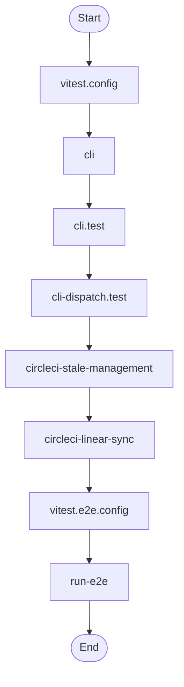
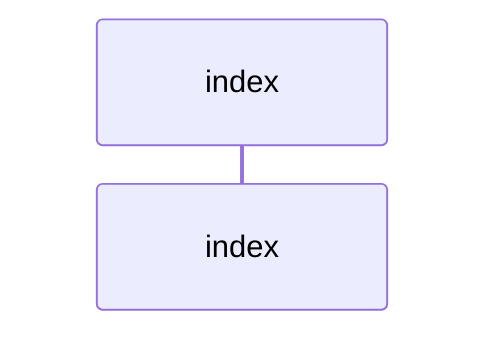

# Diagram Context Pack

Generated: 2026-04-26T15:22:23Z

## How to use this pack

- Start here for compact architecture, dependency, database, and ERD context before opening raw source files.
- Use .diagram/manifest.json to choose a focused Mermaid file when this combined pack is too large.
- For TypeScript implementation detail, run `harness source-outline <path>` first, then unwrap one symbol with `--symbol <name>`.

## architecture

```mermaid
graph TD
  subgraph sg_sg_3a52ce78["."]
    node_vitest_config_79ed63ec["vitest.config"]
  end
  subgraph sg_artifacts_debug_drift_north_star_src_348bbc2d["artifacts/debug-drift-north-star/src"]
    node_artifacts_debug_drift_north_star_src_cli_61dec5c7["cli"]
  end
  subgraph sg_artifacts_docs_gate_repro_src_5edf9cbc["artifacts/docs-gate-repro/src"]
    node_artifacts_docs_gate_repro_src_cli_dd288ec8["cli"]
  end
  subgraph sg_coverage_6dafbcf6["coverage"]
    node_coverage_block_navigation_c70859a9["block-navigation"]
    node_coverage_prettify_7c8a086a["prettify"]
    node_coverage_sorter_f2899884["sorter"]
  end
  subgraph sg_e2e_44491d4b["e2e"]
    node_e2e_run_e2e_f80c6fa8["run-e2e"]
    node_e2e_vitest_e2e_config_2ffe3e5c["vitest.e2e.config"]
  end
  subgraph sg_e2e_clients_6e118f25["e2e/clients"]
    node_e2e_clients_github_e2e_886b5936["github-e2e"]
    node_e2e_clients_linear_e2e_058a3bd3["linear-e2e"]
  end
  subgraph sg_e2e_tests_0c5ead1b["e2e/tests"]
    node_e2e_tests_command_pipeline_e2e_test_7b78a199["command-pipeline.e2e.test"]
    node_e2e_tests_github_integration_e2e_test_8f5767c3["github-integration.e2e.test"]
    node_e2e_tests_linear_integration_e2e_test_1632523d["linear-integration.e2e.test"]
  end
  subgraph sg_e2e_utils_45bc2f1c["e2e/utils"]
    node_e2e_utils_env_f291bf22["env"]
    node_e2e_utils_resource_tracker_d629c5ed["resource-tracker"]
  end
  subgraph sg_scripts_16728d18["scripts"]
    node_scripts_circleci_linear_sync_0dede1a9["circleci-linear-sync"]
    node_scripts_circleci_stale_management_7936b746["circleci-stale-management"]
    node_scripts_setup_git_hooks_2ed98c53["setup-git-hooks"]
    node_scripts_validate_commit_msg_c49346f6["validate-commit-msg"]
  end
  subgraph sg_scripts_hook_governance_22d136eb["scripts/hook-governance"]
    node_scripts_hook_governance_evaluate_docstring_ratch_407d0d3c["evaluate_docstring_ratchet"]
    node_scripts_hook_governance_inventory_repos_0e496bf6["inventory_repos"]
    node_scripts_hook_governance_rollout_check_7c494353["rollout_check"]
  end
  subgraph sg_scripts_hook_governance_tests_df090b28["scripts/hook-governance/tests"]
    node_scripts_hook_governance_tests_init_d095a8dc["__init__"]
    node_scripts_hook_governance_tests_test_evaluate_docs_4a092543["test_evaluate_docstring_ratchet"]
    node_scripts_hook_governance_tests_test_inventory_rep_e8bf3377["test_inventory_repos"]
    node_scripts_hook_governance_tests_test_rollout_check_ba44f7c6["test_rollout_check"]
  end
  subgraph sg_src_f27fede2["src"]
    node_src_cli_50037f41["cli"]
    node_src_cli_dispatch_test_83d1aecc["cli-dispatch.test"]
    node_src_cli_test_c0ddbe99["cli.test"]
  end
  subgraph sg_src_commands_ac7f36e3["src/commands"]
    node_src_commands_agent_first_throughput_integration__4f0ddd7b["agent-first-throughput.integration.test"]
    node_src_commands_audit_bd6de8bd["audit"]
    node_src_commands_audit_test_cf82f906["audit.test"]
    node_src_commands_automation_run_2d0faa41["automation-run"]
    node_src_commands_automation_run_test_e2f83281["automation-run.test"]
    node_src_commands_blast_radius_bd615614["blast-radius"]
    node_src_commands_blast_radius_test_fb4e7d14["blast-radius.test"]
    node_src_commands_brain_65b70a91["brain"]
    node_src_commands_brain_test_bb8017ac["brain.test"]
    node_src_commands_brainstorm_gate_554b176a["brainstorm-gate"]
    node_src_commands_brainstorm_gate_test_8feca557["brainstorm-gate.test"]
    node_src_commands_branch_protect_e57bd6e5["branch-protect"]
    node_src_commands_branch_protect_test_d26f0ed4["branch-protect.test"]
    node_src_commands_check_9717c3ed["check"]
    node_src_commands_check_authz_c5a905d9["check-authz"]
    node_src_commands_check_authz_test_f6b000b3["check-authz.test"]
    node_src_commands_check_diagram_freshness_test_5e858bc8["check-diagram-freshness.test"]
    node_src_commands_check_environment_61a1e6d1["check-environment"]
    node_src_commands_check_environment_test_177a8ad6["check-environment.test"]
    node_src_commands_check_test_aaa8bb13["check.test"]
    node_src_commands_ci_migrate_9cb53e30["ci-migrate"]
    node_src_commands_ci_migrate_test_7c0f9981["ci-migrate.test"]
    node_src_commands_context_a173b3b5["context"]
    node_src_commands_context_health_c8159838["context-health"]
    node_src_commands_context_health_test_cee466db["context-health.test"]
    node_src_commands_context_integrity_acceptance_test_ec3eafae["context-integrity-acceptance.test"]
    node_src_commands_context_test_04afd925["context.test"]
    node_src_commands_contract_5477dad2["contract"]
    node_src_commands_contract_test_e27f09d5["contract.test"]
    node_src_commands_diff_budget_b8b3e926["diff-budget"]
    node_src_commands_diff_budget_test_abd7c3ee["diff-budget.test"]
    node_src_commands_docs_gate_a9482c33["docs-gate"]
    node_src_commands_docs_gate_test_bebd4eac["docs-gate.test"]
    node_src_commands_doctor_2b7caa84["doctor"]
    node_src_commands_doctor_test_7af6f23c["doctor.test"]
    node_src_commands_drift_gate_5163a260["drift-gate"]
    node_src_commands_drift_gate_test_46e320e7["drift-gate.test"]
    node_src_commands_eject_f04a1cce["eject"]
    node_src_commands_evidence_verify_8b283e40["evidence-verify"]
    node_src_commands_evidence_verify_test_d25d21f3["evidence-verify.test"]
    node_src_commands_gap_case_f7fe09bc["gap-case"]
    node_src_commands_gap_case_test_1e9bd913["gap-case.test"]
    node_src_commands_gardener_16ee9f29["gardener"]
    node_src_commands_gardener_test_01d5ad19["gardener.test"]
    node_src_commands_health_71013327["health"]
    node_src_commands_health_test_6d5f075c["health.test"]
    node_src_commands_index_context_76d00fdb["index-context"]
    node_src_commands_index_context_test_552c8613["index-context.test"]
    node_src_commands_init_a32504f5["init"]
    node_src_commands_init_test_208f2f42["init.test"]
    node_src_commands_license_gate_f78650b8["license-gate"]
    node_src_commands_license_gate_test_0cecbd36["license-gate.test"]
    node_src_commands_linear_gate_3a2dbdda["linear-gate"]
    node_src_commands_linear_gate_test_d7fab54c["linear-gate.test"]
    node_src_commands_linear_prepare_676859a4["linear-prepare"]
    node_src_commands_linear_prepare_test_e563937e["linear-prepare.test"]
    node_src_commands_linear_sync_80a223b3["linear-sync"]
    node_src_commands_linear_sync_test_5d50c953["linear-sync.test"]
    node_src_commands_linear_triage_e9dbe076["linear-triage"]
    node_src_commands_linear_triage_test_e9358c88["linear-triage.test"]
    node_src_commands_linear_workflow_bc2c047f["linear-workflow"]
    node_src_commands_linear_workflow_test_b60c6e12["linear-workflow.test"]
    node_src_commands_local_memory_preflight_953c95d5["local-memory-preflight"]
    node_src_commands_local_memory_preflight_test_d06baa31["local-memory-preflight.test"]
    node_src_commands_memory_gate_851ca244["memory-gate"]
    node_src_commands_observability_gate_4e33a519["observability-gate"]
    node_src_commands_observability_gate_test_72a003c4["observability-gate.test"]
    node_src_commands_org_audit_bd496958["org-audit"]
    node_src_commands_org_audit_test_8f29d4e0["org-audit.test"]
    node_src_commands_pilot_evaluate_83c96a06["pilot-evaluate"]
    node_src_commands_pilot_evaluate_test_983799d7["pilot-evaluate.test"]
    node_src_commands_pilot_rollback_9ad729c0["pilot-rollback"]
    node_src_commands_pilot_rollback_test_635b55ad["pilot-rollback.test"]
    node_src_commands_plan_gate_0a15fb14["plan-gate"]
    node_src_commands_plan_gate_test_d9d60c82["plan-gate.test"]
    node_src_commands_policy_gate_6f39556d["policy-gate"]
    node_src_commands_policy_gate_test_558cba5e["policy-gate.test"]
    node_src_commands_pr_template_gate_fd6e14c3["pr-template-gate"]
    node_src_commands_pr_template_gate_test_a29a4275["pr-template-gate.test"]
    node_src_commands_preflight_gate_e934bc38["preflight-gate"]
    node_src_commands_preflight_gate_test_98d1a08e["preflight-gate.test"]
    node_src_commands_preset_46228187["preset"]
    node_src_commands_preset_test_ad6ae07f["preset.test"]
    node_src_commands_promote_mode_test_e8e5e339["promote-mode.test"]
    node_src_commands_prompt_gate_bda26456["prompt-gate"]
    node_src_commands_prompt_gate_test_8ce58238["prompt-gate.test"]
    node_src_commands_refresh_diagram_context_test_7c9f3447["refresh-diagram-context.test"]
    node_src_commands_remediate_ae676761["remediate"]
    node_src_commands_remediate_test_b0fcf4ec["remediate.test"]
    node_src_commands_replay_fcae3a4a["replay"]
    node_src_commands_replay_test_1134c260["replay.test"]
    node_src_commands_review_gate_b74630a3["review-gate"]
    node_src_commands_review_gate_test_dea5880b["review-gate.test"]
    node_src_commands_risk_tier_acf26560["risk-tier"]
    node_src_commands_risk_tier_test_da8ec745["risk-tier.test"]
    node_src_commands_search_8c19fcb1["search"]
    node_src_commands_search_test_ac250e89["search.test"]
    node_src_commands_silent_error_f4595a23["silent-error"]
    node_src_commands_simulate_f06a3ac7["simulate"]
    node_src_commands_simulate_test_17cdb2fd["simulate.test"]
    node_src_commands_solo_mode_test_cd5d21e8["solo-mode.test"]
    node_src_commands_source_outline_4aeff6d7["source-outline"]
    node_src_commands_source_outline_test_e77c23d2["source-outline.test"]
    node_src_commands_symphony_check_055464ba["symphony-check"]
    node_src_commands_symphony_check_test_b9bd2d4d["symphony-check.test"]
    node_src_commands_tooling_audit_6606d949["tooling-audit"]
    node_src_commands_tooling_audit_test_874a714a["tooling-audit.test"]
    node_src_commands_ui_loop_14f94e39["ui-loop"]
    node_src_commands_ui_loop_test_1c615cb8["ui-loop.test"]
    node_src_commands_upgrade_7c2e21f2["upgrade"]
    node_src_commands_upgrade_test_5c1f4810["upgrade.test"]
    node_src_commands_verify_coderabbit_9883399d["verify-coderabbit"]
    node_src_commands_verify_coderabbit_test_ceaa2143["verify-coderabbit.test"]
    node_src_commands_verify_work_43c69927["verify-work"]
    node_src_commands_verify_work_test_24b4f5ea["verify-work.test"]
    node_src_commands_workflow_generate_3099b8dd["workflow-generate"]
    node_src_commands_workflow_generate_test_981498a8["workflow-generate.test"]
  end
  subgraph sg_src_dev_9a5e9cab["src/dev"]
    node_src_dev_run_local_memory_preflight_9778893b["run-local-memory-preflight"]
    node_src_dev_run_local_memory_preflight_test_fcecd725["run-local-memory-preflight.test"]
  end
  subgraph sg_src_lib_9b0c0e9c["src/lib"]
    node_src_lib_pr_template_validator_a13f8444["pr-template-validator"]
    node_src_lib_pr_template_validator_test_7a4ffc2f["pr-template-validator.test"]
    node_src_lib_preset_detection_df7bb651["preset-detection"]
    node_src_lib_preset_detection_test_26643c48["preset-detection.test"]
    node_src_lib_source_outline_7130a0cd["source-outline"]
    node_src_lib_version_337bb7ee["version"]
    node_src_lib_version_coherence_cb803a5e["version-coherence"]
    node_src_lib_version_coherence_test_c9c1cc52["version-coherence.test"]
  end
  subgraph sg_src_lib_agents_8a727b80["src/lib/agents"]
    node_src_lib_agents_instruction_compat_2828d0f1["instruction-compat"]
    node_src_lib_agents_instruction_compat_test_14014b84["instruction-compat.test"]
  end
  subgraph sg_src_lib_architecture_0de1dc44["src/lib/architecture"]
    node_src_lib_architecture_module_boundaries_test_4b2e2143["module-boundaries.test"]
  end
  subgraph sg_src_lib_blast_radius_03046b1f["src/lib/blast-radius"]
    node_src_lib_blast_radius_resolver_5f0dc5b6["resolver"]
    node_src_lib_blast_radius_resolver_test_2434a14b["resolver.test"]
  end
  subgraph sg_src_lib_brainstorm_3c8aa833["src/lib/brainstorm"]
    node_src_lib_brainstorm_detector_20d990d6["detector"]
    node_src_lib_brainstorm_detector_test_22068a91["detector.test"]
    node_src_lib_brainstorm_types_1dfefbfb["types"]
  end
  subgraph sg_src_lib_ci_3d688c55["src/lib/ci"]
    node_src_lib_ci_branch_protect_sync_1ea26be7["branch-protect-sync"]
    node_src_lib_ci_branch_protect_sync_test_35b16538["branch-protect-sync.test"]
    node_src_lib_ci_ci_migrate_command_contract_34db411f["ci-migrate-command-contract"]
    node_src_lib_ci_ci_migrate_command_contract_test_e03eefee["ci-migrate-command-contract.test"]
    node_src_lib_ci_ci_migrate_snapshot_paths_d973b626["ci-migrate-snapshot-paths"]
    node_src_lib_ci_ci_migrate_snapshot_paths_test_52ed25b1["ci-migrate-snapshot-paths.test"]
    node_src_lib_ci_config_validator_b0366834["config-validator"]
    node_src_lib_ci_config_validator_test_718b5a94["config-validator.test"]
    node_src_lib_ci_provider_adapter_c2af78b0["provider-adapter"]
    node_src_lib_ci_required_check_metadata_873ef686["required-check-metadata"]
    node_src_lib_ci_satisfiability_e825a617["satisfiability"]
  end
  subgraph sg_src_lib_cli_be82f541["src/lib/cli"]
    node_src_lib_cli_command_registry_aa702320["command-registry"]
    node_src_lib_cli_command_registry_test_30bb0a99["command-registry.test"]
    node_src_lib_cli_doc_parity_fffe943f["doc-parity"]
    node_src_lib_cli_doc_parity_test_deda4d95["doc-parity.test"]
    node_src_lib_cli_help_renderer_ea70b199["help-renderer"]
    node_src_lib_cli_help_renderer_test_063a8bbc["help-renderer.test"]
    node_src_lib_cli_legacy_dispatch_guard_test_c6d6c5c7["legacy-dispatch-guard.test"]
    node_src_lib_cli_parse_utils_505d2b9f["parse-utils"]
  end
  subgraph sg_src_lib_cli_registry_3382fdac["src/lib/cli/registry"]
    node_src_lib_cli_registry_command_capabilities_303d7143["command-capabilities"]
    node_src_lib_cli_registry_command_fuzzy_e5eb5599["command-fuzzy"]
    node_src_lib_cli_registry_command_specs_3533d0bd["command-specs"]
    node_src_lib_cli_registry_command_specs_test_771e2132["command-specs.test"]
    node_src_lib_cli_registry_fuzzy_resolution_7b679ee8["fuzzy-resolution"]
    node_src_lib_cli_registry_source_outline_spec_86678e99["source-outline-spec"]
    node_src_lib_cli_registry_types_9f162bf6["types"]
  end
  subgraph sg_src_lib_context_compound_85349b31["src/lib/context-compound"]
    node_src_lib_context_compound_constants_9e247b81["constants"]
    node_src_lib_context_compound_constants_test_c131a9ba["constants.test"]
    node_src_lib_context_compound_context_compact_policy_1d16d447["context-compact-policy"]
    node_src_lib_context_compound_context_compact_policy__0ad86893["context-compact-policy.test"]
    node_src_lib_context_compound_index_65ba65e9["index"]
    node_src_lib_context_compound_indexer_e7ad2047["indexer"]
    node_src_lib_context_compound_indexer_test_473c7216["indexer.test"]
    node_src_lib_context_compound_init_error_8d4fe562["init-error"]
    node_src_lib_context_compound_lexical_fallback_eeb9773b["lexical-fallback"]
    node_src_lib_context_compound_ollama_6ac6599b["ollama"]
    node_src_lib_context_compound_ollama_test_972f3fc8["ollama.test"]
    node_src_lib_context_compound_rollout_0fa807e3["rollout"]
    node_src_lib_context_compound_sources_4de9a2ad["sources"]
    node_src_lib_context_compound_store_d1f2d9b9["store"]
    node_src_lib_context_compound_sync_contract_4a4a6123["sync-contract"]
    node_src_lib_context_compound_sync_contract_test_46843710["sync-contract.test"]
    node_src_lib_context_compound_types_ab11fede["types"]
  end
  subgraph sg_src_lib_contract_8b2646d4["src/lib/contract"]
    node_src_lib_contract_contract_presets_581909b1["contract-presets"]
    node_src_lib_contract_errors_fbb37c9d["errors"]
    node_src_lib_contract_extends_validator_30914a7f["extends-validator"]
    node_src_lib_contract_extends_validator_test_e719b8a7["extends-validator.test"]
    node_src_lib_contract_idempotency_af93997f["idempotency"]
    node_src_lib_contract_index_3f557468["index"]
    node_src_lib_contract_json_schema_10b34e77["json-schema"]
    node_src_lib_contract_loader_c7304ec8["loader"]
    node_src_lib_contract_loader_test_5aaec341["loader.test"]
    node_src_lib_contract_merger_15f87e65["merger"]
    node_src_lib_contract_merger_test_9319ae2c["merger.test"]
    node_src_lib_contract_north_star_alignment_7d3313d2["north-star-alignment"]
    node_src_lib_contract_north_star_contract_validators_98f903ea["north-star-contract-validators"]
    node_src_lib_contract_north_star_validators_e48b4f34["north-star-validators"]
    node_src_lib_contract_policy_validators_f8e3b6f1["policy-validators"]
    node_src_lib_contract_preset_resolver_ed8af332["preset-resolver"]
    node_src_lib_contract_preset_resolver_test_d386cdbf["preset-resolver.test"]
    node_src_lib_contract_run_record_emitter_ae66a1ec["run-record-emitter"]
    node_src_lib_contract_run_record_emitter_test_6d46c5c8["run-record-emitter.test"]
    node_src_lib_contract_run_records_836e164b["run-records"]
    node_src_lib_contract_run_records_test_29458901["run-records.test"]
    node_src_lib_contract_standards_map_82a471e8["standards-map"]
    node_src_lib_contract_standards_map_test_e6f98748["standards-map.test"]
    node_src_lib_contract_types_60c2ea40["types"]
    node_src_lib_contract_ui_loop_command_6b6b96af["ui-loop-command"]
    node_src_lib_contract_ui_loop_command_test_58d91b1f["ui-loop-command.test"]
    node_src_lib_contract_validator_585f17f0["validator"]
    node_src_lib_contract_validator_helpers_e56d062f["validator-helpers"]
    node_src_lib_contract_validator_test_be05f8e6["validator.test"]
  end
  subgraph sg_src_lib_deps_ec348b66["src/lib/deps"]
    node_src_lib_deps_ralph_runtime_e8f53b41["ralph-runtime"]
    node_src_lib_deps_ralph_runtime_test_76613c79["ralph-runtime.test"]
  end
  subgraph sg_src_lib_evidence_ce17bc42["src/lib/evidence"]
    node_src_lib_evidence_index_e429c7d7["index"]
    node_src_lib_evidence_loader_05d04a48["loader"]
    node_src_lib_evidence_logger_09f27768["logger"]
    node_src_lib_evidence_policy_c212a2b9["policy"]
    node_src_lib_evidence_policy_test_0fda159e["policy.test"]
    node_src_lib_evidence_types_c304b8db["types"]
    node_src_lib_evidence_validator_4a254158["validator"]
    node_src_lib_evidence_validator_test_9ebe4bd6["validator.test"]
  end
  subgraph sg_src_lib_gap_case_1a2e655a["src/lib/gap-case"]
    node_src_lib_gap_case_types_cf3c9eba["types"]
  end
  subgraph sg_src_lib_gardener_2ee3d9f5["src/lib/gardener"]
    node_src_lib_gardener_link_checker_95a109ed["link-checker"]
    node_src_lib_gardener_pr_creator_f89e512d["pr-creator"]
    node_src_lib_gardener_quality_scorer_8fe3e3db["quality-scorer"]
    node_src_lib_gardener_stale_detector_3ad97daa["stale-detector"]
    node_src_lib_gardener_stale_detector_test_ae0df545["stale-detector.test"]
    node_src_lib_gardener_types_bd794d6b["types"]
  end
  subgraph sg_src_lib_github_b68c7543["src/lib/github"]
    node_src_lib_github_check_run_94cd4597["check-run"]
    node_src_lib_github_check_run_test_0e7a0970["check-run.test"]
    node_src_lib_github_client_51b3b29d["client"]
    node_src_lib_github_client_test_3345dbf3["client.test"]
    node_src_lib_github_comments_91a21eb6["comments"]
    node_src_lib_github_comments_test_e411297a["comments.test"]
    node_src_lib_github_errors_36723665["errors"]
    node_src_lib_github_errors_test_133cfe4b["errors.test"]
    node_src_lib_github_mutation_queue_44c6f93a["mutation-queue"]
    node_src_lib_github_mutation_queue_test_4604276b["mutation-queue.test"]
    node_src_lib_github_sha_16a8af8a["sha"]
    node_src_lib_github_sha_test_f22f6abd["sha.test"]
  end
  subgraph sg_src_lib_governance_f5be96f9["src/lib/governance"]
    node_src_lib_governance_repo_scanner_6df641c5["repo-scanner"]
    node_src_lib_governance_repo_scanner_test_8643e7e8["repo-scanner.test"]
    node_src_lib_governance_scan_cache_e0415545["scan-cache"]
    node_src_lib_governance_scan_cache_test_6c8cf65d["scan-cache.test"]
    node_src_lib_governance_url_validator_c0cec5fa["url-validator"]
    node_src_lib_governance_url_validator_secure_fetch_te_f62ff797["url-validator.secure-fetch.test"]
    node_src_lib_governance_url_validator_test_88688db7["url-validator.test"]
  end
  subgraph sg_src_lib_init_18ad2a79["src/lib/init"]
    node_src_lib_init_ast_grep_rules_test_b664c54b["ast-grep-rules.test"]
    node_src_lib_init_cli_43b2583c["cli"]
    node_src_lib_init_codex_preflight_symlink_test_34429399["codex-preflight-symlink.test"]
    node_src_lib_init_eject_8b3ad60e["eject"]
    node_src_lib_init_eject_test_06d19bd1["eject.test"]
    node_src_lib_init_index_14b0069f["index"]
    node_src_lib_init_interactive_83232b08["interactive"]
    node_src_lib_init_migration_e4b291ff["migration"]
    node_src_lib_init_post_bootstrap_summary_e845224e["post-bootstrap-summary"]
    node_src_lib_init_post_bootstrap_summary_test_016769ea["post-bootstrap-summary.test"]
    node_src_lib_init_project_brain_templates_f4ecd6a7["project-brain-templates"]
    node_src_lib_init_project_brain_templates_test_6fa392fe["project-brain-templates.test"]
    node_src_lib_init_rollback_b5f0b59d["rollback"]
    node_src_lib_init_rollback_test_13a5730f["rollback.test"]
    node_src_lib_init_scaffold_0491ad83["scaffold"]
    node_src_lib_init_scaffold_ci_template_selection_afaca39d["scaffold-ci-template-selection"]
    node_src_lib_init_scaffold_ci_template_selection_test_5323bef8["scaffold-ci-template-selection.test"]
    node_src_lib_init_scaffold_ci_template_utils_ad9483e4["scaffold-ci-template-utils"]
    node_src_lib_init_scaffold_ci_templates_07d643ff["scaffold-ci-templates"]
    node_src_lib_init_scaffold_ci_templates_test_84dc8597["scaffold-ci-templates.test"]
    node_src_lib_init_scaffold_ci_transition_status_templ_5e6cd8a1["scaffold-ci-transition-status-template"]
    node_src_lib_init_scaffold_ci_transition_status_templ_e8132d04["scaffold-ci-transition-status-template.test"]
    node_src_lib_init_scaffold_circleci_config_template_eab2a2ae["scaffold-circleci-config-template"]
    node_src_lib_init_scaffold_circleci_config_template_t_b1fa651c["scaffold-circleci-config-template.test"]
    node_src_lib_init_scaffold_codex_environment_template_4ff9df35["scaffold-codex-environment-templates"]
    node_src_lib_init_scaffold_codex_environment_template_bac692a5["scaffold-codex-environment-templates.test"]
    node_src_lib_init_scaffold_config_templates_3b3ac613["scaffold-config-templates"]
    node_src_lib_init_scaffold_config_templates_test_c6a47edc["scaffold-config-templates.test"]
    node_src_lib_init_scaffold_contract_template_57b547cd["scaffold-contract-template"]
    node_src_lib_init_scaffold_contract_template_test_3d26b5d3["scaffold-contract-template.test"]
    node_src_lib_init_scaffold_diagram_templates_915cc787["scaffold-diagram-templates"]
    node_src_lib_init_scaffold_diagram_templates_test_429cae2f["scaffold-diagram-templates.test"]
    node_src_lib_init_scaffold_doc_templates_5e34280b["scaffold-doc-templates"]
    node_src_lib_init_scaffold_doc_templates_test_d7c4521c["scaffold-doc-templates.test"]
    node_src_lib_init_scaffold_environment_templates_eeed9041["scaffold-environment-templates"]
    node_src_lib_init_scaffold_environment_templates_test_2d7b8173["scaffold-environment-templates.test"]
    node_src_lib_init_scaffold_github_actions_pr_pipeline_4b2bbdd3["scaffold-github-actions-pr-pipeline-template"]
    node_src_lib_init_scaffold_github_actions_pr_pipeline_3944caff["scaffold-github-actions-pr-pipeline-template.test"]
    node_src_lib_init_scaffold_governance_templates_004f982f["scaffold-governance-templates"]
    node_src_lib_init_scaffold_governance_templates_test_576bbcda["scaffold-governance-templates.test"]
    node_src_lib_init_scaffold_hook_templates_0b5a55e9["scaffold-hook-templates"]
    node_src_lib_init_scaffold_hook_templates_test_d526c745["scaffold-hook-templates.test"]
    node_src_lib_init_scaffold_release_private_npm_templa_addeb21f["scaffold-release-private-npm-template"]
    node_src_lib_init_scaffold_release_private_npm_templa_f3d61c6d["scaffold-release-private-npm-template.test"]
    node_src_lib_init_scaffold_required_checks_manifest_t_a32c7862["scaffold-required-checks-manifest-template"]
    node_src_lib_init_scaffold_required_checks_manifest_t_12f12f8f["scaffold-required-checks-manifest-template.test"]
    node_src_lib_init_scaffold_root_command_templates_22c15cd1["scaffold-root-command-templates"]
    node_src_lib_init_scaffold_root_command_templates_tes_cd6c47be["scaffold-root-command-templates.test"]
    node_src_lib_init_scaffold_root_templates_32adb40e["scaffold-root-templates"]
    node_src_lib_init_scaffold_root_templates_test_94044835["scaffold-root-templates.test"]
    node_src_lib_init_scaffold_script_template_registry_25d38efa["scaffold-script-template-registry"]
    node_src_lib_init_scaffold_script_template_registry_t_4e14e3c5["scaffold-script-template-registry.test"]
    node_src_lib_init_scaffold_security_scan_template_9de191f1["scaffold-security-scan-template"]
    node_src_lib_init_scaffold_security_scan_template_tes_f703517c["scaffold-security-scan-template.test"]
    node_src_lib_init_scaffold_semgrep_templates_1c07176e["scaffold-semgrep-templates"]
    node_src_lib_init_scaffold_semgrep_templates_test_762f3bf2["scaffold-semgrep-templates.test"]
    node_src_lib_init_scaffold_shell_quality_test_03012dbf["scaffold-shell-quality.test"]
    node_src_lib_init_scaffold_shell_templates_8b422313["scaffold-shell-templates"]
    node_src_lib_init_scaffold_shell_templates_test_c3cc73d7["scaffold-shell-templates.test"]
    node_src_lib_init_scaffold_surfaces_26dc77da["scaffold-surfaces"]
    node_src_lib_init_scaffold_surfaces_test_26fb93a9["scaffold-surfaces.test"]
    node_src_lib_init_scaffold_template_registry_427208a0["scaffold-template-registry"]
    node_src_lib_init_scaffold_template_registry_test_ad49de58["scaffold-template-registry.test"]
    node_src_lib_init_scaffold_template_selection_d380fb95["scaffold-template-selection"]
    node_src_lib_init_scaffold_template_selection_test_98b840cc["scaffold-template-selection.test"]
    node_src_lib_init_scaffold_workflow_template_9fce490f["scaffold-workflow-template"]
    node_src_lib_init_scaffold_workflow_template_test_77fba1d2["scaffold-workflow-template.test"]
    node_src_lib_init_scaffold_worktree_templates_7418d0c4["scaffold-worktree-templates"]
    node_src_lib_init_scaffold_worktree_templates_test_79c26c9c["scaffold-worktree-templates.test"]
    node_src_lib_init_scaffold_test_afcf14e9["scaffold.test"]
    node_src_lib_init_schema_migrate_ea60619f["schema-migrate"]
    node_src_lib_init_types_6665ca5f["types"]
    node_src_lib_init_update_e8dc9bf6["update"]
    node_src_lib_init_upgrade_e1d7cdbc["upgrade"]
    node_src_lib_init_workflow_contract_scripts_test_42efa4fe["workflow-contract-scripts.test"]
  end
  subgraph sg_src_lib_input_6d2e2e5b["src/lib/input"]
    node_src_lib_input_sanitize_13ffa2ad["sanitize"]
    node_src_lib_input_sanitize_test_1e7f2d95["sanitize.test"]
    node_src_lib_input_validation_eee23fdc["validation"]
    node_src_lib_input_validation_test_edefff50["validation.test"]
    node_src_lib_input_validator_b95e8971["validator"]
    node_src_lib_input_validator_test_4844e0b1["validator.test"]
  end
  subgraph sg_src_lib_license_635c8128["src/lib/license"]
    node_src_lib_license_spdx_99891942["spdx"]
    node_src_lib_license_spdx_test_da41c474["spdx.test"]
    node_src_lib_license_validator_9be9419a["validator"]
    node_src_lib_license_validator_test_305b4930["validator.test"]
  end
  subgraph sg_src_lib_linear_306ffaca["src/lib/linear"]
    node_src_lib_linear_automation_b83eb7ee["automation"]
    node_src_lib_linear_automation_test_aac87654["automation.test"]
    node_src_lib_linear_blocked_governance_7b4f4485["blocked-governance"]
    node_src_lib_linear_blocked_governance_test_2c91153b["blocked-governance.test"]
    node_src_lib_linear_client_a6f832ad["client"]
    node_src_lib_linear_client_test_59c554fc["client.test"]
    node_src_lib_linear_governance_report_95878b76["governance-report"]
    node_src_lib_linear_governance_report_test_b25569a2["governance-report.test"]
    node_src_lib_linear_metadata_gate_b0c1d0be["metadata-gate"]
    node_src_lib_linear_metadata_gate_test_9bdbacc8["metadata-gate.test"]
    node_src_lib_linear_status_aging_b903f84a["status-aging"]
    node_src_lib_linear_status_aging_test_4e705b9f["status-aging.test"]
    node_src_lib_linear_triage_lanes_d2d429af["triage-lanes"]
    node_src_lib_linear_triage_lanes_test_59679ffb["triage-lanes.test"]
    node_src_lib_linear_triage_scoring_0bd07d1e["triage-scoring"]
    node_src_lib_linear_triage_scoring_test_bc78777b["triage-scoring.test"]
    node_src_lib_linear_triage_sla_8f825cd5["triage-sla"]
    node_src_lib_linear_triage_sla_test_34ddeb55["triage-sla.test"]
    node_src_lib_linear_triage_type_labels_2b4c4985["triage-type-labels"]
    node_src_lib_linear_triage_type_labels_test_8a1ed129["triage-type-labels.test"]
    node_src_lib_linear_utils_6af4e5df["utils"]
    node_src_lib_linear_utils_test_73543a4a["utils.test"]
  end
  subgraph sg_src_lib_memory_df2051c4["src/lib/memory"]
    node_src_lib_memory_branch_enforcer_f38c3b70["branch-enforcer"]
    node_src_lib_memory_metrics_tracker_8f20bcc7["metrics-tracker"]
    node_src_lib_memory_metrics_tracker_test_2fadfb06["metrics-tracker.test"]
    node_src_lib_memory_types_4683a2d7["types"]
    node_src_lib_memory_validator_dbba8eeb["validator"]
    node_src_lib_memory_validator_test_66feb032["validator.test"]
  end
  subgraph sg_src_lib_org_0b99f346["src/lib/org"]
    node_src_lib_org_repositories_8d4fc5a7["repositories"]
  end
  subgraph sg_src_lib_output_d7e44ba2["src/lib/output"]
    node_src_lib_output_normalise_29c1f8a3["normalise"]
    node_src_lib_output_normalise_test_92b976f4["normalise.test"]
    node_src_lib_output_types_639c61f7["types"]
    node_src_lib_output_types_test_2aec04cc["types.test"]
  end
  subgraph sg_src_lib_pilot_evaluation_72792273["src/lib/pilot-evaluation"]
    node_src_lib_pilot_evaluation_control_plane_9fcff894["control-plane"]
    node_src_lib_pilot_evaluation_control_plane_test_6b85b9d4["control-plane.test"]
    node_src_lib_pilot_evaluation_decision_packet_9b582bf2["decision-packet"]
    node_src_lib_pilot_evaluation_decision_packet_test_b0ad3727["decision-packet.test"]
    node_src_lib_pilot_evaluation_evaluation_engine_a9da5c53["evaluation-engine"]
    node_src_lib_pilot_evaluation_evaluation_engine_test_f7020457["evaluation-engine.test"]
    node_src_lib_pilot_evaluation_metrics_capture_6a557a25["metrics-capture"]
    node_src_lib_pilot_evaluation_registries_0709e622["registries"]
    node_src_lib_pilot_evaluation_types_8e80f8a7["types"]
  end
  subgraph sg_src_lib_plan_gate_504885f2["src/lib/plan-gate"]
    node_src_lib_plan_gate_detector_a9899778["detector"]
    node_src_lib_plan_gate_types_8b36a45a["types"]
  end
  subgraph sg_src_lib_policy_b3a76617["src/lib/policy"]
    node_src_lib_policy_cardinality_ef7a33eb["cardinality"]
    node_src_lib_policy_cardinality_test_f35eeec9["cardinality.test"]
    node_src_lib_policy_command_policy_test_f85a3204["command-policy.test"]
    node_src_lib_policy_diff_budget_3f96be28["diff-budget"]
    node_src_lib_policy_policy_chain_bcd37284["policy-chain"]
    node_src_lib_policy_policy_chain_test_6a8e2878["policy-chain.test"]
    node_src_lib_policy_required_checks_cc5260df["required-checks"]
    node_src_lib_policy_required_checks_test_db06e8af["required-checks.test"]
    node_src_lib_policy_risk_tier_6393c9ab["risk-tier"]
    node_src_lib_policy_risk_tier_test_60010fdc["risk-tier.test"]
    node_src_lib_policy_tooling_baseline_78829751["tooling-baseline"]
    node_src_lib_policy_tooling_baseline_test_2c1d1aa5["tooling-baseline.test"]
  end
  subgraph sg_src_lib_preflight_a53c17b5["src/lib/preflight"]
    node_src_lib_preflight_local_memory_83be6dca["local-memory"]
    node_src_lib_preflight_performance_overload_02c46206["performance-overload"]
    node_src_lib_preflight_performance_overload_test_32fe659f["performance-overload.test"]
    node_src_lib_preflight_types_e1807687["types"]
    node_src_lib_preflight_validator_4657555d["validator"]
    node_src_lib_preflight_validator_test_580e17d6["validator.test"]
  end
  subgraph sg_src_lib_project_brain_1b1de03b["src/lib/project-brain"]
    node_src_lib_project_brain_brain_validator_d1c3cb6a["brain-validator"]
    node_src_lib_project_brain_brain_validator_test_c51ec770["brain-validator.test"]
    node_src_lib_project_brain_domain_mapper_d7a3673c["domain-mapper"]
    node_src_lib_project_brain_domain_mapper_test_c2ede2f1["domain-mapper.test"]
    node_src_lib_project_brain_metadata_scanner_f8a74ca7["metadata-scanner"]
    node_src_lib_project_brain_metadata_scanner_test_97060023["metadata-scanner.test"]
    node_src_lib_project_brain_suggestion_generator_50c228fb["suggestion-generator"]
    node_src_lib_project_brain_suggestion_generator_test_1fcfcfaf["suggestion-generator.test"]
  end
  subgraph sg_src_lib_project_type_80726172["src/lib/project-type"]
    node_src_lib_project_type_detector_0ee6f281["detector"]
    node_src_lib_project_type_detector_test_cdd46054["detector.test"]
    node_src_lib_project_type_index_a8d9ade8["index"]
    node_src_lib_project_type_types_0aa9a421["types"]
  end
  subgraph sg_src_lib_remediation_056b0e90["src/lib/remediation"]
    node_src_lib_remediation_finding_normalizer_deea8cce["finding-normalizer"]
    node_src_lib_remediation_finding_normalizer_test_8082eaaf["finding-normalizer.test"]
    node_src_lib_remediation_orchestrator_e915f272["orchestrator"]
    node_src_lib_remediation_orchestrator_test_e409976c["orchestrator.test"]
    node_src_lib_remediation_types_a70edef6["types"]
  end
  subgraph sg_src_lib_replay_e36f123f["src/lib/replay"]
    node_src_lib_replay_trace_normalizer_45702dce["trace-normalizer"]
    node_src_lib_replay_trace_normalizer_test_0a4e0106["trace-normalizer.test"]
    node_src_lib_replay_tracer_c6b49784["tracer"]
    node_src_lib_replay_tracer_test_eec65c7d["tracer.test"]
  end
  subgraph sg_src_lib_result_41f6ea66["src/lib/result"]
    node_src_lib_result_types_2af05f87["types"]
  end
  subgraph sg_src_lib_review_gate_c92299dd["src/lib/review-gate"]
    node_src_lib_review_gate_authz_473e26c6["authz"]
    node_src_lib_review_gate_decision_packet_093b7885["decision-packet"]
    node_src_lib_review_gate_decision_packet_test_90fb9411["decision-packet.test"]
    node_src_lib_review_gate_types_9efb28dc["types"]
  end
  subgraph sg_src_lib_silent_error_2368b365["src/lib/silent-error"]
    node_src_lib_silent_error_detector_06385e9f["detector"]
    node_src_lib_silent_error_detector_test_f1fe45a6["detector.test"]
    node_src_lib_silent_error_types_c3d5f806["types"]
  end
  subgraph sg_src_lib_simulate_1125ef2f["src/lib/simulate"]
    node_src_lib_simulate_types_ea3a077a["types"]
  end
  subgraph sg_src_lib_test_1a4dfe9a["src/lib/test"]
    node_src_lib_test_overload_guard_f486fb04["overload-guard"]
    node_src_lib_test_overload_guard_test_77d5d34a["overload-guard.test"]
  end
  subgraph sg_src_lib_verify_51991d26["src/lib/verify"]
    node_src_lib_verify_orchestrator_2242dca0["orchestrator"]
    node_src_lib_verify_orchestrator_test_b991fb74["orchestrator.test"]
    node_src_lib_verify_resume_admissibility_f9c6e863["resume-admissibility"]
    node_src_lib_verify_resume_admissibility_test_67530e17["resume-admissibility.test"]
    node_src_lib_verify_retry_policy_66741c82["retry-policy"]
    node_src_lib_verify_retry_policy_test_76322c8b["retry-policy.test"]
    node_src_lib_verify_run_state_084e83b2["run-state"]
    node_src_lib_verify_run_state_test_6fc192b5["run-state.test"]
  end
  subgraph sg_src_lib_workflow_bf0d40a1["src/lib/workflow"]
    node_src_lib_workflow_brainstorm_6ca71c32["brainstorm"]
    node_src_lib_workflow_brainstorm_test_6ac1356e["brainstorm.test"]
    node_src_lib_workflow_plan_1246fd80["plan"]
    node_src_lib_workflow_plan_test_09539389["plan.test"]
  end
  subgraph sg_src_lib_workflow_contract_d7e80669["src/lib/workflow-contract"]
    node_src_lib_workflow_contract_checker_4b4be38a["checker"]
    node_src_lib_workflow_contract_checker_test_e4aa801a["checker.test"]
    node_src_lib_workflow_contract_ci_adapter_40c654d3["ci-adapter"]
    node_src_lib_workflow_contract_ci_adapter_test_00f59d71["ci-adapter.test"]
    node_src_lib_workflow_contract_gate_bundle_e1b1aa61["gate-bundle"]
    node_src_lib_workflow_contract_gate_bundle_test_45e3c653["gate-bundle.test"]
    node_src_lib_workflow_contract_index_2053757e["index"]
    node_src_lib_workflow_contract_operator_scorecard_163ee09a["operator-scorecard"]
    node_src_lib_workflow_contract_operator_scorecard_tes_e7ea05ba["operator-scorecard.test"]
    node_src_lib_workflow_contract_parser_42e51fd4["parser"]
    node_src_lib_workflow_contract_parser_test_66082e58["parser.test"]
    node_src_lib_workflow_contract_pilot_tracker_6ba1af4c["pilot-tracker"]
    node_src_lib_workflow_contract_pilot_tracker_test_8eb3b02c["pilot-tracker.test"]
    node_src_lib_workflow_contract_registry_d423a051["registry"]
    node_src_lib_workflow_contract_registry_test_144a7a3a["registry.test"]
    node_src_lib_workflow_contract_state_normalizer_7f9328b9["state-normalizer"]
    node_src_lib_workflow_contract_state_normalizer_test_fb3e6bb6["state-normalizer.test"]
    node_src_lib_workflow_contract_test_harness_ab8265f7["test-harness"]
    node_src_lib_workflow_contract_test_harness_test_9c43ce28["test-harness.test"]
    node_src_lib_workflow_contract_types_6e578d40["types"]
  end

```

## auth

```mermaid
flowchart TD
  Request["Authentication request"]
  Boundary{"Auth Boundary"}
  Request --> Boundary
  verify_coderabbit_test_46cfcf29["verify-coderabbit.test"]
  Boundary --> verify_coderabbit_test_46cfcf29
  risk_tier_test_ae056367["risk-tier.test"]
  Boundary --> risk_tier_test_ae056367
  review_gate_09b579c4["review-gate"]
  Boundary --> review_gate_09b579c4
  review_gate_test_000e2ed6["review-gate.test"]
  Boundary --> review_gate_test_000e2ed6
  preflight_gate_test_6821f821["preflight-gate.test"]
  Boundary --> preflight_gate_test_6821f821
  policy_gate_test_203a5261["policy-gate.test"]
  Boundary --> policy_gate_test_203a5261
  linear_workflow_c5cb6267["linear-workflow"]
  Boundary --> linear_workflow_c5cb6267
  linear_triage_083177a8["linear-triage"]
  Boundary --> linear_triage_083177a8
  init_test_cbba76a6["init.test"]
  Boundary --> init_test_cbba76a6
  docs_gate_test_a25e972f["docs-gate.test"]
  Boundary --> docs_gate_test_a25e972f
  context_test_57aad306["context.test"]
  Boundary --> context_test_57aad306
  ci_migrate_78bb70b1["ci-migrate"]
  Boundary --> ci_migrate_78bb70b1
  check_environment_fe68d4be["check-environment"]
  Boundary --> check_environment_fe68d4be
  branch_protect_b9d345eb["branch-protect"]
  Boundary --> branch_protect_b9d345eb
  blast_radius_test_045450fc["blast-radius.test"]
  Boundary --> blast_radius_test_045450fc
  env_b77349bf["env"]
  Boundary --> env_b77349bf
  overload_guard_2748c559["overload-guard"]
  Boundary --> overload_guard_2748c559
  overload_guard_test_6ece9f86["overload-guard.test"]
  Boundary --> overload_guard_test_6ece9f86
  authz_29ba2f46["authz"]
  Boundary --> authz_29ba2f46
  trace_normalizer_cb1be1d2["trace-normalizer"]
  Boundary --> trace_normalizer_cb1be1d2
  trace_normalizer_test_0c362866["trace-normalizer.test"]
  Boundary --> trace_normalizer_test_0c362866
  validator_f82af321["validator"]
  Boundary --> validator_f82af321
  validator_test_b4b482f8["validator.test"]
  Boundary --> validator_test_b4b482f8
  suggestion_generator_test_f68e9892["suggestion-generator.test"]
  Boundary --> suggestion_generator_test_f68e9892
  risk_tier_test_1_6f021f87["risk-tier.test"]
  Boundary --> risk_tier_test_1_6f021f87
  control_plane_96826665["control-plane"]
  Boundary --> control_plane_96826665
  normalise_test_73e8a615["normalise.test"]
  Boundary --> normalise_test_73e8a615
  types_11_4be3ee64["types"]
  Boundary --> types_11_4be3ee64
  triage_type_labels_8bc8350f["triage-type-labels"]
  Boundary --> triage_type_labels_8bc8350f
  triage_type_labels_test_c2c72e21["triage-type-labels.test"]
  Boundary --> triage_type_labels_test_c2c72e21
  triage_sla_de9cc25f["triage-sla"]
  Boundary --> triage_sla_de9cc25f
  triage_lanes_5c8ea001["triage-lanes"]
  Boundary --> triage_lanes_5c8ea001
  metadata_gate_2dcdb343["metadata-gate"]
  Boundary --> metadata_gate_2dcdb343
  policy_test_2c06901d["policy.test"]
  Boundary --> policy_test_2c06901d
  types_15_86775c96["types"]
  Boundary --> types_15_86775c96
  scaffold_db8a7260["scaffold"]
  Boundary --> scaffold_db8a7260
  scaffold_security_scan_template_55bc7465["scaffold-security-scan-template"]
  Boundary --> scaffold_security_scan_template_55bc7465
  scaffold_security_scan_template_test_3314b8b2["scaffold-security-scan-template.test"]
  Boundary --> scaffold_security_scan_template_test_3314b8b2
  scaffold_root_templates_61731280["scaffold-root-templates"]
  Boundary --> scaffold_root_templates_61731280
  scaffold_root_templates_test_f6604622["scaffold-root-templates.test"]
  Boundary --> scaffold_root_templates_test_f6604622
  scaffold_release_private_npm_template_075499f8["scaffold-release-private-npm-template"]
  Boundary --> scaffold_release_private_npm_template_075499f8
  scaffold_doc_templates_f6152330["scaffold-doc-templates"]
  Boundary --> scaffold_doc_templates_f6152330
  scaffold_contract_template_3ba5d53a["scaffold-contract-template"]
  Boundary --> scaffold_contract_template_3ba5d53a
  scaffold_contract_template_test_6f3672e3["scaffold-contract-template.test"]
  Boundary --> scaffold_contract_template_test_6f3672e3
  scaffold_ci_templates_2afd6392["scaffold-ci-templates"]
  Boundary --> scaffold_ci_templates_2afd6392
  cli_1_084e05fe["cli"]
  Boundary --> cli_1_084e05fe
  validator_5_b19ac2be["validator"]
  Boundary --> validator_5_b19ac2be
  validator_test_5_2bb3219d["validator.test"]
  Boundary --> validator_test_5_2bb3219d
  types_16_0fae1112["types"]
  Boundary --> types_16_0fae1112
  loader_test_03424671["loader.test"]
  Boundary --> loader_test_03424671
  json_schema_74a768d7["json-schema"]
  Boundary --> json_schema_74a768d7
  contract_presets_bbab169b["contract-presets"]
  Boundary --> contract_presets_bbab169b
  legacy_dispatch_guard_test_4700087d["legacy-dispatch-guard.test"]
  Boundary --> legacy_dispatch_guard_test_4700087d
  resolver_439c3635["resolver"]
  Boundary --> resolver_439c3635
  resolver_test_84b219fe["resolver.test"]
  Boundary --> resolver_test_84b219fe
  command_specs_69167c63["command-specs"]
  Boundary --> command_specs_69167c63
  command_specs_test_7f693e85["command-specs.test"]
  Boundary --> command_specs_test_7f693e85
  node_fs_df6b52af[("node:fs")]
  node_os_e9717731[("node:os")]
  node_path_0e7d56ab[("node:path")]
  _total_typescript_shoehorn_7f5625d0[("@total-typescript/shoehorn")]
  vitest_a9127f3d[("vitest")]
  node_child_process_cb73900b[("node:child_process")]
  node_crypto_879f6cbe[("node:crypto")]
  node_process_09240432[("node:process")]
  node_url_b54ed078[("node:url")]
  semver_50449d83[("semver")]
  _inquirer_prompts_21758d24[("@inquirer/prompts")]
  picomatch_0bf97c7b[("picomatch")]
  classDef authNode fill:#7c3aed,color:#fff

```



## class

```mermaid
classDiagram
  class review_gate_09b579c4 {
    +src/commands/review-gate.ts
  }
  class review_gate_test_000e2ed6 {
    +src/commands/review-gate.test.ts
  }
  class remediate_test_6f59cafe {
    +src/commands/remediate.test.ts
  }
  class linear_workflow_test_a351dcb0 {
    +src/commands/linear-workflow.test.ts
  }
  class linear_triage_test_1b75a8b8 {
    +src/commands/linear-triage.test.ts
  }
  class linear_sync_test_da1e1eab {
    +src/commands/linear-sync.test.ts
  }
  class linear_prepare_test_678f11a9 {
    +src/commands/linear-prepare.test.ts
  }
  class docs_gate_c441fbb4 {
    +src/commands/docs-gate.ts
  }
  class branch_protect_test_c8d80aab {
    +src/commands/branch-protect.test.ts
  }
  class run_state_94d814a7 {
    +src/lib/verify/run-state.ts
  }
  class required_checks_46396214 {
    +src/lib/policy/required-checks.ts
  }
  class client_948fe603 {
    +src/lib/linear/client.ts
  }
  class validator_3_28b6e9f3 {
    +src/lib/input/validator.ts
  }
  class validation_98c41dcd {
    +src/lib/input/validation.ts
  }
  class sha_d600474b {
    +src/lib/github/sha.ts
  }
  class errors_be4bd567 {
    +src/lib/github/errors.ts
  }
  class validator_4_5180cf23 {
    +src/lib/evidence/validator.ts
  }
  class eject_1_d0ecd4d1 {
    +src/lib/init/eject.ts
  }
  class run_records_f616aa7c {
    +src/lib/contract/run-records.ts
  }
  class preset_resolver_dc3dd716 {
    +src/lib/contract/preset-resolver.ts
  }
  class contract_loader_src_lib_contract_loader_ts_12a7d1bf {
    +src/lib/contract/loader.ts
  }
  class contract_validator_src_lib_contract_validator_ts_3254c053 {
    +src/lib/contract/validator.ts
  }
  contract_loader_src_lib_contract_loader_ts_12a7d1bf --> contract_validator_src_lib_contract_validator_ts_3254c053 : validateContract

```



## database

```mermaid
flowchart TD
  UserRequest["User request"]
  Decision{Record exists?}
  cli_dispatch_test_54c9f17b["cli-dispatch.test"]
  UserRequest --> cli_dispatch_test_54c9f17b
  cli_dispatch_test_54c9f17b --> cli_dispatch_test_54c9f17b_result["result"]
  version_coherence_test_b81c6d8e["version-coherence.test"]
  UserRequest --> version_coherence_test_b81c6d8e
  version_coherence_test_b81c6d8e --> version_coherence_test_b81c6d8e_result["result"]
  verify_work_df70ecac["verify-work"]
  UserRequest --> verify_work_df70ecac
  verify_work_df70ecac --> verify_work_df70ecac_result["result"]
  verify_work_test_0e12f6c5["verify-work.test"]
  UserRequest --> verify_work_test_0e12f6c5
  verify_work_test_0e12f6c5 --> verify_work_test_0e12f6c5_result["result"]
  verify_coderabbit_test_46cfcf29["verify-coderabbit.test"]
  UserRequest --> verify_coderabbit_test_46cfcf29
  verify_coderabbit_test_46cfcf29 --> verify_coderabbit_test_46cfcf29_result["result"]
  upgrade_7fef9479["upgrade"]
  UserRequest --> upgrade_7fef9479
  upgrade_7fef9479 --> upgrade_7fef9479_result["result"]
  upgrade_test_b92741eb["upgrade.test"]
  UserRequest --> upgrade_test_b92741eb
  upgrade_test_b92741eb --> upgrade_test_b92741eb_result["result"]
  simulate_b9efe395["simulate"]
  UserRequest --> simulate_b9efe395
  simulate_b9efe395 --> simulate_b9efe395_result["result"]
  search_24193290["search"]
  UserRequest --> search_24193290
  search_24193290 --> search_24193290_result["result"]
  pilot_evaluate_2045b1a1["pilot-evaluate"]
  UserRequest --> pilot_evaluate_2045b1a1
  pilot_evaluate_2045b1a1 --> pilot_evaluate_2045b1a1_result["result"]
  pilot_evaluate_test_a2ac06fc["pilot-evaluate.test"]
  UserRequest --> pilot_evaluate_test_a2ac06fc
  pilot_evaluate_test_a2ac06fc --> pilot_evaluate_test_a2ac06fc_result["result"]
  org_audit_d739e44b["org-audit"]
  UserRequest --> org_audit_d739e44b
  org_audit_d739e44b --> org_audit_d739e44b_result["result"]
  init_test_cbba76a6["init.test"]
  UserRequest --> init_test_cbba76a6
  init_test_cbba76a6 --> init_test_cbba76a6_result["result"]
  index_context_de3ed39d["index-context"]
  UserRequest --> index_context_de3ed39d
  index_context_de3ed39d --> index_context_de3ed39d_result["result"]
  drift_gate_23bbee85["drift-gate"]
  UserRequest --> drift_gate_23bbee85
  drift_gate_23bbee85 --> drift_gate_23bbee85_result["result"]
  docs_gate_c441fbb4["docs-gate"]
  UserRequest --> docs_gate_c441fbb4
  docs_gate_c441fbb4 --> docs_gate_c441fbb4_result["result"]
  contract_cc8321d6["contract"]
  UserRequest --> contract_cc8321d6
  contract_cc8321d6 --> contract_cc8321d6_result["result"]
  contract_test_2262847f["contract.test"]
  UserRequest --> contract_test_2262847f
  contract_test_2262847f --> contract_test_2262847f_result["result"]
  context_ea7792a2["context"]
  UserRequest --> context_ea7792a2
  context_ea7792a2 --> context_ea7792a2_result["result"]
  context_test_57aad306["context.test"]
  UserRequest --> context_test_57aad306
  context_test_57aad306 --> context_test_57aad306_result["result"]
  ci_migrate_78bb70b1["ci-migrate"]
  UserRequest --> ci_migrate_78bb70b1
  ci_migrate_78bb70b1 --> ci_migrate_78bb70b1_result["result"]
  ci_migrate_test_2a015bb9["ci-migrate.test"]
  UserRequest --> ci_migrate_test_2a015bb9
  ci_migrate_test_2a015bb9 --> ci_migrate_test_2a015bb9_result["result"]
  check_20f65c28["check"]
  UserRequest --> check_20f65c28
  check_20f65c28 --> check_20f65c28_result["result"]
  brain_test_428d4d67["brain.test"]
  UserRequest --> brain_test_428d4d67
  brain_test_428d4d67 --> brain_test_428d4d67_result["result"]
  github_e2e_2891a341["github-e2e"]
  UserRequest --> github_e2e_2891a341
  github_e2e_2891a341 --> github_e2e_2891a341_result["result"]
  types_8d846022["types"]
  UserRequest --> types_8d846022
  types_8d846022 --> types_8d846022_result["result"]
  pilot_tracker_5c767813["pilot-tracker"]
  UserRequest --> pilot_tracker_5c767813
  pilot_tracker_5c767813 --> pilot_tracker_5c767813_result["result"]
  ci_adapter_90d6f8f4["ci-adapter"]
  UserRequest --> ci_adapter_90d6f8f4
  ci_adapter_90d6f8f4 --> ci_adapter_90d6f8f4_result["result"]
  decision_packet_test_9ea0e97b["decision-packet.test"]
  UserRequest --> decision_packet_test_9ea0e97b
  decision_packet_test_9ea0e97b --> decision_packet_test_9ea0e97b_result["result"]
  types_4_822d0f88["types"]
  UserRequest --> types_4_822d0f88
  types_4_822d0f88 --> types_4_822d0f88_result["result"]
  local_memory_0db17ecc["local-memory"]
  UserRequest --> local_memory_0db17ecc
  local_memory_0db17ecc --> local_memory_0db17ecc_result["result"]
  domain_mapper_cd9333d2["domain-mapper"]
  UserRequest --> domain_mapper_cd9333d2
  domain_mapper_cd9333d2 --> domain_mapper_cd9333d2_result["result"]
  decision_packet_1_dd443771["decision-packet"]
  UserRequest --> decision_packet_1_dd443771
  decision_packet_1_dd443771 --> decision_packet_1_dd443771_result["result"]
  normalise_cc83ddc1["normalise"]
  UserRequest --> normalise_cc83ddc1
  normalise_cc83ddc1 --> normalise_cc83ddc1_result["result"]
  normalise_test_73e8a615["normalise.test"]
  UserRequest --> normalise_test_73e8a615
  normalise_test_73e8a615 --> normalise_test_73e8a615_result["result"]
  validator_2_744853f5["validator"]
  UserRequest --> validator_2_744853f5
  validator_2_744853f5 --> validator_2_744853f5_result["result"]
  types_11_4be3ee64["types"]
  UserRequest --> types_11_4be3ee64
  types_11_4be3ee64 --> types_11_4be3ee64_result["result"]
  governance_report_test_160fb2e0["governance-report.test"]
  UserRequest --> governance_report_test_160fb2e0
  governance_report_test_160fb2e0 --> governance_report_test_160fb2e0_result["result"]
  client_948fe603["client"]
  UserRequest --> client_948fe603
  client_948fe603 --> client_948fe603_result["result"]
  sanitize_af6a3bb0["sanitize"]
  UserRequest --> sanitize_af6a3bb0
  sanitize_af6a3bb0 --> sanitize_af6a3bb0_result["result"]
  url_validator_test_f781df3b["url-validator.test"]
  UserRequest --> url_validator_test_f781df3b
  url_validator_test_f781df3b --> url_validator_test_f781df3b_result["result"]
  url_validator_secure_fetch_test_0f94d613["url-validator.secure-fetch.test"]
  UserRequest --> url_validator_secure_fetch_test_0f94d613
  url_validator_secure_fetch_test_0f94d613 --> url_validator_secure_fetch_test_0f94d613_lookup["lookup query"]
  url_validator_secure_fetch_test_0f94d613_lookup --> Decision
  Decision -->|found| url_validator_secure_fetch_test_0f94d613_update["update or modify"]
  Decision -->|not found| url_validator_secure_fetch_test_0f94d613_create["insert/create"]
  url_validator_secure_fetch_test_0f94d613_update --> url_validator_secure_fetch_test_0f94d613_result["result"]
  url_validator_secure_fetch_test_0f94d613_create --> url_validator_secure_fetch_test_0f94d613_result["result"]
  scan_cache_test_dd1160a2["scan-cache.test"]
  UserRequest --> scan_cache_test_dd1160a2
  scan_cache_test_dd1160a2 --> scan_cache_test_dd1160a2_result["result"]
  repo_scanner_a8b2579e["repo-scanner"]
  UserRequest --> repo_scanner_a8b2579e
  repo_scanner_a8b2579e --> repo_scanner_a8b2579e_result["result"]
  repo_scanner_test_cb7e9d00["repo-scanner.test"]
  UserRequest --> repo_scanner_test_cb7e9d00
  repo_scanner_test_cb7e9d00 --> repo_scanner_test_cb7e9d00_result["result"]
  comments_test_f8c9ae41["comments.test"]
  UserRequest --> comments_test_f8c9ae41
  comments_test_f8c9ae41 --> comments_test_f8c9ae41_result["result"]
  client_1_914e1681["client"]
  UserRequest --> client_1_914e1681
  client_1_914e1681 --> client_1_914e1681_result["result"]
  ralph_runtime_73d63c0e["ralph-runtime"]
  UserRequest --> ralph_runtime_73d63c0e
  ralph_runtime_73d63c0e --> ralph_runtime_73d63c0e_result["result"]
  ralph_runtime_test_682f806b["ralph-runtime.test"]
  UserRequest --> ralph_runtime_test_682f806b
  ralph_runtime_test_682f806b --> ralph_runtime_test_682f806b_result["result"]
  update_2937013f["update"]
  UserRequest --> update_2937013f
  update_2937013f --> update_2937013f_write["write/update"]
  update_2937013f_write --> update_2937013f_result["result"]
  types_15_86775c96["types"]
  UserRequest --> types_15_86775c96
  types_15_86775c96 --> types_15_86775c96_result["result"]
  schema_migrate_c0646635["schema-migrate"]
  UserRequest --> schema_migrate_c0646635
  schema_migrate_c0646635 --> schema_migrate_c0646635_result["result"]
  scaffold_db8a7260["scaffold"]
  UserRequest --> scaffold_db8a7260
  scaffold_db8a7260 --> scaffold_db8a7260_result["result"]
  scaffold_test_96f4ccea["scaffold.test"]
  UserRequest --> scaffold_test_96f4ccea
  scaffold_test_96f4ccea --> scaffold_test_96f4ccea_result["result"]
  scaffold_workflow_template_92310587["scaffold-workflow-template"]
  UserRequest --> scaffold_workflow_template_92310587
  scaffold_workflow_template_92310587 --> scaffold_workflow_template_92310587_result["result"]
  scaffold_workflow_template_test_81353f63["scaffold-workflow-template.test"]
  UserRequest --> scaffold_workflow_template_test_81353f63
  scaffold_workflow_template_test_81353f63 --> scaffold_workflow_template_test_81353f63_result["result"]
  scaffold_template_registry_b1cce2aa["scaffold-template-registry"]
  UserRequest --> scaffold_template_registry_b1cce2aa
  scaffold_template_registry_b1cce2aa --> scaffold_template_registry_b1cce2aa_result["result"]
  scaffold_governance_templates_test_fe544668["scaffold-governance-templates.test"]
  UserRequest --> scaffold_governance_templates_test_fe544668
  scaffold_governance_templates_test_fe544668 --> scaffold_governance_templates_test_fe544668_result["result"]
  scaffold_contract_template_3ba5d53a["scaffold-contract-template"]
  UserRequest --> scaffold_contract_template_3ba5d53a
  scaffold_contract_template_3ba5d53a --> scaffold_contract_template_3ba5d53a_result["result"]
  scaffold_config_templates_4b80ce53["scaffold-config-templates"]
  UserRequest --> scaffold_config_templates_4b80ce53
  scaffold_config_templates_4b80ce53 --> scaffold_config_templates_4b80ce53_result["result"]
  scaffold_config_templates_test_b34e25af["scaffold-config-templates.test"]
  UserRequest --> scaffold_config_templates_test_b34e25af
  scaffold_config_templates_test_b34e25af --> scaffold_config_templates_test_b34e25af_result["result"]
  rollback_da25480f["rollback"]
  UserRequest --> rollback_da25480f
  rollback_da25480f --> rollback_da25480f_result["result"]
  migration_8a6cead4["migration"]
  UserRequest --> migration_8a6cead4
  migration_8a6cead4 --> migration_8a6cead4_result["result"]
  interactive_0eb42ac4["interactive"]
  UserRequest --> interactive_0eb42ac4
  interactive_0eb42ac4 --> interactive_0eb42ac4_result["result"]
  index_3_7e40d474["index"]
  UserRequest --> index_3_7e40d474
  index_3_7e40d474 --> index_3_7e40d474_result["result"]
  eject_test_96dad02e["eject.test"]
  UserRequest --> eject_test_96dad02e
  eject_test_96dad02e --> eject_test_96dad02e_result["result"]
  codex_preflight_symlink_test_037558db["codex-preflight-symlink.test"]
  UserRequest --> codex_preflight_symlink_test_037558db
  codex_preflight_symlink_test_037558db --> codex_preflight_symlink_test_037558db_result["result"]
  cli_1_084e05fe["cli"]
  UserRequest --> cli_1_084e05fe
  cli_1_084e05fe --> cli_1_084e05fe_result["result"]
  ast_grep_rules_test_2b69fd9a["ast-grep-rules.test"]
  UserRequest --> ast_grep_rules_test_2b69fd9a
  ast_grep_rules_test_2b69fd9a --> ast_grep_rules_test_2b69fd9a_result["result"]
  validator_5_b19ac2be["validator"]
  UserRequest --> validator_5_b19ac2be
  validator_5_b19ac2be --> validator_5_b19ac2be_result["result"]
  validator_test_5_2bb3219d["validator.test"]
  UserRequest --> validator_test_5_2bb3219d
  validator_test_5_2bb3219d --> validator_test_5_2bb3219d_result["result"]
  run_records_f616aa7c["run-records"]
  UserRequest --> run_records_f616aa7c
  run_records_f616aa7c --> run_records_f616aa7c_result["result"]
  run_records_test_3ee6a0e3["run-records.test"]
  UserRequest --> run_records_test_3ee6a0e3
  run_records_test_3ee6a0e3 --> run_records_test_3ee6a0e3_result["result"]
  run_record_emitter_00168a3a["run-record-emitter"]
  UserRequest --> run_record_emitter_00168a3a
  run_record_emitter_00168a3a --> run_record_emitter_00168a3a_result["result"]
  policy_validators_6682e192["policy-validators"]
  UserRequest --> policy_validators_6682e192
  policy_validators_6682e192 --> policy_validators_6682e192_result["result"]
  json_schema_74a768d7["json-schema"]
  UserRequest --> json_schema_74a768d7
  json_schema_74a768d7 --> json_schema_74a768d7_result["result"]
  contract_presets_bbab169b["contract-presets"]
  UserRequest --> contract_presets_bbab169b
  contract_presets_bbab169b --> contract_presets_bbab169b_result["result"]
  store_824d80d7["store"]
  UserRequest --> store_824d80d7
  store_824d80d7 --> store_824d80d7_result["result"]
  constants_7517017f["constants"]
  UserRequest --> constants_7517017f
  constants_7517017f --> constants_7517017f_result["result"]
  command_registry_a88eb2e3["command-registry"]
  UserRequest --> command_registry_a88eb2e3
  command_registry_a88eb2e3 --> command_registry_a88eb2e3_result["result"]
  command_registry_test_0cf92cba["command-registry.test"]
  UserRequest --> command_registry_test_0cf92cba
  command_registry_test_0cf92cba --> command_registry_test_0cf92cba_result["result"]
  resolver_439c3635["resolver"]
  UserRequest --> resolver_439c3635
  resolver_439c3635 --> resolver_439c3635_result["result"]
  command_specs_69167c63["command-specs"]
  UserRequest --> command_specs_69167c63
  command_specs_69167c63 --> command_specs_69167c63_result["result"]
  command_capabilities_a4d5c71e["command-capabilities"]
  UserRequest --> command_capabilities_a4d5c71e
  command_capabilities_a4d5c71e --> command_capabilities_a4d5c71e_result["result"]
  inventory_repos_4ea09ad7["inventory_repos"]
  UserRequest --> inventory_repos_4ea09ad7
  inventory_repos_4ea09ad7 --> inventory_repos_4ea09ad7_result["result"]
  test_rollout_check_0c81edd1["test_rollout_check"]
  UserRequest --> test_rollout_check_0c81edd1
  test_rollout_check_0c81edd1 --> test_rollout_check_0c81edd1_result["result"]
  test_inventory_repos_1d0a81a8["test_inventory_repos"]
  UserRequest --> test_inventory_repos_1d0a81a8
  test_inventory_repos_1d0a81a8 --> test_inventory_repos_1d0a81a8_result["result"]
  test_evaluate_docstring_ratchet_aa3f800e["test_evaluate_docstring_ratchet"]
  UserRequest --> test_evaluate_docstring_ratchet_aa3f800e
  test_evaluate_docstring_ratchet_aa3f800e --> test_evaluate_docstring_ratchet_aa3f800e_result["result"]
  classDef dbNode fill:#0ea5e9,color:#fff
  classDef decisionNode fill:#0284c7,color:#fff

```



## dependency

```mermaid
graph LR
  ext_future_05a73385["__future__"] --> node_scripts_hook_governance_evaluate_docstring_ratch_407d0d3c
  ext_future_05a73385["__future__"] --> node_scripts_hook_governance_inventory_repos_0e496bf6
  ext_future_05a73385["__future__"] --> node_scripts_hook_governance_rollout_check_7c494353
  ext_future_05a73385["__future__"] --> node_scripts_hook_governance_tests_test_evaluate_docs_4a092543
  ext_future_05a73385["__future__"] --> node_scripts_hook_governance_tests_test_inventory_rep_e8bf3377
  ext_future_05a73385["__future__"] --> node_scripts_hook_governance_tests_test_rollout_check_ba44f7c6
  ext_inquirer_prompts_4d547149["@inquirer/prompts"] --> node_src_lib_init_cli_43b2583c
  ext_octokit_plugin_retry_c9aecc53["@octokit/plugin-retry"] --> node_src_lib_github_client_51b3b29d
  ext_octokit_plugin_throttling_7909ece3["@octokit/plugin-throttling"] --> node_src_lib_github_client_51b3b29d
  ext_octokit_plugin_throttling_7909ece3["@octokit/plugin-throttling"] --> node_src_lib_gardener_pr_creator_f89e512d
  ext_octokit_request_error_98ae13cc["@octokit/request-error"] --> node_src_lib_github_client_test_3345dbf3
  ext_octokit_request_error_98ae13cc["@octokit/request-error"] --> node_src_lib_github_errors_36723665
  ext_octokit_request_error_98ae13cc["@octokit/request-error"] --> node_src_lib_github_errors_test_133cfe4b
  ext_octokit_rest_c6e4d192["@octokit/rest"] --> node_scripts_circleci_linear_sync_0dede1a9
  ext_octokit_rest_c6e4d192["@octokit/rest"] --> node_scripts_circleci_stale_management_7936b746
  ext_octokit_rest_c6e4d192["@octokit/rest"] --> node_src_lib_github_client_51b3b29d
  ext_octokit_rest_c6e4d192["@octokit/rest"] --> node_src_lib_gardener_pr_creator_f89e512d
  ext_total_typescript_shoehorn_667cfbd3["@total-typescript/shoehorn"] --> node_src_commands_agent_first_throughput_integration__4f0ddd7b
  ext_total_typescript_shoehorn_667cfbd3["@total-typescript/shoehorn"] --> node_src_commands_branch_protect_test_d26f0ed4
  ext_total_typescript_shoehorn_667cfbd3["@total-typescript/shoehorn"] --> node_src_commands_linear_prepare_test_e563937e
  ext_total_typescript_shoehorn_667cfbd3["@total-typescript/shoehorn"] --> node_src_commands_linear_triage_test_e9358c88
  ext_total_typescript_shoehorn_667cfbd3["@total-typescript/shoehorn"] --> node_src_commands_linear_workflow_test_b60c6e12
  ext_total_typescript_shoehorn_667cfbd3["@total-typescript/shoehorn"] --> node_src_commands_review_gate_test_dea5880b
  ext_total_typescript_shoehorn_667cfbd3["@total-typescript/shoehorn"] --> node_src_commands_ui_loop_test_1c615cb8
  ext_total_typescript_shoehorn_667cfbd3["@total-typescript/shoehorn"] --> node_src_commands_verify_coderabbit_test_ceaa2143
  ext_api_d93d10ff["API"] --> node_scripts_hook_governance_evaluate_docstring_ratch_407d0d3c
  ext_argparse_e750ee7c["argparse"] --> node_scripts_hook_governance_evaluate_docstring_ratch_407d0d3c
  ext_argparse_e750ee7c["argparse"] --> node_scripts_hook_governance_inventory_repos_0e496bf6
  ext_argparse_e750ee7c["argparse"] --> node_scripts_hook_governance_rollout_check_7c494353
  ext_better_sqlite3_d7ed8f1a["better-sqlite3"] --> node_src_lib_context_compound_store_d1f2d9b9
  ext_datetime_89ffad08["datetime"] --> node_scripts_hook_governance_evaluate_docstring_ratch_407d0d3c
  ext_datetime_89ffad08["datetime"] --> node_scripts_hook_governance_rollout_check_7c494353
  ext_datetime_89ffad08["datetime"] --> node_scripts_hook_governance_tests_test_rollout_check_ba44f7c6
  ext_diff_75a0ee1b["diff"] --> node_src_lib_init_interactive_83232b08
  ext_evaluate_docstring_ratchet_8d419891["evaluate_docstring_ratchet"] --> node_scripts_hook_governance_tests_test_evaluate_docs_4a092543
  ext_evaluate_docstring_ratchet_8d419891["evaluate_docstring_ratchet"] --> node_scripts_hook_governance_tests_test_evaluate_docs_4a092543
  ext_exc_778865dc["exc"] --> node_scripts_hook_governance_inventory_repos_0e496bf6
  ext_exc_778865dc["exc"] --> node_scripts_hook_governance_inventory_repos_0e496bf6
  ext_exc_778865dc["exc"] --> node_scripts_hook_governance_inventory_repos_0e496bf6
  ext_exc_778865dc["exc"] --> node_scripts_hook_governance_rollout_check_7c494353
  ext_fs_3f4bb586["fs"] --> node_src_commands_doctor_2b7caa84
  ext_inventory_repos_812f8dd4["inventory_repos"] --> node_scripts_hook_governance_tests_test_inventory_rep_e8bf3377
  ext_json_05d97e6e["json"] --> node_scripts_hook_governance_evaluate_docstring_ratch_407d0d3c
  ext_json_05d97e6e["json"] --> node_scripts_hook_governance_inventory_repos_0e496bf6
  ext_json_05d97e6e["json"] --> node_scripts_hook_governance_rollout_check_7c494353
  ext_json_05d97e6e["json"] --> node_scripts_hook_governance_tests_test_evaluate_docs_4a092543
  ext_json_05d97e6e["json"] --> node_scripts_hook_governance_tests_test_inventory_rep_e8bf3377
  ext_json_05d97e6e["json"] --> node_scripts_hook_governance_tests_test_rollout_check_ba44f7c6
  ext_lodash_901466a5["lodash"] --> node_src_lib_contract_merger_15f87e65
  ext_math_7a488390["math"] --> node_scripts_hook_governance_evaluate_docstring_ratch_407d0d3c
  ext_node_child_process_f62b7d19["node:child_process"] --> node_src_commands_agent_first_throughput_integration__4f0ddd7b
  ext_node_child_process_f62b7d19["node:child_process"] --> node_src_lib_memory_branch_enforcer_f38c3b70
  ext_node_child_process_f62b7d19["node:child_process"] --> node_src_commands_check_diagram_freshness_test_5e858bc8
  ext_node_child_process_f62b7d19["node:child_process"] --> node_src_commands_check_environment_61a1e6d1
  ext_node_child_process_f62b7d19["node:child_process"] --> node_src_commands_check_environment_test_177a8ad6
  ext_node_child_process_f62b7d19["node:child_process"] --> node_src_commands_check_environment_test_177a8ad6
  ext_node_child_process_f62b7d19["node:child_process"] --> node_src_commands_check_environment_test_177a8ad6
  ext_node_child_process_f62b7d19["node:child_process"] --> node_src_commands_check_environment_test_177a8ad6
  ext_node_child_process_f62b7d19["node:child_process"] --> node_src_commands_check_environment_test_177a8ad6
  ext_node_child_process_f62b7d19["node:child_process"] --> node_src_commands_check_environment_test_177a8ad6
  ext_node_child_process_f62b7d19["node:child_process"] --> node_src_commands_ci_migrate_9cb53e30
  ext_node_child_process_f62b7d19["node:child_process"] --> node_src_commands_ci_migrate_test_7c0f9981
  ext_node_child_process_f62b7d19["node:child_process"] --> node_scripts_circleci_linear_sync_0dede1a9
  ext_node_child_process_f62b7d19["node:child_process"] --> node_src_lib_init_codex_preflight_symlink_test_34429399
  ext_node_child_process_f62b7d19["node:child_process"] --> node_src_lib_pilot_evaluation_control_plane_9fcff894
  ext_node_child_process_f62b7d19["node:child_process"] --> node_src_commands_diff_budget_b8b3e926
  ext_node_child_process_f62b7d19["node:child_process"] --> node_src_commands_diff_budget_test_abd7c3ee
  ext_node_child_process_f62b7d19["node:child_process"] --> node_src_commands_docs_gate_a9482c33
  ext_node_child_process_f62b7d19["node:child_process"] --> node_src_commands_docs_gate_test_bebd4eac
  ext_node_child_process_f62b7d19["node:child_process"] --> node_src_commands_doctor_2b7caa84
  ext_node_child_process_f62b7d19["node:child_process"] --> node_src_commands_doctor_test_7af6f23c
  ext_node_child_process_f62b7d19["node:child_process"] --> node_src_commands_doctor_test_7af6f23c
  ext_node_child_process_f62b7d19["node:child_process"] --> node_e2e_clients_github_e2e_886b5936
  ext_node_child_process_f62b7d19["node:child_process"] --> node_src_commands_health_71013327
  ext_node_child_process_f62b7d19["node:child_process"] --> node_src_commands_health_test_6d5f075c
  ext_node_child_process_f62b7d19["node:child_process"] --> node_src_commands_health_test_6d5f075c
  ext_node_child_process_f62b7d19["node:child_process"] --> node_src_commands_init_test_208f2f42
  ext_node_child_process_f62b7d19["node:child_process"] --> node_src_commands_linear_gate_3a2dbdda
  ext_node_child_process_f62b7d19["node:child_process"] --> node_src_commands_linear_gate_test_d7fab54c
  ext_node_child_process_f62b7d19["node:child_process"] --> node_src_lib_gardener_link_checker_95a109ed
  ext_node_child_process_f62b7d19["node:child_process"] --> node_src_lib_preflight_local_memory_83be6dca
  ext_node_child_process_f62b7d19["node:child_process"] --> node_src_commands_local_memory_preflight_test_d06baa31
  ext_node_child_process_f62b7d19["node:child_process"] --> node_src_commands_local_memory_preflight_test_d06baa31
  ext_node_child_process_f62b7d19["node:child_process"] --> node_src_commands_local_memory_preflight_test_d06baa31
  ext_node_child_process_f62b7d19["node:child_process"] --> node_src_commands_refresh_diagram_context_test_7c9f3447
  ext_node_child_process_f62b7d19["node:child_process"] --> node_src_commands_remediate_ae676761
  ext_node_child_process_f62b7d19["node:child_process"] --> node_src_commands_remediate_test_b0fcf4ec
  ext_node_child_process_f62b7d19["node:child_process"] --> node_e2e_run_e2e_f80c6fa8
  ext_node_child_process_f62b7d19["node:child_process"] --> node_src_lib_init_scaffold_hook_templates_0b5a55e9
  ext_node_child_process_f62b7d19["node:child_process"] --> node_src_lib_init_scaffold_hook_templates_0b5a55e9
  ext_node_child_process_f62b7d19["node:child_process"] --> node_src_commands_search_8c19fcb1
  ext_node_child_process_f62b7d19["node:child_process"] --> node_src_commands_search_test_ac250e89
  ext_node_child_process_f62b7d19["node:child_process"] --> node_scripts_setup_git_hooks_2ed98c53
  ext_node_child_process_f62b7d19["node:child_process"] --> node_src_commands_symphony_check_test_b9bd2d4d
  ext_node_child_process_f62b7d19["node:child_process"] --> node_src_lib_workflow_contract_test_harness_ab8265f7
  ext_node_child_process_f62b7d19["node:child_process"] --> node_src_commands_ui_loop_14f94e39
  ext_node_child_process_f62b7d19["node:child_process"] --> node_src_commands_ui_loop_test_1c615cb8
  ext_node_child_process_f62b7d19["node:child_process"] --> node_scripts_validate_commit_msg_c49346f6
  ext_node_child_process_f62b7d19["node:child_process"] --> node_src_commands_verify_work_43c69927
  ext_node_child_process_f62b7d19["node:child_process"] --> node_src_commands_verify_work_test_24b4f5ea
  ext_node_child_process_f62b7d19["node:child_process"] --> node_src_lib_version_coherence_cb803a5e
  ext_node_child_process_f62b7d19["node:child_process"] --> node_src_lib_init_workflow_contract_scripts_test_42efa4fe
  ext_node_crypto_c7dfc512["node:crypto"] --> node_src_commands_check_environment_61a1e6d1
  ext_node_crypto_c7dfc512["node:crypto"] --> node_src_commands_ci_migrate_9cb53e30
  ext_node_crypto_c7dfc512["node:crypto"] --> node_src_commands_ci_migrate_test_7c0f9981
  ext_node_crypto_c7dfc512["node:crypto"] --> node_src_commands_ci_migrate_test_7c0f9981
  ext_node_crypto_c7dfc512["node:crypto"] --> node_src_cli_test_c0ddbe99
  ext_node_crypto_c7dfc512["node:crypto"] --> node_src_lib_pilot_evaluation_control_plane_9fcff894
  ext_node_crypto_c7dfc512["node:crypto"] --> node_src_lib_pilot_evaluation_decision_packet_9b582bf2
  ext_node_crypto_c7dfc512["node:crypto"] --> node_src_lib_review_gate_decision_packet_093b7885
  ext_node_crypto_c7dfc512["node:crypto"] --> node_src_commands_docs_gate_a9482c33
  ext_node_crypto_c7dfc512["node:crypto"] --> node_src_lib_contract_idempotency_af93997f
  ext_node_crypto_c7dfc512["node:crypto"] --> node_src_lib_context_compound_indexer_e7ad2047
  ext_node_crypto_c7dfc512["node:crypto"] --> node_src_lib_context_compound_indexer_test_473c7216
  ext_node_crypto_c7dfc512["node:crypto"] --> node_src_lib_context_compound_lexical_fallback_eeb9773b
  ext_node_crypto_c7dfc512["node:crypto"] --> node_src_commands_linear_sync_80a223b3
  ext_node_crypto_c7dfc512["node:crypto"] --> node_src_lib_gardener_link_checker_95a109ed
  ext_node_crypto_c7dfc512["node:crypto"] --> node_src_lib_init_migration_e4b291ff
  ext_node_crypto_c7dfc512["node:crypto"] --> node_src_commands_pilot_rollback_9ad729c0
  ext_node_crypto_c7dfc512["node:crypto"] --> node_src_commands_plan_gate_test_d9d60c82
  ext_node_crypto_c7dfc512["node:crypto"] --> node_src_lib_contract_preset_resolver_ed8af332
  ext_node_crypto_c7dfc512["node:crypto"] --> node_src_lib_contract_preset_resolver_test_d386cdbf
  ext_node_crypto_c7dfc512["node:crypto"] --> node_src_commands_remediate_ae676761
  ext_node_crypto_c7dfc512["node:crypto"] --> node_src_lib_policy_required_checks_cc5260df
  ext_node_crypto_c7dfc512["node:crypto"] --> node_src_lib_init_rollback_b5f0b59d
  ext_node_crypto_c7dfc512["node:crypto"] --> node_src_lib_contract_run_record_emitter_ae66a1ec
  ext_node_crypto_c7dfc512["node:crypto"] --> node_src_lib_contract_run_records_836e164b
  ext_node_crypto_c7dfc512["node:crypto"] --> node_src_lib_verify_run_state_084e83b2
  ext_node_crypto_c7dfc512["node:crypto"] --> node_src_lib_governance_scan_cache_e0415545
  ext_node_crypto_c7dfc512["node:crypto"] --> node_src_commands_simulate_f06a3ac7
  ext_node_crypto_c7dfc512["node:crypto"] --> node_src_lib_context_compound_sources_4de9a2ad
  ext_node_crypto_c7dfc512["node:crypto"] --> node_src_lib_replay_tracer_c6b49784
  ext_node_crypto_c7dfc512["node:crypto"] --> node_src_commands_ui_loop_14f94e39
  ext_node_crypto_c7dfc512["node:crypto"] --> node_src_lib_init_upgrade_e1d7cdbc
  ext_node_dns_828a0bbf["node:dns"] --> node_src_lib_governance_url_validator_c0cec5fa
  ext_node_fs_a15b7d96["node:fs"] --> node_src_commands_agent_first_throughput_integration__4f0ddd7b
  ext_node_fs_a15b7d96["node:fs"] --> node_src_lib_init_ast_grep_rules_test_b664c54b
  ext_node_fs_a15b7d96["node:fs"] --> node_src_commands_audit_bd6de8bd
  ext_node_fs_a15b7d96["node:fs"] --> node_src_commands_audit_test_cf82f906
  ext_node_fs_a15b7d96["node:fs"] --> node_src_commands_audit_test_cf82f906
  ext_node_fs_a15b7d96["node:fs"] --> node_src_commands_audit_test_cf82f906
  ext_node_fs_a15b7d96["node:fs"] --> node_src_lib_review_gate_authz_473e26c6
  ext_node_fs_a15b7d96["node:fs"] --> node_src_commands_blast_radius_test_fb4e7d14
  ext_node_fs_a15b7d96["node:fs"] --> node_src_lib_project_brain_brain_validator_d1c3cb6a
  ext_node_fs_a15b7d96["node:fs"] --> node_src_lib_project_brain_brain_validator_test_c51ec770
  ext_node_fs_a15b7d96["node:fs"] --> node_src_commands_brain_test_bb8017ac
  ext_node_fs_a15b7d96["node:fs"] --> node_src_commands_brain_test_bb8017ac
  ext_node_fs_a15b7d96["node:fs"] --> node_src_commands_brainstorm_gate_test_8feca557
  ext_node_fs_a15b7d96["node:fs"] --> node_src_lib_workflow_brainstorm_test_6ac1356e
  ext_node_fs_a15b7d96["node:fs"] --> node_src_lib_memory_branch_enforcer_f38c3b70
  ext_node_fs_a15b7d96["node:fs"] --> node_src_commands_branch_protect_e57bd6e5
  ext_node_fs_a15b7d96["node:fs"] --> node_src_lib_ci_branch_protect_sync_1ea26be7
  ext_node_fs_a15b7d96["node:fs"] --> node_src_lib_ci_branch_protect_sync_test_35b16538
  ext_node_fs_a15b7d96["node:fs"] --> node_src_commands_check_9717c3ed
  ext_node_fs_a15b7d96["node:fs"] --> node_src_commands_check_authz_test_f6b000b3
  ext_node_fs_a15b7d96["node:fs"] --> node_src_commands_check_environment_61a1e6d1
  ext_node_fs_a15b7d96["node:fs"] --> node_src_commands_check_environment_61a1e6d1
  ext_node_fs_a15b7d96["node:fs"] --> node_src_commands_ci_migrate_test_7c0f9981
  ext_node_fs_a15b7d96["node:fs"] --> node_src_cli_50037f41
  ext_node_fs_a15b7d96["node:fs"] --> node_src_cli_dispatch_test_83d1aecc
  ext_node_fs_a15b7d96["node:fs"] --> node_src_cli_test_c0ddbe99
  ext_node_fs_a15b7d96["node:fs"] --> node_e2e_tests_command_pipeline_e2e_test_7b78a199
  ext_node_fs_a15b7d96["node:fs"] --> node_src_lib_policy_command_policy_test_f85a3204
  ext_node_fs_a15b7d96["node:fs"] --> node_src_lib_cli_command_registry_test_30bb0a99
  ext_node_fs_a15b7d96["node:fs"] --> node_src_lib_cli_registry_command_specs_3533d0bd
  ext_node_fs_a15b7d96["node:fs"] --> node_src_lib_ci_config_validator_b0366834
  ext_node_fs_a15b7d96["node:fs"] --> node_src_lib_ci_config_validator_test_718b5a94
  ext_node_fs_a15b7d96["node:fs"] --> node_src_lib_context_compound_context_compact_policy__0ad86893
  ext_node_fs_a15b7d96["node:fs"] --> node_src_commands_context_health_c8159838
  ext_node_fs_a15b7d96["node:fs"] --> node_src_commands_context_health_test_cee466db
  ext_node_fs_a15b7d96["node:fs"] --> node_src_commands_context_integrity_acceptance_test_ec3eafae
  ext_node_fs_a15b7d96["node:fs"] --> node_src_commands_context_test_04afd925
  ext_node_fs_a15b7d96["node:fs"] --> node_src_commands_contract_5477dad2
  ext_node_fs_a15b7d96["node:fs"] --> node_src_lib_pilot_evaluation_decision_packet_9b582bf2
  ext_node_fs_a15b7d96["node:fs"] --> node_src_lib_review_gate_decision_packet_093b7885
  ext_node_fs_a15b7d96["node:fs"] --> node_src_lib_pilot_evaluation_decision_packet_test_b0ad3727
  ext_node_fs_a15b7d96["node:fs"] --> node_src_lib_review_gate_decision_packet_test_90fb9411
  ext_node_fs_a15b7d96["node:fs"] --> node_src_lib_brainstorm_detector_20d990d6
  ext_node_fs_a15b7d96["node:fs"] --> node_src_lib_plan_gate_detector_a9899778
  ext_node_fs_a15b7d96["node:fs"] --> node_src_lib_project_type_detector_0ee6f281
  ext_node_fs_a15b7d96["node:fs"] --> node_src_lib_silent_error_detector_06385e9f
  ext_node_fs_a15b7d96["node:fs"] --> node_src_lib_brainstorm_detector_test_22068a91
  ext_node_fs_a15b7d96["node:fs"] --> node_src_lib_project_type_detector_test_cdd46054
  ext_node_fs_a15b7d96["node:fs"] --> node_src_lib_project_type_detector_test_cdd46054
  ext_node_fs_a15b7d96["node:fs"] --> node_src_commands_diff_budget_b8b3e926
  ext_node_fs_a15b7d96["node:fs"] --> node_src_commands_diff_budget_test_abd7c3ee
  ext_node_fs_a15b7d96["node:fs"] --> node_src_commands_docs_gate_a9482c33
  ext_node_fs_a15b7d96["node:fs"] --> node_src_commands_docs_gate_test_bebd4eac
  ext_node_fs_a15b7d96["node:fs"] --> node_src_commands_doctor_2b7caa84
  ext_node_fs_a15b7d96["node:fs"] --> node_src_lib_init_eject_8b3ad60e
  ext_node_fs_a15b7d96["node:fs"] --> node_src_lib_init_eject_test_06d19bd1
  ext_node_fs_a15b7d96["node:fs"] --> node_src_lib_init_eject_test_06d19bd1
  ext_node_fs_a15b7d96["node:fs"] --> node_src_commands_evidence_verify_8b283e40
  ext_node_fs_a15b7d96["node:fs"] --> node_src_commands_evidence_verify_test_d25d21f3
  ext_node_fs_a15b7d96["node:fs"] --> node_src_commands_gap_case_test_1e9bd913
  ext_node_fs_a15b7d96["node:fs"] --> node_src_commands_gardener_16ee9f29
  ext_node_fs_a15b7d96["node:fs"] --> node_e2e_clients_github_e2e_886b5936
  ext_node_fs_a15b7d96["node:fs"] --> node_e2e_tests_github_integration_e2e_test_8f5767c3
  ext_node_fs_a15b7d96["node:fs"] --> node_src_commands_health_71013327
  ext_node_fs_a15b7d96["node:fs"] --> node_src_commands_health_test_6d5f075c
  ext_node_fs_a15b7d96["node:fs"] --> node_src_commands_index_context_76d00fdb
  ext_node_fs_a15b7d96["node:fs"] --> node_src_lib_context_compound_indexer_e7ad2047
  ext_node_fs_a15b7d96["node:fs"] --> node_src_commands_init_test_208f2f42
  ext_node_fs_a15b7d96["node:fs"] --> node_src_commands_init_test_208f2f42
  ext_node_fs_a15b7d96["node:fs"] --> node_src_commands_init_test_208f2f42
  ext_node_fs_a15b7d96["node:fs"] --> node_src_commands_init_test_208f2f42
  ext_node_fs_a15b7d96["node:fs"] --> node_src_commands_init_test_208f2f42
  ext_node_fs_a15b7d96["node:fs"] --> node_src_commands_init_test_208f2f42
  ext_node_fs_a15b7d96["node:fs"] --> node_src_commands_init_test_208f2f42
  ext_node_fs_a15b7d96["node:fs"] --> node_src_commands_init_test_208f2f42
  ext_node_fs_a15b7d96["node:fs"] --> node_src_commands_init_test_208f2f42
  ext_node_fs_a15b7d96["node:fs"] --> node_src_commands_init_test_208f2f42
  ext_node_fs_a15b7d96["node:fs"] --> node_src_commands_init_test_208f2f42
  ext_node_fs_a15b7d96["node:fs"] --> node_src_commands_init_test_208f2f42
  ext_node_fs_a15b7d96["node:fs"] --> node_src_commands_init_test_208f2f42
  ext_node_fs_a15b7d96["node:fs"] --> node_src_commands_init_test_208f2f42
  ext_node_fs_a15b7d96["node:fs"] --> node_src_commands_init_test_208f2f42
  ext_node_fs_a15b7d96["node:fs"] --> node_src_commands_init_test_208f2f42
  ext_node_fs_a15b7d96["node:fs"] --> node_src_commands_init_test_208f2f42
  ext_node_fs_a15b7d96["node:fs"] --> node_src_commands_init_test_208f2f42
  ext_node_fs_a15b7d96["node:fs"] --> node_src_commands_init_test_208f2f42
  ext_node_fs_a15b7d96["node:fs"] --> node_src_commands_init_test_208f2f42
  ext_node_fs_a15b7d96["node:fs"] --> node_src_commands_init_test_208f2f42
  ext_node_fs_a15b7d96["node:fs"] --> node_src_commands_init_test_208f2f42
  ext_node_fs_a15b7d96["node:fs"] --> node_src_commands_init_test_208f2f42
  ext_node_fs_a15b7d96["node:fs"] --> node_src_commands_init_test_208f2f42
  ext_node_fs_a15b7d96["node:fs"] --> node_src_commands_init_test_208f2f42
  ext_node_fs_a15b7d96["node:fs"] --> node_src_commands_init_test_208f2f42
  ext_node_fs_a15b7d96["node:fs"] --> node_src_commands_init_test_208f2f42
  ext_node_fs_a15b7d96["node:fs"] --> node_src_commands_init_test_208f2f42
  ext_node_fs_a15b7d96["node:fs"] --> node_src_commands_init_test_208f2f42
  ext_node_fs_a15b7d96["node:fs"] --> node_src_commands_init_test_208f2f42
  ext_node_fs_a15b7d96["node:fs"] --> node_src_commands_init_test_208f2f42
  ext_node_fs_a15b7d96["node:fs"] --> node_src_commands_init_test_208f2f42
  ext_node_fs_a15b7d96["node:fs"] --> node_src_commands_init_test_208f2f42
  ext_node_fs_a15b7d96["node:fs"] --> node_src_commands_init_test_208f2f42
  ext_node_fs_a15b7d96["node:fs"] --> node_src_commands_init_test_208f2f42
  ext_node_fs_a15b7d96["node:fs"] --> node_src_commands_init_test_208f2f42
  ext_node_fs_a15b7d96["node:fs"] --> node_src_commands_init_test_208f2f42
  ext_node_fs_a15b7d96["node:fs"] --> node_src_commands_init_test_208f2f42
  ext_node_fs_a15b7d96["node:fs"] --> node_src_commands_init_test_208f2f42
  ext_node_fs_a15b7d96["node:fs"] --> node_src_commands_init_test_208f2f42
  ext_node_fs_a15b7d96["node:fs"] --> node_src_commands_init_test_208f2f42
  ext_node_fs_a15b7d96["node:fs"] --> node_src_commands_init_test_208f2f42
  ext_node_fs_a15b7d96["node:fs"] --> node_src_commands_init_test_208f2f42
  ext_node_fs_a15b7d96["node:fs"] --> node_src_commands_init_test_208f2f42
  ext_node_fs_a15b7d96["node:fs"] --> node_src_commands_init_test_208f2f42
  ext_node_fs_a15b7d96["node:fs"] --> node_src_commands_init_test_208f2f42
  ext_node_fs_a15b7d96["node:fs"] --> node_src_commands_init_test_208f2f42
  ext_node_fs_a15b7d96["node:fs"] --> node_src_commands_init_test_208f2f42
  ext_node_fs_a15b7d96["node:fs"] --> node_src_commands_init_test_208f2f42
  ext_node_fs_a15b7d96["node:fs"] --> node_src_commands_init_test_208f2f42
  ext_node_fs_a15b7d96["node:fs"] --> node_src_commands_init_test_208f2f42
  ext_node_fs_a15b7d96["node:fs"] --> node_src_commands_init_test_208f2f42
  ext_node_fs_a15b7d96["node:fs"] --> node_src_commands_init_test_208f2f42
  ext_node_fs_a15b7d96["node:fs"] --> node_src_commands_init_test_208f2f42
  ext_node_fs_a15b7d96["node:fs"] --> node_src_commands_init_test_208f2f42
  ext_node_fs_a15b7d96["node:fs"] --> node_src_commands_init_test_208f2f42
  ext_node_fs_a15b7d96["node:fs"] --> node_src_commands_init_test_208f2f42
  ext_node_fs_a15b7d96["node:fs"] --> node_src_commands_init_test_208f2f42
  ext_node_fs_a15b7d96["node:fs"] --> node_src_commands_init_test_208f2f42
  ext_node_fs_a15b7d96["node:fs"] --> node_src_commands_init_test_208f2f42
  ext_node_fs_a15b7d96["node:fs"] --> node_src_commands_init_test_208f2f42
  ext_node_fs_a15b7d96["node:fs"] --> node_src_commands_init_test_208f2f42
  ext_node_fs_a15b7d96["node:fs"] --> node_src_commands_init_test_208f2f42
  ext_node_fs_a15b7d96["node:fs"] --> node_src_commands_init_test_208f2f42
  ext_node_fs_a15b7d96["node:fs"] --> node_src_commands_init_test_208f2f42
  ext_node_fs_a15b7d96["node:fs"] --> node_src_commands_init_test_208f2f42
  ext_node_fs_a15b7d96["node:fs"] --> node_src_commands_init_test_208f2f42
  ext_node_fs_a15b7d96["node:fs"] --> node_src_commands_init_test_208f2f42
  ext_node_fs_a15b7d96["node:fs"] --> node_src_commands_init_test_208f2f42
  ext_node_fs_a15b7d96["node:fs"] --> node_src_commands_init_test_208f2f42
  ext_node_fs_a15b7d96["node:fs"] --> node_src_commands_init_test_208f2f42
  ext_node_fs_a15b7d96["node:fs"] --> node_src_commands_init_test_208f2f42
  ext_node_fs_a15b7d96["node:fs"] --> node_src_commands_init_test_208f2f42
  ext_node_fs_a15b7d96["node:fs"] --> node_src_commands_init_test_208f2f42
  ext_node_fs_a15b7d96["node:fs"] --> node_src_commands_init_test_208f2f42
  ext_node_fs_a15b7d96["node:fs"] --> node_src_commands_init_test_208f2f42
  ext_node_fs_a15b7d96["node:fs"] --> node_src_commands_init_test_208f2f42
  ext_node_fs_a15b7d96["node:fs"] --> node_src_commands_init_test_208f2f42
  ext_node_fs_a15b7d96["node:fs"] --> node_src_commands_init_test_208f2f42
  ext_node_fs_a15b7d96["node:fs"] --> node_src_commands_init_test_208f2f42
  ext_node_fs_a15b7d96["node:fs"] --> node_src_commands_init_test_208f2f42
  ext_node_fs_a15b7d96["node:fs"] --> node_src_commands_init_test_208f2f42
  ext_node_fs_a15b7d96["node:fs"] --> node_src_commands_init_test_208f2f42
  ext_node_fs_a15b7d96["node:fs"] --> node_src_commands_init_test_208f2f42
  ext_node_fs_a15b7d96["node:fs"] --> node_src_commands_init_test_208f2f42
  ext_node_fs_a15b7d96["node:fs"] --> node_src_commands_init_test_208f2f42
  ext_node_fs_a15b7d96["node:fs"] --> node_src_lib_agents_instruction_compat_2828d0f1
  ext_node_fs_a15b7d96["node:fs"] --> node_src_lib_agents_instruction_compat_test_14014b84
  ext_node_fs_a15b7d96["node:fs"] --> node_src_lib_cli_legacy_dispatch_guard_test_c6d6c5c7
  ext_node_fs_a15b7d96["node:fs"] --> node_src_lib_context_compound_lexical_fallback_eeb9773b
  ext_node_fs_a15b7d96["node:fs"] --> node_src_commands_license_gate_test_0cecbd36
  ext_node_fs_a15b7d96["node:fs"] --> node_src_commands_linear_gate_3a2dbdda
  ext_node_fs_a15b7d96["node:fs"] --> node_src_commands_linear_gate_test_d7fab54c
  ext_node_fs_a15b7d96["node:fs"] --> node_e2e_tests_linear_integration_e2e_test_1632523d
  ext_node_fs_a15b7d96["node:fs"] --> node_src_commands_linear_sync_80a223b3
  ext_node_fs_a15b7d96["node:fs"] --> node_src_lib_gardener_link_checker_95a109ed
  ext_node_fs_a15b7d96["node:fs"] --> node_src_lib_contract_loader_c7304ec8
  ext_node_fs_a15b7d96["node:fs"] --> node_src_lib_evidence_loader_05d04a48
  ext_node_fs_a15b7d96["node:fs"] --> node_src_lib_evidence_loader_05d04a48
  ext_node_fs_a15b7d96["node:fs"] --> node_src_lib_contract_loader_test_5aaec341
  ext_node_fs_a15b7d96["node:fs"] --> node_src_lib_preflight_local_memory_83be6dca
  ext_node_fs_a15b7d96["node:fs"] --> node_src_commands_local_memory_preflight_test_d06baa31
  ext_node_fs_a15b7d96["node:fs"] --> node_src_lib_project_brain_metadata_scanner_f8a74ca7
  ext_node_fs_a15b7d96["node:fs"] --> node_src_lib_project_brain_metadata_scanner_test_97060023
  ext_node_fs_a15b7d96["node:fs"] --> node_src_lib_pilot_evaluation_metrics_capture_6a557a25
  ext_node_fs_a15b7d96["node:fs"] --> node_src_lib_memory_metrics_tracker_test_2fadfb06
  ext_node_fs_a15b7d96["node:fs"] --> node_src_lib_architecture_module_boundaries_test_4b2e2143
  ext_node_fs_a15b7d96["node:fs"] --> node_src_commands_org_audit_bd496958
  ext_node_fs_a15b7d96["node:fs"] --> node_src_commands_org_audit_test_8f29d4e0
  ext_node_fs_a15b7d96["node:fs"] --> node_src_lib_workflow_contract_parser_test_66082e58
  ext_node_fs_a15b7d96["node:fs"] --> node_src_commands_pilot_evaluate_83c96a06
  ext_node_fs_a15b7d96["node:fs"] --> node_src_commands_pilot_evaluate_test_983799d7
  ext_node_fs_a15b7d96["node:fs"] --> node_src_commands_pilot_rollback_test_635b55ad
  ext_node_fs_a15b7d96["node:fs"] --> node_src_commands_pilot_rollback_test_635b55ad
  ext_node_fs_a15b7d96["node:fs"] --> node_src_commands_pilot_rollback_test_635b55ad
  ext_node_fs_a15b7d96["node:fs"] --> node_src_commands_pilot_rollback_test_635b55ad
  ext_node_fs_a15b7d96["node:fs"] --> node_src_commands_pilot_rollback_test_635b55ad
  ext_node_fs_a15b7d96["node:fs"] --> node_src_commands_pilot_rollback_test_635b55ad
  ext_node_fs_a15b7d96["node:fs"] --> node_src_commands_pilot_rollback_test_635b55ad
  ext_node_fs_a15b7d96["node:fs"] --> node_src_lib_workflow_plan_1246fd80
  ext_node_fs_a15b7d96["node:fs"] --> node_src_commands_plan_gate_test_d9d60c82
  ext_node_fs_a15b7d96["node:fs"] --> node_src_commands_pr_template_gate_fd6e14c3
  ext_node_fs_a15b7d96["node:fs"] --> node_src_lib_preset_detection_df7bb651
  ext_node_fs_a15b7d96["node:fs"] --> node_src_lib_contract_preset_resolver_ed8af332
  ext_node_fs_a15b7d96["node:fs"] --> node_src_commands_prompt_gate_bda26456
  ext_node_fs_a15b7d96["node:fs"] --> node_src_lib_ci_provider_adapter_c2af78b0
  ext_node_fs_a15b7d96["node:fs"] --> node_src_lib_gardener_quality_scorer_8fe3e3db
  ext_node_fs_a15b7d96["node:fs"] --> node_src_lib_pilot_evaluation_registries_0709e622
  ext_node_fs_a15b7d96["node:fs"] --> node_src_lib_workflow_contract_registry_d423a051
  ext_node_fs_a15b7d96["node:fs"] --> node_src_lib_workflow_contract_registry_d423a051
  ext_node_fs_a15b7d96["node:fs"] --> node_src_commands_remediate_test_b0fcf4ec
  ext_node_fs_a15b7d96["node:fs"] --> node_src_commands_replay_test_1134c260
  ext_node_fs_a15b7d96["node:fs"] --> node_src_lib_governance_repo_scanner_6df641c5
  ext_node_fs_a15b7d96["node:fs"] --> node_src_lib_org_repositories_8d4fc5a7
  ext_node_fs_a15b7d96["node:fs"] --> node_src_lib_policy_required_checks_test_db06e8af
  ext_node_fs_a15b7d96["node:fs"] --> node_e2e_utils_resource_tracker_d629c5ed
  ext_node_fs_a15b7d96["node:fs"] --> node_e2e_utils_resource_tracker_d629c5ed
  ext_node_fs_a15b7d96["node:fs"] --> node_src_lib_verify_resume_admissibility_f9c6e863
  ext_node_fs_a15b7d96["node:fs"] --> node_src_commands_review_gate_b74630a3
  ext_node_fs_a15b7d96["node:fs"] --> node_src_commands_review_gate_test_dea5880b
  ext_node_fs_a15b7d96["node:fs"] --> node_src_commands_risk_tier_test_da8ec745
  ext_node_fs_a15b7d96["node:fs"] --> node_e2e_run_e2e_f80c6fa8
  ext_node_fs_a15b7d96["node:fs"] --> node_src_lib_contract_run_record_emitter_ae66a1ec
  ext_node_fs_a15b7d96["node:fs"] --> node_src_lib_contract_run_records_test_29458901
  ext_node_fs_a15b7d96["node:fs"] --> node_src_lib_ci_satisfiability_e825a617
  ext_node_fs_a15b7d96["node:fs"] --> node_src_lib_init_scaffold_0491ad83
  ext_node_fs_a15b7d96["node:fs"] --> node_src_lib_init_scaffold_ci_template_utils_ad9483e4
  ext_node_fs_a15b7d96["node:fs"] --> node_src_lib_init_scaffold_governance_templates_004f982f
  ext_node_fs_a15b7d96["node:fs"] --> node_src_lib_init_scaffold_hook_templates_0b5a55e9
  ext_node_fs_a15b7d96["node:fs"] --> node_src_lib_init_scaffold_hook_templates_0b5a55e9
  ext_node_fs_a15b7d96["node:fs"] --> node_src_lib_init_scaffold_root_templates_32adb40e
  ext_node_fs_a15b7d96["node:fs"] --> node_src_lib_init_scaffold_shell_templates_8b422313
  ext_node_fs_a15b7d96["node:fs"] --> node_src_lib_init_scaffold_shell_templates_8b422313
  ext_node_fs_a15b7d96["node:fs"] --> node_src_lib_init_scaffold_worktree_templates_7418d0c4
  ext_node_fs_a15b7d96["node:fs"] --> node_src_lib_governance_scan_cache_test_6c8cf65d
  ext_node_fs_a15b7d96["node:fs"] --> node_src_lib_governance_scan_cache_test_6c8cf65d
  ext_node_fs_a15b7d96["node:fs"] --> node_scripts_setup_git_hooks_2ed98c53
  ext_node_fs_a15b7d96["node:fs"] --> node_src_commands_simulate_test_17cdb2fd
  ext_node_fs_a15b7d96["node:fs"] --> node_src_commands_solo_mode_test_cd5d21e8
  ext_node_fs_a15b7d96["node:fs"] --> node_src_lib_source_outline_7130a0cd
  ext_node_fs_a15b7d96["node:fs"] --> node_src_commands_source_outline_test_e77c23d2
  ext_node_fs_a15b7d96["node:fs"] --> node_src_lib_gardener_stale_detector_3ad97daa
  ext_node_fs_a15b7d96["node:fs"] --> node_src_lib_gardener_stale_detector_test_ae0df545
  ext_node_fs_a15b7d96["node:fs"] --> node_src_lib_context_compound_store_d1f2d9b9
  ext_node_fs_a15b7d96["node:fs"] --> node_src_lib_context_compound_store_d1f2d9b9
  ext_node_fs_a15b7d96["node:fs"] --> node_src_lib_project_brain_suggestion_generator_50c228fb
  ext_node_fs_a15b7d96["node:fs"] --> node_src_lib_project_brain_suggestion_generator_test_1fcfcfaf
  ext_node_fs_a15b7d96["node:fs"] --> node_src_commands_symphony_check_055464ba
  ext_node_fs_a15b7d96["node:fs"] --> node_src_commands_symphony_check_test_b9bd2d4d
  ext_node_fs_a15b7d96["node:fs"] --> node_src_lib_workflow_contract_test_harness_ab8265f7
  ext_node_fs_a15b7d96["node:fs"] --> node_src_lib_workflow_contract_test_harness_test_9c43ce28
  ext_node_fs_a15b7d96["node:fs"] --> node_src_commands_tooling_audit_6606d949
  ext_node_fs_a15b7d96["node:fs"] --> node_src_commands_tooling_audit_test_874a714a
  ext_node_fs_a15b7d96["node:fs"] --> node_src_lib_replay_tracer_c6b49784
  ext_node_fs_a15b7d96["node:fs"] --> node_src_lib_replay_tracer_c6b49784
  ext_node_fs_a15b7d96["node:fs"] --> node_src_lib_replay_tracer_test_eec65c7d
  ext_node_fs_a15b7d96["node:fs"] --> node_src_lib_replay_tracer_test_eec65c7d
  ext_node_fs_a15b7d96["node:fs"] --> node_src_commands_ui_loop_14f94e39
  ext_node_fs_a15b7d96["node:fs"] --> node_src_commands_ui_loop_test_1c615cb8
  ext_node_fs_a15b7d96["node:fs"] --> node_src_lib_init_update_e8dc9bf6
  ext_node_fs_a15b7d96["node:fs"] --> node_src_commands_upgrade_7c2e21f2
  ext_node_fs_a15b7d96["node:fs"] --> node_src_lib_init_upgrade_e1d7cdbc
  ext_node_fs_a15b7d96["node:fs"] --> node_scripts_validate_commit_msg_c49346f6
  ext_node_fs_a15b7d96["node:fs"] --> node_src_lib_evidence_validator_4a254158
  ext_node_fs_a15b7d96["node:fs"] --> node_src_lib_evidence_validator_4a254158
  ext_node_fs_a15b7d96["node:fs"] --> node_src_lib_input_validator_b95e8971
  ext_node_fs_a15b7d96["node:fs"] --> node_src_lib_license_validator_9be9419a
  ext_node_fs_a15b7d96["node:fs"] --> node_src_lib_memory_validator_dbba8eeb
  ext_node_fs_a15b7d96["node:fs"] --> node_src_lib_preflight_validator_4657555d
  ext_node_fs_a15b7d96["node:fs"] --> node_src_lib_evidence_validator_test_9ebe4bd6
  ext_node_fs_a15b7d96["node:fs"] --> node_src_lib_license_validator_test_305b4930
  ext_node_fs_a15b7d96["node:fs"] --> node_src_lib_memory_validator_test_66feb032
  ext_node_fs_a15b7d96["node:fs"] --> node_src_lib_preflight_validator_test_580e17d6
  ext_node_fs_a15b7d96["node:fs"] --> node_src_commands_verify_coderabbit_9883399d
  ext_node_fs_a15b7d96["node:fs"] --> node_src_commands_verify_coderabbit_test_ceaa2143
  ext_node_fs_a15b7d96["node:fs"] --> node_src_commands_verify_work_43c69927
  ext_node_fs_a15b7d96["node:fs"] --> node_src_lib_version_337bb7ee
  ext_node_fs_a15b7d96["node:fs"] --> node_src_lib_version_coherence_cb803a5e
  ext_node_fs_a15b7d96["node:fs"] --> node_src_commands_workflow_generate_3099b8dd
  ext_node_module_ca1b42af["node:module"] --> node_src_commands_health_71013327
  ext_node_os_d93fe73a["node:os"] --> node_src_commands_automation_run_test_e2f83281
  ext_node_os_d93fe73a["node:os"] --> node_src_commands_blast_radius_test_fb4e7d14
  ext_node_os_d93fe73a["node:os"] --> node_src_lib_project_brain_brain_validator_test_c51ec770
  ext_node_os_d93fe73a["node:os"] --> node_src_commands_brainstorm_gate_test_8feca557
  ext_node_os_d93fe73a["node:os"] --> node_src_lib_ci_branch_protect_sync_test_35b16538
  ext_node_os_d93fe73a["node:os"] --> node_src_commands_check_diagram_freshness_test_5e858bc8
  ext_node_os_d93fe73a["node:os"] --> node_src_commands_check_environment_test_177a8ad6
  ext_node_os_d93fe73a["node:os"] --> node_src_commands_check_test_aaa8bb13
  ext_node_os_d93fe73a["node:os"] --> node_src_commands_ci_migrate_test_7c0f9981
  ext_node_os_d93fe73a["node:os"] --> node_src_cli_dispatch_test_83d1aecc
  ext_node_os_d93fe73a["node:os"] --> node_src_lib_init_codex_preflight_symlink_test_34429399
  ext_node_os_d93fe73a["node:os"] --> node_e2e_tests_command_pipeline_e2e_test_7b78a199
  ext_node_os_d93fe73a["node:os"] --> node_src_lib_cli_registry_command_specs_test_771e2132
  ext_node_os_d93fe73a["node:os"] --> node_src_lib_ci_config_validator_test_718b5a94
  ext_node_os_d93fe73a["node:os"] --> node_src_lib_context_compound_context_compact_policy__0ad86893
  ext_node_os_d93fe73a["node:os"] --> node_src_commands_context_test_04afd925
  ext_node_os_d93fe73a["node:os"] --> node_src_commands_contract_test_e27f09d5
  ext_node_os_d93fe73a["node:os"] --> node_src_lib_project_type_detector_test_cdd46054
  ext_node_os_d93fe73a["node:os"] --> node_src_lib_silent_error_detector_test_f1fe45a6
  ext_node_os_d93fe73a["node:os"] --> node_src_commands_doctor_test_7af6f23c
  ext_node_os_d93fe73a["node:os"] --> node_src_lib_init_eject_test_06d19bd1
  ext_node_os_d93fe73a["node:os"] --> node_src_commands_evidence_verify_test_d25d21f3
  ext_node_os_d93fe73a["node:os"] --> node_e2e_clients_github_e2e_886b5936
  ext_node_os_d93fe73a["node:os"] --> node_e2e_tests_github_integration_e2e_test_8f5767c3
  ext_node_os_d93fe73a["node:os"] --> node_src_commands_health_test_6d5f075c
  ext_node_os_d93fe73a["node:os"] --> node_src_commands_index_context_test_552c8613
  ext_node_os_d93fe73a["node:os"] --> node_src_lib_context_compound_indexer_test_473c7216
  ext_node_os_d93fe73a["node:os"] --> node_src_commands_init_test_208f2f42
  ext_node_os_d93fe73a["node:os"] --> node_src_lib_agents_instruction_compat_test_14014b84
  ext_node_os_d93fe73a["node:os"] --> node_src_commands_license_gate_test_0cecbd36
  ext_node_os_d93fe73a["node:os"] --> node_src_commands_linear_gate_test_d7fab54c
  ext_node_os_d93fe73a["node:os"] --> node_e2e_tests_linear_integration_e2e_test_1632523d
  ext_node_os_d93fe73a["node:os"] --> node_src_lib_gardener_link_checker_95a109ed
  ext_node_os_d93fe73a["node:os"] --> node_src_commands_local_memory_preflight_test_d06baa31
  ext_node_os_d93fe73a["node:os"] --> node_src_commands_org_audit_test_8f29d4e0
  ext_node_os_d93fe73a["node:os"] --> node_src_lib_test_overload_guard_f486fb04
  ext_node_os_d93fe73a["node:os"] --> node_src_lib_test_overload_guard_test_77d5d34a
  ext_node_os_d93fe73a["node:os"] --> node_src_lib_preflight_performance_overload_02c46206
  ext_node_os_d93fe73a["node:os"] --> node_src_commands_pilot_rollback_test_635b55ad
  ext_node_os_d93fe73a["node:os"] --> node_src_commands_pr_template_gate_test_a29a4275
  ext_node_os_d93fe73a["node:os"] --> node_src_commands_promote_mode_test_e8e5e339
  ext_node_os_d93fe73a["node:os"] --> node_src_commands_refresh_diagram_context_test_7c9f3447
  ext_node_os_d93fe73a["node:os"] --> node_src_commands_replay_test_1134c260
  ext_node_os_d93fe73a["node:os"] --> node_src_lib_verify_resume_admissibility_test_67530e17
  ext_node_os_d93fe73a["node:os"] --> node_src_commands_review_gate_test_dea5880b
  ext_node_os_d93fe73a["node:os"] --> node_src_lib_init_rollback_test_13a5730f
  ext_node_os_d93fe73a["node:os"] --> node_src_lib_verify_run_state_test_6fc192b5
  ext_node_os_d93fe73a["node:os"] --> node_src_lib_init_scaffold_test_afcf14e9
  ext_node_os_d93fe73a["node:os"] --> node_src_lib_governance_scan_cache_test_6c8cf65d
  ext_node_os_d93fe73a["node:os"] --> node_src_lib_governance_scan_cache_test_6c8cf65d
  ext_node_os_d93fe73a["node:os"] --> node_src_commands_simulate_test_17cdb2fd
  ext_node_os_d93fe73a["node:os"] --> node_src_commands_solo_mode_test_cd5d21e8
  ext_node_os_d93fe73a["node:os"] --> node_src_commands_source_outline_test_e77c23d2
  ext_node_os_d93fe73a["node:os"] --> node_src_lib_project_brain_suggestion_generator_test_1fcfcfaf
  ext_node_os_d93fe73a["node:os"] --> node_src_commands_symphony_check_test_b9bd2d4d
  ext_node_os_d93fe73a["node:os"] --> node_src_lib_workflow_contract_test_harness_ab8265f7
  ext_node_os_d93fe73a["node:os"] --> node_src_commands_tooling_audit_test_874a714a
  ext_node_os_d93fe73a["node:os"] --> node_src_commands_upgrade_test_5c1f4810
  ext_node_os_d93fe73a["node:os"] --> node_src_lib_evidence_validator_test_9ebe4bd6
  ext_node_os_d93fe73a["node:os"] --> node_src_lib_input_validator_test_4844e0b1
  ext_node_os_d93fe73a["node:os"] --> node_src_lib_license_validator_test_305b4930
  ext_node_os_d93fe73a["node:os"] --> node_src_lib_memory_validator_test_66feb032
  ext_node_os_d93fe73a["node:os"] --> node_src_lib_preflight_validator_test_580e17d6
  ext_node_os_d93fe73a["node:os"] --> node_src_commands_verify_coderabbit_test_ceaa2143
  ext_node_os_d93fe73a["node:os"] --> node_src_commands_verify_work_43c69927
  ext_node_os_d93fe73a["node:os"] --> node_src_commands_verify_work_test_24b4f5ea
  ext_node_os_d93fe73a["node:os"] --> node_src_lib_version_coherence_test_c9c1cc52
  ext_node_os_d93fe73a["node:os"] --> node_src_lib_init_workflow_contract_scripts_test_42efa4fe
  ext_node_os_d93fe73a["node:os"] --> node_src_commands_workflow_generate_test_981498a8
  ext_node_path_78811c13["node:path"] --> node_src_commands_agent_first_throughput_integration__4f0ddd7b
  ext_node_path_78811c13["node:path"] --> node_src_lib_init_ast_grep_rules_test_b664c54b
  ext_node_path_78811c13["node:path"] --> node_src_commands_audit_bd6de8bd
  ext_node_path_78811c13["node:path"] --> node_src_commands_audit_test_cf82f906
  ext_node_path_78811c13["node:path"] --> node_src_lib_review_gate_authz_473e26c6
  ext_node_path_78811c13["node:path"] --> node_src_commands_automation_run_2d0faa41
  ext_node_path_78811c13["node:path"] --> node_src_commands_automation_run_test_e2f83281
  ext_node_path_78811c13["node:path"] --> node_src_commands_blast_radius_test_fb4e7d14
  ext_node_path_78811c13["node:path"] --> node_src_commands_brain_65b70a91
  ext_node_path_78811c13["node:path"] --> node_src_lib_project_brain_brain_validator_d1c3cb6a
  ext_node_path_78811c13["node:path"] --> node_src_lib_project_brain_brain_validator_test_c51ec770
  ext_node_path_78811c13["node:path"] --> node_src_commands_brain_test_bb8017ac
  ext_node_path_78811c13["node:path"] --> node_src_lib_workflow_brainstorm_6ca71c32
  ext_node_path_78811c13["node:path"] --> node_src_commands_brainstorm_gate_test_8feca557
  ext_node_path_78811c13["node:path"] --> node_src_lib_workflow_brainstorm_test_6ac1356e
  ext_node_path_78811c13["node:path"] --> node_src_lib_memory_branch_enforcer_f38c3b70
  ext_node_path_78811c13["node:path"] --> node_src_commands_branch_protect_e57bd6e5
  ext_node_path_78811c13["node:path"] --> node_src_lib_ci_branch_protect_sync_1ea26be7
  ext_node_path_78811c13["node:path"] --> node_src_lib_ci_branch_protect_sync_test_35b16538
  ext_node_path_78811c13["node:path"] --> node_src_commands_check_9717c3ed
  ext_node_path_78811c13["node:path"] --> node_src_commands_check_authz_test_f6b000b3
  ext_node_path_78811c13["node:path"] --> node_src_commands_check_diagram_freshness_test_5e858bc8
  ext_node_path_78811c13["node:path"] --> node_src_commands_check_environment_61a1e6d1
  ext_node_path_78811c13["node:path"] --> node_src_commands_check_environment_test_177a8ad6
  ext_node_path_78811c13["node:path"] --> node_src_commands_check_test_aaa8bb13
  ext_node_path_78811c13["node:path"] --> node_src_commands_ci_migrate_9cb53e30
  ext_node_path_78811c13["node:path"] --> node_src_lib_ci_ci_migrate_snapshot_paths_d973b626
  ext_node_path_78811c13["node:path"] --> node_src_lib_ci_ci_migrate_snapshot_paths_test_52ed25b1
  ext_node_path_78811c13["node:path"] --> node_src_commands_ci_migrate_test_7c0f9981
  ext_node_path_78811c13["node:path"] --> node_src_commands_ci_migrate_test_7c0f9981
  ext_node_path_78811c13["node:path"] --> node_src_cli_50037f41
  ext_node_path_78811c13["node:path"] --> node_src_lib_init_cli_43b2583c
  ext_node_path_78811c13["node:path"] --> node_src_cli_dispatch_test_83d1aecc
  ext_node_path_78811c13["node:path"] --> node_src_cli_test_c0ddbe99
  ext_node_path_78811c13["node:path"] --> node_src_lib_init_codex_preflight_symlink_test_34429399
  ext_node_path_78811c13["node:path"] --> node_e2e_tests_command_pipeline_e2e_test_7b78a199
  ext_node_path_78811c13["node:path"] --> node_src_lib_policy_command_policy_test_f85a3204
  ext_node_path_78811c13["node:path"] --> node_src_lib_cli_command_registry_test_30bb0a99
  ext_node_path_78811c13["node:path"] --> node_src_lib_cli_registry_command_specs_test_771e2132
  ext_node_path_78811c13["node:path"] --> node_src_lib_ci_config_validator_b0366834
  ext_node_path_78811c13["node:path"] --> node_src_lib_ci_config_validator_test_718b5a94
  ext_node_path_78811c13["node:path"] --> node_src_commands_context_a173b3b5
  ext_node_path_78811c13["node:path"] --> node_src_lib_context_compound_context_compact_policy__0ad86893
  ext_node_path_78811c13["node:path"] --> node_src_commands_context_health_c8159838
  ext_node_path_78811c13["node:path"] --> node_src_commands_context_health_test_cee466db
  ext_node_path_78811c13["node:path"] --> node_src_commands_context_integrity_acceptance_test_ec3eafae
  ext_node_path_78811c13["node:path"] --> node_src_commands_context_test_04afd925
  ext_node_path_78811c13["node:path"] --> node_src_commands_contract_5477dad2
  ext_node_path_78811c13["node:path"] --> node_src_commands_contract_test_e27f09d5
  ext_node_path_78811c13["node:path"] --> node_src_lib_pilot_evaluation_control_plane_9fcff894
  ext_node_path_78811c13["node:path"] --> node_src_lib_pilot_evaluation_control_plane_test_6b85b9d4
  ext_node_path_78811c13["node:path"] --> node_src_lib_pilot_evaluation_decision_packet_9b582bf2
  ext_node_path_78811c13["node:path"] --> node_src_lib_review_gate_decision_packet_093b7885
  ext_node_path_78811c13["node:path"] --> node_src_lib_pilot_evaluation_decision_packet_test_b0ad3727
  ext_node_path_78811c13["node:path"] --> node_src_lib_review_gate_decision_packet_test_90fb9411
  ext_node_path_78811c13["node:path"] --> node_src_lib_brainstorm_detector_20d990d6
  ext_node_path_78811c13["node:path"] --> node_src_lib_plan_gate_detector_a9899778
  ext_node_path_78811c13["node:path"] --> node_src_lib_project_type_detector_0ee6f281
  ext_node_path_78811c13["node:path"] --> node_src_lib_silent_error_detector_06385e9f
  ext_node_path_78811c13["node:path"] --> node_src_lib_brainstorm_detector_test_22068a91
  ext_node_path_78811c13["node:path"] --> node_src_lib_project_type_detector_test_cdd46054
  ext_node_path_78811c13["node:path"] --> node_src_lib_project_type_detector_test_cdd46054
  ext_node_path_78811c13["node:path"] --> node_src_lib_silent_error_detector_test_f1fe45a6
  ext_node_path_78811c13["node:path"] --> node_src_commands_docs_gate_a9482c33
  ext_node_path_78811c13["node:path"] --> node_src_commands_docs_gate_test_bebd4eac
  ext_node_path_78811c13["node:path"] --> node_src_commands_doctor_2b7caa84
  ext_node_path_78811c13["node:path"] --> node_src_commands_doctor_test_7af6f23c
  ext_node_path_78811c13["node:path"] --> node_src_commands_drift_gate_5163a260
  ext_node_path_78811c13["node:path"] --> node_src_commands_drift_gate_test_46e320e7
  ext_node_path_78811c13["node:path"] --> node_src_lib_init_eject_8b3ad60e
  ext_node_path_78811c13["node:path"] --> node_src_lib_init_eject_test_06d19bd1
  ext_node_path_78811c13["node:path"] --> node_src_commands_evidence_verify_8b283e40
  ext_node_path_78811c13["node:path"] --> node_src_commands_evidence_verify_test_d25d21f3
  ext_node_path_78811c13["node:path"] --> node_src_commands_gap_case_f7fe09bc
  ext_node_path_78811c13["node:path"] --> node_src_commands_gap_case_test_1e9bd913
  ext_node_path_78811c13["node:path"] --> node_src_commands_gardener_16ee9f29
  ext_node_path_78811c13["node:path"] --> node_src_commands_gardener_test_01d5ad19
  ext_node_path_78811c13["node:path"] --> node_e2e_clients_github_e2e_886b5936
  ext_node_path_78811c13["node:path"] --> node_e2e_tests_github_integration_e2e_test_8f5767c3
  ext_node_path_78811c13["node:path"] --> node_src_commands_health_71013327
  ext_node_path_78811c13["node:path"] --> node_src_commands_health_test_6d5f075c
  ext_node_path_78811c13["node:path"] --> node_src_lib_contract_idempotency_af93997f
  ext_node_path_78811c13["node:path"] --> node_src_commands_index_context_76d00fdb
  ext_node_path_78811c13["node:path"] --> node_src_commands_index_context_test_552c8613
  ext_node_path_78811c13["node:path"] --> node_src_lib_context_compound_indexer_e7ad2047
  ext_node_path_78811c13["node:path"] --> node_src_lib_context_compound_indexer_test_473c7216
  ext_node_path_78811c13["node:path"] --> node_src_commands_init_test_208f2f42
  ext_node_path_78811c13["node:path"] --> node_src_lib_agents_instruction_compat_2828d0f1
  ext_node_path_78811c13["node:path"] --> node_src_lib_agents_instruction_compat_test_14014b84
  ext_node_path_78811c13["node:path"] --> node_src_lib_init_interactive_83232b08
  ext_node_path_78811c13["node:path"] --> node_src_lib_cli_legacy_dispatch_guard_test_c6d6c5c7
  ext_node_path_78811c13["node:path"] --> node_src_lib_context_compound_lexical_fallback_eeb9773b
  ext_node_path_78811c13["node:path"] --> node_src_commands_license_gate_test_0cecbd36
  ext_node_path_78811c13["node:path"] --> node_src_commands_linear_gate_3a2dbdda
  ext_node_path_78811c13["node:path"] --> node_src_commands_linear_gate_test_d7fab54c
  ext_node_path_78811c13["node:path"] --> node_e2e_tests_linear_integration_e2e_test_1632523d
  ext_node_path_78811c13["node:path"] --> node_src_lib_gardener_link_checker_95a109ed
  ext_node_path_78811c13["node:path"] --> node_src_lib_contract_loader_c7304ec8
  ext_node_path_78811c13["node:path"] --> node_src_lib_evidence_loader_05d04a48
  ext_node_path_78811c13["node:path"] --> node_src_lib_contract_loader_test_5aaec341
  ext_node_path_78811c13["node:path"] --> node_src_commands_local_memory_preflight_test_d06baa31
  ext_node_path_78811c13["node:path"] --> node_src_lib_project_brain_metadata_scanner_f8a74ca7
  ext_node_path_78811c13["node:path"] --> node_src_lib_project_brain_metadata_scanner_test_97060023
  ext_node_path_78811c13["node:path"] --> node_src_lib_pilot_evaluation_metrics_capture_6a557a25
  ext_node_path_78811c13["node:path"] --> node_src_lib_memory_metrics_tracker_8f20bcc7
  ext_node_path_78811c13["node:path"] --> node_src_lib_memory_metrics_tracker_test_2fadfb06
  ext_node_path_78811c13["node:path"] --> node_src_lib_init_migration_e4b291ff
  ext_node_path_78811c13["node:path"] --> node_src_lib_architecture_module_boundaries_test_4b2e2143
  ext_node_path_78811c13["node:path"] --> node_src_commands_org_audit_bd496958
  ext_node_path_78811c13["node:path"] --> node_src_commands_org_audit_test_8f29d4e0
  ext_node_path_78811c13["node:path"] --> node_src_lib_workflow_contract_parser_test_66082e58
  ext_node_path_78811c13["node:path"] --> node_src_commands_pilot_evaluate_83c96a06
  ext_node_path_78811c13["node:path"] --> node_src_commands_pilot_evaluate_test_983799d7
  ext_node_path_78811c13["node:path"] --> node_src_commands_pilot_rollback_9ad729c0
  ext_node_path_78811c13["node:path"] --> node_src_commands_pilot_rollback_test_635b55ad
  ext_node_path_78811c13["node:path"] --> node_src_lib_workflow_plan_1246fd80
  ext_node_path_78811c13["node:path"] --> node_src_commands_plan_gate_test_d9d60c82
  ext_node_path_78811c13["node:path"] --> node_src_lib_workflow_plan_test_09539389
  ext_node_path_78811c13["node:path"] --> node_src_commands_pr_template_gate_test_a29a4275
  ext_node_path_78811c13["node:path"] --> node_src_lib_preset_detection_df7bb651
  ext_node_path_78811c13["node:path"] --> node_src_lib_contract_preset_resolver_ed8af332
  ext_node_path_78811c13["node:path"] --> node_src_commands_promote_mode_test_e8e5e339
  ext_node_path_78811c13["node:path"] --> node_src_commands_prompt_gate_bda26456
  ext_node_path_78811c13["node:path"] --> node_src_lib_ci_provider_adapter_c2af78b0
  ext_node_path_78811c13["node:path"] --> node_src_lib_gardener_quality_scorer_8fe3e3db
  ext_node_path_78811c13["node:path"] --> node_src_commands_refresh_diagram_context_test_7c9f3447
  ext_node_path_78811c13["node:path"] --> node_src_lib_pilot_evaluation_registries_0709e622
  ext_node_path_78811c13["node:path"] --> node_src_lib_workflow_contract_registry_d423a051
  ext_node_path_78811c13["node:path"] --> node_src_lib_workflow_contract_registry_test_144a7a3a
  ext_node_path_78811c13["node:path"] --> node_src_commands_remediate_ae676761
  ext_node_path_78811c13["node:path"] --> node_src_commands_replay_fcae3a4a
  ext_node_path_78811c13["node:path"] --> node_src_commands_replay_test_1134c260
  ext_node_path_78811c13["node:path"] --> node_src_lib_governance_repo_scanner_6df641c5
  ext_node_path_78811c13["node:path"] --> node_src_lib_governance_repo_scanner_test_8643e7e8
  ext_node_path_78811c13["node:path"] --> node_src_lib_org_repositories_8d4fc5a7
  ext_node_path_78811c13["node:path"] --> node_e2e_utils_resource_tracker_d629c5ed
  ext_node_path_78811c13["node:path"] --> node_src_lib_verify_resume_admissibility_f9c6e863
  ext_node_path_78811c13["node:path"] --> node_src_lib_verify_resume_admissibility_test_67530e17
  ext_node_path_78811c13["node:path"] --> node_src_commands_review_gate_b74630a3
  ext_node_path_78811c13["node:path"] --> node_src_commands_review_gate_test_dea5880b
  ext_node_path_78811c13["node:path"] --> node_src_commands_risk_tier_test_da8ec745
  ext_node_path_78811c13["node:path"] --> node_src_lib_init_rollback_b5f0b59d
  ext_node_path_78811c13["node:path"] --> node_src_lib_init_rollback_test_13a5730f
  ext_node_path_78811c13["node:path"] --> node_e2e_run_e2e_f80c6fa8
  ext_node_path_78811c13["node:path"] --> node_src_dev_run_local_memory_preflight_9778893b
  ext_node_path_78811c13["node:path"] --> node_src_lib_contract_run_record_emitter_ae66a1ec
  ext_node_path_78811c13["node:path"] --> node_src_lib_contract_run_records_836e164b
  ext_node_path_78811c13["node:path"] --> node_src_lib_contract_run_records_test_29458901
  ext_node_path_78811c13["node:path"] --> node_src_lib_verify_run_state_084e83b2
  ext_node_path_78811c13["node:path"] --> node_src_lib_verify_run_state_test_6fc192b5
  ext_node_path_78811c13["node:path"] --> node_src_lib_ci_satisfiability_e825a617
  ext_node_path_78811c13["node:path"] --> node_src_lib_init_scaffold_0491ad83
  ext_node_path_78811c13["node:path"] --> node_src_lib_init_scaffold_hook_templates_0b5a55e9
  ext_node_path_78811c13["node:path"] --> node_src_lib_init_scaffold_test_afcf14e9
  ext_node_path_78811c13["node:path"] --> node_src_lib_governance_scan_cache_e0415545
  ext_node_path_78811c13["node:path"] --> node_src_lib_governance_scan_cache_test_6c8cf65d
  ext_node_path_78811c13["node:path"] --> node_src_lib_governance_scan_cache_test_6c8cf65d
  ext_node_path_78811c13["node:path"] --> node_src_commands_search_8c19fcb1
  ext_node_path_78811c13["node:path"] --> node_scripts_setup_git_hooks_2ed98c53
  ext_node_path_78811c13["node:path"] --> node_src_commands_simulate_f06a3ac7
  ext_node_path_78811c13["node:path"] --> node_src_commands_simulate_test_17cdb2fd
  ext_node_path_78811c13["node:path"] --> node_src_commands_solo_mode_test_cd5d21e8
  ext_node_path_78811c13["node:path"] --> node_src_lib_source_outline_7130a0cd
  ext_node_path_78811c13["node:path"] --> node_src_commands_source_outline_test_e77c23d2
  ext_node_path_78811c13["node:path"] --> node_src_lib_context_compound_sources_4de9a2ad
  ext_node_path_78811c13["node:path"] --> node_src_lib_gardener_stale_detector_3ad97daa
  ext_node_path_78811c13["node:path"] --> node_src_lib_gardener_stale_detector_test_ae0df545
  ext_node_path_78811c13["node:path"] --> node_src_lib_context_compound_store_d1f2d9b9
  ext_node_path_78811c13["node:path"] --> node_src_lib_project_brain_suggestion_generator_50c228fb
  ext_node_path_78811c13["node:path"] --> node_src_lib_project_brain_suggestion_generator_test_1fcfcfaf
  ext_node_path_78811c13["node:path"] --> node_src_commands_symphony_check_055464ba
  ext_node_path_78811c13["node:path"] --> node_src_commands_symphony_check_test_b9bd2d4d
  ext_node_path_78811c13["node:path"] --> node_src_lib_workflow_contract_test_harness_ab8265f7
  ext_node_path_78811c13["node:path"] --> node_src_lib_workflow_contract_test_harness_test_9c43ce28
  ext_node_path_78811c13["node:path"] --> node_src_commands_tooling_audit_6606d949
  ext_node_path_78811c13["node:path"] --> node_src_commands_tooling_audit_test_874a714a
  ext_node_path_78811c13["node:path"] --> node_src_lib_replay_tracer_c6b49784
  ext_node_path_78811c13["node:path"] --> node_src_commands_ui_loop_14f94e39
  ext_node_path_78811c13["node:path"] --> node_src_lib_init_update_e8dc9bf6
  ext_node_path_78811c13["node:path"] --> node_src_commands_upgrade_7c2e21f2
  ext_node_path_78811c13["node:path"] --> node_src_lib_init_upgrade_e1d7cdbc
  ext_node_path_78811c13["node:path"] --> node_src_commands_upgrade_test_5c1f4810
  ext_node_path_78811c13["node:path"] --> node_src_lib_evidence_validator_4a254158
  ext_node_path_78811c13["node:path"] --> node_src_lib_input_validator_b95e8971
  ext_node_path_78811c13["node:path"] --> node_src_lib_license_validator_9be9419a
  ext_node_path_78811c13["node:path"] --> node_src_lib_memory_validator_dbba8eeb
  ext_node_path_78811c13["node:path"] --> node_src_lib_preflight_validator_4657555d
  ext_node_path_78811c13["node:path"] --> node_src_lib_evidence_validator_test_9ebe4bd6
  ext_node_path_78811c13["node:path"] --> node_src_lib_input_validator_test_4844e0b1
  ext_node_path_78811c13["node:path"] --> node_src_lib_license_validator_test_305b4930
  ext_node_path_78811c13["node:path"] --> node_src_lib_memory_validator_test_66feb032
  ext_node_path_78811c13["node:path"] --> node_src_lib_preflight_validator_test_580e17d6
  ext_node_path_78811c13["node:path"] --> node_src_commands_verify_coderabbit_9883399d
  ext_node_path_78811c13["node:path"] --> node_src_commands_verify_coderabbit_test_ceaa2143
  ext_node_path_78811c13["node:path"] --> node_src_commands_verify_work_43c69927
  ext_node_path_78811c13["node:path"] --> node_src_commands_verify_work_test_24b4f5ea
  ext_node_path_78811c13["node:path"] --> node_src_lib_version_337bb7ee
  ext_node_path_78811c13["node:path"] --> node_src_lib_version_coherence_cb803a5e
  ext_node_path_78811c13["node:path"] --> node_src_lib_version_coherence_test_c9c1cc52
  ext_node_path_78811c13["node:path"] --> node_src_lib_init_workflow_contract_scripts_test_42efa4fe
  ext_node_path_78811c13["node:path"] --> node_src_commands_workflow_generate_3099b8dd
  ext_node_path_78811c13["node:path"] --> node_src_commands_workflow_generate_test_981498a8
  ext_node_perf_hooks_906292ff["node:perf_hooks"] --> node_src_lib_preflight_performance_overload_02c46206
  ext_node_process_00cdf119["node:process"] --> node_src_commands_check_9717c3ed
  ext_node_process_00cdf119["node:process"] --> node_src_commands_ci_migrate_9cb53e30
  ext_node_process_00cdf119["node:process"] --> node_src_lib_init_cli_43b2583c
  ext_node_process_00cdf119["node:process"] --> node_src_commands_contract_5477dad2
  ext_node_process_00cdf119["node:process"] --> node_src_lib_preflight_performance_overload_02c46206
  ext_node_process_00cdf119["node:process"] --> node_src_commands_upgrade_7c2e21f2
  ext_node_readline_bb6096cc["node:readline"] --> node_src_lib_init_eject_8b3ad60e
  ext_node_url_d0cb3ad7["node:url"] --> node_src_commands_ci_migrate_9cb53e30
  ext_node_url_d0cb3ad7["node:url"] --> node_src_commands_ci_migrate_test_7c0f9981
  ext_node_url_d0cb3ad7["node:url"] --> node_src_cli_50037f41
  ext_node_url_d0cb3ad7["node:url"] --> node_src_cli_test_c0ddbe99
  ext_node_url_d0cb3ad7["node:url"] --> node_src_lib_cli_registry_command_specs_test_771e2132
  ext_node_url_d0cb3ad7["node:url"] --> node_src_lib_pilot_evaluation_control_plane_9fcff894
  ext_node_url_d0cb3ad7["node:url"] --> node_src_lib_project_type_detector_test_cdd46054
  ext_node_url_d0cb3ad7["node:url"] --> node_src_commands_health_71013327
  ext_node_url_d0cb3ad7["node:url"] --> node_src_lib_contract_preset_resolver_ed8af332
  ext_node_url_d0cb3ad7["node:url"] --> node_src_dev_run_local_memory_preflight_9778893b
  ext_node_url_d0cb3ad7["node:url"] --> node_src_lib_init_scaffold_ci_template_utils_ad9483e4
  ext_node_url_d0cb3ad7["node:url"] --> node_src_lib_init_scaffold_governance_templates_004f982f
  ext_node_url_d0cb3ad7["node:url"] --> node_src_lib_init_scaffold_root_templates_32adb40e
  ext_node_url_d0cb3ad7["node:url"] --> node_src_lib_init_scaffold_shell_templates_8b422313
  ext_node_url_d0cb3ad7["node:url"] --> node_src_lib_init_scaffold_worktree_templates_7418d0c4
  ext_node_url_d0cb3ad7["node:url"] --> node_src_lib_init_scaffold_test_afcf14e9
  ext_node_url_d0cb3ad7["node:url"] --> node_src_commands_ui_loop_14f94e39
  ext_node_url_d0cb3ad7["node:url"] --> node_src_lib_version_337bb7ee
  ext_os_999a3419["os"] --> node_scripts_hook_governance_tests_test_inventory_rep_e8bf3377
  ext_os_999a3419["os"] --> node_scripts_hook_governance_tests_test_rollout_check_ba44f7c6
  ext_pathlib_4471f74a["pathlib"] --> node_scripts_hook_governance_evaluate_docstring_ratch_407d0d3c
  ext_pathlib_4471f74a["pathlib"] --> node_scripts_hook_governance_inventory_repos_0e496bf6
  ext_pathlib_4471f74a["pathlib"] --> node_scripts_hook_governance_rollout_check_7c494353
  ext_pathlib_4471f74a["pathlib"] --> node_scripts_hook_governance_tests_test_evaluate_docs_4a092543
  ext_pathlib_4471f74a["pathlib"] --> node_scripts_hook_governance_tests_test_inventory_rep_e8bf3377
  ext_pathlib_4471f74a["pathlib"] --> node_scripts_hook_governance_tests_test_rollout_check_ba44f7c6
  ext_picomatch_2ebdbf14["picomatch"] --> node_src_lib_project_type_detector_0ee6f281
  ext_picomatch_2ebdbf14["picomatch"] --> node_src_lib_evidence_policy_c212a2b9
  ext_picomatch_2ebdbf14["picomatch"] --> node_src_lib_blast_radius_resolver_5f0dc5b6
  ext_picomatch_2ebdbf14["picomatch"] --> node_src_lib_policy_risk_tier_6393c9ab
  ext_pytest_0eaa389e["pytest"] --> node_scripts_hook_governance_tests_test_evaluate_docs_4a092543
  ext_pytest_0eaa389e["pytest"] --> node_scripts_hook_governance_tests_test_inventory_rep_e8bf3377
  ext_pytest_0eaa389e["pytest"] --> node_scripts_hook_governance_tests_test_rollout_check_ba44f7c6
  ext_repos_in_scope_2029ac7b["repos.in_scope"] --> node_scripts_hook_governance_inventory_repos_0e496bf6
  ext_rollout_check_0d6adad5["rollout_check"] --> node_scripts_hook_governance_tests_test_rollout_check_ba44f7c6
  ext_semver_b4039641["semver"] --> node_src_commands_check_environment_61a1e6d1
  ext_semver_b4039641["semver"] --> node_src_lib_init_migration_e4b291ff
  ext_semver_b4039641["semver"] --> node_src_lib_init_schema_migrate_ea60619f
  ext_semver_b4039641["semver"] --> node_src_lib_init_update_e8dc9bf6
  ext_semver_b4039641["semver"] --> node_src_lib_init_upgrade_e1d7cdbc
  ext_semver_b4039641["semver"] --> node_src_lib_contract_validator_helpers_e56d062f
  ext_sqlite_vec_bae73cf2["sqlite-vec"] --> node_src_lib_context_compound_store_d1f2d9b9
  ext_sys_b4c56ee8["sys"] --> node_scripts_hook_governance_tests_test_evaluate_docs_4a092543
  ext_sys_b4c56ee8["sys"] --> node_scripts_hook_governance_tests_test_inventory_rep_e8bf3377
  ext_sys_b4c56ee8["sys"] --> node_scripts_hook_governance_tests_test_rollout_check_ba44f7c6
  ext_the_bbccdf2e["the"] --> node_scripts_hook_governance_tests_test_evaluate_docs_4a092543
  ext_the_bbccdf2e["the"] --> node_scripts_hook_governance_tests_test_inventory_rep_e8bf3377
  ext_the_bbccdf2e["the"] --> node_scripts_hook_governance_tests_test_inventory_rep_e8bf3377
  ext_the_bbccdf2e["the"] --> node_scripts_hook_governance_tests_test_rollout_check_ba44f7c6
  ext_typescript_fb9da861["typescript"] --> node_src_lib_source_outline_7130a0cd
  ext_vitest_4c9cfa13["vitest"] --> node_src_commands_agent_first_throughput_integration__4f0ddd7b
  ext_vitest_4c9cfa13["vitest"] --> node_src_lib_init_ast_grep_rules_test_b664c54b
  ext_vitest_4c9cfa13["vitest"] --> node_src_commands_audit_test_cf82f906
  ext_vitest_4c9cfa13["vitest"] --> node_src_commands_automation_run_test_e2f83281
  ext_vitest_4c9cfa13["vitest"] --> node_src_lib_linear_automation_test_aac87654
  ext_vitest_4c9cfa13["vitest"] --> node_src_commands_blast_radius_test_fb4e7d14
  ext_vitest_4c9cfa13["vitest"] --> node_src_lib_linear_blocked_governance_test_2c91153b
  ext_vitest_4c9cfa13["vitest"] --> node_src_lib_project_brain_brain_validator_test_c51ec770
  ext_vitest_4c9cfa13["vitest"] --> node_src_commands_brain_test_bb8017ac
  ext_vitest_4c9cfa13["vitest"] --> node_src_commands_brainstorm_gate_test_8feca557
  ext_vitest_4c9cfa13["vitest"] --> node_src_lib_workflow_brainstorm_test_6ac1356e
  ext_vitest_4c9cfa13["vitest"] --> node_src_lib_ci_branch_protect_sync_test_35b16538
  ext_vitest_4c9cfa13["vitest"] --> node_src_commands_branch_protect_test_d26f0ed4
  ext_vitest_4c9cfa13["vitest"] --> node_src_lib_policy_cardinality_test_f35eeec9
  ext_vitest_4c9cfa13["vitest"] --> node_src_commands_check_authz_test_f6b000b3
  ext_vitest_4c9cfa13["vitest"] --> node_src_commands_check_diagram_freshness_test_5e858bc8
  ext_vitest_4c9cfa13["vitest"] --> node_src_commands_check_environment_test_177a8ad6
  ext_vitest_4c9cfa13["vitest"] --> node_src_lib_github_check_run_test_0e7a0970
  ext_vitest_4c9cfa13["vitest"] --> node_src_commands_check_test_aaa8bb13
  ext_vitest_4c9cfa13["vitest"] --> node_src_lib_workflow_contract_checker_test_e4aa801a
  ext_vitest_4c9cfa13["vitest"] --> node_src_lib_workflow_contract_ci_adapter_test_00f59d71
  ext_vitest_4c9cfa13["vitest"] --> node_src_lib_ci_ci_migrate_command_contract_test_e03eefee
  ext_vitest_4c9cfa13["vitest"] --> node_src_lib_ci_ci_migrate_snapshot_paths_test_52ed25b1
  ext_vitest_4c9cfa13["vitest"] --> node_src_cli_dispatch_test_83d1aecc
  ext_vitest_4c9cfa13["vitest"] --> node_src_cli_test_c0ddbe99
  ext_vitest_4c9cfa13["vitest"] --> node_src_lib_github_client_test_3345dbf3
  ext_vitest_4c9cfa13["vitest"] --> node_src_lib_linear_client_test_59c554fc
  ext_vitest_4c9cfa13["vitest"] --> node_src_lib_init_codex_preflight_symlink_test_34429399
  ext_vitest_4c9cfa13["vitest"] --> node_e2e_tests_command_pipeline_e2e_test_7b78a199
  ext_vitest_4c9cfa13["vitest"] --> node_src_lib_policy_command_policy_test_f85a3204
  ext_vitest_4c9cfa13["vitest"] --> node_src_lib_cli_command_registry_test_30bb0a99
  ext_vitest_4c9cfa13["vitest"] --> node_src_lib_cli_registry_command_specs_test_771e2132
  ext_vitest_4c9cfa13["vitest"] --> node_src_lib_github_comments_test_e411297a
  ext_vitest_4c9cfa13["vitest"] --> node_src_lib_ci_config_validator_test_718b5a94
  ext_vitest_4c9cfa13["vitest"] --> node_src_lib_context_compound_constants_test_c131a9ba
  ext_vitest_4c9cfa13["vitest"] --> node_src_lib_context_compound_context_compact_policy__0ad86893
  ext_vitest_4c9cfa13["vitest"] --> node_src_commands_context_health_test_cee466db
  ext_vitest_4c9cfa13["vitest"] --> node_src_commands_context_integrity_acceptance_test_ec3eafae
  ext_vitest_4c9cfa13["vitest"] --> node_src_commands_context_test_04afd925
  ext_vitest_4c9cfa13["vitest"] --> node_src_commands_contract_test_e27f09d5
  ext_vitest_4c9cfa13["vitest"] --> node_src_lib_pilot_evaluation_control_plane_test_6b85b9d4
  ext_vitest_4c9cfa13["vitest"] --> node_src_lib_pilot_evaluation_decision_packet_test_b0ad3727
  ext_vitest_4c9cfa13["vitest"] --> node_src_lib_review_gate_decision_packet_test_90fb9411
  ext_vitest_4c9cfa13["vitest"] --> node_src_lib_brainstorm_detector_test_22068a91
  ext_vitest_4c9cfa13["vitest"] --> node_src_lib_project_type_detector_test_cdd46054
  ext_vitest_4c9cfa13["vitest"] --> node_src_lib_silent_error_detector_test_f1fe45a6
  ext_vitest_4c9cfa13["vitest"] --> node_src_commands_diff_budget_test_abd7c3ee
  ext_vitest_4c9cfa13["vitest"] --> node_src_lib_cli_doc_parity_test_deda4d95
  ext_vitest_4c9cfa13["vitest"] --> node_src_commands_docs_gate_test_bebd4eac
  ext_vitest_4c9cfa13["vitest"] --> node_src_commands_doctor_test_7af6f23c
  ext_vitest_4c9cfa13["vitest"] --> node_src_lib_project_brain_domain_mapper_test_c2ede2f1
  ext_vitest_4c9cfa13["vitest"] --> node_src_commands_drift_gate_test_46e320e7
  ext_vitest_4c9cfa13["vitest"] --> node_src_lib_init_eject_test_06d19bd1
  ext_vitest_4c9cfa13["vitest"] --> node_src_lib_github_errors_test_133cfe4b
  ext_vitest_4c9cfa13["vitest"] --> node_src_lib_pilot_evaluation_evaluation_engine_test_f7020457
  ext_vitest_4c9cfa13["vitest"] --> node_src_commands_evidence_verify_test_d25d21f3
  ext_vitest_4c9cfa13["vitest"] --> node_src_lib_contract_extends_validator_test_e719b8a7
  ext_vitest_4c9cfa13["vitest"] --> node_src_lib_remediation_finding_normalizer_test_8082eaaf
  ext_vitest_4c9cfa13["vitest"] --> node_src_commands_gap_case_test_1e9bd913
  ext_vitest_4c9cfa13["vitest"] --> node_src_commands_gardener_test_01d5ad19
  ext_vitest_4c9cfa13["vitest"] --> node_src_lib_workflow_contract_gate_bundle_test_45e3c653
  ext_vitest_4c9cfa13["vitest"] --> node_e2e_tests_github_integration_e2e_test_8f5767c3
  ext_vitest_4c9cfa13["vitest"] --> node_src_lib_linear_governance_report_test_b25569a2
  ext_vitest_4c9cfa13["vitest"] --> node_src_commands_health_test_6d5f075c
  ext_vitest_4c9cfa13["vitest"] --> node_src_lib_cli_help_renderer_test_063a8bbc
  ext_vitest_4c9cfa13["vitest"] --> node_src_commands_index_context_test_552c8613
  ext_vitest_4c9cfa13["vitest"] --> node_src_lib_context_compound_indexer_test_473c7216
  ext_vitest_4c9cfa13["vitest"] --> node_src_commands_init_test_208f2f42
  ext_vitest_4c9cfa13["vitest"] --> node_src_lib_agents_instruction_compat_test_14014b84
  ext_vitest_4c9cfa13["vitest"] --> node_src_lib_cli_legacy_dispatch_guard_test_c6d6c5c7
  ext_vitest_4c9cfa13["vitest"] --> node_src_commands_license_gate_test_0cecbd36
  ext_vitest_4c9cfa13["vitest"] --> node_src_commands_linear_gate_test_d7fab54c
  ext_vitest_4c9cfa13["vitest"] --> node_e2e_tests_linear_integration_e2e_test_1632523d
  ext_vitest_4c9cfa13["vitest"] --> node_src_commands_linear_prepare_test_e563937e
  ext_vitest_4c9cfa13["vitest"] --> node_src_commands_linear_sync_test_5d50c953
  ext_vitest_4c9cfa13["vitest"] --> node_src_commands_linear_triage_test_e9358c88
  ext_vitest_4c9cfa13["vitest"] --> node_src_commands_linear_workflow_test_b60c6e12
  ext_vitest_4c9cfa13["vitest"] --> node_src_lib_contract_loader_test_5aaec341
  ext_vitest_4c9cfa13["vitest"] --> node_src_commands_local_memory_preflight_test_d06baa31
  ext_vitest_4c9cfa13["vitest"] --> node_src_lib_contract_merger_test_9319ae2c
  ext_vitest_4c9cfa13["vitest"] --> node_src_lib_linear_metadata_gate_test_9bdbacc8
  ext_vitest_4c9cfa13["vitest"] --> node_src_lib_project_brain_metadata_scanner_test_97060023
  ext_vitest_4c9cfa13["vitest"] --> node_src_lib_memory_metrics_tracker_test_2fadfb06
  ext_vitest_4c9cfa13["vitest"] --> node_src_lib_architecture_module_boundaries_test_4b2e2143
  ext_vitest_4c9cfa13["vitest"] --> node_src_lib_github_mutation_queue_test_4604276b
  ext_vitest_4c9cfa13["vitest"] --> node_src_lib_output_normalise_test_92b976f4
  ext_vitest_4c9cfa13["vitest"] --> node_src_commands_observability_gate_test_72a003c4
  ext_vitest_4c9cfa13["vitest"] --> node_src_lib_context_compound_ollama_test_972f3fc8
  ext_vitest_4c9cfa13["vitest"] --> node_src_lib_workflow_contract_operator_scorecard_tes_e7ea05ba
  ext_vitest_4c9cfa13["vitest"] --> node_src_lib_remediation_orchestrator_test_e409976c
  ext_vitest_4c9cfa13["vitest"] --> node_src_lib_verify_orchestrator_test_b991fb74
  ext_vitest_4c9cfa13["vitest"] --> node_src_commands_org_audit_test_8f29d4e0
  ext_vitest_4c9cfa13["vitest"] --> node_src_lib_test_overload_guard_test_77d5d34a
  ext_vitest_4c9cfa13["vitest"] --> node_src_lib_workflow_contract_parser_test_66082e58
  ext_vitest_4c9cfa13["vitest"] --> node_src_lib_preflight_performance_overload_test_32fe659f
  ext_vitest_4c9cfa13["vitest"] --> node_src_commands_pilot_evaluate_test_983799d7
  ext_vitest_4c9cfa13["vitest"] --> node_src_commands_pilot_rollback_test_635b55ad
  ext_vitest_4c9cfa13["vitest"] --> node_src_lib_workflow_contract_pilot_tracker_test_8eb3b02c
  ext_vitest_4c9cfa13["vitest"] --> node_src_commands_plan_gate_test_d9d60c82
  ext_vitest_4c9cfa13["vitest"] --> node_src_lib_workflow_plan_test_09539389
  ext_vitest_4c9cfa13["vitest"] --> node_src_lib_policy_policy_chain_test_6a8e2878
  ext_vitest_4c9cfa13["vitest"] --> node_src_lib_evidence_policy_test_0fda159e
  ext_vitest_4c9cfa13["vitest"] --> node_src_lib_init_post_bootstrap_summary_test_016769ea
  ext_vitest_4c9cfa13["vitest"] --> node_src_commands_pr_template_gate_test_a29a4275
  ext_vitest_4c9cfa13["vitest"] --> node_src_lib_pr_template_validator_test_7a4ffc2f
  ext_vitest_4c9cfa13["vitest"] --> node_src_lib_preset_detection_test_26643c48
  ext_vitest_4c9cfa13["vitest"] --> node_src_lib_contract_preset_resolver_test_d386cdbf
  ext_vitest_4c9cfa13["vitest"] --> node_src_commands_preset_test_ad6ae07f
  ext_vitest_4c9cfa13["vitest"] --> node_src_lib_init_project_brain_templates_test_6fa392fe
  ext_vitest_4c9cfa13["vitest"] --> node_src_commands_promote_mode_test_e8e5e339
  ext_vitest_4c9cfa13["vitest"] --> node_src_commands_prompt_gate_test_8ce58238
  ext_vitest_4c9cfa13["vitest"] --> node_src_lib_deps_ralph_runtime_test_76613c79
  ext_vitest_4c9cfa13["vitest"] --> node_src_commands_refresh_diagram_context_test_7c9f3447
  ext_vitest_4c9cfa13["vitest"] --> node_src_lib_workflow_contract_registry_test_144a7a3a
  ext_vitest_4c9cfa13["vitest"] --> node_src_commands_remediate_test_b0fcf4ec
  ext_vitest_4c9cfa13["vitest"] --> node_src_commands_replay_test_1134c260
  ext_vitest_4c9cfa13["vitest"] --> node_src_lib_governance_repo_scanner_test_8643e7e8
  ext_vitest_4c9cfa13["vitest"] --> node_src_lib_policy_required_checks_test_db06e8af
  ext_vitest_4c9cfa13["vitest"] --> node_src_lib_blast_radius_resolver_test_2434a14b
  ext_vitest_4c9cfa13["vitest"] --> node_src_lib_verify_resume_admissibility_test_67530e17
  ext_vitest_4c9cfa13["vitest"] --> node_src_lib_verify_retry_policy_test_76322c8b
  ext_vitest_4c9cfa13["vitest"] --> node_src_commands_review_gate_test_dea5880b
  ext_vitest_4c9cfa13["vitest"] --> node_src_commands_risk_tier_test_da8ec745
  ext_vitest_4c9cfa13["vitest"] --> node_src_lib_policy_risk_tier_test_60010fdc
  ext_vitest_4c9cfa13["vitest"] --> node_src_lib_init_rollback_test_13a5730f
  ext_vitest_4c9cfa13["vitest"] --> node_src_dev_run_local_memory_preflight_test_fcecd725
  ext_vitest_4c9cfa13["vitest"] --> node_src_lib_contract_run_record_emitter_test_6d46c5c8
  ext_vitest_4c9cfa13["vitest"] --> node_src_lib_contract_run_records_test_29458901
  ext_vitest_4c9cfa13["vitest"] --> node_src_lib_verify_run_state_test_6fc192b5
  ext_vitest_4c9cfa13["vitest"] --> node_src_lib_input_sanitize_test_1e7f2d95
  ext_vitest_4c9cfa13["vitest"] --> node_src_lib_init_scaffold_ci_template_selection_test_5323bef8
  ext_vitest_4c9cfa13["vitest"] --> node_src_lib_init_scaffold_ci_templates_test_84dc8597
  ext_vitest_4c9cfa13["vitest"] --> node_src_lib_init_scaffold_ci_transition_status_templ_e8132d04
  ext_vitest_4c9cfa13["vitest"] --> node_src_lib_init_scaffold_circleci_config_template_t_b1fa651c
  ext_vitest_4c9cfa13["vitest"] --> node_src_lib_init_scaffold_codex_environment_template_bac692a5
  ext_vitest_4c9cfa13["vitest"] --> node_src_lib_init_scaffold_config_templates_test_c6a47edc
  ext_vitest_4c9cfa13["vitest"] --> node_src_lib_init_scaffold_contract_template_test_3d26b5d3
  ext_vitest_4c9cfa13["vitest"] --> node_src_lib_init_scaffold_diagram_templates_test_429cae2f
  ext_vitest_4c9cfa13["vitest"] --> node_src_lib_init_scaffold_doc_templates_test_d7c4521c
  ext_vitest_4c9cfa13["vitest"] --> node_src_lib_init_scaffold_environment_templates_test_2d7b8173
  ext_vitest_4c9cfa13["vitest"] --> node_src_lib_init_scaffold_github_actions_pr_pipeline_3944caff
  ext_vitest_4c9cfa13["vitest"] --> node_src_lib_init_scaffold_governance_templates_test_576bbcda
  ext_vitest_4c9cfa13["vitest"] --> node_src_lib_init_scaffold_hook_templates_test_d526c745
  ext_vitest_4c9cfa13["vitest"] --> node_src_lib_init_scaffold_release_private_npm_templa_f3d61c6d
  ext_vitest_4c9cfa13["vitest"] --> node_src_lib_init_scaffold_required_checks_manifest_t_12f12f8f
  ext_vitest_4c9cfa13["vitest"] --> node_src_lib_init_scaffold_root_command_templates_tes_cd6c47be
  ext_vitest_4c9cfa13["vitest"] --> node_src_lib_init_scaffold_root_templates_test_94044835
  ext_vitest_4c9cfa13["vitest"] --> node_src_lib_init_scaffold_script_template_registry_t_4e14e3c5
  ext_vitest_4c9cfa13["vitest"] --> node_src_lib_init_scaffold_security_scan_template_tes_f703517c
  ext_vitest_4c9cfa13["vitest"] --> node_src_lib_init_scaffold_semgrep_templates_test_762f3bf2
  ext_vitest_4c9cfa13["vitest"] --> node_src_lib_init_scaffold_shell_quality_test_03012dbf
  ext_vitest_4c9cfa13["vitest"] --> node_src_lib_init_scaffold_shell_templates_test_c3cc73d7
  ext_vitest_4c9cfa13["vitest"] --> node_src_lib_init_scaffold_surfaces_test_26fb93a9
  ext_vitest_4c9cfa13["vitest"] --> node_src_lib_init_scaffold_template_registry_test_ad49de58
  ext_vitest_4c9cfa13["vitest"] --> node_src_lib_init_scaffold_template_selection_test_98b840cc
  ext_vitest_4c9cfa13["vitest"] --> node_src_lib_init_scaffold_workflow_template_test_77fba1d2
  ext_vitest_4c9cfa13["vitest"] --> node_src_lib_init_scaffold_worktree_templates_test_79c26c9c
  ext_vitest_4c9cfa13["vitest"] --> node_src_lib_init_scaffold_test_afcf14e9
  ext_vitest_4c9cfa13["vitest"] --> node_src_lib_governance_scan_cache_test_6c8cf65d
  ext_vitest_4c9cfa13["vitest"] --> node_src_commands_search_test_ac250e89
  ext_vitest_4c9cfa13["vitest"] --> node_src_lib_github_sha_test_f22f6abd
  ext_vitest_4c9cfa13["vitest"] --> node_src_commands_simulate_test_17cdb2fd
  ext_vitest_4c9cfa13["vitest"] --> node_src_commands_solo_mode_test_cd5d21e8
  ext_vitest_4c9cfa13["vitest"] --> node_src_commands_source_outline_test_e77c23d2
  ext_vitest_4c9cfa13["vitest"] --> node_src_lib_license_spdx_test_da41c474
  ext_vitest_4c9cfa13["vitest"] --> node_src_lib_gardener_stale_detector_test_ae0df545
  ext_vitest_4c9cfa13["vitest"] --> node_src_lib_contract_standards_map_test_e6f98748
  ext_vitest_4c9cfa13["vitest"] --> node_src_lib_workflow_contract_state_normalizer_test_fb3e6bb6
  ext_vitest_4c9cfa13["vitest"] --> node_src_lib_linear_status_aging_test_4e705b9f
  ext_vitest_4c9cfa13["vitest"] --> node_src_lib_project_brain_suggestion_generator_test_1fcfcfaf
  ext_vitest_4c9cfa13["vitest"] --> node_src_commands_symphony_check_test_b9bd2d4d
  ext_vitest_4c9cfa13["vitest"] --> node_src_lib_context_compound_sync_contract_test_46843710
  ext_vitest_4c9cfa13["vitest"] --> node_src_lib_workflow_contract_test_harness_test_9c43ce28
  ext_vitest_4c9cfa13["vitest"] --> node_src_commands_tooling_audit_test_874a714a
  ext_vitest_4c9cfa13["vitest"] --> node_src_lib_policy_tooling_baseline_test_2c1d1aa5
  ext_vitest_4c9cfa13["vitest"] --> node_src_lib_replay_trace_normalizer_test_0a4e0106
  ext_vitest_4c9cfa13["vitest"] --> node_src_lib_replay_tracer_test_eec65c7d
  ext_vitest_4c9cfa13["vitest"] --> node_src_lib_linear_triage_lanes_test_59679ffb
  ext_vitest_4c9cfa13["vitest"] --> node_src_lib_linear_triage_scoring_test_bc78777b
  ext_vitest_4c9cfa13["vitest"] --> node_src_lib_linear_triage_sla_test_34ddeb55
  ext_vitest_4c9cfa13["vitest"] --> node_src_lib_linear_triage_type_labels_test_8a1ed129
  ext_vitest_4c9cfa13["vitest"] --> node_src_lib_output_types_test_2aec04cc
  ext_vitest_4c9cfa13["vitest"] --> node_src_lib_contract_ui_loop_command_test_58d91b1f
  ext_vitest_4c9cfa13["vitest"] --> node_src_commands_ui_loop_test_1c615cb8
  ext_vitest_4c9cfa13["vitest"] --> node_src_commands_upgrade_test_5c1f4810
  ext_vitest_4c9cfa13["vitest"] --> node_src_lib_governance_url_validator_secure_fetch_te_f62ff797
  ext_vitest_4c9cfa13["vitest"] --> node_src_lib_governance_url_validator_test_88688db7
  ext_vitest_4c9cfa13["vitest"] --> node_src_lib_linear_utils_test_73543a4a
  ext_vitest_4c9cfa13["vitest"] --> node_src_lib_input_validation_test_edefff50
  ext_vitest_4c9cfa13["vitest"] --> node_src_lib_contract_validator_test_be05f8e6
  ext_vitest_4c9cfa13["vitest"] --> node_src_lib_evidence_validator_test_9ebe4bd6
  ext_vitest_4c9cfa13["vitest"] --> node_src_lib_input_validator_test_4844e0b1
  ext_vitest_4c9cfa13["vitest"] --> node_src_lib_license_validator_test_305b4930
  ext_vitest_4c9cfa13["vitest"] --> node_src_lib_memory_validator_test_66feb032
  ext_vitest_4c9cfa13["vitest"] --> node_src_lib_preflight_validator_test_580e17d6
  ext_vitest_4c9cfa13["vitest"] --> node_src_commands_verify_coderabbit_test_ceaa2143
  ext_vitest_4c9cfa13["vitest"] --> node_src_commands_verify_work_test_24b4f5ea
  ext_vitest_4c9cfa13["vitest"] --> node_src_lib_version_coherence_test_c9c1cc52
  ext_vitest_4c9cfa13["vitest"] --> node_vitest_config_79ed63ec
  ext_vitest_4c9cfa13["vitest"] --> node_e2e_vitest_e2e_config_2ffe3e5c
  ext_vitest_4c9cfa13["vitest"] --> node_src_lib_init_workflow_contract_scripts_test_42efa4fe
  ext_vitest_4c9cfa13["vitest"] --> node_src_commands_workflow_generate_test_981498a8
  ext_yaml_c94c088e["yaml"] --> node_scripts_hook_governance_evaluate_docstring_ratch_407d0d3c
  ext_yaml_c94c088e["yaml"] --> node_scripts_hook_governance_rollout_check_7c494353
  style ext_api_d93d10ff fill:#f59e0b,color:#fff
  style ext_argparse_e750ee7c fill:#f59e0b,color:#fff
  style ext_better_sqlite3_d7ed8f1a fill:#f59e0b,color:#fff
  style ext_datetime_89ffad08 fill:#f59e0b,color:#fff
  style ext_diff_75a0ee1b fill:#f59e0b,color:#fff
  style ext_evaluate_docstring_ratchet_8d419891 fill:#f59e0b,color:#fff
  style ext_exc_778865dc fill:#f59e0b,color:#fff
  style ext_fs_3f4bb586 fill:#f59e0b,color:#fff
  style ext_future_05a73385 fill:#f59e0b,color:#fff
  style ext_inquirer_prompts_4d547149 fill:#f59e0b,color:#fff
  style ext_inventory_repos_812f8dd4 fill:#f59e0b,color:#fff
  style ext_json_05d97e6e fill:#f59e0b,color:#fff
  style ext_lodash_901466a5 fill:#f59e0b,color:#fff
  style ext_math_7a488390 fill:#f59e0b,color:#fff
  style ext_node_child_process_f62b7d19 fill:#f59e0b,color:#fff
  style ext_node_crypto_c7dfc512 fill:#f59e0b,color:#fff
  style ext_node_dns_828a0bbf fill:#f59e0b,color:#fff
  style ext_node_fs_a15b7d96 fill:#f59e0b,color:#fff
  style ext_node_module_ca1b42af fill:#f59e0b,color:#fff
  style ext_node_os_d93fe73a fill:#f59e0b,color:#fff
  style ext_node_path_78811c13 fill:#f59e0b,color:#fff
  style ext_node_perf_hooks_906292ff fill:#f59e0b,color:#fff
  style ext_node_process_00cdf119 fill:#f59e0b,color:#fff
  style ext_node_readline_bb6096cc fill:#f59e0b,color:#fff
  style ext_node_url_d0cb3ad7 fill:#f59e0b,color:#fff
  style ext_octokit_plugin_retry_c9aecc53 fill:#f59e0b,color:#fff
  style ext_octokit_plugin_throttling_7909ece3 fill:#f59e0b,color:#fff
  style ext_octokit_request_error_98ae13cc fill:#f59e0b,color:#fff
  style ext_octokit_rest_c6e4d192 fill:#f59e0b,color:#fff
  style ext_os_999a3419 fill:#f59e0b,color:#fff
  style ext_pathlib_4471f74a fill:#f59e0b,color:#fff
  style ext_picomatch_2ebdbf14 fill:#f59e0b,color:#fff
  style ext_pytest_0eaa389e fill:#f59e0b,color:#fff
  style ext_repos_in_scope_2029ac7b fill:#f59e0b,color:#fff
  style ext_rollout_check_0d6adad5 fill:#f59e0b,color:#fff
  style ext_semver_b4039641 fill:#f59e0b,color:#fff
  style ext_sqlite_vec_bae73cf2 fill:#f59e0b,color:#fff
  style ext_sys_b4c56ee8 fill:#f59e0b,color:#fff
  style ext_the_bbccdf2e fill:#f59e0b,color:#fff
  style ext_total_typescript_shoehorn_667cfbd3 fill:#f59e0b,color:#fff
  style ext_typescript_fb9da861 fill:#f59e0b,color:#fff
  style ext_vitest_4c9cfa13 fill:#f59e0b,color:#fff
  style ext_yaml_c94c088e fill:#f59e0b,color:#fff

```

## events

```mermaid
flowchart TD
  subgraph Channels["Event channels / queues"]
    cli_dispatch_test_54c9f17b{{"cli-dispatch.test"}}
    replay_ac203c98{{"replay"}}
    pilot_rollback_00c1f82c{{"pilot-rollback"}}
    pilot_rollback_test_e61d5a2b{{"pilot-rollback.test"}}
    pilot_evaluate_test_a2ac06fc{{"pilot-evaluate.test"}}
    context_health_80bb7da9{{"context-health"}}
    ci_migrate_78bb70b1{{"ci-migrate"}}
    ci_migrate_test_2a015bb9{{"ci-migrate.test"}}
    pilot_tracker_5c767813{{"pilot-tracker"}}
    pilot_tracker_test_80398a66{{"pilot-tracker.test"}}
    decision_packet_test_9ea0e97b{{"decision-packet.test"}}
    tracer_1e6243a2{{"tracer"}}
    trace_normalizer_cb1be1d2{{"trace-normalizer"}}
    performance_overload_c685bfcf{{"performance-overload"}}
    types_9_1db4641f{{"types"}}
    metrics_capture_1d1a2c08{{"metrics-capture"}}
    control_plane_96826665{{"control-plane"}}
    mutation_queue_ce5a530e{{"mutation-queue"}}
    mutation_queue_test_10b599e8{{"mutation-queue.test"}}
    client_1_914e1681{{"client"}}
    scaffold_release_private_npm_template_075499f8{{"scaffold-release-private-npm-template"}}
    scaffold_github_actions_pr_pipeline_template_e2b85f62{{"scaffold-github-actions-pr-pipeline-template"}}
    run_records_f616aa7c{{"run-records"}}
    run_records_test_3ee6a0e3{{"run-records.test"}}
    run_record_emitter_00168a3a{{"run-record-emitter"}}
    run_record_emitter_test_5475c0da{{"run-record-emitter.test"}}
    policy_validators_6682e192{{"policy-validators"}}
    json_schema_74a768d7{{"json-schema"}}
    command_specs_69167c63{{"command-specs"}}
    command_specs_test_7f693e85{{"command-specs.test"}}
  end
  classDef eventNode fill:#db2777,color:#fff

```



## flow



## security

```mermaid
flowchart TD
  Untrusted["Untrusted input"]
  cli_dispatch_test_54c9f17b["cli-dispatch.test"]
  Untrusted --> cli_dispatch_test_54c9f17b
  verify_work_df70ecac["verify-work"]
  Untrusted --> verify_work_df70ecac
  verify_work_test_0e12f6c5["verify-work.test"]
  Untrusted --> verify_work_test_0e12f6c5
  verify_coderabbit_490b4e71["verify-coderabbit"]
  Untrusted --> verify_coderabbit_490b4e71
  verify_coderabbit_test_46cfcf29["verify-coderabbit.test"]
  Untrusted --> verify_coderabbit_test_46cfcf29
  ui_loop_test_f0eabc42["ui-loop.test"]
  Untrusted --> ui_loop_test_f0eabc42
  tooling_audit_8a8239ff["tooling-audit"]
  Untrusted --> tooling_audit_8a8239ff
  tooling_audit_test_d2aee28c["tooling-audit.test"]
  Untrusted --> tooling_audit_test_d2aee28c
  solo_mode_test_a7f03f80["solo-mode.test"]
  Untrusted --> solo_mode_test_a7f03f80
  simulate_b9efe395["simulate"]
  Untrusted --> simulate_b9efe395
  search_24193290["search"]
  Untrusted --> search_24193290
  search_test_0c66bc11["search.test"]
  Untrusted --> search_test_0c66bc11
  risk_tier_807f33f9["risk-tier"]
  Untrusted --> risk_tier_807f33f9
  review_gate_09b579c4["review-gate"]
  Untrusted --> review_gate_09b579c4
  review_gate_test_000e2ed6["review-gate.test"]
  Untrusted --> review_gate_test_000e2ed6
  preflight_gate_c543e5ba["preflight-gate"]
  Untrusted --> preflight_gate_c543e5ba
  preflight_gate_test_6821f821["preflight-gate.test"]
  Untrusted --> preflight_gate_test_6821f821
  pr_template_gate_281778f9["pr-template-gate"]
  Untrusted --> pr_template_gate_281778f9
  pr_template_gate_test_35faef1d["pr-template-gate.test"]
  Untrusted --> pr_template_gate_test_35faef1d
  policy_gate_213f7313["policy-gate"]
  Untrusted --> policy_gate_213f7313
  policy_gate_test_203a5261["policy-gate.test"]
  Untrusted --> policy_gate_test_203a5261
  pilot_evaluate_test_a2ac06fc["pilot-evaluate.test"]
  Untrusted --> pilot_evaluate_test_a2ac06fc
  org_audit_d739e44b["org-audit"]
  Untrusted --> org_audit_d739e44b
  org_audit_test_0fd9cae8["org-audit.test"]
  Untrusted --> org_audit_test_0fd9cae8
  observability_gate_455f1f2f["observability-gate"]
  Untrusted --> observability_gate_455f1f2f
  linear_workflow_c5cb6267["linear-workflow"]
  Untrusted --> linear_workflow_c5cb6267
  linear_workflow_test_a351dcb0["linear-workflow.test"]
  Untrusted --> linear_workflow_test_a351dcb0
  linear_triage_083177a8["linear-triage"]
  Untrusted --> linear_triage_083177a8
  linear_triage_test_1b75a8b8["linear-triage.test"]
  Untrusted --> linear_triage_test_1b75a8b8
  linear_sync_a2fa2bf7["linear-sync"]
  Untrusted --> linear_sync_a2fa2bf7
  linear_prepare_0c613ba6["linear-prepare"]
  Untrusted --> linear_prepare_0c613ba6
  linear_prepare_test_678f11a9["linear-prepare.test"]
  Untrusted --> linear_prepare_test_678f11a9
  linear_gate_fac14a46["linear-gate"]
  Untrusted --> linear_gate_fac14a46
  license_gate_3d7eb57e["license-gate"]
  Untrusted --> license_gate_3d7eb57e
  init_test_cbba76a6["init.test"]
  Untrusted --> init_test_cbba76a6
  gap_case_82e69111["gap-case"]
  Untrusted --> gap_case_82e69111
  evidence_verify_3b73c290["evidence-verify"]
  Untrusted --> evidence_verify_3b73c290
  evidence_verify_test_7373101d["evidence-verify.test"]
  Untrusted --> evidence_verify_test_7373101d
  doctor_72f4be89["doctor"]
  Untrusted --> doctor_72f4be89
  docs_gate_c441fbb4["docs-gate"]
  Untrusted --> docs_gate_c441fbb4
  docs_gate_test_a25e972f["docs-gate.test"]
  Untrusted --> docs_gate_test_a25e972f
  diff_budget_9da0268d["diff-budget"]
  Untrusted --> diff_budget_9da0268d
  contract_cc8321d6["contract"]
  Untrusted --> contract_cc8321d6
  contract_test_2262847f["contract.test"]
  Untrusted --> contract_test_2262847f
  context_ea7792a2["context"]
  Untrusted --> context_ea7792a2
  context_integrity_acceptance_test_59f961b1["context-integrity-acceptance.test"]
  Untrusted --> context_integrity_acceptance_test_59f961b1
  context_health_80bb7da9["context-health"]
  Untrusted --> context_health_80bb7da9
  context_health_test_3b5b87f3["context-health.test"]
  Untrusted --> context_health_test_3b5b87f3
  ci_migrate_78bb70b1["ci-migrate"]
  Untrusted --> ci_migrate_78bb70b1
  ci_migrate_test_2a015bb9["ci-migrate.test"]
  Untrusted --> ci_migrate_test_2a015bb9
  check_environment_fe68d4be["check-environment"]
  Untrusted --> check_environment_fe68d4be
  check_environment_test_5fa29c35["check-environment.test"]
  Untrusted --> check_environment_test_5fa29c35
  check_authz_fee242b1["check-authz"]
  Untrusted --> check_authz_fee242b1
  branch_protect_b9d345eb["branch-protect"]
  Untrusted --> branch_protect_b9d345eb
  branch_protect_test_c8d80aab["branch-protect.test"]
  Untrusted --> branch_protect_test_c8d80aab
  audit_b81f37a0["audit"]
  Untrusted --> audit_b81f37a0
  audit_test_54ea1006["audit.test"]
  Untrusted --> audit_test_54ea1006
  agent_first_throughput_integration_test_dc677cc4["agent-first-throughput.integration.test"]
  Untrusted --> agent_first_throughput_integration_test_dc677cc4
  command_pipeline_e2e_test_a0aa069a["command-pipeline.e2e.test"]
  Untrusted --> command_pipeline_e2e_test_a0aa069a
  run_state_94d814a7["run-state"]
  Untrusted --> run_state_94d814a7
  run_state_test_ee8298e8["run-state.test"]
  Untrusted --> run_state_test_ee8298e8
  retry_policy_eebf8de9["retry-policy"]
  Untrusted --> retry_policy_eebf8de9
  retry_policy_test_fff144eb["retry-policy.test"]
  Untrusted --> retry_policy_test_fff144eb
  resume_admissibility_a59835da["resume-admissibility"]
  Untrusted --> resume_admissibility_a59835da
  resume_admissibility_test_eba58e3d["resume-admissibility.test"]
  Untrusted --> resume_admissibility_test_eba58e3d
  orchestrator_11376b7e["orchestrator"]
  Untrusted --> orchestrator_11376b7e
  orchestrator_test_18d2fe26["orchestrator.test"]
  Untrusted --> orchestrator_test_18d2fe26
  types_8d846022["types"]
  Untrusted --> types_8d846022
  gate_bundle_28601503["gate-bundle"]
  Untrusted --> gate_bundle_28601503
  decision_packet_8ee9d119["decision-packet"]
  Untrusted --> decision_packet_8ee9d119
  decision_packet_test_9ea0e97b["decision-packet.test"]
  Untrusted --> decision_packet_test_9ea0e97b
  authz_29ba2f46["authz"]
  Untrusted --> authz_29ba2f46
  tracer_test_cb965d81["tracer.test"]
  Untrusted --> tracer_test_cb965d81
  trace_normalizer_cb1be1d2["trace-normalizer"]
  Untrusted --> trace_normalizer_cb1be1d2
  trace_normalizer_test_0c362866["trace-normalizer.test"]
  Untrusted --> trace_normalizer_test_0c362866
  orchestrator_1_6b7137c5["orchestrator"]
  Untrusted --> orchestrator_1_6b7137c5
  validator_f82af321["validator"]
  Untrusted --> validator_f82af321
  suggestion_generator_0956f794["suggestion-generator"]
  Untrusted --> suggestion_generator_0956f794
  suggestion_generator_test_f68e9892["suggestion-generator.test"]
  Untrusted --> suggestion_generator_test_f68e9892
  domain_mapper_cd9333d2["domain-mapper"]
  Untrusted --> domain_mapper_cd9333d2
  tooling_baseline_50ab2eeb["tooling-baseline"]
  Untrusted --> tooling_baseline_50ab2eeb
  tooling_baseline_test_d272ddb6["tooling-baseline.test"]
  Untrusted --> tooling_baseline_test_d272ddb6
  risk_tier_1_96b6ff91["risk-tier"]
  Untrusted --> risk_tier_1_96b6ff91
  risk_tier_test_1_6f021f87["risk-tier.test"]
  Untrusted --> risk_tier_test_1_6f021f87
  required_checks_46396214["required-checks"]
  Untrusted --> required_checks_46396214
  required_checks_test_e7da46e9["required-checks.test"]
  Untrusted --> required_checks_test_e7da46e9
  policy_chain_0c92e343["policy-chain"]
  Untrusted --> policy_chain_0c92e343
  policy_chain_test_bce92046["policy-chain.test"]
  Untrusted --> policy_chain_test_bce92046
  diff_budget_1_9f85eb1c["diff-budget"]
  Untrusted --> diff_budget_1_9f85eb1c
  command_policy_test_66e89e89["command-policy.test"]
  Untrusted --> command_policy_test_66e89e89
  cardinality_ebef8aff["cardinality"]
  Untrusted --> cardinality_ebef8aff
  cardinality_test_c00e7edb["cardinality.test"]
  Untrusted --> cardinality_test_c00e7edb
  types_9_1db4641f["types"]
  Untrusted --> types_9_1db4641f
  evaluation_engine_c232ece4["evaluation-engine"]
  Untrusted --> evaluation_engine_c232ece4
  evaluation_engine_test_739ded70["evaluation-engine.test"]
  Untrusted --> evaluation_engine_test_739ded70
  control_plane_96826665["control-plane"]
  Untrusted --> control_plane_96826665
  control_plane_test_cd590ea0["control-plane.test"]
  Untrusted --> control_plane_test_cd590ea0
  types_10_75e5a4a0["types"]
  Untrusted --> types_10_75e5a4a0
  normalise_cc83ddc1["normalise"]
  Untrusted --> normalise_cc83ddc1
  normalise_test_73e8a615["normalise.test"]
  Untrusted --> normalise_test_73e8a615
  utils_6fd89734["utils"]
  Untrusted --> utils_6fd89734
  triage_type_labels_8bc8350f["triage-type-labels"]
  Untrusted --> triage_type_labels_8bc8350f
  triage_type_labels_test_c2c72e21["triage-type-labels.test"]
  Untrusted --> triage_type_labels_test_c2c72e21
  triage_sla_de9cc25f["triage-sla"]
  Untrusted --> triage_sla_de9cc25f
  triage_lanes_5c8ea001["triage-lanes"]
  Untrusted --> triage_lanes_5c8ea001
  metadata_gate_2dcdb343["metadata-gate"]
  Untrusted --> metadata_gate_2dcdb343
  sanitize_test_f3d34916["sanitize.test"]
  Untrusted --> sanitize_test_f3d34916
  scan_cache_fc02c79c["scan-cache"]
  Untrusted --> scan_cache_fc02c79c
  repo_scanner_a8b2579e["repo-scanner"]
  Untrusted --> repo_scanner_a8b2579e
  policy_823412d1["policy"]
  Untrusted --> policy_823412d1
  policy_test_2c06901d["policy.test"]
  Untrusted --> policy_test_2c06901d
  index_2_10143590["index"]
  Untrusted --> index_2_10143590
  ralph_runtime_73d63c0e["ralph-runtime"]
  Untrusted --> ralph_runtime_73d63c0e
  ralph_runtime_test_682f806b["ralph-runtime.test"]
  Untrusted --> ralph_runtime_test_682f806b
  types_15_86775c96["types"]
  Untrusted --> types_15_86775c96
  scaffold_db8a7260["scaffold"]
  Untrusted --> scaffold_db8a7260
  scaffold_test_96f4ccea["scaffold.test"]
  Untrusted --> scaffold_test_96f4ccea
  scaffold_worktree_templates_66a38e9a["scaffold-worktree-templates"]
  Untrusted --> scaffold_worktree_templates_66a38e9a
  scaffold_worktree_templates_test_c2bc3f93["scaffold-worktree-templates.test"]
  Untrusted --> scaffold_worktree_templates_test_c2bc3f93
  scaffold_workflow_template_92310587["scaffold-workflow-template"]
  Untrusted --> scaffold_workflow_template_92310587
  scaffold_template_registry_b1cce2aa["scaffold-template-registry"]
  Untrusted --> scaffold_template_registry_b1cce2aa
  scaffold_surfaces_test_f11f3af1["scaffold-surfaces.test"]
  Untrusted --> scaffold_surfaces_test_f11f3af1
  scaffold_shell_templates_0ad0f915["scaffold-shell-templates"]
  Untrusted --> scaffold_shell_templates_0ad0f915
  scaffold_security_scan_template_55bc7465["scaffold-security-scan-template"]
  Untrusted --> scaffold_security_scan_template_55bc7465
  scaffold_security_scan_template_test_3314b8b2["scaffold-security-scan-template.test"]
  Untrusted --> scaffold_security_scan_template_test_3314b8b2
  scaffold_script_template_registry_69312d4e["scaffold-script-template-registry"]
  Untrusted --> scaffold_script_template_registry_69312d4e
  scaffold_script_template_registry_test_6a8ebefe["scaffold-script-template-registry.test"]
  Untrusted --> scaffold_script_template_registry_test_6a8ebefe
  scaffold_root_templates_61731280["scaffold-root-templates"]
  Untrusted --> scaffold_root_templates_61731280
  scaffold_root_templates_test_f6604622["scaffold-root-templates.test"]
  Untrusted --> scaffold_root_templates_test_f6604622
  scaffold_root_command_templates_404fed7f["scaffold-root-command-templates"]
  Untrusted --> scaffold_root_command_templates_404fed7f
  scaffold_required_checks_manifest_template_c4718098["scaffold-required-checks-manifest-template"]
  Untrusted --> scaffold_required_checks_manifest_template_c4718098
  scaffold_hook_templates_8c74ab50["scaffold-hook-templates"]
  Untrusted --> scaffold_hook_templates_8c74ab50
  scaffold_governance_templates_5c949d24["scaffold-governance-templates"]
  Untrusted --> scaffold_governance_templates_5c949d24
  scaffold_environment_templates_c1ceba6a["scaffold-environment-templates"]
  Untrusted --> scaffold_environment_templates_c1ceba6a
  scaffold_doc_templates_f6152330["scaffold-doc-templates"]
  Untrusted --> scaffold_doc_templates_f6152330
  scaffold_contract_template_3ba5d53a["scaffold-contract-template"]
  Untrusted --> scaffold_contract_template_3ba5d53a
  scaffold_config_templates_4b80ce53["scaffold-config-templates"]
  Untrusted --> scaffold_config_templates_4b80ce53
  scaffold_codex_environment_templates_334fbbed["scaffold-codex-environment-templates"]
  Untrusted --> scaffold_codex_environment_templates_334fbbed
  scaffold_circleci_config_template_test_fdde0887["scaffold-circleci-config-template.test"]
  Untrusted --> scaffold_circleci_config_template_test_fdde0887
  scaffold_ci_templates_2afd6392["scaffold-ci-templates"]
  Untrusted --> scaffold_ci_templates_2afd6392
  rollback_test_5435eb9c["rollback.test"]
  Untrusted --> rollback_test_5435eb9c
  post_bootstrap_summary_b2b5a20a["post-bootstrap-summary"]
  Untrusted --> post_bootstrap_summary_b2b5a20a
  cli_1_084e05fe["cli"]
  Untrusted --> cli_1_084e05fe
  validator_5_b19ac2be["validator"]
  Untrusted --> validator_5_b19ac2be
  validator_test_5_2bb3219d["validator.test"]
  Untrusted --> validator_test_5_2bb3219d
  validator_helpers_7b927667["validator-helpers"]
  Untrusted --> validator_helpers_7b927667
  types_16_0fae1112["types"]
  Untrusted --> types_16_0fae1112
  run_records_f616aa7c["run-records"]
  Untrusted --> run_records_f616aa7c
  run_records_test_3ee6a0e3["run-records.test"]
  Untrusted --> run_records_test_3ee6a0e3
  preset_resolver_test_e112a012["preset-resolver.test"]
  Untrusted --> preset_resolver_test_e112a012
  policy_validators_6682e192["policy-validators"]
  Untrusted --> policy_validators_6682e192
  merger_3e167607["merger"]
  Untrusted --> merger_3e167607
  loader_test_03424671["loader.test"]
  Untrusted --> loader_test_03424671
  json_schema_74a768d7["json-schema"]
  Untrusted --> json_schema_74a768d7
  index_4_013aa0e3["index"]
  Untrusted --> index_4_013aa0e3
  context_compact_policy_3dcaf95d["context-compact-policy"]
  Untrusted --> context_compact_policy_3dcaf95d
  context_compact_policy_test_da148267["context-compact-policy.test"]
  Untrusted --> context_compact_policy_test_da148267
  command_registry_test_0cf92cba["command-registry.test"]
  Untrusted --> command_registry_test_0cf92cba
  required_check_metadata_dc610201["required-check-metadata"]
  Untrusted --> required_check_metadata_dc610201
  module_boundaries_test_c0caf46b["module-boundaries.test"]
  Untrusted --> module_boundaries_test_c0caf46b
  command_specs_69167c63["command-specs"]
  Untrusted --> command_specs_69167c63
  command_specs_test_7f693e85["command-specs.test"]
  Untrusted --> command_specs_test_7f693e85
  command_capabilities_a4d5c71e["command-capabilities"]
  Untrusted --> command_capabilities_a4d5c71e
  inventory_repos_4ea09ad7["inventory_repos"]
  Untrusted --> inventory_repos_4ea09ad7
  evaluate_docstring_ratchet_9febcb8d["evaluate_docstring_ratchet"]
  Untrusted --> evaluate_docstring_ratchet_9febcb8d
  test_inventory_repos_1d0a81a8["test_inventory_repos"]
  Untrusted --> test_inventory_repos_1d0a81a8
  test_evaluate_docstring_ratchet_aa3f800e["test_evaluate_docstring_ratchet"]
  Untrusted --> test_evaluate_docstring_ratchet_aa3f800e
  risk_tier_test_ae056367["risk-tier.test"]
  Untrusted --> risk_tier_test_ae056367
  context_test_57aad306["context.test"]
  Untrusted --> context_test_57aad306
  blast_radius_test_045450fc["blast-radius.test"]
  Untrusted --> blast_radius_test_045450fc
  env_b77349bf["env"]
  Untrusted --> env_b77349bf
  overload_guard_2748c559["overload-guard"]
  Untrusted --> overload_guard_2748c559
  overload_guard_test_6ece9f86["overload-guard.test"]
  Untrusted --> overload_guard_test_6ece9f86
  validator_test_b4b482f8["validator.test"]
  Untrusted --> validator_test_b4b482f8
  types_11_4be3ee64["types"]
  Untrusted --> types_11_4be3ee64
  scaffold_release_private_npm_template_075499f8["scaffold-release-private-npm-template"]
  Untrusted --> scaffold_release_private_npm_template_075499f8
  scaffold_contract_template_test_6f3672e3["scaffold-contract-template.test"]
  Untrusted --> scaffold_contract_template_test_6f3672e3
  contract_presets_bbab169b["contract-presets"]
  Untrusted --> contract_presets_bbab169b
  legacy_dispatch_guard_test_4700087d["legacy-dispatch-guard.test"]
  Untrusted --> legacy_dispatch_guard_test_4700087d
  resolver_439c3635["resolver"]
  Untrusted --> resolver_439c3635
  resolver_test_84b219fe["resolver.test"]
  Untrusted --> resolver_test_84b219fe
  circleci_stale_management_664de1d9["circleci-stale-management"]
  Untrusted --> circleci_stale_management_664de1d9
  circleci_linear_sync_19c0d6da["circleci-linear-sync"]
  Untrusted --> circleci_linear_sync_19c0d6da
  upgrade_test_b92741eb["upgrade.test"]
  Untrusted --> upgrade_test_b92741eb
  ui_loop_11660889["ui-loop"]
  Untrusted --> ui_loop_11660889
  linear_gate_test_4fcca11a["linear-gate.test"]
  Untrusted --> linear_gate_test_4fcca11a
  linear_integration_e2e_test_dbc5e6db["linear-integration.e2e.test"]
  Untrusted --> linear_integration_e2e_test_dbc5e6db
  github_integration_e2e_test_0b124522["github-integration.e2e.test"]
  Untrusted --> github_integration_e2e_test_0b124522
  github_e2e_2891a341["github-e2e"]
  Untrusted --> github_e2e_2891a341
  finding_normalizer_13f1559c["finding-normalizer"]
  Untrusted --> finding_normalizer_13f1559c
  governance_report_test_160fb2e0["governance-report.test"]
  Untrusted --> governance_report_test_160fb2e0
  automation_test_3da74b47["automation.test"]
  Untrusted --> automation_test_3da74b47
  validation_test_bc73cdff["validation.test"]
  Untrusted --> validation_test_bc73cdff
  sanitize_af6a3bb0["sanitize"]
  Untrusted --> sanitize_af6a3bb0
  url_validator_3c5a1568["url-validator"]
  Untrusted --> url_validator_3c5a1568
  url_validator_test_f781df3b["url-validator.test"]
  Untrusted --> url_validator_test_f781df3b
  url_validator_secure_fetch_test_0f94d613["url-validator.secure-fetch.test"]
  Untrusted --> url_validator_secure_fetch_test_0f94d613
  sha_d600474b["sha"]
  Untrusted --> sha_d600474b
  sha_test_5a5924fc["sha.test"]
  Untrusted --> sha_test_5a5924fc
  mutation_queue_ce5a530e["mutation-queue"]
  Untrusted --> mutation_queue_ce5a530e
  mutation_queue_test_10b599e8["mutation-queue.test"]
  Untrusted --> mutation_queue_test_10b599e8
  errors_be4bd567["errors"]
  Untrusted --> errors_be4bd567
  errors_test_1a443b6a["errors.test"]
  Untrusted --> errors_test_1a443b6a
  comments_2b4244fb["comments"]
  Untrusted --> comments_2b4244fb
  comments_test_f8c9ae41["comments.test"]
  Untrusted --> comments_test_f8c9ae41
  client_1_914e1681["client"]
  Untrusted --> client_1_914e1681
  client_test_1_6fa17bd4["client.test"]
  Untrusted --> client_test_1_6fa17bd4
  check_run_2fc00bd3["check-run"]
  Untrusted --> check_run_2fc00bd3
  check_run_test_85d17d04["check-run.test"]
  Untrusted --> check_run_test_85d17d04
  pr_creator_dc6b1ea4["pr-creator"]
  Untrusted --> pr_creator_dc6b1ea4
  update_2937013f["update"]
  Untrusted --> update_2937013f
  scaffold_workflow_template_test_81353f63["scaffold-workflow-template.test"]
  Untrusted --> scaffold_workflow_template_test_81353f63
  scaffold_template_selection_91eb7bfc["scaffold-template-selection"]
  Untrusted --> scaffold_template_selection_91eb7bfc
  scaffold_template_selection_test_a479d24d["scaffold-template-selection.test"]
  Untrusted --> scaffold_template_selection_test_a479d24d
  scaffold_template_registry_test_6a06cf58["scaffold-template-registry.test"]
  Untrusted --> scaffold_template_registry_test_6a06cf58
  scaffold_surfaces_12d6494e["scaffold-surfaces"]
  Untrusted --> scaffold_surfaces_12d6494e
  scaffold_governance_templates_test_fe544668["scaffold-governance-templates.test"]
  Untrusted --> scaffold_governance_templates_test_fe544668
  scaffold_github_actions_pr_pipeline_template_e2b85f62["scaffold-github-actions-pr-pipeline-template"]
  Untrusted --> scaffold_github_actions_pr_pipeline_template_e2b85f62
  scaffold_github_actions_pr_pipeline_template_test_be464a7b["scaffold-github-actions-pr-pipeline-template.test"]
  Untrusted --> scaffold_github_actions_pr_pipeline_template_test_be464a7b
  scaffold_ci_template_selection_3f9c2c98["scaffold-ci-template-selection"]
  Untrusted --> scaffold_ci_template_selection_3f9c2c98
  scaffold_ci_template_selection_test_2c728c63["scaffold-ci-template-selection.test"]
  Untrusted --> scaffold_ci_template_selection_test_2c728c63
  rollback_da25480f["rollback"]
  Untrusted --> rollback_da25480f
  post_bootstrap_summary_test_e985d55c["post-bootstrap-summary.test"]
  Untrusted --> post_bootstrap_summary_test_e985d55c
  eject_1_d0ecd4d1["eject"]
  Untrusted --> eject_1_d0ecd4d1
  eject_test_96dad02e["eject.test"]
  Untrusted --> eject_test_96dad02e
  provider_adapter_3bcf82b7["provider-adapter"]
  Untrusted --> provider_adapter_3bcf82b7
  config_validator_669ebc2e["config-validator"]
  Untrusted --> config_validator_669ebc2e
  branch_protect_sync_570adb18["branch-protect-sync"]
  Untrusted --> branch_protect_sync_570adb18
  branch_protect_sync_test_159bb533["branch-protect-sync.test"]
  Untrusted --> branch_protect_sync_test_159bb533
  instruction_compat_06a469fd["instruction-compat"]
  Untrusted --> instruction_compat_06a469fd
  setup_git_hooks_70750d40["setup-git-hooks"]
  Untrusted --> setup_git_hooks_70750d40
  classDef securityNode fill:#dc2626,color:#fff

```

## sequence



## user

```mermaid
flowchart LR
  User(("User"))
  cli_dispatch_test_54c9f17b["cli-dispatch.test"]
  User --> cli_dispatch_test_54c9f17b
  circleci_linear_sync_19c0d6da["circleci-linear-sync"]
  User --> circleci_linear_sync_19c0d6da
  verify_coderabbit_490b4e71["verify-coderabbit"]
  User --> verify_coderabbit_490b4e71
  verify_coderabbit_test_46cfcf29["verify-coderabbit.test"]
  User --> verify_coderabbit_test_46cfcf29
  ui_loop_11660889["ui-loop"]
  User --> ui_loop_11660889
  ui_loop_test_f0eabc42["ui-loop.test"]
  User --> ui_loop_test_f0eabc42
  tooling_audit_test_d2aee28c["tooling-audit.test"]
  User --> tooling_audit_test_d2aee28c
  symphony_check_e97f2ea0["symphony-check"]
  User --> symphony_check_e97f2ea0
  symphony_check_test_6cb33eb2["symphony-check.test"]
  User --> symphony_check_test_6cb33eb2
  review_gate_09b579c4["review-gate"]
  User --> review_gate_09b579c4
  review_gate_test_000e2ed6["review-gate.test"]
  User --> review_gate_test_000e2ed6
  local_memory_preflight_test_5e323bbf["local-memory-preflight.test"]
  User --> local_memory_preflight_test_5e323bbf
  linear_workflow_c5cb6267["linear-workflow"]
  User --> linear_workflow_c5cb6267
  linear_workflow_test_a351dcb0["linear-workflow.test"]
  User --> linear_workflow_test_a351dcb0
  linear_triage_083177a8["linear-triage"]
  User --> linear_triage_083177a8
  linear_triage_test_1b75a8b8["linear-triage.test"]
  User --> linear_triage_test_1b75a8b8
  linear_sync_a2fa2bf7["linear-sync"]
  User --> linear_sync_a2fa2bf7
  linear_sync_test_da1e1eab["linear-sync.test"]
  User --> linear_sync_test_da1e1eab
  linear_prepare_0c613ba6["linear-prepare"]
  User --> linear_prepare_0c613ba6
  linear_prepare_test_678f11a9["linear-prepare.test"]
  User --> linear_prepare_test_678f11a9
  init_test_cbba76a6["init.test"]
  User --> init_test_cbba76a6
  evidence_verify_3b73c290["evidence-verify"]
  User --> evidence_verify_3b73c290
  ci_migrate_78bb70b1["ci-migrate"]
  User --> ci_migrate_78bb70b1
  ci_migrate_test_2a015bb9["ci-migrate.test"]
  User --> ci_migrate_test_2a015bb9
  check_environment_fe68d4be["check-environment"]
  User --> check_environment_fe68d4be
  branch_protect_b9d345eb["branch-protect"]
  User --> branch_protect_b9d345eb
  branch_protect_test_c8d80aab["branch-protect.test"]
  User --> branch_protect_test_c8d80aab
  brain_test_428d4d67["brain.test"]
  User --> brain_test_428d4d67
  agent_first_throughput_integration_test_dc677cc4["agent-first-throughput.integration.test"]
  User --> agent_first_throughput_integration_test_dc677cc4
  env_b77349bf["env"]
  User --> env_b77349bf
  linear_e2e_decf3708["linear-e2e"]
  User --> linear_e2e_decf3708
  github_e2e_2891a341["github-e2e"]
  User --> github_e2e_2891a341
  plan_test_e7c3b920["plan.test"]
  User --> plan_test_e7c3b920
  brainstorm_test_78cf7a1e["brainstorm.test"]
  User --> brainstorm_test_78cf7a1e
  authz_29ba2f46["authz"]
  User --> authz_29ba2f46
  local_memory_0db17ecc["local-memory"]
  User --> local_memory_0db17ecc
  suggestion_generator_test_f68e9892["suggestion-generator.test"]
  User --> suggestion_generator_test_f68e9892
  metadata_scanner_test_faee743d["metadata-scanner.test"]
  User --> metadata_scanner_test_faee743d
  brain_validator_test_5e40cb72["brain-validator.test"]
  User --> brain_validator_test_5e40cb72
  tooling_baseline_50ab2eeb["tooling-baseline"]
  User --> tooling_baseline_50ab2eeb
  risk_tier_test_1_6f021f87["risk-tier.test"]
  User --> risk_tier_test_1_6f021f87
  control_plane_96826665["control-plane"]
  User --> control_plane_96826665
  control_plane_test_cd590ea0["control-plane.test"]
  User --> control_plane_test_cd590ea0
  utils_6fd89734["utils"]
  User --> utils_6fd89734
  utils_test_e2ccb8ba["utils.test"]
  User --> utils_test_e2ccb8ba
  triage_lanes_5c8ea001["triage-lanes"]
  User --> triage_lanes_5c8ea001
  client_948fe603["client"]
  User --> client_948fe603
  client_test_4b44c0f5["client.test"]
  User --> client_test_4b44c0f5
  validation_test_bc73cdff["validation.test"]
  User --> validation_test_bc73cdff
  errors_be4bd567["errors"]
  User --> errors_be4bd567
  errors_test_1a443b6a["errors.test"]
  User --> errors_test_1a443b6a
  comments_2b4244fb["comments"]
  User --> comments_2b4244fb
  comments_test_f8c9ae41["comments.test"]
  User --> comments_test_f8c9ae41
  client_1_914e1681["client"]
  User --> client_1_914e1681
  client_test_1_6fa17bd4["client.test"]
  User --> client_test_1_6fa17bd4
  check_run_2fc00bd3["check-run"]
  User --> check_run_2fc00bd3
  check_run_test_85d17d04["check-run.test"]
  User --> check_run_test_85d17d04
  policy_test_2c06901d["policy.test"]
  User --> policy_test_2c06901d
  scaffold_test_96f4ccea["scaffold.test"]
  User --> scaffold_test_96f4ccea
  scaffold_workflow_template_92310587["scaffold-workflow-template"]
  User --> scaffold_workflow_template_92310587
  scaffold_template_registry_b1cce2aa["scaffold-template-registry"]
  User --> scaffold_template_registry_b1cce2aa
  scaffold_surfaces_12d6494e["scaffold-surfaces"]
  User --> scaffold_surfaces_12d6494e
  scaffold_surfaces_test_f11f3af1["scaffold-surfaces.test"]
  User --> scaffold_surfaces_test_f11f3af1
  scaffold_script_template_registry_69312d4e["scaffold-script-template-registry"]
  User --> scaffold_script_template_registry_69312d4e
  scaffold_script_template_registry_test_6a8ebefe["scaffold-script-template-registry.test"]
  User --> scaffold_script_template_registry_test_6a8ebefe
  scaffold_root_templates_61731280["scaffold-root-templates"]
  User --> scaffold_root_templates_61731280
  scaffold_governance_templates_5c949d24["scaffold-governance-templates"]
  User --> scaffold_governance_templates_5c949d24
  scaffold_environment_templates_c1ceba6a["scaffold-environment-templates"]
  User --> scaffold_environment_templates_c1ceba6a
  scaffold_doc_templates_f6152330["scaffold-doc-templates"]
  User --> scaffold_doc_templates_f6152330
  scaffold_contract_template_3ba5d53a["scaffold-contract-template"]
  User --> scaffold_contract_template_3ba5d53a
  validator_5_b19ac2be["validator"]
  User --> validator_5_b19ac2be
  ui_loop_command_4db6cd6c["ui-loop-command"]
  User --> ui_loop_command_4db6cd6c
  ui_loop_command_test_3f014158["ui-loop-command.test"]
  User --> ui_loop_command_test_3f014158
  loader_test_03424671["loader.test"]
  User --> loader_test_03424671
  index_4_013aa0e3["index"]
  User --> index_4_013aa0e3
  contract_presets_bbab169b["contract-presets"]
  User --> contract_presets_bbab169b
  sync_contract_c79fa191["sync-contract"]
  User --> sync_contract_c79fa191
  ollama_76e3c7bf["ollama"]
  User --> ollama_76e3c7bf
  resolver_439c3635["resolver"]
  User --> resolver_439c3635
  command_specs_69167c63["command-specs"]
  User --> command_specs_69167c63
  test_evaluate_docstring_ratchet_aa3f800e["test_evaluate_docstring_ratchet"]
  User --> test_evaluate_docstring_ratchet_aa3f800e
  classDef userNode fill:#16a34a,color:#fff

```



