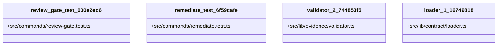
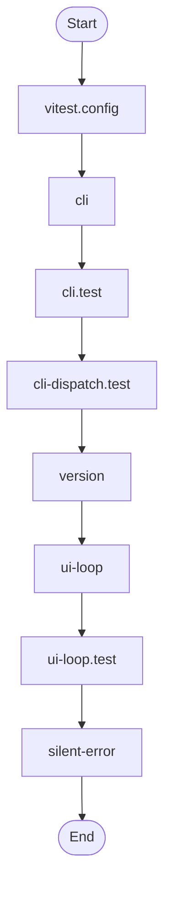
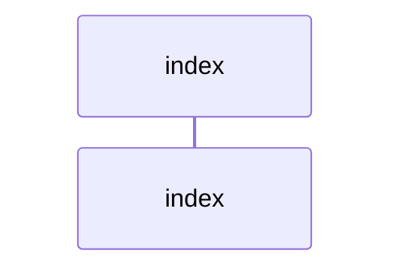

# Diagram Context Pack

Generated: 2026-02-27T22:34:59Z

## architecture

```mermaid
graph TD
  subgraph __cdb4ee2a["."]
    vitest_config_a9f1245e["vitest.config"]
  end
  subgraph src_25a66342["src"]
    cli_99bb8840["cli"]
    cli_test_4851f28b["cli.test"]
    cli_dispatch_test_54c9f17b["cli-dispatch.test"]
  end
  subgraph src_lib_91be6cfb["src/lib"]
    version_5ca4f385["version"]
  end
  subgraph src_commands_f0f9cc2d["src/commands"]
    ui_loop_11660889["ui-loop"]
    ui_loop_test_f0eabc42["ui-loop.test"]
    silent_error_64e8c933["silent-error"]
    search_24193290["search"]
    search_test_0c66bc11["search.test"]
    risk_tier_807f33f9["risk-tier"]
    review_gate_09b579c4["review-gate"]
    review_gate_test_000e2ed6["review-gate.test"]
    replay_ac203c98["replay"]
    replay_test_935f7436["replay.test"]
    remediate_06b9c7fc["remediate"]
    remediate_test_6f59cafe["remediate.test"]
    prompt_gate_c5e9d207["prompt-gate"]
    prompt_gate_test_1a442b27["prompt-gate.test"]
    preflight_gate_c543e5ba["preflight-gate"]
    policy_gate_213f7313["policy-gate"]
    policy_gate_test_203a5261["policy-gate.test"]
    plan_gate_c2cf5008["plan-gate"]
    plan_gate_test_0c0192e6["plan-gate.test"]
    pilot_rollback_00c1f82c["pilot-rollback"]
    pilot_rollback_test_e61d5a2b["pilot-rollback.test"]
    pilot_evaluate_2045b1a1["pilot-evaluate"]
    pilot_evaluate_test_a2ac06fc["pilot-evaluate.test"]
    observability_gate_455f1f2f["observability-gate"]
    observability_gate_test_ca2979e0["observability-gate.test"]
    memory_gate_a577a506["memory-gate"]
    init_bb54068a["init"]
    init_test_cbba76a6["init.test"]
    index_context_de3ed39d["index-context"]
    gardener_9416a9df["gardener"]
    gardener_test_98f0b9a5["gardener.test"]
    gap_case_82e69111["gap-case"]
    gap_case_test_e32159fb["gap-case.test"]
    evidence_verify_3b73c290["evidence-verify"]
    evidence_verify_test_7373101d["evidence-verify.test"]
    diff_budget_9da0268d["diff-budget"]
    diff_budget_test_c0b72453["diff-budget.test"]
    context_ea7792a2["context"]
    check_environment_fe68d4be["check-environment"]
    check_authz_fee242b1["check-authz"]
    brainstorm_gate_1789ba44["brainstorm-gate"]
    blast_radius_f776a633["blast-radius"]
  end
  subgraph src_lib_workflow_7d547930["src/lib/workflow"]
    plan_64879f7d["plan"]
    plan_test_e7c3b920["plan.test"]
    brainstorm_e2e2381d["brainstorm"]
    brainstorm_test_78cf7a1e["brainstorm.test"]
  end
  subgraph src_lib_silent_error_26e972c0["src/lib/silent-error"]
    types_8d846022["types"]
    detector_f2b3cbe4["detector"]
    detector_test_d10b3555["detector.test"]
  end
  subgraph src_lib_preflight_d75938f9["src/lib/preflight"]
    validator_f82af321["validator"]
    types_1_4ecdf56e["types"]
  end
  subgraph src_lib_policy_f3a0824d["src/lib/policy"]
    risk_tier_1_96b6ff91["risk-tier"]
    risk_tier_test_ae056367["risk-tier.test"]
    diff_budget_1_9f85eb1c["diff-budget"]
  end
  subgraph src_lib_plan_gate_b742698a["src/lib/plan-gate"]
    types_2_d9bc6e7a["types"]
    detector_1_b37d288b["detector"]
  end
  subgraph src_lib_pilot_evaluation_f6cc358e["src/lib/pilot-evaluation"]
    types_3_9675d69b["types"]
    metrics_capture_1d1a2c08["metrics-capture"]
  end
  subgraph src_lib_remediation_66ee2139["src/lib/remediation"]
    types_4_822d0f88["types"]
    orchestrator_11376b7e["orchestrator"]
    orchestrator_test_18d2fe26["orchestrator.test"]
    finding_normalizer_13f1559c["finding-normalizer"]
    finding_normalizer_test_d4639bd8["finding-normalizer.test"]
  end
  subgraph src_lib_replay_9cdd6ac4["src/lib/replay"]
    tracer_1e6243a2["tracer"]
    tracer_test_cb965d81["tracer.test"]
  end
  subgraph src_lib_observability_ecdc7d70["src/lib/observability"]
    cardinality_ebef8aff["cardinality"]
    cardinality_test_c00e7edb["cardinality.test"]
  end
  subgraph src_lib_memory_273eb2dc["src/lib/memory"]
    validator_1_0c0621d8["validator"]
    validator_test_b4b482f8["validator.test"]
    types_5_f869ec4b["types"]
    metrics_tracker_98cec29c["metrics-tracker"]
    metrics_tracker_test_3de156fa["metrics-tracker.test"]
    branch_enforcer_acb749cd["branch-enforcer"]
  end
  subgraph src_lib_gap_case_7bad4dc6["src/lib/gap-case"]
    types_6_1818fb91["types"]
  end
  subgraph src_lib_gardener_b4230e43["src/lib/gardener"]
    types_7_2f1ed65e["types"]
    stale_detector_a563289e["stale-detector"]
    stale_detector_test_7dc85478["stale-detector.test"]
    quality_scorer_362f2a90["quality-scorer"]
    pr_creator_dc6b1ea4["pr-creator"]
    link_checker_d0fa555f["link-checker"]
  end
  subgraph src_lib_evidence_90f7ab75["src/lib/evidence"]
    validator_2_744853f5["validator"]
    validator_test_1_c5015ca0["validator.test"]
    types_8_f6283648["types"]
    policy_823412d1["policy"]
    policy_test_2c06901d["policy.test"]
    logger_2686af9f["logger"]
    loader_d47712cc["loader"]
    index_1bc04b52["index"]
  end
  subgraph src_lib_contract_49c85030["src/lib/contract"]
    validator_3_28b6e9f3["validator"]
    validator_test_2_8dbecf99["validator.test"]
    types_9_1db4641f["types"]
    loader_1_16749818["loader"]
    loader_test_03424671["loader.test"]
  end
  subgraph src_lib_context_compound_efbf003d["src/lib/context-compound"]
    types_10_75e5a4a0["types"]
    store_824d80d7["store"]
  end
  style index_1bc04b52 fill:#4f46e5,color:#fff
```

## class

```mermaid
classDiagram
  class review_gate_test_000e2ed6 {
    +src/commands/review-gate.test.ts
  }
  class remediate_test_6f59cafe {
    +src/commands/remediate.test.ts
  }
  class validator_2_744853f5 {
    +src/lib/evidence/validator.ts
  }
  class loader_1_16749818 {
    +src/lib/contract/loader.ts
  }
```

## dependency

```mermaid
graph LR
  vitest_a9127f3d["vitest"] --> vitest_config_a9f1245e
  node_url_b54ed078["node:url"] --> cli_99bb8840
  node_crypto_879f6cbe["node:crypto"] --> cli_test_4851f28b
  node_fs_df6b52af["node:fs"] --> cli_test_4851f28b
  node_path_0e7d56ab["node:path"] --> cli_test_4851f28b
  vitest_a9127f3d["vitest"] --> cli_test_4851f28b
  vitest_a9127f3d["vitest"] --> cli_dispatch_test_54c9f17b
  node_fs_df6b52af["node:fs"] --> version_5ca4f385
  node_path_0e7d56ab["node:path"] --> version_5ca4f385
  node_url_b54ed078["node:url"] --> version_5ca4f385
  node_fs_df6b52af["node:fs"] --> ui_loop_11660889
  node_path_0e7d56ab["node:path"] --> ui_loop_11660889
  node_fs_df6b52af["node:fs"] --> ui_loop_test_f0eabc42
  vitest_a9127f3d["vitest"] --> ui_loop_test_f0eabc42
  node_child_process_cb73900b["node:child_process"] --> search_24193290
  node_path_0e7d56ab["node:path"] --> search_24193290
  vitest_a9127f3d["vitest"] --> search_test_0c66bc11
  node_child_process_cb73900b["node:child_process"] --> search_test_0c66bc11
  vitest_a9127f3d["vitest"] --> review_gate_test_000e2ed6
  vitest_a9127f3d["vitest"] --> replay_test_935f7436
  node_child_process_cb73900b["node:child_process"] --> remediate_06b9c7fc
  node_fs_df6b52af["node:fs"] --> remediate_06b9c7fc
  vitest_a9127f3d["vitest"] --> remediate_test_6f59cafe
  node_child_process_cb73900b["node:child_process"] --> remediate_test_6f59cafe
  node_fs_df6b52af["node:fs"] --> remediate_test_6f59cafe
  node_fs_df6b52af["node:fs"] --> prompt_gate_c5e9d207
  node_path_0e7d56ab["node:path"] --> prompt_gate_c5e9d207
  vitest_a9127f3d["vitest"] --> prompt_gate_test_1a442b27
  vitest_a9127f3d["vitest"] --> policy_gate_test_203a5261
  node_fs_df6b52af["node:fs"] --> plan_gate_test_0c0192e6
  node_path_0e7d56ab["node:path"] --> plan_gate_test_0c0192e6
  vitest_a9127f3d["vitest"] --> plan_gate_test_0c0192e6
  node_crypto_879f6cbe["node:crypto"] --> pilot_rollback_00c1f82c
  node_path_0e7d56ab["node:path"] --> pilot_rollback_00c1f82c
  node_fs_df6b52af["node:fs"] --> pilot_rollback_test_e61d5a2b
  node_path_0e7d56ab["node:path"] --> pilot_rollback_test_e61d5a2b
  vitest_a9127f3d["vitest"] --> pilot_rollback_test_e61d5a2b
  node_fs_df6b52af["node:fs"] --> pilot_rollback_test_e61d5a2b
  node_fs_df6b52af["node:fs"] --> pilot_rollback_test_e61d5a2b
  node_fs_df6b52af["node:fs"] --> pilot_rollback_test_e61d5a2b
  node_fs_df6b52af["node:fs"] --> pilot_evaluate_2045b1a1
  node_path_0e7d56ab["node:path"] --> pilot_evaluate_2045b1a1
  node_fs_df6b52af["node:fs"] --> pilot_evaluate_test_a2ac06fc
  node_path_0e7d56ab["node:path"] --> pilot_evaluate_test_a2ac06fc
  vitest_a9127f3d["vitest"] --> pilot_evaluate_test_a2ac06fc
  node_fs_df6b52af["node:fs"] --> pilot_evaluate_test_a2ac06fc
  vitest_a9127f3d["vitest"] --> observability_gate_test_ca2979e0
  node_crypto_879f6cbe["node:crypto"] --> init_bb54068a
  node_path_0e7d56ab["node:path"] --> init_bb54068a
  node_process_09240432["node:process"] --> init_bb54068a
  diff_df087996["diff"] --> init_bb54068a
  semver_50449d83["semver"] --> init_bb54068a
  _inquirer_prompts_21758d24["@inquirer/prompts"] --> init_bb54068a
  node_fs_df6b52af["node:fs"] --> init_test_cbba76a6
  node_os_e9717731["node:os"] --> init_test_cbba76a6
  node_path_0e7d56ab["node:path"] --> init_test_cbba76a6
  vitest_a9127f3d["vitest"] --> init_test_cbba76a6
  node_fs_df6b52af["node:fs"] --> init_test_cbba76a6
  node_fs_df6b52af["node:fs"] --> init_test_cbba76a6
  node_fs_df6b52af["node:fs"] --> init_test_cbba76a6
  node_fs_df6b52af["node:fs"] --> init_test_cbba76a6
  node_fs_df6b52af["node:fs"] --> init_test_cbba76a6
  node_fs_df6b52af["node:fs"] --> init_test_cbba76a6
  node_fs_df6b52af["node:fs"] --> init_test_cbba76a6
  node_fs_df6b52af["node:fs"] --> init_test_cbba76a6
  node_fs_df6b52af["node:fs"] --> init_test_cbba76a6
  node_fs_df6b52af["node:fs"] --> init_test_cbba76a6
  node_fs_df6b52af["node:fs"] --> init_test_cbba76a6
  node_fs_df6b52af["node:fs"] --> init_test_cbba76a6
  node_fs_df6b52af["node:fs"] --> init_test_cbba76a6
  node_fs_df6b52af["node:fs"] --> init_test_cbba76a6
  node_fs_df6b52af["node:fs"] --> init_test_cbba76a6
  node_fs_df6b52af["node:fs"] --> init_test_cbba76a6
  node_fs_df6b52af["node:fs"] --> init_test_cbba76a6
  node_fs_df6b52af["node:fs"] --> init_test_cbba76a6
  node_fs_df6b52af["node:fs"] --> index_context_de3ed39d
  node_path_0e7d56ab["node:path"] --> index_context_de3ed39d
  node_fs_df6b52af["node:fs"] --> gardener_9416a9df
  node_path_0e7d56ab["node:path"] --> gardener_9416a9df
  node_path_0e7d56ab["node:path"] --> gardener_test_98f0b9a5
  vitest_a9127f3d["vitest"] --> gardener_test_98f0b9a5
  node_crypto_879f6cbe["node:crypto"] --> gap_case_82e69111
  node_path_0e7d56ab["node:path"] --> gap_case_82e69111
  node_fs_df6b52af["node:fs"] --> gap_case_test_e32159fb
  node_path_0e7d56ab["node:path"] --> gap_case_test_e32159fb
  vitest_a9127f3d["vitest"] --> gap_case_test_e32159fb
  node_fs_df6b52af["node:fs"] --> evidence_verify_3b73c290
  node_path_0e7d56ab["node:path"] --> evidence_verify_3b73c290
  node_fs_df6b52af["node:fs"] --> evidence_verify_test_7373101d
  node_os_e9717731["node:os"] --> evidence_verify_test_7373101d
  node_path_0e7d56ab["node:path"] --> evidence_verify_test_7373101d
  vitest_a9127f3d["vitest"] --> evidence_verify_test_7373101d
  node_child_process_cb73900b["node:child_process"] --> diff_budget_9da0268d
  node_fs_df6b52af["node:fs"] --> diff_budget_9da0268d
  vitest_a9127f3d["vitest"] --> diff_budget_test_c0b72453
  node_child_process_cb73900b["node:child_process"] --> diff_budget_test_c0b72453
  node_fs_df6b52af["node:fs"] --> diff_budget_test_c0b72453
  node_path_0e7d56ab["node:path"] --> context_ea7792a2
  node_crypto_879f6cbe["node:crypto"] --> check_environment_fe68d4be
  node_fs_df6b52af["node:fs"] --> check_environment_fe68d4be
  node_path_0e7d56ab["node:path"] --> check_environment_fe68d4be
  node_fs_df6b52af["node:fs"] --> check_authz_fee242b1
  node_path_0e7d56ab["node:path"] --> check_authz_fee242b1
  node_path_0e7d56ab["node:path"] --> plan_64879f7d
  node_path_0e7d56ab["node:path"] --> plan_test_e7c3b920
  vitest_a9127f3d["vitest"] --> plan_test_e7c3b920
  node_path_0e7d56ab["node:path"] --> brainstorm_e2e2381d
  node_fs_df6b52af["node:fs"] --> brainstorm_test_78cf7a1e
  node_path_0e7d56ab["node:path"] --> brainstorm_test_78cf7a1e
  vitest_a9127f3d["vitest"] --> brainstorm_test_78cf7a1e
  node_fs_df6b52af["node:fs"] --> detector_f2b3cbe4
  node_path_0e7d56ab["node:path"] --> detector_f2b3cbe4
  node_fs_df6b52af["node:fs"] --> detector_test_d10b3555
  node_os_e9717731["node:os"] --> detector_test_d10b3555
  node_path_0e7d56ab["node:path"] --> detector_test_d10b3555
  vitest_a9127f3d["vitest"] --> detector_test_d10b3555
  node_fs_df6b52af["node:fs"] --> validator_f82af321
  node_path_0e7d56ab["node:path"] --> validator_f82af321
  picomatch_0bf97c7b["picomatch"] --> risk_tier_1_96b6ff91
  vitest_a9127f3d["vitest"] --> risk_tier_test_ae056367
  node_fs_df6b52af["node:fs"] --> detector_1_b37d288b
  node_path_0e7d56ab["node:path"] --> detector_1_b37d288b
  node_fs_df6b52af["node:fs"] --> metrics_capture_1d1a2c08
  node_path_0e7d56ab["node:path"] --> metrics_capture_1d1a2c08
  vitest_a9127f3d["vitest"] --> orchestrator_test_18d2fe26
  vitest_a9127f3d["vitest"] --> finding_normalizer_test_d4639bd8
  node_crypto_879f6cbe["node:crypto"] --> tracer_1e6243a2
  node_fs_df6b52af["node:fs"] --> tracer_1e6243a2
  node_path_0e7d56ab["node:path"] --> tracer_1e6243a2
  node_fs_df6b52af["node:fs"] --> tracer_1e6243a2
  vitest_a9127f3d["vitest"] --> tracer_test_cb965d81
  vitest_a9127f3d["vitest"] --> cardinality_test_c00e7edb
  node_fs_df6b52af["node:fs"] --> validator_1_0c0621d8
  node_path_0e7d56ab["node:path"] --> validator_1_0c0621d8
  node_fs_df6b52af["node:fs"] --> validator_test_b4b482f8
  node_os_e9717731["node:os"] --> validator_test_b4b482f8
  node_path_0e7d56ab["node:path"] --> validator_test_b4b482f8
  vitest_a9127f3d["vitest"] --> validator_test_b4b482f8
  node_fs_df6b52af["node:fs"] --> metrics_tracker_98cec29c
  node_path_0e7d56ab["node:path"] --> metrics_tracker_98cec29c
  node_fs_df6b52af["node:fs"] --> metrics_tracker_test_3de156fa
  node_os_e9717731["node:os"] --> metrics_tracker_test_3de156fa
  node_path_0e7d56ab["node:path"] --> metrics_tracker_test_3de156fa
  vitest_a9127f3d["vitest"] --> metrics_tracker_test_3de156fa
  node_child_process_cb73900b["node:child_process"] --> branch_enforcer_acb749cd
  node_fs_df6b52af["node:fs"] --> branch_enforcer_acb749cd
  node_path_0e7d56ab["node:path"] --> branch_enforcer_acb749cd
  node_fs_df6b52af["node:fs"] --> stale_detector_a563289e
  node_path_0e7d56ab["node:path"] --> stale_detector_a563289e
  node_fs_df6b52af["node:fs"] --> stale_detector_test_7dc85478
  node_path_0e7d56ab["node:path"] --> stale_detector_test_7dc85478
  vitest_a9127f3d["vitest"] --> stale_detector_test_7dc85478
  node_fs_df6b52af["node:fs"] --> quality_scorer_362f2a90
  node_path_0e7d56ab["node:path"] --> quality_scorer_362f2a90
  _octokit_plugin_throttling_c7312007["@octokit/plugin-throttling"] --> pr_creator_dc6b1ea4
  _octokit_rest_c557ffd5["@octokit/rest"] --> pr_creator_dc6b1ea4
  node_child_process_cb73900b["node:child_process"] --> link_checker_d0fa555f
  node_crypto_879f6cbe["node:crypto"] --> link_checker_d0fa555f
  node_fs_df6b52af["node:fs"] --> link_checker_d0fa555f
  node_os_e9717731["node:os"] --> link_checker_d0fa555f
  node_path_0e7d56ab["node:path"] --> link_checker_d0fa555f
  node_fs_df6b52af["node:fs"] --> validator_2_744853f5
  node_fs_df6b52af["node:fs"] --> validator_2_744853f5
  node_path_0e7d56ab["node:path"] --> validator_2_744853f5
  node_fs_df6b52af["node:fs"] --> validator_test_1_c5015ca0
  node_os_e9717731["node:os"] --> validator_test_1_c5015ca0
  node_path_0e7d56ab["node:path"] --> validator_test_1_c5015ca0
  vitest_a9127f3d["vitest"] --> validator_test_1_c5015ca0
  picomatch_0bf97c7b["picomatch"] --> policy_823412d1
  vitest_a9127f3d["vitest"] --> policy_test_2c06901d
  node_fs_df6b52af["node:fs"] --> loader_d47712cc
  node_fs_df6b52af["node:fs"] --> loader_d47712cc
  node_path_0e7d56ab["node:path"] --> loader_d47712cc
  vitest_a9127f3d["vitest"] --> validator_test_2_8dbecf99
  node_fs_df6b52af["node:fs"] --> loader_1_16749818
  node_fs_df6b52af["node:fs"] --> loader_test_03424671
  node_path_0e7d56ab["node:path"] --> loader_test_03424671
  vitest_a9127f3d["vitest"] --> loader_test_03424671
  node_fs_df6b52af["node:fs"] --> store_824d80d7
  node_fs_df6b52af["node:fs"] --> store_824d80d7
  node_path_0e7d56ab["node:path"] --> store_824d80d7
  better_sqlite3_696a1c4c["better-sqlite3"] --> store_824d80d7
  sqlite_vec_925f2a56["sqlite-vec"] --> store_824d80d7
  style vitest_a9127f3d fill:#f59e0b,color:#fff
  style node_url_b54ed078 fill:#f59e0b,color:#fff
  style node_crypto_879f6cbe fill:#f59e0b,color:#fff
  style node_fs_df6b52af fill:#f59e0b,color:#fff
  style node_path_0e7d56ab fill:#f59e0b,color:#fff
  style node_child_process_cb73900b fill:#f59e0b,color:#fff
  style node_process_09240432 fill:#f59e0b,color:#fff
  style diff_df087996 fill:#f59e0b,color:#fff
  style semver_50449d83 fill:#f59e0b,color:#fff
  style _inquirer_prompts_21758d24 fill:#f59e0b,color:#fff
  style node_os_e9717731 fill:#f59e0b,color:#fff
  style picomatch_0bf97c7b fill:#f59e0b,color:#fff
  style _octokit_plugin_throttling_c7312007 fill:#f59e0b,color:#fff
  style _octokit_rest_c557ffd5 fill:#f59e0b,color:#fff
  style better_sqlite3_696a1c4c fill:#f59e0b,color:#fff
  style sqlite_vec_925f2a56 fill:#f59e0b,color:#fff
```

## flow

```mermaid
flowchart TD
  Start(["Start"])
  vitest_config_a9f1245e["vitest.config"]
  Start --> vitest_config_a9f1245e
  cli_99bb8840["cli"]
  vitest_config_a9f1245e --> cli_99bb8840
  cli_test_4851f28b["cli.test"]
  cli_99bb8840 --> cli_test_4851f28b
  cli_dispatch_test_54c9f17b["cli-dispatch.test"]
  cli_test_4851f28b --> cli_dispatch_test_54c9f17b
  version_5ca4f385["version"]
  cli_dispatch_test_54c9f17b --> version_5ca4f385
  ui_loop_11660889["ui-loop"]
  version_5ca4f385 --> ui_loop_11660889
  ui_loop_test_f0eabc42["ui-loop.test"]
  ui_loop_11660889 --> ui_loop_test_f0eabc42
  silent_error_64e8c933["silent-error"]
  ui_loop_test_f0eabc42 --> silent_error_64e8c933
  End(["End"])
  silent_error_64e8c933 --> End
```

## sequence

```mermaid
sequenceDiagram
  participant index_1bc04b52 as index
```

