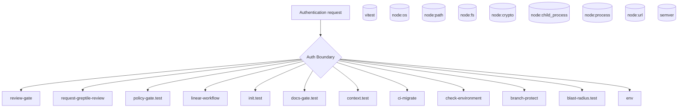
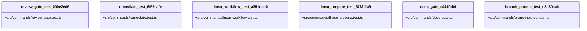
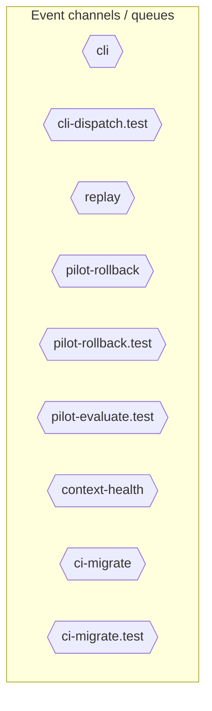
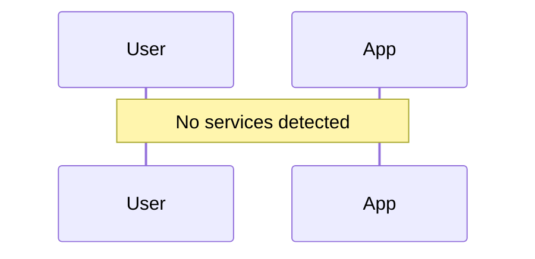

# Diagram Context Pack

Generated: 2026-03-17T23:42:26Z

## architecture

```mermaid
graph TD
  subgraph __cdb4ee2a["."]
    vitest_config_a9f1245e["vitest.config"]
  end
  subgraph src_25a66342["src"]
    cli_99bb8840["cli"]
    cli_test_4851f28b["cli.test"]
    cli_dispatch_test_54c9f17b["cli-dispatch.test"]
  end
  subgraph scripts_8c5967fd["scripts"]
    circleci_stale_management_664de1d9["circleci-stale-management"]
    circleci_linear_sync_19c0d6da["circleci-linear-sync"]
  end
  subgraph e2e_6d8749c4["e2e"]
    vitest_e2e_config_4e2a61bc["vitest.e2e.config"]
    run_e2e_39efe696["run-e2e"]
  end
  subgraph src_lib_91be6cfb["src/lib"]
    version_5ca4f385["version"]
    preset_detection_b0f00a17["preset-detection"]
    preset_detection_test_13b58525["preset-detection.test"]
    pr_template_validator_f1a53aee["pr-template-validator"]
    pr_template_validator_test_569b1cef["pr-template-validator.test"]
  end
  subgraph src_commands_f0f9cc2d["src/commands"]
    workflow_generate_2fc0af62["workflow-generate"]
    workflow_generate_test_b543473a["workflow-generate.test"]
    verify_greptile_227190f7["verify-greptile"]
    verify_greptile_test_17404b05["verify-greptile.test"]
    ui_loop_11660889["ui-loop"]
    ui_loop_test_f0eabc42["ui-loop.test"]
    tooling_audit_8a8239ff["tooling-audit"]
    tooling_audit_test_d2aee28c["tooling-audit.test"]
    simulate_b9efe395["simulate"]
    simulate_test_24df93e5["simulate.test"]
    silent_error_64e8c933["silent-error"]
    search_24193290["search"]
    search_test_0c66bc11["search.test"]
    risk_tier_807f33f9["risk-tier"]
    review_gate_09b579c4["review-gate"]
    review_gate_test_000e2ed6["review-gate.test"]
    request_greptile_review_851df233["request-greptile-review"]
    request_greptile_review_test_b073e76e["request-greptile-review.test"]
    replay_ac203c98["replay"]
    replay_test_935f7436["replay.test"]
    remediate_06b9c7fc["remediate"]
    remediate_test_6f59cafe["remediate.test"]
    prompt_gate_c5e9d207["prompt-gate"]
    prompt_gate_test_1a442b27["prompt-gate.test"]
    preset_d410850f["preset"]
    preset_test_9e489c16["preset.test"]
    preflight_gate_c543e5ba["preflight-gate"]
    pr_template_gate_281778f9["pr-template-gate"]
    pr_template_gate_test_35faef1d["pr-template-gate.test"]
    policy_gate_213f7313["policy-gate"]
    policy_gate_test_203a5261["policy-gate.test"]
    plan_gate_c2cf5008["plan-gate"]
    plan_gate_test_0c0192e6["plan-gate.test"]
    pilot_rollback_00c1f82c["pilot-rollback"]
    pilot_rollback_test_e61d5a2b["pilot-rollback.test"]
    pilot_evaluate_2045b1a1["pilot-evaluate"]
    pilot_evaluate_test_a2ac06fc["pilot-evaluate.test"]
    org_audit_d739e44b["org-audit"]
    org_audit_test_0fd9cae8["org-audit.test"]
    observability_gate_455f1f2f["observability-gate"]
    observability_gate_test_ca2979e0["observability-gate.test"]
    memory_gate_a577a506["memory-gate"]
    linear_workflow_c5cb6267["linear-workflow"]
    linear_workflow_test_a351dcb0["linear-workflow.test"]
    linear_prepare_0c613ba6["linear-prepare"]
    linear_prepare_test_678f11a9["linear-prepare.test"]
    linear_gate_fac14a46["linear-gate"]
    linear_gate_test_4fcca11a["linear-gate.test"]
    license_gate_3d7eb57e["license-gate"]
    init_bb54068a["init"]
    init_test_cbba76a6["init.test"]
    index_context_de3ed39d["index-context"]
    index_context_test_1949ea6f["index-context.test"]
    gardener_9416a9df["gardener"]
    gardener_test_98f0b9a5["gardener.test"]
    gap_case_82e69111["gap-case"]
    gap_case_test_e32159fb["gap-case.test"]
    evidence_verify_3b73c290["evidence-verify"]
    evidence_verify_test_7373101d["evidence-verify.test"]
    drift_gate_23bbee85["drift-gate"]
    drift_gate_test_816765e3["drift-gate.test"]
    docs_gate_c441fbb4["docs-gate"]
    docs_gate_test_a25e972f["docs-gate.test"]
    diff_budget_9da0268d["diff-budget"]
    diff_budget_test_c0b72453["diff-budget.test"]
    context_ea7792a2["context"]
    context_test_57aad306["context.test"]
    context_integrity_acceptance_test_59f961b1["context-integrity-acceptance.test"]
    context_health_80bb7da9["context-health"]
    context_health_test_3b5b87f3["context-health.test"]
    ci_migrate_78bb70b1["ci-migrate"]
    ci_migrate_test_2a015bb9["ci-migrate.test"]
    check_environment_fe68d4be["check-environment"]
    check_environment_test_5fa29c35["check-environment.test"]
    check_diagram_freshness_test_c1dc40aa["check-diagram-freshness.test"]
    check_authz_fee242b1["check-authz"]
    check_authz_test_327903fb["check-authz.test"]
    branch_protect_b9d345eb["branch-protect"]
    branch_protect_test_c8d80aab["branch-protect.test"]
    brainstorm_gate_1789ba44["brainstorm-gate"]
    blast_radius_f776a633["blast-radius"]
    blast_radius_test_045450fc["blast-radius.test"]
    automation_run_22331800["automation-run"]
    automation_run_test_7b21d905["automation-run.test"]
    agent_first_throughput_integration_test_dc677cc4["agent-first-throughput.integration.test"]
  end
  subgraph e2e_utils_979d12b1["e2e/utils"]
    resource_tracker_d95b6649["resource-tracker"]
    env_b77349bf["env"]
  end
```



## auth



## class



## database

```mermaid
flowchart TD
  UserRequest["User request"]
  Decision{Record exists?}
  cli_99bb8840["cli"]
  UserRequest --> cli_99bb8840
  cli_99bb8840 --> cli_99bb8840_result["result"]
  cli_dispatch_test_54c9f17b["cli-dispatch.test"]
  UserRequest --> cli_dispatch_test_54c9f17b
  cli_dispatch_test_54c9f17b --> cli_dispatch_test_54c9f17b_result["result"]
  simulate_b9efe395["simulate"]
  UserRequest --> simulate_b9efe395
  simulate_b9efe395 --> simulate_b9efe395_result["result"]
  search_24193290["search"]
  UserRequest --> search_24193290
  search_24193290 --> search_24193290_result["result"]
  request_greptile_review_test_b073e76e["request-greptile-review.test"]
  UserRequest --> request_greptile_review_test_b073e76e
  request_greptile_review_test_b073e76e --> request_greptile_review_test_b073e76e_result["result"]
  pilot_evaluate_2045b1a1["pilot-evaluate"]
  UserRequest --> pilot_evaluate_2045b1a1
  pilot_evaluate_2045b1a1 --> pilot_evaluate_2045b1a1_result["result"]
  pilot_evaluate_test_a2ac06fc["pilot-evaluate.test"]
  UserRequest --> pilot_evaluate_test_a2ac06fc
  pilot_evaluate_test_a2ac06fc --> pilot_evaluate_test_a2ac06fc_result["result"]
  org_audit_d739e44b["org-audit"]
  UserRequest --> org_audit_d739e44b
  org_audit_d739e44b --> org_audit_d739e44b_result["result"]
  init_test_cbba76a6["init.test"]
  UserRequest --> init_test_cbba76a6
  init_test_cbba76a6 --> init_test_cbba76a6_result["result"]
  index_context_de3ed39d["index-context"]
  UserRequest --> index_context_de3ed39d
  index_context_de3ed39d --> index_context_de3ed39d_result["result"]
  drift_gate_23bbee85["drift-gate"]
  UserRequest --> drift_gate_23bbee85
  drift_gate_23bbee85 --> drift_gate_23bbee85_result["result"]
  docs_gate_c441fbb4["docs-gate"]
  UserRequest --> docs_gate_c441fbb4
  docs_gate_c441fbb4 --> docs_gate_c441fbb4_result["result"]
  context_ea7792a2["context"]
  UserRequest --> context_ea7792a2
  context_ea7792a2 --> context_ea7792a2_result["result"]
  context_test_57aad306["context.test"]
  UserRequest --> context_test_57aad306
  context_test_57aad306 --> context_test_57aad306_result["result"]
  ci_migrate_78bb70b1["ci-migrate"]
  UserRequest --> ci_migrate_78bb70b1
  ci_migrate_78bb70b1 --> ci_migrate_78bb70b1_result["result"]
  ci_migrate_test_2a015bb9["ci-migrate.test"]
  UserRequest --> ci_migrate_test_2a015bb9
  ci_migrate_test_2a015bb9 --> ci_migrate_test_2a015bb9_result["result"]
  classDef dbNode fill:#0ea5e9,color:#fff
  classDef decisionNode fill:#0284c7,color:#fff
```



## dependency

```mermaid
graph LR
  vitest_a9127f3d["vitest"] --> vitest_config_a9f1245e
  node_fs_df6b52af["node:fs"] --> cli_99bb8840
  node_path_0e7d56ab["node:path"] --> cli_99bb8840
  node_url_b54ed078["node:url"] --> cli_99bb8840
  node_crypto_879f6cbe["node:crypto"] --> cli_test_4851f28b
  node_fs_df6b52af["node:fs"] --> cli_test_4851f28b
  node_path_0e7d56ab["node:path"] --> cli_test_4851f28b
  node_url_b54ed078["node:url"] --> cli_test_4851f28b
  vitest_a9127f3d["vitest"] --> cli_test_4851f28b
  vitest_a9127f3d["vitest"] --> cli_dispatch_test_54c9f17b
  _octokit_rest_c557ffd5["@octokit/rest"] --> circleci_stale_management_664de1d9
  node_child_process_cb73900b["node:child_process"] --> circleci_linear_sync_19c0d6da
  _octokit_rest_c557ffd5["@octokit/rest"] --> circleci_linear_sync_19c0d6da
  vitest_a9127f3d["vitest"] --> vitest_e2e_config_4e2a61bc
  node_child_process_cb73900b["node:child_process"] --> run_e2e_39efe696
  node_fs_df6b52af["node:fs"] --> run_e2e_39efe696
  node_path_0e7d56ab["node:path"] --> run_e2e_39efe696
  node_fs_df6b52af["node:fs"] --> version_5ca4f385
  node_path_0e7d56ab["node:path"] --> version_5ca4f385
  node_url_b54ed078["node:url"] --> version_5ca4f385
  node_fs_df6b52af["node:fs"] --> preset_detection_b0f00a17
  node_path_0e7d56ab["node:path"] --> preset_detection_b0f00a17
  vitest_a9127f3d["vitest"] --> preset_detection_test_13b58525
  vitest_a9127f3d["vitest"] --> pr_template_validator_test_569b1cef
  node_fs_df6b52af["node:fs"] --> workflow_generate_2fc0af62
  node_path_0e7d56ab["node:path"] --> workflow_generate_2fc0af62
  node_fs_df6b52af["node:fs"] --> workflow_generate_test_b543473a
  node_os_e9717731["node:os"] --> workflow_generate_test_b543473a
  node_path_0e7d56ab["node:path"] --> workflow_generate_test_b543473a
  vitest_a9127f3d["vitest"] --> workflow_generate_test_b543473a
  node_crypto_879f6cbe["node:crypto"] --> verify_greptile_227190f7
  node_fs_df6b52af["node:fs"] --> verify_greptile_227190f7
  node_path_0e7d56ab["node:path"] --> verify_greptile_227190f7
  node_crypto_879f6cbe["node:crypto"] --> verify_greptile_test_17404b05
  node_fs_df6b52af["node:fs"] --> verify_greptile_test_17404b05
  node_os_e9717731["node:os"] --> verify_greptile_test_17404b05
  node_path_0e7d56ab["node:path"] --> verify_greptile_test_17404b05
  vitest_a9127f3d["vitest"] --> verify_greptile_test_17404b05
  node_child_process_cb73900b["node:child_process"] --> ui_loop_11660889
  node_crypto_879f6cbe["node:crypto"] --> ui_loop_11660889
  node_fs_df6b52af["node:fs"] --> ui_loop_11660889
  node_path_0e7d56ab["node:path"] --> ui_loop_11660889
  node_url_b54ed078["node:url"] --> ui_loop_11660889
  node_child_process_cb73900b["node:child_process"] --> ui_loop_test_f0eabc42
  node_fs_df6b52af["node:fs"] --> ui_loop_test_f0eabc42
  vitest_a9127f3d["vitest"] --> ui_loop_test_f0eabc42
  node_fs_df6b52af["node:fs"] --> tooling_audit_8a8239ff
  node_path_0e7d56ab["node:path"] --> tooling_audit_8a8239ff
  node_fs_df6b52af["node:fs"] --> tooling_audit_test_d2aee28c
  node_os_e9717731["node:os"] --> tooling_audit_test_d2aee28c
  node_path_0e7d56ab["node:path"] --> tooling_audit_test_d2aee28c
  vitest_a9127f3d["vitest"] --> tooling_audit_test_d2aee28c
  node_crypto_879f6cbe["node:crypto"] --> simulate_b9efe395
  node_fs_df6b52af["node:fs"] --> simulate_b9efe395
  node_path_0e7d56ab["node:path"] --> simulate_b9efe395
  node_fs_df6b52af["node:fs"] --> simulate_test_24df93e5
  node_os_e9717731["node:os"] --> simulate_test_24df93e5
  node_path_0e7d56ab["node:path"] --> simulate_test_24df93e5
  vitest_a9127f3d["vitest"] --> simulate_test_24df93e5
  node_child_process_cb73900b["node:child_process"] --> search_24193290
  node_path_0e7d56ab["node:path"] --> search_24193290
  vitest_a9127f3d["vitest"] --> search_test_0c66bc11
  node_child_process_cb73900b["node:child_process"] --> search_test_0c66bc11
  vitest_a9127f3d["vitest"] --> review_gate_test_000e2ed6
  vitest_a9127f3d["vitest"] --> request_greptile_review_test_b073e76e
  node_path_0e7d56ab["node:path"] --> replay_ac203c98
  node_fs_df6b52af["node:fs"] --> replay_test_935f7436
  node_os_e9717731["node:os"] --> replay_test_935f7436
  node_path_0e7d56ab["node:path"] --> replay_test_935f7436
  vitest_a9127f3d["vitest"] --> replay_test_935f7436
  node_child_process_cb73900b["node:child_process"] --> remediate_06b9c7fc
  node_crypto_879f6cbe["node:crypto"] --> remediate_06b9c7fc
  node_path_0e7d56ab["node:path"] --> remediate_06b9c7fc
  vitest_a9127f3d["vitest"] --> remediate_test_6f59cafe
  node_fs_df6b52af["node:fs"] --> remediate_test_6f59cafe
  node_child_process_cb73900b["node:child_process"] --> remediate_test_6f59cafe
  node_fs_df6b52af["node:fs"] --> prompt_gate_c5e9d207
  node_path_0e7d56ab["node:path"] --> prompt_gate_c5e9d207
  vitest_a9127f3d["vitest"] --> prompt_gate_test_1a442b27
  vitest_a9127f3d["vitest"] --> preset_test_9e489c16
  node_fs_df6b52af["node:fs"] --> pr_template_gate_281778f9
  node_os_e9717731["node:os"] --> pr_template_gate_test_35faef1d
  node_path_0e7d56ab["node:path"] --> pr_template_gate_test_35faef1d
  vitest_a9127f3d["vitest"] --> pr_template_gate_test_35faef1d
  vitest_a9127f3d["vitest"] --> policy_gate_test_203a5261
  node_crypto_879f6cbe["node:crypto"] --> plan_gate_test_0c0192e6
  node_fs_df6b52af["node:fs"] --> plan_gate_test_0c0192e6
  node_path_0e7d56ab["node:path"] --> plan_gate_test_0c0192e6
  vitest_a9127f3d["vitest"] --> plan_gate_test_0c0192e6
  node_crypto_879f6cbe["node:crypto"] --> pilot_rollback_00c1f82c
  node_path_0e7d56ab["node:path"] --> pilot_rollback_00c1f82c
  node_path_0e7d56ab["node:path"] --> pilot_rollback_test_e61d5a2b
  vitest_a9127f3d["vitest"] --> pilot_rollback_test_e61d5a2b
  node_fs_df6b52af["node:fs"] --> pilot_rollback_test_e61d5a2b
  node_fs_df6b52af["node:fs"] --> pilot_rollback_test_e61d5a2b
  node_fs_df6b52af["node:fs"] --> pilot_rollback_test_e61d5a2b
  node_fs_df6b52af["node:fs"] --> pilot_rollback_test_e61d5a2b
  node_fs_df6b52af["node:fs"] --> pilot_rollback_test_e61d5a2b
  node_os_e9717731["node:os"] --> pilot_rollback_test_e61d5a2b
  node_fs_df6b52af["node:fs"] --> pilot_rollback_test_e61d5a2b
  node_fs_df6b52af["node:fs"] --> pilot_rollback_test_e61d5a2b
  node_fs_df6b52af["node:fs"] --> pilot_evaluate_2045b1a1
  node_path_0e7d56ab["node:path"] --> pilot_evaluate_2045b1a1
  node_path_0e7d56ab["node:path"] --> pilot_evaluate_test_a2ac06fc
  vitest_a9127f3d["vitest"] --> pilot_evaluate_test_a2ac06fc
  node_fs_df6b52af["node:fs"] --> pilot_evaluate_test_a2ac06fc
  node_fs_df6b52af["node:fs"] --> org_audit_d739e44b
  node_path_0e7d56ab["node:path"] --> org_audit_d739e44b
  node_fs_df6b52af["node:fs"] --> org_audit_test_0fd9cae8
  node_os_e9717731["node:os"] --> org_audit_test_0fd9cae8
  node_path_0e7d56ab["node:path"] --> org_audit_test_0fd9cae8
  vitest_a9127f3d["vitest"] --> org_audit_test_0fd9cae8
  vitest_a9127f3d["vitest"] --> observability_gate_test_ca2979e0
  vitest_a9127f3d["vitest"] --> linear_workflow_test_a351dcb0
  vitest_a9127f3d["vitest"] --> linear_prepare_test_678f11a9
  node_child_process_cb73900b["node:child_process"] --> linear_gate_fac14a46
  node_fs_df6b52af["node:fs"] --> linear_gate_fac14a46
  node_path_0e7d56ab["node:path"] --> linear_gate_fac14a46
  node_fs_df6b52af["node:fs"] --> linear_gate_test_4fcca11a
  node_os_e9717731["node:os"] --> linear_gate_test_4fcca11a
  node_path_0e7d56ab["node:path"] --> linear_gate_test_4fcca11a
  vitest_a9127f3d["vitest"] --> linear_gate_test_4fcca11a
  node_os_e9717731["node:os"] --> init_test_cbba76a6
  node_path_0e7d56ab["node:path"] --> init_test_cbba76a6
  vitest_a9127f3d["vitest"] --> init_test_cbba76a6
  node_fs_df6b52af["node:fs"] --> init_test_cbba76a6
  node_fs_df6b52af["node:fs"] --> init_test_cbba76a6
  node_fs_df6b52af["node:fs"] --> init_test_cbba76a6
  node_fs_df6b52af["node:fs"] --> init_test_cbba76a6
  node_fs_df6b52af["node:fs"] --> init_test_cbba76a6
  node_fs_df6b52af["node:fs"] --> init_test_cbba76a6
  node_fs_df6b52af["node:fs"] --> init_test_cbba76a6
  node_fs_df6b52af["node:fs"] --> init_test_cbba76a6
  node_fs_df6b52af["node:fs"] --> init_test_cbba76a6
  node_fs_df6b52af["node:fs"] --> init_test_cbba76a6
  node_fs_df6b52af["node:fs"] --> init_test_cbba76a6
  node_fs_df6b52af["node:fs"] --> init_test_cbba76a6
  node_fs_df6b52af["node:fs"] --> init_test_cbba76a6
  node_fs_df6b52af["node:fs"] --> init_test_cbba76a6
  node_fs_df6b52af["node:fs"] --> init_test_cbba76a6
  node_fs_df6b52af["node:fs"] --> init_test_cbba76a6
  node_fs_df6b52af["node:fs"] --> init_test_cbba76a6
  node_fs_df6b52af["node:fs"] --> init_test_cbba76a6
  node_fs_df6b52af["node:fs"] --> init_test_cbba76a6
  node_fs_df6b52af["node:fs"] --> init_test_cbba76a6
  node_fs_df6b52af["node:fs"] --> init_test_cbba76a6
  node_fs_df6b52af["node:fs"] --> init_test_cbba76a6
  node_fs_df6b52af["node:fs"] --> init_test_cbba76a6
  node_fs_df6b52af["node:fs"] --> init_test_cbba76a6
  node_fs_df6b52af["node:fs"] --> init_test_cbba76a6
  node_fs_df6b52af["node:fs"] --> init_test_cbba76a6
  node_fs_df6b52af["node:fs"] --> init_test_cbba76a6
  node_fs_df6b52af["node:fs"] --> init_test_cbba76a6
  node_fs_df6b52af["node:fs"] --> init_test_cbba76a6
  node_fs_df6b52af["node:fs"] --> init_test_cbba76a6
  node_fs_df6b52af["node:fs"] --> init_test_cbba76a6
  node_fs_df6b52af["node:fs"] --> init_test_cbba76a6
  node_fs_df6b52af["node:fs"] --> init_test_cbba76a6
  node_crypto_879f6cbe["node:crypto"] --> init_test_cbba76a6
  node_fs_df6b52af["node:fs"] --> init_test_cbba76a6
  node_fs_df6b52af["node:fs"] --> init_test_cbba76a6
  node_fs_df6b52af["node:fs"] --> init_test_cbba76a6
  node_fs_df6b52af["node:fs"] --> init_test_cbba76a6
  node_fs_df6b52af["node:fs"] --> init_test_cbba76a6
  node_fs_df6b52af["node:fs"] --> init_test_cbba76a6
  node_fs_df6b52af["node:fs"] --> init_test_cbba76a6
  node_fs_df6b52af["node:fs"] --> init_test_cbba76a6
  node_fs_df6b52af["node:fs"] --> init_test_cbba76a6
  node_fs_df6b52af["node:fs"] --> init_test_cbba76a6
  node_fs_df6b52af["node:fs"] --> init_test_cbba76a6
  node_fs_df6b52af["node:fs"] --> init_test_cbba76a6
  node_fs_df6b52af["node:fs"] --> init_test_cbba76a6
  node_fs_df6b52af["node:fs"] --> init_test_cbba76a6
  node_fs_df6b52af["node:fs"] --> init_test_cbba76a6
  node_fs_df6b52af["node:fs"] --> init_test_cbba76a6
  node_fs_df6b52af["node:fs"] --> init_test_cbba76a6
  node_fs_df6b52af["node:fs"] --> init_test_cbba76a6
  node_fs_df6b52af["node:fs"] --> init_test_cbba76a6
  node_fs_df6b52af["node:fs"] --> init_test_cbba76a6
  node_fs_df6b52af["node:fs"] --> index_context_de3ed39d
  node_path_0e7d56ab["node:path"] --> index_context_de3ed39d
  node_os_e9717731["node:os"] --> index_context_test_1949ea6f
  node_path_0e7d56ab["node:path"] --> index_context_test_1949ea6f
  vitest_a9127f3d["vitest"] --> index_context_test_1949ea6f
  node_fs_df6b52af["node:fs"] --> gardener_9416a9df
  node_path_0e7d56ab["node:path"] --> gardener_9416a9df
  node_path_0e7d56ab["node:path"] --> gardener_test_98f0b9a5
  vitest_a9127f3d["vitest"] --> gardener_test_98f0b9a5
  node_path_0e7d56ab["node:path"] --> gap_case_82e69111
  node_path_0e7d56ab["node:path"] --> gap_case_test_e32159fb
  vitest_a9127f3d["vitest"] --> gap_case_test_e32159fb
  node_fs_df6b52af["node:fs"] --> gap_case_test_e32159fb
  node_fs_df6b52af["node:fs"] --> evidence_verify_3b73c290
  node_path_0e7d56ab["node:path"] --> evidence_verify_3b73c290
  node_fs_df6b52af["node:fs"] --> evidence_verify_test_7373101d
  node_os_e9717731["node:os"] --> evidence_verify_test_7373101d
  node_path_0e7d56ab["node:path"] --> evidence_verify_test_7373101d
  vitest_a9127f3d["vitest"] --> evidence_verify_test_7373101d
  node_path_0e7d56ab["node:path"] --> drift_gate_23bbee85
  node_path_0e7d56ab["node:path"] --> drift_gate_test_816765e3
  vitest_a9127f3d["vitest"] --> drift_gate_test_816765e3
  node_crypto_879f6cbe["node:crypto"] --> docs_gate_c441fbb4
  node_fs_df6b52af["node:fs"] --> docs_gate_c441fbb4
  node_path_0e7d56ab["node:path"] --> docs_gate_c441fbb4
  node_fs_df6b52af["node:fs"] --> docs_gate_test_a25e972f
  node_path_0e7d56ab["node:path"] --> docs_gate_test_a25e972f
  vitest_a9127f3d["vitest"] --> docs_gate_test_a25e972f
  node_child_process_cb73900b["node:child_process"] --> diff_budget_9da0268d
  node_fs_df6b52af["node:fs"] --> diff_budget_9da0268d
  vitest_a9127f3d["vitest"] --> diff_budget_test_c0b72453
  node_child_process_cb73900b["node:child_process"] --> diff_budget_test_c0b72453
  node_fs_df6b52af["node:fs"] --> diff_budget_test_c0b72453
  node_path_0e7d56ab["node:path"] --> context_ea7792a2
  node_fs_df6b52af["node:fs"] --> context_test_57aad306
  node_os_e9717731["node:os"] --> context_test_57aad306
  node_path_0e7d56ab["node:path"] --> context_test_57aad306
  vitest_a9127f3d["vitest"] --> context_test_57aad306
  node_fs_df6b52af["node:fs"] --> context_integrity_acceptance_test_59f961b1
  node_path_0e7d56ab["node:path"] --> context_integrity_acceptance_test_59f961b1
  vitest_a9127f3d["vitest"] --> context_integrity_acceptance_test_59f961b1
  node_fs_df6b52af["node:fs"] --> context_health_80bb7da9
  node_path_0e7d56ab["node:path"] --> context_health_80bb7da9
  node_fs_df6b52af["node:fs"] --> context_health_test_3b5b87f3
  node_path_0e7d56ab["node:path"] --> context_health_test_3b5b87f3
  vitest_a9127f3d["vitest"] --> context_health_test_3b5b87f3
  node_child_process_cb73900b["node:child_process"] --> ci_migrate_78bb70b1
  node_crypto_879f6cbe["node:crypto"] --> ci_migrate_78bb70b1
  node_path_0e7d56ab["node:path"] --> ci_migrate_78bb70b1
  node_process_09240432["node:process"] --> ci_migrate_78bb70b1
  node_url_b54ed078["node:url"] --> ci_migrate_78bb70b1
  node_child_process_cb73900b["node:child_process"] --> ci_migrate_test_2a015bb9
  node_crypto_879f6cbe["node:crypto"] --> ci_migrate_test_2a015bb9
  node_os_e9717731["node:os"] --> ci_migrate_test_2a015bb9
  node_path_0e7d56ab["node:path"] --> ci_migrate_test_2a015bb9
  node_url_b54ed078["node:url"] --> ci_migrate_test_2a015bb9
  vitest_a9127f3d["vitest"] --> ci_migrate_test_2a015bb9
  fs_dce7cce0["fs"] --> ci_migrate_test_2a015bb9
  crypto_da2f073e["crypto"] --> ci_migrate_test_2a015bb9
  node_child_process_cb73900b["node:child_process"] --> check_environment_fe68d4be
  node_crypto_879f6cbe["node:crypto"] --> check_environment_fe68d4be
  node_fs_df6b52af["node:fs"] --> check_environment_fe68d4be
  node_path_0e7d56ab["node:path"] --> check_environment_fe68d4be
  semver_50449d83["semver"] --> check_environment_fe68d4be
  node_fs_df6b52af["node:fs"] --> check_environment_fe68d4be
  node_os_e9717731["node:os"] --> check_environment_test_5fa29c35
  node_path_0e7d56ab["node:path"] --> check_environment_test_5fa29c35
  vitest_a9127f3d["vitest"] --> check_environment_test_5fa29c35
  node_child_process_cb73900b["node:child_process"] --> check_environment_test_5fa29c35
  node_child_process_cb73900b["node:child_process"] --> check_environment_test_5fa29c35
  node_child_process_cb73900b["node:child_process"] --> check_environment_test_5fa29c35
  node_child_process_cb73900b["node:child_process"] --> check_environment_test_5fa29c35
  node_child_process_cb73900b["node:child_process"] --> check_environment_test_5fa29c35
  node_child_process_cb73900b["node:child_process"] --> check_environment_test_5fa29c35
  node_child_process_cb73900b["node:child_process"] --> check_diagram_freshness_test_c1dc40aa
  node_os_e9717731["node:os"] --> check_diagram_freshness_test_c1dc40aa
  node_path_0e7d56ab["node:path"] --> check_diagram_freshness_test_c1dc40aa
  vitest_a9127f3d["vitest"] --> check_diagram_freshness_test_c1dc40aa
  node_fs_df6b52af["node:fs"] --> check_authz_test_327903fb
  node_path_0e7d56ab["node:path"] --> check_authz_test_327903fb
  vitest_a9127f3d["vitest"] --> check_authz_test_327903fb
  vitest_a9127f3d["vitest"] --> branch_protect_test_c8d80aab
  node_fs_df6b52af["node:fs"] --> blast_radius_test_045450fc
  node_os_e9717731["node:os"] --> blast_radius_test_045450fc
  node_path_0e7d56ab["node:path"] --> blast_radius_test_045450fc
  vitest_a9127f3d["vitest"] --> blast_radius_test_045450fc
  node_path_0e7d56ab["node:path"] --> automation_run_22331800
  node_os_e9717731["node:os"] --> automation_run_test_7b21d905
  node_path_0e7d56ab["node:path"] --> automation_run_test_7b21d905
  vitest_a9127f3d["vitest"] --> automation_run_test_7b21d905
  node_child_process_cb73900b["node:child_process"] --> agent_first_throughput_integration_test_dc677cc4
  node_fs_df6b52af["node:fs"] --> agent_first_throughput_integration_test_dc677cc4
  node_path_0e7d56ab["node:path"] --> agent_first_throughput_integration_test_dc677cc4
  vitest_a9127f3d["vitest"] --> agent_first_throughput_integration_test_dc677cc4
  node_fs_df6b52af["node:fs"] --> resource_tracker_d95b6649
  node_fs_df6b52af["node:fs"] --> resource_tracker_d95b6649
  node_path_0e7d56ab["node:path"] --> resource_tracker_d95b6649
  style vitest_a9127f3d fill:#f59e0b,color:#fff
  style node_fs_df6b52af fill:#f59e0b,color:#fff
  style node_path_0e7d56ab fill:#f59e0b,color:#fff
  style node_url_b54ed078 fill:#f59e0b,color:#fff
  style node_crypto_879f6cbe fill:#f59e0b,color:#fff
  style _octokit_rest_c557ffd5 fill:#f59e0b,color:#fff
  style node_child_process_cb73900b fill:#f59e0b,color:#fff
  style node_os_e9717731 fill:#f59e0b,color:#fff
  style node_process_09240432 fill:#f59e0b,color:#fff
  style fs_dce7cce0 fill:#f59e0b,color:#fff
  style crypto_da2f073e fill:#f59e0b,color:#fff
  style semver_50449d83 fill:#f59e0b,color:#fff
```

## events



## flow


## security


## sequence



## user

```mermaid
flowchart LR
  User(("User"))
  cli_99bb8840["cli"]
  User --> cli_99bb8840
  cli_dispatch_test_54c9f17b["cli-dispatch.test"]
  User --> cli_dispatch_test_54c9f17b
  circleci_linear_sync_19c0d6da["circleci-linear-sync"]
  User --> circleci_linear_sync_19c0d6da
  verify_greptile_227190f7["verify-greptile"]
  User --> verify_greptile_227190f7
  verify_greptile_test_17404b05["verify-greptile.test"]
  User --> verify_greptile_test_17404b05
  ui_loop_11660889["ui-loop"]
  User --> ui_loop_11660889
  ui_loop_test_f0eabc42["ui-loop.test"]
  User --> ui_loop_test_f0eabc42
  tooling_audit_test_d2aee28c["tooling-audit.test"]
  User --> tooling_audit_test_d2aee28c
  review_gate_09b579c4["review-gate"]
  User --> review_gate_09b579c4
  review_gate_test_000e2ed6["review-gate.test"]
  User --> review_gate_test_000e2ed6
  request_greptile_review_851df233["request-greptile-review"]
  User --> request_greptile_review_851df233
  request_greptile_review_test_b073e76e["request-greptile-review.test"]
  User --> request_greptile_review_test_b073e76e
  linear_workflow_c5cb6267["linear-workflow"]
  User --> linear_workflow_c5cb6267
  linear_workflow_test_a351dcb0["linear-workflow.test"]
  User --> linear_workflow_test_a351dcb0
  linear_prepare_0c613ba6["linear-prepare"]
  User --> linear_prepare_0c613ba6
  linear_prepare_test_678f11a9["linear-prepare.test"]
  User --> linear_prepare_test_678f11a9
  init_test_cbba76a6["init.test"]
  User --> init_test_cbba76a6
  evidence_verify_3b73c290["evidence-verify"]
  User --> evidence_verify_3b73c290
  ci_migrate_78bb70b1["ci-migrate"]
  User --> ci_migrate_78bb70b1
  ci_migrate_test_2a015bb9["ci-migrate.test"]
  User --> ci_migrate_test_2a015bb9
  check_environment_fe68d4be["check-environment"]
  User --> check_environment_fe68d4be
  branch_protect_b9d345eb["branch-protect"]
  User --> branch_protect_b9d345eb
  branch_protect_test_c8d80aab["branch-protect.test"]
  User --> branch_protect_test_c8d80aab
  agent_first_throughput_integration_test_dc677cc4["agent-first-throughput.integration.test"]
  User --> agent_first_throughput_integration_test_dc677cc4
  env_b77349bf["env"]
  User --> env_b77349bf
  classDef userNode fill:#16a34a,color:#fff
```



