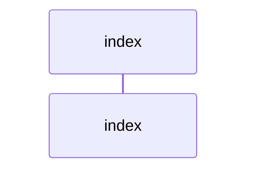

# Diagram Context Pack

Generated: 2026-05-06T16:36:02Z

## Table of Contents

- [How to use this pack](#how-to-use-this-pack)
- [architecture](#architecture)
- [auth](#auth)
- [class](#class)
- [database](#database)
- [dependency](#dependency)
- [events](#events)
- [flow](#flow)
- [security](#security)
- [sequence](#sequence)
- [user](#user)

## How to use this pack

- Start here for compact architecture, dependency, database, and ERD context before opening raw source files.
- Use .diagram/manifest.json to choose a focused Mermaid file when this combined pack is too large.
- For TypeScript implementation detail in this checkout, run `bash scripts/harness-cli.sh source-outline <path> --json` first, then unwrap one symbol with `--symbol <name>`. Downstream repositories can use `harness source-outline <path>`.

## architecture

```mermaid
graph TD
  subgraph sg_sg_a92fa1f9["."]
    node_vitest_config_vitest_config_d4be514f["vitest.config"]
  end
  subgraph sg_artifacts_debug_drift_north_star_src_artifacts_d_dc2902fd["artifacts/debug-drift-north-star/src"]
    node_artifacts_debug_drift_north_star_src_cli_cli_cb61b00a["cli"]
  end
  subgraph sg_artifacts_docs_gate_repro_src_artifacts_docs_gat_618cd773["artifacts/docs-gate-repro/src"]
    node_artifacts_docs_gate_repro_src_cli_cli_d4d3d7f9["cli"]
  end
  subgraph sg_coverage_coverage_92e81cc7["coverage"]
    node_coverage_block_navigation_block_navigation_dca36a44["block-navigation"]
    node_coverage_prettify_prettify_b892161d["prettify"]
    node_coverage_sorter_sorter_c978756d["sorter"]
  end
  subgraph sg_e2e_e2e_01e720f6["e2e"]
    node_e2e_run_e2e_run_e2e_26179552["run-e2e"]
    node_e2e_run_e2e_test_run_e2e_test_2c20c08b["run-e2e.test"]
    node_e2e_vitest_e2e_config_vitest_e2e_config_5d5c1e42["vitest.e2e.config"]
  end
  subgraph sg_e2e_clients_e2e_clients_f360d18d["e2e/clients"]
    node_e2e_clients_github_e2e_github_e2e_9896f624["github-e2e"]
    node_e2e_clients_linear_e2e_linear_e2e_4d37f1e3["linear-e2e"]
  end
  subgraph sg_e2e_tests_e2e_tests_76b5a366["e2e/tests"]
    node_e2e_tests_command_pipeline_e2e_test_command_pipe_fe4970a2["command-pipeline.e2e.test"]
    node_e2e_tests_github_integration_e2e_test_github_int_8d47a9d0["github-integration.e2e.test"]
    node_e2e_tests_linear_integration_e2e_test_linear_int_810c00f1["linear-integration.e2e.test"]
  end
  subgraph sg_e2e_utils_e2e_utils_c76ddd73["e2e/utils"]
    node_e2e_utils_env_env_47bb7301["env"]
    node_e2e_utils_env_test_env_test_c409874b["env.test"]
    node_e2e_utils_resource_tracker_resource_tracker_a4c8203e["resource-tracker"]
  end
  subgraph sg_scripts_scripts_060f4a73["scripts"]
    node_scripts_circleci_linear_sync_circleci_linear_syn_b943e237["circleci-linear-sync"]
    node_scripts_circleci_stale_management_circleci_stale_bc7e58ff["circleci-stale-management"]
    node_scripts_setup_git_hooks_setup_git_hooks_b76b6057["setup-git-hooks"]
    node_scripts_validate_commit_msg_validate_commit_msg_a6193f1f["validate-commit-msg"]
  end
  subgraph sg_scripts_hook_governance_scripts_hook_governance_6d3ba385["scripts/hook-governance"]
    node_scripts_hook_governance_evaluate_docstring_ratch_9ab49e01["evaluate_docstring_ratchet"]
    node_scripts_hook_governance_inventory_repos_inventor_5904717b["inventory_repos"]
    node_scripts_hook_governance_rollout_check_rollout_ch_652445fd["rollout_check"]
  end
  subgraph sg_scripts_hook_governance_tests_scripts_hook_gover_4fb482e7["scripts/hook-governance/tests"]
    node_scripts_hook_governance_tests_init_init_0a4c72ea["__init__"]
    node_scripts_hook_governance_tests_test_evaluate_docs_65bd4924["test_evaluate_docstring_ratchet"]
    node_scripts_hook_governance_tests_test_inventory_rep_6596edf9["test_inventory_repos"]
    node_scripts_hook_governance_tests_test_rollout_check_40bfa0f0["test_rollout_check"]
  end
  subgraph sg_src_src_0a7eb7bc["src"]
    node_src_cli_cli_6b31f087["cli"]
    node_src_cli_dispatch_test_cli_dispatch_test_a5f71b35["cli-dispatch.test"]
    node_src_cli_test_cli_test_c775853a["cli.test"]
  end
  subgraph sg_src_commands_src_commands_d7cbf56e["src/commands"]
    node_src_commands_agent_first_throughput_integration__f3c93889["agent-first-throughput.integration.test"]
    node_src_commands_artifact_gate_artifact_gate_b459716b["artifact-gate"]
    node_src_commands_artifact_gate_test_artifact_gate_te_40d1833e["artifact-gate.test"]
    node_src_commands_audit_audit_7ed292c5["audit"]
    node_src_commands_audit_test_audit_test_7d6504bb["audit.test"]
    node_src_commands_automation_run_automation_run_734fc4ae["automation-run"]
    node_src_commands_automation_run_test_automation_run__5c9657e6["automation-run.test"]
    node_src_commands_blast_radius_blast_radius_52a608f7["blast-radius"]
    node_src_commands_blast_radius_test_blast_radius_test_0a83877b["blast-radius.test"]
    node_src_commands_brain_brain_4737cb33["brain"]
    node_src_commands_brain_core_brain_core_d7f37f67["brain-core"]
    node_src_commands_brain_test_brain_test_e88fee92["brain.test"]
    node_src_commands_brainstorm_gate_brainstorm_gate_a9bb9c18["brainstorm-gate"]
    node_src_commands_brainstorm_gate_test_brainstorm_gat_0e05e914["brainstorm-gate.test"]
    node_src_commands_branch_protect_branch_protect_45b1868a["branch-protect"]
    node_src_commands_branch_protect_core_branch_protect__f8c0b905["branch-protect-core"]
    node_src_commands_branch_protect_test_branch_protect__33672eae["branch-protect.test"]
    node_src_commands_check_check_37c57325["check"]
    node_src_commands_check_authz_check_authz_4198882d["check-authz"]
    node_src_commands_check_authz_test_check_authz_test_833f28b0["check-authz.test"]
    node_src_commands_check_diagram_freshness_test_check__df69064e["check-diagram-freshness.test"]
    node_src_commands_check_environment_check_environment_ccb6b952["check-environment"]
    node_src_commands_check_environment_core_check_enviro_5d6a5fb8["check-environment-core"]
    node_src_commands_check_environment_test_check_enviro_1cc20dac["check-environment.test"]
    node_src_commands_check_test_check_test_e49adc3d["check.test"]
    node_src_commands_ci_migrate_ci_migrate_5f5182b1["ci-migrate"]
    node_src_commands_ci_migrate_core_ci_migrate_core_85279fa5["ci-migrate-core"]
    node_src_commands_ci_migrate_test_ci_migrate_test_2156dd02["ci-migrate.test"]
    node_src_commands_ci_ownership_gate_ci_ownership_gate_47bd35e0["ci-ownership-gate"]
    node_src_commands_ci_ownership_gate_test_ci_ownership_e40fac1c["ci-ownership-gate.test"]
    node_src_commands_context_context_3dbca471["context"]
    node_src_commands_context_health_context_health_f34a55d1["context-health"]
    node_src_commands_context_health_test_context_health__6d978b6c["context-health.test"]
    node_src_commands_context_integrity_acceptance_test_c_66c7c0a9["context-integrity-acceptance.test"]
    node_src_commands_context_test_context_test_b3afce2d["context.test"]
    node_src_commands_contract_contract_8aa505c4["contract"]
    node_src_commands_contract_test_contract_test_8ca4d62e["contract.test"]
    node_src_commands_diff_budget_diff_budget_42a89e07["diff-budget"]
    node_src_commands_diff_budget_test_diff_budget_test_15271f39["diff-budget.test"]
    node_src_commands_docs_gate_docs_gate_6906e7e1["docs-gate"]
    node_src_commands_docs_gate_core_docs_gate_core_36461d90["docs-gate-core"]
    node_src_commands_docs_gate_test_docs_gate_test_4bed0925["docs-gate.test"]
    node_src_commands_doctor_doctor_ab4b08eb["doctor"]
    node_src_commands_doctor_artifacts_doctor_artifacts_f62ad663["doctor-artifacts"]
    node_src_commands_doctor_check_utils_doctor_check_uti_ee027805["doctor-check-utils"]
    node_src_commands_doctor_checks_doctor_checks_69e92b46["doctor-checks"]
    node_src_commands_doctor_ci_checks_doctor_ci_checks_27be9057["doctor-ci-checks"]
    node_src_commands_doctor_config_checks_doctor_config__555fda4f["doctor-config-checks"]
    node_src_commands_doctor_file_checks_doctor_file_chec_d7fb8e3d["doctor-file-checks"]
    node_src_commands_doctor_recovery_doctor_recovery_5e6e38d9["doctor-recovery"]
    node_src_commands_doctor_recovery_test_doctor_recover_6d86a9af["doctor-recovery.test"]
    node_src_commands_doctor_tool_checks_doctor_tool_chec_a9b30734["doctor-tool-checks"]
    node_src_commands_doctor_test_doctor_test_128c4067["doctor.test"]
    node_src_commands_drift_gate_drift_gate_60c5c684["drift-gate"]
    node_src_commands_drift_gate_artifacts_drift_gate_art_30ecdb80["drift-gate-artifacts"]
    node_src_commands_drift_gate_core_drift_gate_core_88a7e37a["drift-gate-core"]
    node_src_commands_drift_gate_rules_drift_gate_rules_b9f87782["drift-gate-rules"]
    node_src_commands_drift_gate_types_drift_gate_types_62de5be0["drift-gate-types"]
    node_src_commands_drift_gate_test_drift_gate_test_e1d663ee["drift-gate.test"]
    node_src_commands_eject_eject_8d0640c7["eject"]
    node_src_commands_evidence_verify_evidence_verify_738fe1fc["evidence-verify"]
    node_src_commands_evidence_verify_test_evidence_verif_d8cc72d5["evidence-verify.test"]
    node_src_commands_gap_case_gap_case_3bade65a["gap-case"]
    node_src_commands_gap_case_test_gap_case_test_b8168df7["gap-case.test"]
    node_src_commands_gardener_gardener_97afd2b5["gardener"]
    node_src_commands_gardener_test_gardener_test_b6fd7f9c["gardener.test"]
    node_src_commands_health_health_67fb269a["health"]
    node_src_commands_health_core_health_core_c301e743["health-core"]
    node_src_commands_health_test_health_test_2ef002e8["health.test"]
    node_src_commands_index_context_index_context_4626adc3["index-context"]
    node_src_commands_index_context_test_index_context_te_528f7a3b["index-context.test"]
    node_src_commands_init_init_f95df895["init"]
    node_src_commands_init_test_init_test_8c157f1e["init.test"]
    node_src_commands_learnings_learnings_2a516926["learnings"]
    node_src_commands_learnings_test_learnings_test_68782f58["learnings.test"]
    node_src_commands_license_gate_license_gate_4bdb0146["license-gate"]
    node_src_commands_license_gate_test_license_gate_test_28716ea4["license-gate.test"]
    node_src_commands_linear_gate_linear_gate_8e161213["linear-gate"]
    node_src_commands_linear_gate_core_linear_gate_core_26a8ff1e["linear-gate-core"]
    node_src_commands_linear_gate_test_linear_gate_test_cacb7832["linear-gate.test"]
    node_src_commands_linear_prepare_linear_prepare_400aae2c["linear-prepare"]
    node_src_commands_linear_prepare_test_linear_prepare__3391b7ec["linear-prepare.test"]
    node_src_commands_linear_sync_linear_sync_5cb92fc5["linear-sync"]
    node_src_commands_linear_sync_test_linear_sync_test_184c379c["linear-sync.test"]
    node_src_commands_linear_triage_linear_triage_5e14b254["linear-triage"]
    node_src_commands_linear_triage_core_linear_triage_co_95a33654["linear-triage-core"]
    node_src_commands_linear_triage_test_linear_triage_te_84b10bd8["linear-triage.test"]
    node_src_commands_linear_workflow_linear_workflow_5d29e526["linear-workflow"]
    node_src_commands_linear_workflow_core_linear_workflo_febc921c["linear-workflow-core"]
    node_src_commands_linear_workflow_test_linear_workflo_2313a7fe["linear-workflow.test"]
    node_src_commands_local_memory_preflight_local_memory_8f77049a["local-memory-preflight"]
    node_src_commands_local_memory_preflight_test_local_m_9a0daac2["local-memory-preflight.test"]
    node_src_commands_memory_gate_memory_gate_ac6f4b9b["memory-gate"]
    node_src_commands_next_next_d6409ad6["next"]
    node_src_commands_next_test_next_test_294ae3b9["next.test"]
    node_src_commands_north_star_feedback_north_star_feed_f93b4751["north-star-feedback"]
    node_src_commands_north_star_feedback_test_north_star_2e7f81f8["north-star-feedback.test"]
    node_src_commands_observability_gate_observability_ga_e8eefa67["observability-gate"]
    node_src_commands_observability_gate_test_observabili_1695cf55["observability-gate.test"]
    node_src_commands_org_audit_org_audit_93553032["org-audit"]
    node_src_commands_org_audit_test_org_audit_test_248a11ca["org-audit.test"]
    node_src_commands_pilot_evaluate_pilot_evaluate_3704962a["pilot-evaluate"]
    node_src_commands_pilot_evaluate_core_pilot_evaluate__e0ca9768["pilot-evaluate-core"]
    node_src_commands_pilot_evaluate_test_pilot_evaluate__e6b742cd["pilot-evaluate.test"]
    node_src_commands_pilot_rollback_pilot_rollback_2374c2a1["pilot-rollback"]
    node_src_commands_pilot_rollback_test_pilot_rollback__011e4866["pilot-rollback.test"]
    node_src_commands_plan_gate_plan_gate_bf89e2b8["plan-gate"]
    node_src_commands_plan_gate_test_plan_gate_test_105b6fc6["plan-gate.test"]
    node_src_commands_policy_gate_policy_gate_8aff9922["policy-gate"]
    node_src_commands_policy_gate_test_policy_gate_test_8307c4e8["policy-gate.test"]
    node_src_commands_pr_template_gate_pr_template_gate_15500420["pr-template-gate"]
    node_src_commands_pr_template_gate_test_pr_template_g_3d2adc9b["pr-template-gate.test"]
    node_src_commands_preflight_gate_preflight_gate_671ce056["preflight-gate"]
    node_src_commands_preflight_gate_test_preflight_gate__084c4e7e["preflight-gate.test"]
    node_src_commands_preset_preset_de56df1c["preset"]
    node_src_commands_preset_test_preset_test_078cefc8["preset.test"]
    node_src_commands_promote_mode_test_promote_mode_test_f6c45a0d["promote-mode.test"]
    node_src_commands_prompt_gate_prompt_gate_2ff67722["prompt-gate"]
    node_src_commands_prompt_gate_test_prompt_gate_test_b32032b5["prompt-gate.test"]
    node_src_commands_refresh_diagram_context_test_refres_797ef7ec["refresh-diagram-context.test"]
    node_src_commands_remediate_remediate_24ce4b51["remediate"]
    node_src_commands_remediate_apply_transactions_remedi_37b0b059["remediate-apply-transactions"]
    node_src_commands_remediate_cli_output_remediate_cli__57cb907d["remediate-cli-output"]
    node_src_commands_remediate_runner_helpers_remediate__59fc997e["remediate-runner-helpers"]
    node_src_commands_remediate_test_remediate_test_a8345941["remediate.test"]
    node_src_commands_replay_replay_5f43e918["replay"]
    node_src_commands_replay_test_replay_test_bb75cf2f["replay.test"]
    node_src_commands_review_context_review_context_cbfa1b51["review-context"]
    node_src_commands_review_context_test_review_context__ea605256["review-context.test"]
    node_src_commands_review_gate_review_gate_19108c9b["review-gate"]
    node_src_commands_review_gate_core_review_gate_core_f64b5c47["review-gate-core"]
    node_src_commands_review_gate_test_review_gate_test_0e635bd7["review-gate.test"]
    node_src_commands_risk_tier_risk_tier_7d9fdc75["risk-tier"]
    node_src_commands_risk_tier_test_risk_tier_test_7c6e87f4["risk-tier.test"]
    node_src_commands_search_search_b81a9275["search"]
    node_src_commands_search_cli_args_search_cli_args_12af4a82["search-cli-args"]
    node_src_commands_search_test_search_test_f0aa7bcc["search.test"]
    node_src_commands_silent_error_silent_error_0a99ed00["silent-error"]
    node_src_commands_simulate_simulate_b4ecb394["simulate"]
    node_src_commands_simulate_analysis_simulate_analysis_4cd8c068["simulate-analysis"]
    node_src_commands_simulate_test_simulate_test_e12f6c3e["simulate.test"]
    node_src_commands_solo_mode_test_solo_mode_test_9a601035["solo-mode.test"]
    node_src_commands_source_outline_source_outline_3c0f2791["source-outline"]
    node_src_commands_source_outline_test_source_outline__697364b2["source-outline.test"]
    node_src_commands_symphony_check_symphony_check_b78c83b9["symphony-check"]
    node_src_commands_symphony_check_test_symphony_check__553db5b0["symphony-check.test"]
    node_src_commands_tooling_audit_tooling_audit_371182c4["tooling-audit"]
    node_src_commands_tooling_audit_core_tooling_audit_co_96c83d27["tooling-audit-core"]
    node_src_commands_tooling_audit_test_tooling_audit_te_79cc6077["tooling-audit.test"]
    node_src_commands_ui_loop_ui_loop_b6d05c6b["ui-loop"]
    node_src_commands_ui_loop_shared_ui_loop_shared_d6fe49ed["ui-loop-shared"]
    node_src_commands_ui_loop_tooling_ui_loop_tooling_e0752645["ui-loop-tooling"]
    node_src_commands_ui_loop_test_ui_loop_test_133da797["ui-loop.test"]
    node_src_commands_upgrade_upgrade_8e5729a9["upgrade"]
    node_src_commands_upgrade_core_upgrade_core_c917e22c["upgrade-core"]
    node_src_commands_upgrade_test_upgrade_test_3ff9ff3e["upgrade.test"]
    node_src_commands_validation_plan_validation_plan_e0d8ca6d["validation-plan"]
    node_src_commands_validation_plan_test_validation_pla_6ca86885["validation-plan.test"]
    node_src_commands_verify_coderabbit_verify_coderabbit_7ba2bb76["verify-coderabbit"]
    node_src_commands_verify_coderabbit_test_verify_coder_bbbb3478["verify-coderabbit.test"]
    node_src_commands_verify_work_verify_work_fe8cc90d["verify-work"]
    node_src_commands_verify_work_test_verify_work_test_b20a0c19["verify-work.test"]
    node_src_commands_workflow_generate_workflow_generate_b1cb2013["workflow-generate"]
    node_src_commands_workflow_generate_parser_workflow_g_b2b26291["workflow-generate-parser"]
    node_src_commands_workflow_generate_render_workflow_g_121567fc["workflow-generate-render"]
    node_src_commands_workflow_generate_test_workflow_gen_046938a7["workflow-generate.test"]
  end
  subgraph sg_src_dev_src_dev_a7446cd0["src/dev"]
    node_src_dev_run_local_memory_preflight_run_local_mem_5503aa4c["run-local-memory-preflight"]
    node_src_dev_run_local_memory_preflight_test_run_loca_7646d22e["run-local-memory-preflight.test"]
    node_src_dev_test_harness_upgrade_matrix_script_test__ad3e688c["test-harness-upgrade-matrix-script.test"]
  end
  subgraph sg_src_lib_src_lib_ce0aaf38["src/lib"]
    node_src_lib_artifact_provenance_artifact_provenance_43f2f731["artifact-provenance"]
    node_src_lib_pr_template_validator_pr_template_valida_f8405c7d["pr-template-validator"]
    node_src_lib_pr_template_validator_test_pr_template_v_44d74ae6["pr-template-validator.test"]
    node_src_lib_preset_detection_preset_detection_b7d643c4["preset-detection"]
    node_src_lib_preset_detection_test_preset_detection_t_9bceac73["preset-detection.test"]
    node_src_lib_source_outline_source_outline_478ac593["source-outline"]
    node_src_lib_version_version_be8f85bc["version"]
    node_src_lib_version_coherence_version_coherence_a4ed5343["version-coherence"]
    node_src_lib_version_coherence_test_version_coherence_4bd1bf60["version-coherence.test"]
  end
  subgraph sg_src_lib_agents_src_lib_agents_f2c17117["src/lib/agents"]
    node_src_lib_agents_instruction_compat_instruction_co_43f7ba45["instruction-compat"]
    node_src_lib_agents_instruction_compat_test_instructi_2600a33c["instruction-compat.test"]
  end
  subgraph sg_src_lib_architecture_src_lib_architecture_7222dc0f["src/lib/architecture"]
    node_src_lib_architecture_module_boundaries_test_modu_2af78551["module-boundaries.test"]
  end
  subgraph sg_src_lib_blast_radius_src_lib_blast_radius_bff6dac9["src/lib/blast-radius"]
    node_src_lib_blast_radius_resolver_resolver_5e2dfb6f["resolver"]
    node_src_lib_blast_radius_resolver_test_resolver_test_9b29f97d["resolver.test"]
  end
  subgraph sg_src_lib_brainstorm_src_lib_brainstorm_77330317["src/lib/brainstorm"]
    node_src_lib_brainstorm_detector_detector_99944aec["detector"]
    node_src_lib_brainstorm_detector_test_detector_test_35af0d25["detector.test"]
    node_src_lib_brainstorm_types_types_2c88333c["types"]
  end
  subgraph sg_src_lib_ci_src_lib_ci_9a2a5383["src/lib/ci"]
    node_src_lib_ci_branch_protect_sync_branch_protect_sy_3958a0c3["branch-protect-sync"]
    node_src_lib_ci_branch_protect_sync_test_branch_prote_a6586d30["branch-protect-sync.test"]
    node_src_lib_ci_ci_migrate_attestation_validators_ci__1a29d678["ci-migrate-attestation-validators"]
    node_src_lib_ci_ci_migrate_attestation_validators_tes_5f44b0bd["ci-migrate-attestation-validators.test"]
    node_src_lib_ci_ci_migrate_command_contract_ci_migrat_548f1db0["ci-migrate-command-contract"]
    node_src_lib_ci_ci_migrate_command_contract_test_ci_m_98e7b875["ci-migrate-command-contract.test"]
    node_src_lib_ci_ci_migrate_signing_ci_migrate_signing_3cd17995["ci-migrate-signing"]
    node_src_lib_ci_ci_migrate_signing_test_ci_migrate_si_44cc0ba4["ci-migrate-signing.test"]
    node_src_lib_ci_ci_migrate_snapshot_paths_ci_migrate__2106c9ba["ci-migrate-snapshot-paths"]
    node_src_lib_ci_ci_migrate_snapshot_paths_test_ci_mig_e2533d39["ci-migrate-snapshot-paths.test"]
    node_src_lib_ci_config_validator_config_validator_777087b9["config-validator"]
    node_src_lib_ci_config_validator_test_config_validato_12320fab["config-validator.test"]
    node_src_lib_ci_ownership_gate_ownership_gate_17e25c8e["ownership-gate"]
    node_src_lib_ci_provider_adapter_provider_adapter_aa5a3a0f["provider-adapter"]
    node_src_lib_ci_required_check_metadata_required_chec_8c1096ca["required-check-metadata"]
    node_src_lib_ci_required_check_metadata_test_required_0b9891e0["required-check-metadata.test"]
    node_src_lib_ci_satisfiability_satisfiability_1643a06d["satisfiability"]
  end
  subgraph sg_src_lib_cli_src_lib_cli_698cefad["src/lib/cli"]
    node_src_lib_cli_command_registry_command_registry_e27d6fb7["command-registry"]
    node_src_lib_cli_command_registry_test_command_regist_392c4795["command-registry.test"]
    node_src_lib_cli_doc_parity_doc_parity_11e0ae38["doc-parity"]
    node_src_lib_cli_doc_parity_test_doc_parity_test_6c98b16e["doc-parity.test"]
    node_src_lib_cli_help_renderer_help_renderer_644cb05f["help-renderer"]
    node_src_lib_cli_help_renderer_test_help_renderer_tes_2b5bee2b["help-renderer.test"]
    node_src_lib_cli_legacy_dispatch_guard_test_legacy_di_7287603a["legacy-dispatch-guard.test"]
    node_src_lib_cli_parse_utils_parse_utils_7beb9347["parse-utils"]
  end
  subgraph sg_src_lib_cli_registry_src_lib_cli_registry_c25b71d0["src/lib/cli/registry"]
    node_src_lib_cli_registry_command_capabilities_comman_34cc48ed["command-capabilities"]
    node_src_lib_cli_registry_command_fuzzy_command_fuzzy_02d2bf3c["command-fuzzy"]
    node_src_lib_cli_registry_command_specs_command_specs_db5345f0["command-specs"]
    node_src_lib_cli_registry_command_specs_core_command__5d045eb1["command-specs-core"]
    node_src_lib_cli_registry_command_specs_test_command__7c104b9d["command-specs.test"]
    node_src_lib_cli_registry_fuzzy_resolution_fuzzy_reso_bcaf152c["fuzzy-resolution"]
    node_src_lib_cli_registry_learning_evidence_command_s_0c2821e0["learning-evidence-command-specs"]
    node_src_lib_cli_registry_source_outline_spec_source__2f6eb693["source-outline-spec"]
    node_src_lib_cli_registry_types_types_9404f464["types"]
  end
  subgraph sg_src_lib_context_compound_src_lib_context_compoun_2c17484e["src/lib/context-compound"]
    node_src_lib_context_compound_constants_constants_fbe0a4fa["constants"]
    node_src_lib_context_compound_constants_test_constant_cf29a846["constants.test"]
    node_src_lib_context_compound_context_compact_policy__2a519927["context-compact-policy"]
    node_src_lib_context_compound_context_compact_policy__973267b0["context-compact-policy.test"]
    node_src_lib_context_compound_index_index_66dce2e9["index"]
    node_src_lib_context_compound_indexer_indexer_f5131fa9["indexer"]
    node_src_lib_context_compound_indexer_test_indexer_te_af57ad5a["indexer.test"]
    node_src_lib_context_compound_init_error_init_error_f6c2c3d5["init-error"]
    node_src_lib_context_compound_lexical_fallback_lexica_45cac797["lexical-fallback"]
    node_src_lib_context_compound_ollama_ollama_0094d8e6["ollama"]
    node_src_lib_context_compound_ollama_test_ollama_test_cbc84626["ollama.test"]
    node_src_lib_context_compound_rollout_rollout_8b8d06c9["rollout"]
    node_src_lib_context_compound_sources_sources_476614f9["sources"]
    node_src_lib_context_compound_store_store_df53f409["store"]
    node_src_lib_context_compound_sync_contract_sync_cont_a981e1e6["sync-contract"]
    node_src_lib_context_compound_sync_contract_test_sync_e9d5a0c3["sync-contract.test"]
    node_src_lib_context_compound_types_types_85a3a50c["types"]
  end
  subgraph sg_src_lib_contract_src_lib_contract_41225551["src/lib/contract"]
    node_src_lib_contract_contract_presets_contract_prese_c2639e5e["contract-presets"]
    node_src_lib_contract_errors_errors_7303e20f["errors"]
    node_src_lib_contract_extends_validator_extends_valid_a7d46d17["extends-validator"]
    node_src_lib_contract_extends_validator_test_extends__9ebaa4f1["extends-validator.test"]
    node_src_lib_contract_idempotency_idempotency_5da5b111["idempotency"]
    node_src_lib_contract_index_index_9d0b6596["index"]
    node_src_lib_contract_json_schema_json_schema_0e6f187a["json-schema"]
    node_src_lib_contract_json_schema_core_json_schema_co_c956903c["json-schema-core"]
    node_src_lib_contract_loader_loader_0bede25b["loader"]
    node_src_lib_contract_loader_test_loader_test_2a8c41ec["loader.test"]
    node_src_lib_contract_merger_merger_cf70e847["merger"]
    node_src_lib_contract_merger_test_merger_test_39444c75["merger.test"]
    node_src_lib_contract_north_star_alignment_north_star_3bf08433["north-star-alignment"]
    node_src_lib_contract_north_star_alignment_test_north_93da1b3e["north-star-alignment.test"]
    node_src_lib_contract_north_star_artifact_io_north_st_ab4bfb39["north-star-artifact-io"]
    node_src_lib_contract_north_star_artifact_io_test_nor_c9b9f9b9["north-star-artifact-io.test"]
    node_src_lib_contract_north_star_artifacts_north_star_d5690331["north-star-artifacts"]
    node_src_lib_contract_north_star_artifacts_test_north_ae12136a["north-star-artifacts.test"]
    node_src_lib_contract_north_star_contract_validators__71d45cf7["north-star-contract-validators"]
    node_src_lib_contract_north_star_validators_north_sta_19b62db9["north-star-validators"]
    node_src_lib_contract_north_star_validators_test_nort_eee1007f["north-star-validators.test"]
    node_src_lib_contract_policy_validators_policy_valida_a20752fd["policy-validators"]
    node_src_lib_contract_policy_validators_core_policy_v_1f452da5["policy-validators-core"]
    node_src_lib_contract_preset_resolver_preset_resolver_947be40e["preset-resolver"]
    node_src_lib_contract_preset_resolver_test_preset_res_59d49cd7["preset-resolver.test"]
    node_src_lib_contract_run_record_emitter_run_record_e_07046b6b["run-record-emitter"]
    node_src_lib_contract_run_record_emitter_core_run_rec_491d7df6["run-record-emitter-core"]
    node_src_lib_contract_run_record_emitter_test_run_rec_8e044d3a["run-record-emitter.test"]
    node_src_lib_contract_run_records_run_records_d1ce5fcb["run-records"]
    node_src_lib_contract_run_records_core_run_records_co_d67b9d53["run-records-core"]
    node_src_lib_contract_run_records_test_run_records_te_ff724a07["run-records.test"]
    node_src_lib_contract_standards_map_standards_map_f4a6f7ce["standards-map"]
    node_src_lib_contract_standards_map_test_standards_ma_792a2f8c["standards-map.test"]
    node_src_lib_contract_types_types_c19a4d00["types"]
    node_src_lib_contract_types_core_types_core_9a17cd2c["types-core"]
    node_src_lib_contract_ui_loop_command_ui_loop_command_e9d0dd8f["ui-loop-command"]
    node_src_lib_contract_ui_loop_command_test_ui_loop_co_5a602317["ui-loop-command.test"]
    node_src_lib_contract_validator_validator_8912cff6["validator"]
    node_src_lib_contract_validator_core_validator_core_79116295["validator-core"]
    node_src_lib_contract_validator_helpers_validator_hel_946f87e2["validator-helpers"]
    node_src_lib_contract_validator_test_validator_test_82df00b7["validator.test"]
  end
  subgraph sg_src_lib_decision_src_lib_decision_5ea204a1["src/lib/decision"]
    node_src_lib_decision_harness_decision_harness_decisi_4d7ede14["harness-decision"]
    node_src_lib_decision_harness_decision_test_harness_d_6cb2f431["harness-decision.test"]
  end
  subgraph sg_src_lib_deps_src_lib_deps_0ec4f861["src/lib/deps"]
    node_src_lib_deps_ralph_runtime_ralph_runtime_bf2928a8["ralph-runtime"]
    node_src_lib_deps_ralph_runtime_test_ralph_runtime_te_93e6ebbe["ralph-runtime.test"]
  end
  subgraph sg_src_lib_docs_surface_src_lib_docs_surface_f681b53a["src/lib/docs-surface"]
    node_src_lib_docs_surface_frontmatter_metadata_gate_f_6d4d8fec["frontmatter-metadata-gate"]
    node_src_lib_docs_surface_frontmatter_metadata_gate_t_fbe90470["frontmatter-metadata-gate.test"]
  end
  subgraph sg_src_lib_evidence_src_lib_evidence_a368d5fa["src/lib/evidence"]
    node_src_lib_evidence_index_index_ff260482["index"]
    node_src_lib_evidence_loader_loader_63e78d32["loader"]
    node_src_lib_evidence_logger_logger_532d609f["logger"]
    node_src_lib_evidence_policy_policy_8294e91e["policy"]
    node_src_lib_evidence_policy_test_policy_test_88c64439["policy.test"]
    node_src_lib_evidence_types_types_34ed0c60["types"]
    node_src_lib_evidence_validator_validator_b1dbb220["validator"]
    node_src_lib_evidence_validator_test_validator_test_22cd9df4["validator.test"]
  end
  subgraph sg_src_lib_gap_case_src_lib_gap_case_f48bf5a8["src/lib/gap-case"]
    node_src_lib_gap_case_types_types_f88abe8a["types"]
  end
  subgraph sg_src_lib_gardener_src_lib_gardener_9c2536bb["src/lib/gardener"]
    node_src_lib_gardener_link_checker_link_checker_a062bbcd["link-checker"]
    node_src_lib_gardener_pr_creator_pr_creator_26cfec81["pr-creator"]
    node_src_lib_gardener_quality_scorer_quality_scorer_3bc2d4c6["quality-scorer"]
    node_src_lib_gardener_stale_detector_stale_detector_6ed2ba0c["stale-detector"]
    node_src_lib_gardener_stale_detector_test_stale_detec_8c20a398["stale-detector.test"]
    node_src_lib_gardener_types_types_f1f17d79["types"]
  end
  subgraph sg_src_lib_github_src_lib_github_1ce00040["src/lib/github"]
    node_src_lib_github_check_run_check_run_d83c11f3["check-run"]
    node_src_lib_github_check_run_test_check_run_test_2fc808ff["check-run.test"]
    node_src_lib_github_client_client_710f7132["client"]
    node_src_lib_github_client_test_client_test_1a242efb["client.test"]
    node_src_lib_github_comments_comments_59975d07["comments"]
    node_src_lib_github_comments_test_comments_test_d98b29ca["comments.test"]
    node_src_lib_github_errors_errors_0045a230["errors"]
    node_src_lib_github_errors_test_errors_test_646778f2["errors.test"]
    node_src_lib_github_mutation_queue_mutation_queue_fcdd1a20["mutation-queue"]
    node_src_lib_github_mutation_queue_test_mutation_queu_2b9dfb26["mutation-queue.test"]
    node_src_lib_github_sha_sha_745aa488["sha"]
    node_src_lib_github_sha_test_sha_test_f45a39df["sha.test"]
  end
  subgraph sg_src_lib_governance_src_lib_governance_a136ecf2["src/lib/governance"]
    node_src_lib_governance_repo_scanner_repo_scanner_808d4eef["repo-scanner"]
    node_src_lib_governance_repo_scanner_core_repo_scanne_245d3238["repo-scanner-core"]
    node_src_lib_governance_repo_scanner_test_repo_scanne_d53de6ff["repo-scanner.test"]
    node_src_lib_governance_scan_cache_scan_cache_89de5e77["scan-cache"]
    node_src_lib_governance_scan_cache_test_scan_cache_te_aff2a70f["scan-cache.test"]
    node_src_lib_governance_url_validator_url_validator_a6f3451d["url-validator"]
    node_src_lib_governance_url_validator_secure_fetch_te_fa516f50["url-validator.secure-fetch.test"]
    node_src_lib_governance_url_validator_test_url_valida_ef209f3e["url-validator.test"]
  end
  subgraph sg_src_lib_init_src_lib_init_914cbec5["src/lib/init"]
    node_src_lib_init_ast_grep_rules_test_ast_grep_rules__2fb43c0f["ast-grep-rules.test"]
    node_src_lib_init_cli_cli_48fd0c7d["cli"]
    node_src_lib_init_codex_preflight_symlink_test_codex__06de779c["codex-preflight-symlink.test"]
    node_src_lib_init_eject_eject_3c1431e0["eject"]
    node_src_lib_init_eject_test_eject_test_a8799868["eject.test"]
    node_src_lib_init_index_index_f6f06e91["index"]
    node_src_lib_init_init_helpers_init_helpers_58035898["init-helpers"]
    node_src_lib_init_init_interactive_init_interactive_bb7daf3b["init-interactive"]
    node_src_lib_init_init_modes_init_modes_a74cc9bc["init-modes"]
    node_src_lib_init_init_ops_init_ops_6dfc7047["init-ops"]
    node_src_lib_init_init_output_init_output_392f8abf["init-output"]
    node_src_lib_init_interactive_interactive_5dc65761["interactive"]
    node_src_lib_init_migration_migration_3ab9209b["migration"]
    node_src_lib_init_post_bootstrap_summary_post_bootstr_7c321923["post-bootstrap-summary"]
    node_src_lib_init_post_bootstrap_summary_test_post_bo_d72aedde["post-bootstrap-summary.test"]
    node_src_lib_init_project_brain_templates_project_bra_a911c6b6["project-brain-templates"]
    node_src_lib_init_project_brain_templates_test_projec_d664a889["project-brain-templates.test"]
    node_src_lib_init_rollback_rollback_5f191ba8["rollback"]
    node_src_lib_init_rollback_manifest_validation_rollba_f20d8687["rollback-manifest-validation"]
    node_src_lib_init_rollback_test_rollback_test_7c3d924f["rollback.test"]
    node_src_lib_init_scaffold_scaffold_dec124f5["scaffold"]
    node_src_lib_init_scaffold_ci_template_selection_scaf_f3813453["scaffold-ci-template-selection"]
    node_src_lib_init_scaffold_ci_template_selection_test_2a8c56a0["scaffold-ci-template-selection.test"]
    node_src_lib_init_scaffold_ci_template_utils_scaffold_42ac84b2["scaffold-ci-template-utils"]
    node_src_lib_init_scaffold_ci_template_utils_test_sca_3f0d251b["scaffold-ci-template-utils.test"]
    node_src_lib_init_scaffold_ci_templates_scaffold_ci_t_2d79e5a9["scaffold-ci-templates"]
    node_src_lib_init_scaffold_ci_templates_test_scaffold_a2da92af["scaffold-ci-templates.test"]
    node_src_lib_init_scaffold_ci_transition_status_templ_beed380c["scaffold-ci-transition-status-template"]
    node_src_lib_init_scaffold_ci_transition_status_templ_fea28fbc["scaffold-ci-transition-status-template.test"]
    node_src_lib_init_scaffold_circleci_config_template_s_a4cf3370["scaffold-circleci-config-template"]
    node_src_lib_init_scaffold_circleci_config_template_t_8e1143cc["scaffold-circleci-config-template.test"]
    node_src_lib_init_scaffold_codex_environment_template_5c528191["scaffold-codex-environment-templates"]
    node_src_lib_init_scaffold_codex_environment_template_cf99d9c2["scaffold-codex-environment-templates.test"]
    node_src_lib_init_scaffold_config_templates_scaffold__7323a42c["scaffold-config-templates"]
    node_src_lib_init_scaffold_config_templates_test_scaf_5180c860["scaffold-config-templates.test"]
    node_src_lib_init_scaffold_contract_template_scaffold_ffd42882["scaffold-contract-template"]
    node_src_lib_init_scaffold_contract_template_test_sca_f82ca131["scaffold-contract-template.test"]
    node_src_lib_init_scaffold_default_promotions_test_sc_e67b90a4["scaffold-default-promotions.test"]
    node_src_lib_init_scaffold_diagram_templates_scaffold_e4290dd6["scaffold-diagram-templates"]
    node_src_lib_init_scaffold_diagram_templates_test_sca_488c763f["scaffold-diagram-templates.test"]
    node_src_lib_init_scaffold_doc_templates_scaffold_doc_a2b72f34["scaffold-doc-templates"]
    node_src_lib_init_scaffold_doc_templates_test_scaffol_db43d561["scaffold-doc-templates.test"]
    node_src_lib_init_scaffold_environment_templates_scaf_7857faf7["scaffold-environment-templates"]
    node_src_lib_init_scaffold_environment_templates_test_7878e84e["scaffold-environment-templates.test"]
    node_src_lib_init_scaffold_github_actions_pr_pipeline_2ab0b338["scaffold-github-actions-pr-pipeline-renderer"]
    node_src_lib_init_scaffold_github_actions_pr_pipeline_4a3c4f4f["scaffold-github-actions-pr-pipeline-renderer.test"]
    node_src_lib_init_scaffold_github_actions_pr_pipeline_ffde4e1f["scaffold-github-actions-pr-pipeline-template"]
    node_src_lib_init_scaffold_github_actions_pr_pipeline_e6ec7e43["scaffold-github-actions-pr-pipeline-template.test"]
    node_src_lib_init_scaffold_governance_templates_scaff_d336807a["scaffold-governance-templates"]
    node_src_lib_init_scaffold_governance_templates_test__2aab33ce["scaffold-governance-templates.test"]
    node_src_lib_init_scaffold_hook_templates_scaffold_ho_71636099["scaffold-hook-templates"]
    node_src_lib_init_scaffold_hook_templates_test_scaffo_e120b530["scaffold-hook-templates.test"]
    node_src_lib_init_scaffold_release_private_npm_templa_b27491db["scaffold-release-private-npm-template"]
    node_src_lib_init_scaffold_release_private_npm_templa_cf87449e["scaffold-release-private-npm-template.test"]
    node_src_lib_init_scaffold_required_checks_manifest_t_12eb6301["scaffold-required-checks-manifest-template"]
    node_src_lib_init_scaffold_required_checks_manifest_t_fbd7f7a7["scaffold-required-checks-manifest-template.test"]
    node_src_lib_init_scaffold_root_command_templates_sca_6202628f["scaffold-root-command-templates"]
    node_src_lib_init_scaffold_root_command_templates_tes_deadae98["scaffold-root-command-templates.test"]
    node_src_lib_init_scaffold_root_templates_scaffold_ro_1c951a40["scaffold-root-templates"]
    node_src_lib_init_scaffold_root_templates_test_scaffo_1f16e6b7["scaffold-root-templates.test"]
    node_src_lib_init_scaffold_script_template_registry_s_109f9645["scaffold-script-template-registry"]
    node_src_lib_init_scaffold_script_template_registry_t_d1f962d8["scaffold-script-template-registry.test"]
    node_src_lib_init_scaffold_security_scan_template_sca_eaa00e7e["scaffold-security-scan-template"]
    node_src_lib_init_scaffold_security_scan_template_tes_e9f6bdcf["scaffold-security-scan-template.test"]
    node_src_lib_init_scaffold_semgrep_templates_scaffold_c0c60e87["scaffold-semgrep-templates"]
    node_src_lib_init_scaffold_semgrep_templates_test_sca_eb333955["scaffold-semgrep-templates.test"]
    node_src_lib_init_scaffold_shell_quality_test_scaffol_23312a49["scaffold-shell-quality.test"]
    node_src_lib_init_scaffold_shell_templates_scaffold_s_1179c577["scaffold-shell-templates"]
    node_src_lib_init_scaffold_shell_templates_test_scaff_8ec8cc59["scaffold-shell-templates.test"]
    node_src_lib_init_scaffold_surfaces_scaffold_surfaces_82f3bb1e["scaffold-surfaces"]
    node_src_lib_init_scaffold_surfaces_test_scaffold_sur_c24a6ad8["scaffold-surfaces.test"]
    node_src_lib_init_scaffold_template_registry_scaffold_95621530["scaffold-template-registry"]
    node_src_lib_init_scaffold_template_registry_test_sca_35058711["scaffold-template-registry.test"]
    node_src_lib_init_scaffold_template_selection_scaffol_56082126["scaffold-template-selection"]
    node_src_lib_init_scaffold_template_selection_test_sc_bfc7022a["scaffold-template-selection.test"]
    node_src_lib_init_scaffold_workflow_template_scaffold_fc35cd64["scaffold-workflow-template"]
    node_src_lib_init_scaffold_workflow_template_test_sca_f22e6f25["scaffold-workflow-template.test"]
    node_src_lib_init_scaffold_worktree_templates_scaffol_bbffd3e3["scaffold-worktree-templates"]
    node_src_lib_init_scaffold_worktree_templates_test_sc_e6e6de98["scaffold-worktree-templates.test"]
    node_src_lib_init_scaffold_test_scaffold_test_87036b45["scaffold.test"]
    node_src_lib_init_schema_migrate_schema_migrate_f52847bf["schema-migrate"]
    node_src_lib_init_types_types_1cd1e680["types"]
    node_src_lib_init_update_update_39064af3["update"]
    node_src_lib_init_update_core_update_core_b0d76637["update-core"]
    node_src_lib_init_upgrade_upgrade_06806c40["upgrade"]
    node_src_lib_init_workflow_contract_scripts_test_work_93df3e4b["workflow-contract-scripts.test"]
  end
  subgraph sg_src_lib_input_src_lib_input_7e78fb9a["src/lib/input"]
    node_src_lib_input_sanitize_sanitize_99034096["sanitize"]
    node_src_lib_input_sanitize_test_sanitize_test_3e860a81["sanitize.test"]
    node_src_lib_input_validation_validation_c52d0f38["validation"]
    node_src_lib_input_validation_test_validation_test_3702ff91["validation.test"]
    node_src_lib_input_validator_validator_855d98ea["validator"]
    node_src_lib_input_validator_test_validator_test_2e149221["validator.test"]
  end
  subgraph sg_src_lib_learnings_src_lib_learnings_5c1dbe88["src/lib/learnings"]
    node_src_lib_learnings_artifact_io_artifact_io_40972bca["artifact-io"]
    node_src_lib_learnings_artifact_io_test_artifact_io_t_ed253dae["artifact-io.test"]
    node_src_lib_learnings_coderabbit_csv_coderabbit_csv_a6219ca9["coderabbit-csv"]
    node_src_lib_learnings_coderabbit_csv_test_coderabbit_f92948c1["coderabbit-csv.test"]
    node_src_lib_learnings_enforcement_status_enforcement_3f4c28fb["enforcement-status"]
    node_src_lib_learnings_enforcement_status_test_enforc_e4c2ba5a["enforcement-status.test"]
    node_src_lib_learnings_eval_seed_eval_seed_5a9ce580["eval-seed"]
    node_src_lib_learnings_eval_seed_test_eval_seed_test_a037d157["eval-seed.test"]
    node_src_lib_learnings_fuzzy_match_fuzzy_match_a309c85f["fuzzy-match"]
    node_src_lib_learnings_fuzzy_match_test_fuzzy_match_t_5a0e24a5["fuzzy-match.test"]
    node_src_lib_learnings_gate_gate_d095eaf0["gate"]
    node_src_lib_learnings_gate_test_gate_test_5ee9bdee["gate.test"]
    node_src_lib_learnings_index_index_3d8d6b8d["index"]
    node_src_lib_learnings_live_companion_live_companion_ac3774c7["live-companion"]
    node_src_lib_learnings_live_companion_test_live_compa_f78cf0ac["live-companion.test"]
    node_src_lib_learnings_normalise_normalise_917fcb16["normalise"]
    node_src_lib_learnings_normalise_test_normalise_test_26323ca4["normalise.test"]
    node_src_lib_learnings_north_star_feedback_north_star_661e82a2["north-star-feedback"]
    node_src_lib_learnings_north_star_feedback_test_north_d7818a0c["north-star-feedback.test"]
    node_src_lib_learnings_overrides_overrides_c6aa483f["overrides"]
    node_src_lib_learnings_overrides_test_overrides_test_1e8b2ae6["overrides.test"]
    node_src_lib_learnings_promote_promote_0599e2a4["promote"]
    node_src_lib_learnings_promote_test_promote_test_bd75239e["promote.test"]
    node_src_lib_learnings_review_context_review_context_2d28e277["review-context"]
    node_src_lib_learnings_sensitive_text_sensitive_text_17a0bd6b["sensitive-text"]
    node_src_lib_learnings_sensitive_text_test_sensitive__2dcf5c7f["sensitive-text.test"]
    node_src_lib_learnings_types_types_a86a1a8f["types"]
    node_src_lib_learnings_validation_plan_validation_pla_b7b83b6d["validation-plan"]
  end
  subgraph sg_src_lib_license_src_lib_license_5b120943["src/lib/license"]
    node_src_lib_license_spdx_spdx_3232b24a["spdx"]
    node_src_lib_license_spdx_test_spdx_test_f65aeeb6["spdx.test"]
    node_src_lib_license_validator_validator_cd030164["validator"]
    node_src_lib_license_validator_test_validator_test_3b7de445["validator.test"]
  end
  subgraph sg_src_lib_linear_src_lib_linear_94235182["src/lib/linear"]
    node_src_lib_linear_automation_automation_d1dad80c["automation"]
    node_src_lib_linear_automation_test_automation_test_41a687a5["automation.test"]
    node_src_lib_linear_blocked_governance_blocked_govern_187d43ef["blocked-governance"]
    node_src_lib_linear_blocked_governance_test_blocked_g_0e747030["blocked-governance.test"]
    node_src_lib_linear_client_client_449aa60d["client"]
    node_src_lib_linear_client_test_client_test_d218582a["client.test"]
    node_src_lib_linear_governance_report_governance_repo_79e9dc5a["governance-report"]
    node_src_lib_linear_governance_report_test_governance_0b5a2abc["governance-report.test"]
    node_src_lib_linear_metadata_gate_metadata_gate_0bfcff7a["metadata-gate"]
    node_src_lib_linear_metadata_gate_test_metadata_gate__dbfd3e2d["metadata-gate.test"]
    node_src_lib_linear_status_aging_status_aging_e20ac404["status-aging"]
    node_src_lib_linear_status_aging_test_status_aging_te_480b6f31["status-aging.test"]
    node_src_lib_linear_triage_lanes_triage_lanes_d7638e01["triage-lanes"]
    node_src_lib_linear_triage_lanes_test_triage_lanes_te_8ebd9928["triage-lanes.test"]
    node_src_lib_linear_triage_scoring_triage_scoring_5a20dd51["triage-scoring"]
    node_src_lib_linear_triage_scoring_test_triage_scorin_6fab05b3["triage-scoring.test"]
    node_src_lib_linear_triage_sla_triage_sla_037ba7c2["triage-sla"]
    node_src_lib_linear_triage_sla_test_triage_sla_test_9c1bb2f4["triage-sla.test"]
    node_src_lib_linear_triage_type_labels_triage_type_la_8403ccfc["triage-type-labels"]
    node_src_lib_linear_triage_type_labels_test_triage_ty_3f28eb0d["triage-type-labels.test"]
    node_src_lib_linear_utils_utils_58762cdd["utils"]
    node_src_lib_linear_utils_test_utils_test_ef3cc95b["utils.test"]
  end
  subgraph sg_src_lib_memory_src_lib_memory_66bb00e9["src/lib/memory"]
    node_src_lib_memory_branch_enforcer_branch_enforcer_767835f9["branch-enforcer"]
    node_src_lib_memory_metrics_tracker_metrics_tracker_6344c2db["metrics-tracker"]
    node_src_lib_memory_metrics_tracker_test_metrics_trac_059e86c3["metrics-tracker.test"]
    node_src_lib_memory_types_types_f877a5a4["types"]
    node_src_lib_memory_validator_validator_9f6f9de4["validator"]
    node_src_lib_memory_validator_test_validator_test_786f8510["validator.test"]
  end
  subgraph sg_src_lib_org_src_lib_org_e6b2caad["src/lib/org"]
    node_src_lib_org_repositories_repositories_3fe31c43["repositories"]
  end
  subgraph sg_src_lib_output_src_lib_output_acc3fdc0["src/lib/output"]
    node_src_lib_output_normalise_normalise_97367c3f["normalise"]
    node_src_lib_output_normalise_core_normalise_core_92406c4b["normalise-core"]
    node_src_lib_output_normalise_core_v2_normalise_core__e7634ad3["normalise-core-v2"]
    node_src_lib_output_normalise_review_preflight_normal_e19a0599["normalise-review-preflight"]
    node_src_lib_output_normalise_review_preflight_core_n_a146b05d["normalise-review-preflight-core"]
    node_src_lib_output_normalise_test_normalise_test_f47586ed["normalise.test"]
    node_src_lib_output_types_types_92334d4e["types"]
    node_src_lib_output_types_test_types_test_aefc93bc["types.test"]
  end
  subgraph sg_src_lib_pilot_evaluation_src_lib_pilot_evaluatio_8607e28c["src/lib/pilot-evaluation"]
    node_src_lib_pilot_evaluation_control_plane_control_p_5571c59f["control-plane"]
    node_src_lib_pilot_evaluation_control_plane_core_cont_62acc7d5["control-plane-core"]
    node_src_lib_pilot_evaluation_control_plane_test_cont_57207962["control-plane.test"]
    node_src_lib_pilot_evaluation_decision_packet_decisio_8e74a26d["decision-packet"]
    node_src_lib_pilot_evaluation_decision_packet_test_de_7d778bb9["decision-packet.test"]
    node_src_lib_pilot_evaluation_evaluation_engine_evalu_b11b0daf["evaluation-engine"]
    node_src_lib_pilot_evaluation_evaluation_engine_core__53482e43["evaluation-engine-core"]
    node_src_lib_pilot_evaluation_evaluation_engine_test__93a69c96["evaluation-engine.test"]
    node_src_lib_pilot_evaluation_metrics_capture_metrics_d83b14c4["metrics-capture"]
    node_src_lib_pilot_evaluation_metrics_capture_core_me_034afbc9["metrics-capture-core"]
    node_src_lib_pilot_evaluation_registries_registries_ec317662["registries"]
    node_src_lib_pilot_evaluation_types_types_4fdddaea["types"]
    node_src_lib_pilot_evaluation_types_core_types_core_8320dfb5["types-core"]
  end
  subgraph sg_src_lib_plan_gate_src_lib_plan_gate_8bbb1790["src/lib/plan-gate"]
    node_src_lib_plan_gate_detector_detector_22b74f87["detector"]
    node_src_lib_plan_gate_detector_core_detector_core_6635c0f5["detector-core"]
    node_src_lib_plan_gate_types_types_2bc39ac6["types"]
  end
  subgraph sg_src_lib_policy_src_lib_policy_491ed91b["src/lib/policy"]
    node_src_lib_policy_cardinality_cardinality_6d598647["cardinality"]
    node_src_lib_policy_cardinality_test_cardinality_test_37bdb1a0["cardinality.test"]
    node_src_lib_policy_command_policy_test_command_polic_2e08b884["command-policy.test"]
    node_src_lib_policy_diff_budget_diff_budget_a0ec8049["diff-budget"]
    node_src_lib_policy_policy_chain_policy_chain_15a84e38["policy-chain"]
    node_src_lib_policy_policy_chain_test_policy_chain_te_cf145dbb["policy-chain.test"]
    node_src_lib_policy_required_checks_required_checks_85400ba7["required-checks"]
    node_src_lib_policy_required_checks_test_required_che_2dd1ec4e["required-checks.test"]
    node_src_lib_policy_risk_tier_risk_tier_6daf769e["risk-tier"]
    node_src_lib_policy_risk_tier_test_risk_tier_test_fb2ed24e["risk-tier.test"]
    node_src_lib_policy_tooling_baseline_tooling_baseline_55e74263["tooling-baseline"]
    node_src_lib_policy_tooling_baseline_test_tooling_bas_41bbc4a8["tooling-baseline.test"]
  end
  subgraph sg_src_lib_preflight_src_lib_preflight_01152356["src/lib/preflight"]
    node_src_lib_preflight_local_memory_local_memory_9cec915f["local-memory"]
    node_src_lib_preflight_local_memory_smoke_local_memor_12f70c36["local-memory-smoke"]
    node_src_lib_preflight_performance_overload_performan_6a6f1952["performance-overload"]
    node_src_lib_preflight_performance_overload_test_perf_b663bd86["performance-overload.test"]
    node_src_lib_preflight_types_types_02cfc9b2["types"]
    node_src_lib_preflight_validator_validator_f0aa6614["validator"]
    node_src_lib_preflight_validator_core_validator_core_65332cf2["validator-core"]
    node_src_lib_preflight_validator_test_validator_test_d8eb41fb["validator.test"]
  end
  subgraph sg_src_lib_project_brain_src_lib_project_brain_5cacad6a["src/lib/project-brain"]
    node_src_lib_project_brain_brain_validator_brain_vali_e2b6afe5["brain-validator"]
    node_src_lib_project_brain_brain_validator_test_brain_ef52bd07["brain-validator.test"]
    node_src_lib_project_brain_domain_mapper_domain_mappe_662236f7["domain-mapper"]
    node_src_lib_project_brain_domain_mapper_test_domain__ccda4b76["domain-mapper.test"]
    node_src_lib_project_brain_metadata_scanner_metadata__c2ab39b7["metadata-scanner"]
    node_src_lib_project_brain_metadata_scanner_test_meta_151ffad0["metadata-scanner.test"]
    node_src_lib_project_brain_suggestion_generator_sugge_301b7ad4["suggestion-generator"]
    node_src_lib_project_brain_suggestion_generator_test__e72c41e4["suggestion-generator.test"]
  end
  subgraph sg_src_lib_project_type_src_lib_project_type_8b591c0d["src/lib/project-type"]
    node_src_lib_project_type_detector_detector_40137299["detector"]
    node_src_lib_project_type_detector_test_detector_test_943ee849["detector.test"]
    node_src_lib_project_type_index_index_657b7cbf["index"]
    node_src_lib_project_type_types_types_fe11d8fb["types"]
  end
  subgraph sg_src_lib_remediation_src_lib_remediation_66a14587["src/lib/remediation"]
    node_src_lib_remediation_finding_normalizer_finding_n_24f9af96["finding-normalizer"]
    node_src_lib_remediation_finding_normalizer_test_find_345a6d3f["finding-normalizer.test"]
    node_src_lib_remediation_orchestrator_orchestrator_7b158493["orchestrator"]
    node_src_lib_remediation_orchestrator_test_orchestrat_1f0064e9["orchestrator.test"]
    node_src_lib_remediation_types_types_cf87a07d["types"]
  end
  subgraph sg_src_lib_replay_src_lib_replay_218109df["src/lib/replay"]
    node_src_lib_replay_trace_normalizer_trace_normalizer_c9c25668["trace-normalizer"]
    node_src_lib_replay_trace_normalizer_test_trace_norma_d6144d7e["trace-normalizer.test"]
    node_src_lib_replay_tracer_tracer_dbb29afe["tracer"]
    node_src_lib_replay_tracer_test_tracer_test_d34476f9["tracer.test"]
  end
  subgraph sg_src_lib_result_src_lib_result_601ab126["src/lib/result"]
    node_src_lib_result_types_types_474dfbab["types"]
  end
  subgraph sg_src_lib_review_gate_src_lib_review_gate_275d0680["src/lib/review-gate"]
    node_src_lib_review_gate_authz_authz_9708c9b3["authz"]
    node_src_lib_review_gate_authz_core_authz_core_c3e58596["authz-core"]
    node_src_lib_review_gate_decision_packet_decision_pac_ac246115["decision-packet"]
    node_src_lib_review_gate_decision_packet_test_decisio_a69668bb["decision-packet.test"]
    node_src_lib_review_gate_north_star_questions_north_s_a5be4ae2["north-star-questions"]
    node_src_lib_review_gate_north_star_questions_test_no_3df6be8c["north-star-questions.test"]
    node_src_lib_review_gate_types_types_b0b85a1a["types"]
  end
  subgraph sg_src_lib_session_src_lib_session_b527c0bd["src/lib/session"]
    node_src_lib_session_session_closeout_session_closeou_7c05021f["session-closeout"]
    node_src_lib_session_session_closeout_test_session_cl_ce3110ee["session-closeout.test"]
  end
  subgraph sg_src_lib_silent_error_src_lib_silent_error_61cf11ab["src/lib/silent-error"]
    node_src_lib_silent_error_detector_detector_dbc062ca["detector"]
    node_src_lib_silent_error_detector_test_detector_test_524fdefa["detector.test"]
    node_src_lib_silent_error_types_types_13bc7d25["types"]
  end
  subgraph sg_src_lib_simulate_src_lib_simulate_2a50b8dc["src/lib/simulate"]
    node_src_lib_simulate_types_types_ab21f78d["types"]
  end
  subgraph sg_src_lib_test_src_lib_test_06e2b679["src/lib/test"]
    node_src_lib_test_overload_guard_overload_guard_8659af32["overload-guard"]
    node_src_lib_test_overload_guard_test_overload_guard__ec648b6c["overload-guard.test"]
  end
  subgraph sg_src_lib_verify_src_lib_verify_af62b7d8["src/lib/verify"]
    node_src_lib_verify_orchestrator_orchestrator_40e789b1["orchestrator"]
    node_src_lib_verify_orchestrator_core_orchestrator_co_dc83bc33["orchestrator-core"]
    node_src_lib_verify_orchestrator_test_orchestrator_te_716a2053["orchestrator.test"]
    node_src_lib_verify_resume_admissibility_resume_admis_81158dc5["resume-admissibility"]
    node_src_lib_verify_resume_admissibility_core_resume__73246656["resume-admissibility-core"]
    node_src_lib_verify_resume_admissibility_test_resume__d35fe749["resume-admissibility.test"]
    node_src_lib_verify_retry_policy_retry_policy_bfdd26ff["retry-policy"]
    node_src_lib_verify_retry_policy_test_retry_policy_te_0befb3fb["retry-policy.test"]
    node_src_lib_verify_run_state_run_state_e23b2728["run-state"]
    node_src_lib_verify_run_state_core_run_state_core_91c8e41c["run-state-core"]
    node_src_lib_verify_run_state_test_run_state_test_3bb279f7["run-state.test"]
  end
  subgraph sg_src_lib_workflow_src_lib_workflow_dd6a469f["src/lib/workflow"]
    node_src_lib_workflow_brainstorm_brainstorm_ae9b4158["brainstorm"]
    node_src_lib_workflow_brainstorm_test_brainstorm_test_f14f7504["brainstorm.test"]
    node_src_lib_workflow_plan_plan_33a9bbde["plan"]
    node_src_lib_workflow_plan_test_plan_test_e0608024["plan.test"]
  end
  subgraph sg_src_lib_workflow_contract_src_lib_workflow_contr_bf225c62["src/lib/workflow-contract"]
    node_src_lib_workflow_contract_checker_checker_34c2fa01["checker"]
    node_src_lib_workflow_contract_checker_core_checker_c_c1f5a6d3["checker-core"]
    node_src_lib_workflow_contract_checker_test_checker_t_3f60c958["checker.test"]
    node_src_lib_workflow_contract_ci_adapter_ci_adapter_b4b95dc9["ci-adapter"]
    node_src_lib_workflow_contract_ci_adapter_test_ci_ada_0433d478["ci-adapter.test"]
    node_src_lib_workflow_contract_gate_bundle_gate_bundl_f0e8c600["gate-bundle"]
    node_src_lib_workflow_contract_gate_bundle_core_gate__fabda60b["gate-bundle-core"]
    node_src_lib_workflow_contract_gate_bundle_test_gate__5e241c66["gate-bundle.test"]
    node_src_lib_workflow_contract_index_index_b5a7ceab["index"]
    node_src_lib_workflow_contract_operator_scorecard_ope_8ace50d2["operator-scorecard"]
    node_src_lib_workflow_contract_operator_scorecard_tes_dffb15cd["operator-scorecard.test"]
    node_src_lib_workflow_contract_parser_parser_2edf6686["parser"]
    node_src_lib_workflow_contract_parser_test_parser_tes_9c3772b0["parser.test"]
    node_src_lib_workflow_contract_pilot_tracker_pilot_tr_ef216f04["pilot-tracker"]
    node_src_lib_workflow_contract_pilot_tracker_core_pil_115d3890["pilot-tracker-core"]
    node_src_lib_workflow_contract_pilot_tracker_test_pil_f247cd02["pilot-tracker.test"]
    node_src_lib_workflow_contract_registry_registry_6878fe79["registry"]
    node_src_lib_workflow_contract_registry_core_registry_e18bdb94["registry-core"]
    node_src_lib_workflow_contract_registry_test_registry_d682da52["registry.test"]
    node_src_lib_workflow_contract_state_normalizer_state_3436eb09["state-normalizer"]
    node_src_lib_workflow_contract_state_normalizer_test__35821f3f["state-normalizer.test"]
    node_src_lib_workflow_contract_test_harness_test_harn_4ef47e39["test-harness"]
    node_src_lib_workflow_contract_test_harness_test_test_d8d3f9a5["test-harness.test"]
    node_src_lib_workflow_contract_types_types_aa8d4b34["types"]
  end

```

## auth

```mermaid
flowchart TD
  Request["Authentication request"]
  Boundary{"Auth Boundary"}
  Request --> Boundary
  run_e2e_39efe696["run-e2e"]
  Boundary --> run_e2e_39efe696
  verify_coderabbit_test_46cfcf29["verify-coderabbit.test"]
  Boundary --> verify_coderabbit_test_46cfcf29
  risk_tier_test_ae056367["risk-tier.test"]
  Boundary --> risk_tier_test_ae056367
  review_gate_test_000e2ed6["review-gate.test"]
  Boundary --> review_gate_test_000e2ed6
  review_gate_core_4c8001f9["review-gate-core"]
  Boundary --> review_gate_core_4c8001f9
  review_context_test_89806d6c["review-context.test"]
  Boundary --> review_context_test_89806d6c
  preflight_gate_test_6821f821["preflight-gate.test"]
  Boundary --> preflight_gate_test_6821f821
  policy_gate_test_203a5261["policy-gate.test"]
  Boundary --> policy_gate_test_203a5261
  linear_workflow_core_0e19cff4["linear-workflow-core"]
  Boundary --> linear_workflow_core_0e19cff4
  linear_triage_core_7cbca73e["linear-triage-core"]
  Boundary --> linear_triage_core_7cbca73e
  learnings_test_e45e0253["learnings.test"]
  Boundary --> learnings_test_e45e0253
  init_test_cbba76a6["init.test"]
  Boundary --> init_test_cbba76a6
  docs_gate_test_a25e972f["docs-gate.test"]
  Boundary --> docs_gate_test_a25e972f
  context_test_57aad306["context.test"]
  Boundary --> context_test_57aad306
  ci_ownership_gate_test_7b1c196d["ci-ownership-gate.test"]
  Boundary --> ci_ownership_gate_test_7b1c196d
  ci_migrate_core_7005b5af["ci-migrate-core"]
  Boundary --> ci_migrate_core_7005b5af
  check_environment_core_2c16213f["check-environment-core"]
  Boundary --> check_environment_core_2c16213f
  branch_protect_core_a8feb0fd["branch-protect-core"]
  Boundary --> branch_protect_core_a8feb0fd
  blast_radius_test_045450fc["blast-radius.test"]
  Boundary --> blast_radius_test_045450fc
  env_b77349bf["env"]
  Boundary --> env_b77349bf
  overload_guard_2748c559["overload-guard"]
  Boundary --> overload_guard_2748c559
  overload_guard_test_6ece9f86["overload-guard.test"]
  Boundary --> overload_guard_test_6ece9f86
  session_closeout_f3efb270["session-closeout"]
  Boundary --> session_closeout_f3efb270
  session_closeout_test_aa1fd09d["session-closeout.test"]
  Boundary --> session_closeout_test_aa1fd09d
  trace_normalizer_cb1be1d2["trace-normalizer"]
  Boundary --> trace_normalizer_cb1be1d2
  trace_normalizer_test_0c362866["trace-normalizer.test"]
  Boundary --> trace_normalizer_test_0c362866
  authz_core_f714650a["authz-core"]
  Boundary --> authz_core_f714650a
  suggestion_generator_test_f68e9892["suggestion-generator.test"]
  Boundary --> suggestion_generator_test_f68e9892
  validator_test_b4b482f8["validator.test"]
  Boundary --> validator_test_b4b482f8
  validator_core_4358f8ba["validator-core"]
  Boundary --> validator_core_4358f8ba
  risk_tier_test_1_6f021f87["risk-tier.test"]
  Boundary --> risk_tier_test_1_6f021f87
  control_plane_core_db3b4cb2["control-plane-core"]
  Boundary --> control_plane_core_db3b4cb2
  normalise_test_73e8a615["normalise.test"]
  Boundary --> normalise_test_73e8a615
  types_11_4be3ee64["types"]
  Boundary --> types_11_4be3ee64
  triage_type_labels_8bc8350f["triage-type-labels"]
  Boundary --> triage_type_labels_8bc8350f
  triage_type_labels_test_c2c72e21["triage-type-labels.test"]
  Boundary --> triage_type_labels_test_c2c72e21
  triage_sla_de9cc25f["triage-sla"]
  Boundary --> triage_sla_de9cc25f
  triage_lanes_5c8ea001["triage-lanes"]
  Boundary --> triage_lanes_5c8ea001
  metadata_gate_2dcdb343["metadata-gate"]
  Boundary --> metadata_gate_2dcdb343
  promote_test_5c615269["promote.test"]
  Boundary --> promote_test_5c615269
  normalise_test_1_6643dd83["normalise.test"]
  Boundary --> normalise_test_1_6643dd83
  coderabbit_csv_test_1f36d0a4["coderabbit-csv.test"]
  Boundary --> coderabbit_csv_test_1f36d0a4
  artifact_io_test_aac02da3["artifact-io.test"]
  Boundary --> artifact_io_test_aac02da3
  types_15_86775c96["types"]
  Boundary --> types_15_86775c96
  scaffold_db8a7260["scaffold"]
  Boundary --> scaffold_db8a7260
  scaffold_security_scan_template_55bc7465["scaffold-security-scan-template"]
  Boundary --> scaffold_security_scan_template_55bc7465
  scaffold_security_scan_template_test_3314b8b2["scaffold-security-scan-template.test"]
  Boundary --> scaffold_security_scan_template_test_3314b8b2
  scaffold_root_templates_61731280["scaffold-root-templates"]
  Boundary --> scaffold_root_templates_61731280
  scaffold_root_templates_test_f6604622["scaffold-root-templates.test"]
  Boundary --> scaffold_root_templates_test_f6604622
  scaffold_doc_templates_f6152330["scaffold-doc-templates"]
  Boundary --> scaffold_doc_templates_f6152330
  scaffold_contract_template_3ba5d53a["scaffold-contract-template"]
  Boundary --> scaffold_contract_template_3ba5d53a
  scaffold_contract_template_test_6f3672e3["scaffold-contract-template.test"]
  Boundary --> scaffold_contract_template_test_6f3672e3
  scaffold_ci_templates_2afd6392["scaffold-ci-templates"]
  Boundary --> scaffold_ci_templates_2afd6392
  init_ops_e54123f9["init-ops"]
  Boundary --> init_ops_e54123f9
  policy_test_2c06901d["policy.test"]
  Boundary --> policy_test_2c06901d
  legacy_dispatch_guard_test_4700087d["legacy-dispatch-guard.test"]
  Boundary --> legacy_dispatch_guard_test_4700087d
  validator_test_5_2bb3219d["validator.test"]
  Boundary --> validator_test_5_2bb3219d
  validator_core_1_1518647e["validator-core"]
  Boundary --> validator_core_1_1518647e
  types_core_1_8bd0f8fd["types-core"]
  Boundary --> types_core_1_8bd0f8fd
  north_star_alignment_test_3ae1d69b["north-star-alignment.test"]
  Boundary --> north_star_alignment_test_3ae1d69b
  loader_test_03424671["loader.test"]
  Boundary --> loader_test_03424671
  json_schema_core_96d7e328["json-schema-core"]
  Boundary --> json_schema_core_96d7e328
  contract_presets_bbab169b["contract-presets"]
  Boundary --> contract_presets_bbab169b
  ownership_gate_2e194d13["ownership-gate"]
  Boundary --> ownership_gate_2e194d13
  resolver_439c3635["resolver"]
  Boundary --> resolver_439c3635
  resolver_test_84b219fe["resolver.test"]
  Boundary --> resolver_test_84b219fe
  command_specs_test_7f693e85["command-specs.test"]
  Boundary --> command_specs_test_7f693e85
  command_specs_core_1c0ffc99["command-specs-core"]
  Boundary --> command_specs_core_1c0ffc99
  node_child_process_cb73900b[("node:child_process")]
  node_fs_df6b52af[("node:fs")]
  node_path_0e7d56ab[("node:path")]
  node_url_b54ed078[("node:url")]
  node_os_e9717731[("node:os")]
  _total_typescript_shoehorn_7f5625d0[("@total-typescript/shoehorn")]
  vitest_a9127f3d[("vitest")]
  node_process_09240432[("node:process")]
  node_crypto_879f6cbe[("node:crypto")]
  semver_50449d83[("semver")]
  picomatch_0bf97c7b[("picomatch")]
  classDef authNode fill:#7c3aed,color:#fff

```



## class


## database

```mermaid
flowchart TD
  UserRequest["User request"]
  Decision{Record exists?}
  cli_dispatch_test_54c9f17b["cli-dispatch.test"]
  UserRequest --> cli_dispatch_test_54c9f17b
  cli_dispatch_test_54c9f17b --> cli_dispatch_test_54c9f17b_result["result"]
  version_coherence_test_b81c6d8e["version-coherence.test"]
  UserRequest --> version_coherence_test_b81c6d8e
  version_coherence_test_b81c6d8e --> version_coherence_test_b81c6d8e_result["result"]
  verify_work_df70ecac["verify-work"]
  UserRequest --> verify_work_df70ecac
  verify_work_df70ecac --> verify_work_df70ecac_result["result"]
  verify_work_test_0e12f6c5["verify-work.test"]
  UserRequest --> verify_work_test_0e12f6c5
  verify_work_test_0e12f6c5 --> verify_work_test_0e12f6c5_result["result"]
  verify_coderabbit_test_46cfcf29["verify-coderabbit.test"]
  UserRequest --> verify_coderabbit_test_46cfcf29
  verify_coderabbit_test_46cfcf29 --> verify_coderabbit_test_46cfcf29_result["result"]
  upgrade_test_b92741eb["upgrade.test"]
  UserRequest --> upgrade_test_b92741eb
  upgrade_test_b92741eb --> upgrade_test_b92741eb_result["result"]
  upgrade_core_b759da40["upgrade-core"]
  UserRequest --> upgrade_core_b759da40
  upgrade_core_b759da40 --> upgrade_core_b759da40_result["result"]
  simulate_b9efe395["simulate"]
  UserRequest --> simulate_b9efe395
  simulate_b9efe395 --> simulate_b9efe395_result["result"]
  search_24193290["search"]
  UserRequest --> search_24193290
  search_24193290 --> search_24193290_result["result"]
  review_context_ca6cf81d["review-context"]
  UserRequest --> review_context_ca6cf81d
  review_context_ca6cf81d --> review_context_ca6cf81d_result["result"]
  review_context_test_89806d6c["review-context.test"]
  UserRequest --> review_context_test_89806d6c
  review_context_test_89806d6c --> review_context_test_89806d6c_result["result"]
  pilot_evaluate_test_a2ac06fc["pilot-evaluate.test"]
  UserRequest --> pilot_evaluate_test_a2ac06fc
  pilot_evaluate_test_a2ac06fc --> pilot_evaluate_test_a2ac06fc_result["result"]
  pilot_evaluate_core_48a59b4a["pilot-evaluate-core"]
  UserRequest --> pilot_evaluate_core_48a59b4a
  pilot_evaluate_core_48a59b4a --> pilot_evaluate_core_48a59b4a_result["result"]
  org_audit_d739e44b["org-audit"]
  UserRequest --> org_audit_d739e44b
  org_audit_d739e44b --> org_audit_d739e44b_result["result"]
  north_star_feedback_b413e652["north-star-feedback"]
  UserRequest --> north_star_feedback_b413e652
  north_star_feedback_b413e652 --> north_star_feedback_b413e652_result["result"]
  next_c6c1c9a9["next"]
  UserRequest --> next_c6c1c9a9
  next_c6c1c9a9 --> next_c6c1c9a9_result["result"]
  learnings_9feb3e1d["learnings"]
  UserRequest --> learnings_9feb3e1d
  learnings_9feb3e1d --> learnings_9feb3e1d_result["result"]
  init_test_cbba76a6["init.test"]
  UserRequest --> init_test_cbba76a6
  init_test_cbba76a6 --> init_test_cbba76a6_result["result"]
  index_context_de3ed39d["index-context"]
  UserRequest --> index_context_de3ed39d
  index_context_de3ed39d --> index_context_de3ed39d_result["result"]
  drift_gate_test_816765e3["drift-gate.test"]
  UserRequest --> drift_gate_test_816765e3
  drift_gate_test_816765e3 --> drift_gate_test_816765e3_result["result"]
  drift_gate_types_3f045f82["drift-gate-types"]
  UserRequest --> drift_gate_types_3f045f82
  drift_gate_types_3f045f82 --> drift_gate_types_3f045f82_result["result"]
  drift_gate_artifacts_29aeb0cc["drift-gate-artifacts"]
  UserRequest --> drift_gate_artifacts_29aeb0cc
  drift_gate_artifacts_29aeb0cc --> drift_gate_artifacts_29aeb0cc_result["result"]
  doctor_test_e032e8b5["doctor.test"]
  UserRequest --> doctor_test_e032e8b5
  doctor_test_e032e8b5 --> doctor_test_e032e8b5_result["result"]
  doctor_artifacts_1a126caa["doctor-artifacts"]
  UserRequest --> doctor_artifacts_1a126caa
  doctor_artifacts_1a126caa --> doctor_artifacts_1a126caa_result["result"]
  docs_gate_core_eb9b6c18["docs-gate-core"]
  UserRequest --> docs_gate_core_eb9b6c18
  docs_gate_core_eb9b6c18 --> docs_gate_core_eb9b6c18_result["result"]
  contract_cc8321d6["contract"]
  UserRequest --> contract_cc8321d6
  contract_cc8321d6 --> contract_cc8321d6_result["result"]
  contract_test_2262847f["contract.test"]
  UserRequest --> contract_test_2262847f
  contract_test_2262847f --> contract_test_2262847f_result["result"]
  context_ea7792a2["context"]
  UserRequest --> context_ea7792a2
  context_ea7792a2 --> context_ea7792a2_result["result"]
  context_test_57aad306["context.test"]
  UserRequest --> context_test_57aad306
  context_test_57aad306 --> context_test_57aad306_result["result"]
  ci_migrate_test_2a015bb9["ci-migrate.test"]
  UserRequest --> ci_migrate_test_2a015bb9
  ci_migrate_test_2a015bb9 --> ci_migrate_test_2a015bb9_result["result"]
  ci_migrate_core_7005b5af["ci-migrate-core"]
  UserRequest --> ci_migrate_core_7005b5af
  ci_migrate_core_7005b5af --> ci_migrate_core_7005b5af_result["result"]
  check_20f65c28["check"]
  UserRequest --> check_20f65c28
  check_20f65c28 --> check_20f65c28_result["result"]
  brain_test_428d4d67["brain.test"]
  UserRequest --> brain_test_428d4d67
  brain_test_428d4d67 --> brain_test_428d4d67_result["result"]
  github_e2e_2891a341["github-e2e"]
  UserRequest --> github_e2e_2891a341
  github_e2e_2891a341 --> github_e2e_2891a341_result["result"]
  pilot_tracker_core_80d8ac96["pilot-tracker-core"]
  UserRequest --> pilot_tracker_core_80d8ac96
  pilot_tracker_core_80d8ac96 --> pilot_tracker_core_80d8ac96_result["result"]
  ci_adapter_90d6f8f4["ci-adapter"]
  UserRequest --> ci_adapter_90d6f8f4
  ci_adapter_90d6f8f4 --> ci_adapter_90d6f8f4_result["result"]
  types_2_d9bc6e7a["types"]
  UserRequest --> types_2_d9bc6e7a
  types_2_d9bc6e7a --> types_2_d9bc6e7a_result["result"]
  session_closeout_f3efb270["session-closeout"]
  UserRequest --> session_closeout_f3efb270
  session_closeout_f3efb270 --> session_closeout_f3efb270_result["result"]
  session_closeout_test_aa1fd09d["session-closeout.test"]
  UserRequest --> session_closeout_test_aa1fd09d
  session_closeout_test_aa1fd09d --> session_closeout_test_aa1fd09d_result["result"]
  types_3_9675d69b["types"]
  UserRequest --> types_3_9675d69b
  types_3_9675d69b --> types_3_9675d69b_result["result"]
  decision_packet_8ee9d119["decision-packet"]
  UserRequest --> decision_packet_8ee9d119
  decision_packet_8ee9d119 --> decision_packet_8ee9d119_result["result"]
  decision_packet_test_9ea0e97b["decision-packet.test"]
  UserRequest --> decision_packet_test_9ea0e97b
  decision_packet_test_9ea0e97b --> decision_packet_test_9ea0e97b_result["result"]
  domain_mapper_cd9333d2["domain-mapper"]
  UserRequest --> domain_mapper_cd9333d2
  domain_mapper_cd9333d2 --> domain_mapper_cd9333d2_result["result"]
  local_memory_0db17ecc["local-memory"]
  UserRequest --> local_memory_0db17ecc
  local_memory_0db17ecc --> local_memory_0db17ecc_result["result"]
  decision_packet_1_dd443771["decision-packet"]
  UserRequest --> decision_packet_1_dd443771
  decision_packet_1_dd443771 --> decision_packet_1_dd443771_result["result"]
  normalise_test_73e8a615["normalise.test"]
  UserRequest --> normalise_test_73e8a615
  normalise_test_73e8a615 --> normalise_test_73e8a615_result["result"]
  normalise_core_v2_f6c5ed83["normalise-core-v2"]
  UserRequest --> normalise_core_v2_f6c5ed83
  normalise_core_v2_f6c5ed83 --> normalise_core_v2_f6c5ed83_result["result"]
  validator_1_0c0621d8["validator"]
  UserRequest --> validator_1_0c0621d8
  validator_1_0c0621d8 --> validator_1_0c0621d8_result["result"]
  types_11_4be3ee64["types"]
  UserRequest --> types_11_4be3ee64
  types_11_4be3ee64 --> types_11_4be3ee64_result["result"]
  governance_report_test_160fb2e0["governance-report.test"]
  UserRequest --> governance_report_test_160fb2e0
  governance_report_test_160fb2e0 --> governance_report_test_160fb2e0_result["result"]
  client_948fe603["client"]
  UserRequest --> client_948fe603
  client_948fe603 --> client_948fe603_result["result"]
  types_12_2b09659a["types"]
  UserRequest --> types_12_2b09659a
  types_12_2b09659a --> types_12_2b09659a_result["result"]
  promote_test_5c615269["promote.test"]
  UserRequest --> promote_test_5c615269
  promote_test_5c615269 --> promote_test_5c615269_result["result"]
  overrides_ab2dd33e["overrides"]
  UserRequest --> overrides_ab2dd33e
  overrides_ab2dd33e --> overrides_ab2dd33e_result["result"]
  overrides_test_b1c05559["overrides.test"]
  UserRequest --> overrides_test_b1c05559
  overrides_test_b1c05559 --> overrides_test_b1c05559_result["result"]
  north_star_feedback_1_9c32c60d["north-star-feedback"]
  UserRequest --> north_star_feedback_1_9c32c60d
  north_star_feedback_1_9c32c60d --> north_star_feedback_1_9c32c60d_result["result"]
  north_star_feedback_test_1_70c96eba["north-star-feedback.test"]
  UserRequest --> north_star_feedback_test_1_70c96eba
  north_star_feedback_test_1_70c96eba --> north_star_feedback_test_1_70c96eba_result["result"]
  normalise_1_4c940463["normalise"]
  UserRequest --> normalise_1_4c940463
  normalise_1_4c940463 --> normalise_1_4c940463_result["result"]
  normalise_test_1_6643dd83["normalise.test"]
  UserRequest --> normalise_test_1_6643dd83
  normalise_test_1_6643dd83 --> normalise_test_1_6643dd83_result["result"]
  live_companion_e428b3c6["live-companion"]
  UserRequest --> live_companion_e428b3c6
  live_companion_e428b3c6 --> live_companion_e428b3c6_result["result"]
  live_companion_test_16485143["live-companion.test"]
  UserRequest --> live_companion_test_16485143
  live_companion_test_16485143 --> live_companion_test_16485143_result["result"]
  gate_test_71fa0f92["gate.test"]
  UserRequest --> gate_test_71fa0f92
  gate_test_71fa0f92 --> gate_test_71fa0f92_result["result"]
  eval_seed_5699fd3e["eval-seed"]
  UserRequest --> eval_seed_5699fd3e
  eval_seed_5699fd3e --> eval_seed_5699fd3e_result["result"]
  eval_seed_test_fea855c5["eval-seed.test"]
  UserRequest --> eval_seed_test_fea855c5
  eval_seed_test_fea855c5 --> eval_seed_test_fea855c5_result["result"]
  enforcement_status_92d314f5["enforcement-status"]
  UserRequest --> enforcement_status_92d314f5
  enforcement_status_92d314f5 --> enforcement_status_92d314f5_result["result"]
  enforcement_status_test_1fe22141["enforcement-status.test"]
  UserRequest --> enforcement_status_test_1fe22141
  enforcement_status_test_1fe22141 --> enforcement_status_test_1fe22141_result["result"]
  coderabbit_csv_3ef61ffc["coderabbit-csv"]
  UserRequest --> coderabbit_csv_3ef61ffc
  coderabbit_csv_3ef61ffc --> coderabbit_csv_3ef61ffc_result["result"]
  coderabbit_csv_test_1f36d0a4["coderabbit-csv.test"]
  UserRequest --> coderabbit_csv_test_1f36d0a4
  coderabbit_csv_test_1f36d0a4 --> coderabbit_csv_test_1f36d0a4_result["result"]
  artifact_io_ba511748["artifact-io"]
  UserRequest --> artifact_io_ba511748
  artifact_io_ba511748 --> artifact_io_ba511748_result["result"]
  sanitize_af6a3bb0["sanitize"]
  UserRequest --> sanitize_af6a3bb0
  sanitize_af6a3bb0 --> sanitize_af6a3bb0_result["result"]
  url_validator_test_f781df3b["url-validator.test"]
  UserRequest --> url_validator_test_f781df3b
  url_validator_test_f781df3b --> url_validator_test_f781df3b_result["result"]
  url_validator_secure_fetch_test_0f94d613["url-validator.secure-fetch.test"]
  UserRequest --> url_validator_secure_fetch_test_0f94d613
  url_validator_secure_fetch_test_0f94d613 --> url_validator_secure_fetch_test_0f94d613_lookup["lookup query"]
  url_validator_secure_fetch_test_0f94d613_lookup --> Decision
  Decision -->|found| url_validator_secure_fetch_test_0f94d613_update["update or modify"]
  Decision -->|not found| url_validator_secure_fetch_test_0f94d613_create["insert/create"]
  url_validator_secure_fetch_test_0f94d613_update --> url_validator_secure_fetch_test_0f94d613_result["result"]
  url_validator_secure_fetch_test_0f94d613_create --> url_validator_secure_fetch_test_0f94d613_result["result"]
  scan_cache_test_dd1160a2["scan-cache.test"]
  UserRequest --> scan_cache_test_dd1160a2
  scan_cache_test_dd1160a2 --> scan_cache_test_dd1160a2_result["result"]
  repo_scanner_a8b2579e["repo-scanner"]
  UserRequest --> repo_scanner_a8b2579e
  repo_scanner_a8b2579e --> repo_scanner_a8b2579e_result["result"]
  repo_scanner_test_cb7e9d00["repo-scanner.test"]
  UserRequest --> repo_scanner_test_cb7e9d00
  repo_scanner_test_cb7e9d00 --> repo_scanner_test_cb7e9d00_result["result"]
  repo_scanner_core_8e9f7646["repo-scanner-core"]
  UserRequest --> repo_scanner_core_8e9f7646
  repo_scanner_core_8e9f7646 --> repo_scanner_core_8e9f7646_result["result"]
  comments_test_f8c9ae41["comments.test"]
  UserRequest --> comments_test_f8c9ae41
  comments_test_f8c9ae41 --> comments_test_f8c9ae41_result["result"]
  client_1_914e1681["client"]
  UserRequest --> client_1_914e1681
  client_1_914e1681 --> client_1_914e1681_result["result"]
  update_core_bced358c["update-core"]
  UserRequest --> update_core_bced358c
  update_core_bced358c --> update_core_bced358c_write["write/update"]
  update_core_bced358c_write --> update_core_bced358c_result["result"]
  types_15_86775c96["types"]
  UserRequest --> types_15_86775c96
  types_15_86775c96 --> types_15_86775c96_result["result"]
  schema_migrate_c0646635["schema-migrate"]
  UserRequest --> schema_migrate_c0646635
  schema_migrate_c0646635 --> schema_migrate_c0646635_result["result"]
  scaffold_db8a7260["scaffold"]
  UserRequest --> scaffold_db8a7260
  scaffold_db8a7260 --> scaffold_db8a7260_result["result"]
  scaffold_test_96f4ccea["scaffold.test"]
  UserRequest --> scaffold_test_96f4ccea
  scaffold_test_96f4ccea --> scaffold_test_96f4ccea_result["result"]
  scaffold_workflow_template_92310587["scaffold-workflow-template"]
  UserRequest --> scaffold_workflow_template_92310587
  scaffold_workflow_template_92310587 --> scaffold_workflow_template_92310587_result["result"]
  scaffold_workflow_template_test_81353f63["scaffold-workflow-template.test"]
  UserRequest --> scaffold_workflow_template_test_81353f63
  scaffold_workflow_template_test_81353f63 --> scaffold_workflow_template_test_81353f63_result["result"]
  scaffold_template_registry_b1cce2aa["scaffold-template-registry"]
  UserRequest --> scaffold_template_registry_b1cce2aa
  scaffold_template_registry_b1cce2aa --> scaffold_template_registry_b1cce2aa_result["result"]
  scaffold_governance_templates_test_fe544668["scaffold-governance-templates.test"]
  UserRequest --> scaffold_governance_templates_test_fe544668
  scaffold_governance_templates_test_fe544668 --> scaffold_governance_templates_test_fe544668_result["result"]
  scaffold_environment_templates_c1ceba6a["scaffold-environment-templates"]
  UserRequest --> scaffold_environment_templates_c1ceba6a
  scaffold_environment_templates_c1ceba6a --> scaffold_environment_templates_c1ceba6a_result["result"]
  scaffold_environment_templates_test_b31b6a0c["scaffold-environment-templates.test"]
  UserRequest --> scaffold_environment_templates_test_b31b6a0c
  scaffold_environment_templates_test_b31b6a0c --> scaffold_environment_templates_test_b31b6a0c_result["result"]
  scaffold_contract_template_3ba5d53a["scaffold-contract-template"]
  UserRequest --> scaffold_contract_template_3ba5d53a
  scaffold_contract_template_3ba5d53a --> scaffold_contract_template_3ba5d53a_result["result"]
  scaffold_config_templates_4b80ce53["scaffold-config-templates"]
  UserRequest --> scaffold_config_templates_4b80ce53
  scaffold_config_templates_4b80ce53 --> scaffold_config_templates_4b80ce53_result["result"]
  scaffold_config_templates_test_b34e25af["scaffold-config-templates.test"]
  UserRequest --> scaffold_config_templates_test_b34e25af
  scaffold_config_templates_test_b34e25af --> scaffold_config_templates_test_b34e25af_result["result"]
  rollback_da25480f["rollback"]
  UserRequest --> rollback_da25480f
  rollback_da25480f --> rollback_da25480f_result["result"]
  migration_8a6cead4["migration"]
  UserRequest --> migration_8a6cead4
  migration_8a6cead4 --> migration_8a6cead4_result["result"]
  interactive_0eb42ac4["interactive"]
  UserRequest --> interactive_0eb42ac4
  interactive_0eb42ac4 --> interactive_0eb42ac4_result["result"]
  init_output_360dce91["init-output"]
  UserRequest --> init_output_360dce91
  init_output_360dce91 --> init_output_360dce91_result["result"]
  init_ops_e54123f9["init-ops"]
  UserRequest --> init_ops_e54123f9
  init_ops_e54123f9 --> init_ops_e54123f9_result["result"]
  init_modes_c05ceb07["init-modes"]
  UserRequest --> init_modes_c05ceb07
  init_modes_c05ceb07 --> init_modes_c05ceb07_result["result"]
  index_3_7e40d474["index"]
  UserRequest --> index_3_7e40d474
  index_3_7e40d474 --> index_3_7e40d474_result["result"]
  eject_test_96dad02e["eject.test"]
  UserRequest --> eject_test_96dad02e
  eject_test_96dad02e --> eject_test_96dad02e_result["result"]
  codex_preflight_symlink_test_037558db["codex-preflight-symlink.test"]
  UserRequest --> codex_preflight_symlink_test_037558db
  codex_preflight_symlink_test_037558db --> codex_preflight_symlink_test_037558db_result["result"]
  cli_1_084e05fe["cli"]
  UserRequest --> cli_1_084e05fe
  cli_1_084e05fe --> cli_1_084e05fe_result["result"]
  ast_grep_rules_test_2b69fd9a["ast-grep-rules.test"]
  UserRequest --> ast_grep_rules_test_2b69fd9a
  ast_grep_rules_test_2b69fd9a --> ast_grep_rules_test_2b69fd9a_result["result"]
  ralph_runtime_73d63c0e["ralph-runtime"]
  UserRequest --> ralph_runtime_73d63c0e
  ralph_runtime_73d63c0e --> ralph_runtime_73d63c0e_result["result"]
  ralph_runtime_test_682f806b["ralph-runtime.test"]
  UserRequest --> ralph_runtime_test_682f806b
  ralph_runtime_test_682f806b --> ralph_runtime_test_682f806b_result["result"]
  harness_decision_881bdc15["harness-decision"]
  UserRequest --> harness_decision_881bdc15
  harness_decision_881bdc15 --> harness_decision_881bdc15_result["result"]
  harness_decision_test_7e5a4fe5["harness-decision.test"]
  UserRequest --> harness_decision_test_7e5a4fe5
  harness_decision_test_7e5a4fe5 --> harness_decision_test_7e5a4fe5_result["result"]
  store_824d80d7["store"]
  UserRequest --> store_824d80d7
  store_824d80d7 --> store_824d80d7_result["result"]
  constants_7517017f["constants"]
  UserRequest --> constants_7517017f
  constants_7517017f --> constants_7517017f_result["result"]
  command_registry_a88eb2e3["command-registry"]
  UserRequest --> command_registry_a88eb2e3
  command_registry_a88eb2e3 --> command_registry_a88eb2e3_result["result"]
  command_registry_test_0cf92cba["command-registry.test"]
  UserRequest --> command_registry_test_0cf92cba
  command_registry_test_0cf92cba --> command_registry_test_0cf92cba_result["result"]
  validator_test_5_2bb3219d["validator.test"]
  UserRequest --> validator_test_5_2bb3219d
  validator_test_5_2bb3219d --> validator_test_5_2bb3219d_result["result"]
  validator_core_1_1518647e["validator-core"]
  UserRequest --> validator_core_1_1518647e
  validator_core_1_1518647e --> validator_core_1_1518647e_result["result"]
  run_records_test_3ee6a0e3["run-records.test"]
  UserRequest --> run_records_test_3ee6a0e3
  run_records_test_3ee6a0e3 --> run_records_test_3ee6a0e3_result["result"]
  run_records_core_89286dfa["run-records-core"]
  UserRequest --> run_records_core_89286dfa
  run_records_core_89286dfa --> run_records_core_89286dfa_result["result"]
  run_record_emitter_core_688049d5["run-record-emitter-core"]
  UserRequest --> run_record_emitter_core_688049d5
  run_record_emitter_core_688049d5 --> run_record_emitter_core_688049d5_result["result"]
  policy_validators_core_714a3fe7["policy-validators-core"]
  UserRequest --> policy_validators_core_714a3fe7
  policy_validators_core_714a3fe7 --> policy_validators_core_714a3fe7_result["result"]
  north_star_artifacts_3733517d["north-star-artifacts"]
  UserRequest --> north_star_artifacts_3733517d
  north_star_artifacts_3733517d --> north_star_artifacts_3733517d_result["result"]
  north_star_artifacts_test_66d33db9["north-star-artifacts.test"]
  UserRequest --> north_star_artifacts_test_66d33db9
  north_star_artifacts_test_66d33db9 --> north_star_artifacts_test_66d33db9_result["result"]
  north_star_artifact_io_9f2c34b2["north-star-artifact-io"]
  UserRequest --> north_star_artifact_io_9f2c34b2
  north_star_artifact_io_9f2c34b2 --> north_star_artifact_io_9f2c34b2_result["result"]
  json_schema_74a768d7["json-schema"]
  UserRequest --> json_schema_74a768d7
  json_schema_74a768d7 --> json_schema_74a768d7_result["result"]
  json_schema_core_96d7e328["json-schema-core"]
  UserRequest --> json_schema_core_96d7e328
  json_schema_core_96d7e328 --> json_schema_core_96d7e328_result["result"]
  contract_presets_bbab169b["contract-presets"]
  UserRequest --> contract_presets_bbab169b
  contract_presets_bbab169b --> contract_presets_bbab169b_result["result"]
  ownership_gate_2e194d13["ownership-gate"]
  UserRequest --> ownership_gate_2e194d13
  ownership_gate_2e194d13 --> ownership_gate_2e194d13_result["result"]
  resolver_439c3635["resolver"]
  UserRequest --> resolver_439c3635
  resolver_439c3635 --> resolver_439c3635_result["result"]
  command_specs_core_1c0ffc99["command-specs-core"]
  UserRequest --> command_specs_core_1c0ffc99
  command_specs_core_1c0ffc99 --> command_specs_core_1c0ffc99_result["result"]
  command_capabilities_a4d5c71e["command-capabilities"]
  UserRequest --> command_capabilities_a4d5c71e
  command_capabilities_a4d5c71e --> command_capabilities_a4d5c71e_result["result"]
  inventory_repos_4ea09ad7["inventory_repos"]
  UserRequest --> inventory_repos_4ea09ad7
  inventory_repos_4ea09ad7 --> inventory_repos_4ea09ad7_result["result"]
  test_rollout_check_0c81edd1["test_rollout_check"]
  UserRequest --> test_rollout_check_0c81edd1
  test_rollout_check_0c81edd1 --> test_rollout_check_0c81edd1_result["result"]
  test_inventory_repos_1d0a81a8["test_inventory_repos"]
  UserRequest --> test_inventory_repos_1d0a81a8
  test_inventory_repos_1d0a81a8 --> test_inventory_repos_1d0a81a8_result["result"]
  test_evaluate_docstring_ratchet_aa3f800e["test_evaluate_docstring_ratchet"]
  UserRequest --> test_evaluate_docstring_ratchet_aa3f800e
  test_evaluate_docstring_ratchet_aa3f800e --> test_evaluate_docstring_ratchet_aa3f800e_result["result"]
  classDef dbNode fill:#0ea5e9,color:#fff
  classDef decisionNode fill:#0284c7,color:#fff

```

## dependency

```mermaid
graph LR
  ext_future_05a73385["__future__"] --> node_scripts_hook_governance_evaluate_docstring_ratch_9ab49e01
  ext_future_05a73385["__future__"] --> node_scripts_hook_governance_inventory_repos_inventor_5904717b
  ext_future_05a73385["__future__"] --> node_scripts_hook_governance_rollout_check_rollout_ch_652445fd
  ext_future_05a73385["__future__"] --> node_scripts_hook_governance_tests_test_evaluate_docs_65bd4924
  ext_future_05a73385["__future__"] --> node_scripts_hook_governance_tests_test_inventory_rep_6596edf9
  ext_future_05a73385["__future__"] --> node_scripts_hook_governance_tests_test_rollout_check_40bfa0f0
  ext_inquirer_prompts_4d547149["@inquirer/prompts"] --> node_src_lib_init_init_interactive_init_interactive_bb7daf3b
  ext_octokit_plugin_retry_c9aecc53["@octokit/plugin-retry"] --> node_src_lib_github_client_client_710f7132
  ext_octokit_plugin_throttling_7909ece3["@octokit/plugin-throttling"] --> node_src_lib_github_client_client_710f7132
  ext_octokit_plugin_throttling_7909ece3["@octokit/plugin-throttling"] --> node_src_lib_gardener_pr_creator_pr_creator_26cfec81
  ext_octokit_request_error_98ae13cc["@octokit/request-error"] --> node_src_lib_github_client_test_client_test_1a242efb
  ext_octokit_request_error_98ae13cc["@octokit/request-error"] --> node_src_lib_github_errors_errors_0045a230
  ext_octokit_request_error_98ae13cc["@octokit/request-error"] --> node_src_lib_github_errors_test_errors_test_646778f2
  ext_octokit_rest_c6e4d192["@octokit/rest"] --> node_scripts_circleci_linear_sync_circleci_linear_syn_b943e237
  ext_octokit_rest_c6e4d192["@octokit/rest"] --> node_scripts_circleci_stale_management_circleci_stale_bc7e58ff
  ext_octokit_rest_c6e4d192["@octokit/rest"] --> node_src_lib_github_client_client_710f7132
  ext_octokit_rest_c6e4d192["@octokit/rest"] --> node_src_lib_gardener_pr_creator_pr_creator_26cfec81
  ext_total_typescript_shoehorn_667cfbd3["@total-typescript/shoehorn"] --> node_src_commands_agent_first_throughput_integration__f3c93889
  ext_total_typescript_shoehorn_667cfbd3["@total-typescript/shoehorn"] --> node_src_commands_branch_protect_test_branch_protect__33672eae
  ext_total_typescript_shoehorn_667cfbd3["@total-typescript/shoehorn"] --> node_src_commands_linear_prepare_test_linear_prepare__3391b7ec
  ext_total_typescript_shoehorn_667cfbd3["@total-typescript/shoehorn"] --> node_src_commands_linear_triage_test_linear_triage_te_84b10bd8
  ext_total_typescript_shoehorn_667cfbd3["@total-typescript/shoehorn"] --> node_src_commands_linear_workflow_test_linear_workflo_2313a7fe
  ext_total_typescript_shoehorn_667cfbd3["@total-typescript/shoehorn"] --> node_src_commands_review_gate_test_review_gate_test_0e635bd7
  ext_total_typescript_shoehorn_667cfbd3["@total-typescript/shoehorn"] --> node_src_commands_ui_loop_test_ui_loop_test_133da797
  ext_total_typescript_shoehorn_667cfbd3["@total-typescript/shoehorn"] --> node_src_commands_verify_coderabbit_test_verify_coder_bbbb3478
  ext_api_d93d10ff["API"] --> node_scripts_hook_governance_evaluate_docstring_ratch_9ab49e01
  ext_argparse_e750ee7c["argparse"] --> node_scripts_hook_governance_evaluate_docstring_ratch_9ab49e01
  ext_argparse_e750ee7c["argparse"] --> node_scripts_hook_governance_inventory_repos_inventor_5904717b
  ext_argparse_e750ee7c["argparse"] --> node_scripts_hook_governance_rollout_check_rollout_ch_652445fd
  ext_better_sqlite3_d7ed8f1a["better-sqlite3"] --> node_src_lib_context_compound_store_store_df53f409
  ext_datetime_89ffad08["datetime"] --> node_scripts_hook_governance_evaluate_docstring_ratch_9ab49e01
  ext_datetime_89ffad08["datetime"] --> node_scripts_hook_governance_rollout_check_rollout_ch_652445fd
  ext_datetime_89ffad08["datetime"] --> node_scripts_hook_governance_tests_test_rollout_check_40bfa0f0
  ext_diff_75a0ee1b["diff"] --> node_src_lib_init_interactive_interactive_5dc65761
  ext_evaluate_docstring_ratchet_8d419891["evaluate_docstring_ratchet"] --> node_scripts_hook_governance_tests_test_evaluate_docs_65bd4924
  ext_exc_778865dc["exc"] --> node_scripts_hook_governance_inventory_repos_inventor_5904717b
  ext_exc_778865dc["exc"] --> node_scripts_hook_governance_rollout_check_rollout_ch_652445fd
  ext_fs_3f4bb586["fs"] --> node_src_commands_doctor_file_checks_doctor_file_chec_d7fb8e3d
  ext_inventory_repos_812f8dd4["inventory_repos"] --> node_scripts_hook_governance_tests_test_inventory_rep_6596edf9
  ext_json_05d97e6e["json"] --> node_scripts_hook_governance_evaluate_docstring_ratch_9ab49e01
  ext_json_05d97e6e["json"] --> node_scripts_hook_governance_inventory_repos_inventor_5904717b
  ext_json_05d97e6e["json"] --> node_scripts_hook_governance_rollout_check_rollout_ch_652445fd
  ext_json_05d97e6e["json"] --> node_scripts_hook_governance_tests_test_evaluate_docs_65bd4924
  ext_json_05d97e6e["json"] --> node_scripts_hook_governance_tests_test_inventory_rep_6596edf9
  ext_json_05d97e6e["json"] --> node_scripts_hook_governance_tests_test_rollout_check_40bfa0f0
  ext_lodash_901466a5["lodash"] --> node_src_lib_contract_merger_merger_cf70e847
  ext_math_7a488390["math"] --> node_scripts_hook_governance_evaluate_docstring_ratch_9ab49e01
  ext_node_child_process_f62b7d19["node:child_process"] --> node_src_commands_agent_first_throughput_integration__f3c93889
  ext_node_child_process_f62b7d19["node:child_process"] --> node_src_lib_memory_branch_enforcer_branch_enforcer_767835f9
  ext_node_child_process_f62b7d19["node:child_process"] --> node_src_commands_check_diagram_freshness_test_check__df69064e
  ext_node_child_process_f62b7d19["node:child_process"] --> node_src_commands_check_environment_core_check_enviro_5d6a5fb8
  ext_node_child_process_f62b7d19["node:child_process"] --> node_src_commands_check_environment_test_check_enviro_1cc20dac
  ext_node_child_process_f62b7d19["node:child_process"] --> node_src_commands_ci_migrate_core_ci_migrate_core_85279fa5
  ext_node_child_process_f62b7d19["node:child_process"] --> node_src_commands_ci_migrate_test_ci_migrate_test_2156dd02
  ext_node_child_process_f62b7d19["node:child_process"] --> node_scripts_circleci_linear_sync_circleci_linear_syn_b943e237
  ext_node_child_process_f62b7d19["node:child_process"] --> node_src_lib_init_codex_preflight_symlink_test_codex__06de779c
  ext_node_child_process_f62b7d19["node:child_process"] --> node_src_lib_pilot_evaluation_control_plane_core_cont_62acc7d5
  ext_node_child_process_f62b7d19["node:child_process"] --> node_src_commands_diff_budget_diff_budget_42a89e07
  ext_node_child_process_f62b7d19["node:child_process"] --> node_src_commands_diff_budget_test_diff_budget_test_15271f39
  ext_node_child_process_f62b7d19["node:child_process"] --> node_src_commands_docs_gate_core_docs_gate_core_36461d90
  ext_node_child_process_f62b7d19["node:child_process"] --> node_src_commands_docs_gate_test_docs_gate_test_4bed0925
  ext_node_child_process_f62b7d19["node:child_process"] --> node_src_commands_doctor_check_utils_doctor_check_uti_ee027805
  ext_node_child_process_f62b7d19["node:child_process"] --> node_src_commands_doctor_tool_checks_doctor_tool_chec_a9b30734
  ext_node_child_process_f62b7d19["node:child_process"] --> node_src_commands_doctor_test_doctor_test_128c4067
  ext_node_child_process_f62b7d19["node:child_process"] --> node_e2e_clients_github_e2e_github_e2e_9896f624
  ext_node_child_process_f62b7d19["node:child_process"] --> node_src_commands_health_core_health_core_c301e743
  ext_node_child_process_f62b7d19["node:child_process"] --> node_src_commands_health_test_health_test_2ef002e8
  ext_node_child_process_f62b7d19["node:child_process"] --> node_src_commands_init_test_init_test_8c157f1e
  ext_node_child_process_f62b7d19["node:child_process"] --> node_src_commands_linear_gate_core_linear_gate_core_26a8ff1e
  ext_node_child_process_f62b7d19["node:child_process"] --> node_src_commands_linear_gate_test_linear_gate_test_cacb7832
  ext_node_child_process_f62b7d19["node:child_process"] --> node_src_lib_gardener_link_checker_link_checker_a062bbcd
  ext_node_child_process_f62b7d19["node:child_process"] --> node_src_lib_preflight_local_memory_local_memory_9cec915f
  ext_node_child_process_f62b7d19["node:child_process"] --> node_src_commands_local_memory_preflight_test_local_m_9a0daac2
  ext_node_child_process_f62b7d19["node:child_process"] --> node_src_commands_next_next_d6409ad6
  ext_node_child_process_f62b7d19["node:child_process"] --> node_src_commands_refresh_diagram_context_test_refres_797ef7ec
  ext_node_child_process_f62b7d19["node:child_process"] --> node_src_commands_remediate_remediate_24ce4b51
  ext_node_child_process_f62b7d19["node:child_process"] --> node_src_commands_remediate_test_remediate_test_a8345941
  ext_node_child_process_f62b7d19["node:child_process"] --> node_e2e_run_e2e_run_e2e_26179552
  ext_node_child_process_f62b7d19["node:child_process"] --> node_src_lib_init_scaffold_hook_templates_scaffold_ho_71636099
  ext_node_child_process_f62b7d19["node:child_process"] --> node_src_commands_search_search_b81a9275
  ext_node_child_process_f62b7d19["node:child_process"] --> node_src_commands_search_test_search_test_f0aa7bcc
  ext_node_child_process_f62b7d19["node:child_process"] --> node_scripts_setup_git_hooks_setup_git_hooks_b76b6057
  ext_node_child_process_f62b7d19["node:child_process"] --> node_src_commands_symphony_check_test_symphony_check__553db5b0
  ext_node_child_process_f62b7d19["node:child_process"] --> node_src_lib_workflow_contract_test_harness_test_harn_4ef47e39
  ext_node_child_process_f62b7d19["node:child_process"] --> node_src_dev_test_harness_upgrade_matrix_script_test__ad3e688c
  ext_node_child_process_f62b7d19["node:child_process"] --> node_src_commands_ui_loop_ui_loop_b6d05c6b
  ext_node_child_process_f62b7d19["node:child_process"] --> node_src_commands_ui_loop_test_ui_loop_test_133da797
  ext_node_child_process_f62b7d19["node:child_process"] --> node_scripts_validate_commit_msg_validate_commit_msg_a6193f1f
  ext_node_child_process_f62b7d19["node:child_process"] --> node_src_commands_verify_work_verify_work_fe8cc90d
  ext_node_child_process_f62b7d19["node:child_process"] --> node_src_commands_verify_work_test_verify_work_test_b20a0c19
  ext_node_child_process_f62b7d19["node:child_process"] --> node_src_lib_version_coherence_version_coherence_a4ed5343
  ext_node_child_process_f62b7d19["node:child_process"] --> node_src_lib_init_workflow_contract_scripts_test_work_93df3e4b
  ext_node_crypto_c7dfc512["node:crypto"] --> node_src_lib_learnings_artifact_io_artifact_io_40972bca
  ext_node_crypto_c7dfc512["node:crypto"] --> node_src_commands_check_environment_core_check_enviro_5d6a5fb8
  ext_node_crypto_c7dfc512["node:crypto"] --> node_src_lib_ci_ci_migrate_signing_ci_migrate_signing_3cd17995
  ext_node_crypto_c7dfc512["node:crypto"] --> node_src_commands_ci_migrate_test_ci_migrate_test_2156dd02
  ext_node_crypto_c7dfc512["node:crypto"] --> node_src_cli_test_cli_test_c775853a
  ext_node_crypto_c7dfc512["node:crypto"] --> node_src_lib_pilot_evaluation_control_plane_core_cont_62acc7d5
  ext_node_crypto_c7dfc512["node:crypto"] --> node_src_lib_pilot_evaluation_decision_packet_decisio_8e74a26d
  ext_node_crypto_c7dfc512["node:crypto"] --> node_src_lib_review_gate_decision_packet_decision_pac_ac246115
  ext_node_crypto_c7dfc512["node:crypto"] --> node_src_commands_docs_gate_core_docs_gate_core_36461d90
  ext_node_crypto_c7dfc512["node:crypto"] --> node_src_lib_learnings_enforcement_status_enforcement_3f4c28fb
  ext_node_crypto_c7dfc512["node:crypto"] --> node_e2e_utils_env_env_47bb7301
  ext_node_crypto_c7dfc512["node:crypto"] --> node_src_lib_learnings_gate_gate_d095eaf0
  ext_node_crypto_c7dfc512["node:crypto"] --> node_src_lib_contract_idempotency_idempotency_5da5b111
  ext_node_crypto_c7dfc512["node:crypto"] --> node_src_lib_context_compound_indexer_indexer_f5131fa9
  ext_node_crypto_c7dfc512["node:crypto"] --> node_src_lib_context_compound_indexer_test_indexer_te_af57ad5a
  ext_node_crypto_c7dfc512["node:crypto"] --> node_src_lib_context_compound_lexical_fallback_lexica_45cac797
  ext_node_crypto_c7dfc512["node:crypto"] --> node_src_commands_linear_sync_linear_sync_5cb92fc5
  ext_node_crypto_c7dfc512["node:crypto"] --> node_src_lib_gardener_link_checker_link_checker_a062bbcd
  ext_node_crypto_c7dfc512["node:crypto"] --> node_src_lib_init_migration_migration_3ab9209b
  ext_node_crypto_c7dfc512["node:crypto"] --> node_src_lib_learnings_normalise_normalise_917fcb16
  ext_node_crypto_c7dfc512["node:crypto"] --> node_src_lib_learnings_north_star_feedback_north_star_661e82a2
  ext_node_crypto_c7dfc512["node:crypto"] --> node_src_commands_pilot_rollback_pilot_rollback_2374c2a1
  ext_node_crypto_c7dfc512["node:crypto"] --> node_src_commands_plan_gate_test_plan_gate_test_105b6fc6
  ext_node_crypto_c7dfc512["node:crypto"] --> node_src_lib_contract_preset_resolver_preset_resolver_947be40e
  ext_node_crypto_c7dfc512["node:crypto"] --> node_src_lib_contract_preset_resolver_test_preset_res_59d49cd7
  ext_node_crypto_c7dfc512["node:crypto"] --> node_src_commands_remediate_apply_transactions_remedi_37b0b059
  ext_node_crypto_c7dfc512["node:crypto"] --> node_src_lib_policy_required_checks_required_checks_85400ba7
  ext_node_crypto_c7dfc512["node:crypto"] --> node_src_lib_init_rollback_rollback_5f191ba8
  ext_node_crypto_c7dfc512["node:crypto"] --> node_src_lib_contract_run_record_emitter_core_run_rec_491d7df6
  ext_node_crypto_c7dfc512["node:crypto"] --> node_src_lib_contract_run_records_core_run_records_co_d67b9d53
  ext_node_crypto_c7dfc512["node:crypto"] --> node_src_lib_verify_run_state_core_run_state_core_91c8e41c
  ext_node_crypto_c7dfc512["node:crypto"] --> node_src_lib_governance_scan_cache_scan_cache_89de5e77
  ext_node_crypto_c7dfc512["node:crypto"] --> node_src_commands_simulate_analysis_simulate_analysis_4cd8c068
  ext_node_crypto_c7dfc512["node:crypto"] --> node_src_lib_context_compound_sources_sources_476614f9
  ext_node_crypto_c7dfc512["node:crypto"] --> node_src_lib_replay_tracer_tracer_dbb29afe
  ext_node_crypto_c7dfc512["node:crypto"] --> node_src_commands_ui_loop_ui_loop_b6d05c6b
  ext_node_crypto_c7dfc512["node:crypto"] --> node_src_lib_init_upgrade_upgrade_06806c40
  ext_node_dns_828a0bbf["node:dns"] --> node_src_lib_governance_url_validator_url_validator_a6f3451d
  ext_node_fs_a15b7d96["node:fs"] --> node_src_commands_agent_first_throughput_integration__f3c93889
  ext_node_fs_a15b7d96["node:fs"] --> node_src_commands_artifact_gate_test_artifact_gate_te_40d1833e
  ext_node_fs_a15b7d96["node:fs"] --> node_src_lib_artifact_provenance_artifact_provenance_43f2f731
  ext_node_fs_a15b7d96["node:fs"] --> node_src_lib_init_ast_grep_rules_test_ast_grep_rules__2fb43c0f
  ext_node_fs_a15b7d96["node:fs"] --> node_src_commands_audit_audit_7ed292c5
  ext_node_fs_a15b7d96["node:fs"] --> node_src_commands_audit_test_audit_test_7d6504bb
  ext_node_fs_a15b7d96["node:fs"] --> node_src_lib_review_gate_authz_core_authz_core_c3e58596
  ext_node_fs_a15b7d96["node:fs"] --> node_src_commands_blast_radius_test_blast_radius_test_0a83877b
  ext_node_fs_a15b7d96["node:fs"] --> node_src_lib_project_brain_brain_validator_brain_vali_e2b6afe5
  ext_node_fs_a15b7d96["node:fs"] --> node_src_lib_project_brain_brain_validator_test_brain_ef52bd07
  ext_node_fs_a15b7d96["node:fs"] --> node_src_commands_brain_test_brain_test_e88fee92
  ext_node_fs_a15b7d96["node:fs"] --> node_src_commands_brainstorm_gate_test_brainstorm_gat_0e05e914
  ext_node_fs_a15b7d96["node:fs"] --> node_src_lib_workflow_brainstorm_test_brainstorm_test_f14f7504
  ext_node_fs_a15b7d96["node:fs"] --> node_src_lib_memory_branch_enforcer_branch_enforcer_767835f9
  ext_node_fs_a15b7d96["node:fs"] --> node_src_commands_branch_protect_core_branch_protect__f8c0b905
  ext_node_fs_a15b7d96["node:fs"] --> node_src_lib_ci_branch_protect_sync_branch_protect_sy_3958a0c3
  ext_node_fs_a15b7d96["node:fs"] --> node_src_lib_ci_branch_protect_sync_test_branch_prote_a6586d30
  ext_node_fs_a15b7d96["node:fs"] --> node_src_commands_check_check_37c57325
  ext_node_fs_a15b7d96["node:fs"] --> node_src_commands_check_authz_test_check_authz_test_833f28b0
  ext_node_fs_a15b7d96["node:fs"] --> node_src_commands_check_environment_core_check_enviro_5d6a5fb8
  ext_node_fs_a15b7d96["node:fs"] --> node_src_commands_ci_migrate_test_ci_migrate_test_2156dd02
  ext_node_fs_a15b7d96["node:fs"] --> node_src_commands_ci_ownership_gate_test_ci_ownership_e40fac1c
  ext_node_fs_a15b7d96["node:fs"] --> node_src_cli_cli_6b31f087
  ext_node_fs_a15b7d96["node:fs"] --> node_src_lib_init_cli_cli_48fd0c7d
  ext_node_fs_a15b7d96["node:fs"] --> node_src_cli_dispatch_test_cli_dispatch_test_a5f71b35
  ext_node_fs_a15b7d96["node:fs"] --> node_src_cli_test_cli_test_c775853a
  ext_node_fs_a15b7d96["node:fs"] --> node_src_lib_learnings_coderabbit_csv_test_coderabbit_f92948c1
  ext_node_fs_a15b7d96["node:fs"] --> node_e2e_tests_command_pipeline_e2e_test_command_pipe_fe4970a2
  ext_node_fs_a15b7d96["node:fs"] --> node_src_lib_policy_command_policy_test_command_polic_2e08b884
  ext_node_fs_a15b7d96["node:fs"] --> node_src_lib_cli_command_registry_test_command_regist_392c4795
  ext_node_fs_a15b7d96["node:fs"] --> node_src_lib_cli_registry_command_specs_core_command__5d045eb1
  ext_node_fs_a15b7d96["node:fs"] --> node_src_lib_ci_config_validator_config_validator_777087b9
  ext_node_fs_a15b7d96["node:fs"] --> node_src_lib_ci_config_validator_test_config_validato_12320fab
  ext_node_fs_a15b7d96["node:fs"] --> node_src_lib_context_compound_context_compact_policy__973267b0
  ext_node_fs_a15b7d96["node:fs"] --> node_src_commands_context_health_context_health_f34a55d1
  ext_node_fs_a15b7d96["node:fs"] --> node_src_commands_context_health_test_context_health__6d978b6c
  ext_node_fs_a15b7d96["node:fs"] --> node_src_commands_context_integrity_acceptance_test_c_66c7c0a9
  ext_node_fs_a15b7d96["node:fs"] --> node_src_commands_context_test_context_test_b3afce2d
  ext_node_fs_a15b7d96["node:fs"] --> node_src_commands_contract_contract_8aa505c4
  ext_node_fs_a15b7d96["node:fs"] --> node_src_lib_pilot_evaluation_decision_packet_decisio_8e74a26d
  ext_node_fs_a15b7d96["node:fs"] --> node_src_lib_review_gate_decision_packet_decision_pac_ac246115
  ext_node_fs_a15b7d96["node:fs"] --> node_src_lib_pilot_evaluation_decision_packet_test_de_7d778bb9
  ext_node_fs_a15b7d96["node:fs"] --> node_src_lib_review_gate_decision_packet_test_decisio_a69668bb
  ext_node_fs_a15b7d96["node:fs"] --> node_src_lib_brainstorm_detector_detector_99944aec
  ext_node_fs_a15b7d96["node:fs"] --> node_src_lib_project_type_detector_detector_40137299
  ext_node_fs_a15b7d96["node:fs"] --> node_src_lib_silent_error_detector_detector_dbc062ca
  ext_node_fs_a15b7d96["node:fs"] --> node_src_lib_plan_gate_detector_core_detector_core_6635c0f5
  ext_node_fs_a15b7d96["node:fs"] --> node_src_lib_brainstorm_detector_test_detector_test_35af0d25
  ext_node_fs_a15b7d96["node:fs"] --> node_src_lib_project_type_detector_test_detector_test_943ee849
  ext_node_fs_a15b7d96["node:fs"] --> node_src_commands_diff_budget_diff_budget_42a89e07
  ext_node_fs_a15b7d96["node:fs"] --> node_src_commands_diff_budget_test_diff_budget_test_15271f39
  ext_node_fs_a15b7d96["node:fs"] --> node_src_commands_docs_gate_core_docs_gate_core_36461d90
  ext_node_fs_a15b7d96["node:fs"] --> node_src_commands_docs_gate_test_docs_gate_test_4bed0925
  ext_node_fs_a15b7d96["node:fs"] --> node_src_commands_doctor_artifacts_doctor_artifacts_f62ad663
  ext_node_fs_a15b7d96["node:fs"] --> node_src_commands_doctor_check_utils_doctor_check_uti_ee027805
  ext_node_fs_a15b7d96["node:fs"] --> node_src_commands_doctor_ci_checks_doctor_ci_checks_27be9057
  ext_node_fs_a15b7d96["node:fs"] --> node_src_commands_doctor_config_checks_doctor_config__555fda4f
  ext_node_fs_a15b7d96["node:fs"] --> node_src_commands_doctor_file_checks_doctor_file_chec_d7fb8e3d
  ext_node_fs_a15b7d96["node:fs"] --> node_src_commands_drift_gate_artifacts_drift_gate_art_30ecdb80
  ext_node_fs_a15b7d96["node:fs"] --> node_src_commands_drift_gate_core_drift_gate_core_88a7e37a
  ext_node_fs_a15b7d96["node:fs"] --> node_src_commands_drift_gate_rules_drift_gate_rules_b9f87782
  ext_node_fs_a15b7d96["node:fs"] --> node_src_commands_drift_gate_types_drift_gate_types_62de5be0
  ext_node_fs_a15b7d96["node:fs"] --> node_src_lib_init_eject_eject_3c1431e0
  ext_node_fs_a15b7d96["node:fs"] --> node_src_lib_init_eject_test_eject_test_a8799868
  ext_node_fs_a15b7d96["node:fs"] --> node_e2e_utils_env_env_47bb7301
  ext_node_fs_a15b7d96["node:fs"] --> node_e2e_utils_env_test_env_test_c409874b
  ext_node_fs_a15b7d96["node:fs"] --> node_src_lib_learnings_eval_seed_eval_seed_5a9ce580
  ext_node_fs_a15b7d96["node:fs"] --> node_src_lib_learnings_eval_seed_test_eval_seed_test_a037d157
  ext_node_fs_a15b7d96["node:fs"] --> node_src_commands_evidence_verify_evidence_verify_738fe1fc
  ext_node_fs_a15b7d96["node:fs"] --> node_src_commands_evidence_verify_test_evidence_verif_d8cc72d5
  ext_node_fs_a15b7d96["node:fs"] --> node_src_lib_docs_surface_frontmatter_metadata_gate_f_6d4d8fec
  ext_node_fs_a15b7d96["node:fs"] --> node_src_lib_docs_surface_frontmatter_metadata_gate_t_fbe90470
  ext_node_fs_a15b7d96["node:fs"] --> node_src_commands_gap_case_test_gap_case_test_b8168df7
  ext_node_fs_a15b7d96["node:fs"] --> node_src_commands_gardener_gardener_97afd2b5
  ext_node_fs_a15b7d96["node:fs"] --> node_src_lib_learnings_gate_gate_d095eaf0
  ext_node_fs_a15b7d96["node:fs"] --> node_e2e_clients_github_e2e_github_e2e_9896f624
  ext_node_fs_a15b7d96["node:fs"] --> node_e2e_tests_github_integration_e2e_test_github_int_8d47a9d0
  ext_node_fs_a15b7d96["node:fs"] --> node_src_commands_health_core_health_core_c301e743
  ext_node_fs_a15b7d96["node:fs"] --> node_src_commands_health_test_health_test_2ef002e8
  ext_node_fs_a15b7d96["node:fs"] --> node_src_commands_index_context_index_context_4626adc3
  ext_node_fs_a15b7d96["node:fs"] --> node_src_lib_context_compound_indexer_indexer_f5131fa9
  ext_node_fs_a15b7d96["node:fs"] --> node_src_lib_init_init_ops_init_ops_6dfc7047
  ext_node_fs_a15b7d96["node:fs"] --> node_src_commands_init_test_init_test_8c157f1e
  ext_node_fs_a15b7d96["node:fs"] --> node_src_lib_agents_instruction_compat_instruction_co_43f7ba45
  ext_node_fs_a15b7d96["node:fs"] --> node_src_lib_agents_instruction_compat_test_instructi_2600a33c
  ext_node_fs_a15b7d96["node:fs"] --> node_src_commands_learnings_learnings_2a516926
  ext_node_fs_a15b7d96["node:fs"] --> node_src_commands_learnings_test_learnings_test_68782f58
  ext_node_fs_a15b7d96["node:fs"] --> node_src_lib_cli_legacy_dispatch_guard_test_legacy_di_7287603a
  ext_node_fs_a15b7d96["node:fs"] --> node_src_lib_context_compound_lexical_fallback_lexica_45cac797
  ext_node_fs_a15b7d96["node:fs"] --> node_src_commands_license_gate_test_license_gate_test_28716ea4
  ext_node_fs_a15b7d96["node:fs"] --> node_src_commands_linear_gate_core_linear_gate_core_26a8ff1e
  ext_node_fs_a15b7d96["node:fs"] --> node_src_commands_linear_gate_test_linear_gate_test_cacb7832
  ext_node_fs_a15b7d96["node:fs"] --> node_e2e_tests_linear_integration_e2e_test_linear_int_810c00f1
  ext_node_fs_a15b7d96["node:fs"] --> node_src_commands_linear_sync_linear_sync_5cb92fc5
  ext_node_fs_a15b7d96["node:fs"] --> node_src_lib_gardener_link_checker_link_checker_a062bbcd
  ext_node_fs_a15b7d96["node:fs"] --> node_src_lib_contract_loader_loader_0bede25b
  ext_node_fs_a15b7d96["node:fs"] --> node_src_lib_evidence_loader_loader_63e78d32
  ext_node_fs_a15b7d96["node:fs"] --> node_src_lib_contract_loader_test_loader_test_2a8c41ec
  ext_node_fs_a15b7d96["node:fs"] --> node_src_lib_preflight_local_memory_local_memory_9cec915f
  ext_node_fs_a15b7d96["node:fs"] --> node_src_commands_local_memory_preflight_test_local_m_9a0daac2
  ext_node_fs_a15b7d96["node:fs"] --> node_src_lib_project_brain_metadata_scanner_metadata__c2ab39b7
  ext_node_fs_a15b7d96["node:fs"] --> node_src_lib_project_brain_metadata_scanner_test_meta_151ffad0
  ext_node_fs_a15b7d96["node:fs"] --> node_src_lib_pilot_evaluation_metrics_capture_core_me_034afbc9
  ext_node_fs_a15b7d96["node:fs"] --> node_src_lib_memory_metrics_tracker_test_metrics_trac_059e86c3
  ext_node_fs_a15b7d96["node:fs"] --> node_src_lib_architecture_module_boundaries_test_modu_2af78551
  ext_node_fs_a15b7d96["node:fs"] --> node_src_commands_next_test_next_test_294ae3b9
  ext_node_fs_a15b7d96["node:fs"] --> node_src_lib_contract_north_star_artifact_io_test_nor_c9b9f9b9
  ext_node_fs_a15b7d96["node:fs"] --> node_src_commands_org_audit_org_audit_93553032
  ext_node_fs_a15b7d96["node:fs"] --> node_src_commands_org_audit_test_org_audit_test_248a11ca
  ext_node_fs_a15b7d96["node:fs"] --> node_src_lib_learnings_overrides_overrides_c6aa483f
  ext_node_fs_a15b7d96["node:fs"] --> node_src_lib_learnings_overrides_test_overrides_test_1e8b2ae6
  ext_node_fs_a15b7d96["node:fs"] --> node_src_lib_ci_ownership_gate_ownership_gate_17e25c8e
  ext_node_fs_a15b7d96["node:fs"] --> node_src_lib_workflow_contract_parser_test_parser_tes_9c3772b0
  ext_node_fs_a15b7d96["node:fs"] --> node_src_commands_pilot_evaluate_core_pilot_evaluate__e0ca9768
  ext_node_fs_a15b7d96["node:fs"] --> node_src_commands_pilot_evaluate_test_pilot_evaluate__e6b742cd
  ext_node_fs_a15b7d96["node:fs"] --> node_src_commands_pilot_rollback_test_pilot_rollback__011e4866
  ext_node_fs_a15b7d96["node:fs"] --> node_src_lib_workflow_plan_plan_33a9bbde
  ext_node_fs_a15b7d96["node:fs"] --> node_src_commands_plan_gate_test_plan_gate_test_105b6fc6
  ext_node_fs_a15b7d96["node:fs"] --> node_src_commands_pr_template_gate_pr_template_gate_15500420
  ext_node_fs_a15b7d96["node:fs"] --> node_src_lib_preset_detection_preset_detection_b7d643c4
  ext_node_fs_a15b7d96["node:fs"] --> node_src_lib_contract_preset_resolver_preset_resolver_947be40e
  ext_node_fs_a15b7d96["node:fs"] --> node_src_lib_learnings_promote_test_promote_test_bd75239e
  ext_node_fs_a15b7d96["node:fs"] --> node_src_commands_prompt_gate_prompt_gate_2ff67722
  ext_node_fs_a15b7d96["node:fs"] --> node_src_lib_ci_provider_adapter_provider_adapter_aa5a3a0f
  ext_node_fs_a15b7d96["node:fs"] --> node_src_lib_gardener_quality_scorer_quality_scorer_3bc2d4c6
  ext_node_fs_a15b7d96["node:fs"] --> node_src_lib_pilot_evaluation_registries_registries_ec317662
  ext_node_fs_a15b7d96["node:fs"] --> node_src_lib_workflow_contract_registry_core_registry_e18bdb94
  ext_node_fs_a15b7d96["node:fs"] --> node_src_commands_remediate_runner_helpers_remediate__59fc997e
  ext_node_fs_a15b7d96["node:fs"] --> node_src_commands_remediate_test_remediate_test_a8345941
  ext_node_fs_a15b7d96["node:fs"] --> node_src_commands_replay_test_replay_test_bb75cf2f
  ext_node_fs_a15b7d96["node:fs"] --> node_src_lib_governance_repo_scanner_core_repo_scanne_245d3238
  ext_node_fs_a15b7d96["node:fs"] --> node_src_lib_org_repositories_repositories_3fe31c43
  ext_node_fs_a15b7d96["node:fs"] --> node_src_lib_policy_required_checks_test_required_che_2dd1ec4e
  ext_node_fs_a15b7d96["node:fs"] --> node_e2e_utils_resource_tracker_resource_tracker_a4c8203e
  ext_node_fs_a15b7d96["node:fs"] --> node_src_lib_verify_resume_admissibility_core_resume__73246656
  ext_node_fs_a15b7d96["node:fs"] --> node_src_lib_learnings_review_context_review_context_2d28e277
  ext_node_fs_a15b7d96["node:fs"] --> node_src_commands_review_gate_core_review_gate_core_f64b5c47
  ext_node_fs_a15b7d96["node:fs"] --> node_src_commands_review_gate_test_review_gate_test_0e635bd7
  ext_node_fs_a15b7d96["node:fs"] --> node_src_commands_risk_tier_test_risk_tier_test_7c6e87f4
  ext_node_fs_a15b7d96["node:fs"] --> node_src_lib_init_rollback_manifest_validation_rollba_f20d8687
  ext_node_fs_a15b7d96["node:fs"] --> node_e2e_run_e2e_run_e2e_26179552
  ext_node_fs_a15b7d96["node:fs"] --> node_src_lib_contract_run_record_emitter_core_run_rec_491d7df6
  ext_node_fs_a15b7d96["node:fs"] --> node_src_lib_contract_run_records_test_run_records_te_ff724a07
  ext_node_fs_a15b7d96["node:fs"] --> node_src_lib_ci_satisfiability_satisfiability_1643a06d
  ext_node_fs_a15b7d96["node:fs"] --> node_src_lib_init_scaffold_scaffold_dec124f5
  ext_node_fs_a15b7d96["node:fs"] --> node_src_lib_init_scaffold_ci_template_utils_scaffold_42ac84b2
  ext_node_fs_a15b7d96["node:fs"] --> node_src_lib_init_scaffold_default_promotions_test_sc_e67b90a4
  ext_node_fs_a15b7d96["node:fs"] --> node_src_lib_init_scaffold_governance_templates_scaff_d336807a
  ext_node_fs_a15b7d96["node:fs"] --> node_src_lib_init_scaffold_hook_templates_scaffold_ho_71636099
  ext_node_fs_a15b7d96["node:fs"] --> node_src_lib_init_scaffold_root_templates_scaffold_ro_1c951a40
  ext_node_fs_a15b7d96["node:fs"] --> node_src_lib_init_scaffold_shell_templates_scaffold_s_1179c577
  ext_node_fs_a15b7d96["node:fs"] --> node_src_lib_init_scaffold_worktree_templates_scaffol_bbffd3e3
  ext_node_fs_a15b7d96["node:fs"] --> node_src_lib_governance_scan_cache_test_scan_cache_te_aff2a70f
  ext_node_fs_a15b7d96["node:fs"] --> node_src_commands_simulate_simulate_b4ecb394
  ext_node_fs_a15b7d96["node:fs"] --> node_src_commands_simulate_analysis_simulate_analysis_4cd8c068
  ext_node_fs_a15b7d96["node:fs"] --> node_src_commands_simulate_test_simulate_test_e12f6c3e
  ext_node_fs_a15b7d96["node:fs"] --> node_src_commands_solo_mode_test_solo_mode_test_9a601035
  ext_node_fs_a15b7d96["node:fs"] --> node_src_lib_source_outline_source_outline_478ac593
  ext_node_fs_a15b7d96["node:fs"] --> node_src_commands_source_outline_test_source_outline__697364b2
  ext_node_fs_a15b7d96["node:fs"] --> node_src_lib_gardener_stale_detector_stale_detector_6ed2ba0c
  ext_node_fs_a15b7d96["node:fs"] --> node_src_lib_gardener_stale_detector_test_stale_detec_8c20a398
  ext_node_fs_a15b7d96["node:fs"] --> node_src_lib_context_compound_store_store_df53f409
  ext_node_fs_a15b7d96["node:fs"] --> node_src_lib_project_brain_suggestion_generator_sugge_301b7ad4
  ext_node_fs_a15b7d96["node:fs"] --> node_src_lib_project_brain_suggestion_generator_test__e72c41e4
  ext_node_fs_a15b7d96["node:fs"] --> node_src_commands_symphony_check_symphony_check_b78c83b9
  ext_node_fs_a15b7d96["node:fs"] --> node_src_commands_symphony_check_test_symphony_check__553db5b0
  ext_node_fs_a15b7d96["node:fs"] --> node_src_lib_workflow_contract_test_harness_test_harn_4ef47e39
  ext_node_fs_a15b7d96["node:fs"] --> node_src_dev_test_harness_upgrade_matrix_script_test__ad3e688c
  ext_node_fs_a15b7d96["node:fs"] --> node_src_lib_workflow_contract_test_harness_test_test_d8d3f9a5
  ext_node_fs_a15b7d96["node:fs"] --> node_src_commands_tooling_audit_core_tooling_audit_co_96c83d27
  ext_node_fs_a15b7d96["node:fs"] --> node_src_commands_tooling_audit_test_tooling_audit_te_79cc6077
  ext_node_fs_a15b7d96["node:fs"] --> node_src_lib_replay_tracer_tracer_dbb29afe
  ext_node_fs_a15b7d96["node:fs"] --> node_src_lib_replay_tracer_test_tracer_test_d34476f9
  ext_node_fs_a15b7d96["node:fs"] --> node_src_commands_ui_loop_ui_loop_b6d05c6b
  ext_node_fs_a15b7d96["node:fs"] --> node_src_commands_ui_loop_tooling_ui_loop_tooling_e0752645
  ext_node_fs_a15b7d96["node:fs"] --> node_src_commands_ui_loop_test_ui_loop_test_133da797
  ext_node_fs_a15b7d96["node:fs"] --> node_src_lib_init_update_core_update_core_b0d76637
  ext_node_fs_a15b7d96["node:fs"] --> node_src_lib_init_upgrade_upgrade_06806c40
  ext_node_fs_a15b7d96["node:fs"] --> node_src_commands_upgrade_core_upgrade_core_c917e22c
  ext_node_fs_a15b7d96["node:fs"] --> node_scripts_validate_commit_msg_validate_commit_msg_a6193f1f
  ext_node_fs_a15b7d96["node:fs"] --> node_src_commands_validation_plan_test_validation_pla_6ca86885
  ext_node_fs_a15b7d96["node:fs"] --> node_src_lib_evidence_validator_validator_b1dbb220
  ext_node_fs_a15b7d96["node:fs"] --> node_src_lib_input_validator_validator_855d98ea
  ext_node_fs_a15b7d96["node:fs"] --> node_src_lib_license_validator_validator_cd030164
  ext_node_fs_a15b7d96["node:fs"] --> node_src_lib_memory_validator_validator_9f6f9de4
  ext_node_fs_a15b7d96["node:fs"] --> node_src_lib_preflight_validator_core_validator_core_65332cf2
  ext_node_fs_a15b7d96["node:fs"] --> node_src_lib_evidence_validator_test_validator_test_22cd9df4
  ext_node_fs_a15b7d96["node:fs"] --> node_src_lib_license_validator_test_validator_test_3b7de445
  ext_node_fs_a15b7d96["node:fs"] --> node_src_lib_memory_validator_test_validator_test_786f8510
  ext_node_fs_a15b7d96["node:fs"] --> node_src_lib_preflight_validator_test_validator_test_d8eb41fb
  ext_node_fs_a15b7d96["node:fs"] --> node_src_commands_verify_coderabbit_verify_coderabbit_7ba2bb76
  ext_node_fs_a15b7d96["node:fs"] --> node_src_commands_verify_coderabbit_test_verify_coder_bbbb3478
  ext_node_fs_a15b7d96["node:fs"] --> node_src_commands_verify_work_verify_work_fe8cc90d
  ext_node_fs_a15b7d96["node:fs"] --> node_src_lib_version_version_be8f85bc
  ext_node_fs_a15b7d96["node:fs"] --> node_src_lib_version_coherence_version_coherence_a4ed5343
  ext_node_fs_a15b7d96["node:fs"] --> node_src_commands_workflow_generate_workflow_generate_b1cb2013
  ext_node_fs_a15b7d96["node:fs"] --> node_src_commands_workflow_generate_parser_workflow_g_b2b26291
  ext_node_module_ca1b42af["node:module"] --> node_src_commands_health_core_health_core_c301e743
  ext_node_os_d93fe73a["node:os"] --> node_src_commands_artifact_gate_test_artifact_gate_te_40d1833e
  ext_node_os_d93fe73a["node:os"] --> node_src_lib_learnings_artifact_io_test_artifact_io_t_ed253dae
  ext_node_os_d93fe73a["node:os"] --> node_src_commands_automation_run_test_automation_run__5c9657e6
  ext_node_os_d93fe73a["node:os"] --> node_src_commands_blast_radius_test_blast_radius_test_0a83877b
  ext_node_os_d93fe73a["node:os"] --> node_src_lib_project_brain_brain_validator_test_brain_ef52bd07
  ext_node_os_d93fe73a["node:os"] --> node_src_commands_brainstorm_gate_test_brainstorm_gat_0e05e914
  ext_node_os_d93fe73a["node:os"] --> node_src_lib_ci_branch_protect_sync_test_branch_prote_a6586d30
  ext_node_os_d93fe73a["node:os"] --> node_src_commands_check_diagram_freshness_test_check__df69064e
  ext_node_os_d93fe73a["node:os"] --> node_src_commands_check_environment_test_check_enviro_1cc20dac
  ext_node_os_d93fe73a["node:os"] --> node_src_commands_check_test_check_test_e49adc3d
  ext_node_os_d93fe73a["node:os"] --> node_src_commands_ci_migrate_test_ci_migrate_test_2156dd02
  ext_node_os_d93fe73a["node:os"] --> node_src_commands_ci_ownership_gate_test_ci_ownership_e40fac1c
  ext_node_os_d93fe73a["node:os"] --> node_src_cli_dispatch_test_cli_dispatch_test_a5f71b35
  ext_node_os_d93fe73a["node:os"] --> node_src_lib_init_codex_preflight_symlink_test_codex__06de779c
  ext_node_os_d93fe73a["node:os"] --> node_src_lib_cli_registry_command_specs_test_command__7c104b9d
  ext_node_os_d93fe73a["node:os"] --> node_src_lib_ci_config_validator_test_config_validato_12320fab
  ext_node_os_d93fe73a["node:os"] --> node_src_lib_context_compound_context_compact_policy__973267b0
  ext_node_os_d93fe73a["node:os"] --> node_src_commands_context_test_context_test_b3afce2d
  ext_node_os_d93fe73a["node:os"] --> node_src_commands_contract_test_contract_test_8ca4d62e
  ext_node_os_d93fe73a["node:os"] --> node_src_lib_project_type_detector_test_detector_test_943ee849
  ext_node_os_d93fe73a["node:os"] --> node_src_lib_silent_error_detector_test_detector_test_524fdefa
  ext_node_os_d93fe73a["node:os"] --> node_src_commands_doctor_test_doctor_test_128c4067
  ext_node_os_d93fe73a["node:os"] --> node_src_lib_init_eject_test_eject_test_a8799868
  ext_node_os_d93fe73a["node:os"] --> node_src_lib_learnings_enforcement_status_test_enforc_e4c2ba5a
  ext_node_os_d93fe73a["node:os"] --> node_e2e_utils_env_test_env_test_c409874b
  ext_node_os_d93fe73a["node:os"] --> node_src_lib_learnings_eval_seed_test_eval_seed_test_a037d157
  ext_node_os_d93fe73a["node:os"] --> node_src_commands_evidence_verify_test_evidence_verif_d8cc72d5
  ext_node_os_d93fe73a["node:os"] --> node_src_lib_docs_surface_frontmatter_metadata_gate_t_fbe90470
  ext_node_os_d93fe73a["node:os"] --> node_src_lib_learnings_gate_test_gate_test_5ee9bdee
  ext_node_os_d93fe73a["node:os"] --> node_e2e_clients_github_e2e_github_e2e_9896f624
  ext_node_os_d93fe73a["node:os"] --> node_src_commands_health_test_health_test_2ef002e8
  ext_node_os_d93fe73a["node:os"] --> node_src_commands_index_context_test_index_context_te_528f7a3b
  ext_node_os_d93fe73a["node:os"] --> node_src_lib_context_compound_indexer_test_indexer_te_af57ad5a
  ext_node_os_d93fe73a["node:os"] --> node_src_commands_init_test_init_test_8c157f1e
  ext_node_os_d93fe73a["node:os"] --> node_src_lib_agents_instruction_compat_test_instructi_2600a33c
  ext_node_os_d93fe73a["node:os"] --> node_src_commands_learnings_test_learnings_test_68782f58
  ext_node_os_d93fe73a["node:os"] --> node_src_commands_license_gate_test_license_gate_test_28716ea4
  ext_node_os_d93fe73a["node:os"] --> node_src_commands_linear_gate_test_linear_gate_test_cacb7832
  ext_node_os_d93fe73a["node:os"] --> node_e2e_tests_linear_integration_e2e_test_linear_int_810c00f1
  ext_node_os_d93fe73a["node:os"] --> node_src_lib_gardener_link_checker_link_checker_a062bbcd
  ext_node_os_d93fe73a["node:os"] --> node_src_commands_local_memory_preflight_test_local_m_9a0daac2
  ext_node_os_d93fe73a["node:os"] --> node_src_commands_next_test_next_test_294ae3b9
  ext_node_os_d93fe73a["node:os"] --> node_src_commands_north_star_feedback_test_north_star_2e7f81f8
  ext_node_os_d93fe73a["node:os"] --> node_src_lib_learnings_north_star_feedback_test_north_d7818a0c
  ext_node_os_d93fe73a["node:os"] --> node_src_commands_org_audit_test_org_audit_test_248a11ca
  ext_node_os_d93fe73a["node:os"] --> node_src_lib_test_overload_guard_overload_guard_8659af32
  ext_node_os_d93fe73a["node:os"] --> node_src_lib_test_overload_guard_test_overload_guard__ec648b6c
  ext_node_os_d93fe73a["node:os"] --> node_src_lib_learnings_overrides_test_overrides_test_1e8b2ae6
  ext_node_os_d93fe73a["node:os"] --> node_src_lib_preflight_performance_overload_performan_6a6f1952
  ext_node_os_d93fe73a["node:os"] --> node_src_commands_pilot_rollback_test_pilot_rollback__011e4866
  ext_node_os_d93fe73a["node:os"] --> node_src_commands_pr_template_gate_test_pr_template_g_3d2adc9b
  ext_node_os_d93fe73a["node:os"] --> node_src_commands_promote_mode_test_promote_mode_test_f6c45a0d
  ext_node_os_d93fe73a["node:os"] --> node_src_lib_learnings_promote_test_promote_test_bd75239e
  ext_node_os_d93fe73a["node:os"] --> node_src_commands_refresh_diagram_context_test_refres_797ef7ec
  ext_node_os_d93fe73a["node:os"] --> node_src_commands_replay_test_replay_test_bb75cf2f
  ext_node_os_d93fe73a["node:os"] --> node_src_lib_verify_resume_admissibility_test_resume__d35fe749
  ext_node_os_d93fe73a["node:os"] --> node_src_commands_review_context_test_review_context__ea605256
  ext_node_os_d93fe73a["node:os"] --> node_src_commands_review_gate_test_review_gate_test_0e635bd7
  ext_node_os_d93fe73a["node:os"] --> node_src_lib_init_rollback_test_rollback_test_7c3d924f
  ext_node_os_d93fe73a["node:os"] --> node_src_lib_verify_run_state_test_run_state_test_3bb279f7
  ext_node_os_d93fe73a["node:os"] --> node_src_lib_init_scaffold_default_promotions_test_sc_e67b90a4
  ext_node_os_d93fe73a["node:os"] --> node_src_lib_init_scaffold_test_scaffold_test_87036b45
  ext_node_os_d93fe73a["node:os"] --> node_src_lib_governance_scan_cache_test_scan_cache_te_aff2a70f
  ext_node_os_d93fe73a["node:os"] --> node_src_commands_simulate_test_simulate_test_e12f6c3e
  ext_node_os_d93fe73a["node:os"] --> node_src_commands_solo_mode_test_solo_mode_test_9a601035
  ext_node_os_d93fe73a["node:os"] --> node_src_commands_source_outline_test_source_outline__697364b2
  ext_node_os_d93fe73a["node:os"] --> node_src_lib_project_brain_suggestion_generator_test__e72c41e4
  ext_node_os_d93fe73a["node:os"] --> node_src_commands_symphony_check_test_symphony_check__553db5b0
  ext_node_os_d93fe73a["node:os"] --> node_src_lib_workflow_contract_test_harness_test_harn_4ef47e39
  ext_node_os_d93fe73a["node:os"] --> node_src_dev_test_harness_upgrade_matrix_script_test__ad3e688c
  ext_node_os_d93fe73a["node:os"] --> node_src_commands_tooling_audit_test_tooling_audit_te_79cc6077
  ext_node_os_d93fe73a["node:os"] --> node_src_commands_upgrade_test_upgrade_test_3ff9ff3e
  ext_node_os_d93fe73a["node:os"] --> node_src_commands_validation_plan_test_validation_pla_6ca86885
  ext_node_os_d93fe73a["node:os"] --> node_src_lib_evidence_validator_test_validator_test_22cd9df4
  ext_node_os_d93fe73a["node:os"] --> node_src_lib_input_validator_test_validator_test_2e149221
  ext_node_os_d93fe73a["node:os"] --> node_src_lib_license_validator_test_validator_test_3b7de445
  ext_node_os_d93fe73a["node:os"] --> node_src_lib_memory_validator_test_validator_test_786f8510
  ext_node_os_d93fe73a["node:os"] --> node_src_lib_preflight_validator_test_validator_test_d8eb41fb
  ext_node_os_d93fe73a["node:os"] --> node_src_commands_verify_coderabbit_test_verify_coder_bbbb3478
  ext_node_os_d93fe73a["node:os"] --> node_src_commands_verify_work_verify_work_fe8cc90d
  ext_node_os_d93fe73a["node:os"] --> node_src_commands_verify_work_test_verify_work_test_b20a0c19
  ext_node_os_d93fe73a["node:os"] --> node_src_lib_version_coherence_test_version_coherence_4bd1bf60
  ext_node_os_d93fe73a["node:os"] --> node_src_lib_init_workflow_contract_scripts_test_work_93df3e4b
  ext_node_os_d93fe73a["node:os"] --> node_src_commands_workflow_generate_test_workflow_gen_046938a7
  ext_node_path_78811c13["node:path"] --> node_src_commands_agent_first_throughput_integration__f3c93889
  ext_node_path_78811c13["node:path"] --> node_src_commands_artifact_gate_test_artifact_gate_te_40d1833e
  ext_node_path_78811c13["node:path"] --> node_src_lib_learnings_artifact_io_artifact_io_40972bca
  ext_node_path_78811c13["node:path"] --> node_src_lib_learnings_artifact_io_test_artifact_io_t_ed253dae
  ext_node_path_78811c13["node:path"] --> node_src_lib_artifact_provenance_artifact_provenance_43f2f731
  ext_node_path_78811c13["node:path"] --> node_src_lib_init_ast_grep_rules_test_ast_grep_rules__2fb43c0f
  ext_node_path_78811c13["node:path"] --> node_src_commands_audit_audit_7ed292c5
  ext_node_path_78811c13["node:path"] --> node_src_commands_audit_test_audit_test_7d6504bb
  ext_node_path_78811c13["node:path"] --> node_src_lib_review_gate_authz_core_authz_core_c3e58596
  ext_node_path_78811c13["node:path"] --> node_src_commands_automation_run_automation_run_734fc4ae
  ext_node_path_78811c13["node:path"] --> node_src_commands_automation_run_test_automation_run__5c9657e6
  ext_node_path_78811c13["node:path"] --> node_src_commands_blast_radius_test_blast_radius_test_0a83877b
  ext_node_path_78811c13["node:path"] --> node_src_commands_brain_core_brain_core_d7f37f67
  ext_node_path_78811c13["node:path"] --> node_src_lib_project_brain_brain_validator_brain_vali_e2b6afe5
  ext_node_path_78811c13["node:path"] --> node_src_lib_project_brain_brain_validator_test_brain_ef52bd07
  ext_node_path_78811c13["node:path"] --> node_src_commands_brain_test_brain_test_e88fee92
  ext_node_path_78811c13["node:path"] --> node_src_lib_workflow_brainstorm_brainstorm_ae9b4158
  ext_node_path_78811c13["node:path"] --> node_src_commands_brainstorm_gate_test_brainstorm_gat_0e05e914
  ext_node_path_78811c13["node:path"] --> node_src_lib_workflow_brainstorm_test_brainstorm_test_f14f7504
  ext_node_path_78811c13["node:path"] --> node_src_lib_memory_branch_enforcer_branch_enforcer_767835f9
  ext_node_path_78811c13["node:path"] --> node_src_commands_branch_protect_core_branch_protect__f8c0b905
  ext_node_path_78811c13["node:path"] --> node_src_lib_ci_branch_protect_sync_branch_protect_sy_3958a0c3
  ext_node_path_78811c13["node:path"] --> node_src_lib_ci_branch_protect_sync_test_branch_prote_a6586d30
  ext_node_path_78811c13["node:path"] --> node_src_commands_check_check_37c57325
  ext_node_path_78811c13["node:path"] --> node_src_commands_check_authz_test_check_authz_test_833f28b0
  ext_node_path_78811c13["node:path"] --> node_src_commands_check_diagram_freshness_test_check__df69064e
  ext_node_path_78811c13["node:path"] --> node_src_commands_check_environment_core_check_enviro_5d6a5fb8
  ext_node_path_78811c13["node:path"] --> node_src_commands_check_environment_test_check_enviro_1cc20dac
  ext_node_path_78811c13["node:path"] --> node_src_commands_check_test_check_test_e49adc3d
  ext_node_path_78811c13["node:path"] --> node_src_commands_ci_migrate_core_ci_migrate_core_85279fa5
  ext_node_path_78811c13["node:path"] --> node_src_lib_ci_ci_migrate_snapshot_paths_ci_migrate__2106c9ba
  ext_node_path_78811c13["node:path"] --> node_src_lib_ci_ci_migrate_snapshot_paths_test_ci_mig_e2533d39
  ext_node_path_78811c13["node:path"] --> node_src_commands_ci_migrate_test_ci_migrate_test_2156dd02
  ext_node_path_78811c13["node:path"] --> node_src_commands_ci_ownership_gate_test_ci_ownership_e40fac1c
  ext_node_path_78811c13["node:path"] --> node_src_cli_cli_6b31f087
  ext_node_path_78811c13["node:path"] --> node_src_lib_init_cli_cli_48fd0c7d
  ext_node_path_78811c13["node:path"] --> node_src_cli_dispatch_test_cli_dispatch_test_a5f71b35
  ext_node_path_78811c13["node:path"] --> node_src_cli_test_cli_test_c775853a
  ext_node_path_78811c13["node:path"] --> node_src_lib_init_codex_preflight_symlink_test_codex__06de779c
  ext_node_path_78811c13["node:path"] --> node_e2e_tests_command_pipeline_e2e_test_command_pipe_fe4970a2
  ext_node_path_78811c13["node:path"] --> node_src_lib_policy_command_policy_test_command_polic_2e08b884
  ext_node_path_78811c13["node:path"] --> node_src_lib_cli_command_registry_test_command_regist_392c4795
  ext_node_path_78811c13["node:path"] --> node_src_lib_cli_registry_command_specs_test_command__7c104b9d
  ext_node_path_78811c13["node:path"] --> node_src_lib_ci_config_validator_config_validator_777087b9
  ext_node_path_78811c13["node:path"] --> node_src_lib_ci_config_validator_test_config_validato_12320fab
  ext_node_path_78811c13["node:path"] --> node_src_commands_context_context_3dbca471
  ext_node_path_78811c13["node:path"] --> node_src_lib_context_compound_context_compact_policy__973267b0
  ext_node_path_78811c13["node:path"] --> node_src_commands_context_health_context_health_f34a55d1
  ext_node_path_78811c13["node:path"] --> node_src_commands_context_health_test_context_health__6d978b6c
  ext_node_path_78811c13["node:path"] --> node_src_commands_context_integrity_acceptance_test_c_66c7c0a9
  ext_node_path_78811c13["node:path"] --> node_src_commands_context_test_context_test_b3afce2d
  ext_node_path_78811c13["node:path"] --> node_src_commands_contract_contract_8aa505c4
  ext_node_path_78811c13["node:path"] --> node_src_commands_contract_test_contract_test_8ca4d62e
  ext_node_path_78811c13["node:path"] --> node_src_lib_pilot_evaluation_control_plane_core_cont_62acc7d5
  ext_node_path_78811c13["node:path"] --> node_src_lib_pilot_evaluation_control_plane_test_cont_57207962
  ext_node_path_78811c13["node:path"] --> node_src_lib_pilot_evaluation_decision_packet_decisio_8e74a26d
  ext_node_path_78811c13["node:path"] --> node_src_lib_review_gate_decision_packet_decision_pac_ac246115
  ext_node_path_78811c13["node:path"] --> node_src_lib_pilot_evaluation_decision_packet_test_de_7d778bb9
  ext_node_path_78811c13["node:path"] --> node_src_lib_review_gate_decision_packet_test_decisio_a69668bb
  ext_node_path_78811c13["node:path"] --> node_src_lib_brainstorm_detector_detector_99944aec
  ext_node_path_78811c13["node:path"] --> node_src_lib_project_type_detector_detector_40137299
  ext_node_path_78811c13["node:path"] --> node_src_lib_silent_error_detector_detector_dbc062ca
  ext_node_path_78811c13["node:path"] --> node_src_lib_plan_gate_detector_core_detector_core_6635c0f5
  ext_node_path_78811c13["node:path"] --> node_src_lib_brainstorm_detector_test_detector_test_35af0d25
  ext_node_path_78811c13["node:path"] --> node_src_lib_project_type_detector_test_detector_test_943ee849
  ext_node_path_78811c13["node:path"] --> node_src_lib_silent_error_detector_test_detector_test_524fdefa
  ext_node_path_78811c13["node:path"] --> node_src_commands_docs_gate_core_docs_gate_core_36461d90
  ext_node_path_78811c13["node:path"] --> node_src_commands_docs_gate_test_docs_gate_test_4bed0925
  ext_node_path_78811c13["node:path"] --> node_src_commands_doctor_doctor_ab4b08eb
  ext_node_path_78811c13["node:path"] --> node_src_commands_doctor_artifacts_doctor_artifacts_f62ad663
  ext_node_path_78811c13["node:path"] --> node_src_commands_doctor_ci_checks_doctor_ci_checks_27be9057
  ext_node_path_78811c13["node:path"] --> node_src_commands_doctor_config_checks_doctor_config__555fda4f
  ext_node_path_78811c13["node:path"] --> node_src_commands_doctor_file_checks_doctor_file_chec_d7fb8e3d
  ext_node_path_78811c13["node:path"] --> node_src_commands_doctor_test_doctor_test_128c4067
  ext_node_path_78811c13["node:path"] --> node_src_commands_drift_gate_artifacts_drift_gate_art_30ecdb80
  ext_node_path_78811c13["node:path"] --> node_src_commands_drift_gate_core_drift_gate_core_88a7e37a
  ext_node_path_78811c13["node:path"] --> node_src_commands_drift_gate_rules_drift_gate_rules_b9f87782
  ext_node_path_78811c13["node:path"] --> node_src_commands_drift_gate_types_drift_gate_types_62de5be0
  ext_node_path_78811c13["node:path"] --> node_src_commands_drift_gate_test_drift_gate_test_e1d663ee
  ext_node_path_78811c13["node:path"] --> node_src_lib_init_eject_eject_3c1431e0
  ext_node_path_78811c13["node:path"] --> node_src_lib_init_eject_test_eject_test_a8799868
  ext_node_path_78811c13["node:path"] --> node_src_lib_learnings_enforcement_status_enforcement_3f4c28fb
  ext_node_path_78811c13["node:path"] --> node_src_lib_learnings_enforcement_status_test_enforc_e4c2ba5a
  ext_node_path_78811c13["node:path"] --> node_e2e_utils_env_test_env_test_c409874b
  ext_node_path_78811c13["node:path"] --> node_src_lib_learnings_eval_seed_eval_seed_5a9ce580
  ext_node_path_78811c13["node:path"] --> node_src_lib_learnings_eval_seed_test_eval_seed_test_a037d157
  ext_node_path_78811c13["node:path"] --> node_src_commands_evidence_verify_evidence_verify_738fe1fc
  ext_node_path_78811c13["node:path"] --> node_src_commands_evidence_verify_test_evidence_verif_d8cc72d5
  ext_node_path_78811c13["node:path"] --> node_src_lib_docs_surface_frontmatter_metadata_gate_f_6d4d8fec
  ext_node_path_78811c13["node:path"] --> node_src_lib_docs_surface_frontmatter_metadata_gate_t_fbe90470
  ext_node_path_78811c13["node:path"] --> node_src_commands_gap_case_gap_case_3bade65a
  ext_node_path_78811c13["node:path"] --> node_src_commands_gap_case_test_gap_case_test_b8168df7
  ext_node_path_78811c13["node:path"] --> node_src_commands_gardener_gardener_97afd2b5
  ext_node_path_78811c13["node:path"] --> node_src_commands_gardener_test_gardener_test_b6fd7f9c
  ext_node_path_78811c13["node:path"] --> node_src_lib_learnings_gate_gate_d095eaf0
  ext_node_path_78811c13["node:path"] --> node_src_lib_learnings_gate_test_gate_test_5ee9bdee
  ext_node_path_78811c13["node:path"] --> node_e2e_clients_github_e2e_github_e2e_9896f624
  ext_node_path_78811c13["node:path"] --> node_e2e_tests_github_integration_e2e_test_github_int_8d47a9d0
  ext_node_path_78811c13["node:path"] --> node_src_commands_health_core_health_core_c301e743
  ext_node_path_78811c13["node:path"] --> node_src_commands_health_test_health_test_2ef002e8
  ext_node_path_78811c13["node:path"] --> node_src_lib_contract_idempotency_idempotency_5da5b111
  ext_node_path_78811c13["node:path"] --> node_src_commands_index_context_index_context_4626adc3
  ext_node_path_78811c13["node:path"] --> node_src_commands_index_context_test_index_context_te_528f7a3b
  ext_node_path_78811c13["node:path"] --> node_src_lib_context_compound_indexer_indexer_f5131fa9
  ext_node_path_78811c13["node:path"] --> node_src_lib_context_compound_indexer_test_indexer_te_af57ad5a
  ext_node_path_78811c13["node:path"] --> node_src_lib_init_init_ops_init_ops_6dfc7047
  ext_node_path_78811c13["node:path"] --> node_src_commands_init_test_init_test_8c157f1e
  ext_node_path_78811c13["node:path"] --> node_src_lib_agents_instruction_compat_instruction_co_43f7ba45
  ext_node_path_78811c13["node:path"] --> node_src_lib_agents_instruction_compat_test_instructi_2600a33c
  ext_node_path_78811c13["node:path"] --> node_src_lib_init_interactive_interactive_5dc65761
  ext_node_path_78811c13["node:path"] --> node_src_commands_learnings_learnings_2a516926
  ext_node_path_78811c13["node:path"] --> node_src_commands_learnings_test_learnings_test_68782f58
  ext_node_path_78811c13["node:path"] --> node_src_lib_cli_legacy_dispatch_guard_test_legacy_di_7287603a
  ext_node_path_78811c13["node:path"] --> node_src_lib_context_compound_lexical_fallback_lexica_45cac797
  ext_node_path_78811c13["node:path"] --> node_src_commands_license_gate_test_license_gate_test_28716ea4
  ext_node_path_78811c13["node:path"] --> node_src_commands_linear_gate_core_linear_gate_core_26a8ff1e
  ext_node_path_78811c13["node:path"] --> node_src_commands_linear_gate_test_linear_gate_test_cacb7832
  ext_node_path_78811c13["node:path"] --> node_e2e_tests_linear_integration_e2e_test_linear_int_810c00f1
  ext_node_path_78811c13["node:path"] --> node_src_lib_gardener_link_checker_link_checker_a062bbcd
  ext_node_path_78811c13["node:path"] --> node_src_lib_contract_loader_loader_0bede25b
  ext_node_path_78811c13["node:path"] --> node_src_lib_evidence_loader_loader_63e78d32
  ext_node_path_78811c13["node:path"] --> node_src_lib_contract_loader_test_loader_test_2a8c41ec
  ext_node_path_78811c13["node:path"] --> node_src_commands_local_memory_preflight_test_local_m_9a0daac2
  ext_node_path_78811c13["node:path"] --> node_src_lib_project_brain_metadata_scanner_metadata__c2ab39b7
  ext_node_path_78811c13["node:path"] --> node_src_lib_project_brain_metadata_scanner_test_meta_151ffad0
  ext_node_path_78811c13["node:path"] --> node_src_lib_pilot_evaluation_metrics_capture_core_me_034afbc9
  ext_node_path_78811c13["node:path"] --> node_src_lib_memory_metrics_tracker_metrics_tracker_6344c2db
  ext_node_path_78811c13["node:path"] --> node_src_lib_memory_metrics_tracker_test_metrics_trac_059e86c3
  ext_node_path_78811c13["node:path"] --> node_src_lib_init_migration_migration_3ab9209b
  ext_node_path_78811c13["node:path"] --> node_src_lib_architecture_module_boundaries_test_modu_2af78551
  ext_node_path_78811c13["node:path"] --> node_src_commands_next_test_next_test_294ae3b9
  ext_node_path_78811c13["node:path"] --> node_src_lib_contract_north_star_artifact_io_north_st_ab4bfb39
  ext_node_path_78811c13["node:path"] --> node_src_lib_contract_north_star_artifact_io_test_nor_c9b9f9b9
  ext_node_path_78811c13["node:path"] --> node_src_lib_learnings_north_star_feedback_north_star_661e82a2
  ext_node_path_78811c13["node:path"] --> node_src_commands_north_star_feedback_test_north_star_2e7f81f8
  ext_node_path_78811c13["node:path"] --> node_src_lib_learnings_north_star_feedback_test_north_d7818a0c
  ext_node_path_78811c13["node:path"] --> node_src_commands_org_audit_org_audit_93553032
  ext_node_path_78811c13["node:path"] --> node_src_commands_org_audit_test_org_audit_test_248a11ca
  ext_node_path_78811c13["node:path"] --> node_src_lib_learnings_overrides_overrides_c6aa483f
  ext_node_path_78811c13["node:path"] --> node_src_lib_learnings_overrides_test_overrides_test_1e8b2ae6
  ext_node_path_78811c13["node:path"] --> node_src_lib_ci_ownership_gate_ownership_gate_17e25c8e
  ext_node_path_78811c13["node:path"] --> node_src_lib_workflow_contract_parser_test_parser_tes_9c3772b0
  ext_node_path_78811c13["node:path"] --> node_src_commands_pilot_evaluate_core_pilot_evaluate__e0ca9768
  ext_node_path_78811c13["node:path"] --> node_src_commands_pilot_evaluate_test_pilot_evaluate__e6b742cd
  ext_node_path_78811c13["node:path"] --> node_src_commands_pilot_rollback_pilot_rollback_2374c2a1
  ext_node_path_78811c13["node:path"] --> node_src_commands_pilot_rollback_test_pilot_rollback__011e4866
  ext_node_path_78811c13["node:path"] --> node_src_lib_workflow_plan_plan_33a9bbde
  ext_node_path_78811c13["node:path"] --> node_src_commands_plan_gate_test_plan_gate_test_105b6fc6
  ext_node_path_78811c13["node:path"] --> node_src_lib_workflow_plan_test_plan_test_e0608024
  ext_node_path_78811c13["node:path"] --> node_src_commands_pr_template_gate_test_pr_template_g_3d2adc9b
  ext_node_path_78811c13["node:path"] --> node_src_lib_preset_detection_preset_detection_b7d643c4
  ext_node_path_78811c13["node:path"] --> node_src_lib_contract_preset_resolver_preset_resolver_947be40e
  ext_node_path_78811c13["node:path"] --> node_src_commands_promote_mode_test_promote_mode_test_f6c45a0d
  ext_node_path_78811c13["node:path"] --> node_src_lib_learnings_promote_test_promote_test_bd75239e
  ext_node_path_78811c13["node:path"] --> node_src_commands_prompt_gate_prompt_gate_2ff67722
  ext_node_path_78811c13["node:path"] --> node_src_lib_ci_provider_adapter_provider_adapter_aa5a3a0f
  ext_node_path_78811c13["node:path"] --> node_src_lib_gardener_quality_scorer_quality_scorer_3bc2d4c6
  ext_node_path_78811c13["node:path"] --> node_src_commands_refresh_diagram_context_test_refres_797ef7ec
  ext_node_path_78811c13["node:path"] --> node_src_lib_pilot_evaluation_registries_registries_ec317662
  ext_node_path_78811c13["node:path"] --> node_src_lib_workflow_contract_registry_core_registry_e18bdb94
  ext_node_path_78811c13["node:path"] --> node_src_lib_workflow_contract_registry_test_registry_d682da52
  ext_node_path_78811c13["node:path"] --> node_src_commands_remediate_apply_transactions_remedi_37b0b059
  ext_node_path_78811c13["node:path"] --> node_src_commands_replay_replay_5f43e918
  ext_node_path_78811c13["node:path"] --> node_src_commands_replay_test_replay_test_bb75cf2f
  ext_node_path_78811c13["node:path"] --> node_src_lib_governance_repo_scanner_core_repo_scanne_245d3238
  ext_node_path_78811c13["node:path"] --> node_src_lib_governance_repo_scanner_test_repo_scanne_d53de6ff
  ext_node_path_78811c13["node:path"] --> node_src_lib_org_repositories_repositories_3fe31c43
  ext_node_path_78811c13["node:path"] --> node_e2e_utils_resource_tracker_resource_tracker_a4c8203e
  ext_node_path_78811c13["node:path"] --> node_src_lib_verify_resume_admissibility_core_resume__73246656
  ext_node_path_78811c13["node:path"] --> node_src_lib_verify_resume_admissibility_test_resume__d35fe749
  ext_node_path_78811c13["node:path"] --> node_src_lib_learnings_review_context_review_context_2d28e277
  ext_node_path_78811c13["node:path"] --> node_src_commands_review_context_test_review_context__ea605256
  ext_node_path_78811c13["node:path"] --> node_src_commands_review_gate_core_review_gate_core_f64b5c47
  ext_node_path_78811c13["node:path"] --> node_src_commands_review_gate_test_review_gate_test_0e635bd7
  ext_node_path_78811c13["node:path"] --> node_src_commands_risk_tier_test_risk_tier_test_7c6e87f4
  ext_node_path_78811c13["node:path"] --> node_src_lib_init_rollback_rollback_5f191ba8
  ext_node_path_78811c13["node:path"] --> node_src_lib_init_rollback_manifest_validation_rollba_f20d8687
  ext_node_path_78811c13["node:path"] --> node_src_lib_init_rollback_test_rollback_test_7c3d924f
  ext_node_path_78811c13["node:path"] --> node_e2e_run_e2e_run_e2e_26179552
  ext_node_path_78811c13["node:path"] --> node_src_dev_run_local_memory_preflight_run_local_mem_5503aa4c
  ext_node_path_78811c13["node:path"] --> node_src_lib_contract_run_record_emitter_core_run_rec_491d7df6
  ext_node_path_78811c13["node:path"] --> node_src_lib_contract_run_records_core_run_records_co_d67b9d53
  ext_node_path_78811c13["node:path"] --> node_src_lib_contract_run_records_test_run_records_te_ff724a07
  ext_node_path_78811c13["node:path"] --> node_src_lib_verify_run_state_core_run_state_core_91c8e41c
  ext_node_path_78811c13["node:path"] --> node_src_lib_verify_run_state_test_run_state_test_3bb279f7
  ext_node_path_78811c13["node:path"] --> node_src_lib_ci_satisfiability_satisfiability_1643a06d
  ext_node_path_78811c13["node:path"] --> node_src_lib_init_scaffold_scaffold_dec124f5
  ext_node_path_78811c13["node:path"] --> node_src_lib_init_scaffold_ci_template_utils_scaffold_42ac84b2
  ext_node_path_78811c13["node:path"] --> node_src_lib_init_scaffold_default_promotions_test_sc_e67b90a4
  ext_node_path_78811c13["node:path"] --> node_src_lib_init_scaffold_hook_templates_scaffold_ho_71636099
  ext_node_path_78811c13["node:path"] --> node_src_lib_init_scaffold_test_scaffold_test_87036b45
  ext_node_path_78811c13["node:path"] --> node_src_lib_governance_scan_cache_scan_cache_89de5e77
  ext_node_path_78811c13["node:path"] --> node_src_lib_governance_scan_cache_test_scan_cache_te_aff2a70f
  ext_node_path_78811c13["node:path"] --> node_src_commands_search_search_b81a9275
  ext_node_path_78811c13["node:path"] --> node_scripts_setup_git_hooks_setup_git_hooks_b76b6057
  ext_node_path_78811c13["node:path"] --> node_src_commands_simulate_simulate_b4ecb394
  ext_node_path_78811c13["node:path"] --> node_src_commands_simulate_analysis_simulate_analysis_4cd8c068
  ext_node_path_78811c13["node:path"] --> node_src_commands_simulate_test_simulate_test_e12f6c3e
  ext_node_path_78811c13["node:path"] --> node_src_commands_solo_mode_test_solo_mode_test_9a601035
  ext_node_path_78811c13["node:path"] --> node_src_lib_source_outline_source_outline_478ac593
  ext_node_path_78811c13["node:path"] --> node_src_commands_source_outline_test_source_outline__697364b2
  ext_node_path_78811c13["node:path"] --> node_src_lib_context_compound_sources_sources_476614f9
  ext_node_path_78811c13["node:path"] --> node_src_lib_gardener_stale_detector_stale_detector_6ed2ba0c
  ext_node_path_78811c13["node:path"] --> node_src_lib_gardener_stale_detector_test_stale_detec_8c20a398
  ext_node_path_78811c13["node:path"] --> node_src_lib_context_compound_store_store_df53f409
  ext_node_path_78811c13["node:path"] --> node_src_lib_project_brain_suggestion_generator_sugge_301b7ad4
  ext_node_path_78811c13["node:path"] --> node_src_lib_project_brain_suggestion_generator_test__e72c41e4
  ext_node_path_78811c13["node:path"] --> node_src_commands_symphony_check_symphony_check_b78c83b9
  ext_node_path_78811c13["node:path"] --> node_src_commands_symphony_check_test_symphony_check__553db5b0
  ext_node_path_78811c13["node:path"] --> node_src_lib_workflow_contract_test_harness_test_harn_4ef47e39
  ext_node_path_78811c13["node:path"] --> node_src_dev_test_harness_upgrade_matrix_script_test__ad3e688c
  ext_node_path_78811c13["node:path"] --> node_src_lib_workflow_contract_test_harness_test_test_d8d3f9a5
  ext_node_path_78811c13["node:path"] --> node_src_commands_tooling_audit_core_tooling_audit_co_96c83d27
  ext_node_path_78811c13["node:path"] --> node_src_commands_tooling_audit_test_tooling_audit_te_79cc6077
  ext_node_path_78811c13["node:path"] --> node_src_lib_replay_tracer_tracer_dbb29afe
  ext_node_path_78811c13["node:path"] --> node_src_commands_ui_loop_ui_loop_b6d05c6b
  ext_node_path_78811c13["node:path"] --> node_src_commands_ui_loop_tooling_ui_loop_tooling_e0752645
  ext_node_path_78811c13["node:path"] --> node_src_lib_init_update_core_update_core_b0d76637
  ext_node_path_78811c13["node:path"] --> node_src_lib_init_upgrade_upgrade_06806c40
  ext_node_path_78811c13["node:path"] --> node_src_commands_upgrade_core_upgrade_core_c917e22c
  ext_node_path_78811c13["node:path"] --> node_src_commands_upgrade_test_upgrade_test_3ff9ff3e
  ext_node_path_78811c13["node:path"] --> node_src_commands_validation_plan_test_validation_pla_6ca86885
  ext_node_path_78811c13["node:path"] --> node_src_lib_evidence_validator_validator_b1dbb220
  ext_node_path_78811c13["node:path"] --> node_src_lib_input_validator_validator_855d98ea
  ext_node_path_78811c13["node:path"] --> node_src_lib_license_validator_validator_cd030164
  ext_node_path_78811c13["node:path"] --> node_src_lib_memory_validator_validator_9f6f9de4
  ext_node_path_78811c13["node:path"] --> node_src_lib_preflight_validator_core_validator_core_65332cf2
  ext_node_path_78811c13["node:path"] --> node_src_lib_evidence_validator_test_validator_test_22cd9df4
  ext_node_path_78811c13["node:path"] --> node_src_lib_input_validator_test_validator_test_2e149221
  ext_node_path_78811c13["node:path"] --> node_src_lib_license_validator_test_validator_test_3b7de445
  ext_node_path_78811c13["node:path"] --> node_src_lib_memory_validator_test_validator_test_786f8510
  ext_node_path_78811c13["node:path"] --> node_src_lib_preflight_validator_test_validator_test_d8eb41fb
  ext_node_path_78811c13["node:path"] --> node_src_commands_verify_coderabbit_verify_coderabbit_7ba2bb76
  ext_node_path_78811c13["node:path"] --> node_src_commands_verify_coderabbit_test_verify_coder_bbbb3478
  ext_node_path_78811c13["node:path"] --> node_src_commands_verify_work_verify_work_fe8cc90d
  ext_node_path_78811c13["node:path"] --> node_src_commands_verify_work_test_verify_work_test_b20a0c19
  ext_node_path_78811c13["node:path"] --> node_src_lib_version_version_be8f85bc
  ext_node_path_78811c13["node:path"] --> node_src_lib_version_coherence_version_coherence_a4ed5343
  ext_node_path_78811c13["node:path"] --> node_src_lib_version_coherence_test_version_coherence_4bd1bf60
  ext_node_path_78811c13["node:path"] --> node_src_lib_init_workflow_contract_scripts_test_work_93df3e4b
  ext_node_path_78811c13["node:path"] --> node_src_commands_workflow_generate_workflow_generate_b1cb2013
  ext_node_path_78811c13["node:path"] --> node_src_commands_workflow_generate_test_workflow_gen_046938a7
  ext_node_perf_hooks_906292ff["node:perf_hooks"] --> node_src_lib_preflight_performance_overload_performan_6a6f1952
  ext_node_process_00cdf119["node:process"] --> node_src_commands_check_check_37c57325
  ext_node_process_00cdf119["node:process"] --> node_src_commands_ci_migrate_core_ci_migrate_core_85279fa5
  ext_node_process_00cdf119["node:process"] --> node_src_lib_ci_ci_migrate_signing_ci_migrate_signing_3cd17995
  ext_node_process_00cdf119["node:process"] --> node_src_lib_init_cli_cli_48fd0c7d
  ext_node_process_00cdf119["node:process"] --> node_src_commands_contract_contract_8aa505c4
  ext_node_process_00cdf119["node:process"] --> node_src_commands_next_next_d6409ad6
  ext_node_process_00cdf119["node:process"] --> node_src_lib_preflight_performance_overload_performan_6a6f1952
  ext_node_process_00cdf119["node:process"] --> node_src_commands_upgrade_core_upgrade_core_c917e22c
  ext_node_readline_bb6096cc["node:readline"] --> node_src_lib_init_eject_eject_3c1431e0
  ext_node_url_d0cb3ad7["node:url"] --> node_src_commands_ci_migrate_core_ci_migrate_core_85279fa5
  ext_node_url_d0cb3ad7["node:url"] --> node_src_commands_ci_migrate_test_ci_migrate_test_2156dd02
  ext_node_url_d0cb3ad7["node:url"] --> node_src_cli_cli_6b31f087
  ext_node_url_d0cb3ad7["node:url"] --> node_src_cli_test_cli_test_c775853a
  ext_node_url_d0cb3ad7["node:url"] --> node_src_lib_learnings_coderabbit_csv_coderabbit_csv_a6219ca9
  ext_node_url_d0cb3ad7["node:url"] --> node_src_lib_learnings_coderabbit_csv_test_coderabbit_f92948c1
  ext_node_url_d0cb3ad7["node:url"] --> node_src_lib_cli_registry_command_specs_test_command__7c104b9d
  ext_node_url_d0cb3ad7["node:url"] --> node_src_lib_pilot_evaluation_control_plane_core_cont_62acc7d5
  ext_node_url_d0cb3ad7["node:url"] --> node_src_lib_review_gate_decision_packet_decision_pac_ac246115
  ext_node_url_d0cb3ad7["node:url"] --> node_src_lib_project_type_detector_test_detector_test_943ee849
  ext_node_url_d0cb3ad7["node:url"] --> node_src_lib_learnings_gate_gate_d095eaf0
  ext_node_url_d0cb3ad7["node:url"] --> node_src_commands_health_core_health_core_c301e743
  ext_node_url_d0cb3ad7["node:url"] --> node_src_lib_contract_preset_resolver_preset_resolver_947be40e
  ext_node_url_d0cb3ad7["node:url"] --> node_e2e_run_e2e_run_e2e_26179552
  ext_node_url_d0cb3ad7["node:url"] --> node_src_dev_run_local_memory_preflight_run_local_mem_5503aa4c
  ext_node_url_d0cb3ad7["node:url"] --> node_src_lib_init_scaffold_ci_template_utils_scaffold_42ac84b2
  ext_node_url_d0cb3ad7["node:url"] --> node_src_lib_init_scaffold_default_promotions_test_sc_e67b90a4
  ext_node_url_d0cb3ad7["node:url"] --> node_src_lib_init_scaffold_governance_templates_scaff_d336807a
  ext_node_url_d0cb3ad7["node:url"] --> node_src_lib_init_scaffold_root_templates_scaffold_ro_1c951a40
  ext_node_url_d0cb3ad7["node:url"] --> node_src_lib_init_scaffold_shell_templates_scaffold_s_1179c577
  ext_node_url_d0cb3ad7["node:url"] --> node_src_lib_init_scaffold_worktree_templates_scaffol_bbffd3e3
  ext_node_url_d0cb3ad7["node:url"] --> node_src_lib_init_scaffold_test_scaffold_test_87036b45
  ext_node_url_d0cb3ad7["node:url"] --> node_src_commands_ui_loop_ui_loop_b6d05c6b
  ext_node_url_d0cb3ad7["node:url"] --> node_src_lib_version_version_be8f85bc
  ext_os_999a3419["os"] --> node_scripts_hook_governance_tests_test_inventory_rep_6596edf9
  ext_os_999a3419["os"] --> node_scripts_hook_governance_tests_test_rollout_check_40bfa0f0
  ext_pathlib_4471f74a["pathlib"] --> node_scripts_hook_governance_evaluate_docstring_ratch_9ab49e01
  ext_pathlib_4471f74a["pathlib"] --> node_scripts_hook_governance_inventory_repos_inventor_5904717b
  ext_pathlib_4471f74a["pathlib"] --> node_scripts_hook_governance_rollout_check_rollout_ch_652445fd
  ext_pathlib_4471f74a["pathlib"] --> node_scripts_hook_governance_tests_test_evaluate_docs_65bd4924
  ext_pathlib_4471f74a["pathlib"] --> node_scripts_hook_governance_tests_test_inventory_rep_6596edf9
  ext_pathlib_4471f74a["pathlib"] --> node_scripts_hook_governance_tests_test_rollout_check_40bfa0f0
  ext_picomatch_2ebdbf14["picomatch"] --> node_src_lib_project_type_detector_detector_40137299
  ext_picomatch_2ebdbf14["picomatch"] --> node_src_lib_evidence_policy_policy_8294e91e
  ext_picomatch_2ebdbf14["picomatch"] --> node_src_lib_blast_radius_resolver_resolver_5e2dfb6f
  ext_picomatch_2ebdbf14["picomatch"] --> node_src_lib_policy_risk_tier_risk_tier_6daf769e
  ext_pytest_0eaa389e["pytest"] --> node_scripts_hook_governance_tests_test_evaluate_docs_65bd4924
  ext_pytest_0eaa389e["pytest"] --> node_scripts_hook_governance_tests_test_inventory_rep_6596edf9
  ext_pytest_0eaa389e["pytest"] --> node_scripts_hook_governance_tests_test_rollout_check_40bfa0f0
  ext_repos_in_scope_2029ac7b["repos.in_scope"] --> node_scripts_hook_governance_inventory_repos_inventor_5904717b
  ext_rollout_check_0d6adad5["rollout_check"] --> node_scripts_hook_governance_tests_test_rollout_check_40bfa0f0
  ext_semver_b4039641["semver"] --> node_src_commands_check_environment_core_check_enviro_5d6a5fb8
  ext_semver_b4039641["semver"] --> node_src_commands_doctor_tool_checks_doctor_tool_chec_a9b30734
  ext_semver_b4039641["semver"] --> node_src_lib_init_migration_migration_3ab9209b
  ext_semver_b4039641["semver"] --> node_src_lib_init_schema_migrate_schema_migrate_f52847bf
  ext_semver_b4039641["semver"] --> node_src_lib_init_update_core_update_core_b0d76637
  ext_semver_b4039641["semver"] --> node_src_lib_init_upgrade_upgrade_06806c40
  ext_semver_b4039641["semver"] --> node_src_lib_contract_validator_helpers_validator_hel_946f87e2
  ext_sqlite_vec_bae73cf2["sqlite-vec"] --> node_src_lib_context_compound_store_store_df53f409
  ext_sys_b4c56ee8["sys"] --> node_scripts_hook_governance_tests_test_evaluate_docs_65bd4924
  ext_sys_b4c56ee8["sys"] --> node_scripts_hook_governance_tests_test_inventory_rep_6596edf9
  ext_sys_b4c56ee8["sys"] --> node_scripts_hook_governance_tests_test_rollout_check_40bfa0f0
  ext_the_bbccdf2e["the"] --> node_scripts_hook_governance_tests_test_evaluate_docs_65bd4924
  ext_the_bbccdf2e["the"] --> node_scripts_hook_governance_tests_test_inventory_rep_6596edf9
  ext_the_bbccdf2e["the"] --> node_scripts_hook_governance_tests_test_rollout_check_40bfa0f0
  ext_typescript_fb9da861["typescript"] --> node_src_lib_source_outline_source_outline_478ac593
  ext_vitest_4c9cfa13["vitest"] --> node_src_commands_agent_first_throughput_integration__f3c93889
  ext_vitest_4c9cfa13["vitest"] --> node_src_commands_artifact_gate_test_artifact_gate_te_40d1833e
  ext_vitest_4c9cfa13["vitest"] --> node_src_lib_learnings_artifact_io_test_artifact_io_t_ed253dae
  ext_vitest_4c9cfa13["vitest"] --> node_src_lib_init_ast_grep_rules_test_ast_grep_rules__2fb43c0f
  ext_vitest_4c9cfa13["vitest"] --> node_src_commands_audit_test_audit_test_7d6504bb
  ext_vitest_4c9cfa13["vitest"] --> node_src_commands_automation_run_test_automation_run__5c9657e6
  ext_vitest_4c9cfa13["vitest"] --> node_src_lib_linear_automation_test_automation_test_41a687a5
  ext_vitest_4c9cfa13["vitest"] --> node_src_commands_blast_radius_test_blast_radius_test_0a83877b
  ext_vitest_4c9cfa13["vitest"] --> node_src_lib_linear_blocked_governance_test_blocked_g_0e747030
  ext_vitest_4c9cfa13["vitest"] --> node_src_lib_project_brain_brain_validator_test_brain_ef52bd07
  ext_vitest_4c9cfa13["vitest"] --> node_src_commands_brain_test_brain_test_e88fee92
  ext_vitest_4c9cfa13["vitest"] --> node_src_commands_brainstorm_gate_test_brainstorm_gat_0e05e914
  ext_vitest_4c9cfa13["vitest"] --> node_src_lib_workflow_brainstorm_test_brainstorm_test_f14f7504
  ext_vitest_4c9cfa13["vitest"] --> node_src_lib_ci_branch_protect_sync_test_branch_prote_a6586d30
  ext_vitest_4c9cfa13["vitest"] --> node_src_commands_branch_protect_test_branch_protect__33672eae
  ext_vitest_4c9cfa13["vitest"] --> node_src_lib_policy_cardinality_test_cardinality_test_37bdb1a0
  ext_vitest_4c9cfa13["vitest"] --> node_src_commands_check_authz_test_check_authz_test_833f28b0
  ext_vitest_4c9cfa13["vitest"] --> node_src_commands_check_diagram_freshness_test_check__df69064e
  ext_vitest_4c9cfa13["vitest"] --> node_src_commands_check_environment_test_check_enviro_1cc20dac
  ext_vitest_4c9cfa13["vitest"] --> node_src_lib_github_check_run_test_check_run_test_2fc808ff
  ext_vitest_4c9cfa13["vitest"] --> node_src_commands_check_test_check_test_e49adc3d
  ext_vitest_4c9cfa13["vitest"] --> node_src_lib_workflow_contract_checker_test_checker_t_3f60c958
  ext_vitest_4c9cfa13["vitest"] --> node_src_lib_workflow_contract_ci_adapter_test_ci_ada_0433d478
  ext_vitest_4c9cfa13["vitest"] --> node_src_lib_ci_ci_migrate_attestation_validators_tes_5f44b0bd
  ext_vitest_4c9cfa13["vitest"] --> node_src_lib_ci_ci_migrate_command_contract_test_ci_m_98e7b875
  ext_vitest_4c9cfa13["vitest"] --> node_src_lib_ci_ci_migrate_signing_test_ci_migrate_si_44cc0ba4
  ext_vitest_4c9cfa13["vitest"] --> node_src_lib_ci_ci_migrate_snapshot_paths_test_ci_mig_e2533d39
  ext_vitest_4c9cfa13["vitest"] --> node_src_commands_ci_ownership_gate_test_ci_ownership_e40fac1c
  ext_vitest_4c9cfa13["vitest"] --> node_src_cli_dispatch_test_cli_dispatch_test_a5f71b35
  ext_vitest_4c9cfa13["vitest"] --> node_src_cli_test_cli_test_c775853a
  ext_vitest_4c9cfa13["vitest"] --> node_src_lib_github_client_test_client_test_1a242efb
  ext_vitest_4c9cfa13["vitest"] --> node_src_lib_linear_client_test_client_test_d218582a
  ext_vitest_4c9cfa13["vitest"] --> node_src_lib_learnings_coderabbit_csv_test_coderabbit_f92948c1
  ext_vitest_4c9cfa13["vitest"] --> node_src_lib_init_codex_preflight_symlink_test_codex__06de779c
  ext_vitest_4c9cfa13["vitest"] --> node_e2e_tests_command_pipeline_e2e_test_command_pipe_fe4970a2
  ext_vitest_4c9cfa13["vitest"] --> node_src_lib_policy_command_policy_test_command_polic_2e08b884
  ext_vitest_4c9cfa13["vitest"] --> node_src_lib_cli_command_registry_test_command_regist_392c4795
  ext_vitest_4c9cfa13["vitest"] --> node_src_lib_cli_registry_command_specs_test_command__7c104b9d
  ext_vitest_4c9cfa13["vitest"] --> node_src_lib_github_comments_test_comments_test_d98b29ca
  ext_vitest_4c9cfa13["vitest"] --> node_src_lib_ci_config_validator_test_config_validato_12320fab
  ext_vitest_4c9cfa13["vitest"] --> node_src_lib_context_compound_constants_test_constant_cf29a846
  ext_vitest_4c9cfa13["vitest"] --> node_src_lib_context_compound_context_compact_policy__973267b0
  ext_vitest_4c9cfa13["vitest"] --> node_src_commands_context_health_test_context_health__6d978b6c
  ext_vitest_4c9cfa13["vitest"] --> node_src_commands_context_integrity_acceptance_test_c_66c7c0a9
  ext_vitest_4c9cfa13["vitest"] --> node_src_commands_context_test_context_test_b3afce2d
  ext_vitest_4c9cfa13["vitest"] --> node_src_commands_contract_test_contract_test_8ca4d62e
  ext_vitest_4c9cfa13["vitest"] --> node_src_lib_pilot_evaluation_control_plane_test_cont_57207962
  ext_vitest_4c9cfa13["vitest"] --> node_src_lib_pilot_evaluation_decision_packet_test_de_7d778bb9
  ext_vitest_4c9cfa13["vitest"] --> node_src_lib_review_gate_decision_packet_test_decisio_a69668bb
  ext_vitest_4c9cfa13["vitest"] --> node_src_lib_brainstorm_detector_test_detector_test_35af0d25
  ext_vitest_4c9cfa13["vitest"] --> node_src_lib_project_type_detector_test_detector_test_943ee849
  ext_vitest_4c9cfa13["vitest"] --> node_src_lib_silent_error_detector_test_detector_test_524fdefa
  ext_vitest_4c9cfa13["vitest"] --> node_src_commands_diff_budget_test_diff_budget_test_15271f39
  ext_vitest_4c9cfa13["vitest"] --> node_src_lib_cli_doc_parity_test_doc_parity_test_6c98b16e
  ext_vitest_4c9cfa13["vitest"] --> node_src_commands_docs_gate_test_docs_gate_test_4bed0925
  ext_vitest_4c9cfa13["vitest"] --> node_src_commands_doctor_recovery_test_doctor_recover_6d86a9af
  ext_vitest_4c9cfa13["vitest"] --> node_src_commands_doctor_test_doctor_test_128c4067
  ext_vitest_4c9cfa13["vitest"] --> node_src_lib_project_brain_domain_mapper_test_domain__ccda4b76
  ext_vitest_4c9cfa13["vitest"] --> node_src_commands_drift_gate_test_drift_gate_test_e1d663ee
  ext_vitest_4c9cfa13["vitest"] --> node_src_lib_init_eject_test_eject_test_a8799868
  ext_vitest_4c9cfa13["vitest"] --> node_src_lib_learnings_enforcement_status_test_enforc_e4c2ba5a
  ext_vitest_4c9cfa13["vitest"] --> node_e2e_utils_env_test_env_test_c409874b
  ext_vitest_4c9cfa13["vitest"] --> node_src_lib_github_errors_test_errors_test_646778f2
  ext_vitest_4c9cfa13["vitest"] --> node_src_lib_learnings_eval_seed_test_eval_seed_test_a037d157
  ext_vitest_4c9cfa13["vitest"] --> node_src_lib_pilot_evaluation_evaluation_engine_test__93a69c96
  ext_vitest_4c9cfa13["vitest"] --> node_src_commands_evidence_verify_test_evidence_verif_d8cc72d5
  ext_vitest_4c9cfa13["vitest"] --> node_src_lib_contract_extends_validator_test_extends__9ebaa4f1
  ext_vitest_4c9cfa13["vitest"] --> node_src_lib_remediation_finding_normalizer_test_find_345a6d3f
  ext_vitest_4c9cfa13["vitest"] --> node_src_lib_docs_surface_frontmatter_metadata_gate_t_fbe90470
  ext_vitest_4c9cfa13["vitest"] --> node_src_lib_learnings_fuzzy_match_test_fuzzy_match_t_5a0e24a5
  ext_vitest_4c9cfa13["vitest"] --> node_src_commands_gap_case_test_gap_case_test_b8168df7
  ext_vitest_4c9cfa13["vitest"] --> node_src_commands_gardener_test_gardener_test_b6fd7f9c
  ext_vitest_4c9cfa13["vitest"] --> node_src_lib_workflow_contract_gate_bundle_test_gate__5e241c66
  ext_vitest_4c9cfa13["vitest"] --> node_src_lib_learnings_gate_test_gate_test_5ee9bdee
  ext_vitest_4c9cfa13["vitest"] --> node_e2e_tests_github_integration_e2e_test_github_int_8d47a9d0
  ext_vitest_4c9cfa13["vitest"] --> node_src_lib_linear_governance_report_test_governance_0b5a2abc
  ext_vitest_4c9cfa13["vitest"] --> node_src_lib_decision_harness_decision_test_harness_d_6cb2f431
  ext_vitest_4c9cfa13["vitest"] --> node_src_commands_health_test_health_test_2ef002e8
  ext_vitest_4c9cfa13["vitest"] --> node_src_lib_cli_help_renderer_test_help_renderer_tes_2b5bee2b
  ext_vitest_4c9cfa13["vitest"] --> node_src_commands_index_context_test_index_context_te_528f7a3b
  ext_vitest_4c9cfa13["vitest"] --> node_src_lib_context_compound_indexer_test_indexer_te_af57ad5a
  ext_vitest_4c9cfa13["vitest"] --> node_src_commands_init_test_init_test_8c157f1e
  ext_vitest_4c9cfa13["vitest"] --> node_src_lib_agents_instruction_compat_test_instructi_2600a33c
  ext_vitest_4c9cfa13["vitest"] --> node_src_commands_learnings_test_learnings_test_68782f58
  ext_vitest_4c9cfa13["vitest"] --> node_src_lib_cli_legacy_dispatch_guard_test_legacy_di_7287603a
  ext_vitest_4c9cfa13["vitest"] --> node_src_commands_license_gate_test_license_gate_test_28716ea4
  ext_vitest_4c9cfa13["vitest"] --> node_src_commands_linear_gate_test_linear_gate_test_cacb7832
  ext_vitest_4c9cfa13["vitest"] --> node_e2e_tests_linear_integration_e2e_test_linear_int_810c00f1
  ext_vitest_4c9cfa13["vitest"] --> node_src_commands_linear_prepare_test_linear_prepare__3391b7ec
  ext_vitest_4c9cfa13["vitest"] --> node_src_commands_linear_sync_test_linear_sync_test_184c379c
  ext_vitest_4c9cfa13["vitest"] --> node_src_commands_linear_triage_test_linear_triage_te_84b10bd8
  ext_vitest_4c9cfa13["vitest"] --> node_src_commands_linear_workflow_test_linear_workflo_2313a7fe
  ext_vitest_4c9cfa13["vitest"] --> node_src_lib_learnings_live_companion_test_live_compa_f78cf0ac
  ext_vitest_4c9cfa13["vitest"] --> node_src_lib_contract_loader_test_loader_test_2a8c41ec
  ext_vitest_4c9cfa13["vitest"] --> node_src_commands_local_memory_preflight_test_local_m_9a0daac2
  ext_vitest_4c9cfa13["vitest"] --> node_src_lib_contract_merger_test_merger_test_39444c75
  ext_vitest_4c9cfa13["vitest"] --> node_src_lib_linear_metadata_gate_test_metadata_gate__dbfd3e2d
  ext_vitest_4c9cfa13["vitest"] --> node_src_lib_project_brain_metadata_scanner_test_meta_151ffad0
  ext_vitest_4c9cfa13["vitest"] --> node_src_lib_memory_metrics_tracker_test_metrics_trac_059e86c3
  ext_vitest_4c9cfa13["vitest"] --> node_src_lib_architecture_module_boundaries_test_modu_2af78551
  ext_vitest_4c9cfa13["vitest"] --> node_src_lib_github_mutation_queue_test_mutation_queu_2b9dfb26
  ext_vitest_4c9cfa13["vitest"] --> node_src_commands_next_test_next_test_294ae3b9
  ext_vitest_4c9cfa13["vitest"] --> node_src_lib_learnings_normalise_test_normalise_test_26323ca4
  ext_vitest_4c9cfa13["vitest"] --> node_src_lib_output_normalise_test_normalise_test_f47586ed
  ext_vitest_4c9cfa13["vitest"] --> node_src_lib_contract_north_star_alignment_test_north_93da1b3e
  ext_vitest_4c9cfa13["vitest"] --> node_src_lib_contract_north_star_artifact_io_test_nor_c9b9f9b9
  ext_vitest_4c9cfa13["vitest"] --> node_src_lib_contract_north_star_artifacts_test_north_ae12136a
  ext_vitest_4c9cfa13["vitest"] --> node_src_commands_north_star_feedback_test_north_star_2e7f81f8
  ext_vitest_4c9cfa13["vitest"] --> node_src_lib_learnings_north_star_feedback_test_north_d7818a0c
  ext_vitest_4c9cfa13["vitest"] --> node_src_lib_review_gate_north_star_questions_test_no_3df6be8c
  ext_vitest_4c9cfa13["vitest"] --> node_src_lib_contract_north_star_validators_test_nort_eee1007f
  ext_vitest_4c9cfa13["vitest"] --> node_src_commands_observability_gate_test_observabili_1695cf55
  ext_vitest_4c9cfa13["vitest"] --> node_src_lib_context_compound_ollama_test_ollama_test_cbc84626
  ext_vitest_4c9cfa13["vitest"] --> node_src_lib_workflow_contract_operator_scorecard_tes_dffb15cd
  ext_vitest_4c9cfa13["vitest"] --> node_src_lib_remediation_orchestrator_test_orchestrat_1f0064e9
  ext_vitest_4c9cfa13["vitest"] --> node_src_lib_verify_orchestrator_test_orchestrator_te_716a2053
  ext_vitest_4c9cfa13["vitest"] --> node_src_commands_org_audit_test_org_audit_test_248a11ca
  ext_vitest_4c9cfa13["vitest"] --> node_src_lib_test_overload_guard_test_overload_guard__ec648b6c
  ext_vitest_4c9cfa13["vitest"] --> node_src_lib_learnings_overrides_test_overrides_test_1e8b2ae6
  ext_vitest_4c9cfa13["vitest"] --> node_src_lib_workflow_contract_parser_test_parser_tes_9c3772b0
  ext_vitest_4c9cfa13["vitest"] --> node_src_lib_preflight_performance_overload_test_perf_b663bd86
  ext_vitest_4c9cfa13["vitest"] --> node_src_commands_pilot_evaluate_test_pilot_evaluate__e6b742cd
  ext_vitest_4c9cfa13["vitest"] --> node_src_commands_pilot_rollback_test_pilot_rollback__011e4866
  ext_vitest_4c9cfa13["vitest"] --> node_src_lib_workflow_contract_pilot_tracker_test_pil_f247cd02
  ext_vitest_4c9cfa13["vitest"] --> node_src_commands_plan_gate_test_plan_gate_test_105b6fc6
  ext_vitest_4c9cfa13["vitest"] --> node_src_lib_workflow_plan_test_plan_test_e0608024
  ext_vitest_4c9cfa13["vitest"] --> node_src_lib_policy_policy_chain_test_policy_chain_te_cf145dbb
  ext_vitest_4c9cfa13["vitest"] --> node_src_lib_evidence_policy_test_policy_test_88c64439
  ext_vitest_4c9cfa13["vitest"] --> node_src_lib_init_post_bootstrap_summary_test_post_bo_d72aedde
  ext_vitest_4c9cfa13["vitest"] --> node_src_commands_pr_template_gate_test_pr_template_g_3d2adc9b
  ext_vitest_4c9cfa13["vitest"] --> node_src_lib_pr_template_validator_test_pr_template_v_44d74ae6
  ext_vitest_4c9cfa13["vitest"] --> node_src_lib_preset_detection_test_preset_detection_t_9bceac73
  ext_vitest_4c9cfa13["vitest"] --> node_src_lib_contract_preset_resolver_test_preset_res_59d49cd7
  ext_vitest_4c9cfa13["vitest"] --> node_src_commands_preset_test_preset_test_078cefc8
  ext_vitest_4c9cfa13["vitest"] --> node_src_lib_init_project_brain_templates_test_projec_d664a889
  ext_vitest_4c9cfa13["vitest"] --> node_src_commands_promote_mode_test_promote_mode_test_f6c45a0d
  ext_vitest_4c9cfa13["vitest"] --> node_src_lib_learnings_promote_test_promote_test_bd75239e
  ext_vitest_4c9cfa13["vitest"] --> node_src_commands_prompt_gate_test_prompt_gate_test_b32032b5
  ext_vitest_4c9cfa13["vitest"] --> node_src_lib_deps_ralph_runtime_test_ralph_runtime_te_93e6ebbe
  ext_vitest_4c9cfa13["vitest"] --> node_src_commands_refresh_diagram_context_test_refres_797ef7ec
  ext_vitest_4c9cfa13["vitest"] --> node_src_lib_workflow_contract_registry_test_registry_d682da52
  ext_vitest_4c9cfa13["vitest"] --> node_src_commands_remediate_test_remediate_test_a8345941
  ext_vitest_4c9cfa13["vitest"] --> node_src_commands_replay_test_replay_test_bb75cf2f
  ext_vitest_4c9cfa13["vitest"] --> node_src_lib_governance_repo_scanner_test_repo_scanne_d53de6ff
  ext_vitest_4c9cfa13["vitest"] --> node_src_lib_ci_required_check_metadata_test_required_0b9891e0
  ext_vitest_4c9cfa13["vitest"] --> node_src_lib_policy_required_checks_test_required_che_2dd1ec4e
  ext_vitest_4c9cfa13["vitest"] --> node_src_lib_blast_radius_resolver_test_resolver_test_9b29f97d
  ext_vitest_4c9cfa13["vitest"] --> node_src_lib_verify_resume_admissibility_test_resume__d35fe749
  ext_vitest_4c9cfa13["vitest"] --> node_src_lib_verify_retry_policy_test_retry_policy_te_0befb3fb
  ext_vitest_4c9cfa13["vitest"] --> node_src_commands_review_context_test_review_context__ea605256
  ext_vitest_4c9cfa13["vitest"] --> node_src_commands_review_gate_test_review_gate_test_0e635bd7
  ext_vitest_4c9cfa13["vitest"] --> node_src_commands_risk_tier_test_risk_tier_test_7c6e87f4
  ext_vitest_4c9cfa13["vitest"] --> node_src_lib_policy_risk_tier_test_risk_tier_test_fb2ed24e
  ext_vitest_4c9cfa13["vitest"] --> node_src_lib_init_rollback_test_rollback_test_7c3d924f
  ext_vitest_4c9cfa13["vitest"] --> node_e2e_run_e2e_test_run_e2e_test_2c20c08b
  ext_vitest_4c9cfa13["vitest"] --> node_src_dev_run_local_memory_preflight_test_run_loca_7646d22e
  ext_vitest_4c9cfa13["vitest"] --> node_src_lib_contract_run_record_emitter_test_run_rec_8e044d3a
  ext_vitest_4c9cfa13["vitest"] --> node_src_lib_contract_run_records_test_run_records_te_ff724a07
  ext_vitest_4c9cfa13["vitest"] --> node_src_lib_verify_run_state_test_run_state_test_3bb279f7
  ext_vitest_4c9cfa13["vitest"] --> node_src_lib_input_sanitize_test_sanitize_test_3e860a81
  ext_vitest_4c9cfa13["vitest"] --> node_src_lib_init_scaffold_ci_template_selection_test_2a8c56a0
  ext_vitest_4c9cfa13["vitest"] --> node_src_lib_init_scaffold_ci_template_utils_test_sca_3f0d251b
  ext_vitest_4c9cfa13["vitest"] --> node_src_lib_init_scaffold_ci_templates_test_scaffold_a2da92af
  ext_vitest_4c9cfa13["vitest"] --> node_src_lib_init_scaffold_ci_transition_status_templ_fea28fbc
  ext_vitest_4c9cfa13["vitest"] --> node_src_lib_init_scaffold_circleci_config_template_t_8e1143cc
  ext_vitest_4c9cfa13["vitest"] --> node_src_lib_init_scaffold_codex_environment_template_cf99d9c2
  ext_vitest_4c9cfa13["vitest"] --> node_src_lib_init_scaffold_config_templates_test_scaf_5180c860
  ext_vitest_4c9cfa13["vitest"] --> node_src_lib_init_scaffold_contract_template_test_sca_f82ca131
  ext_vitest_4c9cfa13["vitest"] --> node_src_lib_init_scaffold_default_promotions_test_sc_e67b90a4
  ext_vitest_4c9cfa13["vitest"] --> node_src_lib_init_scaffold_diagram_templates_test_sca_488c763f
  ext_vitest_4c9cfa13["vitest"] --> node_src_lib_init_scaffold_doc_templates_test_scaffol_db43d561
  ext_vitest_4c9cfa13["vitest"] --> node_src_lib_init_scaffold_environment_templates_test_7878e84e
  ext_vitest_4c9cfa13["vitest"] --> node_src_lib_init_scaffold_github_actions_pr_pipeline_4a3c4f4f
  ext_vitest_4c9cfa13["vitest"] --> node_src_lib_init_scaffold_github_actions_pr_pipeline_e6ec7e43
  ext_vitest_4c9cfa13["vitest"] --> node_src_lib_init_scaffold_governance_templates_test__2aab33ce
  ext_vitest_4c9cfa13["vitest"] --> node_src_lib_init_scaffold_hook_templates_test_scaffo_e120b530
  ext_vitest_4c9cfa13["vitest"] --> node_src_lib_init_scaffold_release_private_npm_templa_cf87449e
  ext_vitest_4c9cfa13["vitest"] --> node_src_lib_init_scaffold_required_checks_manifest_t_fbd7f7a7
  ext_vitest_4c9cfa13["vitest"] --> node_src_lib_init_scaffold_root_command_templates_tes_deadae98
  ext_vitest_4c9cfa13["vitest"] --> node_src_lib_init_scaffold_root_templates_test_scaffo_1f16e6b7
  ext_vitest_4c9cfa13["vitest"] --> node_src_lib_init_scaffold_script_template_registry_t_d1f962d8
  ext_vitest_4c9cfa13["vitest"] --> node_src_lib_init_scaffold_security_scan_template_tes_e9f6bdcf
  ext_vitest_4c9cfa13["vitest"] --> node_src_lib_init_scaffold_semgrep_templates_test_sca_eb333955
  ext_vitest_4c9cfa13["vitest"] --> node_src_lib_init_scaffold_shell_quality_test_scaffol_23312a49
  ext_vitest_4c9cfa13["vitest"] --> node_src_lib_init_scaffold_shell_templates_test_scaff_8ec8cc59
  ext_vitest_4c9cfa13["vitest"] --> node_src_lib_init_scaffold_surfaces_test_scaffold_sur_c24a6ad8
  ext_vitest_4c9cfa13["vitest"] --> node_src_lib_init_scaffold_template_registry_test_sca_35058711
  ext_vitest_4c9cfa13["vitest"] --> node_src_lib_init_scaffold_template_selection_test_sc_bfc7022a
  ext_vitest_4c9cfa13["vitest"] --> node_src_lib_init_scaffold_workflow_template_test_sca_f22e6f25
  ext_vitest_4c9cfa13["vitest"] --> node_src_lib_init_scaffold_worktree_templates_test_sc_e6e6de98
  ext_vitest_4c9cfa13["vitest"] --> node_src_lib_init_scaffold_test_scaffold_test_87036b45
  ext_vitest_4c9cfa13["vitest"] --> node_src_lib_governance_scan_cache_test_scan_cache_te_aff2a70f
  ext_vitest_4c9cfa13["vitest"] --> node_src_commands_search_test_search_test_f0aa7bcc
  ext_vitest_4c9cfa13["vitest"] --> node_src_lib_learnings_sensitive_text_test_sensitive__2dcf5c7f
  ext_vitest_4c9cfa13["vitest"] --> node_src_lib_session_session_closeout_test_session_cl_ce3110ee
  ext_vitest_4c9cfa13["vitest"] --> node_src_lib_github_sha_test_sha_test_f45a39df
  ext_vitest_4c9cfa13["vitest"] --> node_src_commands_simulate_test_simulate_test_e12f6c3e
  ext_vitest_4c9cfa13["vitest"] --> node_src_commands_solo_mode_test_solo_mode_test_9a601035
  ext_vitest_4c9cfa13["vitest"] --> node_src_commands_source_outline_test_source_outline__697364b2
  ext_vitest_4c9cfa13["vitest"] --> node_src_lib_license_spdx_test_spdx_test_f65aeeb6
  ext_vitest_4c9cfa13["vitest"] --> node_src_lib_gardener_stale_detector_test_stale_detec_8c20a398
  ext_vitest_4c9cfa13["vitest"] --> node_src_lib_contract_standards_map_test_standards_ma_792a2f8c
  ext_vitest_4c9cfa13["vitest"] --> node_src_lib_workflow_contract_state_normalizer_test__35821f3f
  ext_vitest_4c9cfa13["vitest"] --> node_src_lib_linear_status_aging_test_status_aging_te_480b6f31
  ext_vitest_4c9cfa13["vitest"] --> node_src_lib_project_brain_suggestion_generator_test__e72c41e4
  ext_vitest_4c9cfa13["vitest"] --> node_src_commands_symphony_check_test_symphony_check__553db5b0
  ext_vitest_4c9cfa13["vitest"] --> node_src_lib_context_compound_sync_contract_test_sync_e9d5a0c3
  ext_vitest_4c9cfa13["vitest"] --> node_src_dev_test_harness_upgrade_matrix_script_test__ad3e688c
  ext_vitest_4c9cfa13["vitest"] --> node_src_lib_workflow_contract_test_harness_test_test_d8d3f9a5
  ext_vitest_4c9cfa13["vitest"] --> node_src_commands_tooling_audit_test_tooling_audit_te_79cc6077
  ext_vitest_4c9cfa13["vitest"] --> node_src_lib_policy_tooling_baseline_test_tooling_bas_41bbc4a8
  ext_vitest_4c9cfa13["vitest"] --> node_src_lib_replay_trace_normalizer_test_trace_norma_d6144d7e
  ext_vitest_4c9cfa13["vitest"] --> node_src_lib_replay_tracer_test_tracer_test_d34476f9
  ext_vitest_4c9cfa13["vitest"] --> node_src_lib_linear_triage_lanes_test_triage_lanes_te_8ebd9928
  ext_vitest_4c9cfa13["vitest"] --> node_src_lib_linear_triage_scoring_test_triage_scorin_6fab05b3
  ext_vitest_4c9cfa13["vitest"] --> node_src_lib_linear_triage_sla_test_triage_sla_test_9c1bb2f4
  ext_vitest_4c9cfa13["vitest"] --> node_src_lib_linear_triage_type_labels_test_triage_ty_3f28eb0d
  ext_vitest_4c9cfa13["vitest"] --> node_src_lib_output_types_test_types_test_aefc93bc
  ext_vitest_4c9cfa13["vitest"] --> node_src_lib_contract_ui_loop_command_test_ui_loop_co_5a602317
  ext_vitest_4c9cfa13["vitest"] --> node_src_commands_ui_loop_test_ui_loop_test_133da797
  ext_vitest_4c9cfa13["vitest"] --> node_src_commands_upgrade_test_upgrade_test_3ff9ff3e
  ext_vitest_4c9cfa13["vitest"] --> node_src_lib_governance_url_validator_secure_fetch_te_fa516f50
  ext_vitest_4c9cfa13["vitest"] --> node_src_lib_governance_url_validator_test_url_valida_ef209f3e
  ext_vitest_4c9cfa13["vitest"] --> node_src_lib_linear_utils_test_utils_test_ef3cc95b
  ext_vitest_4c9cfa13["vitest"] --> node_src_commands_validation_plan_test_validation_pla_6ca86885
  ext_vitest_4c9cfa13["vitest"] --> node_src_lib_input_validation_test_validation_test_3702ff91
  ext_vitest_4c9cfa13["vitest"] --> node_src_lib_contract_validator_test_validator_test_82df00b7
  ext_vitest_4c9cfa13["vitest"] --> node_src_lib_evidence_validator_test_validator_test_22cd9df4
  ext_vitest_4c9cfa13["vitest"] --> node_src_lib_input_validator_test_validator_test_2e149221
  ext_vitest_4c9cfa13["vitest"] --> node_src_lib_license_validator_test_validator_test_3b7de445
  ext_vitest_4c9cfa13["vitest"] --> node_src_lib_memory_validator_test_validator_test_786f8510
  ext_vitest_4c9cfa13["vitest"] --> node_src_lib_preflight_validator_test_validator_test_d8eb41fb
  ext_vitest_4c9cfa13["vitest"] --> node_src_commands_verify_coderabbit_test_verify_coder_bbbb3478
  ext_vitest_4c9cfa13["vitest"] --> node_src_commands_verify_work_test_verify_work_test_b20a0c19
  ext_vitest_4c9cfa13["vitest"] --> node_src_lib_version_coherence_test_version_coherence_4bd1bf60
  ext_vitest_4c9cfa13["vitest"] --> node_vitest_config_vitest_config_d4be514f
  ext_vitest_4c9cfa13["vitest"] --> node_e2e_vitest_e2e_config_vitest_e2e_config_5d5c1e42
  ext_vitest_4c9cfa13["vitest"] --> node_src_lib_init_workflow_contract_scripts_test_work_93df3e4b
  ext_vitest_4c9cfa13["vitest"] --> node_src_commands_workflow_generate_test_workflow_gen_046938a7
  ext_yaml_c94c088e["yaml"] --> node_scripts_hook_governance_evaluate_docstring_ratch_9ab49e01
  ext_yaml_c94c088e["yaml"] --> node_scripts_hook_governance_rollout_check_rollout_ch_652445fd
  style ext_api_d93d10ff fill:#f59e0b,color:#fff
  style ext_argparse_e750ee7c fill:#f59e0b,color:#fff
  style ext_better_sqlite3_d7ed8f1a fill:#f59e0b,color:#fff
  style ext_datetime_89ffad08 fill:#f59e0b,color:#fff
  style ext_diff_75a0ee1b fill:#f59e0b,color:#fff
  style ext_evaluate_docstring_ratchet_8d419891 fill:#f59e0b,color:#fff
  style ext_exc_778865dc fill:#f59e0b,color:#fff
  style ext_fs_3f4bb586 fill:#f59e0b,color:#fff
  style ext_future_05a73385 fill:#f59e0b,color:#fff
  style ext_inquirer_prompts_4d547149 fill:#f59e0b,color:#fff
  style ext_inventory_repos_812f8dd4 fill:#f59e0b,color:#fff
  style ext_json_05d97e6e fill:#f59e0b,color:#fff
  style ext_lodash_901466a5 fill:#f59e0b,color:#fff
  style ext_math_7a488390 fill:#f59e0b,color:#fff
  style ext_node_child_process_f62b7d19 fill:#f59e0b,color:#fff
  style ext_node_crypto_c7dfc512 fill:#f59e0b,color:#fff
  style ext_node_dns_828a0bbf fill:#f59e0b,color:#fff
  style ext_node_fs_a15b7d96 fill:#f59e0b,color:#fff
  style ext_node_module_ca1b42af fill:#f59e0b,color:#fff
  style ext_node_os_d93fe73a fill:#f59e0b,color:#fff
  style ext_node_path_78811c13 fill:#f59e0b,color:#fff
  style ext_node_perf_hooks_906292ff fill:#f59e0b,color:#fff
  style ext_node_process_00cdf119 fill:#f59e0b,color:#fff
  style ext_node_readline_bb6096cc fill:#f59e0b,color:#fff
  style ext_node_url_d0cb3ad7 fill:#f59e0b,color:#fff
  style ext_octokit_plugin_retry_c9aecc53 fill:#f59e0b,color:#fff
  style ext_octokit_plugin_throttling_7909ece3 fill:#f59e0b,color:#fff
  style ext_octokit_request_error_98ae13cc fill:#f59e0b,color:#fff
  style ext_octokit_rest_c6e4d192 fill:#f59e0b,color:#fff
  style ext_os_999a3419 fill:#f59e0b,color:#fff
  style ext_pathlib_4471f74a fill:#f59e0b,color:#fff
  style ext_picomatch_2ebdbf14 fill:#f59e0b,color:#fff
  style ext_pytest_0eaa389e fill:#f59e0b,color:#fff
  style ext_repos_in_scope_2029ac7b fill:#f59e0b,color:#fff
  style ext_rollout_check_0d6adad5 fill:#f59e0b,color:#fff
  style ext_semver_b4039641 fill:#f59e0b,color:#fff
  style ext_sqlite_vec_bae73cf2 fill:#f59e0b,color:#fff
  style ext_sys_b4c56ee8 fill:#f59e0b,color:#fff
  style ext_the_bbccdf2e fill:#f59e0b,color:#fff
  style ext_total_typescript_shoehorn_667cfbd3 fill:#f59e0b,color:#fff
  style ext_typescript_fb9da861 fill:#f59e0b,color:#fff
  style ext_vitest_4c9cfa13 fill:#f59e0b,color:#fff
  style ext_yaml_c94c088e fill:#f59e0b,color:#fff

```

## events

```mermaid
flowchart TD
  subgraph Channels["Event channels / queues"]
    cli_dispatch_test_54c9f17b{{"cli-dispatch.test"}}
    replay_ac203c98{{"replay"}}
    pilot_rollback_00c1f82c{{"pilot-rollback"}}
    pilot_rollback_test_e61d5a2b{{"pilot-rollback.test"}}
    pilot_evaluate_test_a2ac06fc{{"pilot-evaluate.test"}}
    context_health_80bb7da9{{"context-health"}}
    ci_migrate_test_2a015bb9{{"ci-migrate.test"}}
    ci_migrate_core_7005b5af{{"ci-migrate-core"}}
    pilot_tracker_test_80398a66{{"pilot-tracker.test"}}
    pilot_tracker_core_80d8ac96{{"pilot-tracker-core"}}
    tracer_1e6243a2{{"tracer"}}
    trace_normalizer_cb1be1d2{{"trace-normalizer"}}
    decision_packet_test_9ea0e97b{{"decision-packet.test"}}
    performance_overload_c685bfcf{{"performance-overload"}}
    types_core_e405ddca{{"types-core"}}
    metrics_capture_core_db4bf7cf{{"metrics-capture-core"}}
    control_plane_core_db3b4cb2{{"control-plane-core"}}
    mutation_queue_ce5a530e{{"mutation-queue"}}
    mutation_queue_test_10b599e8{{"mutation-queue.test"}}
    client_1_914e1681{{"client"}}
    scaffold_github_actions_pr_pipeline_renderer_1ee18de5{{"scaffold-github-actions-pr-pipeline-renderer"}}
    scaffold_ci_template_utils_test_b94825d9{{"scaffold-ci-template-utils.test"}}
    run_records_test_3ee6a0e3{{"run-records.test"}}
    run_records_core_89286dfa{{"run-records-core"}}
    run_record_emitter_test_5475c0da{{"run-record-emitter.test"}}
    run_record_emitter_core_688049d5{{"run-record-emitter-core"}}
    policy_validators_core_714a3fe7{{"policy-validators-core"}}
    json_schema_core_96d7e328{{"json-schema-core"}}
    ownership_gate_2e194d13{{"ownership-gate"}}
    command_specs_test_7f693e85{{"command-specs.test"}}
    command_specs_core_1c0ffc99{{"command-specs-core"}}
  end
  classDef eventNode fill:#db2777,color:#fff

```



## flow


## security

```mermaid
flowchart TD
  Untrusted["Untrusted input"]
  cli_dispatch_test_54c9f17b["cli-dispatch.test"]
  Untrusted --> cli_dispatch_test_54c9f17b
  verify_work_df70ecac["verify-work"]
  Untrusted --> verify_work_df70ecac
  verify_work_test_0e12f6c5["verify-work.test"]
  Untrusted --> verify_work_test_0e12f6c5
  verify_coderabbit_490b4e71["verify-coderabbit"]
  Untrusted --> verify_coderabbit_490b4e71
  verify_coderabbit_test_46cfcf29["verify-coderabbit.test"]
  Untrusted --> verify_coderabbit_test_46cfcf29
  validation_plan_test_dc1f673f["validation-plan.test"]
  Untrusted --> validation_plan_test_dc1f673f
  ui_loop_test_f0eabc42["ui-loop.test"]
  Untrusted --> ui_loop_test_f0eabc42
  tooling_audit_8a8239ff["tooling-audit"]
  Untrusted --> tooling_audit_8a8239ff
  tooling_audit_test_d2aee28c["tooling-audit.test"]
  Untrusted --> tooling_audit_test_d2aee28c
  tooling_audit_core_328d6a41["tooling-audit-core"]
  Untrusted --> tooling_audit_core_328d6a41
  solo_mode_test_a7f03f80["solo-mode.test"]
  Untrusted --> solo_mode_test_a7f03f80
  simulate_analysis_164a460c["simulate-analysis"]
  Untrusted --> simulate_analysis_164a460c
  search_24193290["search"]
  Untrusted --> search_24193290
  search_test_0c66bc11["search.test"]
  Untrusted --> search_test_0c66bc11
  risk_tier_807f33f9["risk-tier"]
  Untrusted --> risk_tier_807f33f9
  review_gate_test_000e2ed6["review-gate.test"]
  Untrusted --> review_gate_test_000e2ed6
  review_gate_core_4c8001f9["review-gate-core"]
  Untrusted --> review_gate_core_4c8001f9
  review_context_test_89806d6c["review-context.test"]
  Untrusted --> review_context_test_89806d6c
  preflight_gate_c543e5ba["preflight-gate"]
  Untrusted --> preflight_gate_c543e5ba
  preflight_gate_test_6821f821["preflight-gate.test"]
  Untrusted --> preflight_gate_test_6821f821
  pr_template_gate_281778f9["pr-template-gate"]
  Untrusted --> pr_template_gate_281778f9
  pr_template_gate_test_35faef1d["pr-template-gate.test"]
  Untrusted --> pr_template_gate_test_35faef1d
  policy_gate_213f7313["policy-gate"]
  Untrusted --> policy_gate_213f7313
  policy_gate_test_203a5261["policy-gate.test"]
  Untrusted --> policy_gate_test_203a5261
  pilot_evaluate_test_a2ac06fc["pilot-evaluate.test"]
  Untrusted --> pilot_evaluate_test_a2ac06fc
  org_audit_d739e44b["org-audit"]
  Untrusted --> org_audit_d739e44b
  org_audit_test_0fd9cae8["org-audit.test"]
  Untrusted --> org_audit_test_0fd9cae8
  observability_gate_455f1f2f["observability-gate"]
  Untrusted --> observability_gate_455f1f2f
  linear_workflow_test_a351dcb0["linear-workflow.test"]
  Untrusted --> linear_workflow_test_a351dcb0
  linear_workflow_core_0e19cff4["linear-workflow-core"]
  Untrusted --> linear_workflow_core_0e19cff4
  linear_triage_test_1b75a8b8["linear-triage.test"]
  Untrusted --> linear_triage_test_1b75a8b8
  linear_triage_core_7cbca73e["linear-triage-core"]
  Untrusted --> linear_triage_core_7cbca73e
  linear_sync_a2fa2bf7["linear-sync"]
  Untrusted --> linear_sync_a2fa2bf7
  linear_prepare_0c613ba6["linear-prepare"]
  Untrusted --> linear_prepare_0c613ba6
  linear_prepare_test_678f11a9["linear-prepare.test"]
  Untrusted --> linear_prepare_test_678f11a9
  linear_gate_core_a415ae74["linear-gate-core"]
  Untrusted --> linear_gate_core_a415ae74
  license_gate_3d7eb57e["license-gate"]
  Untrusted --> license_gate_3d7eb57e
  learnings_test_e45e0253["learnings.test"]
  Untrusted --> learnings_test_e45e0253
  init_test_cbba76a6["init.test"]
  Untrusted --> init_test_cbba76a6
  gap_case_82e69111["gap-case"]
  Untrusted --> gap_case_82e69111
  evidence_verify_3b73c290["evidence-verify"]
  Untrusted --> evidence_verify_3b73c290
  evidence_verify_test_7373101d["evidence-verify.test"]
  Untrusted --> evidence_verify_test_7373101d
  doctor_ci_checks_bd3971a2["doctor-ci-checks"]
  Untrusted --> doctor_ci_checks_bd3971a2
  docs_gate_test_a25e972f["docs-gate.test"]
  Untrusted --> docs_gate_test_a25e972f
  docs_gate_core_eb9b6c18["docs-gate-core"]
  Untrusted --> docs_gate_core_eb9b6c18
  diff_budget_9da0268d["diff-budget"]
  Untrusted --> diff_budget_9da0268d
  contract_cc8321d6["contract"]
  Untrusted --> contract_cc8321d6
  contract_test_2262847f["contract.test"]
  Untrusted --> contract_test_2262847f
  context_ea7792a2["context"]
  Untrusted --> context_ea7792a2
  context_integrity_acceptance_test_59f961b1["context-integrity-acceptance.test"]
  Untrusted --> context_integrity_acceptance_test_59f961b1
  context_health_80bb7da9["context-health"]
  Untrusted --> context_health_80bb7da9
  context_health_test_3b5b87f3["context-health.test"]
  Untrusted --> context_health_test_3b5b87f3
  ci_ownership_gate_test_7b1c196d["ci-ownership-gate.test"]
  Untrusted --> ci_ownership_gate_test_7b1c196d
  ci_migrate_test_2a015bb9["ci-migrate.test"]
  Untrusted --> ci_migrate_test_2a015bb9
  ci_migrate_core_7005b5af["ci-migrate-core"]
  Untrusted --> ci_migrate_core_7005b5af
  check_environment_test_5fa29c35["check-environment.test"]
  Untrusted --> check_environment_test_5fa29c35
  check_environment_core_2c16213f["check-environment-core"]
  Untrusted --> check_environment_core_2c16213f
  check_authz_fee242b1["check-authz"]
  Untrusted --> check_authz_fee242b1
  branch_protect_core_a8feb0fd["branch-protect-core"]
  Untrusted --> branch_protect_core_a8feb0fd
  audit_b81f37a0["audit"]
  Untrusted --> audit_b81f37a0
  audit_test_54ea1006["audit.test"]
  Untrusted --> audit_test_54ea1006
  agent_first_throughput_integration_test_dc677cc4["agent-first-throughput.integration.test"]
  Untrusted --> agent_first_throughput_integration_test_dc677cc4
  env_b77349bf["env"]
  Untrusted --> env_b77349bf
  env_test_c6e2f6a7["env.test"]
  Untrusted --> env_test_c6e2f6a7
  command_pipeline_e2e_test_a0aa069a["command-pipeline.e2e.test"]
  Untrusted --> command_pipeline_e2e_test_a0aa069a
  run_state_94d814a7["run-state"]
  Untrusted --> run_state_94d814a7
  run_state_test_ee8298e8["run-state.test"]
  Untrusted --> run_state_test_ee8298e8
  run_state_core_25a955bc["run-state-core"]
  Untrusted --> run_state_core_25a955bc
  retry_policy_eebf8de9["retry-policy"]
  Untrusted --> retry_policy_eebf8de9
  retry_policy_test_fff144eb["retry-policy.test"]
  Untrusted --> retry_policy_test_fff144eb
  resume_admissibility_a59835da["resume-admissibility"]
  Untrusted --> resume_admissibility_a59835da
  resume_admissibility_test_eba58e3d["resume-admissibility.test"]
  Untrusted --> resume_admissibility_test_eba58e3d
  resume_admissibility_core_8ab84488["resume-admissibility-core"]
  Untrusted --> resume_admissibility_core_8ab84488
  orchestrator_11376b7e["orchestrator"]
  Untrusted --> orchestrator_11376b7e
  orchestrator_test_18d2fe26["orchestrator.test"]
  Untrusted --> orchestrator_test_18d2fe26
  orchestrator_core_d0678b53["orchestrator-core"]
  Untrusted --> orchestrator_core_d0678b53
  gate_bundle_core_2b3631f3["gate-bundle-core"]
  Untrusted --> gate_bundle_core_2b3631f3
  types_2_d9bc6e7a["types"]
  Untrusted --> types_2_d9bc6e7a
  tracer_test_cb965d81["tracer.test"]
  Untrusted --> tracer_test_cb965d81
  trace_normalizer_cb1be1d2["trace-normalizer"]
  Untrusted --> trace_normalizer_cb1be1d2
  trace_normalizer_test_0c362866["trace-normalizer.test"]
  Untrusted --> trace_normalizer_test_0c362866
  decision_packet_8ee9d119["decision-packet"]
  Untrusted --> decision_packet_8ee9d119
  decision_packet_test_9ea0e97b["decision-packet.test"]
  Untrusted --> decision_packet_test_9ea0e97b
  authz_core_f714650a["authz-core"]
  Untrusted --> authz_core_f714650a
  orchestrator_1_6b7137c5["orchestrator"]
  Untrusted --> orchestrator_1_6b7137c5
  suggestion_generator_0956f794["suggestion-generator"]
  Untrusted --> suggestion_generator_0956f794
  suggestion_generator_test_f68e9892["suggestion-generator.test"]
  Untrusted --> suggestion_generator_test_f68e9892
  domain_mapper_cd9333d2["domain-mapper"]
  Untrusted --> domain_mapper_cd9333d2
  validator_core_4358f8ba["validator-core"]
  Untrusted --> validator_core_4358f8ba
  tooling_baseline_50ab2eeb["tooling-baseline"]
  Untrusted --> tooling_baseline_50ab2eeb
  tooling_baseline_test_d272ddb6["tooling-baseline.test"]
  Untrusted --> tooling_baseline_test_d272ddb6
  risk_tier_1_96b6ff91["risk-tier"]
  Untrusted --> risk_tier_1_96b6ff91
  risk_tier_test_1_6f021f87["risk-tier.test"]
  Untrusted --> risk_tier_test_1_6f021f87
  required_checks_46396214["required-checks"]
  Untrusted --> required_checks_46396214
  required_checks_test_e7da46e9["required-checks.test"]
  Untrusted --> required_checks_test_e7da46e9
  policy_chain_0c92e343["policy-chain"]
  Untrusted --> policy_chain_0c92e343
  policy_chain_test_bce92046["policy-chain.test"]
  Untrusted --> policy_chain_test_bce92046
  diff_budget_1_9f85eb1c["diff-budget"]
  Untrusted --> diff_budget_1_9f85eb1c
  command_policy_test_66e89e89["command-policy.test"]
  Untrusted --> command_policy_test_66e89e89
  cardinality_ebef8aff["cardinality"]
  Untrusted --> cardinality_ebef8aff
  cardinality_test_c00e7edb["cardinality.test"]
  Untrusted --> cardinality_test_c00e7edb
  types_core_e405ddca["types-core"]
  Untrusted --> types_core_e405ddca
  evaluation_engine_test_739ded70["evaluation-engine.test"]
  Untrusted --> evaluation_engine_test_739ded70
  evaluation_engine_core_e054fe49["evaluation-engine-core"]
  Untrusted --> evaluation_engine_core_e054fe49
  control_plane_test_cd590ea0["control-plane.test"]
  Untrusted --> control_plane_test_cd590ea0
  control_plane_core_db3b4cb2["control-plane-core"]
  Untrusted --> control_plane_core_db3b4cb2
  types_10_75e5a4a0["types"]
  Untrusted --> types_10_75e5a4a0
  normalise_test_73e8a615["normalise.test"]
  Untrusted --> normalise_test_73e8a615
  normalise_review_preflight_core_ceb258cb["normalise-review-preflight-core"]
  Untrusted --> normalise_review_preflight_core_ceb258cb
  normalise_core_v2_f6c5ed83["normalise-core-v2"]
  Untrusted --> normalise_core_v2_f6c5ed83
  utils_6fd89734["utils"]
  Untrusted --> utils_6fd89734
  triage_type_labels_8bc8350f["triage-type-labels"]
  Untrusted --> triage_type_labels_8bc8350f
  triage_type_labels_test_c2c72e21["triage-type-labels.test"]
  Untrusted --> triage_type_labels_test_c2c72e21
  triage_sla_de9cc25f["triage-sla"]
  Untrusted --> triage_sla_de9cc25f
  triage_lanes_5c8ea001["triage-lanes"]
  Untrusted --> triage_lanes_5c8ea001
  metadata_gate_2dcdb343["metadata-gate"]
  Untrusted --> metadata_gate_2dcdb343
  validation_plan_1_3267c110["validation-plan"]
  Untrusted --> validation_plan_1_3267c110
  promote_test_5c615269["promote.test"]
  Untrusted --> promote_test_5c615269
  north_star_feedback_test_1_70c96eba["north-star-feedback.test"]
  Untrusted --> north_star_feedback_test_1_70c96eba
  normalise_test_1_6643dd83["normalise.test"]
  Untrusted --> normalise_test_1_6643dd83
  gate_test_71fa0f92["gate.test"]
  Untrusted --> gate_test_71fa0f92
  fuzzy_match_test_6d0a675a["fuzzy-match.test"]
  Untrusted --> fuzzy_match_test_6d0a675a
  enforcement_status_test_1fe22141["enforcement-status.test"]
  Untrusted --> enforcement_status_test_1fe22141
  coderabbit_csv_test_1f36d0a4["coderabbit-csv.test"]
  Untrusted --> coderabbit_csv_test_1f36d0a4
  artifact_io_test_aac02da3["artifact-io.test"]
  Untrusted --> artifact_io_test_aac02da3
  sanitize_test_f3d34916["sanitize.test"]
  Untrusted --> sanitize_test_f3d34916
  scan_cache_fc02c79c["scan-cache"]
  Untrusted --> scan_cache_fc02c79c
  repo_scanner_core_8e9f7646["repo-scanner-core"]
  Untrusted --> repo_scanner_core_8e9f7646
  update_core_bced358c["update-core"]
  Untrusted --> update_core_bced358c
  types_15_86775c96["types"]
  Untrusted --> types_15_86775c96
  scaffold_db8a7260["scaffold"]
  Untrusted --> scaffold_db8a7260
  scaffold_worktree_templates_66a38e9a["scaffold-worktree-templates"]
  Untrusted --> scaffold_worktree_templates_66a38e9a
  scaffold_worktree_templates_test_c2bc3f93["scaffold-worktree-templates.test"]
  Untrusted --> scaffold_worktree_templates_test_c2bc3f93
  scaffold_workflow_template_92310587["scaffold-workflow-template"]
  Untrusted --> scaffold_workflow_template_92310587
  scaffold_template_registry_b1cce2aa["scaffold-template-registry"]
  Untrusted --> scaffold_template_registry_b1cce2aa
  scaffold_template_registry_test_6a06cf58["scaffold-template-registry.test"]
  Untrusted --> scaffold_template_registry_test_6a06cf58
  scaffold_surfaces_test_f11f3af1["scaffold-surfaces.test"]
  Untrusted --> scaffold_surfaces_test_f11f3af1
  scaffold_shell_templates_0ad0f915["scaffold-shell-templates"]
  Untrusted --> scaffold_shell_templates_0ad0f915
  scaffold_security_scan_template_55bc7465["scaffold-security-scan-template"]
  Untrusted --> scaffold_security_scan_template_55bc7465
  scaffold_security_scan_template_test_3314b8b2["scaffold-security-scan-template.test"]
  Untrusted --> scaffold_security_scan_template_test_3314b8b2
  scaffold_script_template_registry_69312d4e["scaffold-script-template-registry"]
  Untrusted --> scaffold_script_template_registry_69312d4e
  scaffold_script_template_registry_test_6a8ebefe["scaffold-script-template-registry.test"]
  Untrusted --> scaffold_script_template_registry_test_6a8ebefe
  scaffold_root_templates_61731280["scaffold-root-templates"]
  Untrusted --> scaffold_root_templates_61731280
  scaffold_root_templates_test_f6604622["scaffold-root-templates.test"]
  Untrusted --> scaffold_root_templates_test_f6604622
  scaffold_root_command_templates_404fed7f["scaffold-root-command-templates"]
  Untrusted --> scaffold_root_command_templates_404fed7f
  scaffold_required_checks_manifest_template_c4718098["scaffold-required-checks-manifest-template"]
  Untrusted --> scaffold_required_checks_manifest_template_c4718098
  scaffold_required_checks_manifest_template_test_5ef6d88c["scaffold-required-checks-manifest-template.test"]
  Untrusted --> scaffold_required_checks_manifest_template_test_5ef6d88c
  scaffold_hook_templates_8c74ab50["scaffold-hook-templates"]
  Untrusted --> scaffold_hook_templates_8c74ab50
  scaffold_governance_templates_5c949d24["scaffold-governance-templates"]
  Untrusted --> scaffold_governance_templates_5c949d24
  scaffold_environment_templates_c1ceba6a["scaffold-environment-templates"]
  Untrusted --> scaffold_environment_templates_c1ceba6a
  scaffold_doc_templates_f6152330["scaffold-doc-templates"]
  Untrusted --> scaffold_doc_templates_f6152330
  scaffold_contract_template_3ba5d53a["scaffold-contract-template"]
  Untrusted --> scaffold_contract_template_3ba5d53a
  scaffold_config_templates_4b80ce53["scaffold-config-templates"]
  Untrusted --> scaffold_config_templates_4b80ce53
  scaffold_codex_environment_templates_334fbbed["scaffold-codex-environment-templates"]
  Untrusted --> scaffold_codex_environment_templates_334fbbed
  scaffold_circleci_config_template_test_fdde0887["scaffold-circleci-config-template.test"]
  Untrusted --> scaffold_circleci_config_template_test_fdde0887
  scaffold_ci_templates_2afd6392["scaffold-ci-templates"]
  Untrusted --> scaffold_ci_templates_2afd6392
  rollback_test_5435eb9c["rollback.test"]
  Untrusted --> rollback_test_5435eb9c
  post_bootstrap_summary_b2b5a20a["post-bootstrap-summary"]
  Untrusted --> post_bootstrap_summary_b2b5a20a
  init_ops_e54123f9["init-ops"]
  Untrusted --> init_ops_e54123f9
  init_modes_c05ceb07["init-modes"]
  Untrusted --> init_modes_c05ceb07
  frontmatter_metadata_gate_test_3d0999f8["frontmatter-metadata-gate.test"]
  Untrusted --> frontmatter_metadata_gate_test_3d0999f8
  policy_823412d1["policy"]
  Untrusted --> policy_823412d1
  policy_test_2c06901d["policy.test"]
  Untrusted --> policy_test_2c06901d
  index_4_013aa0e3["index"]
  Untrusted --> index_4_013aa0e3
  ralph_runtime_73d63c0e["ralph-runtime"]
  Untrusted --> ralph_runtime_73d63c0e
  ralph_runtime_test_682f806b["ralph-runtime.test"]
  Untrusted --> ralph_runtime_test_682f806b
  context_compact_policy_3dcaf95d["context-compact-policy"]
  Untrusted --> context_compact_policy_3dcaf95d
  context_compact_policy_test_da148267["context-compact-policy.test"]
  Untrusted --> context_compact_policy_test_da148267
  command_registry_test_0cf92cba["command-registry.test"]
  Untrusted --> command_registry_test_0cf92cba
  validator_5_b19ac2be["validator"]
  Untrusted --> validator_5_b19ac2be
  validator_test_5_2bb3219d["validator.test"]
  Untrusted --> validator_test_5_2bb3219d
  validator_helpers_7b927667["validator-helpers"]
  Untrusted --> validator_helpers_7b927667
  validator_core_1_1518647e["validator-core"]
  Untrusted --> validator_core_1_1518647e
  types_core_1_8bd0f8fd["types-core"]
  Untrusted --> types_core_1_8bd0f8fd
  run_records_test_3ee6a0e3["run-records.test"]
  Untrusted --> run_records_test_3ee6a0e3
  run_records_core_89286dfa["run-records-core"]
  Untrusted --> run_records_core_89286dfa
  preset_resolver_test_e112a012["preset-resolver.test"]
  Untrusted --> preset_resolver_test_e112a012
  policy_validators_6682e192["policy-validators"]
  Untrusted --> policy_validators_6682e192
  policy_validators_core_714a3fe7["policy-validators-core"]
  Untrusted --> policy_validators_core_714a3fe7
  north_star_artifacts_test_66d33db9["north-star-artifacts.test"]
  Untrusted --> north_star_artifacts_test_66d33db9
  merger_3e167607["merger"]
  Untrusted --> merger_3e167607
  loader_test_03424671["loader.test"]
  Untrusted --> loader_test_03424671
  json_schema_core_96d7e328["json-schema-core"]
  Untrusted --> json_schema_core_96d7e328
  index_6_fc9e91e2["index"]
  Untrusted --> index_6_fc9e91e2
  required_check_metadata_dc610201["required-check-metadata"]
  Untrusted --> required_check_metadata_dc610201
  required_check_metadata_test_ea69c914["required-check-metadata.test"]
  Untrusted --> required_check_metadata_test_ea69c914
  ownership_gate_2e194d13["ownership-gate"]
  Untrusted --> ownership_gate_2e194d13
  ci_migrate_signing_2d82ac3f["ci-migrate-signing"]
  Untrusted --> ci_migrate_signing_2d82ac3f
  ci_migrate_signing_test_fe9943ab["ci-migrate-signing.test"]
  Untrusted --> ci_migrate_signing_test_fe9943ab
  module_boundaries_test_c0caf46b["module-boundaries.test"]
  Untrusted --> module_boundaries_test_c0caf46b
  command_specs_test_7f693e85["command-specs.test"]
  Untrusted --> command_specs_test_7f693e85
  command_specs_core_1c0ffc99["command-specs-core"]
  Untrusted --> command_specs_core_1c0ffc99
  command_capabilities_a4d5c71e["command-capabilities"]
  Untrusted --> command_capabilities_a4d5c71e
  inventory_repos_4ea09ad7["inventory_repos"]
  Untrusted --> inventory_repos_4ea09ad7
  evaluate_docstring_ratchet_9febcb8d["evaluate_docstring_ratchet"]
  Untrusted --> evaluate_docstring_ratchet_9febcb8d
  test_inventory_repos_1d0a81a8["test_inventory_repos"]
  Untrusted --> test_inventory_repos_1d0a81a8
  test_evaluate_docstring_ratchet_aa3f800e["test_evaluate_docstring_ratchet"]
  Untrusted --> test_evaluate_docstring_ratchet_aa3f800e
  run_e2e_39efe696["run-e2e"]
  Untrusted --> run_e2e_39efe696
  risk_tier_test_ae056367["risk-tier.test"]
  Untrusted --> risk_tier_test_ae056367
  context_test_57aad306["context.test"]
  Untrusted --> context_test_57aad306
  blast_radius_test_045450fc["blast-radius.test"]
  Untrusted --> blast_radius_test_045450fc
  overload_guard_2748c559["overload-guard"]
  Untrusted --> overload_guard_2748c559
  overload_guard_test_6ece9f86["overload-guard.test"]
  Untrusted --> overload_guard_test_6ece9f86
  session_closeout_f3efb270["session-closeout"]
  Untrusted --> session_closeout_f3efb270
  session_closeout_test_aa1fd09d["session-closeout.test"]
  Untrusted --> session_closeout_test_aa1fd09d
  validator_test_b4b482f8["validator.test"]
  Untrusted --> validator_test_b4b482f8
  types_11_4be3ee64["types"]
  Untrusted --> types_11_4be3ee64
  scaffold_contract_template_test_6f3672e3["scaffold-contract-template.test"]
  Untrusted --> scaffold_contract_template_test_6f3672e3
  legacy_dispatch_guard_test_4700087d["legacy-dispatch-guard.test"]
  Untrusted --> legacy_dispatch_guard_test_4700087d
  north_star_alignment_test_3ae1d69b["north-star-alignment.test"]
  Untrusted --> north_star_alignment_test_3ae1d69b
  contract_presets_bbab169b["contract-presets"]
  Untrusted --> contract_presets_bbab169b
  resolver_439c3635["resolver"]
  Untrusted --> resolver_439c3635
  resolver_test_84b219fe["resolver.test"]
  Untrusted --> resolver_test_84b219fe
  circleci_stale_management_664de1d9["circleci-stale-management"]
  Untrusted --> circleci_stale_management_664de1d9
  circleci_linear_sync_19c0d6da["circleci-linear-sync"]
  Untrusted --> circleci_linear_sync_19c0d6da
  run_e2e_test_99011120["run-e2e.test"]
  Untrusted --> run_e2e_test_99011120
  upgrade_test_b92741eb["upgrade.test"]
  Untrusted --> upgrade_test_b92741eb
  ui_loop_11660889["ui-loop"]
  Untrusted --> ui_loop_11660889
  linear_gate_test_4fcca11a["linear-gate.test"]
  Untrusted --> linear_gate_test_4fcca11a
  branch_protect_test_c8d80aab["branch-protect.test"]
  Untrusted --> branch_protect_test_c8d80aab
  linear_integration_e2e_test_dbc5e6db["linear-integration.e2e.test"]
  Untrusted --> linear_integration_e2e_test_dbc5e6db
  github_integration_e2e_test_0b124522["github-integration.e2e.test"]
  Untrusted --> github_integration_e2e_test_0b124522
  github_e2e_2891a341["github-e2e"]
  Untrusted --> github_e2e_2891a341
  finding_normalizer_13f1559c["finding-normalizer"]
  Untrusted --> finding_normalizer_13f1559c
  governance_report_test_160fb2e0["governance-report.test"]
  Untrusted --> governance_report_test_160fb2e0
  automation_test_3da74b47["automation.test"]
  Untrusted --> automation_test_3da74b47
  sensitive_text_7c11f760["sensitive-text"]
  Untrusted --> sensitive_text_7c11f760
  sensitive_text_test_2386c0ce["sensitive-text.test"]
  Untrusted --> sensitive_text_test_2386c0ce
  normalise_1_4c940463["normalise"]
  Untrusted --> normalise_1_4c940463
  validation_test_bc73cdff["validation.test"]
  Untrusted --> validation_test_bc73cdff
  sanitize_af6a3bb0["sanitize"]
  Untrusted --> sanitize_af6a3bb0
  url_validator_3c5a1568["url-validator"]
  Untrusted --> url_validator_3c5a1568
  url_validator_test_f781df3b["url-validator.test"]
  Untrusted --> url_validator_test_f781df3b
  url_validator_secure_fetch_test_0f94d613["url-validator.secure-fetch.test"]
  Untrusted --> url_validator_secure_fetch_test_0f94d613
  sha_d600474b["sha"]
  Untrusted --> sha_d600474b
  sha_test_5a5924fc["sha.test"]
  Untrusted --> sha_test_5a5924fc
  mutation_queue_ce5a530e["mutation-queue"]
  Untrusted --> mutation_queue_ce5a530e
  mutation_queue_test_10b599e8["mutation-queue.test"]
  Untrusted --> mutation_queue_test_10b599e8
  errors_be4bd567["errors"]
  Untrusted --> errors_be4bd567
  errors_test_1a443b6a["errors.test"]
  Untrusted --> errors_test_1a443b6a
  comments_2b4244fb["comments"]
  Untrusted --> comments_2b4244fb
  comments_test_f8c9ae41["comments.test"]
  Untrusted --> comments_test_f8c9ae41
  client_1_914e1681["client"]
  Untrusted --> client_1_914e1681
  client_test_1_6fa17bd4["client.test"]
  Untrusted --> client_test_1_6fa17bd4
  check_run_2fc00bd3["check-run"]
  Untrusted --> check_run_2fc00bd3
  check_run_test_85d17d04["check-run.test"]
  Untrusted --> check_run_test_85d17d04
  pr_creator_dc6b1ea4["pr-creator"]
  Untrusted --> pr_creator_dc6b1ea4
  scaffold_test_96f4ccea["scaffold.test"]
  Untrusted --> scaffold_test_96f4ccea
  scaffold_workflow_template_test_81353f63["scaffold-workflow-template.test"]
  Untrusted --> scaffold_workflow_template_test_81353f63
  scaffold_template_selection_91eb7bfc["scaffold-template-selection"]
  Untrusted --> scaffold_template_selection_91eb7bfc
  scaffold_template_selection_test_a479d24d["scaffold-template-selection.test"]
  Untrusted --> scaffold_template_selection_test_a479d24d
  scaffold_surfaces_12d6494e["scaffold-surfaces"]
  Untrusted --> scaffold_surfaces_12d6494e
  scaffold_release_private_npm_template_075499f8["scaffold-release-private-npm-template"]
  Untrusted --> scaffold_release_private_npm_template_075499f8
  scaffold_governance_templates_test_fe544668["scaffold-governance-templates.test"]
  Untrusted --> scaffold_governance_templates_test_fe544668
  scaffold_github_actions_pr_pipeline_template_e2b85f62["scaffold-github-actions-pr-pipeline-template"]
  Untrusted --> scaffold_github_actions_pr_pipeline_template_e2b85f62
  scaffold_github_actions_pr_pipeline_template_test_be464a7b["scaffold-github-actions-pr-pipeline-template.test"]
  Untrusted --> scaffold_github_actions_pr_pipeline_template_test_be464a7b
  scaffold_github_actions_pr_pipeline_renderer_1ee18de5["scaffold-github-actions-pr-pipeline-renderer"]
  Untrusted --> scaffold_github_actions_pr_pipeline_renderer_1ee18de5
  scaffold_github_actions_pr_pipeline_renderer_test_2cc38272["scaffold-github-actions-pr-pipeline-renderer.test"]
  Untrusted --> scaffold_github_actions_pr_pipeline_renderer_test_2cc38272
  scaffold_ci_template_selection_3f9c2c98["scaffold-ci-template-selection"]
  Untrusted --> scaffold_ci_template_selection_3f9c2c98
  scaffold_ci_template_selection_test_2c728c63["scaffold-ci-template-selection.test"]
  Untrusted --> scaffold_ci_template_selection_test_2c728c63
  rollback_manifest_validation_d8f5147c["rollback-manifest-validation"]
  Untrusted --> rollback_manifest_validation_d8f5147c
  post_bootstrap_summary_test_e985d55c["post-bootstrap-summary.test"]
  Untrusted --> post_bootstrap_summary_test_e985d55c
  eject_1_d0ecd4d1["eject"]
  Untrusted --> eject_1_d0ecd4d1
  eject_test_96dad02e["eject.test"]
  Untrusted --> eject_test_96dad02e
  provider_adapter_3bcf82b7["provider-adapter"]
  Untrusted --> provider_adapter_3bcf82b7
  config_validator_669ebc2e["config-validator"]
  Untrusted --> config_validator_669ebc2e
  ci_migrate_attestation_validators_test_25705bbc["ci-migrate-attestation-validators.test"]
  Untrusted --> ci_migrate_attestation_validators_test_25705bbc
  branch_protect_sync_570adb18["branch-protect-sync"]
  Untrusted --> branch_protect_sync_570adb18
  branch_protect_sync_test_159bb533["branch-protect-sync.test"]
  Untrusted --> branch_protect_sync_test_159bb533
  instruction_compat_06a469fd["instruction-compat"]
  Untrusted --> instruction_compat_06a469fd
  setup_git_hooks_70750d40["setup-git-hooks"]
  Untrusted --> setup_git_hooks_70750d40
  classDef securityNode fill:#dc2626,color:#fff

```

## sequence



## user

```mermaid
flowchart LR
  User(("User"))
  cli_dispatch_test_54c9f17b["cli-dispatch.test"]
  User --> cli_dispatch_test_54c9f17b
  circleci_linear_sync_19c0d6da["circleci-linear-sync"]
  User --> circleci_linear_sync_19c0d6da
  run_e2e_39efe696["run-e2e"]
  User --> run_e2e_39efe696
  verify_coderabbit_490b4e71["verify-coderabbit"]
  User --> verify_coderabbit_490b4e71
  verify_coderabbit_test_46cfcf29["verify-coderabbit.test"]
  User --> verify_coderabbit_test_46cfcf29
  ui_loop_11660889["ui-loop"]
  User --> ui_loop_11660889
  ui_loop_test_f0eabc42["ui-loop.test"]
  User --> ui_loop_test_f0eabc42
  ui_loop_tooling_12b2d2c7["ui-loop-tooling"]
  User --> ui_loop_tooling_12b2d2c7
  ui_loop_shared_8c83b841["ui-loop-shared"]
  User --> ui_loop_shared_8c83b841
  tooling_audit_test_d2aee28c["tooling-audit.test"]
  User --> tooling_audit_test_d2aee28c
  symphony_check_e97f2ea0["symphony-check"]
  User --> symphony_check_e97f2ea0
  symphony_check_test_6cb33eb2["symphony-check.test"]
  User --> symphony_check_test_6cb33eb2
  review_gate_test_000e2ed6["review-gate.test"]
  User --> review_gate_test_000e2ed6
  review_gate_core_4c8001f9["review-gate-core"]
  User --> review_gate_core_4c8001f9
  local_memory_preflight_test_5e323bbf["local-memory-preflight.test"]
  User --> local_memory_preflight_test_5e323bbf
  linear_workflow_test_a351dcb0["linear-workflow.test"]
  User --> linear_workflow_test_a351dcb0
  linear_workflow_core_0e19cff4["linear-workflow-core"]
  User --> linear_workflow_core_0e19cff4
  linear_triage_test_1b75a8b8["linear-triage.test"]
  User --> linear_triage_test_1b75a8b8
  linear_triage_core_7cbca73e["linear-triage-core"]
  User --> linear_triage_core_7cbca73e
  linear_sync_a2fa2bf7["linear-sync"]
  User --> linear_sync_a2fa2bf7
  linear_sync_test_da1e1eab["linear-sync.test"]
  User --> linear_sync_test_da1e1eab
  linear_prepare_0c613ba6["linear-prepare"]
  User --> linear_prepare_0c613ba6
  linear_prepare_test_678f11a9["linear-prepare.test"]
  User --> linear_prepare_test_678f11a9
  init_test_cbba76a6["init.test"]
  User --> init_test_cbba76a6
  evidence_verify_3b73c290["evidence-verify"]
  User --> evidence_verify_3b73c290
  ci_ownership_gate_test_7b1c196d["ci-ownership-gate.test"]
  User --> ci_ownership_gate_test_7b1c196d
  ci_migrate_test_2a015bb9["ci-migrate.test"]
  User --> ci_migrate_test_2a015bb9
  ci_migrate_core_7005b5af["ci-migrate-core"]
  User --> ci_migrate_core_7005b5af
  check_environment_core_2c16213f["check-environment-core"]
  User --> check_environment_core_2c16213f
  branch_protect_test_c8d80aab["branch-protect.test"]
  User --> branch_protect_test_c8d80aab
  branch_protect_core_a8feb0fd["branch-protect-core"]
  User --> branch_protect_core_a8feb0fd
  brain_test_428d4d67["brain.test"]
  User --> brain_test_428d4d67
  agent_first_throughput_integration_test_dc677cc4["agent-first-throughput.integration.test"]
  User --> agent_first_throughput_integration_test_dc677cc4
  env_b77349bf["env"]
  User --> env_b77349bf
  linear_e2e_decf3708["linear-e2e"]
  User --> linear_e2e_decf3708
  github_e2e_2891a341["github-e2e"]
  User --> github_e2e_2891a341
  plan_test_e7c3b920["plan.test"]
  User --> plan_test_e7c3b920
  brainstorm_test_78cf7a1e["brainstorm.test"]
  User --> brainstorm_test_78cf7a1e
  authz_core_f714650a["authz-core"]
  User --> authz_core_f714650a
  suggestion_generator_test_f68e9892["suggestion-generator.test"]
  User --> suggestion_generator_test_f68e9892
  metadata_scanner_test_faee743d["metadata-scanner.test"]
  User --> metadata_scanner_test_faee743d
  brain_validator_test_5e40cb72["brain-validator.test"]
  User --> brain_validator_test_5e40cb72
  local_memory_0db17ecc["local-memory"]
  User --> local_memory_0db17ecc
  tooling_baseline_50ab2eeb["tooling-baseline"]
  User --> tooling_baseline_50ab2eeb
  risk_tier_test_1_6f021f87["risk-tier.test"]
  User --> risk_tier_test_1_6f021f87
  control_plane_test_cd590ea0["control-plane.test"]
  User --> control_plane_test_cd590ea0
  control_plane_core_db3b4cb2["control-plane-core"]
  User --> control_plane_core_db3b4cb2
  utils_6fd89734["utils"]
  User --> utils_6fd89734
  utils_test_e2ccb8ba["utils.test"]
  User --> utils_test_e2ccb8ba
  triage_lanes_5c8ea001["triage-lanes"]
  User --> triage_lanes_5c8ea001
  client_948fe603["client"]
  User --> client_948fe603
  client_test_4b44c0f5["client.test"]
  User --> client_test_4b44c0f5
  validation_test_bc73cdff["validation.test"]
  User --> validation_test_bc73cdff
  errors_be4bd567["errors"]
  User --> errors_be4bd567
  errors_test_1a443b6a["errors.test"]
  User --> errors_test_1a443b6a
  comments_2b4244fb["comments"]
  User --> comments_2b4244fb
  comments_test_f8c9ae41["comments.test"]
  User --> comments_test_f8c9ae41
  client_1_914e1681["client"]
  User --> client_1_914e1681
  client_test_1_6fa17bd4["client.test"]
  User --> client_test_1_6fa17bd4
  check_run_2fc00bd3["check-run"]
  User --> check_run_2fc00bd3
  check_run_test_85d17d04["check-run.test"]
  User --> check_run_test_85d17d04
  scaffold_test_96f4ccea["scaffold.test"]
  User --> scaffold_test_96f4ccea
  scaffold_workflow_template_92310587["scaffold-workflow-template"]
  User --> scaffold_workflow_template_92310587
  scaffold_template_registry_b1cce2aa["scaffold-template-registry"]
  User --> scaffold_template_registry_b1cce2aa
  scaffold_surfaces_12d6494e["scaffold-surfaces"]
  User --> scaffold_surfaces_12d6494e
  scaffold_surfaces_test_f11f3af1["scaffold-surfaces.test"]
  User --> scaffold_surfaces_test_f11f3af1
  scaffold_script_template_registry_69312d4e["scaffold-script-template-registry"]
  User --> scaffold_script_template_registry_69312d4e
  scaffold_script_template_registry_test_6a8ebefe["scaffold-script-template-registry.test"]
  User --> scaffold_script_template_registry_test_6a8ebefe
  scaffold_root_templates_61731280["scaffold-root-templates"]
  User --> scaffold_root_templates_61731280
  scaffold_governance_templates_5c949d24["scaffold-governance-templates"]
  User --> scaffold_governance_templates_5c949d24
  scaffold_environment_templates_c1ceba6a["scaffold-environment-templates"]
  User --> scaffold_environment_templates_c1ceba6a
  scaffold_doc_templates_f6152330["scaffold-doc-templates"]
  User --> scaffold_doc_templates_f6152330
  scaffold_contract_template_3ba5d53a["scaffold-contract-template"]
  User --> scaffold_contract_template_3ba5d53a
  init_modes_c05ceb07["init-modes"]
  User --> init_modes_c05ceb07
  policy_test_2c06901d["policy.test"]
  User --> policy_test_2c06901d
  sync_contract_c79fa191["sync-contract"]
  User --> sync_contract_c79fa191
  ollama_76e3c7bf["ollama"]
  User --> ollama_76e3c7bf
  validator_core_1_1518647e["validator-core"]
  User --> validator_core_1_1518647e
  ui_loop_command_4db6cd6c["ui-loop-command"]
  User --> ui_loop_command_4db6cd6c
  ui_loop_command_test_3f014158["ui-loop-command.test"]
  User --> ui_loop_command_test_3f014158
  loader_test_03424671["loader.test"]
  User --> loader_test_03424671
  index_6_fc9e91e2["index"]
  User --> index_6_fc9e91e2
  contract_presets_bbab169b["contract-presets"]
  User --> contract_presets_bbab169b
  ownership_gate_2e194d13["ownership-gate"]
  User --> ownership_gate_2e194d13
  resolver_439c3635["resolver"]
  User --> resolver_439c3635
  command_specs_core_1c0ffc99["command-specs-core"]
  User --> command_specs_core_1c0ffc99
  test_evaluate_docstring_ratchet_aa3f800e["test_evaluate_docstring_ratchet"]
  User --> test_evaluate_docstring_ratchet_aa3f800e
  classDef userNode fill:#16a34a,color:#fff

```



