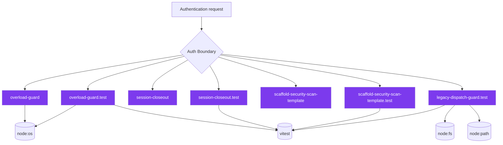
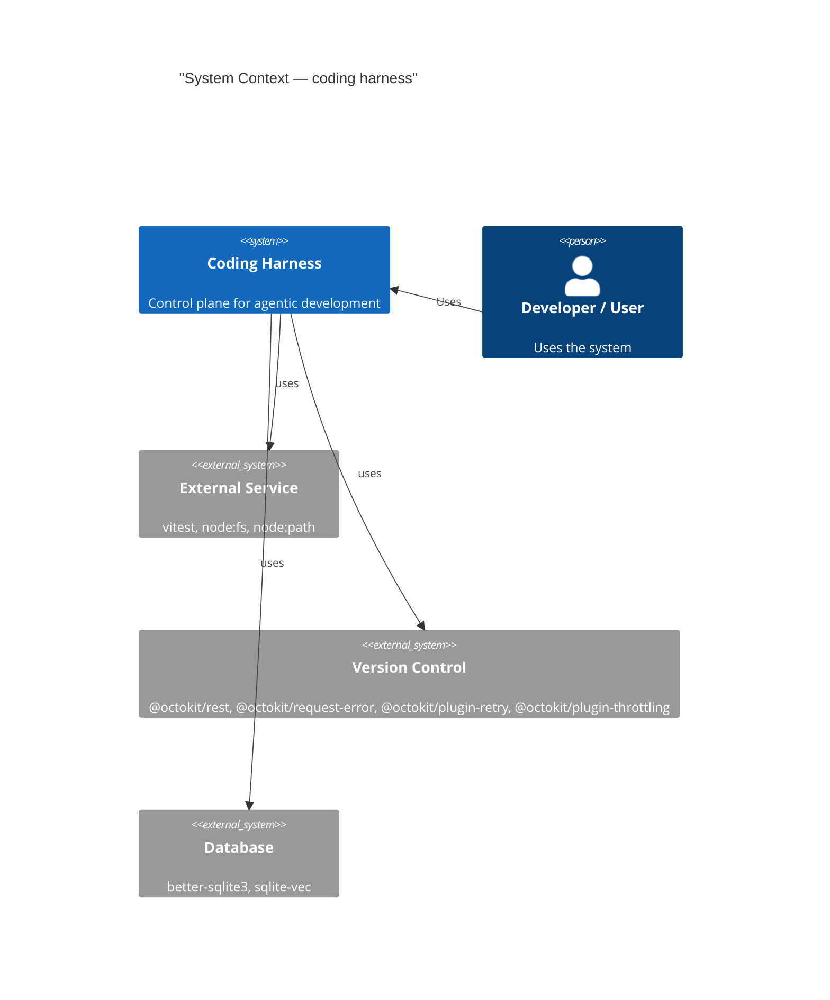
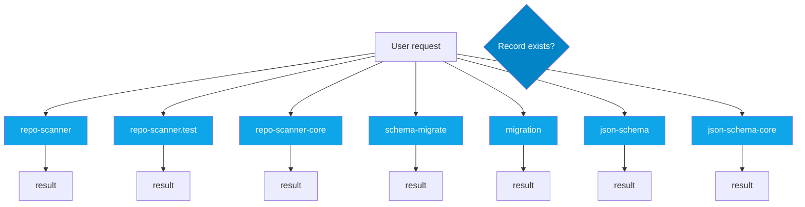
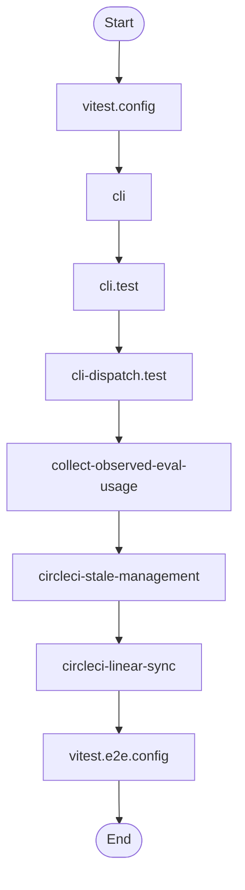

# Diagram Context Pack

Generated: 2026-05-14T00:42:06Z

## Table of Contents

- [How to use this pack](#how-to-use-this-pack)
- [agent](#agent)
- [architecture](#architecture)
- [auth](#auth)
- [c4context](#c4context)
- [class](#class)
- [database](#database)
- [dependency](#dependency)
- [erd](#erd)
- [events](#events)
- [flow](#flow)
- [rag](#rag)
- [security](#security)
- [sequence](#sequence)
- [user](#user)

## How to use this pack

- Start here for compact architecture, dependency, database, and ERD context before opening raw source files.
- Use .diagram/manifest.json to choose a focused Mermaid file when this combined pack is too large.
- For TypeScript implementation detail in this checkout, run `bash scripts/harness-cli.sh source-outline <path> --json` first, then unwrap one symbol with `--symbol <name>`. Downstream repositories can use `harness source-outline <path>`.

## agent

```mermaid
flowchart TD
  subgraph Orchestration["🎯 Orchestration Layer"]
    cli_99bb8840["🤖 cli"]
    cli_test_4851f28b["🤖 cli.test"]
    collect_observed_eval_usage_1724425c["🤖 collect-observed-eval-usage"]
    version_coherence_test_b81c6d8e["🤖 version-coherence.test"]
    tooling_audit_test_d2aee28c["🤖 tooling-audit.test"]
    tooling_audit_core_328d6a41["🤖 tooling-audit-core"]
    simulate_b9efe395["🤖 simulate"]
    simulate_analysis_164a460c["🤖 simulate-analysis"]
    review_gate_test_000e2ed6["🤖 review-gate.test"]
    review_context_test_89806d6c["🤖 review-context.test"]
    remediate_06b9c7fc["🤖 remediate"]
    remediate_runner_helpers_929fedcc["🤖 remediate-runner-helpers"]
    pilot_rollback_test_e61d5a2b["🤖 pilot-rollback.test"]
    pilot_evaluate_test_a2ac06fc["🤖 pilot-evaluate.test"]
    learnings_test_e45e0253["🤖 learnings.test"]
    init_test_cbba76a6["🤖 init.test"]
    drift_gate_test_816765e3["🤖 drift-gate.test"]
    drift_gate_rules_9685e72d["🤖 drift-gate-rules"]
    doctor_72f4be89["🤖 doctor"]
    doctor_file_checks_bc1301dc["🤖 doctor-file-checks"]
    doctor_config_checks_49c872e0["🤖 doctor-config-checks"]
    docs_gate_test_a25e972f["🤖 docs-gate.test"]
    ci_migrate_test_2a015bb9["🤖 ci-migrate.test"]
    brain_bbbf7a64["🤖 brain"]
    brain_test_428d4d67["🤖 brain.test"]
    brain_core_aa07c380["🤖 brain-core"]
    automation_run_test_7b21d905["🤖 automation-run.test"]
    agent_first_throughput_integration_test_dc677cc4["🤖 agent-first-throughput.integration.test"]
    orchestrator_11376b7e["🤖 orchestrator"]
    orchestrator_test_18d2fe26["🤖 orchestrator.test"]
    orchestrator_core_d0678b53["🤖 orchestrator-core"]
    orchestrator_1_6b7137c5["🤖 orchestrator"]
    orchestrator_test_1_c291cde7["🤖 orchestrator.test"]
    suggestion_generator_0956f794["🤖 suggestion-generator"]
    suggestion_generator_test_f68e9892["🤖 suggestion-generator.test"]
    metadata_scanner_6a101b66["🤖 metadata-scanner"]
    metadata_scanner_test_faee743d["🤖 metadata-scanner.test"]
    domain_mapper_cd9333d2["🤖 domain-mapper"]
    domain_mapper_test_dc5a9896["🤖 domain-mapper.test"]
    brain_validator_be251832["🤖 brain-validator"]
    brain_validator_test_5e40cb72["🤖 brain-validator.test"]
    tooling_baseline_50ab2eeb["🤖 tooling-baseline"]
    registries_06402afa["🤖 registries"]
    metrics_capture_core_db4bf7cf["🤖 metrics-capture-core"]
    control_plane_core_db3b4cb2["🤖 control-plane-core"]
    promote_test_5c615269["🤖 promote.test"]
    normalise_test_1_6643dd83["🤖 normalise.test"]
    coderabbit_csv_test_1f36d0a4["🤖 coderabbit-csv.test"]
    artifact_io_test_aac02da3["🤖 artifact-io.test"]
    types_16_0fae1112["🤖 types"]
    scaffold_template_registry_b1cce2aa["🤖 scaffold-template-registry"]
    scaffold_environment_templates_c1ceba6a["🤖 scaffold-environment-templates"]
    scaffold_environment_templates_test_b31b6a0c["🤖 scaffold-environment-templates.test"]
    scaffold_doc_templates_f6152330["🤖 scaffold-doc-templates"]
    project_brain_templates_7ef51530["🤖 project-brain-templates"]
    project_brain_templates_test_0b6509f2["🤖 project-brain-templates.test"]
    init_modes_c05ceb07["🤖 init-modes"]
    validator_test_5_2bb3219d["🤖 validator.test"]
    validator_core_1_1518647e["🤖 validator-core"]
    types_core_1_8bd0f8fd["🤖 types-core"]
    run_records_core_89286dfa["🤖 run-records-core"]
    run_record_emitter_test_5475c0da["🤖 run-record-emitter.test"]
    policy_validators_core_714a3fe7["🤖 policy-validators-core"]
    north_star_alignment_00440188["🤖 north-star-alignment"]
    north_star_alignment_test_3ae1d69b["🤖 north-star-alignment.test"]
    command_specs_69167c63["🤖 command-specs"]
    command_specs_test_7f693e85["🤖 command-specs.test"]
    command_specs_core_1c0ffc99["🤖 command-specs-core"]
  end
  subgraph LLMLayer["🧠 LLM / Model Layer"]
    cli_dispatch_test_54c9f17b["💡 cli-dispatch.test"]
    search_24193290["💡 search"]
    search_test_0c66bc11["💡 search.test"]
    remediate_runner_helpers_929fedcc["💡 remediate-runner-helpers"]
    prompt_gate_c5e9d207["💡 prompt-gate"]
    prompt_gate_test_1a442b27["💡 prompt-gate.test"]
    index_context_de3ed39d["💡 index-context"]
    index_context_test_1949ea6f["💡 index-context.test"]
    contract_test_2262847f["💡 contract.test"]
    context_ea7792a2["💡 context"]
    context_test_57aad306["💡 context.test"]
    check_environment_core_2c16213f["💡 check-environment-core"]
    sensitive_text_7c11f760["💡 sensitive-text"]
    sync_contract_c79fa191["💡 sync-contract"]
    ollama_76e3c7bf["💡 ollama"]
    ollama_test_71f9750e["💡 ollama.test"]
    indexer_70fa78e5["💡 indexer"]
    index_5_522f772a["💡 index"]
    constants_7517017f["💡 constants"]
    north_star_validators_cfc926ce["💡 north-star-validators"]
    command_specs_core_1c0ffc99["💡 command-specs-core"]
  end
  subgraph ToolLayer["🔧 Tool Layer"]
    collect_observed_eval_usage_1724425c["🔧 collect-observed-eval-usage"]
    verify_work_test_0e12f6c5["🔧 verify-work.test"]
    review_gate_test_000e2ed6["🔧 review-gate.test"]
    review_gate_core_4c8001f9["🔧 review-gate-core"]
    remediate_test_6f59cafe["🔧 remediate.test"]
    remediate_runner_helpers_929fedcc["🔧 remediate-runner-helpers"]
    remediate_cli_output_cc165396["🔧 remediate-cli-output"]
    policy_gate_213f7313["🔧 policy-gate"]
    next_c6c1c9a9["🔧 next"]
    learnings_test_e45e0253["🔧 learnings.test"]
    init_test_cbba76a6["🔧 init.test"]
    doctor_tool_checks_4acac51a["🔧 doctor-tool-checks"]
    doctor_checks_5a2eb2b9["🔧 doctor-checks"]
    docs_gate_test_a25e972f["🔧 docs-gate.test"]
    ci_migrate_core_7005b5af["🔧 ci-migrate-core"]
    types_1_4ecdf56e["🔧 types"]
    orchestrator_test_1_c291cde7["🔧 orchestrator.test"]
    tooling_baseline_50ab2eeb["🔧 tooling-baseline"]
    tooling_baseline_test_d272ddb6["🔧 tooling-baseline.test"]
    evaluation_engine_core_e054fe49["🔧 evaluation-engine-core"]
    normalise_test_73e8a615["🔧 normalise.test"]
    normalise_core_v2_f6c5ed83["🔧 normalise-core-v2"]
    validator_1_0c0621d8["🔧 validator"]
    metrics_tracker_98cec29c["🔧 metrics-tracker"]
    metrics_tracker_test_3de156fa["🔧 metrics-tracker.test"]
    client_1_914e1681["🔧 client"]
    pr_creator_dc6b1ea4["🔧 pr-creator"]
    closure_evidence_aaa31467["🔧 closure-evidence"]
    observed_skill_usage_ed7d5930["🔧 observed-skill-usage"]
    observed_skill_usage_test_311c215a["🔧 observed-skill-usage.test"]
    scaffold_shell_quality_test_79567d03["🔧 scaffold-shell-quality.test"]
    scaffold_release_private_npm_template_075499f8["🔧 scaffold-release-private-npm-template"]
    scaffold_github_actions_pr_pipeline_template_e2b85f62["🔧 scaffold-github-actions-pr-pipeline-template"]
    scaffold_github_actions_pr_pipeline_template_test_be464a7b["🔧 scaffold-github-actions-pr-pipeline-template.test"]
    scaffold_github_actions_pr_pipeline_renderer_1ee18de5["🔧 scaffold-github-actions-pr-pipeline-renderer"]
    scaffold_github_actions_pr_pipeline_renderer_test_2cc38272["🔧 scaffold-github-actions-pr-pipeline-renderer.test"]
    scaffold_environment_templates_c1ceba6a["🔧 scaffold-environment-templates"]
    scaffold_environment_templates_test_b31b6a0c["🔧 scaffold-environment-templates.test"]
    scaffold_config_templates_4b80ce53["🔧 scaffold-config-templates"]
    scaffold_codex_environment_templates_334fbbed["🔧 scaffold-codex-environment-templates"]
    scaffold_ci_templates_2afd6392["🔧 scaffold-ci-templates"]
    init_output_360dce91["🔧 init-output"]
    ralph_runtime_73d63c0e["🔧 ralph-runtime"]
    command_registry_test_0cf92cba["🔧 command-registry.test"]
    validator_helpers_7b927667["🔧 validator-helpers"]
    validator_core_1_1518647e["🔧 validator-core"]
    types_core_1_8bd0f8fd["🔧 types-core"]
    policy_validators_core_714a3fe7["🔧 policy-validators-core"]
    module_boundaries_test_c0caf46b["🔧 module-boundaries.test"]
  end
  subgraph MemoryLayer["📚 Memory / Vector Layer"]
    cli_dispatch_test_54c9f17b[("📚 cli-dispatch.test")]
    run_local_memory_preflight_36e92808[("📚 run-local-memory-preflight")]
    run_local_memory_preflight_test_1d7c5aa0[("📚 run-local-memory-preflight.test")]
    tooling_audit_test_d2aee28c[("📚 tooling-audit.test")]
    tooling_audit_core_328d6a41[("📚 tooling-audit-core")]
    search_24193290[("📚 search")]
    search_test_0c66bc11[("📚 search.test")]
    review_gate_test_000e2ed6[("📚 review-gate.test")]
    review_gate_core_4c8001f9[("📚 review-gate-core")]
    review_context_ca6cf81d[("📚 review-context")]
    review_context_test_89806d6c[("📚 review-context.test")]
    refresh_diagram_context_test_03bf21c4[("📚 refresh-diagram-context.test")]
    memory_gate_a577a506[("📚 memory-gate")]
    local_memory_preflight_dcc36c42[("📚 local-memory-preflight")]
    local_memory_preflight_test_5e323bbf[("📚 local-memory-preflight.test")]
    init_test_cbba76a6[("📚 init.test")]
    index_context_de3ed39d[("📚 index-context")]
    index_context_test_1949ea6f[("📚 index-context.test")]
    docs_gate_test_a25e972f[("📚 docs-gate.test")]
    docs_gate_core_eb9b6c18[("📚 docs-gate-core")]
    context_ea7792a2[("📚 context")]
    context_test_57aad306[("📚 context.test")]
    context_integrity_acceptance_test_59f961b1[("📚 context-integrity-acceptance.test")]
    context_health_80bb7da9[("📚 context-health")]
    context_health_test_3b5b87f3[("📚 context-health.test")]
    ci_migrate_test_2a015bb9[("📚 ci-migrate.test")]
    ci_migrate_core_7005b5af[("📚 ci-migrate-core")]
    check_diagram_freshness_test_c1dc40aa[("📚 check-diagram-freshness.test")]
    branch_protect_core_a8feb0fd[("📚 branch-protect-core")]
    brain_test_428d4d67[("📚 brain.test")]
    agent_first_throughput_integration_test_dc677cc4[("📚 agent-first-throughput.integration.test")]
    overload_guard_2748c559[("📚 overload-guard")]
    overload_guard_test_6ece9f86[("📚 overload-guard.test")]
    types_3_9675d69b[("📚 types")]
    suggestion_generator_0956f794[("📚 suggestion-generator")]
    suggestion_generator_test_f68e9892[("📚 suggestion-generator.test")]
    performance_overload_c685bfcf[("📚 performance-overload")]
    local_memory_0db17ecc[("📚 local-memory")]
    local_memory_smoke_1175abfc[("📚 local-memory-smoke")]
    tooling_baseline_50ab2eeb[("📚 tooling-baseline")]
    validator_1_0c0621d8[("📚 validator")]
    validator_test_1_c5015ca0[("📚 validator.test")]
    types_11_4be3ee64[("📚 types")]
    metrics_tracker_98cec29c[("📚 metrics-tracker")]
    metrics_tracker_test_3de156fa[("📚 metrics-tracker.test")]
    branch_enforcer_acb749cd[("📚 branch-enforcer")]
    review_context_1_e3afed15[("📚 review-context")]
    index_2_10143590[("📚 index")]
    eval_seed_5699fd3e[("📚 eval-seed")]
    workflow_contract_scripts_test_681e2e3c[("📚 workflow-contract-scripts.test")]
    scaffold_workflow_template_92310587[("📚 scaffold-workflow-template")]
    scaffold_template_registry_b1cce2aa[("📚 scaffold-template-registry")]
    scaffold_surfaces_12d6494e[("📚 scaffold-surfaces")]
    scaffold_shell_templates_0ad0f915[("📚 scaffold-shell-templates")]
    scaffold_script_template_registry_69312d4e[("📚 scaffold-script-template-registry")]
    scaffold_script_template_registry_test_6a8ebefe[("📚 scaffold-script-template-registry.test")]
    scaffold_root_command_templates_404fed7f[("📚 scaffold-root-command-templates")]
    scaffold_root_command_templates_test_14596939[("📚 scaffold-root-command-templates.test")]
    scaffold_environment_templates_c1ceba6a[("📚 scaffold-environment-templates")]
    scaffold_doc_templates_f6152330[("📚 scaffold-doc-templates")]
    scaffold_diagram_templates_dd88e83c[("📚 scaffold-diagram-templates")]
    scaffold_diagram_templates_test_f3774c28[("📚 scaffold-diagram-templates.test")]
    project_brain_templates_7ef51530[("📚 project-brain-templates")]
    project_brain_templates_test_0b6509f2[("📚 project-brain-templates.test")]
    init_modes_c05ceb07[("📚 init-modes")]
    codex_preflight_symlink_test_037558db[("📚 codex-preflight-symlink.test")]
    harness_decision_test_7e5a4fe5[("📚 harness-decision.test")]
    types_17_ed30531c[("📚 types")]
    sync_contract_c79fa191[("📚 sync-contract")]
    sync_contract_test_5dc3165c[("📚 sync-contract.test")]
    store_824d80d7[("📚 store")]
    sources_1_e133d97d[("📚 sources")]
    rollout_a4fa034c[("📚 rollout")]
    ollama_76e3c7bf[("📚 ollama")]
    ollama_test_71f9750e[("📚 ollama.test")]
    lexical_fallback_723e2b3e[("📚 lexical-fallback")]
    init_error_5c7dd49f[("📚 init-error")]
    indexer_70fa78e5[("📚 indexer")]
    indexer_test_d492f0aa[("📚 indexer.test")]
    index_5_522f772a[("📚 index")]
    context_compact_policy_3dcaf95d[("📚 context-compact-policy")]
    context_compact_policy_test_da148267[("📚 context-compact-policy.test")]
    constants_7517017f[("📚 constants")]
    constants_test_5492ae98[("📚 constants.test")]
    command_registry_test_0cf92cba[("📚 command-registry.test")]
    validator_test_5_2bb3219d[("📚 validator.test")]
    validator_core_1_1518647e[("📚 validator-core")]
    types_core_1_8bd0f8fd[("📚 types-core")]
    policy_validators_core_714a3fe7[("📚 policy-validators-core")]
    loader_test_03424671[("📚 loader.test")]
    json_schema_core_96d7e328[("📚 json-schema-core")]
    index_6_fc9e91e2[("📚 index")]
    branch_protect_sync_570adb18[("📚 branch-protect-sync")]
    command_specs_test_7f693e85[("📚 command-specs.test")]
    command_specs_core_1c0ffc99[("📚 command-specs-core")]
    command_capabilities_a4d5c71e[("📚 command-capabilities")]
  end
  classDef agentNode fill:#555,color:#fff
  class cli_99bb8840,cli_test_4851f28b,collect_observed_eval_usage_1724425c,version_coherence_test_b81c6d8e,tooling_audit_test_d2aee28c,tooling_audit_core_328d6a41,simulate_b9efe395,simulate_analysis_164a460c,review_gate_test_000e2ed6,review_context_test_89806d6c,remediate_06b9c7fc,remediate_runner_helpers_929fedcc,pilot_rollback_test_e61d5a2b,pilot_evaluate_test_a2ac06fc,learnings_test_e45e0253,init_test_cbba76a6,drift_gate_test_816765e3,drift_gate_rules_9685e72d,doctor_72f4be89,doctor_file_checks_bc1301dc,doctor_config_checks_49c872e0,docs_gate_test_a25e972f,ci_migrate_test_2a015bb9,brain_bbbf7a64,brain_test_428d4d67,brain_core_aa07c380,automation_run_test_7b21d905,agent_first_throughput_integration_test_dc677cc4,orchestrator_11376b7e,orchestrator_test_18d2fe26,orchestrator_core_d0678b53,orchestrator_1_6b7137c5,orchestrator_test_1_c291cde7,suggestion_generator_0956f794,suggestion_generator_test_f68e9892,metadata_scanner_6a101b66,metadata_scanner_test_faee743d,domain_mapper_cd9333d2,domain_mapper_test_dc5a9896,brain_validator_be251832,brain_validator_test_5e40cb72,tooling_baseline_50ab2eeb,registries_06402afa,metrics_capture_core_db4bf7cf,control_plane_core_db3b4cb2,promote_test_5c615269,normalise_test_1_6643dd83,coderabbit_csv_test_1f36d0a4,artifact_io_test_aac02da3,types_16_0fae1112,scaffold_template_registry_b1cce2aa,scaffold_environment_templates_c1ceba6a,scaffold_environment_templates_test_b31b6a0c,scaffold_doc_templates_f6152330,project_brain_templates_7ef51530,project_brain_templates_test_0b6509f2,init_modes_c05ceb07,validator_test_5_2bb3219d,validator_core_1_1518647e,types_core_1_8bd0f8fd,run_records_core_89286dfa,run_record_emitter_test_5475c0da,policy_validators_core_714a3fe7,north_star_alignment_00440188,north_star_alignment_test_3ae1d69b,command_specs_69167c63,command_specs_test_7f693e85,command_specs_core_1c0ffc99 agentNode
  classDef llmNode fill:#555,color:#fff
  class cli_dispatch_test_54c9f17b,search_24193290,search_test_0c66bc11,remediate_runner_helpers_929fedcc,prompt_gate_c5e9d207,prompt_gate_test_1a442b27,index_context_de3ed39d,index_context_test_1949ea6f,contract_test_2262847f,context_ea7792a2,context_test_57aad306,check_environment_core_2c16213f,sensitive_text_7c11f760,sync_contract_c79fa191,ollama_76e3c7bf,ollama_test_71f9750e,indexer_70fa78e5,index_5_522f772a,constants_7517017f,north_star_validators_cfc926ce,command_specs_core_1c0ffc99 llmNode
  classDef toolNode fill:#555,color:#fff
  class collect_observed_eval_usage_1724425c,verify_work_test_0e12f6c5,review_gate_test_000e2ed6,review_gate_core_4c8001f9,remediate_test_6f59cafe,remediate_runner_helpers_929fedcc,remediate_cli_output_cc165396,policy_gate_213f7313,next_c6c1c9a9,learnings_test_e45e0253,init_test_cbba76a6,doctor_tool_checks_4acac51a,doctor_checks_5a2eb2b9,docs_gate_test_a25e972f,ci_migrate_core_7005b5af,types_1_4ecdf56e,orchestrator_test_1_c291cde7,tooling_baseline_50ab2eeb,tooling_baseline_test_d272ddb6,evaluation_engine_core_e054fe49,normalise_test_73e8a615,normalise_core_v2_f6c5ed83,validator_1_0c0621d8,metrics_tracker_98cec29c,metrics_tracker_test_3de156fa,client_1_914e1681,pr_creator_dc6b1ea4,closure_evidence_aaa31467,observed_skill_usage_ed7d5930,observed_skill_usage_test_311c215a,scaffold_shell_quality_test_79567d03,scaffold_release_private_npm_template_075499f8,scaffold_github_actions_pr_pipeline_template_e2b85f62,scaffold_github_actions_pr_pipeline_template_test_be464a7b,scaffold_github_actions_pr_pipeline_renderer_1ee18de5,scaffold_github_actions_pr_pipeline_renderer_test_2cc38272,scaffold_environment_templates_c1ceba6a,scaffold_environment_templates_test_b31b6a0c,scaffold_config_templates_4b80ce53,scaffold_codex_environment_templates_334fbbed,scaffold_ci_templates_2afd6392,init_output_360dce91,ralph_runtime_73d63c0e,command_registry_test_0cf92cba,validator_helpers_7b927667,validator_core_1_1518647e,types_core_1_8bd0f8fd,policy_validators_core_714a3fe7,module_boundaries_test_c0caf46b toolNode
  classDef memNode fill:#555,color:#fff
  class cli_dispatch_test_54c9f17b,run_local_memory_preflight_36e92808,run_local_memory_preflight_test_1d7c5aa0,tooling_audit_test_d2aee28c,tooling_audit_core_328d6a41,search_24193290,search_test_0c66bc11,review_gate_test_000e2ed6,review_gate_core_4c8001f9,review_context_ca6cf81d,review_context_test_89806d6c,refresh_diagram_context_test_03bf21c4,memory_gate_a577a506,local_memory_preflight_dcc36c42,local_memory_preflight_test_5e323bbf,init_test_cbba76a6,index_context_de3ed39d,index_context_test_1949ea6f,docs_gate_test_a25e972f,docs_gate_core_eb9b6c18,context_ea7792a2,context_test_57aad306,context_integrity_acceptance_test_59f961b1,context_health_80bb7da9,context_health_test_3b5b87f3,ci_migrate_test_2a015bb9,ci_migrate_core_7005b5af,check_diagram_freshness_test_c1dc40aa,branch_protect_core_a8feb0fd,brain_test_428d4d67,agent_first_throughput_integration_test_dc677cc4,overload_guard_2748c559,overload_guard_test_6ece9f86,types_3_9675d69b,suggestion_generator_0956f794,suggestion_generator_test_f68e9892,performance_overload_c685bfcf,local_memory_0db17ecc,local_memory_smoke_1175abfc,tooling_baseline_50ab2eeb,validator_1_0c0621d8,validator_test_1_c5015ca0,types_11_4be3ee64,metrics_tracker_98cec29c,metrics_tracker_test_3de156fa,branch_enforcer_acb749cd,review_context_1_e3afed15,index_2_10143590,eval_seed_5699fd3e,workflow_contract_scripts_test_681e2e3c,scaffold_workflow_template_92310587,scaffold_template_registry_b1cce2aa,scaffold_surfaces_12d6494e,scaffold_shell_templates_0ad0f915,scaffold_script_template_registry_69312d4e,scaffold_script_template_registry_test_6a8ebefe,scaffold_root_command_templates_404fed7f,scaffold_root_command_templates_test_14596939,scaffold_environment_templates_c1ceba6a,scaffold_doc_templates_f6152330,scaffold_diagram_templates_dd88e83c,scaffold_diagram_templates_test_f3774c28,project_brain_templates_7ef51530,project_brain_templates_test_0b6509f2,init_modes_c05ceb07,codex_preflight_symlink_test_037558db,harness_decision_test_7e5a4fe5,types_17_ed30531c,sync_contract_c79fa191,sync_contract_test_5dc3165c,store_824d80d7,sources_1_e133d97d,rollout_a4fa034c,ollama_76e3c7bf,ollama_test_71f9750e,lexical_fallback_723e2b3e,init_error_5c7dd49f,indexer_70fa78e5,indexer_test_d492f0aa,index_5_522f772a,context_compact_policy_3dcaf95d,context_compact_policy_test_da148267,constants_7517017f,constants_test_5492ae98,command_registry_test_0cf92cba,validator_test_5_2bb3219d,validator_core_1_1518647e,types_core_1_8bd0f8fd,policy_validators_core_714a3fe7,loader_test_03424671,json_schema_core_96d7e328,index_6_fc9e91e2,branch_protect_sync_570adb18,command_specs_test_7f693e85,command_specs_core_1c0ffc99,command_capabilities_a4d5c71e memNode

```

## architecture

```mermaid
graph TD

```

## auth



## c4context



## class


## database



## dependency

```mermaid
graph LR
  ext_future_05a73385["__future__"] --> node_evaluate_docstring_ratchet_9febcb8d_f0a1dc50
  ext_future_05a73385["__future__"] --> node_inventory_repos_4ea09ad7_57572484
  ext_future_05a73385["__future__"] --> node_rollout_check_6c0140db_3d815f83
  ext_future_05a73385["__future__"] --> node_test_evaluate_docstring_ratchet_aa3f800e_dfe37c7a
  ext_future_05a73385["__future__"] --> node_test_inventory_repos_1d0a81a8_4af74826
  ext_future_05a73385["__future__"] --> node_test_rollout_check_0c81edd1_05f72b8b
  ext_inquirer_prompts_4d547149["@inquirer/prompts"] --> node_init_interactive_28845b2f_39350b46
  ext_octokit_plugin_retry_c9aecc53["@octokit/plugin-retry"] --> node_client_1_914e1681_01cbfe04
  ext_octokit_plugin_throttling_7909ece3["@octokit/plugin-throttling"] --> node_client_1_914e1681_01cbfe04
  ext_octokit_plugin_throttling_7909ece3["@octokit/plugin-throttling"] --> node_pr_creator_dc6b1ea4_4c333e0f
  ext_octokit_request_error_98ae13cc["@octokit/request-error"] --> node_client_test_1_6fa17bd4_5994a553
  ext_octokit_request_error_98ae13cc["@octokit/request-error"] --> node_errors_be4bd567_e268d782
  ext_octokit_request_error_98ae13cc["@octokit/request-error"] --> node_errors_test_1a443b6a_22186925
  ext_octokit_rest_c6e4d192["@octokit/rest"] --> node_circleci_linear_sync_19c0d6da_24f24dca
  ext_octokit_rest_c6e4d192["@octokit/rest"] --> node_circleci_stale_management_664de1d9_51a7c04f
  ext_octokit_rest_c6e4d192["@octokit/rest"] --> node_client_1_914e1681_01cbfe04
  ext_octokit_rest_c6e4d192["@octokit/rest"] --> node_pr_creator_dc6b1ea4_4c333e0f
  ext_total_typescript_shoehorn_667cfbd3["@total-typescript/shoehorn"] --> node_agent_first_throughput_integration_test_dc677cc4_9826cf8a
  ext_total_typescript_shoehorn_667cfbd3["@total-typescript/shoehorn"] --> node_branch_protect_test_c8d80aab_db812bc2
  ext_total_typescript_shoehorn_667cfbd3["@total-typescript/shoehorn"] --> node_linear_prepare_test_678f11a9_d1618a5b
  ext_total_typescript_shoehorn_667cfbd3["@total-typescript/shoehorn"] --> node_linear_triage_test_1b75a8b8_9bebeb60
  ext_total_typescript_shoehorn_667cfbd3["@total-typescript/shoehorn"] --> node_linear_workflow_test_a351dcb0_21c4a48e
  ext_total_typescript_shoehorn_667cfbd3["@total-typescript/shoehorn"] --> node_review_gate_test_000e2ed6_3cbda1f9
  ext_total_typescript_shoehorn_667cfbd3["@total-typescript/shoehorn"] --> node_ui_loop_test_f0eabc42_dda19a75
  ext_total_typescript_shoehorn_667cfbd3["@total-typescript/shoehorn"] --> node_verify_coderabbit_test_46cfcf29_1fae8c45
  ext_argparse_e750ee7c["argparse"] --> node_evaluate_docstring_ratchet_9febcb8d_f0a1dc50
  ext_argparse_e750ee7c["argparse"] --> node_inventory_repos_4ea09ad7_57572484
  ext_argparse_e750ee7c["argparse"] --> node_rollout_check_6c0140db_3d815f83
  ext_better_sqlite3_d7ed8f1a["better-sqlite3"] --> node_store_824d80d7_69038a3e
  ext_datetime_89ffad08["datetime"] --> node_evaluate_docstring_ratchet_9febcb8d_f0a1dc50
  ext_datetime_89ffad08["datetime"] --> node_rollout_check_6c0140db_3d815f83
  ext_datetime_89ffad08["datetime"] --> node_test_rollout_check_0c81edd1_05f72b8b
  ext_diff_75a0ee1b["diff"] --> node_interactive_0eb42ac4_3ee6c3c6
  ext_evaluate_docstring_ratchet_8d419891["evaluate_docstring_ratchet"] --> node_test_evaluate_docstring_ratchet_aa3f800e_dfe37c7a
  ext_fs_3f4bb586["fs"] --> node_doctor_file_checks_bc1301dc_74dc1400
  ext_inventory_repos_812f8dd4["inventory_repos"] --> node_test_inventory_repos_1d0a81a8_4af74826
  ext_json_05d97e6e["json"] --> node_evaluate_docstring_ratchet_9febcb8d_f0a1dc50
  ext_json_05d97e6e["json"] --> node_inventory_repos_4ea09ad7_57572484
  ext_json_05d97e6e["json"] --> node_rollout_check_6c0140db_3d815f83
  ext_json_05d97e6e["json"] --> node_test_evaluate_docstring_ratchet_aa3f800e_dfe37c7a
  ext_json_05d97e6e["json"] --> node_test_inventory_repos_1d0a81a8_4af74826
  ext_json_05d97e6e["json"] --> node_test_rollout_check_0c81edd1_05f72b8b
  ext_lodash_901466a5["lodash"] --> node_merger_3e167607_07e847e5
  ext_math_7a488390["math"] --> node_evaluate_docstring_ratchet_9febcb8d_f0a1dc50
  ext_node_child_process_f62b7d19["node:child_process"] --> node_agent_first_throughput_integration_test_dc677cc4_9826cf8a
  ext_node_child_process_f62b7d19["node:child_process"] --> node_branch_enforcer_acb749cd_10e89517
  ext_node_child_process_f62b7d19["node:child_process"] --> node_check_diagram_freshness_test_c1dc40aa_4c776e6d
  ext_node_child_process_f62b7d19["node:child_process"] --> node_check_environment_core_2c16213f_a8a456d9
  ext_node_child_process_f62b7d19["node:child_process"] --> node_check_environment_test_5fa29c35_38c2d63c
  ext_node_child_process_f62b7d19["node:child_process"] --> node_ci_migrate_core_7005b5af_7e295ae3
  ext_node_child_process_f62b7d19["node:child_process"] --> node_ci_migrate_test_2a015bb9_c7f50056
  ext_node_child_process_f62b7d19["node:child_process"] --> node_circleci_linear_sync_19c0d6da_24f24dca
  ext_node_child_process_f62b7d19["node:child_process"] --> node_codex_preflight_symlink_test_037558db_73dd8d37
  ext_node_child_process_f62b7d19["node:child_process"] --> node_collect_observed_eval_usage_1724425c_4495ea96
  ext_node_child_process_f62b7d19["node:child_process"] --> node_control_plane_core_db3b4cb2_27437a14
  ext_node_child_process_f62b7d19["node:child_process"] --> node_diff_budget_9da0268d_71167227
  ext_node_child_process_f62b7d19["node:child_process"] --> node_diff_budget_test_c0b72453_8ee24f35
  ext_node_child_process_f62b7d19["node:child_process"] --> node_docs_gate_core_eb9b6c18_f8540503
  ext_node_child_process_f62b7d19["node:child_process"] --> node_docs_gate_test_a25e972f_27d8d2fd
  ext_node_child_process_f62b7d19["node:child_process"] --> node_doctor_check_utils_d0fc22ea_d74f86eb
  ext_node_child_process_f62b7d19["node:child_process"] --> node_doctor_test_e032e8b5_7d09a082
  ext_node_child_process_f62b7d19["node:child_process"] --> node_doctor_tool_checks_4acac51a_9e791a28
  ext_node_child_process_f62b7d19["node:child_process"] --> node_git_common_config_script_test_9290181b_cb0767a4
  ext_node_child_process_f62b7d19["node:child_process"] --> node_github_e2e_2891a341_af6f1610
  ext_node_child_process_f62b7d19["node:child_process"] --> node_health_core_2b2fdada_341de678
  ext_node_child_process_f62b7d19["node:child_process"] --> node_health_test_f79de76d_fa51dc97
  ext_node_child_process_f62b7d19["node:child_process"] --> node_init_test_cbba76a6_3161d583
  ext_node_child_process_f62b7d19["node:child_process"] --> node_linear_gate_core_a415ae74_222bd4b9
  ext_node_child_process_f62b7d19["node:child_process"] --> node_linear_gate_test_4fcca11a_f8ffd783
  ext_node_child_process_f62b7d19["node:child_process"] --> node_link_checker_d0fa555f_abfe9020
  ext_node_child_process_f62b7d19["node:child_process"] --> node_local_memory_0db17ecc_97fe98ce
  ext_node_child_process_f62b7d19["node:child_process"] --> node_local_memory_preflight_test_5e323bbf_c497d816
  ext_node_child_process_f62b7d19["node:child_process"] --> node_next_c6c1c9a9_040a8dbb
  ext_node_child_process_f62b7d19["node:child_process"] --> node_refresh_diagram_context_test_03bf21c4_bda9d2ea
  ext_node_child_process_f62b7d19["node:child_process"] --> node_remediate_06b9c7fc_2158505f
  ext_node_child_process_f62b7d19["node:child_process"] --> node_remediate_test_6f59cafe_0693a232
  ext_node_child_process_f62b7d19["node:child_process"] --> node_run_e2e_39efe696_fb07ee74
  ext_node_child_process_f62b7d19["node:child_process"] --> node_scaffold_hook_templates_8c74ab50_572d99d9
  ext_node_child_process_f62b7d19["node:child_process"] --> node_search_24193290_6a30c5b7
  ext_node_child_process_f62b7d19["node:child_process"] --> node_search_test_0c66bc11_2467eef8
  ext_node_child_process_f62b7d19["node:child_process"] --> node_setup_git_hooks_70750d40_b4ca2cf9
  ext_node_child_process_f62b7d19["node:child_process"] --> node_symphony_check_test_6cb33eb2_e662e055
  ext_node_child_process_f62b7d19["node:child_process"] --> node_test_harness_6e520b98_6b3d1d32
  ext_node_child_process_f62b7d19["node:child_process"] --> node_test_harness_upgrade_matrix_script_test_e56b84c8_9ec5673a
  ext_node_child_process_f62b7d19["node:child_process"] --> node_ui_loop_11660889_bc33571d
  ext_node_child_process_f62b7d19["node:child_process"] --> node_ui_loop_test_f0eabc42_dda19a75
  ext_node_child_process_f62b7d19["node:child_process"] --> node_validate_commit_msg_43b008fe_f9560ef9
  ext_node_child_process_f62b7d19["node:child_process"] --> node_verify_work_df70ecac_6b1b8433
  ext_node_child_process_f62b7d19["node:child_process"] --> node_verify_work_test_0e12f6c5_1135c89a
  ext_node_child_process_f62b7d19["node:child_process"] --> node_version_coherence_69733bcb_00c8d5d9
  ext_node_child_process_f62b7d19["node:child_process"] --> node_workflow_contract_scripts_test_681e2e3c_f45dbcc4
  ext_node_crypto_c7dfc512["node:crypto"] --> node_artifact_io_ba511748_6d1faad8
  ext_node_crypto_c7dfc512["node:crypto"] --> node_check_environment_core_2c16213f_a8a456d9
  ext_node_crypto_c7dfc512["node:crypto"] --> node_ci_migrate_signing_2d82ac3f_9e5e8974
  ext_node_crypto_c7dfc512["node:crypto"] --> node_ci_migrate_test_2a015bb9_c7f50056
  ext_node_crypto_c7dfc512["node:crypto"] --> node_cli_test_4851f28b_a1010780
  ext_node_crypto_c7dfc512["node:crypto"] --> node_control_plane_core_db3b4cb2_27437a14
  ext_node_crypto_c7dfc512["node:crypto"] --> node_decision_packet_1_dd443771_92fa570e
  ext_node_crypto_c7dfc512["node:crypto"] --> node_decision_packet_8ee9d119_b89c59dd
  ext_node_crypto_c7dfc512["node:crypto"] --> node_docs_gate_core_eb9b6c18_f8540503
  ext_node_crypto_c7dfc512["node:crypto"] --> node_enforcement_status_92d314f5_7cd48cbe
  ext_node_crypto_c7dfc512["node:crypto"] --> node_env_b77349bf_420e4120
  ext_node_crypto_c7dfc512["node:crypto"] --> node_gate_c974e17b_07549baf
  ext_node_crypto_c7dfc512["node:crypto"] --> node_idempotency_f5d39a07_bce757f2
  ext_node_crypto_c7dfc512["node:crypto"] --> node_indexer_70fa78e5_97c1bb0b
  ext_node_crypto_c7dfc512["node:crypto"] --> node_indexer_test_d492f0aa_3b2f6103
  ext_node_crypto_c7dfc512["node:crypto"] --> node_lexical_fallback_723e2b3e_cdb7bd33
  ext_node_crypto_c7dfc512["node:crypto"] --> node_linear_sync_a2fa2bf7_48e6d20b
  ext_node_crypto_c7dfc512["node:crypto"] --> node_link_checker_d0fa555f_abfe9020
  ext_node_crypto_c7dfc512["node:crypto"] --> node_migration_8a6cead4_3c3cc0a4
  ext_node_crypto_c7dfc512["node:crypto"] --> node_normalise_1_4c940463_fea4dcb5
  ext_node_crypto_c7dfc512["node:crypto"] --> node_north_star_feedback_1_9c32c60d_b0cd38dc
  ext_node_crypto_c7dfc512["node:crypto"] --> node_pilot_rollback_00c1f82c_b744974b
  ext_node_crypto_c7dfc512["node:crypto"] --> node_plan_gate_test_0c0192e6_f483a0bb
  ext_node_crypto_c7dfc512["node:crypto"] --> node_preset_resolver_dc3dd716_3f747c75
  ext_node_crypto_c7dfc512["node:crypto"] --> node_preset_resolver_test_e112a012_1a0a92b4
  ext_node_crypto_c7dfc512["node:crypto"] --> node_remediate_apply_transactions_0738b122_7ebd0795
  ext_node_crypto_c7dfc512["node:crypto"] --> node_required_checks_46396214_9d882ad3
  ext_node_crypto_c7dfc512["node:crypto"] --> node_rollback_da25480f_48e45364
  ext_node_crypto_c7dfc512["node:crypto"] --> node_run_record_emitter_core_688049d5_2036fd6f
  ext_node_crypto_c7dfc512["node:crypto"] --> node_run_records_core_89286dfa_4ce958f7
  ext_node_crypto_c7dfc512["node:crypto"] --> node_run_state_core_25a955bc_a562e9bf
  ext_node_crypto_c7dfc512["node:crypto"] --> node_scan_cache_fc02c79c_11793337
  ext_node_crypto_c7dfc512["node:crypto"] --> node_simulate_analysis_164a460c_2367e095
  ext_node_crypto_c7dfc512["node:crypto"] --> node_sources_1_e133d97d_c89b479b
  ext_node_crypto_c7dfc512["node:crypto"] --> node_tracer_1e6243a2_cb3d802b
  ext_node_crypto_c7dfc512["node:crypto"] --> node_ui_loop_11660889_bc33571d
  ext_node_crypto_c7dfc512["node:crypto"] --> node_upgrade_1_b277486e_4a06b7a8
  ext_node_dns_828a0bbf["node:dns"] --> node_url_validator_3c5a1568_b9b1dc66
  ext_node_fs_a15b7d96["node:fs"] --> node_agent_first_throughput_integration_test_dc677cc4_9826cf8a
  ext_node_fs_a15b7d96["node:fs"] --> node_artifact_gate_test_25ecc97a_ace91b04
  ext_node_fs_a15b7d96["node:fs"] --> node_artifact_io_ba511748_6d1faad8
  ext_node_fs_a15b7d96["node:fs"] --> node_artifact_io_test_aac02da3_3aeec14a
  ext_node_fs_a15b7d96["node:fs"] --> node_artifact_provenance_03b81cbf_d3038614
  ext_node_fs_a15b7d96["node:fs"] --> node_ast_grep_rules_test_2b69fd9a_9a18624b
  ext_node_fs_a15b7d96["node:fs"] --> node_audit_b81f37a0_398f4d93
  ext_node_fs_a15b7d96["node:fs"] --> node_audit_test_54ea1006_9b414709
  ext_node_fs_a15b7d96["node:fs"] --> node_authz_core_f714650a_ee0f2e9d
  ext_node_fs_a15b7d96["node:fs"] --> node_automation_run_test_7b21d905_bcbced74
  ext_node_fs_a15b7d96["node:fs"] --> node_blast_radius_test_045450fc_4ff734c3
  ext_node_fs_a15b7d96["node:fs"] --> node_brain_core_aa07c380_2f924977
  ext_node_fs_a15b7d96["node:fs"] --> node_brain_test_428d4d67_79c22066
  ext_node_fs_a15b7d96["node:fs"] --> node_brain_validator_be251832_2e2228e2
  ext_node_fs_a15b7d96["node:fs"] --> node_brain_validator_test_5e40cb72_9cebb432
  ext_node_fs_a15b7d96["node:fs"] --> node_brainstorm_e2e2381d_fea1b255
  ext_node_fs_a15b7d96["node:fs"] --> node_brainstorm_gate_test_2fb2aec1_798e6479
  ext_node_fs_a15b7d96["node:fs"] --> node_brainstorm_test_78cf7a1e_aebb62cd
  ext_node_fs_a15b7d96["node:fs"] --> node_branch_enforcer_acb749cd_10e89517
  ext_node_fs_a15b7d96["node:fs"] --> node_branch_protect_core_a8feb0fd_38c1f12a
  ext_node_fs_a15b7d96["node:fs"] --> node_branch_protect_sync_570adb18_cc4751e4
  ext_node_fs_a15b7d96["node:fs"] --> node_branch_protect_sync_test_159bb533_dd4c74e0
  ext_node_fs_a15b7d96["node:fs"] --> node_check_20f65c28_48d25399
  ext_node_fs_a15b7d96["node:fs"] --> node_check_authz_test_327903fb_5d1ba77e
  ext_node_fs_a15b7d96["node:fs"] --> node_check_diagram_freshness_test_c1dc40aa_4c776e6d
  ext_node_fs_a15b7d96["node:fs"] --> node_check_environment_core_2c16213f_a8a456d9
  ext_node_fs_a15b7d96["node:fs"] --> node_check_environment_test_5fa29c35_38c2d63c
  ext_node_fs_a15b7d96["node:fs"] --> node_check_test_7469a186_7f301052
  ext_node_fs_a15b7d96["node:fs"] --> node_ci_migrate_core_7005b5af_7e295ae3
  ext_node_fs_a15b7d96["node:fs"] --> node_ci_migrate_promotion_evidence_1a2dc527_7ed1a850
  ext_node_fs_a15b7d96["node:fs"] --> node_ci_migrate_test_2a015bb9_c7f50056
  ext_node_fs_a15b7d96["node:fs"] --> node_ci_ownership_gate_test_7b1c196d_a3382b2d
  ext_node_fs_a15b7d96["node:fs"] --> node_cli_1_084e05fe_02d92b68
  ext_node_fs_a15b7d96["node:fs"] --> node_cli_99bb8840_659774ba
  ext_node_fs_a15b7d96["node:fs"] --> node_cli_dispatch_test_54c9f17b_66183a4d
  ext_node_fs_a15b7d96["node:fs"] --> node_cli_test_4851f28b_a1010780
  ext_node_fs_a15b7d96["node:fs"] --> node_coderabbit_csv_test_1f36d0a4_11e12fd4
  ext_node_fs_a15b7d96["node:fs"] --> node_codex_preflight_symlink_test_037558db_73dd8d37
  ext_node_fs_a15b7d96["node:fs"] --> node_collect_observed_eval_usage_1724425c_4495ea96
  ext_node_fs_a15b7d96["node:fs"] --> node_command_pipeline_e2e_test_a0aa069a_b1dca063
  ext_node_fs_a15b7d96["node:fs"] --> node_command_policy_test_66e89e89_d72a8e0b
  ext_node_fs_a15b7d96["node:fs"] --> node_command_registry_test_0cf92cba_2915705d
  ext_node_fs_a15b7d96["node:fs"] --> node_command_specs_core_1c0ffc99_09b68aff
  ext_node_fs_a15b7d96["node:fs"] --> node_command_specs_test_7f693e85_27544276
  ext_node_fs_a15b7d96["node:fs"] --> node_config_validator_669ebc2e_d7ca485d
  ext_node_fs_a15b7d96["node:fs"] --> node_config_validator_test_f70500fa_d8f6f905
  ext_node_fs_a15b7d96["node:fs"] --> node_context_compact_policy_test_da148267_eed580b6
  ext_node_fs_a15b7d96["node:fs"] --> node_context_health_80bb7da9_169768cb
  ext_node_fs_a15b7d96["node:fs"] --> node_context_health_test_3b5b87f3_85ea2ea5
  ext_node_fs_a15b7d96["node:fs"] --> node_context_integrity_acceptance_test_59f961b1_58df199b
  ext_node_fs_a15b7d96["node:fs"] --> node_context_test_57aad306_7d3e7f19
  ext_node_fs_a15b7d96["node:fs"] --> node_contract_cc8321d6_c0e3de0f
  ext_node_fs_a15b7d96["node:fs"] --> node_contract_test_2262847f_636d56f5
  ext_node_fs_a15b7d96["node:fs"] --> node_control_plane_core_db3b4cb2_27437a14
  ext_node_fs_a15b7d96["node:fs"] --> node_control_plane_test_cd590ea0_92b3ecee
  ext_node_fs_a15b7d96["node:fs"] --> node_decision_packet_1_dd443771_92fa570e
  ext_node_fs_a15b7d96["node:fs"] --> node_decision_packet_8ee9d119_b89c59dd
  ext_node_fs_a15b7d96["node:fs"] --> node_decision_packet_test_1_6816698e_1bbbcd35
  ext_node_fs_a15b7d96["node:fs"] --> node_decision_packet_test_9ea0e97b_7377a006
  ext_node_fs_a15b7d96["node:fs"] --> node_detector_1_b37d288b_08d1eafd
  ext_node_fs_a15b7d96["node:fs"] --> node_detector_3_86ca96aa_c95676c3
  ext_node_fs_a15b7d96["node:fs"] --> node_detector_core_cdccee8d_ca107dc8
  ext_node_fs_a15b7d96["node:fs"] --> node_detector_f2b3cbe4_a0d4caae
  ext_node_fs_a15b7d96["node:fs"] --> node_detector_test_1_a3d69c08_f3d224cf
  ext_node_fs_a15b7d96["node:fs"] --> node_detector_test_2_85cbb456_aea9229a
  ext_node_fs_a15b7d96["node:fs"] --> node_detector_test_d10b3555_8cc4131f
  ext_node_fs_a15b7d96["node:fs"] --> node_diff_budget_9da0268d_71167227
  ext_node_fs_a15b7d96["node:fs"] --> node_diff_budget_test_c0b72453_8ee24f35
  ext_node_fs_a15b7d96["node:fs"] --> node_docs_gate_core_eb9b6c18_f8540503
  ext_node_fs_a15b7d96["node:fs"] --> node_docs_gate_test_a25e972f_27d8d2fd
  ext_node_fs_a15b7d96["node:fs"] --> node_doctor_artifacts_1a126caa_fcefdf99
  ext_node_fs_a15b7d96["node:fs"] --> node_doctor_check_utils_d0fc22ea_d74f86eb
  ext_node_fs_a15b7d96["node:fs"] --> node_doctor_ci_checks_bd3971a2_aed260d6
  ext_node_fs_a15b7d96["node:fs"] --> node_doctor_config_checks_49c872e0_f42fb5e8
  ext_node_fs_a15b7d96["node:fs"] --> node_doctor_file_checks_bc1301dc_74dc1400
  ext_node_fs_a15b7d96["node:fs"] --> node_doctor_test_e032e8b5_7d09a082
  ext_node_fs_a15b7d96["node:fs"] --> node_drift_gate_artifacts_29aeb0cc_86b9c342
  ext_node_fs_a15b7d96["node:fs"] --> node_drift_gate_core_ec6b4881_9500c485
  ext_node_fs_a15b7d96["node:fs"] --> node_drift_gate_rules_9685e72d_95044db0
  ext_node_fs_a15b7d96["node:fs"] --> node_drift_gate_test_816765e3_99a111be
  ext_node_fs_a15b7d96["node:fs"] --> node_drift_gate_types_3f045f82_a9a3c987
  ext_node_fs_a15b7d96["node:fs"] --> node_eject_1_d0ecd4d1_ba72accc
  ext_node_fs_a15b7d96["node:fs"] --> node_eject_test_96dad02e_d9964d4f
  ext_node_fs_a15b7d96["node:fs"] --> node_enforcement_status_92d314f5_7cd48cbe
  ext_node_fs_a15b7d96["node:fs"] --> node_enforcement_status_test_1fe22141_0f8028ef
  ext_node_fs_a15b7d96["node:fs"] --> node_env_b77349bf_420e4120
  ext_node_fs_a15b7d96["node:fs"] --> node_env_test_c6e2f6a7_821b8500
  ext_node_fs_a15b7d96["node:fs"] --> node_eval_seed_5699fd3e_2a74a5f6
  ext_node_fs_a15b7d96["node:fs"] --> node_eval_seed_test_fea855c5_df3ed9ca
  ext_node_fs_a15b7d96["node:fs"] --> node_evidence_verify_3b73c290_e82131d7
  ext_node_fs_a15b7d96["node:fs"] --> node_evidence_verify_test_7373101d_bddcd3ee
  ext_node_fs_a15b7d96["node:fs"] --> node_fleet_plan_7a1dd79c_1225abdb
  ext_node_fs_a15b7d96["node:fs"] --> node_fleet_plan_test_16f1cec9_9f6f9656
  ext_node_fs_a15b7d96["node:fs"] --> node_frontmatter_metadata_gate_6901bbe4_282d02fe
  ext_node_fs_a15b7d96["node:fs"] --> node_frontmatter_metadata_gate_test_3d0999f8_1c1f50e9
  ext_node_fs_a15b7d96["node:fs"] --> node_gap_case_82e69111_1f16d3fe
  ext_node_fs_a15b7d96["node:fs"] --> node_gap_case_test_e32159fb_289a4f44
  ext_node_fs_a15b7d96["node:fs"] --> node_gardener_9416a9df_87b06be0
  ext_node_fs_a15b7d96["node:fs"] --> node_gardener_test_98f0b9a5_b1b225f8
  ext_node_fs_a15b7d96["node:fs"] --> node_gate_c974e17b_07549baf
  ext_node_fs_a15b7d96["node:fs"] --> node_gate_specs_parity_test_89190f1c_dd7ffafe
  ext_node_fs_a15b7d96["node:fs"] --> node_gate_test_71fa0f92_21e46b3b
  ext_node_fs_a15b7d96["node:fs"] --> node_git_common_config_script_test_9290181b_cb0767a4
  ext_node_fs_a15b7d96["node:fs"] --> node_github_e2e_2891a341_af6f1610
  ext_node_fs_a15b7d96["node:fs"] --> node_github_integration_e2e_test_0b124522_74478f89
  ext_node_fs_a15b7d96["node:fs"] --> node_health_core_2b2fdada_341de678
  ext_node_fs_a15b7d96["node:fs"] --> node_health_test_f79de76d_fa51dc97
  ext_node_fs_a15b7d96["node:fs"] --> node_idempotency_f5d39a07_bce757f2
  ext_node_fs_a15b7d96["node:fs"] --> node_index_context_de3ed39d_6df7adf5
  ext_node_fs_a15b7d96["node:fs"] --> node_index_context_test_1949ea6f_8cce2c36
  ext_node_fs_a15b7d96["node:fs"] --> node_indexer_70fa78e5_97c1bb0b
  ext_node_fs_a15b7d96["node:fs"] --> node_indexer_test_d492f0aa_3b2f6103
  ext_node_fs_a15b7d96["node:fs"] --> node_init_ops_e54123f9_3ce18443
  ext_node_fs_a15b7d96["node:fs"] --> node_init_test_cbba76a6_3161d583
  ext_node_fs_a15b7d96["node:fs"] --> node_instruction_compat_06a469fd_3b3e1df0
  ext_node_fs_a15b7d96["node:fs"] --> node_instruction_compat_test_15974a83_b7021fd2
  ext_node_fs_a15b7d96["node:fs"] --> node_interactive_0eb42ac4_3ee6c3c6
  ext_node_fs_a15b7d96["node:fs"] --> node_learnings_9feb3e1d_4980a445
  ext_node_fs_a15b7d96["node:fs"] --> node_learnings_test_e45e0253_2560324c
  ext_node_fs_a15b7d96["node:fs"] --> node_legacy_dispatch_guard_test_4700087d_be1aabbd
  ext_node_fs_a15b7d96["node:fs"] --> node_lexical_fallback_723e2b3e_cdb7bd33
  ext_node_fs_a15b7d96["node:fs"] --> node_license_gate_test_1edffa1c_59cd3931
  ext_node_fs_a15b7d96["node:fs"] --> node_linear_gate_core_a415ae74_222bd4b9
  ext_node_fs_a15b7d96["node:fs"] --> node_linear_gate_test_4fcca11a_f8ffd783
  ext_node_fs_a15b7d96["node:fs"] --> node_linear_integration_e2e_test_dbc5e6db_35db43b3
  ext_node_fs_a15b7d96["node:fs"] --> node_linear_sync_a2fa2bf7_48e6d20b
  ext_node_fs_a15b7d96["node:fs"] --> node_link_checker_d0fa555f_abfe9020
  ext_node_fs_a15b7d96["node:fs"] --> node_loader_1_16749818_9255dc35
  ext_node_fs_a15b7d96["node:fs"] --> node_loader_d47712cc_1c3a0e19
  ext_node_fs_a15b7d96["node:fs"] --> node_loader_test_03424671_b5bf7320
  ext_node_fs_a15b7d96["node:fs"] --> node_local_memory_0db17ecc_97fe98ce
  ext_node_fs_a15b7d96["node:fs"] --> node_local_memory_preflight_test_5e323bbf_c497d816
  ext_node_fs_a15b7d96["node:fs"] --> node_metadata_scanner_6a101b66_5ca79039
  ext_node_fs_a15b7d96["node:fs"] --> node_metadata_scanner_test_faee743d_42da2dd4
  ext_node_fs_a15b7d96["node:fs"] --> node_metrics_capture_core_db4bf7cf_7494304c
  ext_node_fs_a15b7d96["node:fs"] --> node_metrics_tracker_98cec29c_9c4c2266
  ext_node_fs_a15b7d96["node:fs"] --> node_metrics_tracker_test_3de156fa_561c148c
  ext_node_fs_a15b7d96["node:fs"] --> node_migration_8a6cead4_3c3cc0a4
  ext_node_fs_a15b7d96["node:fs"] --> node_module_boundaries_test_c0caf46b_af1b880b
  ext_node_fs_a15b7d96["node:fs"] --> node_next_c6c1c9a9_040a8dbb
  ext_node_fs_a15b7d96["node:fs"] --> node_next_test_cf78ff43_0d474cfd
  ext_node_fs_a15b7d96["node:fs"] --> node_north_star_artifact_io_9f2c34b2_6490caba
  ext_node_fs_a15b7d96["node:fs"] --> node_north_star_artifact_io_test_529d6eaa_f9d9b67d
  ext_node_fs_a15b7d96["node:fs"] --> node_north_star_feedback_1_9c32c60d_b0cd38dc
  ext_node_fs_a15b7d96["node:fs"] --> node_north_star_feedback_test_1_70c96eba_6764e6eb
  ext_node_fs_a15b7d96["node:fs"] --> node_north_star_feedback_test_59dc54f7_f94b3a61
  ext_node_fs_a15b7d96["node:fs"] --> node_observed_skill_usage_ed7d5930_7f7edbe6
  ext_node_fs_a15b7d96["node:fs"] --> node_observed_skill_usage_test_311c215a_b13b6f14
  ext_node_fs_a15b7d96["node:fs"] --> node_org_audit_d739e44b_e522723c
  ext_node_fs_a15b7d96["node:fs"] --> node_org_audit_test_0fd9cae8_65c3204a
  ext_node_fs_a15b7d96["node:fs"] --> node_overrides_ab2dd33e_6115e15e
  ext_node_fs_a15b7d96["node:fs"] --> node_overrides_test_b1c05559_32834c02
  ext_node_fs_a15b7d96["node:fs"] --> node_ownership_gate_2e194d13_2b02b2e1
  ext_node_fs_a15b7d96["node:fs"] --> node_parser_test_3c7414cf_1f5a5a06
  ext_node_fs_a15b7d96["node:fs"] --> node_pilot_evaluate_core_48a59b4a_deb218dc
  ext_node_fs_a15b7d96["node:fs"] --> node_pilot_evaluate_test_a2ac06fc_b19b4966
  ext_node_fs_a15b7d96["node:fs"] --> node_pilot_rollback_00c1f82c_b744974b
  ext_node_fs_a15b7d96["node:fs"] --> node_pilot_rollback_test_e61d5a2b_2e4df28f
  ext_node_fs_a15b7d96["node:fs"] --> node_plan_64879f7d_9e01597f
  ext_node_fs_a15b7d96["node:fs"] --> node_plan_gate_test_0c0192e6_f483a0bb
  ext_node_fs_a15b7d96["node:fs"] --> node_plan_test_e7c3b920_7cb98cd6
  ext_node_fs_a15b7d96["node:fs"] --> node_pr_template_gate_281778f9_aa0b3f59
  ext_node_fs_a15b7d96["node:fs"] --> node_pr_template_gate_test_35faef1d_da84852f
  ext_node_fs_a15b7d96["node:fs"] --> node_preset_detection_b0f00a17_4f7c5082
  ext_node_fs_a15b7d96["node:fs"] --> node_preset_resolver_dc3dd716_3f747c75
  ext_node_fs_a15b7d96["node:fs"] --> node_promote_mode_test_7ca3f5ec_c2d24ee8
  ext_node_fs_a15b7d96["node:fs"] --> node_promote_test_5c615269_4603ce12
  ext_node_fs_a15b7d96["node:fs"] --> node_prompt_gate_c5e9d207_2927cacb
  ext_node_fs_a15b7d96["node:fs"] --> node_provider_adapter_3bcf82b7_3ce4cf67
  ext_node_fs_a15b7d96["node:fs"] --> node_quality_scorer_362f2a90_2a086a0b
  ext_node_fs_a15b7d96["node:fs"] --> node_refresh_diagram_context_test_03bf21c4_bda9d2ea
  ext_node_fs_a15b7d96["node:fs"] --> node_registries_06402afa_0868b564
  ext_node_fs_a15b7d96["node:fs"] --> node_registry_core_c9990279_3e2fda38
  ext_node_fs_a15b7d96["node:fs"] --> node_remediate_apply_transactions_0738b122_7ebd0795
  ext_node_fs_a15b7d96["node:fs"] --> node_remediate_runner_helpers_929fedcc_8714d951
  ext_node_fs_a15b7d96["node:fs"] --> node_remediate_test_6f59cafe_0693a232
  ext_node_fs_a15b7d96["node:fs"] --> node_replay_test_935f7436_b3e87f43
  ext_node_fs_a15b7d96["node:fs"] --> node_repo_scanner_core_8e9f7646_10aca705
  ext_node_fs_a15b7d96["node:fs"] --> node_repositories_a8038884_2c62efe4
  ext_node_fs_a15b7d96["node:fs"] --> node_required_checks_test_e7da46e9_c55e3d0a
  ext_node_fs_a15b7d96["node:fs"] --> node_resource_tracker_d95b6649_20895bd3
  ext_node_fs_a15b7d96["node:fs"] --> node_resume_admissibility_core_8ab84488_faaf2191
  ext_node_fs_a15b7d96["node:fs"] --> node_resume_admissibility_test_eba58e3d_2e6f4363
  ext_node_fs_a15b7d96["node:fs"] --> node_review_context_1_e3afed15_9e46568f
  ext_node_fs_a15b7d96["node:fs"] --> node_review_context_test_89806d6c_4d7dab3a
  ext_node_fs_a15b7d96["node:fs"] --> node_review_gate_core_4c8001f9_809cf3ee
  ext_node_fs_a15b7d96["node:fs"] --> node_review_gate_test_000e2ed6_3cbda1f9
  ext_node_fs_a15b7d96["node:fs"] --> node_risk_tier_test_ae056367_e756c418
  ext_node_fs_a15b7d96["node:fs"] --> node_rollback_da25480f_48e45364
  ext_node_fs_a15b7d96["node:fs"] --> node_rollback_manifest_validation_d8f5147c_e2e46585
  ext_node_fs_a15b7d96["node:fs"] --> node_rollback_test_5435eb9c_5b377796
  ext_node_fs_a15b7d96["node:fs"] --> node_run_e2e_39efe696_fb07ee74
  ext_node_fs_a15b7d96["node:fs"] --> node_run_record_emitter_core_688049d5_2036fd6f
  ext_node_fs_a15b7d96["node:fs"] --> node_run_records_core_89286dfa_4ce958f7
  ext_node_fs_a15b7d96["node:fs"] --> node_run_records_test_3ee6a0e3_6cafe5d2
  ext_node_fs_a15b7d96["node:fs"] --> node_run_state_core_25a955bc_a562e9bf
  ext_node_fs_a15b7d96["node:fs"] --> node_run_state_test_ee8298e8_8897c662
  ext_node_fs_a15b7d96["node:fs"] --> node_satisfiability_6c08de4b_de8c902a
  ext_node_fs_a15b7d96["node:fs"] --> node_scaffold_ci_template_utils_1035b61c_0513532b
  ext_node_fs_a15b7d96["node:fs"] --> node_scaffold_db8a7260_1ca6adc9
  ext_node_fs_a15b7d96["node:fs"] --> node_scaffold_default_promotions_test_f8cc6884_a2f2fcab
  ext_node_fs_a15b7d96["node:fs"] --> node_scaffold_governance_templates_5c949d24_3d624d65
  ext_node_fs_a15b7d96["node:fs"] --> node_scaffold_hook_templates_8c74ab50_572d99d9
  ext_node_fs_a15b7d96["node:fs"] --> node_scaffold_root_templates_61731280_c6c59378
  ext_node_fs_a15b7d96["node:fs"] --> node_scaffold_shell_templates_0ad0f915_ccc86664
  ext_node_fs_a15b7d96["node:fs"] --> node_scaffold_test_96f4ccea_81b2735c
  ext_node_fs_a15b7d96["node:fs"] --> node_scaffold_worktree_templates_66a38e9a_ff3c085c
  ext_node_fs_a15b7d96["node:fs"] --> node_scan_cache_fc02c79c_11793337
  ext_node_fs_a15b7d96["node:fs"] --> node_scan_cache_test_dd1160a2_1b9e1646
  ext_node_fs_a15b7d96["node:fs"] --> node_setup_git_hooks_70750d40_b4ca2cf9
  ext_node_fs_a15b7d96["node:fs"] --> node_simulate_analysis_164a460c_2367e095
  ext_node_fs_a15b7d96["node:fs"] --> node_simulate_b9efe395_90dff935
  ext_node_fs_a15b7d96["node:fs"] --> node_simulate_test_24df93e5_eeeb13d4
  ext_node_fs_a15b7d96["node:fs"] --> node_solo_mode_test_a7f03f80_a6ecd67b
  ext_node_fs_a15b7d96["node:fs"] --> node_source_outline_c86cb1d0_38ab591e
  ext_node_fs_a15b7d96["node:fs"] --> node_source_outline_test_df6fa3a7_da5a84f4
  ext_node_fs_a15b7d96["node:fs"] --> node_sources_1_e133d97d_c89b479b
  ext_node_fs_a15b7d96["node:fs"] --> node_stale_detector_a563289e_653281b0
  ext_node_fs_a15b7d96["node:fs"] --> node_stale_detector_test_7dc85478_307c0220
  ext_node_fs_a15b7d96["node:fs"] --> node_store_824d80d7_69038a3e
  ext_node_fs_a15b7d96["node:fs"] --> node_suggestion_generator_0956f794_4fce3834
  ext_node_fs_a15b7d96["node:fs"] --> node_suggestion_generator_test_f68e9892_a3fe73b1
  ext_node_fs_a15b7d96["node:fs"] --> node_symphony_check_e97f2ea0_09eb5bd1
  ext_node_fs_a15b7d96["node:fs"] --> node_symphony_check_test_6cb33eb2_e662e055
  ext_node_fs_a15b7d96["node:fs"] --> node_test_harness_6e520b98_6b3d1d32
  ext_node_fs_a15b7d96["node:fs"] --> node_test_harness_test_657d7921_808eb3aa
  ext_node_fs_a15b7d96["node:fs"] --> node_test_harness_upgrade_matrix_script_test_e56b84c8_9ec5673a
  ext_node_fs_a15b7d96["node:fs"] --> node_tooling_audit_core_328d6a41_01cbc905
  ext_node_fs_a15b7d96["node:fs"] --> node_tooling_audit_test_d2aee28c_0125bff0
  ext_node_fs_a15b7d96["node:fs"] --> node_tracer_1e6243a2_cb3d802b
  ext_node_fs_a15b7d96["node:fs"] --> node_tracer_test_cb965d81_d3b45f3f
  ext_node_fs_a15b7d96["node:fs"] --> node_ui_loop_11660889_bc33571d
  ext_node_fs_a15b7d96["node:fs"] --> node_ui_loop_test_f0eabc42_dda19a75
  ext_node_fs_a15b7d96["node:fs"] --> node_ui_loop_tooling_12b2d2c7_1abedab2
  ext_node_fs_a15b7d96["node:fs"] --> node_update_core_bced358c_b710dd59
  ext_node_fs_a15b7d96["node:fs"] --> node_upgrade_1_b277486e_4a06b7a8
  ext_node_fs_a15b7d96["node:fs"] --> node_upgrade_core_b759da40_eeec275b
  ext_node_fs_a15b7d96["node:fs"] --> node_upgrade_test_b92741eb_012996f2
  ext_node_fs_a15b7d96["node:fs"] --> node_validate_commit_msg_43b008fe_f9560ef9
  ext_node_fs_a15b7d96["node:fs"] --> node_validation_plan_test_dc1f673f_05d5469b
  ext_node_fs_a15b7d96["node:fs"] --> node_validator_1_0c0621d8_0e5afcb6
  ext_node_fs_a15b7d96["node:fs"] --> node_validator_2_744853f5_98bb2caf
  ext_node_fs_a15b7d96["node:fs"] --> node_validator_3_28b6e9f3_2ed5b007
  ext_node_fs_a15b7d96["node:fs"] --> node_validator_4_5180cf23_247c289b
  ext_node_fs_a15b7d96["node:fs"] --> node_validator_core_4358f8ba_661f9f4b
  ext_node_fs_a15b7d96["node:fs"] --> node_validator_test_1_c5015ca0_417d6f83
  ext_node_fs_a15b7d96["node:fs"] --> node_validator_test_2_8dbecf99_898e1ca2
  ext_node_fs_a15b7d96["node:fs"] --> node_validator_test_3_d5942e9e_bad6432f
  ext_node_fs_a15b7d96["node:fs"] --> node_validator_test_4_9ad9ac55_1951ac78
  ext_node_fs_a15b7d96["node:fs"] --> node_validator_test_b4b482f8_51d99f87
  ext_node_fs_a15b7d96["node:fs"] --> node_verify_coderabbit_490b4e71_8859655f
  ext_node_fs_a15b7d96["node:fs"] --> node_verify_coderabbit_test_46cfcf29_1fae8c45
  ext_node_fs_a15b7d96["node:fs"] --> node_verify_work_df70ecac_6b1b8433
  ext_node_fs_a15b7d96["node:fs"] --> node_verify_work_test_0e12f6c5_1135c89a
  ext_node_fs_a15b7d96["node:fs"] --> node_version_5ca4f385_fd75945b
  ext_node_fs_a15b7d96["node:fs"] --> node_version_coherence_69733bcb_00c8d5d9
  ext_node_fs_a15b7d96["node:fs"] --> node_version_coherence_test_b81c6d8e_f9e0ae0b
  ext_node_fs_a15b7d96["node:fs"] --> node_workflow_contract_scripts_test_681e2e3c_f45dbcc4
  ext_node_fs_a15b7d96["node:fs"] --> node_workflow_generate_2fc0af62_803bbfeb
  ext_node_fs_a15b7d96["node:fs"] --> node_workflow_generate_parser_ad69fefe_62542333
  ext_node_fs_a15b7d96["node:fs"] --> node_workflow_generate_test_b543473a_e90ee7ec
  ext_node_module_ca1b42af["node:module"] --> node_health_core_2b2fdada_341de678
  ext_node_os_d93fe73a["node:os"] --> node_artifact_gate_test_25ecc97a_ace91b04
  ext_node_os_d93fe73a["node:os"] --> node_artifact_io_test_aac02da3_3aeec14a
  ext_node_os_d93fe73a["node:os"] --> node_automation_run_test_7b21d905_bcbced74
  ext_node_os_d93fe73a["node:os"] --> node_blast_radius_test_045450fc_4ff734c3
  ext_node_os_d93fe73a["node:os"] --> node_brain_validator_test_5e40cb72_9cebb432
  ext_node_os_d93fe73a["node:os"] --> node_brainstorm_gate_test_2fb2aec1_798e6479
  ext_node_os_d93fe73a["node:os"] --> node_branch_protect_sync_test_159bb533_dd4c74e0
  ext_node_os_d93fe73a["node:os"] --> node_check_diagram_freshness_test_c1dc40aa_4c776e6d
  ext_node_os_d93fe73a["node:os"] --> node_check_environment_test_5fa29c35_38c2d63c
  ext_node_os_d93fe73a["node:os"] --> node_check_test_7469a186_7f301052
  ext_node_os_d93fe73a["node:os"] --> node_ci_migrate_test_2a015bb9_c7f50056
  ext_node_os_d93fe73a["node:os"] --> node_ci_ownership_gate_test_7b1c196d_a3382b2d
  ext_node_os_d93fe73a["node:os"] --> node_cli_dispatch_test_54c9f17b_66183a4d
  ext_node_os_d93fe73a["node:os"] --> node_codex_preflight_symlink_test_037558db_73dd8d37
  ext_node_os_d93fe73a["node:os"] --> node_collect_observed_eval_usage_1724425c_4495ea96
  ext_node_os_d93fe73a["node:os"] --> node_command_specs_test_7f693e85_27544276
  ext_node_os_d93fe73a["node:os"] --> node_config_validator_test_f70500fa_d8f6f905
  ext_node_os_d93fe73a["node:os"] --> node_context_compact_policy_test_da148267_eed580b6
  ext_node_os_d93fe73a["node:os"] --> node_context_health_test_3b5b87f3_85ea2ea5
  ext_node_os_d93fe73a["node:os"] --> node_context_test_57aad306_7d3e7f19
  ext_node_os_d93fe73a["node:os"] --> node_contract_test_2262847f_636d56f5
  ext_node_os_d93fe73a["node:os"] --> node_detector_test_1_a3d69c08_f3d224cf
  ext_node_os_d93fe73a["node:os"] --> node_detector_test_d10b3555_8cc4131f
  ext_node_os_d93fe73a["node:os"] --> node_docs_gate_test_a25e972f_27d8d2fd
  ext_node_os_d93fe73a["node:os"] --> node_doctor_test_e032e8b5_7d09a082
  ext_node_os_d93fe73a["node:os"] --> node_eject_test_96dad02e_d9964d4f
  ext_node_os_d93fe73a["node:os"] --> node_enforcement_status_test_1fe22141_0f8028ef
  ext_node_os_d93fe73a["node:os"] --> node_env_test_c6e2f6a7_821b8500
  ext_node_os_d93fe73a["node:os"] --> node_eval_seed_test_fea855c5_df3ed9ca
  ext_node_os_d93fe73a["node:os"] --> node_evidence_verify_test_7373101d_bddcd3ee
  ext_node_os_d93fe73a["node:os"] --> node_fleet_plan_test_16f1cec9_9f6f9656
  ext_node_os_d93fe73a["node:os"] --> node_frontmatter_metadata_gate_test_3d0999f8_1c1f50e9
  ext_node_os_d93fe73a["node:os"] --> node_gate_test_71fa0f92_21e46b3b
  ext_node_os_d93fe73a["node:os"] --> node_git_common_config_script_test_9290181b_cb0767a4
  ext_node_os_d93fe73a["node:os"] --> node_github_e2e_2891a341_af6f1610
  ext_node_os_d93fe73a["node:os"] --> node_health_test_f79de76d_fa51dc97
  ext_node_os_d93fe73a["node:os"] --> node_index_context_test_1949ea6f_8cce2c36
  ext_node_os_d93fe73a["node:os"] --> node_indexer_test_d492f0aa_3b2f6103
  ext_node_os_d93fe73a["node:os"] --> node_init_test_cbba76a6_3161d583
  ext_node_os_d93fe73a["node:os"] --> node_instruction_compat_test_15974a83_b7021fd2
  ext_node_os_d93fe73a["node:os"] --> node_learnings_test_e45e0253_2560324c
  ext_node_os_d93fe73a["node:os"] --> node_license_gate_test_1edffa1c_59cd3931
  ext_node_os_d93fe73a["node:os"] --> node_linear_gate_test_4fcca11a_f8ffd783
  ext_node_os_d93fe73a["node:os"] --> node_linear_integration_e2e_test_dbc5e6db_35db43b3
  ext_node_os_d93fe73a["node:os"] --> node_link_checker_d0fa555f_abfe9020
  ext_node_os_d93fe73a["node:os"] --> node_local_memory_preflight_test_5e323bbf_c497d816
  ext_node_os_d93fe73a["node:os"] --> node_next_test_cf78ff43_0d474cfd
  ext_node_os_d93fe73a["node:os"] --> node_north_star_feedback_test_1_70c96eba_6764e6eb
  ext_node_os_d93fe73a["node:os"] --> node_north_star_feedback_test_59dc54f7_f94b3a61
  ext_node_os_d93fe73a["node:os"] --> node_observed_skill_usage_test_311c215a_b13b6f14
  ext_node_os_d93fe73a["node:os"] --> node_org_audit_test_0fd9cae8_65c3204a
  ext_node_os_d93fe73a["node:os"] --> node_overload_guard_2748c559_3eff560b
  ext_node_os_d93fe73a["node:os"] --> node_overload_guard_test_6ece9f86_42de0b5f
  ext_node_os_d93fe73a["node:os"] --> node_overrides_test_b1c05559_32834c02
  ext_node_os_d93fe73a["node:os"] --> node_performance_overload_c685bfcf_291ef65a
  ext_node_os_d93fe73a["node:os"] --> node_pilot_rollback_test_e61d5a2b_2e4df28f
  ext_node_os_d93fe73a["node:os"] --> node_pr_template_gate_test_35faef1d_da84852f
  ext_node_os_d93fe73a["node:os"] --> node_promote_mode_test_7ca3f5ec_c2d24ee8
  ext_node_os_d93fe73a["node:os"] --> node_promote_test_5c615269_4603ce12
  ext_node_os_d93fe73a["node:os"] --> node_refresh_diagram_context_test_03bf21c4_bda9d2ea
  ext_node_os_d93fe73a["node:os"] --> node_replay_test_935f7436_b3e87f43
  ext_node_os_d93fe73a["node:os"] --> node_resume_admissibility_test_eba58e3d_2e6f4363
  ext_node_os_d93fe73a["node:os"] --> node_review_context_test_89806d6c_4d7dab3a
  ext_node_os_d93fe73a["node:os"] --> node_review_gate_test_000e2ed6_3cbda1f9
  ext_node_os_d93fe73a["node:os"] --> node_rollback_test_5435eb9c_5b377796
  ext_node_os_d93fe73a["node:os"] --> node_run_state_test_ee8298e8_8897c662
  ext_node_os_d93fe73a["node:os"] --> node_scaffold_default_promotions_test_f8cc6884_a2f2fcab
  ext_node_os_d93fe73a["node:os"] --> node_scaffold_test_96f4ccea_81b2735c
  ext_node_os_d93fe73a["node:os"] --> node_scan_cache_test_dd1160a2_1b9e1646
  ext_node_os_d93fe73a["node:os"] --> node_simulate_test_24df93e5_eeeb13d4
  ext_node_os_d93fe73a["node:os"] --> node_solo_mode_test_a7f03f80_a6ecd67b
  ext_node_os_d93fe73a["node:os"] --> node_source_outline_test_df6fa3a7_da5a84f4
  ext_node_os_d93fe73a["node:os"] --> node_suggestion_generator_test_f68e9892_a3fe73b1
  ext_node_os_d93fe73a["node:os"] --> node_symphony_check_test_6cb33eb2_e662e055
  ext_node_os_d93fe73a["node:os"] --> node_test_harness_6e520b98_6b3d1d32
  ext_node_os_d93fe73a["node:os"] --> node_test_harness_upgrade_matrix_script_test_e56b84c8_9ec5673a
  ext_node_os_d93fe73a["node:os"] --> node_tooling_audit_test_d2aee28c_0125bff0
  ext_node_os_d93fe73a["node:os"] --> node_upgrade_test_b92741eb_012996f2
  ext_node_os_d93fe73a["node:os"] --> node_validation_plan_test_dc1f673f_05d5469b
  ext_node_os_d93fe73a["node:os"] --> node_validator_test_1_c5015ca0_417d6f83
  ext_node_os_d93fe73a["node:os"] --> node_validator_test_2_8dbecf99_898e1ca2
  ext_node_os_d93fe73a["node:os"] --> node_validator_test_3_d5942e9e_bad6432f
  ext_node_os_d93fe73a["node:os"] --> node_validator_test_4_9ad9ac55_1951ac78
  ext_node_os_d93fe73a["node:os"] --> node_validator_test_b4b482f8_51d99f87
  ext_node_os_d93fe73a["node:os"] --> node_verify_coderabbit_test_46cfcf29_1fae8c45
  ext_node_os_d93fe73a["node:os"] --> node_verify_work_df70ecac_6b1b8433
  ext_node_os_d93fe73a["node:os"] --> node_verify_work_test_0e12f6c5_1135c89a
  ext_node_os_d93fe73a["node:os"] --> node_version_coherence_test_b81c6d8e_f9e0ae0b
  ext_node_os_d93fe73a["node:os"] --> node_workflow_contract_scripts_test_681e2e3c_f45dbcc4
  ext_node_os_d93fe73a["node:os"] --> node_workflow_generate_test_b543473a_e90ee7ec
  ext_node_path_78811c13["node:path"] --> node_agent_first_throughput_integration_test_dc677cc4_9826cf8a
  ext_node_path_78811c13["node:path"] --> node_artifact_gate_test_25ecc97a_ace91b04
  ext_node_path_78811c13["node:path"] --> node_artifact_io_ba511748_6d1faad8
  ext_node_path_78811c13["node:path"] --> node_artifact_io_test_aac02da3_3aeec14a
  ext_node_path_78811c13["node:path"] --> node_artifact_provenance_03b81cbf_d3038614
  ext_node_path_78811c13["node:path"] --> node_ast_grep_rules_test_2b69fd9a_9a18624b
  ext_node_path_78811c13["node:path"] --> node_audit_b81f37a0_398f4d93
  ext_node_path_78811c13["node:path"] --> node_audit_test_54ea1006_9b414709
  ext_node_path_78811c13["node:path"] --> node_authz_core_f714650a_ee0f2e9d
  ext_node_path_78811c13["node:path"] --> node_automation_run_22331800_346133c3
  ext_node_path_78811c13["node:path"] --> node_automation_run_test_7b21d905_bcbced74
  ext_node_path_78811c13["node:path"] --> node_blast_radius_test_045450fc_4ff734c3
  ext_node_path_78811c13["node:path"] --> node_brain_core_aa07c380_2f924977
  ext_node_path_78811c13["node:path"] --> node_brain_test_428d4d67_79c22066
  ext_node_path_78811c13["node:path"] --> node_brain_validator_be251832_2e2228e2
  ext_node_path_78811c13["node:path"] --> node_brain_validator_test_5e40cb72_9cebb432
  ext_node_path_78811c13["node:path"] --> node_brainstorm_e2e2381d_fea1b255
  ext_node_path_78811c13["node:path"] --> node_brainstorm_gate_test_2fb2aec1_798e6479
  ext_node_path_78811c13["node:path"] --> node_brainstorm_test_78cf7a1e_aebb62cd
  ext_node_path_78811c13["node:path"] --> node_branch_enforcer_acb749cd_10e89517
  ext_node_path_78811c13["node:path"] --> node_branch_protect_core_a8feb0fd_38c1f12a
  ext_node_path_78811c13["node:path"] --> node_branch_protect_sync_570adb18_cc4751e4
  ext_node_path_78811c13["node:path"] --> node_branch_protect_sync_test_159bb533_dd4c74e0
  ext_node_path_78811c13["node:path"] --> node_check_20f65c28_48d25399
  ext_node_path_78811c13["node:path"] --> node_check_authz_test_327903fb_5d1ba77e
  ext_node_path_78811c13["node:path"] --> node_check_diagram_freshness_test_c1dc40aa_4c776e6d
  ext_node_path_78811c13["node:path"] --> node_check_environment_core_2c16213f_a8a456d9
  ext_node_path_78811c13["node:path"] --> node_check_environment_test_5fa29c35_38c2d63c
  ext_node_path_78811c13["node:path"] --> node_check_test_7469a186_7f301052
  ext_node_path_78811c13["node:path"] --> node_ci_migrate_core_7005b5af_7e295ae3
  ext_node_path_78811c13["node:path"] --> node_ci_migrate_promotion_evidence_1a2dc527_7ed1a850
  ext_node_path_78811c13["node:path"] --> node_ci_migrate_snapshot_paths_a10de06b_30ae5166
  ext_node_path_78811c13["node:path"] --> node_ci_migrate_snapshot_paths_test_8bcd0e6b_6f28dc6d
  ext_node_path_78811c13["node:path"] --> node_ci_migrate_test_2a015bb9_c7f50056
  ext_node_path_78811c13["node:path"] --> node_ci_ownership_gate_test_7b1c196d_a3382b2d
  ext_node_path_78811c13["node:path"] --> node_cli_1_084e05fe_02d92b68
  ext_node_path_78811c13["node:path"] --> node_cli_99bb8840_659774ba
  ext_node_path_78811c13["node:path"] --> node_cli_dispatch_test_54c9f17b_66183a4d
  ext_node_path_78811c13["node:path"] --> node_cli_test_4851f28b_a1010780
  ext_node_path_78811c13["node:path"] --> node_codex_preflight_symlink_test_037558db_73dd8d37
  ext_node_path_78811c13["node:path"] --> node_collect_observed_eval_usage_1724425c_4495ea96
  ext_node_path_78811c13["node:path"] --> node_command_pipeline_e2e_test_a0aa069a_b1dca063
  ext_node_path_78811c13["node:path"] --> node_command_policy_test_66e89e89_d72a8e0b
  ext_node_path_78811c13["node:path"] --> node_command_registry_test_0cf92cba_2915705d
  ext_node_path_78811c13["node:path"] --> node_command_specs_test_7f693e85_27544276
  ext_node_path_78811c13["node:path"] --> node_config_validator_669ebc2e_d7ca485d
  ext_node_path_78811c13["node:path"] --> node_config_validator_test_f70500fa_d8f6f905
  ext_node_path_78811c13["node:path"] --> node_context_compact_policy_test_da148267_eed580b6
  ext_node_path_78811c13["node:path"] --> node_context_ea7792a2_08541ab6
  ext_node_path_78811c13["node:path"] --> node_context_health_80bb7da9_169768cb
  ext_node_path_78811c13["node:path"] --> node_context_health_test_3b5b87f3_85ea2ea5
  ext_node_path_78811c13["node:path"] --> node_context_integrity_acceptance_test_59f961b1_58df199b
  ext_node_path_78811c13["node:path"] --> node_context_test_57aad306_7d3e7f19
  ext_node_path_78811c13["node:path"] --> node_contract_cc8321d6_c0e3de0f
  ext_node_path_78811c13["node:path"] --> node_contract_test_2262847f_636d56f5
  ext_node_path_78811c13["node:path"] --> node_control_plane_core_db3b4cb2_27437a14
  ext_node_path_78811c13["node:path"] --> node_control_plane_test_cd590ea0_92b3ecee
  ext_node_path_78811c13["node:path"] --> node_decision_packet_1_dd443771_92fa570e
  ext_node_path_78811c13["node:path"] --> node_decision_packet_8ee9d119_b89c59dd
  ext_node_path_78811c13["node:path"] --> node_decision_packet_test_1_6816698e_1bbbcd35
  ext_node_path_78811c13["node:path"] --> node_decision_packet_test_9ea0e97b_7377a006
  ext_node_path_78811c13["node:path"] --> node_detector_1_b37d288b_08d1eafd
  ext_node_path_78811c13["node:path"] --> node_detector_3_86ca96aa_c95676c3
  ext_node_path_78811c13["node:path"] --> node_detector_core_cdccee8d_ca107dc8
  ext_node_path_78811c13["node:path"] --> node_detector_f2b3cbe4_a0d4caae
  ext_node_path_78811c13["node:path"] --> node_detector_test_1_a3d69c08_f3d224cf
  ext_node_path_78811c13["node:path"] --> node_detector_test_2_85cbb456_aea9229a
  ext_node_path_78811c13["node:path"] --> node_detector_test_d10b3555_8cc4131f
  ext_node_path_78811c13["node:path"] --> node_docs_gate_core_eb9b6c18_f8540503
  ext_node_path_78811c13["node:path"] --> node_docs_gate_test_a25e972f_27d8d2fd
  ext_node_path_78811c13["node:path"] --> node_doctor_72f4be89_04fd2f3d
  ext_node_path_78811c13["node:path"] --> node_doctor_artifacts_1a126caa_fcefdf99
  ext_node_path_78811c13["node:path"] --> node_doctor_ci_checks_bd3971a2_aed260d6
  ext_node_path_78811c13["node:path"] --> node_doctor_config_checks_49c872e0_f42fb5e8
  ext_node_path_78811c13["node:path"] --> node_doctor_file_checks_bc1301dc_74dc1400
  ext_node_path_78811c13["node:path"] --> node_doctor_test_e032e8b5_7d09a082
  ext_node_path_78811c13["node:path"] --> node_drift_gate_artifacts_29aeb0cc_86b9c342
  ext_node_path_78811c13["node:path"] --> node_drift_gate_core_ec6b4881_9500c485
  ext_node_path_78811c13["node:path"] --> node_drift_gate_rules_9685e72d_95044db0
  ext_node_path_78811c13["node:path"] --> node_drift_gate_test_816765e3_99a111be
  ext_node_path_78811c13["node:path"] --> node_drift_gate_types_3f045f82_a9a3c987
  ext_node_path_78811c13["node:path"] --> node_eject_1_d0ecd4d1_ba72accc
  ext_node_path_78811c13["node:path"] --> node_eject_test_96dad02e_d9964d4f
  ext_node_path_78811c13["node:path"] --> node_enforcement_status_92d314f5_7cd48cbe
  ext_node_path_78811c13["node:path"] --> node_enforcement_status_test_1fe22141_0f8028ef
  ext_node_path_78811c13["node:path"] --> node_env_test_c6e2f6a7_821b8500
  ext_node_path_78811c13["node:path"] --> node_eval_seed_5699fd3e_2a74a5f6
  ext_node_path_78811c13["node:path"] --> node_eval_seed_test_fea855c5_df3ed9ca
  ext_node_path_78811c13["node:path"] --> node_evidence_verify_3b73c290_e82131d7
  ext_node_path_78811c13["node:path"] --> node_evidence_verify_test_7373101d_bddcd3ee
  ext_node_path_78811c13["node:path"] --> node_fleet_plan_test_16f1cec9_9f6f9656
  ext_node_path_78811c13["node:path"] --> node_frontmatter_metadata_gate_6901bbe4_282d02fe
  ext_node_path_78811c13["node:path"] --> node_frontmatter_metadata_gate_test_3d0999f8_1c1f50e9
  ext_node_path_78811c13["node:path"] --> node_gap_case_82e69111_1f16d3fe
  ext_node_path_78811c13["node:path"] --> node_gap_case_test_e32159fb_289a4f44
  ext_node_path_78811c13["node:path"] --> node_gardener_9416a9df_87b06be0
  ext_node_path_78811c13["node:path"] --> node_gardener_test_98f0b9a5_b1b225f8
  ext_node_path_78811c13["node:path"] --> node_gate_c974e17b_07549baf
  ext_node_path_78811c13["node:path"] --> node_gate_test_71fa0f92_21e46b3b
  ext_node_path_78811c13["node:path"] --> node_git_common_config_script_test_9290181b_cb0767a4
  ext_node_path_78811c13["node:path"] --> node_github_e2e_2891a341_af6f1610
  ext_node_path_78811c13["node:path"] --> node_github_integration_e2e_test_0b124522_74478f89
  ext_node_path_78811c13["node:path"] --> node_health_core_2b2fdada_341de678
  ext_node_path_78811c13["node:path"] --> node_health_test_f79de76d_fa51dc97
  ext_node_path_78811c13["node:path"] --> node_idempotency_f5d39a07_bce757f2
  ext_node_path_78811c13["node:path"] --> node_index_context_de3ed39d_6df7adf5
  ext_node_path_78811c13["node:path"] --> node_index_context_test_1949ea6f_8cce2c36
  ext_node_path_78811c13["node:path"] --> node_indexer_70fa78e5_97c1bb0b
  ext_node_path_78811c13["node:path"] --> node_indexer_test_d492f0aa_3b2f6103
  ext_node_path_78811c13["node:path"] --> node_init_ops_e54123f9_3ce18443
  ext_node_path_78811c13["node:path"] --> node_init_test_cbba76a6_3161d583
  ext_node_path_78811c13["node:path"] --> node_instruction_compat_06a469fd_3b3e1df0
  ext_node_path_78811c13["node:path"] --> node_instruction_compat_test_15974a83_b7021fd2
  ext_node_path_78811c13["node:path"] --> node_interactive_0eb42ac4_3ee6c3c6
  ext_node_path_78811c13["node:path"] --> node_learnings_9feb3e1d_4980a445
  ext_node_path_78811c13["node:path"] --> node_learnings_test_e45e0253_2560324c
  ext_node_path_78811c13["node:path"] --> node_legacy_dispatch_guard_test_4700087d_be1aabbd
  ext_node_path_78811c13["node:path"] --> node_lexical_fallback_723e2b3e_cdb7bd33
  ext_node_path_78811c13["node:path"] --> node_license_gate_test_1edffa1c_59cd3931
  ext_node_path_78811c13["node:path"] --> node_linear_gate_core_a415ae74_222bd4b9
  ext_node_path_78811c13["node:path"] --> node_linear_gate_test_4fcca11a_f8ffd783
  ext_node_path_78811c13["node:path"] --> node_linear_integration_e2e_test_dbc5e6db_35db43b3
  ext_node_path_78811c13["node:path"] --> node_link_checker_d0fa555f_abfe9020
  ext_node_path_78811c13["node:path"] --> node_loader_1_16749818_9255dc35
  ext_node_path_78811c13["node:path"] --> node_loader_d47712cc_1c3a0e19
  ext_node_path_78811c13["node:path"] --> node_loader_test_03424671_b5bf7320
  ext_node_path_78811c13["node:path"] --> node_local_memory_preflight_test_5e323bbf_c497d816
  ext_node_path_78811c13["node:path"] --> node_metadata_scanner_6a101b66_5ca79039
  ext_node_path_78811c13["node:path"] --> node_metadata_scanner_test_faee743d_42da2dd4
  ext_node_path_78811c13["node:path"] --> node_metrics_capture_core_db4bf7cf_7494304c
  ext_node_path_78811c13["node:path"] --> node_metrics_tracker_98cec29c_9c4c2266
  ext_node_path_78811c13["node:path"] --> node_metrics_tracker_test_3de156fa_561c148c
  ext_node_path_78811c13["node:path"] --> node_migration_8a6cead4_3c3cc0a4
  ext_node_path_78811c13["node:path"] --> node_module_boundaries_test_c0caf46b_af1b880b
  ext_node_path_78811c13["node:path"] --> node_next_c6c1c9a9_040a8dbb
  ext_node_path_78811c13["node:path"] --> node_next_test_cf78ff43_0d474cfd
  ext_node_path_78811c13["node:path"] --> node_north_star_artifact_io_9f2c34b2_6490caba
  ext_node_path_78811c13["node:path"] --> node_north_star_artifact_io_test_529d6eaa_f9d9b67d
  ext_node_path_78811c13["node:path"] --> node_north_star_feedback_1_9c32c60d_b0cd38dc
  ext_node_path_78811c13["node:path"] --> node_north_star_feedback_test_1_70c96eba_6764e6eb
  ext_node_path_78811c13["node:path"] --> node_north_star_feedback_test_59dc54f7_f94b3a61
  ext_node_path_78811c13["node:path"] --> node_observed_skill_usage_ed7d5930_7f7edbe6
  ext_node_path_78811c13["node:path"] --> node_observed_skill_usage_test_311c215a_b13b6f14
  ext_node_path_78811c13["node:path"] --> node_org_audit_d739e44b_e522723c
  ext_node_path_78811c13["node:path"] --> node_org_audit_test_0fd9cae8_65c3204a
  ext_node_path_78811c13["node:path"] --> node_overrides_ab2dd33e_6115e15e
  ext_node_path_78811c13["node:path"] --> node_overrides_test_b1c05559_32834c02
  ext_node_path_78811c13["node:path"] --> node_ownership_gate_2e194d13_2b02b2e1
  ext_node_path_78811c13["node:path"] --> node_parser_test_3c7414cf_1f5a5a06
  ext_node_path_78811c13["node:path"] --> node_pilot_evaluate_core_48a59b4a_deb218dc
  ext_node_path_78811c13["node:path"] --> node_pilot_evaluate_test_a2ac06fc_b19b4966
  ext_node_path_78811c13["node:path"] --> node_pilot_rollback_00c1f82c_b744974b
  ext_node_path_78811c13["node:path"] --> node_pilot_rollback_test_e61d5a2b_2e4df28f
  ext_node_path_78811c13["node:path"] --> node_plan_64879f7d_9e01597f
  ext_node_path_78811c13["node:path"] --> node_plan_gate_test_0c0192e6_f483a0bb
  ext_node_path_78811c13["node:path"] --> node_plan_test_e7c3b920_7cb98cd6
  ext_node_path_78811c13["node:path"] --> node_pr_template_gate_test_35faef1d_da84852f
  ext_node_path_78811c13["node:path"] --> node_preset_detection_b0f00a17_4f7c5082
  ext_node_path_78811c13["node:path"] --> node_preset_resolver_dc3dd716_3f747c75
  ext_node_path_78811c13["node:path"] --> node_promote_mode_test_7ca3f5ec_c2d24ee8
  ext_node_path_78811c13["node:path"] --> node_promote_test_5c615269_4603ce12
  ext_node_path_78811c13["node:path"] --> node_prompt_gate_c5e9d207_2927cacb
  ext_node_path_78811c13["node:path"] --> node_provider_adapter_3bcf82b7_3ce4cf67
  ext_node_path_78811c13["node:path"] --> node_quality_scorer_362f2a90_2a086a0b
  ext_node_path_78811c13["node:path"] --> node_refresh_diagram_context_test_03bf21c4_bda9d2ea
  ext_node_path_78811c13["node:path"] --> node_registries_06402afa_0868b564
  ext_node_path_78811c13["node:path"] --> node_registry_core_c9990279_3e2fda38
  ext_node_path_78811c13["node:path"] --> node_registry_test_89f095f8_7004f230
  ext_node_path_78811c13["node:path"] --> node_remediate_apply_transactions_0738b122_7ebd0795
  ext_node_path_78811c13["node:path"] --> node_replay_ac203c98_115ce9a2
  ext_node_path_78811c13["node:path"] --> node_replay_test_935f7436_b3e87f43
  ext_node_path_78811c13["node:path"] --> node_repo_scanner_core_8e9f7646_10aca705
  ext_node_path_78811c13["node:path"] --> node_repo_scanner_test_cb7e9d00_1fd6ca30
  ext_node_path_78811c13["node:path"] --> node_repositories_a8038884_2c62efe4
  ext_node_path_78811c13["node:path"] --> node_resource_tracker_d95b6649_20895bd3
  ext_node_path_78811c13["node:path"] --> node_resume_admissibility_core_8ab84488_faaf2191
  ext_node_path_78811c13["node:path"] --> node_resume_admissibility_test_eba58e3d_2e6f4363
  ext_node_path_78811c13["node:path"] --> node_review_context_1_e3afed15_9e46568f
  ext_node_path_78811c13["node:path"] --> node_review_context_test_89806d6c_4d7dab3a
  ext_node_path_78811c13["node:path"] --> node_review_gate_core_4c8001f9_809cf3ee
  ext_node_path_78811c13["node:path"] --> node_review_gate_test_000e2ed6_3cbda1f9
  ext_node_path_78811c13["node:path"] --> node_risk_tier_test_ae056367_e756c418
  ext_node_path_78811c13["node:path"] --> node_rollback_da25480f_48e45364
  ext_node_path_78811c13["node:path"] --> node_rollback_manifest_validation_d8f5147c_e2e46585
  ext_node_path_78811c13["node:path"] --> node_rollback_test_5435eb9c_5b377796
  ext_node_path_78811c13["node:path"] --> node_run_e2e_39efe696_fb07ee74
  ext_node_path_78811c13["node:path"] --> node_run_local_memory_preflight_36e92808_9841c57a
  ext_node_path_78811c13["node:path"] --> node_run_record_emitter_core_688049d5_2036fd6f
  ext_node_path_78811c13["node:path"] --> node_run_records_core_89286dfa_4ce958f7
  ext_node_path_78811c13["node:path"] --> node_run_records_test_3ee6a0e3_6cafe5d2
  ext_node_path_78811c13["node:path"] --> node_run_state_core_25a955bc_a562e9bf
  ext_node_path_78811c13["node:path"] --> node_run_state_test_ee8298e8_8897c662
  ext_node_path_78811c13["node:path"] --> node_satisfiability_6c08de4b_de8c902a
  ext_node_path_78811c13["node:path"] --> node_scaffold_ci_template_utils_1035b61c_0513532b
  ext_node_path_78811c13["node:path"] --> node_scaffold_db8a7260_1ca6adc9
  ext_node_path_78811c13["node:path"] --> node_scaffold_default_promotions_test_f8cc6884_a2f2fcab
  ext_node_path_78811c13["node:path"] --> node_scaffold_hook_templates_8c74ab50_572d99d9
  ext_node_path_78811c13["node:path"] --> node_scaffold_test_96f4ccea_81b2735c
  ext_node_path_78811c13["node:path"] --> node_scan_cache_fc02c79c_11793337
  ext_node_path_78811c13["node:path"] --> node_scan_cache_test_dd1160a2_1b9e1646
  ext_node_path_78811c13["node:path"] --> node_search_24193290_6a30c5b7
  ext_node_path_78811c13["node:path"] --> node_setup_git_hooks_70750d40_b4ca2cf9
  ext_node_path_78811c13["node:path"] --> node_simulate_analysis_164a460c_2367e095
  ext_node_path_78811c13["node:path"] --> node_simulate_b9efe395_90dff935
  ext_node_path_78811c13["node:path"] --> node_simulate_test_24df93e5_eeeb13d4
  ext_node_path_78811c13["node:path"] --> node_solo_mode_test_a7f03f80_a6ecd67b
  ext_node_path_78811c13["node:path"] --> node_source_outline_c86cb1d0_38ab591e
  ext_node_path_78811c13["node:path"] --> node_source_outline_test_df6fa3a7_da5a84f4
  ext_node_path_78811c13["node:path"] --> node_sources_1_e133d97d_c89b479b
  ext_node_path_78811c13["node:path"] --> node_stale_detector_a563289e_653281b0
  ext_node_path_78811c13["node:path"] --> node_stale_detector_test_7dc85478_307c0220
  ext_node_path_78811c13["node:path"] --> node_store_824d80d7_69038a3e
  ext_node_path_78811c13["node:path"] --> node_suggestion_generator_0956f794_4fce3834
  ext_node_path_78811c13["node:path"] --> node_suggestion_generator_test_f68e9892_a3fe73b1
  ext_node_path_78811c13["node:path"] --> node_symphony_check_e97f2ea0_09eb5bd1
  ext_node_path_78811c13["node:path"] --> node_symphony_check_test_6cb33eb2_e662e055
  ext_node_path_78811c13["node:path"] --> node_test_harness_6e520b98_6b3d1d32
  ext_node_path_78811c13["node:path"] --> node_test_harness_test_657d7921_808eb3aa
  ext_node_path_78811c13["node:path"] --> node_test_harness_upgrade_matrix_script_test_e56b84c8_9ec5673a
  ext_node_path_78811c13["node:path"] --> node_tooling_audit_core_328d6a41_01cbc905
  ext_node_path_78811c13["node:path"] --> node_tooling_audit_test_d2aee28c_0125bff0
  ext_node_path_78811c13["node:path"] --> node_tracer_1e6243a2_cb3d802b
  ext_node_path_78811c13["node:path"] --> node_ui_loop_11660889_bc33571d
  ext_node_path_78811c13["node:path"] --> node_ui_loop_tooling_12b2d2c7_1abedab2
  ext_node_path_78811c13["node:path"] --> node_update_core_bced358c_b710dd59
  ext_node_path_78811c13["node:path"] --> node_upgrade_1_b277486e_4a06b7a8
  ext_node_path_78811c13["node:path"] --> node_upgrade_core_b759da40_eeec275b
  ext_node_path_78811c13["node:path"] --> node_upgrade_test_b92741eb_012996f2
  ext_node_path_78811c13["node:path"] --> node_validation_plan_test_dc1f673f_05d5469b
  ext_node_path_78811c13["node:path"] --> node_validator_1_0c0621d8_0e5afcb6
  ext_node_path_78811c13["node:path"] --> node_validator_2_744853f5_98bb2caf
  ext_node_path_78811c13["node:path"] --> node_validator_3_28b6e9f3_2ed5b007
  ext_node_path_78811c13["node:path"] --> node_validator_4_5180cf23_247c289b
  ext_node_path_78811c13["node:path"] --> node_validator_core_4358f8ba_661f9f4b
  ext_node_path_78811c13["node:path"] --> node_validator_test_1_c5015ca0_417d6f83
  ext_node_path_78811c13["node:path"] --> node_validator_test_2_8dbecf99_898e1ca2
  ext_node_path_78811c13["node:path"] --> node_validator_test_3_d5942e9e_bad6432f
  ext_node_path_78811c13["node:path"] --> node_validator_test_4_9ad9ac55_1951ac78
  ext_node_path_78811c13["node:path"] --> node_validator_test_b4b482f8_51d99f87
  ext_node_path_78811c13["node:path"] --> node_verify_coderabbit_490b4e71_8859655f
  ext_node_path_78811c13["node:path"] --> node_verify_coderabbit_test_46cfcf29_1fae8c45
  ext_node_path_78811c13["node:path"] --> node_verify_work_df70ecac_6b1b8433
  ext_node_path_78811c13["node:path"] --> node_verify_work_test_0e12f6c5_1135c89a
  ext_node_path_78811c13["node:path"] --> node_version_5ca4f385_fd75945b
  ext_node_path_78811c13["node:path"] --> node_version_coherence_69733bcb_00c8d5d9
  ext_node_path_78811c13["node:path"] --> node_version_coherence_test_b81c6d8e_f9e0ae0b
  ext_node_path_78811c13["node:path"] --> node_workflow_contract_scripts_test_681e2e3c_f45dbcc4
  ext_node_path_78811c13["node:path"] --> node_workflow_generate_2fc0af62_803bbfeb
  ext_node_path_78811c13["node:path"] --> node_workflow_generate_test_b543473a_e90ee7ec
  ext_node_perf_hooks_906292ff["node:perf_hooks"] --> node_performance_overload_c685bfcf_291ef65a
  ext_node_process_00cdf119["node:process"] --> node_check_20f65c28_48d25399
  ext_node_process_00cdf119["node:process"] --> node_ci_migrate_core_7005b5af_7e295ae3
  ext_node_process_00cdf119["node:process"] --> node_ci_migrate_signing_2d82ac3f_9e5e8974
  ext_node_process_00cdf119["node:process"] --> node_cli_1_084e05fe_02d92b68
  ext_node_process_00cdf119["node:process"] --> node_contract_cc8321d6_c0e3de0f
  ext_node_process_00cdf119["node:process"] --> node_next_c6c1c9a9_040a8dbb
  ext_node_process_00cdf119["node:process"] --> node_performance_overload_c685bfcf_291ef65a
  ext_node_process_00cdf119["node:process"] --> node_upgrade_core_b759da40_eeec275b
  ext_node_readline_bb6096cc["node:readline"] --> node_eject_1_d0ecd4d1_ba72accc
  ext_node_url_d0cb3ad7["node:url"] --> node_ci_migrate_core_7005b5af_7e295ae3
  ext_node_url_d0cb3ad7["node:url"] --> node_ci_migrate_test_2a015bb9_c7f50056
  ext_node_url_d0cb3ad7["node:url"] --> node_cli_99bb8840_659774ba
  ext_node_url_d0cb3ad7["node:url"] --> node_cli_test_4851f28b_a1010780
  ext_node_url_d0cb3ad7["node:url"] --> node_coderabbit_csv_3ef61ffc_af2b743e
  ext_node_url_d0cb3ad7["node:url"] --> node_coderabbit_csv_test_1f36d0a4_11e12fd4
  ext_node_url_d0cb3ad7["node:url"] --> node_command_specs_test_7f693e85_27544276
  ext_node_url_d0cb3ad7["node:url"] --> node_control_plane_core_db3b4cb2_27437a14
  ext_node_url_d0cb3ad7["node:url"] --> node_decision_packet_8ee9d119_b89c59dd
  ext_node_url_d0cb3ad7["node:url"] --> node_detector_test_1_a3d69c08_f3d224cf
  ext_node_url_d0cb3ad7["node:url"] --> node_gate_c974e17b_07549baf
  ext_node_url_d0cb3ad7["node:url"] --> node_health_core_2b2fdada_341de678
  ext_node_url_d0cb3ad7["node:url"] --> node_preset_resolver_dc3dd716_3f747c75
  ext_node_url_d0cb3ad7["node:url"] --> node_run_e2e_39efe696_fb07ee74
  ext_node_url_d0cb3ad7["node:url"] --> node_run_local_memory_preflight_36e92808_9841c57a
  ext_node_url_d0cb3ad7["node:url"] --> node_scaffold_ci_template_utils_1035b61c_0513532b
  ext_node_url_d0cb3ad7["node:url"] --> node_scaffold_default_promotions_test_f8cc6884_a2f2fcab
  ext_node_url_d0cb3ad7["node:url"] --> node_scaffold_governance_templates_5c949d24_3d624d65
  ext_node_url_d0cb3ad7["node:url"] --> node_scaffold_root_templates_61731280_c6c59378
  ext_node_url_d0cb3ad7["node:url"] --> node_scaffold_shell_templates_0ad0f915_ccc86664
  ext_node_url_d0cb3ad7["node:url"] --> node_scaffold_test_96f4ccea_81b2735c
  ext_node_url_d0cb3ad7["node:url"] --> node_scaffold_worktree_templates_66a38e9a_ff3c085c
  ext_node_url_d0cb3ad7["node:url"] --> node_ui_loop_11660889_bc33571d
  ext_node_url_d0cb3ad7["node:url"] --> node_version_5ca4f385_fd75945b
  ext_os_999a3419["os"] --> node_test_inventory_repos_1d0a81a8_4af74826
  ext_os_999a3419["os"] --> node_test_rollout_check_0c81edd1_05f72b8b
  ext_pathlib_4471f74a["pathlib"] --> node_evaluate_docstring_ratchet_9febcb8d_f0a1dc50
  ext_pathlib_4471f74a["pathlib"] --> node_inventory_repos_4ea09ad7_57572484
  ext_pathlib_4471f74a["pathlib"] --> node_rollout_check_6c0140db_3d815f83
  ext_pathlib_4471f74a["pathlib"] --> node_test_evaluate_docstring_ratchet_aa3f800e_dfe37c7a
  ext_pathlib_4471f74a["pathlib"] --> node_test_inventory_repos_1d0a81a8_4af74826
  ext_pathlib_4471f74a["pathlib"] --> node_test_rollout_check_0c81edd1_05f72b8b
  ext_picomatch_2ebdbf14["picomatch"] --> node_detector_1_b37d288b_08d1eafd
  ext_picomatch_2ebdbf14["picomatch"] --> node_policy_823412d1_3bce1002
  ext_picomatch_2ebdbf14["picomatch"] --> node_resolver_439c3635_729842aa
  ext_picomatch_2ebdbf14["picomatch"] --> node_risk_tier_1_96b6ff91_19911c0e
  ext_pytest_0eaa389e["pytest"] --> node_test_evaluate_docstring_ratchet_aa3f800e_dfe37c7a
  ext_pytest_0eaa389e["pytest"] --> node_test_inventory_repos_1d0a81a8_4af74826
  ext_pytest_0eaa389e["pytest"] --> node_test_rollout_check_0c81edd1_05f72b8b
  ext_rollout_check_0d6adad5["rollout_check"] --> node_test_rollout_check_0c81edd1_05f72b8b
  ext_semver_b4039641["semver"] --> node_check_environment_core_2c16213f_a8a456d9
  ext_semver_b4039641["semver"] --> node_doctor_tool_checks_4acac51a_9e791a28
  ext_semver_b4039641["semver"] --> node_migration_8a6cead4_3c3cc0a4
  ext_semver_b4039641["semver"] --> node_schema_migrate_c0646635_f0e7b25b
  ext_semver_b4039641["semver"] --> node_update_core_bced358c_b710dd59
  ext_semver_b4039641["semver"] --> node_upgrade_1_b277486e_4a06b7a8
  ext_semver_b4039641["semver"] --> node_validator_helpers_7b927667_8b691f8f
  ext_sqlite_vec_bae73cf2["sqlite-vec"] --> node_store_824d80d7_69038a3e
  ext_sys_b4c56ee8["sys"] --> node_test_evaluate_docstring_ratchet_aa3f800e_dfe37c7a
  ext_sys_b4c56ee8["sys"] --> node_test_inventory_repos_1d0a81a8_4af74826
  ext_sys_b4c56ee8["sys"] --> node_test_rollout_check_0c81edd1_05f72b8b
  ext_typescript_fb9da861["typescript"] --> node_source_outline_c86cb1d0_38ab591e
  ext_vitest_4c9cfa13["vitest"] --> node_agent_first_throughput_integration_test_dc677cc4_9826cf8a
  ext_vitest_4c9cfa13["vitest"] --> node_artifact_gate_test_25ecc97a_ace91b04
  ext_vitest_4c9cfa13["vitest"] --> node_artifact_io_test_aac02da3_3aeec14a
  ext_vitest_4c9cfa13["vitest"] --> node_ast_grep_rules_test_2b69fd9a_9a18624b
  ext_vitest_4c9cfa13["vitest"] --> node_audit_test_54ea1006_9b414709
  ext_vitest_4c9cfa13["vitest"] --> node_automation_run_test_7b21d905_bcbced74
  ext_vitest_4c9cfa13["vitest"] --> node_automation_test_3da74b47_fe042582
  ext_vitest_4c9cfa13["vitest"] --> node_blast_radius_test_045450fc_4ff734c3
  ext_vitest_4c9cfa13["vitest"] --> node_blocked_governance_test_444423cc_a2167cd7
  ext_vitest_4c9cfa13["vitest"] --> node_brain_test_428d4d67_79c22066
  ext_vitest_4c9cfa13["vitest"] --> node_brain_validator_test_5e40cb72_9cebb432
  ext_vitest_4c9cfa13["vitest"] --> node_brainstorm_gate_test_2fb2aec1_798e6479
  ext_vitest_4c9cfa13["vitest"] --> node_brainstorm_test_78cf7a1e_aebb62cd
  ext_vitest_4c9cfa13["vitest"] --> node_branch_protect_sync_test_159bb533_dd4c74e0
  ext_vitest_4c9cfa13["vitest"] --> node_branch_protect_test_c8d80aab_db812bc2
  ext_vitest_4c9cfa13["vitest"] --> node_cardinality_test_c00e7edb_cb66a357
  ext_vitest_4c9cfa13["vitest"] --> node_check_authz_test_327903fb_5d1ba77e
  ext_vitest_4c9cfa13["vitest"] --> node_check_diagram_freshness_test_c1dc40aa_4c776e6d
  ext_vitest_4c9cfa13["vitest"] --> node_check_environment_test_5fa29c35_38c2d63c
  ext_vitest_4c9cfa13["vitest"] --> node_check_run_test_85d17d04_f078b632
  ext_vitest_4c9cfa13["vitest"] --> node_check_test_7469a186_7f301052
  ext_vitest_4c9cfa13["vitest"] --> node_checker_test_ee38befa_9bdc43d7
  ext_vitest_4c9cfa13["vitest"] --> node_ci_adapter_test_5a1c16c4_fdddd719
  ext_vitest_4c9cfa13["vitest"] --> node_ci_migrate_attestation_validators_test_25705bbc_cb18e0f7
  ext_vitest_4c9cfa13["vitest"] --> node_ci_migrate_command_contract_test_1274274d_8a960306
  ext_vitest_4c9cfa13["vitest"] --> node_ci_migrate_signing_test_fe9943ab_25d35521
  ext_vitest_4c9cfa13["vitest"] --> node_ci_migrate_snapshot_paths_test_8bcd0e6b_6f28dc6d
  ext_vitest_4c9cfa13["vitest"] --> node_ci_migrate_test_2a015bb9_c7f50056
  ext_vitest_4c9cfa13["vitest"] --> node_ci_ownership_gate_test_7b1c196d_a3382b2d
  ext_vitest_4c9cfa13["vitest"] --> node_cli_dispatch_test_54c9f17b_66183a4d
  ext_vitest_4c9cfa13["vitest"] --> node_cli_test_4851f28b_a1010780
  ext_vitest_4c9cfa13["vitest"] --> node_client_test_1_6fa17bd4_5994a553
  ext_vitest_4c9cfa13["vitest"] --> node_client_test_4b44c0f5_77f24352
  ext_vitest_4c9cfa13["vitest"] --> node_closure_evidence_test_e9659ddb_17cc45bf
  ext_vitest_4c9cfa13["vitest"] --> node_coderabbit_csv_test_1f36d0a4_11e12fd4
  ext_vitest_4c9cfa13["vitest"] --> node_codex_preflight_symlink_test_037558db_73dd8d37
  ext_vitest_4c9cfa13["vitest"] --> node_command_pipeline_e2e_test_a0aa069a_b1dca063
  ext_vitest_4c9cfa13["vitest"] --> node_command_policy_test_66e89e89_d72a8e0b
  ext_vitest_4c9cfa13["vitest"] --> node_command_registry_test_0cf92cba_2915705d
  ext_vitest_4c9cfa13["vitest"] --> node_command_specs_test_7f693e85_27544276
  ext_vitest_4c9cfa13["vitest"] --> node_comments_test_f8c9ae41_eea30dbd
  ext_vitest_4c9cfa13["vitest"] --> node_config_validator_test_f70500fa_d8f6f905
  ext_vitest_4c9cfa13["vitest"] --> node_constants_test_5492ae98_dd903c94
  ext_vitest_4c9cfa13["vitest"] --> node_context_compact_policy_test_da148267_eed580b6
  ext_vitest_4c9cfa13["vitest"] --> node_context_health_test_3b5b87f3_85ea2ea5
  ext_vitest_4c9cfa13["vitest"] --> node_context_integrity_acceptance_test_59f961b1_58df199b
  ext_vitest_4c9cfa13["vitest"] --> node_context_test_57aad306_7d3e7f19
  ext_vitest_4c9cfa13["vitest"] --> node_contract_test_2262847f_636d56f5
  ext_vitest_4c9cfa13["vitest"] --> node_control_plane_test_cd590ea0_92b3ecee
  ext_vitest_4c9cfa13["vitest"] --> node_decision_packet_test_1_6816698e_1bbbcd35
  ext_vitest_4c9cfa13["vitest"] --> node_decision_packet_test_9ea0e97b_7377a006
  ext_vitest_4c9cfa13["vitest"] --> node_detector_test_1_a3d69c08_f3d224cf
  ext_vitest_4c9cfa13["vitest"] --> node_detector_test_2_85cbb456_aea9229a
  ext_vitest_4c9cfa13["vitest"] --> node_detector_test_d10b3555_8cc4131f
  ext_vitest_4c9cfa13["vitest"] --> node_diff_budget_test_c0b72453_8ee24f35
  ext_vitest_4c9cfa13["vitest"] --> node_doc_parity_test_bef81709_5f19cffa
  ext_vitest_4c9cfa13["vitest"] --> node_docs_gate_test_a25e972f_27d8d2fd
  ext_vitest_4c9cfa13["vitest"] --> node_doctor_recovery_test_f0b0f1e7_43975769
  ext_vitest_4c9cfa13["vitest"] --> node_doctor_test_e032e8b5_7d09a082
  ext_vitest_4c9cfa13["vitest"] --> node_domain_mapper_test_dc5a9896_1623c9fa
  ext_vitest_4c9cfa13["vitest"] --> node_drift_gate_test_816765e3_99a111be
  ext_vitest_4c9cfa13["vitest"] --> node_eject_test_96dad02e_d9964d4f
  ext_vitest_4c9cfa13["vitest"] --> node_enforcement_status_test_1fe22141_0f8028ef
  ext_vitest_4c9cfa13["vitest"] --> node_env_test_c6e2f6a7_821b8500
  ext_vitest_4c9cfa13["vitest"] --> node_errors_test_1a443b6a_22186925
  ext_vitest_4c9cfa13["vitest"] --> node_eval_seed_test_fea855c5_df3ed9ca
  ext_vitest_4c9cfa13["vitest"] --> node_evaluation_engine_test_739ded70_599a24a6
  ext_vitest_4c9cfa13["vitest"] --> node_evidence_verify_test_7373101d_bddcd3ee
  ext_vitest_4c9cfa13["vitest"] --> node_extends_validator_test_cee1fc26_931540b6
  ext_vitest_4c9cfa13["vitest"] --> node_failure_classifier_test_cd0129d8_0cce167d
  ext_vitest_4c9cfa13["vitest"] --> node_finding_normalizer_test_d4639bd8_03823ef8
  ext_vitest_4c9cfa13["vitest"] --> node_fleet_plan_test_16f1cec9_9f6f9656
  ext_vitest_4c9cfa13["vitest"] --> node_frontmatter_metadata_gate_test_3d0999f8_1c1f50e9
  ext_vitest_4c9cfa13["vitest"] --> node_fuzzy_match_test_6d0a675a_ab34f2fd
  ext_vitest_4c9cfa13["vitest"] --> node_gap_case_test_e32159fb_289a4f44
  ext_vitest_4c9cfa13["vitest"] --> node_gardener_test_98f0b9a5_b1b225f8
  ext_vitest_4c9cfa13["vitest"] --> node_gate_bundle_test_f729a617_5167900b
  ext_vitest_4c9cfa13["vitest"] --> node_gate_specs_parity_test_89190f1c_dd7ffafe
  ext_vitest_4c9cfa13["vitest"] --> node_gate_specs_test_0b2a7951_4eaed57f
  ext_vitest_4c9cfa13["vitest"] --> node_gate_test_71fa0f92_21e46b3b
  ext_vitest_4c9cfa13["vitest"] --> node_git_common_config_script_test_9290181b_cb0767a4
  ext_vitest_4c9cfa13["vitest"] --> node_github_integration_e2e_test_0b124522_74478f89
  ext_vitest_4c9cfa13["vitest"] --> node_governance_report_test_160fb2e0_bb492b9c
  ext_vitest_4c9cfa13["vitest"] --> node_harness_decision_test_7e5a4fe5_7eaef281
  ext_vitest_4c9cfa13["vitest"] --> node_he_phase_exit_test_292f95b4_69d958d8
  ext_vitest_4c9cfa13["vitest"] --> node_health_test_f79de76d_fa51dc97
  ext_vitest_4c9cfa13["vitest"] --> node_help_renderer_test_6b225cb3_5f47073a
  ext_vitest_4c9cfa13["vitest"] --> node_index_context_test_1949ea6f_8cce2c36
  ext_vitest_4c9cfa13["vitest"] --> node_indexer_test_d492f0aa_3b2f6103
  ext_vitest_4c9cfa13["vitest"] --> node_init_test_cbba76a6_3161d583
  ext_vitest_4c9cfa13["vitest"] --> node_instruction_compat_test_15974a83_b7021fd2
  ext_vitest_4c9cfa13["vitest"] --> node_learnings_test_e45e0253_2560324c
  ext_vitest_4c9cfa13["vitest"] --> node_legacy_dispatch_guard_test_4700087d_be1aabbd
  ext_vitest_4c9cfa13["vitest"] --> node_license_gate_test_1edffa1c_59cd3931
  ext_vitest_4c9cfa13["vitest"] --> node_linear_gate_test_4fcca11a_f8ffd783
  ext_vitest_4c9cfa13["vitest"] --> node_linear_integration_e2e_test_dbc5e6db_35db43b3
  ext_vitest_4c9cfa13["vitest"] --> node_linear_prepare_test_678f11a9_d1618a5b
  ext_vitest_4c9cfa13["vitest"] --> node_linear_sync_test_da1e1eab_a48a9613
  ext_vitest_4c9cfa13["vitest"] --> node_linear_triage_test_1b75a8b8_9bebeb60
  ext_vitest_4c9cfa13["vitest"] --> node_linear_workflow_test_a351dcb0_21c4a48e
  ext_vitest_4c9cfa13["vitest"] --> node_live_companion_test_16485143_c1a1c186
  ext_vitest_4c9cfa13["vitest"] --> node_loader_test_03424671_b5bf7320
  ext_vitest_4c9cfa13["vitest"] --> node_local_memory_preflight_test_5e323bbf_c497d816
  ext_vitest_4c9cfa13["vitest"] --> node_merger_test_a3d79da0_d92446a3
  ext_vitest_4c9cfa13["vitest"] --> node_metadata_gate_test_ee86e7df_b2f491e5
  ext_vitest_4c9cfa13["vitest"] --> node_metadata_scanner_test_faee743d_42da2dd4
  ext_vitest_4c9cfa13["vitest"] --> node_metrics_tracker_test_3de156fa_561c148c
  ext_vitest_4c9cfa13["vitest"] --> node_module_boundaries_test_c0caf46b_af1b880b
  ext_vitest_4c9cfa13["vitest"] --> node_mutation_queue_test_10b599e8_00c1a5a4
  ext_vitest_4c9cfa13["vitest"] --> node_next_test_cf78ff43_0d474cfd
  ext_vitest_4c9cfa13["vitest"] --> node_normalise_test_1_6643dd83_045ae609
  ext_vitest_4c9cfa13["vitest"] --> node_normalise_test_73e8a615_9c27c7be
  ext_vitest_4c9cfa13["vitest"] --> node_north_star_alignment_test_3ae1d69b_b804093b
  ext_vitest_4c9cfa13["vitest"] --> node_north_star_artifact_io_test_529d6eaa_f9d9b67d
  ext_vitest_4c9cfa13["vitest"] --> node_north_star_artifacts_test_66d33db9_dc7455aa
  ext_vitest_4c9cfa13["vitest"] --> node_north_star_feedback_test_1_70c96eba_6764e6eb
  ext_vitest_4c9cfa13["vitest"] --> node_north_star_feedback_test_59dc54f7_f94b3a61
  ext_vitest_4c9cfa13["vitest"] --> node_north_star_questions_test_80ed801f_1eae3575
  ext_vitest_4c9cfa13["vitest"] --> node_north_star_validators_test_1f47d9a8_00166176
  ext_vitest_4c9cfa13["vitest"] --> node_observability_gate_test_ca2979e0_554c1416
  ext_vitest_4c9cfa13["vitest"] --> node_observed_skill_usage_test_311c215a_b13b6f14
  ext_vitest_4c9cfa13["vitest"] --> node_ollama_test_71f9750e_8774bc49
  ext_vitest_4c9cfa13["vitest"] --> node_operator_scorecard_test_20bce7f0_1ca22245
  ext_vitest_4c9cfa13["vitest"] --> node_orchestrator_test_1_c291cde7_1e10beef
  ext_vitest_4c9cfa13["vitest"] --> node_orchestrator_test_18d2fe26_1b813728
  ext_vitest_4c9cfa13["vitest"] --> node_org_audit_test_0fd9cae8_65c3204a
  ext_vitest_4c9cfa13["vitest"] --> node_outcome_closeout_test_7d181507_80523326
  ext_vitest_4c9cfa13["vitest"] --> node_overload_guard_test_6ece9f86_42de0b5f
  ext_vitest_4c9cfa13["vitest"] --> node_overrides_test_b1c05559_32834c02
  ext_vitest_4c9cfa13["vitest"] --> node_parser_test_3c7414cf_1f5a5a06
  ext_vitest_4c9cfa13["vitest"] --> node_performance_overload_test_4d9c380d_55c07a1d
  ext_vitest_4c9cfa13["vitest"] --> node_pilot_evaluate_test_a2ac06fc_b19b4966
  ext_vitest_4c9cfa13["vitest"] --> node_pilot_rollback_test_e61d5a2b_2e4df28f
  ext_vitest_4c9cfa13["vitest"] --> node_pilot_tracker_test_80398a66_452ceff4
  ext_vitest_4c9cfa13["vitest"] --> node_plan_gate_test_0c0192e6_f483a0bb
  ext_vitest_4c9cfa13["vitest"] --> node_plan_test_e7c3b920_7cb98cd6
  ext_vitest_4c9cfa13["vitest"] --> node_policy_chain_test_bce92046_58e2c73e
  ext_vitest_4c9cfa13["vitest"] --> node_policy_gate_test_203a5261_43d2e371
  ext_vitest_4c9cfa13["vitest"] --> node_policy_test_2c06901d_9b149368
  ext_vitest_4c9cfa13["vitest"] --> node_post_bootstrap_summary_test_e985d55c_73a3f491
  ext_vitest_4c9cfa13["vitest"] --> node_pr_template_gate_test_35faef1d_da84852f
  ext_vitest_4c9cfa13["vitest"] --> node_pr_template_validator_test_569b1cef_196c250d
  ext_vitest_4c9cfa13["vitest"] --> node_preflight_gate_test_6821f821_87c6e01d
  ext_vitest_4c9cfa13["vitest"] --> node_preset_detection_test_13b58525_be876117
  ext_vitest_4c9cfa13["vitest"] --> node_preset_resolver_test_e112a012_1a0a92b4
  ext_vitest_4c9cfa13["vitest"] --> node_preset_test_9e489c16_e7322042
  ext_vitest_4c9cfa13["vitest"] --> node_project_brain_templates_test_0b6509f2_17703bf5
  ext_vitest_4c9cfa13["vitest"] --> node_promote_mode_test_7ca3f5ec_c2d24ee8
  ext_vitest_4c9cfa13["vitest"] --> node_promote_test_5c615269_4603ce12
  ext_vitest_4c9cfa13["vitest"] --> node_prompt_gate_test_1a442b27_6fab3fe0
  ext_vitest_4c9cfa13["vitest"] --> node_ralph_runtime_test_682f806b_953f40f9
  ext_vitest_4c9cfa13["vitest"] --> node_refresh_diagram_context_test_03bf21c4_bda9d2ea
  ext_vitest_4c9cfa13["vitest"] --> node_registry_test_89f095f8_7004f230
  ext_vitest_4c9cfa13["vitest"] --> node_remediate_test_6f59cafe_0693a232
  ext_vitest_4c9cfa13["vitest"] --> node_replay_test_935f7436_b3e87f43
  ext_vitest_4c9cfa13["vitest"] --> node_repo_scanner_test_cb7e9d00_1fd6ca30
  ext_vitest_4c9cfa13["vitest"] --> node_required_check_metadata_test_ea69c914_9919f543
  ext_vitest_4c9cfa13["vitest"] --> node_required_checks_test_e7da46e9_c55e3d0a
  ext_vitest_4c9cfa13["vitest"] --> node_resolver_test_84b219fe_1d6c724f
  ext_vitest_4c9cfa13["vitest"] --> node_resume_admissibility_test_eba58e3d_2e6f4363
  ext_vitest_4c9cfa13["vitest"] --> node_retry_policy_test_fff144eb_3bb4cf63
  ext_vitest_4c9cfa13["vitest"] --> node_review_context_test_89806d6c_4d7dab3a
  ext_vitest_4c9cfa13["vitest"] --> node_review_gate_test_000e2ed6_3cbda1f9
  ext_vitest_4c9cfa13["vitest"] --> node_risk_tier_test_1_6f021f87_62741b76
  ext_vitest_4c9cfa13["vitest"] --> node_risk_tier_test_ae056367_e756c418
  ext_vitest_4c9cfa13["vitest"] --> node_rollback_test_5435eb9c_5b377796
  ext_vitest_4c9cfa13["vitest"] --> node_run_e2e_test_99011120_ac9bea0a
  ext_vitest_4c9cfa13["vitest"] --> node_run_local_memory_preflight_test_1d7c5aa0_f3ec9a80
  ext_vitest_4c9cfa13["vitest"] --> node_run_record_emitter_test_5475c0da_d7333a13
  ext_vitest_4c9cfa13["vitest"] --> node_run_records_test_3ee6a0e3_6cafe5d2
  ext_vitest_4c9cfa13["vitest"] --> node_run_state_test_ee8298e8_8897c662
  ext_vitest_4c9cfa13["vitest"] --> node_sanitize_test_f3d34916_1c5371e5
  ext_vitest_4c9cfa13["vitest"] --> node_scaffold_ci_template_selection_test_2c728c63_17f8ce1b
  ext_vitest_4c9cfa13["vitest"] --> node_scaffold_ci_template_utils_test_b94825d9_d77efced
  ext_vitest_4c9cfa13["vitest"] --> node_scaffold_ci_templates_test_9efd47ab_0a34d252
  ext_vitest_4c9cfa13["vitest"] --> node_scaffold_ci_transition_status_template_test_627d_e04d5d1e
  ext_vitest_4c9cfa13["vitest"] --> node_scaffold_circleci_config_template_test_fdde0887_c47996c7
  ext_vitest_4c9cfa13["vitest"] --> node_scaffold_codex_environment_templates_test_cdd87e_61095e8e
  ext_vitest_4c9cfa13["vitest"] --> node_scaffold_config_templates_test_b34e25af_dd6b8167
  ext_vitest_4c9cfa13["vitest"] --> node_scaffold_contract_template_test_6f3672e3_45632986
  ext_vitest_4c9cfa13["vitest"] --> node_scaffold_default_promotions_test_f8cc6884_a2f2fcab
  ext_vitest_4c9cfa13["vitest"] --> node_scaffold_diagram_templates_test_f3774c28_fd7a426e
  ext_vitest_4c9cfa13["vitest"] --> node_scaffold_doc_templates_test_60933e8b_b9c9ba62
  ext_vitest_4c9cfa13["vitest"] --> node_scaffold_environment_templates_test_b31b6a0c_a0f705bf
  ext_vitest_4c9cfa13["vitest"] --> node_scaffold_github_actions_pr_pipeline_renderer_tes_e1a3ff51
  ext_vitest_4c9cfa13["vitest"] --> node_scaffold_github_actions_pr_pipeline_template_tes_ca0ad52c
  ext_vitest_4c9cfa13["vitest"] --> node_scaffold_governance_templates_test_fe544668_5b156873
  ext_vitest_4c9cfa13["vitest"] --> node_scaffold_hook_templates_test_b40a19e7_b4109261
  ext_vitest_4c9cfa13["vitest"] --> node_scaffold_release_private_npm_template_test_72c4d_ffd2ad09
  ext_vitest_4c9cfa13["vitest"] --> node_scaffold_required_checks_manifest_template_test__e41557f1
  ext_vitest_4c9cfa13["vitest"] --> node_scaffold_root_command_templates_test_14596939_974cdbf8
  ext_vitest_4c9cfa13["vitest"] --> node_scaffold_root_templates_test_f6604622_846a2689
  ext_vitest_4c9cfa13["vitest"] --> node_scaffold_script_template_registry_test_6a8ebefe_76e8d9d6
  ext_vitest_4c9cfa13["vitest"] --> node_scaffold_security_scan_template_test_3314b8b2_64aca4f7
  ext_vitest_4c9cfa13["vitest"] --> node_scaffold_semgrep_templates_test_43e624ad_5255502a
  ext_vitest_4c9cfa13["vitest"] --> node_scaffold_shell_quality_test_79567d03_d7073390
  ext_vitest_4c9cfa13["vitest"] --> node_scaffold_shell_templates_test_52e6b792_7ca8bfed
  ext_vitest_4c9cfa13["vitest"] --> node_scaffold_surfaces_test_f11f3af1_3261eb5d
  ext_vitest_4c9cfa13["vitest"] --> node_scaffold_template_registry_test_6a06cf58_58e569af
  ext_vitest_4c9cfa13["vitest"] --> node_scaffold_template_selection_test_a479d24d_9e737ab2
  ext_vitest_4c9cfa13["vitest"] --> node_scaffold_test_96f4ccea_81b2735c
  ext_vitest_4c9cfa13["vitest"] --> node_scaffold_workflow_template_test_81353f63_d7f1d13e
  ext_vitest_4c9cfa13["vitest"] --> node_scaffold_worktree_templates_test_c2bc3f93_cdc5caa3
  ext_vitest_4c9cfa13["vitest"] --> node_scan_cache_test_dd1160a2_1b9e1646
  ext_vitest_4c9cfa13["vitest"] --> node_search_test_0c66bc11_2467eef8
  ext_vitest_4c9cfa13["vitest"] --> node_sensitive_text_test_2386c0ce_b0246adf
  ext_vitest_4c9cfa13["vitest"] --> node_session_closeout_test_aa1fd09d_a09e1141
  ext_vitest_4c9cfa13["vitest"] --> node_sha_test_5a5924fc_a502b22c
  ext_vitest_4c9cfa13["vitest"] --> node_simulate_test_24df93e5_eeeb13d4
  ext_vitest_4c9cfa13["vitest"] --> node_solo_mode_test_a7f03f80_a6ecd67b
  ext_vitest_4c9cfa13["vitest"] --> node_source_outline_test_df6fa3a7_da5a84f4
  ext_vitest_4c9cfa13["vitest"] --> node_sources_test_af61fe00_5868e137
  ext_vitest_4c9cfa13["vitest"] --> node_spdx_test_099e8b3b_a63e3c11
  ext_vitest_4c9cfa13["vitest"] --> node_stale_detector_test_7dc85478_307c0220
  ext_vitest_4c9cfa13["vitest"] --> node_standards_map_test_795df7d4_27b93449
  ext_vitest_4c9cfa13["vitest"] --> node_state_normalizer_test_c95beea5_63258a1e
  ext_vitest_4c9cfa13["vitest"] --> node_status_aging_test_e89d94b2_85b5dbdd
  ext_vitest_4c9cfa13["vitest"] --> node_suggestion_generator_test_f68e9892_a3fe73b1
  ext_vitest_4c9cfa13["vitest"] --> node_symphony_check_test_6cb33eb2_e662e055
  ext_vitest_4c9cfa13["vitest"] --> node_sync_contract_test_5dc3165c_7798c26b
  ext_vitest_4c9cfa13["vitest"] --> node_test_harness_test_657d7921_808eb3aa
  ext_vitest_4c9cfa13["vitest"] --> node_test_harness_upgrade_matrix_script_test_e56b84c8_9ec5673a
  ext_vitest_4c9cfa13["vitest"] --> node_tooling_audit_test_d2aee28c_0125bff0
  ext_vitest_4c9cfa13["vitest"] --> node_tooling_baseline_test_d272ddb6_159767ce
  ext_vitest_4c9cfa13["vitest"] --> node_trace_normalizer_test_0c362866_dc56f0e7
  ext_vitest_4c9cfa13["vitest"] --> node_tracer_test_cb965d81_d3b45f3f
  ext_vitest_4c9cfa13["vitest"] --> node_triage_lanes_test_0937d75a_c71b17fa
  ext_vitest_4c9cfa13["vitest"] --> node_triage_scoring_test_71fd48fa_60c8d4dc
  ext_vitest_4c9cfa13["vitest"] --> node_triage_sla_test_7c85b63b_50d44db4
  ext_vitest_4c9cfa13["vitest"] --> node_triage_type_labels_test_c2c72e21_e1ce86f2
  ext_vitest_4c9cfa13["vitest"] --> node_types_test_5c77418d_221588ae
  ext_vitest_4c9cfa13["vitest"] --> node_ui_loop_command_test_3f014158_1e1318a8
  ext_vitest_4c9cfa13["vitest"] --> node_ui_loop_test_f0eabc42_dda19a75
  ext_vitest_4c9cfa13["vitest"] --> node_upgrade_test_b92741eb_012996f2
  ext_vitest_4c9cfa13["vitest"] --> node_url_validator_secure_fetch_test_0f94d613_2b8f8ed7
  ext_vitest_4c9cfa13["vitest"] --> node_url_validator_test_f781df3b_6c9e6591
  ext_vitest_4c9cfa13["vitest"] --> node_utils_test_e2ccb8ba_0b00cc7b
  ext_vitest_4c9cfa13["vitest"] --> node_validation_plan_test_dc1f673f_05d5469b
  ext_vitest_4c9cfa13["vitest"] --> node_validation_test_bc73cdff_4e343bdc
  ext_vitest_4c9cfa13["vitest"] --> node_validator_test_1_c5015ca0_417d6f83
  ext_vitest_4c9cfa13["vitest"] --> node_validator_test_2_8dbecf99_898e1ca2
  ext_vitest_4c9cfa13["vitest"] --> node_validator_test_3_d5942e9e_bad6432f
  ext_vitest_4c9cfa13["vitest"] --> node_validator_test_4_9ad9ac55_1951ac78
  ext_vitest_4c9cfa13["vitest"] --> node_validator_test_5_2bb3219d_3043a581
  ext_vitest_4c9cfa13["vitest"] --> node_validator_test_b4b482f8_51d99f87
  ext_vitest_4c9cfa13["vitest"] --> node_verify_coderabbit_test_46cfcf29_1fae8c45
  ext_vitest_4c9cfa13["vitest"] --> node_verify_work_test_0e12f6c5_1135c89a
  ext_vitest_4c9cfa13["vitest"] --> node_version_coherence_test_b81c6d8e_f9e0ae0b
  ext_vitest_4c9cfa13["vitest"] --> node_vitest_config_a9f1245e_4a929264
  ext_vitest_4c9cfa13["vitest"] --> node_vitest_e2e_config_4e2a61bc_3efa3f07
  ext_vitest_4c9cfa13["vitest"] --> node_workflow_contract_scripts_test_681e2e3c_f45dbcc4
  ext_vitest_4c9cfa13["vitest"] --> node_workflow_generate_test_b543473a_e90ee7ec
  ext_yaml_c94c088e["yaml"] --> node_evaluate_docstring_ratchet_9febcb8d_f0a1dc50
  ext_yaml_c94c088e["yaml"] --> node_rollout_check_6c0140db_3d815f83
  style ext_argparse_e750ee7c fill:#f59e0b,color:#fff
  style ext_better_sqlite3_d7ed8f1a fill:#f59e0b,color:#fff
  style ext_datetime_89ffad08 fill:#f59e0b,color:#fff
  style ext_diff_75a0ee1b fill:#f59e0b,color:#fff
  style ext_evaluate_docstring_ratchet_8d419891 fill:#f59e0b,color:#fff
  style ext_fs_3f4bb586 fill:#f59e0b,color:#fff
  style ext_future_05a73385 fill:#f59e0b,color:#fff
  style ext_inquirer_prompts_4d547149 fill:#f59e0b,color:#fff
  style ext_inventory_repos_812f8dd4 fill:#f59e0b,color:#fff
  style ext_json_05d97e6e fill:#f59e0b,color:#fff
  style ext_lodash_901466a5 fill:#f59e0b,color:#fff
  style ext_math_7a488390 fill:#f59e0b,color:#fff
  style ext_node_child_process_f62b7d19 fill:#f59e0b,color:#fff
  style ext_node_crypto_c7dfc512 fill:#f59e0b,color:#fff
  style ext_node_dns_828a0bbf fill:#f59e0b,color:#fff
  style ext_node_fs_a15b7d96 fill:#f59e0b,color:#fff
  style ext_node_module_ca1b42af fill:#f59e0b,color:#fff
  style ext_node_os_d93fe73a fill:#f59e0b,color:#fff
  style ext_node_path_78811c13 fill:#f59e0b,color:#fff
  style ext_node_perf_hooks_906292ff fill:#f59e0b,color:#fff
  style ext_node_process_00cdf119 fill:#f59e0b,color:#fff
  style ext_node_readline_bb6096cc fill:#f59e0b,color:#fff
  style ext_node_url_d0cb3ad7 fill:#f59e0b,color:#fff
  style ext_octokit_plugin_retry_c9aecc53 fill:#f59e0b,color:#fff
  style ext_octokit_plugin_throttling_7909ece3 fill:#f59e0b,color:#fff
  style ext_octokit_request_error_98ae13cc fill:#f59e0b,color:#fff
  style ext_octokit_rest_c6e4d192 fill:#f59e0b,color:#fff
  style ext_os_999a3419 fill:#f59e0b,color:#fff
  style ext_pathlib_4471f74a fill:#f59e0b,color:#fff
  style ext_picomatch_2ebdbf14 fill:#f59e0b,color:#fff
  style ext_pytest_0eaa389e fill:#f59e0b,color:#fff
  style ext_rollout_check_0d6adad5 fill:#f59e0b,color:#fff
  style ext_semver_b4039641 fill:#f59e0b,color:#fff
  style ext_sqlite_vec_bae73cf2 fill:#f59e0b,color:#fff
  style ext_sys_b4c56ee8 fill:#f59e0b,color:#fff
  style ext_total_typescript_shoehorn_667cfbd3 fill:#f59e0b,color:#fff
  style ext_typescript_fb9da861 fill:#f59e0b,color:#fff
  style ext_vitest_4c9cfa13 fill:#f59e0b,color:#fff
  style ext_yaml_c94c088e fill:#f59e0b,color:#fff

```

## erd

```mermaid
erDiagram
  %% erd extraction: failed_no_schema
  %% schema sources: none
  %% no supported schema sources found (expected schema.prisma or .sql files)

```

## events

```mermaid
flowchart TD
  subgraph Channels["Event channels / queues"]
    cli_dispatch_test_54c9f17b{{"cli-dispatch.test"}}
    replay_ac203c98{{"replay"}}
    pilot_rollback_00c1f82c{{"pilot-rollback"}}
    pilot_rollback_test_e61d5a2b{{"pilot-rollback.test"}}
    pilot_evaluate_test_a2ac06fc{{"pilot-evaluate.test"}}
    context_health_80bb7da9{{"context-health"}}
    ci_migrate_test_2a015bb9{{"ci-migrate.test"}}
    ci_migrate_core_7005b5af{{"ci-migrate-core"}}
    pilot_tracker_test_80398a66{{"pilot-tracker.test"}}
    pilot_tracker_core_80d8ac96{{"pilot-tracker-core"}}
    decision_packet_test_9ea0e97b{{"decision-packet.test"}}
    tracer_1e6243a2{{"tracer"}}
    trace_normalizer_cb1be1d2{{"trace-normalizer"}}
    performance_overload_c685bfcf{{"performance-overload"}}
    types_core_e405ddca{{"types-core"}}
    metrics_capture_core_db4bf7cf{{"metrics-capture-core"}}
    control_plane_core_db3b4cb2{{"control-plane-core"}}
    mutation_queue_ce5a530e{{"mutation-queue"}}
    mutation_queue_test_10b599e8{{"mutation-queue.test"}}
    client_1_914e1681{{"client"}}
    observed_skill_usage_ed7d5930{{"observed-skill-usage"}}
    observed_skill_usage_test_311c215a{{"observed-skill-usage.test"}}
    scaffold_github_actions_pr_pipeline_renderer_1ee18de5{{"scaffold-github-actions-pr-pipeline-renderer"}}
    scaffold_ci_template_utils_test_b94825d9{{"scaffold-ci-template-utils.test"}}
    run_records_test_3ee6a0e3{{"run-records.test"}}
    run_records_core_89286dfa{{"run-records-core"}}
    run_record_emitter_test_5475c0da{{"run-record-emitter.test"}}
    run_record_emitter_core_688049d5{{"run-record-emitter-core"}}
    policy_validators_core_714a3fe7{{"policy-validators-core"}}
    json_schema_core_96d7e328{{"json-schema-core"}}
  end
  classDef eventNode fill:#db2777,color:#fff
  class cli_dispatch_test_54c9f17b,replay_ac203c98,pilot_rollback_00c1f82c,pilot_rollback_test_e61d5a2b,pilot_evaluate_test_a2ac06fc,context_health_80bb7da9,ci_migrate_test_2a015bb9,ci_migrate_core_7005b5af,pilot_tracker_test_80398a66,pilot_tracker_core_80d8ac96,decision_packet_test_9ea0e97b,tracer_1e6243a2,trace_normalizer_cb1be1d2,performance_overload_c685bfcf,types_core_e405ddca,metrics_capture_core_db4bf7cf,control_plane_core_db3b4cb2,mutation_queue_ce5a530e,mutation_queue_test_10b599e8,client_1_914e1681,observed_skill_usage_ed7d5930,observed_skill_usage_test_311c215a,scaffold_github_actions_pr_pipeline_renderer_1ee18de5,scaffold_ci_template_utils_test_b94825d9,run_records_test_3ee6a0e3,run_records_core_89286dfa,run_record_emitter_test_5475c0da,run_record_emitter_core_688049d5,policy_validators_core_714a3fe7,json_schema_core_96d7e328 eventNode

```



## flow



## rag


## security


## sequence

```mermaid
sequenceDiagram
  participant index_1bc04b52 as index
  participant index_1_faebc14e as index
  database index_2_10143590 as index
  participant index_3_7e40d474 as index
  participant index_4_013aa0e3 as index
  database index_5_522f772a as index
  actor index_6_fc9e91e2 as index

```

## user

```mermaid
flowchart LR
  User(("User"))
  cli_dispatch_test_54c9f17b["cli-dispatch.test"]
  User --> cli_dispatch_test_54c9f17b
  circleci_linear_sync_19c0d6da["circleci-linear-sync"]
  User --> circleci_linear_sync_19c0d6da
  run_e2e_39efe696["run-e2e"]
  User --> run_e2e_39efe696
  verify_coderabbit_490b4e71["verify-coderabbit"]
  User --> verify_coderabbit_490b4e71
  verify_coderabbit_test_46cfcf29["verify-coderabbit.test"]
  User --> verify_coderabbit_test_46cfcf29
  ui_loop_11660889["ui-loop"]
  User --> ui_loop_11660889
  ui_loop_test_f0eabc42["ui-loop.test"]
  User --> ui_loop_test_f0eabc42
  ui_loop_tooling_12b2d2c7["ui-loop-tooling"]
  User --> ui_loop_tooling_12b2d2c7
  ui_loop_shared_8c83b841["ui-loop-shared"]
  User --> ui_loop_shared_8c83b841
  tooling_audit_test_d2aee28c["tooling-audit.test"]
  User --> tooling_audit_test_d2aee28c
  symphony_check_e97f2ea0["symphony-check"]
  User --> symphony_check_e97f2ea0
  symphony_check_test_6cb33eb2["symphony-check.test"]
  User --> symphony_check_test_6cb33eb2
  review_gate_test_000e2ed6["review-gate.test"]
  User --> review_gate_test_000e2ed6
  review_gate_core_4c8001f9["review-gate-core"]
  User --> review_gate_core_4c8001f9
  local_memory_preflight_test_5e323bbf["local-memory-preflight.test"]
  User --> local_memory_preflight_test_5e323bbf
  linear_workflow_test_a351dcb0["linear-workflow.test"]
  User --> linear_workflow_test_a351dcb0
  linear_workflow_core_0e19cff4["linear-workflow-core"]
  User --> linear_workflow_core_0e19cff4
  linear_triage_test_1b75a8b8["linear-triage.test"]
  User --> linear_triage_test_1b75a8b8
  linear_triage_core_7cbca73e["linear-triage-core"]
  User --> linear_triage_core_7cbca73e
  linear_sync_a2fa2bf7["linear-sync"]
  User --> linear_sync_a2fa2bf7
  linear_sync_test_da1e1eab["linear-sync.test"]
  User --> linear_sync_test_da1e1eab
  linear_prepare_0c613ba6["linear-prepare"]
  User --> linear_prepare_0c613ba6
  linear_prepare_test_678f11a9["linear-prepare.test"]
  User --> linear_prepare_test_678f11a9
  init_test_cbba76a6["init.test"]
  User --> init_test_cbba76a6
  evidence_verify_3b73c290["evidence-verify"]
  User --> evidence_verify_3b73c290
  ci_ownership_gate_test_7b1c196d["ci-ownership-gate.test"]
  User --> ci_ownership_gate_test_7b1c196d
  ci_migrate_test_2a015bb9["ci-migrate.test"]
  User --> ci_migrate_test_2a015bb9
  ci_migrate_core_7005b5af["ci-migrate-core"]
  User --> ci_migrate_core_7005b5af
  check_environment_core_2c16213f["check-environment-core"]
  User --> check_environment_core_2c16213f
  branch_protect_test_c8d80aab["branch-protect.test"]
  User --> branch_protect_test_c8d80aab
  classDef userNode fill:#16a34a,color:#fff
  class cli_dispatch_test_54c9f17b,circleci_linear_sync_19c0d6da,run_e2e_39efe696,verify_coderabbit_490b4e71,verify_coderabbit_test_46cfcf29,ui_loop_11660889,ui_loop_test_f0eabc42,ui_loop_tooling_12b2d2c7,ui_loop_shared_8c83b841,tooling_audit_test_d2aee28c,symphony_check_e97f2ea0,symphony_check_test_6cb33eb2,review_gate_test_000e2ed6,review_gate_core_4c8001f9,local_memory_preflight_test_5e323bbf,linear_workflow_test_a351dcb0,linear_workflow_core_0e19cff4,linear_triage_test_1b75a8b8,linear_triage_core_7cbca73e,linear_sync_a2fa2bf7,linear_sync_test_da1e1eab,linear_prepare_0c613ba6,linear_prepare_test_678f11a9,init_test_cbba76a6,evidence_verify_3b73c290,ci_ownership_gate_test_7b1c196d,ci_migrate_test_2a015bb9,ci_migrate_core_7005b5af,check_environment_core_2c16213f,branch_protect_test_c8d80aab userNode

```



