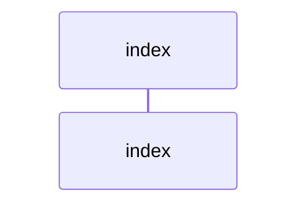

# Diagram Context Pack

Generated: 2026-04-23T09:43:37Z

## architecture

```mermaid
graph TD
  subgraph sg_sg_3a52ce78["."]
    node_vitest_config_a9f1245e_18ed3616["vitest.config"]
  end
  subgraph sg_artifacts_debug_drift_north_star_src_348bbc2d["artifacts/debug-drift-north-star/src"]
    node_artifacts_debug_drift_north_star_src_cli_4efe97c_56d591d6["cli"]
  end
  subgraph sg_artifacts_docs_gate_repro_src_5edf9cbc["artifacts/docs-gate-repro/src"]
    node_artifacts_docs_gate_repro_src_cli_9d90d3fe_2d616d52["cli"]
  end
  subgraph sg_artifacts_tmp_drift_missing_contract_src_780b4823["artifacts/tmp-drift-missing-contract/src"]
    node_artifacts_tmp_drift_missing_contract_src_cli_10b_322520d9["cli"]
  end
  subgraph sg_coverage_6dafbcf6["coverage"]
    node_coverage_block_navigation_138e923e_bc8e885a["block-navigation"]
    node_coverage_prettify_d0759c37_56574182["prettify"]
    node_coverage_sorter_d0a8e9fc_4777e2b6["sorter"]
  end
  subgraph sg_e2e_44491d4b["e2e"]
    node_e2e_run_e2e_39efe696_cb0b0924["run-e2e"]
    node_e2e_vitest_e2e_config_4e2a61bc_f8151db8["vitest.e2e.config"]
  end
  subgraph sg_e2e_clients_6e118f25["e2e/clients"]
    node_e2e_clients_github_e2e_2891a341_aacd937a["github-e2e"]
    node_e2e_clients_linear_e2e_decf3708_8c7d0cce["linear-e2e"]
  end
  subgraph sg_e2e_tests_0c5ead1b["e2e/tests"]
    node_e2e_tests_command_pipeline_e2e_test_a0aa069a_a8ee24c9["command-pipeline.e2e.test"]
    node_e2e_tests_github_integration_e2e_test_0b124522_8577c76d["github-integration.e2e.test"]
    node_e2e_tests_linear_integration_e2e_test_dbc5e6db_9deed64f["linear-integration.e2e.test"]
  end
  subgraph sg_e2e_utils_45bc2f1c["e2e/utils"]
    node_e2e_utils_env_b77349bf_80e7a7a3["env"]
    node_e2e_utils_resource_tracker_d95b6649_0a725485["resource-tracker"]
  end
  subgraph sg_scripts_16728d18["scripts"]
    node_scripts_circleci_linear_sync_19c0d6da_073fdc09["circleci-linear-sync"]
    node_scripts_circleci_stale_management_664de1d9_2a4ce90b["circleci-stale-management"]
    node_scripts_setup_git_hooks_70750d40_a643d955["setup-git-hooks"]
    node_scripts_validate_commit_msg_43b008fe_177887ed["validate-commit-msg"]
  end
  subgraph sg_scripts_hook_governance_22d136eb["scripts/hook-governance"]
    node_scripts_hook_governance_evaluate_docstring_ratch_d2833626["evaluate_docstring_ratchet"]
    node_scripts_hook_governance_inventory_repos_4ea09ad7_3293e24f["inventory_repos"]
    node_scripts_hook_governance_rollout_check_6c0140db_705d638f["rollout_check"]
  end
  subgraph sg_scripts_hook_governance_tests_df090b28["scripts/hook-governance/tests"]
    node_scripts_hook_governance_tests_init_759f8df0_8fa5b4a6["__init__"]
    node_scripts_hook_governance_tests_test_evaluate_docs_68acb28c["test_evaluate_docstring_ratchet"]
    node_scripts_hook_governance_tests_test_inventory_rep_e8f2384b["test_inventory_repos"]
    node_scripts_hook_governance_tests_test_rollout_check_3249066e["test_rollout_check"]
  end
  subgraph sg_src_f27fede2["src"]
    node_src_cli_99bb8840_d48ba2e4["cli"]
    node_src_cli_dispatch_test_54c9f17b_179f85f0["cli-dispatch.test"]
    node_src_cli_test_4851f28b_523d2a86["cli.test"]
  end
  subgraph sg_src_commands_ac7f36e3["src/commands"]
    node_src_commands_agent_first_throughput_integration__7c59b283["agent-first-throughput.integration.test"]
    node_src_commands_audit_b81f37a0_4a8057db["audit"]
    node_src_commands_audit_test_54ea1006_a3e1e261["audit.test"]
    node_src_commands_automation_run_22331800_b476f10f["automation-run"]
    node_src_commands_automation_run_test_7b21d905_ed093c97["automation-run.test"]
    node_src_commands_blast_radius_f776a633_0d93412c["blast-radius"]
    node_src_commands_blast_radius_test_045450fc_9b55a936["blast-radius.test"]
    node_src_commands_brain_bbbf7a64_8b0052ef["brain"]
    node_src_commands_brain_test_428d4d67_9c2251ff["brain.test"]
    node_src_commands_brainstorm_gate_1789ba44_99c4df84["brainstorm-gate"]
    node_src_commands_brainstorm_gate_test_2fb2aec1_ebb3826f["brainstorm-gate.test"]
    node_src_commands_branch_protect_b9d345eb_0917aabd["branch-protect"]
    node_src_commands_branch_protect_test_c8d80aab_898c50dc["branch-protect.test"]
    node_src_commands_check_20f65c28_8b102645["check"]
    node_src_commands_check_authz_fee242b1_6371b9be["check-authz"]
    node_src_commands_check_authz_test_327903fb_fd074017["check-authz.test"]
    node_src_commands_check_diagram_freshness_test_c1dc40_8ffe6bb0["check-diagram-freshness.test"]
    node_src_commands_check_environment_fe68d4be_6f3dadd7["check-environment"]
    node_src_commands_check_environment_test_5fa29c35_c89d6225["check-environment.test"]
    node_src_commands_check_test_7469a186_614dc441["check.test"]
    node_src_commands_ci_migrate_78bb70b1_a0e2c114["ci-migrate"]
    node_src_commands_ci_migrate_test_2a015bb9_07515c3d["ci-migrate.test"]
    node_src_commands_context_ea7792a2_52d036cb["context"]
    node_src_commands_context_health_80bb7da9_c636a657["context-health"]
    node_src_commands_context_health_test_3b5b87f3_b2ea595f["context-health.test"]
    node_src_commands_context_integrity_acceptance_test_5_b80c666c["context-integrity-acceptance.test"]
    node_src_commands_context_test_57aad306_79de8eab["context.test"]
    node_src_commands_contract_cc8321d6_dfc1f388["contract"]
    node_src_commands_contract_test_2262847f_99dea614["contract.test"]
    node_src_commands_diff_budget_9da0268d_6991f714["diff-budget"]
    node_src_commands_diff_budget_test_c0b72453_6e2bf489["diff-budget.test"]
    node_src_commands_docs_gate_c441fbb4_1e3c43d7["docs-gate"]
    node_src_commands_docs_gate_test_a25e972f_33a82806["docs-gate.test"]
    node_src_commands_doctor_72f4be89_12ca0d23["doctor"]
    node_src_commands_doctor_test_e032e8b5_6705010c["doctor.test"]
    node_src_commands_drift_gate_23bbee85_69873e08["drift-gate"]
    node_src_commands_drift_gate_test_816765e3_c705e6e0["drift-gate.test"]
    node_src_commands_eject_bb9fec73_534af953["eject"]
    node_src_commands_evidence_verify_3b73c290_1f8dd9f2["evidence-verify"]
    node_src_commands_evidence_verify_test_7373101d_c288ceac["evidence-verify.test"]
    node_src_commands_gap_case_82e69111_dee253c1["gap-case"]
    node_src_commands_gap_case_test_e32159fb_a0da53ec["gap-case.test"]
    node_src_commands_gardener_9416a9df_a5388d61["gardener"]
    node_src_commands_gardener_test_98f0b9a5_08a91964["gardener.test"]
    node_src_commands_health_62484e22_b2e6cd58["health"]
    node_src_commands_health_test_f79de76d_c624883e["health.test"]
    node_src_commands_index_context_de3ed39d_df7e312f["index-context"]
    node_src_commands_index_context_test_1949ea6f_d34c884d["index-context.test"]
    node_src_commands_init_bb54068a_c4673a99["init"]
    node_src_commands_init_test_cbba76a6_c720fdf4["init.test"]
    node_src_commands_license_gate_3d7eb57e_6e9cf4c4["license-gate"]
    node_src_commands_license_gate_test_1edffa1c_c8840f73["license-gate.test"]
    node_src_commands_linear_gate_fac14a46_0dc194d7["linear-gate"]
    node_src_commands_linear_gate_test_4fcca11a_4eb96b1b["linear-gate.test"]
    node_src_commands_linear_prepare_0c613ba6_c1519409["linear-prepare"]
    node_src_commands_linear_prepare_test_678f11a9_432b536b["linear-prepare.test"]
    node_src_commands_linear_sync_a2fa2bf7_3761718f["linear-sync"]
    node_src_commands_linear_sync_test_da1e1eab_5c2963f6["linear-sync.test"]
    node_src_commands_linear_triage_083177a8_7aa7cdfe["linear-triage"]
    node_src_commands_linear_triage_test_1b75a8b8_19863a59["linear-triage.test"]
    node_src_commands_linear_workflow_c5cb6267_0a8fcc8a["linear-workflow"]
    node_src_commands_linear_workflow_test_a351dcb0_73fc7cb1["linear-workflow.test"]
    node_src_commands_local_memory_preflight_dcc36c42_284fb0f7["local-memory-preflight"]
    node_src_commands_local_memory_preflight_test_5e323bb_7198fc35["local-memory-preflight.test"]
    node_src_commands_memory_gate_a577a506_f15f12cd["memory-gate"]
    node_src_commands_observability_gate_455f1f2f_708a892e["observability-gate"]
    node_src_commands_observability_gate_test_ca2979e0_3c8bb89a["observability-gate.test"]
    node_src_commands_org_audit_d739e44b_fc2ca563["org-audit"]
    node_src_commands_org_audit_test_0fd9cae8_806cc649["org-audit.test"]
    node_src_commands_pilot_evaluate_2045b1a1_a8a3ac85["pilot-evaluate"]
    node_src_commands_pilot_evaluate_test_a2ac06fc_388cb18c["pilot-evaluate.test"]
    node_src_commands_pilot_rollback_00c1f82c_e5dc550a["pilot-rollback"]
    node_src_commands_pilot_rollback_test_e61d5a2b_4a4df783["pilot-rollback.test"]
    node_src_commands_plan_gate_c2cf5008_76f98572["plan-gate"]
    node_src_commands_plan_gate_test_0c0192e6_d293ab91["plan-gate.test"]
    node_src_commands_policy_gate_213f7313_38fb255a["policy-gate"]
    node_src_commands_policy_gate_test_203a5261_6fce0009["policy-gate.test"]
    node_src_commands_pr_template_gate_281778f9_bf031e00["pr-template-gate"]
    node_src_commands_pr_template_gate_test_35faef1d_8b9385b9["pr-template-gate.test"]
    node_src_commands_preflight_gate_c543e5ba_977ef4d4["preflight-gate"]
    node_src_commands_preflight_gate_test_6821f821_7f94dfdb["preflight-gate.test"]
    node_src_commands_preset_d410850f_b6ab9df8["preset"]
    node_src_commands_preset_test_9e489c16_9798caf0["preset.test"]
    node_src_commands_promote_mode_test_7ca3f5ec_5ed4f47d["promote-mode.test"]
    node_src_commands_prompt_gate_c5e9d207_a1d2e6f6["prompt-gate"]
    node_src_commands_prompt_gate_test_1a442b27_a7737ddc["prompt-gate.test"]
    node_src_commands_remediate_06b9c7fc_c8f75798["remediate"]
    node_src_commands_remediate_test_6f59cafe_3435fed4["remediate.test"]
    node_src_commands_replay_ac203c98_9feea993["replay"]
    node_src_commands_replay_test_935f7436_90eb00d2["replay.test"]
    node_src_commands_review_gate_09b579c4_66c6d307["review-gate"]
    node_src_commands_review_gate_test_000e2ed6_4bdcd834["review-gate.test"]
    node_src_commands_risk_tier_807f33f9_952824a3["risk-tier"]
    node_src_commands_risk_tier_test_ae056367_d99a1738["risk-tier.test"]
    node_src_commands_search_24193290_34c14966["search"]
    node_src_commands_search_test_0c66bc11_d61d2826["search.test"]
    node_src_commands_silent_error_64e8c933_240fd7ed["silent-error"]
    node_src_commands_simulate_b9efe395_6237778e["simulate"]
    node_src_commands_simulate_test_24df93e5_c915ccfe["simulate.test"]
    node_src_commands_solo_mode_test_a7f03f80_a7d627f3["solo-mode.test"]
    node_src_commands_symphony_check_e97f2ea0_b9617cb6["symphony-check"]
    node_src_commands_symphony_check_test_6cb33eb2_4f0d91b6["symphony-check.test"]
    node_src_commands_tooling_audit_8a8239ff_69d34e15["tooling-audit"]
    node_src_commands_tooling_audit_test_d2aee28c_9ee5e5db["tooling-audit.test"]
    node_src_commands_ui_loop_11660889_457f358d["ui-loop"]
    node_src_commands_ui_loop_test_f0eabc42_a6f3d2d0["ui-loop.test"]
    node_src_commands_upgrade_7fef9479_ae38afa9["upgrade"]
    node_src_commands_upgrade_test_b92741eb_071ab85d["upgrade.test"]
    node_src_commands_verify_coderabbit_490b4e71_227b4f8c["verify-coderabbit"]
    node_src_commands_verify_coderabbit_test_46cfcf29_41f03a50["verify-coderabbit.test"]
    node_src_commands_verify_work_df70ecac_ed5d932c["verify-work"]
    node_src_commands_verify_work_test_0e12f6c5_128a29b7["verify-work.test"]
    node_src_commands_workflow_generate_2fc0af62_3767d3c5["workflow-generate"]
    node_src_commands_workflow_generate_test_b543473a_9e976a7c["workflow-generate.test"]
  end
  subgraph sg_src_dev_9a5e9cab["src/dev"]
    node_src_dev_run_local_memory_preflight_36e92808_6c3bec68["run-local-memory-preflight"]
    node_src_dev_run_local_memory_preflight_test_1d7c5aa0_9a6c63cd["run-local-memory-preflight.test"]
  end
  subgraph sg_src_lib_9b0c0e9c["src/lib"]
    node_src_lib_pr_template_validator_f1a53aee_607e2ffe["pr-template-validator"]
    node_src_lib_pr_template_validator_test_569b1cef_06f2e40e["pr-template-validator.test"]
    node_src_lib_preset_detection_b0f00a17_fc900a93["preset-detection"]
    node_src_lib_preset_detection_test_13b58525_5aaa63e0["preset-detection.test"]
    node_src_lib_version_5ca4f385_a197ae62["version"]
    node_src_lib_version_coherence_69733bcb_31759adc["version-coherence"]
    node_src_lib_version_coherence_test_b81c6d8e_0f77549c["version-coherence.test"]
  end
  subgraph sg_src_lib_agents_8a727b80["src/lib/agents"]
    node_src_lib_agents_instruction_compat_06a469fd_af52553b["instruction-compat"]
    node_src_lib_agents_instruction_compat_test_15974a83_a01a1aae["instruction-compat.test"]
  end
  subgraph sg_src_lib_architecture_0de1dc44["src/lib/architecture"]
    node_src_lib_architecture_module_boundaries_test_c0ca_9d1087a8["module-boundaries.test"]
  end
  subgraph sg_src_lib_blast_radius_03046b1f["src/lib/blast-radius"]
    node_src_lib_blast_radius_resolver_439c3635_5d8cb557["resolver"]
    node_src_lib_blast_radius_resolver_test_84b219fe_3cf33f2d["resolver.test"]
  end
  subgraph sg_src_lib_brainstorm_3c8aa833["src/lib/brainstorm"]
    node_src_lib_brainstorm_detector_86ca96aa_726f791b["detector"]
    node_src_lib_brainstorm_detector_test_85cbb456_08c70acb["detector.test"]
    node_src_lib_brainstorm_types_37582e2a_a4781b47["types"]
  end
  subgraph sg_src_lib_ci_3d688c55["src/lib/ci"]
    node_src_lib_ci_branch_protect_sync_570adb18_4e76efe4["branch-protect-sync"]
    node_src_lib_ci_branch_protect_sync_test_159bb533_b615eb31["branch-protect-sync.test"]
    node_src_lib_ci_ci_migrate_snapshot_paths_a10de06b_9ee07ab5["ci-migrate-snapshot-paths"]
    node_src_lib_ci_ci_migrate_snapshot_paths_test_8bcd0e_7195da91["ci-migrate-snapshot-paths.test"]
    node_src_lib_ci_config_validator_669ebc2e_efe732cc["config-validator"]
    node_src_lib_ci_config_validator_test_f70500fa_5e09d89e["config-validator.test"]
    node_src_lib_ci_provider_adapter_3bcf82b7_df71fd61["provider-adapter"]
    node_src_lib_ci_required_check_metadata_dc610201_a5552889["required-check-metadata"]
    node_src_lib_ci_satisfiability_6c08de4b_7cf44516["satisfiability"]
  end
  subgraph sg_src_lib_cli_be82f541["src/lib/cli"]
    node_src_lib_cli_command_registry_a88eb2e3_e556efff["command-registry"]
    node_src_lib_cli_command_registry_test_0cf92cba_b3dd285c["command-registry.test"]
    node_src_lib_cli_doc_parity_1c991d34_21f89884["doc-parity"]
    node_src_lib_cli_doc_parity_test_bef81709_c5682060["doc-parity.test"]
    node_src_lib_cli_help_renderer_96293ac5_9278d440["help-renderer"]
    node_src_lib_cli_help_renderer_test_6b225cb3_c57293af["help-renderer.test"]
    node_src_lib_cli_legacy_dispatch_guard_test_4700087d_0ef25856["legacy-dispatch-guard.test"]
    node_src_lib_cli_parse_utils_48efb14b_266d2be9["parse-utils"]
  end
  subgraph sg_src_lib_cli_registry_3382fdac["src/lib/cli/registry"]
    node_src_lib_cli_registry_command_capabilities_a4d5c7_1a081917["command-capabilities"]
    node_src_lib_cli_registry_command_fuzzy_e87c4206_872d0c89["command-fuzzy"]
    node_src_lib_cli_registry_command_specs_69167c63_d907f2ee["command-specs"]
    node_src_lib_cli_registry_command_specs_test_7f693e85_0524568c["command-specs.test"]
    node_src_lib_cli_registry_fuzzy_resolution_fcd86de8_620d2690["fuzzy-resolution"]
    node_src_lib_cli_registry_types_eb4ad5f0_40acccf9["types"]
  end
  subgraph sg_src_lib_context_compound_85349b31["src/lib/context-compound"]
    node_src_lib_context_compound_constants_7517017f_18e4c3a0["constants"]
    node_src_lib_context_compound_constants_test_5492ae98_aac20c5e["constants.test"]
    node_src_lib_context_compound_context_compact_policy__79724c15["context-compact-policy"]
    node_src_lib_context_compound_context_compact_policy__33ca3593["context-compact-policy.test"]
    node_src_lib_context_compound_index_013aa0e3_d2523683["index"]
    node_src_lib_context_compound_indexer_70fa78e5_8f1646af["indexer"]
    node_src_lib_context_compound_indexer_test_d492f0aa_4bd5aca2["indexer.test"]
    node_src_lib_context_compound_init_error_5c7dd49f_3e7ecedb["init-error"]
    node_src_lib_context_compound_lexical_fallback_723e2b_6f1ddfed["lexical-fallback"]
    node_src_lib_context_compound_ollama_76e3c7bf_bc2b47a3["ollama"]
    node_src_lib_context_compound_ollama_test_71f9750e_00d7d6b9["ollama.test"]
    node_src_lib_context_compound_rollout_a4fa034c_c64dc829["rollout"]
    node_src_lib_context_compound_sources_878a52fc_fab46182["sources"]
    node_src_lib_context_compound_store_824d80d7_303b2fc6["store"]
    node_src_lib_context_compound_sync_contract_c79fa191_859b8e55["sync-contract"]
    node_src_lib_context_compound_sync_contract_test_5dc3_40181dd7["sync-contract.test"]
    node_src_lib_context_compound_types_0fae1112_e2a6fe49["types"]
  end
  subgraph sg_src_lib_contract_8b2646d4["src/lib/contract"]
    node_src_lib_contract_contract_presets_bbab169b_a7c45600["contract-presets"]
    node_src_lib_contract_errors_84b56c88_b66a3a2c["errors"]
    node_src_lib_contract_extends_validator_0c9b8dcc_81f8e522["extends-validator"]
    node_src_lib_contract_extends_validator_test_cee1fc26_42aefad6["extends-validator.test"]
    node_src_lib_contract_idempotency_f5d39a07_436bfde4["idempotency"]
    node_src_lib_contract_index_522f772a_69197408["index"]
    node_src_lib_contract_json_schema_74a768d7_36a995cc["json-schema"]
    node_src_lib_contract_loader_16749818_757b1786["loader"]
    node_src_lib_contract_loader_test_03424671_327c1920["loader.test"]
    node_src_lib_contract_merger_3e167607_2e7682e8["merger"]
    node_src_lib_contract_merger_test_a3d79da0_0c77c3eb["merger.test"]
    node_src_lib_contract_north_star_alignment_00440188_61b06098["north-star-alignment"]
    node_src_lib_contract_north_star_contract_validators__1b45a937["north-star-contract-validators"]
    node_src_lib_contract_north_star_validators_cfc926ce_7f4be777["north-star-validators"]
    node_src_lib_contract_policy_validators_6682e192_cfb0982b["policy-validators"]
    node_src_lib_contract_preset_resolver_dc3dd716_6ba7f673["preset-resolver"]
    node_src_lib_contract_preset_resolver_test_e112a012_88ef1235["preset-resolver.test"]
    node_src_lib_contract_run_record_emitter_00168a3a_651cc3ec["run-record-emitter"]
    node_src_lib_contract_run_record_emitter_test_5475c0d_611e26d8["run-record-emitter.test"]
    node_src_lib_contract_run_records_f616aa7c_5fbe7536["run-records"]
    node_src_lib_contract_run_records_test_3ee6a0e3_c22e3d30["run-records.test"]
    node_src_lib_contract_standards_map_eda18880_bb11985a["standards-map"]
    node_src_lib_contract_standards_map_test_795df7d4_91710ad0["standards-map.test"]
    node_src_lib_contract_types_ed30531c_e3c06cc0["types"]
    node_src_lib_contract_ui_loop_command_4db6cd6c_55600dff["ui-loop-command"]
    node_src_lib_contract_ui_loop_command_test_3f014158_e12112c1["ui-loop-command.test"]
    node_src_lib_contract_validator_b19ac2be_156d6de6["validator"]
    node_src_lib_contract_validator_helpers_7b927667_11374b64["validator-helpers"]
    node_src_lib_contract_validator_test_2bb3219d_499fe2fa["validator.test"]
  end
  subgraph sg_src_lib_deps_ec348b66["src/lib/deps"]
    node_src_lib_deps_ralph_runtime_73d63c0e_5f9a6516["ralph-runtime"]
    node_src_lib_deps_ralph_runtime_test_682f806b_edc2f6ed["ralph-runtime.test"]
  end
  subgraph sg_src_lib_evidence_ce17bc42["src/lib/evidence"]
    node_src_lib_evidence_index_7e40d474_45b1a025["index"]
    node_src_lib_evidence_loader_d47712cc_8043f340["loader"]
    node_src_lib_evidence_logger_2686af9f_fe11c2af["logger"]
    node_src_lib_evidence_policy_823412d1_53854513["policy"]
    node_src_lib_evidence_policy_test_2c06901d_a15d04cb["policy.test"]
    node_src_lib_evidence_types_86775c96_1f5cf94d["types"]
    node_src_lib_evidence_validator_5180cf23_535928fa["validator"]
    node_src_lib_evidence_validator_test_9ad9ac55_81767cd8["validator.test"]
  end
  subgraph sg_src_lib_gap_case_1a2e655a["src/lib/gap-case"]
    node_src_lib_gap_case_types_fe7507be_13c9c963["types"]
  end
  subgraph sg_src_lib_gardener_2ee3d9f5["src/lib/gardener"]
    node_src_lib_gardener_link_checker_d0fa555f_defff88c["link-checker"]
    node_src_lib_gardener_pr_creator_dc6b1ea4_a5bdc6f6["pr-creator"]
    node_src_lib_gardener_quality_scorer_362f2a90_5438aaca["quality-scorer"]
    node_src_lib_gardener_stale_detector_a563289e_38a37745["stale-detector"]
    node_src_lib_gardener_stale_detector_test_7dc85478_b896df09["stale-detector.test"]
    node_src_lib_gardener_types_d025517b_81f1be3b["types"]
  end
  subgraph sg_src_lib_github_b68c7543["src/lib/github"]
    node_src_lib_github_check_run_2fc00bd3_fd2f9926["check-run"]
    node_src_lib_github_check_run_test_85d17d04_80ba548f["check-run.test"]
    node_src_lib_github_client_914e1681_515c4ae1["client"]
    node_src_lib_github_client_test_6fa17bd4_78314172["client.test"]
    node_src_lib_github_comments_2b4244fb_e33d0ad8["comments"]
    node_src_lib_github_comments_test_f8c9ae41_f3323f58["comments.test"]
    node_src_lib_github_errors_be4bd567_c45541f4["errors"]
    node_src_lib_github_errors_test_1a443b6a_dd2ec165["errors.test"]
    node_src_lib_github_mutation_queue_ce5a530e_05a19463["mutation-queue"]
    node_src_lib_github_mutation_queue_test_10b599e8_d6af24f9["mutation-queue.test"]
    node_src_lib_github_sha_d600474b_a283697a["sha"]
    node_src_lib_github_sha_test_5a5924fc_84f7b037["sha.test"]
  end
  subgraph sg_src_lib_governance_f5be96f9["src/lib/governance"]
    node_src_lib_governance_repo_scanner_a8b2579e_d292a09c["repo-scanner"]
    node_src_lib_governance_repo_scanner_test_cb7e9d00_82e29b31["repo-scanner.test"]
    node_src_lib_governance_scan_cache_fc02c79c_dbe1a47a["scan-cache"]
    node_src_lib_governance_scan_cache_test_dd1160a2_427b9803["scan-cache.test"]
    node_src_lib_governance_url_validator_3c5a1568_98696d21["url-validator"]
    node_src_lib_governance_url_validator_secure_fetch_te_5ef55df0["url-validator.secure-fetch.test"]
    node_src_lib_governance_url_validator_test_f781df3b_5b71f4a4["url-validator.test"]
  end
  subgraph sg_src_lib_init_18ad2a79["src/lib/init"]
    node_src_lib_init_ast_grep_rules_test_2b69fd9a_c48c69e0["ast-grep-rules.test"]
    node_src_lib_init_cli_084e05fe_7beaed99["cli"]
    node_src_lib_init_codex_preflight_symlink_test_037558_5789ffec["codex-preflight-symlink.test"]
    node_src_lib_init_eject_d0ecd4d1_229c1a6a["eject"]
    node_src_lib_init_eject_test_96dad02e_601f605d["eject.test"]
    node_src_lib_init_index_10143590_ede5503c["index"]
    node_src_lib_init_interactive_0eb42ac4_0f5a1037["interactive"]
    node_src_lib_init_migration_8a6cead4_4ce3e628["migration"]
    node_src_lib_init_post_bootstrap_summary_b2b5a20a_731b0271["post-bootstrap-summary"]
    node_src_lib_init_post_bootstrap_summary_test_e985d55_4a41b411["post-bootstrap-summary.test"]
    node_src_lib_init_project_brain_templates_7ef51530_212a9996["project-brain-templates"]
    node_src_lib_init_project_brain_templates_test_0b6509_fc96d6cd["project-brain-templates.test"]
    node_src_lib_init_rollback_da25480f_6e61d987["rollback"]
    node_src_lib_init_rollback_test_5435eb9c_fc5022cd["rollback.test"]
    node_src_lib_init_scaffold_db8a7260_c79e8b6f["scaffold"]
    node_src_lib_init_scaffold_shell_quality_test_79567d0_ba574a2f["scaffold-shell-quality.test"]
    node_src_lib_init_scaffold_surfaces_12d6494e_037bd826["scaffold-surfaces"]
    node_src_lib_init_scaffold_surfaces_test_f11f3af1_2bdfbde3["scaffold-surfaces.test"]
    node_src_lib_init_scaffold_test_96f4ccea_0a85d882["scaffold.test"]
    node_src_lib_init_schema_migrate_c0646635_817a98ff["schema-migrate"]
    node_src_lib_init_types_2b09659a_c5237254["types"]
    node_src_lib_init_update_2937013f_43f3ca69["update"]
    node_src_lib_init_upgrade_b277486e_b2698ece["upgrade"]
  end
  subgraph sg_src_lib_input_6d2e2e5b["src/lib/input"]
    node_src_lib_input_sanitize_af6a3bb0_1009c581["sanitize"]
    node_src_lib_input_sanitize_test_f3d34916_ef3208f8["sanitize.test"]
    node_src_lib_input_validation_98c41dcd_28d2a5b9["validation"]
    node_src_lib_input_validation_test_bc73cdff_1d90ce61["validation.test"]
    node_src_lib_input_validator_28b6e9f3_80136ef4["validator"]
    node_src_lib_input_validator_test_d5942e9e_e5ddc2a5["validator.test"]
  end
  subgraph sg_src_lib_license_635c8128["src/lib/license"]
    node_src_lib_license_spdx_09506966_49e9b7de["spdx"]
    node_src_lib_license_spdx_test_099e8b3b_936dd912["spdx.test"]
    node_src_lib_license_validator_744853f5_943ad7c8["validator"]
    node_src_lib_license_validator_test_8dbecf99_910782df["validator.test"]
  end
  subgraph sg_src_lib_linear_306ffaca["src/lib/linear"]
    node_src_lib_linear_automation_6d65ed5c_b0d00ef4["automation"]
    node_src_lib_linear_automation_test_3da74b47_b2019eba["automation.test"]
    node_src_lib_linear_blocked_governance_31d6f9c3_67398d26["blocked-governance"]
    node_src_lib_linear_blocked_governance_test_444423cc_2da6bdaa["blocked-governance.test"]
    node_src_lib_linear_client_948fe603_801bafb9["client"]
    node_src_lib_linear_client_test_4b44c0f5_b02c0b59["client.test"]
    node_src_lib_linear_governance_report_50af62c0_3014ec94["governance-report"]
    node_src_lib_linear_governance_report_test_160fb2e0_4abcaa82["governance-report.test"]
    node_src_lib_linear_metadata_gate_2dcdb343_ccf02051["metadata-gate"]
    node_src_lib_linear_metadata_gate_test_ee86e7df_0d9c8033["metadata-gate.test"]
    node_src_lib_linear_status_aging_4adb4e56_60095188["status-aging"]
    node_src_lib_linear_status_aging_test_e89d94b2_e41e5f5d["status-aging.test"]
    node_src_lib_linear_triage_lanes_5c8ea001_a2a76d38["triage-lanes"]
    node_src_lib_linear_triage_lanes_test_0937d75a_ec89dc4d["triage-lanes.test"]
    node_src_lib_linear_triage_scoring_f60c945b_63b4be92["triage-scoring"]
    node_src_lib_linear_triage_scoring_test_71fd48fa_197d9051["triage-scoring.test"]
    node_src_lib_linear_triage_sla_de9cc25f_426eacce["triage-sla"]
    node_src_lib_linear_triage_sla_test_7c85b63b_c09ff001["triage-sla.test"]
    node_src_lib_linear_triage_type_labels_8bc8350f_6a0d4c4a["triage-type-labels"]
    node_src_lib_linear_triage_type_labels_test_c2c72e21_940af8c4["triage-type-labels.test"]
    node_src_lib_linear_utils_6fd89734_99051e27["utils"]
    node_src_lib_linear_utils_test_e2ccb8ba_ca0148a1["utils.test"]
  end
  subgraph sg_src_lib_memory_df2051c4["src/lib/memory"]
    node_src_lib_memory_branch_enforcer_acb749cd_b5113172["branch-enforcer"]
    node_src_lib_memory_metrics_tracker_98cec29c_e35fb5f1["metrics-tracker"]
    node_src_lib_memory_metrics_tracker_test_3de156fa_d34e311d["metrics-tracker.test"]
    node_src_lib_memory_types_4be3ee64_871c8a1e["types"]
    node_src_lib_memory_validator_0c0621d8_32b394c2["validator"]
    node_src_lib_memory_validator_test_c5015ca0_03bed048["validator.test"]
  end
  subgraph sg_src_lib_org_0b99f346["src/lib/org"]
    node_src_lib_org_repositories_a8038884_313eb64f["repositories"]
  end
  subgraph sg_src_lib_output_d7e44ba2["src/lib/output"]
    node_src_lib_output_normalise_cc83ddc1_b341f476["normalise"]
    node_src_lib_output_normalise_test_73e8a615_835598a4["normalise.test"]
    node_src_lib_output_types_1db4641f_5369f6db["types"]
    node_src_lib_output_types_test_5c77418d_677bb693["types.test"]
  end
  subgraph sg_src_lib_pilot_evaluation_72792273["src/lib/pilot-evaluation"]
    node_src_lib_pilot_evaluation_control_plane_96826665_9976cd16["control-plane"]
    node_src_lib_pilot_evaluation_control_plane_test_cd59_cb9d2fae["control-plane.test"]
    node_src_lib_pilot_evaluation_decision_packet_dd44377_511d2198["decision-packet"]
    node_src_lib_pilot_evaluation_decision_packet_test_68_9b77b927["decision-packet.test"]
    node_src_lib_pilot_evaluation_evaluation_engine_c232e_28c2ceb0["evaluation-engine"]
    node_src_lib_pilot_evaluation_evaluation_engine_test__96caf1be["evaluation-engine.test"]
    node_src_lib_pilot_evaluation_metrics_capture_1d1a2c0_c0e5aa29["metrics-capture"]
    node_src_lib_pilot_evaluation_registries_06402afa_ead89890["registries"]
    node_src_lib_pilot_evaluation_types_75e5a4a0_7352679d["types"]
  end
  subgraph sg_src_lib_plan_gate_504885f2["src/lib/plan-gate"]
    node_src_lib_plan_gate_detector_b0fc2f46_0d566d69["detector"]
    node_src_lib_plan_gate_types_f6283648_2f2364a8["types"]
  end
  subgraph sg_src_lib_policy_b3a76617["src/lib/policy"]
    node_src_lib_policy_cardinality_ebef8aff_af9162cc["cardinality"]
    node_src_lib_policy_cardinality_test_c00e7edb_3f75f9ec["cardinality.test"]
    node_src_lib_policy_command_policy_test_66e89e89_b9431172["command-policy.test"]
    node_src_lib_policy_diff_budget_9f85eb1c_8dc44482["diff-budget"]
    node_src_lib_policy_policy_chain_0c92e343_4ed41d44["policy-chain"]
    node_src_lib_policy_policy_chain_test_bce92046_3ca45d46["policy-chain.test"]
    node_src_lib_policy_required_checks_46396214_5c6c6064["required-checks"]
    node_src_lib_policy_required_checks_test_e7da46e9_17dc678f["required-checks.test"]
    node_src_lib_policy_risk_tier_96b6ff91_59f0d2d1["risk-tier"]
    node_src_lib_policy_risk_tier_test_6f021f87_05753241["risk-tier.test"]
    node_src_lib_policy_tooling_baseline_50ab2eeb_645cbb56["tooling-baseline"]
    node_src_lib_policy_tooling_baseline_test_d272ddb6_7ad39be6["tooling-baseline.test"]
  end
  subgraph sg_src_lib_preflight_a53c17b5["src/lib/preflight"]
    node_src_lib_preflight_local_memory_0db17ecc_3ae90876["local-memory"]
    node_src_lib_preflight_performance_overload_c685bfcf_bdb17e6b["performance-overload"]
    node_src_lib_preflight_performance_overload_test_4d9c_caf4d863["performance-overload.test"]
    node_src_lib_preflight_types_1818fb91_732c0074["types"]
    node_src_lib_preflight_validator_f82af321_ea26984b["validator"]
    node_src_lib_preflight_validator_test_b4b482f8_d93b105b["validator.test"]
  end
  subgraph sg_src_lib_project_brain_1b1de03b["src/lib/project-brain"]
    node_src_lib_project_brain_brain_validator_be251832_436a25a5["brain-validator"]
    node_src_lib_project_brain_brain_validator_test_5e40c_6f5a3bad["brain-validator.test"]
    node_src_lib_project_brain_domain_mapper_cd9333d2_9e66e620["domain-mapper"]
    node_src_lib_project_brain_domain_mapper_test_dc5a989_0594a5a2["domain-mapper.test"]
    node_src_lib_project_brain_metadata_scanner_6a101b66_fd9fee3a["metadata-scanner"]
    node_src_lib_project_brain_metadata_scanner_test_faee_e950afb0["metadata-scanner.test"]
    node_src_lib_project_brain_suggestion_generator_0956f_5c7f1842["suggestion-generator"]
    node_src_lib_project_brain_suggestion_generator_test__80c0030e["suggestion-generator.test"]
  end
  subgraph sg_src_lib_project_type_80726172["src/lib/project-type"]
    node_src_lib_project_type_detector_b37d288b_3125c793["detector"]
    node_src_lib_project_type_detector_test_a3d69c08_2911626c["detector.test"]
    node_src_lib_project_type_index_faebc14e_32052f98["index"]
    node_src_lib_project_type_types_2f1ed65e_d2b75a27["types"]
  end
  subgraph sg_src_lib_remediation_056b0e90["src/lib/remediation"]
    node_src_lib_remediation_finding_normalizer_13f1559c_e962dcd1["finding-normalizer"]
    node_src_lib_remediation_finding_normalizer_test_d463_234993b6["finding-normalizer.test"]
    node_src_lib_remediation_orchestrator_6b7137c5_86db0fbf["orchestrator"]
    node_src_lib_remediation_orchestrator_test_c291cde7_2601cbf5["orchestrator.test"]
    node_src_lib_remediation_types_f869ec4b_a6d05d4b["types"]
  end
  subgraph sg_src_lib_replay_e36f123f["src/lib/replay"]
    node_src_lib_replay_trace_normalizer_cb1be1d2_aa282f94["trace-normalizer"]
    node_src_lib_replay_trace_normalizer_test_0c362866_dfbf9d7e["trace-normalizer.test"]
    node_src_lib_replay_tracer_1e6243a2_c84ed67b["tracer"]
    node_src_lib_replay_tracer_test_cb965d81_06ea2a0c["tracer.test"]
  end
  subgraph sg_src_lib_result_41f6ea66["src/lib/result"]
    node_src_lib_result_types_822d0f88_a25db228["types"]
  end
  subgraph sg_src_lib_review_gate_c92299dd["src/lib/review-gate"]
    node_src_lib_review_gate_authz_29ba2f46_8e02f0be["authz"]
    node_src_lib_review_gate_decision_packet_8ee9d119_a5022670["decision-packet"]
    node_src_lib_review_gate_decision_packet_test_9ea0e97_9d4ab165["decision-packet.test"]
    node_src_lib_review_gate_types_9675d69b_8854ed8b["types"]
  end
  subgraph sg_src_lib_silent_error_2368b365["src/lib/silent-error"]
    node_src_lib_silent_error_detector_f2b3cbe4_42d3b416["detector"]
    node_src_lib_silent_error_detector_test_d10b3555_2c298e11["detector.test"]
    node_src_lib_silent_error_types_d9bc6e7a_3622377b["types"]
  end
  subgraph sg_src_lib_simulate_1125ef2f["src/lib/simulate"]
    node_src_lib_simulate_types_4ecdf56e_54c95b78["types"]
  end
  subgraph sg_src_lib_test_1a4dfe9a["src/lib/test"]
    node_src_lib_test_overload_guard_2748c559_98821912["overload-guard"]
    node_src_lib_test_overload_guard_test_6ece9f86_ac5b6294["overload-guard.test"]
  end
  subgraph sg_src_lib_verify_51991d26["src/lib/verify"]
    node_src_lib_verify_orchestrator_11376b7e_11b1030b["orchestrator"]
    node_src_lib_verify_orchestrator_test_18d2fe26_0cefa964["orchestrator.test"]
    node_src_lib_verify_resume_admissibility_a59835da_9a8ac049["resume-admissibility"]
    node_src_lib_verify_resume_admissibility_test_eba58e3_2e57a5c3["resume-admissibility.test"]
    node_src_lib_verify_retry_policy_eebf8de9_394abc5e["retry-policy"]
    node_src_lib_verify_retry_policy_test_fff144eb_2ad7e0d7["retry-policy.test"]
    node_src_lib_verify_run_state_94d814a7_6bd70f72["run-state"]
    node_src_lib_verify_run_state_test_ee8298e8_22f322e3["run-state.test"]
  end
  subgraph sg_src_lib_workflow_bf0d40a1["src/lib/workflow"]
    node_src_lib_workflow_brainstorm_e2e2381d_e32b3f02["brainstorm"]
    node_src_lib_workflow_brainstorm_test_78cf7a1e_32a2f845["brainstorm.test"]
    node_src_lib_workflow_plan_64879f7d_cd9e2fad["plan"]
    node_src_lib_workflow_plan_test_e7c3b920_e31df245["plan.test"]
  end
  subgraph sg_src_lib_workflow_contract_d7e80669["src/lib/workflow-contract"]
    node_src_lib_workflow_contract_checker_d2d2328e_847ebbc3["checker"]
    node_src_lib_workflow_contract_checker_test_ee38befa_0c00b6ed["checker.test"]
    node_src_lib_workflow_contract_ci_adapter_90d6f8f4_9497772b["ci-adapter"]
    node_src_lib_workflow_contract_ci_adapter_test_5a1c16_0ab9b1b1["ci-adapter.test"]
    node_src_lib_workflow_contract_gate_bundle_28601503_7726ee2c["gate-bundle"]
    node_src_lib_workflow_contract_gate_bundle_test_f729a_57823319["gate-bundle.test"]
    node_src_lib_workflow_contract_index_1bc04b52_fd54a007["index"]
    node_src_lib_workflow_contract_operator_scorecard_cc6_75c4cc4d["operator-scorecard"]
    node_src_lib_workflow_contract_operator_scorecard_tes_6c71c6b6["operator-scorecard.test"]
    node_src_lib_workflow_contract_parser_b17d4512_c1de46a9["parser"]
    node_src_lib_workflow_contract_parser_test_3c7414cf_9fd264b6["parser.test"]
    node_src_lib_workflow_contract_pilot_tracker_5c767813_bcb1478b["pilot-tracker"]
    node_src_lib_workflow_contract_pilot_tracker_test_803_dbb50df5["pilot-tracker.test"]
    node_src_lib_workflow_contract_registry_872491a3_0484b10f["registry"]
    node_src_lib_workflow_contract_registry_test_89f095f8_c0651ef8["registry.test"]
    node_src_lib_workflow_contract_state_normalizer_147c0_79dd8c5b["state-normalizer"]
    node_src_lib_workflow_contract_state_normalizer_test__b5f56a5d["state-normalizer.test"]
    node_src_lib_workflow_contract_test_harness_6e520b98_2684883b["test-harness"]
    node_src_lib_workflow_contract_test_harness_test_657d_33a21cc8["test-harness.test"]
    node_src_lib_workflow_contract_types_8d846022_98e8ece9["types"]
  end

```

## auth

```mermaid
flowchart TD
  Request["Authentication request"]
  Boundary{"Auth Boundary"}
  Request --> Boundary
  verify_coderabbit_test_46cfcf29["verify-coderabbit.test"]
  Boundary --> verify_coderabbit_test_46cfcf29
  risk_tier_test_ae056367["risk-tier.test"]
  Boundary --> risk_tier_test_ae056367
  review_gate_09b579c4["review-gate"]
  Boundary --> review_gate_09b579c4
  review_gate_test_000e2ed6["review-gate.test"]
  Boundary --> review_gate_test_000e2ed6
  preflight_gate_test_6821f821["preflight-gate.test"]
  Boundary --> preflight_gate_test_6821f821
  policy_gate_test_203a5261["policy-gate.test"]
  Boundary --> policy_gate_test_203a5261
  linear_workflow_c5cb6267["linear-workflow"]
  Boundary --> linear_workflow_c5cb6267
  linear_triage_083177a8["linear-triage"]
  Boundary --> linear_triage_083177a8
  init_test_cbba76a6["init.test"]
  Boundary --> init_test_cbba76a6
  docs_gate_test_a25e972f["docs-gate.test"]
  Boundary --> docs_gate_test_a25e972f
  context_test_57aad306["context.test"]
  Boundary --> context_test_57aad306
  ci_migrate_78bb70b1["ci-migrate"]
  Boundary --> ci_migrate_78bb70b1
  check_environment_fe68d4be["check-environment"]
  Boundary --> check_environment_fe68d4be
  branch_protect_b9d345eb["branch-protect"]
  Boundary --> branch_protect_b9d345eb
  blast_radius_test_045450fc["blast-radius.test"]
  Boundary --> blast_radius_test_045450fc
  env_b77349bf["env"]
  Boundary --> env_b77349bf
  overload_guard_2748c559["overload-guard"]
  Boundary --> overload_guard_2748c559
  overload_guard_test_6ece9f86["overload-guard.test"]
  Boundary --> overload_guard_test_6ece9f86
  authz_29ba2f46["authz"]
  Boundary --> authz_29ba2f46
  trace_normalizer_cb1be1d2["trace-normalizer"]
  Boundary --> trace_normalizer_cb1be1d2
  trace_normalizer_test_0c362866["trace-normalizer.test"]
  Boundary --> trace_normalizer_test_0c362866
  validator_f82af321["validator"]
  Boundary --> validator_f82af321
  validator_test_b4b482f8["validator.test"]
  Boundary --> validator_test_b4b482f8
  suggestion_generator_test_f68e9892["suggestion-generator.test"]
  Boundary --> suggestion_generator_test_f68e9892
  risk_tier_test_1_6f021f87["risk-tier.test"]
  Boundary --> risk_tier_test_1_6f021f87
  normalise_test_73e8a615["normalise.test"]
  Boundary --> normalise_test_73e8a615
  control_plane_96826665["control-plane"]
  Boundary --> control_plane_96826665
  types_11_4be3ee64["types"]
  Boundary --> types_11_4be3ee64
  triage_type_labels_8bc8350f["triage-type-labels"]
  Boundary --> triage_type_labels_8bc8350f
  triage_type_labels_test_c2c72e21["triage-type-labels.test"]
  Boundary --> triage_type_labels_test_c2c72e21
  triage_sla_de9cc25f["triage-sla"]
  Boundary --> triage_sla_de9cc25f
  triage_lanes_5c8ea001["triage-lanes"]
  Boundary --> triage_lanes_5c8ea001
  metadata_gate_2dcdb343["metadata-gate"]
  Boundary --> metadata_gate_2dcdb343
  types_12_2b09659a["types"]
  Boundary --> types_12_2b09659a
  scaffold_db8a7260["scaffold"]
  Boundary --> scaffold_db8a7260
  cli_1_084e05fe["cli"]
  Boundary --> cli_1_084e05fe
  policy_test_2c06901d["policy.test"]
  Boundary --> policy_test_2c06901d
  legacy_dispatch_guard_test_4700087d["legacy-dispatch-guard.test"]
  Boundary --> legacy_dispatch_guard_test_4700087d
  validator_5_b19ac2be["validator"]
  Boundary --> validator_5_b19ac2be
  validator_test_5_2bb3219d["validator.test"]
  Boundary --> validator_test_5_2bb3219d
  types_17_ed30531c["types"]
  Boundary --> types_17_ed30531c
  loader_test_03424671["loader.test"]
  Boundary --> loader_test_03424671
  json_schema_74a768d7["json-schema"]
  Boundary --> json_schema_74a768d7
  contract_presets_bbab169b["contract-presets"]
  Boundary --> contract_presets_bbab169b
  resolver_439c3635["resolver"]
  Boundary --> resolver_439c3635
  resolver_test_84b219fe["resolver.test"]
  Boundary --> resolver_test_84b219fe
  command_specs_69167c63["command-specs"]
  Boundary --> command_specs_69167c63
  command_specs_test_7f693e85["command-specs.test"]
  Boundary --> command_specs_test_7f693e85
  node_fs_df6b52af[("node:fs")]
  node_os_e9717731[("node:os")]
  node_path_0e7d56ab[("node:path")]
  vitest_a9127f3d[("vitest")]
  node_child_process_cb73900b[("node:child_process")]
  node_crypto_879f6cbe[("node:crypto")]
  node_process_09240432[("node:process")]
  node_url_b54ed078[("node:url")]
  semver_50449d83[("semver")]
  _inquirer_prompts_21758d24[("@inquirer/prompts")]
  picomatch_0bf97c7b[("picomatch")]
  classDef authNode fill:#7c3aed,color:#fff

```



## class


## database

```mermaid
flowchart TD
  UserRequest["User request"]
  Decision{Record exists?}
  cli_dispatch_test_54c9f17b["cli-dispatch.test"]
  UserRequest --> cli_dispatch_test_54c9f17b
  cli_dispatch_test_54c9f17b --> cli_dispatch_test_54c9f17b_result["result"]
  version_coherence_test_b81c6d8e["version-coherence.test"]
  UserRequest --> version_coherence_test_b81c6d8e
  version_coherence_test_b81c6d8e --> version_coherence_test_b81c6d8e_result["result"]
  verify_work_df70ecac["verify-work"]
  UserRequest --> verify_work_df70ecac
  verify_work_df70ecac --> verify_work_df70ecac_result["result"]
  verify_work_test_0e12f6c5["verify-work.test"]
  UserRequest --> verify_work_test_0e12f6c5
  verify_work_test_0e12f6c5 --> verify_work_test_0e12f6c5_result["result"]
  verify_coderabbit_test_46cfcf29["verify-coderabbit.test"]
  UserRequest --> verify_coderabbit_test_46cfcf29
  verify_coderabbit_test_46cfcf29 --> verify_coderabbit_test_46cfcf29_result["result"]
  upgrade_7fef9479["upgrade"]
  UserRequest --> upgrade_7fef9479
  upgrade_7fef9479 --> upgrade_7fef9479_result["result"]
  upgrade_test_b92741eb["upgrade.test"]
  UserRequest --> upgrade_test_b92741eb
  upgrade_test_b92741eb --> upgrade_test_b92741eb_result["result"]
  simulate_b9efe395["simulate"]
  UserRequest --> simulate_b9efe395
  simulate_b9efe395 --> simulate_b9efe395_result["result"]
  search_24193290["search"]
  UserRequest --> search_24193290
  search_24193290 --> search_24193290_result["result"]
  pilot_evaluate_2045b1a1["pilot-evaluate"]
  UserRequest --> pilot_evaluate_2045b1a1
  pilot_evaluate_2045b1a1 --> pilot_evaluate_2045b1a1_result["result"]
  pilot_evaluate_test_a2ac06fc["pilot-evaluate.test"]
  UserRequest --> pilot_evaluate_test_a2ac06fc
  pilot_evaluate_test_a2ac06fc --> pilot_evaluate_test_a2ac06fc_result["result"]
  org_audit_d739e44b["org-audit"]
  UserRequest --> org_audit_d739e44b
  org_audit_d739e44b --> org_audit_d739e44b_result["result"]
  init_test_cbba76a6["init.test"]
  UserRequest --> init_test_cbba76a6
  init_test_cbba76a6 --> init_test_cbba76a6_result["result"]
  index_context_de3ed39d["index-context"]
  UserRequest --> index_context_de3ed39d
  index_context_de3ed39d --> index_context_de3ed39d_result["result"]
  drift_gate_23bbee85["drift-gate"]
  UserRequest --> drift_gate_23bbee85
  drift_gate_23bbee85 --> drift_gate_23bbee85_result["result"]
  docs_gate_c441fbb4["docs-gate"]
  UserRequest --> docs_gate_c441fbb4
  docs_gate_c441fbb4 --> docs_gate_c441fbb4_result["result"]
  contract_cc8321d6["contract"]
  UserRequest --> contract_cc8321d6
  contract_cc8321d6 --> contract_cc8321d6_result["result"]
  contract_test_2262847f["contract.test"]
  UserRequest --> contract_test_2262847f
  contract_test_2262847f --> contract_test_2262847f_result["result"]
  context_ea7792a2["context"]
  UserRequest --> context_ea7792a2
  context_ea7792a2 --> context_ea7792a2_result["result"]
  context_test_57aad306["context.test"]
  UserRequest --> context_test_57aad306
  context_test_57aad306 --> context_test_57aad306_result["result"]
  ci_migrate_78bb70b1["ci-migrate"]
  UserRequest --> ci_migrate_78bb70b1
  ci_migrate_78bb70b1 --> ci_migrate_78bb70b1_result["result"]
  ci_migrate_test_2a015bb9["ci-migrate.test"]
  UserRequest --> ci_migrate_test_2a015bb9
  ci_migrate_test_2a015bb9 --> ci_migrate_test_2a015bb9_result["result"]
  check_20f65c28["check"]
  UserRequest --> check_20f65c28
  check_20f65c28 --> check_20f65c28_result["result"]
  brain_test_428d4d67["brain.test"]
  UserRequest --> brain_test_428d4d67
  brain_test_428d4d67 --> brain_test_428d4d67_result["result"]
  github_e2e_2891a341["github-e2e"]
  UserRequest --> github_e2e_2891a341
  github_e2e_2891a341 --> github_e2e_2891a341_result["result"]
  pilot_tracker_5c767813["pilot-tracker"]
  UserRequest --> pilot_tracker_5c767813
  pilot_tracker_5c767813 --> pilot_tracker_5c767813_result["result"]
  ci_adapter_90d6f8f4["ci-adapter"]
  UserRequest --> ci_adapter_90d6f8f4
  ci_adapter_90d6f8f4 --> ci_adapter_90d6f8f4_result["result"]
  types_1_4ecdf56e["types"]
  UserRequest --> types_1_4ecdf56e
  types_1_4ecdf56e --> types_1_4ecdf56e_result["result"]
  decision_packet_test_9ea0e97b["decision-packet.test"]
  UserRequest --> decision_packet_test_9ea0e97b
  decision_packet_test_9ea0e97b --> decision_packet_test_9ea0e97b_result["result"]
  types_4_822d0f88["types"]
  UserRequest --> types_4_822d0f88
  types_4_822d0f88 --> types_4_822d0f88_result["result"]
  local_memory_0db17ecc["local-memory"]
  UserRequest --> local_memory_0db17ecc
  local_memory_0db17ecc --> local_memory_0db17ecc_result["result"]
  domain_mapper_cd9333d2["domain-mapper"]
  UserRequest --> domain_mapper_cd9333d2
  domain_mapper_cd9333d2 --> domain_mapper_cd9333d2_result["result"]
  normalise_cc83ddc1["normalise"]
  UserRequest --> normalise_cc83ddc1
  normalise_cc83ddc1 --> normalise_cc83ddc1_result["result"]
  normalise_test_73e8a615["normalise.test"]
  UserRequest --> normalise_test_73e8a615
  normalise_test_73e8a615 --> normalise_test_73e8a615_result["result"]
  decision_packet_1_dd443771["decision-packet"]
  UserRequest --> decision_packet_1_dd443771
  decision_packet_1_dd443771 --> decision_packet_1_dd443771_result["result"]
  validator_1_0c0621d8["validator"]
  UserRequest --> validator_1_0c0621d8
  validator_1_0c0621d8 --> validator_1_0c0621d8_result["result"]
  types_11_4be3ee64["types"]
  UserRequest --> types_11_4be3ee64
  types_11_4be3ee64 --> types_11_4be3ee64_result["result"]
  governance_report_test_160fb2e0["governance-report.test"]
  UserRequest --> governance_report_test_160fb2e0
  governance_report_test_160fb2e0 --> governance_report_test_160fb2e0_result["result"]
  client_948fe603["client"]
  UserRequest --> client_948fe603
  client_948fe603 --> client_948fe603_result["result"]
  sanitize_af6a3bb0["sanitize"]
  UserRequest --> sanitize_af6a3bb0
  sanitize_af6a3bb0 --> sanitize_af6a3bb0_result["result"]
  update_2937013f["update"]
  UserRequest --> update_2937013f
  update_2937013f --> update_2937013f_write["write/update"]
  update_2937013f_write --> update_2937013f_result["result"]
  types_12_2b09659a["types"]
  UserRequest --> types_12_2b09659a
  types_12_2b09659a --> types_12_2b09659a_result["result"]
  schema_migrate_c0646635["schema-migrate"]
  UserRequest --> schema_migrate_c0646635
  schema_migrate_c0646635 --> schema_migrate_c0646635_result["result"]
  scaffold_db8a7260["scaffold"]
  UserRequest --> scaffold_db8a7260
  scaffold_db8a7260 --> scaffold_db8a7260_result["result"]
  scaffold_test_96f4ccea["scaffold.test"]
  UserRequest --> scaffold_test_96f4ccea
  scaffold_test_96f4ccea --> scaffold_test_96f4ccea_result["result"]
  rollback_da25480f["rollback"]
  UserRequest --> rollback_da25480f
  rollback_da25480f --> rollback_da25480f_result["result"]
  migration_8a6cead4["migration"]
  UserRequest --> migration_8a6cead4
  migration_8a6cead4 --> migration_8a6cead4_result["result"]
  interactive_0eb42ac4["interactive"]
  UserRequest --> interactive_0eb42ac4
  interactive_0eb42ac4 --> interactive_0eb42ac4_result["result"]
  index_2_10143590["index"]
  UserRequest --> index_2_10143590
  index_2_10143590 --> index_2_10143590_result["result"]
  eject_test_96dad02e["eject.test"]
  UserRequest --> eject_test_96dad02e
  eject_test_96dad02e --> eject_test_96dad02e_result["result"]
  codex_preflight_symlink_test_037558db["codex-preflight-symlink.test"]
  UserRequest --> codex_preflight_symlink_test_037558db
  codex_preflight_symlink_test_037558db --> codex_preflight_symlink_test_037558db_result["result"]
  cli_1_084e05fe["cli"]
  UserRequest --> cli_1_084e05fe
  cli_1_084e05fe --> cli_1_084e05fe_result["result"]
  ast_grep_rules_test_2b69fd9a["ast-grep-rules.test"]
  UserRequest --> ast_grep_rules_test_2b69fd9a
  ast_grep_rules_test_2b69fd9a --> ast_grep_rules_test_2b69fd9a_result["result"]
  url_validator_test_f781df3b["url-validator.test"]
  UserRequest --> url_validator_test_f781df3b
  url_validator_test_f781df3b --> url_validator_test_f781df3b_result["result"]
  url_validator_secure_fetch_test_0f94d613["url-validator.secure-fetch.test"]
  UserRequest --> url_validator_secure_fetch_test_0f94d613
  url_validator_secure_fetch_test_0f94d613 --> url_validator_secure_fetch_test_0f94d613_lookup["lookup query"]
  url_validator_secure_fetch_test_0f94d613_lookup --> Decision
  Decision -->|found| url_validator_secure_fetch_test_0f94d613_update["update or modify"]
  Decision -->|not found| url_validator_secure_fetch_test_0f94d613_create["insert/create"]
  url_validator_secure_fetch_test_0f94d613_update --> url_validator_secure_fetch_test_0f94d613_result["result"]
  url_validator_secure_fetch_test_0f94d613_create --> url_validator_secure_fetch_test_0f94d613_result["result"]
  scan_cache_test_dd1160a2["scan-cache.test"]
  UserRequest --> scan_cache_test_dd1160a2
  scan_cache_test_dd1160a2 --> scan_cache_test_dd1160a2_result["result"]
  repo_scanner_a8b2579e["repo-scanner"]
  UserRequest --> repo_scanner_a8b2579e
  repo_scanner_a8b2579e --> repo_scanner_a8b2579e_result["result"]
  repo_scanner_test_cb7e9d00["repo-scanner.test"]
  UserRequest --> repo_scanner_test_cb7e9d00
  repo_scanner_test_cb7e9d00 --> repo_scanner_test_cb7e9d00_result["result"]
  comments_test_f8c9ae41["comments.test"]
  UserRequest --> comments_test_f8c9ae41
  comments_test_f8c9ae41 --> comments_test_f8c9ae41_result["result"]
  client_1_914e1681["client"]
  UserRequest --> client_1_914e1681
  client_1_914e1681 --> client_1_914e1681_result["result"]
  ralph_runtime_73d63c0e["ralph-runtime"]
  UserRequest --> ralph_runtime_73d63c0e
  ralph_runtime_73d63c0e --> ralph_runtime_73d63c0e_result["result"]
  ralph_runtime_test_682f806b["ralph-runtime.test"]
  UserRequest --> ralph_runtime_test_682f806b
  ralph_runtime_test_682f806b --> ralph_runtime_test_682f806b_result["result"]
  command_registry_a88eb2e3["command-registry"]
  UserRequest --> command_registry_a88eb2e3
  command_registry_a88eb2e3 --> command_registry_a88eb2e3_result["result"]
  command_registry_test_0cf92cba["command-registry.test"]
  UserRequest --> command_registry_test_0cf92cba
  command_registry_test_0cf92cba --> command_registry_test_0cf92cba_result["result"]
  store_824d80d7["store"]
  UserRequest --> store_824d80d7
  store_824d80d7 --> store_824d80d7_result["result"]
  constants_7517017f["constants"]
  UserRequest --> constants_7517017f
  constants_7517017f --> constants_7517017f_result["result"]
  validator_5_b19ac2be["validator"]
  UserRequest --> validator_5_b19ac2be
  validator_5_b19ac2be --> validator_5_b19ac2be_result["result"]
  validator_test_5_2bb3219d["validator.test"]
  UserRequest --> validator_test_5_2bb3219d
  validator_test_5_2bb3219d --> validator_test_5_2bb3219d_result["result"]
  run_records_f616aa7c["run-records"]
  UserRequest --> run_records_f616aa7c
  run_records_f616aa7c --> run_records_f616aa7c_result["result"]
  run_records_test_3ee6a0e3["run-records.test"]
  UserRequest --> run_records_test_3ee6a0e3
  run_records_test_3ee6a0e3 --> run_records_test_3ee6a0e3_result["result"]
  run_record_emitter_00168a3a["run-record-emitter"]
  UserRequest --> run_record_emitter_00168a3a
  run_record_emitter_00168a3a --> run_record_emitter_00168a3a_result["result"]
  policy_validators_6682e192["policy-validators"]
  UserRequest --> policy_validators_6682e192
  policy_validators_6682e192 --> policy_validators_6682e192_result["result"]
  json_schema_74a768d7["json-schema"]
  UserRequest --> json_schema_74a768d7
  json_schema_74a768d7 --> json_schema_74a768d7_result["result"]
  contract_presets_bbab169b["contract-presets"]
  UserRequest --> contract_presets_bbab169b
  contract_presets_bbab169b --> contract_presets_bbab169b_result["result"]
  resolver_439c3635["resolver"]
  UserRequest --> resolver_439c3635
  resolver_439c3635 --> resolver_439c3635_result["result"]
  command_specs_69167c63["command-specs"]
  UserRequest --> command_specs_69167c63
  command_specs_69167c63 --> command_specs_69167c63_result["result"]
  command_capabilities_a4d5c71e["command-capabilities"]
  UserRequest --> command_capabilities_a4d5c71e
  command_capabilities_a4d5c71e --> command_capabilities_a4d5c71e_result["result"]
  inventory_repos_4ea09ad7["inventory_repos"]
  UserRequest --> inventory_repos_4ea09ad7
  inventory_repos_4ea09ad7 --> inventory_repos_4ea09ad7_result["result"]
  test_rollout_check_0c81edd1["test_rollout_check"]
  UserRequest --> test_rollout_check_0c81edd1
  test_rollout_check_0c81edd1 --> test_rollout_check_0c81edd1_result["result"]
  test_inventory_repos_1d0a81a8["test_inventory_repos"]
  UserRequest --> test_inventory_repos_1d0a81a8
  test_inventory_repos_1d0a81a8 --> test_inventory_repos_1d0a81a8_result["result"]
  test_evaluate_docstring_ratchet_aa3f800e["test_evaluate_docstring_ratchet"]
  UserRequest --> test_evaluate_docstring_ratchet_aa3f800e
  test_evaluate_docstring_ratchet_aa3f800e --> test_evaluate_docstring_ratchet_aa3f800e_result["result"]
  classDef dbNode fill:#0ea5e9,color:#fff
  classDef decisionNode fill:#0284c7,color:#fff

```



## dependency

```mermaid
graph LR
  ext_future_05a73385["__future__"] --> node_scripts_hook_governance_evaluate_docstring_ratch_d2833626
  ext_future_05a73385["__future__"] --> node_scripts_hook_governance_inventory_repos_4ea09ad7_3293e24f
  ext_future_05a73385["__future__"] --> node_scripts_hook_governance_rollout_check_6c0140db_705d638f
  ext_future_05a73385["__future__"] --> node_scripts_hook_governance_tests_test_evaluate_docs_68acb28c
  ext_future_05a73385["__future__"] --> node_scripts_hook_governance_tests_test_inventory_rep_e8f2384b
  ext_future_05a73385["__future__"] --> node_scripts_hook_governance_tests_test_rollout_check_3249066e
  ext_inquirer_prompts_4d547149["@inquirer/prompts"] --> node_src_lib_init_cli_084e05fe_7beaed99
  ext_octokit_plugin_retry_c9aecc53["@octokit/plugin-retry"] --> node_src_lib_github_client_914e1681_515c4ae1
  ext_octokit_plugin_throttling_7909ece3["@octokit/plugin-throttling"] --> node_src_lib_github_client_914e1681_515c4ae1
  ext_octokit_plugin_throttling_7909ece3["@octokit/plugin-throttling"] --> node_src_lib_gardener_pr_creator_dc6b1ea4_a5bdc6f6
  ext_octokit_request_error_98ae13cc["@octokit/request-error"] --> node_src_lib_github_client_test_6fa17bd4_78314172
  ext_octokit_request_error_98ae13cc["@octokit/request-error"] --> node_src_lib_github_errors_be4bd567_c45541f4
  ext_octokit_request_error_98ae13cc["@octokit/request-error"] --> node_src_lib_github_errors_test_1a443b6a_dd2ec165
  ext_octokit_rest_c6e4d192["@octokit/rest"] --> node_scripts_circleci_linear_sync_19c0d6da_073fdc09
  ext_octokit_rest_c6e4d192["@octokit/rest"] --> node_scripts_circleci_stale_management_664de1d9_2a4ce90b
  ext_octokit_rest_c6e4d192["@octokit/rest"] --> node_src_lib_github_client_914e1681_515c4ae1
  ext_octokit_rest_c6e4d192["@octokit/rest"] --> node_src_lib_gardener_pr_creator_dc6b1ea4_a5bdc6f6
  ext_api_d93d10ff["API"] --> node_scripts_hook_governance_evaluate_docstring_ratch_d2833626
  ext_argparse_e750ee7c["argparse"] --> node_scripts_hook_governance_evaluate_docstring_ratch_d2833626
  ext_argparse_e750ee7c["argparse"] --> node_scripts_hook_governance_inventory_repos_4ea09ad7_3293e24f
  ext_argparse_e750ee7c["argparse"] --> node_scripts_hook_governance_rollout_check_6c0140db_705d638f
  ext_better_sqlite3_d7ed8f1a["better-sqlite3"] --> node_src_lib_context_compound_store_824d80d7_303b2fc6
  ext_datetime_89ffad08["datetime"] --> node_scripts_hook_governance_evaluate_docstring_ratch_d2833626
  ext_datetime_89ffad08["datetime"] --> node_scripts_hook_governance_rollout_check_6c0140db_705d638f
  ext_datetime_89ffad08["datetime"] --> node_scripts_hook_governance_tests_test_rollout_check_3249066e
  ext_diff_75a0ee1b["diff"] --> node_src_lib_init_interactive_0eb42ac4_0f5a1037
  ext_evaluate_docstring_ratchet_8d419891["evaluate_docstring_ratchet"] --> node_scripts_hook_governance_tests_test_evaluate_docs_68acb28c
  ext_evaluate_docstring_ratchet_8d419891["evaluate_docstring_ratchet"] --> node_scripts_hook_governance_tests_test_evaluate_docs_68acb28c
  ext_exc_778865dc["exc"] --> node_scripts_hook_governance_inventory_repos_4ea09ad7_3293e24f
  ext_exc_778865dc["exc"] --> node_scripts_hook_governance_inventory_repos_4ea09ad7_3293e24f
  ext_exc_778865dc["exc"] --> node_scripts_hook_governance_inventory_repos_4ea09ad7_3293e24f
  ext_exc_778865dc["exc"] --> node_scripts_hook_governance_rollout_check_6c0140db_705d638f
  ext_fs_3f4bb586["fs"] --> node_src_commands_doctor_72f4be89_12ca0d23
  ext_inventory_repos_812f8dd4["inventory_repos"] --> node_scripts_hook_governance_tests_test_inventory_rep_e8f2384b
  ext_json_05d97e6e["json"] --> node_scripts_hook_governance_evaluate_docstring_ratch_d2833626
  ext_json_05d97e6e["json"] --> node_scripts_hook_governance_inventory_repos_4ea09ad7_3293e24f
  ext_json_05d97e6e["json"] --> node_scripts_hook_governance_rollout_check_6c0140db_705d638f
  ext_json_05d97e6e["json"] --> node_scripts_hook_governance_tests_test_evaluate_docs_68acb28c
  ext_json_05d97e6e["json"] --> node_scripts_hook_governance_tests_test_inventory_rep_e8f2384b
  ext_json_05d97e6e["json"] --> node_scripts_hook_governance_tests_test_rollout_check_3249066e
  ext_lodash_901466a5["lodash"] --> node_src_lib_contract_merger_3e167607_2e7682e8
  ext_math_7a488390["math"] --> node_scripts_hook_governance_evaluate_docstring_ratch_d2833626
  ext_node_child_process_f62b7d19["node:child_process"] --> node_src_commands_agent_first_throughput_integration__7c59b283
  ext_node_child_process_f62b7d19["node:child_process"] --> node_src_lib_memory_branch_enforcer_acb749cd_b5113172
  ext_node_child_process_f62b7d19["node:child_process"] --> node_src_commands_check_diagram_freshness_test_c1dc40_8ffe6bb0
  ext_node_child_process_f62b7d19["node:child_process"] --> node_src_commands_check_environment_fe68d4be_6f3dadd7
  ext_node_child_process_f62b7d19["node:child_process"] --> node_src_commands_check_environment_test_5fa29c35_c89d6225
  ext_node_child_process_f62b7d19["node:child_process"] --> node_src_commands_check_environment_test_5fa29c35_c89d6225
  ext_node_child_process_f62b7d19["node:child_process"] --> node_src_commands_check_environment_test_5fa29c35_c89d6225
  ext_node_child_process_f62b7d19["node:child_process"] --> node_src_commands_check_environment_test_5fa29c35_c89d6225
  ext_node_child_process_f62b7d19["node:child_process"] --> node_src_commands_check_environment_test_5fa29c35_c89d6225
  ext_node_child_process_f62b7d19["node:child_process"] --> node_src_commands_check_environment_test_5fa29c35_c89d6225
  ext_node_child_process_f62b7d19["node:child_process"] --> node_src_commands_ci_migrate_78bb70b1_a0e2c114
  ext_node_child_process_f62b7d19["node:child_process"] --> node_src_commands_ci_migrate_test_2a015bb9_07515c3d
  ext_node_child_process_f62b7d19["node:child_process"] --> node_scripts_circleci_linear_sync_19c0d6da_073fdc09
  ext_node_child_process_f62b7d19["node:child_process"] --> node_src_lib_init_codex_preflight_symlink_test_037558_5789ffec
  ext_node_child_process_f62b7d19["node:child_process"] --> node_src_lib_pilot_evaluation_control_plane_96826665_9976cd16
  ext_node_child_process_f62b7d19["node:child_process"] --> node_src_commands_diff_budget_9da0268d_6991f714
  ext_node_child_process_f62b7d19["node:child_process"] --> node_src_commands_diff_budget_test_c0b72453_6e2bf489
  ext_node_child_process_f62b7d19["node:child_process"] --> node_src_commands_doctor_72f4be89_12ca0d23
  ext_node_child_process_f62b7d19["node:child_process"] --> node_src_commands_doctor_test_e032e8b5_6705010c
  ext_node_child_process_f62b7d19["node:child_process"] --> node_src_commands_doctor_test_e032e8b5_6705010c
  ext_node_child_process_f62b7d19["node:child_process"] --> node_e2e_clients_github_e2e_2891a341_aacd937a
  ext_node_child_process_f62b7d19["node:child_process"] --> node_src_commands_health_62484e22_b2e6cd58
  ext_node_child_process_f62b7d19["node:child_process"] --> node_src_commands_health_test_f79de76d_c624883e
  ext_node_child_process_f62b7d19["node:child_process"] --> node_src_commands_health_test_f79de76d_c624883e
  ext_node_child_process_f62b7d19["node:child_process"] --> node_src_commands_init_test_cbba76a6_c720fdf4
  ext_node_child_process_f62b7d19["node:child_process"] --> node_src_commands_linear_gate_fac14a46_0dc194d7
  ext_node_child_process_f62b7d19["node:child_process"] --> node_src_lib_gardener_link_checker_d0fa555f_defff88c
  ext_node_child_process_f62b7d19["node:child_process"] --> node_src_lib_preflight_local_memory_0db17ecc_3ae90876
  ext_node_child_process_f62b7d19["node:child_process"] --> node_src_commands_local_memory_preflight_test_5e323bb_7198fc35
  ext_node_child_process_f62b7d19["node:child_process"] --> node_src_commands_local_memory_preflight_test_5e323bb_7198fc35
  ext_node_child_process_f62b7d19["node:child_process"] --> node_src_commands_local_memory_preflight_test_5e323bb_7198fc35
  ext_node_child_process_f62b7d19["node:child_process"] --> node_src_commands_remediate_06b9c7fc_c8f75798
  ext_node_child_process_f62b7d19["node:child_process"] --> node_src_commands_remediate_test_6f59cafe_3435fed4
  ext_node_child_process_f62b7d19["node:child_process"] --> node_e2e_run_e2e_39efe696_cb0b0924
  ext_node_child_process_f62b7d19["node:child_process"] --> node_src_lib_init_scaffold_db8a7260_c79e8b6f
  ext_node_child_process_f62b7d19["node:child_process"] --> node_src_lib_init_scaffold_db8a7260_c79e8b6f
  ext_node_child_process_f62b7d19["node:child_process"] --> node_src_commands_search_24193290_34c14966
  ext_node_child_process_f62b7d19["node:child_process"] --> node_src_commands_search_test_0c66bc11_d61d2826
  ext_node_child_process_f62b7d19["node:child_process"] --> node_scripts_setup_git_hooks_70750d40_a643d955
  ext_node_child_process_f62b7d19["node:child_process"] --> node_src_commands_symphony_check_test_6cb33eb2_4f0d91b6
  ext_node_child_process_f62b7d19["node:child_process"] --> node_src_lib_workflow_contract_test_harness_6e520b98_2684883b
  ext_node_child_process_f62b7d19["node:child_process"] --> node_src_commands_ui_loop_11660889_457f358d
  ext_node_child_process_f62b7d19["node:child_process"] --> node_src_commands_ui_loop_test_f0eabc42_a6f3d2d0
  ext_node_child_process_f62b7d19["node:child_process"] --> node_scripts_validate_commit_msg_43b008fe_177887ed
  ext_node_child_process_f62b7d19["node:child_process"] --> node_src_commands_verify_work_df70ecac_ed5d932c
  ext_node_child_process_f62b7d19["node:child_process"] --> node_src_lib_version_coherence_69733bcb_31759adc
  ext_node_crypto_c7dfc512["node:crypto"] --> node_src_commands_check_environment_fe68d4be_6f3dadd7
  ext_node_crypto_c7dfc512["node:crypto"] --> node_src_commands_ci_migrate_78bb70b1_a0e2c114
  ext_node_crypto_c7dfc512["node:crypto"] --> node_src_commands_ci_migrate_test_2a015bb9_07515c3d
  ext_node_crypto_c7dfc512["node:crypto"] --> node_src_commands_ci_migrate_test_2a015bb9_07515c3d
  ext_node_crypto_c7dfc512["node:crypto"] --> node_src_cli_test_4851f28b_523d2a86
  ext_node_crypto_c7dfc512["node:crypto"] --> node_src_lib_pilot_evaluation_control_plane_96826665_9976cd16
  ext_node_crypto_c7dfc512["node:crypto"] --> node_src_lib_pilot_evaluation_decision_packet_dd44377_511d2198
  ext_node_crypto_c7dfc512["node:crypto"] --> node_src_lib_review_gate_decision_packet_8ee9d119_a5022670
  ext_node_crypto_c7dfc512["node:crypto"] --> node_src_commands_docs_gate_c441fbb4_1e3c43d7
  ext_node_crypto_c7dfc512["node:crypto"] --> node_src_lib_contract_idempotency_f5d39a07_436bfde4
  ext_node_crypto_c7dfc512["node:crypto"] --> node_src_lib_context_compound_indexer_70fa78e5_8f1646af
  ext_node_crypto_c7dfc512["node:crypto"] --> node_src_lib_context_compound_indexer_test_d492f0aa_4bd5aca2
  ext_node_crypto_c7dfc512["node:crypto"] --> node_src_lib_context_compound_lexical_fallback_723e2b_6f1ddfed
  ext_node_crypto_c7dfc512["node:crypto"] --> node_src_commands_linear_sync_a2fa2bf7_3761718f
  ext_node_crypto_c7dfc512["node:crypto"] --> node_src_lib_gardener_link_checker_d0fa555f_defff88c
  ext_node_crypto_c7dfc512["node:crypto"] --> node_src_lib_init_migration_8a6cead4_4ce3e628
  ext_node_crypto_c7dfc512["node:crypto"] --> node_src_commands_pilot_rollback_00c1f82c_e5dc550a
  ext_node_crypto_c7dfc512["node:crypto"] --> node_src_commands_plan_gate_test_0c0192e6_d293ab91
  ext_node_crypto_c7dfc512["node:crypto"] --> node_src_lib_contract_preset_resolver_dc3dd716_6ba7f673
  ext_node_crypto_c7dfc512["node:crypto"] --> node_src_lib_contract_preset_resolver_test_e112a012_88ef1235
  ext_node_crypto_c7dfc512["node:crypto"] --> node_src_commands_remediate_06b9c7fc_c8f75798
  ext_node_crypto_c7dfc512["node:crypto"] --> node_src_lib_policy_required_checks_46396214_5c6c6064
  ext_node_crypto_c7dfc512["node:crypto"] --> node_src_lib_init_rollback_da25480f_6e61d987
  ext_node_crypto_c7dfc512["node:crypto"] --> node_src_lib_contract_run_record_emitter_00168a3a_651cc3ec
  ext_node_crypto_c7dfc512["node:crypto"] --> node_src_lib_contract_run_records_f616aa7c_5fbe7536
  ext_node_crypto_c7dfc512["node:crypto"] --> node_src_lib_verify_run_state_94d814a7_6bd70f72
  ext_node_crypto_c7dfc512["node:crypto"] --> node_src_lib_init_scaffold_db8a7260_c79e8b6f
  ext_node_crypto_c7dfc512["node:crypto"] --> node_src_lib_governance_scan_cache_fc02c79c_dbe1a47a
  ext_node_crypto_c7dfc512["node:crypto"] --> node_src_commands_simulate_b9efe395_6237778e
  ext_node_crypto_c7dfc512["node:crypto"] --> node_src_lib_context_compound_sources_878a52fc_fab46182
  ext_node_crypto_c7dfc512["node:crypto"] --> node_src_lib_replay_tracer_1e6243a2_c84ed67b
  ext_node_crypto_c7dfc512["node:crypto"] --> node_src_commands_ui_loop_11660889_457f358d
  ext_node_crypto_c7dfc512["node:crypto"] --> node_src_lib_init_upgrade_b277486e_b2698ece
  ext_node_dns_828a0bbf["node:dns"] --> node_src_lib_governance_url_validator_3c5a1568_98696d21
  ext_node_fs_a15b7d96["node:fs"] --> node_src_commands_agent_first_throughput_integration__7c59b283
  ext_node_fs_a15b7d96["node:fs"] --> node_src_lib_init_ast_grep_rules_test_2b69fd9a_c48c69e0
  ext_node_fs_a15b7d96["node:fs"] --> node_src_commands_audit_b81f37a0_4a8057db
  ext_node_fs_a15b7d96["node:fs"] --> node_src_commands_audit_test_54ea1006_a3e1e261
  ext_node_fs_a15b7d96["node:fs"] --> node_src_commands_audit_test_54ea1006_a3e1e261
  ext_node_fs_a15b7d96["node:fs"] --> node_src_commands_audit_test_54ea1006_a3e1e261
  ext_node_fs_a15b7d96["node:fs"] --> node_src_lib_review_gate_authz_29ba2f46_8e02f0be
  ext_node_fs_a15b7d96["node:fs"] --> node_src_commands_blast_radius_test_045450fc_9b55a936
  ext_node_fs_a15b7d96["node:fs"] --> node_src_lib_project_brain_brain_validator_be251832_436a25a5
  ext_node_fs_a15b7d96["node:fs"] --> node_src_lib_project_brain_brain_validator_test_5e40c_6f5a3bad
  ext_node_fs_a15b7d96["node:fs"] --> node_src_commands_brain_test_428d4d67_9c2251ff
  ext_node_fs_a15b7d96["node:fs"] --> node_src_commands_brain_test_428d4d67_9c2251ff
  ext_node_fs_a15b7d96["node:fs"] --> node_src_commands_brainstorm_gate_test_2fb2aec1_ebb3826f
  ext_node_fs_a15b7d96["node:fs"] --> node_src_lib_workflow_brainstorm_test_78cf7a1e_32a2f845
  ext_node_fs_a15b7d96["node:fs"] --> node_src_lib_memory_branch_enforcer_acb749cd_b5113172
  ext_node_fs_a15b7d96["node:fs"] --> node_src_commands_branch_protect_b9d345eb_0917aabd
  ext_node_fs_a15b7d96["node:fs"] --> node_src_lib_ci_branch_protect_sync_570adb18_4e76efe4
  ext_node_fs_a15b7d96["node:fs"] --> node_src_lib_ci_branch_protect_sync_test_159bb533_b615eb31
  ext_node_fs_a15b7d96["node:fs"] --> node_src_commands_check_20f65c28_8b102645
  ext_node_fs_a15b7d96["node:fs"] --> node_src_commands_check_authz_test_327903fb_fd074017
  ext_node_fs_a15b7d96["node:fs"] --> node_src_commands_check_environment_fe68d4be_6f3dadd7
  ext_node_fs_a15b7d96["node:fs"] --> node_src_commands_check_environment_fe68d4be_6f3dadd7
  ext_node_fs_a15b7d96["node:fs"] --> node_src_commands_ci_migrate_test_2a015bb9_07515c3d
  ext_node_fs_a15b7d96["node:fs"] --> node_src_cli_99bb8840_d48ba2e4
  ext_node_fs_a15b7d96["node:fs"] --> node_src_cli_dispatch_test_54c9f17b_179f85f0
  ext_node_fs_a15b7d96["node:fs"] --> node_src_cli_test_4851f28b_523d2a86
  ext_node_fs_a15b7d96["node:fs"] --> node_e2e_tests_command_pipeline_e2e_test_a0aa069a_a8ee24c9
  ext_node_fs_a15b7d96["node:fs"] --> node_src_lib_policy_command_policy_test_66e89e89_b9431172
  ext_node_fs_a15b7d96["node:fs"] --> node_src_lib_cli_command_registry_test_0cf92cba_b3dd285c
  ext_node_fs_a15b7d96["node:fs"] --> node_src_lib_cli_registry_command_specs_69167c63_d907f2ee
  ext_node_fs_a15b7d96["node:fs"] --> node_src_lib_ci_config_validator_669ebc2e_efe732cc
  ext_node_fs_a15b7d96["node:fs"] --> node_src_lib_ci_config_validator_test_f70500fa_5e09d89e
  ext_node_fs_a15b7d96["node:fs"] --> node_src_lib_context_compound_context_compact_policy__33ca3593
  ext_node_fs_a15b7d96["node:fs"] --> node_src_commands_context_health_80bb7da9_c636a657
  ext_node_fs_a15b7d96["node:fs"] --> node_src_commands_context_health_test_3b5b87f3_b2ea595f
  ext_node_fs_a15b7d96["node:fs"] --> node_src_commands_context_integrity_acceptance_test_5_b80c666c
  ext_node_fs_a15b7d96["node:fs"] --> node_src_commands_context_test_57aad306_79de8eab
  ext_node_fs_a15b7d96["node:fs"] --> node_src_commands_contract_cc8321d6_dfc1f388
  ext_node_fs_a15b7d96["node:fs"] --> node_src_lib_pilot_evaluation_decision_packet_dd44377_511d2198
  ext_node_fs_a15b7d96["node:fs"] --> node_src_lib_review_gate_decision_packet_8ee9d119_a5022670
  ext_node_fs_a15b7d96["node:fs"] --> node_src_lib_pilot_evaluation_decision_packet_test_68_9b77b927
  ext_node_fs_a15b7d96["node:fs"] --> node_src_lib_review_gate_decision_packet_test_9ea0e97_9d4ab165
  ext_node_fs_a15b7d96["node:fs"] --> node_src_lib_brainstorm_detector_86ca96aa_726f791b
  ext_node_fs_a15b7d96["node:fs"] --> node_src_lib_plan_gate_detector_b0fc2f46_0d566d69
  ext_node_fs_a15b7d96["node:fs"] --> node_src_lib_project_type_detector_b37d288b_3125c793
  ext_node_fs_a15b7d96["node:fs"] --> node_src_lib_silent_error_detector_f2b3cbe4_42d3b416
  ext_node_fs_a15b7d96["node:fs"] --> node_src_lib_brainstorm_detector_test_85cbb456_08c70acb
  ext_node_fs_a15b7d96["node:fs"] --> node_src_lib_project_type_detector_test_a3d69c08_2911626c
  ext_node_fs_a15b7d96["node:fs"] --> node_src_lib_project_type_detector_test_a3d69c08_2911626c
  ext_node_fs_a15b7d96["node:fs"] --> node_src_commands_diff_budget_9da0268d_6991f714
  ext_node_fs_a15b7d96["node:fs"] --> node_src_commands_diff_budget_test_c0b72453_6e2bf489
  ext_node_fs_a15b7d96["node:fs"] --> node_src_commands_docs_gate_c441fbb4_1e3c43d7
  ext_node_fs_a15b7d96["node:fs"] --> node_src_commands_docs_gate_test_a25e972f_33a82806
  ext_node_fs_a15b7d96["node:fs"] --> node_src_commands_doctor_72f4be89_12ca0d23
  ext_node_fs_a15b7d96["node:fs"] --> node_src_lib_init_eject_d0ecd4d1_229c1a6a
  ext_node_fs_a15b7d96["node:fs"] --> node_src_lib_init_eject_test_96dad02e_601f605d
  ext_node_fs_a15b7d96["node:fs"] --> node_src_lib_init_eject_test_96dad02e_601f605d
  ext_node_fs_a15b7d96["node:fs"] --> node_src_commands_evidence_verify_3b73c290_1f8dd9f2
  ext_node_fs_a15b7d96["node:fs"] --> node_src_commands_evidence_verify_test_7373101d_c288ceac
  ext_node_fs_a15b7d96["node:fs"] --> node_src_commands_gap_case_test_e32159fb_a0da53ec
  ext_node_fs_a15b7d96["node:fs"] --> node_src_commands_gardener_9416a9df_a5388d61
  ext_node_fs_a15b7d96["node:fs"] --> node_e2e_clients_github_e2e_2891a341_aacd937a
  ext_node_fs_a15b7d96["node:fs"] --> node_e2e_tests_github_integration_e2e_test_0b124522_8577c76d
  ext_node_fs_a15b7d96["node:fs"] --> node_src_commands_health_62484e22_b2e6cd58
  ext_node_fs_a15b7d96["node:fs"] --> node_src_commands_health_test_f79de76d_c624883e
  ext_node_fs_a15b7d96["node:fs"] --> node_src_commands_index_context_de3ed39d_df7e312f
  ext_node_fs_a15b7d96["node:fs"] --> node_src_lib_context_compound_indexer_70fa78e5_8f1646af
  ext_node_fs_a15b7d96["node:fs"] --> node_src_commands_init_test_cbba76a6_c720fdf4
  ext_node_fs_a15b7d96["node:fs"] --> node_src_commands_init_test_cbba76a6_c720fdf4
  ext_node_fs_a15b7d96["node:fs"] --> node_src_commands_init_test_cbba76a6_c720fdf4
  ext_node_fs_a15b7d96["node:fs"] --> node_src_commands_init_test_cbba76a6_c720fdf4
  ext_node_fs_a15b7d96["node:fs"] --> node_src_commands_init_test_cbba76a6_c720fdf4
  ext_node_fs_a15b7d96["node:fs"] --> node_src_commands_init_test_cbba76a6_c720fdf4
  ext_node_fs_a15b7d96["node:fs"] --> node_src_commands_init_test_cbba76a6_c720fdf4
  ext_node_fs_a15b7d96["node:fs"] --> node_src_commands_init_test_cbba76a6_c720fdf4
  ext_node_fs_a15b7d96["node:fs"] --> node_src_commands_init_test_cbba76a6_c720fdf4
  ext_node_fs_a15b7d96["node:fs"] --> node_src_commands_init_test_cbba76a6_c720fdf4
  ext_node_fs_a15b7d96["node:fs"] --> node_src_commands_init_test_cbba76a6_c720fdf4
  ext_node_fs_a15b7d96["node:fs"] --> node_src_commands_init_test_cbba76a6_c720fdf4
  ext_node_fs_a15b7d96["node:fs"] --> node_src_commands_init_test_cbba76a6_c720fdf4
  ext_node_fs_a15b7d96["node:fs"] --> node_src_commands_init_test_cbba76a6_c720fdf4
  ext_node_fs_a15b7d96["node:fs"] --> node_src_commands_init_test_cbba76a6_c720fdf4
  ext_node_fs_a15b7d96["node:fs"] --> node_src_commands_init_test_cbba76a6_c720fdf4
  ext_node_fs_a15b7d96["node:fs"] --> node_src_commands_init_test_cbba76a6_c720fdf4
  ext_node_fs_a15b7d96["node:fs"] --> node_src_commands_init_test_cbba76a6_c720fdf4
  ext_node_fs_a15b7d96["node:fs"] --> node_src_commands_init_test_cbba76a6_c720fdf4
  ext_node_fs_a15b7d96["node:fs"] --> node_src_commands_init_test_cbba76a6_c720fdf4
  ext_node_fs_a15b7d96["node:fs"] --> node_src_commands_init_test_cbba76a6_c720fdf4
  ext_node_fs_a15b7d96["node:fs"] --> node_src_commands_init_test_cbba76a6_c720fdf4
  ext_node_fs_a15b7d96["node:fs"] --> node_src_commands_init_test_cbba76a6_c720fdf4
  ext_node_fs_a15b7d96["node:fs"] --> node_src_commands_init_test_cbba76a6_c720fdf4
  ext_node_fs_a15b7d96["node:fs"] --> node_src_commands_init_test_cbba76a6_c720fdf4
  ext_node_fs_a15b7d96["node:fs"] --> node_src_commands_init_test_cbba76a6_c720fdf4
  ext_node_fs_a15b7d96["node:fs"] --> node_src_commands_init_test_cbba76a6_c720fdf4
  ext_node_fs_a15b7d96["node:fs"] --> node_src_commands_init_test_cbba76a6_c720fdf4
  ext_node_fs_a15b7d96["node:fs"] --> node_src_commands_init_test_cbba76a6_c720fdf4
  ext_node_fs_a15b7d96["node:fs"] --> node_src_commands_init_test_cbba76a6_c720fdf4
  ext_node_fs_a15b7d96["node:fs"] --> node_src_commands_init_test_cbba76a6_c720fdf4
  ext_node_fs_a15b7d96["node:fs"] --> node_src_commands_init_test_cbba76a6_c720fdf4
  ext_node_fs_a15b7d96["node:fs"] --> node_src_commands_init_test_cbba76a6_c720fdf4
  ext_node_fs_a15b7d96["node:fs"] --> node_src_commands_init_test_cbba76a6_c720fdf4
  ext_node_fs_a15b7d96["node:fs"] --> node_src_commands_init_test_cbba76a6_c720fdf4
  ext_node_fs_a15b7d96["node:fs"] --> node_src_commands_init_test_cbba76a6_c720fdf4
  ext_node_fs_a15b7d96["node:fs"] --> node_src_commands_init_test_cbba76a6_c720fdf4
  ext_node_fs_a15b7d96["node:fs"] --> node_src_commands_init_test_cbba76a6_c720fdf4
  ext_node_fs_a15b7d96["node:fs"] --> node_src_commands_init_test_cbba76a6_c720fdf4
  ext_node_fs_a15b7d96["node:fs"] --> node_src_commands_init_test_cbba76a6_c720fdf4
  ext_node_fs_a15b7d96["node:fs"] --> node_src_commands_init_test_cbba76a6_c720fdf4
  ext_node_fs_a15b7d96["node:fs"] --> node_src_commands_init_test_cbba76a6_c720fdf4
  ext_node_fs_a15b7d96["node:fs"] --> node_src_commands_init_test_cbba76a6_c720fdf4
  ext_node_fs_a15b7d96["node:fs"] --> node_src_commands_init_test_cbba76a6_c720fdf4
  ext_node_fs_a15b7d96["node:fs"] --> node_src_commands_init_test_cbba76a6_c720fdf4
  ext_node_fs_a15b7d96["node:fs"] --> node_src_commands_init_test_cbba76a6_c720fdf4
  ext_node_fs_a15b7d96["node:fs"] --> node_src_commands_init_test_cbba76a6_c720fdf4
  ext_node_fs_a15b7d96["node:fs"] --> node_src_commands_init_test_cbba76a6_c720fdf4
  ext_node_fs_a15b7d96["node:fs"] --> node_src_commands_init_test_cbba76a6_c720fdf4
  ext_node_fs_a15b7d96["node:fs"] --> node_src_commands_init_test_cbba76a6_c720fdf4
  ext_node_fs_a15b7d96["node:fs"] --> node_src_commands_init_test_cbba76a6_c720fdf4
  ext_node_fs_a15b7d96["node:fs"] --> node_src_commands_init_test_cbba76a6_c720fdf4
  ext_node_fs_a15b7d96["node:fs"] --> node_src_commands_init_test_cbba76a6_c720fdf4
  ext_node_fs_a15b7d96["node:fs"] --> node_src_commands_init_test_cbba76a6_c720fdf4
  ext_node_fs_a15b7d96["node:fs"] --> node_src_commands_init_test_cbba76a6_c720fdf4
  ext_node_fs_a15b7d96["node:fs"] --> node_src_commands_init_test_cbba76a6_c720fdf4
  ext_node_fs_a15b7d96["node:fs"] --> node_src_commands_init_test_cbba76a6_c720fdf4
  ext_node_fs_a15b7d96["node:fs"] --> node_src_commands_init_test_cbba76a6_c720fdf4
  ext_node_fs_a15b7d96["node:fs"] --> node_src_commands_init_test_cbba76a6_c720fdf4
  ext_node_fs_a15b7d96["node:fs"] --> node_src_commands_init_test_cbba76a6_c720fdf4
  ext_node_fs_a15b7d96["node:fs"] --> node_src_commands_init_test_cbba76a6_c720fdf4
  ext_node_fs_a15b7d96["node:fs"] --> node_src_commands_init_test_cbba76a6_c720fdf4
  ext_node_fs_a15b7d96["node:fs"] --> node_src_commands_init_test_cbba76a6_c720fdf4
  ext_node_fs_a15b7d96["node:fs"] --> node_src_commands_init_test_cbba76a6_c720fdf4
  ext_node_fs_a15b7d96["node:fs"] --> node_src_commands_init_test_cbba76a6_c720fdf4
  ext_node_fs_a15b7d96["node:fs"] --> node_src_commands_init_test_cbba76a6_c720fdf4
  ext_node_fs_a15b7d96["node:fs"] --> node_src_commands_init_test_cbba76a6_c720fdf4
  ext_node_fs_a15b7d96["node:fs"] --> node_src_commands_init_test_cbba76a6_c720fdf4
  ext_node_fs_a15b7d96["node:fs"] --> node_src_commands_init_test_cbba76a6_c720fdf4
  ext_node_fs_a15b7d96["node:fs"] --> node_src_commands_init_test_cbba76a6_c720fdf4
  ext_node_fs_a15b7d96["node:fs"] --> node_src_commands_init_test_cbba76a6_c720fdf4
  ext_node_fs_a15b7d96["node:fs"] --> node_src_commands_init_test_cbba76a6_c720fdf4
  ext_node_fs_a15b7d96["node:fs"] --> node_src_commands_init_test_cbba76a6_c720fdf4
  ext_node_fs_a15b7d96["node:fs"] --> node_src_commands_init_test_cbba76a6_c720fdf4
  ext_node_fs_a15b7d96["node:fs"] --> node_src_commands_init_test_cbba76a6_c720fdf4
  ext_node_fs_a15b7d96["node:fs"] --> node_src_commands_init_test_cbba76a6_c720fdf4
  ext_node_fs_a15b7d96["node:fs"] --> node_src_commands_init_test_cbba76a6_c720fdf4
  ext_node_fs_a15b7d96["node:fs"] --> node_src_commands_init_test_cbba76a6_c720fdf4
  ext_node_fs_a15b7d96["node:fs"] --> node_src_commands_init_test_cbba76a6_c720fdf4
  ext_node_fs_a15b7d96["node:fs"] --> node_src_commands_init_test_cbba76a6_c720fdf4
  ext_node_fs_a15b7d96["node:fs"] --> node_src_commands_init_test_cbba76a6_c720fdf4
  ext_node_fs_a15b7d96["node:fs"] --> node_src_commands_init_test_cbba76a6_c720fdf4
  ext_node_fs_a15b7d96["node:fs"] --> node_src_lib_agents_instruction_compat_06a469fd_af52553b
  ext_node_fs_a15b7d96["node:fs"] --> node_src_lib_agents_instruction_compat_test_15974a83_a01a1aae
  ext_node_fs_a15b7d96["node:fs"] --> node_src_lib_cli_legacy_dispatch_guard_test_4700087d_0ef25856
  ext_node_fs_a15b7d96["node:fs"] --> node_src_lib_context_compound_lexical_fallback_723e2b_6f1ddfed
  ext_node_fs_a15b7d96["node:fs"] --> node_src_commands_license_gate_test_1edffa1c_c8840f73
  ext_node_fs_a15b7d96["node:fs"] --> node_src_commands_linear_gate_fac14a46_0dc194d7
  ext_node_fs_a15b7d96["node:fs"] --> node_src_commands_linear_gate_test_4fcca11a_4eb96b1b
  ext_node_fs_a15b7d96["node:fs"] --> node_e2e_tests_linear_integration_e2e_test_dbc5e6db_9deed64f
  ext_node_fs_a15b7d96["node:fs"] --> node_src_commands_linear_sync_a2fa2bf7_3761718f
  ext_node_fs_a15b7d96["node:fs"] --> node_src_lib_gardener_link_checker_d0fa555f_defff88c
  ext_node_fs_a15b7d96["node:fs"] --> node_src_lib_contract_loader_16749818_757b1786
  ext_node_fs_a15b7d96["node:fs"] --> node_src_lib_evidence_loader_d47712cc_8043f340
  ext_node_fs_a15b7d96["node:fs"] --> node_src_lib_evidence_loader_d47712cc_8043f340
  ext_node_fs_a15b7d96["node:fs"] --> node_src_lib_contract_loader_test_03424671_327c1920
  ext_node_fs_a15b7d96["node:fs"] --> node_src_lib_preflight_local_memory_0db17ecc_3ae90876
  ext_node_fs_a15b7d96["node:fs"] --> node_src_commands_local_memory_preflight_test_5e323bb_7198fc35
  ext_node_fs_a15b7d96["node:fs"] --> node_src_lib_project_brain_metadata_scanner_6a101b66_fd9fee3a
  ext_node_fs_a15b7d96["node:fs"] --> node_src_lib_project_brain_metadata_scanner_test_faee_e950afb0
  ext_node_fs_a15b7d96["node:fs"] --> node_src_lib_pilot_evaluation_metrics_capture_1d1a2c0_c0e5aa29
  ext_node_fs_a15b7d96["node:fs"] --> node_src_lib_memory_metrics_tracker_test_3de156fa_d34e311d
  ext_node_fs_a15b7d96["node:fs"] --> node_src_lib_architecture_module_boundaries_test_c0ca_9d1087a8
  ext_node_fs_a15b7d96["node:fs"] --> node_src_commands_org_audit_d739e44b_fc2ca563
  ext_node_fs_a15b7d96["node:fs"] --> node_src_commands_org_audit_test_0fd9cae8_806cc649
  ext_node_fs_a15b7d96["node:fs"] --> node_src_lib_workflow_contract_parser_test_3c7414cf_9fd264b6
  ext_node_fs_a15b7d96["node:fs"] --> node_src_commands_pilot_evaluate_2045b1a1_a8a3ac85
  ext_node_fs_a15b7d96["node:fs"] --> node_src_commands_pilot_evaluate_test_a2ac06fc_388cb18c
  ext_node_fs_a15b7d96["node:fs"] --> node_src_commands_pilot_rollback_test_e61d5a2b_4a4df783
  ext_node_fs_a15b7d96["node:fs"] --> node_src_commands_pilot_rollback_test_e61d5a2b_4a4df783
  ext_node_fs_a15b7d96["node:fs"] --> node_src_commands_pilot_rollback_test_e61d5a2b_4a4df783
  ext_node_fs_a15b7d96["node:fs"] --> node_src_commands_pilot_rollback_test_e61d5a2b_4a4df783
  ext_node_fs_a15b7d96["node:fs"] --> node_src_commands_pilot_rollback_test_e61d5a2b_4a4df783
  ext_node_fs_a15b7d96["node:fs"] --> node_src_commands_pilot_rollback_test_e61d5a2b_4a4df783
  ext_node_fs_a15b7d96["node:fs"] --> node_src_commands_pilot_rollback_test_e61d5a2b_4a4df783
  ext_node_fs_a15b7d96["node:fs"] --> node_src_lib_workflow_plan_64879f7d_cd9e2fad
  ext_node_fs_a15b7d96["node:fs"] --> node_src_commands_plan_gate_test_0c0192e6_d293ab91
  ext_node_fs_a15b7d96["node:fs"] --> node_src_commands_pr_template_gate_281778f9_bf031e00
  ext_node_fs_a15b7d96["node:fs"] --> node_src_lib_preset_detection_b0f00a17_fc900a93
  ext_node_fs_a15b7d96["node:fs"] --> node_src_lib_contract_preset_resolver_dc3dd716_6ba7f673
  ext_node_fs_a15b7d96["node:fs"] --> node_src_commands_prompt_gate_c5e9d207_a1d2e6f6
  ext_node_fs_a15b7d96["node:fs"] --> node_src_lib_ci_provider_adapter_3bcf82b7_df71fd61
  ext_node_fs_a15b7d96["node:fs"] --> node_src_lib_gardener_quality_scorer_362f2a90_5438aaca
  ext_node_fs_a15b7d96["node:fs"] --> node_src_lib_pilot_evaluation_registries_06402afa_ead89890
  ext_node_fs_a15b7d96["node:fs"] --> node_src_lib_workflow_contract_registry_872491a3_0484b10f
  ext_node_fs_a15b7d96["node:fs"] --> node_src_lib_workflow_contract_registry_872491a3_0484b10f
  ext_node_fs_a15b7d96["node:fs"] --> node_src_commands_remediate_test_6f59cafe_3435fed4
  ext_node_fs_a15b7d96["node:fs"] --> node_src_commands_replay_test_935f7436_90eb00d2
  ext_node_fs_a15b7d96["node:fs"] --> node_src_lib_governance_repo_scanner_a8b2579e_d292a09c
  ext_node_fs_a15b7d96["node:fs"] --> node_src_lib_org_repositories_a8038884_313eb64f
  ext_node_fs_a15b7d96["node:fs"] --> node_src_lib_policy_required_checks_test_e7da46e9_17dc678f
  ext_node_fs_a15b7d96["node:fs"] --> node_e2e_utils_resource_tracker_d95b6649_0a725485
  ext_node_fs_a15b7d96["node:fs"] --> node_e2e_utils_resource_tracker_d95b6649_0a725485
  ext_node_fs_a15b7d96["node:fs"] --> node_src_lib_verify_resume_admissibility_a59835da_9a8ac049
  ext_node_fs_a15b7d96["node:fs"] --> node_src_commands_review_gate_09b579c4_66c6d307
  ext_node_fs_a15b7d96["node:fs"] --> node_src_commands_review_gate_test_000e2ed6_4bdcd834
  ext_node_fs_a15b7d96["node:fs"] --> node_src_commands_risk_tier_test_ae056367_d99a1738
  ext_node_fs_a15b7d96["node:fs"] --> node_e2e_run_e2e_39efe696_cb0b0924
  ext_node_fs_a15b7d96["node:fs"] --> node_src_lib_contract_run_record_emitter_00168a3a_651cc3ec
  ext_node_fs_a15b7d96["node:fs"] --> node_src_lib_contract_run_records_test_3ee6a0e3_c22e3d30
  ext_node_fs_a15b7d96["node:fs"] --> node_src_lib_ci_satisfiability_6c08de4b_7cf44516
  ext_node_fs_a15b7d96["node:fs"] --> node_src_lib_init_scaffold_db8a7260_c79e8b6f
  ext_node_fs_a15b7d96["node:fs"] --> node_src_lib_init_scaffold_db8a7260_c79e8b6f
  ext_node_fs_a15b7d96["node:fs"] --> node_src_lib_init_scaffold_db8a7260_c79e8b6f
  ext_node_fs_a15b7d96["node:fs"] --> node_src_lib_init_scaffold_db8a7260_c79e8b6f
  ext_node_fs_a15b7d96["node:fs"] --> node_src_lib_init_scaffold_db8a7260_c79e8b6f
  ext_node_fs_a15b7d96["node:fs"] --> node_src_lib_init_scaffold_db8a7260_c79e8b6f
  ext_node_fs_a15b7d96["node:fs"] --> node_src_lib_governance_scan_cache_test_dd1160a2_427b9803
  ext_node_fs_a15b7d96["node:fs"] --> node_src_lib_governance_scan_cache_test_dd1160a2_427b9803
  ext_node_fs_a15b7d96["node:fs"] --> node_scripts_setup_git_hooks_70750d40_a643d955
  ext_node_fs_a15b7d96["node:fs"] --> node_src_commands_simulate_test_24df93e5_c915ccfe
  ext_node_fs_a15b7d96["node:fs"] --> node_src_commands_solo_mode_test_a7f03f80_a7d627f3
  ext_node_fs_a15b7d96["node:fs"] --> node_src_lib_gardener_stale_detector_a563289e_38a37745
  ext_node_fs_a15b7d96["node:fs"] --> node_src_lib_gardener_stale_detector_test_7dc85478_b896df09
  ext_node_fs_a15b7d96["node:fs"] --> node_src_lib_context_compound_store_824d80d7_303b2fc6
  ext_node_fs_a15b7d96["node:fs"] --> node_src_lib_context_compound_store_824d80d7_303b2fc6
  ext_node_fs_a15b7d96["node:fs"] --> node_src_lib_project_brain_suggestion_generator_0956f_5c7f1842
  ext_node_fs_a15b7d96["node:fs"] --> node_src_lib_project_brain_suggestion_generator_test__80c0030e
  ext_node_fs_a15b7d96["node:fs"] --> node_src_commands_symphony_check_e97f2ea0_b9617cb6
  ext_node_fs_a15b7d96["node:fs"] --> node_src_commands_symphony_check_test_6cb33eb2_4f0d91b6
  ext_node_fs_a15b7d96["node:fs"] --> node_src_lib_workflow_contract_test_harness_6e520b98_2684883b
  ext_node_fs_a15b7d96["node:fs"] --> node_src_lib_workflow_contract_test_harness_test_657d_33a21cc8
  ext_node_fs_a15b7d96["node:fs"] --> node_src_commands_tooling_audit_8a8239ff_69d34e15
  ext_node_fs_a15b7d96["node:fs"] --> node_src_commands_tooling_audit_test_d2aee28c_9ee5e5db
  ext_node_fs_a15b7d96["node:fs"] --> node_src_lib_replay_tracer_1e6243a2_c84ed67b
  ext_node_fs_a15b7d96["node:fs"] --> node_src_lib_replay_tracer_1e6243a2_c84ed67b
  ext_node_fs_a15b7d96["node:fs"] --> node_src_lib_replay_tracer_test_cb965d81_06ea2a0c
  ext_node_fs_a15b7d96["node:fs"] --> node_src_lib_replay_tracer_test_cb965d81_06ea2a0c
  ext_node_fs_a15b7d96["node:fs"] --> node_src_commands_ui_loop_11660889_457f358d
  ext_node_fs_a15b7d96["node:fs"] --> node_src_commands_ui_loop_test_f0eabc42_a6f3d2d0
  ext_node_fs_a15b7d96["node:fs"] --> node_src_lib_init_update_2937013f_43f3ca69
  ext_node_fs_a15b7d96["node:fs"] --> node_src_commands_upgrade_7fef9479_ae38afa9
  ext_node_fs_a15b7d96["node:fs"] --> node_src_lib_init_upgrade_b277486e_b2698ece
  ext_node_fs_a15b7d96["node:fs"] --> node_scripts_validate_commit_msg_43b008fe_177887ed
  ext_node_fs_a15b7d96["node:fs"] --> node_src_lib_evidence_validator_5180cf23_535928fa
  ext_node_fs_a15b7d96["node:fs"] --> node_src_lib_evidence_validator_5180cf23_535928fa
  ext_node_fs_a15b7d96["node:fs"] --> node_src_lib_input_validator_28b6e9f3_80136ef4
  ext_node_fs_a15b7d96["node:fs"] --> node_src_lib_license_validator_744853f5_943ad7c8
  ext_node_fs_a15b7d96["node:fs"] --> node_src_lib_memory_validator_0c0621d8_32b394c2
  ext_node_fs_a15b7d96["node:fs"] --> node_src_lib_preflight_validator_f82af321_ea26984b
  ext_node_fs_a15b7d96["node:fs"] --> node_src_lib_evidence_validator_test_9ad9ac55_81767cd8
  ext_node_fs_a15b7d96["node:fs"] --> node_src_lib_license_validator_test_8dbecf99_910782df
  ext_node_fs_a15b7d96["node:fs"] --> node_src_lib_memory_validator_test_c5015ca0_03bed048
  ext_node_fs_a15b7d96["node:fs"] --> node_src_lib_preflight_validator_test_b4b482f8_d93b105b
  ext_node_fs_a15b7d96["node:fs"] --> node_src_commands_verify_coderabbit_490b4e71_227b4f8c
  ext_node_fs_a15b7d96["node:fs"] --> node_src_commands_verify_coderabbit_test_46cfcf29_41f03a50
  ext_node_fs_a15b7d96["node:fs"] --> node_src_commands_verify_work_df70ecac_ed5d932c
  ext_node_fs_a15b7d96["node:fs"] --> node_src_lib_version_5ca4f385_a197ae62
  ext_node_fs_a15b7d96["node:fs"] --> node_src_lib_version_coherence_69733bcb_31759adc
  ext_node_fs_a15b7d96["node:fs"] --> node_src_commands_workflow_generate_2fc0af62_3767d3c5
  ext_node_module_ca1b42af["node:module"] --> node_src_commands_health_62484e22_b2e6cd58
  ext_node_os_d93fe73a["node:os"] --> node_src_commands_automation_run_test_7b21d905_ed093c97
  ext_node_os_d93fe73a["node:os"] --> node_src_commands_blast_radius_test_045450fc_9b55a936
  ext_node_os_d93fe73a["node:os"] --> node_src_lib_project_brain_brain_validator_test_5e40c_6f5a3bad
  ext_node_os_d93fe73a["node:os"] --> node_src_commands_brainstorm_gate_test_2fb2aec1_ebb3826f
  ext_node_os_d93fe73a["node:os"] --> node_src_lib_ci_branch_protect_sync_test_159bb533_b615eb31
  ext_node_os_d93fe73a["node:os"] --> node_src_commands_check_diagram_freshness_test_c1dc40_8ffe6bb0
  ext_node_os_d93fe73a["node:os"] --> node_src_commands_check_environment_test_5fa29c35_c89d6225
  ext_node_os_d93fe73a["node:os"] --> node_src_commands_check_test_7469a186_614dc441
  ext_node_os_d93fe73a["node:os"] --> node_src_commands_ci_migrate_test_2a015bb9_07515c3d
  ext_node_os_d93fe73a["node:os"] --> node_src_cli_dispatch_test_54c9f17b_179f85f0
  ext_node_os_d93fe73a["node:os"] --> node_src_lib_init_codex_preflight_symlink_test_037558_5789ffec
  ext_node_os_d93fe73a["node:os"] --> node_e2e_tests_command_pipeline_e2e_test_a0aa069a_a8ee24c9
  ext_node_os_d93fe73a["node:os"] --> node_src_lib_cli_registry_command_specs_test_7f693e85_0524568c
  ext_node_os_d93fe73a["node:os"] --> node_src_lib_ci_config_validator_test_f70500fa_5e09d89e
  ext_node_os_d93fe73a["node:os"] --> node_src_lib_context_compound_context_compact_policy__33ca3593
  ext_node_os_d93fe73a["node:os"] --> node_src_commands_context_test_57aad306_79de8eab
  ext_node_os_d93fe73a["node:os"] --> node_src_commands_contract_test_2262847f_99dea614
  ext_node_os_d93fe73a["node:os"] --> node_src_lib_project_type_detector_test_a3d69c08_2911626c
  ext_node_os_d93fe73a["node:os"] --> node_src_lib_silent_error_detector_test_d10b3555_2c298e11
  ext_node_os_d93fe73a["node:os"] --> node_src_commands_doctor_test_e032e8b5_6705010c
  ext_node_os_d93fe73a["node:os"] --> node_src_lib_init_eject_test_96dad02e_601f605d
  ext_node_os_d93fe73a["node:os"] --> node_src_commands_evidence_verify_test_7373101d_c288ceac
  ext_node_os_d93fe73a["node:os"] --> node_e2e_clients_github_e2e_2891a341_aacd937a
  ext_node_os_d93fe73a["node:os"] --> node_e2e_tests_github_integration_e2e_test_0b124522_8577c76d
  ext_node_os_d93fe73a["node:os"] --> node_src_commands_health_test_f79de76d_c624883e
  ext_node_os_d93fe73a["node:os"] --> node_src_commands_index_context_test_1949ea6f_d34c884d
  ext_node_os_d93fe73a["node:os"] --> node_src_lib_context_compound_indexer_test_d492f0aa_4bd5aca2
  ext_node_os_d93fe73a["node:os"] --> node_src_commands_init_test_cbba76a6_c720fdf4
  ext_node_os_d93fe73a["node:os"] --> node_src_lib_agents_instruction_compat_test_15974a83_a01a1aae
  ext_node_os_d93fe73a["node:os"] --> node_src_commands_license_gate_test_1edffa1c_c8840f73
  ext_node_os_d93fe73a["node:os"] --> node_src_commands_linear_gate_test_4fcca11a_4eb96b1b
  ext_node_os_d93fe73a["node:os"] --> node_e2e_tests_linear_integration_e2e_test_dbc5e6db_9deed64f
  ext_node_os_d93fe73a["node:os"] --> node_src_lib_gardener_link_checker_d0fa555f_defff88c
  ext_node_os_d93fe73a["node:os"] --> node_src_commands_local_memory_preflight_test_5e323bb_7198fc35
  ext_node_os_d93fe73a["node:os"] --> node_src_commands_org_audit_test_0fd9cae8_806cc649
  ext_node_os_d93fe73a["node:os"] --> node_src_lib_test_overload_guard_2748c559_98821912
  ext_node_os_d93fe73a["node:os"] --> node_src_lib_test_overload_guard_test_6ece9f86_ac5b6294
  ext_node_os_d93fe73a["node:os"] --> node_src_lib_preflight_performance_overload_c685bfcf_bdb17e6b
  ext_node_os_d93fe73a["node:os"] --> node_src_commands_pilot_rollback_test_e61d5a2b_4a4df783
  ext_node_os_d93fe73a["node:os"] --> node_src_commands_pr_template_gate_test_35faef1d_8b9385b9
  ext_node_os_d93fe73a["node:os"] --> node_src_commands_promote_mode_test_7ca3f5ec_5ed4f47d
  ext_node_os_d93fe73a["node:os"] --> node_src_commands_replay_test_935f7436_90eb00d2
  ext_node_os_d93fe73a["node:os"] --> node_src_lib_verify_resume_admissibility_test_eba58e3_2e57a5c3
  ext_node_os_d93fe73a["node:os"] --> node_src_commands_review_gate_test_000e2ed6_4bdcd834
  ext_node_os_d93fe73a["node:os"] --> node_src_lib_init_rollback_test_5435eb9c_fc5022cd
  ext_node_os_d93fe73a["node:os"] --> node_src_lib_verify_run_state_test_ee8298e8_22f322e3
  ext_node_os_d93fe73a["node:os"] --> node_src_lib_init_scaffold_test_96f4ccea_0a85d882
  ext_node_os_d93fe73a["node:os"] --> node_src_lib_governance_scan_cache_test_dd1160a2_427b9803
  ext_node_os_d93fe73a["node:os"] --> node_src_lib_governance_scan_cache_test_dd1160a2_427b9803
  ext_node_os_d93fe73a["node:os"] --> node_src_commands_simulate_test_24df93e5_c915ccfe
  ext_node_os_d93fe73a["node:os"] --> node_src_commands_solo_mode_test_a7f03f80_a7d627f3
  ext_node_os_d93fe73a["node:os"] --> node_src_lib_project_brain_suggestion_generator_test__80c0030e
  ext_node_os_d93fe73a["node:os"] --> node_src_commands_symphony_check_test_6cb33eb2_4f0d91b6
  ext_node_os_d93fe73a["node:os"] --> node_src_lib_workflow_contract_test_harness_6e520b98_2684883b
  ext_node_os_d93fe73a["node:os"] --> node_src_commands_tooling_audit_test_d2aee28c_9ee5e5db
  ext_node_os_d93fe73a["node:os"] --> node_src_commands_upgrade_test_b92741eb_071ab85d
  ext_node_os_d93fe73a["node:os"] --> node_src_lib_evidence_validator_test_9ad9ac55_81767cd8
  ext_node_os_d93fe73a["node:os"] --> node_src_lib_input_validator_test_d5942e9e_e5ddc2a5
  ext_node_os_d93fe73a["node:os"] --> node_src_lib_license_validator_test_8dbecf99_910782df
  ext_node_os_d93fe73a["node:os"] --> node_src_lib_memory_validator_test_c5015ca0_03bed048
  ext_node_os_d93fe73a["node:os"] --> node_src_lib_preflight_validator_test_b4b482f8_d93b105b
  ext_node_os_d93fe73a["node:os"] --> node_src_commands_verify_coderabbit_test_46cfcf29_41f03a50
  ext_node_os_d93fe73a["node:os"] --> node_src_commands_verify_work_df70ecac_ed5d932c
  ext_node_os_d93fe73a["node:os"] --> node_src_commands_verify_work_test_0e12f6c5_128a29b7
  ext_node_os_d93fe73a["node:os"] --> node_src_lib_version_coherence_test_b81c6d8e_0f77549c
  ext_node_os_d93fe73a["node:os"] --> node_src_commands_workflow_generate_test_b543473a_9e976a7c
  ext_node_path_78811c13["node:path"] --> node_src_commands_agent_first_throughput_integration__7c59b283
  ext_node_path_78811c13["node:path"] --> node_src_lib_init_ast_grep_rules_test_2b69fd9a_c48c69e0
  ext_node_path_78811c13["node:path"] --> node_src_commands_audit_b81f37a0_4a8057db
  ext_node_path_78811c13["node:path"] --> node_src_commands_audit_test_54ea1006_a3e1e261
  ext_node_path_78811c13["node:path"] --> node_src_lib_review_gate_authz_29ba2f46_8e02f0be
  ext_node_path_78811c13["node:path"] --> node_src_commands_automation_run_22331800_b476f10f
  ext_node_path_78811c13["node:path"] --> node_src_commands_automation_run_test_7b21d905_ed093c97
  ext_node_path_78811c13["node:path"] --> node_src_commands_blast_radius_test_045450fc_9b55a936
  ext_node_path_78811c13["node:path"] --> node_src_commands_brain_bbbf7a64_8b0052ef
  ext_node_path_78811c13["node:path"] --> node_src_lib_project_brain_brain_validator_be251832_436a25a5
  ext_node_path_78811c13["node:path"] --> node_src_lib_project_brain_brain_validator_test_5e40c_6f5a3bad
  ext_node_path_78811c13["node:path"] --> node_src_commands_brain_test_428d4d67_9c2251ff
  ext_node_path_78811c13["node:path"] --> node_src_lib_workflow_brainstorm_e2e2381d_e32b3f02
  ext_node_path_78811c13["node:path"] --> node_src_commands_brainstorm_gate_test_2fb2aec1_ebb3826f
  ext_node_path_78811c13["node:path"] --> node_src_lib_workflow_brainstorm_test_78cf7a1e_32a2f845
  ext_node_path_78811c13["node:path"] --> node_src_lib_memory_branch_enforcer_acb749cd_b5113172
  ext_node_path_78811c13["node:path"] --> node_src_commands_branch_protect_b9d345eb_0917aabd
  ext_node_path_78811c13["node:path"] --> node_src_lib_ci_branch_protect_sync_570adb18_4e76efe4
  ext_node_path_78811c13["node:path"] --> node_src_lib_ci_branch_protect_sync_test_159bb533_b615eb31
  ext_node_path_78811c13["node:path"] --> node_src_commands_check_20f65c28_8b102645
  ext_node_path_78811c13["node:path"] --> node_src_commands_check_authz_test_327903fb_fd074017
  ext_node_path_78811c13["node:path"] --> node_src_commands_check_diagram_freshness_test_c1dc40_8ffe6bb0
  ext_node_path_78811c13["node:path"] --> node_src_commands_check_environment_fe68d4be_6f3dadd7
  ext_node_path_78811c13["node:path"] --> node_src_commands_check_environment_test_5fa29c35_c89d6225
  ext_node_path_78811c13["node:path"] --> node_src_commands_check_test_7469a186_614dc441
  ext_node_path_78811c13["node:path"] --> node_src_commands_ci_migrate_78bb70b1_a0e2c114
  ext_node_path_78811c13["node:path"] --> node_src_lib_ci_ci_migrate_snapshot_paths_a10de06b_9ee07ab5
  ext_node_path_78811c13["node:path"] --> node_src_lib_ci_ci_migrate_snapshot_paths_test_8bcd0e_7195da91
  ext_node_path_78811c13["node:path"] --> node_src_commands_ci_migrate_test_2a015bb9_07515c3d
  ext_node_path_78811c13["node:path"] --> node_src_commands_ci_migrate_test_2a015bb9_07515c3d
  ext_node_path_78811c13["node:path"] --> node_src_cli_99bb8840_d48ba2e4
  ext_node_path_78811c13["node:path"] --> node_src_lib_init_cli_084e05fe_7beaed99
  ext_node_path_78811c13["node:path"] --> node_src_cli_dispatch_test_54c9f17b_179f85f0
  ext_node_path_78811c13["node:path"] --> node_src_cli_test_4851f28b_523d2a86
  ext_node_path_78811c13["node:path"] --> node_src_lib_init_codex_preflight_symlink_test_037558_5789ffec
  ext_node_path_78811c13["node:path"] --> node_e2e_tests_command_pipeline_e2e_test_a0aa069a_a8ee24c9
  ext_node_path_78811c13["node:path"] --> node_src_lib_policy_command_policy_test_66e89e89_b9431172
  ext_node_path_78811c13["node:path"] --> node_src_lib_cli_command_registry_test_0cf92cba_b3dd285c
  ext_node_path_78811c13["node:path"] --> node_src_lib_cli_registry_command_specs_test_7f693e85_0524568c
  ext_node_path_78811c13["node:path"] --> node_src_lib_ci_config_validator_669ebc2e_efe732cc
  ext_node_path_78811c13["node:path"] --> node_src_lib_ci_config_validator_test_f70500fa_5e09d89e
  ext_node_path_78811c13["node:path"] --> node_src_commands_context_ea7792a2_52d036cb
  ext_node_path_78811c13["node:path"] --> node_src_lib_context_compound_context_compact_policy__33ca3593
  ext_node_path_78811c13["node:path"] --> node_src_commands_context_health_80bb7da9_c636a657
  ext_node_path_78811c13["node:path"] --> node_src_commands_context_health_test_3b5b87f3_b2ea595f
  ext_node_path_78811c13["node:path"] --> node_src_commands_context_integrity_acceptance_test_5_b80c666c
  ext_node_path_78811c13["node:path"] --> node_src_commands_context_test_57aad306_79de8eab
  ext_node_path_78811c13["node:path"] --> node_src_commands_contract_cc8321d6_dfc1f388
  ext_node_path_78811c13["node:path"] --> node_src_commands_contract_test_2262847f_99dea614
  ext_node_path_78811c13["node:path"] --> node_src_lib_pilot_evaluation_control_plane_96826665_9976cd16
  ext_node_path_78811c13["node:path"] --> node_src_lib_pilot_evaluation_control_plane_test_cd59_cb9d2fae
  ext_node_path_78811c13["node:path"] --> node_src_lib_pilot_evaluation_decision_packet_dd44377_511d2198
  ext_node_path_78811c13["node:path"] --> node_src_lib_review_gate_decision_packet_8ee9d119_a5022670
  ext_node_path_78811c13["node:path"] --> node_src_lib_pilot_evaluation_decision_packet_test_68_9b77b927
  ext_node_path_78811c13["node:path"] --> node_src_lib_review_gate_decision_packet_test_9ea0e97_9d4ab165
  ext_node_path_78811c13["node:path"] --> node_src_lib_brainstorm_detector_86ca96aa_726f791b
  ext_node_path_78811c13["node:path"] --> node_src_lib_plan_gate_detector_b0fc2f46_0d566d69
  ext_node_path_78811c13["node:path"] --> node_src_lib_project_type_detector_b37d288b_3125c793
  ext_node_path_78811c13["node:path"] --> node_src_lib_silent_error_detector_f2b3cbe4_42d3b416
  ext_node_path_78811c13["node:path"] --> node_src_lib_brainstorm_detector_test_85cbb456_08c70acb
  ext_node_path_78811c13["node:path"] --> node_src_lib_project_type_detector_test_a3d69c08_2911626c
  ext_node_path_78811c13["node:path"] --> node_src_lib_project_type_detector_test_a3d69c08_2911626c
  ext_node_path_78811c13["node:path"] --> node_src_lib_silent_error_detector_test_d10b3555_2c298e11
  ext_node_path_78811c13["node:path"] --> node_src_commands_docs_gate_c441fbb4_1e3c43d7
  ext_node_path_78811c13["node:path"] --> node_src_commands_docs_gate_test_a25e972f_33a82806
  ext_node_path_78811c13["node:path"] --> node_src_commands_doctor_72f4be89_12ca0d23
  ext_node_path_78811c13["node:path"] --> node_src_commands_doctor_test_e032e8b5_6705010c
  ext_node_path_78811c13["node:path"] --> node_src_commands_drift_gate_23bbee85_69873e08
  ext_node_path_78811c13["node:path"] --> node_src_commands_drift_gate_test_816765e3_c705e6e0
  ext_node_path_78811c13["node:path"] --> node_src_lib_init_eject_d0ecd4d1_229c1a6a
  ext_node_path_78811c13["node:path"] --> node_src_lib_init_eject_test_96dad02e_601f605d
  ext_node_path_78811c13["node:path"] --> node_src_commands_evidence_verify_3b73c290_1f8dd9f2
  ext_node_path_78811c13["node:path"] --> node_src_commands_evidence_verify_test_7373101d_c288ceac
  ext_node_path_78811c13["node:path"] --> node_src_commands_gap_case_82e69111_dee253c1
  ext_node_path_78811c13["node:path"] --> node_src_commands_gap_case_test_e32159fb_a0da53ec
  ext_node_path_78811c13["node:path"] --> node_src_commands_gardener_9416a9df_a5388d61
  ext_node_path_78811c13["node:path"] --> node_src_commands_gardener_test_98f0b9a5_08a91964
  ext_node_path_78811c13["node:path"] --> node_e2e_clients_github_e2e_2891a341_aacd937a
  ext_node_path_78811c13["node:path"] --> node_e2e_tests_github_integration_e2e_test_0b124522_8577c76d
  ext_node_path_78811c13["node:path"] --> node_src_commands_health_62484e22_b2e6cd58
  ext_node_path_78811c13["node:path"] --> node_src_commands_health_test_f79de76d_c624883e
  ext_node_path_78811c13["node:path"] --> node_src_lib_contract_idempotency_f5d39a07_436bfde4
  ext_node_path_78811c13["node:path"] --> node_src_commands_index_context_de3ed39d_df7e312f
  ext_node_path_78811c13["node:path"] --> node_src_commands_index_context_test_1949ea6f_d34c884d
  ext_node_path_78811c13["node:path"] --> node_src_lib_context_compound_indexer_70fa78e5_8f1646af
  ext_node_path_78811c13["node:path"] --> node_src_lib_context_compound_indexer_test_d492f0aa_4bd5aca2
  ext_node_path_78811c13["node:path"] --> node_src_commands_init_test_cbba76a6_c720fdf4
  ext_node_path_78811c13["node:path"] --> node_src_lib_agents_instruction_compat_06a469fd_af52553b
  ext_node_path_78811c13["node:path"] --> node_src_lib_agents_instruction_compat_test_15974a83_a01a1aae
  ext_node_path_78811c13["node:path"] --> node_src_lib_init_interactive_0eb42ac4_0f5a1037
  ext_node_path_78811c13["node:path"] --> node_src_lib_cli_legacy_dispatch_guard_test_4700087d_0ef25856
  ext_node_path_78811c13["node:path"] --> node_src_lib_context_compound_lexical_fallback_723e2b_6f1ddfed
  ext_node_path_78811c13["node:path"] --> node_src_commands_license_gate_test_1edffa1c_c8840f73
  ext_node_path_78811c13["node:path"] --> node_src_commands_linear_gate_fac14a46_0dc194d7
  ext_node_path_78811c13["node:path"] --> node_src_commands_linear_gate_test_4fcca11a_4eb96b1b
  ext_node_path_78811c13["node:path"] --> node_e2e_tests_linear_integration_e2e_test_dbc5e6db_9deed64f
  ext_node_path_78811c13["node:path"] --> node_src_lib_gardener_link_checker_d0fa555f_defff88c
  ext_node_path_78811c13["node:path"] --> node_src_lib_contract_loader_16749818_757b1786
  ext_node_path_78811c13["node:path"] --> node_src_lib_evidence_loader_d47712cc_8043f340
  ext_node_path_78811c13["node:path"] --> node_src_lib_contract_loader_test_03424671_327c1920
  ext_node_path_78811c13["node:path"] --> node_src_commands_local_memory_preflight_test_5e323bb_7198fc35
  ext_node_path_78811c13["node:path"] --> node_src_lib_project_brain_metadata_scanner_6a101b66_fd9fee3a
  ext_node_path_78811c13["node:path"] --> node_src_lib_project_brain_metadata_scanner_test_faee_e950afb0
  ext_node_path_78811c13["node:path"] --> node_src_lib_pilot_evaluation_metrics_capture_1d1a2c0_c0e5aa29
  ext_node_path_78811c13["node:path"] --> node_src_lib_memory_metrics_tracker_98cec29c_e35fb5f1
  ext_node_path_78811c13["node:path"] --> node_src_lib_memory_metrics_tracker_test_3de156fa_d34e311d
  ext_node_path_78811c13["node:path"] --> node_src_lib_init_migration_8a6cead4_4ce3e628
  ext_node_path_78811c13["node:path"] --> node_src_lib_architecture_module_boundaries_test_c0ca_9d1087a8
  ext_node_path_78811c13["node:path"] --> node_src_commands_org_audit_d739e44b_fc2ca563
  ext_node_path_78811c13["node:path"] --> node_src_commands_org_audit_test_0fd9cae8_806cc649
  ext_node_path_78811c13["node:path"] --> node_src_lib_workflow_contract_parser_test_3c7414cf_9fd264b6
  ext_node_path_78811c13["node:path"] --> node_src_commands_pilot_evaluate_2045b1a1_a8a3ac85
  ext_node_path_78811c13["node:path"] --> node_src_commands_pilot_evaluate_test_a2ac06fc_388cb18c
  ext_node_path_78811c13["node:path"] --> node_src_commands_pilot_rollback_00c1f82c_e5dc550a
  ext_node_path_78811c13["node:path"] --> node_src_commands_pilot_rollback_test_e61d5a2b_4a4df783
  ext_node_path_78811c13["node:path"] --> node_src_lib_workflow_plan_64879f7d_cd9e2fad
  ext_node_path_78811c13["node:path"] --> node_src_commands_plan_gate_test_0c0192e6_d293ab91
  ext_node_path_78811c13["node:path"] --> node_src_lib_workflow_plan_test_e7c3b920_e31df245
  ext_node_path_78811c13["node:path"] --> node_src_commands_pr_template_gate_test_35faef1d_8b9385b9
  ext_node_path_78811c13["node:path"] --> node_src_lib_preset_detection_b0f00a17_fc900a93
  ext_node_path_78811c13["node:path"] --> node_src_lib_contract_preset_resolver_dc3dd716_6ba7f673
  ext_node_path_78811c13["node:path"] --> node_src_commands_promote_mode_test_7ca3f5ec_5ed4f47d
  ext_node_path_78811c13["node:path"] --> node_src_commands_prompt_gate_c5e9d207_a1d2e6f6
  ext_node_path_78811c13["node:path"] --> node_src_lib_ci_provider_adapter_3bcf82b7_df71fd61
  ext_node_path_78811c13["node:path"] --> node_src_lib_gardener_quality_scorer_362f2a90_5438aaca
  ext_node_path_78811c13["node:path"] --> node_src_lib_pilot_evaluation_registries_06402afa_ead89890
  ext_node_path_78811c13["node:path"] --> node_src_lib_workflow_contract_registry_872491a3_0484b10f
  ext_node_path_78811c13["node:path"] --> node_src_lib_workflow_contract_registry_test_89f095f8_c0651ef8
  ext_node_path_78811c13["node:path"] --> node_src_commands_remediate_06b9c7fc_c8f75798
  ext_node_path_78811c13["node:path"] --> node_src_commands_replay_ac203c98_9feea993
  ext_node_path_78811c13["node:path"] --> node_src_commands_replay_test_935f7436_90eb00d2
  ext_node_path_78811c13["node:path"] --> node_src_lib_governance_repo_scanner_a8b2579e_d292a09c
  ext_node_path_78811c13["node:path"] --> node_src_lib_governance_repo_scanner_test_cb7e9d00_82e29b31
  ext_node_path_78811c13["node:path"] --> node_src_lib_org_repositories_a8038884_313eb64f
  ext_node_path_78811c13["node:path"] --> node_e2e_utils_resource_tracker_d95b6649_0a725485
  ext_node_path_78811c13["node:path"] --> node_src_lib_verify_resume_admissibility_a59835da_9a8ac049
  ext_node_path_78811c13["node:path"] --> node_src_lib_verify_resume_admissibility_test_eba58e3_2e57a5c3
  ext_node_path_78811c13["node:path"] --> node_src_commands_review_gate_09b579c4_66c6d307
  ext_node_path_78811c13["node:path"] --> node_src_commands_review_gate_test_000e2ed6_4bdcd834
  ext_node_path_78811c13["node:path"] --> node_src_commands_risk_tier_test_ae056367_d99a1738
  ext_node_path_78811c13["node:path"] --> node_src_lib_init_rollback_da25480f_6e61d987
  ext_node_path_78811c13["node:path"] --> node_src_lib_init_rollback_test_5435eb9c_fc5022cd
  ext_node_path_78811c13["node:path"] --> node_e2e_run_e2e_39efe696_cb0b0924
  ext_node_path_78811c13["node:path"] --> node_src_dev_run_local_memory_preflight_36e92808_6c3bec68
  ext_node_path_78811c13["node:path"] --> node_src_lib_contract_run_record_emitter_00168a3a_651cc3ec
  ext_node_path_78811c13["node:path"] --> node_src_lib_contract_run_records_f616aa7c_5fbe7536
  ext_node_path_78811c13["node:path"] --> node_src_lib_contract_run_records_test_3ee6a0e3_c22e3d30
  ext_node_path_78811c13["node:path"] --> node_src_lib_verify_run_state_94d814a7_6bd70f72
  ext_node_path_78811c13["node:path"] --> node_src_lib_verify_run_state_test_ee8298e8_22f322e3
  ext_node_path_78811c13["node:path"] --> node_src_lib_ci_satisfiability_6c08de4b_7cf44516
  ext_node_path_78811c13["node:path"] --> node_src_lib_init_scaffold_db8a7260_c79e8b6f
  ext_node_path_78811c13["node:path"] --> node_src_lib_init_scaffold_db8a7260_c79e8b6f
  ext_node_path_78811c13["node:path"] --> node_src_lib_init_scaffold_db8a7260_c79e8b6f
  ext_node_path_78811c13["node:path"] --> node_src_lib_init_scaffold_test_96f4ccea_0a85d882
  ext_node_path_78811c13["node:path"] --> node_src_lib_governance_scan_cache_fc02c79c_dbe1a47a
  ext_node_path_78811c13["node:path"] --> node_src_lib_governance_scan_cache_test_dd1160a2_427b9803
  ext_node_path_78811c13["node:path"] --> node_src_lib_governance_scan_cache_test_dd1160a2_427b9803
  ext_node_path_78811c13["node:path"] --> node_src_commands_search_24193290_34c14966
  ext_node_path_78811c13["node:path"] --> node_scripts_setup_git_hooks_70750d40_a643d955
  ext_node_path_78811c13["node:path"] --> node_src_commands_simulate_b9efe395_6237778e
  ext_node_path_78811c13["node:path"] --> node_src_commands_simulate_test_24df93e5_c915ccfe
  ext_node_path_78811c13["node:path"] --> node_src_commands_solo_mode_test_a7f03f80_a7d627f3
  ext_node_path_78811c13["node:path"] --> node_src_lib_context_compound_sources_878a52fc_fab46182
  ext_node_path_78811c13["node:path"] --> node_src_lib_gardener_stale_detector_a563289e_38a37745
  ext_node_path_78811c13["node:path"] --> node_src_lib_gardener_stale_detector_test_7dc85478_b896df09
  ext_node_path_78811c13["node:path"] --> node_src_lib_context_compound_store_824d80d7_303b2fc6
  ext_node_path_78811c13["node:path"] --> node_src_lib_project_brain_suggestion_generator_0956f_5c7f1842
  ext_node_path_78811c13["node:path"] --> node_src_lib_project_brain_suggestion_generator_test__80c0030e
  ext_node_path_78811c13["node:path"] --> node_src_commands_symphony_check_e97f2ea0_b9617cb6
  ext_node_path_78811c13["node:path"] --> node_src_commands_symphony_check_test_6cb33eb2_4f0d91b6
  ext_node_path_78811c13["node:path"] --> node_src_lib_workflow_contract_test_harness_6e520b98_2684883b
  ext_node_path_78811c13["node:path"] --> node_src_lib_workflow_contract_test_harness_test_657d_33a21cc8
  ext_node_path_78811c13["node:path"] --> node_src_commands_tooling_audit_8a8239ff_69d34e15
  ext_node_path_78811c13["node:path"] --> node_src_commands_tooling_audit_test_d2aee28c_9ee5e5db
  ext_node_path_78811c13["node:path"] --> node_src_lib_replay_tracer_1e6243a2_c84ed67b
  ext_node_path_78811c13["node:path"] --> node_src_commands_ui_loop_11660889_457f358d
  ext_node_path_78811c13["node:path"] --> node_src_lib_init_update_2937013f_43f3ca69
  ext_node_path_78811c13["node:path"] --> node_src_commands_upgrade_7fef9479_ae38afa9
  ext_node_path_78811c13["node:path"] --> node_src_lib_init_upgrade_b277486e_b2698ece
  ext_node_path_78811c13["node:path"] --> node_src_commands_upgrade_test_b92741eb_071ab85d
  ext_node_path_78811c13["node:path"] --> node_src_lib_evidence_validator_5180cf23_535928fa
  ext_node_path_78811c13["node:path"] --> node_src_lib_input_validator_28b6e9f3_80136ef4
  ext_node_path_78811c13["node:path"] --> node_src_lib_license_validator_744853f5_943ad7c8
  ext_node_path_78811c13["node:path"] --> node_src_lib_memory_validator_0c0621d8_32b394c2
  ext_node_path_78811c13["node:path"] --> node_src_lib_preflight_validator_f82af321_ea26984b
  ext_node_path_78811c13["node:path"] --> node_src_lib_evidence_validator_test_9ad9ac55_81767cd8
  ext_node_path_78811c13["node:path"] --> node_src_lib_input_validator_test_d5942e9e_e5ddc2a5
  ext_node_path_78811c13["node:path"] --> node_src_lib_license_validator_test_8dbecf99_910782df
  ext_node_path_78811c13["node:path"] --> node_src_lib_memory_validator_test_c5015ca0_03bed048
  ext_node_path_78811c13["node:path"] --> node_src_lib_preflight_validator_test_b4b482f8_d93b105b
  ext_node_path_78811c13["node:path"] --> node_src_commands_verify_coderabbit_490b4e71_227b4f8c
  ext_node_path_78811c13["node:path"] --> node_src_commands_verify_coderabbit_test_46cfcf29_41f03a50
  ext_node_path_78811c13["node:path"] --> node_src_commands_verify_work_df70ecac_ed5d932c
  ext_node_path_78811c13["node:path"] --> node_src_commands_verify_work_test_0e12f6c5_128a29b7
  ext_node_path_78811c13["node:path"] --> node_src_lib_version_5ca4f385_a197ae62
  ext_node_path_78811c13["node:path"] --> node_src_lib_version_coherence_69733bcb_31759adc
  ext_node_path_78811c13["node:path"] --> node_src_lib_version_coherence_test_b81c6d8e_0f77549c
  ext_node_path_78811c13["node:path"] --> node_src_commands_workflow_generate_2fc0af62_3767d3c5
  ext_node_path_78811c13["node:path"] --> node_src_commands_workflow_generate_test_b543473a_9e976a7c
  ext_node_perf_hooks_906292ff["node:perf_hooks"] --> node_src_lib_preflight_performance_overload_c685bfcf_bdb17e6b
  ext_node_process_00cdf119["node:process"] --> node_src_commands_check_20f65c28_8b102645
  ext_node_process_00cdf119["node:process"] --> node_src_commands_ci_migrate_78bb70b1_a0e2c114
  ext_node_process_00cdf119["node:process"] --> node_src_lib_init_cli_084e05fe_7beaed99
  ext_node_process_00cdf119["node:process"] --> node_src_commands_contract_cc8321d6_dfc1f388
  ext_node_process_00cdf119["node:process"] --> node_src_lib_preflight_performance_overload_c685bfcf_bdb17e6b
  ext_node_process_00cdf119["node:process"] --> node_src_commands_upgrade_7fef9479_ae38afa9
  ext_node_readline_bb6096cc["node:readline"] --> node_src_lib_init_eject_d0ecd4d1_229c1a6a
  ext_node_url_d0cb3ad7["node:url"] --> node_src_commands_ci_migrate_78bb70b1_a0e2c114
  ext_node_url_d0cb3ad7["node:url"] --> node_src_commands_ci_migrate_test_2a015bb9_07515c3d
  ext_node_url_d0cb3ad7["node:url"] --> node_src_cli_99bb8840_d48ba2e4
  ext_node_url_d0cb3ad7["node:url"] --> node_src_cli_test_4851f28b_523d2a86
  ext_node_url_d0cb3ad7["node:url"] --> node_src_lib_cli_registry_command_specs_test_7f693e85_0524568c
  ext_node_url_d0cb3ad7["node:url"] --> node_src_lib_pilot_evaluation_control_plane_96826665_9976cd16
  ext_node_url_d0cb3ad7["node:url"] --> node_src_lib_project_type_detector_test_a3d69c08_2911626c
  ext_node_url_d0cb3ad7["node:url"] --> node_src_commands_health_62484e22_b2e6cd58
  ext_node_url_d0cb3ad7["node:url"] --> node_src_lib_contract_preset_resolver_dc3dd716_6ba7f673
  ext_node_url_d0cb3ad7["node:url"] --> node_src_dev_run_local_memory_preflight_36e92808_6c3bec68
  ext_node_url_d0cb3ad7["node:url"] --> node_src_lib_init_scaffold_db8a7260_c79e8b6f
  ext_node_url_d0cb3ad7["node:url"] --> node_src_lib_init_scaffold_test_96f4ccea_0a85d882
  ext_node_url_d0cb3ad7["node:url"] --> node_src_commands_ui_loop_11660889_457f358d
  ext_node_url_d0cb3ad7["node:url"] --> node_src_lib_version_5ca4f385_a197ae62
  ext_os_999a3419["os"] --> node_scripts_hook_governance_tests_test_inventory_rep_e8f2384b
  ext_os_999a3419["os"] --> node_scripts_hook_governance_tests_test_rollout_check_3249066e
  ext_pathlib_4471f74a["pathlib"] --> node_scripts_hook_governance_evaluate_docstring_ratch_d2833626
  ext_pathlib_4471f74a["pathlib"] --> node_scripts_hook_governance_inventory_repos_4ea09ad7_3293e24f
  ext_pathlib_4471f74a["pathlib"] --> node_scripts_hook_governance_rollout_check_6c0140db_705d638f
  ext_pathlib_4471f74a["pathlib"] --> node_scripts_hook_governance_tests_test_evaluate_docs_68acb28c
  ext_pathlib_4471f74a["pathlib"] --> node_scripts_hook_governance_tests_test_inventory_rep_e8f2384b
  ext_pathlib_4471f74a["pathlib"] --> node_scripts_hook_governance_tests_test_rollout_check_3249066e
  ext_picomatch_2ebdbf14["picomatch"] --> node_src_lib_project_type_detector_b37d288b_3125c793
  ext_picomatch_2ebdbf14["picomatch"] --> node_src_lib_evidence_policy_823412d1_53854513
  ext_picomatch_2ebdbf14["picomatch"] --> node_src_lib_blast_radius_resolver_439c3635_5d8cb557
  ext_picomatch_2ebdbf14["picomatch"] --> node_src_lib_policy_risk_tier_96b6ff91_59f0d2d1
  ext_pytest_0eaa389e["pytest"] --> node_scripts_hook_governance_tests_test_evaluate_docs_68acb28c
  ext_pytest_0eaa389e["pytest"] --> node_scripts_hook_governance_tests_test_inventory_rep_e8f2384b
  ext_pytest_0eaa389e["pytest"] --> node_scripts_hook_governance_tests_test_rollout_check_3249066e
  ext_repos_in_scope_2029ac7b["repos.in_scope"] --> node_scripts_hook_governance_inventory_repos_4ea09ad7_3293e24f
  ext_rollout_check_0d6adad5["rollout_check"] --> node_scripts_hook_governance_tests_test_rollout_check_3249066e
  ext_semver_b4039641["semver"] --> node_src_commands_check_environment_fe68d4be_6f3dadd7
  ext_semver_b4039641["semver"] --> node_src_lib_init_migration_8a6cead4_4ce3e628
  ext_semver_b4039641["semver"] --> node_src_lib_init_schema_migrate_c0646635_817a98ff
  ext_semver_b4039641["semver"] --> node_src_lib_init_update_2937013f_43f3ca69
  ext_semver_b4039641["semver"] --> node_src_lib_init_upgrade_b277486e_b2698ece
  ext_semver_b4039641["semver"] --> node_src_lib_contract_validator_helpers_7b927667_11374b64
  ext_sqlite_vec_bae73cf2["sqlite-vec"] --> node_src_lib_context_compound_store_824d80d7_303b2fc6
  ext_sys_b4c56ee8["sys"] --> node_scripts_hook_governance_tests_test_evaluate_docs_68acb28c
  ext_sys_b4c56ee8["sys"] --> node_scripts_hook_governance_tests_test_inventory_rep_e8f2384b
  ext_sys_b4c56ee8["sys"] --> node_scripts_hook_governance_tests_test_rollout_check_3249066e
  ext_the_bbccdf2e["the"] --> node_scripts_hook_governance_tests_test_evaluate_docs_68acb28c
  ext_the_bbccdf2e["the"] --> node_scripts_hook_governance_tests_test_inventory_rep_e8f2384b
  ext_the_bbccdf2e["the"] --> node_scripts_hook_governance_tests_test_inventory_rep_e8f2384b
  ext_the_bbccdf2e["the"] --> node_scripts_hook_governance_tests_test_rollout_check_3249066e
  ext_vitest_4c9cfa13["vitest"] --> node_src_commands_agent_first_throughput_integration__7c59b283
  ext_vitest_4c9cfa13["vitest"] --> node_src_lib_init_ast_grep_rules_test_2b69fd9a_c48c69e0
  ext_vitest_4c9cfa13["vitest"] --> node_src_commands_audit_test_54ea1006_a3e1e261
  ext_vitest_4c9cfa13["vitest"] --> node_src_commands_automation_run_test_7b21d905_ed093c97
  ext_vitest_4c9cfa13["vitest"] --> node_src_lib_linear_automation_test_3da74b47_b2019eba
  ext_vitest_4c9cfa13["vitest"] --> node_src_commands_blast_radius_test_045450fc_9b55a936
  ext_vitest_4c9cfa13["vitest"] --> node_src_lib_linear_blocked_governance_test_444423cc_2da6bdaa
  ext_vitest_4c9cfa13["vitest"] --> node_src_lib_project_brain_brain_validator_test_5e40c_6f5a3bad
  ext_vitest_4c9cfa13["vitest"] --> node_src_commands_brain_test_428d4d67_9c2251ff
  ext_vitest_4c9cfa13["vitest"] --> node_src_commands_brainstorm_gate_test_2fb2aec1_ebb3826f
  ext_vitest_4c9cfa13["vitest"] --> node_src_lib_workflow_brainstorm_test_78cf7a1e_32a2f845
  ext_vitest_4c9cfa13["vitest"] --> node_src_lib_ci_branch_protect_sync_test_159bb533_b615eb31
  ext_vitest_4c9cfa13["vitest"] --> node_src_commands_branch_protect_test_c8d80aab_898c50dc
  ext_vitest_4c9cfa13["vitest"] --> node_src_lib_policy_cardinality_test_c00e7edb_3f75f9ec
  ext_vitest_4c9cfa13["vitest"] --> node_src_commands_check_authz_test_327903fb_fd074017
  ext_vitest_4c9cfa13["vitest"] --> node_src_commands_check_diagram_freshness_test_c1dc40_8ffe6bb0
  ext_vitest_4c9cfa13["vitest"] --> node_src_commands_check_environment_test_5fa29c35_c89d6225
  ext_vitest_4c9cfa13["vitest"] --> node_src_lib_github_check_run_test_85d17d04_80ba548f
  ext_vitest_4c9cfa13["vitest"] --> node_src_commands_check_test_7469a186_614dc441
  ext_vitest_4c9cfa13["vitest"] --> node_src_lib_workflow_contract_checker_test_ee38befa_0c00b6ed
  ext_vitest_4c9cfa13["vitest"] --> node_src_lib_workflow_contract_ci_adapter_test_5a1c16_0ab9b1b1
  ext_vitest_4c9cfa13["vitest"] --> node_src_lib_ci_ci_migrate_snapshot_paths_test_8bcd0e_7195da91
  ext_vitest_4c9cfa13["vitest"] --> node_src_cli_dispatch_test_54c9f17b_179f85f0
  ext_vitest_4c9cfa13["vitest"] --> node_src_cli_test_4851f28b_523d2a86
  ext_vitest_4c9cfa13["vitest"] --> node_src_lib_github_client_test_6fa17bd4_78314172
  ext_vitest_4c9cfa13["vitest"] --> node_src_lib_linear_client_test_4b44c0f5_b02c0b59
  ext_vitest_4c9cfa13["vitest"] --> node_src_lib_init_codex_preflight_symlink_test_037558_5789ffec
  ext_vitest_4c9cfa13["vitest"] --> node_e2e_tests_command_pipeline_e2e_test_a0aa069a_a8ee24c9
  ext_vitest_4c9cfa13["vitest"] --> node_src_lib_policy_command_policy_test_66e89e89_b9431172
  ext_vitest_4c9cfa13["vitest"] --> node_src_lib_cli_command_registry_test_0cf92cba_b3dd285c
  ext_vitest_4c9cfa13["vitest"] --> node_src_lib_cli_registry_command_specs_test_7f693e85_0524568c
  ext_vitest_4c9cfa13["vitest"] --> node_src_lib_github_comments_test_f8c9ae41_f3323f58
  ext_vitest_4c9cfa13["vitest"] --> node_src_lib_ci_config_validator_test_f70500fa_5e09d89e
  ext_vitest_4c9cfa13["vitest"] --> node_src_lib_context_compound_constants_test_5492ae98_aac20c5e
  ext_vitest_4c9cfa13["vitest"] --> node_src_lib_context_compound_context_compact_policy__33ca3593
  ext_vitest_4c9cfa13["vitest"] --> node_src_commands_context_health_test_3b5b87f3_b2ea595f
  ext_vitest_4c9cfa13["vitest"] --> node_src_commands_context_integrity_acceptance_test_5_b80c666c
  ext_vitest_4c9cfa13["vitest"] --> node_src_commands_context_test_57aad306_79de8eab
  ext_vitest_4c9cfa13["vitest"] --> node_src_commands_contract_test_2262847f_99dea614
  ext_vitest_4c9cfa13["vitest"] --> node_src_lib_pilot_evaluation_control_plane_test_cd59_cb9d2fae
  ext_vitest_4c9cfa13["vitest"] --> node_src_lib_pilot_evaluation_decision_packet_test_68_9b77b927
  ext_vitest_4c9cfa13["vitest"] --> node_src_lib_review_gate_decision_packet_test_9ea0e97_9d4ab165
  ext_vitest_4c9cfa13["vitest"] --> node_src_lib_brainstorm_detector_test_85cbb456_08c70acb
  ext_vitest_4c9cfa13["vitest"] --> node_src_lib_project_type_detector_test_a3d69c08_2911626c
  ext_vitest_4c9cfa13["vitest"] --> node_src_lib_silent_error_detector_test_d10b3555_2c298e11
  ext_vitest_4c9cfa13["vitest"] --> node_src_commands_diff_budget_test_c0b72453_6e2bf489
  ext_vitest_4c9cfa13["vitest"] --> node_src_lib_cli_doc_parity_test_bef81709_c5682060
  ext_vitest_4c9cfa13["vitest"] --> node_src_commands_docs_gate_test_a25e972f_33a82806
  ext_vitest_4c9cfa13["vitest"] --> node_src_commands_doctor_test_e032e8b5_6705010c
  ext_vitest_4c9cfa13["vitest"] --> node_src_lib_project_brain_domain_mapper_test_dc5a989_0594a5a2
  ext_vitest_4c9cfa13["vitest"] --> node_src_commands_drift_gate_test_816765e3_c705e6e0
  ext_vitest_4c9cfa13["vitest"] --> node_src_lib_init_eject_test_96dad02e_601f605d
  ext_vitest_4c9cfa13["vitest"] --> node_src_lib_github_errors_test_1a443b6a_dd2ec165
  ext_vitest_4c9cfa13["vitest"] --> node_src_lib_pilot_evaluation_evaluation_engine_test__96caf1be
  ext_vitest_4c9cfa13["vitest"] --> node_src_commands_evidence_verify_test_7373101d_c288ceac
  ext_vitest_4c9cfa13["vitest"] --> node_src_lib_contract_extends_validator_test_cee1fc26_42aefad6
  ext_vitest_4c9cfa13["vitest"] --> node_src_lib_remediation_finding_normalizer_test_d463_234993b6
  ext_vitest_4c9cfa13["vitest"] --> node_src_commands_gap_case_test_e32159fb_a0da53ec
  ext_vitest_4c9cfa13["vitest"] --> node_src_commands_gardener_test_98f0b9a5_08a91964
  ext_vitest_4c9cfa13["vitest"] --> node_src_lib_workflow_contract_gate_bundle_test_f729a_57823319
  ext_vitest_4c9cfa13["vitest"] --> node_e2e_tests_github_integration_e2e_test_0b124522_8577c76d
  ext_vitest_4c9cfa13["vitest"] --> node_src_lib_linear_governance_report_test_160fb2e0_4abcaa82
  ext_vitest_4c9cfa13["vitest"] --> node_src_commands_health_test_f79de76d_c624883e
  ext_vitest_4c9cfa13["vitest"] --> node_src_lib_cli_help_renderer_test_6b225cb3_c57293af
  ext_vitest_4c9cfa13["vitest"] --> node_src_commands_index_context_test_1949ea6f_d34c884d
  ext_vitest_4c9cfa13["vitest"] --> node_src_lib_context_compound_indexer_test_d492f0aa_4bd5aca2
  ext_vitest_4c9cfa13["vitest"] --> node_src_commands_init_test_cbba76a6_c720fdf4
  ext_vitest_4c9cfa13["vitest"] --> node_src_lib_agents_instruction_compat_test_15974a83_a01a1aae
  ext_vitest_4c9cfa13["vitest"] --> node_src_lib_cli_legacy_dispatch_guard_test_4700087d_0ef25856
  ext_vitest_4c9cfa13["vitest"] --> node_src_commands_license_gate_test_1edffa1c_c8840f73
  ext_vitest_4c9cfa13["vitest"] --> node_src_commands_linear_gate_test_4fcca11a_4eb96b1b
  ext_vitest_4c9cfa13["vitest"] --> node_e2e_tests_linear_integration_e2e_test_dbc5e6db_9deed64f
  ext_vitest_4c9cfa13["vitest"] --> node_src_commands_linear_prepare_test_678f11a9_432b536b
  ext_vitest_4c9cfa13["vitest"] --> node_src_commands_linear_sync_test_da1e1eab_5c2963f6
  ext_vitest_4c9cfa13["vitest"] --> node_src_commands_linear_triage_test_1b75a8b8_19863a59
  ext_vitest_4c9cfa13["vitest"] --> node_src_commands_linear_workflow_test_a351dcb0_73fc7cb1
  ext_vitest_4c9cfa13["vitest"] --> node_src_lib_contract_loader_test_03424671_327c1920
  ext_vitest_4c9cfa13["vitest"] --> node_src_commands_local_memory_preflight_test_5e323bb_7198fc35
  ext_vitest_4c9cfa13["vitest"] --> node_src_lib_contract_merger_test_a3d79da0_0c77c3eb
  ext_vitest_4c9cfa13["vitest"] --> node_src_lib_linear_metadata_gate_test_ee86e7df_0d9c8033
  ext_vitest_4c9cfa13["vitest"] --> node_src_lib_project_brain_metadata_scanner_test_faee_e950afb0
  ext_vitest_4c9cfa13["vitest"] --> node_src_lib_memory_metrics_tracker_test_3de156fa_d34e311d
  ext_vitest_4c9cfa13["vitest"] --> node_src_lib_architecture_module_boundaries_test_c0ca_9d1087a8
  ext_vitest_4c9cfa13["vitest"] --> node_src_lib_github_mutation_queue_test_10b599e8_d6af24f9
  ext_vitest_4c9cfa13["vitest"] --> node_src_lib_output_normalise_test_73e8a615_835598a4
  ext_vitest_4c9cfa13["vitest"] --> node_src_commands_observability_gate_test_ca2979e0_3c8bb89a
  ext_vitest_4c9cfa13["vitest"] --> node_src_lib_context_compound_ollama_test_71f9750e_00d7d6b9
  ext_vitest_4c9cfa13["vitest"] --> node_src_lib_workflow_contract_operator_scorecard_tes_6c71c6b6
  ext_vitest_4c9cfa13["vitest"] --> node_src_lib_remediation_orchestrator_test_c291cde7_2601cbf5
  ext_vitest_4c9cfa13["vitest"] --> node_src_lib_verify_orchestrator_test_18d2fe26_0cefa964
  ext_vitest_4c9cfa13["vitest"] --> node_src_commands_org_audit_test_0fd9cae8_806cc649
  ext_vitest_4c9cfa13["vitest"] --> node_src_lib_test_overload_guard_test_6ece9f86_ac5b6294
  ext_vitest_4c9cfa13["vitest"] --> node_src_lib_workflow_contract_parser_test_3c7414cf_9fd264b6
  ext_vitest_4c9cfa13["vitest"] --> node_src_lib_preflight_performance_overload_test_4d9c_caf4d863
  ext_vitest_4c9cfa13["vitest"] --> node_src_commands_pilot_evaluate_test_a2ac06fc_388cb18c
  ext_vitest_4c9cfa13["vitest"] --> node_src_commands_pilot_rollback_test_e61d5a2b_4a4df783
  ext_vitest_4c9cfa13["vitest"] --> node_src_lib_workflow_contract_pilot_tracker_test_803_dbb50df5
  ext_vitest_4c9cfa13["vitest"] --> node_src_commands_plan_gate_test_0c0192e6_d293ab91
  ext_vitest_4c9cfa13["vitest"] --> node_src_lib_workflow_plan_test_e7c3b920_e31df245
  ext_vitest_4c9cfa13["vitest"] --> node_src_lib_policy_policy_chain_test_bce92046_3ca45d46
  ext_vitest_4c9cfa13["vitest"] --> node_src_lib_evidence_policy_test_2c06901d_a15d04cb
  ext_vitest_4c9cfa13["vitest"] --> node_src_lib_init_post_bootstrap_summary_test_e985d55_4a41b411
  ext_vitest_4c9cfa13["vitest"] --> node_src_commands_pr_template_gate_test_35faef1d_8b9385b9
  ext_vitest_4c9cfa13["vitest"] --> node_src_lib_pr_template_validator_test_569b1cef_06f2e40e
  ext_vitest_4c9cfa13["vitest"] --> node_src_lib_preset_detection_test_13b58525_5aaa63e0
  ext_vitest_4c9cfa13["vitest"] --> node_src_lib_contract_preset_resolver_test_e112a012_88ef1235
  ext_vitest_4c9cfa13["vitest"] --> node_src_commands_preset_test_9e489c16_9798caf0
  ext_vitest_4c9cfa13["vitest"] --> node_src_lib_init_project_brain_templates_test_0b6509_fc96d6cd
  ext_vitest_4c9cfa13["vitest"] --> node_src_commands_promote_mode_test_7ca3f5ec_5ed4f47d
  ext_vitest_4c9cfa13["vitest"] --> node_src_commands_prompt_gate_test_1a442b27_a7737ddc
  ext_vitest_4c9cfa13["vitest"] --> node_src_lib_deps_ralph_runtime_test_682f806b_edc2f6ed
  ext_vitest_4c9cfa13["vitest"] --> node_src_lib_workflow_contract_registry_test_89f095f8_c0651ef8
  ext_vitest_4c9cfa13["vitest"] --> node_src_commands_remediate_test_6f59cafe_3435fed4
  ext_vitest_4c9cfa13["vitest"] --> node_src_commands_replay_test_935f7436_90eb00d2
  ext_vitest_4c9cfa13["vitest"] --> node_src_lib_governance_repo_scanner_test_cb7e9d00_82e29b31
  ext_vitest_4c9cfa13["vitest"] --> node_src_lib_policy_required_checks_test_e7da46e9_17dc678f
  ext_vitest_4c9cfa13["vitest"] --> node_src_lib_blast_radius_resolver_test_84b219fe_3cf33f2d
  ext_vitest_4c9cfa13["vitest"] --> node_src_lib_verify_resume_admissibility_test_eba58e3_2e57a5c3
  ext_vitest_4c9cfa13["vitest"] --> node_src_lib_verify_retry_policy_test_fff144eb_2ad7e0d7
  ext_vitest_4c9cfa13["vitest"] --> node_src_commands_review_gate_test_000e2ed6_4bdcd834
  ext_vitest_4c9cfa13["vitest"] --> node_src_commands_risk_tier_test_ae056367_d99a1738
  ext_vitest_4c9cfa13["vitest"] --> node_src_lib_policy_risk_tier_test_6f021f87_05753241
  ext_vitest_4c9cfa13["vitest"] --> node_src_lib_init_rollback_test_5435eb9c_fc5022cd
  ext_vitest_4c9cfa13["vitest"] --> node_src_dev_run_local_memory_preflight_test_1d7c5aa0_9a6c63cd
  ext_vitest_4c9cfa13["vitest"] --> node_src_lib_contract_run_record_emitter_test_5475c0d_611e26d8
  ext_vitest_4c9cfa13["vitest"] --> node_src_lib_contract_run_records_test_3ee6a0e3_c22e3d30
  ext_vitest_4c9cfa13["vitest"] --> node_src_lib_verify_run_state_test_ee8298e8_22f322e3
  ext_vitest_4c9cfa13["vitest"] --> node_src_lib_input_sanitize_test_f3d34916_ef3208f8
  ext_vitest_4c9cfa13["vitest"] --> node_src_lib_init_scaffold_shell_quality_test_79567d0_ba574a2f
  ext_vitest_4c9cfa13["vitest"] --> node_src_lib_init_scaffold_surfaces_test_f11f3af1_2bdfbde3
  ext_vitest_4c9cfa13["vitest"] --> node_src_lib_init_scaffold_test_96f4ccea_0a85d882
  ext_vitest_4c9cfa13["vitest"] --> node_src_lib_governance_scan_cache_test_dd1160a2_427b9803
  ext_vitest_4c9cfa13["vitest"] --> node_src_commands_search_test_0c66bc11_d61d2826
  ext_vitest_4c9cfa13["vitest"] --> node_src_lib_github_sha_test_5a5924fc_84f7b037
  ext_vitest_4c9cfa13["vitest"] --> node_src_commands_simulate_test_24df93e5_c915ccfe
  ext_vitest_4c9cfa13["vitest"] --> node_src_commands_solo_mode_test_a7f03f80_a7d627f3
  ext_vitest_4c9cfa13["vitest"] --> node_src_lib_license_spdx_test_099e8b3b_936dd912
  ext_vitest_4c9cfa13["vitest"] --> node_src_lib_gardener_stale_detector_test_7dc85478_b896df09
  ext_vitest_4c9cfa13["vitest"] --> node_src_lib_contract_standards_map_test_795df7d4_91710ad0
  ext_vitest_4c9cfa13["vitest"] --> node_src_lib_workflow_contract_state_normalizer_test__b5f56a5d
  ext_vitest_4c9cfa13["vitest"] --> node_src_lib_linear_status_aging_test_e89d94b2_e41e5f5d
  ext_vitest_4c9cfa13["vitest"] --> node_src_lib_project_brain_suggestion_generator_test__80c0030e
  ext_vitest_4c9cfa13["vitest"] --> node_src_commands_symphony_check_test_6cb33eb2_4f0d91b6
  ext_vitest_4c9cfa13["vitest"] --> node_src_lib_context_compound_sync_contract_test_5dc3_40181dd7
  ext_vitest_4c9cfa13["vitest"] --> node_src_lib_workflow_contract_test_harness_test_657d_33a21cc8
  ext_vitest_4c9cfa13["vitest"] --> node_src_commands_tooling_audit_test_d2aee28c_9ee5e5db
  ext_vitest_4c9cfa13["vitest"] --> node_src_lib_policy_tooling_baseline_test_d272ddb6_7ad39be6
  ext_vitest_4c9cfa13["vitest"] --> node_src_lib_replay_trace_normalizer_test_0c362866_dfbf9d7e
  ext_vitest_4c9cfa13["vitest"] --> node_src_lib_replay_tracer_test_cb965d81_06ea2a0c
  ext_vitest_4c9cfa13["vitest"] --> node_src_lib_linear_triage_lanes_test_0937d75a_ec89dc4d
  ext_vitest_4c9cfa13["vitest"] --> node_src_lib_linear_triage_scoring_test_71fd48fa_197d9051
  ext_vitest_4c9cfa13["vitest"] --> node_src_lib_linear_triage_sla_test_7c85b63b_c09ff001
  ext_vitest_4c9cfa13["vitest"] --> node_src_lib_linear_triage_type_labels_test_c2c72e21_940af8c4
  ext_vitest_4c9cfa13["vitest"] --> node_src_lib_output_types_test_5c77418d_677bb693
  ext_vitest_4c9cfa13["vitest"] --> node_src_lib_contract_ui_loop_command_test_3f014158_e12112c1
  ext_vitest_4c9cfa13["vitest"] --> node_src_commands_ui_loop_test_f0eabc42_a6f3d2d0
  ext_vitest_4c9cfa13["vitest"] --> node_src_commands_upgrade_test_b92741eb_071ab85d
  ext_vitest_4c9cfa13["vitest"] --> node_src_lib_governance_url_validator_secure_fetch_te_5ef55df0
  ext_vitest_4c9cfa13["vitest"] --> node_src_lib_governance_url_validator_test_f781df3b_5b71f4a4
  ext_vitest_4c9cfa13["vitest"] --> node_src_lib_linear_utils_test_e2ccb8ba_ca0148a1
  ext_vitest_4c9cfa13["vitest"] --> node_src_lib_input_validation_test_bc73cdff_1d90ce61
  ext_vitest_4c9cfa13["vitest"] --> node_src_lib_contract_validator_test_2bb3219d_499fe2fa
  ext_vitest_4c9cfa13["vitest"] --> node_src_lib_evidence_validator_test_9ad9ac55_81767cd8
  ext_vitest_4c9cfa13["vitest"] --> node_src_lib_input_validator_test_d5942e9e_e5ddc2a5
  ext_vitest_4c9cfa13["vitest"] --> node_src_lib_license_validator_test_8dbecf99_910782df
  ext_vitest_4c9cfa13["vitest"] --> node_src_lib_memory_validator_test_c5015ca0_03bed048
  ext_vitest_4c9cfa13["vitest"] --> node_src_lib_preflight_validator_test_b4b482f8_d93b105b
  ext_vitest_4c9cfa13["vitest"] --> node_src_commands_verify_coderabbit_test_46cfcf29_41f03a50
  ext_vitest_4c9cfa13["vitest"] --> node_src_commands_verify_work_test_0e12f6c5_128a29b7
  ext_vitest_4c9cfa13["vitest"] --> node_src_lib_version_coherence_test_b81c6d8e_0f77549c
  ext_vitest_4c9cfa13["vitest"] --> node_vitest_config_a9f1245e_18ed3616
  ext_vitest_4c9cfa13["vitest"] --> node_e2e_vitest_e2e_config_4e2a61bc_f8151db8
  ext_vitest_4c9cfa13["vitest"] --> node_src_commands_workflow_generate_test_b543473a_9e976a7c
  ext_yaml_c94c088e["yaml"] --> node_scripts_hook_governance_evaluate_docstring_ratch_d2833626
  ext_yaml_c94c088e["yaml"] --> node_scripts_hook_governance_rollout_check_6c0140db_705d638f
  style ext_api_d93d10ff fill:#f59e0b,color:#fff
  style ext_argparse_e750ee7c fill:#f59e0b,color:#fff
  style ext_better_sqlite3_d7ed8f1a fill:#f59e0b,color:#fff
  style ext_datetime_89ffad08 fill:#f59e0b,color:#fff
  style ext_diff_75a0ee1b fill:#f59e0b,color:#fff
  style ext_evaluate_docstring_ratchet_8d419891 fill:#f59e0b,color:#fff
  style ext_exc_778865dc fill:#f59e0b,color:#fff
  style ext_fs_3f4bb586 fill:#f59e0b,color:#fff
  style ext_future_05a73385 fill:#f59e0b,color:#fff
  style ext_inquirer_prompts_4d547149 fill:#f59e0b,color:#fff
  style ext_inventory_repos_812f8dd4 fill:#f59e0b,color:#fff
  style ext_json_05d97e6e fill:#f59e0b,color:#fff
  style ext_lodash_901466a5 fill:#f59e0b,color:#fff
  style ext_math_7a488390 fill:#f59e0b,color:#fff
  style ext_node_child_process_f62b7d19 fill:#f59e0b,color:#fff
  style ext_node_crypto_c7dfc512 fill:#f59e0b,color:#fff
  style ext_node_dns_828a0bbf fill:#f59e0b,color:#fff
  style ext_node_fs_a15b7d96 fill:#f59e0b,color:#fff
  style ext_node_module_ca1b42af fill:#f59e0b,color:#fff
  style ext_node_os_d93fe73a fill:#f59e0b,color:#fff
  style ext_node_path_78811c13 fill:#f59e0b,color:#fff
  style ext_node_perf_hooks_906292ff fill:#f59e0b,color:#fff
  style ext_node_process_00cdf119 fill:#f59e0b,color:#fff
  style ext_node_readline_bb6096cc fill:#f59e0b,color:#fff
  style ext_node_url_d0cb3ad7 fill:#f59e0b,color:#fff
  style ext_octokit_plugin_retry_c9aecc53 fill:#f59e0b,color:#fff
  style ext_octokit_plugin_throttling_7909ece3 fill:#f59e0b,color:#fff
  style ext_octokit_request_error_98ae13cc fill:#f59e0b,color:#fff
  style ext_octokit_rest_c6e4d192 fill:#f59e0b,color:#fff
  style ext_os_999a3419 fill:#f59e0b,color:#fff
  style ext_pathlib_4471f74a fill:#f59e0b,color:#fff
  style ext_picomatch_2ebdbf14 fill:#f59e0b,color:#fff
  style ext_pytest_0eaa389e fill:#f59e0b,color:#fff
  style ext_repos_in_scope_2029ac7b fill:#f59e0b,color:#fff
  style ext_rollout_check_0d6adad5 fill:#f59e0b,color:#fff
  style ext_semver_b4039641 fill:#f59e0b,color:#fff
  style ext_sqlite_vec_bae73cf2 fill:#f59e0b,color:#fff
  style ext_sys_b4c56ee8 fill:#f59e0b,color:#fff
  style ext_the_bbccdf2e fill:#f59e0b,color:#fff
  style ext_vitest_4c9cfa13 fill:#f59e0b,color:#fff
  style ext_yaml_c94c088e fill:#f59e0b,color:#fff

```

## events

```mermaid
flowchart TD
  subgraph Channels["Event channels / queues"]
    cli_dispatch_test_54c9f17b{{"cli-dispatch.test"}}
    replay_ac203c98{{"replay"}}
    pilot_rollback_00c1f82c{{"pilot-rollback"}}
    pilot_rollback_test_e61d5a2b{{"pilot-rollback.test"}}
    pilot_evaluate_test_a2ac06fc{{"pilot-evaluate.test"}}
    context_health_80bb7da9{{"context-health"}}
    ci_migrate_78bb70b1{{"ci-migrate"}}
    ci_migrate_test_2a015bb9{{"ci-migrate.test"}}
    pilot_tracker_5c767813{{"pilot-tracker"}}
    pilot_tracker_test_80398a66{{"pilot-tracker.test"}}
    decision_packet_test_9ea0e97b{{"decision-packet.test"}}
    tracer_1e6243a2{{"tracer"}}
    trace_normalizer_cb1be1d2{{"trace-normalizer"}}
    performance_overload_c685bfcf{{"performance-overload"}}
    types_10_75e5a4a0{{"types"}}
    metrics_capture_1d1a2c08{{"metrics-capture"}}
    control_plane_96826665{{"control-plane"}}
    scaffold_db8a7260{{"scaffold"}}
    mutation_queue_ce5a530e{{"mutation-queue"}}
    mutation_queue_test_10b599e8{{"mutation-queue.test"}}
    client_1_914e1681{{"client"}}
    run_records_f616aa7c{{"run-records"}}
    run_records_test_3ee6a0e3{{"run-records.test"}}
    run_record_emitter_00168a3a{{"run-record-emitter"}}
    run_record_emitter_test_5475c0da{{"run-record-emitter.test"}}
    policy_validators_6682e192{{"policy-validators"}}
    json_schema_74a768d7{{"json-schema"}}
    command_specs_69167c63{{"command-specs"}}
    command_specs_test_7f693e85{{"command-specs.test"}}
  end
  classDef eventNode fill:#db2777,color:#fff

```



## flow


## security

```mermaid
flowchart TD
  Untrusted["Untrusted input"]
  cli_dispatch_test_54c9f17b["cli-dispatch.test"]
  Untrusted --> cli_dispatch_test_54c9f17b
  verify_work_df70ecac["verify-work"]
  Untrusted --> verify_work_df70ecac
  verify_work_test_0e12f6c5["verify-work.test"]
  Untrusted --> verify_work_test_0e12f6c5
  verify_coderabbit_490b4e71["verify-coderabbit"]
  Untrusted --> verify_coderabbit_490b4e71
  verify_coderabbit_test_46cfcf29["verify-coderabbit.test"]
  Untrusted --> verify_coderabbit_test_46cfcf29
  ui_loop_test_f0eabc42["ui-loop.test"]
  Untrusted --> ui_loop_test_f0eabc42
  tooling_audit_8a8239ff["tooling-audit"]
  Untrusted --> tooling_audit_8a8239ff
  tooling_audit_test_d2aee28c["tooling-audit.test"]
  Untrusted --> tooling_audit_test_d2aee28c
  solo_mode_test_a7f03f80["solo-mode.test"]
  Untrusted --> solo_mode_test_a7f03f80
  simulate_b9efe395["simulate"]
  Untrusted --> simulate_b9efe395
  search_24193290["search"]
  Untrusted --> search_24193290
  search_test_0c66bc11["search.test"]
  Untrusted --> search_test_0c66bc11
  risk_tier_807f33f9["risk-tier"]
  Untrusted --> risk_tier_807f33f9
  review_gate_09b579c4["review-gate"]
  Untrusted --> review_gate_09b579c4
  review_gate_test_000e2ed6["review-gate.test"]
  Untrusted --> review_gate_test_000e2ed6
  preflight_gate_c543e5ba["preflight-gate"]
  Untrusted --> preflight_gate_c543e5ba
  preflight_gate_test_6821f821["preflight-gate.test"]
  Untrusted --> preflight_gate_test_6821f821
  pr_template_gate_281778f9["pr-template-gate"]
  Untrusted --> pr_template_gate_281778f9
  pr_template_gate_test_35faef1d["pr-template-gate.test"]
  Untrusted --> pr_template_gate_test_35faef1d
  policy_gate_213f7313["policy-gate"]
  Untrusted --> policy_gate_213f7313
  policy_gate_test_203a5261["policy-gate.test"]
  Untrusted --> policy_gate_test_203a5261
  pilot_evaluate_test_a2ac06fc["pilot-evaluate.test"]
  Untrusted --> pilot_evaluate_test_a2ac06fc
  org_audit_d739e44b["org-audit"]
  Untrusted --> org_audit_d739e44b
  org_audit_test_0fd9cae8["org-audit.test"]
  Untrusted --> org_audit_test_0fd9cae8
  observability_gate_455f1f2f["observability-gate"]
  Untrusted --> observability_gate_455f1f2f
  linear_workflow_c5cb6267["linear-workflow"]
  Untrusted --> linear_workflow_c5cb6267
  linear_workflow_test_a351dcb0["linear-workflow.test"]
  Untrusted --> linear_workflow_test_a351dcb0
  linear_triage_083177a8["linear-triage"]
  Untrusted --> linear_triage_083177a8
  linear_triage_test_1b75a8b8["linear-triage.test"]
  Untrusted --> linear_triage_test_1b75a8b8
  linear_sync_a2fa2bf7["linear-sync"]
  Untrusted --> linear_sync_a2fa2bf7
  linear_prepare_0c613ba6["linear-prepare"]
  Untrusted --> linear_prepare_0c613ba6
  linear_prepare_test_678f11a9["linear-prepare.test"]
  Untrusted --> linear_prepare_test_678f11a9
  linear_gate_fac14a46["linear-gate"]
  Untrusted --> linear_gate_fac14a46
  license_gate_3d7eb57e["license-gate"]
  Untrusted --> license_gate_3d7eb57e
  init_test_cbba76a6["init.test"]
  Untrusted --> init_test_cbba76a6
  gap_case_82e69111["gap-case"]
  Untrusted --> gap_case_82e69111
  evidence_verify_3b73c290["evidence-verify"]
  Untrusted --> evidence_verify_3b73c290
  evidence_verify_test_7373101d["evidence-verify.test"]
  Untrusted --> evidence_verify_test_7373101d
  doctor_72f4be89["doctor"]
  Untrusted --> doctor_72f4be89
  docs_gate_c441fbb4["docs-gate"]
  Untrusted --> docs_gate_c441fbb4
  docs_gate_test_a25e972f["docs-gate.test"]
  Untrusted --> docs_gate_test_a25e972f
  diff_budget_9da0268d["diff-budget"]
  Untrusted --> diff_budget_9da0268d
  contract_cc8321d6["contract"]
  Untrusted --> contract_cc8321d6
  contract_test_2262847f["contract.test"]
  Untrusted --> contract_test_2262847f
  context_ea7792a2["context"]
  Untrusted --> context_ea7792a2
  context_integrity_acceptance_test_59f961b1["context-integrity-acceptance.test"]
  Untrusted --> context_integrity_acceptance_test_59f961b1
  context_health_80bb7da9["context-health"]
  Untrusted --> context_health_80bb7da9
  context_health_test_3b5b87f3["context-health.test"]
  Untrusted --> context_health_test_3b5b87f3
  ci_migrate_78bb70b1["ci-migrate"]
  Untrusted --> ci_migrate_78bb70b1
  ci_migrate_test_2a015bb9["ci-migrate.test"]
  Untrusted --> ci_migrate_test_2a015bb9
  check_environment_fe68d4be["check-environment"]
  Untrusted --> check_environment_fe68d4be
  check_environment_test_5fa29c35["check-environment.test"]
  Untrusted --> check_environment_test_5fa29c35
  check_authz_fee242b1["check-authz"]
  Untrusted --> check_authz_fee242b1
  branch_protect_b9d345eb["branch-protect"]
  Untrusted --> branch_protect_b9d345eb
  branch_protect_test_c8d80aab["branch-protect.test"]
  Untrusted --> branch_protect_test_c8d80aab
  audit_b81f37a0["audit"]
  Untrusted --> audit_b81f37a0
  audit_test_54ea1006["audit.test"]
  Untrusted --> audit_test_54ea1006
  agent_first_throughput_integration_test_dc677cc4["agent-first-throughput.integration.test"]
  Untrusted --> agent_first_throughput_integration_test_dc677cc4
  command_pipeline_e2e_test_a0aa069a["command-pipeline.e2e.test"]
  Untrusted --> command_pipeline_e2e_test_a0aa069a
  gate_bundle_28601503["gate-bundle"]
  Untrusted --> gate_bundle_28601503
  run_state_94d814a7["run-state"]
  Untrusted --> run_state_94d814a7
  run_state_test_ee8298e8["run-state.test"]
  Untrusted --> run_state_test_ee8298e8
  retry_policy_eebf8de9["retry-policy"]
  Untrusted --> retry_policy_eebf8de9
  retry_policy_test_fff144eb["retry-policy.test"]
  Untrusted --> retry_policy_test_fff144eb
  resume_admissibility_a59835da["resume-admissibility"]
  Untrusted --> resume_admissibility_a59835da
  resume_admissibility_test_eba58e3d["resume-admissibility.test"]
  Untrusted --> resume_admissibility_test_eba58e3d
  orchestrator_11376b7e["orchestrator"]
  Untrusted --> orchestrator_11376b7e
  orchestrator_test_18d2fe26["orchestrator.test"]
  Untrusted --> orchestrator_test_18d2fe26
  types_1_4ecdf56e["types"]
  Untrusted --> types_1_4ecdf56e
  decision_packet_8ee9d119["decision-packet"]
  Untrusted --> decision_packet_8ee9d119
  decision_packet_test_9ea0e97b["decision-packet.test"]
  Untrusted --> decision_packet_test_9ea0e97b
  authz_29ba2f46["authz"]
  Untrusted --> authz_29ba2f46
  tracer_test_cb965d81["tracer.test"]
  Untrusted --> tracer_test_cb965d81
  trace_normalizer_cb1be1d2["trace-normalizer"]
  Untrusted --> trace_normalizer_cb1be1d2
  trace_normalizer_test_0c362866["trace-normalizer.test"]
  Untrusted --> trace_normalizer_test_0c362866
  orchestrator_1_6b7137c5["orchestrator"]
  Untrusted --> orchestrator_1_6b7137c5
  validator_f82af321["validator"]
  Untrusted --> validator_f82af321
  suggestion_generator_0956f794["suggestion-generator"]
  Untrusted --> suggestion_generator_0956f794
  suggestion_generator_test_f68e9892["suggestion-generator.test"]
  Untrusted --> suggestion_generator_test_f68e9892
  domain_mapper_cd9333d2["domain-mapper"]
  Untrusted --> domain_mapper_cd9333d2
  tooling_baseline_50ab2eeb["tooling-baseline"]
  Untrusted --> tooling_baseline_50ab2eeb
  tooling_baseline_test_d272ddb6["tooling-baseline.test"]
  Untrusted --> tooling_baseline_test_d272ddb6
  risk_tier_1_96b6ff91["risk-tier"]
  Untrusted --> risk_tier_1_96b6ff91
  risk_tier_test_1_6f021f87["risk-tier.test"]
  Untrusted --> risk_tier_test_1_6f021f87
  required_checks_46396214["required-checks"]
  Untrusted --> required_checks_46396214
  required_checks_test_e7da46e9["required-checks.test"]
  Untrusted --> required_checks_test_e7da46e9
  policy_chain_0c92e343["policy-chain"]
  Untrusted --> policy_chain_0c92e343
  policy_chain_test_bce92046["policy-chain.test"]
  Untrusted --> policy_chain_test_bce92046
  diff_budget_1_9f85eb1c["diff-budget"]
  Untrusted --> diff_budget_1_9f85eb1c
  command_policy_test_66e89e89["command-policy.test"]
  Untrusted --> command_policy_test_66e89e89
  cardinality_ebef8aff["cardinality"]
  Untrusted --> cardinality_ebef8aff
  cardinality_test_c00e7edb["cardinality.test"]
  Untrusted --> cardinality_test_c00e7edb
  types_9_1db4641f["types"]
  Untrusted --> types_9_1db4641f
  normalise_cc83ddc1["normalise"]
  Untrusted --> normalise_cc83ddc1
  normalise_test_73e8a615["normalise.test"]
  Untrusted --> normalise_test_73e8a615
  types_10_75e5a4a0["types"]
  Untrusted --> types_10_75e5a4a0
  evaluation_engine_c232ece4["evaluation-engine"]
  Untrusted --> evaluation_engine_c232ece4
  evaluation_engine_test_739ded70["evaluation-engine.test"]
  Untrusted --> evaluation_engine_test_739ded70
  control_plane_96826665["control-plane"]
  Untrusted --> control_plane_96826665
  control_plane_test_cd590ea0["control-plane.test"]
  Untrusted --> control_plane_test_cd590ea0
  utils_6fd89734["utils"]
  Untrusted --> utils_6fd89734
  triage_type_labels_8bc8350f["triage-type-labels"]
  Untrusted --> triage_type_labels_8bc8350f
  triage_type_labels_test_c2c72e21["triage-type-labels.test"]
  Untrusted --> triage_type_labels_test_c2c72e21
  triage_sla_de9cc25f["triage-sla"]
  Untrusted --> triage_sla_de9cc25f
  triage_lanes_5c8ea001["triage-lanes"]
  Untrusted --> triage_lanes_5c8ea001
  metadata_gate_2dcdb343["metadata-gate"]
  Untrusted --> metadata_gate_2dcdb343
  sanitize_test_f3d34916["sanitize.test"]
  Untrusted --> sanitize_test_f3d34916
  types_12_2b09659a["types"]
  Untrusted --> types_12_2b09659a
  scaffold_db8a7260["scaffold"]
  Untrusted --> scaffold_db8a7260
  scaffold_test_96f4ccea["scaffold.test"]
  Untrusted --> scaffold_test_96f4ccea
  scaffold_surfaces_test_f11f3af1["scaffold-surfaces.test"]
  Untrusted --> scaffold_surfaces_test_f11f3af1
  rollback_test_5435eb9c["rollback.test"]
  Untrusted --> rollback_test_5435eb9c
  post_bootstrap_summary_b2b5a20a["post-bootstrap-summary"]
  Untrusted --> post_bootstrap_summary_b2b5a20a
  cli_1_084e05fe["cli"]
  Untrusted --> cli_1_084e05fe
  scan_cache_fc02c79c["scan-cache"]
  Untrusted --> scan_cache_fc02c79c
  repo_scanner_a8b2579e["repo-scanner"]
  Untrusted --> repo_scanner_a8b2579e
  policy_823412d1["policy"]
  Untrusted --> policy_823412d1
  policy_test_2c06901d["policy.test"]
  Untrusted --> policy_test_2c06901d
  index_3_7e40d474["index"]
  Untrusted --> index_3_7e40d474
  ralph_runtime_73d63c0e["ralph-runtime"]
  Untrusted --> ralph_runtime_73d63c0e
  ralph_runtime_test_682f806b["ralph-runtime.test"]
  Untrusted --> ralph_runtime_test_682f806b
  command_registry_test_0cf92cba["command-registry.test"]
  Untrusted --> command_registry_test_0cf92cba
  context_compact_policy_3dcaf95d["context-compact-policy"]
  Untrusted --> context_compact_policy_3dcaf95d
  context_compact_policy_test_da148267["context-compact-policy.test"]
  Untrusted --> context_compact_policy_test_da148267
  validator_5_b19ac2be["validator"]
  Untrusted --> validator_5_b19ac2be
  validator_test_5_2bb3219d["validator.test"]
  Untrusted --> validator_test_5_2bb3219d
  validator_helpers_7b927667["validator-helpers"]
  Untrusted --> validator_helpers_7b927667
  types_17_ed30531c["types"]
  Untrusted --> types_17_ed30531c
  run_records_f616aa7c["run-records"]
  Untrusted --> run_records_f616aa7c
  run_records_test_3ee6a0e3["run-records.test"]
  Untrusted --> run_records_test_3ee6a0e3
  preset_resolver_test_e112a012["preset-resolver.test"]
  Untrusted --> preset_resolver_test_e112a012
  policy_validators_6682e192["policy-validators"]
  Untrusted --> policy_validators_6682e192
  merger_3e167607["merger"]
  Untrusted --> merger_3e167607
  loader_test_03424671["loader.test"]
  Untrusted --> loader_test_03424671
  json_schema_74a768d7["json-schema"]
  Untrusted --> json_schema_74a768d7
  index_5_522f772a["index"]
  Untrusted --> index_5_522f772a
  required_check_metadata_dc610201["required-check-metadata"]
  Untrusted --> required_check_metadata_dc610201
  module_boundaries_test_c0caf46b["module-boundaries.test"]
  Untrusted --> module_boundaries_test_c0caf46b
  command_specs_69167c63["command-specs"]
  Untrusted --> command_specs_69167c63
  command_specs_test_7f693e85["command-specs.test"]
  Untrusted --> command_specs_test_7f693e85
  command_capabilities_a4d5c71e["command-capabilities"]
  Untrusted --> command_capabilities_a4d5c71e
  inventory_repos_4ea09ad7["inventory_repos"]
  Untrusted --> inventory_repos_4ea09ad7
  evaluate_docstring_ratchet_9febcb8d["evaluate_docstring_ratchet"]
  Untrusted --> evaluate_docstring_ratchet_9febcb8d
  test_inventory_repos_1d0a81a8["test_inventory_repos"]
  Untrusted --> test_inventory_repos_1d0a81a8
  test_evaluate_docstring_ratchet_aa3f800e["test_evaluate_docstring_ratchet"]
  Untrusted --> test_evaluate_docstring_ratchet_aa3f800e
  risk_tier_test_ae056367["risk-tier.test"]
  Untrusted --> risk_tier_test_ae056367
  context_test_57aad306["context.test"]
  Untrusted --> context_test_57aad306
  blast_radius_test_045450fc["blast-radius.test"]
  Untrusted --> blast_radius_test_045450fc
  env_b77349bf["env"]
  Untrusted --> env_b77349bf
  overload_guard_2748c559["overload-guard"]
  Untrusted --> overload_guard_2748c559
  overload_guard_test_6ece9f86["overload-guard.test"]
  Untrusted --> overload_guard_test_6ece9f86
  validator_test_b4b482f8["validator.test"]
  Untrusted --> validator_test_b4b482f8
  types_11_4be3ee64["types"]
  Untrusted --> types_11_4be3ee64
  legacy_dispatch_guard_test_4700087d["legacy-dispatch-guard.test"]
  Untrusted --> legacy_dispatch_guard_test_4700087d
  contract_presets_bbab169b["contract-presets"]
  Untrusted --> contract_presets_bbab169b
  resolver_439c3635["resolver"]
  Untrusted --> resolver_439c3635
  resolver_test_84b219fe["resolver.test"]
  Untrusted --> resolver_test_84b219fe
  circleci_stale_management_664de1d9["circleci-stale-management"]
  Untrusted --> circleci_stale_management_664de1d9
  circleci_linear_sync_19c0d6da["circleci-linear-sync"]
  Untrusted --> circleci_linear_sync_19c0d6da
  upgrade_test_b92741eb["upgrade.test"]
  Untrusted --> upgrade_test_b92741eb
  ui_loop_11660889["ui-loop"]
  Untrusted --> ui_loop_11660889
  linear_gate_test_4fcca11a["linear-gate.test"]
  Untrusted --> linear_gate_test_4fcca11a
  linear_integration_e2e_test_dbc5e6db["linear-integration.e2e.test"]
  Untrusted --> linear_integration_e2e_test_dbc5e6db
  github_integration_e2e_test_0b124522["github-integration.e2e.test"]
  Untrusted --> github_integration_e2e_test_0b124522
  github_e2e_2891a341["github-e2e"]
  Untrusted --> github_e2e_2891a341
  finding_normalizer_13f1559c["finding-normalizer"]
  Untrusted --> finding_normalizer_13f1559c
  governance_report_test_160fb2e0["governance-report.test"]
  Untrusted --> governance_report_test_160fb2e0
  automation_test_3da74b47["automation.test"]
  Untrusted --> automation_test_3da74b47
  validation_test_bc73cdff["validation.test"]
  Untrusted --> validation_test_bc73cdff
  sanitize_af6a3bb0["sanitize"]
  Untrusted --> sanitize_af6a3bb0
  update_2937013f["update"]
  Untrusted --> update_2937013f
  scaffold_surfaces_12d6494e["scaffold-surfaces"]
  Untrusted --> scaffold_surfaces_12d6494e
  rollback_da25480f["rollback"]
  Untrusted --> rollback_da25480f
  post_bootstrap_summary_test_e985d55c["post-bootstrap-summary.test"]
  Untrusted --> post_bootstrap_summary_test_e985d55c
  eject_1_d0ecd4d1["eject"]
  Untrusted --> eject_1_d0ecd4d1
  eject_test_96dad02e["eject.test"]
  Untrusted --> eject_test_96dad02e
  url_validator_3c5a1568["url-validator"]
  Untrusted --> url_validator_3c5a1568
  url_validator_test_f781df3b["url-validator.test"]
  Untrusted --> url_validator_test_f781df3b
  url_validator_secure_fetch_test_0f94d613["url-validator.secure-fetch.test"]
  Untrusted --> url_validator_secure_fetch_test_0f94d613
  sha_d600474b["sha"]
  Untrusted --> sha_d600474b
  sha_test_5a5924fc["sha.test"]
  Untrusted --> sha_test_5a5924fc
  mutation_queue_ce5a530e["mutation-queue"]
  Untrusted --> mutation_queue_ce5a530e
  mutation_queue_test_10b599e8["mutation-queue.test"]
  Untrusted --> mutation_queue_test_10b599e8
  errors_be4bd567["errors"]
  Untrusted --> errors_be4bd567
  errors_test_1a443b6a["errors.test"]
  Untrusted --> errors_test_1a443b6a
  comments_2b4244fb["comments"]
  Untrusted --> comments_2b4244fb
  comments_test_f8c9ae41["comments.test"]
  Untrusted --> comments_test_f8c9ae41
  client_1_914e1681["client"]
  Untrusted --> client_1_914e1681
  client_test_1_6fa17bd4["client.test"]
  Untrusted --> client_test_1_6fa17bd4
  check_run_2fc00bd3["check-run"]
  Untrusted --> check_run_2fc00bd3
  check_run_test_85d17d04["check-run.test"]
  Untrusted --> check_run_test_85d17d04
  pr_creator_dc6b1ea4["pr-creator"]
  Untrusted --> pr_creator_dc6b1ea4
  provider_adapter_3bcf82b7["provider-adapter"]
  Untrusted --> provider_adapter_3bcf82b7
  config_validator_669ebc2e["config-validator"]
  Untrusted --> config_validator_669ebc2e
  branch_protect_sync_570adb18["branch-protect-sync"]
  Untrusted --> branch_protect_sync_570adb18
  branch_protect_sync_test_159bb533["branch-protect-sync.test"]
  Untrusted --> branch_protect_sync_test_159bb533
  instruction_compat_06a469fd["instruction-compat"]
  Untrusted --> instruction_compat_06a469fd
  setup_git_hooks_70750d40["setup-git-hooks"]
  Untrusted --> setup_git_hooks_70750d40
  classDef securityNode fill:#dc2626,color:#fff

```

## sequence



## user

```mermaid
flowchart LR
  User(("User"))
  cli_dispatch_test_54c9f17b["cli-dispatch.test"]
  User --> cli_dispatch_test_54c9f17b
  circleci_linear_sync_19c0d6da["circleci-linear-sync"]
  User --> circleci_linear_sync_19c0d6da
  verify_coderabbit_490b4e71["verify-coderabbit"]
  User --> verify_coderabbit_490b4e71
  verify_coderabbit_test_46cfcf29["verify-coderabbit.test"]
  User --> verify_coderabbit_test_46cfcf29
  ui_loop_11660889["ui-loop"]
  User --> ui_loop_11660889
  ui_loop_test_f0eabc42["ui-loop.test"]
  User --> ui_loop_test_f0eabc42
  tooling_audit_test_d2aee28c["tooling-audit.test"]
  User --> tooling_audit_test_d2aee28c
  symphony_check_e97f2ea0["symphony-check"]
  User --> symphony_check_e97f2ea0
  symphony_check_test_6cb33eb2["symphony-check.test"]
  User --> symphony_check_test_6cb33eb2
  review_gate_09b579c4["review-gate"]
  User --> review_gate_09b579c4
  review_gate_test_000e2ed6["review-gate.test"]
  User --> review_gate_test_000e2ed6
  local_memory_preflight_test_5e323bbf["local-memory-preflight.test"]
  User --> local_memory_preflight_test_5e323bbf
  linear_workflow_c5cb6267["linear-workflow"]
  User --> linear_workflow_c5cb6267
  linear_workflow_test_a351dcb0["linear-workflow.test"]
  User --> linear_workflow_test_a351dcb0
  linear_triage_083177a8["linear-triage"]
  User --> linear_triage_083177a8
  linear_triage_test_1b75a8b8["linear-triage.test"]
  User --> linear_triage_test_1b75a8b8
  linear_sync_a2fa2bf7["linear-sync"]
  User --> linear_sync_a2fa2bf7
  linear_sync_test_da1e1eab["linear-sync.test"]
  User --> linear_sync_test_da1e1eab
  linear_prepare_0c613ba6["linear-prepare"]
  User --> linear_prepare_0c613ba6
  linear_prepare_test_678f11a9["linear-prepare.test"]
  User --> linear_prepare_test_678f11a9
  init_test_cbba76a6["init.test"]
  User --> init_test_cbba76a6
  evidence_verify_3b73c290["evidence-verify"]
  User --> evidence_verify_3b73c290
  ci_migrate_78bb70b1["ci-migrate"]
  User --> ci_migrate_78bb70b1
  ci_migrate_test_2a015bb9["ci-migrate.test"]
  User --> ci_migrate_test_2a015bb9
  check_environment_fe68d4be["check-environment"]
  User --> check_environment_fe68d4be
  branch_protect_b9d345eb["branch-protect"]
  User --> branch_protect_b9d345eb
  branch_protect_test_c8d80aab["branch-protect.test"]
  User --> branch_protect_test_c8d80aab
  brain_test_428d4d67["brain.test"]
  User --> brain_test_428d4d67
  agent_first_throughput_integration_test_dc677cc4["agent-first-throughput.integration.test"]
  User --> agent_first_throughput_integration_test_dc677cc4
  env_b77349bf["env"]
  User --> env_b77349bf
  linear_e2e_decf3708["linear-e2e"]
  User --> linear_e2e_decf3708
  github_e2e_2891a341["github-e2e"]
  User --> github_e2e_2891a341
  plan_test_e7c3b920["plan.test"]
  User --> plan_test_e7c3b920
  brainstorm_test_78cf7a1e["brainstorm.test"]
  User --> brainstorm_test_78cf7a1e
  authz_29ba2f46["authz"]
  User --> authz_29ba2f46
  local_memory_0db17ecc["local-memory"]
  User --> local_memory_0db17ecc
  suggestion_generator_test_f68e9892["suggestion-generator.test"]
  User --> suggestion_generator_test_f68e9892
  metadata_scanner_test_faee743d["metadata-scanner.test"]
  User --> metadata_scanner_test_faee743d
  brain_validator_test_5e40cb72["brain-validator.test"]
  User --> brain_validator_test_5e40cb72
  tooling_baseline_50ab2eeb["tooling-baseline"]
  User --> tooling_baseline_50ab2eeb
  risk_tier_test_1_6f021f87["risk-tier.test"]
  User --> risk_tier_test_1_6f021f87
  control_plane_96826665["control-plane"]
  User --> control_plane_96826665
  control_plane_test_cd590ea0["control-plane.test"]
  User --> control_plane_test_cd590ea0
  utils_6fd89734["utils"]
  User --> utils_6fd89734
  utils_test_e2ccb8ba["utils.test"]
  User --> utils_test_e2ccb8ba
  triage_lanes_5c8ea001["triage-lanes"]
  User --> triage_lanes_5c8ea001
  client_948fe603["client"]
  User --> client_948fe603
  client_test_4b44c0f5["client.test"]
  User --> client_test_4b44c0f5
  validation_test_bc73cdff["validation.test"]
  User --> validation_test_bc73cdff
  scaffold_db8a7260["scaffold"]
  User --> scaffold_db8a7260
  scaffold_surfaces_12d6494e["scaffold-surfaces"]
  User --> scaffold_surfaces_12d6494e
  scaffold_surfaces_test_f11f3af1["scaffold-surfaces.test"]
  User --> scaffold_surfaces_test_f11f3af1
  errors_be4bd567["errors"]
  User --> errors_be4bd567
  errors_test_1a443b6a["errors.test"]
  User --> errors_test_1a443b6a
  comments_2b4244fb["comments"]
  User --> comments_2b4244fb
  comments_test_f8c9ae41["comments.test"]
  User --> comments_test_f8c9ae41
  client_1_914e1681["client"]
  User --> client_1_914e1681
  client_test_1_6fa17bd4["client.test"]
  User --> client_test_1_6fa17bd4
  check_run_2fc00bd3["check-run"]
  User --> check_run_2fc00bd3
  check_run_test_85d17d04["check-run.test"]
  User --> check_run_test_85d17d04
  policy_test_2c06901d["policy.test"]
  User --> policy_test_2c06901d
  sync_contract_c79fa191["sync-contract"]
  User --> sync_contract_c79fa191
  ollama_76e3c7bf["ollama"]
  User --> ollama_76e3c7bf
  validator_5_b19ac2be["validator"]
  User --> validator_5_b19ac2be
  ui_loop_command_4db6cd6c["ui-loop-command"]
  User --> ui_loop_command_4db6cd6c
  ui_loop_command_test_3f014158["ui-loop-command.test"]
  User --> ui_loop_command_test_3f014158
  loader_test_03424671["loader.test"]
  User --> loader_test_03424671
  index_5_522f772a["index"]
  User --> index_5_522f772a
  contract_presets_bbab169b["contract-presets"]
  User --> contract_presets_bbab169b
  resolver_439c3635["resolver"]
  User --> resolver_439c3635
  command_specs_69167c63["command-specs"]
  User --> command_specs_69167c63
  test_evaluate_docstring_ratchet_aa3f800e["test_evaluate_docstring_ratchet"]
  User --> test_evaluate_docstring_ratchet_aa3f800e
  classDef userNode fill:#16a34a,color:#fff

```



