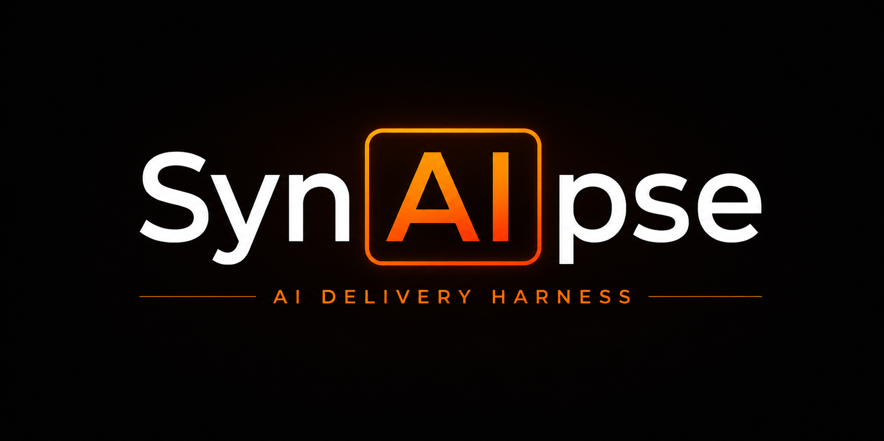

# SynAIpse

AI Delivery Harness for evidence-backed agentic software delivery.

Status: [CircleCI main](https://app.circleci.com/pipelines/github/jscraik/coding-harness?branch=main) | [npm package](https://www.npmjs.com/package/@brainwav/coding-harness) | [Apache-2.0 license](LICENSE) | [OpenSSF Scorecard](https://scorecard.dev/viewer/?uri=github.com/jscraik/coding-harness)



SynAIpse is the AI Delivery Harness implemented by this repository and the `@brainwav/coding-harness` package. It gives AI-assisted repositories a small command surface for orientation, local verification, review policy, CI migration, durable memory, and evidence-backed handoff.

Short version: thin surface, strong guardrails, durable memory,
simplicity/minimalism, self improvement, professional output.

SynAIpse exists to let a solo developer with limited cognitive bandwidth
orchestrate agentic software work to professional standards through compact
orientation, executable guardrails, durable memory, and evidence-based handoff.
Its primary metric is PR lead time from open to merge, and its primary
bottleneck is the review and rework loop.
The coding-harness repository remains the current package, CLI, and governance
contract implementation boundary.
The weekly reviewed status surface for that contract is
[docs/roadmap/agent-first-status.md](./docs/roadmap/agent-first-status.md).

## Table of Contents

- [Start Here](#start-here)
- [What It Does](#what-it-does)
- [Install](#install)
- [Use It](#use-it)
- [For Contributors](#for-contributors)
- [Where To Go Next](#where-to-go-next)

## Start Here

Pick the job that matches your situation; the reference links can wait until you need them.

| Job                           | First command                    | Then read                                |
| ----------------------------- | -------------------------------- | ---------------------------------------- |
| Agent in an existing repo     | `harness orient --json`          | [Use It](#use-it)                        |
| Human trying harness          | `harness init --dry-run`         | [Install](#install)                      |
| Solo or small-team adopter    | `harness init --minimal --track` | [Lite adoption](#lite-adoption)          |
| Maintainer changing this repo | `AGENTS.md`                      | [For Contributors](#for-contributors)    |
| Expert looking for commands   | `harness commands --json`        | [CLI reference](./docs/cli-reference.md) |

The cold-start command is read-only and bundles the context a fresh agent needs
without dumping raw artifacts:

```bash
harness orient --json
```

When working from a source checkout, build the local package first, then run the
public command through the workspace-linked binary:

```bash
pnpm build
pnpm exec harness orient --json
```

Use `harness next --json` when you only need the next safe action.

For current-tree development probes before a build, the TypeScript entrypoint
also accepts a leading `harness` token so displayed recommendations can be
replayed without manual rewriting:

```bash
node --import tsx src/cli.ts harness check --json
```

## What It Does

SynAIpse is the AI Delivery Harness around AI coding agents. It is not the agent runtime and it does not replace human review.

It helps a repository answer five practical questions:

- **What should the agent read and do next?** `harness orient --json` exposes the cold-start context rail, while `harness next --json` turns local state into a safe next-command recommendation.
- **Is this repo ready for agent work?** `agent-readiness`, `init`, `check`, `doctor`, `health`, and `contract validate` expose setup gaps, stale orientation context, and missing machine-readable policy.
- **What must pass before handoff?** `verify-work`, `docs-gate`, `review-gate`, `plan-gate`, and related gates make proof explicit.
- **Can we change CI or policy without guessing?** `ci-migrate`, branch-protection sync, rollback metadata, and parity checks keep migration reversible.
- **Did we learn anything durable?** Project Brain, Local Memory, learning gates, and review-context tooling turn repeated steering into guardrails instead of repeated reminders.

The repository's merge policy keeps required status checks and code scanning as
separate lanes: branch protection requires `pr-pipeline`, `security-scan`,
and `CodeRabbit`, while public code-scanning rules require CodeQL results
from `.github/workflows/codeql.yml`.

The product bar is simple: a dropped-in agent should diagnose, bootstrap, validate, and explain blockers without the user wiring the operating system by hand.

## Install

Published package usage requires registry access to `@brainwav/coding-harness`.

```bash
pnpm add -g @brainwav/coding-harness
harness --help
```

If your team uses `mise`, install the package through the pinned npm tool flow:

```bash
mise install -g npm:@brainwav/coding-harness
```

Then preview the scaffold before writing files:

```bash
harness init --dry-run
```

**Expected:** File list preview showing harness.contract.json, .harness/ directory, and scaffold files.
**On failure:** Inspect diff output for missing/unexpected files (developer); re-run with `--verbose` for diagnostics (developer).

JSON dry-runs include a `dryRunPlan` advisory object with the selected profile,
planned create/skip counts, a risk score, a risk level, and a recommendation.
Treat `riskLevel: "high"` as a review checkpoint before applying writes; it is
not npm publication, hosted CI, review, or merge-readiness proof.

Brownfield repositories may contain relative symlinked directories inside the
repo, for example `scripts -> Infrastructure/scripts`. Harness accepts those
only when the symlink target resolves inside the repository. Absolute symlinks
and symlink escapes remain blocked before dry-runs, updates, or tracked writes
can follow them.

Apply the standard scaffold only after the preview looks right:

```bash
harness init --track
harness contract validate
harness health --json
```

**Expected:** `harness init --track` creates `harness.contract.json`, the
`.harness/` control plane, a logical project-context reference, and a
GitBook-compatible `docs/public/` surface. `contract validate` reports zero
validation errors; `node scripts/check-gitbook-readiness.mjs` checks the public
documentation boundary; `health --json` reports repository readiness checks.
**On failure:** For init issues, check file permissions and inspect validation output (developer); for health failures, check service logs or retry health checks (infra).

`harness init` writes a valid `memory.json` even for repositories without a
`package.json` name by using the target directory name as the repo fallback.
Generated environment checks require the harness-supported Python and uv
toolchain, but they do not require Ralph.

### Lite Adoption

Use lite mode when you want the smallest useful contract first.

```bash
harness init --minimal --track
harness contract init --preset lite --force
harness contract validate
harness check --json
```

**Expected:** `init --minimal --track` creates minimal harness.contract.json; `contract init --preset lite --force` overwrites contract with lite preset (note: `--force` skips confirmation and replaces existing contract); `contract validate` passes with zero errors; `check --json` output contains readiness status.
**On failure:** Common causes include conflicting existing contracts (remove or back up first), permission issues (check file ownership), or validation errors (inspect output and fix contract schema); developer owns remediation.

Upgrade from lite to the standard policy set when the team is ready:

```bash
harness contract init --preset standard --force
harness contract validate
```

**Expected:** `contract init --preset standard --force` updates harness.contract.json to standard preset (note: `--force` replaces existing contract); `contract validate` passes.
**On failure:** Check for validation errors in output and verify contract schema (developer).

## Use It

### Command Index

This index names every callable top-level command. Use
[docs/cli-reference.md](./docs/cli-reference.md) for flags, examples, and
machine-readable command metadata.

Agents should start with `harness orient --json` for cold-start context, use
`harness next --json` for the next actionable step, and use
`harness commands --json` for command discovery. The full index
below is an expert reference, not the first surface an agent needs to understand.

The installed-package portability canary for this agent surface is
`node --import tsx scripts/run-harness-evals.mjs --scenario package-installed-downstream-canary`.
It packs the current harness package, runs public `harness ... --json` commands
from a downstream repository cwd, and records structured missing-evidence
packets instead of requiring source-checkout package scripts. This is local
installed-command portability proof, not npm publication, hosted CI, review, or
merge-readiness proof.

| Command                         | Reference                                           |
| ------------------------------- | --------------------------------------------------- |
| `agent-readiness`               | [CLI reference](./docs/cli-reference.md)            |
| `agent-native-ratchets`         | [CLI reference](./docs/cli-reference.md)            |
| `agent-rework`                  | [CLI reference](./docs/cli-reference.md)            |
| `artifact-gate`                 | [CLI reference](./docs/cli-reference.md)            |
| `artifact-routine`              | [CLI reference](./docs/cli-reference.md)            |
| `audit`                         | [CLI reference](./docs/cli-reference.md)            |
| `automation-run`                | [CLI reference](./docs/cli-reference.md)            |
| `blast-radius`                  | [CLI reference](./docs/cli-reference.md)            |
| `brain`                         | [CLI reference](./docs/cli-reference.md)            |
| `brainstorm-gate`               | [CLI reference](./docs/cli-reference.md)            |
| `branch-protect`                | [CLI reference](./docs/cli-reference.md)            |
| `check`                         | [CLI reference](./docs/cli-reference.md)            |
| `check-authz`                   | [CLI reference](./docs/cli-reference.md)            |
| `check-environment`             | [CLI reference](./docs/cli-reference.md)            |
| `ci-migrate`                    | [CLI reference](./docs/cli-reference.md)            |
| `ci-ownership-gate`             | [CLI reference](./docs/cli-reference.md)            |
| `commands`                      | [CLI reference](./docs/cli-reference.md)            |
| `context`                       | [CLI reference](./docs/cli-reference.md)            |
| `context-health`                | [CLI reference](./docs/cli-reference.md)            |
| `contract`                      | [CLI reference](./docs/cli-reference.md)            |
| `decision-request`              | [CLI reference](./docs/cli-reference.md)            |
| `diff-budget`                   | [CLI reference](./docs/cli-reference.md)            |
| `docs-gate`                     | [CLI reference](./docs/cli-reference.md)            |
| `doctor`                        | [CLI reference](./docs/cli-reference.md)            |
| `drift-gate`                    | [CLI reference](./docs/cli-reference.md)            |
| `eject`                         | [CLI reference](./docs/cli-reference.md)            |
| `evidence-verify`               | [CLI reference](./docs/cli-reference.md)            |
| `feedback-loop-audit`           | [CLI reference](./docs/cli-reference.md)            |
| `fleet-plan`                    | [CLI reference](./docs/cli-reference.md)            |
| `fitness`                       | [CLI contract](./docs/cli-specs/harness-fitness.md) |
| `gap-case`                      | [CLI reference](./docs/cli-reference.md)            |
| `gardener`                      | [CLI reference](./docs/cli-reference.md)            |
| `governance-decision-surface`   | [CLI reference](./docs/cli-reference.md)            |
| `health`                        | [CLI reference](./docs/cli-reference.md)            |
| `index-context`                 | [CLI reference](./docs/cli-reference.md)            |
| `init`                          | [CLI reference](./docs/cli-reference.md)            |
| `learnings`                     | [CLI reference](./docs/cli-reference.md)            |
| `license-gate`                  | [CLI reference](./docs/cli-reference.md)            |
| `linear`                        | [CLI reference](./docs/cli-reference.md)            |
| `linear-gate`                   | [CLI reference](./docs/cli-reference.md)            |
| `local-memory-preflight`        | [CLI reference](./docs/cli-reference.md)            |
| `memory-gate`                   | [CLI reference](./docs/cli-reference.md)            |
| `next`                          | [CLI reference](./docs/cli-reference.md)            |
| `north-star-feedback`           | [CLI reference](./docs/cli-reference.md)            |
| `observability-gate`            | [CLI reference](./docs/cli-reference.md)            |
| `org-audit`                     | [CLI reference](./docs/cli-reference.md)            |
| `orient`                        | [CLI reference](./docs/cli-reference.md)            |
| `pattern-scope`                 | [CLI reference](./docs/cli-reference.md)            |
| `pilot-evaluate`                | [CLI reference](./docs/cli-reference.md)            |
| `pilot-rollback`                | [CLI reference](./docs/cli-reference.md)            |
| `plan-gate`                     | [CLI reference](./docs/cli-reference.md)            |
| `policy-gate`                   | [CLI reference](./docs/cli-reference.md)            |
| `pr-closeout`                   | [CLI reference](./docs/cli-reference.md)            |
| `pr-template-gate`              | [CLI reference](./docs/cli-reference.md)            |
| `preflight-gate`                | [CLI reference](./docs/cli-reference.md)            |
| `preset`                        | [CLI reference](./docs/cli-reference.md)            |
| `prompt-context-drift:validate` | [CLI reference](./docs/cli-reference.md)            |
| `prompt-context-drift:write`    | [CLI reference](./docs/cli-reference.md)            |
| `prompt-gate`                   | [CLI reference](./docs/cli-reference.md)            |
| `remediate`                     | [CLI reference](./docs/cli-reference.md)            |
| `replay`                        | [CLI reference](./docs/cli-reference.md)            |
| `review-context`                | [CLI reference](./docs/cli-reference.md)            |
| `review-gate`                   | [CLI reference](./docs/cli-reference.md)            |
| `reviewer-decision`             | [CLI reference](./docs/cli-reference.md)            |
| `risk-tier`                     | [CLI reference](./docs/cli-reference.md)            |
| `rule-lifecycle-gate`           | [CLI reference](./docs/cli-reference.md)            |
| `runtime-budget`                | [CLI reference](./docs/cli-reference.md)            |
| `runtime-card`                  | [CLI reference](./docs/cli-reference.md)            |
| `search`                        | [CLI reference](./docs/cli-reference.md)            |
| `session-context`               | [CLI reference](./docs/cli-reference.md)            |
| `session-distill`               | [CLI reference](./docs/cli-reference.md)            |
| `silent-error`                  | [CLI reference](./docs/cli-reference.md)            |
| `simulate`                      | [CLI reference](./docs/cli-reference.md)            |
| `source-outline`                | [CLI reference](./docs/cli-reference.md)            |
| `symphony-check`                | [CLI reference](./docs/cli-reference.md)            |
| `tooling-audit`                 | [CLI reference](./docs/cli-reference.md)            |
| `ui:explore`                    | [CLI reference](./docs/cli-reference.md)            |
| `ui:fast`                       | [CLI reference](./docs/cli-reference.md)            |
| `ui:verify`                     | [CLI reference](./docs/cli-reference.md)            |
| `upgrade`                       | [CLI reference](./docs/cli-reference.md)            |
| `validation-plan`               | [CLI reference](./docs/cli-reference.md)            |
| `verify-coderabbit`             | [CLI reference](./docs/cli-reference.md)            |
| `verify-work`                   | [CLI reference](./docs/cli-reference.md)            |
| `workflow:generate`             | [CLI reference](./docs/cli-reference.md)            |

### Bootstrap A Repository

```bash
harness init --dry-run
harness init --track
harness contract validate
harness health --json
```

**Expected:** `harness init --dry-run` shows file list preview; `harness init --track` creates harness.contract.json, .harness/ directory, and scaffold files; `harness contract validate` passes with zero errors; `harness health --json` reports all readiness checks green.
**On failure:** For init or validation failures, inspect output and check file permissions (developer); for health failures, verify service availability or retry checks (infra/developer).

Use this when a repository needs harness-managed contracts, workflow scaffolding, review policy surfaces, repo-local verification scripts, and rollback metadata.
Generated CircleCI scaffolds include `scripts/resolve-circleci-pr-ref.sh` so
`pr-template` and `linear-gate` share one bounded PR-context lookup before
running governance gates. Generated validation scaffolds include
`scripts/check-node-engine.mjs`; when an ambient shell uses an older Node than
the repository requires, the checker retries through the repo-pinned mise Node
before failing closed.

### Start Work On An Issue

```bash
harness linear prepare --issue <KEY>
harness preflight-gate --contract harness.contract.json --files <changed-files> --admission-file artifacts/admission/declaration.json
harness policy-gate --contract harness.contract.json --files <changed-files>
harness blast-radius --files <changed-files> --json
```

**Expected outcomes:**

- `harness linear prepare`: Metadata printed for issue KEY, including the suggested branch, PR title, link line, closing line, and PR body. It does not create a git branch or mutate Linear.
- `harness preflight-gate`: Admission declaration written to artifacts/admission/declaration.json; exits 0 on success, non-zero on gate failure.
- `harness policy-gate`: Policy checks applied to changed files; exits 0 on success, non-zero on policy violation.
- `harness blast-radius --json`: File-level impact classification JSON output showing change scope and affected areas.

Use this when you need branch naming metadata, traceability text, and file-scoped gates before implementation.

### Submit A Change For Review

```bash
harness docs-gate --mode advisory --json
pnpm docs:archive-candidates
pnpm --silent docs:archive-candidates -- --json
harness plan-gate --require-plan-id --require-traceability --json
harness review-gate --token "$GITHUB_TOKEN" --owner <owner> --repo <repo> --pr <number> --sha <head-sha>
harness verify-coderabbit --json
```

**Expected outcomes:**

- `harness docs-gate`: Advisory mode reports doc drift without blocking (exit 0).
- `pnpm docs:archive-candidates`: Emits an advisory-only stale-document candidate report; it never archives, moves, deletes, demotes, or rewrites files.
- Generated documentation projections are counted as ignored files, not repair debt; active-route JSON artifacts are valid when tracked, non-empty, and parseable.
- `pnpm --silent docs:archive-candidates -- --json`: Emits clean `docs-archive-candidates-report/v1` JSON for docs-gate and review evidence without package-runner banner text on stdout.
- `harness plan-gate`: Confirms plan-id and traceability metadata present; exits 0 on success, non-zero if missing.
- `harness review-gate`: Verifies required reviewers and approval state; exits 0 on success, non-zero on missing approvals.
- `harness verify-coderabbit`: Returns JSON success/validation status.

Use this when a PR needs local proof, review wiring checks, and traceability before handoff. See [Validation](./docs/agents/04-validation.md) for closeout rules.

### Migrate CI With Rollback

```bash
harness ci-migrate prepare --provider circleci --dry-run
harness ci-migrate prepare --provider circleci --snapshot <snapshot-id>
harness ci-migrate verify --snapshot <snapshot-id>
harness ci-migrate commit --snapshot <snapshot-id>
```

Use this when CI migration needs proof, parity checks, branch-protection sync, and an abort path.

## For Contributors

This README is the product front door, not the operator policy surface.

Use these files for contribution and agent-operating rules:

- [AGENTS.md](./AGENTS.md) for mandatory repo guidance, startup workflow, quality checks, and repo workflow.
- [Instruction map](./docs/agents/01-instruction-map.md) for routing into the right operator doc.
- [Tooling policy](./docs/agents/02-tooling-policy.md) for commands and environment setup.
- [Validation](./docs/agents/04-validation.md) for local proof and gate selection.
- [Security and governance](./docs/agents/06-security-and-governance.md) for secrets, policy, and trust boundaries.

`pnpm check` includes `pnpm types:check`. Contributor and CI environments
therefore need the repository-pinned `uv` tool available through `.mise.toml`
so Python/Pydantic artifact-contract validation runs as part of the standard
quality gate.

PR throughput changes should keep expensive and static validation lanes
separate without weakening the proof contract: `pnpm test:ci` owns the full
Vitest lane, `pnpm test:related` keeps changed-source coverage explicit, and
`pnpm check:static` owns the non-Vitest static aggregate.

Manual private-npm release workflow inputs cross into shell steps through named
environment variables before validation. Do not interpolate
`github.event.inputs.*` expressions directly inside release shell bodies.

Use `bash scripts/run-prek.sh <args>` for direct `prek` operations in this
repository. The wrapper pins `PREK_HOME` to the worktree cache so hook setup and
push triage do not depend on a writable home-directory cache.

Installed `prek` hook entries call leaf adapters at
`scripts/hook-pre-commit.sh` and `scripts/hook-pre-push.sh`. The Make targets
`make hooks-pre-commit` and `make hooks-pre-push` remain manual wrappers
around those adapters for local operator use.

Generated pre-commit adapters keep
`bash ./scripts/validate-codestyle.sh --fast` between codestyle parity and the
lint/typecheck gates. Generated hook package-script commands follow the detected
package manager, so npm and yarn repositories do not receive pnpm-only hook
commands.

The repo-owned Semgrep security lane reuses a worktree-local scanner cache only
after an executable `pysemgrep` or `semgrep --version` probe passes. Cache keys
include the Python major/minor runtime so stale metadata or ABI-mismatched
site-packages cannot satisfy the security scan.

## Where To Go Next

- [Quickstart](./docs/agents/quickstart.md) for the agent-native loop and local verification path.
- [CLI reference](./docs/cli-reference.md) for the full command catalog.
- [Advanced workflows](./docs/advanced-workflows.md) for deeper rollout and migration paths.
- [Docs index](./docs/README.md) for governed documentation layers.
- [Architecture](./ARCHITECTURE.md) for source boundaries and invariants.
- [AGENTS.md](./AGENTS.md) and [docs/agents/](./docs/agents/) for operator policy.
- [North star](./docs/roadmap/north-star.md) and [agent-first status](./docs/roadmap/agent-first-status.md) for product direction.
- [Trust artifact examples](./docs/examples/trust-artifacts/) for sample outputs.
- [Packaged Codex skill](./.agents/skills/coding-harness/SKILL.md) for downstream agent instructions.

Issue intake is Linear-first for this repository: use the [coding-harness project](https://linear.app/jscraik/project/coding-harness-bb735dbbda79).
