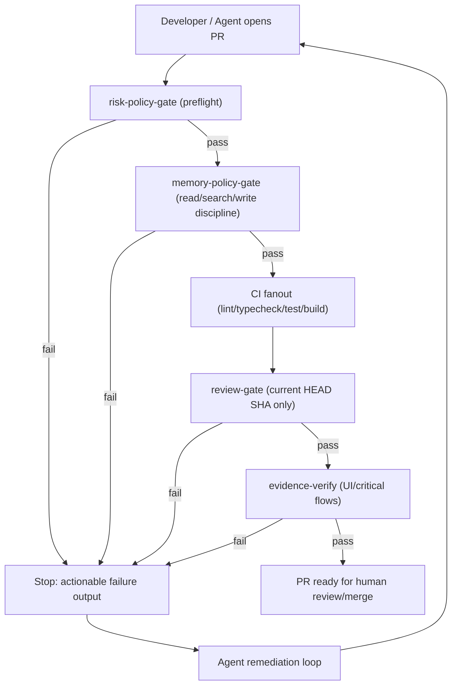

# Coding Harness Implementation Plan (Agent-First)

## Table of Contents

- [1) What this harness is](#1-what-this-harness-is)
- [2) Core operating model](#2-core-operating-model)
- [3) Control-plane architecture](#3-control-plane-architecture)
- [4) Single machine-readable contract](#4-single-machine-readable-contract)
- [9) Repository layout](#9-repository-layout-coding-harness)
- [10) Phase-by-phase execution plan](#10-phase-by-phase-execution-plan)
- [11) Test strategy](#11-test-strategy)
- [12) Acceptance criteria](#12-acceptance-criteria)
- [14) Rollout sequence](#14-rollout-sequence)
- [19) Deterministic PR loop](#19-deterministic-pr-loop-aligned-to-provided-diagram)
- [22) Observability and safety constraints](#22-observability-and-safety-constraints)
- [26) Public interface additions](#26-public-interface-additions-harness-cli--contract)
- [27) Acceptance criteria additions (post-review)](#27-acceptance-criteria-additions-post-review)
- [28) Test scenarios added after review](#28-test-scenarios-added-after-review)
- [29) Local-memory integration policy](#29-local-memory-integration-policy-signal--noise)
- [30) Operator workflow: brainstorm → plan → execute](#30-operator-workflow-brainstorm--plan--execute)
- [31) Source alignment notes](#31-source-alignment-notes)
- [32) Planning workflow contract (`/workflows:plan`)](#32-planning-workflow-contract-workflowsplan)
- [33) Gap analysis decisions](#33-gap-analysis-decisions-2026-02-22)
- [34) Implementation status](#34-implementation-status)
- [35) Roadmap status matrix](#35-roadmap-status-matrix)

## 1) What this harness is

This repository is a **control plane** for agentic development.  
It does not ship product features itself. It ships:

- a machine-readable policy contract,
- deterministic CI workflows,
- review/evidence gates,
- installable templates for new/existing repos,
- recurring maintenance automation.

The goal is simple: **agents can implement and self-validate changes, while humans retain merge authority**.

---

## 2) Core operating model

- **Humans steer**: goals, scope, risk tolerance, acceptance criteria.
- **Agents execute**: coding, tests, docs updates, remediation loops.
- **Repo is source of truth**: policy + checks + runbooks live in versioned files.
- **Fail fast**: no silent error handling, no stale review evidence, no soft-pass policy.

---

## 3) Control-plane architecture



---

## 4) Single machine-readable contract

Each target repo gets `harness.contract.json`:

- `riskTierRules`: map paths to risk tiers.
- `mergePolicy`: required checks per tier.
- `docsDriftRules`: required docs updates when control-plane paths change (path-to-doc mapping).
- `reviewPolicy`: required code-review-agent check-run name, SHA matching, timeout, and stale-state behavior.
  - `timeoutSeconds`: default 600 (10 minutes)
  - `timeoutAction`: "fail" (fail PR on timeout)
- `evidencePolicy`: required browser evidence for UI/critical flows.
- `diffBudget`: default max files touched and max net LOC, plus approved override mechanism.
- `uiLoopPolicy`: fast/verify/explore commands and SLO targets.
- `runtimePolicy`: required runtime baseline (Node `26.3.0` for the design-system target).
- `memoryPolicy`: session/domain/tag contract, read-first requirement, write limits, and closeout summary requirements.
- `memoryMaintenancePolicy`: validate/reflect cadence, unresolved-question SLA, and duplicate-noise thresholds.
- `memoryEvalPolicy`: trials per task, required reliability metrics, and fail thresholds.
- `observabilityPolicy`: OpenTelemetry integration config (deferred to Phase 5).
  - `provider`: "`otel`" | "logs" | "none"
  - `collectorEndpoint`: defaults to `http://localhost:4318`
- `packageManagerPolicy`: package manager detection and constraints.
  - `allowedManagers`: ["pnpm", "npm", "yarn"]
  - `requiredManager`: null (auto-detect from lock file)

### Why this matters
It removes ambiguity and prevents drift between scripts, workflows, docs, and enforcement logic.

---

## 5) Current-head SHA discipline (non-negotiable)

Review status is valid **only** if bound to the PR’s current `headSha`.

Required behavior:

1. Wait for review check run on `headSha`.
2. Ignore stale checks/comments for older SHAs.
3. Fail closed on timeout/non-success.
4. Require rerun after each push/synchronize.

This prevents merging against stale “green” review results.

---

## 6) Canonical rerun writer and de-duplication

Only one workflow can request reviewer reruns.

- Marker example: `<!-- review-agent-auto-rerun -->`
- Trigger token: `sha:<headSha>`
- De-duplication: never post duplicate rerun comment for same SHA.

This prevents race conditions and noisy PR threads.

---

## 7) Browser evidence as first-class proof

For UI/critical flow changes, CI requires machine-verifiable evidence artifact(s), not ad hoc screenshots.

Minimum assertions:
- expected flow IDs exist,
- expected entrypoint used,
- expected identity/account context present (if authenticated),
- artifact freshness and schema validity.

---

## 8) Installer strategy (new + existing repos)

`harness init` supports both:

- **new repo scaffold**: writes templates and baseline policy/workflows.
- **existing repo retrofit**: applies non-destructive patches + reports skips/conflicts.

Modes:
- `--dry-run`: print planned file operations only.
- `--mode new|existing`
- idempotent behavior: repeated runs should be safe.

---

## 9) Repository layout (coding-harness)

```text
/Users/jamiecraik/dev/coding-harness/
  AGENTS.md
  package.json
  src/
    cli.ts
    commands/
      init.ts
      risk-tier.ts
      policy-gate.ts
      review-gate.ts
      evidence-verify.ts
    lib/
      contract-loader.ts
      head-sha.ts
      check-run-client.ts
      rollback-manager.ts      # restore point creation/restoration
      package-manager.ts       # npm/yarn/pnpm detection abstraction
      retry-policy.ts          # API rate limit handling with backoff
  contracts/
    harness-contract.schema.json
    review-result.schema.json
    browser-evidence.schema.json
  templates/repo/
    harness.contract.json
    .github/workflows/
      risk-policy-gate.yml
      ci-pipeline.yml
      review-gate.yml
      harness-gardener.yml
    scripts/check
    docs/*
    .harness/
      restore-manifest.json    # tracks installer changes for rollback
  docs/
    index.md
    product-specs/index.md
    design-docs/index.md
    runbooks/index.md
    exec-plans/active/
    exec-plans/completed/
    references/index.md
    generated/
    QUALITY_SCORE.md
    brainstorms/              # brainstorm artifacts
    plans/                    # execution plan artifacts
```

---

## 10) Phase-by-phase execution plan

## Phase 1 — Bootstrap and deterministic local gate
Deliverables:
- TS/pnpm workspace,
- `pnpm check` umbrella command,
- lint/typecheck/test baseline,
- fail-fast lint rules for silent catch anti-patterns.

## Phase 2 — Contract and policy core
Deliverables:
- JSON schema + runtime validator,
- risk-tier resolver by changed files,
- docs drift enforcement,
- strict failure diagnostics.

## Phase 3 — GitHub workflow orchestration
Deliverables:
- preflight `risk-policy-gate`,
- CI fan-out dependent on preflight success,
- review gate with strict SHA discipline,
- mandatory canonical rerun comment writer (deduped).

## Phase 4 — Installability
Deliverables:
- `harness init` for new/existing repos,
- dry-run and migration report,
- idempotent template patching.

## Phase 5 — Evidence + observability hooks
Deliverables:
- browser evidence schema + verifier,
- script contracts for logs/metrics/traces query surfaces,
- policy enforcement for required evidence flows.

## Phase 6 — Recurring gardening
Deliverables:
- nightly docs/code gardener workflow,
- stale docs + broken links + generated docs refresh,
- quality score update and small PR automation.

## Phase 7 — Memory policy + eval hardening
Deliverables:
- local-memory policy gate + schema validation for memory summary artifacts,
- read-first/write-discipline/closeout enforcement for `codex/*` branches,
- reliability metrics (`pass^k`, tool errors, duplicate-memory rate, unresolved-question SLA).

---

## 11) Test strategy

### Approach (hybrid)
- **PR tests:** Real fixture repos in temp directories (fast, deterministic)
- **Nightly CI:** Integration tests against real GitHub (high confidence, catches API drift)
- **Unit tests:** Mocked tests for pure logic (contract validation, risk-tier engine)

### Unit tests
- contract parser/validator,
- risk-tier engine,
- SHA matching logic,
- dedupe logic for rerun requests,
- evidence manifest validator,
- rollback-manager restore point creation/restoration,
- package-manager detection from lock files,
- retry-policy exponential backoff with jitter.

### Integration tests
- workflow fixture tests for pass/fail matrix:
  - preflight fail blocks fan-out,
  - stale review artifact rejected,
  - missing evidence rejected.

### End-to-end dry-run tests
- installer new mode,
- installer existing mode with conflicts,
- idempotency (run twice, no drift),
- rollback restores target repo to pre-install state.

---

## 12) Acceptance criteria

A target repo is “harness-enabled” when:

1. `./scripts/check` mirrors CI and is deterministic.
2. preflight policy gate runs before expensive jobs.
3. review gate enforces current-head SHA.
4. required evidence is machine-validated for relevant changes.
5. installer can scaffold/retrofit safely.
6. nightly gardener opens actionable maintenance PRs.
7. silent error-handling anti-patterns are blocked.
8. rollback command restores target repo to pre-install state.
9. schema migration runs automatically with user-visible log.
10. harness detects and adapts to target package manager.
11. API rate limits trigger documented retry/backoff behavior.

---

## 13) Risks and mitigations

- **Risk:** policy too strict, slows adoption  
  **Mitigation:** tiered rollout with low/high risk defaults.

- **Risk:** noisy review rerun behavior  
  **Mitigation:** single canonical rerun writer + SHA dedupe.

- **Risk:** existing repos conflict with templates  
  **Mitigation:** retrofit dry-run + patch report + manual conflict markers.

- **Risk:** stale docs drift  
  **Mitigation:** scheduled gardener + required “last validated” metadata.

---

## 14) Rollout sequence

Week 1: bootstrap + check command + basic docs map  
Week 2: contract engine + risk gate + review gate scaffolds  
Week 3: installer for new/existing repos + idempotency tests  
Week 4: evidence verification + observability hooks  
Week 5: gardener automation + quality scoring + hardening  
Week 6: local-memory gate rollout (warn-only), then fail-closed enforcement

---

## 15) Defaults locked for v1

- CI provider: GitHub Actions
- Runtime: TypeScript + pnpm
- Node baseline for target rollout: Node 26.3.0
- Review signal: GitHub check run + JSON artifact
- Autonomy: agent drafts PR, human merges
- Scope: control-plane template (no product app code)

---

## 16) Initial production target: `/Users/jamiecraik/dev/design-system`

This harness will first be applied to the Design System repository at:

- `/Users/jamiecraik/dev/design-system`

Why this target first:
- documentation drift is currently the highest operational risk,
- the repo already uses CI checks, custom linters, and GitHub Actions,
- it is a strong candidate for agent-first frontend delivery loops.

### Frontend execution stack (v1)

The baseline UI factory loop for this target repo is:

- **Storybook** for component-level development and visual verification,
- **agent-browser** for accelerated agent-assisted implementation/iteration,
- **Codex 5.3 Spark** for high-throughput UI coding + refinement.

### Drift-control requirements for this target

For `/Users/jamiecraik/dev/design-system`, the harness must additionally enforce:

1. control-plane or component API changes require linked docs updates,
2. design-system token/component changes require Storybook evidence updates,
3. nightly gardener checks docs freshness and opens small drift-remediation PRs,
4. drift findings are machine-readable so agents can self-correct without human translation.

---

## 17) Current optimization focus (today): frontend UI feedback-loop speed

Current operator intent:
- prioritize **front-end UI iteration speed** with Codex CLI,
- reduce slow/kludgy feedback loops during component and interaction work,
- determine the best split of responsibilities across **Storybook**, **Playwright CLI**, and **agent-browser**.

### Problem statement

The current loop works but is too slow for high-frequency UI iteration.

### Tool-mix decision track (guided by `tooling.md`)

Baseline guidance from `/Users/jamiecraik/.codex/instructions/tooling.md`:
- Browser automation (agent): `agent-browser` primary.
- Browser automation (tests): `playwright` primary.

Harness application for `/Users/jamiecraik/dev/design-system`:
1. **Storybook = primary dev surface** for component-level rapid iteration.
2. **Playwright CLI = deterministic regression/evidence lane** for scripted assertions and CI artifacts.
3. **agent-browser = exploratory/debug lane** for fast manual-agent interaction and triage.

### Speed-focused implementation requirements

The harness should add a repeatable fast-loop protocol with explicit scripts:

1. `pnpm ui:fast` -> Storybook-first local development loop (minimal checks).
2. `pnpm ui:verify` -> short-cycle Playwright smoke suite with deterministic evidence (<2 min target).
3. `pnpm ui:explore` -> agent-browser exploratory snapshots/interaction diagnosis.
4. `pnpm check` -> full deterministic pre-PR parity gate.
5. Explicit script split between:
   - **fast loop** (`ui:fast`, `ui:explore`),
   - **pre-PR loop** (`ui:verify`, `check`).

### Measurement requirements (must be tracked)

Track and report in machine-readable form:
- median time from prompt -> visual feedback,
- median time from change -> pre-PR evidence pass,
- flaky run rate for UI checks,
- number of manual retries per task.

These metrics become inputs for harness tuning and gardener recommendations.

---

## 18) Fast UI iteration blueprint (Storybook + Playwright + agent-browser)

To reduce slow/kludgy frontend loops in `/Users/jamiecraik/dev/design-system`, adopt a strict three-lane model:

### Lane A — Build lane (fastest, default during coding)

Purpose: rapid visual iteration while coding with Codex CLI.

- Run Storybook as the primary surface.
- Restrict checks to component compile + targeted story render.
- No full E2E or expensive CI-equivalent checks in this lane.

Target: **sub-30s visual feedback** for most UI edits.

### Lane B — Verify lane (deterministic local confidence)

Purpose: catch regressions before opening/updating PR.

- Run Playwright CLI against Storybook stories/pages with deterministic scripts.
- Keep a short smoke pack for common critical flows.
- Emit machine-readable artifacts used by the harness evidence gate.

Target: **<2 minute pre-PR verification** for smoke suite.

### Lane C — Explore lane (triage and diagnosis)

Purpose: fast exploratory debugging for hard-to-script UI issues.

- Use `agent-browser` for interactive state inspection and reproduction.
- Capture snapshots/logs used to refine deterministic Playwright tests.
- Avoid using this lane as the primary regression signal.

Target: reduce human debugging overhead and convert discoveries into deterministic checks.

### Decision policy for tool usage

1. Start in Storybook (Lane A).
2. Promote stable checks into Playwright smoke/regression (Lane B).
3. Use agent-browser only when deterministic tests are missing or failing to explain behavior (Lane C).
4. Any recurring exploratory failure must be converted into a deterministic Playwright check within the same PR or follow-up harness-gap issue.

---

## 19) Deterministic PR loop (aligned to provided diagram)

The harness will enforce this order:

1. PR opened/synchronized.
2. Risk classifier computes required checks from changed files.
3. Risk-policy gate preflight runs first.
4. Wait for code-review agent on current head SHA.
5. If findings exist: remediation agent patches branch and requests one rerun per SHA.
6. If no actionable findings: optional resolve bot-only threads.
7. Start expensive CI fan-out only after preflight/review gates pass.
8. If all required checks pass: human review + merge policy.
9. If checks fail: fix and rerun from synchronized head.

### Non-negotiable loop guards

- Current-head SHA discipline for all review/evidence signals.
- Single canonical rerun-comment writer with SHA dedupe.
- No bypass of risk-policy gate or required evidence checks.
- No silent failures; failed gates must return actionable diagnostics.

---

## 20) Solo-dev leverage rules (added from operator field notes)

### 20.1 Prompts are versioned assets

Add and maintain:
- `/Users/jamiecraik/dev/config/codex/prompts/workflow-brainstorm.md` (WHAT-phase prompt; mandatory for ambiguous work before planning),
- `/Users/jamiecraik/dev/config/codex/prompts/workflow-plan.md` (HOW-phase prompt; mandatory plan generation workflow),
- `docs/prompts/feature_template.md`
- `docs/prompts/bugfix_template.md`
- `docs/prompts/refactor_template.md`
- `docs/prompts/release_template.md`

Each template must include:
- required inputs (constraints + acceptance criteria),
- expected outputs (files touched, tests/docs/evidence),
- explicit “Do not do” list (unnecessary deps, over-abstraction, silent catches).

### 20.2 Diff-shape guardrails

Default PR budget:
- <= 10 files touched,
- <= 400 LOC net change.

If exceeded, require explicit justification and split plan.

### 20.3 Smallest acceptable solution bias

Default rule:
- implement simplest working version first,
- add complexity only after failing tests or explicit requirements.

### 20.4 Anti-goals to prevent architecture drift

Explicitly disallow by default:
- plugin frameworks without clear need,
- DI containers,
- repository pattern unless boundary-enforcing,
- generic `BaseService` inheritance layers,
- exception catches used only to keep app running.

---

## 21) Reliability + contracts hardening additions

### 21.1 Cheap staging realism

Target repos should expose:
- `./scripts/stage up`
- `./scripts/stage seed`
- `./scripts/stage smoke`

Purpose: make production-like validation cheap enough for daily use by agent + human.

### 21.2 Interface contracts are first-class

Require contract artifacts in `docs/generated/`:
- OpenAPI/GraphQL snapshots (where applicable),
- internal contract tests for schema, error semantics, idempotency.

Policy: if a contract changes, snapshot + tests must change in same PR.

### 21.3 Blast radius map

Add `docs/architecture/blast-radius.md` with deterministic mappings:
- touch X -> run Y checks,
- touch auth -> run auth flows,
- touch migrations -> run migration invariants,
- touch orchestration -> run retry/load checks.

### 21.4 Retries as documented policy

Add `docs/reliability/retries.md`:
- retry-capable operations,
- backoff strategy,
- max attempts,
- idempotency requirements,
- fatal vs transient error classes.

Agent rule: retries implemented only if documented in this file.

### 21.5 Deterministic replay

Require execution tracing with stable IDs and replay command:
- `./scripts/replay <trace-id>`

Initial scope can be minimal, but trace capture/replay must be part of harness roadmap.

---

## 22) Observability and safety constraints

### 22.1 Observability as API

Critical flows must emit:
- one structured start log,
- one structured end log,
- one structured error log.

Also require consistent span names/attributes and stable-cardinality metrics.

### 22.2 Cardinality tripwires

Enforce:
- never place raw prompts/user input in metric labels,
- truncate or hash high-cardinality strings,
- gate raw payload logging behind explicit debug flags,
- fail checks on obvious cardinality explosions where detectable.

### 22.3 Security floor (80/20 baseline)

Every target repo should include:
- secret scanning in CI,
- dependency vulnerability scanning,
- `SECURITY.md` covering auth boundaries, token handling, and log redaction.

---

## 23) Review discipline and operator attention policy

### 23.1 Multi-pass model review (single tooling, multiple roles)

For meaningful changes run three passes:
1. Builder pass: implement + tests.
2. Reviewer pass: assume bug exists; find minimal fix.
3. Red-team pass: enumerate production failure modes.

### 23.2 Failure-mode memory

Maintain `docs/runbooks/failure-modes.md` with:
- recurring failure pattern,
- detection method,
- immediate fix,
- long-term prevention (lint/CI/docs/script).

### 23.3 Attention budgeting rules

Human review focuses on:
- invariants,
- diff shape,
- proof artifacts (tests, repro, telemetry deltas),
not line-by-line code review by default.

### 23.4 Unknowns must stop and ask

Spec templates and AGENTS guidance must include:
- “Unknowns / Decisions needed”,
- “Do not invent requirements; stop and ask when unclear.”
- for ambiguous feature requests, require brainstorm handoff before implementation planning.

### 23.5 Release notes first

Adopt release discipline:
- draft release-note bullets before implementation,
- implement to match declared deltas,
- include changelog updates in PR.

---

## 24) Priority additions to implement first (top leverage)

1. Prompt templates (`docs/prompts/*`) and enforced usage.
2. Diff limits + smallest-acceptable-solution policy checks.
3. Blast radius map + deterministic required-check routing.
4. Deterministic replay foundation (`trace-id` + replay command).
5. Cardinality tripwires in observability policy and checks.
6. Local-memory policy gate + weekly memory maintenance checks.

---

## 25) Design-system migration delta (retrofit, not greenfield)

For `/Users/jamiecraik/dev/design-system`, rollout is a retrofit of existing workflows and scripts.

Migration sequence:
1. Add preflight `risk-policy-gate` and required `review-gate` jobs.
2. Rewire expensive CI fan-out jobs to depend on preflight/review success.
3. Introduce `pnpm check` as local+CI parity command.
4. Add/standardize `ui:fast`, `ui:verify`, `ui:explore` command set.
5. Keep existing job coverage, but enforce deterministic ordering and SHA-bound review validity.

---

## 26) Public interface additions (harness CLI + contract)

### Contract additions
- `diffBudget`: `{ maxFilesTouched, maxNetLoc, overrideLabel }`
- `uiLoopPolicy`: `{ fastCommand, verifyCommand, exploreCommand, sloTargets }`
- `runtimePolicy`: `{ nodeVersion }`
- `memoryPolicy`: `{ enabled, provider, sessionIdTemplate, domain, requiredTags, maxObservationsPerStep, allowedLevels, requireStartRead, requireCloseoutSummary, forbiddenContentPatterns }`
- `memoryMaintenancePolicy`: `{ validateSchedule, reflectSchedule, questionSlaDays, duplicateThreshold }`
- `memoryEvalPolicy`: `{ trialsPerTask, requiredMetrics, passPowKThreshold }`

### CLI additions
- `harness enforce-diff-budget --base <sha> --head <sha>`
- `harness ui-loop-verify --mode fast|verify|explore`
- `harness docs-drift-check --base <sha> --head <sha>`
- `harness memory start --session <id> --domain <name> --area <module>`
- `harness memory record --type decision|bug|pattern|constraint|verification --level observation|learning|pattern|schema --note <text>`
- `harness memory close --session <id>`
- `harness memory lint --input <memory-summary.json>`
- `harness memory maintenance --validate --reflect --report`

---

## 27) Acceptance criteria additions (post-review)

A target repo is also considered harness-enabled only when:

1. `pnpm check` exists and is the canonical local parity gate.
2. Review-agent gate is required for all PRs and bound to current head SHA.
3. Node 26.3.0 baseline is green in CI and local development.
4. Diff budget guardrails are enforced or explicitly overridden with justification.
5. UI loop commands (`ui:fast`, `ui:verify`, `ui:explore`) are present and documented.
6. `memory-policy-gate` is required for `codex/*` branches and validates read-first behavior.
7. Memory writes use required session/domain/tag contracts and stay within write-volume limits.
8. Every agent task ends with one concise closeout memory summary (“what changed + why + verification”).
9. Secret/token/key patterns are blocked from memory artifacts and fail the gate.
10. Ambiguous feature work includes a brainstorm artifact (`docs/brainstorms/YYYY-MM-DD-<topic>-brainstorm.md`) before `/workflows:plan`.
11. Every planning run writes a dated plan artifact in `docs/plans/` before any handoff options are presented.
12. If a relevant brainstorm exists (<=14 days), plan frontmatter includes `origin:` and carries forward brainstorm decisions with explicit source references.

---

## 28) Test scenarios added after review

1. Diff budget violation blocks PR without override artifact.
2. Override path requires explicit justification metadata.
3. Stale review artifacts/comments for older SHAs are ignored.
4. Missing docs updates for mapped control-plane path changes block PR.
5. `ui:verify` must emit machine-readable evidence consumed by policy gate.
6. Node 26.3.0 compatibility checks pass for mergeability.
7. Replay command resolves and replays a recorded `trace-id` deterministically.
8. Missing `bootstrap(..., include_questions=true)` + `search(...)` at task start fails `memory-policy-gate`.
9. Memory writes above `maxObservationsPerStep` fail `memory-policy-gate`.
10. Missing required memory tags (`repo:*`, `area:*`, `type:*`) fails `memory-policy-gate`.
11. Missing closeout summary memory fails `memory-policy-gate`.
12. Secret-like content in memory payloads fails `memory-policy-gate`.
13. Unresolved memory questions older than SLA are reported by weekly maintenance.
14. Ambiguous feature request without a brainstorm document fails planning preflight.
15. Missing required plan artifact `docs/plans/YYYY-MM-DD-<type>-<descriptive-name>-plan.md` fails planning completion.
16. Relevant brainstorm found but missing `origin:` reference or dropped key decisions fails planning quality checks.

---

## 29) Local-memory integration policy (signal > noise)

Scope for initial rollout:
- `/Users/jamiecraik/dev/agent-skills`
- default domain: `agent_skills`
- default session format: `repo:agent-skills:<task-id>`

### 29.1 Start-of-task contract (read first)

Mandatory sequence before implementation:
1. `bootstrap(mode="minimal", include_questions=true, session_id="<session_id>")`
2. `search(...)` for prior decisions, patterns, and unresolved contradictions.

Policy: no coding starts until read-first succeeds.

### 29.2 During-task write discipline

Use `observe(...)` only for durable facts:
- decisions and invariants,
- root causes and verified fixes,
- constraints and interfaces,
- verified command/result pairs.

Hard limits:
- max `1–3` observations per meaningful step,
- required tags: `repo:<name>`, `area:<module>`, `type:decision|bug|pattern|constraint|verification`,
- never store secrets/keys/tokens/raw credentials.

Level progression:
- `observation` (raw fact) -> `learning` (generalized insight) -> `pattern/schema` (reusable rule).

### 29.3 Reasoning and knowledge hygiene

Use only when needed:
- `explain(...)` for causal ambiguity,
- `predict(...)` before risky changes,
- `counterfactual(...)` for incident analysis.

Promote graph quality with:
- `relate(...)` for causal links,
- `question(...)` for uncertainty/contradiction,
- `resolve(...)` when clarified,
- `reflect(...)` at milestones to convert notes into learnings.

### 29.4 Closeout and maintenance

Closeout requirements per task:
1. `validate(...)` + `status()`
2. exactly one summary observation: “what changed + why + verification”

Weekly maintenance workflow:
- run memory validation in dry-run mode,
- report duplicate noise, stale unresolved questions, and promotion backlog,
- open small remediation tasks for policy or documentation drift.

---

## 30) Operator workflow: brainstorm → plan → execute

To keep high signal and avoid overbuilding, the control-plane requires a strict operator workflow:

1. **Brainstorm (WHAT):**
   - Use `/Users/jamiecraik/dev/config/codex/prompts/workflow-brainstorm.md`.
   - Output: `docs/brainstorms/YYYY-MM-DD-<topic>-brainstorm.md`.
   - Rule: no implementation details; focus on scope, user value, constraints, decisions, and open questions.
   - Process contract:
     - assess requirement clarity first (skip brainstorming only if requirements are already concrete),
     - ask one question at a time,
     - research existing repo patterns lightly before proposing options,
     - propose 2–3 approach options with tradeoffs and a recommendation,
     - resolve open questions before handoff.

2. **Plan (HOW):**
   - Convert approved brainstorm into execution plan (`docs/exec-plans/active/...`).
   - Include acceptance criteria, risks, verification commands, and rollback strategy.

3. **Execute + verify:**
   - Agent executes in small diffs under policy gates (risk, memory, review, evidence).
   - Merge only after deterministic checks and human approval.

Guardrail:
- If requirements are already concrete, brainstorm may be skipped with explicit justification captured in the exec plan.

---

## 31) Source alignment notes

This implementation plan is aligned to:

1. **OpenAI harness engineering article**  
   `https://openai.com/index/harness-engineering/` (published February 11, 2026)
   - Humans steer, agents execute.
   - Repository knowledge as system of record (“map, not manual”).
   - Enforce taste/architecture with deterministic checks.
   - Treat entropy control (“garbage collection”) as ongoing maintenance.

2. **OpenAI App Server / harness protocol context**  
   `https://openai.com/index/unlocking-the-codex-harness/`
   - App Server protocol framing for Codex orchestration.
   - Tooling/integration discipline for approvals, runs, and lifecycle.

3. **OpenAI agent-loop runtime model**  
   `https://openai.com/index/unrolling-the-codex-agent-loop/`
   - Codex loop responsibilities (model + tools + context management).
   - Operational expectations for iterative execution and correction loops.

4. **OpenAI in-house agent operations reference**  
   `https://openai.com/index/inside-our-in-house-data-agent/`
   - Practical reference point for production agent workflows and operator controls.

5. **Local workflow-brainstorm prompt**  
   `/Users/jamiecraik/dev/config/codex/prompts/workflow-brainstorm.md`
   - Brainstorm precedes planning for ambiguous work.
   - Ask focused questions, converge on approach options, capture decisions.
   - Produce handoff artifact before `/workflows:plan`.

6. **This control-plane plan file**  
   `/Users/jamiecraik/dev/coding-harness/docs/HARNESS_IMPLEMENTATION_PLAN.md`
   - Central policy + architecture + rollout for harness adoption.

7. **Local planning workflow prompt**  
   `/Users/jamiecraik/dev/config/codex/prompts/workflow-plan.md`
   - Requires brainstorm-first carry-forward when available.
   - Requires local research, research decision, and plan artifact write-before-handoff.

---

## 32) Planning workflow contract (`/workflows:plan`)

All plan generation in this harness must follow `/Users/jamiecraik/dev/config/codex/prompts/workflow-plan.md`.

### 32.1 Brainstorm-aware planning gate

Before refinement questions:
1. check `docs/brainstorms/*.md`,
2. select relevant brainstorm(s) by semantic match and recency (<=14 days),
3. if multiple candidates, resolve selection explicitly.

If a relevant brainstorm exists:
- treat it as the origin document,
- carry forward key decisions, constraints, rejected alternatives, open questions, and scope boundaries,
- preserve source context with references to `docs/brainstorms/<file>.md`.

### 32.2 Research contract

Planning always runs local research first:
- repo patterns and AGENTS conventions,
- institutional learnings from `docs/solutions/`.

External research is conditional:
- always for high-risk topics (security, payments, external APIs, privacy),
- optional/skipped when strong local context already exists.

### 32.3 Plan quality contract

Required planning steps:
- issue structure and naming,
- SpecFlow analysis incorporation,
- explicit acceptance criteria,
- risks/dependencies/success metrics (detail level dependent).

Default detail level policy:
- **MORE** by default,
- **MINIMAL** for clearly small/scoped changes,
- **A LOT** only for major architectural/integration efforts.

### 32.4 Artifact and naming contract

Plan files are mandatory and must be written before options/handoff:
- directory: `docs/plans/`
- filename: `YYYY-MM-DD-<type>-<descriptive-name>-plan.md`
- examples:
  - `2026-01-15-feat-user-authentication-flow-plan.md`
  - `2026-02-03-fix-checkout-race-condition-plan.md`

When plan originates from brainstorm:
- include `origin: docs/brainstorms/YYYY-MM-DD-<topic>-brainstorm.md` in frontmatter,
- include brainstorm in Sources with carried-forward decisions.

---

## 33) Gap analysis decisions (2026-02-22)

The following decisions were identified through brainstorming and merged into this plan.

### 33.1 Rollback strategy
**Decision:** Full rollback support required

The `harness init` command must:
- Create a restore point before any modifications (`.harness/restore-manifest.json`)
- Support `harness init --rollback` to revert all changes
- Track all files created/modified in a manifest

**Rationale:** Users must be able to safely experiment with harness adoption without risking repository corruption.

### 33.2 Schema migration
**Decision:** Auto-migration when contract schema changes

When `harness.contract.json` schema evolves (v1 -> v2):
- Harness detects outdated contract version
- Auto-migrates with backwards-compatible defaults
- Logs migration changes for user review
- Preserves user customizations where possible

**Rationale:** Reduces friction for harness upgrades; manual migration creates adoption barriers.

### 33.3 Edge case: concurrent agent PRs
**Decision:** Use branch naming convention with agent ID

Branch format: `<type>/<agent-id>/<slug>` (e.g., `feat/agent-42/user-auth`)

This avoids lock file complexity and merge queue overhead. Revisit if scale becomes an issue.

### 33.4 Edge case: non-pnpm package managers
**Decision:** Detect from lock file, abstract operations

- Read `pnpm-lock.yaml`, `package-lock.json`, or `yarn.lock` to detect manager
- Abstract install/run commands behind `PackageManager` interface
- Harness internals remain pnpm-only

### 33.5 Edge case: agent timeout handling
**Decision:** 10 minute default, fail PR on timeout

Configured in `reviewPolicy` contract:
```json
{
  "reviewPolicy": {
    "timeoutSeconds": 600,
    "timeoutAction": "fail"
  }
}
```

### 33.6 Edge case: GitHub API rate limiting
**Decision:** Exponential backoff with jitter

Implemented in `retry-policy.ts`:
- Base delay: 1s
- Max delay: 60s
- Jitter: ±20%
- Max retries: 5

### 33.7 Open question: OpenTelemetry integration
**Status:** Defer to Phase 5 (Evidence + observability hooks)

User has an OpenTelemetry collector at `~/.agents/otel-collector/`. Explore direct emission vs. logs-only at that time.

---

## 34) Implementation status

| Phase | Status | Notes |
|-------|--------|-------|
| Phase 1: Bootstrap | ✅ Complete | Repository structure, build system, testing framework |
| Phase 2: Contract core | ✅ Complete | Contract parser, validator, risk-tier engine, policy gates |
| Phase 3: GitHub workflows | ✅ Complete | review-gate, policy-gate, SHA enforcement, GitHub client |
| Phase 4: Installability | ✅ Complete | init command with --dry-run, --track, --rollback, --migrate |
| Phase 5: Evidence + observability | ✅ Complete | evidence-verify command, gardener workflow |
| Phase 6: Gardening | ✅ Complete | nightly gardener workflow, stale docs, broken links |
| Phase 7: Memory policy | ✅ Complete | memory-gate command, branch enforcement, metrics tracking |

**All core acceptance criteria and optional Section 27 items implemented.**

### Section 27 Optional Enhancements Status

| Enhancement | Status |
|-------------|--------|
| Diff budget guardrails | ✅ Complete - `harness diff-budget` command |
| UI loop commands | ✅ Complete - `harness ui:fast`, `ui:verify`, `ui:explore` |
| Brainstorm/plan artifact workflow | ✅ Complete - `harness brainstorm-gate`, `plan-gate` commands |

## 35) Roadmap status matrix

For detailed roadmap claims vs implementation status, see the [Agent-First Implementation Status Matrix](roadmap/agent-first-status.md).

### Terminology notes

- **`policy-gate`** and **`risk-policy-gate`** are aliases for the same command; `risk-policy-gate` provides terminology parity with roadmap naming.
- **`preflight-gate`** refers to the pre-commit/pre-push policy enforcement layer.
- **Deferred items** (marked 📋) represent v2 scope or future iterations, not incomplete work.
- **Partial items** (marked 🔶) have core functionality implemented with gaps in edge cases or integration coverage.
