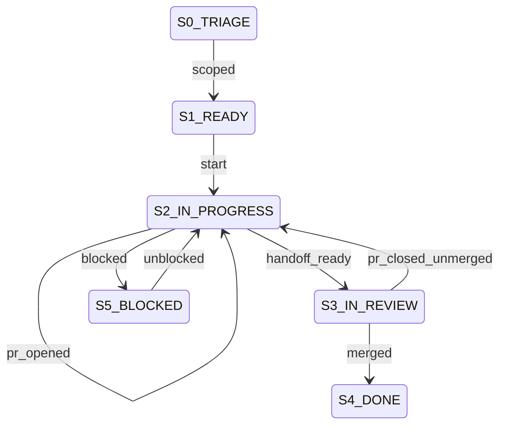

# Linear Production Workflow — Compact Operational Spec

## Table of Contents
- [Abbreviations](#abbreviations)
- [Metadata](#metadata)
- [Invariants](#invariants)
- [States](#states)
- [Transition Table (Canonical)](#transition-table-canonical)
- [State Diagram](#state-diagram)
- [Error Handling](#error-handling)
- [Idempotency](#idempotency)
- [Execution Modes](#execution-modes)
- [Dry-Run Simulation](#dry-run-simulation)
- [Observability Logs](#observability-logs)
- [Validation Checklist](#validation-checklist)

## Abbreviations
| Term | Definition |
| --- | --- |
| LI | Linear Issue |
| LK | Linear Key (e.g., JSC-37) |
| DoD | Definition of Done |
| PR | Pull Request |

## Metadata
| Field | Value |
| --- | --- |
| `owner` | `coding-harness-maintainers` |
| `max_duration` | `1 issue lifecycle` |
| `escalation` | `set Blocked marker with explicit unblock action` |

## Invariants
- Exactly one running LI progress thread per issue.
- Branch format is `codex/<lk>-<slug>`.
- Every issue keeps exactly one primary type label (`Bug|Feature|Improvement|Policy|Security`).
- `S2 IN_PROGRESS -> S3 IN_REVIEW` requires DoD pre-review checks.
- `pr_closed_unmerged` always routes back to active work.
- `In Review` handoff is blocked when CI provider posture is unsatisfied for the current migration stage.

## States
```txt
S0 TRIAGE (non-terminal)
S1 READY (non-terminal)
S2 IN_PROGRESS (non-terminal)
S3 IN_REVIEW (non-terminal)
S4 DONE (terminal)
S5 BLOCKED (non-terminal)
```

## Transition Table (Canonical)
`S | E | G | A | N`

| S | E | G | A | N |
| --- | --- | --- | --- | --- |
| `S0 TRIAGE` | `scoped` | issue has clear next action | move LI to ready queue | `S1 READY` |
| `S1 READY` | `start` | branch created with `codex/` + `LK` | `harness linear claim --issue <LK> --branch <name>` | `S2 IN_PROGRESS` |
| `S2 IN_PROGRESS` | `progress_tick` | always | update single running LI comment | `S2 IN_PROGRESS` |
| `S2 IN_PROGRESS` | `pr_opened` | PR URL available | attach PR URL to LI | `S2 IN_PROGRESS` |
| `S2 IN_PROGRESS` | `handoff_ready` | DoD pre-review checks pass | `harness linear handoff --issue <LK> --pr-url <url> --evidence-url <url[,url]>` | `S3 IN_REVIEW` |
| `S3 IN_REVIEW` | `merged` | required checks pass | `harness linear close --issue <LK> --pr-url <url>` | `S4 DONE` |
| `S3 IN_REVIEW` | `pr_closed_unmerged` | PR closed without merge | `harness linear claim --issue <LK> --state \"In Progress\" --no-assign` and add rationale note | `S2 IN_PROGRESS` |
| `S2 IN_PROGRESS` | `blocked` | missing auth, permission, or human input | add `Blocked` marker and unblock action | `S5 BLOCKED` |
| `S5 BLOCKED` | `unblocked` | dependency resolved | remove blocker marker and resume execution | `S2 IN_PROGRESS` |

Transition table is the source of truth.

## State Diagram


## Error Handling
- `VALIDATION_ERROR`
- `BLOCKED_DEPENDENCY`
- `POLICY_FAIL`
- `SYSTEM_ERROR`

## Idempotency
- Key: `<LK>|<state>|<event>|<pr_url?>`.
- Replayed `progress_tick` and `pr_opened` events upsert existing LI artifacts.
- Replayed `handoff_ready` must not duplicate evidence links/comments.

## Execution Modes
- `STRICT`
- `ADVISORY`

## Dry-Run Simulation
- No side effects: no stateful writes to Linear/GitHub.
- Guard evaluation and transition selection remain deterministic.
- Emit transition trace rows: `S,E,G,A,N,decision`.

## Observability Logs
```json
{
  "workflow_id": "linear-production-workflow",
  "transition_code": "S2:handoff_ready",
  "from_state": "S2 IN_PROGRESS",
  "to_state": "S3 IN_REVIEW",
  "correlation_id": "JSC-37:PR-123",
  "result": "success|blocked|failed"
}
```

## Validation Checklist
- non-terminal states require at least one transition
- events resolve deterministically
- failures route to fail/blocked states
- terminal states have no outbound transitions
- triage/apply runs enforce metadata threshold + WIP caps before promotion writes
- triage/apply runs add missing primary type labels unless `--no-type-label-sync` is set
