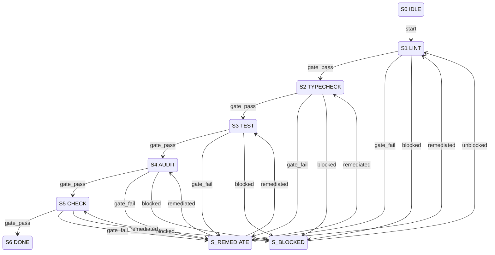

# Agent Testing Gates — Compact Operational Spec

## Table of Contents

- [1. Metadata](#1-metadata)
- [2. Errors](#2-errors)
- [3. States](#3-states)
- [4. Transition Table (Canonical) — S | E | G | A | N](#4-transition-table-canonical--s--e--g--a--n)
- [5. Invariants](#5-invariants)
- [6. Idempotency](#6-idempotency)
- [7. Mermaid State Diagram (Derived Strictly from Table)](#7-mermaid-state-diagram-derived-strictly-from-table)
- [8. Pseudocode (Executor)](#8-pseudocode-executor)
- [9. Log Schema](#9-log-schema)
- [10. Modes: STRICT | ADVISORY](#10-modes-strict--advisory)
- [11. Dry-Run Simulation](#11-dry-run-simulation)
- [12. Harness Assurance Acceptance Contract](#12-harness-assurance-acceptance-contract)
- [13. Enforcement Contract](#13-enforcement-contract)

## 1. Metadata

| Field          | Value                                             |
| -------------- | ------------------------------------------------- |
| `owner`        | `coding-harness-maintainers`                      |
| `max_duration` | `5 gates`                                         |
| `escalation`   | `Stop at first failure, require explicit restart` |

## 2. Errors

| Error                | Condition                                     | Routing                                 |
| -------------------- | --------------------------------------------- | --------------------------------------- |
| `VALIDATION_ERROR`   | Invalid command, malformed test configuration | Reject event (remain in current gate)   |
| `BLOCKED_DEPENDENCY` | Missing test environment, unavailable tooling | `S? --blocked--> S_BLOCKED`             |
| `POLICY_FAIL`        | Lint, typecheck, or audit failure             | `S? --fail--> S_REMEDIATE`              |
| `SYSTEM_ERROR`       | CLI/runtime/network failure                   | Terminal fail (logged, no state change) |

## 3. States

```
S0 IDLE (non-terminal)
S1 LINT (non-terminal)
S2 TYPECHECK (non-terminal)
S3 TEST (non-terminal)
S4 AUDIT (non-terminal)
S5 CHECK (non-terminal)
S6 DONE (terminal)
S_BLOCKED (non-terminal)
S_REMEDIATE (non-terminal)
```

## 4. Transition Table (Canonical) — S | E | G | A | N

| S                                    | E            | G                                         | A                                          | N              |
| ------------------------------------ | ------------ | ----------------------------------------- | ------------------------------------------ | -------------- |
| `S0 IDLE`                            | `start`      | command valid AND no `VALIDATION_ERROR`   | initialize test environment                | `S1 LINT`      |
| `S1 LINT`                            | `gate_pass`  | `pnpm lint` passes                        | proceed to next gate                       | `S2 TYPECHECK` |
| `S1 LINT`                            | `gate_fail`  | lint errors detected                      | log lint failures, suggest fixes           | `S_REMEDIATE`  |
| `S2 TYPECHECK`                       | `gate_pass`  | `pnpm typecheck` passes                   | proceed to next gate                       | `S3 TEST`      |
| `S2 TYPECHECK`                       | `gate_fail`  | type errors detected                      | log type errors, suggest fixes             | `S_REMEDIATE`  |
| `S3 TEST`                            | `gate_pass`  | `pnpm test` passes                        | proceed to next gate                       | `S4 AUDIT`     |
| `S3 TEST`                            | `gate_fail`  | test failures detected                    | log test failures, suggest fixes           | `S_REMEDIATE`  |
| `S4 AUDIT`                           | `gate_pass`  | `pnpm audit` passes (or no high/critical) | proceed to next gate                       | `S5 CHECK`     |
| `S4 AUDIT`                           | `gate_fail`  | vulnerabilities detected                  | log audit findings, suggest remediation    | `S_REMEDIATE`  |
| `S5 CHECK`                           | `gate_pass`  | `pnpm check` passes                       | mark all gates complete                    | `S6 DONE`      |
| `S5 CHECK`                           | `gate_fail`  | check bundle failures                     | log check failures, suggest fixes          | `S_REMEDIATE`  |
| `S? LINT-TYPECHECK-TEST-AUDIT-CHECK` | `blocked`    | missing tooling/environment               | document blocker, request human escalation | `S_BLOCKED`    |
| `S_BLOCKED`                          | `unblocked`  | environment restored                      | resume from blocked gate                   | previous state |
| `S_REMEDIATE`                        | `remediated` | fix applied and verified                  | retry from failed gate                     | failed gate    |
| `S_REMEDIATE`                        | `abort`      | cannot remediate                          | abort with failure report                  | terminal fail  |

## 5. Invariants

- Gates execute sequentially: lint → typecheck → test → audit → check
- Stop at first required-gate failure
- Fix and rerun from first failed gate
- Each gate has pass/fail/block outcomes
- Terminal state `S6 DONE` requires all gates passing
- Non-terminal blocked state requires explicit unblocked event

## 6. Idempotency

- Key: `{{ run_id }}|{{ gate }}|{{ attempt }}`
- Replayed gate runs must not duplicate artifact uploads
- Remediation attempts tracked per gate
- Environment initialization is idempotent

## 7. Mermaid State Diagram (Derived Strictly from Table)



## 8. Pseudocode (Executor)

```ts
function execute(gateRun: GateRun, event: E): Transition {
	const key = `${gateRun.id}|${currentState}|${event}`;

	switch (currentState) {
		case S0_IDLE:
			if (event === "start" && validConfig(gateRun)) {
				initEnvironment();
				return { N: S1_LINT };
			}
			throw VALIDATION_ERROR;

		case S1_LINT:
			return runGate(event, "pnpm lint", S2_TYPECHECK);

		case S2_TYPECHECK:
			return runGate(event, "pnpm typecheck", S3_TEST);

		case S3_TEST:
			return runGate(event, "pnpm test", S4_AUDIT);

		case S4_AUDIT:
			return runGate(event, "pnpm audit", S5_CHECK);

		case S5_CHECK:
			return runGate(event, "pnpm check", S6_DONE);

		case S_BLOCKED:
			if (event === "unblocked" && environmentRestored()) {
				return { N: resumeFromBlockedGate() };
			}
			break;

		case S_REMEDIATE:
			if (event === "remediated" && verifyFix()) {
				return { N: retryFailedGate() };
			}
			if (event === "abort") {
				throw SYSTEM_ERROR;
			}
			break;

		case S6_DONE:
			throw "Terminal state - all gates passed";
	}

	throw SYSTEM_ERROR;
}

function runGate(event: E, command: string, nextState: State): Transition {
	if (event === "blocked") {
		return { N: S_BLOCKED };
	}
	if (event === "gate_pass" && runCommand(command)) {
		return { N: nextState };
	}
	if (event === "gate_fail") {
		logFailures(command);
		return { N: S_REMEDIATE };
	}
	throw VALIDATION_ERROR;
}
```

## 9. Log Schema

```json
{
	"workflow_id": "agent-testing-gates",
	"transition_code": "S1:gate_pass",
	"from_state": "S1 LINT",
	"to_state": "S2 TYPECHECK",
	"correlation_id": "run-123-gate-lint",
	"result": "success|blocked|failed|remediated",
	"gate": "lint",
	"command": "pnpm lint",
	"duration_ms": 4500,
	"exit_code": 0
}
```

## 10. Modes: STRICT | ADVISORY

| Mode       | Behavior                                                                                                     |
| ---------- | ------------------------------------------------------------------------------------------------------------ |
| `STRICT`   | Stop at first gate failure; require explicit remediation; `S_REMEDIATE` blocks until `remediated` event      |
| `ADVISORY` | Continue through all gates, collect all failures; report aggregate results; allow partial pass with warnings |

## 11. Dry-Run Simulation

- No side effects: commands validated but not executed.
- Deterministic: guard evaluation runs against mock results.
- Emit transition trace rows: `[S,E,G,A,N,decision]` per gate attempt.
- Gate commands logged with expected exit codes.
- Returns full transition path without running actual checks.

## 12. Harness Assurance Acceptance Contract

The gate state machine proves command sequencing. Harness quality also requires
coverage across the harness control plane itself: command logic, failure
boundaries, external adapter behavior, lifecycle scenarios, misuse resistance,
and operational pressure. Each acceptance row below is a required evidence class
for changes that claim to improve or preserve harness assurance.

| ID           | Acceptance                                                                                                                                                                                              | Source evidence                                                                                                                                                                  | Validation command                                                                                                       | Pass or fail condition                                                                                                                             | Observability                                                                   | Rollback or supersession                                                                                                          |
| ------------ | ------------------------------------------------------------------------------------------------------------------------------------------------------------------------------------------------------- | -------------------------------------------------------------------------------------------------------------------------------------------------------------------------------- | ------------------------------------------------------------------------------------------------------------------------ | -------------------------------------------------------------------------------------------------------------------------------------------------- | ------------------------------------------------------------------------------- | --------------------------------------------------------------------------------------------------------------------------------- |
| `AC-HAG-001` | Unit coverage exists for changed harness command logic, registry metadata, validators, and pure decision helpers.                                                                                       | `src/**/*.test.ts`, `src/commands/*.test.ts`, `src/lib/**/*.test.ts`                                                                                                             | `pnpm test` or a narrower `pnpm vitest run <files>` path                                                                 | Pass only when changed production logic has direct assertions that do not use the implementation as its own oracle.                                | Vitest output and related-test gate result                                      | Supersede with a narrower documented production-path proof only when credentials or runtime state make a direct unit impractical. |
| `AC-HAG-002` | Boundary and failure-class behavior is covered for missing inputs, invalid config, absent credentials, stale artifacts, blocked gates, and retry limits.                                                | Failure-path tests plus `docs/solutions/**` admissions for repeated steering or runtime blockers                                                                                 | Targeted Vitest file plus `pnpm run quality:self-affirming` when tests change                                            | Pass only when the expected blocker class is asserted, not merely that an error occurred.                                                          | Error taxonomy in test output, gate JSON, or solution doc                       | Roll back by restoring the previous blocker class and documenting why the new boundary is invalid.                                |
| `AC-HAG-003` | Mock integration coverage exists for GitHub, Linear, CircleCI, CodeRabbit, Snyk, filesystem, and automation boundaries when real systems should not be mutated.                                         | Adapter tests, fixture-backed command tests, and mocked process runners                                                                                                          | Targeted adapter or command tests, then `pnpm check` before merge                                                        | Pass only when outbound calls are mocked or fixture-backed and the command contract remains machine-readable.                                      | Mock call assertions, JSON snapshots, and command exit code                     | Supersede with an E2E-only proof only when the adapter is intentionally real-system-only and the blocker is recorded.             |
| `AC-HAG-004` | E2E coverage exists for full harness scenarios that cross command, artifact, and external-system boundaries.                                                                                            | `e2e/**`, `scripts/test-with-artifacts.sh`, runner-owned `artifacts/e2e/result.json`, and wrapper-owned `artifacts/test/summary-e2e.json` / `artifacts/test/test-output-e2e.log` | `pnpm run test:e2e` or `pnpm run test:artifacts:e2e` when credentials are available                                      | Pass only when the scenario reaches a terminal pass or classified blocker without mutating untracked local state.                                  | E2E runner result plus artifact-wrapper summary/log and blocker classification  | Roll back by disabling only the failing scenario behind a documented blocker, not by deleting the lane.                           |
| `AC-HAG-005` | Security and misuse coverage exercises unauthorized commands, path traversal, secret handling, branch protection, and policy-gate refusal behavior.                                                     | Security tests, audit scripts, Semgrep/Snyk/CircleCI lanes, and policy-gate fixtures                                                                                             | `pnpm audit`, `pnpm run secrets:staged`, targeted security tests, and CI security checks before merge                    | Pass only when unsafe inputs fail closed with a named policy reason.                                                                               | Audit output, security check URLs, and refusal text                             | Roll back by reverting the unsafe allowance and preserving the failing sample as a regression test.                               |
| `AC-HAG-006` | Load, stress, and throughput coverage exists for high-volume command discovery, artifact writes, preflight overload, and agent-first throughput paths.                                                  | Performance tests, overload tests, throughput integration tests, and artifact runner metrics                                                                                     | Targeted stress/performance tests with a documented numeric threshold; `pnpm test:deep` for runtime or artifact behavior | Pass only when the test asserts a bounded duration, bounded output, throughput floor, or controlled-degradation budget with an explicit threshold. | Duration metrics, artifact sizes, overload warnings, and the asserted threshold | Supersede with a lighter benchmark only when runtime cost is too high for the default gate and the alternate lane is documented.  |
| `AC-HAG-007` | Lifecycle closeout coverage proves that green checks are not completion: PR, branch, Linear, review-thread, automation, and next-lane state must be observed or explicitly marked `Unobserved Horizon`. | PR closeout tests, automation docs, `.harness/memory/LEARNINGS.md`, and closeout solution docs                                                                                   | Targeted closeout tests plus `pnpm run docs:steering:guard`                                                              | Pass only when completion, waiting owner, blocker, or stale-heartbeat deletion is classified from live or recorded evidence.                       | Closeout report, automation search proof, and PR body `Meta-behavior proof`     | Roll back by restoring the prior heartbeat or closeout rule only with an explicit tracked owner and blocker.                      |

## 13. Enforcement Contract

### Essential Decisions

- Gate success is not harness assurance by itself; assurance requires the
  seven-layer matrix in `AC-HAG-001` through `AC-HAG-007`.
- Closeout completion is not equivalent to green checks; lifecycle state must
  satisfy `AC-HAG-007`.
- Missing coverage must be reported as `partial`, `blocked`, or `n.a.` with a
  reason instead of normalized into a green summary.

### Open Follow-up Gaps

- New command families may choose the narrowest proof that exercises the changed
  production path.
- New external adapters may add fixtures before E2E credentials exist, provided
  they preserve the mock integration contract.
- Stress lanes may remain opt-in when they are too expensive for the default
  gate, but the owning command and pass condition must be documented.

### Guardrails

- `pnpm check` remains the default aggregate gate.
- `bash scripts/validate-codestyle.sh --fast` remains the fast local governance
  proof after docs, test, or command-surface edits.
- `pnpm test:deep` is required when runtime or artifact behavior changes.
- `pnpm run docs:steering:guard` is required when steering feedback,
  closeout, or meta-behavior policy changes.

### Refusal Triggers

- Refuse a completion claim when any required assurance layer is unobserved and
  no blocker or follow-up owner is named.
- Refuse to delete or keep a continuation heartbeat without proving the current
  lane state and stop condition.
- Refuse to describe security, E2E, or stress behavior as covered when only unit
  tests or docs were run.

### Durable Memory

- Repeated steering and stale-heartbeat fixes belong in
  `.harness/memory/LEARNINGS.md` plus a solution doc when they reflect a durable
  operating rule.
- Coverage gaps that cannot be fixed in the current slice belong in a plan,
  Linear issue, or tracked `.harness/**` artifact with owner and validation.

### Professional Output

- Handoff must name each changed assurance layer, the exact validation commands
  run, pass/fail/blocked status, and any intentionally deferred coverage.
- PR bodies that touch this contract must include `Meta-behavior proof` and the
  concrete evidence path for lifecycle closeout or coverage-gap handling.

## Command Summary

Codify harness-only testing assurance so agents can distinguish broad green
gates from coverage across unit, boundary, mock integration, E2E, security,
load/stress, and lifecycle closeout layers.

## Purpose

This spec extends the testing-gates operational state machine with the behavior
contract needed when the subject under review is the harness itself.

## Problem Statement

The repository has substantial test coverage, but prior closeout and steering
failures showed that an agent can still overstate confidence by collapsing
different evidence classes into "tests are green." The harness needs explicit
acceptance criteria that name which layer was proven, which layer is partial,
and which layer is blocked or not applicable.

## User / Operator Scenarios

| Scenario                      | Expected operator outcome                                                                                  |
| ----------------------------- | ---------------------------------------------------------------------------------------------------------- |
| Review harness coverage       | The agent reports each assurance layer as pass, partial, blocked, or n.a. with evidence.                   |
| Add a command family          | The agent selects unit, boundary, mock integration, security, and runtime proof based on touched behavior. |
| Close a PR or heartbeat lane  | The agent proves lifecycle state instead of using green checks as completion.                              |
| Encounter missing credentials | The agent records a blocked E2E or security layer without claiming it passed.                              |

## Goals

- FR-001: Define stable harness assurance classes for unit, boundary, mock
  integration, E2E, security, load/stress, and lifecycle closeout behavior.
- FR-002: Require pass, partial, blocked, or n.a. classification for each
  touched assurance class.
- FR-003: Bind each class to validation commands, pass/fail conditions,
  observability, and rollback or supersession rules.
- NFR-001: Keep the matrix lightweight enough for PR handoff while still
  preventing vague coverage claims.

## Non-Goals

- Replace `pnpm check` or `bash scripts/verify-work.sh` as aggregate gates.
- Require expensive E2E or stress tests for documentation-only changes.
- Turn external credentials into a prerequisite for all local development.

## Current State / Evidence

- The command state machine in this file already defines lint, typecheck, test,
  audit, and check transitions.
- `docs/agents/10-agent-testing-gates.md` documents exact behavior checks and
  changed-code ratchets.
- Current inventory shows strong unit, mock integration, E2E, and security
  posture; boundary behavior is present but diffuse; load/stress and lifecycle
  closeout are the weakest layers.
- `src/lib/harness-assurance.ts` now provides a typed evidence validator for
  the seven-layer matrix, including named blocker classes for missing evidence,
  missing follow-up, missing load/stress thresholds, missing lifecycle state,
  and unobserved closeout horizons.
- Stale-heartbeat cleanup evidence in
  `docs/solutions/integration-issues/2026-05-17-steering-feedback-admission.md`
  proves green checks alone are not enough for closeout.

## Proposed Behavior

Agents reviewing or changing harness behavior must map the touched work to
`AC-HAG-001` through `AC-HAG-007`, run the narrowest meaningful proof, and
report any missing layer as partial, blocked, or n.a. with a reason. Runtime or
artifact changes must widen to `pnpm test:deep`; steering, heartbeat, or
meta-behavior changes must run `pnpm run docs:steering:guard`.

## Requirements

| ID      | Requirement                                                                                                                                                   |
| ------- | ------------------------------------------------------------------------------------------------------------------------------------------------------------- |
| FR-001  | The assurance contract MUST include unit, boundary, mock integration, E2E, security, load/stress, and lifecycle closeout classes.                             |
| FR-002  | The handoff MUST classify each touched class as pass, partial, blocked, or n.a. with exact evidence.                                                          |
| FR-003  | The validation plan MUST name the narrowest command that proves the changed production path.                                                                  |
| FR-004  | The closeout class MUST require PR, branch, Linear, review-thread, automation, and next-lane state when relevant.                                             |
| NFR-001 | The contract SHOULD preserve fast local iteration by keeping expensive E2E and stress lanes credential-gated or opt-in unless touched behavior requires them. |

## Interfaces

This spec affects documentation, PR handoff, and validation reporting. It does
not introduce a new CLI or API. The data contract is a human-readable evidence
matrix with required fields: layer, status, evidence command, pass/fail or
blocked reason, and follow-up owner when blocked. Optional fields are CI URL,
artifact path, and Linear issue. Status is an enum of `pass`, `partial`,
`blocked`, and `n.a.`; unknown-field additions must be ignored by readers for
compatibility. Consumer behavior is to fail closed on missing required fields
and preserve the evidence matrix in PR or handoff text. Versioning is implicit
in this dated spec update; error handling requires `Unobserved Horizon` when a
required external state cannot be observed.

## Data / Domain Contract

| Field       | Required          | Notes                                                               |
| ----------- | ----------------- | ------------------------------------------------------------------- |
| `layer`     | yes               | One of the seven assurance classes.                                 |
| `status`    | yes               | `pass`, `partial`, `blocked`, or `n.a.`.                            |
| `evidence`  | yes               | Exact command, artifact, or live-state proof.                       |
| `reason`    | yes when not pass | Missing credential, out-of-scope reason, blocker, or waiting owner. |
| `follow_up` | yes when blocked  | Linear issue, plan unit, or named owner.                            |

## Enforcement Contract

- Essential decisions: Assurance is layer-based; green aggregate gates do not
  prove every layer.
- Open follow-up gaps: Agents may choose narrower proof when a layer is not touched,
  but they must record why.
- guardrails: `pnpm check`, `bash scripts/validate-codestyle.sh --fast`,
  `pnpm test:deep`, and `pnpm run docs:steering:guard` remain the governing
  commands for their respective scopes.
- Refusal triggers: Refuse completion when required live state is unobserved,
  required fields are missing, or stress/E2E/security behavior is claimed
  without matching proof.
- Durable memory: Repeated steering and stale-heartbeat fixes go to
  `.harness/memory/LEARNINGS.md` plus solution docs when durable.
- Professional output: Handoff includes exact command outcomes, layer status,
  blockers, and intentionally deferred follow-ups.

## Security, Privacy, and Safety

SA-001: Security assurance must include unsafe command, path traversal, secret,
branch-protection, and policy refusal behavior when those surfaces are touched.
SA-002: E2E and security evidence must not paste secrets, raw credentials, or
bulky telemetry into PR bodies. SA-003: A blocked external check must name the
credential or service blocker without exposing secret material.

## Failure and Recovery

- If a required layer cannot run, classify it as blocked and name the owner or
  follow-up.
- If the wrong layer was claimed, update the handoff and run the correct narrow
  proof.
- If a heartbeat or PR lane was closed incorrectly, restore or recreate the lane
  only with live evidence that the stop condition is false.

## Validation Plan

- `rg -n "AC-HAG|FR-|SA-|essential_decisions|refusal_triggers" docs/agents/agent-testing-gates-operational-spec.md`
- `python3 {agent_skills}/Plugins/harness-engineering/scripts/check_generated_artifact_shape.py docs/agents/agent-testing-gates-operational-spec.md --kind spec --json`
- `pnpm run docs:lint`
- `pnpm run docs:steering:guard`
- `bash scripts/validate-codestyle.sh --fast`

## Acceptance Criteria

| ID      | Acceptance                                                                                                                               |
| ------- | ---------------------------------------------------------------------------------------------------------------------------------------- |
| SA-001  | A harness review can map unit, boundary, mock integration, E2E, security, load/stress, and lifecycle closeout to stable `AC-HAG-*` rows. |
| SA-002  | The operator doc states the current posture and weak layers without overstating load/stress or lifecycle closeout coverage.              |
| SA-003  | The plan artifact maps implementation units to acceptance IDs and validation gates.                                                      |
| VAC-001 | The generated-artifact shape checker passes for this spec.                                                                               |
| VAC-002 | Docs lint and steering guard pass after the update.                                                                                      |

## Visual References / Diagrams

| Layer family | Primary proof                            |
| ------------ | ---------------------------------------- |
| Logic        | Unit and boundary tests                  |
| Interaction  | Mock integration and E2E tests           |
| Safety       | Security and policy refusal tests        |
| Operations   | Load/stress and lifecycle closeout proof |

## Evidence and References

- `docs/agents/10-agent-testing-gates.md`
- `src/lib/harness-assurance.ts`
- `src/lib/harness-assurance.test.ts`
- `docs/solutions/integration-issues/2026-05-17-steering-feedback-admission.md`
- `.harness/plan/2026-05-18-agent-testing-gates-harness-assurance-plan.md`
- `package.json` validation scripts
