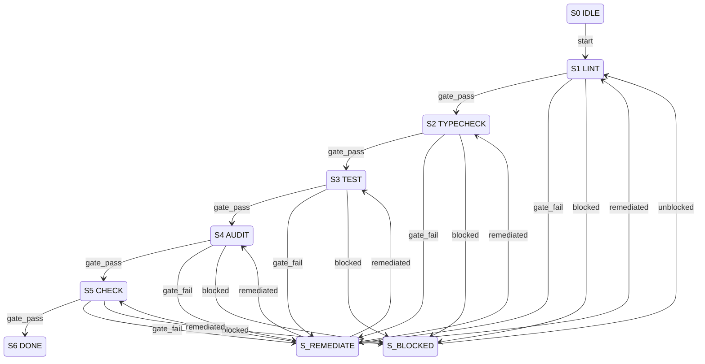

# Agent Testing Gates — Compact Operational Spec

## 1. Metadata

| Field | Value |
|-------|-------|
| `owner` | `coding-harness-maintainers` |
| `max_duration` | `5 gates` |
| `escalation` | `Stop at first failure, require explicit restart` |

## 2. Errors

| Error | Condition | Routing |
|-------|-----------|---------|
| `VALIDATION_ERROR` | Invalid command, malformed test configuration | Reject event (remain in current gate) |
| `BLOCKED_DEPENDENCY` | Missing test environment, unavailable tooling | `S? --blocked--> S_BLOCKED` |
| `POLICY_FAIL` | Lint, typecheck, or audit failure | `S? --fail--> S_REMEDIATE` |
| `SYSTEM_ERROR` | CLI/runtime/network failure | Terminal fail (logged, no state change) |

## 3. States

```
S0 IDLE (non-terminal)
S1 LINT (non-terminal)
S2 TYPECHECK (non-terminal)
S3 TEST (non-terminal)
S4 AUDIT (non-terminal)
S5 CHECK (non-terminal)
S6 DONE (terminal)
S_BLOCKED (non-terminal)
S_REMEDIATE (non-terminal)
```

## 4. Transition Table (Canonical) — S | E | G | A | N

| S | E | G | A | N |
|---|---|---|---|---|
| `S0 IDLE` | `start` | command valid AND no `VALIDATION_ERROR` | initialize test environment | `S1 LINT` |
| `S1 LINT` | `gate_pass` | `pnpm lint` passes | proceed to next gate | `S2 TYPECHECK` |
| `S1 LINT` | `gate_fail` | lint errors detected | log lint failures, suggest fixes | `S_REMEDIATE` |
| `S2 TYPECHECK` | `gate_pass` | `pnpm typecheck` passes | proceed to next gate | `S3 TEST` |
| `S2 TYPECHECK` | `gate_fail` | type errors detected | log type errors, suggest fixes | `S_REMEDIATE` |
| `S3 TEST` | `gate_pass` | `pnpm test` passes | proceed to next gate | `S4 AUDIT` |
| `S3 TEST` | `gate_fail` | test failures detected | log test failures, suggest fixes | `S_REMEDIATE` |
| `S4 AUDIT` | `gate_pass` | `pnpm audit` passes (or no high/critical) | proceed to next gate | `S5 CHECK` |
| `S4 AUDIT` | `gate_fail` | vulnerabilities detected | log audit findings, suggest remediation | `S_REMEDIATE` |
| `S5 CHECK` | `gate_pass` | `pnpm check` passes | mark all gates complete | `S6 DONE` |
| `S5 CHECK` | `gate_fail` | check bundle failures | log check failures, suggest fixes | `S_REMEDIATE` |
| `S? LINT-TYPECHECK-TEST-AUDIT-CHECK` | `blocked` | missing tooling/environment | document blocker, request human escalation | `S_BLOCKED` |
| `S_BLOCKED` | `unblocked` | environment restored | resume from blocked gate | previous state |
| `S_REMEDIATE` | `remediated` | fix applied and verified | retry from failed gate | failed gate |
| `S_REMEDIATE` | `abort` | cannot remediate | abort with failure report | terminal fail |

## 5. Invariants

- Gates execute sequentially: lint → typecheck → test → audit → check
- Stop at first required-gate failure
- Fix and rerun from first failed gate
- Each gate has pass/fail/block outcomes
- Terminal state `S6 DONE` requires all gates passing
- Non-terminal blocked state requires explicit unblocked event

## 6. Idempotency

- Key: `{{ run_id }}|{{ gate }}|{{ attempt }}`
- Replayed gate runs must not duplicate artifact uploads
- Remediation attempts tracked per gate
- Environment initialization is idempotent

## 7. Mermaid State Diagram (Derived Strictly from Table)



## 8. Pseudocode (Executor)

```ts
function execute(gateRun: GateRun, event: E): Transition {
  const key = `${gateRun.id}|${currentState}|${event}`;

  switch (currentState) {
    case S0_IDLE:
      if (event === "start" && validConfig(gateRun)) {
        initEnvironment();
        return {N: S1_LINT};
      }
      throw VALIDATION_ERROR;

    case S1_LINT:
      return runGate(event, "pnpm lint", S2_TYPECHECK);

    case S2_TYPECHECK:
      return runGate(event, "pnpm typecheck", S3_TEST);

    case S3_TEST:
      return runGate(event, "pnpm test", S4_AUDIT);

    case S4_AUDIT:
      return runGate(event, "pnpm audit", S5_CHECK);

    case S5_CHECK:
      return runGate(event, "pnpm check", S6_DONE);

    case S_BLOCKED:
      if (event === "unblocked" && environmentRestored()) {
        return {N: resumeFromBlockedGate()};
      }
      break;

    case S_REMEDIATE:
      if (event === "remediated" && verifyFix()) {
        return {N: retryFailedGate()};
      }
      if (event === "abort") {
        throw SYSTEM_ERROR;
      }
      break;

    case S6_DONE:
      throw "Terminal state - all gates passed";
  }

  throw SYSTEM_ERROR;
}

function runGate(event: E, command: string, nextState: State): Transition {
  if (event === "blocked") {
    return {N: S_BLOCKED};
  }
  if (event === "gate_pass" && runCommand(command)) {
    return {N: nextState};
  }
  if (event === "gate_fail") {
    logFailures(command);
    return {N: S_REMEDIATE};
  }
  throw VALIDATION_ERROR;
}
```

## 9. Log Schema

```json
{
  "workflow_id": "agent-testing-gates",
  "transition_code": "S1:gate_pass",
  "from_state": "S1 LINT",
  "to_state": "S2 TYPECHECK",
  "correlation_id": "run-123-gate-lint",
  "result": "success|blocked|failed|remediated",
  "gate": "lint",
  "command": "pnpm lint",
  "duration_ms": 4500,
  "exit_code": 0
}
```

## 10. Modes: STRICT | ADVISORY

| Mode | Behavior |
|------|----------|
| `STRICT` | Stop at first gate failure; require explicit remediation; `S_REMEDIATE` blocks until `remediated` event |
| `ADVISORY` | Continue through all gates, collect all failures; report aggregate results; allow partial pass with warnings |

## 11. Dry-Run Simulation

- No side effects: commands validated but not executed.
- Deterministic: guard evaluation runs against mock results.
- Emit transition trace rows: `[S,E,G,A,N,decision]` per gate attempt.
- Gate commands logged with expected exit codes.
- Returns full transition path without running actual checks.
