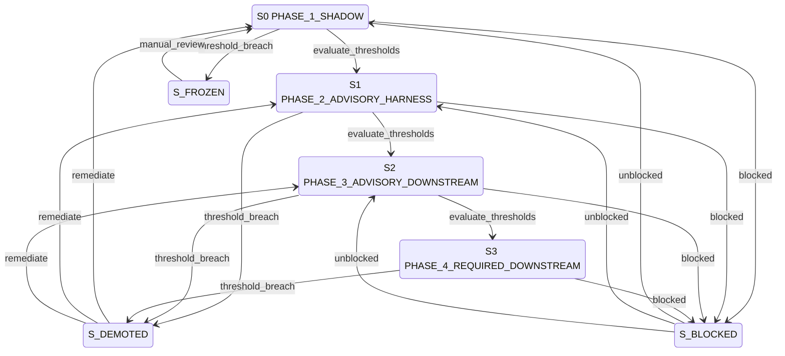

# Docs Gate Rollout — Compact Operational Spec

## 1. Metadata

| Field | Value |
|-------|-------|
| `owner` | `coding-harness-maintainers` |
| `max_duration` | `phase-based (7-14 days per phase)` |
| `escalation` | `Auto-demote on threshold breach, require manual re-promotion` |

## 2. Errors

| Error | Condition | Routing |
|-------|-----------|---------|
| `VALIDATION_ERROR` | Invalid contract schema, malformed threshold config | Reject event (remain in current phase) |
| `BLOCKED_DEPENDENCY` | Missing metrics artifact, unavailable CI artifacts | `S? --blocked--> S_FROZEN` |
| `POLICY_FAIL` | False-positive rate exceeds threshold, blocking failure rate too high | Demote to previous phase |
| `SYSTEM_ERROR` | Metrics aggregation failure, storage failure | Terminal fail (logged, no state change) |

## 3. States

```
S0 PHASE_1_SHADOW (non-terminal)
S1 PHASE_2_ADVISORY_HARNESS (non-terminal)
S2 PHASE_3_ADVISORY_DOWNSTREAM (non-terminal)
S3 PHASE_4_REQUIRED_DOWNSTREAM (terminal)
S_BLOCKED (non-terminal)
S_FROZEN (non-terminal)
S_DEMOTED (non-terminal)
```

## 4. Transition Table (Canonical) — S | E | G | A | N

| S | E | G | A | N |
|---|---|---|---|---|
| `S0 PHASE_1_SHADOW` | `evaluate_thresholds` | PR count >= 30 AND days >= 7 AND FP rate < 5% AND no trust_mismatch | promote to advisory harness | `S1 PHASE_2_ADVISORY_HARNESS` |
| `S0 PHASE_1_SHADOW` | `threshold_breach` | FP rate >= 5% OR trust_mismatch unresolved | freeze promotion, alert operators | `S_FROZEN` |
| `S1 PHASE_2_ADVISORY_HARNESS` | `evaluate_thresholds` | PR count >= 50 AND days >= 14 AND FP rate < 3% AND bootstrap_gap < 10% | promote to downstream advisory | `S2 PHASE_3_ADVISORY_DOWNSTREAM` |
| `S1 PHASE_2_ADVISORY_HARNESS` | `threshold_breach` | FP rate >= 3% OR blocking failure > 15% | auto-demote to shadow | `S_DEMOTED` |
| `S2 PHASE_3_ADVISORY_DOWNSTREAM` | `evaluate_thresholds` | downstream PRs >= 50 AND days >= 14 AND FP rate < 3% AND bootstrap_gap < 10% AND downgrade path tested | promote to required downstream | `S3 PHASE_4_REQUIRED_DOWNSTREAM` |
| `S2 PHASE_3_ADVISORY_DOWNSTREAM` | `threshold_breach` | FP rate >= 3% OR blocking failure > 15% OR trust_mismatch regression | auto-demote to previous phase | `S_DEMOTED` |
| `S3 PHASE_4_REQUIRED_DOWNSTREAM` | `threshold_breach` | policy-weakening bypass verified OR 2+ FP blocking in 24h OR blocking failure > 15% | emergency demote to advisory | `S_DEMOTED` |
| `S? *` | `blocked` | missing metrics data OR CI artifacts unavailable | document blocker, wait for data | `S_BLOCKED` |
| `S_BLOCKED` | `unblocked` | data restored | resume threshold evaluation | previous phase |
| `S_FROZEN` | `manual_review` | root cause fixed AND maintainer sign-off | unfreeze, resume evaluation | previous phase |
| `S_DEMOTED` | `remediate` | root cause fixed AND thresholds re-met | attempt re-promotion | target phase |

## 5. Invariants

- Phase transitions require explicit threshold evaluation events
- Auto-demotion on threshold breach is mandatory (no bypass)
- Downgrade path must be tested before PHASE_3→PHASE_4 transition
- Demotion updates `harness.contract.json` and workflow flags
- Promotion requires maintainer sign-off documented
- Metrics must be exportable from `docs-gate-report.json` artifacts

## 6. Idempotency

- Key: `{{ phase }}|{{ evaluation_timestamp }}|{{ pr_count }}`
- Threshold evaluation is idempotent for same inputs
- Demotion/promotion actions logged with sign-off evidence
- Metrics snapshots reference specific artifact paths

## 7. Mermaid State Diagram (Derived Strictly from Table)



## 8. Pseudocode (Executor)

```ts
function execute(rollout: RolloutState, event: E): Transition {
  const key = `${rollout.phase}|${evaluationTimestamp}|${metrics.prCount}`;

  switch (currentState) {
    case S0_PHASE_1_SHADOW:
      if (event === "evaluate_thresholds" && meetsPhase1Thresholds(metrics)) {
        recordSignOff("phase_1_to_2");
        return {N: S1_PHASE_2_ADVISORY_HARNESS};
      }
      if (event === "threshold_breach") {
        alertOperators("Phase 1 thresholds breached");
        return {N: S_FROZEN};
      }
      break;

    case S1_PHASE_2_ADVISORY_HARNESS:
      if (event === "evaluate_thresholds" && meetsPhase2Thresholds(metrics)) {
        recordSignOff("phase_2_to_3");
        return {N: S2_PHASE_3_ADVISORY_DOWNSTREAM};
      }
      if (event === "threshold_breach") {
        autoDemote("phase_2", "phase_1");
        return {N: S_DEMOTED};
      }
      break;

    case S2_PHASE_3_ADVISORY_DOWNSTREAM:
      if (event === "evaluate_thresholds" && meetsPhase3Thresholds(metrics)) {
        verifyDowngradePathTested();
        recordSignOff("phase_3_to_4");
        return {N: S3_PHASE_4_REQUIRED_DOWNSTREAM};
      }
      if (event === "threshold_breach") {
        autoDemote("phase_3", "phase_2");
        return {N: S_DEMOTED};
      }
      break;

    case S3_PHASE_4_REQUIRED_DOWNSTREAM:
      if (event === "threshold_breach") {
        emergencyDemote("phase_4", "phase_3");
        return {N: S_DEMOTED};
      }
      break;

    case S_BLOCKED:
      if (event === "unblocked" && dataRestored()) {
        return {N: rollout.previousPhase};
      }
      break;

    case S_FROZEN:
      if (event === "manual_review" && rootCauseFixed() && maintainerSignOff()) {
        return {N: rollout.previousPhase};
      }
      break;

    case S_DEMOTED:
      if (event === "remediate" && rootCauseFixed() && thresholdsReMet()) {
        return {N: attemptRePromotion()};
      }
      break;
  }

  throw SYSTEM_ERROR;
}
```

## 9. Log Schema

```json
{
  "workflow_id": "docs-gate-rollout",
  "transition_code": "S0:evaluate_thresholds",
  "from_state": "S0 PHASE_1_SHADOW",
  "to_state": "S1 PHASE_2_ADVISORY_HARNESS",
  "correlation_id": "rollout-2026-03-14",
  "result": "promoted|demoted|frozen|blocked",
  "phase_metrics": {
    "pr_count": 35,
    "days": 8,
    "false_positive_rate": 0.04,
    "bootstrap_gap_rate": 0.05,
    "blocking_failure_rate": 0.08
  },
  "sign_off": {
    "approver": "maintainer-name",
    "timestamp": "2026-03-14T12:00:00Z"
  }
}
```

## 10. Modes: STRICT | ADVISORY

| Mode | Behavior |
|------|----------|
| `STRICT` | All threshold conditions must be met exactly; auto-demotion triggers immediately on breach; no manual override allowed |
| `ADVISORY` | Threshold warnings emitted but promotion requires manual confirmation; demotion suggestions logged but not auto-applied |

## 11. Dry-Run Simulation

- No side effects: no actual phase transitions or config updates.
- Deterministic: threshold evaluation against mock metrics.
- Emit transition trace rows: `[S,E,G,A,N,decision]` with threshold check results.
- Config changes previewed but not written.
- Returns promotion/demotion recommendations without applying.
