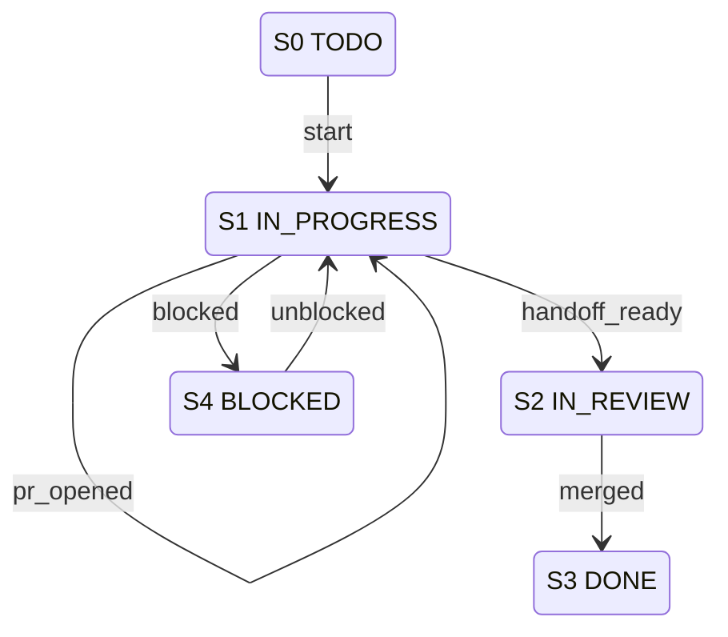

# Linear Workflow — Compact Operational Spec

## 1. Metadata

| Field | Value |
|-------|-------|
| `owner` | `coding-harness-maintainers` |
| `max_duration` | `12 turns` |
| `escalation` | `Block at S4 BLOCKED with unblock_action payload` |

## 2. Errors

| Error | Condition | Routing |
|-------|-----------|---------|
| `VALIDATION_ERROR` | Invalid issue key, malformed branch, missing required fields | Reject event (remain in current state) |
| `BLOCKED_DEPENDENCY` | Missing auth, secret, or permission | `S1 --blocked--> S4` |
| `POLICY_FAIL` | Required checks, branch policy, or PR reference policy fails | `S1 --blocked--> S4` |
| `SYSTEM_ERROR` | CLI/runtime/network failure | Terminal fail (logged, no state change) |

## 3. States

```
S0 TODO (non-terminal)
S1 IN_PROGRESS (non-terminal)
S2 IN_REVIEW (non-terminal)
S3 DONE (terminal)
S4 BLOCKED (non-terminal)
```

## 4. Transition Table (Canonical) — S | E | G | A | N

| S | E | G | A | N |
|---|---|---|---|---|
| `S0 TODO` | `start` | issue selected AND no `VALIDATION_ERROR` | `harness linear claim --issue <LK> --branch <codex/...> --workspace <path>` | `S1 IN_PROGRESS` |
| `S1 IN_PROGRESS` | `status_tick` | always | update one running progress comment (single thread) | `S1 IN_PROGRESS` |
| `S1 IN_PROGRESS` | `pr_opened` | PR exists | attach/update PR link on LI | `S1 IN_PROGRESS` |
| `S1 IN_PROGRESS` | `handoff_ready` | `harness check-environment && harness preflight-gate && harness policy-gate && harness docs-gate && pnpm check` pass (`harness review-gate` required when PR exists) | `harness linear handoff --issue <LK> --pr-url <url> --evidence-url <url[,url]>` | `S2 IN_REVIEW` |
| `S2 IN_REVIEW` | `merged` | required checks pass | `harness linear close --issue <LK> --pr-url <url>` | `S3 DONE` |
| `S1 IN_PROGRESS` | `blocked` | missing auth, secret, or permission (`BLOCKED_DEPENDENCY`) | post blocker note, add `Blocked` label, record unblock action | `S4 BLOCKED` |
| `S1 IN_PROGRESS` | `blocked` | policy check fails (`POLICY_FAIL`) | post blocker note, add `Blocked` label, record unblock action | `S4 BLOCKED` |
| `S4 BLOCKED` | `unblocked` | dependency restored | remove blocker marker, continue execution | `S1 IN_PROGRESS` |

## 5. Invariants

- Branch names keep `codex/` prefix and include `LK`
- One progress comment thread per Linear issue
- `S2 IN_REVIEW` requires pre-review checks to pass before entry
- Terminal state `S3 DONE` has no outbound transitions
- Non-terminal states (S0, S1, S2, S4) have ≥1 outbound transition
- Deterministic `(S,E)` routing via non-overlapping guards
- `S3 DONE` is terminal; `S4 BLOCKED` is not terminal (has outbound `unblocked` transition)

## 6. Idempotency

- Key: `{{ issue.identifier }}|{{ issue.url }}|<event>|<state>`
- Repeated `status_tick` updates mutate the single running comment, not create duplicates
- Replayed `pr_opened`/`handoff_ready` must upsert LI links/comments

## 7. Mermaid State Diagram (Derived Strictly from Table)



## 8. Pseudocode (Executor)

```ts
function execute(issue: LI, event: E): Transition {
  const key = `${issue.identifier}|${issue.url}|${event}|${currentState}`;

  // Guards evaluated in order (first-match)
  switch (currentState) {
    case S0_TODO:
      if (event === "start" && isIssueSelected(issue) && !validationError(issue)) {
        run(`harness linear claim --issue ${issue.key} --branch codex/...`);
        return {N: S1_IN_PROGRESS};
      }
      throw VALIDATION_ERROR;

    case S1_IN_PROGRESS:
      if (event === "status_tick") {
        updateProgressComment(issue);
        return {N: S1_IN_PROGRESS}; // self-loop
      }
      if (event === "pr_opened" && prExists(issue)) {
        attachPrLink(issue);
        return {N: S1_IN_PROGRESS}; // self-loop
      }
      if (event === "handoff_ready" && allChecksPass(issue)) {
        run(`harness linear handoff --issue ${issue.key}`);
        return {N: S2_IN_REVIEW};
      }
      if (event === "blocked" && (missingAuth() || policyFail())) {
        postBlockerNote(issue);
        return {N: S4_BLOCKED};
      }
      break;

    case S2_IN_REVIEW:
      if (event === "merged" && requiredChecksPass(issue)) {
        run(`harness linear close --issue ${issue.key}`);
        return {N: S3_DONE};
      }
      break;

    case S4_BLOCKED:
      if (event === "unblocked" && dependencyRestored()) {
        removeBlockerMarker(issue);
        return {N: S1_IN_PROGRESS};
      }
      break;

    case S3_DONE:
      throw "Terminal state has no outbound transitions";
  }

  throw SYSTEM_ERROR;
}
```

## 9. Log Schema

```json
{
  "workflow_id": "linear-production",
  "transition_code": "S1:handoff_ready",
  "from_state": "S1 IN_PROGRESS",
  "to_state": "S2 IN_REVIEW",
  "correlation_id": "LK-PR-SHA",
  "result": "success|blocked|failed"
}
```

## 10. Modes: STRICT | ADVISORY

| Mode | Behavior |
|------|----------|
| `STRICT` | `VALIDATION_ERROR` and `POLICY_FAIL` are hard-fail; events rejected if guards not satisfied; `S4 BLOCKED` requires explicit `unblocked` event |
| `ADVISORY` | `POLICY_FAIL` emits warning but does not block (remains in current state); `BLOCKED_DEPENDENCY` still routes to `S4` |

## 11. Dry-Run Simulation

- No side effects: no stateful writes to Linear/GitHub.
- Deterministic: guard evaluation and transition selection remain deterministic.
- Emit transition trace rows: `[S,E,G,A,N,decision]` per transition attempt.
- No writes to Linear/GitHub (commands logged, not executed)
- Idempotency key computed but not persisted
- Returns full transition path without mutation
