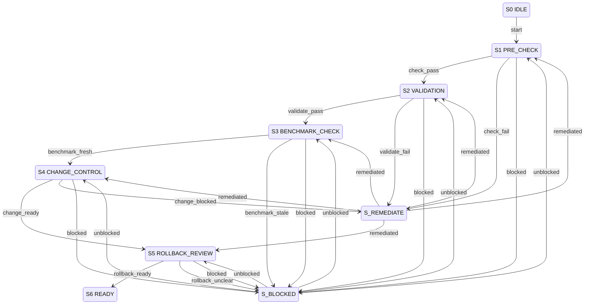

# Release and Change Control — Compact Operational Spec

## 1. Metadata

| Field | Value |
|-------|-------|
| `owner` | `coding-harness-maintainers` |
| `max_duration` | `1 release cycle` |
| `escalation` | `Block release on unmet checkpoint` |

## 2. Errors

| Error | Condition | Routing |
|-------|-----------|---------|
| `VALIDATION_ERROR` | Check command fails, contradiction found in docs | Reject release (remain in validation) |
| `BLOCKED_DEPENDENCY` | Benchmark evidence missing, CI unavailable | `S? --blocked--> S_BLOCKED` |
| `POLICY_FAIL` | Command contract mismatch, authority conflict | `S? --fail--> S_REMEDIATE` |
| `SYSTEM_ERROR` | Network failure, artifact storage failure | Terminal fail (logged, no state change) |

## 3. States

```
S0 IDLE (non-terminal)
S1 PRE_CHECK (non-terminal)
S2 VALIDATION (non-terminal)
S3 BENCHMARK_CHECK (non-terminal)
S4 CHANGE_CONTROL (non-terminal)
S5 ROLLBACK_REVIEW (non-terminal)
S6 READY (terminal)
S_BLOCKED (non-terminal)
S_REMEDIATE (non-terminal)
```

## 4. Transition Table (Canonical) — S | E | G | A | N

| S | E | G | A | N |
|---|---|---|---|---|
| `S0 IDLE` | `start` | release intent recorded | initialize release checklist | `S1 PRE_CHECK` |
| `S1 PRE_CHECK` | `check_pass` | `pnpm check` passes on HEAD | proceed to validation | `S2 VALIDATION` |
| `S1 PRE_CHECK` | `check_fail` | lint/type/test/audit failure | log failures, suggest fixes | `S_REMEDIATE` |
| `S2 VALIDATION` | `validate_pass` | no contradictions, contract matches, docs current | proceed to benchmark check | `S3 BENCHMARK_CHECK` |
| `S2 VALIDATION` | `validate_fail` | contradictions or contract mismatch | log validation failures | `S_REMEDIATE` |
| `S3 BENCHMARK_CHECK` | `benchmark_fresh` | SWE track run within 7 days OR fresh before release | proceed to change control | `S4 CHANGE_CONTROL` |
| `S3 BENCHMARK_CHECK` | `benchmark_stale` | no benchmark evidence in window | request benchmark run | `S_BLOCKED` |
| `S4 CHANGE_CONTROL` | `change_ready` | intent recorded, minimal implementation, gates validated | proceed to rollback review | `S5 ROLLBACK_REVIEW` |
| `S4 CHANGE_CONTROL` | `change_blocked` | workflow artifacts need update OR rollback unclear | document blockers | `S_REMEDIATE` |
| `S5 ROLLBACK_REVIEW` | `rollback_ready` | rollback path verified OR irreversible ops avoided | mark release ready | `S6 READY` |
| `S5 ROLLBACK_REVIEW` | `rollback_unclear` | uncertain changes without impact docs | pause for approval | `S_BLOCKED` |
| `S? *` | `blocked` | missing benchmark, CI unavailable | document blocker, request escalation | `S_BLOCKED` |
| `S_BLOCKED` | `unblocked` | dependency restored | resume from blocked state | previous state |
| `S_REMEDIATE` | `remediated` | fix applied and verified | retry from failed checkpoint | failed checkpoint |
| `S_REMEDIATE` | `abort` | cannot remediate | abort release | terminal fail |

## 5. Invariants

- All 5 pre-checklist items must pass before release tagging
- Benchmark evidence must be fresh per cadence (weekly on main, fresh before release)
- Change-control flow requires rollback behavior documented or confirmed N/A
- Release blockers are terminal until resolved
- Post-change validation confirms docs reference current commands

## 6. Idempotency

- Key: `{{ release_version }}|{{ checkpoint }}|{{ attempt }}`
- Replay of validation runs must not duplicate artifact uploads
- Remediation attempts tracked per checkpoint
- Benchmark runs idempotent via JSON schema validation

## 7. Mermaid State Diagram (Derived Strictly from Table)



## 8. Pseudocode (Executor)

```ts
function execute(release: ReleaseState, event: E): Transition {
  const key = `${release.version}|${currentState}|${event}`;

  switch (currentState) {
    case S0_IDLE:
      if (event === "start" && release.intentRecorded) {
        initReleaseChecklist();
        return {N: S1_PRE_CHECK};
      }
      throw VALIDATION_ERROR;

    case S1_PRE_CHECK:
      if (event === "check_pass" && runCheck("pnpm check")) {
        return {N: S2_VALIDATION};
      }
      if (event === "check_fail") {
        logCheckFailures();
        return {N: S_REMEDIATE};
      }
      break;

    case S2_VALIDATION:
      if (event === "validate_pass" && validateDocsAndContract()) {
        return {N: S3_BENCHMARK_CHECK};
      }
      if (event === "validate_fail") {
        logValidationFailures();
        return {N: S_REMEDIATE};
      }
      break;

    case S3_BENCHMARK_CHECK:
      if (event === "benchmark_fresh" && benchmarkEvidenceFresh()) {
        return {N: S4_CHANGE_CONTROL};
      }
      if (event === "benchmark_stale") {
        requestBenchmarkRun();
        return {N: S_BLOCKED};
      }
      break;

    case S4_CHANGE_CONTROL:
      if (event === "change_ready" && changeControlFlowComplete()) {
        return {N: S5_ROLLBACK_REVIEW};
      }
      if (event === "change_blocked") {
        documentBlockers();
        return {N: S_REMEDIATE};
      }
      break;

    case S5_ROLLBACK_REVIEW:
      if (event === "rollback_ready" && rollbackPathVerified()) {
        return {N: S6_READY};
      }
      if (event === "rollback_unclear") {
        pauseForApproval();
        return {N: S_BLOCKED};
      }
      break;

    case S_BLOCKED:
      if (event === "unblocked" && dependencyRestored()) {
        return {N: resumeFromBlockedState()};
      }
      break;

    case S_REMEDIATE:
      if (event === "remediated" && verifyFix()) {
        return {N: retryFailedCheckpoint()};
      }
      if (event === "abort") {
        throw SYSTEM_ERROR;
      }
      break;

    case S6_READY:
      throw "Terminal state - release ready for tagging";
  }

  throw SYSTEM_ERROR;
}
```

## 9. Log Schema

```json
{
  "workflow_id": "release-change-control",
  "transition_code": "S1:check_pass",
  "from_state": "S1 PRE_CHECK",
  "to_state": "S2 VALIDATION",
  "correlation_id": "release-v1.2.3",
  "result": "success|blocked|failed|remediated",
  "checkpoint": "pre_check",
  "command": "pnpm check",
  "duration_ms": 4500,
  "exit_code": 0
}
```

## 10. Modes: STRICT | ADVISORY

| Mode | Behavior |
|------|----------|
| `STRICT` | All checkpoints must pass; benchmark cadence enforced exactly; rollback required for all changes; `S_BLOCKED` requires explicit `unblocked` event |
| `ADVISORY` | Warnings for benchmark age >7 days but <14 days; best-effort rollback docs; continue with documented risk acceptance |

## 11. Dry-Run Simulation

- No side effects: no actual release tagging or artifact publishing.
- Deterministic: checkpoint evaluation against mock validation results.
- Emit transition trace rows: `[S,E,G,A,N,decision]` per checkpoint.
- Config changes previewed but not written.
- Returns release readiness recommendation without applying.
