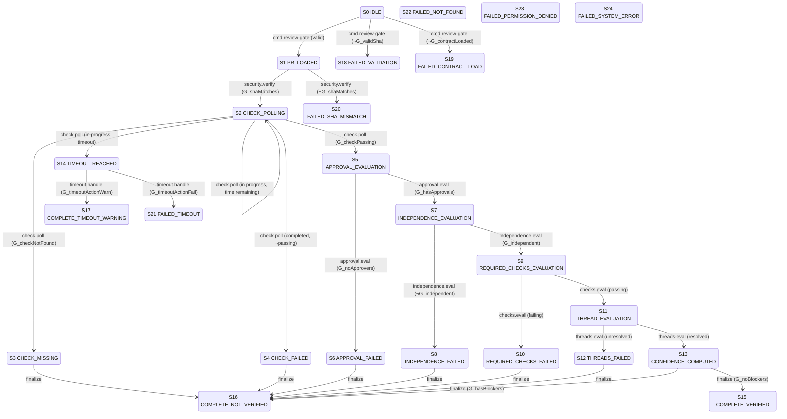

# Review Gate — Compact Operational Spec

## 1. Metadata

| Field | Value |
|-------|-------|
| `owner` | `team/codex-infra` |
| `max_duration` | `600s (10 minutes)` |
| `escalation` | `File issue with Review + CI labels` |

## 2. JSON Output Envelope

`review-gate --json` now emits a normalized `GateResult` envelope (via `normaliseReviewGateResult`). Fields include:
- `gate`: `"review-gate"`
- `status`: `"pass"` | `"warn"` | `"fail"`
- `reason`: short diagnosis
- `action_now`, `action_later`: action guidance arrays
- `evidence_ref`: artifact references
- `findings`: normalized findings array (blockers mapped to `GateFinding` objects)
- `meta`: contains `exitCode`, `headSha`, `checkStatus`, `checkConclusion`, `needsRerun`, `timedOut`, `policyGateStatus`, `planTraceabilityStatus`, `planIds`, `actionableCount`, `informationalCount`, `confidenceRubric`

See `src/lib/output/normalise.ts` (`normaliseReviewGateResult`) and `src/lib/output/types.ts` (`GateResult`) for the canonical contract.

## 3. Errors

| Error | Condition | Routing |
|-------|-----------|---------|
| `VALIDATION_ERROR` | Invalid SHA format, SHA mismatch, contract load failure | Terminal fail (exit 1) |
| `NOT_FOUND` | PR not found, check run not found | Terminal fail (exit 2) |
| `PERMISSION_DENIED` | 403 Forbidden, 401 Unauthorized | Terminal fail (exit 3) |
| `TIMEOUT` | Polling exceeded timeout with `timeoutAction: fail` | Terminal fail (exit 4) |
| `REVIEW_NOT_VERIFIED` | Gate completed but verification failed | Terminal fail (exit 5) |
| `SYSTEM_ERROR` | Unexpected exception, network failure | Terminal fail (exit 10) |

## 4. States

```
S0 IDLE (initial)
S1 PR_LOADED (non-terminal)
S2 CHECK_POLLING (non-terminal)
S3 CHECK_MISSING (terminal)
S4 CHECK_FAILED (terminal)
S5 APPROVAL_EVALUATION (non-terminal)
S6 APPROVAL_FAILED (terminal)
S7 INDEPENDENCE_EVALUATION (non-terminal)
S8 INDEPENDENCE_FAILED (terminal)
S9 REQUIRED_CHECKS_EVALUATION (non-terminal)
S10 REQUIRED_CHECKS_FAILED (terminal)
S11 THREAD_EVALUATION (non-terminal)
S12 THREADS_FAILED (terminal)
S13 CONFIDENCE_COMPUTED (non-terminal)
S14 TIMEOUT_REACHED (non-terminal)
S15 COMPLETE_VERIFIED (terminal)
S16 COMPLETE_NOT_VERIFIED (terminal)
S17 COMPLETE_TIMEOUT_WARNING (terminal)
S18 FAILED_VALIDATION (terminal)
S19 FAILED_CONTRACT_LOAD (terminal)
S20 FAILED_SHA_MISMATCH (terminal)
S21 FAILED_TIMEOUT (terminal)
S22 FAILED_NOT_FOUND (terminal)
S23 FAILED_PERMISSION_DENIED (terminal)
S24 FAILED_SYSTEM_ERROR (terminal)
```

## 5. Transition Table (Canonical) — S | E | G | A | N

| S | E | G | A | N |
|---|---|---|---|---|
| `S0 IDLE` | `cmd.review-gate` | ¬G_validSha | A_logValidationError | `S18 FAILED_VALIDATION` |
| `S0 IDLE` | `cmd.review-gate` | G_validSha ∧ ¬G_contractLoaded | A_logContractError | `S19 FAILED_CONTRACT_LOAD` |
| `S0 IDLE` | `cmd.review-gate` | G_validSha ∧ G_contractLoaded | A_initClient, A_fetchPR, A_evalPlanTraceability | `S1 PR_LOADED` |
| `S1 PR_LOADED` | `security.verify` | ¬G_shaMatches | A_logShaMismatch | `S20 FAILED_SHA_MISMATCH` |
| `S1 PR_LOADED` | `security.verify` | G_shaMatches | A_startTimer, A_listCheckRuns | `S2 CHECK_POLLING` |
| `S2 CHECK_POLLING` | `check.poll` | G_checkNotFound | A_logCheckMissing | `S3 CHECK_MISSING` |
| `S2 CHECK_POLLING` | `check.poll` | G_checkPassing | A_evalApprovals | `S5 APPROVAL_EVALUATION` |
| `S2 CHECK_POLLING` | `check.poll` | G_checkCompleted ∧ ¬G_checkPassing | A_logCheckFailed | `S4 CHECK_FAILED` |
| `S2 CHECK_POLLING` | `check.poll` | G_checkInProgress ∧ G_timeRemaining | A_waitPollInterval | `S2 CHECK_POLLING` |
| `S2 CHECK_POLLING` | `check.poll` | G_checkInProgress ∧ ¬G_timeRemaining | A_handleTimeout | `S14 TIMEOUT_REACHED` |
| `S3 CHECK_MISSING` | `finalize` | G_success | A_buildOutput | `S16 COMPLETE_NOT_VERIFIED` |
| `S4 CHECK_FAILED` | `finalize` | G_success | A_buildOutput | `S16 COMPLETE_NOT_VERIFIED` |
| `S5 APPROVAL_EVALUATION` | `approval.eval` | G_noApprovers | A_logNoApproval | `S6 APPROVAL_FAILED` |
| `S5 APPROVAL_EVALUATION` | `approval.eval` | G_hasApprovals | A_evalReviewerIndependence | `S7 INDEPENDENCE_EVALUATION` |
| `S6 APPROVAL_FAILED` | `finalize` | G_success | A_buildOutput | `S16 COMPLETE_NOT_VERIFIED` |
| `S7 INDEPENDENCE_EVALUATION` | `independence.eval` | ¬G_independentReviewers | A_logIndependenceFail | `S8 INDEPENDENCE_FAILED` |
| `S7 INDEPENDENCE_EVALUATION` | `independence.eval` | G_independentReviewers | A_evalRequiredChecks | `S9 REQUIRED_CHECKS_EVALUATION` |
| `S8 INDEPENDENCE_FAILED` | `finalize` | G_success | A_buildOutput | `S16 COMPLETE_NOT_VERIFIED` |
| `S9 REQUIRED_CHECKS_EVALUATION` | `checks.eval` | G_requiredChecksFailing | A_logRequiredCheckFail | `S10 REQUIRED_CHECKS_FAILED` |
| `S9 REQUIRED_CHECKS_EVALUATION` | `checks.eval` | G_requiredChecksPassing | A_evalReviewThreads | `S11 THREAD_EVALUATION` |
| `S10 REQUIRED_CHECKS_FAILED` | `finalize` | G_success | A_buildOutput | `S16 COMPLETE_NOT_VERIFIED` |
| `S11 THREAD_EVALUATION` | `threads.eval` | G_unresolvedHumanThreads | A_logUnresolvedThreads | `S12 THREADS_FAILED` |
| `S11 THREAD_EVALUATION` | `threads.eval` | G_allThreadsResolved | A_computeConfidenceRubric | `S13 CONFIDENCE_COMPUTED` |
| `S12 THREADS_FAILED` | `finalize` | G_success | A_buildOutput | `S16 COMPLETE_NOT_VERIFIED` |
| `S13 CONFIDENCE_COMPUTED` | `finalize` | G_noBlockers | A_markVerified | `S15 COMPLETE_VERIFIED` |
| `S13 CONFIDENCE_COMPUTED` | `finalize` | G_hasBlockers | A_buildOutput | `S16 COMPLETE_NOT_VERIFIED` |
| `S14 TIMEOUT_REACHED` | `timeout.handle` | G_timeoutActionFail | A_logTimeoutError | `S21 FAILED_TIMEOUT` |
| `S14 TIMEOUT_REACHED` | `timeout.handle` | G_timeoutActionWarn | A_buildOutput | `S17 COMPLETE_TIMEOUT_WARNING` |
| `S? *` | `error.uncaught` | G_notFoundError | A_logNotFound | `S22 FAILED_NOT_FOUND` |
| `S? *` | `error.uncaught` | G_permissionError | A_logPermissionDenied | `S23 FAILED_PERMISSION_DENIED` |
| `S? *` | `error.uncaught` | G_systemError | A_logSystemError | `S24 FAILED_SYSTEM_ERROR` |

## 6. Invariants

- SHA must be validated before use (`validateSha()` at entry)
- Provided SHA must match PR HEAD (explicit comparison before polling)
- Polling must respect timeout (`Date.now() - startTime < timeoutMs` each iteration)
- Approvals must be for current HEAD SHA (`commitId === headSha` filter)
- Reviewer independence requires at least one non-coding-actor approver
- Required checks must be complete and passing (status `completed` + conclusion `success`)
- Unresolved human threads block verification (bot-only threads may be auto-resolved)
- Confidence score 5 requires all gates passing
- Timeout action determines terminal state (`fail` → error; `warn` → `needsRerun: true`)

## 7. Idempotency

- Key: `{{ workflow_id }}|{{ pr_number }}|{{ head_sha }}`
- PR data fetched once at start (cached in `pullRequest` variable)
- Check polling fetches fresh data per iteration (no caching)
- Bot-only thread auto-resolution is idempotent (resolving already-resolved is no-op)
- Rerun comment deduplication by SHA (`hasRerunCommentForSha`)
- Confidence rubric is deterministic (same inputs → same score/rationale)

## 8. Mermaid State Diagram (Derived Strictly from Table)



## 9. Pseudocode (Executor)

```ts
function execute(gate: ReviewGate, event: E): Transition {
  const key = `${gate.workflowId}|${gate.prNumber}|${gate.headSha}`;

  switch (currentState) {
    case S0_IDLE:
      if (event === "cmd.review-gate") {
        if (!G_validSha) return {N: S18_FAILED_VALIDATION};
        if (!G_contractLoaded) return {N: S19_FAILED_CONTRACT_LOAD};
        A_initClient();
        A_fetchPR();
        A_evalPlanTraceability();
        return {N: S1_PR_LOADED};
      }
      break;

    case S1_PR_LOADED:
      if (event === "security.verify") {
        if (!G_shaMatches) return {N: S20_FAILED_SHA_MISMATCH};
        A_startTimer();
        A_listCheckRuns();
        return {N: S2_CHECK_POLLING};
      }
      break;

    case S2_CHECK_POLLING:
      if (event === "check.poll") {
        if (G_checkNotFound) return {N: S3_CHECK_MISSING};
        if (G_checkPassing) {
          A_evalApprovals();
          return {N: S5_APPROVAL_EVALUATION};
        }
        if (G_checkCompleted && !G_checkPassing) return {N: S4_CHECK_FAILED};
        if (G_checkInProgress && G_timeRemaining) {
          A_waitPollInterval();
          return {N: S2_CHECK_POLLING};
        }
        if (G_checkInProgress && !G_timeRemaining) {
          A_handleTimeout();
          return {N: S14_TIMEOUT_REACHED};
        }
      }
      break;

    case S5_APPROVAL_EVALUATION:
      if (event === "approval.eval") {
        if (G_noApprovers) return {N: S6_APPROVAL_FAILED};
        A_evalReviewerIndependence();
        return {N: S7_INDEPENDENCE_EVALUATION};
      }
      break;

    case S7_INDEPENDENCE_EVALUATION:
      if (event === "independence.eval") {
        if (!G_independentReviewers) return {N: S8_INDEPENDENCE_FAILED};
        A_evalRequiredChecks();
        return {N: S9_REQUIRED_CHECKS_EVALUATION};
      }
      break;

    case S9_REQUIRED_CHECKS_EVALUATION:
      if (event === "checks.eval") {
        if (G_requiredChecksFailing) return {N: S10_REQUIRED_CHECKS_FAILED};
        A_evalReviewThreads();
        return {N: S11_THREAD_EVALUATION};
      }
      break;

    case S11_THREAD_EVALUATION:
      if (event === "threads.eval") {
        if (G_unresolvedHumanThreads) return {N: S12_THREADS_FAILED};
        A_computeConfidenceRubric();
        return {N: S13_CONFIDENCE_COMPUTED};
      }
      break;

    case S13_CONFIDENCE_COMPUTED:
      if (event === "finalize") {
        if (G_noBlockers) {
          A_markVerified();
          return {N: S15_COMPLETE_VERIFIED};
        }
        return {N: S16_COMPLETE_NOT_VERIFIED};
      }
      break;

    case S14_TIMEOUT_REACHED:
      if (event === "timeout.handle") {
        if (G_timeoutActionFail) return {N: S21_FAILED_TIMEOUT};
        return {N: S17_COMPLETE_TIMEOUT_WARNING};
      }
      break;

    case S3_CHECK_MISSING:
    case S4_CHECK_FAILED:
    case S6_APPROVAL_FAILED:
    case S8_INDEPENDENCE_FAILED:
    case S10_REQUIRED_CHECKS_FAILED:
    case S12_THREADS_FAILED:
      if (event === "finalize") {
        A_buildOutput();
        return {N: S16_COMPLETE_NOT_VERIFIED};
      }
      break;

    case S15_COMPLETE_VERIFIED:
    case S16_COMPLETE_NOT_VERIFIED:
    case S17_COMPLETE_TIMEOUT_WARNING:
    case S18_FAILED_VALIDATION:
    case S19_FAILED_CONTRACT_LOAD:
    case S20_FAILED_SHA_MISMATCH:
    case S21_FAILED_TIMEOUT:
    case S22_FAILED_NOT_FOUND:
    case S23_FAILED_PERMISSION_DENIED:
    case S24_FAILED_SYSTEM_ERROR:
      throw "Terminal state - no outbound transitions";
  }

  // Handle uncaught errors
  if (event === "error.uncaught") {
    if (G_notFoundError) return {N: S22_FAILED_NOT_FOUND};
    if (G_permissionError) return {N: S23_FAILED_PERMISSION_DENIED};
    return {N: S24_FAILED_SYSTEM_ERROR};
  }

  throw SYSTEM_ERROR;
}
```

## 10. Log Schema

```json
{
  "workflow_id": "review-gate",
  "transition_code": "S1:security.verify",
  "from_state": "S1 PR_LOADED",
  "to_state": "S2 CHECK_POLLING",
  "correlation_id": "${workflow_id}:${pr_number}",
  "result": "verified|not_verified|timeout|error",
  "timestamp": "2026-03-14T12:00:00Z",
  "metadata": {
    "pr_number": 123,
    "head_sha": "abc123...",
    "check_name": "review-gate",
    "timeout_seconds": 600,
    "poll_interval_ms": 5000,
    "poll_iterations": 12,
    "owner": "org",
    "repo": "repo"
  },
  "evaluations": {
    "policy_gate_status": "pass",
    "plan_traceability_status": "pass",
    "approval_count": 2,
    "independent_approvers": 1,
    "required_checks_passing": true,
    "unresolved_threads": 0
  },
  "confidence_rubric": {
    "score": 5,
    "level": "high"
  },
  "blockers": [],
  "error": {
    "code": "VALIDATION_ERROR",
    "message": "..."
  }
}
```

## 11. Modes: STRICT | ADVISORY

| Mode | Behavior |
|------|----------|
| `STRICT` | SHA mismatch is fatal (no bypass); all required checks must pass; all human review threads must be resolved; reviewer independence strictly enforced; timeout action `fail` halts workflow |
| `ADVISORY` | Warnings for non-critical check failures; best-effort thread resolution; relaxed reviewer independence (configurable); timeout action `warn` returns `needsRerun: true`; allows partial verification with blockers listed |

## 12. Dry-Run Simulation

| State | Dry-Run Behavior |
|-------|------------------|
| `S0 IDLE` | Validate inputs, no client initialization |
| `S1 PR_LOADED` | Mock PR data, skip SHA comparison |
| `S2 CHECK_POLLING` | Return mock check status, no polling |
| `S5 APPROVAL_EVALUATION` | Mock approval data |
| `S13 CONFIDENCE_COMPUTED` | Compute confidence with mock data |

- No side effects: no actual GitHub API calls.
- Deterministic: guard evaluation runs against mock results.
- Emit transition trace rows: `[S,E,G,A,N,decision]` per transition attempt.
- Returns full transition path without mutation.