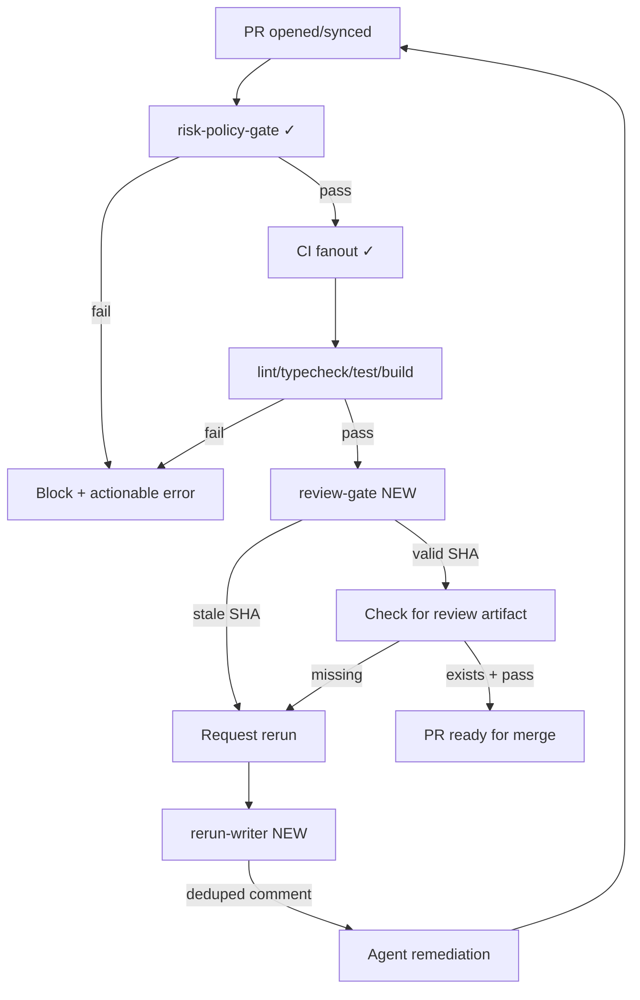

# Phase 4 GitHub API Integration

## Overview

Complete the GitHub workflow orchestration layer by implementing the deferred GitHub API integration components: Octokit client, SHA validation, check-run queries, comment deduping, and review-gate command.

This phase builds on Phase 3's `policy-gate` command to enable SHA-bound review verification and rerun comment deduping.

## Problem Statement / Motivation

Phase 3 MVP implemented the preflight policy-gate, but deferred:
- GitHub API integration for review verification
- SHA-bound review artifact checking
- Rerun comment posting with deduping

Without these, the full PR flow cannot be enforced: agents can't verify reviews match current HEAD, and rerun requests create noisy threads.

## Proposed Solution

Implement the deferred components from Phase 3:

1. **GitHub client** - Octokit wrapper with throttling plugin
2. **SHA validation** - 40-char hex regex validation
3. **Check-run queries** - Look up review check runs by SHA
4. **Comment deduping** - Post rerun comments with 24h dedup window
5. **Review-gate command** - SHA-bound review verification with timeout

## Technical Considerations

### Architecture (Continued from Phase 3)



### New Dependencies

```json
{
  "devDependencies": {
    "@octokit/rest": "^21.0.0",
    "@octokit/plugin-throttling": "^9.0.0",
    "@octokit/plugin-retry": "^7.0.0"
  }
}
```

### Research Insights (from Phase 3 Deepening)

**Octokit Pattern:**
```typescript
import { Octokit } from "@octokit/rest";
import { throttling } from "@octokit/plugin-throttling";
import { retry } from "@octokit/plugin-retry";

const MyOctokit = Octokit.plugin(throttling, retry);

const octokit = new MyOctokit({
  auth: process.env.GITHUB_TOKEN,
  throttle: {
    onRateLimit: (retryAfter, options, octokit, retryCount) => {
      if (retryCount < 3) return true;
      return false;
    },
    onSecondaryRateLimit: () => false, // Don't retry abuse detection
  },
});
```

**SHA Validation Pattern:**
```typescript
const SHA_PATTERN = /^[0-9a-f]{40}$/;

export function validateSha(sha: string): void {
  if (!SHA_PATTERN.test(sha)) {
    throw new ShaValidationError(sha);
  }
}
```

**Comment Deduping Pattern:**
```typescript
const RERUN_MARKER = "<!-- harness-review-rerun -->";
const DEDUP_MAX_AGE_HOURS = 24;

export function hasRerunCommentForSha(
  comments: Comment[],
  headSha: string,
  botLogin: string,
): boolean {
  if (!SHA_PATTERN.test(headSha)) return false;
  const cutoff = new Date(Date.now() - DEDUP_MAX_AGE_HOURS * 60 * 60 * 1000);
  // Time-bound, bot-only, regex-matched deduping
}
```

### Contract Extension

```typescript
export interface ReviewPolicy {
  timeoutSeconds: number;    // Default: 600 (10 min)
  timeoutAction: "fail" | "warn";
}

export interface HarnessContract {
  version: string;
  riskTierRules: Record<string, RiskTier>;
  reviewPolicy?: ReviewPolicy;  // NEW
}
```

## System-Wide Impact

- **Interaction graph:** `review-gate` calls GitHub API via Octokit client
- **Error propagation:** GitHub API errors classified and mapped to exit codes
- **State lifecycle risks:** No persistent state; all operations are stateless queries
- **API surface parity:** CLI command + workflow template work together

## Acceptance Criteria

### Functional Requirements

- [ ] `src/lib/github/client.ts` - Octokit wrapper with throttling plugin
- [ ] `src/lib/github/sha.ts` - SHA validation with `/^[0-9a-f]{40}$/` regex
- [ ] `src/lib/github/check-run.ts` - Check run query helpers
- [ ] `src/lib/github/comments.ts` - Comment posting with deduping and markdown escaping
- [ ] `src/commands/review-gate.ts` - Review gate with SHA discipline
- [ ] Contract extended with `reviewPolicy` (timeoutSeconds, timeoutAction)

### Security Requirements

- [ ] SHA validation with regex (not string matching)
- [ ] Markdown escaping for comment content
- [ ] Time-bound deduping (24h max age)
- [ ] No retry on secondary rate limits (abuse detection)

### Agent-Native Requirements

- [ ] `--json` flag on review-gate command
- [ ] Exit codes: 0 (pass), 1 (validation fail), 2 (not found), 3 (permission), 10+ (system)
- [ ] Machine-readable error codes for each failure mode

### Quality Gates

- [ ] `pnpm check` passes
- [ ] Unit tests for SHA validation
- [ ] Unit tests for comment deduping with time bounds
- [ ] Unit tests for markdown escaping
- [ ] Follows command pattern from `policy-gate.ts`

## Success Metrics

1. `harness review-gate --sha abc123...` validates SHA matches current HEAD
2. Stale SHA detection returns specific error code (not generic failure)
3. Duplicate rerun comments are suppressed (same SHA within 24h)
4. GitHub API rate limits handled automatically by Octokit plugin

## Dependencies & Risks

### Dependencies
- Phase 2 contract and risk-tier core (complete)
- Phase 3 policy-gate command (complete)
- **New dependencies:** `@octokit/rest`, `@octokit/plugin-throttling`, `@octokit/plugin-retry`

### Risks
| Risk | Mitigation |
|------|------------|
| GitHub API rate limits | @octokit/plugin-throttling handles automatically |
| Stale SHA edge cases | Exact SHA comparison with regex validation |
| Comment spam | Time-bound deduping (24h) + bot-only trust |
| Token permissions | Document required scopes |

## MVP Implementation

### src/lib/github/client.ts

```typescript
import { Octokit } from "@octokit/rest";
import { throttling } from "@octokit/plugin-throttling";
import { retry } from "@octokit/plugin-retry";

const MyOctokit = Octokit.plugin(throttling, retry);

export interface GitHubClientOptions {
  token: string;
  owner: string;
  repo: string;
}

export function createOctokit(token: string) {
  return new MyOctokit({
    auth: token,
    throttle: {
      onRateLimit: (retryAfter, options, octokit, retryCount) => {
        octokit.log.warn(`Rate limit hit for ${options.method} ${options.url}`);
        if (retryCount < 3) {
          octokit.log.info(`Retrying after ${retryAfter} seconds`);
          return true;
        }
        return false;
      },
      onSecondaryRateLimit: (_retryAfter, options, octokit) => {
        octokit.log.warn(`Secondary rate limit for ${options.method} ${options.url}`);
        return false;
      },
    },
  });
}

export class GitHubClient {
  private octokit: InstanceType<typeof MyOctokit>;
  private owner: string;
  private repo: string;

  constructor(options: GitHubClientOptions) {
    this.octokit = createOctokit(options.token);
    this.owner = options.owner;
    this.repo = options.repo;
  }

  async listCheckRunsForRef(ref: string) {
    return this.octokit.paginate(this.octokit.checks.listForRef, {
      owner: this.owner,
      repo: this.repo,
      ref,
      per_page: 100,
    });
  }

  async createIssueComment(issueNumber: number, body: string) {
    return this.octokit.issues.createComment({
      owner: this.owner,
      repo: this.repo,
      issue_number: issueNumber,
      body,
    });
  }

  async listIssueComments(issueNumber: number) {
    return this.octokit.paginate(this.octokit.issues.listComments, {
      owner: this.owner,
      repo: this.repo,
      issue_number: issueNumber,
      per_page: 100,
    });
  }

  async getPullRequest(number: number) {
    return this.octokit.pulls.get({
      owner: this.owner,
      repo: this.repo,
      pull_number: number,
    });
  }
}
```

### src/lib/github/sha.ts

```typescript
const SHA_PATTERN = /^[0-9a-f]{40}$/;

export class ShaValidationError extends Error {
  constructor(sha: string) {
    super(`Invalid SHA format: ${sha}`);
    this.name = "ShaValidationError";
  }
}

export function validateSha(sha: string): void {
  if (!SHA_PATTERN.test(sha)) {
    throw new ShaValidationError(sha);
  }
}

export function isValidSha(sha: unknown): sha is string {
  return typeof sha === "string" && SHA_PATTERN.test(sha);
}
```

### src/lib/github/comments.ts

```typescript
import { isValidSha } from "./sha.js";

const RERUN_MARKER = "<!-- harness-review-rerun -->";
const DEDUP_MAX_AGE_HOURS = 24;

function escapeMarkdown(text: string): string {
  return text
    .replace(/\\/g, "\\\\")
    .replace(/([*_{}[\]()#+\-.!])/g, "\\$1")
    .replace(/</g, "&lt;")
    .replace(/>/g, "&gt;");
}

export function formatRerunComment(headSha: string, reason: string): string {
  if (!isValidSha(headSha)) {
    throw new Error(`Invalid SHA format: ${headSha}`);
  }

  const safeReason = escapeMarkdown(reason);

  return `${RERUN_MARKER}
## Review Rerun Requested

**SHA:** \`${headSha}\`
**Reason:** ${safeReason}
**Timestamp:** ${new Date().toISOString()}

An agent will re-run the review for this SHA.
`;
}

export interface Comment {
  body: string;
  created_at: string;
  user: { login: string };
}

export function hasRerunCommentForSha(
  comments: Comment[],
  headSha: string,
  botLogin: string,
): boolean {
  if (!isValidSha(headSha)) return false;

  const cutoff = new Date(Date.now() - DEDUP_MAX_AGE_HOURS * 60 * 60 * 1000);

  return comments.some((comment) => {
    if (comment.user.login !== botLogin) return false;
    if (!comment.body.includes(RERUN_MARKER)) return false;

    const commentTime = new Date(comment.created_at);
    if (commentTime < cutoff) return false;

    const shaMatch = comment.body.match(/\*\*SHA:\*\* `([0-9a-f]{40})`/);
    return shaMatch !== null && shaMatch[1] === headSha;
  });
}
```

### src/lib/contract/types.ts (extend)

```typescript
export type RiskTier = "high" | "medium" | "low";

export interface ReviewPolicy {
  timeoutSeconds: number;
  timeoutAction: "fail" | "warn";
}

export interface HarnessContract {
  version: string;
  riskTierRules: Record<string, RiskTier>;
  reviewPolicy?: ReviewPolicy;
}

export const DEFAULT_CONTRACT: HarnessContract = {
  version: "1.0",
  riskTierRules: {},
  reviewPolicy: {
    timeoutSeconds: 600,
    timeoutAction: "fail",
  },
};
```

### src/commands/review-gate.ts

```typescript
import { ContractLoadError, loadContract } from "../lib/contract/loader.js";
import type { RiskTier } from "../lib/contract/types.js";
import { sanitizeError } from "../lib/input/sanitize.js";
import { GitHubClient } from "../lib/github/client.js";
import { validateSha } from "../lib/github/sha.js";
import { hasRerunCommentForSha, formatRerunComment } from "../lib/github/comments.js";

export const EXIT_CODES = {
  SUCCESS: 0,
  VALIDATION_ERROR: 1,
  FILE_NOT_FOUND: 2,
  PERMISSION_DENIED: 3,
  SYSTEM_ERROR: 10,
} as const;

export interface ReviewGateOptions {
  contractPath: string;
  token: string;
  owner: string;
  repo: string;
  prNumber: number;
  headSha: string;
  checkName: string;
  json?: boolean;
}

export interface ReviewGateOutput {
  verified: boolean;
  headSha: string;
  checkStatus: "completed" | "in_progress" | "queued" | "not_found";
  checkConclusion?: string;
  needsRerun: boolean;
}

export type ReviewGateResult =
  | { ok: true; output: ReviewGateOutput }
  | { ok: false; error: { code: string; message: string } };

export function runReviewGate(options: ReviewGateOptions): ReviewGateResult {
  // Validate SHA format
  try {
    validateSha(options.headSha);
  } catch {
    return {
      ok: false,
      error: { code: "VALIDATION_ERROR", message: `Invalid SHA format: ${options.headSha}` },
    };
  }

  try {
    const contract = loadContract(options.contractPath);
    const client = new GitHubClient({
      token: options.token,
      owner: options.owner,
      repo: options.repo,
    });

    // Get check runs for the HEAD SHA
    const checkRuns = await client.listCheckRunsForRef(options.headSha);
    const reviewCheck = checkRuns.find((check) => check.name === options.checkName);

    if (!reviewCheck) {
      return {
        ok: true,
        output: {
          verified: false,
          headSha: options.headSha,
          checkStatus: "not_found",
          needsRerun: true,
        },
      };
    }

    const isComplete = reviewCheck.status === "completed";
    const isPass = reviewCheck.conclusion === "success";

    return {
      ok: true,
      output: {
        verified: isComplete && isPass,
        headSha: options.headSha,
        checkStatus: reviewCheck.status as ReviewGateOutput["checkStatus"],
        checkConclusion: reviewCheck.conclusion ?? undefined,
        needsRerun: !isComplete || !isPass,
      },
    };
  } catch (e) {
    if (e instanceof ContractLoadError) {
      return {
        ok: false,
        error: { code: "VALIDATION_ERROR", message: sanitizeError(e) },
      };
    }
    return {
      ok: false,
      error: { code: "SYSTEM_ERROR", message: sanitizeError(e) },
    };
  }
}

export function runReviewGateCLI(options: ReviewGateOptions): number {
  const result = runReviewGate(options);

  if (result.ok) {
    if (options.json) {
      console.info(JSON.stringify(result.output));
    } else if (result.output.verified) {
      console.info(`✓ Review verified for SHA ${result.output.headSha}`);
    } else {
      console.error(`✗ Review not verified: check ${result.output.checkStatus}`);
    }
    return result.output.verified ? EXIT_CODES.SUCCESS : EXIT_CODES.VALIDATION_ERROR;
  }

  console.error(result.error.message);
  if (options.json) {
    console.error(JSON.stringify({ error: result.error }));
  }

  return result.error.code === "VALIDATION_ERROR"
    ? EXIT_CODES.VALIDATION_ERROR
    : EXIT_CODES.SYSTEM_ERROR;
}
```

## Sources & References

### Origin

- **Phase 3 plan:** [docs/plans/2026-02-23-feat-github-workflow-orchestration-plan.md](2026-02-23-feat-github-workflow-orchestration-plan.md)
- **Brainstorm document:** [docs/brainstorms/2026-02-22-harness-gap-analysis-brainstorm.md](../brainstorms/2026-02-22-harness-gap-analysis-brainstorm.md)
- **Key decisions carried forward:**
  - 10 minute default timeout, fail PR on timeout
  - @octokit/plugin-throttling for rate limit handling
  - Time-bound deduping (24h max age)

### Internal References

- Command pattern: `src/commands/policy-gate.ts`
- Contract types: `src/lib/contract/types.ts`
- Contract loader: `src/lib/contract/loader.ts`
- Error handling: `src/lib/input/sanitize.ts`

### External References

- Octokit REST API: https://github.com/octokit/rest.js
- Octokit Throttling Plugin: https://github.com/octokit/plugin-throttling.js
- GitHub Checks API: https://docs.github.com/en/rest/checks
