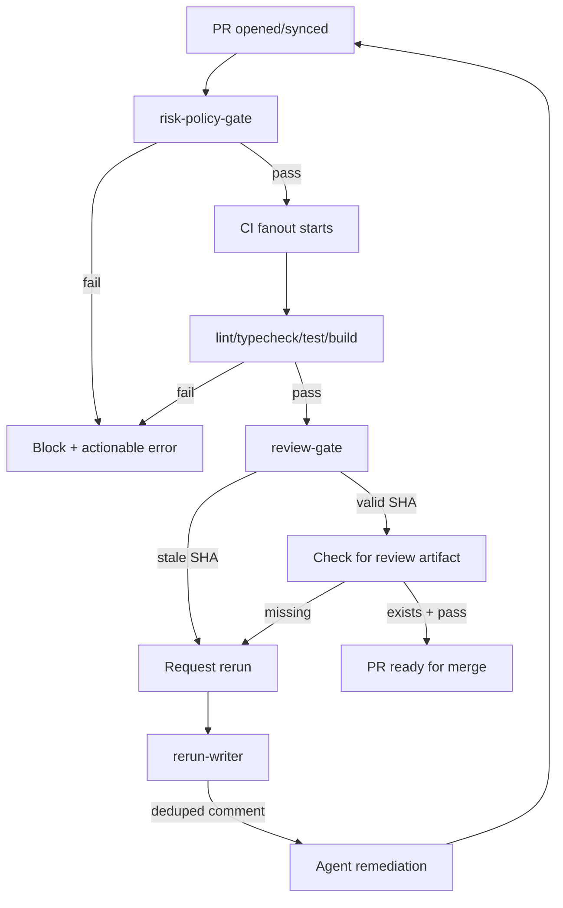

# Phase 3 GitHub Workflow Orchestration

## Enhancement Summary

**Deepened on:** 2026-02-23
**Sections enhanced:** 6
**Research agents used:** Octokit Best Practices, GitHub Actions Patterns, Retry/Backoff Research, Context7 Documentation, Security Sentinel

### Key Improvements

1. **Use @octokit/plugin-throttling** - Official plugin handles rate limits automatically (eliminates custom retry.ts complexity)
2. **Full jitter algorithm** - Prevents thundering herd on synchronized retries
3. **SHA format validation** - 40-char hex regex prevents injection attacks
4. **Markdown escaping** - Sanitize all user-provided strings in comments
5. **Workflow SHA pinning** - Pin all actions to full commit SHA for supply chain security

### New Considerations Discovered

- Token scope validation required before API calls
- Time-bound deduping (24h) prevents stale comment confusion
- GitHub secondary rate limits should NOT be retried
- Octokit's `paginate()` handles pagination automatically

### Security Findings (from Security Sentinel)

| Severity | Issue | Fix |
|----------|-------|-----|
| CRITICAL | Token stored in Octokit instance | Validate format before construction |
| CRITICAL | Retry policy too permissive | Check HTTP status codes, not strings |
| HIGH | SHA validation is string matching | Use regex `/^[0-9a-f]{40}$/` |
| HIGH | Markdown injection in comments | Escape all user input |
| MEDIUM | No token scope validation | Add `validateScopes()` method |

---

## Overview

Implement the GitHub workflow orchestration layer that enforces deterministic PR flow: preflight risk-policy-gate → CI fanout → review gate with SHA discipline → rerun comment writer with deduping.

This phase creates the enforcement mechanism that gates expensive CI jobs behind fast preflight checks and ensures review artifacts are bound to the current HEAD SHA.

## Problem Statement / Motivation

Without workflow orchestration:
- Expensive CI jobs run before policy validation (wasted compute)
- Stale review artifacts can be merged (security risk)
- Multiple rerun requests create noisy PR threads
- No deterministic ordering between gates

Phase 2 established the contract and risk-tier engine. Phase 3 builds the enforcement layer that uses those primitives.

## Proposed Solution

Create four interconnected components:

1. **risk-policy-gate** - Preflight check that blocks CI on policy violations
2. **CI fanout orchestration** - GitHub workflow templates with dependency chains
3. **review-gate** - SHA-bound review verification with timeout handling
4. **rerun-writer** - Canonical, deduplicated rerun comment mechanism

## Technical Considerations

### Architecture



### GitHub API Integration

**New dependencies:**
- `@octokit/rest` - Core GitHub REST API client
- `@octokit/plugin-throttling` - Automatic rate limit handling
- `@octokit/plugin-retry` - Built-in retry logic

### Research Insights: Octokit Best Practices

**Authentication Pattern:**
```typescript
import { Octokit } from "@octokit/rest";
import { throttling } from "@octokit/plugin-throttling";
import { retry } from "@octokit/plugin-retry";

const MyOctokit = Octokit.plugin(throttling, retry);

const octokit = new MyOctokit({
  auth: process.env.GITHUB_TOKEN,
  throttle: {
    onRateLimit: (retryAfter, options, octokit, retryCount) => {
      octokit.log.warn(`Rate limit hit for ${options.method} ${options.url}`);
      if (retryCount < 3) {
        octokit.log.info(`Retrying after ${retryAfter} seconds`);
        return true; // Retry
      }
      return false;
    },
    onSecondaryRateLimit: (retryAfter, options, octokit) => {
      // Secondary rate limits (abuse detection) - DON'T retry
      octokit.log.warn(`Secondary rate limit for ${options.method} ${options.url}`);
      return false;
    },
  },
});
```

**Pagination Pattern:**
```typescript
// Get all results across pages automatically
const issues = await octokit.paginate(octokit.rest.issues.listForRepo, {
  owner: "owner",
  repo: "repo",
  per_page: 100, // Max page size
});

// With early termination
const recentIssues = await octokit.paginate(
  octokit.rest.issues.listForRepo,
  { owner: "owner", repo: "repo" },
  (response, done) => {
    if (response.data.some(issue => isOld(issue))) {
      done(); // Stop pagination
    }
    return response.data;
  }
);
```

**Error Classification:**
```typescript
import { RequestError } from "@octokit/request-error";

type GitHubErrorCode =
  | "NOT_FOUND"
  | "FORBIDDEN"
  | "RATE_LIMITED"
  | "UNAUTHORIZED"
  | "VALIDATION_FAILED";

function classifyError(error: unknown): GitHubErrorCode {
  if (!(error instanceof RequestError)) return "UNKNOWN";

  switch (error.status) {
    case 404: return "NOT_FOUND";
    case 403:
      // Check rate limit headers
      const remaining = error.response?.headers["x-ratelimit-remaining"];
      return remaining === "0" ? "RATE_LIMITED" : "FORBIDDEN";
    case 401: return "UNAUTHORIZED";
    case 422: return "VALIDATION_FAILED";
    default: return error.status >= 500 ? "RATE_LIMITED" : "UNKNOWN";
  }
}
```

### Research Insights: Retry/Backoff Patterns

**Why Jitter is Critical:**
- Without jitter, multiple clients retry simultaneously → thundering herd
- Jitter adds randomness to distribute retry attempts across time

**Recommended: Full Jitter Algorithm:**
```typescript
// Full jitter: random between 0 and exponential delay
function calculateDelay(attempt: number, baseMs: number, maxMs: number): number {
  const exponential = Math.min(maxMs, baseMs * Math.pow(2, attempt));
  return Math.random() * exponential; // Full jitter
}
```

**Key Parameters (from brainstorm decision):**
| Parameter | Value | Rationale |
|-----------|-------|-----------|
| Base delay | 1000ms | Allow brief recovery |
| Max delay | 60000ms | Cap at 1 minute |
| Jitter | ±20% | Full jitter recommended |
| Max retries | 5 | Balance persistence vs latency |

### Research Insights: GitHub Actions Patterns

**Workflow Dependency Chains:**
```yaml
jobs:
  preflight:
    runs-on: ubuntu-latest
    outputs:
      tier: ${{ steps.gate.outputs.tier }}
    steps: [...]

  ci:
    needs: [preflight]  # Depends on preflight
    runs-on: ubuntu-latest
    steps: [...]

  deploy:
    needs: [ci]
    if: github.ref == 'refs/heads/main'
    runs-on: ubuntu-latest
    steps: [...]
```

**SHA Pinning (Supply Chain Security):**
```yaml
steps:
  # RECOMMENDED: Full SHA
  - uses: actions/checkout@b4ffde65f46336ab88eb53be808477a3936bae11  # v4.1.1

  # AVOID: Tag-based (mutable)
  # - uses: actions/checkout@v4
```

**Job Outputs:**
```yaml
jobs:
  build:
    outputs:
      artifact-path: ${{ steps.build.outputs.path }}
    steps:
      - id: build
        run: echo "path=dist/app.tar.gz" >> "$GITHUB_OUTPUT"

  deploy:
    needs: build
    steps:
      - run: echo "Deploying ${{ needs.build.outputs.artifact-path }}"
```

### SHA Discipline (Non-Negotiable)

From implementation plan Section 5:
1. Wait for review check run on `headSha`
2. Ignore stale checks/comments for older SHAs
3. Fail closed on timeout/non-success
4. Require rerun after each push/synchronize

**Security Enhancement: SHA Format Validation:**
```typescript
const SHA_PATTERN = /^[0-9a-f]{40}$/;

function validateSha(sha: string): void {
  if (!SHA_PATTERN.test(sha)) {
    throw new Error(`Invalid SHA format: must be 40 lowercase hex characters`);
  }
}
```

### Rerun Comment Contract

From implementation plan Section 6:
- Marker: `<!-- harness-review-rerun -->`
- Trigger token: `sha:<headSha>`
- Dedup: Never post duplicate for same SHA within 24h

**Security Enhancement: Markdown Escaping:**
```typescript
function escapeMarkdown(text: string): string {
  return text
    .replace(/([\\`*_{}[\]()#+\-.!])/g, '\\$1')
    .replace(/<!--/g, '&lt;!--')
    .replace(/-->/g, '--&gt;');
}
```

### Security Enhancements (from Security Sentinel)

**Token Validation:**
```typescript
const VALID_TOKEN_PREFIXES = ['ghp_', 'gho_', 'github_pat_', 'ghs_', 'ghr_'];

function validateToken(token: string): void {
  if (!token || typeof token !== 'string') {
    throw new Error('Invalid token: must be non-empty string');
  }
  if (!VALID_TOKEN_PREFIXES.some(p => token.startsWith(p))) {
    throw new Error('Invalid token: unrecognized prefix');
  }
}
```

**Scope Validation:**
```typescript
async function validateScopes(octokit: Octokit): Promise<void> {
  try {
    await octokit.users.getAuthenticated();
    // Scopes returned in X-OAuth-Scopes header
  } catch (error) {
    throw new Error('Token validation failed: insufficient scopes');
  }
}
```

## System-Wide Impact

- **Interaction graph:** risk-policy-gate calls risk-tier resolver (Phase 2); review-gate calls GitHub API; rerun-writer calls GitHub API
- **Error propagation:** GitHub API errors wrapped with Octokit plugins; all errors flow through sanitizeError
- **State lifecycle risks:** No persistent state; all operations are stateless queries
- **API surface parity:** CLI commands + GitHub workflow templates work together

## Acceptance Criteria

### Functional Requirements

- [ ] `src/lib/github/client.ts` - Octokit wrapper with throttling plugin
- [ ] `src/lib/github/sha.ts` - HEAD SHA fetching and validation with regex
- [ ] `src/lib/github/check-run.ts` - Check run query helpers
- [ ] `src/lib/github/comments.ts` - Comment posting with deduping and markdown escaping
- [ ] `src/commands/policy-gate.ts` - Preflight risk-policy-gate command
- [ ] `src/commands/review-gate.ts` - Review gate with SHA discipline
- [ ] `templates/repo/.github/workflows/risk-policy-gate.yml` - Preflight workflow with SHA-pinned actions
- [ ] `templates/repo/.github/workflows/ci-pipeline.yml` - CI fanout (depends on preflight)
- [ ] `templates/repo/.github/workflows/review-gate.yml` - Review verification workflow
- [ ] Contract extended with `reviewPolicy` (timeoutSeconds, timeoutAction)

### Security Requirements

- [ ] Token format validation before Octokit construction
- [ ] Token scope validation on client initialization
- [ ] SHA validation with `/^[0-9a-f]{40}$/` regex
- [ ] Markdown escaping for all user-provided comment content
- [ ] Time-bound deduping (24h max age)
- [ ] All workflow actions pinned to full SHA
- [ ] No retry on secondary rate limits (abuse detection)

### Agent-Native Requirements

- [ ] `--json` flag on all commands
- [ ] Exit codes: 0 (pass), 1 (validation fail), 2 (not found), 3 (permission), 10+ (system)
- [ ] Machine-readable error codes for each failure mode

### Quality Gates

- [ ] `pnpm check` passes
- [ ] Unit tests for SHA validation
- [ ] Unit tests for comment deduping with time bounds
- [ ] Unit tests for markdown escaping
- [ ] Follows command pattern from risk-tier.ts

## Success Metrics

1. `harness policy-gate --files "src/auth/**"` exits 0 (pass) or 1 (fail) with actionable error
2. `harness review-gate --sha abc123...` validates SHA matches current HEAD
3. Stale SHA detection returns specific error code (not generic failure)
4. Duplicate rerun comments are suppressed (same SHA within 24h)
5. GitHub API rate limits handled automatically by Octokit plugin
6. Token with insufficient scopes fails fast with clear error message

## Dependencies & Risks

### Dependencies
- Phase 2 contract and risk-tier core (complete)
- **New dependencies:** `@octokit/rest`, `@octokit/plugin-throttling`, `@octokit/plugin-retry`

### Risks
| Risk | Mitigation |
|------|------------|
| GitHub API rate limits | @octokit/plugin-throttling handles automatically |
| Stale SHA edge cases | Exact SHA comparison with regex validation |
| Comment spam | Time-bound deduping (24h) + bot-only trust |
| Token permissions | Scope validation on initialization |
| Supply chain | Pin all workflow actions to full SHA |

## MVP Implementation

### package.json (add Octokit with plugins)

```json
{
  "devDependencies": {
    "@biomejs/biome": "^1.9.4",
    "@octokit/plugin-retry": "^7.0.0",
    "@octokit/plugin-throttling": "^9.0.0",
    "@octokit/rest": "^21.0.0",
    "@types/node": "^22.0.0",
    "picomatch": "^4.0.0",
    "typescript": "^5.9.0",
    "vitest": "^3.0.0"
  }
}
```

### src/lib/github/client.ts

```typescript
import { Octokit } from "@octokit/rest";
import { throttling } from "@octokit/plugin-throttling";
import { retry } from "@octokit/plugin-retry";

const MyOctokit = Octokit.plugin(throttling, retry);

const VALID_TOKEN_PREFIXES = ['ghp_', 'gho_', 'github_pat_', 'ghs_', 'ghr_'];

function validateToken(token: string): void {
	if (!token || typeof token !== 'string') {
		throw new Error('Invalid token: must be non-empty string');
	}
	if (!VALID_TOKEN_PREFIXES.some(p => token.startsWith(p))) {
		throw new Error('Invalid token: unrecognized prefix');
	}
}

export interface GitHubClientOptions {
	token: string;
	owner: string;
	repo: string;
}

export class GitHubClient {
	private octokit: InstanceType<typeof MyOctokit>;
	private owner: string;
	private repo: string;

	constructor(options: GitHubClientOptions) {
		validateToken(options.token);

		this.octokit = new MyOctokit({
			auth: options.token,
			throttle: {
				onRateLimit: (retryAfter, options, octokit, retryCount) => {
					octokit.log.warn(`Rate limit hit for ${options.method} ${options.url}`);
					if (retryCount < 3) {
						octokit.log.info(`Retrying after ${retryAfter} seconds`);
						return true;
					}
					return false;
				},
				onSecondaryRateLimit: (_retryAfter, options, octokit) => {
					// Don't retry secondary rate limits (abuse detection)
					octokit.log.warn(`Secondary rate limit for ${options.method} ${options.url}`);
					return false;
				},
			},
		});
		this.owner = options.owner;
		this.repo = options.repo;
	}

	async validateScopes(): Promise<boolean> {
		try {
			await this.octokit.users.getAuthenticated();
			return true;
		} catch {
			return false;
		}
	}

	async getPullRequest(number: number) {
		return this.octokit.pulls.get({
			owner: this.owner,
			repo: this.repo,
			pull_number: number,
		});
	}

	async listCheckRunsForRef(ref: string) {
		return this.octokit.paginate(this.octokit.checks.listForRef, {
			owner: this.owner,
			repo: this.repo,
			ref,
			per_page: 100,
		});
	}

	async createIssueComment(issueNumber: number, body: string) {
		return this.octokit.issues.createComment({
			owner: this.owner,
			repo: this.repo,
			issue_number: issueNumber,
			body,
		});
	}

	async listIssueComments(issueNumber: number) {
		return this.octokit.paginate(this.octokit.issues.listComments, {
			owner: this.owner,
			repo: this.repo,
			issue_number: issueNumber,
			per_page: 100,
		});
	}
}
```

### src/lib/github/sha.ts

```typescript
const SHA_PATTERN = /^[0-9a-f]{40}$/;

export class ShaValidationError extends Error {
	constructor(sha: string) {
		super(`Invalid SHA format: ${sha}`);
		this.name = "ShaValidationError";
	}
}

export function validateSha(sha: string): void {
	if (!SHA_PATTERN.test(sha)) {
		throw new ShaValidationError(sha);
	}
}

export function isValidSha(sha: unknown): sha is string {
	return typeof sha === "string" && SHA_PATTERN.test(sha);
}
```

### src/lib/github/comments.ts

```typescript
import type { validateSha } from "./sha.js";

const RERUN_MARKER = "<!-- harness-review-rerun -->";
const DEDUP_MAX_AGE_HOURS = 24;

function escapeMarkdown(text: string): string {
	return text
		.replace(/([\\`*_{}[\]()#+\-.!])/g, '\\$1')
		.replace(/<!--/g, '&lt;!--')
		.replace(/-->/g, '--&gt;');
}

export function formatRerunComment(headSha: string, reason: string): string {
	// Validate SHA format
	if (!/^[0-9a-f]{40}$/.test(headSha)) {
		throw new Error(`Invalid SHA format: ${headSha}`);
	}

	const safeReason = escapeMarkdown(reason);

	return `${RERUN_MARKER}
## Review Rerun Requested

**SHA:** \`${headSha}\`
**Reason:** ${safeReason}
**Timestamp:** ${new Date().toISOString()}

An agent will re-run the review for this SHA.
`;
}

export interface Comment {
	body: string;
	created_at: string;
	user: { login: string };
}

export function hasRerunCommentForSha(
	comments: Comment[],
	headSha: string,
	botLogin: string,
): boolean {
	// Validate SHA format
	if (!/^[0-9a-f]{40}$/.test(headSha)) {
		return false;
	}

	const cutoff = new Date(Date.now() - DEDUP_MAX_AGE_HOURS * 60 * 60 * 1000);

	return comments.some((comment) => {
		// Only trust comments from our bot
		if (comment.user.login !== botLogin) return false;
		if (!comment.body.includes(RERUN_MARKER)) return false;

		// Check age
		const commentTime = new Date(comment.created_at);
		if (commentTime < cutoff) return false;

		// Use regex for precise SHA matching
		const shaMatch = comment.body.match(/SHA: `([0-9a-f]{40})`/);
		return shaMatch !== null && shaMatch[1] === headSha;
	});
}
```

### src/lib/contract/types.ts (extend)

```typescript
export type RiskTier = "high" | "medium" | "low";

export interface ReviewPolicy {
	timeoutSeconds: number;
	timeoutAction: "fail" | "warn";
}

export interface HarnessContract {
	version: string;
	riskTierRules: Record<string, RiskTier>;
	reviewPolicy?: ReviewPolicy;
}

export const DEFAULT_CONTRACT: HarnessContract = {
	version: "1.0",
	riskTierRules: {},
	reviewPolicy: {
		timeoutSeconds: 600, // 10 min per brainstorm
		timeoutAction: "fail",
	},
};
```

### src/commands/policy-gate.ts

```typescript
import { ContractLoadError, loadContract } from "../lib/contract/loader.js";
import { resolveOverallTier } from "../lib/policy/risk-tier.js";
import { sanitizeError } from "../lib/input/sanitize.js";
import type { RiskTier } from "../lib/contract/types.js";

export const EXIT_CODES = {
	SUCCESS: 0,
	POLICY_VIOLATION: 1,
	FILE_NOT_FOUND: 2,
	PERMISSION_DENIED: 3,
	SYSTEM_ERROR: 10,
} as const;

export interface PolicyGateOptions {
	contractPath: string;
	files: string[];
	json?: boolean;
	maxTier?: RiskTier;
}

export interface PolicyGateOutput {
	passed: boolean;
	tier: RiskTier;
	maxAllowed?: RiskTier;
	violatingFiles: string[];
}

export type PolicyGateResult =
	| { ok: true; output: PolicyGateOutput }
	| { ok: false; error: { code: string; message: string } };

/**
 * Run policy gate check (library function).
 */
export function runPolicyGate(options: PolicyGateOptions): PolicyGateResult {
	try {
		const contract = loadContract(options.contractPath);
		const tier = resolveOverallTier(options.files, contract);

		// If no max tier specified, all pass
		if (!options.maxTier) {
			return {
				ok: true,
				output: { passed: true, tier, violatingFiles: [] },
			};
		}

		const tierOrder: RiskTier[] = ["high", "medium", "low"];
		const maxTierIndex = tierOrder.indexOf(options.maxTier);
		const actualTierIndex = tierOrder.indexOf(tier);

		if (actualTierIndex > maxTierIndex) {
			return {
				ok: true,
				output: {
					passed: false,
					tier,
					maxAllowed: options.maxTier,
					violatingFiles: options.files,
				},
			};
		}

		return {
			ok: true,
			output: { passed: true, tier, violatingFiles: [] },
		};
	} catch (e) {
		if (e instanceof ContractLoadError) {
			return {
				ok: false,
				error: { code: "VALIDATION_ERROR", message: sanitizeError(e) },
			};
		}
		return {
			ok: false,
			error: { code: "SYSTEM_ERROR", message: sanitizeError(e) },
		};
	}
}

/**
 * CLI entry point.
 */
export function runPolicyGateCLI(options: PolicyGateOptions): number {
	const result = runPolicyGate(options);

	if (result.ok) {
		if (options.json) {
			console.info(JSON.stringify(result.output));
		} else if (result.output.passed) {
			console.info(`✓ Policy gate passed (tier: ${result.output.tier})`);
		} else {
			console.error(
				`✗ Policy gate failed: tier ${result.output.tier} exceeds max ${result.output.maxAllowed}`,
			);
		}
		return result.output.passed ? EXIT_CODES.SUCCESS : EXIT_CODES.POLICY_VIOLATION;
	}

	console.error(result.error.message);
	return EXIT_CODES.SYSTEM_ERROR;
}
```

### templates/repo/.github/workflows/risk-policy-gate.yml

```yaml
name: Risk Policy Gate

on:
  pull_request:
    types: [opened, synchronize, reopened]

jobs:
  preflight:
    runs-on: ubuntu-latest
    outputs:
      tier: ${{ steps.gate.outputs.tier }}
      passed: ${{ steps.gate.outputs.passed }}

    steps:
      # Pin to full SHA for supply chain security
      - uses: actions/checkout@b4ffde65f46336ab88eb53be808477a3936bae11
        with:
          fetch-depth: 0

      - name: Setup Node
        uses: actions/setup-node@60edb5dd545a775178f52524783378180af0d1f8
        with:
          node-version: '24'

      - name: Install harness
        run: npm install -g @jamiecraik/coding-harness

      - name: Get changed files
        id: files
        run: |
          FILES=$(git diff --name-only origin/${{ github.base_ref }} HEAD | tr '\n' ',')
          echo "files=${FILES%,}" >> "$GITHUB_OUTPUT"

      - name: Run policy gate
        id: gate
        run: |
          harness policy-gate \
            --contract harness.contract.json \
            --files "${{ steps.files.outputs.files }}" \
            --max-tier medium \
            --json > gate-result.json

          TIER=$(jq -r '.tier' gate-result.json)
          PASSED=$(jq -r '.passed' gate-result.json)

          # Validate outputs
          if [[ ! "$TIER" =~ ^(high|medium|low)$ ]]; then
            echo "::error::Invalid tier value in output"
            exit 1
          fi

          echo "tier=${TIER}" >> "$GITHUB_OUTPUT"
          echo "passed=${PASSED}" >> "$GITHUB_OUTPUT"

          if [ "$PASSED" != "true" ]; then
            echo "::error::Policy gate failed: tier ${TIER} exceeds maximum allowed"
            exit 1
          fi
```

### templates/repo/.github/workflows/ci-pipeline.yml

```yaml
name: CI Pipeline

on:
  pull_request:
    types: [opened, synchronize, reopened]

jobs:
  # Depends on preflight from risk-policy-gate.yml
  ci:
    runs-on: ubuntu-latest
    needs: [preflight]

    steps:
      - uses: actions/checkout@b4ffde65f46336ab88eb53be808477a3936bae11

      - name: Setup Node
        uses: actions/setup-node@60edb5dd545a775178f52524783378180af0d1f8
        with:
          node-version: '24'
          cache: 'pnpm'

      - name: Install dependencies
        run: pnpm install --frozen-lockfile

      - name: Lint
        run: pnpm lint

      - name: Typecheck
        run: pnpm typecheck

      - name: Test
        run: pnpm test

      - name: Build
        run: pnpm build
```

## Sources & References

### Origin

- **Brainstorm document:** [docs/brainstorms/2026-02-22-harness-gap-analysis-brainstorm.md](../brainstorms/2026-02-22-harness-gap-analysis-brainstorm.md)
- **Key decisions carried forward:**
  - GitHub API rate limiting: Exponential backoff with jitter
  - Agent timeout: 10 minute default, fail PR on timeout
  - Testing strategy: Hybrid fixtures + CI integration

### Research Sources

- **Octokit Documentation:** Official docs on authentication, throttling, pagination
- **GitHub Actions Patterns:** Workflow syntax, job dependencies, SHA pinning
- **Retry/Backoff Research:** Full jitter algorithm, thundering herd prevention
- **Security Review:** Token validation, SHA format, markdown escaping

### Internal References

- Command pattern: `src/commands/risk-tier.ts`
- Contract types: `src/lib/contract/types.ts`
- Error handling: `src/lib/input/sanitize.ts`
- Implementation plan: `docs/HARNESS_IMPLEMENTATION_PLAN.md` Section 5, 6, 10

### External References

- Octokit REST API: https://github.com/octokit/rest.js
- Octokit Throttling Plugin: https://github.com/octokit/plugin-throttling.js
- GitHub Checks API: https://docs.github.com/en/rest/checks
- GitHub Actions Workflow Syntax: https://docs.github.com/en/actions/reference/workflow-syntax-for-github-actions
- AWS Architecture Blog - Exponential Backoff and Jitter: https://aws.amazon.com/blogs/architecture/exponential-backoff-and-jitter/
