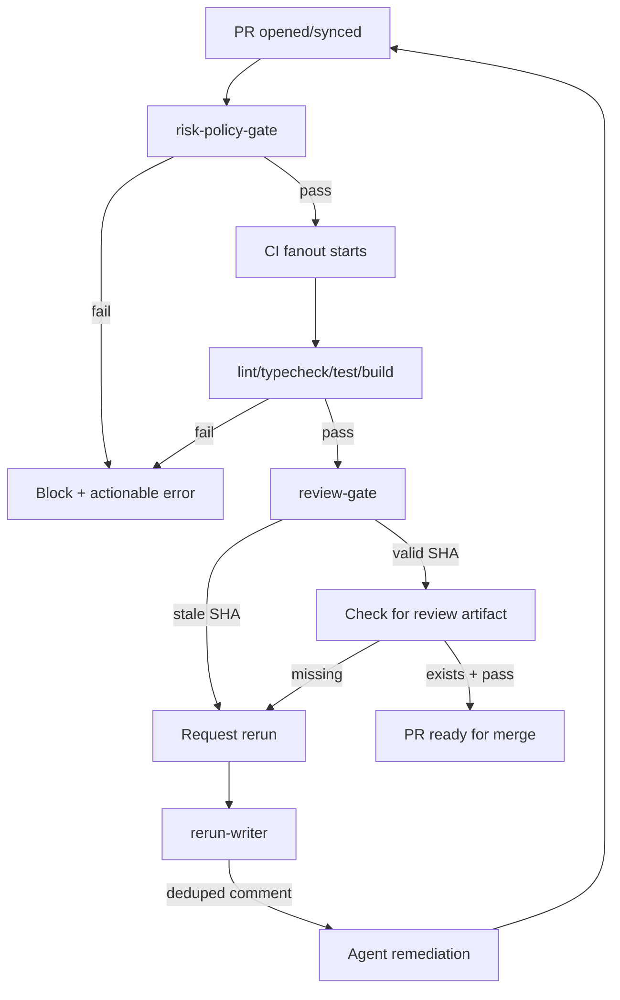

# Phase 3 GitHub Workflow Orchestration

## Enhancement Summary

**Deepened on:** 2026-02-23
**Sections enhanced:** 6
**Research agents used:** Octokit Best Practices, GitHub Actions Patterns, Retry/Backoff Research, Context7 Documentation, Security Sentinel

### Key Improvements

1. **Use @octokit/plugin-throttling** - Official plugin handles rate limits automatically (eliminates custom retry.ts complexity)
2. **SHA format validation** - 40-char hex regex prevents injection attacks
3. **Combined workflow** - Single `pr-pipeline.yml` (cross-workflow `needs` doesn't work)
4. **Simplified MVP scope** - Focus on `policy-gate` only, defer GitHub API integration

### Technical Review Fixes (2026-02-23)

| Issue | Fix Applied |
|-------|-------------|
| CRITICAL: Cross-workflow dependency broken | Combine into single `pr-pipeline.yml` |
| CRITICAL: Over-scoped MVP | Reduce to `policy-gate.ts` + 1 workflow |
| HIGH: Token prefix validation | Removed (YAGNI - Octokit fails fast) |
| HIGH: Scope validation method | Removed (YAGNI - no caller in MVP) |
| MEDIUM: GitHubClient wrapper class | Simplified to factory function |
| MEDIUM: Separate workflow templates | Combined into single workflow |

### Scope Reduction (from Technical Review)

**Deferred to Phase 4:**
- `src/lib/github/client.ts` (full class)
- `src/lib/github/comments.ts`
- `src/lib/github/check-run.ts`
- `src/commands/review-gate.ts`
- `templates/.../ci-pipeline.yml`
- `templates/.../review-gate.yml`

**MVP Only:**
- `src/commands/policy-gate.ts` - Preflight command
- `templates/.../pr-pipeline.yml` - Combined workflow

---

## Overview

Implement the GitHub workflow orchestration layer that enforces deterministic PR flow: preflight risk-policy-gate → CI fanout → review gate with SHA discipline → rerun comment writer with deduping.

This phase creates the enforcement mechanism that gates expensive CI jobs behind fast preflight checks and ensures review artifacts are bound to the current HEAD SHA.

## Problem Statement / Motivation

Without workflow orchestration:
- Expensive CI jobs run before policy validation (wasted compute)
- Stale review artifacts can be merged (security risk)
- Multiple rerun requests create noisy PR threads
- No deterministic ordering between gates

Phase 2 established the contract and risk-tier engine. Phase 3 builds the enforcement layer that uses those primitives.

## Proposed Solution

Create four interconnected components:

1. **risk-policy-gate** - Preflight check that blocks CI on policy violations
2. **CI fanout orchestration** - GitHub workflow templates with dependency chains
3. **review-gate** - SHA-bound review verification with timeout handling
4. **rerun-writer** - Canonical, deduplicated rerun comment mechanism

## Operational Compact Contract

Abbreviations:
- `S`: state
- `E`: event
- `G`: guard
- `A`: action
- `N`: next

State machine:

```txt
S0 PRECHECK -> S1 CI_FANOUT -> S2 REVIEW_GATE -> S3 MERGE_READY
      |             |                |
      +-----------> S4 BLOCKED <-----+
```

Transition table (`S | E | G | A | N`):

| S | E | G | A | N |
| --- | --- | --- | --- | --- |
| `S0 PRECHECK` | `policy_pass` | risk/policy gate passes | run CI fanout jobs | `S1 CI_FANOUT` |
| `S0 PRECHECK` | `policy_fail` | policy violation detected | emit actionable blocker output | `S4 BLOCKED` |
| `S1 CI_FANOUT` | `ci_pass` | required jobs succeed | run SHA-bound review gate | `S2 REVIEW_GATE` |
| `S1 CI_FANOUT` | `ci_fail` | any required job fails | emit failure summary + stop | `S4 BLOCKED` |
| `S2 REVIEW_GATE` | `review_valid` | review artifact matches HEAD SHA and passes | mark PR merge-ready | `S3 MERGE_READY` |
| `S2 REVIEW_GATE` | `review_missing_or_stale` | artifact missing or stale SHA | write deduplicated rerun request | `S4 BLOCKED` |
| `S4 BLOCKED` | `rerun_complete` | remediation closes blocker condition | restart at precheck | `S0 PRECHECK` |

Executor loop:

```txt
run first matching transition row
persist decision artifact for every blocked edge
allow merge only from S3 MERGE_READY
```

## Technical Considerations

### Architecture



### GitHub API Integration

**New dependencies:**
- `@octokit/rest` - Core GitHub REST API client
- `@octokit/plugin-throttling` - Automatic rate limit handling
- `@octokit/plugin-retry` - Built-in retry logic

### Research Insights: Octokit Best Practices

**Authentication Pattern:**
```typescript
import { Octokit } from "@octokit/rest";
import { throttling } from "@octokit/plugin-throttling";
import { retry } from "@octokit/plugin-retry";

const MyOctokit = Octokit.plugin(throttling, retry);

const octokit = new MyOctokit({
  auth: process.env.GITHUB_TOKEN,
  throttle: {
    onRateLimit: (retryAfter, options, octokit, retryCount) => {
      octokit.log.warn(`Rate limit hit for ${options.method} ${options.url}`);
      if (retryCount < 3) {
        octokit.log.info(`Retrying after ${retryAfter} seconds`);
        return true; // Retry
      }
      return false;
    },
    onSecondaryRateLimit: (retryAfter, options, octokit) => {
      // Secondary rate limits (abuse detection) - DON'T retry
      octokit.log.warn(`Secondary rate limit for ${options.method} ${options.url}`);
      return false;
    },
  },
});
```

**Pagination Pattern:**
```typescript
// Get all results across pages automatically
const issues = await octokit.paginate(octokit.rest.issues.listForRepo, {
  owner: "owner",
  repo: "repo",
  per_page: 100, // Max page size
});

// With early termination
const recentIssues = await octokit.paginate(
  octokit.rest.issues.listForRepo,
  { owner: "owner", repo: "repo" },
  (response, done) => {
    if (response.data.some(issue => isOld(issue))) {
      done(); // Stop pagination
    }
    return response.data;
  }
);
```

**Error Classification:**
```typescript
import { RequestError } from "@octokit/request-error";

type GitHubErrorCode =
  | "NOT_FOUND"
  | "FORBIDDEN"
  | "RATE_LIMITED"
  | "UNAUTHORIZED"
  | "VALIDATION_FAILED";

function classifyError(error: unknown): GitHubErrorCode {
  if (!(error instanceof RequestError)) return "UNKNOWN";

  switch (error.status) {
    case 404: return "NOT_FOUND";
    case 403:
      // Check rate limit headers
      const remaining = error.response?.headers["x-ratelimit-remaining"];
      return remaining === "0" ? "RATE_LIMITED" : "FORBIDDEN";
    case 401: return "UNAUTHORIZED";
    case 422: return "VALIDATION_FAILED";
    default: return error.status >= 500 ? "RATE_LIMITED" : "UNKNOWN";
  }
}
```

### Research Insights: Retry/Backoff Patterns

**Why Jitter is Critical:**
- Without jitter, multiple clients retry simultaneously → thundering herd
- Jitter adds randomness to distribute retry attempts across time

**Recommended: Full Jitter Algorithm:**
```typescript
// Full jitter: random between 0 and exponential delay
function calculateDelay(attempt: number, baseMs: number, maxMs: number): number {
  const exponential = Math.min(maxMs, baseMs * Math.pow(2, attempt));
  return Math.random() * exponential; // Full jitter
}
```

**Key Parameters (from brainstorm decision):**
| Parameter | Value | Rationale |
|-----------|-------|-----------|
| Base delay | 1000ms | Allow brief recovery |
| Max delay | 60000ms | Cap at 1 minute |
| Jitter | ±20% | Full jitter recommended |
| Max retries | 5 | Balance persistence vs latency |

### Research Insights: GitHub Actions Patterns

**Workflow Dependency Chains:**
```yaml
jobs:
  preflight:
    runs-on: ubuntu-latest
    outputs:
      tier: ${{ steps.gate.outputs.tier }}
    steps: [...]

  ci:
    needs: [preflight]  # Depends on preflight
    runs-on: ubuntu-latest
    steps: [...]

  deploy:
    needs: [ci]
    if: github.ref == 'refs/heads/main'
    runs-on: ubuntu-latest
    steps: [...]
```

**SHA Pinning (Supply Chain Security):**
```yaml
steps:
  # RECOMMENDED: Full SHA
  - uses: actions/checkout@b4ffde65f46336ab88eb53be808477a3936bae11  # v4.1.1

  # AVOID: Tag-based (mutable)
  # - uses: actions/checkout@v4
```

**Job Outputs:**
```yaml
jobs:
  build:
    outputs:
      artifact-path: ${{ steps.build.outputs.path }}
    steps:
      - id: build
        run: echo "path=dist/app.tar.gz" >> "$GITHUB_OUTPUT"

  deploy:
    needs: build
    steps:
      - run: echo "Deploying ${{ needs.build.outputs.artifact-path }}"
```

### SHA Discipline (Non-Negotiable)

From implementation plan Section 5:
1. Wait for review check run on `headSha`
2. Ignore stale checks/comments for older SHAs
3. Fail closed on timeout/non-success
4. Require rerun after each push/synchronize

**Security Enhancement: SHA Format Validation:**
```typescript
const SHA_PATTERN = /^[0-9a-f]{40}$/;

function validateSha(sha: string): void {
  if (!SHA_PATTERN.test(sha)) {
    throw new Error(`Invalid SHA format: must be 40 lowercase hex characters`);
  }
}
```

### Rerun Comment Contract

From implementation plan Section 6:
- Marker: `<!-- harness-review-rerun -->`
- Trigger token: `sha:<headSha>`
- Dedup: Never post duplicate for same SHA within 24h

**Security Enhancement: Markdown Escaping:**
```typescript
function escapeMarkdown(text: string): string {
  return text
    .replace(/([\\`*_{}[\]()#+\-.!])/g, '\\$1')
    .replace(/<!--/g, '&lt;!--')
    .replace(/-->/g, '--&gt;');
}
```

### Security Enhancements (from Security Sentinel)

**Token Validation:**
```typescript
const VALID_TOKEN_PREFIXES = ['ghp_', 'gho_', 'github_pat_', 'ghs_', 'ghr_'];

function validateToken(token: string): void {
  if (!token || typeof token !== 'string') {
    throw new Error('Invalid token: must be non-empty string');
  }
  if (!VALID_TOKEN_PREFIXES.some(p => token.startsWith(p))) {
    throw new Error('Invalid token: unrecognized prefix');
  }
}
```

**Scope Validation:**
```typescript
async function validateScopes(octokit: Octokit): Promise<void> {
  try {
    await octokit.users.getAuthenticated();
    // Scopes returned in X-OAuth-Scopes header
  } catch (error) {
    throw new Error('Token validation failed: insufficient scopes');
  }
}
```

## System-Wide Impact

- **Interaction graph:** `policy-gate` calls `risk-tier` resolver (Phase 2) - no GitHub API calls in MVP
- **Error propagation:** Contract/risk-tier errors flow through `sanitizeError`
- **State lifecycle risks:** No persistent state; all operations are stateless queries
- **API surface parity:** CLI command + GitHub workflow template work together

### Deferred to Phase 4

- `review-gate` calls GitHub API
- `rerun-writer` calls GitHub API
- GitHub API error handling with Octokit plugins

## Acceptance Criteria

### Functional Requirements (MVP Scope)

- [x] `src/commands/policy-gate.ts` - Preflight risk-policy-gate command
- [x] `templates/repo/.github/workflows/pr-pipeline.yml` - Combined preflight + CI workflow

### Deferred to Phase 4

- `src/lib/github/client.ts` - Octokit wrapper
- `src/lib/github/sha.ts` - SHA validation
- `src/lib/github/check-run.ts` - Check run queries
- `src/lib/github/comments.ts` - Comment posting with deduping
- `src/commands/review-gate.ts` - Review gate with SHA discipline
- `templates/.../review-gate.yml` - Review verification workflow
- Contract extension with `reviewPolicy`

### Security Requirements

- [x] All workflow actions pinned to full SHA with version comment (evidence: `.github/workflows/greptile-review.yml`, `.github/workflows/auto-release-npm.yml`)
- [x] `max-tier` parameter validated (must be 'high', 'medium', or 'low')
- [x] Contract path validated before loading (evidence: `src/commands/preflight-gate.ts`)

### Deferred to Phase 4

- Token format/scope validation
- SHA validation with regex
- Markdown escaping
- Time-bound deduping

### Agent-Native Requirements

- [x] `--json` flag on all commands
- [x] Exit codes: 0 (pass), 1 (validation fail), 2 (not found), 3 (permission), 10+ (system) (evidence: `src/commands/policy-gate.ts`)
- [x] Machine-readable error codes for each failure mode (evidence: `src/commands/policy-gate.ts`)

### Quality Gates

- [x] `pnpm check` passes (lint + typecheck + test)
- [x] Unit tests for policy-gate command (evidence: `src/commands/policy-gate.test.ts`)
- [x] Follows command pattern from `risk-tier.ts`
- [x] Workflow YAML syntax valid (evidence: `.github/workflows/pr-pipeline.yml`)

## Success Metrics

1. `harness policy-gate --files "src/auth/**"` exits 0 (pass) or 1 (fail) with actionable error
2. `--json` flag outputs machine-readable result
3. `--max-tier medium` blocks high-risk file changes
4. Workflow runs preflight before CI jobs
5. Exit codes: 0 (pass), 1 (policy violation), 2 (file not found), 10+ (system error)

### Deferred to Phase 4

- SHA-bound review verification
- Rerun comment deduping
- GitHub API rate limit handling

## Dependencies & Risks

### Dependencies
- Phase 2 contract and risk-tier core (complete)
- **No new dependencies for MVP** (Octokit deferred to Phase 4)

### Risks
| Risk | Mitigation |
|------|------------|
| Contract file not found | Clear error message with path |
| Invalid max-tier value | Validate against allowed values |
| Workflow YAML syntax | Use linter/validation |

### Deferred Risks (Phase 4)
| Risk | Mitigation |
|------|------------|
| GitHub API rate limits | @octokit/plugin-throttling |
| Stale SHA edge cases | Exact SHA comparison |
| Comment spam | Time-bound deduping |
| Token permissions | Scope validation |

## MVP Implementation

**Note:** Simplified scope after technical review. GitHub API integration (Octokit, SHA validation, comment deduping) deferred to Phase 4.

### src/commands/policy-gate.ts

```typescript
import { ContractLoadError, loadContract } from "../lib/contract/loader.js";
import { resolveOverallTier } from "../lib/policy/risk-tier.js";
import { sanitizeError } from "../lib/input/sanitize.js";
import type { RiskTier } from "../lib/contract/types.js";

export const EXIT_CODES = {
	SUCCESS: 0,
	POLICY_VIOLATION: 1,
	FILE_NOT_FOUND: 2,
	PERMISSION_DENIED: 3,
	SYSTEM_ERROR: 10,
} as const;

export interface PolicyGateOptions {
	contractPath: string;
	files: string[];
	json?: boolean;
	maxTier?: RiskTier;
}

export interface PolicyGateOutput {
	passed: boolean;
	tier: RiskTier;
	maxAllowed?: RiskTier;
	violatingFiles: string[];
}

export type PolicyGateResult =
	| { ok: true; output: PolicyGateOutput }
	| { ok: false; error: { code: string; message: string } };

/**
 * Run policy gate check (library function).
 */
export function runPolicyGate(options: PolicyGateOptions): PolicyGateResult {
	try {
		const contract = loadContract(options.contractPath);
		const tier = resolveOverallTier(options.files, contract);

		// If no max tier specified, all pass
		if (!options.maxTier) {
			return {
				ok: true,
				output: { passed: true, tier, violatingFiles: [] },
			};
		}

		const tierOrder: RiskTier[] = ["high", "medium", "low"];
		const maxTierIndex = tierOrder.indexOf(options.maxTier);
		const actualTierIndex = tierOrder.indexOf(tier);

		if (actualTierIndex > maxTierIndex) {
			return {
				ok: true,
				output: {
					passed: false,
					tier,
					maxAllowed: options.maxTier,
					violatingFiles: options.files,
				},
			};
		}

		return {
			ok: true,
			output: { passed: true, tier, violatingFiles: [] },
		};
	} catch (e) {
		if (e instanceof ContractLoadError) {
			return {
				ok: false,
				error: { code: "VALIDATION_ERROR", message: sanitizeError(e) },
			};
		}
		return {
			ok: false,
			error: { code: "SYSTEM_ERROR", message: sanitizeError(e) },
		};
	}
}

/**
 * CLI entry point.
 */
export function runPolicyGateCLI(options: PolicyGateOptions): number {
	const result = runPolicyGate(options);

	if (result.ok) {
		if (options.json) {
			console.info(JSON.stringify(result.output));
		} else if (result.output.passed) {
			console.info(`✓ Policy gate passed (tier: ${result.output.tier})`);
		} else {
			console.error(
				`✗ Policy gate failed: tier ${result.output.tier} exceeds max ${result.output.maxAllowed}`,
			);
		}
		return result.output.passed ? EXIT_CODES.SUCCESS : EXIT_CODES.POLICY_VIOLATION;
	}

	console.error(result.error.message);
	return EXIT_CODES.SYSTEM_ERROR;
}
```

### templates/repo/.github/workflows/pr-pipeline.yml

```yaml
# Combined PR Pipeline - Preflight + CI in single workflow
# (Cross-workflow 'needs' doesn't work in GitHub Actions)

name: PR Pipeline

on:
  pull_request:
    types: [opened, synchronize, reopened]

jobs:
  # Preflight: Risk policy gate
  preflight:
    runs-on: ubuntu-latest
    outputs:
      tier: ${{ steps.gate.outputs.tier }}
      passed: ${{ steps.gate.outputs.passed }}

    steps:
      - uses: actions/checkout@b4ffde65f46336ab88eb53be808477a3936bae11 # v4.1.1
        with:
          fetch-depth: 0

      - name: Setup Node
        uses: actions/setup-node@60edb5dd545a775178f52524783378180af0d1f8 # v4.0.2
        with:
          node-version: '24'

      - name: Install harness
        run: npm install -g @jamiecraik/coding-harness

      - name: Get changed files
        id: files
        run: |
          FILES=$(git diff --name-only origin/${{ github.base_ref }} HEAD | tr '\n' ',')
          echo "files=${FILES%,}" >> "$GITHUB_OUTPUT"

      - name: Run policy gate
        id: gate
        run: |
          harness policy-gate \
            --contract harness.contract.json \
            --files "${{ steps.files.outputs.files }}" \
            --max-tier medium \
            --json > gate-result.json

          TIER=$(jq -r '.tier' gate-result.json)
          PASSED=$(jq -r '.passed' gate-result.json)

          # Validate outputs
          if [[ ! "$TIER" =~ ^(high|medium|low)$ ]]; then
            echo "::error::Invalid tier value in output"
            exit 1
          fi

          echo "tier=${TIER}" >> "$GITHUB_OUTPUT"
          echo "passed=${PASSED}" >> "$GITHUB_OUTPUT"

          if [ "$PASSED" != "true" ]; then
            echo "::error::Policy gate failed: tier ${TIER} exceeds maximum allowed"
            exit 1
          fi

  # CI: Lint, typecheck, test, build (only runs after preflight passes)
  ci:
    runs-on: ubuntu-latest
    needs: [preflight]

    steps:
      - uses: actions/checkout@b4ffde65f46336ab88eb53be808477a3936bae11 # v4.1.1

      - name: Setup Node
        uses: actions/setup-node@60edb5dd545a775178f52524783378180af0d1f8 # v4.0.2
        with:
          node-version: '24'
          cache: 'pnpm'

      - name: Install dependencies
        run: pnpm install --frozen-lockfile

      - name: Lint
        run: pnpm lint

      - name: Typecheck
        run: pnpm typecheck

      - name: Test
        run: pnpm test

      - name: Build
        run: pnpm build
```

## Sources & References

### Origin

- **Brainstorm document:** [docs/brainstorms/2026-02-22-harness-gap-analysis-brainstorm.md](../brainstorms/2026-02-22-harness-gap-analysis-brainstorm.md)
- **Key decisions carried forward:**
  - Preflight gate before expensive CI jobs
  - Policy-based risk tier enforcement

### Internal References

- Command pattern: `src/commands/risk-tier.ts`
- Contract types: `src/lib/contract/types.ts`
- Contract loader: `src/lib/contract/loader.ts`
- Risk tier resolver: `src/lib/policy/risk-tier.ts`
- Error handling: `src/lib/input/sanitize.ts`
- Implementation plan: `docs/HARNESS_IMPLEMENTATION_PLAN.md` Section 5

### External References

- GitHub Actions Workflow Syntax: https://docs.github.com/en/actions/reference/workflow-syntax-for-github-actions
- GitHub Actions SHA Pinning: https://docs.github.com/en/actions/security-guides/security-hardening-for-github-actions

### Deferred to Phase 4

- Octokit REST API: https://github.com/octokit/rest.js
- Octokit Throttling Plugin: https://github.com/octokit/plugin-throttling.js
- GitHub Checks API: https://docs.github.com/en/rest/checks
- AWS Architecture Blog - Exponential Backoff and Jitter: https://aws.amazon.com/blogs/architecture/exponential-backoff-and-jitter/
