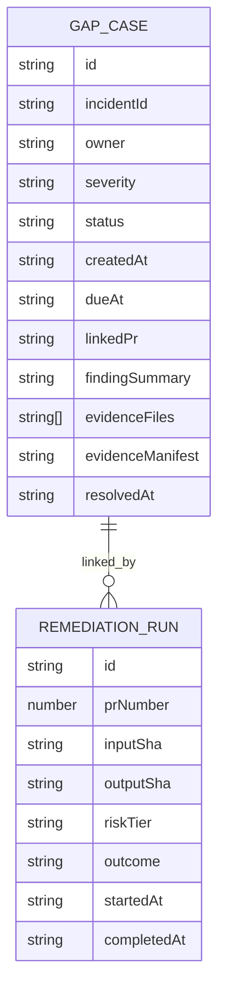

# feat: Deterministic remediation loop and harness-gap tracking

## Enhancement Summary

**Deepened on:** 2026-02-24  
**Sections enhanced:** 9 major sections  
**Research agents used:** repo-research-analyst, learnings-researcher, backend-engineer, cli-spec, writing-plans, agent-native-architecture, Context7 Octokit/Commander docs, GitHub REST docs.

### Key Improvements
1. Converted command and flow goals into explicit deterministic semantics (preflight-first, SHA lockstep, and idempotent rerun/comment behavior).
2. Strengthened machine-output/error-contract with concrete exit/failure code strategy aligned to existing command patterns.
3. Added explicit risk and data-flow edge-case handling for stateful artifacts (`.harness` local state, review rerun request lifecycle, stale SHA rollback).

### New Considerations Discovered
- Canonical comment markers must remain parser-stable (`<!-- ... -->`) because comments are consumed by regex and can race with manual human comments.
- Evidence closure should be a hard blocker (not a warning) so document-only closure is prevented.
- GitHub API resilience is a likely bottleneck; rate/secondary limits should be surfaced as retriable, structured failures to keep loops trustworthy.
- Duplicate remediation attempts on the same SHA need an explicit concurrency guard (state/read-before-write) before commenting to avoid duplicated rerun requests.

## Table of Contents
- Overview
- Execution Readiness
- Objective, boundaries, and assumptions
- Current-state gap
- Recommended order (hard dependency graph)
- Phase 0 — prep and risk checkpoints
- Phase 1 — contract + command scaffolding
- Phase 2 — deterministic remediation orchestration
- Phase 3 — minimal gap-case lifecycle
- Phase 4 — hardening, rollout, and rollback
- Checkpoint CP5 (must-pass)
- TypeScript command/service boundaries
- Data flow safety blueprint
- Task matrix (ordered)
- Risk register
- Acceptance criteria
- Quality gates & risk checkpoints
- Architecture summary
- CLI UX and parser contract
- Data model (minimal)
- System impact and failure propagation
- Success Metrics (30-day)
- Dependencies
- Documentation plan
- Sources and references

## Section Manifest (Deepen target set)

1. **Overview** — validate problem framing, success definitions, and user outcomes.
2. **Execution Readiness** — refine preconditions, non-goals, and guardrails.
3. **CLI UX and parser contract** — strengthen deterministic command contracts, error codes, and safe parsing behavior.
4. **Phased execution sections** — add idempotency/performance controls per phase.
5. **Command/service boundaries** — harden separation to keep command code orchestration-only.
6. **Data flow safety blueprint** — tighten boundary controls and failure propagation.
7. **Risk register / acceptance criteria** — ensure high-impact cases are testable, measurable, and enforceable.
8. **Quality gates / dependencies / docs** — ensure rollout viability and maintenance quality.

## Overview

Implement a **deterministic v1 remediation + incident-lifecycle loop** for CodeQL/Codex findings:

1. verify findings are for the current PR head SHA,
2. auto-remediate only low/medium risk findings,
3. commit fixes to the PR branch,
4. request exactly one rerun per SHA via canonical dedupe,
5. track minimal incident-to-gap records with owner/SLA/evidence closure evidence.

## Execution Readiness

### Research Insights

**Best Practices:**
- Keep execution order deterministic and fail-fast: contract validation before mutation, and policy checks before any patch/apply operations.
- Keep `--json` and `--plain` as format contracts with strict parser tests in CLI command suites.

**Performance Considerations:**
- Use fast-path checks before full `pnpm test` in early phases.
- Keep fixtures local and minimal for preflight checks; avoid networked GitHub calls in CP0/CP1.

**Security/Robustness Considerations:**
- Validate token source once (env/session), then run read-only checks.
- Never log token material; redact GitHub auth failures before surfacing messages.

### Required preconditions
- GitHub token with PR write, checks, and issue-comment permissions.
- The repo can run existing gates:
  - `harness preflight-gate`
  - `harness policy-gate`
  - `harness review-gate`
  - `harness evidence-verify`
- Existing `CodeQL` / `Codex` finding feed is available in current repository context.
- CI environment can execute `pnpm check`.

### Non-goals for v1
- No cross-platform UI for gap-case administration.
- No non-CodeQL/Codex finding adapters.
- No external issue tracker integrations.
- No persistent centralized database (still local `.harness` JSON state).

### Canonical constraints
- Keep implementation **canonical-only**.
- Keep package usage to current project defaults (no new external runtime deps).
- Do **not** execute destructive commands while planning.

## Objective, boundaries, and assumptions

- **Goal:** deliver deterministic and auditable remediation + closure state without weakening existing safeguards.
- **Boundary:** this is a command/control-plane feature, not a policy engine rewrite.
- **Assumption:** `review-gate`/`policy-gate` semantics remain authoritative for final pass/fail decisions.
- **Assumption:** v1 gap-state can be local file-backed at `.harness/gap-cases.json`.

## Current-state gap

Current primitives already support SHA checks and deduped review reruns.
What is missing:
- deterministic orchestration across preflight → policy → remediation → rerun,
- bounded auto-apply behavior by risk tier,
- reusable incident-to-gap state with overdue visibility and evidence-linked closure.

## Architecture summary

### Command-layer scope
- Add CLI surface in `/Users/jamiecraik/dev/coding-harness/src/cli.ts` only for new entrypoints:
  - `harness remediate <run|apply>`
  - `harness gap-case <create|list|resolve>`
- Keep existing command names unchanged and preserve current parser behavior for existing commands.
- Add command modules:
  - `/Users/jamiecraik/dev/coding-harness/src/commands/remediate.ts`
  - `/Users/jamiecraik/dev/coding-harness/src/commands/gap-case.ts`

### Library boundary scope
- Remediation domain remains in `/Users/jamiecraik/dev/coding-harness/src/lib/remediation/*` (finder normalization, policy, orchestrator, deterministic outcomes).
- Gap-case domain remains in `/Users/jamiecraik/dev/coding-harness/src/lib/gap-case/*` (types, validation, store projection).
- Shared contract evolution remains in `/Users/jamiecraik/dev/coding-harness/src/lib/contract/*`.
- Parser behavior changes in this phase are additive to existing command routes and do not change existing command shapes outside `remediate` and `gap-case`.

## CLI UX and parser contract

### Research Insights

**Best Practices:**
- Use explicit argument validators and one-pass parsing to keep command behavior deterministic.
- Ensure `--help` and `--version` are terminal paths with no side effects.
- Keep `--json`/`--plain` mutually exclusive and documented in parser-level guardrails.

**Performance Considerations:**
- Dispatch only one command path per run and avoid duplicated contract loads or repeated parser passes.
- Validate formatting flags before expensive reads/calls.

**Implementation Pattern:**
```ts
if (json && plain) return usageError("E_USAGE", "Choose exactly one output mode");
if (command === "help") return printHelp();
```

**Edge Cases:**
- Unknown subcommands should return stable `E_USAGE` and suggestion text instead of falling through.
- SHA-like strings from user input must pass strict format checks before any GitHub call.

### When to use
- Use `harness remediate` for automated PR remediation decisions and execution.
- Use `harness remediate run` for dry planning and policy-only simulation.
- Use `harness remediate apply` for write-enabled remediation and commit flow.
- Use `harness gap-case` for tracking unresolved incidents that move beyond one remediation run.

### Inputs

#### Auth and config precedence
- `--json` / `--plain` (mutually exclusive; default is plain text).
- GitHub token:
  1. dedicated auth environment (`GITHUB_TOKEN`, `HARNESS_GITHUB_TOKEN`),
  2. existing authenticated terminal/session credentials (if detected by runtime),
  3. legacy compatibility: `--token` remains legacy-only for non-remediation commands; new `remediate`/`gap-case` flows avoid token flags.
- Repo and PR context flags:
  - Required: `--owner`, `--repo`, `--pr`, `--sha`.
- Finding source:
  - Required: `--provider` (`codeql` or `codex`).
- Policy/risk controls:
- `--max-auto-tier`, `--allow-unsafe`
- `--dry-run` is available for `remediate run` (no writes)

#### `harness remediate` command contract

| Command syntax | Required args | Optional args | Behavior |
|---|---|---|---|
| `harness remediate run --owner {owner} --repo {repo} --pr {pr} --sha {sha} --provider {codeql-or-codex}` | `owner`, `repo`, `pr`, `sha`, `provider` | `--dry-run`, `--json`, `--plain`, `--max-auto-tier`, `--allow-unsafe`, `--contract`, `--no-input` | Simulate remediation plan, no working-tree write, no PR comment/re-run posting. |
| `harness remediate apply ...` | same as above | `--force`, `--json`, `--plain`, `--max-auto-tier`, `--allow-unsafe`, `--contract`, `--no-input` | Execute plan and write path changes to PR branch; deterministic preflight/policy gates; commit and verify rerun path. Apply mode always requires networked GitHub access for branch/check operations. `--dry-run` is invalid for apply and must return `E_USAGE`. |

#### Evidence manifest requirements for `gap-case` resolution

`--evidence` values must resolve to manifest JSON matching:

```json
{
  "version": "1",
  "runSha": "current branch head SHA at verify time",
  "checks": [
    {
      "type": "ui|api|command",
      "name": "harness evidence-verify",
      "status": "pass|fail",
      "artifact": ".harness/evidence/login-form.png",
      "assertions": ["url:/dashboard", "selector:[data-testid='welcome']"],
      "assertedAt": "2026-02-24T10:00:00.000Z"
    }
  ]
}
```

- `--evidence` accepts `@path/to/evidence.json` (or repeatable list via multiple flags).
- Resolution requires at least one `check` item with `status: "pass"` and all required assertions for command.
- Unknown schema versions are rejected with `E_VALIDATION` and `retryable: false`.

#### `harness gap-case` command contract

| Command syntax | Required args | Optional args | Behavior |
|---|---|---|---|
| `harness gap-case create --incident-id {id} --owner {owner} --severity {low-medium-high} --linked-pr {org/repo#pr} --due-days {n}` | `incident-id`, `owner`, `severity`, `linked-pr` | `--finding-summary`, `--evidence`, `--require-evidence` | Create canonical gap case with deterministic generated case ID and SLA target. |
| `harness gap-case list` | none | `--open`, `--overdue`, `--json`, `--plain`, `--output {json-or-table}` | List cases; overdue computed on read-time from `dueAt`. |
| `harness gap-case resolve --case-id {id} --incident-id {incident} --resolved-by {owner} --linked-pr {org/repo#pr} --evidence {files}` | `case-id`, `incident-id`, `resolved-by`, `linked-pr` | `--force`, `--json`, `--plain` | Resolution requires evidence verification and linked PR check. Positional `case-id` remains compatibility-only. |

### Help and discoverability
- Top-level usage must include:
  - `harness remediate run|apply`
  - `harness gap-case create|list|resolve`
- `--help` and `-h`:
  - global help shows all command names and examples.
  - `harness remediate --help` and `harness gap-case --help` show command summaries and options.
  - `harness remediate run --help` / `harness gap-case create --help` are supported.
- Unknown subcommand behavior:
  - suggest nearest known command by Levenshtein/distance.
  - exit with usage-facing error code and hint (never stack-trace).

### Output contract

#### Deterministic JSON schema
All `--json` output should emit one object only:
- `schema: "harness.remediate.v1"` or `"harness.gap-case.v1"`
- `meta.tool`, `meta.version`, `meta.timestamp`, `meta.request_id` (when available)
- `status`: `success | warn | error`
- `summary`: one-line status message
- `data`: command-specific payload
- `errors`: stable array with:
  - `code`, `message`, `details`, optional `hint`
  - optional `detailCode` (for example: `HEAD_DRIFT`, `NETWORK_RATE_LIMIT`)
  - optional `retryAfterSeconds` and `maxAttemptsRemaining` for retryable outcomes.

#### Text output
- Human output goes to stdout.
- Parseable diagnostics/errors go to stderr.
- `--plain` output is stable, line-oriented, and suitable for `awk/sed`.
- `--json` output disables ANSI color/progress and omits log noise.

### Parser and runtime behavior
- Parser behavior rules:
  - `-h/--help` always wins: prints help and exits `0` without side effects.
  - `--version` prints `harness v<version>` and exits `0`.
  - Missing required options for `run/apply/create/resolve` produce `E_USAGE` and exit `2`.
  - Unknown command/flag produces `E_USAGE` and exits `2`.
  - Flags may appear in any order.
  - `resolve` accepts optional positional `<case-id>` only for backward compatibility; preferred canonical form uses `--case-id`. All other modes reject positional args and use only named options. If both positional and `--case-id` are provided, they must match or return `E_USAGE`.
  - `--json` and `--plain` are mutually exclusive.
  - `--dry-run` is forbidden for `remediate apply` and should return `E_USAGE`.
  - `--no-input` is required for non-TTY automation and disallows prompting; missing required confirmation yields `E_USAGE`.
  - New `remediate`/`gap-case` flows avoid token flags; auth is env/session-first and redacted in logs/errors.

### Examples
- `harness remediate run --owner octo-org --repo sample --pr 42 --sha a1b2c3 --provider codeql --max-auto-tier medium --json`
- `harness remediate run --owner octo-org --repo sample --pr 42 --sha a1b2c3 --provider codex --contract harness.contract.json --plain --no-input`
- `harness remediate apply --owner octo-org --repo sample --pr 42 --sha a1b2c3 --provider codeql --allow-unsafe --force`
- `harness gap-case create --incident-id SEC-102 --owner teammate-a --severity medium --linked-pr octo-org/sample#42 --due-days 7 --finding-summary "unsafe regex pattern"`
- `harness gap-case list --open --overdue --plain`
- `harness gap-case resolve SEC-001 --incident-id SEC-102 --linked-pr octo-org/sample#42 --resolved-by teammate-a --evidence artifacts/e2.json` (compat)
- `harness gap-case resolve --case-id SEC-001 --incident-id SEC-102 --linked-pr octo-org/sample#42 --resolved-by teammate-a --evidence artifacts/e2.json` (canonical)

### Exit code policy for new commands
- `0` success, including deterministic no-op outcomes.
- `2` usage/validation failure (`E_USAGE`, `E_VALIDATION`).
- `3` policy refusal (`E_POLICY`).
- `4` partial success / partial apply (`E_PARTIAL`).
- `10` internal/adapter failure (`E_INTERNAL`).

### Required machine-readable errors in JSON
- `E_USAGE`, `E_VALIDATION`, `E_AUTH`, `E_POLICY`, `E_PARTIAL`, `E_INTERNAL`, `E_RETRYABLE`, `E_RATE_LIMIT`, `E_CONCURRENCY`.
- Error-specific detail codes (for example, `HEAD_DRIFT`, `NETWORK_RATE_LIMIT`, `LOCK_BUSY`) should be returned in `detailCode` when relevant and must be machine-readable.


### Recommended order (hard dependency graph)

`CLI registration/contract -> library contracts -> remediation orchestrator -> gap-case store -> integration tests -> docs`

- **No phase starts until all previous phase acceptance gates pass.**
- `Phase 1` must finish with `Contract + parser + no-op command behavior` before any orchestration internals.
- `Phase 2` must include explicit failure mode handling for stale SHA before any write path.
- `Phase 3` must require evidence verification before closing a case.
- `Phase 4` must include kill-switch and rollback validation.

## Phase 0 — prep and risk checkpoints

- **Task P0.1 (5–10m):** Run a quick repo baseline check of impacted command and contract files, confirm no conflicting TODOs.
  - File targets: `/Users/jamiecraik/dev/coding-harness/src/cli.ts`, `/Users/jamiecraik/dev/coding-harness/src/commands/{preflight-gate.ts,policy-gate.ts,review-gate.ts,evidence-verify.ts}`
  - Verification command: `pnpm check`
- **Checkpoint CP0**: if baseline fails, pause; do not edit.

- **Task P0.2 (5m):** Confirm command contract default behavior with JSON output shape (existing `--json` conventions).
  - File targets: existing command files above
  - Verification command: `pnpm test -- src/commands/review-gate.test.ts src/commands/policy-gate.test.ts`
- **Checkpoint CP1**: gate on reproducible existing test expectations.

## Phase 1 — contract + command scaffolding

### Required outputs
- Contract schema can parse/validate `remediationPolicy` and `gapCasePolicy` fields.
- CLI exposes `remediate` and `gap-case` in usage/help.
- Commands can parse required options and return deterministic no-op structures.

#### Task P1.1 (10–15m): extend contract types
- **Files:**
  - `/Users/jamiecraik/dev/coding-harness/src/lib/contract/types.ts`
  - `/Users/jamiecraik/dev/coding-harness/src/commands/init.ts`
- Add interfaces:
  - `RemediationPolicy` (`enabled`, `maxAutoTier`, `model`, `effort`, `allowUnsafe`)
  - `GapCasePolicy` (`slaBySeverityDays`, `requireEvidenceOnResolve`)
- Keep defaults explicit in `DEFAULT_CONTRACT` and init template JSON.
- **Verification:** targeted typecheck by running:
  - `pnpm typecheck`

#### Task P1.2 (10–15m): extend contract validation
- **Files:**
  - `/Users/jamiecraik/dev/coding-harness/src/lib/contract/validator.ts`
- Add strict validation and normalized defaults for new policy blocks.
- Ensure old contracts without these keys fail open (defaults applied).
- **Verification:** `pnpm test -- src/lib/contract/validator.test.ts`

#### Task P1.3 (8–12m): wire command parser and help
- **Files:**
  - `/Users/jamiecraik/dev/coding-harness/src/cli.ts`
  - `/Users/jamiecraik/dev/coding-harness/src/commands/{remediate.ts,gap-case.ts}` (stubs only in this task)
- Add usage entries + argument parsing for:
  - `harness remediate <run|apply> --owner ... --repo ... --pr ... --sha ... --provider codeql|codex`
  - `harness gap-case create/list/resolve`
- **Verification:** unit tests:
  - `pnpm test -- src/cli.test.ts`

#### Phase 1 success criteria
- Contract migration path accepts existing files.
- `harness --help` shows both new command stubs.
- Any unrecognized path still returns existing error messages.

### Checkpoint CP2 (must-pass)
Pause and request review:
- Contract validator + schema defaults are stable.
- New CLI command routes do not alter existing command behavior.

## Phase 2 — deterministic remediation orchestration

### Research Insights

**Best Practices:**
- Normalize all provider findings before policy to reduce branching in the orchestrator.
- Enforce SHA checks before write and again right before commit to prevent stale-head mutation.
- Keep rerun request as a single state transition with explicit marker+SHA dedupe and a pre/post-run active-state check before posting.

**Performance Considerations:**
- Cache normalized findings and pre-compute eligibility by `maxAutoTier` to avoid repeated scans.
- Fail early on policy blocks (high-tier/no-write) to avoid expensive branch operations.

**Implementation Pattern:**
```ts
type Outcome = "success" | "noop" | "blocked" | "failed" | "stale";
if (outcome === "blocked") return { code: "E_POLICY", retryable: false };
```

**Edge Cases:**
- Check-run transitions can race patching; if review evidence is stale, report deterministic rerun request state and do not claim success.
- Concurrent invocations for the same SHA can both pass SHA validation; add run-lock + stale marker cleanup checks before starting patch and before posting rerun.
- Partial patch failures should return `E_PARTIAL` with changed files + recovery suggestion.

**References:**
- `src/commands/review-gate.ts` polling/state model for timed timeout/needs-rerun behavior.
- Octokit throttle/retry guidance for API reliability in remediation loops.

### Required outputs
- Finding intake normalized to deterministic internal structure.
- SHA-matching enforced before any remediation action and again before write.
- No automatic changes for high-tier findings.
- Canonical rerun request path is used exactly once per SHA.
- Active-run lock prevents overlapping remediation runs on same `owner/repo/pr/sha`.
- Partial failures return explicit rollback feasibility and deterministic `E_PARTIAL`/`E_RETRYABLE` classification.

#### Task P2.1 (10–15m): define remediation domain types
- **Files:**
  - `/Users/jamiecraik/dev/coding-harness/src/lib/remediation/types.ts`
- Define:
  - `RemediationFinding`, `RemediationRunOutcome`, `RemediationRunRecord`, `RemediationPolicyInput`.
- Add explicit outcome/state enums: terminal outcomes are `success | noop | blocked | failed | stale`; optional orchestration lifecycle states are `not_found | in_progress | timeout` (internal only).
- **Verification:** `pnpm typecheck`

#### Task P2.2 (10–15m): normalize finding providers
- **Files:**
  - `/Users/jamiecraik/dev/coding-harness/src/lib/remediation/finding-normalizer.ts`
- Convert CodeQL + Codex shapes into common normalized finding format.
- Require mapping keys for `file`, `rule`, `severity`, `location`, `fixCandidate`.
- **Verification:** `pnpm test -- src/lib/remediation/finding-normalizer.test.ts`

#### Task P2.3 (15m): build deterministic orchestration engine
- **Files:**
  - `/Users/jamiecraik/dev/coding-harness/src/lib/remediation/orchestrator.ts`
- Sequence:
  1. Validate inputs and policy defaults.
  2. Validate `headSha` and fetch latest head before running.
  3. Gate via `runPreflightGate` and `runPolicyGate`.
  4. Acquire idempotent run lock for (`owner/repo/pr/sha`) to serialize concurrent runs.
  5. Filter actionable findings by `maxAutoTier` and source contract.
  6. If blocked or no-op, emit deterministic no-op outcome and release run lock.
  7. Apply minimal patch set to working tree.
  8. If any patch write fails: rollback from staging snapshot, release lock, return `E_PARTIAL`.
  9. Re-read head SHA; abort if changed (rollback + `E_PARTIAL`).
  10. Commit to PR branch.
  11. Re-run policy + review checks on output SHA.
  12. If policy/review step is retryable or fails with partial changes, emit `E_PARTIAL` or `E_RETRYABLE` with rollback feasibility state.
  13. Post canonical rerun comment if review not passing.
  14. Release run lock.
  15. Return machine-readable result block.

  Concurrency lock behavior (required):
  - Lock record fields: `owner`, `repo`, `pr`, `sha`, `requestedBy`, `runState`, `lockedAt`, `ttlSeconds`, `reason`.
  - Lock acquisition uses compare-and-set semantics.
  - Stale lock recovery is allowed only when `now - lockedAt > ttlSeconds` and may only reclaim locks in terminal `runState` (`completed`, `failed`, `stale`, `timed_out`).
  - Reclaiming stale locks must emit a warning event and continue with a fresh lock acquisition attempt; in-flight runs for active SHAs (`runState == "running"`) must never be preempted.
- **Verification:** `pnpm test -- src/lib/remediation/orchestrator.test.ts`

#### Task P2.4 (10–15m): implement CLI command glue for remediation
- **Files:** `/Users/jamiecraik/dev/coding-harness/src/commands/remediate.ts`
- Implement `runRemediateCLI` with:
  - deterministic JSON output
  - `--json` flag parity with existing command patterns
  - explicit exit codes mapping on failure modes
- **Verification:** `pnpm test -- src/commands/remediate.test.ts`

### Checkpoint CP3 (must-pass)
Block point before moving to gap-case:
- High-tier findings are blocked with explicit message and non-zero exit code.
- At least one path tests stale-sha rejection.
- `review-gate` rerun intent is deduped by SHA marker and posted via existing comment module.
- At least one path verifies run-lock prevents duplicate active remediation runs for the same SHA (`E_CONCURRENCY`).

## Phase 3 — minimal gap-case lifecycle

### Research Insights

**Best Practices:**
- Treat gap case lifecycle as small state machine with immutable IDs and immutable evidence references.
- Require linked PR + evidence verification before `resolve` mutation to avoid false closures.

**Performance Considerations:**
- Keep list/read paths read-only and projection-based; no writes during normal listing.
- Compute overdue status from `dueAt` at render time to avoid stale cached fields.

**Implementation Pattern:**
```ts
if (action === "resolve" && !evidenceVerified) {
  return { ok: false, code: "E_VALIDATION", reason: "evidence-verification-required" };
}
```

**Edge Cases:**
- SLA misconfiguration by severity should surface in validator with explicit defaults.
- Concurrent resolves should serialize by case ID and verify open-state before write.

### Required outputs
- CLI CRUD operations for gap cases with immutable case IDs.
- Resolution flow requires evidence verification pass and linked fix PR.
- Overdue/SLA states derived at read time.

#### Task P3.1 (12m): model gap-case types and state validation
- **Files:**
  - `/Users/jamiecraik/dev/coding-harness/src/lib/gap-case/types.ts`
  - `/Users/jamiecraik/dev/coding-harness/src/lib/gap-case/validator.ts`
- Add required fields:
  - `incidentId`, `owner`, `severity`, `status`, `createdAt`, `dueAt`, `linkedPr`, `findingSummary`, `evidenceFiles`, `resolvedAt`, `evidenceManifest`
- Validate severity/domain boundaries and required linked PR on resolve.
- **Verification:** `pnpm test -- src/lib/gap-case/validator.test.ts`

#### Task P3.2 (12m): build gap-case store layer
- **Files:** `/Users/jamiecraik/dev/coding-harness/src/lib/gap-case/store.ts`
- Implement read/write helpers with atomic-ish behavior for `.harness/gap-cases.json`.
- Add migration-safe load defaults for missing file.
- Add helper for SLA/overdue projection.
- **Verification:** `pnpm test -- src/lib/gap-case/store.test.ts`

#### Task P3.3 (12m): implement command flows
- **Files:** `/Users/jamiecraik/dev/coding-harness/src/commands/gap-case.ts`
- Commands:
  - `create` → records owner/severity/SLA/linked PR/evidence path list,
  - `list` → supports open/overdue filters and machine-readable output,
  - `resolve` → validates linked PR + runs `evidence-verify` equivalent manifest check before closure; evidence manifest versions must match current contract.
- **Verification:** `pnpm test -- src/commands/gap-case.test.ts`

#### Task P3.4 (8m): CLI parser wiring for subcommands
- **Files:** `/Users/jamiecraik/dev/coding-harness/src/cli.ts`
- Add usage section for gap-case command variants and parse options.
- **Verification:** `pnpm test -- src/cli.test.ts`

### Checkpoint CP4 (must-pass)
- Resolve path MUST fail when evidence verification fails.
- `gap-case list` must surface overdue state deterministically.

## Phase 4 — hardening, rollout, and rollback

### Research Insights

**Best Practices:**
- Define rollback outcome states explicitly (`rollback_not_needed` / `rollback_failed`) so operators can act on deterministic outcomes.
- Keep kill-switch behavior centralized in contract policy to avoid drift across command handlers.

**Performance Considerations:**
- Run focused cross-command scenarios before running full suite.
- Keep integration tests narrow to critical loop scenarios first, then broaden.

**Implementation Pattern:**
```ts
if (!runPolicy.enabled) return { ok: false, code: "E_POLICY", retryable: false };
if (rollbackNeeded && rollbackStatus === "failed") return { ok: false, code: "E_PARTIAL" };
```

**Edge Cases:**
- Partial changes (fix generated, no rerun posted) must remain explicit non-success outcomes.
- `--dry-run` must stay side-effect free for rerun request logic and state operations.

#### Task P4.1 (15m): add integration scenarios for cross-command flow
- **Files:**
  - existing command test suite and fixture harness under `/Users/jamiecraik/dev/coding-harness/src/**`
- Scenarios:
  1. low-tier finding → auto-remediate → rerun posted once.
  2. medium-tier finding → commit + post-fix policy unchanged.
  3. high-tier finding → blocked with reason.
  4. stale SHA between scan and push → abort.
  5. gap-case resolve requires evidence + linked fix PR.
- **Verification:** `pnpm test`

#### Task P4.2 (10m): rollback and kill-switch controls
- **Files:**
  - `/Users/jamiecraik/dev/coding-harness/src/lib/remediation/orchestrator.ts`
  - `/Users/jamiecraik/dev/coding-harness/src/commands/remediate.ts`
- Implement contract kill switch in policy to short-circuit orchestration.
- Implement failure rollback behavior and explicit outcome code for no-rollback-required vs rollback-failed.
- **Verification:** targeted remediation tests + `pnpm test -- src/lib/remediation/orchestrator.test.ts`

#### Task P4.3 (10m): docs and usage update
- **Files:**
  - `/Users/jamiecraik/dev/coding-harness/docs/HARNESS_IMPLEMENTATION_PLAN.md`
  - `/Users/jamiecraik/dev/coding-harness/README.md` (CLI docs)
  - contract docs blocks
  - runbook doc (new or updated)
- **Verification:** `pnpm docs:lint`

## Checkpoint CP5 (must-pass)
- `pnpm check` passes end-to-end.
- Determinism proven: rerun comment posting not duplicated per SHA.
- `harness remediate` and `harness gap-case` commands execute end-to-end with JSON outputs and non-zero error codes on blocked outcomes.

## TypeScript command/service boundaries

### Research Insights

**Best Practices:**
- Keep command handlers thin and deterministic (`args -> typed input -> service call -> result formatting`).
- Keep command adapters free of policy logic; policy remains in library/service boundaries.

**Security and Testability:**
- Inject collaborators (GitHub client, file handles, clock) for deterministic unit tests.
- Enforce allowlist/enum validation before service calls.

**Implementation Pattern:**
```ts
type ServiceResult<T> = { ok: true; data: T } | { ok: false; code: string; message: string };
```

- **Command layer (CLI + command modules):**
  - `/Users/jamiecraik/dev/coding-harness/src/cli.ts` handles discovery/help/dispatch and process exit semantics.
  - `/Users/jamiecraik/dev/coding-harness/src/commands/*.ts` only map parsed args -> `typed command input` and invoke service calls.
  - No direct filesystem or GitHub mutation logic belongs here.

- **Service boundaries (library):**
  - `/Users/jamiecraik/dev/coding-harness/src/lib/remediation/*` owns normalization, gating orchestration, outcome calculation, and branch/patch workflows.
  - `/Users/jamiecraik/dev/coding-harness/src/lib/gap-case/*` owns gap-case domain rules, state DTOs, projection logic, and store adapter calls.
  - `/Users/jamiecraik/dev/coding-harness/src/lib/contract/*` owns policy loading/validation and defaulting.

- **Infrastructure boundary:**
  - `/Users/jamiecraik/dev/coding-harness/src/lib/github/*` remains the only adapter touching GitHub API clients.
  - `/Users/jamiecraik/dev/coding-harness/src/lib/gap-case/store.ts` remains the only mutation point for `.harness/gap-cases.json`.

- **Boundary contracts (must be preserved):**
  1. Commands return `CommandResult<T>`; services return `ServiceResult<T>`.
  2. Command handlers pass through machine-readable result DTOs; they do not interpret deep service internals.
  3. Services accept narrow request DTOs (`RemediationRunInput`, `GapCaseInput`) and return stable result DTOs (`RemediationRunResult`, `GapCaseCommandResult`).
  4. All state writes must come from explicit write ports (`gap-case/store`, orchestrator branch writer), never from model constructors or parsers.

- **Code-safety checkpoint:**
  - If a command file grows beyond argument mapping + delegation + minimal output shaping, split it before implementation.

## Data flow safety blueprint

### Research Insights

**Best Practices:**
- Preserve strict trust boundaries and enforce deterministic transitions at every edge.
- Treat serialization and persistence as separate, explicit stages.

**Performance Considerations:**
- Sort object keys and keep deterministic spacing for JSON to reduce diff churn.
- Use temp-file writes for mutation only, and skip no-op writes when projection is unchanged.

**Failure Propagation:**
- Distinguish retryable from non-retryable outcomes to guide automation operators.
- Keep command layer from throwing raw errors; map to a typed `error.code`.

```mermaid
flowchart LR
  A[CLI args (untrusted)] --> B[command DTO]
  B --> C[options validation + defaults]
  C --> D[service input coercion]
  D --> E[contract load/validate]
  E --> F[finding normalizer -> RemediationFinding[]]
  F --> G[policy+SHA gates]
  G --> H[orchestrator side effects: patch/commit/rerun]
  H --> I[result DTO + structured errors]
  I --> J[CLI output text/JSON]

  K[gap-case raw state file] --> L[store schema validation] --> M[immutable case DTO]
  M --> N[safe write via temp + rename]
```

Data safety requirements at each edge:
1. **Command input trust boundary:** all CLI strings must be parsed with bounded types and required/optional checks; invalid enums or paths fail fast with validation codes before any mutation.
2. **Domain shape boundary:** external finding payloads (CodeQL/Codex) are normalized and validated before policy decisions; unknown finding fields are dropped or explicitly rejected by normalizer rules.
3. **SHA boundary:** SHA is validated before any mutation and revalidated from GitHub after patch preparation, before commit.
4. **Contract boundary:** contract reads use current loader safeguards (path traversal checks, depth + size limits, defaults merge) and refuse malformed policy keys.
5. **Persistence boundary:** `.harness/gap-cases.json` read/write is the only state mutation path; reads validate array/object shape and writes are atomic with migration-safe defaults.
6. **Output boundary:** every outcome and error is emitted through deterministic command DTOs; CLI text output is derived from structured fields, never from internal exceptions.

## Task matrix (ordered)

| ID | Phase | Files | Duration target | Verification |
|---|---|---|---|---|
| P0.1 | 0 | `/Users/jamiecraik/dev/coding-harness/src/cli.ts`; `/Users/jamiecraik/dev/coding-harness/src/commands/{preflight-gate.ts,policy-gate.ts,review-gate.ts,evidence-verify.ts}` | 5–10m | `pnpm check` |
| P0.2 | 0 | same as above | 5m | `pnpm test -- src/commands/review-gate.test.ts src/commands/policy-gate.test.ts` |
| P1.1 | 1 | `/Users/jamiecraik/dev/coding-harness/src/lib/contract/types.ts`; `/Users/jamiecraik/dev/coding-harness/src/commands/init.ts` | 10–15m | `pnpm typecheck` |
| P1.2 | 1 | `/Users/jamiecraik/dev/coding-harness/src/lib/contract/validator.ts` | 10–15m | `pnpm test -- src/lib/contract/validator.test.ts` |
| P1.3 | 1 | `/Users/jamiecraik/dev/coding-harness/src/cli.ts`; `/Users/jamiecraik/dev/coding-harness/src/commands/{remediate.ts,gap-case.ts}` | 8–12m | `pnpm test -- src/cli.test.ts` |
| P2.1 | 2 | `/Users/jamiecraik/dev/coding-harness/src/lib/remediation/types.ts` | 10–15m | `pnpm typecheck` |
| P2.2 | 2 | `/Users/jamiecraik/dev/coding-harness/src/lib/remediation/finding-normalizer.ts` | 10–15m | `pnpm test -- src/lib/remediation/finding-normalizer.test.ts` |
| P2.3 | 2 | `/Users/jamiecraik/dev/coding-harness/src/lib/remediation/orchestrator.ts` | 15m | `pnpm test -- src/lib/remediation/orchestrator.test.ts` |
| P2.4 | 2 | `/Users/jamiecraik/dev/coding-harness/src/commands/remediate.ts` | 10–15m | `pnpm test -- src/commands/remediate.test.ts` |
| P3.1 | 3 | `/Users/jamiecraik/dev/coding-harness/src/lib/gap-case/types.ts`; `/Users/jamiecraik/dev/coding-harness/src/lib/gap-case/validator.ts` | 12m | `pnpm test -- src/lib/gap-case/validator.test.ts` |
| P3.2 | 3 | `/Users/jamiecraik/dev/coding-harness/src/lib/gap-case/store.ts` | 12m | `pnpm test -- src/lib/gap-case/store.test.ts` |
| P3.3 | 3 | `/Users/jamiecraik/dev/coding-harness/src/commands/gap-case.ts` | 12m | `pnpm test -- src/commands/gap-case.test.ts` |
| P3.4 | 3 | `/Users/jamiecraik/dev/coding-harness/src/cli.ts` | 8m | `pnpm test -- src/cli.test.ts` |
| P4.1 | 4 | integration tests under `/Users/jamiecraik/dev/coding-harness/src/**` | 15m | `pnpm test` |
| P4.2 | 4 | `/Users/jamiecraik/dev/coding-harness/src/lib/remediation/orchestrator.ts`; `/Users/jamiecraik/dev/coding-harness/src/commands/remediate.ts` | 10m | `pnpm test -- src/lib/remediation/orchestrator.test.ts` |
| P4.3 | 4 | `/Users/jamiecraik/dev/coding-harness/docs/HARNESS_IMPLEMENTATION_PLAN.md`; `/Users/jamiecraik/dev/coding-harness/README.md`; `/Users/jamiecraik/dev/coding-harness/src/commands/init.ts` | 10m | `pnpm docs:lint` |

## Risk register

- **R1 stale head drift before commit**
  - Impact: wrong SHA remediation and false rerun success
  - Mitigation: re-read head before patch and before commit; abort if mismatch

- **R2 rerun request storm**
  - Impact: noisy CI comments and reviewer fatigue
  - Mitigation: canonical comment writer + SHA marker + idempotent no-op outcome when rerun already requested

- **R3 auto-fix overreach**
  - Impact: unintended semantic changes
  - Mitigation: strict max tier gating, post-fix policy recheck, explicit rollback state

- **R4 gap-case staleness**
  - Impact: incidents never closed or hidden
  - Mitigation: overdue/expired calculation in list output + required evidence on resolve

- **R5 raw finding payload spoofing**
  - Impact: malformed CodeQL/Codex payload can drive unsafe fix attempts
  - Mitigation: strict normalizer schema and explicit shape validation before any fix generation

- **R6 gap-case state corruption**
  - Impact: partial writes or invalid JSON can mask active incidents
  - Mitigation: schema validation + atomic temp-file write pattern in store boundary

- **R7 remediation concurrency**
  - Impact: duplicated rerun requests and duplicate fixes during overlapping runs
  - Mitigation: run-lock and stale-lock recovery semantics with explicit lock record (`requestedBy`, `runState`, `lockedAt`, `ttlSeconds`, `reason`) and deterministic `E_CONCURRENCY` no-op when active lock cannot be acquired.

- **R8 transient GitHub failures**
  - Impact: false failures masking actionable deterministic state
  - Mitigation: add explicit `retryable` outcomes (`E_RETRYABLE`, `E_RATE_LIMIT`) and clear backoff guidance in JSON payloads

## Data model (minimal)



```json
{
  "id": "uuid",
  "runId": "run_uuid",
  "headSha": "a1b2c3",
  "status": "success|blocked|failed|noop|stale",
  "riskTier": "low|medium",
  "summary": {
    "findings": 3,
    "patched": 1,
    "skipped": 2,
    "rerunPosted": true
  },
  "errors": []
}
```

## System impact and failure propagation

- Contract errors → `VALIDATION_ERROR`, stop before any GitHub mutation.
- GitHub auth/rate-limit errors → surfaced as structured command errors with retry guidance.
- Review timeout behavior preserved (`reviewPolicy.timeoutAction`) and exposed via `timedOut` flag.
- Gap-case closure without verified evidence is hard-blocked.
- GitHub throttling and transient API errors should be surfaced as `E_RATE_LIMIT`/`E_RETRYABLE` with `retryable: true` and retry delay guidance.

## Acceptance criteria

### Research Insights

**Best Practices:**
- Pair each requirement with a concrete test and a failure-mode assertion.
- Add explicit criteria for parser/help behavior and output schema parity.

**Edge Cases:**
- Duplicate remediation attempts for same SHA should be deterministic no-ops.
- Stale SHA should always result in zero filesystem mutation and explicit `E_PARTIAL` with `detailCode: "HEAD_DRIFT"`.

### Given/When/Then acceptance criteria
- **Given** a remediation run with matching `--sha` and `maxAutoTier=medium`, **When** low/medium findings are present and preflight/policy pass, **Then** the orchestrator returns `ok: true` with one deterministic outcome (`success`, `noop`, or `blocked`) and posts at most one rerun request for that SHA.
- **Given** stale `--sha` or changed head before patch/write, **When** remediation attempts to proceed, **Then** it aborts with `E_PARTIAL` and `detailCode: "HEAD_DRIFT"` and performs no commit.
- **Given** high-tier findings only, **When** `harness remediate` runs with default policy, **Then** the command exits non-zero with explicit `TIER_BLOCK`-class code and no filesystem/branch mutation.
- **Given** a `gap-case resolve` request without verified evidence or linked PR, **When** the command executes, **Then** the case remains `open` and returns structured evidence-missing error.
- **Given** two remediation runs for the same `owner/repo/pr/sha` overlap, **When** the second run enters active state, **Then** it returns `E_CONCURRENCY` and no duplicate rerun comment is posted.
- **Given** malformed gap-case evidence manifest input, **When** `harness gap-case resolve` parses `--evidence`, **Then** it returns `E_VALIDATION` and no state mutation occurs.


### Functional
- [ ] `harness remediate` exists for CodeQL + Codex inputs.
- [ ] `harness remediate apply` rejects `--dry-run` with `E_USAGE` (no write path started).
- [ ] Remediation is executed only for findings that map to supplied/current head SHA.
- [ ] High-tier findings are blocked by default; low/medium only.
- [ ] Canonical rerun comment request is deduped by SHA.
- [ ] `harness gap-case create/list/resolve` records owner, SLA, linked PR, evidence files.
- [ ] `gap-case resolve` fails until evidence verifies.
- [ ] `gap-case resolve` validates evidence manifest schema before mutating case state.
- [ ] `harness --help`, `harness remediate --help`, and `harness gap-case --help` show stable usage, examples, and global options.
- [ ] `harness remediate run ... --json` and `--plain` are mutually exclusive and both are tested.
- [ ] Missing required args and unknown flags for new commands emit `E_USAGE` and exit code `2` with machine parseable error shape.
- [ ] `--help` on `harness remediate`/`harness gap-case` is command-specific and exits `0` before command execution.
- [ ] Parser behavior covers compatibility path (`harness remediate <subcommand> --help`) and `cmd help` alias if supported.
- [ ] `gap-case` resolve accepts canonical `--case-id`; positional `case-id` is accepted only for compatibility and is rejected if mismatched with `--case-id`.

### Non-functional
- [ ] All new command outputs can be consumed as machine-readable JSON.
- [ ] All new failures carry stable machine-readable `code` and human message.
- [ ] Existing command behavior remains unchanged when new policy is disabled.
- [ ] No hidden CLI side effects in dry-run mode.
- [ ] JSON output is single-object, schema-versioned, and stable across runs for the same command inputs (deterministic ordering of errors/fields).
- [ ] Add tests for schema-stable JSON output (stable object key ordering, stable list ordering, stable error array order).

### Operational gates
- [ ] `pnpm lint`
- [ ] `pnpm typecheck`
- [ ] `pnpm test`
- [ ] `pnpm docs:lint`
- [ ] `pnpm audit`
- [ ] `pnpm check` (mandatory combined gate)

## Quality gates & risk checkpoints

### Research Insights

**Best Practices:**
- Keep each checkpoint scoped to one phase and one required command output.
- Add JSON shape and error-code smoke tests when contract evolves.

**Operational Considerations:**
- Capture rerun idempotence and stale-SHA outcomes in test evidence to prevent silent loop regressions.
- If live GitHub APIs are used, include rate-limit visibility in integration test expectations.
- Add explicit contract tests for `E_RETRYABLE` and `E_RATE_LIMIT` behavior plus retry backoff hints.

- **CP0** baseline repo health.
- **CP2** contract+CLI scaffolding.
- **CP3** stale-sha and tier-blocking behavior.
- **CP4** evidence-linked gap closure.
- **CP5** full `pnpm check` and docs/lint cleanliness.

Each checkpoint is a hard stop; unresolved failures are corrected before proceeding to next phase.

## Dependencies

- GitHub token permissions: PR write, comments, checks.
- Access to repository findings feed for local fixture-backed tests.
- CI matrix allowing network in integration test job where GitHub API mocks are unavailable.

## Documentation plan

Update:
- `/Users/jamiecraik/dev/coding-harness/docs/HARNESS_IMPLEMENTATION_PLAN.md`
- `/Users/jamiecraik/dev/coding-harness/README.md` (command examples + risks)
- Contract examples section in docs to include:
  - `remediationPolicy`
  - `gapCasePolicy`
- Runbook section with remediation rollback, stale-sha handling, and incident closure evidence checks.

## Success Metrics (30-day)

- **Throughput:** median finding-to-merged-fix latency improves by **>=35%**.
- **Coverage:** **>=70%** of actionable low/medium findings enter auto-remediation path.
- **Reliability:** remediation rollback/failure recovery loops stay at **<=10%** attempts.

## Sources and references

### Origin
- **Brainstorm:** [`docs/brainstorms/2026-02-24-code-factory-remediation-gap-loop-brainstorm.md`](./docs/brainstorms/2026-02-24-code-factory-remediation-gap-loop-brainstorm.md)
  - Carry-forward decisions: low/medium-only auto-remediation, CodeQL+Codex first adapters, canonical rerun dedupe, minimal gap-case scope.

### Internal References
- `/Users/jamiecraik/dev/coding-harness/src/commands/review-gate.ts:59`
- `/Users/jamiecraik/dev/coding-harness/src/commands/review-gate.ts:207`
- `/Users/jamiecraik/dev/coding-harness/src/commands/policy-gate.ts:51`
- `/Users/jamiecraik/dev/coding-harness/src/commands/preflight-gate.ts:1`
- `/Users/jamiecraik/dev/coding-harness/src/commands/evidence-verify.ts:1`
- `/Users/jamiecraik/dev/coding-harness/src/lib/github/client.ts:1`
- `/Users/jamiecraik/dev/coding-harness/src/lib/github/comments.ts:1`
- `/Users/jamiecraik/dev/coding-harness/src/lib/contract/validator.ts:1`
- `/Users/jamiecraik/dev/coding-harness/src/commands/init.ts:1`
- `/Users/jamiecraik/dev/coding-harness/src/cli.ts:1`
- `/Users/jamiecraik/dev/coding-harness/docs/HARNESS_IMPLEMENTATION_PLAN.md:467`

### External References
- GitHub Checks REST API: [docs.github.com/en/rest/checks/runs](https://docs.github.com/en/rest/checks/runs?apiVersion=2022-11-28)
- GitHub Code Scanning REST API: [docs.github.com/en/rest/code-scanning/code-scanning](https://docs.github.com/en/rest/code-scanning/code-scanning?apiVersion=2022-11-28)
- GitHub REST API rate limits: [docs.github.com/en/rest/using-the-rest-api/rate-limits-for-the-rest-api](https://docs.github.com/en/rest/using-the-rest-api/rate-limits-for-the-rest-api)
- Commander.js error and parser behavior docs: [github.com/tj/commander.js](https://github.com/tj/commander.js/blob/master/Readme.md)
- Octokit throttling and retry guidance: [octokit.github.io/rest.js](https://octokit.github.io/rest.js/v21/#throttling)
