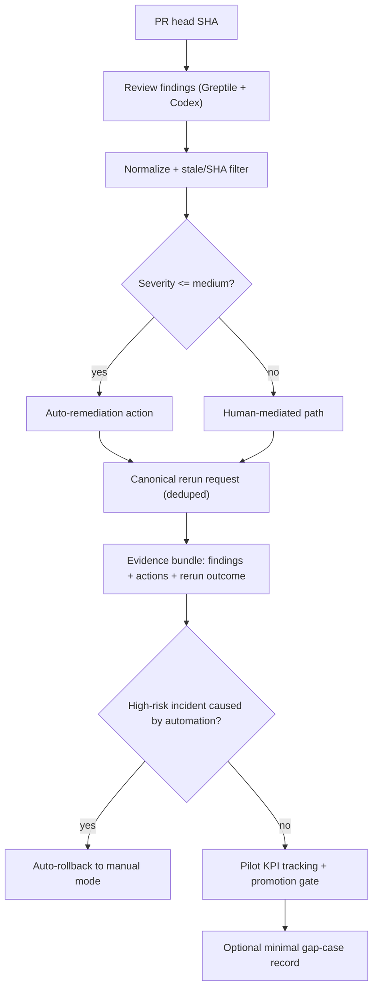

# Agent-First Throughput v1 Pilot

## Enhancement Summary

**Deepened on:** 2026-02-25  
**Sections enhanced:** 8  
**Research agents used:** explorer (architecture, API resilience, metrics/promotion gate, gap-case workflow, testing strategy), Context7, GitHub Docs web research

### Key Improvements
1. Added concrete v1 gap-case command/data model with YAGNI boundaries and edge-case handling.
2. Added measurable pilot metrics model (p50/p75 lead-time, rollback reliability, incident classification latency) with evaluator contract.
3. Added explicit testing strategy expansion (unit/integration/contract) with pass/fail assertions.
4. Added API-resilience guidance aligned to current GitHub + Octokit throttling/retry behavior.

### New Considerations Discovered
- Current logic can include ancestry-related checks, but v1 intent is stricter: exact current-head SHA determinism only.
- Contract/runtime parity is a critical risk: scaffolded policy fields can drift from loaded runtime surface.
- Secondary-rate-limit handling needs serialized mutation and explicit backoff policy for safe scaling.

## Table of Contents
- [Enhancement Summary](#enhancement-summary)
- [Overview](#overview)
- [Problem Statement / Motivation](#problem-statement--motivation)
- [Research Summary](#research-summary)
- [Proposed Solution](#proposed-solution)
- [Alternative Approaches Considered](#alternative-approaches-considered)
- [System-Wide Impact](#system-wide-impact)
- [SpecFlow Analysis (Flow Coverage + Edge Cases)](#specflow-analysis-flow-coverage--edge-cases)
- [Implementation Phases](#implementation-phases)
- [Acceptance Criteria](#acceptance-criteria)
- [Success Metrics](#success-metrics)
- [Scope Boundaries](#scope-boundaries)
- [Dependencies & Risks](#dependencies--risks)
- [Validation Plan](#validation-plan)
- [Sources & References](#sources--references)

## Overview
Build a tightly-scoped v1 throughput pilot that reduces PR lead time by shrinking the review/rework loop, using deterministic remediation for Greptile + Codex findings only (see brainstorm: docs/brainstorms/2026-02-25-agent-first-throughput-v1-brainstorm.md).

The pilot keeps strict safety boundaries: current-head SHA enforcement, low/medium auto-commit only, human mediation for high-risk findings, and automatic rollback to manual mode on any high-risk automation incident (see brainstorm: docs/brainstorms/2026-02-25-agent-first-throughput-v1-brainstorm.md).

## Problem Statement / Motivation
The repository already has strong primitives for remediation and review gating, but the end-to-end throughput loop is not yet productized as a measurable pilot:

- Remediation orchestration exists with SHA equality checks and TOCTOU protection ([`src/lib/remediation/orchestrator.ts`](../src/lib/remediation/orchestrator.ts#L103-L247)).
- Review gate exists with SHA validation + rerun-comment dedupe ([`src/commands/review-gate.ts`](../src/commands/review-gate.ts#L59-L236), [`src/lib/github/comments.ts`](../src/lib/github/comments.ts#L4-L90)).
- `remediate` currently uses a hardcoded default remediation policy even when a contract is provided ([`src/commands/remediate.ts`](../src/commands/remediate.ts#L228-L237)).
- `init` scaffolds many policy fields that are not fully represented by the loaded `HarnessContract` surface (`src/commands/init.ts:182-257`, `src/lib/contract/types.ts:46-70`).
- CLI usage currently exposes `remediate` but no explicit minimal gap-case command for incident tracking ([`src/cli.ts`](../src/cli.ts#L50-L77)).

This creates drift between intended operating model and measurable throughput outcomes.

## Research Summary
### Section manifest (what was deepened)
1. **Overview / Motivation** — sharpened architecture drift and scope boundaries.
2. **Research Summary** — added skills/learnings discovery outcomes and section-level enhancements.
3. **Minimal incident → gap-case workflow** — added command/data model + edge cases.
4. **External API resilience** — added operational guidance for GitHub/Octokit throttling/retry.
5. **Pilot metrics / promotion gate** — added formulas, data collection, and evaluator contract.
6. **Testing strategy** — added deterministic pass/fail assertions for unit/integration/contract layers.
7. **Acceptance criteria** — strengthened quality gates for contract parity + loop determinism.
8. **References** — expanded with authoritative docs and up-to-date implementation guidance.

### Local research findings
- Relevant implementation hotspots:
  - [`src/commands/remediate.ts`](../src/commands/remediate.ts)
  - [`src/lib/remediation/orchestrator.ts`](../src/lib/remediation/orchestrator.ts)
  - [`src/commands/review-gate.ts`](../src/commands/review-gate.ts)
  - [`src/lib/github/comments.ts`](../src/lib/github/comments.ts)
  - [`src/commands/init.ts`](../src/commands/init.ts)
  - [`src/lib/contract/types.ts`](../src/lib/contract/types.ts)
- No `docs/solutions/` directory was found in this repo; nearest learnings are existing brainstorm/plan artifacts in [`docs/brainstorms`](../docs/brainstorms/) and [`docs/plans`](../docs/plans/).
- No implemented `gap-case` command surface was found in `src/cli.ts` or `src/commands/`; minimal incident→gap-case flow is still net-new in this codebase.
- Attempted specialist agent roles (`repo-research-analyst`, `learnings-researcher`, `spec-flow-analyzer`) were unavailable in this environment; analysis below is direct repository analysis.

### Skills and learnings discovery results
- Skills source required by workflow (`~/.agents/skills/`) contained no discoverable skills in this environment.
- Learnings scan across `docs/solutions/`, `.codex/docs`, and `~/.codex/docs` found no project-local solution files for direct reuse.
- Result: deepening used repository-native artifacts (`docs/brainstorms/`, `docs/plans/`) plus primary-source documentation (GitHub + Octokit).

### Deterministic remediation architecture research insights
**Best practices**
- Treat v1 SHA invariant as exact-match deterministic gate (`finding.commitSha === currentHeadSha`) rather than ancestry-based acceptance for auto-remediation decisions.
- Fail closed on unknown severity/provider states; route to human-mediated path with machine-readable reason codes.
- Maintain explicit decision audit fields: start/end head SHA, provider, normalized severity, finding fingerprint, and decision reason.

**Edge cases to carry into implementation/tests**
- Force-push/rebase during run.
- Mixed batches (valid, stale, malformed, unknown-severity).
- Provider payload ambiguity or unsupported provider key.
- Duplicate findings across providers for same file/line/rule fingerprint.

**References**
- Internal behavior baseline: [`src/lib/remediation/orchestrator.ts`](../src/lib/remediation/orchestrator.ts#L109-L231)

### Minimal incident → gap-case workflow (YAGNI v1 proposal)
#### Command model (minimal surface)
Keep v1 to one new command in existing CLI style (single command + flags, no subcommand tree):

- Open case:
  - `harness gap-case --action open --incident-id <id> --summary <text> --severity <high|medium|low> --owner <owner>`
- Resolve case:
  - `harness gap-case --action resolve --case-id <gap-id> --evidence-url <url> [--fix-pr <n>] [--note <text>]`

Recommended v1 flags:
- Common: `--contract <path>`, `--store <path>` (default: `.harness/gap-cases.v1.json`), `--json`.
- Open-only: `--provider <greptile|codex|manual>`, `--finding-id <id>`, `--pr <n>`, `--sha <40-hex>`, `--sla-hours <n>`.
- Resolve-only: `--resolved-by <actor>` (optional).

Recommended output/result shape:
- Success: `{ ok: true, output: { action, caseId, status, created, updatedAt } }`
- Failure: `{ ok: false, error: { code, message, context? } }`

#### Data model (single-file local store)
Add a minimal contract-gated store with auditability but no platform complexity:

- `GapCasePolicy` (extend `HarnessContract`):
  - `enabled: boolean`
  - `defaultSlaHours: number`
  - `requireClosureEvidence: boolean`
  - `storePath?: string`
- `GapCaseRecord`:
  - identity/state: `id`, `incidentId`, `status` (`open|resolved`), `severity`, `summary`, `owner`
  - timing: `openedAt`, `slaDueAt`, optional `resolvedAt`
  - optional refs: `provider`, `findingId`, `prNumber`, `headSha`
  - optional `resolution`: `evidenceUrl`, `fixPr`, `note`, `resolvedBy`
- `GapCaseStoreV1`: `{ version: "1", cases: GapCaseRecord[] }`

YAGNI boundaries for v1:
- No dashboards, no remote service/DB, no cross-repo orchestration, no taxonomy/ML classification layer.
- Lifecycle limited to open/resolve only.

#### Edge cases for plan acceptance
1. Duplicate open events for same fingerprint (`incidentId + sha + findingId`) are idempotent.
2. Resolve on unknown `caseId` fails (`E_VALIDATION`) and never creates a new case.
3. Resolve without valid `evidenceUrl` fails when `requireClosureEvidence=true`.
4. Invalid SHA format in open payload fails validation (no best-effort coercion).
5. Invalid SLA input (`<=0`, non-integer, overflow) fails with actionable message.
6. Corrupt/non-JSON store file fails closed (`E_STORE_CORRUPT`) and is not overwritten.
7. Concurrent updates use atomic write + retry to prevent lost updates.
8. Store path traversal attempts are blocked with existing path validation patterns.
9. Auto-rollback-to-manual and gap-case open can occur in same incident without data loss.
10. Manual remediation closure without `fixPr` is allowed only when evidence + note are present.

### External research decision
External research was included because this feature depends on GitHub API behavior (rate limits, check-runs, rerun/comment endpoints), which is high-risk if stale.

### External references (primary docs)
- GitHub check-runs endpoint behavior and limits: [docs.github.com/en/rest/checks/runs](https://docs.github.com/en/rest/checks/runs)
- GitHub workflow rerun endpoints: [docs.github.com/en/rest/actions/workflow-runs](https://docs.github.com/en/rest/actions/workflow-runs)
- GitHub issue comments endpoint + secondary rate-limit warning: [docs.github.com/en/rest/issues/comments](https://docs.github.com/en/rest/issues/comments)
- REST API best practices (serial requests, pause mutative requests): [docs.github.com/en/rest/using-the-rest-api/best-practices-for-using-the-rest-api](https://docs.github.com/en/rest/using-the-rest-api/best-practices-for-using-the-rest-api)
- REST API rate limits (primary + secondary): [docs.github.com/en/rest/using-the-rest-api/rate-limits-for-the-rest-api](https://docs.github.com/en/rest/using-the-rest-api/rate-limits-for-the-rest-api)

### External research synthesis: GitHub API operational resilience (verified 2026-02-25)
**Best practices**
- Serialize requests and avoid concurrent bursts for secondary-limit safety.
- Pause between mutative requests (`POST/PATCH/PUT/DELETE`) and honor `retry-after`/reset headers before retrying.
- Use bounded retries and explicit exponential backoff on repeated throttling responses.
- Treat check-run/check-suite pagination limits as a data-completeness concern for long-lived refs.

**Repository-aligned implementation guidance**
1. Reuse/centralize Octokit construction so throttle/retry policy is consistent in all GitHub clients.
2. Differentiate read vs write retry behavior; never blind-retry mutative actions without dedupe/idempotency.
3. Add serialized mutation path for comment/rerun mutations to reduce secondary-limit spikes.
4. Emit rate-limit metadata (`retry-after`, `x-ratelimit-reset`, request id) in structured logs for pilot diagnostics.

#### Measurable GitHub SLO contract
- API mutation queue p95 wait time must remain **≤ 30s** over a 30-day window.
- Automatic retry upper bound per request: **max 5** (with jittered exponential backoff, capped at 30s wait).
- Mutative request secondary-limit hit-rate must remain **< 5%** over 1,000 mutative calls.
- Gate check runtime p95 must remain **≤ 2.5s** for evidence capture on standard-sized PR sets.
- Any `x-ratelimit-remaining` underrun or `Retry-After` response above 60s enters hold state before continuing retries.

**References**
- [GitHub REST best practices](https://docs.github.com/rest/guides/best-practices-for-using-the-rest-api)
- [GitHub REST rate limits](https://docs.github.com/en/rest/using-the-rest-api/rate-limits-for-the-rest-api)
- [Octokit throttling plugin](https://github.com/octokit/plugin-throttling.js/)
- [Octokit retry plugin](https://github.com/octokit/plugin-retry.js)

### Pilot metrics and promotion-gate research (v1)
#### Practical metric definitions
| Metric | Definition | Formula | Data source | Pilot target |
| --- | --- | --- | --- | --- |
| PR lead time (north star) | Time from PR creation to merge for pilot-eligible PRs (`draft=false`, merged, Greptile/Codex findings processed in loop). | `p50_hours = median((merged_at - created_at) / 3600)` and `delta = (pilot_p50 - baseline_p50) / baseline_p50` | GitHub PR metadata + remediation evidence matched by PR + HEAD SHA | 35-50% reduction (`delta <= -0.35`) with `n >= 20` merged pilot PRs |
| PR lead-time tail guardrail | Prevents median-only improvement masking slow tail behavior. | `p75_delta = (pilot_p75 - baseline_p75) / baseline_p75` | Same PR dataset | At least 20% reduction (`p75_delta <= -0.20`) |
| Rollback reliability | Reliability of auto-rollback to manual mode after a trigger (drill or real). | `rollback_reliability = successful_rollbacks / rollback_triggers` | Rollback trigger/completion events + remediation logs | 100% |
| Evidence completeness ratio | Fraction of eligible PR events with complete pilot artifacts. | `evidenceComplete = evidence_rows_with_required_fields / eligible_prs` | Nightly PR snapshot + artifact rows | `>= 0.95` |
| High-risk automation incident count | Confirmed high-risk incidents where automation is causal. | `count(severity=high AND causality=automation_confirmed)` | Incident/gap-case records with evidence links | 0 (hard gate) |
| Incident classification latency (supporting) | Time to finalize severity + causality labels after incident opens. | `classified_at - opened_at` (hours), tracked as p95 | Incident/gap-case records | p95 <= 24h |
| Per-repo sample quality gate | Minimum sample size and quality needed before pilot scoring. | `eligible_prs_by_repo >= 10`, completeness `>= 0.95` | Rollup per repo over 30-day windows | Hold if any pilot repo is below minimum |
| Confidence interval quality | Statistical confidence required for uplift signals. | 95% confidence interval width around `leadTimeP50Improvement` | Lead-time dataset bootstrap | Hold if CI half-width > 0.20 or interval crosses 0 |

#### Baseline and analysis windows
- Baseline window: 14 days immediately before pilot enablement in each pilot repo.
- Pilot window: 30 days after enablement (weekly checkpoints + day-30 decision).
- Unit of analysis:
  - Throughput metrics: merged PR
  - Safety metrics: incident record / rollback event
- Eligibility filter: include only PRs with deterministic evidence bundle (`headSha`, findings summary, remediation actions, rerun status).
- Evidence gate: scorecard requires `>= 95%` required artifact fields present and `<= 5%` null/failed collection ratio.

#### Incident classification model (to prevent false positives)
Store the following fields on each incident/gap-case record:
- `severity`: `low | medium | high`
- `causality`: `automation_confirmed | automation_possible | human_or_external | unknown`
- `confidence`: `confirmed | probable | provisional`
- `opened_at`, `sla_due_at`, `sla_breached_at`, `classified_at`, `rollback_triggered_at`, `rollback_completed_at`
- Evidence links: remediation JSON, review-gate JSON, workflow run URL, PR URL
- Governance controls: `causalityUpdatedBy`, `causalityUpdatedAt`, `causalityReviewToken`

Count a record as a promotion-blocking high-risk automation incident only when:
1. `severity=high`
2. `causality=automation_confirmed`

If an `automation_possible` or `unknown` high-severity incident remains unclassified beyond SLA (or is downgraded to `automation_possible` by a second reviewer), promotion is held until:
- classification is finalized by a reviewed decision,
- `causality` is moved to `automation_confirmed` with rollback confirmation or
- confidence moves to `confirmed` with explicit reviewer audit trail.

For v1 scope, any `automation_possible` high-severity classification still counts as unresolved-causality hold; only `confirmed & automation_confirmed` is eligible for `promote`, while `automation_confirmed` incidents always trigger rollback.

#### Data collection methods (practical implementation)
1. **Nightly PR lead-time snapshot**
   - Pull merged PR metadata (`created_at`, `merged_at`, `draft`, `number`, `head.sha`) for pilot repos.
   - Join with remediation evidence by PR/SHA.
   - Write normalized snapshot to `artifacts/pilot/pr-lead-time.json`.
2. **Per-run remediation/review evidence capture**
   - Persist `harness remediate --json` + exit code.
   - Persist `harness review-gate --json` + exit code.
   - Append normalized event rows to `artifacts/pilot/remediation-events.jsonl`.
3. **Rollback observability**
   - Emit one event at rollback trigger and one at rollback completion with shared incident ID.
   - Validate success by checking no post-trigger auto-commit actions before manual re-enable.
   - Append to `artifacts/pilot/rollback-events.jsonl`.
4. **Incident classification log**
   - Require classifier fields before incident closure.
   - Store SLA deadlines and reviewer identity for causality downgrades.
   - Record unresolved high-severity cases in `artifacts/pilot/pending-incidents.json`.
   - Use append-only records in `artifacts/pilot/incidents.jsonl` for audit integrity.
5. **Pilot artifact hardening and schema policy**
   - Enforce redaction + validation for each artifact row before write:
     - remove obvious secret-like values (`password`, `token`, `secret`, `api_key`, `authorization`, `cookie`, `session`),
     - require HTTPS URLs only,
     - canonicalize and strip sensitive query params (`utm_*`, `sig`, `token`, `access_token`, `api_key`) before persistence,
     - normalize URLs through repo allowlist (`github.com`, `api.github.com`, configured internal hosts).
   - Every artifact must include `schemaVersion` (required, explicit) and `generatedAt`.
   - Enforced artifact lifecycle:
     - artifacts stay in `artifacts/pilot/` only,
     - default retention window is 30 days with explicit cleanup policy,
     - pilot artifacts are operational telemetry only and must not be committed to source control (explicit `.gitignore` enforcement).
   - Artifact compatibility requirements:
     - reject unknown/unsupported schema versions,
     - reject missing required artifact files before evaluator completion.

#### Promotion gate evaluator contract
Command contract:
```bash
harness pilot-evaluate --contract <path> --artifacts <dir> --output <json-file> [--json]
```

Command behavior:
- `--json` exits with contract:
  - `exitCode=0`: `outcome=promote`
  - `exitCode=1`: `outcome=hold`
  - `exitCode=2`: validation or schema error (`artifact schema missing/invalid`, `unresolved causality`)
  - `exitCode>=10`: infrastructure/runtime failure
- Required `--output` schema version: `pilot-evaluation/v1`.

Produce weekly/day-30 machine-readable output:

```json
{
  "windowStart": "2026-03-01",
  "windowEnd": "2026-03-31",
  "schemaVersion": "pilot-evaluation/v1",
  "sampleSize": 28,
  "leadTimeP50Improvement": 0.41,
  "leadTimeP75Improvement": 0.24,
  "leadTimeP50CiHalfWidth": 0.06,
  "leadTimeP75CiHalfWidth": 0.09,
  "rollbackReliability": 1,
  "highRiskAutomationIncidents": 0,
  "unresolvedCriticalIncidents": 0,
  "incidentClassificationP95Hours": 11.2,
  "outcome": "promote"
}
```

Evaluator rules:
- `rollback` if `highRiskAutomationIncidents > 0`.
- `hold` if unresolved critical incidents exist, sample size < 20, per-repo evidence completeness < 95%, lead-time CI half-width is too wide, lead-time thresholds are missed, rollback reliability < 1.0, API resilience SLO breaches occur, or classification p95 > 24h.
- `promote` only when all targets pass.

#### Rollback machine-proof contract
- Rollback command:
```bash
harness pilot-rollback --incident-id <id> --contract <path> --artifacts <dir> --mode manual --output <json-file> [--json]
```
- Contract behavior:
  - `exitCode=0`: rollback command completed and mode changed to `manual`; completion artifact written.
  - `exitCode=1`: validation failure (`incident not found`, unsupported mode transition, write blocked by branch policy).
  - `exitCode=2`: precondition failure (required artifacts/policy missing).
  - `exitCode>=10`: infra/runtime failure.
- Rollback output (JSON):
  - includes `incidentId`, `modeBefore`, `modeAfter`, `requestedAt`, `completedAt`, `rollbackEventsId`, `result`, `reason`.
- Phase 2 completion requires:
  - at least one integration test that proves rollback is executable,
  - a passing `harness pilot-rollback ...` path that transitions from `autonomous` to `manual`,
  - evidence artifact of completion and a post-rollback mutative lock signal.

### Testing strategy research (remediation + review-gate)
Current repository tests already cover core unit behavior in remediation orchestration and review-gate status handling (`src/lib/remediation/orchestrator.test.ts`, `src/commands/remediate.test.ts`, `src/commands/review-gate.test.ts`, `src/lib/github/comments.test.ts`, `src/lib/contract/*.test.ts`). The pilot should add/align the following concrete scenarios so policy parity and promotion safety are testable end-to-end.

#### Unit tests (deterministic decision logic)
1. **Remediation tier gating is fail-closed by provider**
   - Setup: Greptile finding at `high` severity with provider max tier `medium`; Codex finding at `low` with provider default dry-run.
   - Pass assertions:
     - `runRemediate(...).exitCode === PARTIAL` when only high finding is present.
     - `outcome.output.skipped[0].reason` contains `"exceeds auto-apply max tier"`.
     - Codex action sets `dryRun === true` by default.
   - Fail assertions:
     - Any `high` finding produces a commit action under `medium` cap.
     - Unknown severity/provider is auto-applied instead of skipped.
2. **TOCTOU checkpoints hard-abort race conditions**
   - Setup: mock `getHeadSha()` to change between checkpoint 1 and 2 (or 3).
   - Pass assertions:
     - Orchestrator returns `ok: false` with `error.code === "E_RACE_DETECTED"`.
     - CLI maps race to `EXIT_CODES.POLICY`.
   - Fail assertions:
     - Outcome remains `ok: true` after head drift.
     - Any commit action is emitted after race detection.
3. **Review-gate status classification remains deterministic**
   - Setup: check-run responses for `not_found`, `completed/success`, `completed/failure`, and timeout with `timeoutAction=fail|warn`.
   - Pass assertions:
     - `not_found` => `verified=false`, `needsRerun=true`.
     - `completed/success` => `verified=true`, `needsRerun=false`.
     - timeout+fail => `ok=false`, `error.code="TIMEOUT"`.
     - timeout+warn => `ok=true`, `timedOut=true`, `needsRerun=true`.
   - Fail assertions:
     - Failing or timed-out checks are marked verified.
4. **Rerun comment dedupe is bot-scoped and time-bounded**
   - Setup: existing rerun comments for same SHA from bot, from other users, and older than 24h.
   - Pass assertions:
     - Matching bot comment <=24h suppresses new comment (`posted=false`).
     - Different author or expired comment allows post (`posted=true`).
   - Fail assertions:
     - Duplicate post occurs for same SHA/bot within dedupe window.

#### Integration tests (workflow + boundary behavior)
1. **Remediate + review-gate happy path**
   - Setup: current-head low/medium findings only, remediation action succeeds, review check returns success.
   - Pass assertions:
     - Remediate exits `SUCCESS` with `actions.length === findingsProcessed`.
     - Review gate returns `verified=true`, `needsRerun=false`.
   - Fail assertions:
     - Any stale finding is auto-committed.
2. **Stale + race mixed path**
   - Setup: one stale SHA-mismatch finding + one valid finding, then HEAD shifts mid-run.
   - Pass assertions:
     - Stale finding appears in `skipped` with exact-SHA mismatch reason.
     - Race causes terminal policy failure (`E_RACE_DETECTED`) and halts further mutation.
   - Fail assertions:
     - Workflow commits after race signal.
3. **Failed review triggers one canonical rerun request**
   - Setup: review check concludes failure, no existing rerun comment; rerun attempted twice in same SHA window.
   - Pass assertions:
     - First pass posts comment with rerun marker and SHA.
     - Second pass is deduped (`posted=false`) and emits dedupe message.
   - Fail assertions:
     - Multiple comments for same SHA within dedupe window.

#### Contract tests (scaffold -> validator -> loader -> consumers)
1. **Policy parity test for pilot fields**
   - Setup: `init`-generated contract includes pilot controls (`reviewPolicy`, remediation policy when added, minimal gap-case knobs when added).
   - Pass assertions:
     - `validateContract` accepts shape and returns normalized object.
     - `loadContract` preserves fields used by `runRemediate` and `runReviewGate`.
   - Fail assertions:
     - Fields scaffolded by `init` are dropped before command consumption.
2. **Invalid policy values fail with actionable errors**
   - Setup: bad `timeoutSeconds`, invalid `timeoutAction`, invalid remediation tiers/provider keys.
   - Pass assertions:
     - Validation fails with path-specific machine-readable codes.
     - Commands return usage/validation exit paths, never silent defaults.
   - Fail assertions:
     - Invalid contract silently falls back to permissive behavior.
3. **Consumer behavior changes when policy changes**
   - Setup: run the same findings against two contracts (e.g., Greptile max tier `low` vs `medium`).
   - Pass assertions:
     - Contract A yields skip/PARTIAL for medium finding.
     - Contract B yields action/SUCCESS for same medium finding.
   - Fail assertions:
    - Runtime output is identical across materially different contracts.

4. **Resilience and evaluator contract tests**
   - Setup: simulated mutative queue latency + synthetic secondary-limit response stream.
   - Pass assertions:
     - `harness pilot-evaluate` emits `hold` when queue p95 > 30s or retry/backoff cap is exceeded.
     - `hold` is emitted when mutative secondary-limit hit-rate exceeds 5%.
     - `harness pilot-evaluate --json` exits `1` on any unresolved high-severity causality hold.
   - Fail assertions:
     - Evaluator promotes on breached API SLOs.
     - Evaluator accepts invalid/unknown artifact schema versions.

## Proposed Solution
Implement a single throughput pilot slice with four aligned capabilities:

1. **Deterministic remediation path** for Greptile + Codex only, current-head SHA only (see brainstorm: docs/brainstorms/2026-02-25-agent-first-throughput-v1-brainstorm.md).
2. **Policy/runtime parity** so configured remediation and gap-case policy can be loaded consistently (remove hardcoded-only behavior).
3. **Minimal incident → gap-case path** for secondary learning loop (no broad incident platform).
4. **Pilot scorecard + promotion gate** to decide rollout from 1–2 repos to broader adoption.
5. **Machine-verifiable rollback contract** with explicit mode state (`manual|autonomous`) and completion artifacts before phase exit.



## Alternative Approaches Considered
### A) Deterministic Throughput Loop (Chosen)
Directly optimizes the bottleneck and keeps strict guardrails.

### B) Shadow mode first
Lower risk, but unlikely to hit the 35–50% lead-time goal in 30 days.

### C) Broad integrated program
Too much scope for v1; conflicts with YAGNI and introduces rollout ambiguity.

(Approach rationale carried from brainstorm: docs/brainstorms/2026-02-25-agent-first-throughput-v1-brainstorm.md.)

## System-Wide Impact
### Interaction Graph
- `harness remediate` parses findings, normalizes provider payloads, and decides actions ([`src/commands/remediate.ts`](../src/commands/remediate.ts#L274-L371)).
- `RemediationOrchestrator` performs exact head-SHA filtering and race detection ([`src/lib/remediation/orchestrator.ts`](../src/lib/remediation/orchestrator.ts#L109-L231)).
- Review status and rerun dedupe integrate through `review-gate` + comments helpers ([`src/commands/review-gate.ts`](../src/commands/review-gate.ts#L102-L236), [`src/lib/github/comments.ts`](../src/lib/github/comments.ts#L57-L90)).

### Error & Failure Propagation
- Validation/usage failures return structured error codes in remediate/review-gate ([`src/commands/remediate.ts`](../src/commands/remediate.ts#L191-L271), [`src/commands/review-gate.ts`](../src/commands/review-gate.ts#L62-L89)).
- Race conditions return `E_RACE_DETECTED` and should trigger non-success exit handling ([`src/lib/remediation/orchestrator.ts`](../src/lib/remediation/orchestrator.ts#L146-L157), [`src/lib/remediation/orchestrator.ts`](../src/lib/remediation/orchestrator.ts#L217-L228)).
- API/rate-limit handling must remain fail-safe and non-spammy per GitHub guidance.

### State Lifecycle Risks
- Partial processing can produce skipped findings and partial exits ([`src/commands/remediate.ts`](../src/commands/remediate.ts#L344-L378)); pilot telemetry must distinguish “no action needed” vs “failed to process.”
- Contract drift risk: scaffolded fields may be dropped at load time if not represented in typed contract surface ([`src/commands/init.ts`](../src/commands/init.ts#L182-L257), [`src/lib/contract/types.ts`](../src/lib/contract/types.ts#L46-L70)).

### API Surface Parity
- CLI currently exposes `remediate` but not explicit gap-case command ([`src/cli.ts`](../src/cli.ts#L50-L77)).
- Contract has `RemediationPolicy` type defined but not wired into `HarnessContract` load path for runtime config ([`src/lib/contract/types.ts`](../src/lib/contract/types.ts#L72-L96), [`src/commands/remediate.ts`](../src/commands/remediate.ts#L232-L237)).

### Integration Test Scenarios
1. Stale finding commit SHA not equal to current head is skipped and reported, not acted upon.
2. Concurrent HEAD movement during remediation causes race abort and non-success exit.
3. Duplicate rerun comments for same SHA are suppressed within dedupe window.
4. High-risk finding never auto-commits and routes to human-mediated path.
5. Incident-triggered rollback disables auto-remediation mode and records audit evidence.

## SpecFlow Analysis (Flow Coverage + Edge Cases)
> `spec-flow-analyzer` role was unavailable; this is equivalent manual SpecFlow analysis.

### Coverage gaps identified
- No explicit “promotion gate evaluator” command/output currently links KPI + reliability + incident criteria.
- Gap-case workflow is represented in docs but lacks clear command/runtime surface in current codebase.
- Contract/runtime parity gap can silently block policy-driven behavior for this feature.

### Edge cases to include in plan acceptance
- Fork/ref edge behavior for check-runs endpoint and 1000-suite cap handling.
- Secondary rate limiting when posting multiple comments/mutations quickly.
- False-positive high-risk incident classification must be auditable/reversible.

## Implementation Phases
### Phase 1 — Contract + Surface Parity for Pilot Controls
**Goal:** Make remediation + minimal gap-case controls first-class config for runtime.

**Deliverables**
- [`src/lib/contract/types.ts`](../src/lib/contract/types.ts): add `pilotGapCasePolicy`, `pilotRollbackPolicy`, and `pilotAuthzPolicy`.
- [`src/lib/contract/validator.ts`](../src/lib/contract/validator.ts): validate least-privilege fields, rollback contract, and artifact schema policy.
- [`src/lib/contract/loader.ts`](../src/lib/contract/loader.ts): preserve validated pilot fields for runtime consumers.
- [`src/commands/init.ts`](../src/commands/init.ts): scaffold policy defaults and permission-check guidance.
- Add explicit least-privilege authz model in contract defaults:
  - GitHub App or fine-grained PAT scope allowlist (`pull_requests:write`, `contents:write`, `issues:write` as needed),
  - repo allowlist and branch allowlist,
  - protected/default branch write denylist with explicit opt-out only for safe system repos.
- Add plan-level preflight checks in `init` output for token scope and branch protections when mutative flow is enabled.
- Add command-level preflight (`harness check-authz --contract <path>`) that validates:
  - current actor token type + scope coverage,
  - branch targets are writable under policy,
  - `artifacts/pilot/` remains excluded from commit inputs by default.

### Phase 2 — Deterministic Throughput Loop Hardening
**Goal:** Ensure loop behavior exactly matches brainstorm invariants.

**Deliverables**
- [`src/commands/remediate.ts`](../src/commands/remediate.ts) consumes contract-driven policy (not default-only path).
- Enforce strict current-head SHA-only filtering behavior for provider findings.
- Ensure low/medium auto-apply and high-risk human mediation are explicit and test-covered.
- Align rerun behavior with single canonical deduped path using existing comment marker helper.
- Add explicit rollback machine-proof interface with `mode` transitions (`autonomous`, `manual`) and required completion marker before phase completion.

### Phase 3 — Minimal Gap-Case Workflow
**Goal:** Add smallest viable incident learning loop.

 **Deliverables**
- Add minimal command surface for incident→gap-case creation/update (`[src/commands/gap-case.ts](../src/commands/gap-case.ts)`).
- Add contract-gated behavior for SLA status + closure evidence link fields.
- Keep feature minimal: no portfolio dashboards, no cross-repo orchestration.
- Gate open/resolve transitions to `open|resolved` state only for v1.
- Enforce dual-review on causality downgrades and blocked promotion until unresolved high-severity items are cleared.

### Phase 4 — Pilot Scorecard + Promotion Gate
**Goal:** Operationalize rollout decision.

**Deliverables**
- Add pilot metrics capture/reporting for PR lead time, rollout coverage, rollback reliability, artifact schema validity, and high-risk incident count.
- Define machine-readable gate outcome: promote/hold/rollback via explicit `harness pilot-evaluate` command.
- Wire rollback automation trigger for any high-risk automation-caused incident.
- Add artifact schema validation step (`schemaVersion` + compatibility policy) for each collected artifact type.
- Add unresolved high-severity causality hold check before `promote`.

## Acceptance Criteria
### Functional Requirements
- [ ] v1 uses only Greptile + Codex finding sources (see brainstorm: docs/brainstorms/2026-02-25-agent-first-throughput-v1-brainstorm.md).
- [ ] Findings not bound to current PR head SHA are never auto-remediated (exact SHA match for auto path).
- [ ] Auto-remediation applies only to low/medium risk findings; high-risk path is human-mediated.
- [ ] Pilot evidence output includes: SHA-bound findings summary, remediation actions, rerun outcome.
- [ ] Minimal incident→gap-case tracking flow is available and auditable.
- [ ] Unknown provider or unknown severity fails closed (no auto-commit) with machine-readable reason.
- [ ] Any `E_RACE_DETECTED` event halts mutative actions and returns non-success status.

### Non-Functional Requirements
- [ ] Mutative GitHub API requests are serialized/queued to reduce secondary-rate-limit risk.
- [ ] API error handling includes explicit retry/backoff behavior per GitHub guidance.
- [ ] Rollback to manual mode is automatic on any high-risk automation-caused incident.
- [ ] Rollback transitions require explicit lock evidence and are blocked without completed rollback completion marker.
- [ ] Pilot authz preflight is executed before any mutative write and rejects unapproved repo/branch targets.
- [ ] Artifact write path applies redaction + schemaVersion checks and retention policy before use in promotion.

### Quality Gates
- [ ] Unit tests cover policy parsing, SHA filtering, severity gating, dedupe behavior, and rollback trigger logic.
- [ ] Integration tests cover end-to-end deterministic loop scenarios listed above, including rerun dedupe and race abort behavior.
- [ ] Contract tests cover scaffold -> validator -> loader -> consumer parity for remediation/review-gate pilot policy fields.
- [ ] Decision audit payload includes `headShaStart`, `headShaEnd`, provider, normalized severity, fingerprint, and decision reason.
- [ ] Schema validation test suite includes required artifacts and fails closed on schema drift or invalid `schemaVersion`.
- [ ] Evaluator hold case explicitly tests unresolved high-severity incident causality/SLA gate and dual-review downgrade path.
- [ ] `pnpm check` passes before implementation completion.

## Success Metrics
### 30-day pilot targets
- **Primary:** 35–50% reduction in PR lead time (open → merged) in pilot repos (see brainstorm: docs/brainstorms/2026-02-25-agent-first-throughput-v1-brainstorm.md).
- **Promotion gate:** all of the following must hold:
  1. measurable PR lead-time improvement,
  2. rollback reliability proven in drill/real event,
  3. zero high-risk auto-commit incidents.

## Scope Boundaries
### In Scope
- Deterministic remediation throughput loop for two providers.
- Runtime policy parity needed for this loop.
- Minimal gap-case workflow.
- Pilot scorecard and promotion gate.

### Out of Scope (v1)
- New provider adapters beyond Greptile + Codex.
- Full incident management platform.
- Cross-repo orchestration dashboards.

## Dependencies & Risks
### Dependencies
- Existing remediation + review-gate primitives remain stable.
- GitHub API credentials/permissions and rate-limit budget are available.

### Key risks
- **Contract drift risk:** scaffold/runtime mismatch can silently disable intended controls.
- **API rate-limit risk:** high mutative volume can trigger secondary limits.
- **Classification risk:** incorrect severity mapping could bypass intended human mediation.

### Mitigations
- Add explicit parity tests from scaffold → validator → loader → consumer.
- Add mutative request queue/backoff and dedupe logic.
- Add policy-level invariants and fail-closed behavior tests for severity tiers.

## Validation Plan
- `pnpm lint`
- `pnpm typecheck`
- `pnpm test`
- `pnpm audit`
- `pnpm check`

## Sources & References
### Origin
- **Brainstorm document:** [docs/brainstorms/2026-02-25-agent-first-throughput-v1-brainstorm.md](../brainstorms/2026-02-25-agent-first-throughput-v1-brainstorm.md)
- Carried-forward decisions:
  - throughput-first 35–50% target,
  - strict current-head SHA determinism,
  - low/medium auto-commit boundary,
  - Greptile + Codex only,
  - two-phase pilot rollout,
  - minimal gap-case secondary scope.

### Internal references
- [`src/commands/remediate.ts:56-65`](../src/commands/remediate.ts#L56-L65)
- [`src/commands/remediate.ts:228-237`](../src/commands/remediate.ts#L228-L237)
- [`src/lib/remediation/orchestrator.ts:103-247`](../src/lib/remediation/orchestrator.ts#L103-L247)
- [`src/commands/review-gate.ts:59-236`](../src/commands/review-gate.ts#L59-L236)
- [`src/lib/github/comments.ts:4-90`](../src/lib/github/comments.ts#L4-L90)
- [`src/commands/init.ts:182-257`](../src/commands/init.ts#L182-L257)
- [`src/lib/contract/types.ts:46-70`](../src/lib/contract/types.ts#L46-L70)
- [`src/cli.ts:50-77`](../src/cli.ts#L50-L77)

### External references
- [GitHub REST: check runs](https://docs.github.com/en/rest/checks/runs)
- [GitHub REST: workflow runs](https://docs.github.com/en/rest/actions/workflow-runs)
- [GitHub REST: issue comments](https://docs.github.com/en/rest/issues/comments)
- [GitHub REST best practices](https://docs.github.com/en/rest/using-the-rest-api/best-practices-for-using-the-rest-api)
- [GitHub REST rate limits](https://docs.github.com/en/rest/using-the-rest-api/rate-limits-for-the-rest-api)
