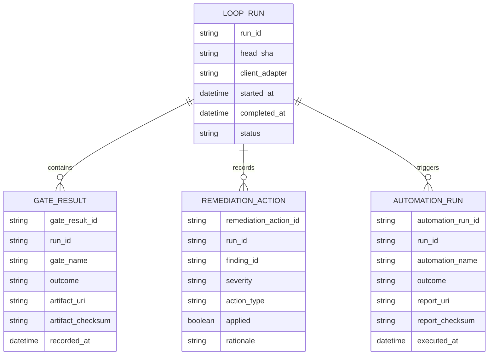

# feat: Close code-factory loop parity for Codex and Claude

## Table of Contents
- [Enhancement Summary](#enhancement-summary)
- [Section Manifest (Deepen Research Scope)](#section-manifest-deepen-research-scope)
- [Overview](#overview)
- [Problem Statement](#problem-statement)
- [Research Consolidation](#research-consolidation)
- [Proposed Solution](#proposed-solution)
- [Technical Approach](#technical-approach)
- [Alternative Approaches Considered](#alternative-approaches-considered)
- [System-Wide Impact](#system-wide-impact)
- [SpecFlow Analysis (Fallback)](#specflow-analysis-fallback)
- [Acceptance Criteria](#acceptance-criteria)
- [Success Metrics](#success-metrics)
- [Dependencies & Prerequisites](#dependencies--prerequisites)
- [Risk Analysis & Mitigation](#risk-analysis--mitigation)
- [Resource Requirements](#resource-requirements)
- [Future Considerations](#future-considerations)
- [Documentation Plan](#documentation-plan)
- [AI-Era Considerations](#ai-era-considerations)
- [ERD (Future option, non-blocking for MVP)](#erd-future-option-non-blocking-for-mvp)
- [Pseudo Examples (non-binding)](#pseudo-examples-non-binding)
- [Sources & References](#sources--references)

## Enhancement Summary

**Deepened on:** 2026-03-01  
**Sections enhanced:** 10  
**Research agents used:** `check-pr` skill pass, `greploop` skill pass (setup/manual mode); multiple additional sub-agents attempted but unavailable due model-cap limits.

### Key Improvements
1. Added explicit dependency-chain hardening patterns for mandatory `ralph-gold` (pinning, bootstrap, preflight, CI parity).
2. Added PR-readiness/policy-gate acceptance criteria (review independence + Greptile/Codex artifact expectations).
3. Strengthened installability and CI reproducibility guidance with official docs-backed recommendations.

### New Considerations Discovered
- `setup-python` caching behavior depends on dependency file hashing and pinned dependency versions; otherwise cache efficacy degrades.
- `uv` tool workflows should separate ephemeral execution (`uvx`) from persistent installs (`uv tool install`) and keep CI installs lock/pin constrained.
- Rollout sequencing needed correction: Phase 0 is now part of MVP ship criteria.

## Section Manifest (Deepen Research Scope)
1. **Dependency-chain hardening (Phase 0):** canonical installer path, pinning policy, fallback policy, and CI parity.
2. **Workflow loop contracts:** stage semantics and artifact handoff correctness.
3. **Runtime mode semantics:** deterministic execute/prepare behavior and response schema parity.
4. **Quality gates/governance:** security-scan + independent review artifact requirements.
5. **Risk and rollback:** explicit kill-switch and dependency outage handling.
6. **Documentation and operations:** runbooks, migration notes, and troubleshooting requirements.

### Skill and Learning Discovery Results
- Skills source scanned: `~/.agents/skills/`.
- Matched and applied skills: `check-pr` and `greploop`.
- Learnings scan result: `docs/solutions/` does not exist in this repository.
- Agent inventory was discovered from project/user agent paths and `~/.codex/config.toml`; several specialized review agents were identified but unavailable in this session due runtime model limits, so deepening used successful skill outputs plus primary-source docs research.

## Overview
This plan is now explicitly split into **MVP v1** and **follow-up tracks** to reduce delivery risk.  
**MVP v1** ships: (0) mandatory `ralph-gold` dependency hardening, (1) enforced workflow loop ordering, and (2) executable UI loop command parity for Codex App/CLI and Claude Code.  
**Follow-up tracks** cover: (3) remediation apply engine hardening and (4) Pulse/Upskill/Green PRs/Drift Check automation suite.  
This sequencing preserves brainstorm intent while avoiding scope bloat (see brainstorm: docs/brainstorms/2026-02-28-code-factory-loop-parity-brainstorm.md).

### Decision Update (2026-03-01)
Approved change: **`ralph-gold` is now a mandatory runtime dependency** for loop-stage orchestration.  
This plan therefore shifts from a TS-native loop core to **Ralph engine + harness governance adapter**.  
MVP scope now includes explicit installability hardening for Python/uv/pip dependency-chain risk.

### Canonical Ralph Source Decision (2026-03-01)
- **Canonical source:** PyPI release install with exact pinned version.
- **Single source of truth:** `src/lib/deps/ralph-runtime.ts` defines the only allowed Ralph version pin used by CLI preflight and generated workflows.
- **Exception path:** pinned Git SHA install is allowed only when the pinned PyPI version is unavailable; using it must emit a policy warning artifact.

## Problem Statement
Current implementation already exposes core commands (`policy-gate`, `review-gate`, `evidence-verify`, `remediate`, `ui:fast`, `ui:verify`, `ui:explore`) but parity is incomplete at runtime and workflow orchestration level:

- Generated PR workflow (from init template) currently emphasizes generic checks rather than an enforced ordered loop (`/Users/jamiecraik/dev/coding-harness/src/commands/init.ts:601-897`, `/Users/jamiecraik/dev/coding-harness/.github/workflows/pr-pipeline.yml:1-190`).
- UI loop commands return ready-state command strings and success-shaped responses (`/Users/jamiecraik/dev/coding-harness/src/commands/ui-loop.ts:164-373`) rather than deterministic execution artifacts.
- Remediation orchestrator returns action decisions (`skip`, `commit`, `requires_human`) without applying file patches directly (`/Users/jamiecraik/dev/coding-harness/src/lib/remediation/orchestrator.ts:99-206`).
- Automation coverage is mostly gardener maintenance (`/Users/jamiecraik/dev/coding-harness/.github/workflows/gardener.yml:1-77`, `/Users/jamiecraik/dev/coding-harness/src/commands/gardener.ts:27-170`) and does not yet implement Pulse/Upskill/Green PRs/Drift Check.

This undermines the intended code-factory loop consistency and creates expectation drift between roadmap/status language and real runtime behavior.

## Research Consolidation
### Local research findings
- Brainstorm origin exists and is current (2026-02-28): `/Users/jamiecraik/dev/coding-harness/docs/brainstorms/2026-02-28-code-factory-loop-parity-brainstorm.md`.
- Repo command surface already includes required primitives: `/Users/jamiecraik/dev/coding-harness/src/cli.ts:71-1083`.
- Review + evidence policy engines are present and mature enough to reuse: `/Users/jamiecraik/dev/coding-harness/src/commands/review-gate.ts`, `/Users/jamiecraik/dev/coding-harness/src/commands/evidence-verify.ts`, `/Users/jamiecraik/dev/coding-harness/src/lib/evidence/*`.
- Existing governance constraints and branch/check requirements are explicit: `/Users/jamiecraik/dev/coding-harness/AGENTS.md:12-38`.

### Institutional learnings
- `docs/solutions/` directory is not present in this repo (local scan).
- Nearest institutional substitutes with relevant lessons:
  - `/Users/jamiecraik/dev/coding-harness/docs/roadmap/agent-first-status.md` (status and claimed parity matrix)
  - `/Users/jamiecraik/dev/coding-harness/docs/plans/2026-02-27-feat-roadmap-cli-gap-closure-plan.md` (CLI/documentation parity, alias/contract/evidence corrections)
  - `/Users/jamiecraik/dev/coding-harness/docs/plans/2026-02-25-feat-remediation-loop-implementation-plan.md` (remediation policy and deterministic handling constraints)

### External research findings (2026-03-01)
- `uv` tools guidance confirms durable tool installs (`uv tool install`) vs ephemeral invocation (`uvx`), plus version-constrained upgrades and explicit Python selection.
- `uv` GitHub Actions integration guidance confirms `astral-sh/setup-uv` with built-in cache support and recommends `uv sync --locked --all-extras --dev` + `uv run ...` in CI jobs.
- `actions/setup-python` guidance emphasizes explicit Python pinning, optional dependency caching, and `cache-dependency-path` for multi-file setups.
- `pip` local-install guidance recommends validating regular installs (not only editable installs) to ensure production parity.
- Python Packaging guide confirms `[build-system]` must declare build backend requirements clearly for reliable builds.
- `pipx` docs support isolated global fallback installs where uv bootstrap is unavailable, with explicit PATH requirements.

## Proposed Solution
Implement **Ralph-backed loop orchestration with harness-owned governance contracts** and sequence delivery in phased milestones:

1. **MVP v1:** harden mandatory Ralph dependency installability (pinning, bootstrap, preflight, CI parity).
2. **MVP v1:** enforce ordered workflow contract risk → review → evidence → remediation-decision in generated and repo-native workflows, with explicit parity checks.
3. **MVP v1:** lock UI command mode semantics and ship execution mode as canonical behavior.
4. **Follow-up A (v1.1):** extend remediation from decisioning to controlled low-risk patch application with atomic boundaries.
5. **Follow-up B (v2):** add Pulse/Upskill/Green PRs/Drift Check automation suite with idempotent run contracts.
6. **Contract discipline:** PR loop remains governed by a JSON contract (risk tiers + `docs_drift` rules), preflighted before expensive CI fanout.

## Technical Approach

### Architecture
- **Runtime ownership:** `ralph-gold` executes loop-stage orchestration as mandatory engine.
- **Harness ownership:** policy contract loading/validation, risk/review/evidence/remediation policy decisions, and adapter normalization remain in `coding-harness`.
- **Parity contract:** generated and repo-native workflows must be validated against the same loop-stage manifest and per-stage semantics (inputs, outputs, schema version, fail policy, `if`, permissions, timeout, concurrency).
- **Mode contract:** `ui:fast`, `ui:verify`, and `ui:explore` use an explicit mode enum (`execute | prepare`), with **default = execute** and `--dry-run` mapping to `prepare`.
- **Mode immutability:** rollback cannot change mode defaults/meaning; rollback may only disable execution backend via kill switch while returning structured `execution_disabled` errors.
- **Adapter rule:** Codex/Claude adapter behavior differences are allowed only in invocation plumbing, not policy outcomes.
- **Installability contract:** a single deterministic bootstrap path installs verified Ralph version in local dev and CI; missing prerequisites fail closed with actionable remediation.

### Research Insights (Architecture + Installability)
**Best practices**
- Keep one canonical CI installation path and treat alternatives as explicit fallback modes (not silent auto-fallbacks).
- Pin both interpreter and tool versions in CI for reproducibility, and bind cache keys to dependency manifests.
- Separate execution contracts from install contracts: installation failure must fail before any loop stage starts.

**Performance considerations**
- Enable uv cache persistence in CI and include dependency-glob hashing to avoid stale cache poisoning.
- Use lock-constrained sync in CI (`uv sync --locked ...`) to keep resolver variance near zero.

**Edge cases**
- Runner missing Python tool cache.
- Ralph version drift between local and CI.
- PATH misconfiguration after tool install.

```text
File ownership targets (MVP-first)
- src/lib/deps/ralph-runtime.*               # ralph version pin + runtime resolver (new)
- src/commands/check-environment.ts          # enforce ralph/python/uv preflight readiness
- src/commands/ui-loop.ts                    # transition from readiness to execution modes
- src/commands/init.ts                       # generated workflow loop enforcement
- .github/workflows/pr-pipeline.yml          # repo-native loop parity
- src/lib/workflow/loop-parity.*             # parity manifest + validator (new)
- docs/roadmap/agent-first-status.md         # status truth update after delivery

Follow-up ownership targets
- src/lib/remediation/orchestrator.ts        # apply engine integration + safety gates
- src/commands/remediate.ts                  # apply mode + artifact contracts
- .github/workflows/{pulse,upskill,green-prs,drift-check}.yml  # automation suite
```

### Implementation Phases

#### Phase 0 (MVP v1): Mandatory Ralph dependency hardening
**Tasks and deliverables**
- Pin Ralph runtime version for both local and CI usage (single source of truth; no floating latest).
- Add deterministic bootstrap/install flow covering Python + uv/pip + Ralph install and version validation.
- Define canonical CI path:
  1. `actions/setup-python@v6` with explicit `python-version`,
  2. `astral-sh/setup-uv@v7` with explicit uv version + cache enabled,
  3. Ralph install command pinned to version (or pinned Git SHA if source-only),
  4. strict runtime version check before loop execution.
- Define fallback path contract (only when canonical path is unavailable): explicit pipx-based install with same Ralph version pin and preflight evidence note.
- Add strict dependency preflight in harness (`python`, `uv/pip`, `ralph --version`) with actionable failure messages.
- Update generated and repo-native workflows to install and cache Ralph deterministically before loop-stage jobs run.
- Add explicit install parity checks for local bootstrap vs CI bootstrap outputs (same resolved versions, same health checks).
- Add smoke tests that validate clean-environment installability on supported runner baselines.

**Success criteria**
- Fresh macOS/Linux environments can install required runtime and execute a minimal Ralph-backed loop preflight deterministically.
- Missing prerequisites fail fast with explicit remediation guidance.
- CI and local environments resolve identical Ralph version.
- CI install contract is deterministic under cold-cache and warm-cache runs.

**Estimated effort**
- Medium.

#### Phase 1 (MVP v1): Loop contract enforcement in workflows
**Tasks and deliverables**
- Define explicit ordered gate contract with machine-checkable handoff artifacts (risk, review, evidence, remediation-decision), including `docs_drift` rules.
- Add deterministic preflight `risk-policy-gate` before full workflow fanout.
- Update generated PR pipeline template in `/Users/jamiecraik/dev/coding-harness/src/commands/init.ts` to include/require loop jobs and dependencies.
- Align repo-native `/Users/jamiecraik/dev/coding-harness/.github/workflows/pr-pipeline.yml` with the same ordering.
- Add parity check in CI that fails if generated and repo-native stage graph **or stage semantics** diverge.

**Success criteria**
- Workflow blocks merge path when any required stage fails.
- Generated and repo-native workflows remain structurally and semantically equivalent for loop stages.

**Estimated effort**
- Medium (1-2 focused implementation cycles).

#### Phase 2 (MVP v1): Runtime execution parity for UI loop commands
**Tasks and deliverables**
- Implement explicit mode enum: `execute | prepare`.
- Lock default mode to `execute`; `--dry-run` forces `prepare`.
- Persist execution artifacts with durable `artifact_uri` and checksum (not local temp-only paths).
- Add adapter parity tests asserting identical exit/result semantics and canonical schema fields (`artifact_uri`, checksum, mode, head SHA, contract version) for same inputs.
- Add current-head SHA freshness enforcement so stale evidence is invalidated on new commits.

**Success criteria**
- Commands perform real runs (not only “ready” output) in default `execute` mode.
- Failures propagate non-zero exits with structured JSON error payloads.

**Estimated effort**
- Medium.

#### Follow-up A (v1.1): Remediation apply engine (low-risk auto-apply only)
**Tasks and deliverables**
- Introduce patch-application executor path for findings that pass low-risk policy.
- Keep medium/high as requires-human with evidence requirements.
- In v1.1 initial slice, support **single-finding atomic apply** only; defer batch transactions.
- Define atomic unit explicitly as one finding transaction with pre/post SHA + artifact.
- Define multi-finding behavior as independent sequential transactions (no cross-finding transaction), each in a fresh disposable worktree from a fixed baseline SHA.
- Emit structured remediation artifacts (`artifact_uri`, checksum, applied/skipped, policy rationale).

**Success criteria**
- Low-risk findings can be deterministically applied with auditable artifact trail.
- Medium/high findings cannot auto-apply by default (hard policy guard, see brainstorm: docs/brainstorms/2026-02-28-code-factory-loop-parity-brainstorm.md).
- Apply is atomic per finding with rollback scoped to that finding transaction only.

**Estimated effort**
- Medium-high due safety and rollback semantics.

#### Follow-up B (v2): Background automation suite
**Tasks and deliverables**
- Implement minimal first versions:
  - **Pulse:** daily summary grouped by agent and loop outcomes.
  - **Upskill:** aggregate recurring failures and suggest/update scripts or guidance.
  - **Green PRs:** deterministic merge-readiness checks + optional conflict/lint remediation flow.
  - **Drift Check:** docs/implementation consistency checks (extends gardener + policy drift checks).
- Standardize automation output contracts with idempotency keys and durable artifact URIs.
- Add workflow concurrency groups and dedupe key base: `repo + head_sha + automation_name + contract_version + input_fingerprint`.
- Define idempotency state machine (`in_progress`, `succeeded`, `failed`) and replay semantics (same key returns prior artifact unless `force` override).
- Define `force` semantics: reject while `in_progress`; allow only from terminal states; create new attempt ID and preserve prior artifact lineage.

**Success criteria**
- All four automations run via manual dispatch and publish machine-readable reports in CI fixtures.
- Drift Check and gardener results align without contradictory signals.

**Estimated effort**
- Medium-high.

### Phase Ownership & Target Dates
| Phase | Owner | Target date |
|---|---|---|
| Phase 0 (MVP) dependency hardening | Control-plane CLI engineer | 2026-03-08 |
| Phase 1 (MVP) workflow contracts | Workflow governance engineer | 2026-03-15 |
| Phase 2 (MVP) runtime parity | Runtime integration engineer | 2026-03-22 |
| Follow-up A (v1.1) remediation apply | Remediation/safety engineer | 2026-04-05 |
| Follow-up B (v2) automation suite | Automation/platform engineer | 2026-04-19 |

### Phase Gate Checklist (Execution Order)
1. **Gate 0 [MVP v1] — Dependency chain readiness**
   - Ralph runtime install path is deterministic and version-pinned in local + CI.
   - Dependency preflight fails closed on missing Python/uv/pip/Ralph and reports fixes.
2. **Gate A [MVP v1] — Workflow contract ready**
   - Generated and repo-native workflow DAGs include ordered loop jobs.
   - Status checks list updated to include loop stages.
3. **Gate B [MVP v1] — Runtime execution parity**
   - `ui:fast`, `ui:verify`, `ui:explore` run in execution mode with deterministic exit behavior.
4. **Gate C [v1.1, non-blocking for MVP] — Remediation apply safety**
   - Low-risk apply path proven with integration tests.
   - Medium/high auto-apply remains blocked.
5. **Gate D [v2, non-blocking for MVP] — Automation baseline**
   - Pulse/Upskill/Green PRs/Drift Check pass manual-dispatch fixture checks.

### Validation Command Matrix
```bash
# Core quality gates
pnpm lint
pnpm typecheck
pnpm test
pnpm audit
pnpm check
pnpm run test:deep

# Focused integration slices (examples)
pnpm test -- src/commands/ui-loop.test.ts src/commands/remediate.test.ts
pnpm test -- src/lib/remediation/orchestrator.test.ts src/commands/review-gate.test.ts
pnpm test -- src/commands/init.test.ts src/commands/policy-gate.test.ts
```

### Rollout and Rollback Strategy
- **Rollout:** ship MVP phases **0-2** first. Keep follow-up A/B on separate delivery tracks.
- **Mode rollout:** default mode is `execute` from first release of MVP; `prepare` is opt-in (`--dry-run`).
- **Rollback:** if remediation apply or workflow sequencing introduces regressions, keep mode contract immutable and disable execution backend via kill switch, returning structured `execution_disabled` errors while preserving artifacts for analysis.
- **Kill-switch mode matrix:** `execute` returns `execution_disabled`; `prepare` remains available with deterministic non-exec artifact output.
- **Operational stop condition:** any medium/high finding auto-applied in error immediately triggers rollback to manual remediation mode.
- **Dependency outage stop condition:** if canonical Ralph bootstrap fails in CI, block loop stages and surface dependency remediation artifact (no partial loop execution).

## Alternative Approaches Considered
1. **Workflow-first then runtime:** rejected for v1 because brainstorm explicitly requires both governance and runtime completion in milestone definition (see brainstorm: docs/brainstorms/2026-02-28-code-factory-loop-parity-brainstorm.md).
2. **Runtime-first then workflow:** rejected because deterministic governance is a hard baseline for safe operation in both clients.
3. **Separate Codex and Claude implementations:** rejected due high drift risk and duplicated policy surface.
4. **Optional Ralph integration only:** rejected per approved 2026-03-01 decision to make Ralph mandatory.

## System-Wide Impact

### Interaction Graph
1. PR event triggers workflow preflight → risk gate result artifact.
2. Risk pass triggers review gate checks (SHA-bound) → review artifact.
3. Review pass triggers evidence verification → evidence artifact.
4. **[MVP v1]** Evidence pass triggers remediation-decision artifact only.
5. **[v1.1]** Approved low-risk findings trigger remediation-apply artifact.
6. Automation modules consume artifacts for daily summary, failure mining, and drift reports.

Two-level chain example:
- `PR synchronize` triggers risk stage, which writes the gate artifact; review stage then consumes gate artifact + current SHA to authorize evidence stage.

### Error & Failure Propagation
- Risk/review/evidence/remediation-decision (MVP) and remediation-apply (v1.1) return structured failures; workflow must fail-closed on invalid/missing artifact transitions.
- UI execution commands must propagate underlying tool exit failures directly to command exit code and JSON payload.
- Remediation apply failures must distinguish policy rejection vs apply execution failure vs race/SHA mismatch.

### State Lifecycle Risks
- Partial apply in remediation could leave workspace inconsistency.  
  Mitigation: clean HEAD + SHA lock precondition, isolated disposable worktree execution, single-finding atomic transactions, rollback only inside disposable worktree.
- Artifact drift between workflow and runtime command schemas.  
  Mitigation: shared schema package + contract validation in CI.
- Automation jobs acting on stale artifacts.  
  Mitigation: freshness timestamps + SHA binding + idempotency state machine + dedupe key + concurrency groups.

### MVP vs Follow-up Boundary Rule
- MVP remediation stage is **decision-only** (`remediation-decision`).
- Auto-apply behavior is follow-up **v1.1+** only.

### API Surface Parity
Surfaces requiring parity updates:
- CLI commands: `ui:fast`, `ui:verify`, `ui:explore`, `remediate`, `init` output.
- Workflow templates: generated and repo-native PR pipeline.
- Contract surface: `uiLoopPolicy`, remediation policy fields, automation policy extensions if introduced.

### Integration Test Scenarios
1. **[MVP v1]** End-to-end workflow run where risk/review/evidence/remediation-decision pass with valid stage contracts.
2. **[MVP v1]** Review gate stale SHA causes loop abort before evidence stage.
3. **[MVP v1]** UI verify execution failure produces non-zero exit and no false success artifact.
4. **[v1.1]** Remediation mixed severities: each low-risk finding runs as independent transaction; medium/high always require human.
5. **[v2]** Drift Check detects docs mismatch and opens actionable report while gardener remains consistent.

## SpecFlow Analysis (Fallback)
`spec-flow-analyzer` agent was unavailable in this environment, so a manual spec-flow pass was applied.

### Identified flow gaps
- Missing explicit state transition contract between loop stages.
- Ambiguous behavior for “ready” vs “execute” command modes.
- Missing cross-client adapter compatibility acceptance criteria.

### Added edge cases
- Stale artifact consumed by downstream stage.
- Mixed-severity remediation set with partial applicability.
- Manual-dispatch automation run with duplicate trigger payload.

### Acceptance criteria upgrades from this analysis
- Every stage must declare input artifact contract and failure output schema.
- Execution mode contract is explicit (`execute | prepare`) with default = `execute`.
- Adapter parity tests must validate identical policy outcomes and canonical response/error schema fields for same inputs.

## Acceptance Criteria

### Functional Requirements (MVP v1)
- [x] Ralph runtime dependency is mandatory and version-pinned; unsupported/missing versions fail preflight.
- [x] Harness provides deterministic bootstrap guidance/path for Python + uv/pip + Ralph installation in local and CI environments.
- [x] Generated and repo-native workflow templates install/cache the same pinned Ralph version before loop stages.
- [x] Canonical CI bootstrap declares explicit Python version, uv version, and Ralph version (or pinned source SHA) with reproducible output checks.
- [x] Canonical source of truth for Ralph pin is implemented in `src/lib/deps/ralph-runtime.ts` and consumed by both CLI runtime checks and `harness init` workflow output.
- [x] Fallback bootstrap path (pipx) is explicit, opt-in, and emits a policy warning artifact when used.
- [x] PR pipeline enforces ordered risk → review → evidence → remediation-decision dependencies in generated and repo-native workflows.
- [x] `harness init` emits workflow templates that include loop contract jobs and required status checks.
- [x] `ui:fast`, `ui:verify`, and `ui:explore` implement explicit `execute | prepare` mode semantics.
- [x] Default mode is `execute`; `--dry-run` maps to `prepare` consistently across adapters.
- [x] UI loop command execution emits structured artifact output with durable `artifact_uri` + checksum (no local-only path dependency).
- [ ] Client adapters for Codex App/CLI and Claude Code preserve shared policy outcomes for identical inputs.
- [x] Preflight `risk-policy-gate` runs before expensive CI fanout and enforces risk + docs drift contract.
- [ ] Browser evidence command (`pnpm run harness:ui:capture-browser-evidence`) is required where UI-state proof is needed.
- [ ] PR-readiness output contract includes `policy_gate_status`, blockers, actionable/informational counts, and confidence rubric.
- [ ] Reviewer independence is enforced for merge readiness (coding actor cannot be sole approving reviewer).

### Functional Requirements (Follow-up tracks)
- [ ] **[v1.1]** remediation apply path writes low-risk patches with single-finding atomic transactions and per-finding rollback guarantee.
- [ ] **[v2]** Pulse/Upskill/Green PRs/Drift Check workflows exist with idempotent report contracts and replay semantics.

### Non-Functional Requirements
- [ ] Determinism: same input artifacts + policy produce same stage outcomes.
- [ ] Safety: fail-closed behavior for missing/invalid artifacts.
- [ ] Observability: each stage emits timestamped, SHA-bound telemetry/events, including `codex.tool.call.duration_ms` and `codex.api_request.duration_ms`.
- [ ] Performance: loop stage orchestration overhead p95 ≤ 2.5s, measured from preflight completion to remediation-decision artifact across 30 CI fixture runs.

### Quality Gates
- [ ] Ralph dependency smoke test on clean environment fixture (install + `ralph --version` + minimal doctor/preflight pass).
- [x] `pnpm lint`
- [x] `pnpm typecheck`
- [x] `pnpm test`
- [x] `pnpm audit`
- [x] `pnpm check`
- [x] `pnpm run test:deep` (required because runtime behavior changes)
- [ ] CI `security-scan` required and green before merge.
- [ ] **[MVP v1]** workflow fixture/integration tests for loop ordering, stale-SHA invalidation, and failure propagation
- [ ] **[MVP v1]** contract loader/validator tests for loop-stage semantic parity fields (inputs/outputs/schema/fail policy/if/permissions/timeout/concurrency)
- [ ] **[MVP v1]** kill-switch mode matrix tests across adapters (`execute => execution_disabled`, `prepare => deterministic non-exec artifact`).
- [ ] **[v1.1]** remediation transaction tests (single-finding atomic boundary, per-finding rollback scope)
- [ ] **[v2]** automation idempotency tests (`in_progress/succeeded/failed`, replay, force override)
- [ ] **[v1.1]** remediation apply hard-fails on dirty/non-disposable workspace and leaves primary workspace byte-identical before/after.
- [ ] Independent review artifacts (Greptile + Codex) attached before merge recommendation.

## Success Metrics
- Workflow parity: generated and repo-native PR pipeline share identical loop stages and required gates.
- Runtime parity (MVP): execution-mode UI commands pass golden-path + fail-path integration tests.
- Safety: zero unauthorized medium/high auto-apply events in test and pilot traces.
- Follow-up remediation (v1.1): low-risk single-finding atomic apply passes integration tests with rollback-on-failure evidence.
- Follow-up automation adoption (v2): all four automation jobs produce valid manual-dispatch fixture reports before enabling schedule.
- Observability baseline: p95 for `codex.tool.call.duration_ms` and `codex.api_request.duration_ms` remains within established pre-rollout control bands.

## Dependencies & Prerequisites
- Existing command modules and contract loading behavior (`/Users/jamiecraik/dev/coding-harness/src/cli.ts`, `/Users/jamiecraik/dev/coding-harness/src/lib/contract/*`).
- Ralph runtime toolchain (Python + uv/pip + `ralph-gold`) using canonical PyPI pin source with deterministic install instructions.
- GitHub workflow permissions and tokens for automation/report tasks.
- Stable artifact schema contracts for inter-stage handoffs.

### Research Insights (Dependencies)
**Implementation details**
- Prefer explicit interpreter pinning in CI (`python-version`) over implicit runner defaults.
- Use dependency-hash-based caching settings to reduce cold starts while preserving correctness.
- Validate regular install path in CI for package/runtime parity, not only editable installs.

**Anti-patterns to avoid**
- Floating tool versions (`latest`) in mandatory dependency chain.
- Mixed install methods without a declared precedence contract.
- Silent fallback from canonical installer to fallback installer.

### Automation Idempotency Transition Contract (v2)
| Current state | Default behavior | `force` behavior |
|---|---|---|
| `in_progress` | reject duplicate trigger for same key (`repo+head_sha+automation_name+contract_version+input_fingerprint`) | reject (`force` not allowed) |
| `succeeded` | return prior artifact (replay) for same key | create new attempt ID and run |
| `failed` | return prior failure artifact for same key | create new attempt ID and run |

## Risk Analysis & Mitigation
- **Risk:** workflow complexity regression.  
  **Mitigation:** keep loop stages modular with artifact schemas; validate with fixture-based workflow tests.
- **Risk:** Python/uv/pip dependency-chain install failures reduce installability.  
  **Mitigation:** one deterministic bootstrap path, strict version pinning, clean-environment smoke tests, cached CI install, and fail-fast preflight messaging.
- **Risk:** remediation apply introduces unsafe writes.  
  **Mitigation:** low-risk-only gate, isolated disposable worktree transactions, per-finding rollback markers.
- **Risk:** adapter drift between Codex and Claude.  
  **Mitigation:** shared contract tests and adapter parity snapshots.
- **Risk:** automation noise overwhelms users.  
  **Mitigation:** thresholding, dedupe, and severity bucketing in reports.

## Resource Requirements
- Engineering: control-plane/CLI engineer + workflow governance reviewer.
- Review artifacts: independent Greptile + Codex review as required by repo governance.
- CI resources: additional workflow jobs and integration test runtime.

## Future Considerations
- Expand remediation apply beyond low-risk only after pilot evidence supports safety.
- Consider unified automation policy in contract for schedule + routing controls.
- Explore optional UI-facing visualization only after control-plane parity is stable (explicit v1 non-goal per brainstorm).

## Documentation Plan
Update and keep in sync:
- `/Users/jamiecraik/dev/coding-harness/README.md` command and workflow behavior notes.
- `/Users/jamiecraik/dev/coding-harness/docs/roadmap/agent-first-status.md` (status truth updates).
- `/Users/jamiecraik/dev/coding-harness/docs/HARNESS_IMPLEMENTATION_PLAN.md` loop contract section only.
- `/Users/jamiecraik/dev/coding-harness/docs/agents/07b-agent-governance.md` only if governance behavior changes (optional, non-blocking).

### Dependency Bootstrap Outage Runbook
Create `/Users/jamiecraik/dev/coding-harness/docs/runbooks/ralph-bootstrap-outage.md` and require it before MVP release.  
Minimum contents:
1. Detection signals for Python/uv/Ralph bootstrap failures in CI.
2. Immediate containment (block loop fanout + publish dependency failure artifact).
3. Triage decision tree (cache corruption, registry outage, pin mismatch, PATH/tooling mismatch).
4. Recovery actions (retry policy, cache purge criteria, controlled fallback enablement).
5. Re-enable criteria for returning from fallback to canonical bootstrap path.

## AI-Era Considerations
- Prompts and automation instructions should encode deterministic gates and artifact expectations, not only desired outcomes.
- Any AI-assisted patch application output requires explicit policy rationale and post-apply evidence.
- Human review remains mandatory for medium/high-risk remediation actions.

## ERD (Future option, non-blocking for MVP)
This ERD is informational for follow-up persistence work only. MVP uses file/artifact-based contracts and does not require DB changes.


## Pseudo Examples (non-binding)
### `/Users/jamiecraik/dev/coding-harness/docs/examples/loop-contract.todo.md`
```md
- [ ] Add workflow stage contract schema for risk/review/evidence/remediation-decision
- [ ] Add adapter parity test checklist for codex + claude
- [ ] Add stale-artifact rejection integration test cases
```

### `/Users/jamiecraik/dev/coding-harness/docs/examples/remediation-apply-flow.pseudo.ts`
```ts
// file: /Users/jamiecraik/dev/coding-harness/docs/examples/remediation-apply-flow.pseudo.ts
for (const finding of findings) { // independent transactions
  const worktree = createDisposableWorktree(preSha); // new worktree per finding
  beginTransaction(finding.id, preSha, worktree.id);
  if (!matchesCurrentHeadSha(finding)) skip("stale_sha");
  if (!isLowRisk(finding)) requireHuman("policy_threshold");
  applyPatch(finding, worktree); // disposable worktree only
  verifyPatchEvidence(finding);
  finalizeTransaction(finding.id, postSha, artifactUri, checksum);
  cleanup(worktree);
}
```

## Sources & References
### Origin
- **Brainstorm document:** [docs/brainstorms/2026-02-28-code-factory-loop-parity-brainstorm.md](../brainstorms/2026-02-28-code-factory-loop-parity-brainstorm.md)
- **Carried-forward decisions:**
  - Shared policy outcomes across Codex/Claude adapters (runtime now Ralph-backed per approved 2026-03-01 addendum)
  - v1 requires both CI loop proof and runtime execution parity
  - low-risk-only remediation auto-apply

### Internal References
- Workflow generation template: `/Users/jamiecraik/dev/coding-harness/src/commands/init.ts:601-897`
- Repo-native PR workflow: `/Users/jamiecraik/dev/coding-harness/.github/workflows/pr-pipeline.yml:1-190`
- UI loop command behavior: `/Users/jamiecraik/dev/coding-harness/src/commands/ui-loop.ts:164-373`
- Remediation orchestration: `/Users/jamiecraik/dev/coding-harness/src/lib/remediation/orchestrator.ts:99-206`
- Remediation CLI wiring: `/Users/jamiecraik/dev/coding-harness/src/commands/remediate.ts:320-434`
- Gardener automation baseline: `/Users/jamiecraik/dev/coding-harness/.github/workflows/gardener.yml:1-77`
- Repo governance constraints: `/Users/jamiecraik/dev/coding-harness/AGENTS.md:12-38`

### Related Work
- `/Users/jamiecraik/dev/coding-harness/docs/plans/2026-02-27-feat-roadmap-cli-gap-closure-plan.md`
- `/Users/jamiecraik/dev/coding-harness/docs/plans/2026-02-25-feat-remediation-loop-implementation-plan.md`
- `/Users/jamiecraik/dev/coding-harness/docs/roadmap/agent-first-status.md`

### External References
- [Using tools | uv](https://docs.astral.sh/uv/guides/tools/)
- [Using uv in GitHub Actions | uv](https://docs.astral.sh/uv/guides/integration/github/)
- [setup-python (caching and version pinning guidance)](https://github.com/actions/setup-python)
- [Local project installs | pip](https://pip.pypa.io/en/stable/topics/local-project-installs/)
- [Writing your pyproject.toml | Python Packaging User Guide](https://packaging.python.org/en/latest/guides/writing-pyproject-toml/)
- [pipx documentation (installation and isolated tool environments)](https://pipx.pypa.io/stable/docs/)
