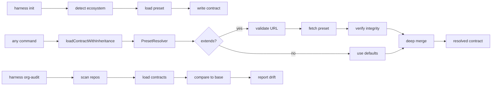

# feat: Cross-Project Governance Platform

## Enhancement Summary

**Deepened on:** 2026-03-07
**Sections enhanced:** 8
**Research agents used:** Security Sentinel, TypeScript Reviewer, Best Practices Researcher (x4), Architecture Strategist, Code Simplicity Reviewer

### Key Improvements
1. **Security layer** - SSRF protection, prototype pollution prevention, path traversal mitigation
2. **Type safety** - Branded types for URL/Path, explicit merge types, error handling patterns
3. **Deep merge strategy** - lodash.mergeWith with customizer for array handling
4. **SRI verification** - Subresource integrity for remote presets (supply chain protection)

### New Considerations Discovered
- Remote URL loading requires DNS rebinding protection (resolve IP before fetch)
- Deep merge needs dangerous key blocking (`__proto__`, `constructor`, `prototype`)
- Async contract loading required for remote presets (backward compat wrapper needed)
- Preset lockfile prevents supply chain attacks from compromised remote configs

---

## Overview

Transform coding-harness from a single-repo governance tool into a cross-project governance platform with contract inheritance, org-wide visibility, and zero-config adoption.

**Origin:** This plan carries forward decisions from [Cross-Project Governance Brainstorm](../brainstorms/2026-03-07-cross-project-governance-brainstorm.md):
- Consumption: Package dependency (not central service)
- Inheritance: Hybrid (bundled presets + remote extends)
- Visibility: CLI-first (dashboard later)
- Zero-config: Smart init + template repos

---

## Problem Statement

Currently, each project maintains its own `harness.contract.json`, leading to:
- **Drift** - Policies diverge across projects with no detection
- **Duplication** - Same rules copy-pasted, manual synchronization
- **No visibility** - Cannot see org-wide governance state
- **Manual setup** - New projects require hand-crafted configuration

---

## Proposed Solution

Implement a **Core Inheritance** system that ships in weeks:

1. **Contract Inheritance** - `extends` field with deep merge for overrides
2. **Bundled Presets** - Ecosystem-specific base contracts shipped with package
3. **Remote Extends** - GitHub raw URLs for org-specific bases (with SRI verification)
4. **Org Audit CLI** - Multi-repo visibility and drift detection
5. **Smart Init** - Auto-detect ecosystem and apply correct preset
6. **Template Repos** - One-click setup for new projects

---

## Technical Approach

### Architecture

```
┌─────────────────────────────────────────────────────────────┐
│                    harness.contract.json                     │
│  ┌─────────────────────────────────────────────────────┐    │
│  │ extends: "@brainwav/coding-harness/presets/ts-base" │    │
│  │ overrides: { riskTierRules: {...} }                 │    │
│  └─────────────────────────────────────────────────────┘    │
└─────────────────────────────────────────────────────────────┘
                              │
                              ▼
┌─────────────────────────────────────────────────────────────┐
│                    Preset Resolver                           │
│  ┌──────────────┐  ┌──────────────┐  ┌──────────────┐      │
│  │   Bundled    │  │    Remote    │  │     Deep     │      │
│  │   Presets    │  │    Extends   │  │     Merge    │      │
│  └──────────────┘  └──────────────┘  └──────────────┘      │
│  ┌──────────────┐  ┌──────────────┐  ┌──────────────┐      │
│  │ URL Validator│  │SRI Verifier  │  │  Path Guard  │      │
│  └──────────────┘  └──────────────┘  └──────────────┘      │
└─────────────────────────────────────────────────────────────┘
                              │
                              ▼
┌─────────────────────────────────────────────────────────────┐
│                  Resolved Contract                           │
│  (Merged preset + overrides = final contract)               │
└─────────────────────────────────────────────────────────────┘
```

### Security Architecture

The inheritance system introduces new attack surfaces that require dedicated security layers:

#### 1. SSRF Protection Layer

Remote URL loading enables Server-Side Request Forgery. Mitigation requires:

- **URL allowlist** - Only approved hosts (github.com, raw.githubusercontent.com)
- **Private IP blocking** - DNS resolution before fetch, block RFC 1918 ranges
- **Protocol restriction** - HTTPS only, no file://, gopher://, etc.
- **Redirect tracking** - Re-validate after redirects, max 3 hops

```typescript
// src/lib/governance/url-validator.ts
const PRIVATE_IP_RANGES = [
  /^10\./,                           // 10.0.0.0/8
  /^172\.(1[6-9]|2[0-9]|3[0-1])\./,  // 172.16.0.0/12
  /^192\.168\./,                      // 192.168.0.0/16
  /^127\./,                           // 127.0.0.0/8 (loopback)
  /^169\.254\./,                      // 169.254.0.0/16 (link-local)
];

export async function validateRemoteUrl(
  urlString: string,
  options: { allowedHosts?: string[] } = {}
): Promise<URL> {
  const url = new URL(urlString);

  // Protocol check
  if (url.protocol !== "https:") {
    throw new UrlValidationError("Only HTTPS allowed", "PROTOCOL_NOT_ALLOWED");
  }

  // Allowlist enforcement
  if (options.allowedHosts && !options.allowedHosts.includes(url.hostname)) {
    throw new UrlValidationError(`Host not in allowlist`, "HOST_NOT_ALLOWED");
  }

  // DNS rebinding protection
  const ips = await dns.resolve(url.hostname);
  for (const ip of ips) {
    if (PRIVATE_IP_RANGES.some(r => r.test(ip))) {
      throw new UrlValidationError("Private IP blocked", "PRIVATE_IP_BLOCKED");
    }
  }

  return url;
}
```

#### 2. Prototype Pollution Prevention

Deep merge without key validation allows `__proto__` injection:

```typescript
// src/lib/contract/safe-merge.ts
const DANGEROUS_KEYS = new Set([
  "__proto__", "prototype", "constructor",
  "hasOwnProperty", "isPrototypeOf", "propertyIsEnumerable",
]);

export function safeMerge<T>(target: T, source: unknown): T {
  if (!isPlainObject(source)) return source as T;

  const result = { ...target } as Record<string, unknown>;

  for (const key of Object.keys(source)) {
    if (DANGEROUS_KEYS.has(key)) {
      throw new MergeError(`Dangerous key '${key}' blocked`, key);
    }
    // ... recursive merge
  }

  return result as T;
}
```

#### 3. Path Traversal Mitigation

Local preset paths must be constrained:

```typescript
// src/lib/governance/preset-resolver.ts
export async function resolveLocalPreset(
  presetPath: string,
  projectRoot: string
): Promise<string> {
  // Block null bytes (path truncation)
  if (presetPath.includes("\0")) {
    throw new PathTraversalError("Null byte in path", presetPath);
  }

  // Block home directory expansion
  if (presetPath.startsWith("~")) {
    throw new PathTraversalError("Home directory not allowed", presetPath);
  }

  // Block absolute paths
  if (path.isAbsolute(presetPath)) {
    throw new PathTraversalError("Absolute paths not allowed", presetPath);
  }

  // Block parent traversal
  if (presetPath.includes("..")) {
    throw new PathTraversalError("Parent traversal not allowed", presetPath);
  }

  // Verify within project root
  const resolved = path.resolve(projectRoot, presetPath);
  if (!resolved.startsWith(projectRoot)) {
    throw new PathTraversalError("Path escapes project root", resolved);
  }

  return resolved;
}
```

#### 4. Subresource Integrity (SRI) - Phase 2

**Status: Deferred to Phase 2**

Remote presets need integrity verification to prevent supply chain attacks. However, implementing a secure trust model requires careful design:

**Problem**: The integrity hash must come from an out-of-band source (not the same potentially compromised URL). Options:
1. **Trust-on-First-Use (TOFU)**: Pin hash on first fetch, warn on change
2. **Org-signed presets**: Cryptographic signatures from org keys
3. **Manual approval workflow**: Explicit human review for new/updated presets

**Implementation Plan (Phase 2)**:
```typescript
// src/lib/governance/integrity.ts
export interface IntegrityVerifiedPreset {
  url: string;
  integrity: string;  // "sha256-abc123..."
}

export async function loadVerifiedPreset(
  preset: IntegrityVerifiedPreset
): Promise<string> {
  const response = await secureFetch(preset.url);
  const computed = `sha256-${crypto
    .createHash("sha256")
    .update(response.content)
    .digest("base64")}`;

  if (computed !== preset.integrity) {
    throw new IntegrityError(
      `Integrity mismatch for ${preset.url}. Possible supply chain attack.`
    );
  }

  return response.content;
}
```

**Preset Lockfile** (`governance.lock.yaml`) - Phase 2:
```yaml
version: 1
presets:
  - url: "https://raw.githubusercontent.com/org/presets/main/base.yaml"
    integrity: "sha256-7K4n2x9mQ8vL3pR6sT1wY5zA0bC4dE8fG2hI6jK0lM4="
    resolvedAt: "2026-03-07T12:00:00Z"
```

**Phase 1 Scope**: DNS rebinding protection and private IP blocking provide sufficient SSRF protection for the initial release. SRI/lockfile will be added in Phase 2 with a proper trust model.

---

### TypeScript Type Safety

#### Branded Types for URL/Path

Prevent accidental confusion between URLs and local paths:

```typescript
// src/lib/contract/types.ts
export type HttpUrl = string & { readonly __brand: "HttpUrl" };
export type LocalPath = string & { readonly __brand: "LocalPath" };
export type PresetSource = HttpUrl | LocalPath;

function isHttpUrl(value: string): value is HttpUrl {
  return value.startsWith("https://") || value.startsWith("http://");
}
```

#### Preset Reference Type

```typescript
export interface PresetReference {
  /** Local path relative to contract file, or absolute URL */
  source: string;
  /** Merge strategy for array fields */
  arrays?: "replace" | "append" | "prepend";
  /** SRI hash for remote presets */
  integrity?: string;
}

export interface HarnessContractWithPreset extends HarnessContract {
  extends?: PresetReference | PresetReference[];
}
```

#### Merge Result Type

```typescript
// src/lib/contract/merger.ts
export interface MergeResult {
  contract: HarnessContract;
  sources: string[];  // Audit trail of resolved presets
}

type ArrayKey<T, K extends keyof T> = T[K] extends Array<unknown> | undefined ? K : never;
type ContractArrayKeys = ArrayKey<HarnessContract, keyof HarnessContract>;

/** Keys where arrays should merge by default */
const MERGE_ARRAY_KEYS: ContractArrayKeys[] = ["blastRadiusRules"];
```

#### Error Types

```typescript
// src/lib/contract/errors.ts
export class PresetFetchError extends Error {
  constructor(
    public readonly source: string,
    message: string,
    public readonly cause?: Error,
  ) {
    super(`Failed to fetch preset from ${source}: ${message}`);
    this.name = "PresetFetchError";
  }
}

export class CircularInheritanceError extends Error {
  constructor(public readonly chain: string[]) {
    super(`Circular preset inheritance: ${chain.join(" -> ")}`);
    this.name = "CircularInheritanceError";
  }
}

export class IntegrityError extends Error {
  constructor(message: string) {
    super(message);
    this.name = "IntegrityError";
  }
}
```

---

### Deep Merge Implementation

Research findings favor `lodash.mergeWith` with a customizer for explicit array handling:

#### Best Practices from Research

1. **Use lodash.mergeWith** - Battle-tested, handles edge cases
2. **Explicit array strategy** - Replace by default, merge by key for specific fields
3. **Depth limit** - Max 20 levels to prevent stack overflow
4. **Immutable output** - Never mutate inputs, always return new object
5. **Freeze result** - Optional deep freeze for tamper-proofing

```typescript
// src/lib/contract/merger.ts
import mergeWith from "lodash/mergeWith.js";

export interface MergeOptions {
  arrayMergeStrategy: "replace" | "concat" | "merge-by-key";
  maxDepth: number;
}

const DEFAULT_MERGE_OPTIONS: MergeOptions = {
  arrayMergeStrategy: "replace",
  maxDepth: 20,
};

export function mergeContracts(
  parent: HarnessContract,
  child: Partial<HarnessContract>,
  options: Partial<MergeOptions> = {},
): HarnessContract {
  const opts = { ...DEFAULT_MERGE_OPTIONS, ...options };

  return mergeWith({}, parent, child, (objValue, srcValue, key) => {
    // Block dangerous keys
    if (DANGEROUS_KEYS.has(key as string)) {
      return undefined; // lodash will skip
    }

    // Handle arrays based on strategy
    if (Array.isArray(objValue) && Array.isArray(srcValue)) {
      if (opts.arrayMergeStrategy === "concat") {
        return [...objValue, ...srcValue];
      }
      // Default: replace
      return srcValue;
    }

    // Let lodash handle objects and primitives
    return undefined;
  }) as HarnessContract;
}
```

---

### Async Contract Loading

Remote presets require async loading. Maintain backward compatibility:

```typescript
// src/lib/contract/loader.ts

/** Sync loading for backward compatibility (no remote presets) */
export function loadContract(path: string): HarnessContract {
  // ... existing implementation unchanged
}

/** Async loading with full preset resolution */
export async function loadContractWithInheritance(
  path: string,
  visited: Set<string> = new Set(),
): Promise<HarnessContract> {
  const contract = loadContract(path);
  const canonicalPath = realpathSync(path);

  // Circular inheritance detection
  if (visited.has(canonicalPath)) {
    throw new CircularInheritanceError([...visited, canonicalPath]);
  }
  visited.add(canonicalPath);

  const extendsField = (contract as HarnessContractWithPreset).extends;
  if (!extendsField) {
    return contract;
  }

  const presets = Array.isArray(extendsField) ? extendsField : [extendsField];
  let merged: HarnessContract = { ...DEFAULT_CONTRACT };

  // Load and merge each preset in order
  for (const preset of presets) {
    const source = typeof preset === "string" ? preset : preset.source;
    const presetContract = await loadPreset(source, visited);
    merged = mergeContracts(merged, presetContract);
  }

  // Finally merge current contract (highest priority)
  return mergeContracts(merged, contract);
}
```

---

### Implementation Phases

#### Phase 1: Contract Inheritance System (Week 1-2)

**Goal:** Add `extends` field support with deep merge resolution.

**Tasks:**
- [x] Add `PresetReference` and `HarnessContractWithPreset` types in `src/lib/contract/types.ts`
- [x] Create error classes in `src/lib/contract/errors.ts`
- [x] Implement `mergeContracts()` in `src/lib/contract/merger.ts` using lodash.mergeWith
- [x] Create `PresetResolver` class in `src/lib/contract/preset-resolver.ts`
- [x] Add `loadContractWithInheritance()` async variant in `src/lib/contract/preset-resolver.ts`
- [x] Add `extends` to `VALID_TOP_LEVEL_KEYS` in `src/lib/contract/validator.ts`
- [x] Add circular extends detection (max depth 10)
- [x] Create URL validator in `src/lib/governance/url-validator.ts`

**New Files:**
```
src/lib/contract/
├── errors.ts              # PresetFetchError, CircularInheritanceError, IntegrityError
├── merger.ts              # mergeContracts with lodash.mergeWith
├── preset-resolver.ts     # PresetResolver class
└── types.ts               # Extended with PresetReference, branded types

src/lib/governance/
├── url-validator.ts       # SSRF protection
├── safe-merge.ts          # Prototype pollution protection
└── integrity.ts           # SRI verification
```

**Tests:**
- [x] Unit tests for deep merge with dangerous key blocking
- [x] Unit tests for preset resolution
- [x] Unit tests for URL validation (private IP, protocol, allowlist)
- [ ] Integration tests for contract loading with extends
- [ ] Edge cases: circular extends, missing presets, invalid URLs

---

#### Phase 2: Bundled Presets (Week 2-3)

**Goal:** Ship ecosystem-specific presets with the package.

**Tasks:**
- [ ] Create preset files in `src/presets/` directory
- [ ] Build preset files into `dist/presets/` for npm package
- [ ] Implement `resolvePresetName()` to map names to files
- [ ] Add `harness preset list` command
- [ ] Add `harness preset show <name>` command
- [ ] Update `harness init` to auto-detect ecosystem

**Preset Structure:**
```
src/presets/
├── typescript-base.json   # Full TS governance
├── python-base.json       # Python + uv governance
├── rust-base.json         # Rust + cargo governance
├── swift-base.json        # Swift + xcodebuild governance
├── go-base.json           # Go governance
├── strict.json            # High-security baseline
└── minimal.json           # Just security-scan
```

**Auto-Detection Logic (`src/lib/preset-detection.ts`):**

Research findings: Check for lockfiles + manifests for accurate detection:

```typescript
interface EcosystemMarker {
  files: string[];      // Required files (any match)
  lockfiles?: string[]; // Optional lockfiles
  name: string;
}

const ECOSYSTEM_MARKERS: EcosystemMarker[] = [
  {
    files: ["package.json"],
    lockfiles: ["pnpm-lock.yaml", "package-lock.json", "yarn.lock"],
    name: "typescript"
  },
  {
    files: ["pyproject.toml", "setup.py", "requirements.txt"],
    lockfiles: ["uv.lock", "poetry.lock"],
    name: "python"
  },
  {
    files: ["Cargo.toml"],
    lockfiles: ["Cargo.lock"],
    name: "rust"
  },
  {
    files: ["Package.swift", "project.pbxproj"],
    lockfiles: ["Package.resolved"],
    name: "swift"
  },
  {
    files: ["go.mod"],
    lockfiles: ["go.sum"],
    name: "go"
  },
];

export function detectEcosystem(cwd: string): string | undefined {
  for (const marker of ECOSYSTEM_MARKERS) {
    if (marker.files.some(f => existsSync(join(cwd, f)))) {
      return marker.name;
    }
  }
  return undefined;
}
```

---

#### Phase 3: Org Audit Command (Week 3-4)

**Goal:** Multi-repo visibility and drift detection.

**Tasks:**
- [ ] Create `harness org-audit` command in `src/commands/org-audit.ts`
- [ ] Implement multi-repo scanner with parallel processing
- [ ] Implement drift detection against base contract
- [ ] Add output formatters (JSON, Markdown, Table)
- [ ] Add credential redaction for git remote URLs

**Research Findings for Multi-Repo Scanning:**

1. **Parallel processing** - Use `Promise.allSettled` for fault tolerance
2. **Progress reporting** - Show repo count and current progress
3. **Caching** - Cache contract parsing per session
4. **Credential redaction** - Sanitize git URLs before logging

```typescript
// src/lib/governance/repo-scanner.ts
export async function scanRepositories(
  repos: string[],
  options: ScanOptions
): Promise<ScanResult[]> {
  const results = await Promise.allSettled(
    repos.map(repo => scanSingleRepo(repo, options))
  );

  return results.map((result, i) => {
    if (result.status === "fulfilled") {
      return result.value;
    }
    return {
      path: repos[i],
      error: result.reason.message,
      status: "error",
    };
  });
}

// Credential redaction
function redactUrlCredentials(url: string): string {
  try {
    const parsed = new URL(url);
    if (parsed.username || parsed.password) {
      parsed.username = "[REDACTED]";
      parsed.password = "";
    }
    return parsed.toString();
  } catch {
    return "[INVALID_URL_REDACTED]";
  }
}
```

---

#### Phase 4: Template Repos (Week 4)

**Goal:** One-click setup for new projects.

**Tasks:**
- [ ] Create `jscraik/template-typescript-harness` repo
- [ ] Create `jscraik/template-python-harness` repo
- [ ] Create `jscraik/template-rust-harness` repo
- [ ] Add GitHub "Use this template" documentation

**Template Structure:**
```
template-typescript-harness/
├── .github/
│   └── workflows/
│       └── harness-gates.yml    # Pre-configured CI
├── .greptile/
│   ├── config.json
│   ├── rules.md
│   └── files.json
├── harness.contract.json        # Extends typescript-base
├── governance.lock.yaml         # Locked preset integrity
├── package.json                 # With @brainwav/coding-harness
└── README.md                    # Setup instructions
```

---

## System-Wide Impact

### Interaction Graph



### Error Propagation

| Error Type | Location | Handling |
|------------|----------|----------|
| `PresetFetchError` | `preset-resolver.ts` | Clear error with source URL |
| `CircularInheritanceError` | `loader.ts` | Error with chain trace |
| `IntegrityError` | `integrity.ts` | Block load, suggest lockfile update |
| `UrlValidationError` | `url-validator.ts` | Specific reason (protocol, IP, host) |
| `MergeError` | `merger.ts` | Path to dangerous key |
| `PathTraversalError` | `preset-resolver.ts` | Blocked path pattern |

### State Lifecycle Risks

| Risk | Mitigation |
|------|------------|
| Partial preset fetch | Cache intermediate results, resume on retry |
| Invalid merged contract | Validate after merge, report exact conflicts |
| Orphaned overrides | Warn if override field doesn't exist in base |
| Stale lockfile | Compare integrity hash, warn if mismatch |

---

## Acceptance Criteria

### Functional Requirements

- [ ] `extends: "typescript-base"` in contract produces valid merged contract
- [ ] `overrides` fields replace/augment base values correctly
- [ ] `harness init` auto-detects ecosystem and applies preset
- [ ] `harness preset list` shows all bundled presets
- [ ] `harness preset show typescript-base` displays preset content
- [ ] `harness org-audit --path ~/dev` scans all repos
- [ ] `harness org-audit --drift` identifies policy divergence
- [ ] Remote extends (GitHub URLs) resolve correctly with SRI
- [ ] Circular extends detection with clear error message
- [ ] Dangerous keys (`__proto__`, etc.) blocked in merge

### Non-Functional Requirements

- [ ] Deep merge completes in <10ms for typical contract
- [ ] Remote preset fetch with 5s timeout, cached for session
- [ ] All new code has >80% test coverage
- [ ] No breaking changes to existing contract format
- [ ] Backwards compatible - contracts without `extends` work unchanged

### Quality Gates

- [x] `pnpm lint` passes
- [x] `pnpm typecheck` passes
- [x] `pnpm test` passes (all 851 tests)
- [x] `pnpm audit` passes
- [ ] New commands documented in README

---

## Success Metrics

1. **Inheritance adoption** - 5+ projects using extends within 1 month
2. **Drift detection** - Identify drift in at least 1 project
3. **Zero-config init** - New project setup <30 seconds
4. **Template usage** - 1+ projects created from templates

---

## Dependencies & Risks

### Dependencies

| Dependency | Status | Notes |
|------------|--------|-------|
| `lodash.mergeWith` | To add | Battle-tested deep merge with customizer |
| `js-yaml` | Existing | For lockfile parsing |
| GitHub raw URL access | Available | No auth needed for public |
| Existing contract loader | Stable | Extending, not replacing |

### Risks

| Risk | Likelihood | Impact | Mitigation |
|------|------------|--------|------------|
| Breaking existing contracts | Low | High | Backwards compat tests |
| Remote URL security | Medium | High | URL validation, private IP blocking, SRI |
| Preset drift over time | Medium | Medium | Lockfile with integrity hashes |
| Circular extends complexity | Low | Medium | Max depth limit (10) |
| Prototype pollution | Low | Critical | Dangerous key blocking in merge |
| Supply chain attack | Low | Critical | SRI verification for remote presets |

---

## Future Considerations

### Extensibility

- **Preset versioning** - `typescript-base@1.2.0` for lockable presets
- **Preset composition** - Array of extends for layering
- **Private preset registry** - Self-hosted for enterprise

### Dashboard (Phase 2)

- Web UI for org-audit results
- Historical drift tracking
- Policy compliance scoring

---

## Documentation Plan

- [ ] Update README with inheritance examples
- [ ] Add `docs/presets.md` with preset catalog
- [ ] Add `docs/org-audit.md` with audit workflows
- [ ] Add `docs/security.md` with threat model for remote presets
- [ ] Update `harness.contract.json` schema
- [ ] Add migration guide for existing projects

---

## Sources & References

### Origin

- **Brainstorm document:** [docs/brainstorms/2026-03-07-cross-project-governance-brainstorm.md](../brainstorms/2026-03-07-cross-project-governance-brainstorm.md)
  - Key decisions carried forward:
    - Package dependency model (not central service)
    - Hybrid inheritance (bundled + remote)
    - CLI-first visibility
    - Smart init + templates for zero-config

### Internal References

- Contract loader: `src/lib/contract/loader.ts:82-140`
- Contract types: `src/lib/contract/types.ts:42-120`
- Contract validator: `src/lib/contract/validator.ts:42-66`
- Ecosystem profiles: `src/lib/policy/required-checks.ts:15-72`
- Init command: `src/commands/init.ts:518+`
- Branch protect (profile usage): `src/commands/branch-protect.ts:76-105`

### External References

- **lodash.mergeWith**: https://lodash.com/docs/4.17.15#mergeWith - Deep merge with customizer
- **OWASP SSRF Prevention**: https://cheatsheetseries.owasp.org/cheatsheets/Server_Side_Request_Forgery_Prevention_Cheat_Sheet.html
- **Subresource Integrity**: https://developer.mozilla.org/en-US/docs/Web/Security/Subresource_Integrity
- **ESLint extends pattern**: https://eslint.org/docs/latest/use/configure/configuration-files#extending-configuration-files
- **TypeScript tsconfig extends**: https://www.typescriptlang.org/tsconfig#extends

### Related Work

- Ecosystem profiles PR #84 (branch-protect --ecosystem)
- Contract schema hardening (security validation)
