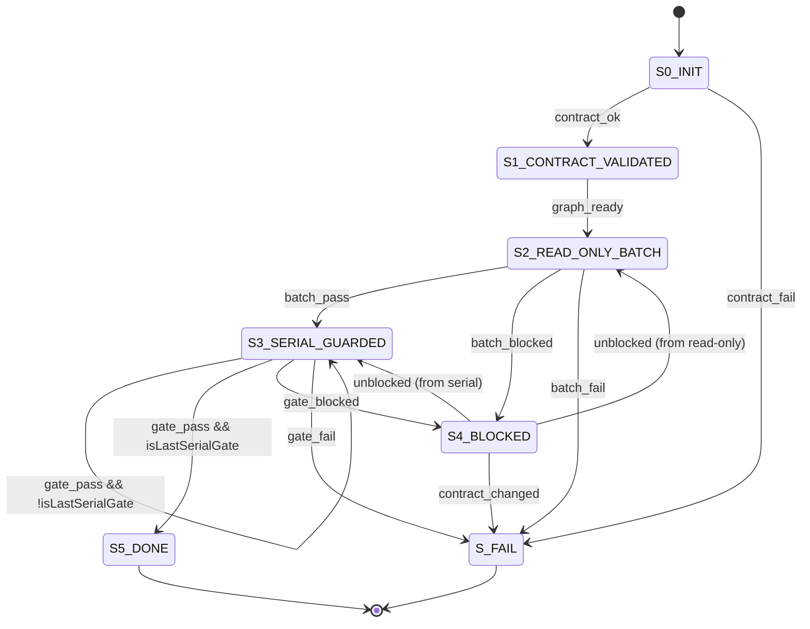

# Coding Harness Reliability Orchestration Plan

## Enhancement Summary

**Deepened on:** 2026-04-08  
**Mode:** targeted-confidence  
**Research execution mode:** direct  
**Key areas improved:** deterministic lifecycle gating, resume compatibility safety, retry-classification boundaries, contract-source unification

- Adds a deterministic verify lifecycle with explicit blocked and resume transitions, backed by auditable run-state artifacts.
- Introduces a canonical gate contract extension that keeps `verify-work`, `doctor`, and docs aligned on check identity and execution behavior.
- Splits transient infrastructure failures from contract/policy failures, with bounded retries only where safe.
- Preserves fail-closed governance behavior for Linear and required-check alignment while reducing full-rerun tax after fix-forward.

## Table of Contents
- [Overview](#overview)
- [Problem Frame](#problem-frame)
- [Plan Mode Decision](#plan-mode-decision)
- [Requirements Trace](#requirements-trace)
- [Traceability Matrix](#traceability-matrix)
- [Scope Boundaries](#scope-boundaries)
- [Context and Research](#context-and-research)
- [Key Technical Decisions](#key-technical-decisions)
- [Open Questions](#open-questions)
- [High-Level Technical Design](#high-level-technical-design)
- [Implementation Units](#implementation-units)
- [Phase Gate Criteria](#phase-gate-criteria)
- [System-Wide Impact](#system-wide-impact)
- [Risks and Dependencies](#risks-and-dependencies)
- [Documentation and Operational Notes](#documentation-and-operational-notes)
- [Outstanding Issue Snapshot](#outstanding-issue-snapshot)
- [Execution Ledger (Planning Mode)](#execution-ledger-planning-mode)
- [Sources and References](#sources-and-references)

## Overview

Implement a fail-closed but resumable verification control path for `coding-harness` so we keep strict governance checks while reducing restart-from-zero cost and retry noise.

## Problem Frame

Current verification behavior is safe but brittle for operator throughput:

- `scripts/verify-work.sh` executes as a linear fail-fast lane, so any single failure forces a full rerun from preflight.
- Gate contract identity and check-name semantics are spread across `.harness/ci-required-checks.json`, `doctor`, `linear-gate`, and docs, which creates drift risk.
- Retry semantics are implicit and command-local, not failure-class aware, so transient and policy failures are not handled differently.

## Plan Mode Decision

- **Selected mode:** `standard-plan`
- **Why:** this is cross-cutting CLI/control-plane orchestration work with policy, persistence, lifecycle, and docs impact, but no dedicated UI implementation branch.

## Requirements Trace

- **R1:** Establish one canonical gate contract for identity, check mapping, execution class, and default failure class.
  - Source: spec Goals 1/5, canonical contract rule, SA1/SA6/SA10.
- **R2:** Preserve fail-closed governance (`linear-gate`, required-check alignment) while improving throughput.
  - Source: spec Goals 2, Invariants 1/2/3, SA2/SA10.
- **R3:** Add resumable run-state and safe gate reuse semantics.
  - Source: spec Goals 3, lifecycle/resume admissibility/invariants, SA4/SA5/SA11/SA12/SA13/SA14.
- **R4:** Add explicit transient-vs-contract retry behavior.
  - Source: spec Goals 4, Failure Model and Recovery, SA3/SA7.
- **R5:** Keep `verify-work` and `doctor` output terms and diagnostics contract-consistent.
  - Source: spec Goals 5, Output Interfaces, Observability, SA1/SA10.

## Traceability Matrix

| Requirement | Primary implementation units | Acceptance coverage |
| --- | --- | --- |
| R1 | P0, P1, P4 | AC1, AC2, AC5 |
| R2 | P2, P3, P4 | AC4, AC6, AC8 |
| R3 | P1, P2, P3 | AC3, AC4, AC7, AC8 |
| R4 | P2, P4 | AC6, AC8 |
| R5 | P0, P3, P5 | AC2, AC5, AC7 |

### Spec Acceptance Mapping (SA -> AC)

| Spec acceptance ID | Covered by acceptance items |
| --- | --- |
| SA1 | AC1, AC5 |
| SA2 | AC4, AC8 |
| SA3 | AC6 |
| SA4 | AC3, AC7 |
| SA5 | AC3, AC8 |
| SA6 | AC1 |
| SA7 | AC6, AC8 |
| SA8 | AC3, AC7 |
| SA9 | AC2 |
| SA10 | AC5, AC7 |
| SA11 | AC3, AC7 |
| SA12 | AC3 |
| SA13 | AC3, AC8 |
| SA14 | AC4, AC8 |

## Scope Boundaries

- In scope:
  - Contract-driven verify orchestration lifecycle and run-state persistence under `.harness/runs/`.
  - Bounded parallel read-only gate phase plus serial guarded phase.
  - Retry classification for transient failures only.
  - Resume-from behavior with compatibility/admissibility checks.
  - Contract and messaging parity across `verify-work`, `doctor`, and CI-check docs.
- Out of scope:
  - Replacing all gate command internals.
  - Weakening governance strictness for contract/policy failures.
  - CI provider semantic changes beyond required-check contract alignment.
  - LLM/model optimization work.

## Context and Research

### Relevant Code and Patterns

- Verification entrypoint and current fail-fast sequencing:
  - `scripts/verify-work.sh`
- Required-check contract and provider mapping:
  - `.harness/ci-required-checks.json`
  - `src/lib/policy/required-checks.ts`
- Governance diagnostics and check alignment:
  - `src/commands/doctor.ts`
  - `src/commands/doctor.test.ts`
  - `docs/agents/17-ci-required-checks.md`
- Policy gate semantics for non-retryable contract failures:
  - `src/commands/linear-gate.ts`
  - `src/commands/linear-gate.test.ts`
- Existing canonical run record primitives to reuse:
  - `src/lib/contract/run-records.ts`
  - `src/lib/contract/run-record-emitter.ts`

### Institutional Learnings

- Keep CircleCI check identity continuity via `githubCheckName: "pr-pipeline"` to avoid branch-protection drift.
- Verification flow should fail fast on first failed gate and rerun from first failed gate after fix.
- Gate failures commonly blend transient infra noise and real policy failures; classification must be explicit.

### External References

- None required for this planning pass (spec + repo-local governance artifacts are sufficient).

## Key Technical Decisions

- **D1: Treat `.harness/ci-required-checks.json` as canonical source and extend it with orchestration metadata in a backward-compatible shape.**
  - Rationale: avoids parallel truth tables and preserves existing required-check governance.
- **D2: Implement orchestration core in TypeScript and keep `scripts/verify-work.sh` as compatibility wrapper/entrypoint.**
  - Rationale: enables deterministic lifecycle modeling, reusable tests, and machine-readable output while preserving existing operator command contract.
- **D3: Resume requires explicit `--resume-from <gate-id>` in this phase.**
  - Rationale: removes ambiguity and keeps operator intent explicit for fail-closed safety.
- **D4: Contract mismatch blocks resume but still permits fresh run.**
  - Rationale: honors compatibility safety without deadlocking verification.
- **D5: Retries apply only to `read_only_parallel` gates with `failureClass=transient_infra`; all `contract_policy` failures remain immediate terminal failures.**
  - Rationale: improves throughput without weakening governance.
- **D6: Reuse run-record hashing/idempotency conventions from `src/lib/contract/run-records.ts` for `.harness/runs/` state writes.**
  - Rationale: avoids inventing new persistence semantics where hardened primitives already exist.

## Open Questions

### Resolved During Planning

- **Should resume default implicitly to latest failed gate when flag is omitted?**
  - Resolved to **no** in this phase; require explicit `--resume-from` to avoid accidental state reuse.
- **Where should retention policy live first?**
  - Resolved to fixed defaults in orchestrator constants for v1 (`last 50 runs or 30 days, keep latest failed run`) with future contract conversion deferred.

### Deferred to Implementation

- **Whether to expose parallelism and retry knobs via CLI flags in v1 or keep contract-only defaults.**
  - Deferred to implementation-time ergonomics once baseline contract path is stable.

## High-Level Technical Design

Design constraints:

- Canonical gate identity tuple: `gateId + provider + externalIdPattern + githubCheckName` (`displayName` is presentation-only and non-identity).
- Resume admissibility checks execute before any reused-pass hydration.
- Guarded-lane completion requires explicit final-gate pass, never direct blocked-to-done transition.

## Implementation Units

- [x] **P-1 / Unit 0: Spec reconciliation and decision lock**

**Goal:** close pre-plan ambiguities in the governing spec before implementation sequencing begins.

**Requirements:** R1, R3, R5

**Dependencies:** None

**Files:**
- Modify: `docs/specs/2026-04-08-feat-coding-harness-reliability-orchestration-spec.md`
- Modify: `docs/plans/2026-04-08-feat-coding-harness-reliability-orchestration-plan.md`

**Approach:**
- Resolve spec-open pre-plan decisions for retention authority and resume trigger policy.
- Align the canonical identity tuple between plan and spec (`gateId + provider + externalIdPattern + githubCheckName`).
- Mark `displayName` as non-identity so presentation edits do not invalidate pass reuse.

**Verification:**
- Manual parity review between plan/spec identity + open-question sections.

**Exit criteria:**
- Plan/spec no longer contain contradictory pre-plan decision state.

- [x] **P0 / Unit 1: Canonical contract extension and normalization layer**

**Goal:** add orchestration metadata to the required-check contract while preserving current consumer compatibility.

**Requirements:** R1, R5

**Dependencies:** None

**Files:**
- Modify: `.harness/ci-required-checks.json` (schema extension examples and canonical metadata fields)
- Modify: `src/lib/policy/required-checks.ts`
- Modify: `src/lib/policy/required-checks.test.ts`
- Modify: `docs/agents/17-ci-required-checks.md`

**Approach:**
- Define normalized `GateDefinition`/`CheckBinding` projection from existing manifest fields plus new orchestration metadata (`executionClass`, `failureClassDefault`, `order`, `enabled`).
- Keep backward compatibility when metadata is absent (default to `serial_guarded`, `contract_policy` for governance gates).
- Materialize `schemaVersion` and deterministic `contractVersion` for run-state use.

**Patterns to follow:**
- Required-check parsing style and validation in `src/lib/policy/required-checks.ts`.
- CircleCI workflow-level check naming constraints in `docs/agents/17-ci-required-checks.md`.

**Test scenarios:**
- Missing execution class defaults to `serial_guarded`.
- CircleCI mappings retain `pr-pipeline` semantics.
- Contract version changes only when identity tuple changes.

**Verification:**
- `pnpm test -- src/lib/policy/required-checks.test.ts`

**Exit criteria:**
- Contract normalization emits stable gate/check identity and version tuple for downstream lifecycle use.

**Acceptance items:**
- **AC1:** Canonical contract projection is deterministic, backward compatible, and defaults safely when fields are absent (R1).
- **AC2:** Legacy fresh-run semantics remain behaviorally equivalent when resume features are not used (R5).

- [x] **P1 / Unit 2: Verification run-state store and resume admissibility checks**

**Goal:** persist auditable run-state and enforce strict resume compatibility before reuse.

**Requirements:** R1, R3

**Dependencies:** P0

**Files:**
- Create: `src/lib/verify/run-state.ts`
- Create: `src/lib/verify/run-state.test.ts`
- Create: `src/lib/verify/resume-admissibility.ts`
- Create: `src/lib/verify/resume-admissibility.test.ts`
- Modify: `src/lib/contract/run-records.ts` (shared helpers or reuse hooks only if needed)

**Approach:**
- Implement `.harness/runs/<run-id>/run.json`, `gates/<gate-id>.json`, and `summary.json` read/write helpers.
- Enforce idempotent write keys per (`runId`, `gateId`, `attempt`).
- Add strict resume admissibility checks for gate existence, `contractVersion`, repository root/provider class, and identity tuple.
- Implement retention pruning with latest-failed-run protection.

**Patterns to follow:**
- Atomic write + validation patterns from `src/lib/contract/run-records.ts`.
- Event/manifest checksum discipline from `src/lib/contract/run-record-emitter.ts`.

**Test scenarios:**
- Resume allowed only when all admissibility checks pass.
- Contract version mismatch blocks resume with explicit reason.
- Duplicate result write for same key remains idempotent.
- Retention pruning preserves latest failed run.

**Verification:**
- `pnpm test -- src/lib/verify/run-state.test.ts src/lib/verify/resume-admissibility.test.ts`

**Exit criteria:**
- Run-state persistence and resume admissibility are deterministic and fully test-covered.

**Acceptance items:**
- **AC3:** Resume reuses only compatible prior passes and rejects unsafe reuse conditions with explicit diagnostics (R3).

- [ ] **P2 / Unit 3: Orchestration lifecycle engine with execution-class lanes**

**Goal:** execute gates through explicit lifecycle states with bounded parallel read-only phase and serial guarded phase.

**Requirements:** R2, R3, R4

**Dependencies:** P0, P1

**Files:**
- Create: `src/lib/verify/orchestrator.ts`
- Create: `src/lib/verify/orchestrator.test.ts`
- Create: `src/lib/verify/retry-policy.ts`
- Create: `src/lib/verify/retry-policy.test.ts`

**Approach:**
- Implement lifecycle states (`S0`..`S5`, `S_FAIL`) and transitions with explicit events/guards.
- Run `read_only_parallel` gates in bounded batches (default max parallelism `4`).
- Run `serial_guarded` gates deterministically by canonical `order`.
- Introduce a shared failure-class adapter in orchestrator path (minimum viable mapping) so retry eligibility decisions are centrally derived in this phase.
- Emit `blocked` with deterministic unblock action and resume anchor.

**Patterns to follow:**
- Fail-closed command orchestration semantics used in `src/commands/*-gate.ts` commands.
- Structured output conventions from `src/lib/output/normalise.ts`.

**Test scenarios:**
- Read-only batch success advances to serial lane.
- Guarded lane can only complete on final-gate pass.
- Blocked transitions return to prior non-terminal state on unblock.
- Fresh-mode execution remains deterministic across repeated runs.

**Verification:**
- `pnpm test -- src/lib/verify/orchestrator.test.ts src/lib/verify/retry-policy.test.ts`

**Exit criteria:**
- Lifecycle transitions are explicit, validated, and fail-closed under policy and state errors.

**Acceptance items:**
- **AC4:** Verify lifecycle enforces deterministic phase transitions and terminal conditions (R2, R3).

- [ ] **P3 / Unit 4: CLI and script integration for fresh/resume execution**

**Goal:** expose resumable orchestration through the canonical `verify-work` entrypoint while preserving existing invocation patterns.

**Requirements:** R3, R5

**Dependencies:** P1, P2

**Files:**
- Create: `src/commands/verify-work.ts`
- Create: `src/commands/verify-work.test.ts`
- Modify: `src/lib/cli/command-registry.ts`
- Modify: `src/cli.ts`
- Modify: `scripts/verify-work.sh`

**Approach:**
- Add a typed command surface for orchestration (`fresh` default, explicit `--resume-from <gate-id>`).
- Keep `scripts/verify-work.sh` as compatibility shell wrapper that delegates to harness command and preserves current flags.
- Add JSON/human output parity with gate id, status, failure class, and next action hints.
- Ensure resume mode surfaces deterministic rerun command suggestions.

**Patterns to follow:**
- Command registration patterns in `src/lib/cli/command-registry.ts`.
- JSON command output handling in `src/commands/linear-gate.ts` and `src/commands/doctor.ts`.

**Test scenarios:**
- Existing `scripts/verify-work.sh --fast/--changed-only/--all` behavior remains valid.
- Existing `scripts/verify-work.sh --strict` behavior remains valid.
- Existing `scripts/verify-work.sh --repo-root PATH` behavior remains valid.
- `--resume-from` starts from requested gate and skips unaffected passed gates.
- Resume request with unknown gate id fails with actionable output.
- JSON mode emits stable schema for run + gate outcomes.

**Verification:**
- `pnpm test -- src/commands/verify-work.test.ts`
- `pnpm test -- src/cli-dispatch.test.ts`

**Exit criteria:**
- Operators can run fresh and resumed verification through canonical entrypoint with auditable output.

**Acceptance items:**
- **AC5:** `verify-work` and `doctor` terminology stays contract-consistent for check identity and alignment diagnostics (R5).
- **AC6:** Retry behavior is gated to transient read-only failures and never applied to contract-policy failures (R2, R4).

- [x] **P4 / Unit 5: Governance-failure classification and doctor parity hardening**

**Goal:** align governance-critical gate classification across `linear-gate`, check-alignment diagnostics, and verify orchestration decisions.

**Requirements:** R1, R2, R4, R5

**Dependencies:** P0, P2, P3

**Files:**
- Modify: `src/commands/linear-gate.ts`
- Modify: `src/commands/linear-gate.test.ts`
- Modify: `src/commands/doctor.ts`
- Modify: `src/commands/doctor.test.ts`
- Modify: `src/lib/output/normalise.ts`
- Modify: `src/lib/output/normalise.test.ts`

**Approach:**
- Expand the shared failure-class adapter introduced in P2 and enforce parity across `linear-gate`, `doctor`, and verify output surfaces.
- Ensure `doctor` alignment warnings and verify failure outputs use canonical identity terms from shared contract projection.
- Preserve advisory semantics for `doctor` while strengthening deterministic guidance for fix-forward.

**Patterns to follow:**
- Existing `ci:check-alignment` logic in `src/commands/doctor.ts`.
- Linear policy fail semantics in `src/commands/linear-gate.ts`.

**Test scenarios:**
- Branch/PR key mismatch remains non-retryable `contract_policy` failure.
- CircleCI check-name misalignment is surfaced with canonical check identity text.
- Unknown internal gate errors classify as `internal_unknown` without auto-retry.

**Verification:**
- `pnpm test -- src/commands/doctor.test.ts src/commands/linear-gate.test.ts`

**Exit criteria:**
- Governance diagnostics and retry eligibility decisions are consistent and centrally derived.

**Acceptance items:**
- **AC7:** Run events and operator diagnostics remain audit-grade and identity-consistent across verify and doctor surfaces (R5).
- **AC8:** Governance and contract failures stay fail-closed and resume-safe under all mismatch/error classes (R2, R3, R4).

- [x] **P5 / Unit 6: Documentation and operational rollout controls**

**Goal:** publish clear operator guidance for new lifecycle semantics, resume usage, and failure recovery expectations.

**Requirements:** R2, R3, R5

**Dependencies:** P3, P4

**Files:**
- Modify: `docs/agents/04-validation.md`
- Modify: `docs/agents/17-ci-required-checks.md`
- Modify: `docs/specs/2026-04-08-feat-coding-harness-reliability-orchestration-spec.md` (decision/status updates whenever normative contract behavior changes)

**Approach:**
- Document fresh vs resumed execution behavior and restart policy updates.
- Add operator playbook entries for blocked/unblocked flows and retry exhaustion handling.
- Keep required-check naming guidance explicit (`pr-pipeline` continuity for CircleCI).

**Patterns to follow:**
- Existing docs-gate and check-alignment guidance structure in `docs/agents/04-validation.md` and `docs/agents/17-ci-required-checks.md`.

**Test scenarios:**
- Doc examples match command flags and output fields.
- Validation guidance remains fail-closed and consistent with implemented lifecycle.

**Verification:**
- `pnpm check`
- `bash scripts/validate-codestyle.sh`

**Exit criteria:**
- Operator docs are contradiction-free and aligned to implemented orchestration semantics.

## Phase Gate Criteria

| Phase | Entry criteria | Exit criteria |
| --- | --- | --- |
| P-1 | Plan/spec artifacts drafted. | Pre-plan decisions resolved and identity tuple aligned across spec and plan. |
| P0 | Spec accepted and current required-check contract available. | Canonical projection + version tuple behavior validated in tests. |
| P1 | P0 complete and identity tuple frozen. | Run-state and resume admissibility tests pass with idempotent persistence. |
| P2 | P1 complete and contract projection stable. | Lifecycle engine enforces read-only parallel and serial guarded semantics with state-transition coverage. |
| P3 | P2 complete and run-state APIs stable. | Canonical verify entrypoint supports fresh and explicit resume modes with stable JSON output. |
| P4 | P3 output contract available. | Failure-class mapping and doctor parity checks pass with non-retryable governance failures preserved. |
| P5 | P3/P4 complete and behavior frozen for docs. | Validation/docs guidance updated and cross-surface terminology is consistent. |

Cross-phase controls:

- Stop at first failed phase gate; fix root cause before advancing.
- No phase may mark complete without validation evidence in the execution ledger.
- Resume behavior cannot ship without compatibility rejection coverage.
- Guarded-lane retries remain disabled by policy for this phase.

## System-Wide Impact

- **Interaction graph:** `verify-work` orchestration now bridges shell entrypoint, command layer, policy contract parsing, and run-state persistence.
- **Error propagation:** retry decisions are centrally classified; governance failures bypass retry path and terminate deterministically.
- **State lifecycle risks:** stale run reuse, contract drift, and duplicate writes are controlled via admissibility checks and idempotent persistence keys.
- **API surface parity:** shell flags, CLI command behavior, doctor diagnostics, and docs must stay terminology-aligned.
- **Integration coverage:** command + orchestrator integration tests are required in addition to unit tests.

## Risks and Dependencies

| Risk | Trigger | Mitigation | Ownership signal |
| --- | --- | --- | --- |
| Contract drift between manifest/docs/doctor | contract fields updated in one surface only | centralize parsing/projection in shared module + parity tests | P0/P4 |
| Resume misuse due to implicit selection | no explicit resume anchor | require explicit `--resume-from` in v1 | P3 |
| Hidden mutation in read-only lane | gate misclassified as read-only | default unknown gates to `serial_guarded` and test classification | P0/P2 |
| Retry loop masking policy failures | wrong failure classification | strict retry classifier and tests for contract-policy no-retry path | P2/P4 |
| Persistence corruption under reruns | duplicate/partial writes | idempotent writes + atomic file strategy + fixture tests | P1 |
| Backward compatibility break in shell workflow | wrapper/flag drift | preserve existing script flags and add compatibility regression tests | P3 |

Dependencies:

- Stable contract loader behavior from existing policy modules.
- Existing gate command interfaces (`linear-gate`, doctor checks) remain callable and structured.
- Repo docs-gate policy accepts updated verification guidance paths.

## Documentation and Operational Notes

- Keep initial rollout in strict fail-closed mode with explicit resume opt-in.
- Preserve current operator fallback: if resume admissibility fails, run a fresh verification lane.
- Use deterministic command suggestions in failure output (`verify-work --resume-from <gate-id>`) only when admissible.
- Capture phase-complete evidence in plan/PR artifacts to satisfy plan-gate traceability.

## Outstanding Issue Snapshot

Snapshot captured on `2026-04-09` from Linear (`project: coding-harness`, non-terminal states only):

- Lane counts: `In Progress=4`, `In Review=2`, `Todo=2`, `Triage=17`, `Backlog=4` (`29` total outstanding).
- Reliability-adjacent active items touching verify/policy/CI surfaces: `JSC-96` (`In Progress`), `JSC-115` (`In Review`), `JSC-130` (`In Review`), `JSC-87` (`Triage`).
- Planning implication: `P0` is complete; keep follow-on phases gated and evidence-driven because adjacent queue pressure indicates continued verification-governance drift risk.

## Execution Ledger (Planning Mode)

STEP_ID | status (pending|in progress|completed) | owner | evidence
P-1 | completed | codex | Governing spec pre-plan questions resolved; canonical identity tuple and non-identity display-name semantics aligned.
P0 | completed | codex | Canonical contract metadata landed in `.harness/ci-required-checks.json`, normalization ordering/default behavior updated in `src/lib/policy/required-checks.ts`, tests expanded in `src/lib/policy/required-checks.test.ts`, and contract guidance aligned in `docs/agents/17-ci-required-checks.md`.
P1 | completed | codex | Added deterministic run-state/resume modules and tests in `src/lib/verify/{run-state,resume-admissibility}.{ts,test.ts}` covering admissible resume path, contract-version mismatch rejection, idempotent gate writes, and retention pruning with latest-failed preservation. Validation: `pnpm exec vitest run src/lib/verify/run-state.test.ts src/lib/verify/resume-admissibility.test.ts` (pass), `bash scripts/validate-codestyle.sh --fast` (pass), `bash scripts/validate-codestyle.sh` (pass), `bash scripts/verify-work.sh --fast` (pass).
P2 | completed | codex | Added lifecycle engine + retry policy modules in `src/lib/verify/{orchestrator,retry-policy}.ts` with acceptance-focused coverage in `src/lib/verify/{orchestrator,retry-policy}.test.ts` (read-only->serial transition, guarded final-gate completion, blocked/unblock transition behavior, deterministic repeated fresh runs, transient retry eligibility/exhaustion, failure-class adaptation). Validation: `pnpm exec vitest run src/lib/verify/orchestrator.test.ts src/lib/verify/retry-policy.test.ts` (pass), `bash scripts/validate-codestyle.sh --fast` (pass), `bash scripts/verify-work.sh --fast` (pass), `bash scripts/validate-codestyle.sh` (pass).
P3 | completed | codex | Added canonical `verify-work` command in `src/commands/verify-work.ts` (+ tests), registered `verify-work` in `src/lib/cli/command-registry.ts` with missing-value guards, and converted `scripts/verify-work.sh` into a compatibility wrapper that delegates to `harness verify-work` while preserving legacy fallback semantics. Validation: `pnpm exec vitest run src/lib/verify/orchestrator.test.ts src/lib/verify/retry-policy.test.ts src/commands/verify-work.test.ts src/lib/cli/command-registry.test.ts` (pass), `pnpm exec vitest run src/commands/init.test.ts -t "verify-work wrapper|repo-local verify-work wrapper aligned"` (pass), `bash scripts/validate-codestyle.sh --fast` (pass), `bash scripts/validate-codestyle.sh` (pass), `pnpm test:deep` (pass), `bash scripts/verify-work.sh --fast` (pass).
P4 | completed | codex | Added shared linear-gate failure classification + deterministic next-action output in `src/lib/output/normalise.ts`, wired CLI parity messaging in `src/commands/linear-gate.ts`, tightened canonical check-identity wording in `src/commands/doctor.ts`, and expanded tests in `src/commands/{linear-gate,doctor}.test.ts` + `src/lib/output/normalise.test.ts` for `contract_policy`/`internal_unknown` behavior. Validation: `pnpm test -- src/commands/doctor.test.ts src/commands/linear-gate.test.ts src/lib/output/normalise.test.ts` (pass), `bash scripts/validate-codestyle.sh --fast` (pass), `bash scripts/validate-codestyle.sh` (pass), `bash scripts/verify-work.sh` (pass).
P5 | completed | codex | Updated validation/operator guidance in `docs/agents/04-validation.md` with failure-class + retry-recovery playbook semantics, aligned check-identity wording in `docs/agents/17-ci-required-checks.md` (`ci:check-alignment` check id + `ci-check-alignment` operator prefix), and synchronized resume/output terminology in `docs/specs/2026-04-08-feat-coding-harness-reliability-orchestration-spec.md` to the implemented `--resume-from <gate-id>` contract. Validation: `pnpm check` (blocked: repo-wide existing red tests, including `src/lib/contract/run-records.test.ts`, `src/commands/pilot-rollback.test.ts`, `src/lib/pilot-evaluation/control-plane.test.ts`, and `src/lib/ci/branch-protect-sync.test.ts`), `bash scripts/validate-codestyle.sh` (blocked: same pre-existing red suite under `pnpm test`).

## Sources and References

- Origin requirements: `docs/brainstorms/2026-04-08-coding-harness-reliability-orchestration-requirements.md`
- Governing spec: `docs/specs/2026-04-08-feat-coding-harness-reliability-orchestration-spec.md`
- Existing verify entrypoint: `scripts/verify-work.sh`
- Required-check contract: `.harness/ci-required-checks.json`
- Policy parser: `src/lib/policy/required-checks.ts`
- Existing persistence primitives: `src/lib/contract/run-records.ts`, `src/lib/contract/run-record-emitter.ts`
- Governance checks: `src/commands/doctor.ts`, `src/commands/linear-gate.ts`
- CI-check docs: `docs/agents/17-ci-required-checks.md`
