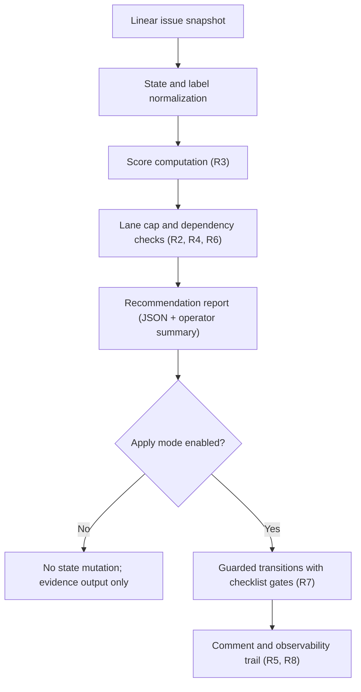

# Linear Triage System Rollout Plan

## Enhancement Summary

**Deepened on:** 2026-04-08  
**Mode:** targeted-confidence  
**Research execution mode:** direct  
**Key areas improved:** requirements-to-acceptance traceability, phase-gate verification, operational risk treatment

- Added an explicit traceability matrix mapping `R*` requirements to `P*` implementation units and `AC*` acceptance outcomes.
- Added phase entry/exit controls so sequencing and readiness checks are explicit before stateful write paths.
- Expanded risk handling into a concrete risk register with triggers, mitigations, and ownership signals for safer execution.
- Added metadata-readiness and fallback scoring controls so ranking/apply logic does not depend on template updates landing first.
- Added explicit mutation-path regression coverage for `src/lib/linear/automation.ts` and `src/lib/linear/client.ts`.

## Table of Contents
- [Overview](#overview)
- [Problem Frame](#problem-frame)
- [Plan Mode Decision](#plan-mode-decision)
- [Requirements Trace](#requirements-trace)
- [Traceability Matrix](#traceability-matrix)
- [Scope Boundaries](#scope-boundaries)
- [Context and Research](#context-and-research)
- [Key Technical Decisions](#key-technical-decisions)
- [Open Questions](#open-questions)
- [High-Level Technical Design](#high-level-technical-design)
- [Implementation Units](#implementation-units)
- [Phase Gate Criteria](#phase-gate-criteria)
- [System-Wide Impact](#system-wide-impact)
- [Risks and Dependencies](#risks-and-dependencies)
- [Documentation and Operational Notes](#documentation-and-operational-notes)
- [Outstanding Issue Snapshot](#outstanding-issue-snapshot)
- [Execution Ledger (Planning Mode)](#execution-ledger-planning-mode)
- [Sources and References](#sources-and-references)

## Overview

Implement the `tmp/LINEAR_TRIAGE.md` strategy as a repeatable, auditable triage system inside the harness workflow so issue pull-order, WIP limits, and dependency-aware sequencing are enforced consistently instead of handled ad hoc.

## Problem Frame

The `coding-harness` project currently has a high number of open issues concentrated in `Triage`, with no automated enforcement of the lane model, scoring rubric, or cycle cadence defined in the triage strategy. This causes avoidable context switching, inconsistent intake quality, and manual drift between documented policy and day-to-day issue handling.

## Plan Mode Decision

- **Selected mode:** `standard-plan`
- **Why:** this is cross-cutting workflow/governance work that touches command surface, docs policy, templates, and validation behavior, but does not require a dedicated UI execution branch.

## Requirements Trace

- **R1**: Preserve a deterministic issue-state workflow and avoid state drift from the canonical Linear lifecycle (`Triage/Ready/In Progress/In Review/Done` plus `Blocked` label convention).
  - Source: `tmp/LINEAR_TRIAGE.md` (Operating Rules, Lane Model), `docs/agents/13-linear-production-workflow.md`, `docs/agents/19-linear-templates.md`.
- **R2**: Enforce finish-before-start through explicit WIP limits by lane.
  - Source: `tmp/LINEAR_TRIAGE.md` (Operating Rules, Lane Model).
- **R3**: Apply a consistent scoring model so issue pull order is evidence-based.
  - Source: `tmp/LINEAR_TRIAGE.md` (Scoring Model).
- **R4**: Respect dependency-first execution and explicit wave sequencing.
  - Source: `tmp/LINEAR_TRIAGE.md` (Recommended Execution Sequence).
- **R5**: Keep Linear and Git metadata traceable to a single `JSC-*` key per active item.
  - Source: `tmp/LINEAR_TRIAGE.md` (Operating Rules), `docs/agents/13-linear-production-workflow.md`.
- **R6**: Preserve cycle realism by limiting promotion into active work to feasible throughput.
  - Source: `tmp/LINEAR_TRIAGE.md` (Cycle Cadence).
- **R7**: Keep triage quality consistent via a required checklist before status transition.
  - Source: `tmp/LINEAR_TRIAGE.md` (Triage Checklist), `src/templates/linear/*.md`.
- **R8**: Provide machine-readable outputs for agent workflows.
  - Source: `AGENTS.md` harness command JSON contract, existing command patterns in `src/lib/cli/command-registry.ts`.

## Traceability Matrix

| Requirement | Primary implementation units | Acceptance coverage |
| --- | --- | --- |
| R1 | P0, P5 | AC1, AC2, AC12 |
| R2 | P1, P2, P3 | AC4, AC6, AC7 |
| R3 | P1, P2, P4 | AC3, AC5, AC9 |
| R4 | P1, P2, P3 | AC4, AC6, AC7 |
| R5 | P0, P4, P5 | AC10, AC12 |
| R6 | P0, P2, P3 | AC2, AC6, AC7 |
| R7 | P3, P4 | AC8, AC9 |
| R8 | P2, P5 | AC5, AC11 |

## Scope Boundaries

- In scope:
  - Translate triage policy into a command-driven, testable harness flow.
  - Add deterministic scoring and lane-cap validation logic.
  - Add triage reporting output suitable for human and agent use.
  - Align Linear workflow docs/templates with the new triage operating model.
- Out of scope:
  - Bulk rewriting all existing Linear issue bodies in one migration pass.
  - Automatic closure/reprioritization of issues without explicit operator confirmation.
  - Changing fundamental project governance outside triage and intake quality controls.

## Context and Research

### Relevant Code and Patterns

- Existing Linear command and transition surface:
  - `src/commands/linear-workflow.ts`
  - `src/commands/linear-prepare.ts`
  - `src/commands/linear-sync.ts`
- Existing policy enforcement style:
  - `src/commands/linear-gate.ts`
  - `src/lib/output/normalise.ts`
- Existing command registry and action dispatch:
  - `src/lib/cli/command-registry.ts`

### Institutional Learnings

- Keep one Linear key across branch and PR metadata, and preserve `Refs JSC-*` linkage for in-progress work.
- Keep required check naming stable (`pr-pipeline`) and avoid introducing naming drift in workflow-oriented changes.

### External References

- None required for this planning pass (repo-local policy and workflow docs are sufficient).

## Key Technical Decisions

- **D1: Add triage as a first-class `harness linear triage` action instead of a separate top-level command.**
  - Rationale: keeps workflow actions under one command family and reuses existing Linear auth and dispatch ergonomics.
- **D2: Start with read-first mode and explicit apply mode.**
  - Rationale: avoid accidental mass state mutation; enforce deterministic preview before writes.
- **D3: Encode scoring and lane validation in isolated library modules with pure functions.**
  - Rationale: makes policy behavior testable and reusable across CLI, docs checks, and future automation.
- **D4: Treat `Blocked` as label-only, not a status.**
  - Rationale: consistent with existing team convention and compact workflow spec.
- **D5: Keep phase exits bound to verification gates (`pnpm test`, `pnpm check`, code-style validation).**
  - Rationale: ensures governance and command-contract safety while modifying operational control-plane behavior.
- **D6: Require explicit confirmation when apply mode mutates more than one issue.**
  - Rationale: reduces accidental bulk mutation risk while preserving deterministic operator control.

## Open Questions

### Resolved During Planning

- **Should triage be a new command family or a sub-action?**
  - Resolved to sub-action (`harness linear triage`) for consistency with existing `linear` workflow behavior.
- **Should automatic status moves happen by default?**
  - Resolved to no; default is report-only with explicit apply flags.

### Deferred to Implementation

- **Exact flag names for apply granularity (`--apply`, `--promote`, `--lane`)**.
  - Deferred because final naming should follow command-registry consistency review.
- **Whether cycle checks read cycle boundaries live from Linear or require explicit override input.**
  - Deferred pending implementation-time ergonomics and API constraints.
- **Exact metadata completeness threshold for allowing apply mode (`100%` strict vs bounded tolerance).**
  - Deferred pending implementation-time data-quality sampling against current issue inventory.

## High-Level Technical Design

Directional flow for triage lifecycle hardening:

Design constraints:
- Scoring and lane logic remain pure-library modules to keep behavior deterministic and testable.
- Mutation paths must be explicitly gated and produce evidence artifacts equivalent to dry-run recommendations.
- No background auto-triage loop is introduced in this scope; all mutations remain operator-triggered.

## Implementation Units

- [x] **P0 / Unit 1: Align canonical triage-state contract and policy mapping**

**Goal:** unify triage strategy terms with the canonical Linear workflow docs and command invariants.

**Requirements:** R1, R5, R6

**Dependencies:** None

**Files:**
- Modify: `docs/agents/13-linear-production-workflow.md`
- Modify: `docs/agents/16-linear-production-compact.md`
- Modify: `docs/agents/19-linear-templates.md`
- Optional Create: `docs/agents/20-linear-triage-strategy.md` (if a canonical triage strategy doc is needed)

**Approach:**
- Align lane terminology and status vocabulary to canonical state machine.
- Define explicit mapping for readiness transitions and blocked handling.
- Add cycle-feasibility guard language so triage promotion rules are policy-consistent.
- Treat `tmp/LINEAR_TRIAGE.md` as immutable origin evidence; do not use `tmp/` as a normative policy surface.

**Patterns to follow:**
- Workflow-state invariants in `docs/agents/13-linear-production-workflow.md`.
- Blocked label convention in `docs/agents/19-linear-templates.md`.

**Test scenarios:**
- Documentation consistency check: no contradictory status definitions across triage and workflow docs.
- State mapping check: every promoted path maps to existing workflow transitions.

**Verification:**
- Run docs lint/check steps used in repo validation (`pnpm check` as final aggregate gate).

**Exit criteria:**
- Canonical triage-state mapping documented and conflict-free across all touched docs.

**Acceptance items:**
- **AC1:** Status model is deterministic and aligned to canonical lifecycle (R1).
- **AC2:** Blocked handling remains label-based with explicit unblock action (R1, R6).

- [x] **P1 / Unit 2: Implement deterministic triage scoring engine**

**Goal:** encode the weighted scoring model into pure library logic with deterministic output.

**Requirements:** R2, R3, R4, R8

**Dependencies:** P0

**Files:**
- Create: `src/lib/linear/triage-scoring.ts`
- Create: `src/lib/linear/triage-scoring.test.ts`

**Approach:**
- Implement normalized score inputs (`impact`, `unblockValue`, `urgency`, `confidence`, `effort`) with strict bounds.
- Emit score plus band classification (`pull_now`, `next_pull`, `triage_hold`, `backlog_or_rescope`).
- Define fallback behavior when scoring metadata is missing (for example, deterministic default weighting plus explicit incompleteness flags).
- Emit metadata completeness metrics used later by apply-mode safety gates.
- Keep module side-effect free for easy reuse.

**Patterns to follow:**
- Pure utility style in `src/lib/linear/utils.ts`.
- Existing test style in `src/lib/linear/utils.test.ts`.

**Test scenarios:**
- Boundary values (min/max) produce expected score bands.
- Invalid input range is rejected deterministically.
- Ranking order is stable for identical inputs.
- Missing metadata path remains deterministic and explicitly marked in output.

**Verification:**
- Targeted tests for new module, then full `pnpm test`.

**Exit criteria:**
- Score engine is deterministic, typed, and fully unit-tested.

**Acceptance items:**
- **AC3:** Weighted scoring formula is implemented exactly once and centrally reusable (R3).
- **AC4:** Score band output supports deterministic pull-order decisions (R2, R4).

- [x] **P2 / Unit 3: Add `harness linear triage` command surface (report-first)**

**Goal:** expose triage analysis as machine-readable and human-readable CLI output.

**Requirements:** R3, R4, R6, R8

**Dependencies:** P1

**Files:**
- Create: `src/commands/linear-triage.ts`
- Create: `src/commands/linear-triage.test.ts`
- Modify: `src/lib/cli/command-registry.ts`
- Modify: `src/cli-dispatch.test.ts`
- Modify: `src/cli.ts` (usage text if command help rows need updated examples)

**Approach:**
- Add `triage` action under `linear` command family.
- Provide report mode with JSON envelope for agents and markdown/text summary for operators.
- Include per-lane WIP check results, top triage candidates, and dependency warnings.
- Include metadata completeness and apply-readiness signals in report output so operators can see why an issue is or is not promotable.

**Patterns to follow:**
- Action dispatch conventions in `src/lib/cli/command-registry.ts` for `linear` actions.
- JSON envelope conventions used in `src/commands/linear-gate.ts`.

**Test scenarios:**
- `linear triage --json` emits structured status and ranked issue output.
- Missing token / missing issue data returns validation errors with stable codes.
- Unknown action routing remains unchanged for other linear actions.
- Report output includes deterministic metadata completeness and fallback-scoring indicators.

**Verification:**
- `pnpm test -- src/commands/linear-triage.test.ts src/cli-dispatch.test.ts`
- `pnpm test`

**Exit criteria:**
- Triage report command is available, deterministic, and registry-dispatched.

**Acceptance items:**
- **AC5:** Machine-readable triage report is available for automation and agent workflows (R8).
- **AC6:** Report output includes lane/WIP/dependency signals to support dependency-first sequencing (R2, R4, R6).

- [x] **P3 / Unit 4: Add guarded apply workflow for status promotion recommendations**

**Goal:** allow controlled triage-to-active promotion with safety guards and explicit limits.

**Requirements:** R2, R4, R6, R7

**Dependencies:** P2, P4

**Files:**
- Modify: `src/commands/linear-triage.ts`
- Modify: `src/lib/linear/automation.ts`
- Modify: `src/lib/linear/client.ts`
- Create: `src/lib/linear/triage-lanes.ts`
- Create: `src/lib/linear/triage-lanes.test.ts`

**Approach:**
- Implement apply mode with explicit cap controls (for example, maximum issues moved per run).
- Enforce lane WIP limits and cycle-feasibility checks before any transition write.
- Enforce metadata completeness guard before promotion writes (threshold defined by implementation decision record).
- Require explicit confirmation when mutating more than one issue in a single apply run.
- Post a single deterministic summary comment/evidence trail for each apply run.

**Patterns to follow:**
- Update/comment semantics in `src/commands/linear-workflow.ts`.
- Idempotency intent from `src/commands/linear-sync.ts`.

**Test scenarios:**
- Apply run blocked when lane cap is already reached.
- Apply run blocked when issue fails checklist prerequisites.
- Dry-run and apply outputs show identical recommendations except write effects.
- Apply run blocked when metadata completeness is below threshold.
- Apply run blocked without explicit confirmation for multi-issue mutation paths.
- Regression coverage for touched mutation modules in `src/lib/linear/automation.ts` and `src/lib/linear/client.ts`.

**Verification:**
- Focused unit/integration tests for lane enforcement and mutation-path safeguards.
- Targeted regression tests for `src/lib/linear/automation.ts` and `src/lib/linear/client.ts`.
- Full `pnpm test` and `pnpm check`.

**Exit criteria:**
- Apply workflow is fail-closed and cannot exceed configured WIP/cycle guards.

**Acceptance items:**
- **AC7:** Promotion into active work is limited by explicit lane and cycle guards (R2, R6).
- **AC8:** Checklist gating is enforced before status mutation (R7).

- [x] **P4 / Unit 5: Strengthen templates and operational docs for triage quality**

**Goal:** make issue creation and triage updates consistently capture scoring and dependency metadata.

**Requirements:** R5, R7

**Dependencies:** P0

**Files:**
- Modify: `src/templates/linear/feature.md`
- Modify: `src/templates/linear/bug.md`
- Modify: `src/templates/linear/research.md`
- Modify: `src/templates/linear/automation.md`
- Modify: `docs/agents/19-linear-templates.md`

**Approach:**
- Add triage-oriented fields: impact, unblock value, urgency, confidence, effort, dependencies, pull-condition.
- Ensure templates reinforce one active progress thread and linkage expectations.
- Define metadata completeness requirements that downstream scoring/apply phases consume as hard gates.

**Patterns to follow:**
- Existing template structure in `src/templates/linear/*.md`.
- Label/state guidance in `docs/agents/19-linear-templates.md`.

**Test scenarios:**
- Template content includes all triage checklist controls.
- Documentation references remain internally consistent with workflow docs.

**Verification:**
- Docs/template checks through repo validation (`pnpm check`).

**Exit criteria:**
- Linear templates encode minimum triage-quality bar for new and revised issues.

**Acceptance items:**
- **AC9:** Issue templates capture enough metadata for deterministic scoring and prioritization (R3, R7).
- **AC10:** Traceability requirements remain explicit in templates and docs (R5).

- [x] **P5 / Unit 6: Rollout, observability, and governance hardening**

**Goal:** make triage operations auditable and safe to run repeatedly.

**Requirements:** R1, R5, R8

**Dependencies:** P2, P3, P4

**Files:**
- Modify: `docs/agents/04-validation.md` (if new command requires explicit gate mention)
- Modify: `docs/agents/13-linear-production-workflow.md`
- Modify: `docs/agents/16-linear-production-compact.md`
- Modify: `.harness/ci-required-checks.json` (only if triage command becomes required in CI policy)

**Approach:**
- Add runbook notes for triage cadence, dry-run-first enforcement, and failure handling.
- Define auditable output fields for each triage run.
- Keep required-check naming continuity if CI integration is added.

**Patterns to follow:**
- Required check naming continuity expectations from existing CI/workflow docs.
- Existing observability log structure in `docs/agents/13-linear-production-workflow.md`.

**Test scenarios:**
- Triage run outputs include stable correlation fields.
- CI docs and required-check config remain aligned (if changed).

**Verification:**
- `pnpm check`
- `bash scripts/validate-codestyle.sh`
- `bash scripts/verify-work.sh`

**Exit criteria:**
- Triage system has documented runbook and observable evidence trail for each run.

**Acceptance items:**
- **AC11:** Triage runs are auditable and repeatable with stable output contracts (R8).
- **AC12:** Workflow/governance docs reflect final triage operating model without contradictions (R1, R5).

## Phase Gate Criteria

| Phase | Entry criteria | Exit criteria |
| --- | --- | --- |
| P0 | Baseline triage strategy and workflow docs are available and consistent enough to map. | Canonical state, blocked, and cycle semantics reconciled across triage/workflow docs. |
| P1 | P0 completed and requirement vocabulary locked. | Score engine produces deterministic classification with full unit coverage and metadata-fallback behavior. |
| P2 | P1 score output contract stable. | `linear triage` report path emits machine-readable + human-readable output with deterministic ranking and readiness signals. |
| P3 | P2 report semantics stable and P4 metadata contract complete. | Apply mode remains fail-closed under lane caps, checklist failures, metadata-incompleteness, and cycle infeasibility. |
| P4 | P0 canonical policy mapping finalized. | Templates encode triage metadata and checklist quality controls without policy contradiction. |
| P5 | P2-P4 complete with stable output contracts. | Operational docs, observability schema, and governance gates align with implemented behavior. |

Cross-phase controls:
- Any state mutation feature remains blocked until dry-run and apply recommendations match on selection logic.
- Any state mutation feature remains blocked until metadata completeness thresholds are satisfied.
- Multi-issue mutations require explicit confirmation.
- CI-required-check changes are optional and may proceed only if check-name continuity remains intact.
- If command output schema changes in P2/P3, update normalization/consumer tests in the same phase before advancing.

## System-Wide Impact

- **Interaction graph:** extends existing Linear action surface (`prepare`, `claim`, `handoff`, `close`, `sync`) with triage analysis and guarded promotion behavior.
- **Error propagation:** triage validation failures should follow existing command error envelope conventions and fail-closed semantics.
- **State lifecycle risks:** over-promotion into active lanes, stale dependency metadata, and silent divergence between docs and live behavior.
- **API surface parity:** command registry help text, CLI dispatch tests, and machine-readable output shape must remain aligned.
- **Integration coverage:** command-level tests plus linear client abstraction tests are required; unit tests alone are insufficient for guarded apply behavior.

## Risks and Dependencies

| Risk | Trigger | Mitigation | Ownership signal |
| --- | --- | --- | --- |
| Linear API field shape drift | Unexpected null/missing fields in issue payloads | Validate and normalize inputs before scoring; fail closed with actionable error output | P2 |
| Rate-limit pressure during batch triage | High issue counts or rapid repeated runs | Default to top-candidate scoring window and bounded apply count | P2/P3 |
| Score fidelity degradation from low-quality issue metadata | Missing acceptance criteria/dependency fields in issue bodies | Template hardening plus checklist enforcement before promotion | P4 |
| Policy drift between docs and command behavior | Docs updated without command parity or vice versa | Keep P0 and P5 as explicit sync gates with contradiction checks | P0/P5 |
| Concurrent operator mutation races | Manual status changes during apply run | Re-fetch state before write, enforce idempotent guard checks, and surface skipped items | P3 |
| Required-check contract breakage | Introducing triage check names that diverge from current CI contract | Keep triage CI integration optional and preserve existing check naming rules | P5 |

Dependencies:
- Stable Linear auth and API access for triage read/apply flows.
- Existing `linear` command family output conventions for schema continuity.
- Team adoption of updated templates/checklist fields to sustain score quality.

## Documentation and Operational Notes

- Keep triage cadence lightweight: score only top candidate set by default, not all issues every run.
- Maintain one active progress update thread per issue to avoid audit fragmentation.
- If apply-mode mutation is enabled, require explicit operator intent in command flags and run logs.
- Capture rollout decision in `docs/agents/13-linear-production-workflow.md` before making triage apply path default.

## Outstanding Issue Snapshot

Snapshot captured on `2026-04-09` from Linear (`project: coding-harness`, non-terminal states only):

- `In Progress` (5): `JSC-131`, `JSC-96`, `JSC-135`, `JSC-127`, `JSC-134`
- `In Review` (2): `JSC-115`, `JSC-130`
- `Todo` (1): `JSC-112`
- `Triage` (17): `JSC-128`, `JSC-122`, `JSC-129`, `JSC-125`, `JSC-132`, `JSC-126`, `JSC-124`, `JSC-121`, `JSC-120`, `JSC-109`, `JSC-108`, `JSC-107`, `JSC-106`, `JSC-116`, `JSC-114`, `JSC-104`, `JSC-87`
- `Backlog` (4): `JSC-159`, `JSC-158`, `JSC-157`, `JSC-156`

Total outstanding issues tracked in this snapshot: `29`.

## Execution Ledger (Planning Mode)

STEP_ID | status (pending|in_progress|completed) | owner | evidence
P0 | completed | codex | Canonical state/blocked/cycle semantics reconciled across `docs/agents/13-linear-production-workflow.md`, `docs/agents/16-linear-production-compact.md`, and `docs/agents/19-linear-templates.md`; outstanding issue snapshot refreshed on `2026-04-09` (`29` non-terminal issues).
P1 | completed | codex | Deterministic scoring module and tests landed in `src/lib/linear/triage-scoring.ts` and `src/lib/linear/triage-scoring.test.ts`.
P2 | completed | codex | `harness linear triage` command/report path and dispatch coverage landed in `src/commands/linear-triage.ts`, `src/commands/linear-triage.test.ts`, and `src/cli-dispatch.test.ts`.
P3 | completed | codex | Guarded apply path now enforces metadata/dependency/WIP gates plus cycle-throughput guard rails in `src/commands/linear-triage.ts` and `src/lib/linear/triage-lanes.ts` with coverage in `src/lib/linear/triage-lanes.test.ts`.
P4 | completed | codex | Triage metadata expectations and label hygiene are encoded in `src/templates/linear/*.md` and reflected in `docs/agents/19-linear-templates.md`.
P5 | completed | codex | Validation/runbook and operational semantics are aligned in `docs/agents/04-validation.md`, `docs/agents/13-linear-production-workflow.md`, and `docs/agents/16-linear-production-compact.md`.

## Sources and References

- Origin document: `tmp/LINEAR_TRIAGE.md`
- Workflow policy: `docs/agents/13-linear-production-workflow.md`
- Compact workflow spec: `docs/agents/16-linear-production-compact.md`
- Linear templates and blocked routing: `docs/agents/19-linear-templates.md`
- Command registry and dispatch patterns: `src/lib/cli/command-registry.ts`, `src/cli.ts`
- Existing Linear command implementations: `src/commands/linear-workflow.ts`, `src/commands/linear-sync.ts`, `src/commands/linear-gate.ts`
